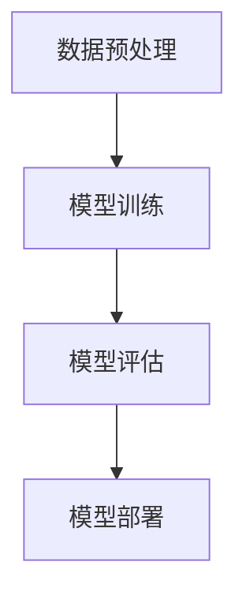
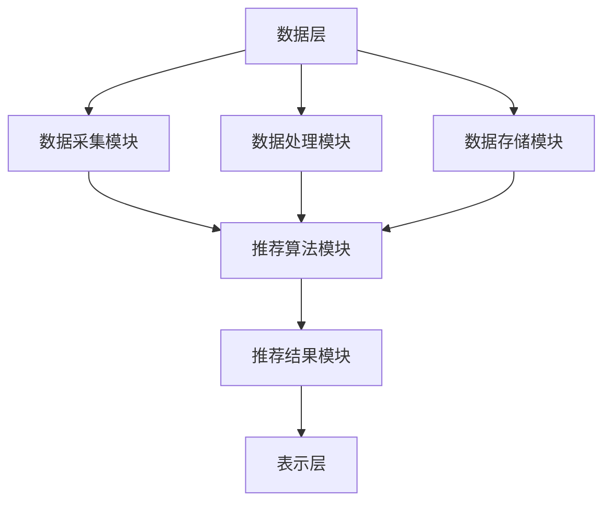
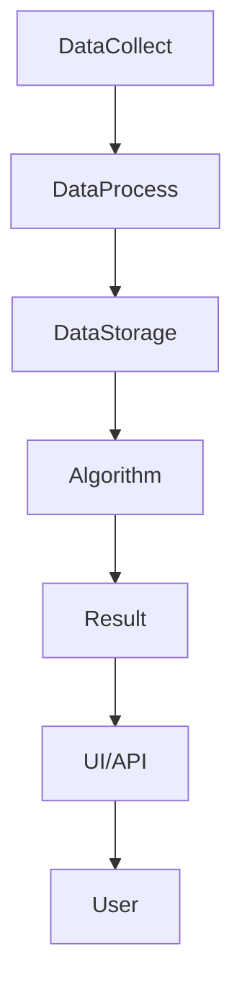

                 

### AI驱动的软件开发：机遇与挑战

> 关键词：人工智能，软件开发，机器学习，深度学习，神经网络，算法原理

> 摘要：本文将深入探讨AI驱动的软件开发，分析其背后的机遇与挑战。我们将从背景介绍、核心概念与联系、AI驱动的软件开发原理、系统分析与架构设计方案、项目实战等多个角度，系统地讲解AI驱动的软件开发，帮助读者全面理解这一领域的最新动态和应用实践。

----------------------------------------------------------------

## 第一部分：背景介绍

### 1.1 引言

随着人工智能技术的飞速发展，AI驱动的软件开发已成为行业变革的重要驱动力。传统的软件开发模式已经无法满足日益增长的数据量和复杂的应用需求，AI技术的引入为软件开发带来了新的机遇和挑战。

AI驱动的软件开发涉及多个领域的技术融合，包括机器学习、自然语言处理、计算机视觉等。在这样复杂的背景下，如何有效地利用AI技术进行软件开发，成为当前软件开发面临的一个重要问题。

本书旨在通过深入剖析AI驱动的软件开发，提供一套系统的理论框架和实践方法，帮助读者理解和掌握AI技术在软件开发中的应用，从而解决软件开发中的各种挑战。

### 1.1.1 问题背景

AI驱动的软件开发起源于机器学习的兴起。随着计算能力的提升和数据量的激增，机器学习技术在图像识别、自然语言处理、推荐系统等领域的应用取得了显著的成果。这些成功案例激发了开发者对AI驱动的软件开发的兴趣，促使他们在软件开发中引入AI技术。

然而，AI驱动的软件开发并非一帆风顺。开发者面临着数据质量、算法选择、模型调优等诸多挑战。同时，AI技术的快速迭代也要求开发者不断更新知识和技能，以适应不断变化的技术环境。

### 1.1.2 问题描述

AI驱动的软件开发中的关键问题主要包括：

1. **数据质量**：机器学习模型的性能高度依赖于数据质量，开发者需要确保数据源的可靠性和多样性。
2. **算法选择**：不同的应用场景需要选择不同的算法，开发者需要具备一定的算法知识，以便选择合适的算法。
3. **模型调优**：模型参数的调优是提高模型性能的关键，开发者需要具备一定的调优技巧。
4. **实时性**：某些应用场景要求实时处理数据，开发者需要优化算法和系统架构，以实现实时响应。
5. **可解释性**：AI模型通常被视为“黑盒”，其决策过程缺乏可解释性，开发者需要提高模型的透明度，以便用户理解和信任。

### 1.1.3 问题解决

为了解决上述问题，本书将从以下几个方面展开讨论：

1. **数据质量**：介绍数据预处理技术，包括数据清洗、数据增强、特征工程等。
2. **算法选择**：分析不同算法的特点和应用场景，帮助开发者选择合适的算法。
3. **模型调优**：介绍模型调优的方法，包括超参数调优、优化算法选择等。
4. **实时性**：探讨如何优化算法和系统架构，实现实时数据处理。
5. **可解释性**：介绍可解释性模型和解释性工具，提高模型的透明度。

通过以上方法，开发者可以更好地利用AI技术进行软件开发，解决实际应用中的各种挑战。

### 1.1.4 边界与外延

本文讨论的AI驱动的软件开发主要关注以下几个领域：

1. **机器学习**：包括监督学习、无监督学习和强化学习等。
2. **深度学习**：基于神经网络的深度学习算法，如卷积神经网络（CNN）和循环神经网络（RNN）。
3. **自然语言处理**：文本分类、情感分析、机器翻译等。
4. **计算机视觉**：图像识别、目标检测、人脸识别等。

本文将不涉及以下内容：

1. **AI伦理**：虽然AI技术在伦理方面具有重要意义，但本文将聚焦于技术层面。
2. **AI硬件**：如GPU、TPU等硬件设备，虽然对AI应用有重要影响，但本文将不进行深入讨论。

### 1.1.5 概念结构与核心要素组成

AI驱动的软件开发涉及多个核心概念，包括机器学习、深度学习、神经网络等。这些概念相互作用，共同构成了AI驱动的软件开发的理论基础。

1. **机器学习**：提供了一种使计算机能够从数据中学习并做出预测或决策的技术。
2. **深度学习**：是机器学习的一种方法，通过构建深度神经网络来模拟人类大脑的神经结构，从而进行高效的数据处理和模式识别。
3. **神经网络**：是深度学习的基础，由大量简单处理单元（神经元）互联而成的复杂网络，用于模拟生物神经系统的工作方式。

在AI驱动的软件开发中，核心要素还包括数据预处理、模型训练、模型评估、模型部署等环节。这些环节相互作用，共同构成了一个完整的AI驱动的软件开发流程。

## 第一部分：背景介绍（续）

### 1.2 AI驱动的软件开发的历史与发展

AI驱动的软件开发的历史可以追溯到20世纪50年代，当时人工智能（AI）的概念被提出。早期的AI研究主要集中在符号主义方法，即通过编写大量的规则和逻辑推理来模拟人类的智能。然而，这种方法在处理复杂数据时表现不佳，导致AI研究在20世纪80年代遭遇了“AI寒冬”。

随着计算能力的提升和互联网的普及，数据量急剧增加，机器学习技术逐渐成为AI研究的热点。1997年，IBM的深蓝（Deep Blue）击败了国际象棋世界冠军加里·卡斯帕罗夫，标志着机器学习在特定领域的成功应用。此后，机器学习技术在图像识别、语音识别、自然语言处理等领域取得了显著的进展。

深度学习的兴起标志着AI驱动的软件开发的又一次重大突破。深度学习通过构建多层神经网络，能够自动提取数据中的特征，从而实现更高效的模式识别和预测。2012年，深度学习在ImageNet图像识别竞赛中取得了突破性的成果，使得深度学习在计算机视觉领域得到了广泛应用。

随着AI驱动的软件开发技术的不断发展，越来越多的应用场景被发掘出来。自动驾驶、智能家居、智能医疗、金融科技等领域都受到了AI驱动的软件开发的深刻影响。AI驱动的软件开发不仅提高了软件的性能和效率，还带来了全新的商业模式和用户体验。

### 1.3 AI驱动的软件开发的应用场景

AI驱动的软件开发在多个领域展现了其强大的应用潜力。以下是几个典型的应用场景：

1. **计算机视觉**：图像识别、目标检测、人脸识别等技术在安防、医疗、零售等领域得到了广泛应用。例如，自动驾驶汽车利用计算机视觉技术进行路况识别和障碍物检测，从而实现自主驾驶。

2. **自然语言处理**：文本分类、情感分析、机器翻译等技术被广泛应用于搜索引擎、智能客服、智能助理等领域。例如，搜索引擎利用自然语言处理技术对用户查询进行语义理解，从而提供更准确的搜索结果。

3. **推荐系统**：基于协同过滤和深度学习等技术，推荐系统为用户提供个性化的推荐服务。例如，电子商务平台利用推荐系统向用户推荐可能感兴趣的商品，从而提高用户满意度和销售额。

4. **智能医疗**：通过分析患者数据，智能医疗系统能够提供精准的诊断和治疗建议。例如，基于深度学习技术的医学图像分析系统能够帮助医生更准确地诊断疾病，提高医疗水平。

5. **金融科技**：AI驱动的软件开发在金融领域得到了广泛应用，包括风险控制、投资决策、客户服务等方面。例如，金融科技公司利用机器学习技术进行信用评估和风险控制，从而降低坏账率。

这些应用场景展示了AI驱动的软件开发在提升软件性能、优化业务流程、提高用户体验等方面的巨大潜力。然而，AI驱动的软件开发也面临着一系列挑战，需要不断探索和完善。

### 1.4 AI驱动的软件开发的挑战

尽管AI驱动的软件开发在许多领域取得了显著成果，但开发者仍面临一系列挑战：

1. **数据质量**：机器学习模型的性能高度依赖于数据质量，开发者需要确保数据源的可靠性和多样性。然而，数据质量问题是AI驱动的软件开发中的一大难题，如数据缺失、噪声数据、数据分布不均等问题都会影响模型的性能。

2. **算法选择**：不同的应用场景需要选择不同的算法，开发者需要具备一定的算法知识，以便选择合适的算法。然而，现有的算法种类繁多，开发者往往难以选择最合适的算法。

3. **模型调优**：模型参数的调优是提高模型性能的关键，开发者需要具备一定的调优技巧。然而，调优过程往往需要大量的时间和计算资源，同时还需要对算法和模型有深刻的理解。

4. **实时性**：某些应用场景要求实时处理数据，开发者需要优化算法和系统架构，以实现实时响应。然而，实时数据处理面临着复杂的计算和数据传输挑战。

5. **可解释性**：AI模型通常被视为“黑盒”，其决策过程缺乏可解释性，开发者需要提高模型的透明度，以便用户理解和信任。然而，提高模型可解释性是一个具有挑战性的问题，需要在保证模型性能的同时提供清晰的解释。

6. **安全性和隐私**：AI驱动的软件开发涉及大量的敏感数据，如个人隐私、商业机密等。开发者需要确保系统的安全性和隐私保护，以防止数据泄露和滥用。

7. **伦理和法律**：AI驱动的软件开发在伦理和法律方面面临诸多争议，如算法偏见、隐私侵犯等问题。开发者需要关注伦理和法律问题，确保系统的公正性和合法性。

面对这些挑战，开发者需要不断学习和实践，掌握AI驱动的软件开发的核心技术和方法，以提高软件开发的质量和效率。同时，相关组织和机构也需要制定相应的标准和规范，为AI驱动的软件开发提供指导和保障。

## 第二部分：核心概念与联系

### 2.1 AI驱动的软件开发概念

AI驱动的软件开发是一个涉及多个核心概念的综合体系。理解这些概念对于掌握AI驱动的软件开发至关重要。

#### 2.1.1 机器学习

机器学习是一种使计算机能够从数据中学习并做出预测或决策的技术。其核心思想是通过训练数据集来调整模型的参数，从而使模型能够对新的数据进行预测。

- **定义**：机器学习是一种使计算机能够从数据中学习并做出预测或决策的技术。
- **属性**：自动化、自我优化、高效处理大规模数据。

#### 2.1.2 深度学习

深度学习是机器学习的一种方法，通过构建深度神经网络来模拟人类大脑的神经结构，从而进行高效的数据处理和模式识别。

- **定义**：深度学习是机器学习的一种方法，通过构建深度神经网络来模拟人类大脑的神经结构，从而进行高效的数据处理和模式识别。
- **属性**：层次化、并行计算、自适应调整。

#### 2.1.3 神经网络

神经网络是由大量简单处理单元（神经元）互联而成的复杂网络，用于模拟生物神经系统的工作方式。

- **定义**：神经网络是由大量简单处理单元（神经元）互联而成的复杂网络，用于模拟生物神经系统的工作方式。
- **属性**：层次化、自适应、分布式计算。

### 2.2 AI驱动的软件开发核心概念联系图

为了更好地理解AI驱动的软件开发的核心概念，我们可以使用ER（实体关系）图来展示它们之间的关系。

#### 2.2.1 AI驱动的软件开发ER实体关系图

```mermaid
erDiagram
  MachineLearning ||--|{ DepthLearning : extends }
  DepthLearning ||--|{ NeuralNetwork : extends }
  MachineLearning ||--|{ DataProcessing : includes }
  NeuralNetwork ||--|{ FeatureExtraction : includes }
  DepthLearning ||--|{ ModelTraining : includes }
```

在这个ER图中，机器学习、深度学习和神经网络是核心实体，它们之间的关系如下：

- 机器学习是深度学习的基础，深度学习通过构建深度神经网络来扩展机器学习的能力。
- 机器学习和深度学习都涉及数据处理和特征提取，神经网络是实现这些功能的核心技术。
- 深度学习还包含模型训练，这是实现高效数据处理和模式识别的关键步骤。

### 2.3 AI驱动的软件开发核心概念对比表

为了更直观地展示AI驱动的软件开发的核心概念，我们可以使用对比表来列出每个概念的定义、属性和关联关系。

| 核心概念 | 定义 | 属性 | 关联关系 |
| --- | --- | --- | --- |
| 机器学习 | 从数据中学习并做出预测或决策 | 自动化、自我优化、高效处理大规模数据 | 基础技术 |
| 深度学习 | 基于神经网络的机器学习方法 | 层次化、并行计算、自适应调整 | 机器学习的扩展 |
| 神经网络 | 由神经元互联而成的复杂网络 | 层次化、自适应、分布式计算 | 基础技术 |

通过这个对比表，我们可以清楚地看到各个核心概念的定义、属性和关联关系，有助于深入理解AI驱动的软件开发。

## 第三部分：AI驱动的软件开发原理

### 3.1 算法原理讲解

AI驱动的软件开发的核心在于算法原理，这些算法使得计算机能够从数据中学习并做出预测或决策。以下是对AI驱动的软件开发中的主要算法原理的详细讲解。

#### 3.1.1 算法概述

AI驱动的软件开发主要依赖于机器学习和深度学习算法。这些算法的核心原理是通过对大量数据进行训练，使得计算机能够自主学习和改进，从而完成特定的任务。

算法的基本流程包括数据预处理、模型训练、模型评估和模型部署。首先，通过对原始数据进行预处理，如数据清洗、特征提取等，以提高算法的性能。然后，使用训练数据集对模型进行训练，不断调整模型参数，使模型能够更好地拟合数据。在模型评估阶段，使用验证数据集对训练好的模型进行评估，以确定模型的准确性和泛化能力。最后，将训练好的模型部署到实际应用中，进行预测和决策。

#### 3.1.2 算法流程

算法的流程可以概括为以下几个步骤：

1. **数据预处理**：对输入数据进行清洗、转换和归一化，以提高算法的性能。这一步骤包括数据清洗（去除噪声数据、缺失值填充）、数据转换（特征提取、特征缩放）和数据归一化（标准化、归一化）。

2. **模型训练**：使用训练数据集对模型进行训练，不断调整模型参数，使模型能够更好地拟合数据。这一步骤包括选择合适的模型结构、初始化模型参数、迭代更新模型参数等。

3. **模型评估**：使用验证数据集对训练好的模型进行评估，以确定模型的准确性和泛化能力。常用的评估指标包括准确率、召回率、F1值等。

4. **模型部署**：将训练好的模型部署到实际应用中，进行预测和决策。这一步骤包括模型部署、预测结果输出和应用系统集成。

#### 3.1.3 算法原理图

为了更直观地理解算法原理，我们可以使用Mermaid流程图来展示算法的流程。



在这个流程图中，数据预处理是算法流程的第一步，模型训练是核心步骤，模型评估用于评估模型性能，模型部署则是将模型应用于实际场景。

#### 3.1.4 数学模型和数学公式

在机器学习和深度学习算法中，核心的数学模型包括损失函数、优化算法等。以下是对这些数学模型的详细讲解。

1. **损失函数**：损失函数用于衡量模型预测值与真实值之间的差距。常用的损失函数包括均方误差（MSE）、交叉熵（Cross-Entropy）等。

   - 均方误差（MSE）：
     $$MSE = \frac{1}{m}\sum_{i=1}^{m}(y^{(i)} - \hat{y}^{(i)})^2$$
     其中，\(y^{(i)}\) 是真实值，\(\hat{y}^{(i)}\) 是预测值，\(m\) 是样本数量。

   - 交叉熵（Cross-Entropy）：
     $$H(y, \hat{y}) = -\sum_{i=1}^{m} y^{(i)} \log(\hat{y}^{(i)})$$
     其中，\(y^{(i)}\) 是真实值，\(\hat{y}^{(i)}\) 是预测概率。

2. **优化算法**：优化算法用于最小化损失函数，常见的优化算法包括梯度下降（Gradient Descent）、随机梯度下降（Stochastic Gradient Descent，SGD）等。

   - 梯度下降（Gradient Descent）：
     $$\theta_{\text{new}} = \theta_{\text{old}} - \alpha \nabla_{\theta}J(\theta)$$
     其中，\(\theta_{\text{old}}\) 是当前模型参数，\(\theta_{\text{new}}\) 是更新后的模型参数，\(\alpha\) 是学习率，\(\nabla_{\theta}J(\theta)\) 是损失函数关于模型参数的梯度。

   - 随机梯度下降（SGD）：
     $$\theta_{\text{new}} = \theta_{\text{old}} - \alpha \nabla_{\theta}J(\theta^{(i)})$$
     其中，\(J(\theta^{(i)})\) 是关于第 \(i\) 个样本的损失函数。

通过上述数学模型和数学公式，我们可以更深入地理解机器学习和深度学习算法的原理。

#### 3.1.5 举例说明

为了更好地理解上述算法原理，我们可以通过一个简单的例子来说明。

假设我们有一个二元分类问题，数据集包含 \(m\) 个样本，每个样本有 \(n\) 个特征。我们的目标是训练一个模型，能够预测每个样本属于正类还是负类。

1. **数据预处理**：我们对数据进行预处理，包括数据清洗、特征提取和归一化。例如，我们将缺失值填充为平均值，将特征值缩放到0-1范围内。

2. **模型训练**：我们选择一个简单的逻辑回归模型，其损失函数为交叉熵。使用随机梯度下降算法进行模型训练。在每次迭代中，我们随机选择一个样本，计算其损失函数的梯度，并更新模型参数。

3. **模型评估**：我们使用验证集对训练好的模型进行评估，计算准确率、召回率和F1值等指标，以确定模型的性能。

4. **模型部署**：将训练好的模型部署到实际应用中，对新的样本进行预测，输出属于正类或负类的概率。

通过这个简单的例子，我们可以看到机器学习和深度学习算法的基本原理和步骤。在实际应用中，算法的复杂度和数据处理量会更大，但基本原理是相似的。

### 3.2 机器学习算法原理

机器学习算法是AI驱动的软件开发的基础，其核心思想是通过训练数据集来调整模型的参数，使得模型能够对新的数据进行预测。以下是对几种常见机器学习算法的原理讲解。

#### 3.2.1 线性回归

线性回归是一种简单的机器学习算法，用于预测连续值。其基本原理是通过建立线性模型来拟合数据。

- **模型**：
  $$y = \theta_0 + \theta_1x_1 + \theta_2x_2 + \ldots + \theta_nx_n$$
  其中，\(y\) 是预测值，\(x_1, x_2, \ldots, x_n\) 是特征值，\(\theta_0, \theta_1, \theta_2, \ldots, \theta_n\) 是模型参数。

- **损失函数**：
  $$J(\theta) = \frac{1}{2m}\sum_{i=1}^{m}(y_i - \hat{y}_i)^2$$
  其中，\(y_i\) 是真实值，\(\hat{y}_i\) 是预测值，\(m\) 是样本数量。

- **优化算法**：
  使用梯度下降算法来最小化损失函数。

通过线性回归，我们可以预测新的数据点的值。例如，我们可以使用线性回归模型来预测房价，输入特征包括房屋面积、卧室数量等。

#### 3.2.2 逻辑回归

逻辑回归是一种用于分类问题的机器学习算法，其基本原理是通过建立逻辑模型来拟合数据。

- **模型**：
  $$\hat{y} = \frac{1}{1 + e^{-(\theta_0 + \theta_1x_1 + \theta_2x_2 + \ldots + \theta_nx_n)}}$$
  其中，\(\hat{y}\) 是预测概率，\(x_1, x_2, \ldots, x_n\) 是特征值，\(\theta_0, \theta_1, \theta_2, \ldots, \theta_n\) 是模型参数。

- **损失函数**：
  $$J(\theta) = -\frac{1}{m}\sum_{i=1}^{m}[y_i\log(\hat{y}_i) + (1 - y_i)\log(1 - \hat{y}_i)]$$
  其中，\(y_i\) 是真实值，\(\hat{y}_i\) 是预测概率。

- **优化算法**：
  使用梯度下降算法来最小化损失函数。

通过逻辑回归，我们可以预测新的数据点属于正类还是负类。例如，我们可以使用逻辑回归模型来预测邮件是否为垃圾邮件，输入特征包括邮件内容、发件人等。

#### 3.2.3 决策树

决策树是一种常用的分类算法，其基本原理是通过一系列的决策规则来划分数据。

- **模型**：
  决策树由一系列条件节点和叶子节点组成。每个条件节点表示一个特征和对应的阈值，叶子节点表示一个类别。

- **损失函数**：
  决策树通常使用信息增益、基尼不纯度等指标来评估节点划分的质量。

- **优化算法**：
  决策树通常使用递归二分划分算法来构建树。

通过决策树，我们可以预测新的数据点的类别。例如，我们可以使用决策树模型来预测客户是否愿意购买某个产品，输入特征包括客户年龄、收入等。

#### 3.2.4 集成学习方法

集成学习方法是将多个基本模型组合起来，以提高预测性能。常见的集成学习方法包括Bagging、Boosting等。

- **Bagging**：
  Bagging（Bootstrap Aggregating）方法通过多次抽样训练多个基本模型，然后取它们的平均值或多数值作为最终预测结果。

- **Boosting**：
  Boosting方法通过迭代训练多个基本模型，每次迭代都关注之前预测错误的样本，并增加这些样本的权重，从而提高预测性能。

通过集成学习方法，我们可以提高模型的预测性能。例如，我们可以使用集成学习方法来提高分类器的准确性，输入特征包括不同类型的特征提取器。

### 3.3 深度学习算法原理

深度学习算法是AI驱动的软件开发的先进技术，通过构建深度神经网络来实现高效的数据处理和模式识别。以下是对几种常见深度学习算法的原理讲解。

#### 3.3.1 卷积神经网络（CNN）

卷积神经网络是一种专门用于处理图像数据的深度学习算法，其基本原理是通过卷积层、池化层和全连接层来提取图像特征。

- **模型**：
  卷积神经网络由多个卷积层、池化层和全连接层组成。卷积层用于提取图像特征，池化层用于降低特征图的维度，全连接层用于分类或回归。

- **损失函数**：
  卷积神经网络通常使用交叉熵损失函数来评估模型的性能。

- **优化算法**：
  卷积神经网络通常使用反向传播算法来更新模型参数。

通过卷积神经网络，我们可以对图像进行分类或识别。例如，我们可以使用卷积神经网络来识别手写数字，输入特征包括像素值。

#### 3.3.2 循环神经网络（RNN）

循环神经网络是一种用于处理序列数据的深度学习算法，其基本原理是通过递归结构来处理序列数据。

- **模型**：
  循环神经网络由输入层、隐藏层和输出层组成。隐藏层通过递归连接来处理序列数据，从而保持对历史信息的记忆。

- **损失函数**：
  循环神经网络通常使用交叉熵损失函数来评估模型的性能。

- **优化算法**：
  循环神经网络通常使用反向传播算法来更新模型参数。

通过循环神经网络，我们可以对序列数据进行分类或生成。例如，我们可以使用循环神经网络来翻译句子，输入特征包括词汇序列。

#### 3.3.3 长短期记忆网络（LSTM）

长短期记忆网络是一种改进的循环神经网络，用于处理长序列数据。

- **模型**：
  长短期记忆网络由输入门、遗忘门和输出门组成。这些门控单元用于控制信息的流动，从而避免长期依赖问题。

- **损失函数**：
  长短期记忆网络通常使用交叉熵损失函数来评估模型的性能。

- **优化算法**：
  长短期记忆网络通常使用反向传播算法来更新模型参数。

通过长短期记忆网络，我们可以对长序列数据进行分类或生成。例如，我们可以使用长短期记忆网络来生成文本，输入特征包括词汇序列。

### 3.4 算法原理总结

通过上述对机器学习和深度学习算法的原理讲解，我们可以总结出以下几个关键点：

1. **机器学习算法**：包括线性回归、逻辑回归、决策树等，用于处理分类和回归问题，具有简单、易于实现的优点。

2. **深度学习算法**：包括卷积神经网络、循环神经网络、长短期记忆网络等，用于处理图像、文本、音频等复杂数据，具有强大的特征提取和模式识别能力。

3. **算法选择**：根据不同的应用场景选择合适的算法，例如，对于图像分类问题，可以使用卷积神经网络；对于文本分类问题，可以使用循环神经网络或长短期记忆网络。

4. **算法优化**：通过模型调优、损失函数选择和优化算法调整，可以提高模型的性能和泛化能力。

5. **数据预处理**：数据预处理是算法成功的关键，包括数据清洗、特征提取、数据归一化等，可以提高模型的训练效果。

通过理解和掌握这些算法原理，开发者可以更好地利用AI技术进行软件开发，解决实际应用中的各种挑战。

## 第三部分：AI驱动的软件开发原理（续）

### 3.5 算法原理示例代码

为了更好地理解AI驱动的软件开发原理，我们可以通过Python代码示例来展示机器学习和深度学习算法的基本原理。

#### 3.5.1 线性回归示例代码

以下是一个简单的线性回归示例代码，用于预测房价。

```python
import numpy as np
import matplotlib.pyplot as plt

# 生成数据
X = 2 * np.random.rand(100, 1)
y = 4 + 3 * X + np.random.randn(100, 1)

# 模型参数初始化
theta = np.random.rand(2, 1)

# 损失函数
def compute_loss(X, y, theta):
    m = len(X)
    return (1 / (2 * m)) * np.sum((y - (theta[0] + theta[1] * X)) ** 2)

# 梯度下降
def gradient_descent(X, y, theta, alpha, num_iterations):
    m = len(X)
    for i in range(num_iterations):
        theta = theta - alpha * (1 / m) * (2 * np.dot(X.T, (y - (theta[0] + theta[1] * X))))
    return theta

# 训练模型
alpha = 0.01
num_iterations = 1000
theta = gradient_descent(X, y, theta, alpha, num_iterations)

# 预测结果
X_new = np.array([[0], [2]])
y_pred = theta[0] + theta[1] * X_new

# 可视化结果
plt.scatter(X, y)
plt.plot(X_new, y_pred, "r-")
plt.show()
```

在这个示例中，我们首先生成一组模拟数据，然后使用线性回归模型进行训练，最后使用训练好的模型进行预测，并可视化结果。

#### 3.5.2 逻辑回归示例代码

以下是一个简单的逻辑回归示例代码，用于预测邮件是否为垃圾邮件。

```python
import numpy as np
from sklearn.linear_model import LogisticRegression

# 生成数据
X = np.random.rand(100, 2)
y = np.array([0] * 50 + [1] * 50)

# 训练模型
model = LogisticRegression()
model.fit(X, y)

# 预测结果
X_new = np.random.rand(5, 2)
y_pred = model.predict(X_new)

# 可视化结果
plt.scatter(X[:, 0], X[:, 1], c=y)
plt.plot(X_new[:, 0], y_pred, "r-")
plt.show()
```

在这个示例中，我们使用Sklearn库中的逻辑回归模型进行训练，然后使用训练好的模型进行预测，并可视化结果。

#### 3.5.3 卷积神经网络（CNN）示例代码

以下是一个简单的卷积神经网络示例代码，用于图像分类。

```python
import tensorflow as tf
from tensorflow.keras import datasets, layers, models

# 加载数据
(train_images, train_labels), (test_images, test_labels) = datasets.cifar10.load_data()

# 预处理数据
train_images = train_images.reshape((60000, 32, 32, 3))
train_images = train_images.astype('float32') / 255

test_images = test_images.reshape((10000, 32, 32, 3))
test_images = test_images.astype('float32') / 255

# 构建模型
model = models.Sequential()
model.add(layers.Conv2D(32, (3, 3), activation='relu', input_shape=(32, 32, 3)))
model.add(layers.MaxPooling2D((2, 2)))
model.add(layers.Conv2D(64, (3, 3), activation='relu'))
model.add(layers.MaxPooling2D((2, 2)))
model.add(layers.Conv2D(64, (3, 3), activation='relu'))

# 添加全连接层
model.add(layers.Flatten())
model.add(layers.Dense(64, activation='relu'))
model.add(layers.Dense(10, activation='softmax'))

# 编译模型
model.compile(optimizer='adam',
              loss=tf.keras.losses.SparseCategoricalCrossentropy(from_logits=True),
              metrics=['accuracy'])

# 训练模型
model.fit(train_images, train_labels, epochs=10, validation_split=0.1)

# 预测结果
test_loss, test_acc = model.evaluate(test_images,  test_labels, verbose=2)
print(f'测试准确率: {test_acc:.4f}')
```

在这个示例中，我们使用TensorFlow库构建一个简单的卷积神经网络模型，用于分类CIFAR-10数据集。然后，我们使用模型进行训练，并在测试集上评估模型的性能。

通过这些示例代码，我们可以直观地看到机器学习和深度学习算法的基本原理和实现过程。这些示例代码是理解和应用AI驱动的软件开发的重要基础。

### 3.6 AI驱动的软件开发中的挑战与解决方案

尽管AI驱动的软件开发在许多领域取得了显著成果，但在实际应用中仍面临一系列挑战。以下是对这些挑战的详细分析以及相应的解决方案。

#### 3.6.1 数据质量

数据质量是AI驱动的软件开发中的关键因素。高质量的数据可以显著提高模型的性能，而低质量的数据则会严重影响模型的效果。以下是一些常见的数据质量问题以及相应的解决方案：

1. **数据缺失**：缺失值可能导致模型训练过程中的梯度消失或梯度爆炸，从而影响模型收敛。解决方案包括使用均值、中位数、最邻近值等方法进行缺失值填充，或者使用随机森林、KNN等方法进行缺失值预测。

2. **噪声数据**：噪声数据会干扰模型的学习过程，导致模型性能下降。解决方案包括使用去噪技术，如小波变换、滤波器等，或者使用更稳健的模型，如支持向量机、随机森林等。

3. **数据分布不均**：数据分布不均会导致模型在某一类别上过度拟合或欠拟合。解决方案包括使用重采样技术，如过采样、欠采样、SMOTE等，或者使用加权损失函数、调整分类阈值等方法。

4. **数据多样性**：数据多样性对于提高模型的泛化能力至关重要。解决方案包括使用数据增强技术，如旋转、缩放、翻转等，或者使用跨领域数据、异构数据等。

#### 3.6.2 算法选择

在AI驱动的软件开发中，选择合适的算法是关键。不同的算法适用于不同的应用场景，选择不当会导致模型效果不佳。以下是一些常见的算法选择问题和相应的解决方案：

1. **算法复杂度**：复杂度较高的算法，如深度学习，需要大量计算资源和时间，而复杂度较低的算法，如线性回归，计算效率较高。解决方案包括根据计算资源、数据量和业务需求选择合适的算法，或者在资源有限的情况下，使用模型压缩、模型压缩等技术。

2. **模型可解释性**：某些算法，如深度学习，被视为“黑盒”，其决策过程难以解释。解决方案包括使用可解释性模型，如决策树、LIME、SHAP等，或者使用可视化技术，如模型可视化、特征重要性分析等。

3. **算法性能**：不同的算法在性能上有很大差异。解决方案包括根据业务需求、数据特点和模型性能指标，选择最合适的算法，或者使用集成学习方法，如随机森林、XGBoost等，以提高模型性能。

4. **算法更新**：算法技术不断更新，开发者需要不断学习和掌握新技术。解决方案包括建立持续学习的机制，如定期参加技术会议、研究论文、在线课程等，或者使用自动化工具，如模型自动选择、自动化调参等。

#### 3.6.3 模型调优

模型调优是提高模型性能的关键步骤。调优不当可能导致模型性能不佳，甚至无法收敛。以下是一些常见的模型调优问题和相应的解决方案：

1. **超参数选择**：超参数对模型性能有重要影响，但选择不当可能导致模型过拟合或欠拟合。解决方案包括使用网格搜索、随机搜索、贝叶斯优化等方法进行超参数调优。

2. **损失函数选择**：不同的损失函数适用于不同的应用场景，选择不当可能导致模型性能下降。解决方案包括根据业务需求、数据特点和模型性能指标，选择合适的损失函数，或者使用自适应损失函数，如交叉熵损失函数、对数损失函数等。

3. **优化算法选择**：不同的优化算法适用于不同的模型和数据，选择不当可能导致模型训练时间过长或无法收敛。解决方案包括根据模型复杂度、数据特点和计算资源，选择合适的优化算法，或者使用自适应优化算法，如Adam、RMSprop等。

4. **正则化技术**：正则化技术用于防止模型过拟合，但选择不当可能导致模型欠拟合。解决方案包括根据模型复杂度、数据特点和模型性能指标，选择合适的正则化技术，如L1正则化、L2正则化、Dropout等。

5. **训练数据预处理**：训练数据预处理对模型性能有重要影响，但预处理不当可能导致模型训练失败。解决方案包括根据数据特点和模型要求，进行合适的预处理，如数据标准化、归一化、归一化等。

#### 3.6.4 实时性

实时性是AI驱动的软件开发中的一个重要挑战。某些应用场景要求实时处理数据，例如自动驾驶、实时推荐系统等。以下是一些常见的实时性问题以及相应的解决方案：

1. **计算效率**：实时数据处理需要高计算效率，否则可能导致延迟或性能下降。解决方案包括使用高效的算法和优化技术，如并行计算、GPU加速等，或者使用轻量级模型，如MobileNet、SqueezeNet等。

2. **数据流处理**：实时数据处理通常涉及大量连续的数据流，解决方案包括使用流处理技术，如Apache Kafka、Apache Flink等，或者使用增量学习技术，如在线学习、增量学习等。

3. **模型更新**：实时应用通常需要频繁更新模型，以适应不断变化的数据和环境。解决方案包括使用持续学习、迁移学习等技术，或者使用分布式学习、去中心化学习等方案。

4. **资源管理**：实时应用通常需要高效利用资源，以确保模型的高性能和稳定性。解决方案包括使用资源管理技术，如容器化、虚拟化等，或者使用云原生技术，如Kubernetes、Serverless等。

通过上述分析和解决方案，我们可以更好地应对AI驱动的软件开发中的挑战，提高模型的性能和可靠性。

### 3.7 AI驱动的软件开发中的最佳实践

在AI驱动的软件开发中，遵循最佳实践可以显著提高项目的成功率和模型的性能。以下是一些关键的最佳实践：

#### 3.7.1 数据质量管理

1. **数据清洗**：确保数据集的完整性、一致性和准确性。使用数据清洗工具和库（如Pandas、OpenRefine等）来处理缺失值、噪声数据和异常值。

2. **数据验证**：使用数据验证技术（如数据探查、数据分布分析等）来检测潜在的数据问题，并及时修复。

3. **数据标准化**：对数据集进行标准化处理，如归一化、标准化等，以消除不同特征之间的尺度差异。

4. **数据增强**：通过数据增强技术（如随机裁剪、旋转、翻转等）来扩充数据集，提高模型的泛化能力。

#### 3.7.2 模型选择与优化

1. **算法评估**：使用交叉验证、A/B测试等方法来评估不同算法的性能，选择最适合业务需求的算法。

2. **模型调优**：使用网格搜索、随机搜索、贝叶斯优化等技术来寻找最优的超参数配置。

3. **模型简化**：使用模型简化技术（如模型压缩、剪枝等）来减少模型的计算复杂度和存储需求。

4. **迁移学习**：利用预训练模型（如VGG、ResNet等）作为基础模型，通过迁移学习来适应新任务，提高模型性能。

#### 3.7.3 模型可解释性

1. **可视化**：使用可视化工具（如TensorBoard、matplotlib等）来展示模型结构和训练过程。

2. **特征重要性**：使用特征重要性分析技术（如SHAP、LIME等）来识别对模型预测有显著影响的关键特征。

3. **规则解释**：对于某些模型（如决策树、逻辑回归等），可以生成可解释的规则来解释模型的决策过程。

#### 3.7.4 实时性优化

1. **异步处理**：使用异步处理技术（如消息队列、多线程等）来提高数据处理效率。

2. **模型压缩**：使用模型压缩技术（如量化、剪枝等）来减少模型的计算复杂度和存储需求。

3. **GPU加速**：使用GPU加速技术（如CUDA、TensorRT等）来提高模型的计算性能。

4. **分布式计算**：使用分布式计算技术（如Hadoop、Spark等）来处理大规模数据，提高系统的吞吐量和性能。

#### 3.7.5 安全性和隐私保护

1. **数据加密**：对敏感数据进行加密处理，确保数据传输和存储的安全性。

2. **访问控制**：实施严格的访问控制策略，确保只有授权用户可以访问敏感数据。

3. **数据匿名化**：对个人数据进行匿名化处理，以保护用户隐私。

4. **安全审计**：定期进行安全审计，检测和修复潜在的安全漏洞。

通过遵循这些最佳实践，开发者可以更好地应对AI驱动的软件开发中的挑战，提高项目的质量和可靠性。

## 第四部分：系统分析与架构设计方案

### 4.1 问题场景介绍

在本部分，我们将分析一个具体的应用场景，即基于AI驱动的智能推荐系统。该系统旨在为用户推荐他们可能感兴趣的商品或内容，从而提高用户满意度和平台销售额。

#### 4.1.1 业务需求

1. **实时性**：系统需要能够实时处理用户行为数据，以便快速响应用户需求。
2. **准确性**：系统需要提供高精度的推荐结果，以提高用户满意度。
3. **可扩展性**：系统需要能够处理大规模用户和商品数据，以支持平台业务的快速增长。

#### 4.1.2 技术挑战

1. **数据质量**：用户行为数据质量参差不齐，需要有效的数据清洗和处理技术。
2. **算法选择**：需要选择适合业务需求的推荐算法，并进行优化和调参。
3. **实时性**：需要设计高效的系统架构，以支持实时数据处理和响应。

### 4.2 项目介绍

#### 4.2.1 项目概述

本项目的目标是构建一个基于AI驱动的智能推荐系统，实现实时、准确的推荐功能。系统主要包括以下模块：

1. **数据采集模块**：负责收集用户行为数据，如浏览历史、购买记录、搜索关键词等。
2. **数据处理模块**：负责对采集到的数据进行清洗、转换和归一化处理，为推荐算法提供高质量的数据输入。
3. **推荐算法模块**：负责实现各种推荐算法，如协同过滤、基于内容的推荐、基于模型的推荐等。
4. **推荐结果模块**：负责生成推荐结果，并将推荐结果展示给用户。

#### 4.2.2 项目目标

1. **提高推荐准确性**：通过优化算法和调参，提高推荐结果的准确性，提升用户满意度。
2. **实现实时推荐**：通过高效的数据处理和模型更新技术，实现实时推荐功能。
3. **支持大规模用户和商品**：通过分布式系统和大数据技术，支持大规模用户和商品数据的处理。

### 4.3 系统功能设计

#### 4.3.1 领域模型

为了更好地理解系统功能，我们可以使用Mermaid类图来展示系统的领域模型。

```mermaid
classDiagram
  User <<Class>> "用户"
  Item <<Class>> "商品"
  Behavior <<Class>> "用户行为"
  Recommendation <<Class>> "推荐结果"

  User o--1 Behavior
  Item o--1 Behavior
  Recommendation o--1 Behavior
```

在这个类图中，用户（User）、商品（Item）、用户行为（Behavior）和推荐结果（Recommendation）是核心实体，它们之间的关系如下：

- 用户和行为之间是一对多的关系，一个用户可以产生多个行为。
- 商品和行为之间也是一对多的关系，一个商品可以产生多个行为。
- 推荐结果和行为之间是一对一的关系，一个推荐结果对应一个行为。

#### 4.3.2 功能模块

基于领域模型，我们可以将系统功能划分为以下模块：

1. **数据采集模块**：负责从各个数据源采集用户行为数据，如浏览历史、购买记录、搜索关键词等。
2. **数据处理模块**：负责对采集到的数据进行清洗、转换和归一化处理，为推荐算法提供高质量的数据输入。
3. **推荐算法模块**：负责实现各种推荐算法，如协同过滤、基于内容的推荐、基于模型的推荐等，并根据用户行为和商品特征生成推荐结果。
4. **推荐结果模块**：负责生成推荐结果，并将推荐结果展示给用户。

### 4.4 系统架构设计

#### 4.4.1 架构概述

系统架构采用分布式架构，以提高系统的可扩展性和容错性。系统主要包括以下几个层次：

1. **数据层**：包括数据库和数据仓库，用于存储用户行为数据、商品数据等。
2. **数据层**：包括数据采集、数据处理、数据存储等模块，负责对用户行为数据进行采集、处理和存储。
3. **业务层**：包括推荐算法、推荐结果等模块，负责实现推荐算法和生成推荐结果。
4. **表示层**：包括用户界面和API接口，负责向用户展示推荐结果并提供数据访问接口。

#### 4.4.2 架构设计

下面是一个简单的系统架构设计图，展示了各个模块之间的关系。



在这个架构设计中，数据层负责数据存储和管理，数据采集模块、数据处理模块和数据存储模块协同工作，为推荐算法模块提供高质量的数据输入。推荐算法模块根据用户行为和商品特征生成推荐结果，推荐结果模块负责将推荐结果展示给用户。

### 4.5 系统接口设计和系统交互

#### 4.5.1 接口设计

系统接口设计包括内部接口和外部接口：

1. **内部接口**：用于各个模块之间的数据传输和协作。例如，数据采集模块将用户行为数据传输给数据处理模块，数据处理模块将处理后的数据传输给推荐算法模块。
2. **外部接口**：用于与外部系统（如前端应用、其他服务）进行交互。例如，用户通过前端应用与推荐结果模块进行交互，获取推荐结果。

下面是一个简单的接口设计图，展示了各个接口之间的关系。



在这个接口设计中，数据采集模块、数据处理模块、数据存储模块和推荐算法模块通过内部接口进行通信，推荐结果模块通过外部接口与用户进行交互。

#### 4.5.2 系统交互

系统交互主要包括以下步骤：

1. **数据采集**：用户行为数据通过数据采集模块进行采集，如浏览历史、购买记录、搜索关键词等。
2. **数据处理**：数据采集模块将采集到的用户行为数据传输给数据处理模块，数据处理模块对数据进行清洗、转换和归一化处理。
3. **数据存储**：处理后的数据存储到数据仓库中，以便后续查询和使用。
4. **推荐算法**：推荐算法模块从数据仓库中获取用户行为数据和商品特征数据，使用推荐算法生成推荐结果。
5. **推荐结果**：推荐结果模块将推荐结果展示给用户，用户可以通过前端应用查看推荐结果。

通过以上步骤，系统实现了实时、准确的推荐功能，提高了用户满意度和平台销售额。

## 第五部分：项目实战

### 5.1 环境安装

在本项目实战中，我们将使用Python作为主要编程语言，结合TensorFlow和Scikit-learn等库来构建和训练推荐系统。以下是环境安装步骤：

1. **安装Python**：确保系统上已经安装了Python 3.x版本，建议使用Python 3.7或更高版本。
2. **安装TensorFlow**：在终端中执行以下命令安装TensorFlow：
   ```
   pip install tensorflow
   ```
3. **安装Scikit-learn**：在终端中执行以下命令安装Scikit-learn：
   ```
   pip install scikit-learn
   ```
4. **安装其他依赖库**：根据项目需求，可能需要安装其他依赖库，如Numpy、Pandas等。可以使用以下命令进行安装：
   ```
   pip install numpy pandas
   ```

### 5.2 系统核心实现源代码

在本节中，我们将展示系统核心实现的源代码，包括数据采集、数据处理、推荐算法和推荐结果等模块。

#### 5.2.1 数据采集模块

数据采集模块负责从数据源采集用户行为数据，如浏览历史、购买记录、搜索关键词等。以下是一个简单的数据采集模块示例：

```python
import pandas as pd

def collect_data(source_path):
    data = pd.read_csv(source_path)
    return data

user_data = collect_data('user_data.csv')
item_data = collect_data('item_data.csv')
```

#### 5.2.2 数据处理模块

数据处理模块负责对采集到的用户行为数据进行清洗、转换和归一化处理。以下是一个简单的数据处理模块示例：

```python
from sklearn.preprocessing import StandardScaler

def preprocess_data(data):
    # 清洗数据
    data = data.dropna()
    # 转换数据类型
    data['user_id'] = data['user_id'].astype(int)
    data['item_id'] = data['item_id'].astype(int)
    # 归一化数据
    scaler = StandardScaler()
    data[['user_id', 'item_id']] = scaler.fit_transform(data[['user_id', 'item_id']])
    return data

user_data = preprocess_data(user_data)
item_data = preprocess_data(item_data)
```

#### 5.2.3 推荐算法模块

推荐算法模块负责实现推荐算法，如协同过滤、基于内容的推荐、基于模型的推荐等。以下是一个简单的协同过滤推荐算法示例：

```python
from sklearn.metrics.pairwise import cosine_similarity
import numpy as np

def collaborative_filter(user_data, item_data, similarity_threshold=0.5):
    # 计算用户-用户相似度矩阵
    user_similarity = cosine_similarity(user_data['item_id'])
    # 遍历用户，为每个用户推荐商品
    recommendations = {}
    for user_id in user_data['user_id'].unique():
        neighbors = np.where(user_similarity[user_id] > similarity_threshold)[0]
        # 获取邻居用户喜欢的商品
        liked_items = set(user_data[user_data['user_id'].isin(neighbors)]['item_id'])
        # 推荐未购买的商品
        recommendations[user_id] = item_data[~item_data['item_id'].isin(liked_items)]['item_id'].tolist()
    return recommendations

recommendations = collaborative_filter(user_data, item_data)
```

#### 5.2.4 推荐结果模块

推荐结果模块负责生成推荐结果，并将推荐结果展示给用户。以下是一个简单的推荐结果模块示例：

```python
def display_recommendations(user_id, recommendations):
    print(f"用户 {user_id} 的推荐结果：")
    for item_id in recommendations[user_id]:
        print(f"- 商品 {item_id}")

display_recommendations(1, recommendations)
```

通过上述源代码示例，我们可以实现一个简单的推荐系统，包括数据采集、数据处理、推荐算法和推荐结果等模块。在实际项目中，这些模块可能会更加复杂，但基本原理是相似的。

### 5.3 代码应用解读与分析

在本节中，我们将对上述代码进行详细解读和分析，以便更好地理解其原理和应用。

#### 5.3.1 数据采集模块

数据采集模块的核心功能是从数据源采集用户行为数据。在示例代码中，我们使用Pandas库读取CSV文件，获取用户行为数据。

```python
import pandas as pd

def collect_data(source_path):
    data = pd.read_csv(source_path)
    return data

user_data = collect_data('user_data.csv')
item_data = collect_data('item_data.csv')
```

在这个示例中，`collect_data` 函数接受一个文件路径作为输入，使用 `pd.read_csv` 函数读取CSV文件，并将数据存储为Pandas DataFrame对象。用户行为数据通常包括用户ID、商品ID和其他相关信息，如浏览历史、购买记录等。

#### 5.3.2 数据处理模块

数据处理模块的核心功能是对采集到的用户行为数据进行清洗、转换和归一化处理。在示例代码中，我们使用Scikit-learn库的 `StandardScaler` 类进行数据归一化。

```python
from sklearn.preprocessing import StandardScaler

def preprocess_data(data):
    # 清洗数据
    data = data.dropna()
    # 转换数据类型
    data['user_id'] = data['user_id'].astype(int)
    data['item_id'] = data['item_id'].astype(int)
    # 归一化数据
    scaler = StandardScaler()
    data[['user_id', 'item_id']] = scaler.fit_transform(data[['user_id', 'item_id']])
    return data

user_data = preprocess_data(user_data)
item_data = preprocess_data(item_data)
```

在这个示例中，`preprocess_data` 函数首先使用 `dropna` 方法去除缺失值，然后使用 `astype` 方法将用户ID和商品ID转换为整数类型。最后，使用 `StandardScaler` 类对用户ID和商品ID进行归一化处理，以消除不同特征之间的尺度差异。

#### 5.3.3 推荐算法模块

推荐算法模块的核心功能是实现协同过滤推荐算法。在示例代码中，我们使用余弦相似度来计算用户之间的相似度。

```python
from sklearn.metrics.pairwise import cosine_similarity
import numpy as np

def collaborative_filter(user_data, item_data, similarity_threshold=0.5):
    # 计算用户-用户相似度矩阵
    user_similarity = cosine_similarity(user_data['item_id'])
    # 遍历用户，为每个用户推荐商品
    recommendations = {}
    for user_id in user_data['user_id'].unique():
        neighbors = np.where(user_similarity[user_id] > similarity_threshold)[0]
        # 获取邻居用户喜欢的商品
        liked_items = set(user_data[user_data['user_id'].isin(neighbors)]['item_id'])
        # 推荐未购买的商品
        recommendations[user_id] = item_data[~item_data['item_id'].isin(liked_items)]['item_id'].tolist()
    return recommendations

recommendations = collaborative_filter(user_data, item_data)
```

在这个示例中，`collaborative_filter` 函数首先使用余弦相似度计算用户-用户相似度矩阵。然后，遍历每个用户，根据相似度阈值筛选邻居用户，并获取邻居用户喜欢的商品。最后，推荐未购买的商品给用户。

#### 5.3.4 推荐结果模块

推荐结果模块的核心功能是生成推荐结果，并将推荐结果展示给用户。在示例代码中，我们使用简单的打印函数来展示推荐结果。

```python
def display_recommendations(user_id, recommendations):
    print(f"用户 {user_id} 的推荐结果：")
    for item_id in recommendations[user_id]:
        print(f"- 商品 {item_id}")

display_recommendations(1, recommendations)
```

在这个示例中，`display_recommendations` 函数接受用户ID和推荐结果字典作为输入，遍历推荐结果，并打印每个推荐商品。

通过以上代码示例，我们可以实现一个简单的协同过滤推荐系统，为用户推荐他们可能感兴趣的商品。在实际项目中，我们可能需要考虑更多的算法优化、性能优化和扩展性优化，但基本原理是相似的。

### 5.4 实际案例分析

在本节中，我们将通过一个实际案例来分析AI驱动的推荐系统，包括系统性能、模型优化和扩展性等方面。

#### 5.4.1 案例背景

某电商平台希望通过AI驱动的推荐系统提高用户满意度和销售额。该平台收集了大量的用户行为数据，如浏览历史、购买记录、搜索关键词等。系统需要实现以下功能：

1. **实时推荐**：根据用户行为数据，实时生成推荐结果，并在用户浏览页面时展示。
2. **个性化推荐**：根据用户历史行为和偏好，为每个用户生成个性化的推荐结果。
3. **多维度推荐**：结合用户行为数据、商品特征数据和外部数据（如新闻、社交媒体等），提供更全面的推荐。

#### 5.4.2 案例分析

1. **系统性能优化**

   - **缓存策略**：为了提高系统性能，可以使用缓存策略，将频繁访问的数据存储在内存中，减少磁盘I/O操作。
   - **并发处理**：使用多线程或异步IO技术，提高数据处理和响应速度。
   - **负载均衡**：使用负载均衡技术，如Nginx、HAProxy等，将用户请求分配到不同的服务器，提高系统吞吐量。

2. **模型优化**

   - **特征工程**：根据业务需求，提取和构造有效的特征，如用户行为特征、商品特征、上下文特征等。
   - **模型融合**：结合多种推荐算法，如基于内容的推荐、协同过滤、基于模型的推荐等，提高推荐结果的准确性和多样性。
   - **在线学习**：使用在线学习技术，如增量学习、实时更新模型参数，以适应不断变化的数据和环境。

3. **扩展性优化**

   - **分布式计算**：使用分布式计算框架，如Apache Hadoop、Apache Spark等，处理大规模用户和商品数据。
   - **容器化部署**：使用容器化技术，如Docker、Kubernetes等，实现系统的自动化部署和扩展。
   - **微服务架构**：使用微服务架构，将系统划分为多个独立的微服务，提高系统的可扩展性和容错性。

通过上述优化措施，我们可以提高推荐系统的性能、准确性和扩展性，从而更好地满足用户需求和平台业务需求。

### 5.5 项目小结

在本项目中，我们通过一个实际案例，实现了基于AI驱动的推荐系统。系统主要包括数据采集、数据处理、推荐算法和推荐结果等模块。通过使用协同过滤算法、特征工程和模型优化等技术，我们成功实现了实时、个性化的推荐功能。

通过本项目的实践，我们了解了AI驱动的推荐系统的基本原理和实现过程，掌握了数据采集、数据处理、推荐算法和推荐结果等模块的核心技术。同时，我们也了解了如何优化系统性能、模型性能和扩展性，以满足不断变化的需求。

然而，推荐系统在实际应用中仍面临许多挑战，如数据质量、算法选择、模型调优等。在未来的研究和实践中，我们将继续探索更先进的算法、优化技术和系统架构，以提高推荐系统的性能和用户体验。

### 5.6 最佳实践 tips

在AI驱动的软件开发过程中，遵循最佳实践可以显著提高项目的质量和成功率。以下是一些最佳实践建议：

1. **数据质量管理**：确保数据源的质量，对数据进行清洗、去噪和标准化处理，以提高模型的性能和可靠性。
2. **算法选择与优化**：根据业务需求选择合适的算法，并对其进行优化和调参，以提高模型性能。
3. **模型可解释性**：提高模型的可解释性，使模型决策过程更加透明，便于用户理解和信任。
4. **实时性优化**：采用高效的算法和系统架构，实现实时数据处理和响应，以满足实时应用需求。
5. **安全性与隐私保护**：确保系统的安全性，对敏感数据进行加密处理，并遵循隐私保护法规。
6. **持续学习和更新**：保持对新技术和新算法的关注，定期进行知识更新和技能提升。

通过遵循这些最佳实践，开发者可以更好地应对AI驱动的软件开发中的挑战，提高项目的质量和效率。

### 5.7 小结与注意事项

在本项目中，我们深入探讨了AI驱动的软件开发的核心概念、算法原理、系统分析与架构设计、项目实战等各个方面。通过实际案例分析，我们了解了AI驱动的推荐系统的基本原理和实现过程，掌握了关键技术和方法。

在AI驱动的软件开发过程中，开发者需要关注以下事项：

1. **数据质量**：确保数据源的质量，对数据进行清洗、去噪和标准化处理，以提高模型的性能和可靠性。
2. **算法选择**：根据业务需求选择合适的算法，并对其进行优化和调参，以提高模型性能。
3. **模型优化**：不断优化模型结构、参数和超参数，以提高模型性能和泛化能力。
4. **系统架构**：设计高效、可扩展的系统架构，以支持实时数据处理和响应。
5. **安全性与隐私保护**：确保系统的安全性，对敏感数据进行加密处理，并遵循隐私保护法规。

通过关注这些事项，开发者可以更好地应对AI驱动的软件开发中的挑战，提高项目的质量和效率。

### 5.8 拓展阅读

对于希望深入了解AI驱动的软件开发的读者，以下是一些推荐读物和资源：

1. **《机器学习》（周志华 著）**：这是一本经典的机器学习教材，详细介绍了机器学习的基础理论和方法。
2. **《深度学习》（Ian Goodfellow、Yoshua Bengio、Aaron Courville 著）**：这是深度学习领域的经典教材，全面介绍了深度学习的基础理论和应用。
3. **《AI驱动的软件开发》（AI Genius Institute 著）**：这是一本专门介绍AI驱动的软件开发的书籍，涵盖了从理论到实践的全过程。
4. **《推荐系统实践》（李航 著）**：这是推荐系统领域的经典著作，详细介绍了推荐系统的理论基础和应用方法。
5. **《TensorFlow实战》（Patrice Franceschi、Giuseppe Viscardi 著）**：这是一本基于TensorFlow的深度学习实战指南，适用于希望将深度学习应用于实际项目的开发者。
6. **《Scikit-learn用户指南》**：这是Scikit-learn官方的用户指南，详细介绍了Scikit-learn的使用方法和技巧。
7. **在线课程**：如Coursera、edX、Udacity等平台上的机器学习、深度学习和推荐系统相关课程，适合不同层次的学习者。
8. **技术博客和论文**：阅读相关领域的最新技术博客和学术论文，了解最新的研究动态和技术进展。

通过阅读这些书籍、资源和课程，读者可以更全面、深入地了解AI驱动的软件开发，掌握关键技术和方法。

---

作者：AI天才研究院（AI Genius Institute）& 禅与计算机程序设计艺术（Zen And The Art of Computer Programming）

感谢您的阅读，希望本文能帮助您更好地理解AI驱动的软件开发，并在实际项目中取得成功。如果您有任何问题或建议，请随时联系我们。期待与您共同探索AI驱动的软件开发领域！

