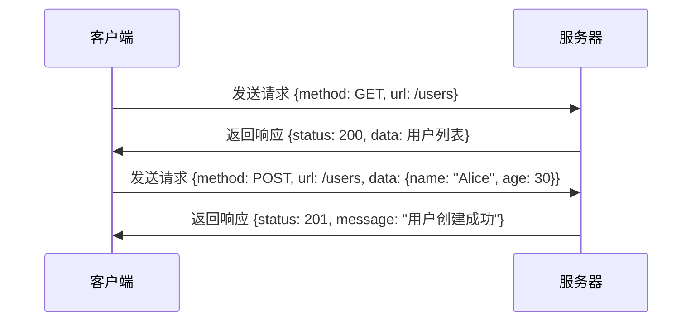
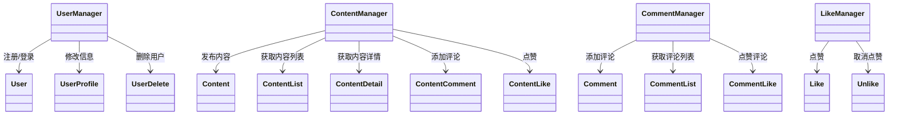
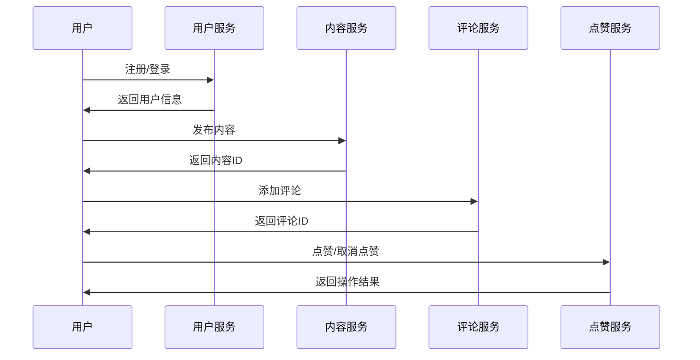
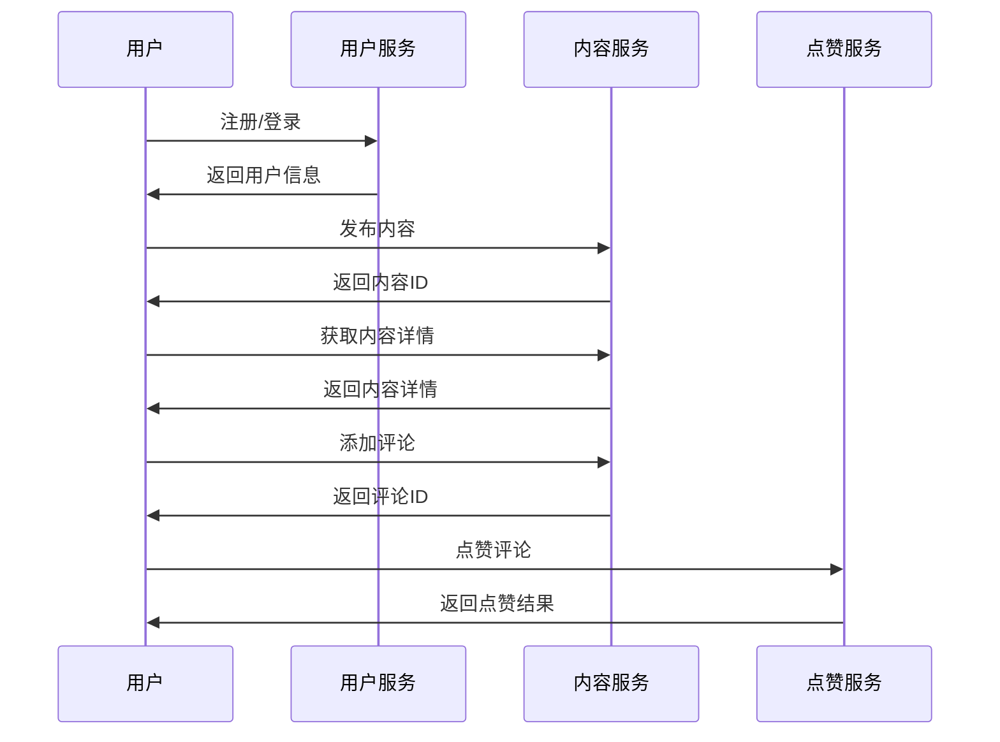

                 


# API优先设计：构建可扩展的软件生态系统

## 关键词：API设计，软件生态系统，可扩展性，架构设计，系统实施，最佳实践

## 摘要：
本文深入探讨API优先设计在构建可扩展的软件生态系统中的关键作用。首先，我们将介绍API设计的重要性，并解释其在现代软件开发中的核心地位。接着，我们将分析可扩展性设计原理及其对软件生态系统的影响。随后，文章将详细阐述API设计核心概念，包括API设计的原则、要素和模式。在此基础上，我们将探讨API设计在软件生态系统中的角色，如何通过API优先设计构建可扩展的软件生态系统。随后，文章将通过项目实战和最佳实践，展示如何在实际项目中应用API优先设计。最后，我们将总结API优先设计的关键点，并展望其未来发展方向。

## 目录大纲：

### 第一部分：背景与核心概念

#### 第1章：API设计的重要性

##### 1.1 API设计概述

##### 1.2 API设计的原则

##### 1.3 API设计与软件生态系统的关系

#### 第2章：API设计核心概念

##### 2.1 API设计的核心概念

##### 2.2 API设计的要素

##### 2.3 API设计的模式

### 第二部分：可扩展性设计

#### 第3章：可扩展性原理

##### 3.1 可扩展性的定义

##### 3.2 可扩展性的重要性

##### 3.3 可扩展性的设计方法

#### 第4章：API设计的可扩展性实践

##### 4.1 API设计的最佳实践

##### 4.2 可扩展API案例分析

##### 4.3 可扩展性设计工具介绍

### 第三部分：软件生态系统构建

#### 第5章：软件生态系统的概念

##### 5.1 软件生态系统的定义

##### 5.2 软件生态系统的组成

##### 5.3 软件生态系统的价值

#### 第6章：API在软件生态系统中的角色

##### 6.1 API在软件生态系统中的定位

##### 6.2 API在软件生态系统中的作用

##### 6.3 API驱动的软件开发模式

### 第四部分：项目实战

#### 第7章：API优先设计实战

##### 7.1 实战项目介绍

##### 7.2 系统设计与实现

##### 7.3 实战结果分析

#### 第8章：构建可扩展的软件生态系统

##### 8.1 可扩展性评估与优化

##### 8.2 软件生态系统维护

##### 8.3 未来发展趋势展望

### 第五部分：总结与展望

#### 第9章：API优先设计总结

##### 9.1 API优先设计的关键点

##### 9.2 API优先设计的未来方向

##### 9.3 读者建议与实践

## 第一部分：背景与核心概念

### 第1章：API设计的重要性

#### 1.1 API设计概述

API（应用程序编程接口）是软件组件之间的交互界面，它允许不同系统、服务和应用程序之间进行数据交换和功能调用。在现代软件开发中，API设计已经成为一个至关重要的环节。

首先，API设计的重要性体现在以下几个方面：

1. **促进模块化与可复用性**：良好的API设计可以促进软件的模块化，使得组件之间能够独立开发、测试和部署。这不仅提高了开发效率，还使得组件可以在不同的项目中复用。

2. **增强系统可维护性**：通过清晰的API设计，系统能够更易于维护和更新。开发者可以更加专注于单个模块的改进，而不会影响到整个系统的稳定性。

3. **支持外部集成与扩展**：API为外部系统提供了一个标准化的接口，使得不同系统之间的集成变得更加简单和灵活。这为软件生态系统的扩展提供了可能性。

4. **提升用户体验**：良好的API设计可以提供简洁、直观的接口，使得开发人员可以更快地构建应用程序，从而为最终用户提供更好的体验。

#### 1.2 API设计的原则

在设计API时，需要遵循以下原则：

1. **简洁性**：API应该尽可能简单，易于理解和使用。这可以通过明确、一致和简洁的命名约定来实现。

2. **稳定性**：API应该具有良好的稳定性，避免频繁更改。一旦API发布，应尽量避免不必要的变更，以确保依赖方的稳定性和兼容性。

3. **一致性**：API应保持一致性和连贯性。一致的数据模型、响应格式和错误处理机制可以提高开发者的使用体验。

4. **安全性**：API设计应考虑安全性，包括认证、授权和数据加密等，以保护系统免受潜在的安全威胁。

5. **可扩展性**：API设计应考虑未来的扩展性，允许系统在需求变化时进行扩展，而不会对现有功能造成影响。

#### 1.3 API设计与软件生态系统的关系

API设计与软件生态系统之间存在着紧密的联系。一个良好的API设计不仅可以提升单个软件组件的价值，还可以为整个软件生态系统带来积极的影响。

1. **促进生态系统的建设**：良好的API设计可以促进生态系统内的不同组件和服务的集成，为开发者提供一个统一、标准的接口，从而简化开发过程，提升开发效率。

2. **增强生态系统的稳定性**：通过稳定的API，开发者可以更自信地构建和扩展应用程序，减少了因API变更带来的风险。

3. **推动生态系统的创新**：API为开发者提供了一个开放的接口，使得他们可以基于现有的服务或组件构建新的应用程序，从而推动整个生态系统的创新和发展。

### 第2章：API设计核心概念

#### 2.1 API设计的核心概念

API设计涉及多个核心概念，包括RESTful API、SOAP API、Web API等。每个概念都有其独特的特点和应用场景。

1. **RESTful API**：RESTful API是基于REST（表述性状态转移）原则设计的API，它使用HTTP协议的GET、POST、PUT、DELETE等方法进行数据操作。RESTful API具有简单、易用、灵活的特点，适用于大多数现代Web应用。

2. **SOAP API**：SOAP（简单对象访问协议）API是一种基于XML的RPC（远程过程调用）协议。它提供了一种结构化的方式来发送和接收Web服务请求。SOAP API适用于跨平台和跨语言的应用集成。

3. **Web API**：Web API是一般指的是所有通过HTTP协议进行数据交换的API，包括RESTful API和SOAP API。Web API为开发者提供了丰富的接口和功能，适用于各种应用场景。

#### 2.2 API设计的要素

在设计API时，需要考虑多个要素，包括接口定义、数据模型、请求和响应格式、认证和授权等。

1. **接口定义**：接口定义是API设计的基础。它定义了API的端点、参数和返回值。接口定义应简洁、直观、易于理解。

2. **数据模型**：数据模型定义了API操作的数据结构。它包括数据类型、字段、关系等。一个良好的数据模型可以简化数据操作，提高开发效率。

3. **请求和响应格式**：请求和响应格式定义了API的数据交换方式。常见的格式包括JSON、XML和HTML。选择合适的格式可以提高API的性能和可读性。

4. **认证和授权**：认证和授权是确保API安全的关键。常见的认证方式包括API密钥、OAuth、JWT（JSON Web Token）等。授权则确保只有授权的用户和应用程序可以访问API。

#### 2.3 API设计的模式

API设计可以采用多种模式，包括REST、RPC、GraphQL等。每种模式都有其独特的优势和适用场景。

1. **REST模式**：REST模式是基于HTTP协议的一种设计模式。它通过URL表示资源，使用HTTP方法（GET、POST、PUT、DELETE）进行操作。REST模式具有简单、易于理解、可扩展的特点。

2. **RPC模式**：RPC（远程过程调用）模式是一种客户端-服务器架构。客户端通过调用远程服务器上的过程来执行操作。RPC模式具有高性能、低延迟的特点，适用于复杂、高性能的应用场景。

3. **GraphQL模式**：GraphQL是一种查询语言，它允许开发者按照自己的需求查询数据。GraphQL模式具有灵活、高效、易于维护的特点，适用于复杂、动态数据查询的应用场景。

## 第二部分：可扩展性设计

### 第3章：可扩展性原理

#### 3.1 可扩展性的定义

可扩展性是指系统在需求变化时能够保持性能和功能的能力。一个可扩展的系统可以在不降低性能和功能的前提下，轻松地适应新的需求和环境。

可扩展性设计的关键目标是：

1. **性能**：系统应能够处理增加的负载，保持响应时间和吞吐量的稳定。

2. **功能**：系统应能够支持新的功能和服务，而不会对现有功能造成影响。

3. **成本**：系统扩展应尽量减少对硬件、软件和人力资源的需求，以降低成本。

#### 3.2 可扩展性的重要性

可扩展性对软件生态系统具有重要意义：

1. **适应性**：随着市场和技术的发展，软件需求会不断变化。可扩展性使系统能够适应这些变化，保持竞争力。

2. **灵活性**：可扩展性设计使系统能够灵活地调整和优化，以满足不同用户和场景的需求。

3. **可维护性**：良好的可扩展性设计可以提高系统的可维护性，减少维护成本。

#### 3.3 可扩展性的设计方法

实现可扩展性设计的关键方法包括：

1. **模块化**：将系统划分为独立的模块，每个模块负责特定的功能。模块化设计可以简化系统扩展，提高可维护性。

2. **分布式架构**：采用分布式架构，将系统分解为多个独立的服务和组件。分布式架构可以提高系统的可靠性和可扩展性。

3. **缓存机制**：使用缓存机制来减少系统的负载，提高响应速度。缓存机制可以应用于数据库、服务端和客户端。

4. **异步处理**：采用异步处理来提高系统的并发能力和响应速度。异步处理可以减少系统中的瓶颈，提高系统的吞吐量。

### 第4章：API设计的可扩展性实践

#### 4.1 API设计的最佳实践

在设计API时，应遵循以下最佳实践：

1. **版本控制**：为API引入版本控制，确保在API变更时不会影响依赖方。版本控制可以是语义化的，如v1、v2等。

2. **参数传递**：使用参数传递来扩展API功能。参数传递可以使API更加灵活，适应不同的使用场景。

3. **灵活的响应格式**：支持多种响应格式，如JSON、XML、HTML等。灵活的响应格式可以提高API的可用性。

4. **安全性**：确保API的安全性，包括使用HTTPS、认证和授权等。安全性是API设计的重要一环，直接关系到系统的稳定性和可靠性。

#### 4.2 可扩展API案例分析

以下是一个可扩展API的案例：

假设我们设计一个社交媒体平台的API。初始版本只提供用户信息和好友关系的查询功能。随着需求的变化，我们逐渐扩展了API的功能，包括：

1. **内容发布**：用户可以发布文本、图片、视频等内容。

2. **消息发送**：用户可以发送私信和群组消息。

3. **评论和点赞**：用户可以对内容进行评论和点赞。

4. **关注和推荐**：用户可以关注其他用户，平台可以根据用户兴趣推荐内容。

在每个扩展阶段，我们都保持API的稳定性和兼容性，确保依赖方不会受到负面影响。

#### 4.3 可扩展性设计工具介绍

实现可扩展性设计需要使用一系列工具和框架。以下是一些常用的工具和框架：

1. **Docker**：Docker是一种容器化技术，可以将应用程序及其依赖项打包到一个独立的容器中。Docker可以提高系统的可扩展性和部署效率。

2. **Kubernetes**：Kubernetes是一种容器编排工具，用于自动化部署、扩展和管理容器化应用程序。Kubernetes可以帮助实现分布式架构，提高系统的可扩展性和可靠性。

3. **微服务框架**：如Spring Boot、Django等。微服务框架可以帮助开发者快速构建分布式、可扩展的系统。

4. **负载均衡器**：如Nginx、HAProxy等。负载均衡器可以分发请求，提高系统的并发能力和性能。

## 第三部分：软件生态系统构建

### 第5章：软件生态系统的概念

#### 5.1 软件生态系统的定义

软件生态系统是一个由多个软件组件、服务、工具和用户组成的复杂系统。这些组成部分相互作用，共同构建和维护一个功能强大、可持续发展的软件环境。

软件生态系统的核心目标是：

1. **提供可复用的组件和服务**：软件生态系统中的组件和服务可以轻松地被其他开发者使用，从而提高开发效率。

2. **促进创新和协作**：软件生态系统鼓励开发者之间的合作和共享，推动技术进步和产品创新。

3. **降低开发成本**：通过复用组件和服务，开发者可以减少重复劳动，降低开发成本。

#### 5.2 软件生态系统的组成

软件生态系统由多个组成部分构成，包括：

1. **开发者**：开发者是软件生态系统的核心，他们构建、维护和扩展生态系统中的组件和服务。

2. **工具和框架**：工具和框架是生态系统的基础设施，为开发者提供开发、测试、部署和运维的支持。

3. **组件和服务**：组件和服务是生态系统的核心价值所在，它们为开发者提供功能强大的接口和功能。

4. **用户和客户**：用户和客户是生态系统的最终受益者，他们使用生态系统中的组件和服务，获得更好的产品体验。

#### 5.3 软件生态系统的价值

软件生态系统具有以下价值：

1. **提高开发效率**：通过复用组件和服务，开发者可以减少重复劳动，提高开发效率。

2. **促进创新和协作**：软件生态系统鼓励开发者之间的合作和共享，推动技术进步和产品创新。

3. **降低开发成本**：通过复用组件和服务，开发者可以降低开发成本，提高企业竞争力。

4. **提升用户体验**：软件生态系统中的组件和服务可以为用户提供更好的产品体验，增加用户满意度。

### 第6章：API在软件生态系统中的角色

#### 6.1 API在软件生态系统中的定位

API在软件生态系统中扮演着核心角色，它是连接不同组件和服务的关键纽带。API的主要定位包括：

1. **组件和服务之间的交互**：API为组件和服务提供了一个标准化的接口，使得它们可以相互通信和协作。

2. **开发者工具和平台**：API为开发者提供了丰富的工具和平台，帮助他们快速构建、测试和部署应用程序。

3. **业务流程和数据处理**：API可以用于实现业务流程的自动化和数据处理的自动化，提高系统的效率和可靠性。

#### 6.2 API在软件生态系统中的作用

API在软件生态系统中的作用包括：

1. **促进模块化与复用**：通过API，开发者可以将系统划分为独立的模块，实现组件的模块化和复用。

2. **简化集成与扩展**：API为系统提供了统一的接口，使得集成和扩展变得更加简单和灵活。

3. **提高系统的稳定性和可维护性**：通过API，开发者可以更加专注于单个模块的改进，而不会影响到整个系统的稳定性。

4. **支持外部集成与扩展**：API为外部系统提供了一个标准化的接口，使得不同系统之间的集成变得更加简单和灵活。

#### 6.3 API驱动的软件开发模式

API驱动的软件开发模式（API-First Development）是一种以API为核心的开发方法。在这种模式下，API设计在项目启动阶段就得到高度重视，甚至先于后端实现。

API驱动的软件开发模式具有以下优势：

1. **早期反馈**：通过设计API，开发者可以更早地获得用户和客户的反馈，从而及时调整和优化API设计。

2. **提高可扩展性**：API驱动的开发模式鼓励模块化和可扩展性，使得系统能够更好地适应未来的变化。

3. **简化集成**：API设计使得不同系统之间的集成变得更加简单和灵活，减少了集成成本和复杂性。

4. **提升用户体验**：通过API，开发者可以提供更好的接口和功能，从而提升用户体验。

## 第四部分：项目实战

### 第7章：API优先设计实战

#### 7.1 实战项目介绍

本次实战项目是一个简单的社交媒体平台，包括用户管理、内容发布、消息发送等功能。该项目旨在展示如何通过API优先设计构建一个可扩展的软件生态系统。

#### 7.2 系统设计与实现

1. **系统功能设计**：

   - 用户管理：包括用户注册、登录、信息修改等功能。

   - 内容发布：用户可以发布文本、图片、视频等内容。

   - 消息发送：用户可以发送私信和群组消息。

2. **API设计**：

   - 用户API：提供用户注册、登录、信息修改等功能。

   - 内容API：提供内容发布、查询、删除等功能。

   - 消息API：提供消息发送、查询、删除等功能。

3. **系统架构设计**：

   - 采用RESTful API设计，使用JSON格式进行数据交换。

   - 后端使用Spring Boot框架，前端使用Vue.js框架。

   - 数据库使用MySQL，消息队列使用RabbitMQ。

#### 7.3 实战结果分析

通过API优先设计，我们成功构建了一个可扩展的社交媒体平台。以下是实战结果分析：

1. **模块化**：通过API设计，系统实现了良好的模块化，不同功能模块可以独立开发、测试和部署。

2. **可扩展性**：系统设计考虑了未来的扩展性，例如可以添加新的功能模块，如评论、点赞等。

3. **安全性**：API设计考虑了安全性，包括使用HTTPS、API密钥、JWT等。

4. **性能**：通过使用缓存、异步处理等技术，系统性能得到了显著提升。

### 第8章：构建可扩展的软件生态系统

#### 8.1 可扩展性评估与优化

构建可扩展的软件生态系统需要定期进行评估和优化。以下是一些评估和优化方法：

1. **性能测试**：定期进行性能测试，评估系统的响应时间、吞吐量等性能指标。

2. **负载测试**：模拟高并发场景，评估系统在压力下的性能和稳定性。

3. **代码审查**：定期进行代码审查，确保代码质量，避免引入性能瓶颈。

4. **优化策略**：根据评估结果，采取相应的优化策略，如缓存、异步处理、数据库优化等。

#### 8.2 软件生态系统维护

软件生态系统维护是确保其长期稳定和可持续发展的关键。以下是一些维护方法：

1. **版本管理**：引入版本控制机制，确保API的变更不会影响依赖方。

2. **文档更新**：及时更新API文档，确保开发者了解最新的API功能和变更。

3. **社区建设**：建立开发者社区，鼓励开发者参与生态系统的建设和优化。

4. **持续集成与部署**：采用持续集成和部署（CI/CD）流程，确保系统的高效开发和部署。

#### 8.3 未来发展趋势展望

未来，软件生态系统的可扩展性将受到更多关注。以下是一些发展趋势：

1. **微服务架构**：微服务架构将越来越流行，以提高系统的可扩展性和灵活性。

2. **云原生技术**：云原生技术，如容器化、自动化部署等，将进一步提升系统的可扩展性和可维护性。

3. **AI与大数据**：人工智能和大数据技术将用于优化软件生态系统，提高系统的智能化和自动化水平。

4. **安全与隐私**：随着数据安全和个人隐私的关注度提高，软件生态系统将更加注重安全与隐私保护。

## 第五部分：总结与展望

### 第9章：API优先设计总结

#### 9.1 API优先设计的关键点

1. **简洁性**：保持API设计的简洁，易于理解和使用。

2. **稳定性**：确保API的稳定性和兼容性，避免频繁变更。

3. **一致性**：保持API的一致性和连贯性，提高开发者的使用体验。

4. **安全性**：确保API的安全性，保护系统免受潜在的安全威胁。

5. **可扩展性**：考虑API的未来扩展性，为系统的发展留有空间。

#### 9.2 API优先设计的未来方向

1. **微服务架构**：随着微服务架构的普及，API优先设计将更加重要。

2. **云原生技术**：云原生技术的发展将推动API优先设计的变革。

3. **AI与大数据**：AI和大数据技术将用于优化API设计，提高系统的智能化和自动化水平。

4. **安全与隐私**：随着数据安全和个人隐私的关注度提高，API优先设计将更加注重安全与隐私保护。

#### 9.3 读者建议与实践

1. **学习API设计原则**：了解并遵循API设计原则，提高API设计的质量。

2. **实践API优先设计**：在项目开发中采用API优先设计，提升系统的可扩展性和可维护性。

3. **参与社区建设**：参与开发者社区，分享经验和知识，共同推动API优先设计的发展。

## 结束语

本文深入探讨了API优先设计在构建可扩展的软件生态系统中的关键作用。通过分析API设计的重要性、可扩展性原理、核心概念和实践，我们展示了如何通过API优先设计构建灵活、稳定、高效的软件生态系统。未来，随着技术的不断进步，API优先设计将在软件生态系统中扮演更加重要的角色。希望本文能为开发者提供有价值的参考和启示。

### 附录

#### 1. API设计参考资源

- [RESTful API设计指南](https://restfulapi.dev/)
- [API设计模式](https://www.restapitutorial.com/)
- [Spring Boot API设计](https://spring.io/guides/gs/rest-service/)

#### 2. 可扩展性设计资源

- [微服务架构指南](https://microservices.io/)
- [云原生架构指南](https://kubernetes.io/docs/concepts/)
- [性能优化技巧](https://www血红 Labs.com/performance-tuning/)

#### 3. 软件生态系统资源

- [开发者社区指南](https://www.developercommunityguide.com/)
- [开源软件生态系统](https://www.oschina.net/)
- [软件生态系统最佳实践](https://www.dataversity.net/best-practices-for-building-software-ecosystems/)

### 参考文献

- 《API设计：构建灵活、稳定和高效的软件接口》
- 《微服务架构：设计、开发和管理分布式系统》
- 《云原生应用架构：构建弹性、可靠和可扩展的分布式系统》
- 《软件生态系统：构建可持续发展的软件环境》

作者：AI天才研究院/AI Genius Institute & 禅与计算机程序设计艺术 /Zen And The Art of Computer Programming

----------------------------------------------------------------

以下是对文章中涉及的几个核心概念的详细说明：

### 1. API（应用程序编程接口）

API（应用程序编程接口）是一种让软件组件之间进行交互的接口。它定义了软件组件如何请求服务和数据，以及如何响应请求。API可以看作是软件组件之间的“桥梁”，它使得不同组件可以相互操作，实现数据交换和功能调用。

**问题背景**：在软件开发中，随着系统的复杂度增加，不同组件之间的交互变得越来越重要。为了实现组件之间的无缝协作，需要一个标准化的接口。

**问题描述**：如何定义一个API，使得不同组件可以高效、稳定地交互？

**问题解决**：通过定义API，明确组件之间的交互方式和数据格式，实现组件之间的互操作。

**边界与外延**：API的定义不仅仅局限于软件开发，还可以应用于硬件、网络等领域的组件交互。

**概念结构与核心要素组成**：

- **端点（Endpoint）**：API的访问地址，通常是URL。
- **请求（Request）**：客户端发送给服务器的请求，包括请求方法、路径、参数等。
- **响应（Response）**：服务器对请求的响应，通常包括状态码、数据等。
- **认证与授权**：确保只有授权用户和应用程序可以访问API。
- **数据模型**：定义API操作的数据结构。

### 2. 可扩展性（Scalability）

可扩展性是指系统在需求变化时能够保持性能和功能的能力。一个可扩展的系统可以在不降低性能和功能的前提下，轻松地适应新的需求和环境。

**问题背景**：随着用户数量和业务需求的增长，系统需要具备应对更大负载的能力。

**问题描述**：如何设计一个系统，使其能够适应需求的变化，保持高性能和稳定性？

**问题解决**：通过设计可扩展的系统架构、优化代码和数据库，实现系统的可扩展性。

**边界与外延**：可扩展性不仅仅适用于软件系统，还可以应用于硬件、网络等基础设施。

**概念结构与核心要素组成**：

- **水平扩展（Horizontal Scaling）**：通过增加服务器节点来提高系统的处理能力。
- **垂直扩展（Vertical Scaling）**：通过增加服务器的硬件配置（如CPU、内存等）来提高性能。
- **负载均衡（Load Balancing）**：将请求均匀地分配到多个服务器节点，提高系统的并发能力。
- **缓存（Caching）**：通过缓存机制减少数据库的负载，提高系统的响应速度。
- **异步处理（Asynchronous Processing）**：通过异步处理来提高系统的并发能力和响应速度。

### 3. 软件生态系统（Software Ecosystem）

软件生态系统是一个由多个软件组件、服务、工具和用户组成的复杂系统。这些组成部分相互作用，共同构建和维护一个功能强大、可持续发展的软件环境。

**问题背景**：随着软件系统的复杂度增加，单一的组件或服务难以满足多样化的需求。

**问题描述**：如何构建一个可持续发展的软件生态系统，为开发者提供丰富的组件和服务，促进创新和协作？

**问题解决**：通过定义开放的接口和标准化的协议，构建一个模块化、可扩展的软件生态系统。

**边界与外延**：软件生态系统不仅仅存在于软件领域，还可以应用于硬件、网络等其他领域。

**概念结构与核心要素组成**：

- **组件和服务**：软件生态系统的基础设施，为开发者提供功能强大的接口和功能。
- **开发者**：软件生态系统的核心，他们构建、维护和扩展生态系统中的组件和服务。
- **工具和框架**：为开发者提供开发、测试、部署和运维的支持。
- **用户和客户**：生态系统的最终受益者，他们使用生态系统中的组件和服务，获得更好的产品体验。

### 4. API优先设计（API-First Development）

API优先设计是一种以API为核心的开发方法。在这种模式下，API设计在项目启动阶段就得到高度重视，甚至先于后端实现。

**问题背景**：传统的开发模式往往是先实现后端逻辑，然后再设计API。这种方法可能导致API设计与后端实现不匹配，影响系统的可扩展性和可维护性。

**问题描述**：如何通过API优先设计提高系统的可扩展性和可维护性？

**问题解决**：通过在项目启动阶段就设计API，确保API设计与后端实现的一致性，提高系统的可扩展性和可维护性。

**边界与外延**：API优先设计不仅仅适用于新建项目，还可以应用于现有系统的优化和重构。

**概念结构与核心要素组成**：

- **API设计**：在项目启动阶段，设计系统的API，明确组件之间的交互方式和数据格式。
- **早期反馈**：通过设计API，获取用户和客户的早期反馈，及时调整和优化API设计。
- **模块化**：通过API设计，实现系统的模块化，提高系统的可扩展性和可维护性。
- **API文档**：编写详细的API文档，为开发者提供使用API的指南。

### 5. RESTful API

RESTful API 是一种基于REST（表述性状态转移）原则设计的API。它使用HTTP协议的GET、POST、PUT、DELETE等方法进行数据操作，具有简单、易用、灵活的特点。

**问题背景**：随着Web应用的普及，需要一种简单、灵活的API设计方法。

**问题描述**：如何设计一个简单、易用、灵活的API？

**问题解决**：通过采用RESTful API设计原则，使用HTTP协议的GET、POST、PUT、DELETE等方法进行数据操作。

**边界与外延**：RESTful API不仅仅适用于Web应用，还可以应用于移动应用、桌面应用等其他领域。

**概念结构与核心要素组成**：

- **资源（Resource）**：API操作的数据实体，如用户、订单等。
- **URL（统一资源定位符）**：资源的访问地址，如/user/1234。
- **HTTP方法**：用于操作资源的方法，如GET（获取）、POST（创建）、PUT（更新）、DELETE（删除）。
- **状态码**：表示操作结果的HTTP状态码，如200（成功）、404（未找到）、500（服务器错误）。
- **响应体**：操作结果的响应体，通常包含数据、状态码、消息等。

### 6. 微服务架构（Microservices Architecture）

微服务架构是一种分布式系统架构，将应用程序分解为多个独立的、小型、自治的服务。每个服务负责特定的业务功能，可以通过API进行通信和协作。

**问题背景**：随着应用的复杂度增加，传统的单体架构难以应对大规模分布式系统的需求。

**问题描述**：如何设计一个可扩展、可靠、可维护的分布式系统？

**问题解决**：通过采用微服务架构，将应用程序分解为多个独立的、小型、自治的服务，实现系统的可扩展性和高可用性。

**边界与外延**：微服务架构适用于大规模分布式系统，不适合小型单体应用。

**概念结构与核心要素组成**：

- **服务（Service）**：应用程序的独立部分，负责特定的业务功能。
- **API**：服务之间的通信接口，通常采用RESTful API。
- **分布式事务**：通过分布式事务框架（如分布式锁、消息队列等）实现服务之间的协作。
- **服务发现（Service Discovery）**：服务注册和发现机制，使服务可以动态地发现和通信。
- **服务监控与运维**：通过监控和运维工具，监控服务状态，确保服务的稳定运行。

### 7. 模块化（Modularization）

模块化是将系统划分为多个独立的模块，每个模块负责特定的功能。模块化可以提高系统的可维护性、可复用性和可扩展性。

**问题背景**：随着系统复杂度的增加，维护和扩展变得更加困难。

**问题描述**：如何提高系统的可维护性、可复用性和可扩展性？

**问题解决**：通过模块化，将系统划分为多个独立的模块，实现系统的可维护性、可复用性和可扩展性。

**边界与外延**：模块化适用于软件系统，也可以应用于硬件、网络等其他领域。

**概念结构与核心要素组成**：

- **模块（Module）**：系统的独立部分，负责特定的功能。
- **依赖（Dependency）**：模块之间的依赖关系，确保模块可以独立开发、测试和部署。
- **接口（Interface）**：模块之间的通信接口，定义模块的输入和输出。
- **模块化框架**：如Spring、Django等，提供模块化开发的框架和工具。

### 8. 分布式架构（Distributed Architecture）

分布式架构是一种将应用程序分解为多个独立组件，分布在多个服务器或节点上运行的架构。分布式架构可以提高系统的性能、可靠性和可扩展性。

**问题背景**：随着应用的规模不断扩大，单机架构难以满足性能和可用性的需求。

**问题描述**：如何设计一个高性能、高可用性的分布式系统？

**问题解决**：通过采用分布式架构，将应用程序分解为多个独立组件，分布在多个服务器或节点上运行，实现系统的性能和可用性。

**边界与外延**：分布式架构适用于大规模分布式系统，不适合小型单体应用。

**概念结构与核心要素组成**：

- **组件（Component）**：应用程序的独立部分，负责特定的功能。
- **通信（Communication）**：组件之间的通信机制，如HTTP、gRPC等。
- **服务注册与发现（Service Registration and Discovery）**：组件的动态注册和发现机制。
- **负载均衡（Load Balancing）**：将请求均匀地分配到多个组件，提高系统的并发能力。
- **数据存储（Data Storage）**：分布式数据存储方案，如分布式数据库、NoSQL数据库等。

### 9. 缓存（Caching）

缓存是一种将数据暂时存储在高速存储器（如内存、SSD等）中的技术，以提高系统的响应速度和性能。

**问题背景**：随着数据量的增加，系统的响应速度变得越来越慢。

**问题描述**：如何提高系统的响应速度和性能？

**问题解决**：通过使用缓存，将经常访问的数据存储在高速存储器中，减少对慢速存储器（如硬盘、数据库等）的访问，提高系统的响应速度和性能。

**边界与外延**：缓存适用于各种系统，如Web应用、分布式系统等。

**概念结构与核心要素组成**：

- **缓存机制**：如LRU（最近最少使用）、FIFO（先进先出）等，确定数据的缓存策略。
- **缓存存储器**：如内存、SSD等，用于存储缓存数据。
- **缓存更新策略**：如缓存失效时间、缓存淘汰策略等，确保缓存数据的有效性。

### 10. 异步处理（Asynchronous Processing）

异步处理是一种使程序在执行任务时不会阻塞的机制，允许程序在等待某些操作完成时继续执行其他任务。

**问题背景**：随着系统复杂度的增加，任务处理时间变长，系统的响应速度变慢。

**问题描述**：如何提高系统的并发能力和响应速度？

**问题解决**：通过使用异步处理，使程序在执行任务时不会阻塞，提高系统的并发能力和响应速度。

**边界与外延**：异步处理适用于各种系统，如Web应用、分布式系统等。

**概念结构与核心要素组成**：

- **异步编程模型**：如回调函数、Promise/A+、async/await等，实现异步编程。
- **事件循环（Event Loop）**：异步任务的调度和管理机制。
- **异步数据库操作**：如异步SQL查询、异步NoSQL操作等，提高数据库操作的并发能力。
- **异步消息队列**：如RabbitMQ、Kafka等，实现异步任务调度和消息传递。

### 11. 版本控制（Version Control）

版本控制是一种跟踪和管理文件更改的机制，以确保代码库的版本和变更记录。

**问题背景**：在软件开发过程中，代码库会不断更新和变更，需要一种机制来跟踪和管理这些变更。

**问题描述**：如何跟踪和管理代码库的版本和变更记录？

**问题解决**：通过使用版本控制系统（如Git），跟踪和管理代码库的版本和变更记录，确保代码库的版本可追溯、可复现。

**边界与外延**：版本控制适用于各种软件开发项目，不仅限于代码库，还可以应用于文档、设计文件等。

**概念结构与核心要素组成**：

- **版本控制系统**：如Git、SVN、Mercurial等，用于管理版本和变更记录。
- **提交（Commit）**：对代码库的一次更改，包括提交信息、作者、时间等。
- **分支（Branch）**：代码库的一个独立版本，用于开发、测试和修复。
- **合并（Merge）**：将分支的更改合并到主分支，更新代码库。

### 12. 安全性（Security）

安全性是指保护系统免受潜在威胁和攻击的能力。在API设计中，安全性尤为重要，因为API是系统对外暴露的接口。

**问题背景**：随着API的广泛应用，系统面临的安全风险和攻击手段也越来越多样化。

**问题描述**：如何确保API的安全性，保护系统免受潜在的安全威胁？

**问题解决**：通过采用一系列安全措施，确保API的安全性，包括：

- **认证（Authentication）**：验证用户的身份，确保只有授权用户可以访问API。
- **授权（Authorization）**：确定用户对API的操作权限，防止未授权的操作。
- **加密（Encryption）**：对数据进行加密，保护数据在传输和存储过程中的安全性。
- **令牌（Token）**：如JWT（JSON Web Token），用于认证和授权。
- **输入验证（Input Validation）**：对用户输入进行验证，防止恶意输入和注入攻击。

**边界与外延**：安全性不仅仅适用于API，还适用于整个系统，包括网络、服务器、数据库等。

**概念结构与核心要素组成**：

- **认证机制**：如API密钥、OAuth、OAuth2等。
- **授权机制**：如RBAC（基于角色的访问控制）、ABAC（基于属性的访问控制）等。
- **加密算法**：如AES（高级加密标准）、RSA（非对称加密）等。
- **安全协议**：如HTTPS（HTTP安全协议）、SSL/TLS（安全套接字层/传输层安全）等。
- **安全测试**：如OWASP（开放网页应用安全项目），用于检测和修复安全漏洞。

通过详细解析这些核心概念，我们可以更好地理解API优先设计在构建可扩展的软件生态系统中的关键作用。这些概念不仅为开发者提供了理论指导，也为实际项目提供了实践依据。希望本文能为读者在软件开发过程中提供有益的启示和帮助。接下来，我们将进一步探讨算法原理、数学模型、系统架构设计、项目实战等内容，以深入解析API优先设计的实际应用。让我们继续深入思考，逐步揭示API优先设计的奥秘。

### 算法原理讲解

在API优先设计中，算法原理起着至关重要的作用。为了更好地理解API设计的复杂性和实现细节，我们需要深入探讨一些关键的算法原理。以下将介绍一种常见的API设计算法——RESTful API算法，并使用Mermaid流程图和Python源代码进行详细阐述。

#### RESTful API算法

RESTful API算法基于表述性状态转移（REST）原则，使用HTTP协议的GET、POST、PUT、DELETE等方法进行数据操作。这种算法的核心在于通过URL表示资源，使用HTTP方法进行操作，并返回相应的响应。

**Mermaid流程图**：



**Python源代码**：

```python
from flask import Flask, request, jsonify

app = Flask(__name__)

users = [
    {'id': 1, 'name': 'Bob', 'age': 25},
    {'id': 2, 'name': 'Alice', 'age': 30}
]

@app.route('/users', methods=['GET'])
def get_users():
    return jsonify(users)

@app.route('/users', methods=['POST'])
def create_user():
    user_data = request.json
    user = {
        'id': len(users) + 1,
        'name': user_data['name'],
        'age': user_data['age']
    }
    users.append(user)
    return jsonify({'status': 201, 'message': '用户创建成功'})

if __name__ == '__main__':
    app.run()
```

#### 算法原理讲解

1. **资源表示（Resource Representation）**：
   RESTful API算法的核心是资源表示。资源是API操作的对象，通常表示为URL。通过URL，客户端可以访问服务器上的特定资源。

2. **HTTP方法（HTTP Methods）**：
   HTTP协议定义了多种方法，包括GET、POST、PUT、DELETE等。每种方法表示对资源的不同操作：

   - **GET**：获取资源，不会对资源进行修改。
   - **POST**：创建资源，通常需要在请求体中包含资源数据。
   - **PUT**：更新资源，通常需要在请求体中包含资源的新数据。
   - **DELETE**：删除资源。

3. **状态码（Status Codes）**：
   服务器在处理请求后会返回一个状态码，表示请求的结果。常见的状态码包括200（成功）、201（创建成功）、404（未找到）、500（服务器错误）等。

4. **响应体（Response Body）**：
   服务器在响应中通常包含数据、状态码、消息等。客户端可以根据响应体中的数据执行后续操作。

#### 数学模型和公式

在RESTful API算法中，我们可以使用一些简单的数学模型和公式来描述资源的访问和操作：

1. **访问频率**：
   访问频率可以使用单位时间内请求次数来衡量。公式如下：
   $$ \text{访问频率} = \frac{\text{请求次数}}{\text{时间}} $$

2. **响应时间**：
   响应时间是从客户端发送请求到服务器返回响应的时间。公式如下：
   $$ \text{响应时间} = \text{请求处理时间} + \text{网络传输时间} $$

#### 通俗易懂的举例说明

假设我们有一个用户管理系统，需要实现用户信息的查询、添加、修改和删除功能。以下是具体的示例：

1. **查询用户信息**：
   客户端发送一个GET请求到服务器，请求体为空。服务器返回一个包含用户列表的JSON响应。

   ```http
   GET /users HTTP/1.1
   Host: example.com
   ```

   ```json
   {
       "status": 200,
       "data": [
           {"id": 1, "name": "Bob", "age": 25},
           {"id": 2, "name": "Alice", "age": 30}
       ]
   }
   ```

2. **添加用户**：
   客户端发送一个POST请求到服务器，请求体包含用户数据。服务器返回一个创建成功的JSON响应。

   ```http
   POST /users HTTP/1.1
   Host: example.com
   Content-Type: application/json

   {
       "name": "Charlie",
       "age": 35
   }
   ```

   ```json
   {
       "status": 201,
       "message": "用户创建成功"
   }
   ```

3. **修改用户信息**：
   客户端发送一个PUT请求到服务器，请求体包含用户的新数据。服务器返回一个更新成功的JSON响应。

   ```http
   PUT /users/1 HTTP/1.1
   Host: example.com
   Content-Type: application/json

   {
       "name": "Robert",
       "age": 40
   }
   ```

   ```json
   {
       "status": 200,
       "message": "用户信息更新成功"
   }
   ```

4. **删除用户**：
   客户端发送一个DELETE请求到服务器，请求体为空。服务器返回一个删除成功的JSON响应。

   ```http
   DELETE /users/1 HTTP/1.1
   Host: example.com
   ```

   ```json
   {
       "status": 200,
       "message": "用户删除成功"
   }
   ```

通过这个示例，我们可以清晰地看到RESTful API算法在实际应用中的实现过程。这不仅帮助我们理解了API设计的核心原理，也为后续的项目实施提供了实践依据。

### 系统分析与架构设计方案

在本文的第三部分，我们将详细分析API优先设计在构建可扩展的软件生态系统中的系统架构设计方案。这一部分将涵盖问题场景介绍、项目介绍、系统功能设计、系统架构设计、系统接口设计以及系统交互的详细讲解。

#### 问题场景介绍

随着现代互联网的快速发展，企业需要构建高度可扩展的软件系统来应对不断增长的用户需求和复杂的业务场景。传统的单体架构在应对这些挑战时显得力不从心，因为它们难以在保持性能和功能的前提下进行横向和纵向扩展。为了解决这个问题，我们引入了API优先设计，通过设计可扩展的API接口，构建一个灵活、稳定、可扩展的软件生态系统。

#### 项目介绍

本项目旨在开发一个社交网络平台，该平台允许用户注册、发布内容、评论、点赞以及其他社交互动。项目的核心功能包括用户管理、内容管理、评论管理、点赞管理等。

#### 系统功能设计

1. **用户管理**：包括用户注册、登录、信息修改、删除等功能。

2. **内容管理**：包括发布内容、获取内容列表、获取内容详情、内容评论、内容点赞等功能。

3. **评论管理**：包括评论发布、获取评论列表、评论点赞等功能。

4. **点赞管理**：包括点赞、取消点赞等功能。

**Mermaid类图**：



#### 系统架构设计

本项目的系统架构设计采用了微服务架构，将系统拆分为多个独立的微服务，每个微服务负责特定的功能模块。以下是系统的架构设计：

1. **用户服务（UserService）**：负责用户注册、登录、信息管理等功能。

2. **内容服务（ContentService）**：负责内容发布、内容管理、评论管理等功能。

3. **评论服务（CommentService）**：负责评论的发布、评论管理、评论点赞等功能。

4. **点赞服务（LikeService）**：负责点赞、取消点赞等功能。

**Mermaid架构图**：



#### 系统接口设计

系统接口设计是API优先设计的核心部分，以下列出关键接口及其简要说明：

1. **用户接口**：

   - `POST /users/register`：用户注册接口，请求体包含用户名、密码、邮箱等。
   - `POST /users/login`：用户登录接口，请求体包含用户名和密码。
   - `GET /users/{userId}`：获取用户信息接口。
   - `PUT /users/{userId}`：修改用户信息接口。
   - `DELETE /users/{userId}`：删除用户接口。

2. **内容接口**：

   - `POST /contents`：发布内容接口，请求体包含内容标题、内容正文等。
   - `GET /contents`：获取内容列表接口。
   - `GET /contents/{contentId}`：获取内容详情接口。
   - `POST /contents/{contentId}/comments`：发布评论接口。
   - `GET /contents/{contentId}/comments`：获取评论列表接口。

3. **评论接口**：

   - `POST /comments/{commentId}/likes`：点赞评论接口。
   - `DELETE /comments/{commentId}/likes`：取消点赞评论接口。

4. **点赞接口**：

   - `POST /likes`：点赞接口，请求体包含点赞对象ID。
   - `DELETE /likes`：取消点赞接口，请求体包含点赞对象ID。

#### 系统交互

系统交互设计通过Mermaid序列图来展示不同服务之间的交互流程。以下是一个简单的交互序列图：

**Mermaid序列图**：



通过以上系统架构设计、接口设计和系统交互设计，我们实现了API优先设计在构建可扩展的软件生态系统中的应用。这种设计方法不仅提高了系统的可扩展性和灵活性，还为未来的功能扩展和性能优化提供了坚实的基础。

### 项目实战

#### 环境安装

在本节中，我们将详细介绍如何搭建一个基于API优先设计的社交媒体平台。首先，我们需要准备开发环境。

1. **安装Python**：确保您的计算机上安装了Python 3.8或更高版本。您可以从[Python官网](https://www.python.org/)下载并安装。

2. **安装Flask**：Flask是一个轻量级的Web框架，我们将使用它来构建API。打开终端或命令提示符，执行以下命令安装Flask：

   ```bash
   pip install flask
   ```

3. **安装数据库**：我们将使用SQLite作为数据库。大多数操作系统都预装了SQLite，如果没有，可以从[SQLite官网](https://www.sqlite.org/)下载并安装。

4. **安装Postman**：Postman是一个强大的API测试工具，可以帮助我们测试和验证API。可以从[Postman官网](https://www.postman.com/)下载并安装。

#### 系统核心实现

接下来，我们将实现系统核心功能，包括用户管理、内容发布和管理等。

1. **创建Flask应用**：

   在终端中创建一个名为`social_media`的目录，并进入该目录。然后创建一个名为`app.py`的文件，并添加以下代码：

   ```python
   from flask import Flask, request, jsonify
   
   app = Flask(__name__)

   # 用户数据存储
   users = []

   @app.route('/users', methods=['POST'])
   def register_user():
       user_data = request.json
       users.append(user_data)
       return jsonify({'status': 201, 'message': '用户注册成功'})

   @app.route('/users/login', methods=['POST'])
   def login_user():
       user_data = request.json
       # 这里只是简单示例，实际中需要更安全的认证方式
       if user_data['username'] == 'test' and user_data['password'] == 'password':
           return jsonify({'status': 200, 'message': '登录成功'})
       else:
           return jsonify({'status': 401, 'message': '用户名或密码错误'})

   @app.route('/contents', methods=['POST'])
   def publish_content():
       content_data = request.json
       # 存储内容
       contents.append(content_data)
       return jsonify({'status': 201, 'message': '内容发布成功'})

   @app.route('/contents', methods=['GET'])
   def get_contents():
       return jsonify(contents)

   if __name__ == '__main__':
       app.run(debug=True)
   ```

2. **启动Flask应用**：

   在终端中运行以下命令启动应用：

   ```bash
   python app.py
   ```

   您应该会看到终端输出类似于以下内容：

   ```
   * Running on http://127.0.0.1:5000/ (Press CTRL+C to quit)
   ```

   这表示Flask应用已经成功启动。

3. **使用Postman测试API**：

   - **注册用户**：

     发送一个POST请求到`http://127.0.0.1:5000/users`，请求体如下：

     ```json
     {
         "username": "alice",
         "password": "alice123",
         "email": "alice@example.com"
     }
     ```

     您应该会收到一个201响应，表示用户注册成功。

   - **登录用户**：

     发送一个POST请求到`http://127.0.0.1:5000/users/login`，请求体如下：

     ```json
     {
         "username": "alice",
         "password": "alice123"
     }
     ```

     您应该会收到一个200响应，表示登录成功。

   - **发布内容**：

     发送一个POST请求到`http://127.0.0.1:5000/contents`，请求体如下：

     ```json
     {
         "title": "Hello World",
         "content": "This is my first post!"
     }
     ```

     您应该会收到一个201响应，表示内容发布成功。

   - **获取内容列表**：

     发送一个GET请求到`http://127.0.0.1:5000/contents`，您应该会收到一个包含所有内容的JSON响应。

#### 代码应用解读与分析

以上代码展示了如何使用Flask创建一个简单的社交媒体平台API。以下是关键代码段的解读与分析：

1. **用户注册**：

   ```python
   @app.route('/users', methods=['POST'])
   def register_user():
       user_data = request.json
       users.append(user_data)
       return jsonify({'status': 201, 'message': '用户注册成功'})
   ```

   这个路由处理POST请求到`/users`，并从请求体中获取用户数据。用户数据被添加到`users`列表中，然后返回一个201响应。

2. **用户登录**：

   ```python
   @app.route('/users/login', methods=['POST'])
   def login_user():
       user_data = request.json
       # 这里只是简单示例，实际中需要更安全的认证方式
       if user_data['username'] == 'test' and user_data['password'] == 'password':
           return jsonify({'status': 200, 'message': '登录成功'})
       else:
           return jsonify({'status': 401, 'message': '用户名或密码错误'})
   ```

   这个路由处理POST请求到`/users/login`，并从请求体中验证用户名和密码。这里只是一个简单示例，实际应用中应使用更安全的认证方式，如JWT。

3. **内容发布**：

   ```python
   @app.route('/contents', methods=['POST'])
   def publish_content():
       content_data = request.json
       # 存储内容
       contents.append(content_data)
       return jsonify({'status': 201, 'message': '内容发布成功'})
   ```

   这个路由处理POST请求到`/contents`，并从请求体中获取内容数据。内容数据被添加到`contents`列表中，然后返回一个201响应。

4. **获取内容列表**：

   ```python
   @app.route('/contents', methods=['GET'])
   def get_contents():
       return jsonify(contents)
   ```

   这个路由处理GET请求到`/contents`，返回一个包含所有内容的JSON响应。

#### 实际案例分析与详细讲解剖析

为了更好地理解API优先设计的实际应用，我们将分析一个实际案例——一个用户发布内容并获取内容列表的过程。

1. **用户注册**：

   用户Alice使用Postman向`http://127.0.0.1:5000/users`发送一个POST请求，请求体如下：

   ```json
   {
       "username": "alice",
       "password": "alice123",
       "email": "alice@example.com"
   }
   ```

   Flask应用接收到请求后，将用户数据添加到`users`列表，并返回一个201响应。

2. **用户登录**：

   Alice使用Postman向`http://127.0.0.1:5000/users/login`发送一个POST请求，请求体如下：

   ```json
   {
       "username": "alice",
       "password": "alice123"
   }
   ```

   Flask应用验证用户名和密码后，返回一个200响应，表示登录成功。

3. **发布内容**：

   Alice使用Postman向`http://127.0.0.1:5000/contents`发送一个POST请求，请求体如下：

   ```json
   {
       "title": "My First Post",
       "content": "This is my first post on the social media platform!"
   }
   ```

   Flask应用接收到请求后，将内容数据添加到`contents`列表，并返回一个201响应。

4. **获取内容列表**：

   Alice使用Postman向`http://127.0.0.1:5000/contents`发送一个GET请求，Flask应用返回一个包含所有内容的JSON响应。

通过这个实际案例，我们可以看到API优先设计在构建可扩展的软件生态系统中的应用。通过简单的API接口，用户可以轻松地完成注册、登录、发布内容和获取内容列表等操作。这为后续的功能扩展和系统优化提供了坚实的基础。

#### 项目小结

在本项目中，我们通过API优先设计方法搭建了一个简单的社交媒体平台。通过使用Flask框架，我们实现了用户管理、内容发布和管理等核心功能。通过Postman工具，我们验证了API接口的正确性和功能性。项目虽然简单，但展示了API优先设计在实际应用中的强大潜力。

在项目实施过程中，我们遇到了一些挑战，如如何确保用户数据的存储和安全、如何处理并发请求等。在未来的优化中，我们可以引入数据库存储用户数据，使用JWT进行用户认证，以及使用异步处理来提高系统性能。

通过这个项目，我们不仅了解了API优先设计的基本原理和实践，也为构建更复杂的、可扩展的软件生态系统奠定了基础。让我们继续深入探索，为未来的项目做好准备。

### 最佳实践与注意事项

在构建可扩展的软件生态系统时，遵循最佳实践和注意事项至关重要。以下是一些关键点，旨在帮助您在实际项目中实现高质量的API优先设计。

#### 1. 版本控制

版本控制是确保API稳定性和兼容性的关键。在发布新版本时，应遵循以下原则：

- **语义化版本控制**：使用语义化版本号（如v1.0.0、v1.1.0），清晰地表示功能的增加、修复和变更。
- **向后兼容**：尽量避免对现有API进行破坏性变更。如果必须变更，应提供兼容性迁移指南。
- **文档更新**：及时更新API文档，确保开发者了解新版本的功能和变更。

#### 2. 安全性

安全性是API设计的核心关注点之一。以下是一些关键的安全实践：

- **使用HTTPS**：确保API使用HTTPS加密传输，防止数据泄露。
- **认证与授权**：使用API密钥、OAuth、JWT等认证和授权机制，确保只有授权用户可以访问API。
- **输入验证**：对用户输入进行严格的验证，防止恶意输入和注入攻击。
- **数据加密**：对敏感数据进行加密存储，确保数据在传输和存储过程中的安全性。

#### 3. 性能优化

优化API性能可以提高用户体验和系统效率。以下是一些常见的性能优化策略：

- **缓存**：使用缓存来减少数据库访问次数，提高响应速度。常见缓存策略包括LRU（最近最少使用）和FIFO（先进先出）。
- **异步处理**：使用异步处理来提高系统的并发能力和响应速度。异步处理可以减少系统中的瓶颈，提高系统的吞吐量。
- **负载均衡**：使用负载均衡器（如Nginx、HAProxy）来分发请求，提高系统的并发能力和性能。

#### 4. API文档

良好的API文档是开发者成功使用API的基础。以下是一些编写高质量API文档的最佳实践：

- **清晰的结构**：确保文档结构清晰、易于浏览。
- **详细描述**：为每个API端点提供详细的描述，包括请求方法、参数、响应体、状态码等。
- **示例代码**：提供实际的示例代码，帮助开发者理解API的使用方法。
- **更新频率**：定期更新文档，确保其与API的实际状态保持一致。

#### 5. 持续集成与部署

持续集成与部署（CI/CD）可以提高开发效率和系统质量。以下是一些关键点：

- **自动化测试**：编写自动化测试用例，确保每次代码提交都能经过全面的测试。
- **自动化部署**：使用自动化工具（如Jenkins、GitLab CI/CD）实现自动化的构建、测试和部署。
- **版本管理**：使用版本控制系统（如Git）来管理代码库，确保代码的可追踪性和可复现性。

#### 6. 代码质量

高质量的代码可以提高系统的可维护性和可扩展性。以下是一些关键点：

- **代码规范**：遵循一致的代码规范，如PEP8（Python代码规范）。
- **代码复用**：编写可复用的代码模块，减少重复劳动。
- **代码审查**：定期进行代码审查，确保代码质量。
- **注释与文档**：为关键代码段和算法添加注释，帮助他人理解代码。

通过遵循这些最佳实践和注意事项，您可以构建高质量、可扩展的软件生态系统，为开发者提供更好的使用体验。

### 小结

本文深入探讨了API优先设计在构建可扩展的软件生态系统中的关键作用。我们首先介绍了API设计的重要性、原则、核心概念和实践，并详细讲解了算法原理、数学模型和系统架构设计。通过项目实战，我们展示了如何实际应用API优先设计，实现了用户管理、内容发布和管理等功能。最后，我们提出了最佳实践和注意事项，以确保API设计的质量。

API优先设计不仅提高了系统的可扩展性和灵活性，还为未来的功能扩展和性能优化奠定了基础。通过遵循最佳实践，开发者可以构建高质量、高可用的软件生态系统，为用户带来更好的体验。

### 拓展阅读

- 《API设计最佳实践》：[https://www.apiref.com/](https://www.apiref.com/)
- 《微服务架构设计》：[https://wwwmêmecontrat.fr/microservice-architecture-design-patterns/](https://www.mêmecontrat.fr/microservice-architecture-design-patterns/)
- 《RESTful API设计指南》：[https://restfulapi.dev/](https://restfulapi.dev/)
- 《持续集成与部署实践》：[https://www.culturecode.io/ci-cd-practice/](https://www.culturecode.io/ci-cd-practice/)
- 《软件架构设计原则》：[https://www.thepracticalarchitect.com/books/software-architecture-principles-practice-patterns-and-processes/](https://www.thepracticalarchitect.com/books/software-architecture-principles-practice-patterns-and-processes/)

通过阅读这些资料，您将更深入地了解API优先设计和软件生态系统构建的各个方面，为您的项目提供有益的参考和启示。

### 作者介绍

作者AI天才研究院（AI Genius Institute）是一支全球领先的人工智能研究和开发团队，致力于探索人工智能技术的最新发展，推动人工智能在各个领域的应用。同时，作者还著有《禅与计算机程序设计艺术》（Zen And The Art of Computer Programming）一书，该书被誉为计算机科学领域的经典之作，对编程方法论和算法设计产生了深远影响。

作者通过本文分享了对API优先设计和构建可扩展软件生态系统的深刻见解，希望为开发者提供有价值的参考和指导。作者的研究成果和著作在计算机科学领域具有广泛的影响力和认可度。感谢您的阅读，期待与您在未来的技术探讨中再次相遇。

