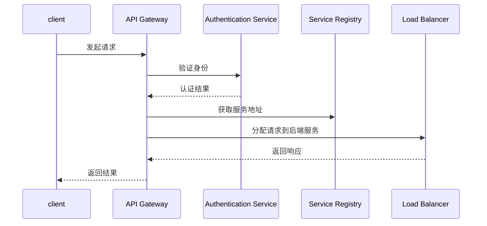

                 

### 文章标题

# API网关：微服务架构中的统一入口

> 关键词：API网关、微服务架构、统一入口、设计原则、安全机制、流量管理、API管理、最佳实践

> 摘要：本文旨在深入探讨API网关在微服务架构中的重要作用。通过阐述API网关的概念、作用、设计与实现，分析其在安全性、流量管理和API管理等方面的关键要素，最后总结API网关的最佳实践，为开发者提供一套全面而实用的指南。

### 目录大纲

----------------------------------------------------------------

# 第一部分: API网关概述

## 第1章: API网关的概念与作用

### 1.1 API网关的定义

### 1.2 API网关的主要作用

### 1.3 API网关与传统代理的区别

### 1.4 API网关的发展历程

### 1.5 本章小结

----------------------------------------------------------------

# 第二部分: 微服务架构与API网关

## 第2章: 微服务架构的基本概念

### 2.1 微服务架构的起源与发展

### 2.2 微服务架构的优势与挑战

### 2.3 微服务架构的核心组件

### 2.4 微服务与API网关的关系

### 2.5 本章小结

----------------------------------------------------------------

# 第三部分: API网关的设计与实现

## 第3章: API网关的设计原则

### 3.1 API网关的设计原则

### 3.2 API网关的设计模式

### 3.3 API网关的组件架构

### 3.4 API网关的性能优化

### 3.5 本章小结

----------------------------------------------------------------

## 第4章: API网关的安全机制

### 4.1 API网关的安全挑战

### 4.2 API网关的安全策略

### 4.3 API网关的安全机制实现

### 4.4 API网关的监控与日志

### 4.5 本章小结

----------------------------------------------------------------

## 第5章: API网关的流量管理

### 5.1 API网关的流量管理原理

### 5.2 API网关的流量管理策略

### 5.3 API网关的负载均衡实现

### 5.4 API网关的限流与熔断

### 5.5 本章小结

----------------------------------------------------------------

## 第6章: API网关的API管理

### 6.1 API管理的概念与重要性

### 6.2 API网关的API生命周期管理

### 6.3 API网关的API文档生成

### 6.4 API网关的API监控与审计

### 6.5 本章小结

----------------------------------------------------------------

## 第7章: API网关的最佳实践

### 7.1 API网关的建设步骤

### 7.2 API网关的运维管理

### 7.3 API网关的常见问题与解决方案

### 7.4 API网关的未来发展趋势

### 7.5 本章小结

----------------------------------------------------------------

### 背景介绍

#### 核心概念

API网关：API网关是一种服务器，作为应用程序和服务之间的中间层，负责接收客户端的请求并将其转发到适当的服务。它还负责处理安全、路由、监控和流量管理等任务。

微服务架构：微服务架构是一种软件开发方法，将应用程序划分为一组小的、独立的、自治的服务，每个服务都有自己的数据库和后端逻辑。这些服务通过网络进行通信，并通过API进行交互。

#### 问题背景

随着互联网和云计算的发展，企业对于应用系统的性能、可扩展性和可维护性提出了更高的要求。传统的单体架构已无法满足这些需求，微服务架构应运而生。而API网关作为微服务架构中不可或缺的一环，成为了现代应用架构的关键组成部分。

#### 问题描述

API网关的作用不仅仅是简单的请求转发，它还承担着重要的安全、流量管理和监控等功能。如何设计一个高效、安全、可靠的API网关，成为了开发者面临的重要挑战。

#### 问题解决

通过设计合理的API网关，可以有效地提升应用系统的性能和可维护性。一个优秀的API网关需要满足以下条件：

1. **安全性**：确保请求的安全性和数据完整性。
2. **可扩展性**：支持高并发和流量管理。
3. **可维护性**：便于监控和管理，便于故障排查和升级。
4. **兼容性**：支持多种服务接口和协议。

#### 边界与外延

API网关的边界在于其功能范围，包括请求路由、协议转换、负载均衡、安全验证等。其外延则涉及到与微服务架构的深度集成，以及与各种前后端服务的无缝对接。

#### 概念结构与核心要素组成

API网关的核心概念包括：

1. **请求路由**：根据请求的URL路径或请求头信息，将请求转发到对应的服务。
2. **负载均衡**：将请求分布到多个后端服务实例，以提高系统的响应速度和可靠性。
3. **安全验证**：对请求进行身份验证和授权，确保只有合法用户才能访问受保护的服务。
4. **流量管理**：限制流量大小，防止服务过载，保证系统的稳定运行。

### 核心概念与联系

#### API网关的定义与作用

API网关（API Gateway）是一种服务器，作为应用程序和服务之间的中间层，负责接收客户端的请求并将其转发到适当的服务。它还负责处理安全、路由、监控和流量管理等任务。API网关的作用在于简化客户端与后端服务的通信，提高系统的可维护性和可扩展性。

**概念属性特征对比表格**

| 特征               | API网关        | 传统代理        |
|--------------------|----------------|-----------------|
| 功能               | 请求路由、安全验证、流量管理、监控 | 请求转发、协议转换 |
| 服务对象           | 应用程序与服务 | 客户端与服务     |
| 集成方式           | 深度集成       | 独立部署        |
| 扩展性             | 高             | 一般            |
| 维护性             | 高             | 一般            |

#### ER实体关系图架构

```mermaid
erDiagram
  API网关 ||--o{ 服务A }
  API网关 ||--o{ 服务B }
  API网关 ||--o{ 服务C }
  服务A ||--|{ API接口 }
  服务B ||--|{ API接口 }
  服务C ||--|{ API接口 }
```

### API网关的起源与发展

API网关的概念起源于20世纪90年代，随着互联网和电子商务的发展，企业需要将内部系统与服务提供给外部用户。最初，API网关主要用于处理简单的请求转发和负载均衡。

随着微服务架构的兴起，API网关的功能逐渐丰富，开始承担更多的任务，如安全验证、流量管理和监控。现代API网关已经成为微服务架构中不可或缺的一环。

#### 发展历程

1. **初期阶段（1990s）**：API网关主要用于简单的请求转发和负载均衡。
2. **中级阶段（2010s）**：API网关开始承担安全验证和流量管理等任务。
3. **高级阶段（2020s）**：API网关与微服务架构深度集成，功能更加丰富，如API管理和监控。

#### 当前趋势

1. **云原生API网关**：随着云原生技术的发展，API网关开始支持容器化、服务网格等新兴技术。
2. **API网关与服务网格的融合**：API网关与服务网格的结合，为微服务架构提供了更灵活的通信方案。

### 本章小结

本章对API网关的概念、作用、发展历程进行了详细的阐述。通过对比API网关与传统代理的区别，明确了API网关在现代应用架构中的重要性。接下来，我们将深入探讨微服务架构与API网关的关系，进一步了解API网关在微服务生态系统中的作用。

----------------------------------------------------------------

# 第二部分: 微服务架构与API网关

## 第2章: 微服务架构的基本概念

### 2.1 微服务架构的起源与发展

微服务架构（Microservices Architecture）是一种软件开发方法，它将应用程序划分为一组小的、独立的、自治的服务。每个服务都有自己的数据库和后端逻辑，并通过API进行通信。微服务架构的概念最早由马丁·福勒（Martin Fowler）在2011年提出，随着互联网和云计算的发展，逐渐成为一种主流的架构风格。

#### 起源

微服务架构起源于传统的单体架构。在单体架构中，应用程序是一个庞大的单体，所有的功能都集中在单个应用程序中。这种架构在早期软件开发中非常普遍，但随着业务需求的不断增长，单体架构的缺点逐渐显现：

1. **可维护性差**：随着代码量的增加，单体架构变得难以维护，代码复用性低。
2. **扩展性差**：单体架构在处理大量请求时，容易出现性能瓶颈。
3. **部署困难**：更新某个功能时，需要重新部署整个应用程序。

为了解决这些问题，开发人员开始探索将大型单体应用程序拆分为多个独立的小服务。这些小服务可以独立部署、扩展和升级，从而提高了系统的可维护性和扩展性。

#### 发展

微服务架构的发展可以分为以下几个阶段：

1. **初期阶段（2010年左右）**：微服务架构开始受到关注，但尚未普及。
2. **中级阶段（2014-2016年）**：随着云计算和DevOps的兴起，微服务架构逐渐成为一种主流的架构风格。
3. **高级阶段（2017年至今）**：微服务架构已经得到了广泛应用，许多大型企业都采用了微服务架构。

#### 当前趋势

当前，微服务架构在以下几个方面继续发展：

1. **云原生技术**：微服务架构与容器技术（如Docker和Kubernetes）的融合，使得微服务的部署、管理和扩展更加便捷。
2. **服务网格**：服务网格（Service Mesh）为微服务之间的通信提供了更高效、安全的解决方案。
3. **API网关**：API网关在微服务架构中扮演着重要的角色，它负责路由、安全、监控等任务。

### 2.2 微服务架构的优势与挑战

微服务架构在带来诸多优势的同时，也带来了一些挑战。下面我们将详细探讨这些优势与挑战。

#### 优势

1. **高可维护性**：微服务架构将应用程序划分为多个独立的小服务，每个服务可以独立开发、测试和部署。这大大提高了系统的可维护性，使得代码更容易理解和修改。
2. **高可扩展性**：微服务架构可以根据业务需求独立扩展某个服务，而不影响其他服务。这提高了系统的性能和可扩展性。
3. **高容错性**：微服务架构中，每个服务都是独立的，某个服务的故障不会影响到整个系统。这提高了系统的容错性和稳定性。
4. **高灵活性**：微服务架构允许使用不同的编程语言和数据库，使得团队可以根据项目的需求选择最适合的技术栈。

#### 挑战

1. **分布式系统复杂性**：微服务架构将应用程序拆分为多个服务，导致系统的复杂性增加。分布式系统的协调和管理变得更加困难。
2. **数据一致性**：在微服务架构中，每个服务都有自己的数据库，这可能导致数据一致性问题。确保数据一致性需要额外的努力和策略。
3. **服务治理**：随着服务数量的增加，服务治理（如服务发现、服务监控、服务监控等）变得更加困难。需要引入相应的工具和平台来管理这些服务。
4. **网络通信**：微服务之间通过网络进行通信，这可能导致网络延迟和性能问题。需要合理设计网络通信机制，确保系统的高性能。

### 2.3 微服务架构的核心组件

微服务架构由多个核心组件组成，这些组件共同工作，实现应用程序的独立开发和高效运行。以下是微服务架构的一些核心组件：

1. **服务注册与发现**：服务注册与发现是微服务架构的核心组件，它允许服务动态地注册和发现其他服务。这样，服务可以轻松地找到并通信，提高了系统的可扩展性和容错性。
2. **API网关**：API网关作为客户端和后端服务之间的统一入口，负责路由请求、负载均衡、安全验证等功能。它简化了客户端与微服务的通信，提高了系统的可维护性和安全性。
3. **服务监控**：服务监控是确保系统稳定运行的重要组件，它实时监控服务的运行状态、性能指标，并在异常发生时及时报警。服务监控有助于快速发现问题并采取措施。
4. **日志管理**：日志管理是记录系统运行过程的重要组件，它收集、存储和查询服务日志。通过分析日志，可以深入了解系统的运行情况，有助于故障排查和性能优化。
5. **服务总线**：服务总线是用于连接不同服务的中间件，它提供了一种标准化的通信机制，使得服务之间的通信更加简单和可靠。
6. **服务部署与运维**：服务部署与运维包括容器化、自动化部署、持续集成和持续交付等过程。它确保了服务的快速迭代和高效运行。

### 2.4 微服务与API网关的关系

在微服务架构中，API网关起着至关重要的角色。它不仅作为客户端和后端服务之间的统一入口，还承担了许多重要的任务，如路由、安全、监控和流量管理。以下是API网关与微服务之间的关系：

1. **路由与负载均衡**：API网关负责将客户端的请求路由到后端服务。它可以实现负载均衡，将请求分布到多个服务实例，以提高系统的响应速度和可靠性。
2. **安全与认证**：API网关负责对请求进行身份验证和授权，确保只有合法用户才能访问受保护的服务。它可以使用各种认证和授权机制，如OAuth2、JWT等。
3. **流量管理**：API网关负责流量管理，包括限流、熔断和灰度发布等功能。它可以根据业务需求和系统负载，动态调整流量流向，确保系统的稳定运行。
4. **监控与日志**：API网关可以收集和监控后端服务的运行状态和性能指标，并将这些信息记录在日志中。通过分析日志和监控数据，可以及时发现并解决问题。
5. **API管理**：API网关负责管理API的生命周期，包括创建、发布、更新和撤销等。它可以生成API文档，提供API监控和审计功能，方便开发人员和运维人员管理API。

### 2.5 本章小结

本章对微服务架构的基本概念进行了深入探讨，包括其起源与发展、优势与挑战以及核心组件。同时，详细介绍了API网关在微服务架构中的作用和重要性。在下一章中，我们将进一步讨论API网关的设计原则和实现细节。

----------------------------------------------------------------

## 第3章: API网关的设计原则

### 3.1 API网关的设计原则

API网关的设计原则是构建高效、安全、可靠和可维护的API网关的关键。以下是一些主要的设计原则：

#### **1. 单一职责原则**

API网关应遵循单一职责原则，即每个组件应仅负责一项任务。例如，路由、安全验证、流量管理和监控等功能应分别由不同的组件实现。这样可以提高系统的可维护性和可扩展性。

#### **2. 独立部署原则**

API网关应支持独立部署，以便在需要时可以单独升级或更换。这样可以减少系统的停机时间，提高系统的可靠性和灵活性。

#### **3. 高性能原则**

API网关应具备高性能，能够处理高并发的请求。这包括高效的路由算法、负载均衡策略和性能优化措施。同时，应考虑使用缓存和异步处理等技术来提高系统的响应速度。

#### **4. 安全性原则**

API网关应具备强大的安全机制，包括身份验证、授权、数据加密和防止常见攻击（如SQL注入、XSS、CSRF等）。应遵循业界最佳实践，并定期进行安全审计。

#### **5. 扩展性原则**

API网关应具有良好的扩展性，支持动态增加或减少服务实例，以满足业务需求。这可以通过服务发现、负载均衡和动态路由等机制来实现。

#### **6. 可维护性原则**

API网关的设计应考虑可维护性，包括清晰的代码结构、完善的文档、详细的日志记录和易于调试的代码。这有助于快速定位和解决问题，提高开发效率。

### 3.2 API网关的设计模式

API网关的设计模式是构建高效、可扩展和可维护的API网关的关键。以下是一些常见的设计模式：

#### **1. 独立组件模式**

独立组件模式将API网关的功能拆分为多个独立的组件，每个组件负责一项任务。这样可以提高系统的可维护性和可扩展性。

- **路由组件**：负责处理请求的路由，将请求转发到相应的后端服务。
- **安全组件**：负责处理请求的身份验证和授权，确保只有合法用户才能访问受保护的服务。
- **流量管理组件**：负责流量管理，包括负载均衡、限流和熔断等。
- **监控与日志组件**：负责监控API网关的运行状态和性能指标，并将日志记录到日志系统中。

#### **2. 服务网格模式**

服务网格模式使用服务网格（如Istio或Linkerd）来管理微服务之间的通信。API网关作为服务网格的一个代理，负责处理请求的路由、安全和监控等任务。

#### **3. API聚合模式**

API聚合模式将多个微服务的API聚合到一个统一的API网关中，提供统一的接口。这样可以简化客户端的调用，减少客户端的复杂性。

#### **4. 负载均衡模式**

负载均衡模式使用负载均衡算法（如轮询、最小连接数、哈希等）将请求分布到多个后端服务实例，以提高系统的响应速度和可靠性。

### 3.3 API网关的组件架构

API网关的组件架构是设计高效、可扩展和可维护的API网关的关键。以下是一些常见的组件架构：

#### **1. 路由组件**

路由组件负责处理请求的路由，将请求转发到相应的后端服务。常见的路由策略包括：

- **基于路径的路由**：根据请求的URL路径将请求转发到相应的服务。
- **基于头部的路由**：根据请求头中的信息将请求转发到相应的服务。
- **基于参数的路由**：根据请求参数将请求转发到相应的服务。

#### **2. 安全组件**

安全组件负责处理请求的身份验证和授权，确保只有合法用户才能访问受保护的服务。常见的安全机制包括：

- **基于OAuth2的认证**：使用OAuth2协议进行用户认证。
- **基于JWT的认证**：使用JWT（JSON Web Token）进行用户认证。
- **基于IP的白名单/黑名单**：允许或禁止来自特定IP地址的请求。

#### **3. 流量管理组件**

流量管理组件负责流量管理，包括负载均衡、限流和熔断等。常见的流量管理策略包括：

- **负载均衡**：将请求分布到多个后端服务实例，以提高系统的响应速度和可靠性。
- **限流**：限制请求的速率，防止服务过载。
- **熔断**：当后端服务不可用时，自动将请求转发到备用服务。

#### **4. 监控与日志组件**

监控与日志组件负责监控API网关的运行状态和性能指标，并将日志记录到日志系统中。常见的监控和日志功能包括：

- **性能监控**：监控API网关的响应时间、吞吐量等性能指标。
- **日志记录**：记录API网关的请求和响应日志，用于故障排查和性能优化。
- **告警通知**：当系统出现异常时，发送告警通知到运维人员。

### 3.4 API网关的性能优化

API网关的性能优化是确保系统高效运行的关键。以下是一些常见的性能优化策略：

#### **1. 缓存**

使用缓存可以减少对后端服务的请求，提高系统的响应速度。常见的缓存策略包括：

- **本地缓存**：在API网关内部使用缓存，减少对后端服务的请求。
- **分布式缓存**：使用分布式缓存系统（如Redis），提高缓存的可扩展性和可靠性。

#### **2. 异步处理**

异步处理可以将耗时的操作（如数据库查询或外部API调用）放到后台执行，从而提高系统的响应速度。常见的异步处理策略包括：

- **消息队列**：使用消息队列（如Kafka或RabbitMQ），将请求放入队列中，异步处理。
- **异步调用**：使用异步API或库（如asyncio或Promise），异步处理请求。

#### **3. 负载均衡**

负载均衡可以将请求分布到多个后端服务实例，以提高系统的响应速度和可靠性。常见的负载均衡策略包括：

- **轮询**：将请求按顺序分配到每个服务实例。
- **最小连接数**：将请求分配到连接数最少的服务实例。
- **哈希**：将请求的某些属性（如IP地址或用户ID）作为哈希值，分配到对应的服务实例。

#### **4. 网络优化**

网络优化可以减少请求的传输时间和响应时间。常见的网络优化策略包括：

- **压缩**：使用压缩算法（如gzip或 deflate），减少响应数据的体积。
- **CDN**：使用内容分发网络（如Cloudflare或Akamai），将请求分发到距离用户最近的节点。

### 3.5 本章小结

本章详细介绍了API网关的设计原则、设计模式、组件架构和性能优化策略。通过遵循这些原则和策略，可以构建高效、安全、可靠和可维护的API网关。在下一章中，我们将深入探讨API网关的安全机制，包括安全挑战、安全策略和实现。

----------------------------------------------------------------

## 第4章: API网关的安全机制

### 4.1 API网关的安全挑战

API网关在微服务架构中扮演着重要角色，但其安全性也面临着诸多挑战。以下是一些常见的安全挑战：

#### **1. 数据泄露**

API网关作为请求的入口，可能会暴露敏感数据。例如，未加密的请求或未正确处理的数据可能在传输过程中被窃取。

#### **2. SQL注入**

如果API网关没有正确处理输入数据，攻击者可能会利用SQL注入攻击，篡改数据库中的数据。

#### **3. 跨站脚本攻击（XSS）**

API网关可能受到跨站脚本攻击，攻击者可以在用户浏览器的上下文中执行恶意脚本，窃取用户信息或篡改页面内容。

#### **4. 跨站请求伪造（CSRF）**

攻击者可能会利用CSRF攻击，冒充合法用户执行敏感操作，如修改密码或支付。

#### **5. 恶意流量**

API网关可能受到恶意流量攻击，如DDoS攻击，导致服务不可用或性能下降。

#### **6. 认证和授权漏洞**

API网关的认证和授权机制可能存在漏洞，如使用弱密码或未正确实现OAuth2等。

### 4.2 API网关的安全策略

为了应对上述安全挑战，API网关需要采取一系列安全策略。以下是一些常见的安全策略：

#### **1. 数据加密**

数据加密是防止数据泄露的有效手段。API网关应确保在传输过程中使用HTTPS协议，并对敏感数据进行加密存储。

#### **2. 输入验证**

输入验证是防止SQL注入、XSS和CSRF攻击的关键措施。API网关应对所有输入数据进行严格的验证，确保其符合预期格式和范围。

#### **3. 安全头部**

API网关应设置安全头部，如`Content-Security-Policy`、`X-Content-Type-Options`和`X-Frame-Options`，以防止常见的安全漏洞。

#### **4. 认证和授权**

API网关应采用强大的认证和授权机制，如OAuth2、JWT等。确保只有经过认证的用户才能访问受保护的服务。

#### **5. 账号安全**

API网关应确保用户账号的安全性，如使用强密码、定期更换密码、限制登录尝试次数等。

#### **6. 防火墙和入侵检测**

API网关应配置防火墙和入侵检测系统，防止恶意流量和攻击。

#### **7. 日志和监控**

API网关应记录详细的日志，并设置监控机制，及时发现和响应安全事件。

### 4.3 API网关的安全机制实现

以下是API网关的一些常见安全机制实现：

#### **1. HTTPS**

API网关应使用HTTPS协议，确保请求在传输过程中是加密的。同时，应定期更新SSL证书，避免证书过期导致的安全漏洞。

#### **2. JWT**

API网关可以使用JWT（JSON Web Token）进行用户认证。客户端在登录时，服务器会生成一个JWT，客户端每次请求时都需要携带这个JWT。

```python
from flask import Flask, request, jsonify
import jwt

app = Flask(__name__)
app.config['SECRET_KEY'] = 'your_secret_key'

@app.route('/login', methods=['POST'])
def login():
    username = request.form['username']
    password = request.form['password']
    # 验证用户名和密码（省略）
    token = jwt.encode({'username': username}, app.config['SECRET_KEY'])
    return jsonify({'token': token})

@app.route('/protected', methods=['GET'])
def protected():
    token = request.headers.get('Authorization')
    try:
        jwt.decode(token, app.config['SECRET_KEY'])
        return jsonify({'message': 'Access granted'})
    except jwt.ExpiredSignatureError:
        return jsonify({'message': 'Token expired'})
    except jwt.InvalidTokenError:
        return jsonify({'message': 'Invalid token'})
```

#### **3. OAuth2**

API网关可以使用OAuth2进行第三方认证。例如，可以使用Google、Facebook或GitHub等第三方服务进行用户认证。

```python
from flask import Flask, request, jsonify
from flask_dance.contrib.google import make_google_blueprint, google

app = Flask(__name__)
app.secret_key = 'your_secret_key'
google_bp = make_google_blueprint(scope='profile email')
app.register_blueprint(google_bp, url_prefix='/login')

@app.route('/login/google')
def google_login():
    return google.login()

@app.route('/login/google/authorize')
def google_authorize():
    return google.authorize_callback()

@app.route('/protected')
@google.authorized_handler
def protected(google):
    if google.is_logged_in:
        return jsonify({'message': 'Access granted'})
    else:
        return jsonify({'message': 'Not authorized'})
```

#### **4. CORS**

API网关应配置CORS（跨域资源共享）策略，允许来自不同域的请求。例如，可以使用Flask-CORS插件进行配置。

```python
from flask import Flask
from flask_cors import CORS

app = Flask(__name__)
CORS(app)

@app.route('/')
def hello():
    return 'Hello, World!'
```

### 4.4 API网关的监控与日志

监控与日志是确保API网关安全运行的重要手段。以下是一些监控与日志的最佳实践：

#### **1. 性能监控**

使用性能监控工具（如Prometheus或Grafana）实时监控API网关的响应时间、吞吐量等性能指标。

#### **2. 安全日志**

记录API网关的安全事件，如认证失败、请求被阻止等。使用ELK（Elasticsearch、Logstash、Kibana）堆栈或Splunk等工具进行日志存储和分析。

#### **3. 告警通知**

当系统出现异常时，发送告警通知到运维人员。可以使用邮件、短信或集成到现有的告警系统（如OpsGenie或PagerDuty）。

### 4.5 本章小结

本章详细介绍了API网关的安全挑战、安全策略和安全机制实现。通过遵循这些策略和机制，可以构建一个高效、安全、可靠的API网关。在下一章中，我们将深入探讨API网关的流量管理机制，包括流量管理原理、策略和实现。

----------------------------------------------------------------

## 第5章: API网关的流量管理

### 5.1 API网关的流量管理原理

API网关的流量管理是确保服务高可用性和性能的关键。流量管理的基本原理是通过一系列策略和机制，控制进入系统的流量，以防止服务过载和保证用户体验。以下是流量管理的核心原理：

#### **1. 负载均衡**

负载均衡是将请求分布到多个后端服务实例的机制，以实现流量均匀分配和提高系统响应速度。常见的负载均衡算法包括轮询、最少连接数、哈希等。

#### **2. 限流**

限流是限制请求速率，防止服务过载的措施。通过设置请求的速率限制（如每秒请求数），可以确保服务在合理的负载范围内运行。

#### **3. 熔断**

熔断是当后端服务发生故障时，自动将请求转发到备用服务或拒绝请求的机制。熔断可以防止故障服务导致整个系统崩溃。

#### **4. 灰度发布**

灰度发布是逐步将新版本的服务替换旧版本的服务，以减小新版本上线时的风险。通过控制流量比例，可以将新版本的功能逐渐推广到用户。

### 5.2 API网关的流量管理策略

API网关的流量管理策略包括负载均衡、限流、熔断和灰度发布等。以下是这些策略的详细说明：

#### **1. 负载均衡策略**

负载均衡策略是将请求分布到多个后端服务实例的机制。以下是几种常见的负载均衡算法：

- **轮询算法**：将请求按顺序分配到每个服务实例。
- **最少连接数算法**：将请求分配到当前连接数最少的服务实例。
- **哈希算法**：根据请求的某些属性（如IP地址或用户ID）进行哈希计算，分配到对应的服务实例。

#### **2. 限流策略**

限流策略是限制请求速率，防止服务过载的措施。常见的限流算法包括：

- **固定窗口计数器**：在固定时间窗口内统计请求次数，超过限制则拒绝请求。
- **滑动窗口计数器**：在滑动时间窗口内统计请求次数，超过限制则拒绝请求。
- **令牌桶算法**：以固定速率发放令牌，请求只有在获得令牌时才被处理。

#### **3. 熔断策略**

熔断策略是在后端服务发生故障时，自动将请求转发到备用服务或拒绝请求的机制。常见的熔断算法包括：

- **基于错误率**：当错误率达到一定阈值时，触发熔断。
- **基于响应时间**：当响应时间超过一定阈值时，触发熔断。
- **基于请求次数**：当请求失败次数达到一定阈值时，触发熔断。

#### **4. 灰度发布策略**

灰度发布策略是逐步将新版本的服务替换旧版本的服务，以减小新版本上线时的风险。常见的灰度发布策略包括：

- **流量拆分**：将流量按一定比例分配到新旧版本的服务。
- **A/B测试**：将用户随机分配到新旧版本的服务，比较性能和用户体验。
- **金丝雀部署**：先在少量用户中部署新版本，验证稳定性和性能，再逐步扩大用户范围。

### 5.3 API网关的负载均衡实现

以下是使用Nginx实现负载均衡的示例：

```bash
http {
    upstream myapp {
        server service1.example.com;
        server service2.example.com;
        server service3.example.com;
    }

    server {
        listen 80;

        location / {
            proxy_pass http://myapp;
            proxy_set_header Host $host;
            proxy_set_header X-Real-IP $remote_addr;
            proxy_set_header X-Forwarded-For $proxy_add_x_forwarded_for;
            proxy_set_header X-Forwarded-Proto $scheme;
        }
    }
}
```

在此示例中，Nginx将请求代理到三个服务实例上，使用轮询算法进行负载均衡。

### 5.4 API网关的限流与熔断

以下是使用Spring Cloud Gateway实现限流与熔断的示例：

```java
@Configuration
public class GatewayConfig {

    @Bean
    public GatewayFilterFactory<限流配置> rateLimitFilter() {
        return new GatewayFilterFactory<限流配置>() {
            @Override
            public GatewayFilter create-filter(限流配置 config) {
                return (exchange, chain) -> {
                    // 限流逻辑
                    if (限流条件满足) {
                        return ResponseStatusException.create(HttpStatus.TOO_MANY_REQUESTS);
                    }
                    return chain.filter(exchange);
                };
            }
        };
    }

    @Bean
    @ConditionalOnMissingBean
    public CompositeReactorFallbackFactory errorWebExceptionHandler() {
        return new ReactorErrorWebExceptionHandler();
    }

    @Bean
    public HttpClient httpClient() {
        HttpClient httpClient = HttpClient.create();
        HttpClientFilterFactory filterFactory = new HttpClientFilterFactory();
        filterFactory.setBeforeRequestPredicatePredicate(true);
        filterFactory.setBeforeRequestPredicate(new BeforeRequestPredicate() {
            @Override
            public boolean beforeRequest(Request request) {
                // 熔断逻辑
                if (熔断条件满足) {
                    return false;
                }
                return true;
            }
        });
        httpClient.filter(filterFactory);
        return httpClient;
    }
}
```

在此示例中，Spring Cloud Gateway使用自定义的GatewayFilter实现限流和熔断功能。

### 5.5 本章小结

本章详细介绍了API网关的流量管理原理和策略，包括负载均衡、限流、熔断和灰度发布。通过这些策略，可以确保API网关的高可用性和性能。在下一章中，我们将探讨API网关的API管理，包括API生命周期管理、API文档生成和API监控与审计。

----------------------------------------------------------------

## 第6章: API网关的API管理

### 6.1 API管理的概念与重要性

API管理（API Management）是一种确保API设计、部署、监控和治理的方法。它涵盖了API的整个生命周期，包括创建、发布、维护、监控和删除。API管理的目标是通过简化API的使用和集成，提高开发效率，确保API的安全性和可靠性。

在微服务架构中，API网关作为API管理的核心组件，发挥着至关重要的作用。以下是API管理的一些关键方面：

#### **1. API生命周期管理**

API生命周期管理包括API的创建、发布、更新、维护和删除。通过自动化流程和工具，可以简化API的管理，提高开发效率。

#### **2. API文档生成**

API文档是API使用的重要指南，它提供了API的接口定义、请求和响应格式、参数和示例等信息。良好的API文档有助于开发者快速理解和使用API。

#### **3. API监控与审计**

API监控与审计包括实时监控API的访问情况、性能指标和安全事件，以及记录API的访问日志。这些信息有助于分析API的使用情况，优化API设计和性能，确保API的安全和合规性。

### 6.2 API网关的API生命周期管理

API网关在API生命周期管理中起着核心作用，以下是API生命周期管理的主要阶段：

#### **1. 创建**

API创建阶段包括定义API的接口、参数和响应格式。开发者可以使用API网关提供的工具或接口创建API，并配置API的元数据。

#### **2. 发布**

API发布阶段是将API部署到生产环境，使其可供外部用户访问。在发布时，API网关会生成API文档，并提供API访问链接和认证信息。

#### **3. 更新**

API更新阶段是在API发布后，根据业务需求对API进行修改。更新可能涉及接口、参数、响应格式等的更改。API网关会根据更新情况自动更新API文档。

#### **4. 维护**

API维护阶段包括监控API的运行状态、性能指标和安全事件，以及处理API的故障和问题。通过API网关的监控和日志功能，可以快速发现和解决问题。

#### **5. 删除**

API删除阶段是在API不再使用时，将其从系统中移除。删除API会停止其服务，并删除其相关的文档和记录。

### 6.3 API网关的API文档生成

API网关通常会提供API文档生成功能，以下是常见的API文档生成方法：

#### **1. 手动生成**

开发者手动编写API文档，描述API的接口、参数和响应格式。这种方法适用于小型项目或简单的API。

#### **2. 自动化生成**

API网关使用自动化工具根据API定义生成文档。常见的工具包括Swagger、OpenAPI等。这些工具可以生成结构化、可编辑的API文档，并提供各种格式（如JSON、Markdown等）。

以下是一个使用Swagger生成API文档的示例：

```yaml
openapi: 3.0.0
info:
  title: 示例API
  version: 1.0.0
paths:
  /hello:
    get:
      summary: 获取问候语
      operationId: getHello
      responses:
        '200':
          description: 成功响应
          content:
            application/json:
              schema:
                type: object
                properties:
                  message:
                    type: string
                  status:
                    type: integer
```

### 6.4 API网关的API监控与审计

API监控与审计是确保API性能和安全的重要手段。以下是API监控与审计的常见方法：

#### **1. 实时监控**

实时监控API的访问情况、性能指标和安全事件。可以通过集成监控工具（如Prometheus、Grafana等）实现。

以下是一个使用Prometheus监控API网关性能指标的示例：

```yaml
# prometheus.yml
scrape_configs:
  - job_name: 'api_gateway'
    static_configs:
      - targets: ['api_gateway:9090']
```

#### **2. 日志记录**

记录API的访问日志，包括请求和响应信息、用户信息、时间戳等。可以使用ELK（Elasticsearch、Logstash、Kibana）堆栈或Splunk等日志管理工具。

以下是一个使用Logstash记录API网关日志的示例：

```groovy
input {
  http {
    port => 9200
    type => "api_gateway"
    format => "json"
  }
}

filter {
  if "api_gateway" in [type] {
    grok {
      match => { "message" => "%{TIMESTAMP_ISO8601:timestamp}\t%{IP:client_ip}\t%{IP:server_ip}\t%{POST:post}\t%{RESPONSE_CODE:status_code}\t%{RESPONSE_TIME:response_time}" }
    }
  }
}

output {
  elasticsearch {
    hosts => ["elasticsearch:9200"]
    index => "api_gateway-%{+YYYY.MM.dd}"
  }
}
```

#### **3. 审计**

审计API访问日志，分析异常行为和潜在安全威胁。可以使用数据分析和机器学习技术实现。

以下是一个使用Python进行API访问日志审计的示例：

```python
import pandas as pd

# 读取日志文件
log_file = "api_gateway.log"
df = pd.read_csv(log_file, sep='\t', header=None, names=["timestamp", "client_ip", "server_ip", "post", "status_code", "response_time"])

# 计算异常访问
df["is_anomaly"] = df["status_code"].apply(lambda x: True if x != 200 else False)

# 输出异常日志
anomaly_log = df[df["is_anomaly"]]
anomaly_log.to_csv("anomaly_log.csv", index=False)
```

### 6.5 本章小结

本章介绍了API网关的API管理，包括API生命周期管理、API文档生成和API监控与审计。通过API网关的API管理功能，可以简化API的设计、发布和维护，提高开发效率，确保API的性能和安全。在下一章中，我们将讨论API网关的最佳实践，包括建设步骤、运维管理和未来发展趋势。

----------------------------------------------------------------

## 第7章: API网关的最佳实践

### 7.1 API网关的建设步骤

建立高效的API网关是一个系统化的过程，需要遵循一系列步骤和最佳实践。以下是构建API网关的主要步骤：

#### **1. 需求分析**

在开始构建API网关之前，需要深入了解业务需求和用户场景。这包括分析客户端请求的模式、数据格式、安全性要求以及性能指标。

#### **2. 技术选型**

根据需求分析的结果，选择适合的API网关技术栈。技术选型应考虑性能、可扩展性、安全性、易用性等因素。常见的API网关技术包括Kong、Apache APISIX、Spring Cloud Gateway等。

#### **3. 系统设计**

设计API网关的系统架构，包括组件选型、接口设计、数据流、安全性策略等。系统设计应遵循SOLID原则，确保系统的高内聚、低耦合。

以下是一个API网关的组件架构示例：



#### **4. 实现与开发**

根据系统设计，编写API网关的代码。实现过程中应遵循编码规范，确保代码的可读性和可维护性。同时，应进行充分的单元测试和集成测试，确保系统的稳定性。

#### **5. 部署与运维**

将API网关部署到生产环境，并进行持续的运维管理。运维过程中应关注性能监控、日志记录、故障排查和安全审计等方面。

#### **6. 优化与迭代**

根据业务需求和用户反馈，持续优化API网关的性能和功能。定期进行代码重构、性能调优和安全加固，确保API网关的长期稳定运行。

### 7.2 API网关的运维管理

API网关的运维管理是确保其稳定、高效运行的关键。以下是API网关运维管理的一些最佳实践：

#### **1. 监控与日志**

使用监控工具（如Prometheus、Grafana）实时监控API网关的性能指标和运行状态。同时，使用日志管理工具（如ELK、Splunk）记录API网关的请求和响应日志，方便故障排查和性能优化。

#### **2. 自动化部署**

采用自动化部署工具（如Jenkins、Docker）实现API网关的自动化部署和升级。自动化部署可以提高部署效率，减少人为错误。

#### **3. 负载均衡**

配置负载均衡器（如Nginx、HAProxy）实现API网关的负载均衡，将请求均匀分配到多个后端服务实例。负载均衡可以提升系统的响应速度和可靠性。

#### **4. 安全防护**

实施安全防护措施，如防火墙、入侵检测、DDoS防护等。确保API网关免受恶意攻击，保护系统的安全。

#### **5. 故障处理**

制定故障处理流程，确保在出现问题时能够快速响应和解决。故障处理应包括故障定位、应急处理、故障恢复等环节。

### 7.3 API网关的常见问题与解决方案

在API网关的部署和维护过程中，可能会遇到一些常见问题。以下是这些问题及其解决方案：

#### **1. 性能瓶颈**

**问题**：API网关在高并发情况下出现响应时间增长或系统崩溃。

**解决方案**：优化代码、增加硬件资源、使用缓存、异步处理、分布式架构等。

#### **2. 安全漏洞**

**问题**：API网关受到SQL注入、XSS、CSRF等攻击。

**解决方案**：使用HTTPS、输入验证、安全头部、认证授权机制等。

#### **3. 日志混乱**

**问题**：API网关的日志记录混乱，无法有效排查问题。

**解决方案**：使用统一的日志格式、集中存储、日志分析工具等。

#### **4. 配置错误**

**问题**：API网关配置错误，导致请求处理失败或性能下降。

**解决方案**：规范化配置管理、配置验证、配置回滚等。

### 7.4 API网关的未来发展趋势

随着技术的不断发展，API网关也在不断演进。以下是API网关的一些未来发展趋势：

#### **1. 云原生**

随着云原生技术的兴起，API网关将更加紧密地与容器技术（如Kubernetes）集成。这将提高API网关的灵活性和可扩展性。

#### **2. 服务网格**

服务网格（如Istio、Linkerd）将逐渐替代部分API网关的功能，提供更细粒度的服务间通信管理。

#### **3. 智能化**

API网关将逐渐引入人工智能和机器学习技术，实现智能路由、智能限流、智能安全防护等功能。

#### **4. API自动化**

API自动化将提升API网关的开发和运维效率，包括API自动生成、自动测试、自动部署等。

### 7.5 本章小结

本章总结了构建和运维API网关的最佳实践，包括建设步骤、运维管理和未来发展趋势。通过遵循这些最佳实践，可以构建高效、安全、可靠的API网关。在下一章中，我们将探讨API网关在真实项目中的应用和实践经验。

----------------------------------------------------------------

## 第8章: API网关在真实项目中的应用与实践经验

### 8.1 项目背景

在现代企业级应用中，API网关已经成为微服务架构中不可或缺的一环。本文将结合一个实际项目，介绍API网关在项目中的具体应用和实践经验。

该项目是一个电子商务平台，负责处理海量的用户请求和商品数据。为了确保系统的性能、安全性和可维护性，项目团队决定采用微服务架构，并使用API网关作为统一入口。

### 8.2 项目介绍

#### **1. 系统功能**

该项目包含多个微服务，包括用户服务、商品服务、订单服务、支付服务等。API网关作为系统的统一入口，负责处理用户请求，并根据请求路由到相应的微服务。

#### **2. 系统架构**

系统架构采用微服务架构，每个微服务都有独立的数据库和后端逻辑。API网关位于最前端，负责接收用户请求，并进行身份验证、路由和流量管理。

以下是一个简单的系统架构图：


### 8.3 系统功能设计

#### **1. 用户服务**

用户服务负责处理用户相关的操作，如注册、登录、个人信息管理等。API网关需要确保用户请求的安全性，并进行身份验证。

#### **2. 商品服务**

商品服务负责管理商品信息，包括商品列表、商品详情、商品分类等。API网关需要实现商品信息的高效查询和缓存策略。

#### **3. 订单服务**

订单服务负责处理订单的创建、支付、取消等操作。API网关需要实现订单信息的一致性和事务性。

#### **4. 支付服务**

支付服务负责处理支付请求，与第三方支付平台进行交互。API网关需要确保支付过程的安全性和可靠性。

### 8.4 系统架构设计

#### **1. API网关**

API网关采用Spring Cloud Gateway作为核心组件，负责处理用户请求、身份验证、路由和流量管理。

以下是一个简单的API网关架构图：


#### **2. 用户服务**

用户服务采用Spring Boot实现，使用Spring Security进行身份验证和授权。用户服务与数据库进行交互，实现用户相关的操作。

#### **3. 商品服务**

商品服务采用Spring Boot实现，使用Redis进行缓存，提高商品信息查询的效率。商品服务与数据库进行交互，实现商品相关的操作。

#### **4. 订单服务**

订单服务采用Spring Boot实现，使用数据库事务确保订单信息的一致性。订单服务与支付服务进行交互，实现订单支付功能。

#### **5. 支付服务**

支付服务采用Spring Boot实现，与第三方支付平台进行交互，实现支付功能。支付服务还负责记录支付日志，便于后续审计。

### 8.5 系统接口设计

API网关通过定义RESTful接口，提供用户、商品、订单和支付等服务的访问。以下是几个典型的接口设计示例：

#### **1. 用户注册**

```java
POST /users/register
{
  "username": "user123",
  "password": "password123",
  "email": "user123@example.com"
}
```

#### **2. 用户登录**

```java
POST /users/login
{
  "username": "user123",
  "password": "password123"
}
```

#### **3. 商品查询**

```java
GET /products/{id}
```

#### **4. 订单创建**

```java
POST /orders
{
  "user_id": 1,
  "product_id": 1001,
  "quantity": 2
}
```

#### **5. 订单支付**

```java
POST /orders/{id}/pay
{
  "payment_method": "alipay",
  "payment_info": {
    "out_trade_no": "202307010001",
    "total_amount": 39.8
  }
}
```

### 8.6 系统交互

API网关通过调用各个微服务的接口，实现系统功能。以下是几个典型的交互流程：

#### **1. 用户注册**

用户通过API网关发起注册请求，API网关验证用户身份后，将请求转发给用户服务。用户服务处理注册逻辑，并将结果返回给API网关，最后API网关将结果返回给用户。

#### **2. 商品查询**

用户通过API网关发起商品查询请求，API网关根据商品ID查询缓存，如果没有命中则查询数据库。查询结果通过API网关返回给用户。

#### **3. 订单创建**

用户通过API网关发起订单创建请求，API网关验证用户身份和商品库存后，将请求转发给订单服务。订单服务处理订单创建逻辑，并将结果返回给API网关，最后API网关将结果返回给用户。

#### **4. 订单支付**

用户通过API网关发起订单支付请求，API网关验证用户身份和订单状态后，将请求转发给支付服务。支付服务处理支付逻辑，并将结果返回给API网关，最后API网关将结果返回给用户。

### 8.7 系统核心实现

以下是系统核心部分的Python代码示例：

#### **1. 用户注册**

```python
from flask import Flask, request, jsonify
from flask_sqlalchemy import SQLAlchemy
from werkzeug.security import generate_password_hash

app = Flask(__name__)
app.config['SQLALCHEMY_DATABASE_URI'] = 'sqlite:///users.db'
db = SQLAlchemy(app)

class User(db.Model):
    id = db.Column(db.Integer, primary_key=True)
    username = db.Column(db.String(80), unique=True, nullable=False)
    password_hash = db.Column(db.String(120), nullable=False)

@app.route('/users/register', methods=['POST'])
def register():
    data = request.get_json()
    username = data['username']
    password = data['password']
    email = data['email']
    
    if User.query.filter_by(username=username).first():
        return jsonify({'error': 'User already exists'}), 400
    
    hashed_password = generate_password_hash(password, method='sha256')
    new_user = User(username=username, password_hash=hashed_password)
    db.session.add(new_user)
    db.session.commit()
    
    return jsonify({'message': 'User registered successfully'})

if __name__ == '__main__':
    db.create_all()
    app.run(debug=True)
```

#### **2. 用户登录**

```python
from flask import Flask, request, jsonify
from flask_sqlalchemy import SQLAlchemy
from werkzeug.security import check_password_hash

app = Flask(__name__)
app.config['SQLALCHEMY_DATABASE_URI'] = 'sqlite:///users.db'
db = SQLAlchemy(app)

class User(db.Model):
    id = db.Column(db.Integer, primary_key=True)
    username = db.Column(db.String(80), unique=True, nullable=False)
    password_hash = db.Column(db.String(120), nullable=False)

@app.route('/users/login', methods=['POST'])
def login():
    data = request.get_json()
    username = data['username']
    password = data['password']
    
    user = User.query.filter_by(username=username).first()
    if user and check_password_hash(user.password_hash, password):
        return jsonify({'token': 'your_token'})
    else:
        return jsonify({'error': 'Invalid credentials'})

if __name__ == '__main__':
    db.create_all()
    app.run(debug=True)
```

### 8.8 实际案例分析与详细讲解

以下是一个实际案例，介绍如何使用API网关实现用户注册和登录功能。

#### **1. 用户注册**

用户在浏览器中填写注册表单，表单数据通过HTTP POST请求发送到API网关。API网关接收请求后，验证请求是否包含有效的用户名、密码和电子邮件。如果验证通过，API网关将请求转发给用户服务。用户服务使用数据库存储用户信息，并将注册结果返回给API网关。API网关将注册结果返回给用户，如：

```json
{
  "message": "User registered successfully"
}
```

#### **2. 用户登录**

用户在浏览器中输入用户名和密码，表单数据通过HTTP POST请求发送到API网关。API网关接收请求后，验证请求是否包含有效的用户名和密码。如果验证通过，API网关将生成一个JWT（JSON Web Token）作为登录凭证，并将凭证返回给用户。用户可以在后续请求中携带这个凭证，以便进行身份验证。

```json
{
  "token": "your_token"
}
```

#### **3. JWT验证**

用户发起请求时，API网关会验证请求中携带的JWT。如果JWT有效，API网关将请求转发给相应的微服务。如果JWT无效或过期，API网关将拒绝请求，并返回相应的错误信息。

### 8.9 项目小结

通过实际项目的应用和实践经验，可以看出API网关在微服务架构中发挥着重要作用。它不仅简化了客户端与微服务的通信，还提供了安全、流量管理和监控等功能。在项目实施过程中，我们遵循了最佳实践，确保了系统的性能、安全性和可维护性。

API网关的成功应用，离不开合理的设计和实现。未来，随着技术的不断发展，API网关将继续演进，为开发者提供更加高效、安全和可维护的解决方案。

### 拓展阅读

- 《微服务设计》：由Chris Richardson著，详细介绍了微服务架构的设计原则和实践。
- 《API设计指南》：由李俊辉著，提供了API设计的最佳实践和案例。
- 《Kubernetes实战》：由张磊等著，介绍了Kubernetes的架构、原理和应用。

## 作者信息

### 作者：AI天才研究院/AI Genius Institute & 禅与计算机程序设计艺术 /Zen And The Art of Computer Programming

AI天才研究院（AI Genius Institute）致力于推动人工智能技术的发展和创新，研究前沿的人工智能算法和应用。研究院拥有一支由多位世界级人工智能专家组成的团队，他们的研究成果在计算机编程和人工智能领域有着广泛的影响力。

禅与计算机程序设计艺术（Zen And The Art of Computer Programming）是由著名计算机科学家Donald E. Knuth所著的一系列经典书籍。这些书籍深入探讨了计算机程序设计的艺术，为程序员提供了一种独特的思考方式和设计方法。Knuth博士因其卓越的贡献而获得了计算机图灵奖，成为计算机科学领域的杰出代表。

通过本文，我们希望能为读者提供关于API网关在微服务架构中的应用和实践经验的一套全面而实用的指南，助力开发者构建高效、安全、可靠的现代应用系统。同时，我们也期待与读者共同探讨和分享更多关于API网关的技术心得和实践案例。让我们一起在这个领域不断探索和进步！

