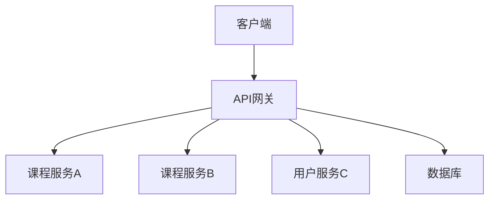

                 

### 《API网关设计：微服务架构的统一入口》

#### 关键词：API网关、微服务架构、统一入口、设计原则、性能优化

#### 摘要：
本文将深入探讨API网关在微服务架构中的重要性，详细讲解API网关的设计原则、架构实现和性能优化策略。通过实例分析，我们将展示API网关的实际应用场景，并提供最佳实践和未来发展趋势。

---

## 目录大纲

1. **引言**
   1.1 API网关的概念与作用
   1.2 微服务架构与API网关的关系
   1.3 API网关的核心功能和组件
   1.4 API网关的重要性

2. **API网关的设计原则**
   2.1 设计原则概述
   2.2 一致性原则
   2.3 安全性原则
   2.4 可扩展性原则

3. **API网关架构实现**
   3.1 架构设计概述
   3.2 API网关的协议支持
   3.3 流量控制机制
   3.4 安全性机制

4. **API网关性能优化**
   4.1 性能优化概述
   4.2 负载均衡策略
   4.3 缓存策略
   4.4 监控与日志

5. **API网关项目实战**
   5.1 项目背景
   5.2 项目架构设计
   5.3 项目实施与优化
   5.4 项目总结与反思

6. **API网关设计最佳实践**
   6.1 最佳实践总结
   6.2 注意事项
   6.3 拓展阅读

7. **未来展望与趋势**
   7.1 API网关的发展趋势
   7.2 技术挑战与机遇
   7.3 未来展望

---

## 第一部分：API网关概述

### 1.1 API网关的概念与作用

API网关（API Gateway）是微服务架构中的一个重要组件，它作为系统的统一入口，负责处理所有外部请求，并将请求路由到适当的内部服务。API网关不仅仅是一个路由器，它还提供了许多额外的功能，如负载均衡、认证授权、缓存、协议转换等。

**API网关的作用：**

- **路由**：将来自客户端的请求路由到正确的微服务。
- **协议转换**：支持不同协议的服务间通信。
- **认证与授权**：确保只有授权用户才能访问受保护的服务。
- **负载均衡**：优化服务之间的请求负载。
- **缓存**：提高响应速度，降低后端服务的压力。
- **日志与监控**：收集和分析系统运行时的数据。

### 1.2 微服务架构与API网关的关系

微服务架构是一种设计模式，它将应用程序分解为独立的、可部署的、可扩展的服务组件。每个服务都运行在自己的进程中，通过轻量级的通信机制（如HTTP/REST或gRPC）相互交互。

**API网关在微服务架构中的作用：**

- **统一接口**：为外部客户端提供统一的API接口，隐藏内部服务的复杂细节。
- **简化部署**：通过集中管理所有服务的入口，简化部署和运维流程。
- **增强安全性**：集中进行认证授权，降低安全风险。
- **提高可扩展性**：通过负载均衡，提高系统的可扩展性。

### 1.3 API网关的核心功能和组件

**核心功能：**

- **路由与负载均衡**：根据请求路径和参数，将请求路由到正确的服务，并实现负载均衡。
- **认证与授权**：验证用户的身份和权限，确保只有授权用户才能访问服务。
- **协议转换**：处理不同协议之间的通信，如将HTTP请求转换为gRPC请求。
- **缓存**：缓存请求和响应，减少后端服务的访问压力。
- **监控与日志**：收集系统运行时的监控数据和日志信息。

**组件：**

- **路由器**：负责请求的路由和负载均衡。
- **认证服务器**：处理认证和授权功能。
- **协议转换器**：实现不同协议之间的转换。
- **缓存服务器**：缓存请求和响应。
- **日志服务器**：收集和分析日志数据。

### 1.4 API网关的重要性

API网关在微服务架构中扮演着至关重要的角色。它不仅提高了系统的可扩展性和安全性，还简化了开发和运维流程。以下是API网关的重要性：

- **简化集成**：通过统一接口，简化了客户端和内部服务的集成。
- **提高性能**：缓存和负载均衡策略提高了系统的响应速度。
- **增强安全性**：集中认证和授权，降低了安全风险。
- **提高可维护性**：集中管理和维护，降低了系统的维护成本。

---

## 第二部分：API网关设计原则

### 2.1 设计原则概述

设计API网关时，需要遵循一系列原则，以确保其稳定性、安全性和可扩展性。以下是一些关键的设计原则：

- **单一职责原则**：每个组件应该只负责一项功能，避免功能混乱。
- **模块化原则**：将系统分解为独立的模块，便于开发和维护。
- **可扩展性原则**：设计时应考虑未来的扩展需求，以便系统可以轻松地增加新的功能或服务。
- **安全性原则**：确保系统中的所有通信都是安全的，防止未授权的访问。

### 2.2 一致性原则

一致性原则要求API网关提供的接口具有一致性，包括数据格式、响应码、接口文档等。一致性可以降低客户端的开发成本，提高系统的易用性。

- **数据格式一致性**：所有接口都使用统一的数据格式，如JSON或XML。
- **响应码一致性**：所有接口都遵循HTTP状态码规范，提供明确的错误信息和提示。
- **接口文档一致性**：使用统一的接口文档工具，如Swagger或OpenAPI，确保文档的准确性和一致性。

### 2.3 安全性原则

安全性是API网关设计的关键原则之一。API网关需要提供强大的安全机制，保护系统不受恶意攻击。

- **认证与授权**：使用OAuth2.0、JWT等认证机制，确保只有授权用户才能访问服务。
- **加密传输**：使用TLS/SSL等加密协议，确保数据在传输过程中不被窃取或篡改。
- **访问控制**：根据用户的角色和权限，限制对特定接口的访问。

### 2.4 可扩展性原则

随着业务的发展，API网关需要能够轻松地扩展其功能和服务。以下是一些实现可扩展性的方法：

- **模块化设计**：将API网关的功能分解为独立的模块，便于替换或升级。
- **负载均衡**：使用负载均衡策略，将请求分配到多个实例上，提高系统的处理能力。
- **分布式架构**：将API网关部署在分布式集群中，提高系统的可靠性和可扩展性。

---

## 第三部分：API网关架构实现

### 3.1 架构设计概述

API网关的架构设计需要考虑系统的可扩展性、可靠性和性能。以下是一个典型的API网关架构：

- **前端负载均衡器**：接收外部请求，并将其分发到API网关集群。
- **API网关集群**：处理请求的路由、认证、协议转换等功能。
- **服务网格**：提供服务间通信和流量管理。
- **数据库**：存储用户信息、配置信息和日志数据。

### 3.2 API网关的协议支持

API网关需要支持多种通信协议，以适应不同的服务需求。以下是一些常用的协议：

- **HTTP/HTTPS**：用于与Web服务交互。
- **gRPC**：用于高性能服务间通信。
- **WebSocket**：用于实时通信。
- **MQ**：用于异步消息传递。

### 3.3 流量控制机制

为了确保系统的稳定性和性能，API网关需要实现流量控制机制。以下是一些流量控制的方法：

- **速率限制**：限制每个用户或IP地址的请求速率，防止恶意攻击。
- **队列管理**：使用队列管理器，如RabbitMQ或Kafka，处理突发流量。
- **限流算法**：如令牌桶算法或漏斗算法，控制请求的流入速率。

### 3.4 安全性机制

安全性是API网关设计的重要一环。以下是一些常见的安全性机制：

- **认证与授权**：使用OAuth2.0、JWT等认证机制，确保只有授权用户才能访问服务。
- **加密传输**：使用TLS/SSL等加密协议，确保数据在传输过程中不被窃取或篡改。
- **安全审计**：记录系统中的所有操作，以便进行安全审计和故障排查。

---

## 第四部分：API网关性能优化

### 4.1 性能优化概述

性能优化是API网关设计的重要一环。以下是一些常见的性能优化策略：

- **负载均衡**：使用负载均衡器，如Nginx或HAProxy，将请求分配到多个实例上。
- **缓存**：使用缓存，如Redis或Memcached，减少后端服务的访问压力。
- **异步处理**：使用异步处理机制，如消息队列，降低系统的响应时间。
- **垂直与水平扩展**：通过垂直或水平扩展，提高系统的处理能力。

### 4.2 负载均衡策略

负载均衡策略是确保系统性能的关键。以下是一些常用的负载均衡策略：

- **轮询**：将请求均匀地分配到每个实例上。
- **最小连接数**：将请求分配到当前连接数最少的实例上。
- **源地址哈希**：根据客户端的IP地址，将请求固定分配到特定的实例上。

### 4.3 缓存策略

缓存策略可以显著提高系统的响应速度。以下是一些常用的缓存策略：

- **本地缓存**：在API网关实例内部缓存请求和响应。
- **分布式缓存**：使用分布式缓存系统，如Redis或Memcached，缓存大量数据。
- **缓存失效策略**：设置缓存数据的失效时间，确保缓存数据的有效性。

### 4.4 监控与日志

监控和日志是确保系统稳定性和性能的重要手段。以下是一些监控和日志策略：

- **性能监控**：监控API网关的CPU、内存、网络等资源使用情况。
- **日志收集**：收集API网关的访问日志、错误日志等，便于问题排查和性能优化。
- **告警系统**：设置告警规则，及时发现和处理系统故障。

---

## 第五部分：API网关项目实战

### 5.1 项目背景

本项目是一个在线教育平台，需要处理大量用户的课程学习请求。为了提高系统的性能和可扩展性，我们采用了微服务架构，并使用API网关作为统一入口。

### 5.2 项目架构设计

项目架构设计如图所示：

### 5.3 项目实施与优化

**1. 实施步骤：**

- **需求分析**：明确系统的功能需求和技术要求。
- **架构设计**：设计API网关的架构，包括路由、认证、缓存等模块。
- **开发与测试**：开发API网关，并进行功能测试和性能测试。
- **部署与运维**：将API网关部署到服务器，并进行监控和运维。

**2. 性能优化：**

- **负载均衡**：使用Nginx进行负载均衡，将请求分配到多个API网关实例。
- **缓存策略**：使用Redis进行缓存，减少数据库的访问压力。
- **异步处理**：使用消息队列处理长耗时任务，提高系统的响应速度。

### 5.4 项目总结与反思

通过本项目，我们成功实现了在线教育平台的API网关，提高了系统的性能和可扩展性。以下是项目总结和反思：

- **成功经验**：模块化设计、负载均衡和缓存策略等策略的有效应用。
- **不足之处**：在项目初期，对性能优化的需求考虑不够全面，导致后期需要进行调整。
- **改进方向**：进一步优化监控和日志系统，提高系统的可维护性和可扩展性。

---

## 第六部分：API网关设计最佳实践

### 6.1 最佳实践总结

设计API网关时，应遵循以下最佳实践：

- **模块化设计**：将功能分解为独立的模块，便于维护和扩展。
- **安全性优先**：确保所有通信都是安全的，防止未授权的访问。
- **可扩展性设计**：考虑未来的扩展需求，确保系统可以轻松扩展。
- **性能优化**：采用负载均衡、缓存和异步处理等策略，提高系统的性能。

### 6.2 注意事项

在设计API网关时，需要注意以下事项：

- **合理划分模块**：避免模块过于复杂，影响系统的可维护性。
- **数据格式统一**：确保接口的数据格式一致，降低客户端的开发成本。
- **日志记录**：详细记录系统运行时的日志，便于问题排查和性能优化。

### 6.3 拓展阅读

- **《微服务设计》**：由Martin Fowler撰写的关于微服务架构的权威指南。
- **《API设计指南》**：由Reza Naimi撰写的关于API设计的最佳实践。

---

## 第七部分：未来展望与趋势

### 7.1 API网关的发展趋势

随着云计算、容器化和微服务架构的普及，API网关的重要性日益凸显。未来，API网关将朝着以下方向发展：

- **智能化**：结合人工智能技术，实现智能路由、智能缓存和智能安全。
- **无服务器架构**：将API网关部署在无服务器架构上，提高系统的弹性和可扩展性。
- **API网关即服务（API Gateway as a Service）**：提供SaaS化的API网关服务，降低企业的运维成本。

### 7.2 技术挑战与机遇

API网关的发展面临以下技术挑战和机遇：

- **性能优化**：如何在保证性能的同时，实现智能化的功能。
- **安全性**：如何应对日益复杂的攻击手段，确保系统的安全性。
- **可维护性**：如何简化API网关的运维和监控，提高系统的可维护性。

### 7.3 未来展望

未来，API网关将在微服务架构中发挥更加重要的作用，成为企业数字化转型的重要基础设施。通过不断创新和优化，API网关将为开发者提供更加便捷、安全和高性能的解决方案。

---

## 总结

API网关是微服务架构中的关键组件，它为系统的统一入口提供了丰富的功能和强大的性能优化策略。通过本文的详细讲解，读者可以了解API网关的设计原则、架构实现和性能优化方法。随着技术的发展，API网关将继续演变和优化，为开发者提供更加高效和便捷的解决方案。

---

**作者：AI天才研究院/AI Genius Institute & 禅与计算机程序设计艺术 /Zen And The Art of Computer Programming**

