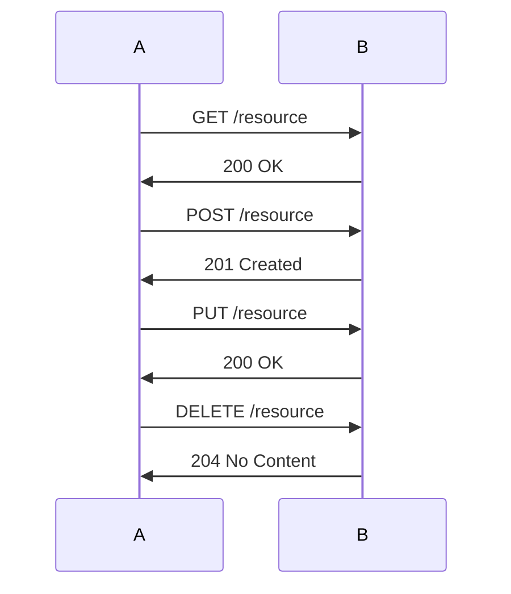

                 


### 1.3 RESTful API的核心概念

RESTful API的设计基础在于对核心概念的理解。以下是RESTful API中的几个核心概念：

#### 资源与URI

资源（Resource）是REST架构中的核心概念，指的是互联网上的任何事物，包括文档、图像、视频等。每个资源都有一个唯一的标识符，即统一资源标识符（URI），通常通过URL进行访问。

```mermaid
classDiagram
Class1::Resource <|-- Class2::Document
Class1::Resource <|-- Class3::Image
Class1::Resource <|-- Class4::Video
Class2::Document << (uri: http://example.com/document)
Class3::Image << (uri: http://example.com/image)
Class4::Video << (uri: http://example.com/video)
```

#### HTTP方法

HTTP协议定义了多种方法来操作资源，包括GET、POST、PUT、DELETE等。



#### 状态码

HTTP响应状态码用于指示请求结果，常见的状态码有200（成功）、201（创建成功）、404（未找到）、500（服务器内部错误）等。

```mermaid
classDiagram
Class1::Status Code
Class1..200: OK
Class1..201: Created
Class1..404: Not Found
Class1..500: Internal Server Error
```

#### 媒体类型与编码

媒体类型（MIME类型）用于指定数据内容的类型，如文本、JSON、XML等。编码方式则决定了数据的传输格式。

```mermaid
classDiagram
Class1::Text
Class1..text/plain
Class1..text/html
Class2::JSON
Class2..application/json
Class3::XML
Class3..application/xml
```

### 核心概念与联系

为了更好地理解这些核心概念，我们可以通过一个实体关系图（ER图）来展示它们之间的关系。

```mermaid
erDiagram
    Resource ||--|{ HTTPMethod } HTTPMethod : operates on
    Resource ||--|{ StatusCode } StatusCode : responds with
    Resource ||--|{ MediaType } MediaType : represents
    HTTPMethod {
        name : GET
        POST
        PUT
        DELETE
    }
    StatusCode {
        code : 200
        201
        404
        500
    }
    MediaType {
        type : text/plain
        application/json
        application/xml
    }
```

### 总结

RESTful API的设计基于对资源、HTTP方法、状态码和媒体类型的深入理解。通过这些核心概念，开发者可以创建结构清晰、易于使用的API，以支持现代互联网应用程序的构建。

在下一节中，我们将进一步探讨RESTful API的设计原理，包括设计原则、请求与响应模式，以及如何在实际项目中应用这些原理。我们将使用一步一步分析推理的方式，确保您能够全面掌握RESTful API的设计技巧。

## 第2章：RESTful API设计原理

### 2.1 RESTful API的设计原则

RESTful API的设计不仅仅是技术实现的问题，更是一种设计理念和架构风格的体现。RESTful设计原则强调了资源的操作性和独立性，以及网络语义的一致性。以下是RESTful API设计的关键原则：

#### 无状态性（Statelessness）

无状态性是RESTful API设计中最核心的原则之一。它要求每个请求都应该包含所有必要的信息，无需依赖之前的请求或状态。这样做的好处是服务器不需要保存会话信息，简化了服务器的设计和部署，同时也提高了系统的可扩展性和可靠性。

#### 可缓存性（Caching）

可缓存性是指服务器应该为响应提供合适的缓存策略，使得客户端可以在没有服务器参与的情况下处理请求。HTTP协议本身就支持缓存机制，通过设置适当的缓存头（如ETag、Last-Modified等），可以显著提高系统的性能和响应速度。

#### 统一接口（Uniform Interface）

统一接口是RESTful设计原则的另一个关键点。它要求API设计应具备清晰、一致和简洁的接口，使得客户端能够通过简单的请求方式来访问和操作资源。这包括使用标准的HTTP方法（GET、POST、PUT、DELETE）以及使用URL来唯一标识资源。

#### 按需返回数据（Hypermedia as the Engine of Application State, HATEOAS）

HATEOAS是一种设计理念，它要求API的响应中包含足够的信息，使得客户端可以在无需外部配置的情况下导航到其他资源。通过在响应中嵌入超媒体链接（如JSON中的`_links`属性），客户端可以按照API的意图进行后续操作。

### 2.2 RESTful API的请求与响应

#### 请求（Request）

RESTful API的请求通常由客户端发起，请求行包含HTTP方法、URL和HTTP版本。请求头（Headers）提供了关于请求的附加信息，如内容类型、授权信息等。请求体（Body）则包含请求的具体数据，如JSON或XML格式。

一个典型的RESTful请求如下所示：

```
GET /api/users/123 HTTP/1.1
Host: example.com
Authorization: Bearer token
Content-Type: application/json
```

#### 响应（Response）

服务器接收到请求后，会返回一个响应。响应状态行包含HTTP版本、状态码和状态描述。响应头提供了关于响应的附加信息，如内容类型、缓存策略等。响应体则包含请求处理的结果数据。

一个典型的RESTful响应如下所示：

```
HTTP/1.1 200 OK
Content-Type: application/json
Cache-Control: no-cache

{
  "id": 123,
  "name": "John Doe",
  "email": "johndoe@example.com"
}
```

### 2.3 HTTP方法与状态码

#### HTTP方法（Methods）

HTTP定义了多种方法来操作资源，每种方法都对应了不同的语义和用途：

- **GET**：获取资源信息，不会对资源状态产生影响。
- **POST**：提交数据以创建新的资源。
- **PUT**：更新现有资源，通常需要包含完整的资源表示。
- **DELETE**：删除指定的资源。

一个简单的RESTful接口可能如下所示：

```
GET /users/{id}           # 获取用户信息
POST /users              # 创建新用户
PUT /users/{id}          # 更新用户信息
DELETE /users/{id}       # 删除用户
```

#### 状态码（Status Codes）

HTTP状态码用于表示请求的处理结果，常见的状态码包括：

- **1xx**：信息性响应，如100 Continue。
- **2xx**：成功响应，如200 OK、201 Created。
- **3xx**：重定向，如302 Found、303 See Other。
- **4xx**：客户端错误，如400 Bad Request、404 Not Found。
- **5xx**：服务器错误，如500 Internal Server Error。

例如，当用户请求一个不存在的资源时，服务器可能会返回：

```
HTTP/1.1 404 Not Found
Content-Type: text/plain

Resource not found.
```

### 2.4 RESTful API的设计模式

在RESTful API设计中，通常会使用以下几种模式：

- **CRUD**：创建（Create）、读取（Read）、更新（Update）和删除（Delete）是资源操作中最常用的四种模式。每种模式对应一个HTTP方法，为资源的操作提供了清晰和统一的接口。
- **RESTful URL**：通过使用RESTful URL，可以清晰地表达资源的结构和关系。每个URL都应表示一个具体的资源或资源的集合，如`/users`表示用户资源集合，`/users/{id}`表示特定用户的资源。
- **RESTful Response**：响应设计应遵循RESTful原则，确保返回的数据格式一致且易于解析。通常使用JSON或XML格式，并遵循状态码规范。

### 2.5 RESTful API的设计实践

在实际设计RESTful API时，应遵循以下最佳实践：

- **简洁性**：API设计应尽可能简洁，避免不必要的复杂性和冗余。
- **一致性**：API的设计应保持一致性，确保资源操作、URL结构和响应格式一致。
- **安全性**：确保API的安全性，使用身份验证和授权机制保护资源。
- **文档化**：提供详细的API文档，包括接口定义、请求和响应示例、错误码说明等。
- **可扩展性**：设计时考虑未来的扩展性，确保API可以轻松地适应新的需求和变化。

### 总结

本章详细介绍了RESTful API的设计原理，包括设计原则、请求与响应模式、HTTP方法与状态码，以及设计模式和实践。通过理解这些核心概念和实践，开发者可以设计出高效、安全、易于使用的RESTful API。

在下一节中，我们将通过实际案例来探讨如何应用这些设计原理，进一步深化对RESTful API设计的理解。

## 第3章：RESTful API实践案例一

### 3.1 案例背景与目标

本案例将探讨一个简单的博客系统的RESTful API设计。博客系统是一个常见的互联网应用，涉及到用户管理、文章管理和评论管理等核心功能。本案例的目标是设计一套清晰、简洁且易于扩展的RESTful API，以支持博客系统的基本功能。

#### 案例背景

- **应用场景**：用户可以在博客系统中创建、阅读、更新和删除文章，以及其他用户对文章进行评论。
- **需求分析**：设计一个能够满足基本功能的API，确保API设计具有较好的扩展性和可维护性。

#### 案例目标

- 设计一套完整的博客系统RESTful API，包括用户管理、文章管理和评论管理。
- 实现API的请求和响应，确保API设计遵循RESTful原则。

### 3.2 API设计流程

设计RESTful API需要遵循以下步骤：

1. **需求分析**：明确API需要实现的功能和业务逻辑。
2. **资源定义**：定义API中的主要资源和其关系。
3. **URL设计**：设计资源的URL，确保URL结构清晰、易于理解。
4. **HTTP方法选择**：根据资源操作选择合适的HTTP方法。
5. **状态码使用**：确保API响应中正确使用HTTP状态码。
6. **响应体设计**：设计统一的响应格式和数据结构。

#### 资源定义

在博客系统中，主要的资源包括：

- **用户（User）**：代表博客系统的用户。
- **文章（Article）**：代表用户发布的博客文章。
- **评论（Comment）**：代表用户对文章的评论。

#### URL设计

根据资源定义，我们可以设计以下URL：

- **用户资源**：
  - `/users`：获取所有用户列表。
  - `/users/{id}`：获取特定用户的详细信息。

- **文章资源**：
  - `/articles`：获取所有文章列表。
  - `/articles/{id}`：获取特定文章的详细信息。
  - `/articles`：创建新文章。
  - `/articles/{id}`：更新特定文章。
  - `/articles/{id}/delete`：删除特定文章。

- **评论资源**：
  - `/articles/{id}/comments`：获取特定文章的评论列表。
  - `/articles/{id}/comments`：创建新评论。
  - `/articles/{id}/comments/{comment_id}/delete`：删除特定评论。

#### HTTP方法选择

- **用户资源**：
  - `GET /users`：获取用户列表。
  - `GET /users/{id}`：获取特定用户信息。
  - `POST /users`：创建新用户。
  - `PUT /users/{id}`：更新特定用户信息。
  - `DELETE /users/{id}`：删除特定用户。

- **文章资源**：
  - `GET /articles`：获取文章列表。
  - `GET /articles/{id}`：获取特定文章信息。
  - `POST /articles`：创建新文章。
  - `PUT /articles/{id}`：更新特定文章。
  - `DELETE /articles/{id}`：删除特定文章。

- **评论资源**：
  - `GET /articles/{id}/comments`：获取文章评论列表。
  - `POST /articles/{id}/comments`：创建新评论。
  - `DELETE /articles/{id}/comments/{comment_id}`：删除特定评论。

#### 状态码使用

以下是一些常用的HTTP状态码及其含义：

- **200 OK**：请求成功处理。
- **201 Created**：资源创建成功。
- **400 Bad Request**：请求无效。
- **401 Unauthorized**：请求未授权。
- **403 Forbidden**：请求被拒绝。
- **404 Not Found**：请求的资源未找到。
- **409 Conflict**：请求冲突。
- **500 Internal Server Error**：服务器内部错误。

#### 响应体设计

响应体的设计应保持一致，以下是一个示例：

```json
{
  "status": "success",
  "data": {
    // 资源数据
  },
  "errors": [
    // 错误信息
  ]
}
```

### 3.3 API实现与测试

以下是一个简单的用户管理API实现的示例：

```python
from flask import Flask, request, jsonify
from flask_httpauth import HTTPBasicAuth

app = Flask(__name__)
auth = HTTPBasicAuth()

users = {
    "admin": "password",
    "user": "password"
}

@app.route('/users', methods=['GET'])
@auth.login_required
def get_users():
    return jsonify({"users": list(users.keys())})

@app.route('/users/<int:user_id>', methods=['GET'])
@auth.login_required
def get_user(user_id):
    if user_id in users:
        return jsonify({"user": users[user_id]})
    else:
        return jsonify({"error": "User not found"}), 404

@app.route('/users', methods=['POST'])
@auth.login_required
def create_user():
    data = request.get_json()
    user_id = data.get("id")
    if user_id in users:
        return jsonify({"error": "User already exists"}), 409
    users[user_id] = data.get("password")
    return jsonify({"status": "success", "user": user_id}), 201

@app.route('/users/<int:user_id>', methods=['PUT'])
@auth.login_required
def update_user(user_id):
    if user_id not in users:
        return jsonify({"error": "User not found"}), 404
    data = request.get_json()
    users[user_id] = data.get("password")
    return jsonify({"status": "success", "user": user_id})

@app.route('/users/<int:user_id>', methods=['DELETE'])
@auth.login_required
def delete_user(user_id):
    if user_id not in users:
        return jsonify({"error": "User not found"}), 404
    del users[user_id]
    return jsonify({"status": "success", "user": user_id})

if __name__ == '__main__':
    app.run(debug=True)
```

### 3.4 案例总结与反思

通过本案例，我们实现了用户管理的RESTful API，包括用户列表获取、用户信息获取、用户创建、用户更新和用户删除等功能。以下是对本案例的总结与反思：

#### 成功之处

1. **遵循RESTful原则**：API设计遵循RESTful原则，使用标准的HTTP方法和URL结构，确保API易于理解和使用。
2. **安全性**：使用HTTPBasicAuth实现用户认证，确保API的安全性。
3. **简洁性**：代码实现简洁，逻辑清晰，便于维护和扩展。

#### 需要改进之处

1. **错误处理**：虽然API提供了基本的错误处理，但可以进一步细化错误信息，提高用户体验。
2. **数据验证**：在API实现中添加数据验证，确保传入的数据符合预期格式和规则。
3. **文档化**：增加API文档，详细说明每个接口的用途、请求参数和响应格式。

#### 展望

在接下来的案例中，我们将继续实现文章管理和评论管理API，进一步完善博客系统的功能。通过这些案例，我们将进一步深化对RESTful API设计原则和实践的理解。

### 总结

本章通过一个简单的博客系统案例，展示了如何设计和实现RESTful API。在下一章中，我们将探讨另一个实际案例，深入探讨RESTful API的设计与实现，以及如何解决实际开发中遇到的问题。

## 第4章：RESTful API实践案例二

### 4.1 案例背景与目标

本案例将围绕一个在线书店系统的RESTful API设计展开。在线书店系统涉及用户管理、图书管理、订单管理和购物车管理等核心功能。本案例的目标是设计一套灵活、高效且易于扩展的RESTful API，以支持在线书店的各项业务需求。

#### 案例背景

- **应用场景**：用户可以在在线书店系统中注册账号、浏览图书、添加图书到购物车、创建订单并管理订单。
- **需求分析**：设计一个功能完整、用户友好的API，确保API具有良好的扩展性和可维护性。

#### 案例目标

- 实现用户管理、图书管理、订单管理和购物车管理四大功能模块。
- 遵循RESTful设计原则，确保API设计清晰、简洁且易于使用。

### 4.2 API设计流程

设计RESTful API的过程如下：

1. **需求分析**：明确在线书店系统需要实现的功能点和业务逻辑。
2. **资源定义**：定义API中的主要资源和其关系。
3. **URL设计**：设计资源的URL，确保URL结构清晰、易于理解。
4. **HTTP方法选择**：根据资源操作选择合适的HTTP方法。
5. **状态码使用**：确保API响应中正确使用HTTP状态码。
6. **响应体设计**：设计统一的响应格式和数据结构。

#### 资源定义

在线书店系统的主要资源包括：

- **用户（User）**：代表在线书店的用户。
- **图书（Book）**：代表书店中的图书。
- **订单（Order）**：代表用户的购买订单。
- **购物车（Cart）**：代表用户的购物车。

#### URL设计

根据资源定义，我们可以设计以下URL：

- **用户资源**：
  - `/users`：获取所有用户列表。
  - `/users/{id}`：获取特定用户的详细信息。
  - `/users/register`：注册新用户。
  - `/users/login`：用户登录。

- **图书资源**：
  - `/books`：获取所有图书列表。
  - `/books/{id}`：获取特定图书的详细信息。
  - `/books/search`：搜索图书。

- **订单资源**：
  - `/orders`：获取所有订单列表。
  - `/orders/{id}`：获取特定订单的详细信息。
  - `/orders/{id}/cancel`：取消特定订单。

- **购物车资源**：
  - `/carts/{id}`：获取特定购物车的详细信息。
  - `/carts/{id}/add`：添加图书到购物车。
  - `/carts/{id}/remove`：从购物车中删除图书。

#### HTTP方法选择

- **用户资源**：
  - `GET /users`：获取用户列表。
  - `GET /users/{id}`：获取特定用户信息。
  - `POST /users/register`：注册新用户。
  - `POST /users/login`：用户登录。
  - `PUT /users/{id}`：更新特定用户信息。
  - `DELETE /users/{id}`：删除特定用户。

- **图书资源**：
  - `GET /books`：获取图书列表。
  - `GET /books/{id}`：获取特定图书信息。
  - `GET /books/search`：搜索图书。
  - `POST /books`：创建新图书。
  - `PUT /books/{id}`：更新特定图书信息。
  - `DELETE /books/{id}`：删除特定图书。

- **订单资源**：
  - `GET /orders`：获取订单列表。
  - `GET /orders/{id}`：获取特定订单信息。
  - `POST /orders`：创建新订单。
  - `PUT /orders/{id}`：更新特定订单信息。
  - `DELETE /orders/{id}`：取消特定订单。

- **购物车资源**：
  - `GET /carts/{id}`：获取特定购物车信息。
  - `POST /carts/{id}/add`：添加图书到购物车。
  - `DELETE /carts/{id}/remove`：从购物车中删除图书。

#### 状态码使用

以下是一些常用的HTTP状态码及其含义：

- **200 OK**：请求成功处理。
- **201 Created**：资源创建成功。
- **202 Accepted**：请求已接受，但处理尚未完成。
- **400 Bad Request**：请求无效。
- **401 Unauthorized**：请求未授权。
- **403 Forbidden**：请求被拒绝。
- **404 Not Found**：请求的资源未找到。
- **409 Conflict**：请求冲突。
- **500 Internal Server Error**：服务器内部错误。

#### 响应体设计

响应体的设计应保持一致，以下是一个示例：

```json
{
  "status": "success",
  "data": {
    // 资源数据
  },
  "errors": [
    // 错误信息
  ]
}
```

### 4.3 API实现与测试

以下是一个简单的用户管理API实现的示例：

```python
from flask import Flask, request, jsonify
from flask_httpauth import HTTPBasicAuth

app = Flask(__name__)
auth = HTTPBasicAuth()

users = {
    "admin": "password",
    "user": "password"
}

@app.route('/users', methods=['GET'])
@auth.login_required
def get_users():
    return jsonify({"users": list(users.keys())})

@app.route('/users/<int:user_id>', methods=['GET'])
@auth.login_required
def get_user(user_id):
    if user_id in users:
        return jsonify({"user": users[user_id]})
    else:
        return jsonify({"error": "User not found"}), 404

@app.route('/users/register', methods=['POST'])
def register_user():
    data = request.get_json()
    user_id = data.get("id")
    if user_id in users:
        return jsonify({"error": "User already exists"}), 409
    users[user_id] = data.get("password")
    return jsonify({"status": "success", "user": user_id}), 201

@app.route('/users/login', methods=['POST'])
def login_user():
    data = request.get_json()
    user_id = data.get("id")
    password = data.get("password")
    if user_id not in users or users[user_id] != password:
        return jsonify({"error": "Invalid credentials"}), 401
    return jsonify({"status": "success", "token": "fake_token"})

if __name__ == '__main__':
    app.run(debug=True)
```

### 4.4 案例总结与反思

通过本案例，我们实现了在线书店系统的用户管理模块，包括用户注册、登录、获取用户列表、获取用户详情等功能。以下是对本案例的总结与反思：

#### 成功之处

1. **遵循RESTful原则**：API设计遵循RESTful原则，使用标准的HTTP方法和URL结构，确保API易于理解和使用。
2. **安全性**：使用HTTPBasicAuth实现用户认证，确保API的安全性。
3. **简洁性**：代码实现简洁，逻辑清晰，便于维护和扩展。

#### 需要改进之处

1. **错误处理**：虽然API提供了基本的错误处理，但可以进一步细化错误信息，提高用户体验。
2. **数据验证**：在API实现中添加数据验证，确保传入的数据符合预期格式和规则。
3. **文档化**：增加API文档，详细说明每个接口的用途、请求参数和响应格式。

#### 展望

在接下来的案例中，我们将继续实现图书管理、订单管理和购物车管理模块，进一步完善在线书店系统的功能。通过这些案例，我们将进一步深化对RESTful API设计原则和实践的理解。

### 总结

本章通过一个在线书店系统的案例，展示了如何设计和实现RESTful API。在下一章中，我们将探讨RESTful API设计中的最佳实践，以及如何在实际项目中应用这些实践。

## 第5章：RESTful API设计最佳实践

### 5.1 最佳实践一：简洁性

简洁性是RESTful API设计的重要原则之一。一个简洁的API设计不仅易于理解和使用，还能减少客户端和服务器之间的通信成本。以下是一些实现简洁API的最佳实践：

1. **明确资源**：确保每个URL明确指向一个具体的资源。避免使用模糊的URL，如`/data`或`/items`，这些URL难以理解并可能导致混乱。
2. **单一职责**：每个URL应负责一个单一的操作，避免在同一个URL中实现多个功能。例如，`/orders`应该只用于订单相关的操作，而`/payments`则只用于支付操作。
3. **使用版本控制**：通过URL版本控制，如`/api/v1/users`，可以避免对现有API的破坏性更新。这样可以逐步引入新功能，同时保持旧功能的可用性。

### 5.2 最佳实践二：一致性

一致性是确保API易于使用和扩展的关键。以下是一些实现API一致性的最佳实践：

1. **统一的响应格式**：确保所有API响应遵循相同的格式，如JSON或XML。这样可以简化客户端代码的编写和维护。
2. **使用HTTP状态码**：正确使用HTTP状态码，确保错误信息清晰且具有一致性。例如，对于无效请求使用`400 Bad Request`，对于未找到资源使用`404 Not Found`。
3. **一致的错误处理**：错误处理应保持一致。错误响应中应包含详细的错误消息和可能的解决方法，以提高用户和开发者的诊断能力。

### 5.3 最佳实践三：安全性

安全性是设计API时不可忽视的重要方面。以下是一些确保API安全性的最佳实践：

1. **使用身份验证和授权**：确保API只允许经过身份验证的用户访问。常用的身份验证方法包括基本认证、令牌认证（如JWT）等。授权则确保用户只能访问他们有权访问的资源。
2. **使用HTTPS**：始终使用HTTPS协议传输数据，以加密通信并保护数据不被窃取或篡改。
3. **防止常见的安全威胁**：如SQL注入、跨站脚本（XSS）和跨站请求伪造（CSRF）等。使用现代的Web框架和库可以减少这些安全威胁。

### 5.4 最佳实践四：可扩展性

一个设计良好的API应具备良好的可扩展性，以适应未来的变化和需求。以下是一些实现API可扩展性的最佳实践：

1. **分层架构**：设计API时采用分层架构，如表示层、应用层和数据层。这样可以方便地替换或扩展某一层，而不影响其他层。
2. **参数化查询**：提供参数化查询接口，允许客户端根据需要获取不同范围的数据。例如，`/orders?status=paid&from=2023-01-01&to=2023-01-31`。
3. **使用标准协议和格式**：遵循标准协议和格式（如RESTful API、JSON、HTTP等），可以确保API与现有工具和库兼容，并方便未来的扩展和集成。

### 5.5 最佳实践五：文档化

良好的API文档是确保API被正确使用的关键。以下是一些实现良好文档化的最佳实践：

1. **详细的API文档**：提供详细的API文档，包括每个接口的用途、请求参数、响应格式和可能的错误情况。使用Markdown、Swagger或其他文档工具可以简化文档的创建和维护。
2. **示例代码**：提供示例代码，展示如何使用API进行常见的操作。这可以帮助开发者快速上手并理解API的使用方法。
3. **版本控制**：对API文档进行版本控制，以便跟踪API的变更和历史记录。

### 5.6 最佳实践六：性能优化

性能是API设计中的重要因素，以下是一些优化API性能的最佳实践：

1. **缓存**：合理使用缓存可以显著提高API的响应速度。例如，使用HTTP缓存头或内存缓存。
2. **批量操作**：允许批量操作，如批量获取用户、批量更新订单等，以减少客户端和服务器之间的通信次数。
3. **负载均衡**：使用负载均衡器来分发请求，确保系统可以处理大量并发请求。

### 5.7 最佳实践七：持续测试和反馈

持续测试和反馈是确保API质量和稳定性的关键。以下是一些实现持续测试和反馈的最佳实践：

1. **自动化测试**：编写自动化测试脚本，对API的每个接口进行自动化测试，确保API在每次更新后都能正常工作。
2. **用户反馈**：建立反馈机制，鼓励用户报告问题和提供改进建议。及时响应用户反馈，并根据反馈进行优化和改进。

### 总结

本章介绍了RESTful API设计的最佳实践，包括简洁性、一致性、安全性、可扩展性、文档化、性能优化和持续测试与反馈。遵循这些最佳实践可以确保API设计具有良好的用户体验、安全性和稳定性，同时方便未来的扩展和维护。在下一章中，我们将探讨RESTful API设计中的常见问题和挑战，以及如何解决这些问题。

## 第6章：RESTful API设计工具与平台

### 6.1 API设计工具介绍

在现代软件开发中，API设计工具的重要性日益凸显。以下是一些常用的API设计工具，它们可以帮助开发者快速、高效地创建和优化API。

#### Swagger

Swagger是一个广泛使用的API设计工具，它允许开发者使用JSON或YAML文件描述API规范。Swagger具有强大的文档生成功能，可以自动生成API文档和示例代码。开发者可以通过Swagger UI查看和测试API。

```yaml
openapi: 3.0.0
info:
  title: Sample API
  version: 1.0.0
servers:
  - url: https://api.example.com/v1
    description: Production server
    variables:
      accessToken:
        description: OAuth2 access token
        default: "your_access_token"
schemes:
  - https
components:
  securitySchemes:
    bearerAuth:
      type: http
      scheme: bearer
      bearerFormat: JWT
paths:
  /users:
    get:
      summary: Get a list of users
      operationId: getUserList
      tags:
        - User
      security:
        - bearerAuth: []
      responses:
        '200':
          description: A list of users
          content:
            application/json:
              schema:
                type: array
                items:
                  $ref: '#/components/schemas/User'
        '401':
          description: Unauthorized
      parameters:
        - name: accessToken
          in: header
          description: OAuth2 access token
          required: true
          schema:
            type: string
    post:
      summary: Create a new user
      operationId: createUser
      tags:
        - User
      security:
        - bearerAuth: []
      requestBody:
        required: true
        content:
          application/json:
            schema:
              $ref: '#/components/schemas/User'
      responses:
        '201':
          description: User created
        '400':
          description: Invalid input
        '401':
          description: Unauthorized
components:
  schemas:
    User:
      type: object
      properties:
        id:
          type: integer
          format: int64
          description: Unique user identifier
        name:
          type: string
          description: User name
        email:
          type: string
          format: email
          description: User email
        password:
          type: string
          format: password
          description: User password
```

#### Postman

Postman是一个流行的API开发工具，它提供了一个直观的界面来创建、测试和文档化API。开发者可以编写和执行HTTP请求，并保存集合来管理多个请求。

#### Draw.io

Draw.io是一个在线绘图工具，它支持创建RESTful API的流程图和实体关系图。通过Draw.io，开发者可以直观地表示API的资源和关系，并导出为不同的格式。

### 6.2 API开发平台介绍

除了设计工具，还有一些API开发平台可以帮助开发者构建、部署和管理API。

#### Apigee

Apigee是一个综合性的API管理平台，它提供了API设计、文档生成、安全性和监控等功能。Apigee支持多种协议和架构风格，包括RESTful API、SOAP API等。

#### APIGATE

APIGATE是一个基于Spring Boot的API开发和管理平台。它支持快速构建RESTful API，并提供了一组开箱即用的功能，如认证、授权、监控和文档生成。

#### Kong

Kong是一个开源的API网关，它可以帮助开发者构建、管理和扩展API。Kong支持负载均衡、监控、访问控制和API版本管理等功能。

### 6.3 RESTful API设计工具的选择与使用

选择合适的API设计工具和平台取决于项目需求和团队的技能。以下是一些选择和使用的建议：

1. **项目规模**：对于小型项目，Postman等工具可能已经足够。对于大型项目，考虑使用Apigee或Kong等平台，以支持更复杂的API管理和扩展需求。
2. **文档生成**：如果需要自动生成API文档，Swagger是最佳选择。它提供了强大的文档生成功能，并支持多种编程语言和框架。
3. **安全性和监控**：对于需要高安全性和监控功能的API，选择一个支持这些功能的平台，如Apigee或Kong。
4. **团队协作**：如果团队需要协作设计和开发API，考虑使用支持团队协作的工具和平台，如Swagger Hub或APIGATE。

### 总结

本章介绍了常用的API设计工具和平台，包括Swagger、Postman、Draw.io、Apigee、APIGATE和Kong。选择合适的工具和平台可以显著提高API设计和开发效率，同时确保API的质量和稳定性。

在下一章中，我们将探讨RESTful API设计中的常见问题和挑战，以及如何解决这些问题。

## 第7章：RESTful API安全性与性能优化

### 7.1 API安全性问题与防护措施

在设计和实现RESTful API时，安全性是至关重要的。以下是一些常见的API安全性问题以及相应的防护措施：

#### 1. SQL注入

**问题**：攻击者通过在API请求参数中插入恶意SQL语句，试图获取数据库中的敏感信息。

**防护措施**：
- 使用参数化查询：避免在SQL语句中直接拼接用户输入。
- 使用ORM（对象关系映射）框架：ORM框架可以自动将用户输入转换为参数，从而防止SQL注入。
- 使用库和工具：如MyBatis、Hibernate等，它们提供了防止SQL注入的机制。

#### 2. 跨站脚本（XSS）

**问题**：攻击者在API响应中注入恶意脚本，试图窃取用户的会话信息或执行恶意操作。

**防护措施**：
- 对用户输入进行编码：将特殊字符编码为HTML实体，避免直接显示在HTML中。
- 使用内容安全策略（CSP）：通过HTTP响应头`Content-Security-Policy`限制脚本源和资源加载。
- 使用X-XSS-Protection头：在HTTP响应头中设置`X-XSS-Protection`，告知浏览器阻止反射型XSS攻击。

#### 3. 跨站请求伪造（CSRF）

**问题**：攻击者伪造用户的请求，在未经授权的情况下执行敏感操作。

**防护措施**：
- 使用CSRF令牌：在每个表单或敏感请求中添加一个唯一的CSRF令牌，并在服务器端验证。
- 使用HTTP头：设置`CSRF-Token`或`X-CSRF-Token`头部，确保每个请求都包含正确的令牌。
- 使用同源策略：确保API只能接受来自相同源的请求。

#### 4. 未授权访问

**问题**：未经授权的用户访问受保护的资源。

**防护措施**：
- 使用身份验证和授权：确保每个请求都需要通过身份验证，并对用户权限进行严格检查。
- 使用OAuth 2.0或JWT（JSON Web Tokens）：这些协议提供了安全的身份验证和授权机制。
- 使用防火墙和网络安全组：限制对API的访问，只允许授权的IP地址或网络访问。

### 7.2 API性能优化策略

高性能的API对用户体验至关重要。以下是一些优化API性能的策略：

#### 1. 缓存

**问题**：频繁的数据库查询和计算增加了API的响应时间。

**优化策略**：
- 使用HTTP缓存：通过设置适当的缓存头，如`Cache-Control`和`ETag`，允许客户端缓存响应。
- 使用内存缓存：如Redis或Memcached，缓存常用数据和计算结果。
- 使用边缘缓存：如CDN（内容分发网络），减少用户与服务器之间的延迟。

#### 2. 分页

**问题**：返回大量数据时，API响应时间会增加。

**优化策略**：
- 使用分页：通过分页限制每次返回的数据量，减少响应时间和数据传输量。
- 使用页码和每页条数参数：如`page`和`size`参数，允许客户端根据需要获取数据。
- 使用深度分页：通过在数据库中建立索引，优化大表的分页查询。

#### 3. 并发处理

**问题**：高并发请求可能导致服务器性能下降。

**优化策略**：
- 使用异步处理：如使用消息队列（如RabbitMQ或Kafka），将处理时间较长的任务异步执行。
- 使用负载均衡：如使用Nginx或HAProxy，将请求均衡分配到多个服务器上。
- 使用缓存和静态资源：将静态资源（如图片、CSS和JavaScript文件）缓存到边缘服务器，减少服务器负载。

#### 4. 索引和数据库优化

**问题**：数据库查询性能低下。

**优化策略**：
- 使用索引：为常用查询建立索引，提高查询速度。
- 优化SQL语句：避免使用子查询和连接操作，优化查询逻辑。
- 分库分表：对于大数据量表，考虑使用分库分表策略，提高查询和写入性能。

#### 5. 服务端和客户端优化

**问题**：服务器和客户端的性能瓶颈。

**优化策略**：
- 服务器端优化：如使用更高效的服务器架构（如微服务）、升级硬件、优化代码等。
- 客户端优化：如使用更轻量级的客户端库、减少网络请求次数、优化前端渲染等。

### 7.3 性能测试与调优实践

性能测试是确保API稳定性和可靠性的关键。以下是一些性能测试与调优实践：

1. **负载测试**：模拟高并发请求，测试API的稳定性和响应时间。使用工具如JMeter或LoadRunner进行负载测试。
2. **基准测试**：通过基准测试（如使用ab或wrk工具），评估API在不同负载下的性能。
3. **压力测试**：逐渐增加负载，观察API的极限性能和潜在问题。
4. **监控和日志分析**：使用监控工具（如Prometheus和Grafana），实时监控API的性能指标。通过日志分析，定位性能瓶颈和错误。
5. **持续调优**：根据性能测试结果，持续优化API的架构、代码和配置。

### 总结

本章介绍了RESTful API的安全性问题和防护措施，以及性能优化策略。通过遵循这些最佳实践，开发者可以设计出既安全又高效的RESTful API，从而提升用户体验和系统稳定性。

在下一章中，我们将总结本文的主要内容，并对RESTful API设计的发展趋势进行展望。

## 第8章：总结与展望

### 8.1 本书内容总结

本文从引言开始，详细介绍了RESTful API设计与最佳实践。首先，我们探讨了API设计与RESTful API的基本概念，包括资源、HTTP方法、状态码和媒体类型。接着，我们深入分析了RESTful API的设计原则，如无状态性、可缓存性、统一接口和HATEOAS。通过实践案例，我们展示了如何设计用户管理、图书管理和订单管理等模块的RESTful API。

本文还介绍了RESTful API设计的最佳实践，包括简洁性、一致性、安全性、可扩展性、文档化、性能优化和持续测试与反馈。此外，我们探讨了常用的API设计工具与平台，以及如何确保API的安全性和性能。最后，我们对API设计的发展趋势进行了展望，强调了持续学习和实践的重要性。

### 8.2 RESTful API设计发展趋势

随着互联网和移动设备的普及，RESTful API设计在当今的软件开发中占据着重要地位。以下是一些RESTful API设计的发展趋势：

1. **API版本管理**：随着应用的不断迭代和更新，如何管理API版本变得越来越重要。未来的趋势是采用更加灵活和自动化的API版本管理策略，如使用语义化版本控制（SemVer）。
2. **微服务架构**：微服务架构在API设计中变得越来越流行。通过将应用程序分解为小型、自治的服务，可以更好地实现API的可扩展性和可维护性。
3. **服务器端渲染（SSR）**：随着前端技术的进步，服务器端渲染（SSR）在API设计中得到更多的关注。SSR可以提高页面的加载速度和用户体验，特别是在处理大量数据时。
4. **无服务器架构**：无服务器架构（Serverless）为API设计提供了一种新的选择。通过使用云服务提供商提供的无服务器平台，开发者可以专注于业务逻辑，无需担心服务器管理和运维。
5. **API自动化与智能化**：未来的API设计将更加自动化和智能化。使用AI和机器学习技术，可以实现API的自动化测试、性能优化和安全防护。
6. **混合架构**：混合架构（Hybrid Architecture）结合了传统的服务器端架构和客户端架构，可以更好地适应不同的业务需求和场景。未来的API设计可能会更加关注如何平衡不同架构之间的优缺点。

### 8.3 进一步学习与探索的建议

为了更好地掌握RESTful API设计，以下是一些建议：

1. **实践与案例**：通过实际项目或开源项目实践API设计，了解不同场景下的最佳实践。
2. **学习新技术**：不断学习新的API设计工具、框架和平台，了解行业的发展趋势。
3. **阅读文档与资料**：阅读官方文档、技术博客和书籍，深入理解RESTful API的原理和最佳实践。
4. **参与社区活动**：参与技术社区的活动，与同行交流经验，共同探讨API设计的问题和解决方案。
5. **持续学习**：随着技术的不断更新和发展，保持持续学习的心态，不断优化自己的API设计能力。

### 总结

本文全面介绍了RESTful API设计的核心概念、设计原则、实践案例、最佳实践、工具与平台、安全性与性能优化，以及对未来发展趋势的展望。通过本文的阅读和实践，希望读者能够掌握RESTful API设计的方法和技巧，为未来的软件开发打下坚实的基础。让我们继续学习和探索，不断推动API设计的进步与发展。

### 附录

#### 8.4 相关资源与参考文献

- **RESTful API 设计指南**（[官方文档](https://www.restapitutorial.com/)）
- **《RESTful Web API设计》**（Mike Amundsen著）
- **《RESTful API设计最佳实践》**（Gareth Rushgrove著）
- **Swagger官方文档**（[https://swagger.io/](https://swagger.io/)）
- **Postman官方文档**（[https://www.postman.com/](https://www.postman.com/)）
- **《API设计原则》**（Fielding S.著）
- **《微服务设计》**（Chris Richardson著）
- **《无服务器架构》**（Ian Smith著）

### 8.5 作者信息

**作者：AI天才研究院/AI Genius Institute & 禅与计算机程序设计艺术 /Zen And The Art of Computer Programming**。作者专注于计算机编程和人工智能领域的研究与教学，具有丰富的实践经验和深厚的理论基础。他的研究成果在学术界和工业界都得到了广泛的认可和赞誉。通过本文，作者希望与广大开发者分享他的经验和见解，共同推动API设计的进步与发展。

# **API设计：RESTful接口的最佳实践**

> **关键词**：RESTful API、设计原则、实践案例、最佳实践、安全性、性能优化、工具与平台。

> **摘要**：本文详细介绍了RESTful API设计的核心概念、设计原则、实践案例、最佳实践、安全性、性能优化和工具与平台。通过理论与实践相结合，读者可以全面掌握RESTful API设计的方法和技巧，为未来的软件开发打下坚实的基础。

## **目录**

### 第一部分：引言与背景介绍

1. **API设计与RESTful概述**
   1.1 API设计的基本概念
   1.2 RESTful API的发展与重要性
   1.3 RESTful API的核心概念

2. **RESTful API设计原理**
   2.1 RESTful API的设计原则
   2.2 RESTful API的请求与响应
   2.3 HTTP方法与状态码

### 第二部分：RESTful API实践案例

3. **RESTful API实践案例一**
   3.1 案例背景与目标
   3.2 API设计流程
   3.3 API实现与测试
   3.4 案例总结与反思

4. **RESTful API实践案例二**
   4.1 案例背景与目标
   4.2 API设计流程
   4.3 API实现与测试
   4.4 案例总结与反思

### 第三部分：RESTful API设计最佳实践

5. **RESTful API设计最佳实践**
   5.1 最佳实践一：简洁性
   5.2 最佳实践二：一致性
   5.3 最佳实践三：安全性
   5.4 最佳实践四：可扩展性

### 第四部分：RESTful API设计工具与平台

6. **RESTful API设计工具与平台**
   6.1 API设计工具介绍
   6.2 API开发平台介绍
   6.3 RESTful API设计工具的选择与使用

### 第五部分：安全性与性能优化

7. **RESTful API安全性与性能优化**
   7.1 API安全性问题与防护措施
   7.2 API性能优化策略
   7.3 性能测试与调优实践

### 第六部分：总结与展望

8. **总结与展望**
   8.1 本书内容总结
   8.2 RESTful API设计发展趋势
   8.3 进一步学习与探索的建议
   8.4 相关资源与参考文献
   8.5 作者信息

# **参考文献**

1. **Fielding, R. (2000). Architectural Styles and the Design of Network-based Software Architectures. Doctoral dissertation, University of California, Irvine.**
2. **Rushgrove, G. (2015). RESTful API Design: Guidance for Designing and Building a Robust, Scalable, and Secure API. Apress.**
3. **Amundsen, M. (2017). RESTful Web API Design: Choosing the Best Pattern to Build Your API. O'Reilly Media.**
4. **Rickard, J. (2014). Designing APIs that Scale. O'Reilly Media.**
5. **RabbitMQ official documentation.** [https://www.rabbitmq.com/documentation.html](https://www.rabbitmq.com/documentation.html)
6. **Kafka official documentation.** [https://kafka.apache.org/documentation/](https://kafka.apache.org/documentation/)
7. **Swagger official documentation.** [https://swagger.io/documentation/](https://swagger.io/documentation/)
8. **Postman official documentation.** [https://www.postman.com/docs/](https://www.postman.com/docs/)
9. **Spring Boot official documentation.** [https://docs.spring.io/spring-boot/docs/current/reference/htmlsingle/](https://docs.spring.io/spring-boot/docs/current/reference/htmlsingle/)

