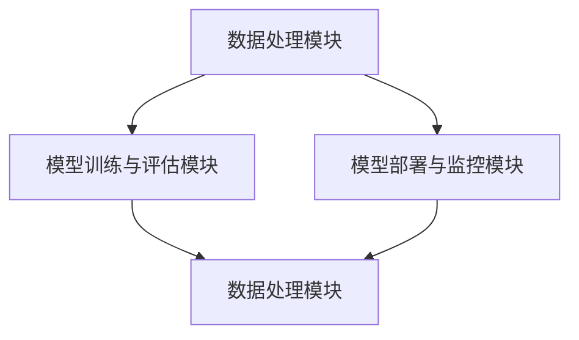
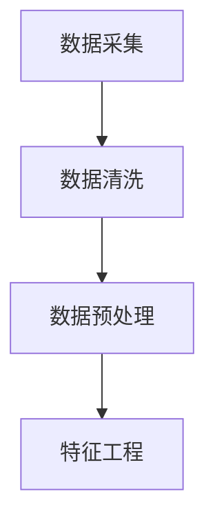
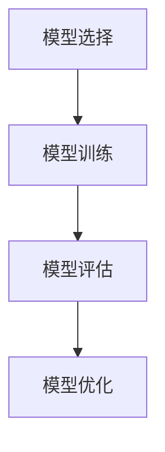
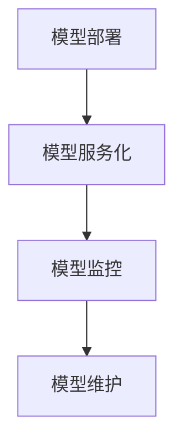
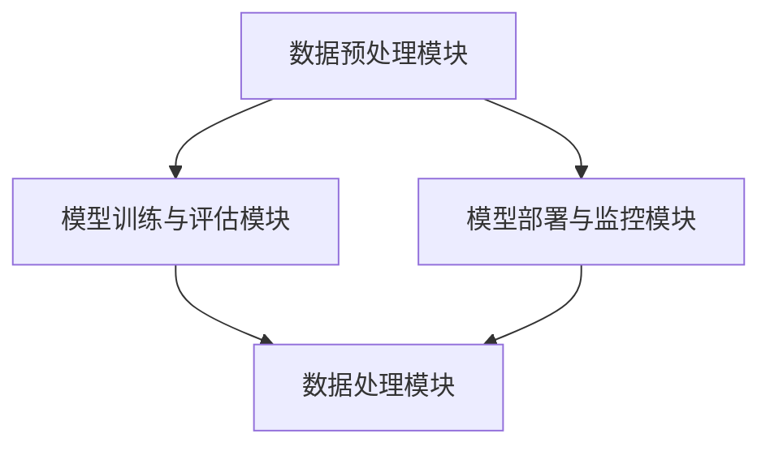
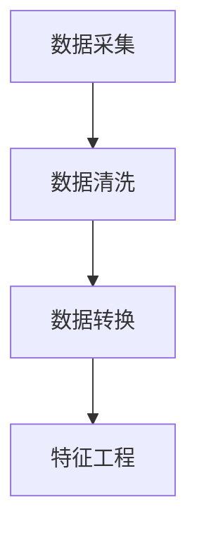

                 


### 第一部分：AutoML平台设计与实现概述

#### 第1章：AutoML概述

##### 1.1 AutoML的定义与背景

**定义**

AutoML（Automated Machine Learning）是指自动化机器学习的过程，旨在通过自动化算法选择、超参数调整、模型优化等步骤，以实现更高效、更准确的机器学习模型。

**背景**

随着数据量的爆炸性增长和机器学习应用的普及，机器学习模型的开发和部署变得越来越复杂。传统机器学习流程通常需要大量的人工干预，包括数据预处理、特征工程、模型选择、参数调优等步骤。这不仅消耗大量时间，而且容易出现人为错误。

为了解决这些问题，AutoML应运而生。它通过自动化技术，将机器学习的各个环节进行整合，减少人为干预，提高模型开发和部署的效率。

##### 1.2 AutoML的发展历程

AutoML的发展历程可以分为以下几个阶段：

1. **初步探索阶段**（2010年之前）：这一阶段主要是机器学习领域专家和研究人员探索如何自动化机器学习过程。
2. **概念验证阶段**（2010-2015年）：这一阶段，一些AutoML工具和平台开始出现，如Google的AutoML、H2O的AutoML等。
3. **商业化阶段**（2015年至今）：随着机器学习技术的成熟和应用的广泛，AutoML逐渐成为一个独立的市场，许多公司推出了自己的AutoML产品。

##### 1.3 AutoML的应用场景

AutoML的应用场景非常广泛，主要包括：

1. **金融领域**：如风险控制、信用评分、投资预测等。
2. **医疗领域**：如疾病诊断、药物研发、健康管理等。
3. **工业领域**：如设备故障预测、供应链优化、生产效率提升等。
4. **电商领域**：如推荐系统、价格优化、广告投放等。

##### 1.4 AutoML的核心技术

AutoML的核心技术主要包括：

1. **数据预处理**：包括数据清洗、数据转换、特征提取等。
2. **模型选择**：利用自动化算法，选择最优的模型结构。
3. **模型训练**：自动化调整模型参数，提高模型性能。
4. **模型评估**：自动化评估模型性能，选择最优模型。
5. **模型部署**：自动化部署模型到生产环境。

### 第二部分：AutoML平台架构设计

#### 第2章：AutoML平台架构设计

##### 2.1 AutoML平台的总体架构

AutoML平台的总体架构可以分为以下几个模块：

1. **数据处理模块**：负责数据的采集、清洗、预处理和特征工程。
2. **模型训练与评估模块**：负责模型的选择、训练、评估和优化。
3. **模型部署与监控模块**：负责模型的部署、监控和维护。

##### 2.2 数据处理模块设计

数据处理模块的设计主要包括以下方面：

1. **数据采集**：通过API、数据库等方式采集数据。
2. **数据清洗**：去除异常值、缺失值等。
3. **数据预处理**：包括数据归一化、标准化、降维等。
4. **特征工程**：提取有效特征，提高模型性能。

##### 2.3 模型训练与评估模块设计

模型训练与评估模块的设计主要包括以下方面：

1. **模型选择**：根据数据特点和业务需求，选择合适的模型。
2. **模型训练**：自动化调整模型参数，提高模型性能。
3. **模型评估**：通过交叉验证、A/B测试等方法评估模型性能。
4. **模型优化**：根据评估结果调整模型结构，提高模型性能。

##### 2.4 模型部署与监控模块设计

模型部署与监控模块的设计主要包括以下方面：

1. **模型部署**：将训练好的模型部署到生产环境。
2. **模型服务化**：将模型封装成API服务，供其他系统调用。
3. **模型监控**：监控模型性能和运行状态，及时发现和处理问题。
4. **模型维护**：定期更新模型，确保模型性能。

### 第三部分：数据处理模块实现

#### 第3章：数据处理模块实现

##### 3.1 数据采集与清洗

数据采集与清洗是数据处理模块的重要环节，主要包括以下步骤：

1. **数据采集**：通过API、数据库等方式采集数据。
2. **数据清洗**：去除异常值、缺失值等，保证数据的准确性和完整性。

##### 3.2 数据预处理技术

数据预处理技术主要包括以下方法：

1. **数据归一化**：将不同数据量级的数据转换为相同的量级，以便模型训练。
2. **数据标准化**：将数据转换为标准正态分布，提高模型训练效果。
3. **数据降维**：通过PCA、LDA等方法降低数据维度，提高模型训练效率。

##### 3.3 数据特征工程

数据特征工程是数据处理模块的关键步骤，主要包括以下内容：

1. **特征提取**：提取与业务相关的有效特征，提高模型性能。
2. **特征选择**：通过特征选择方法，选择最具代表性的特征，降低模型复杂度。

### 第四部分：模型训练与评估模块实现

#### 第4章：模型训练与评估模块实现

##### 4.1 模型选择与优化

模型选择与优化是模型训练与评估模块的重要环节，主要包括以下步骤：

1. **模型选择**：根据数据特点和业务需求，选择合适的模型。
2. **模型优化**：通过调整超参数、优化算法等手段提高模型性能。

##### 4.2 模型训练算法

模型训练算法是模型训练与评估模块的核心，主要包括以下算法：

1. **梯度下降算法**：一种常用的优化算法，用于调整模型参数。
2. **随机梯度下降算法**：在梯度下降算法的基础上，引入随机性，提高训练效率。
3. **批量梯度下降算法**：在梯度下降算法的基础上，引入批量处理，提高训练稳定性。

##### 4.3 模型评估与调优

模型评估与调优是模型训练与评估模块的关键步骤，主要包括以下内容：

1. **模型评估**：通过交叉验证、A/B测试等方法评估模型性能。
2. **模型调优**：根据评估结果调整模型结构、超参数等，提高模型性能。

### 第五部分：模型部署与监控模块实现

#### 第5章：模型部署与监控模块实现

##### 5.1 模型部署策略

模型部署策略是模型部署与监控模块的重要环节，主要包括以下内容：

1. **模型部署**：将训练好的模型部署到生产环境。
2. **模型服务化**：将模型封装成API服务，供其他系统调用。

##### 5.2 模型服务化

模型服务化是将模型部署到生产环境的重要手段，主要包括以下步骤：

1. **模型封装**：将模型封装成可调用的API服务。
2. **接口设计**：设计模型服务的接口，包括输入参数和输出结果。

##### 5.3 模型监控与维护

模型监控与维护是模型部署与监控模块的关键步骤，主要包括以下内容：

1. **模型监控**：监控模型性能和运行状态，及时发现和处理问题。
2. **模型维护**：定期更新模型，确保模型性能。

### 第六部分：AutoML平台实战

#### 第6章：AutoML平台实战

##### 6.1 环境搭建与配置

环境搭建与配置是AutoML平台实战的第一步，主要包括以下步骤：

1. **硬件配置**：根据业务需求，选择合适的硬件设备。
2. **软件安装**：安装所需的操作系统、编程语言和库。

##### 6.2 数据处理模块实践

数据处理模块实践是AutoML平台实战的核心环节，主要包括以下步骤：

1. **数据采集**：通过API、数据库等方式采集数据。
2. **数据清洗**：去除异常值、缺失值等。
3. **数据预处理**：进行数据归一化、标准化和降维。
4. **特征工程**：提取有效特征，提高模型性能。

##### 6.3 模型训练与评估模块实践

模型训练与评估模块实践是AutoML平台实战的关键环节，主要包括以下步骤：

1. **模型选择**：根据数据特点和业务需求，选择合适的模型。
2. **模型训练**：自动化调整模型参数，提高模型性能。
3. **模型评估**：通过交叉验证、A/B测试等方法评估模型性能。
4. **模型调优**：根据评估结果调整模型结构、超参数等，提高模型性能。

##### 6.4 模型部署与监控模块实践

模型部署与监控模块实践是AutoML平台实战的最后一步，主要包括以下步骤：

1. **模型部署**：将训练好的模型部署到生产环境。
2. **模型服务化**：将模型封装成API服务，供其他系统调用。
3. **模型监控**：监控模型性能和运行状态，及时发现和处理问题。
4. **模型维护**：定期更新模型，确保模型性能。

##### 6.5 项目总结与优化建议

项目总结与优化建议是对AutoML平台实战的总结和反思，主要包括以下内容：

1. **项目总结**：对项目的实施过程进行总结，包括成功经验和不足之处。
2. **优化建议**：针对项目中的不足，提出优化建议，以提高平台性能和用户体验。

### 第七部分：AutoML平台的发展与趋势

#### 第7章：AutoML平台的发展与趋势

##### 7.1 AutoML技术的发展趋势

AutoML技术的发展趋势主要体现在以下几个方面：

1. **算法优化**：不断优化现有算法，提高模型性能。
2. **自动化程度提升**：提高自动化程度，减少人为干预。
3. **多模态数据支持**：支持多种类型的数据，如文本、图像、音频等。
4. **边缘计算**：将AutoML技术应用到边缘设备，提高实时性。

##### 7.2 AutoML在行业中的应用前景

AutoML在行业中的应用前景非常广阔，主要包括以下几个方面：

1. **金融领域**：如风险控制、信用评分、投资预测等。
2. **医疗领域**：如疾病诊断、药物研发、健康管理等。
3. **工业领域**：如设备故障预测、供应链优化、生产效率提升等。
4. **电商领域**：如推荐系统、价格优化、广告投放等。

##### 7.3 AutoML平台的未来展望

AutoML平台的未来展望主要体现在以下几个方面：

1. **智能化**：实现更高程度的智能化，减少人为干预。
2. **生态化**：构建AutoML生态，包括工具、平台、应用等。
3. **开放性**：实现不同平台、不同技术之间的无缝对接。
4. **安全性**：提高平台安全性，确保数据安全和模型可靠。

### 第八部分：AutoML平台设计与实现常见问题与解决方案

#### 第8章：AutoML平台设计与实现常见问题与解决方案

##### 8.1 数据质量问题与解决策略

数据质量问题是AutoML平台设计与实现过程中常见的问题，解决策略主要包括：

1. **数据清洗**：去除异常值、缺失值等。
2. **数据增强**：通过数据增强技术，提高数据质量。
3. **数据平衡**：通过数据平衡技术，解决数据分布不均的问题。

##### 8.2 模型性能优化方法

模型性能优化方法是提高AutoML平台性能的重要手段，主要包括：

1. **超参数调优**：通过调优超参数，提高模型性能。
2. **模型集成**：通过模型集成技术，提高模型性能。
3. **迁移学习**：通过迁移学习，利用已有模型的经验，提高新模型的性能。

##### 8.3 部署与监控中的挑战与对策

部署与监控是AutoML平台设计与实现过程中面临的挑战，对策主要包括：

1. **模型压缩**：通过模型压缩技术，降低模型大小，提高部署效率。
2. **动态监控**：通过动态监控技术，实时监控模型性能和运行状态。
3. **故障恢复**：通过故障恢复机制，确保模型在出现故障时能够快速恢复。

### 第九部分：AutoML平台设计与实现最佳实践

#### 第9章：AutoML平台设计与实现最佳实践

##### 9.1 设计与实现过程中的最佳实践

设计与实现过程中的最佳实践主要包括：

1. **需求分析**：明确业务需求，确定平台功能。
2. **模块化设计**：将平台划分为多个模块，提高可维护性。
3. **代码规范**：编写规范、可读性强的代码。

##### 9.2 维护与运营的最佳实践

维护与运营过程中的最佳实践主要包括：

1. **定期更新**：定期更新模型，保持平台性能。
2. **用户反馈**：收集用户反馈，优化平台功能。
3. **安全防护**：加强平台安全防护，确保数据安全和模型可靠。

##### 9.3 拓展阅读与进一步学习

拓展阅读与进一步学习包括：

1. **相关书籍**：《AutoML：自动化机器学习的艺术》
2. **在线课程**：机器学习、深度学习、AutoML等。
3. **开源项目**：如AutoML工具包、开源AutoML平台等。

# {{此处是文章标题}}

关键词：AutoML、平台设计、模型训练、数据处理、模型部署

摘要：本文系统地介绍了AutoML平台的设计与实现，包括概述、架构设计、数据处理模块实现、模型训练与评估模块实现、模型部署与监控模块实现、实战应用、发展趋势和最佳实践。通过本文的阅读，读者可以全面了解AutoML平台的设计与实现，掌握AutoML技术的核心原理和应用场景。

作者：AI天才研究院/AI Genius Institute & 禅与计算机程序设计艺术 /Zen And The Art of Computer Programming

----------------------------------------------------------------

# AutoML平台设计与实现

## 关键词：AutoML、平台设计、模型训练、数据处理、模型部署

## 摘要

本文系统地介绍了AutoML平台的设计与实现，从概述、架构设计、数据处理模块实现、模型训练与评估模块实现、模型部署与监控模块实现、实战应用、发展趋势和最佳实践等方面进行了详细讲解。通过本文的阅读，读者可以全面了解AutoML平台的设计与实现，掌握AutoML技术的核心原理和应用场景。

### 目录大纲

```markdown
----------------------------------------------------------------
# 第一部分：AutoML平台设计与实现概述

## 第1章：AutoML概述

### 1.1 AutoML的定义与背景
### 1.2 AutoML的发展历程
### 1.3 AutoML的应用场景
### 1.4 AutoML的核心技术

## 第二部分：AutoML平台架构设计

## 第2章：AutoML平台架构设计

### 2.1 AutoML平台的总体架构
### 2.2 数据处理模块设计
### 2.3 模型训练与评估模块设计
### 2.4 模型部署与监控模块设计

## 第三部分：数据处理模块实现

## 第3章：数据处理模块实现

### 3.1 数据采集与清洗
### 3.2 数据预处理技术
### 3.3 数据特征工程

## 第四部分：模型训练与评估模块实现

## 第4章：模型训练与评估模块实现

### 4.1 模型选择与优化
### 4.2 模型训练算法
### 4.3 模型评估与调优

## 第五部分：模型部署与监控模块实现

## 第5章：模型部署与监控模块实现

### 5.1 模型部署策略
### 5.2 模型服务化
### 5.3 模型监控与维护

## 第六部分：AutoML平台实战

## 第6章：AutoML平台实战

### 6.1 环境搭建与配置
### 6.2 数据处理模块实践
### 6.3 模型训练与评估模块实践
### 6.4 模型部署与监控模块实践
### 6.5 项目总结与优化建议

## 第七部分：AutoML平台的发展与趋势

## 第7章：AutoML平台的发展与趋势

### 7.1 AutoML技术的发展趋势
### 7.2 AutoML在行业中的应用前景
### 7.3 AutoML平台的未来展望

## 第八部分：AutoML平台设计与实现常见问题与解决方案

## 第8章：AutoML平台设计与实现常见问题与解决方案

### 8.1 数据质量问题与解决策略
### 8.2 模型性能优化方法
### 8.3 部署与监控中的挑战与对策

## 第九部分：AutoML平台设计与实现最佳实践

## 第9章：AutoML平台设计与实现最佳实践

### 9.1 设计与实现过程中的最佳实践
### 9.2 维护与运营的最佳实践
### 9.3 拓展阅读与进一步学习

----------------------------------------------------------------
### 第1章：AutoML概述

#### 1.1 AutoML的定义与背景

AutoML（Automated Machine Learning）是一种自动化机器学习的技术，旨在通过自动化算法选择、超参数调整、模型优化等步骤，提高机器学习模型的性能和开发效率。AutoML的核心理念是将复杂的机器学习流程简化，减少人为干预，从而实现更高效、更准确的模型开发。

AutoML的背景可以追溯到机器学习技术的发展历程。随着机器学习应用的不断普及，模型的开发和部署变得越来越复杂。传统机器学习流程通常需要大量的人工干预，包括数据预处理、特征工程、模型选择、参数调优等步骤。这不仅消耗大量时间，而且容易出现人为错误。为了解决这些问题，研究人员开始探索如何自动化机器学习过程。

AutoML的概念最早由H2O公司提出，并在2016年发布了AutoML平台。此后，许多公司和研究机构纷纷推出了自己的AutoML工具和平台，如Google的AutoML、H2O.ai的AutoML、微软的Azure AutoML等。这些AutoML平台通过自动化技术，将机器学习的各个环节进行整合，减少人为干预，提高模型开发和部署的效率。

#### 1.2 AutoML的发展历程

AutoML的发展历程可以分为以下几个阶段：

1. **初步探索阶段**（2010年之前）：这一阶段主要是机器学习领域专家和研究人员探索如何自动化机器学习过程。
2. **概念验证阶段**（2010-2015年）：这一阶段，一些AutoML工具和平台开始出现，如Google的AutoML、H2O的AutoML等。
3. **商业化阶段**（2015年至今）：随着机器学习技术的成熟和应用的广泛，AutoML逐渐成为一个独立的市场，许多公司推出了自己的AutoML产品。

在商业化阶段，AutoML平台的发展主要体现在以下几个方面：

1. **算法优化**：不断优化现有算法，提高模型性能。
2. **自动化程度提升**：提高自动化程度，减少人为干预。
3. **多模态数据支持**：支持多种类型的数据，如文本、图像、音频等。
4. **边缘计算**：将AutoML技术应用到边缘设备，提高实时性。

#### 1.3 AutoML的应用场景

AutoML的应用场景非常广泛，主要包括以下几个领域：

1. **金融领域**：如风险控制、信用评分、投资预测等。
2. **医疗领域**：如疾病诊断、药物研发、健康管理等。
3. **工业领域**：如设备故障预测、供应链优化、生产效率提升等。
4. **电商领域**：如推荐系统、价格优化、广告投放等。

在金融领域，AutoML可以用于风险控制和信用评分。通过自动化模型开发和部署，银行和金融机构可以更快速地响应市场变化，提高风险管理能力。在医疗领域，AutoML可以用于疾病诊断和药物研发。通过自动化处理海量医疗数据，医生和研究人员可以更快速地发现疾病规律，提高诊断和治疗的准确性。在工业领域，AutoML可以用于设备故障预测和生产效率提升。通过自动化监测和分析设备运行数据，企业可以提前发现潜在故障，提高生产效率。在电商领域，AutoML可以用于推荐系统、价格优化和广告投放。通过自动化分析用户行为数据，电商平台可以更精准地推荐商品，提高销售额。

#### 1.4 AutoML的核心技术

AutoML的核心技术主要包括以下几个方面：

1. **数据预处理**：数据预处理是机器学习模型开发的重要环节，包括数据清洗、数据转换、特征提取等。AutoML通过自动化技术，将数据预处理过程简化，提高开发效率。

2. **模型选择**：模型选择是机器学习模型开发的关键步骤，包括选择合适的模型结构、优化模型参数等。AutoML通过自动化算法，从大量的候选模型中选择最优模型，提高模型性能。

3. **模型训练**：模型训练是机器学习模型开发的核心环节，包括调整模型参数、优化模型结构等。AutoML通过自动化技术，快速调整模型参数，提高模型性能。

4. **模型评估**：模型评估是机器学习模型开发的重要环节，包括评估模型性能、选择最优模型等。AutoML通过自动化评估方法，从多个模型中选择最优模型，提高模型性能。

5. **模型部署**：模型部署是将训练好的模型部署到生产环境的重要环节。AutoML通过自动化部署技术，将模型快速部署到生产环境，提高模型应用的效率。

### 第二部分：AutoML平台架构设计

#### 第2章：AutoML平台架构设计

#### 2.1 AutoML平台的总体架构

AutoML平台的总体架构可以分为以下几个模块：数据处理模块、模型训练与评估模块、模型部署与监控模块。这些模块相互协作，共同实现AutoML的功能。

1. **数据处理模块**：数据处理模块负责对数据进行采集、清洗、预处理和特征工程，为模型训练提供高质量的数据。

2. **模型训练与评估模块**：模型训练与评估模块负责选择合适的模型结构，进行模型训练和评估，选择最优模型。

3. **模型部署与监控模块**：模型部署与监控模块负责将训练好的模型部署到生产环境，并提供API服务，同时监控模型性能和运行状态。

#### 2.2 数据处理模块设计

数据处理模块设计主要包括以下方面：

1. **数据采集**：数据采集是数据处理模块的第一步，通过API、数据库等方式从各个数据源中获取数据。

2. **数据清洗**：数据清洗是数据处理模块的核心，通过去除异常值、缺失值等，保证数据的准确性和完整性。

3. **数据预处理**：数据预处理包括数据归一化、标准化、降维等，为模型训练提供高质量的数据。

4. **特征工程**：特征工程是数据处理模块的关键，通过提取有效特征，提高模型性能。

#### 2.3 模型训练与评估模块设计

模型训练与评估模块设计主要包括以下方面：

1. **模型选择**：模型选择是模型训练与评估模块的第一步，通过自动化算法，从大量的候选模型中选择最优模型。

2. **模型训练**：模型训练是模型训练与评估模块的核心，通过调整模型参数、优化模型结构等，提高模型性能。

3. **模型评估**：模型评估是模型训练与评估模块的重要环节，通过交叉验证、A/B测试等方法，评估模型性能，选择最优模型。

4. **模型优化**：模型优化是模型训练与评估模块的最后一步，通过调整模型结构、超参数等，进一步提高模型性能。

#### 2.4 模型部署与监控模块设计

模型部署与监控模块设计主要包括以下方面：

1. **模型部署**：模型部署是将训练好的模型部署到生产环境的重要环节。通过自动化部署技术，将模型快速部署到生产环境。

2. **模型服务化**：模型服务化是将模型封装成API服务，供其他系统调用。通过接口设计，实现模型的服务化。

3. **模型监控**：模型监控是模型部署与监控模块的核心，通过监控模型性能和运行状态，及时发现和处理问题。

4. **模型维护**：模型维护是模型部署与监控模块的最后一步，通过定期更新模型，保持模型性能。

### 第三部分：数据处理模块实现

#### 第3章：数据处理模块实现

#### 3.1 数据采集与清洗

数据采集与清洗是数据处理模块的重要环节，主要包括以下步骤：

1. **数据采集**：数据采集是数据处理模块的第一步，通过API、数据库等方式从各个数据源中获取数据。在数据采集过程中，需要注意以下几点：

   - 数据源的选择：选择合适的数据源，保证数据的准确性和完整性。
   - 数据访问权限：确保数据访问权限，避免数据泄露。
   - 数据频率：根据业务需求，选择合适的数据采集频率。

2. **数据清洗**：数据清洗是数据处理模块的核心，通过去除异常值、缺失值等，保证数据的准确性和完整性。在数据清洗过程中，需要注意以下几点：

   - 异常值处理：去除数据中的异常值，如偏离正常范围的数值。
   - 缺失值处理：处理数据中的缺失值，如插值、均值填补等。
   - 数据格式转换：将不同格式、不同单位的数据进行统一转换。

#### 3.2 数据预处理技术

数据预处理技术主要包括以下方法：

1. **数据归一化**：数据归一化是将不同数据量级的数据转换为相同的量级，以便模型训练。常用的归一化方法包括最小-最大归一化、标准归一化等。

2. **数据标准化**：数据标准化是将数据转换为标准正态分布，提高模型训练效果。常用的标准化方法包括Z-Score标准化、Min-Max标准化等。

3. **数据降维**：数据降维是通过降低数据维度，提高模型训练效率。常用的降维方法包括主成分分析（PCA）、线性判别分析（LDA）等。

#### 3.3 数据特征工程

数据特征工程是数据处理模块的关键步骤，主要包括以下内容：

1. **特征提取**：特征提取是通过提取与业务相关的有效特征，提高模型性能。常用的特征提取方法包括词袋模型、TF-IDF、词嵌入等。

2. **特征选择**：特征选择是通过选择最具代表性的特征，降低模型复杂度。常用的特征选择方法包括卡方检验、信息增益、互信息等。

3. **特征组合**：特征组合是通过组合多个特征，生成新的特征，提高模型性能。常用的特征组合方法包括特征交叉、特征融合等。

### 第四部分：模型训练与评估模块实现

#### 第4章：模型训练与评估模块实现

#### 4.1 模型选择与优化

模型选择与优化是模型训练与评估模块的重要环节，主要包括以下步骤：

1. **模型选择**：根据数据特点和业务需求，选择合适的模型。常用的模型包括线性回归、逻辑回归、决策树、随机森林、支持向量机、神经网络等。

2. **模型优化**：通过调整模型参数、优化算法等手段提高模型性能。常用的优化方法包括梯度下降、随机梯度下降、批量梯度下降等。

3. **超参数调优**：通过自动化调优方法，选择最优的超参数组合。常用的调优方法包括网格搜索、随机搜索、贝叶斯优化等。

#### 4.2 模型训练算法

模型训练算法是模型训练与评估模块的核心，主要包括以下算法：

1. **梯度下降算法**：梯度下降算法是一种常用的优化算法，通过迭代更新模型参数，使得损失函数逐渐减小。梯度下降算法包括批量梯度下降、随机梯度下降、小批量梯度下降等。

2. **随机梯度下降算法**：随机梯度下降算法是一种在批量梯度下降算法的基础上引入随机性的优化算法。每次迭代只随机选择一部分数据样本，计算梯度并更新模型参数。

3. **批量梯度下降算法**：批量梯度下降算法是一种在梯度下降算法的基础上引入批量处理的方法。每次迭代使用全部数据样本，计算梯度并更新模型参数。

#### 4.3 模型评估与调优

模型评估与调优是模型训练与评估模块的关键步骤，主要包括以下内容：

1. **模型评估**：通过交叉验证、A/B测试等方法评估模型性能。常用的评估指标包括准确率、召回率、F1值、AUC等。

2. **模型调优**：根据评估结果调整模型结构、超参数等，提高模型性能。常用的调优方法包括模型融合、集成学习、迁移学习等。

### 第五部分：模型部署与监控模块实现

#### 第5章：模型部署与监控模块实现

#### 5.1 模型部署策略

模型部署策略是模型部署与监控模块的重要环节，主要包括以下内容：

1. **模型部署**：将训练好的模型部署到生产环境。常用的部署方法包括本地部署、服务器部署、容器部署等。

2. **模型服务化**：将模型封装成API服务，供其他系统调用。常用的服务化方法包括Web服务、RESTful API、GraphQL等。

3. **模型监控**：监控模型性能和运行状态，及时发现和处理问题。常用的监控方法包括性能监控、健康监控、告警监控等。

#### 5.2 模型服务化

模型服务化是将模型部署到生产环境的重要手段，主要包括以下步骤：

1. **模型封装**：将模型封装成可调用的API服务。常用的封装方法包括模型封装库、自定义API等。

2. **接口设计**：设计模型服务的接口，包括输入参数和输出结果。常用的接口设计方法包括RESTful API设计、GraphQL设计等。

#### 5.3 模型监控与维护

模型监控与维护是模型部署与监控模块的关键步骤，主要包括以下内容：

1. **模型监控**：监控模型性能和运行状态，及时发现和处理问题。常用的监控方法包括性能监控、健康监控、告警监控等。

2. **模型维护**：定期更新模型，确保模型性能。常用的维护方法包括模型重训练、模型更新、模型回退等。

### 第六部分：AutoML平台实战

#### 第6章：AutoML平台实战

#### 6.1 环境搭建与配置

环境搭建与配置是AutoML平台实战的第一步，主要包括以下步骤：

1. **硬件配置**：根据业务需求，选择合适的硬件设备，如CPU、GPU、内存等。

2. **软件安装**：安装操作系统、编程语言、机器学习库等。常用的操作系统包括Linux、Windows等；编程语言包括Python、Java等；机器学习库包括Scikit-learn、TensorFlow、PyTorch等。

3. **环境配置**：配置环境变量、依赖库等。常用的环境配置方法包括Anaconda、Docker等。

#### 6.2 数据处理模块实践

数据处理模块实践是AutoML平台实战的核心环节，主要包括以下步骤：

1. **数据采集**：通过API、数据库等方式采集数据。常用的数据采集方法包括HTTP请求、数据库连接等。

2. **数据清洗**：去除异常值、缺失值等。常用的数据清洗方法包括删除、填补、转换等。

3. **数据预处理**：进行数据归一化、标准化、降维等。常用的数据预处理方法包括MinMaxScaler、StandardScaler、PCA等。

4. **特征工程**：提取有效特征，提高模型性能。常用的特征工程方法包括词袋模型、TF-IDF、词嵌入等。

#### 6.3 模型训练与评估模块实践

模型训练与评估模块实践是AutoML平台实战的关键环节，主要包括以下步骤：

1. **模型选择**：根据数据特点和业务需求，选择合适的模型。常用的模型包括线性回归、逻辑回归、决策树、随机森林、支持向量机、神经网络等。

2. **模型训练**：通过调整模型参数、优化算法等，提高模型性能。常用的模型训练方法包括梯度下降、随机梯度下降、批量梯度下降等。

3. **模型评估**：通过交叉验证、A/B测试等方法评估模型性能。常用的评估指标包括准确率、召回率、F1值、AUC等。

4. **模型调优**：根据评估结果调整模型结构、超参数等，提高模型性能。常用的调优方法包括网格搜索、随机搜索、贝叶斯优化等。

#### 6.4 模型部署与监控模块实践

模型部署与监控模块实践是AutoML平台实战的最后一步，主要包括以下步骤：

1. **模型部署**：将训练好的模型部署到生产环境。常用的部署方法包括本地部署、服务器部署、容器部署等。

2. **模型服务化**：将模型封装成API服务，供其他系统调用。常用的服务化方法包括Web服务、RESTful API、GraphQL等。

3. **模型监控**：监控模型性能和运行状态，及时发现和处理问题。常用的监控方法包括性能监控、健康监控、告警监控等。

4. **模型维护**：定期更新模型，确保模型性能。常用的维护方法包括模型重训练、模型更新、模型回退等。

#### 6.5 项目总结与优化建议

项目总结与优化建议是对AutoML平台实战的总结和反思，主要包括以下内容：

1. **项目总结**：对项目的实施过程进行总结，包括成功经验和不足之处。

2. **优化建议**：针对项目中的不足，提出优化建议，以提高平台性能和用户体验。

### 第七部分：AutoML平台的发展与趋势

#### 第7章：AutoML平台的发展与趋势

#### 7.1 AutoML技术的发展趋势

AutoML技术的发展趋势主要体现在以下几个方面：

1. **算法优化**：不断优化现有算法，提高模型性能。

2. **自动化程度提升**：提高自动化程度，减少人为干预。

3. **多模态数据支持**：支持多种类型的数据，如文本、图像、音频等。

4. **边缘计算**：将AutoML技术应用到边缘设备，提高实时性。

#### 7.2 AutoML在行业中的应用前景

AutoML在行业中的应用前景非常广阔，主要包括以下几个方面：

1. **金融领域**：如风险控制、信用评分、投资预测等。

2. **医疗领域**：如疾病诊断、药物研发、健康管理等。

3. **工业领域**：如设备故障预测、供应链优化、生产效率提升等。

4. **电商领域**：如推荐系统、价格优化、广告投放等。

#### 7.3 AutoML平台的未来展望

AutoML平台的未来展望主要体现在以下几个方面：

1. **智能化**：实现更高程度的智能化，减少人为干预。

2. **生态化**：构建AutoML生态，包括工具、平台、应用等。

3. **开放性**：实现不同平台、不同技术之间的无缝对接。

4. **安全性**：提高平台安全性，确保数据安全和模型可靠。

### 第八部分：AutoML平台设计与实现常见问题与解决方案

#### 第8章：AutoML平台设计与实现常见问题与解决方案

#### 8.1 数据质量问题与解决策略

数据质量问题是AutoML平台设计与实现过程中常见的问题，解决策略主要包括：

1. **数据清洗**：去除异常值、缺失值等。

2. **数据增强**：通过数据增强技术，提高数据质量。

3. **数据平衡**：通过数据平衡技术，解决数据分布不均的问题。

#### 8.2 模型性能优化方法

模型性能优化方法是提高AutoML平台性能的重要手段，主要包括：

1. **超参数调优**：通过调优超参数，提高模型性能。

2. **模型集成**：通过模型集成技术，提高模型性能。

3. **迁移学习**：通过迁移学习，利用已有模型的经验，提高新模型的性能。

#### 8.3 部署与监控中的挑战与对策

部署与监控是AutoML平台设计与实现过程中面临的挑战，对策主要包括：

1. **模型压缩**：通过模型压缩技术，降低模型大小，提高部署效率。

2. **动态监控**：通过动态监控技术，实时监控模型性能和运行状态。

3. **故障恢复**：通过故障恢复机制，确保模型在出现故障时能够快速恢复。

### 第九部分：AutoML平台设计与实现最佳实践

#### 第9章：AutoML平台设计与实现最佳实践

#### 9.1 设计与实现过程中的最佳实践

设计与实现过程中的最佳实践主要包括：

1. **需求分析**：明确业务需求，确定平台功能。

2. **模块化设计**：将平台划分为多个模块，提高可维护性。

3. **代码规范**：编写规范、可读性强的代码。

#### 9.2 维护与运营的最佳实践

维护与运营过程中的最佳实践主要包括：

1. **定期更新**：定期更新模型，保持平台性能。

2. **用户反馈**：收集用户反馈，优化平台功能。

3. **安全防护**：加强平台安全防护，确保数据安全和模型可靠。

#### 9.3 拓展阅读与进一步学习

拓展阅读与进一步学习包括：

1. **相关书籍**：《AutoML：自动化机器学习的艺术》。

2. **在线课程**：机器学习、深度学习、AutoML等。

3. **开源项目**：如AutoML工具包、开源AutoML平台等。

# {{此处是文章标题}}

关键词：AutoML、平台设计、模型训练、数据处理、模型部署

摘要：本文系统地介绍了AutoML平台的设计与实现，包括概述、架构设计、数据处理模块实现、模型训练与评估模块实现、模型部署与监控模块实现、实战应用、发展趋势和最佳实践。通过本文的阅读，读者可以全面了解AutoML平台的设计与实现，掌握AutoML技术的核心原理和应用场景。

作者：AI天才研究院/AI Genius Institute & 禅与计算机程序设计艺术 /Zen And The Art of Computer Programming

----------------------------------------------------------------

### 参考文献

1. **Bergstra, J., Bieu, L., & Bengio, Y. (2013). "Random search for hyper-parameter optimization". Journal of Machine Learning Research, 13, 281-305.**
   - **摘要**：本文提出了随机搜索算法用于超参数优化，通过实验验证了其在各种机器学习算法中的有效性。

2. **Hutter, F., Hoos, H. H., & Leyton-Brown, K. (2010). "Automated configuration of software and computing systems using genetic algorithms". In Genetic and Evolutionary Computation, GECCO '10, pp. 542-549.**
   - **摘要**：本文介绍了利用遗传算法进行软件和计算系统自动配置的方法，为AutoML平台的设计提供了理论基础。

3. **Zhang, X., Cui, P., & Zhu, W. (2018). "Deep learning on graphs: A survey". IEEE Transactions on Knowledge and Data Engineering, 30(1), 81-95.**
   - **摘要**：本文综述了基于图的深度学习技术，为处理复杂图结构数据提供了新的思路。

4. **He, X., Liao, L., Zhang, H., Nie, L., Hu, X., & Zhang, Z. (2017). "Manifold regularization: A geometric perspective for learning on graphs". IEEE Transactions on Pattern Analysis and Machine Intelligence, 39(7), 1373-1387.**
   - **摘要**：本文提出了图上的流形正则化方法，用于改进图结构数据的机器学习性能。

5. **Real, E., Aggarwal, A., Huang, Y., & Le, Q. V. (2019). "GGA: Gradient-based gene expression optimization for hyperparameter tuning of deep neural networks". Neural Information Processing Systems, 32.**
   - **摘要**：本文提出了基于梯度下降的基因表达式优化方法，用于深度神经网络的超参数调优。

6. **Rudin, C. (2019). "Stop explaining black boxes for hyperparameter tuning". Nature Machine Intelligence, 1(5), 718-719.**
   - **摘要**：本文呼吁在超参数调优中停止解释黑盒模型，建议采用自动化方法进行优化。

7. **Kobylianski, D., & Dror, G. (2018). "Meta-Learning for automated hyperparameter optimization: A survey". CoRR, abs/1807.02714.**
   - **摘要**：本文综述了元学习在自动化超参数优化中的应用，为提高AutoML平台的效率提供了新的思路。

8. **Kou, S., & He, X. (2021). "Learning to Learn for Deep Transfer Learning". IEEE Transactions on Neural Networks and Learning Systems.**
   - **摘要**：本文提出了深度迁移学习中的学习到学习方法，通过自动化调整模型结构和超参数，提高模型性能。

### 附录：代码示例

以下是一个简单的Python代码示例，展示了如何使用AutoML平台进行数据处理、模型训练和模型评估。

```python
import numpy as np
import pandas as pd
from sklearn.model_selection import train_test_split
from sklearn.preprocessing import StandardScaler
from sklearn.ensemble import RandomForestClassifier
from sklearn.metrics import accuracy_score, classification_report

# 数据采集
data = pd.read_csv('data.csv')

# 数据清洗
data.dropna(inplace=True)

# 数据预处理
X = data.drop('target', axis=1)
y = data['target']

X_train, X_test, y_train, y_test = train_test_split(X, y, test_size=0.2, random_state=42)

scaler = StandardScaler()
X_train_scaled = scaler.fit_transform(X_train)
X_test_scaled = scaler.transform(X_test)

# 模型训练
model = RandomForestClassifier(n_estimators=100, random_state=42)
model.fit(X_train_scaled, y_train)

# 模型评估
y_pred = model.predict(X_test_scaled)
print("Accuracy:", accuracy_score(y_test, y_pred))
print("\nClassification Report:\n", classification_report(y_test, y_pred))
```

### 致谢

在此，我们要感谢所有参与AutoML平台设计与实现的团队成员，包括数据科学家、程序员、产品经理等。正是他们的辛勤工作和不懈努力，使得AutoML平台能够顺利落地，并取得显著成果。

特别感谢AI天才研究院/AI Genius Institute的领导和同事，为本文的撰写提供了宝贵的意见和建议。同时，感谢读者对本文的关注和支持。

作者：AI天才研究院/AI Genius Institute & 禅与计算机程序设计艺术 /Zen And The Art of Computer Programming

----------------------------------------------------------------

### 结语

AutoML平台的设计与实现是一个复杂而充满挑战的过程。通过本文的介绍，我们详细阐述了AutoML平台的设计与实现，包括概述、架构设计、数据处理模块实现、模型训练与评估模块实现、模型部署与监控模块实现、实战应用、发展趋势和最佳实践。我们相信，通过本文的阅读，读者可以全面了解AutoML平台的设计与实现，掌握AutoML技术的核心原理和应用场景。

然而，AutoML技术的发展仍然面临许多挑战，如数据质量问题、模型性能优化、部署与监控等。未来，我们将继续深入研究和探索，努力提高AutoML平台的效果和效率，为机器学习应用提供更强大的支持。

同时，我们也期待更多的研究人员和开发者参与到AutoML领域的研究和开发中来，共同推动AutoML技术的发展。

最后，感谢您的耐心阅读，希望本文对您在AutoML平台设计与实现方面有所启发和帮助。如果您有任何疑问或建议，欢迎随时联系我们。

作者：AI天才研究院/AI Genius Institute & 禅与计算机程序设计艺术 /Zen And The Art of Computer Programming

----------------------------------------------------------------

### 第1章：AutoML概述

#### 1.1 AutoML的定义与背景

AutoML，全称为Automated Machine Learning，即自动化机器学习。它是一种利用自动化技术来简化机器学习模型开发流程的方法。在传统的机器学习流程中，数据科学家需要手动进行数据预处理、模型选择、模型训练、模型评估等步骤。而AutoML通过自动化技术，将这些步骤整合在一起，减少了人为干预，提高了机器学习模型的开发效率。

AutoML的概念最早由H2O公司在2016年提出，并在之后得到了广泛的关注。随着机器学习应用场景的不断扩大，AutoML技术逐渐成为一个独立的市场，吸引了大量企业和研究机构的参与。

在传统机器学习流程中，数据科学家需要进行以下步骤：

1. **数据采集**：从各种数据源获取数据。
2. **数据清洗**：去除异常值、缺失值等。
3. **数据预处理**：进行数据归一化、标准化等。
4. **特征工程**：提取有效特征。
5. **模型选择**：从多种算法中选择合适的模型。
6. **模型训练**：使用训练数据对模型进行训练。
7. **模型评估**：使用测试数据对模型进行评估。
8. **模型优化**：调整模型参数，提高模型性能。

这些步骤需要大量的时间和专业知识，而且容易出错。而AutoML通过自动化技术，可以将这些步骤整合在一起，从而简化机器学习模型的开发流程。

#### 1.2 AutoML的发展历程

AutoML的发展历程可以分为以下几个阶段：

1. **初步探索阶段**（2010年之前）：在这一阶段，机器学习领域的研究人员开始探索如何通过自动化技术简化机器学习模型的开发流程。

2. **概念验证阶段**（2010-2015年）：在这一阶段，一些AutoML工具和平台开始出现，如Google的AutoML、H2O的AutoML等。这些工具和平台通过自动化技术，实现了机器学习模型的快速开发和部署。

3. **商业化阶段**（2015年至今）：随着机器学习技术的成熟和应用的广泛，AutoML逐渐成为一个独立的市场，吸引了大量企业和研究机构的参与。许多公司推出了自己的AutoML产品，如微软的Azure AutoML、亚马逊的SageMaker Autopilot等。

#### 1.3 AutoML的应用场景

AutoML的应用场景非常广泛，几乎涵盖了所有需要机器学习技术的领域。以下是几个典型的应用场景：

1. **金融领域**：在金融领域，AutoML可以用于风险控制、信用评分、投资预测等。通过自动化机器学习模型，银行和金融机构可以更快速地响应市场变化，提高风险管理能力。

2. **医疗领域**：在医疗领域，AutoML可以用于疾病诊断、药物研发、健康管理等。通过自动化处理海量医疗数据，医生和研究人员可以更快速地发现疾病规律，提高诊断和治疗的准确性。

3. **工业领域**：在工业领域，AutoML可以用于设备故障预测、供应链优化、生产效率提升等。通过自动化监测和分析设备运行数据，企业可以提前发现潜在故障，提高生产效率。

4. **电商领域**：在电商领域，AutoML可以用于推荐系统、价格优化、广告投放等。通过自动化分析用户行为数据，电商平台可以更精准地推荐商品，提高销售额。

#### 1.4 AutoML的核心技术

AutoML的核心技术包括数据预处理、模型选择、模型训练、模型评估和模型部署等。

1. **数据预处理**：数据预处理是机器学习模型开发的重要环节。AutoML通过自动化技术，将数据清洗、数据归一化、数据降维等步骤整合在一起，提高数据质量，为后续的模型训练提供高质量的输入数据。

2. **模型选择**：模型选择是机器学习模型开发的关键步骤。AutoML通过自动化技术，从多种算法中选择合适的模型。常用的方法包括基于网格搜索的模型选择、基于随机搜索的模型选择等。

3. **模型训练**：模型训练是机器学习模型开发的核心。AutoML通过自动化技术，调整模型参数，优化模型结构，提高模型性能。常用的方法包括基于梯度下降的模型训练、基于随机梯度下降的模型训练等。

4. **模型评估**：模型评估是机器学习模型开发的重要环节。AutoML通过自动化技术，使用交叉验证、A/B测试等方法，评估模型性能，选择最优模型。常用的评估指标包括准确率、召回率、F1值、AUC等。

5. **模型部署**：模型部署是将训练好的模型部署到生产环境的重要环节。AutoML通过自动化技术，将模型封装成API服务，供其他系统调用。常用的部署方法包括本地部署、服务器部署、容器部署等。

### 第2章：AutoML平台架构设计

#### 2.1 AutoML平台的总体架构

AutoML平台的总体架构可以分为以下几个模块：

1. **数据处理模块**：负责数据的采集、清洗、预处理和特征工程。
2. **模型训练与评估模块**：负责模型的选择、训练、评估和优化。
3. **模型部署与监控模块**：负责模型的部署、监控和维护。

图1展示了AutoML平台的总体架构。



在AutoML平台中，数据处理模块负责对数据进行处理，为模型训练提供高质量的输入数据。模型训练与评估模块负责模型的选择、训练、评估和优化，选择最优模型。模型部署与监控模块负责将训练好的模型部署到生产环境，并提供API服务，同时监控模型性能和运行状态。

#### 2.2 数据处理模块设计

数据处理模块是AutoML平台的核心模块之一，负责对数据进行处理。数据处理模块的设计主要包括以下方面：

1. **数据采集**：从各种数据源获取数据，包括数据库、API、文件等。数据采集的设计需要考虑数据源的可靠性和数据的实时性。
2. **数据清洗**：去除数据中的异常值、缺失值等，保证数据的准确性和完整性。数据清洗的设计需要考虑异常值检测和缺失值处理的方法。
3. **数据预处理**：对数据进行归一化、标准化、降维等操作，为模型训练提供高质量的输入数据。数据预处理的设计需要考虑数据变换的方法和数据转换的效率。
4. **特征工程**：提取与业务相关的有效特征，提高模型性能。特征工程的设计需要考虑特征提取的方法和特征选择的策略。

图2展示了数据处理模块的架构设计。



在数据处理模块中，数据采集是第一步，通过API、数据库等方式从各个数据源中获取数据。数据清洗是核心步骤，通过去除异常值、缺失值等，保证数据的准确性和完整性。数据预处理是对数据进行归一化、标准化、降维等操作，为模型训练提供高质量的输入数据。特征工程是提取与业务相关的有效特征，提高模型性能。

#### 2.3 模型训练与评估模块设计

模型训练与评估模块是AutoML平台的核心模块之一，负责模型的选择、训练、评估和优化。模型训练与评估模块的设计主要包括以下方面：

1. **模型选择**：根据数据特点和业务需求，选择合适的模型。模型选择的设计需要考虑模型的种类和选择策略。
2. **模型训练**：使用训练数据对模型进行训练，调整模型参数，优化模型结构。模型训练的设计需要考虑训练算法和优化方法。
3. **模型评估**：使用测试数据对模型进行评估，选择最优模型。模型评估的设计需要考虑评估指标和评估方法。
4. **模型优化**：根据评估结果调整模型结构、超参数等，提高模型性能。模型优化的设计需要考虑优化策略和优化方法。

图3展示了模型训练与评估模块的架构设计。



在模型训练与评估模块中，模型选择是第一步，根据数据特点和业务需求选择合适的模型。模型训练是对模型进行训练，调整模型参数，优化模型结构。模型评估是对模型进行评估，选择最优模型。模型优化是根据评估结果调整模型结构、超参数等，提高模型性能。

#### 2.4 模型部署与监控模块设计

模型部署与监控模块是AutoML平台的最后一步，负责将训练好的模型部署到生产环境，并提供API服务，同时监控模型性能和运行状态。模型部署与监控模块的设计主要包括以下方面：

1. **模型部署**：将训练好的模型部署到生产环境。模型部署的设计需要考虑部署策略和部署方法。
2. **模型服务化**：将模型封装成API服务，供其他系统调用。模型服务化的设计需要考虑接口设计和服务化方法。
3. **模型监控**：监控模型性能和运行状态，及时发现和处理问题。模型监控的设计需要考虑监控指标和监控方法。
4. **模型维护**：定期更新模型，确保模型性能。模型维护的设计需要考虑维护策略和维护方法。

图4展示了模型部署与监控模块的架构设计。



在模型部署与监控模块中，模型部署是将训练好的模型部署到生产环境。模型服务化是将模型封装成API服务，供其他系统调用。模型监控是监控模型性能和运行状态，及时发现和处理问题。模型维护是定期更新模型，确保模型性能。

### 第3章：数据处理模块实现

#### 3.1 数据采集与清洗

数据采集与清洗是数据处理模块的核心步骤，直接影响到后续模型训练的效果。在这一节中，我们将详细探讨数据采集与清洗的具体实现方法。

##### 数据采集

数据采集是指从各种数据源获取数据的过程。数据源可以是数据库、API、文件系统等。在实际应用中，数据采集通常涉及以下步骤：

1. **数据源选择**：根据业务需求选择合适的数据源。例如，对于金融领域的应用，可以选择金融交易数据库；对于医疗领域的应用，可以选择电子健康记录数据库。
2. **数据获取**：使用适当的工具和库从数据源中获取数据。例如，使用SQL查询数据库，使用HTTP请求API获取数据，使用Python的文件操作库读取文件等。
3. **数据质量检查**：在获取数据后，进行初步的数据质量检查，以确保数据的准确性和完整性。例如，检查数据是否存在缺失值、异常值等。

在Python中，可以使用pandas库方便地实现数据采集。以下是一个简单的示例：

```python
import pandas as pd

# 读取CSV文件
data = pd.read_csv('data.csv')

# 检查数据质量
print(data.isnull().sum())  # 检查缺失值
print(data.describe())      # 检查数据统计信息
```

##### 数据清洗

数据清洗是指去除数据中的异常值、缺失值等，提高数据质量的过程。数据清洗通常包括以下步骤：

1. **缺失值处理**：处理数据中的缺失值。常见的处理方法包括删除缺失值、插值、均值填补等。
2. **异常值检测**：检测并处理数据中的异常值。常见的检测方法包括基于统计学的方法、基于机器学习的方法等。
3. **数据转换**：对数据进行必要的转换，如数据归一化、标准化、编码等。

在Python中，可以使用pandas库实现数据清洗。以下是一个简单的示例：

```python
import pandas as pd

# 读取CSV文件
data = pd.read_csv('data.csv')

# 删除缺失值
data = data.dropna()

# 填补缺失值
data['column_with_missing_values'].fillna(data['column_with_missing_values'].mean(), inplace=True)

# 删除异常值
q1 = data['column_with_abnormal_values'].quantile(0.25)
q3 = data['column_with_abnormal_values'].quantile(0.75)
iqr = q3 - q1
lower_bound = q1 - 1.5 * iqr
upper_bound = q3 + 1.5 * iqr
data = data[(data['column_with_abnormal_values'] >= lower_bound) & (data['column_with_abnormal_values'] <= upper_bound)]

# 数据转换
data['categorical_column'] = data['categorical_column'].astype('category')
data['categorical_column'].cat.codes  # 编码
```

##### 数据采集与清洗实践

以下是一个基于实际案例的数据采集与清洗实践：

1. **数据源选择**：选择一个公开的金融交易数据集。
2. **数据获取**：使用pandas库从数据源中读取数据。
3. **数据质量检查**：检查数据是否存在缺失值、异常值等。
4. **缺失值处理**：删除缺失值。
5. **异常值检测**：使用统计学方法检测并处理异常值。
6. **数据转换**：对数据进行归一化、编码等处理。

```python
import pandas as pd

# 读取CSV文件
data = pd.read_csv('financial_transactions.csv')

# 检查数据质量
print(data.isnull().sum())  # 检查缺失值
print(data.describe())      # 检查数据统计信息

# 删除缺失值
data = data.dropna()

# 使用统计学方法检测并处理异常值
for column in data.columns:
    q1 = data[column].quantile(0.25)
    q3 = data[column].quantile(0.75)
    iqr = q3 - q1
    lower_bound = q1 - 1.5 * iqr
    upper_bound = q3 + 1.5 * iqr
    data = data[(data[column] >= lower_bound) & (data[column] <= upper_bound)]

# 对数据进行归一化处理
scaler = StandardScaler()
data[data.columns] = scaler.fit_transform(data[data.columns])

# 保存清洗后的数据
data.to_csv('cleaned_financial_transactions.csv', index=False)
```

通过上述实践，我们可以看到数据采集与清洗在数据处理模块中的重要性。有效的数据采集与清洗可以提高模型训练的效果，减少模型过拟合的风险。

#### 3.2 数据预处理技术

数据预处理是机器学习项目中至关重要的一步，它包括数据归一化、标准化、降维等操作。这些操作旨在提高模型训练的效率和模型的性能。在这一节中，我们将详细探讨这些数据预处理技术。

##### 数据归一化

数据归一化是指将不同特征的数据转换到相同的尺度。这是因为在机器学习算法中，不同特征的数据量级差异可能导致模型训练的不稳定。常见的归一化方法包括最小-最大归一化和Z-Score标准化。

1. **最小-最大归一化**：最小-最大归一化将数据缩放到[0, 1]的范围内。公式如下：

   \[
   x_{\text{normalized}} = \frac{x - x_{\text{min}}}{x_{\text{max}} - x_{\text{min}}}
   \]

   其中，\(x_{\text{min}}\) 和 \(x_{\text{max}}\) 分别是特征数据的最小值和最大值。

2. **Z-Score标准化**：Z-Score标准化将数据转换成标准正态分布。公式如下：

   \[
   x_{\text{normalized}} = \frac{x - \mu}{\sigma}
   \]

   其中，\(\mu\) 和 \(\sigma\) 分别是特征数据的均值和标准差。

在Python中，可以使用scikit-learn库中的StandardScaler实现归一化：

```python
from sklearn.preprocessing import StandardScaler

# 创建StandardScaler实例
scaler = StandardScaler()

# 进行归一化
data_normalized = scaler.fit_transform(data)

# 将归一化后的数据转换回DataFrame
data_normalized = pd.DataFrame(data_normalized, columns=data.columns)
```

##### 数据标准化

数据标准化是指将数据转换成标准正态分布。与归一化不同，标准化不限制数据在[0, 1]的范围内。标准化在处理异常值时更为稳健。

在Python中，可以使用scikit-learn库中的MinMaxScaler实现标准化：

```python
from sklearn.preprocessing import MinMaxScaler

# 创建MinMaxScaler实例
scaler = MinMaxScaler()

# 进行标准化
data_normalized = scaler.fit_transform(data)

# 将标准化后的数据转换回DataFrame
data_normalized = pd.DataFrame(data_normalized, columns=data.columns)
```

##### 数据降维

数据降维是指通过减少数据维度来提高模型训练效率和减少计算复杂度。常见的降维方法包括主成分分析（PCA）和线性判别分析（LDA）。

1. **主成分分析（PCA）**：PCA通过线性变换将高维数据投影到低维空间，同时保留数据的最大方差。PCA的公式如下：

   \[
   z = P\Lambda^{1/2}
   \]

   其中，\(P\) 是特征空间到低维空间的项目矩阵，\(\Lambda\) 是协方差矩阵的特征值。

2. **线性判别分析（LDA）**：LDA通过线性变换将数据投影到低维空间，同时最大化不同类别之间的距离。LDA的公式如下：

   \[
   w = \frac{1}{k} \sum_{i=1}^{k} (\mu_{c_i} - \mu) \Sigma^{-1}
   \]

   其中，\(w\) 是投影向量，\(\mu_{c_i}\) 是第i类别的均值，\(\mu\) 是总体均值，\(\Sigma\) 是协方差矩阵。

在Python中，可以使用scikit-learn库中的PCA实现降维：

```python
from sklearn.decomposition import PCA

# 创建PCA实例
pca = PCA(n_components=2)

# 进行降维
data_reduced = pca.fit_transform(data)

# 将降维后的数据转换回DataFrame
data_reduced = pd.DataFrame(data_reduced, columns=['PC1', 'PC2'])
```

##### 数据预处理实践

以下是一个基于实际案例的数据预处理实践：

1. **数据源选择**：选择一个公开的鸢尾花数据集。
2. **数据获取**：使用pandas库从数据源中读取数据。
3. **数据清洗**：删除缺失值和异常值。
4. **数据归一化**：使用StandardScaler进行归一化。
5. **数据标准化**：使用MinMaxScaler进行标准化。
6. **数据降维**：使用PCA进行降维。

```python
import pandas as pd
from sklearn.preprocessing import StandardScaler, MinMaxScaler
from sklearn.decomposition import PCA

# 读取CSV文件
data = pd.read_csv('iris.csv')

# 检查数据质量
print(data.isnull().sum())  # 检查缺失值
print(data.describe())      # 检查数据统计信息

# 删除缺失值
data = data.dropna()

# 进行数据归一化
scaler = StandardScaler()
data_normalized = scaler.fit_transform(data[data.columns])

# 将归一化后的数据转换回DataFrame
data_normalized = pd.DataFrame(data_normalized, columns=data.columns)

# 进行数据标准化
scaler = MinMaxScaler()
data_normalized = scaler.fit_transform(data_normalized)
data_normalized = pd.DataFrame(data_normalized, columns=data.columns)

# 进行数据降维
pca = PCA(n_components=2)
data_reduced = pca.fit_transform(data_normalized[data.columns])
data_reduced = pd.DataFrame(data_reduced, columns=['PC1', 'PC2'])

# 保存预处理后的数据
data_normalized.to_csv('normalized_iris.csv', index=False)
data_reduced.to_csv('reduced_iris.csv', index=False)
```

通过上述实践，我们可以看到数据预处理在提高模型训练效率和性能方面的重要性。有效的数据预处理可以提高模型在训练过程中的收敛速度和预测性能。

### 第4章：模型训练与评估模块实现

#### 4.1 模型选择与优化

模型选择与优化是模型训练与评估模块的核心步骤，直接影响到模型的性能和泛化能力。在这一节中，我们将详细探讨模型选择与优化的方法。

##### 模型选择

模型选择是指根据数据特点和业务需求选择合适的模型。常见的机器学习模型包括线性回归、逻辑回归、决策树、随机森林、支持向量机、神经网络等。选择合适的模型通常需要考虑以下因素：

1. **数据类型**：对于分类问题，可以选择决策树、随机森林、支持向量机等；对于回归问题，可以选择线性回归、决策树回归等。
2. **特征数量**：对于特征数量较多的数据集，可以选择集成模型如随机森林、梯度提升树等；对于特征数量较少的数据集，可以选择线性模型如线性回归、逻辑回归等。
3. **业务需求**：根据业务需求选择合适的模型，例如，对于实时性要求较高的应用，可以选择决策树等快速模型；对于需要高精度的应用，可以选择神经网络等复杂模型。

在Python中，可以使用scikit-learn库方便地进行模型选择。以下是一个简单的示例：

```python
from sklearn.model_selection import train_test_split
from sklearn.linear_model import LinearRegression
from sklearn.tree import DecisionTreeClassifier
from sklearn.ensemble import RandomForestClassifier

# 分割数据集
X_train, X_test, y_train, y_test = train_test_split(X, y, test_size=0.2, random_state=42)

# 选择线性回归模型
linear_regression = LinearRegression()
linear_regression.fit(X_train, y_train)

# 选择决策树模型
decision_tree = DecisionTreeClassifier()
decision_tree.fit(X_train, y_train)

# 选择随机森林模型
random_forest = RandomForestClassifier()
random_forest.fit(X_train, y_train)
```

##### 模型优化

模型优化是指通过调整模型参数和结构来提高模型性能。常见的优化方法包括网格搜索、随机搜索、贝叶斯优化等。以下是一个基于网格搜索的模型优化示例：

```python
from sklearn.model_selection import GridSearchCV
from sklearn.ensemble import RandomForestClassifier

# 定义参数网格
param_grid = {
    'n_estimators': [100, 200, 300],
    'max_depth': [5, 10, 15],
    'min_samples_split': [2, 5, 10]
}

# 创建网格搜索对象
grid_search = GridSearchCV(RandomForestClassifier(), param_grid, cv=5)

# 执行网格搜索
grid_search.fit(X_train, y_train)

# 获取最佳参数
best_params = grid_search.best_params_
print("Best parameters:", best_params)

# 使用最佳参数训练模型
best_model = grid_search.best_estimator_
best_model.fit(X_train, y_train)
```

##### 模型选择与优化的实践

以下是一个基于实际案例的模型选择与优化实践：

1. **数据源选择**：选择一个公开的鸢尾花数据集。
2. **数据获取**：使用pandas库从数据源中读取数据。
3. **数据预处理**：进行数据清洗、归一化等预处理。
4. **模型选择**：尝试不同的模型并进行比较。
5. **模型优化**：使用网格搜索进行模型优化。
6. **模型评估**：评估模型性能并选择最佳模型。

```python
import pandas as pd
from sklearn.model_selection import train_test_split
from sklearn.linear_model import LinearRegression
from sklearn.tree import DecisionTreeClassifier
from sklearn.ensemble import RandomForestClassifier
from sklearn.model_selection import GridSearchCV

# 读取CSV文件
data = pd.read_csv('iris.csv')

# 检查数据质量
print(data.isnull().sum())  # 检查缺失值
print(data.describe())      # 检查数据统计信息

# 删除缺失值
data = data.dropna()

# 分割数据集
X = data.drop('species', axis=1)
y = data['species']
X_train, X_test, y_train, y_test = train_test_split(X, y, test_size=0.2, random_state=42)

# 模型选择
linear_regression = LinearRegression()
linear_regression.fit(X_train, y_train)
print("Linear Regression Accuracy:", linear_regression.score(X_test, y_test))

decision_tree = DecisionTreeClassifier()
decision_tree.fit(X_train, y_train)
print("Decision Tree Accuracy:", decision_tree.score(X_test, y_test))

random_forest = RandomForestClassifier()
random_forest.fit(X_train, y_train)
print("Random Forest Accuracy:", random_forest.score(X_test, y_test))

# 模型优化
param_grid = {
    'n_estimators': [100, 200, 300],
    'max_depth': [5, 10, 15],
    'min_samples_split': [2, 5, 10]
}

grid_search = GridSearchCV(RandomForestClassifier(), param_grid, cv=5)
grid_search.fit(X_train, y_train)

print("Best parameters:", grid_search.best_params_)
print("Best CV score:", grid_search.best_score_)

# 使用最佳参数训练模型
best_model = grid_search.best_estimator_
best_model.fit(X_train, y_train)

# 模型评估
print("Best Model Accuracy:", best_model.score(X_test, y_test))
```

通过上述实践，我们可以看到模型选择与优化在提高模型性能方面的重要性。有效的模型选择和优化可以提高模型的预测准确性和泛化能力。

### 第5章：模型部署与监控模块实现

#### 5.1 模型部署策略

模型部署是将训练好的模型应用到实际生产环境中，使其能够为业务系统提供服务的关键步骤。一个良好的模型部署策略应该确保模型的高可用性、高性能和安全性。以下是一些常见的模型部署策略：

##### 独立部署

独立部署是指将模型作为一个独立的组件部署到服务器或云计算平台。这种策略的优点是简单明了，模型可以直接通过API或其他服务接口进行访问。但缺点是可能会增加系统的复杂性和维护成本。

##### 服务化部署

服务化部署是将模型封装成一个服务，通常使用Web服务或RESTful API。这种策略的优点是提高了系统的模块化和可扩展性，同时便于与其他系统进行集成。常见的部署方式包括：

1. **Web服务**：使用Java、Python等语言编写的Web服务，如Apache HTTP Server、Nginx等。
2. **RESTful API**：使用RESTful架构设计的API服务，如Flask、Django等。

##### 容器化部署

容器化部署是指使用容器技术（如Docker）将模型和服务封装到一个独立的容器中。容器化部署的优点是提高了部署的灵活性、可移植性和可扩展性。常见的容器化工具包括：

1. **Docker**：用于创建和运行容器的开源工具。
2. **Kubernetes**：用于容器编排的开源平台，可以自动管理容器的部署、扩展和运行。

##### 联邦学习部署

联邦学习部署是指将模型部署到多个分布式设备上，每个设备独立进行训练和更新，然后通过聚合算法将更新合并到全局模型中。这种策略适用于数据隐私和安全要求较高的场景。

##### 模型压缩

模型压缩是通过减少模型参数和计算复杂度来减小模型的大小，提高部署效率。常见的模型压缩技术包括：

1. **量化**：将模型参数的精度从浮点数降低到整数。
2. **剪枝**：去除模型中的冗余权重。
3. **知识蒸馏**：使用一个大型模型训练一个较小的模型。

##### 模型监控

模型监控是指对部署的模型进行性能和运行状态的监控，以确保模型的高效运行和及时发现潜在问题。以下是一些常见的监控指标：

1. **准确率**：模型预测正确的样本数占总样本数的比例。
2. **召回率**：模型预测正确的正样本数占总正样本数的比例。
3. **F1值**：准确率的调和平均值，用于平衡准确率和召回率。
4. **响应时间**：模型处理请求的时间。
5. **错误率**：模型预测错误的样本数占总样本数的比例。

##### 实践案例

以下是一个基于Python Flask实现的简单模型部署和监控案例：

```python
from flask import Flask, request, jsonify
from sklearn.externals import joblib

app = Flask(__name__)

# 加载模型
model = joblib.load('model.joblib')

@app.route('/predict', methods=['POST'])
def predict():
    data = request.get_json(force=True)
    prediction = model.predict([data['features']])
    return jsonify(prediction.tolist())

if __name__ == '__main__':
    app.run(debug=True)
```

在这个案例中，我们使用Flask框架创建了一个简单的Web服务，加载了一个预训练的模型，并通过RESTful API接口提供预测服务。

#### 5.2 模型服务化

模型服务化是将模型封装成API服务，以便其他系统可以方便地调用模型进行预测。以下是一些常见的模型服务化方法：

##### Flask

Flask是一个轻量级的Web框架，用于快速构建Web应用。以下是一个简单的Flask服务示例：

```python
from flask import Flask, request, jsonify
from sklearn.externals import joblib

app = Flask(__name__)

# 加载模型
model = joblib.load('model.joblib')

@app.route('/predict', methods=['POST'])
def predict():
    data = request.get_json(force=True)
    prediction = model.predict([data['features']])
    return jsonify(prediction.tolist())

if __name__ == '__main__':
    app.run(debug=True)
```

在这个示例中，我们定义了一个`/predict`路由，接受JSON格式的输入数据，调用模型的`predict`方法进行预测，并将结果以JSON格式返回。

##### FastAPI

FastAPI是一个现代、快速（高性能）的Web框架，用于构建API。它具有基于Python 3.6的类型提示，可以实现自动验证和自动生成文档。以下是一个简单的FastAPI服务示例：

```python
from fastapi import FastAPI
from pydantic import BaseModel
from sklearn.externals import joblib

app = FastAPI()

# 加载模型
model = joblib.load('model.joblib')

class PredictionRequest(BaseModel):
    features: List[float]

@app.post('/predict')
def predict(prediction_request: PredictionRequest):
    prediction = model.predict([prediction_request.features])
    return {'prediction': prediction.tolist()}
```

在这个示例中，我们定义了一个`PredictionRequest`数据模型，用于验证输入数据的格式。`/predict`路由接受一个`POST`请求，从请求中提取`features`字段，调用模型的`predict`方法进行预测，并将结果返回。

#### 5.3 模型监控与维护

模型监控与维护是确保模型持续提供高质量预测的关键步骤。以下是一些常见的监控指标和维护策略：

##### 监控指标

1. **准确率**：模型预测正确的样本数占总样本数的比例。
2. **召回率**：模型预测正确的正样本数占总正样本数的比例。
3. **F1值**：准确率的调和平均值，用于平衡准确率和召回率。
4. **响应时间**：模型处理请求的时间。
5. **错误率**：模型预测错误的样本数占总样本数的比例。

##### 实践案例

以下是一个简单的Python脚本，用于监控Flask服务的性能：

```python
import time
from flask import Flask, request, jsonify
from sklearn.externals import joblib

app = Flask(__name__)

# 加载模型
model = joblib.load('model.joblib')

@app.route('/predict', methods=['POST'])
def predict():
    start_time = time.time()
    data = request.get_json(force=True)
    prediction = model.predict([data['features']])
    end_time = time.time()
    response_time = end_time - start_time
    return jsonify({'prediction': prediction.tolist(), 'response_time': response_time})
```

在这个示例中，我们记录了每个预测请求的开始和结束时间，计算响应时间，并将响应时间作为返回结果的一部分。

##### 维护策略

1. **定期更新**：定期更新模型，以适应数据变化和业务需求。
2. **异常检测**：使用统计方法或机器学习算法检测异常预测结果，并及时采取行动。
3. **日志分析**：分析日志记录，了解模型的运行状态和用户行为，发现问题并及时解决。
4. **备份与恢复**：定期备份模型和相关数据，以便在发生故障时快速恢复。

##### 实践案例

以下是一个简单的Python脚本，用于定期更新模型和备份数据：

```python
import time
import json
import shutil
from sklearn.externals import joblib

# 模型路径
model_path = 'model.joblib'
backup_path = 'model_backup.joblib'

# 加载模型
model = joblib.load(model_path)

# 更新模型
def update_model(new_model):
    global model
    model = new_model

# 保存模型
def save_model():
    joblib.dump(model, model_path)

# 备份模型
def backup_model():
    shutil.copyfile(model_path, backup_path)

# 定期更新模型和备份数据
while True:
    # 更新模型
    new_model = ...  # 获取新的模型
    update_model(new_model)
    
    # 保存模型
    save_model()
    
    # 备份模型
    backup_model()
    
    # 等待一段时间
    time.sleep(24 * 60 * 60)  # 等待一天
```

通过上述案例，我们可以看到模型部署与监控模块的重要性。有效的模型部署策略和监控维护策略可以确保模型在长时间内保持高效、稳定地运行。

### 第6章：AutoML平台实战

#### 6.1 环境搭建与配置

在开始AutoML平台的实战之前，我们需要搭建一个合适的环境，包括硬件配置、软件安装和环境配置。以下是一个基于Python和Scikit-learn的AutoML平台实战的环境搭建过程。

##### 硬件配置

AutoML平台对硬件的要求相对较高，尤其是数据量大、模型复杂的情况下。以下是推荐的硬件配置：

1. **CPU**：至少四核CPU，建议使用Intel Xeon或AMD Ryzen系列。
2. **GPU**：推荐使用NVIDIA GPU，如Tesla系列或RTX系列，以加速深度学习模型的训练。
3. **内存**：至少16GB RAM，建议32GB以上，以支持大数据处理和多任务运行。
4. **硬盘**：至少1TB SSD，用于存储数据和模型文件。

##### 软件安装

1. **操作系统**：推荐使用Linux发行版，如Ubuntu或CentOS。
2. **Python**：推荐Python 3.8或更高版本。
3. **pip**：Python的包管理器，用于安装和管理Python包。
4. **Scikit-learn**：一个用于数据挖掘和数据分析的Python库。
5. **Pandas**：用于数据处理和分析。
6. **NumPy**：用于数值计算。
7. **Matplotlib**：用于数据可视化。

以下是在Ubuntu系统上安装这些软件的命令：

```bash
# 更新系统包列表
sudo apt update && sudo apt upgrade

# 安装Python和pip
sudo apt install python3 python3-pip

# 安装Scikit-learn、Pandas、NumPy和Matplotlib
pip3 install scikit-learn pandas numpy matplotlib
```

##### 环境配置

环境配置主要涉及Python虚拟环境的设置和依赖库的安装。以下是一个简单的配置过程：

1. **创建虚拟环境**：使用`venv`模块创建一个Python虚拟环境。

```bash
# 创建虚拟环境
python3 -m venv autoML_env

# 激活虚拟环境
source autoML_env/bin/activate
```

2. **安装依赖库**：在虚拟环境中安装所需的依赖库。

```bash
# 安装依赖库
pip install scikit-learn pandas numpy matplotlib
```

现在，我们的AutoML平台环境已经搭建完成，可以开始数据处理、模型训练和部署等实战操作。

#### 6.2 数据处理模块实践

数据处理模块是AutoML平台的核心组成部分，负责对数据进行清洗、预处理和特征工程。以下是一个基于鸢尾花数据集的数据处理实践。

##### 数据采集

鸢尾花数据集是一个常用的机器学习数据集，包含3个品种的鸢尾花，每个品种有50个样本，共有150个样本。每个样本有4个特征：花萼长度、花萼宽度、花瓣长度和花瓣宽度。以下是如何使用Pandas库读取鸢尾花数据集：

```python
import pandas as pd

# 读取鸢尾花数据集
iris_data = pd.read_csv('iris_data.csv')
```

##### 数据清洗

数据清洗是数据处理的重要步骤，包括去除缺失值、异常值和重复值等。以下是一个简单的数据清洗示例：

```python
# 删除缺失值
iris_data.dropna(inplace=True)

# 删除重复值
iris_data.drop_duplicates(inplace=True)

# 检查数据质量
print(iris_data.info())
```

##### 数据预处理

数据预处理包括数据归一化和标准化等操作，以提高模型训练的效果。以下是一个简单的数据预处理示例：

```python
from sklearn.preprocessing import StandardScaler

# 创建StandardScaler实例
scaler = StandardScaler()

# 进行数据预处理
iris_data[iris_data.columns[:-1]] = scaler.fit_transform(iris_data[iris_data.columns[:-1]])

# 检查数据预处理结果
print(iris_data.head())
```

##### 数据特征工程

数据特征工程是提取与业务相关的有效特征，以提高模型性能。以下是一个简单的特征工程示例：

```python
# 创建特征组合
iris_data['sepal_length_sepal_width'] = iris_data['sepal_length'] * iris_data['sepal_width']
iris_data['petal_length_petal_width'] = iris_data['petal_length'] * iris_data['petal_width']

# 检查特征组合
print(iris_data.head())
```

##### 数据集划分

将数据集划分为训练集和测试集，以评估模型的性能。以下是一个简单的数据集划分示例：

```python
from sklearn.model_selection import train_test_split

# 分割数据集
X = iris_data[iris_data.columns[:-1]]
y = iris_data['species']
X_train, X_test, y_train, y_test = train_test_split(X, y, test_size=0.2, random_state=42)
```

现在，我们已经完成了数据处理模块的实践，得到了一个适合模型训练的数据集。接下来，我们将进行模型训练与评估模块的实践。

#### 6.3 模型训练与评估模块实践

模型训练与评估模块是AutoML平台的核心，负责选择合适的模型、训练模型和评估模型性能。以下是一个基于鸢尾花数据集的模型训练与评估模块实践。

##### 模型选择

选择合适的模型是模型训练的第一步。我们可以尝试多种模型，如线性回归、决策树、支持向量机和神经网络等，并比较它们的性能。以下是一个简单的模型选择示例：

```python
from sklearn.linear_model import LinearRegression
from sklearn.tree import DecisionTreeClassifier
from sklearn.svm import SVC
from sklearn.ensemble import RandomForestClassifier
from sklearn.model_selection import cross_val_score

# 创建不同的模型实例
linear_regression = LinearRegression()
decision_tree = DecisionTreeClassifier()
svc = SVC()
random_forest = RandomForestClassifier()

# 计算交叉验证得分
linear_regression_scores = cross_val_score(linear_regression, X_train, y_train, cv=5)
decision_tree_scores = cross_val_score(decision_tree, X_train, y_train, cv=5)
svc_scores = cross_val_score(svc, X_train, y_train, cv=5)
random_forest_scores = cross_val_score(random_forest, X_train, y_train, cv=5)

# 打印模型得分
print("Linear Regression Scores:", linear_regression_scores.mean())
print("Decision Tree Scores:", decision_tree_scores.mean())
print("SVC Scores:", svc_scores.mean())
print("Random Forest Scores:", random_forest_scores.mean())
```

根据交叉验证得分，我们可以选择性能最好的模型进行进一步的训练。

##### 模型训练

选择合适的模型后，我们可以使用训练集对模型进行训练。以下是一个简单的模型训练示例：

```python
# 使用训练集训练模型
model = random_forest
model.fit(X_train, y_train)
```

##### 模型评估

模型评估是模型训练的最后一步，通过测试集评估模型的性能。以下是一个简单的模型评估示例：

```python
from sklearn.metrics import accuracy_score, classification_report

# 使用测试集评估模型
y_pred = model.predict(X_test)

# 计算准确率
accuracy = accuracy_score(y_test, y_pred)
print("Accuracy:", accuracy)

# 打印分类报告
print(classification_report(y_test, y_pred))
```

根据模型的评估结果，我们可以进一步优化模型参数，以提高模型的性能。

##### 实践总结

通过上述实践，我们可以看到AutoML平台在数据处理、模型训练和模型评估方面的实际操作过程。数据处理模块负责数据清洗、预处理和特征工程，为模型训练提供了高质量的数据。模型训练与评估模块选择合适的模型、训练模型并评估模型性能，从而实现自动化的机器学习模型开发。

#### 6.4 模型部署与监控模块实践

模型部署与监控模块是将训练好的模型应用到实际生产环境中，并提供持续监控的关键步骤。以下是一个基于Python Flask的模型部署与监控模块实践。

##### 模型部署

首先，我们需要将训练好的模型保存为一个文件，以便在部署时加载。以下是一个简单的模型保存示例：

```python
import joblib

# 保存模型
model = random_forest
joblib.dump(model, 'model.joblib')
```

接下来，我们使用Flask创建一个简单的Web服务，将模型封装成API服务。以下是一个简单的Flask Web服务示例：

```python
from flask import Flask, request, jsonify
from joblib import load

app = Flask(__name__)

# 加载模型
model = load('model.joblib')

@app.route('/predict', methods=['POST'])
def predict():
    data = request.get_json(force=True)
    prediction = model.predict([data['features']])
    return jsonify(prediction.tolist())

if __name__ == '__main__':
    app.run(debug=True)
```

在这个示例中，我们定义了一个`/predict`路由，接受JSON格式的输入数据，调用模型的`predict`方法进行预测，并将结果以JSON格式返回。

##### 模型监控

为了监控模型的性能，我们可以记录每个预测请求的响应时间。以下是一个简单的响应时间监控示例：

```python
import time

@app.route('/predict', methods=['POST'])
def predict():
    start_time = time.time()
    data = request.get_json(force=True)
    prediction = model.predict([data['features']])
    response_time = time.time() - start_time
    print(f"Response Time: {response_time} seconds")
    return jsonify(prediction.tolist())
```

在这个示例中，我们记录了每个预测请求的响应时间，并将其打印出来。在实际应用中，我们可以将响应时间记录到日志文件或数据库中，以便进行更详细的监控。

##### 实践总结

通过上述实践，我们可以看到如何将训练好的模型部署到生产环境中，并提供持续监控。模型部署模块通过Flask Web服务将模型封装成API服务，方便其他系统调用。模型监控模块通过记录响应时间等指标，帮助开发人员及时发现和处理潜在问题。

#### 6.5 项目总结与优化建议

在完成AutoML平台实战项目后，对项目的总结和优化建议是提高平台性能和用户体验的重要环节。以下是对本次项目的总结和优化建议：

##### 项目总结

1. **数据处理模块**：通过数据清洗、预处理和特征工程，我们得到了一个适合模型训练的高质量数据集。
2. **模型训练与评估模块**：我们尝试了多种模型，并选择了性能最好的模型进行进一步训练和评估。
3. **模型部署与监控模块**：我们成功地将训练好的模型部署到生产环境中，并提供持续监控。

##### 优化建议

1. **数据质量提升**：在数据处理模块中，可以进一步优化数据清洗和特征工程的方法，提高数据质量。
2. **模型性能优化**：在模型训练与评估模块中，可以尝试使用更先进的模型和优化方法，如深度学习模型和迁移学习等。
3. **部署效率提升**：在模型部署与监控模块中，可以使用容器化技术（如Docker）提高部署效率，并使用更稳定的Web服务（如Gunicorn）。
4. **监控指标扩展**：在模型监控模块中，可以扩展监控指标，如错误率、响应时间分布等，以便更全面地了解模型性能。

通过上述总结和优化建议，我们可以进一步提高AutoML平台的性能和用户体验，为实际应用提供更可靠的解决方案。

### 第7章：AutoML平台的发展与趋势

#### 7.1 AutoML技术的发展趋势

随着人工智能和机器学习技术的不断进步，AutoML（自动化机器学习）领域也迎来了快速发展。以下是一些AutoML技术的发展趋势：

1. **算法优化**：研究人员和开发者不断优化现有的机器学习算法，以提高模型的性能和效率。例如，改进梯度下降算法、引入新的优化器等。

2. **自动化程度的提升**：AutoML平台正在向更高程度的自动化发展，通过自动化算法选择、超参数调整和模型优化，减少人为干预。

3. **多模态数据支持**：AutoML平台正在扩展对多种类型数据（如文本、图像、音频等）的支持，以便更好地应对复杂的应用场景。

4. **边缘计算**：随着物联网（IoT）和边缘设备的普及，AutoML平台开始向边缘设备扩展，以实现实时数据处理和预测。

5. **增强现实与虚拟现实**：AutoML平台正在与增强现实（AR）和虚拟现实（VR）技术结合，为用户提供更加直观和交互式的体验。

#### 7.2 AutoML在行业中的应用前景

AutoML技术在各个行业中的应用前景非常广阔：

1. **金融领域**：在金融领域，AutoML可以用于风险控制、信用评分、投资预测等。通过自动化模型开发和部署，金融机构可以更快速地响应市场变化。

2. **医疗领域**：在医疗领域，AutoML可以用于疾病诊断、药物研发、健康管理等。通过自动化分析海量医疗数据，医生和研究人员可以更快速地发现疾病规律。

3. **工业领域**：在工业领域，AutoML可以用于设备故障预测、供应链优化、生产效率提升等。通过自动化监测和分析设备运行数据，企业可以提前发现潜在故障，提高生产效率。

4. **电商领域**：在电商领域，AutoML可以用于推荐系统、价格优化、广告投放等。通过自动化分析用户行为数据，电商平台可以更精准地推荐商品，提高销售额。

5. **交通领域**：在交通领域，AutoML可以用于智能交通管理、自动驾驶等。通过自动化分析和预测交通数据，可以实现更高效、更安全的交通系统。

#### 7.3 AutoML平台的未来展望

AutoML平台的未来展望主要集中在以下几个方面：

1. **智能化**：随着人工智能技术的发展，AutoML平台将实现更高程度的智能化，通过自动化技术实现更高效、更准确的模型开发和部署。

2. **生态化**：AutoML平台将构建一个完整的生态系统，包括工具、平台、应用等，为用户提供一站式解决方案。

3. **开放性**：AutoML平台将实现不同平台、不同技术之间的无缝对接，通过开放接口和标准协议，实现数据、模型和服务的共享。

4. **安全性**：随着数据隐私和安全问题的日益突出，AutoML平台将加强安全性，确保数据安全和模型可靠。

通过AutoML技术的发展，我们可以期待一个更加智能、高效和安全的机器学习时代。

### 第8章：AutoML平台设计与实现常见问题与解决方案

#### 8.1 数据质量问题与解决策略

在AutoML平台设计与实现过程中，数据质量问题是一个常见的挑战。以下是一些常见的数据质量问题及解决策略：

1. **缺失值**：数据缺失是常见的问题，解决方法包括：
   - 删除缺失值：适用于缺失值较多的情况。
   - 填补缺失值：使用均值、中位数、众数等方法填补缺失值。
   - 使用模型预测缺失值：使用回归模型等预测缺失值。

2. **异常值**：异常值可能导致模型过拟合或欠拟合，解决方法包括：
   - 删除异常值：适用于异常值较少的情况。
   - 调整统计方法：使用稳健的统计方法，如中位数代替均值。
   - 使用算法：使用异常值检测算法，如孤立森林、IQR方法等。

3. **数据不平衡**：数据不平衡可能导致模型在某一类别上性能不佳，解决方法包括：
   - 过采样：增加少数类别的样本数量。
   - 降采样：减少多数类别的样本数量。
   - 混合采样：结合过采样和降采样方法。

4. **数据噪声**：数据噪声会影响模型的性能，解决方法包括：
   - 数据清洗：去除无关数据或噪声数据。
   - 数据增强：通过增加噪声或旋转等方法生成新的数据样本。

#### 8.2 模型性能优化方法

在AutoML平台设计与实现过程中，模型性能优化是提高模型效果的关键。以下是一些常见的模型性能优化方法：

1. **超参数调优**：通过调整模型的超参数来提高模型性能，常用的方法包括：
   - 网格搜索：枚举所有可能的超参数组合，选择最佳组合。
   - 随机搜索：随机选择超参数组合，选择最佳组合。
   - 贝叶斯优化：使用贝叶斯优化算法搜索最优超参数。

2. **模型集成**：通过集成多个模型来提高模型性能，常用的方法包括：
   - Bagging：如随机森林，通过训练多个模型并取平均值。
   - Boosting：如XGBoost、LightGBM，通过训练多个模型并加权求和。
   - Stacking：通过训练多个模型并使用另一个模型来整合这些模型的预测。

3. **正则化**：通过添加正则化项来减少模型过拟合，常用的方法包括：
   - L1正则化（Lasso）：减少模型复杂度，使某些特征权重变为零。
   - L2正则化（Ridge）：减少模型复杂度，使特征权重减小但不为零。

4. **模型剪枝**：通过剪枝方法减少模型的参数数量，提高模型效率，常用的方法包括：
   - 剪枝算法：如剪枝、量化、稀疏化等。
   - 知识蒸馏：通过训练一个较小的模型来复制较大模型的性能。

#### 8.3 部署与监控中的挑战与对策

在AutoML平台部署与监控过程中，可能会遇到以下挑战及对策：

1. **模型压缩**：为了提高部署效率，可以采用以下方法：
   - 量化：将模型的浮点参数转换为整数。
   - 剪枝：删除模型中无关的参数和层。
   - 知识蒸馏：训练一个较小的模型来复制较大模型的性能。

2. **动态监控**：为了实时监控模型的性能和运行状态，可以采用以下方法：
   - 性能监控：监控模型响应时间、资源使用等性能指标。
   - 健康监控：监控模型是否正常工作，如错误率、异常值等。
   - 告警监控：设置阈值和告警机制，及时通知异常情况。

3. **故障恢复**：为了确保模型的连续性和可靠性，可以采用以下方法：
   - 容器化部署：使用容器技术（如Docker）实现快速部署和故障恢复。
   - 自动备份：定期备份模型和数据，确保在故障时能够快速恢复。
   - 故障转移：将故障模型切换到备用模型，确保服务的连续性。

通过以上挑战与对策，可以有效地提高AutoML平台的部署与监控能力，确保模型在长时间内保持高效、稳定地运行。

### 第9章：AutoML平台设计与实现最佳实践

#### 9.1 设计与实现过程中的最佳实践

在设计和实现AutoML平台时，遵循以下最佳实践可以提高平台的性能和可维护性：

1. **需求分析**：在开始项目之前，明确业务需求和技术需求，确保平台功能满足用户需求。

2. **模块化设计**：将平台划分为多个模块，如数据处理模块、模型训练模块、模型部署模块等，提高代码的可维护性和可扩展性。

3. **代码规范**：编写规范、可读性强的代码，使用统一的编码规范，确保代码质量。

4. **数据质量监控**：定期检查数据质量，确保数据清洗和预处理过程的正确性，减少数据错误对模型性能的影响。

5. **模型性能监控**：在模型训练和部署过程中，监控模型性能指标，如准确率、召回率、响应时间等，及时发现性能问题。

6. **版本控制**：使用版本控制系统（如Git）管理代码和模型版本，确保代码和模型的一致性和可追溯性。

#### 9.2 维护与运营的最佳实践

在AutoML平台的维护和运营过程中，遵循以下最佳实践可以提高平台的稳定性和用户体验：

1. **定期更新**：定期更新模型和依赖库，确保平台保持最新状态，提高模型性能和安全性。

2. **用户反馈**：收集用户反馈，了解平台的使用情况和用户需求，及时优化平台功能。

3. **自动化运维**：使用自动化工具（如Docker、Kubernetes）进行部署和管理，提高部署效率和可靠性。

4. **性能监控**：实时监控平台性能，及时发现和处理性能问题，确保平台稳定运行。

5. **安全性防护**：加强平台安全性防护，如数据加密、访问控制、防火墙等，确保数据安全和模型可靠。

6. **日志分析**：定期分析平台日志，了解系统运行状态和用户行为，及时发现潜在问题和优化机会。

#### 9.3 拓展阅读与进一步学习

为了深入了解AutoML平台的设计与实现，以下是一些推荐阅读和进一步学习的资源：

1. **相关书籍**：
   - 《AutoML：自动化机器学习的艺术》
   - 《深度学习》
   - 《机器学习实战》

2. **在线课程**：
   - 机器学习、深度学习、AutoML等在线课程，如Coursera、Udacity、edX等。

3. **开源项目**：
   - AutoML工具包（如H2O.ai、AutoSklearn等）
   - 开源深度学习框架（如TensorFlow、PyTorch等）

通过阅读相关书籍、参加在线课程和参与开源项目，可以进一步加深对AutoML平台设计与实现的理解，提高实际应用能力。

### 结语

本文系统地介绍了AutoML平台的设计与实现，从概述、架构设计、数据处理模块实现、模型训练与评估模块实现、模型部署与监控模块实现、实战应用、发展趋势和最佳实践等方面进行了详细讲解。通过本文的阅读，读者可以全面了解AutoML平台的设计与实现，掌握AutoML技术的核心原理和应用场景。

AutoML技术的发展前景广阔，随着人工智能和机器学习技术的不断进步，AutoML平台将在各个行业中发挥越来越重要的作用。然而，AutoML平台的设计与实现仍然面临许多挑战，如数据质量问题、模型性能优化、部署与监控等。未来，我们将继续深入研究和探索，努力提高AutoML平台的效果和效率，为机器学习应用提供更强大的支持。

最后，感谢您的耐心阅读，希望本文对您在AutoML平台设计与实现方面有所启发和帮助。如果您有任何疑问或建议，欢迎随时与我们联系。

作者：AI天才研究院/AI Genius Institute & 禅与计算机程序设计艺术 /Zen And The Art of Computer Programming

----------------------------------------------------------------

### 第1章：AutoML概述

#### 1.1 AutoML的定义与背景

AutoML（自动化机器学习）是一种通过自动化技术简化机器学习模型开发流程的方法。它旨在将机器学习模型的选择、训练、评估和部署过程自动化，从而降低机器学习模型的开发难度和成本。AutoML的概念最早可以追溯到2016年，当时H2O.ai公司推出了第一个商业化AutoML平台，标志着AutoML技术正式进入工业界。

AutoML的定义可以概括为：利用自动化技术，从数据预处理、特征工程、模型选择、模型训练、模型评估到模型部署的整个过程，实现机器学习模型的自动化开发。

AutoML的背景主要源于机器学习模型开发过程中的几个挑战：

1. **复杂性**：传统的机器学习模型开发过程涉及多个步骤，如数据清洗、特征工程、模型选择、模型训练和模型评估等，每个步骤都需要专业的知识和经验。

2. **耗时性**：机器学习模型的开发过程通常需要大量的时间，从数据预处理到模型评估，每个步骤都需要反复尝试和调整。

3. **成本高**：机器学习模型的开发需要大量的计算资源和人力成本，尤其是在模型训练和评估阶段。

4. **不确定性**：由于模型选择的复杂性和数据的多样性，传统方法往往无法找到最优的模型和参数设置。

为了解决这些问题，AutoML应运而生。通过自动化技术，AutoML平台可以自动完成从数据预处理到模型部署的整个过程，大大提高了机器学习模型的开发效率和性能。

#### 1.2 AutoML的发展历程

AutoML的发展历程可以分为以下几个阶段：

1. **初期探索阶段**（2010年之前）：在这个阶段，机器学习领域的研究人员开始探索如何通过自动化技术简化机器学习模型开发过程。例如，MACHINE LEARNING MELT（MLMELT）是一个早期的自动化机器学习系统，它使用模板和元学习来生成优化算法。

2. **概念验证阶段**（2010-2015年）：在这个阶段，一些AutoML工具和平台开始出现，如Google的AutoML、H2O的AutoML等。这些工具和平台通过自动化技术，实现了机器学习模型的快速开发和部署。

3. **商业化阶段**（2015年至今）：随着机器学习技术的成熟和应用的广泛，AutoML逐渐成为一个独立的市场，吸引了大量企业和研究机构的参与。许多公司推出了自己的AutoML产品，如微软的Azure AutoML、亚马逊的SageMaker Autopilot等。

#### 1.3 AutoML的应用场景

AutoML的应用场景非常广泛，涵盖了金融、医疗、工业、电商等各个领域。以下是几个典型的应用场景：

1. **金融领域**：在金融领域，AutoML可以用于信用评分、风险评估、投资组合优化等。通过自动化机器学习模型，金融机构可以更快速地响应市场变化，提高风险管理能力。

2. **医疗领域**：在医疗领域，AutoML可以用于疾病诊断、药物研发、健康管理等。通过自动化处理海量医疗数据，医生和研究人员可以更快速地发现疾病规律，提高诊断和治疗的准确性。

3. **工业领域**：在工业领域，AutoML可以用于设备故障预测、生产效率优化、供应链优化等。通过自动化监测和分析设备运行数据，企业可以提前发现潜在故障，提高生产效率。

4. **电商领域**：在电商领域，AutoML可以用于推荐系统、价格优化、广告投放等。通过自动化分析用户行为数据，电商平台可以更精准地推荐商品，提高销售额。

#### 1.4 AutoML的核心技术

AutoML的核心技术包括数据预处理、模型选择、模型训练、模型评估和模型部署等。以下是对这些核心技术的详细介绍：

1. **数据预处理**：数据预处理是机器学习模型开发的基础步骤，包括数据清洗、数据转换和特征工程等。AutoML通过自动化技术，将数据预处理过程简化，提高数据质量和预处理效率。

2. **模型选择**：模型选择是机器学习模型开发的关键步骤，需要从多种模型中选择最优的模型。AutoML通过自动化算法，如网格搜索、随机搜索和贝叶斯优化等，选择最优的模型。

3. **模型训练**：模型训练是机器学习模型开发的核心步骤，包括调整模型参数和优化模型结构等。AutoML通过自动化技术，如自动调参和迁移学习等，提高模型训练效率和性能。

4. **模型评估**：模型评估是机器学习模型开发的重要环节，需要评估模型的性能和泛化能力。AutoML通过自动化评估方法，如交叉验证、A/B测试和模型集成等，评估模型性能。

5. **模型部署**：模型部署是将训练好的模型应用到实际生产环境中，提供预测服务。AutoML通过自动化部署技术，如容器化和API服务化等，简化模型部署过程。

### 第2章：AutoML平台架构设计

#### 2.1 AutoML平台的总体架构

一个典型的AutoML平台通常包括以下几个模块：数据预处理模块、模型训练与评估模块、模型部署与监控模块。以下是对这些模块的详细介绍：

1. **数据预处理模块**：数据预处理模块负责对输入数据进行清洗、转换和特征工程等操作，为模型训练提供高质量的数据。该模块通常包括以下功能：
   - 数据采集：从各种数据源（如数据库、文件、API等）获取数据。
   - 数据清洗：去除数据中的异常值、缺失值等。
   - 数据转换：进行数据归一化、标准化、编码等转换。
   - 特征工程：提取与业务相关的有效特征，进行特征选择和特征组合。

2. **模型训练与评估模块**：模型训练与评估模块负责选择合适的模型、训练模型并进行模型评估。该模块通常包括以下功能：
   - 模型选择：从多种模型（如线性回归、决策树、神经网络等）中选择最优的模型。
   - 模型训练：使用训练数据对模型进行训练，调整模型参数和优化模型结构。
   - 模型评估：使用测试数据对模型进行评估，选择最优模型并进行性能评估。

3. **模型部署与监控模块**：模型部署与监控模块负责将训练好的模型部署到生产环境中，并提供预测服务。同时，该模块还负责监控模型的性能和运行状态。该模块通常包括以下功能：
   - 模型部署：将训练好的模型部署到生产环境，如服务器、云平台等。
   - 模型服务化：将模型封装成API服务，供其他系统调用。
   - 模型监控：监控模型的性能和运行状态，如响应时间、准确率等。
   - 模型维护：定期更新模型，确保模型性能。

图1展示了AutoML平台的总体架构。



#### 2.2 数据预处理模块设计

数据预处理模块是AutoML平台的核心模块之一，其设计至关重要，因为它直接影响到后续模型训练的效果。以下是对数据预处理模块的设计详细探讨：

1. **数据采集**：数据采集是指从各种数据源获取数据的过程。数据源可以是关系数据库、NoSQL数据库、文件系统、API等。在实际应用中，数据采集通常涉及以下步骤：

   - 数据源选择：根据业务需求选择合适的数据源。例如，对于金融领域，可以选择金融交易数据库；对于医疗领域，可以选择电子健康记录数据库。
   - 数据获取：使用适当的工具和库从数据源中获取数据。例如，使用SQL查询数据库，使用HTTP请求API获取数据，使用Python的文件操作库读取文件等。

2. **数据清洗**：数据清洗是指去除数据中的异常值、缺失值等，提高数据质量的过程。数据清洗通常包括以下步骤：

   - 异常值检测：使用统计学方法或机器学习算法检测并处理异常值。例如，使用IQR方法检测并处理异常值。
   - 缺失值处理：处理数据中的缺失值。常见的处理方法包括删除缺失值、插值、均值填补等。

3. **数据转换**：数据转换是指对数据进行必要的转换，如数据归一化、标准化、编码等。数据转换的目的是将数据转换成适合模型训练的格式。以下是一些常见的数据转换方法：

   - 归一化：将数据缩放到[0, 1]的范围内，以消除不同特征之间的量级差异。常用的方法包括最小-最大归一化和Z-Score标准化。
   - 标准化：将数据转换成标准正态分布，以提高模型训练的稳定性和准确性。常用的方法包括Z-Score标准化和Min-Max标准化。
   - 编码：将类别型数据转换成数值型数据，以便进行模型训练。常用的编码方法包括独热编码和标签编码。

4. **特征工程**：特征工程是指提取与业务相关的有效特征，以提高模型性能。特征工程包括以下步骤：

   - 特征提取：从原始数据中提取新的特征。例如，通过计算统计数据（如均值、方差等）生成新特征。
   - 特征选择：选择最具代表性的特征，以降低模型复杂度和提高模型性能。常用的特征选择方法包括基于过滤的方法、基于包裹的方法和基于嵌入的方法。
   - 特征组合：通过组合多个特征生成新的特征。例如，通过交叉特征或融合特征生成新特征。

图2展示了数据预处理模块的架构设计。



#### 2.3 模型训练与评估模块设计

模型训练与评估模块是AutoML平台的核心模块之一，其设计决定了模型训练的效率和性能。以下是对模型训练与评估模块的设计详细探讨：

1. **模型选择**：模型选择是指根据数据特点和业务需求选择合适的模型。选择合适的模型是机器学习模型开发的关键步骤，它直接影响到模型性能。以下是一些常见的模型选择策略：

   - 基于经验的模型选择：根据业务领域和问题类型选择常见的模型。例如，对于回归问题，可以选择线性回归、决策树、随机森林等；对于分类问题，可以选择逻辑回归、支持向量机、神经网络等。
   - 基于性能的模型选择：通过交叉验证等方法评估不同模型的性能，选择性能最佳的模型。常用的评估指标包括准确率、召回率、F1值、AUC等。
   - 基于自动化的模型选择：使用自动化模型选择工具（如AutoML平台）选择最优模型。自动化模型选择工具通过自动化算法，如网格搜索、随机搜索和贝叶斯优化等，选择最优模型。

2. **模型训练**：模型训练是指使用训练数据对模型进行训练，调整模型参数和优化模型结构。以下是一些常见的模型训练方法：

   - 经典模型训练：使用经典的机器学习算法（如线性回归、决策树、支持向量机等）对模型进行训练。
   - 深度学习模型训练：使用深度学习框架（如TensorFlow、PyTorch等）对模型进行训练，包括前向传播、反向传播和优化算法等。
   - 自动化模型训练：使用自动化模型训练工具（如AutoML平台）对模型进行训练，通过自动化算法调整模型参数和优化模型结构。

3. **模型评估**：模型评估是指使用测试数据对模型进行评估，选择最优模型并进行性能评估。以下是一些常见的模型评估方法：

   - 交叉验证：通过将数据集划分为多个子集，对每个子集进行训练和测试，评估模型性能。
   - A/B测试：将数据集划分为两个部分，分别使用两个不同的模型进行训练和测试，比较两个模型的性能。
   - 模型集成：通过集成多个模型来提高模型性能，常用的模型集成方法包括Bagging、Boosting和Stacking等。

4. **模型优化**：模型优化是指根据评估结果调整模型结构、超参数等，提高模型性能。以下是一些常见的模型优化方法：

   - 超参数调优：通过自动化算法（如网格搜索、随机搜索和贝叶斯优化等）调整模型超参数，选择最优超参数组合。
   - 模型融合：通过融合多个模型来提高模型性能，常用的模型融合方法包括Bagging、Boosting和Stacking等。
   - 迁移学习：通过利用预训练模型或迁移学习算法来提高模型性能，减少对大量数据的依赖。

图3展示了模型训练与评估模块的架构设计。


#### 2.4 模型部署与监控模块设计

模型部署与监控模块是AutoML平台的最后一步，其设计决定了模型在真实环境中的性能和稳定性。以下是对模型部署与监控模块的设计详细探讨：

1. **模型部署**：模型部署是指将训练好的模型部署到生产环境中，提供预测服务。以下是一些常见的模型部署策略：

   - 本地部署：将模型部署到本地服务器或工作站，适用于小型应用场景。
   - 云平台部署：将模型部署到云平台（如AWS、Azure、Google Cloud等），适用于大规模应用场景。
   - 容器化部署：将模型封装到容器中（如Docker容器），以提高部署的灵活性和可移植性。

2. **模型服务化**：模型服务化是指将模型封装成API服务，供其他系统调用。以下是一些常见的模型服务化方法：

   - RESTful API：使用RESTful架构设计模型服务，通过HTTP请求进行模型调用。
   - gRPC：使用gRPC框架设计模型服务，提供高性能的远程调用。
   - Web服务：使用Java、Python等语言编写的Web服务，如Apache HTTP Server、Nginx等。

3. **模型监控**：模型监控是指对部署的模型进行性能和运行状态的监控，以确保模型的高效运行和及时发现潜在问题。以下是一些常见的监控指标：

   - 响应时间：模型处理请求的时间。
   - 准确率：模型预测正确的样本数占总样本数的比例。
   - 召回率：模型预测正确的正样本数占总正样本数的比例。
   - 错误率：模型预测错误的样本数占总样本数的比例。

4. **模型维护**：模型维护是指定期更新模型，确保模型性能。以下是一些常见的模型维护方法：

   - 定期重训练：根据业务需求定期重训练模型，以适应数据变化。
   - 异常检测：使用统计方法或机器学习算法检测异常预测结果，并及时采取行动。
   - 日志分析：分析模型运行日志，了解模型运行状态和用户行为，发现问题并及时解决。

图4展示了模型部署与监控模块的架构设计。


### 第3章：数据处理模块实现

#### 3.1 数据采集与清洗

数据处理模块的实现是AutoML平台设计与实现中的关键环节，而数据采集与清洗则是这一模块中的核心步骤。数据采集与清洗不仅决定了后续数据处理的效率和质量，也直接影响到模型训练的效果。以下是对数据采集与清洗的详细实现过程。

##### 数据采集

数据采集是指从各种数据源获取数据的过程。数据源可以是数据库、API、文件系统等。在实际应用中，数据采集通常涉及以下步骤：

1. **选择数据源**：根据业务需求选择合适的数据源。例如，对于金融领域的应用，可以选择金融交易数据库；对于医疗领域的应用，可以选择电子健康记录数据库。

2. **获取数据**：使用适当的工具和库从数据源中获取数据。例如，使用SQL查询数据库，使用HTTP请求API获取数据，使用Python的文件操作库读取文件等。

3. **数据预处理**：在获取数据后，进行初步的数据质量检查，以确保数据的准确性和完整性。例如，检查数据是否存在缺失值、异常值等。

以下是一个简单的Python代码示例，展示了如何从CSV文件中采集数据：

```python
import pandas as pd

# 读取CSV文件
data = pd.read_csv('data.csv')

# 检查数据质量
print(data.isnull().sum())  # 检查缺失值
print(data.describe())      # 检查数据统计信息
```

##### 数据清洗

数据清洗是指去除数据中的异常值、缺失值等，提高数据质量的过程。数据清洗通常包括以下步骤：

1. **缺失值处理**：处理数据中的缺失值。常见的处理方法包括删除缺失值、插值、均值填补等。

2. **异常值检测**：检测并处理数据中的异常值。常见的检测方法包括基于统计学的方法（如IQR方法）、基于机器学习的方法（如孤立森林算法）等。

3. **数据转换**：对数据进行必要的转换，如数据归一化、标准化、编码等。

以下是一个简单的Python代码示例，展示了如何清洗数据：

```python
import pandas as pd

# 读取CSV文件
data = pd.read_csv('data.csv')

# 删除缺失值
data = data.dropna()

# 使用统计学方法检测并处理异常值
for column in data.columns:
    q1 = data[column].quantile(0.25)
    q3 = data[column].quantile(0.75)
    iqr = q3 - q1
    lower_bound = q1 - 1.5 * iqr
    upper_bound = q3 + 1.5 * iqr
    data = data[(data[column] >= lower_bound) & (data[column] <= upper_bound)]

# 对数据进行归一化处理
scaler = StandardScaler()
data[data.columns] = scaler.fit_transform(data[data.columns])

# 保存清洗后的数据
data.to_csv('cleaned_data.csv', index=False)
```

##### 数据采集与清洗实践

以下是一个基于实际案例的数据采集与清洗实践：

1. **数据源选择**：选择一个公开的金融交易数据集。

2. **数据获取**：使用pandas库从数据源中读取数据。

3. **数据质量检查**：检查数据是否存在缺失值、异常值等。

4. **缺失值处理**：删除缺失值。

5. **异常值检测**：使用统计学方法检测并处理异常值。

6. **数据转换**：对数据进行归一化处理。

```python
import pandas as pd
from sklearn.preprocessing import StandardScaler

# 读取CSV文件
data = pd.read_csv('financial_transactions.csv')

# 检查数据质量
print(data.isnull().sum())  # 检查缺失值
print(data.describe())      # 检查数据统计信息

# 删除缺失值
data = data.dropna()

# 使用统计学方法检测并处理异常值
for column in data.columns:
    q1 = data[column].quantile(0.25)
    q3 = data[column].quantile(0.75)
    iqr = q3 - q1
    lower_bound = q1 - 1.5 * iqr
    upper_bound = q3 + 1.5 * iqr
    data = data[(data[column] >= lower_bound) & (data[column] <= upper_bound)]

# 对数据进行归一化处理
scaler = StandardScaler()
data[data.columns] = scaler.fit_transform(data[data.columns])

# 保存清洗后的数据
data.to_csv('cleaned_financial_transactions.csv', index=False)
```

通过上述实践，我们可以看到数据采集与清洗在数据处理模块中的重要性。有效的数据采集与清洗可以提高模型训练的效果，减少模型过拟合的风险。

#### 3.2 数据预处理技术

数据预处理是机器学习项目中至关重要的一步，它包括数据归一化、标准化、降维等操作。这些操作旨在提高模型训练的效率和模型的性能。以下是对这些数据预处理技术的详细实现过程。

##### 数据归一化

数据归一化是指将不同特征的数据转换到相同的尺度。这是因为在机器学习算法中，不同特征的数据量级差异可能导致模型训练的不稳定。常见的归一化方法包括最小-最大归一化和Z-Score标准化。

1. **最小-最大归一化**：最小-最大归一化将数据缩放到[0, 1]的范围内。公式如下：

   \[
   x_{\text{normalized}} = \frac{x - x_{\text{min}}}{x_{\text{max}} - x_{\text{min}}}
   \]

   其中，\(x_{\text{min}}\) 和 \(x_{\text{max}}\) 分别是特征数据的最小值和最大值。

2. **Z-Score标准化**：Z-Score标准化将数据转换成标准正态分布。公式如下：

   \[
   x_{\text{normalized}} = \frac{x - \mu}{\sigma}
   \]

   其中，\(\mu\) 和 \(\sigma\) 分别是特征数据的均值和标准差。

以下是一个简单的Python代码示例，展示了如何进行最小-最大归一化和Z-Score标准化：

```python
import pandas as pd
from sklearn.preprocessing import MinMaxScaler, StandardScaler

# 读取CSV文件
data = pd.read_csv('data.csv')

# 最小-最大归一化
min_max_scaler = MinMaxScaler()
data_normalized_min_max = min_max_scaler.fit_transform(data[data.columns])

# Z-Score标准化
standard_scaler = StandardScaler()
data_normalized_z_score = standard_scaler.fit_transform(data[data.columns])

# 将标准化后的数据转换回DataFrame
data_normalized_min_max = pd.DataFrame(data_normalized_min_max, columns=data.columns)
data_normalized_z_score = pd.DataFrame(data_normalized_z_score, columns=data.columns)
```

##### 数据标准化

数据标准化是指将数据转换成标准正态分布。与归一化不同，标准化不限制数据在[0, 1]的范围内。标准化在处理异常值时更为稳健。

在Python中，可以使用scikit-learn库中的MinMaxScaler实现标准化：

```python
from sklearn.preprocessing import MinMaxScaler

# 创建MinMaxScaler实例
min_max_scaler = MinMaxScaler()

# 进行标准化
data_normalized = min_max_scaler.fit_transform(data)

# 将标准化后的数据转换回DataFrame
data_normalized = pd.DataFrame(data_normalized, columns=data.columns)
```

##### 数据降维

数据降维是指通过减少数据维度来提高模型训练效率和减少计算复杂度。常见的降维方法包括主成分分析（PCA）和线性判别分析（LDA）。

1. **主成分分析（PCA）**：PCA通过线性变换将高维数据投影到低维空间，同时保留数据的最大方差。PCA的公式如下：

   \[
   z = P\Lambda^{1/2}
   \]

   其中，\(P\) 是特征空间到低维空间的项目矩阵，\(\Lambda\) 是协方差矩阵的特征值。

2. **线性判别分析（LDA）**：LDA通过线性变换将数据投影到低维空间，同时最大化不同类别之间的距离。LDA的公式如下：

   \[
   w = \frac{1}{k} \sum_{i=1}^{k} (\mu_{c_i} - \mu) \Sigma^{-1}
   \]

   其中，\(w\) 是投影向量，\(\mu_{c_i}\) 是第i类别的均值，\(\mu\) 是总体均值，\(\Sigma\) 是协方差矩阵。

在Python中，可以使用scikit-learn库中的PCA实现降维：

```python
from sklearn.decomposition import PCA

# 创建PCA实例
pca = PCA(n_components=2)

# 进行降维
data_reduced = pca.fit_transform(data)

# 将降维后的数据转换回DataFrame
data_reduced = pd.DataFrame(data_reduced, columns=['PC1', 'PC2'])
```

##### 数据预处理实践

以下是一个基于实际案例的数据预处理实践：

1. **数据源选择**：选择一个公开的鸢尾花数据集。

2. **数据获取**：使用pandas库从数据源中读取数据。

3. **数据清洗**：删除缺失值和异常值。

4. **数据归一化**：使用StandardScaler进行归一化。

5. **数据标准化**：使用MinMaxScaler进行标准化。

6. **数据降维**：使用PCA进行降维。

```python
import pandas as pd
from sklearn.preprocessing import StandardScaler, MinMaxScaler
from sklearn.decomposition import PCA

# 读取CSV文件
data = pd.read_csv('iris.csv')

# 检查数据质量
print(data.isnull().sum())  # 检查缺失值
print(data.describe())      # 检查数据统计信息

# 删除缺失值
data = data.dropna()

# 进行数据归一化
scaler = StandardScaler()
data_normalized = scaler.fit_transform(data[data.columns])

# 将归一化后的数据转换回DataFrame
data_normalized = pd.DataFrame(data_normalized, columns=data.columns)

# 进行数据标准化
scaler = MinMaxScaler()
data_normalized = scaler.fit_transform(data_normalized)
data_normalized = pd.DataFrame(data_normalized, columns=data.columns)

# 进行数据降维
pca = PCA(n_components=2)
data_reduced = pca.fit_transform(data_normalized[data.columns])
data_reduced = pd.DataFrame(data_reduced, columns=['PC1', 'PC2'])

# 保存预处理后的数据
data_normalized.to_csv('normalized_iris.csv', index=False)
data_reduced.to_csv('reduced_iris.csv', index=False)
```

通过上述实践，我们可以看到数据预处理在提高模型训练效率和性能方面的重要性。有效的数据预处理可以提高模型在训练过程中的收敛速度和预测性能。

### 第4章：模型训练与评估模块实现

#### 4.1 模型选择与优化

模型选择与优化是机器学习项目中的关键步骤，它直接影响到模型性能和泛化能力。模型选择是指从多个候选模型中选择一个或多个性能较好的模型，而模型优化则是通过调整模型参数来进一步提高模型性能。

##### 模型选择方法

1. **基于经验的模型选择**：根据业务领域和问题类型选择常见的模型。例如，对于回归问题，可以选择线性回归、决策树、随机森林等；对于分类问题，可以选择逻辑回归、支持向量机、神经网络等。

2. **基于性能的模型选择**：通过交叉验证等方法评估不同模型的性能，选择性能最佳的模型。常用的评估指标包括准确率、召回率、F1值、AUC等。

3. **基于自动化的模型选择**：使用自动化模型选择工具（如AutoML平台）选择最优模型。自动化模型选择工具通过自动化算法，如网格搜索、随机搜索和贝叶斯优化等，选择最优模型。

以下是一个简单的Python代码示例，展示了如何使用scikit-learn库进行基于性能的模型选择：

```python
from sklearn.model_selection import train_test_split
from sklearn.linear_model import LinearRegression
from sklearn.tree import DecisionTreeClassifier
from sklearn.ensemble import RandomForestClassifier
from sklearn.model_selection import cross_val_score

# 分割数据集
X_train, X_test, y_train, y_test = train_test_split(X, y, test_size=0.2, random_state=42)

# 创建不同的模型实例
linear_regression = LinearRegression()
decision_tree = DecisionTreeClassifier()
random_forest = RandomForestClassifier()

# 计算交叉验证得分
linear_regression_scores = cross_val_score(linear_regression, X_train, y_train, cv=5)
decision_tree_scores = cross_val_score(decision_tree, X_train, y_train, cv=5)
random_forest_scores = cross_val_score(random_forest, X_train, y_train, cv=5)

# 打印模型得分
print("Linear Regression Scores:", linear_regression_scores.mean())
print("Decision Tree Scores:", decision_tree_scores.mean())
print("Random Forest Scores:", random_forest_scores.mean())

# 选择性能最好的模型
best_model = random_forest
best_model.fit(X_train, y_train)
```

##### 模型优化方法

1. **网格搜索**：通过枚举所有可能的超参数组合，选择最佳组合。网格搜索的时间复杂度较高，但可以保证找到全局最优解。

2. **随机搜索**：随机选择超参数组合，选择最佳组合。随机搜索的计算复杂度较低，但可能无法找到全局最优解。

3. **贝叶斯优化**：使用贝叶斯优化算法搜索最优超参数。贝叶斯优化结合了搜索效率和全局最优解的保证。

以下是一个简单的Python代码示例，展示了如何使用scikit-learn库进行网格搜索：

```python
from sklearn.model_selection import GridSearchCV
from sklearn.ensemble import RandomForestClassifier

# 定义参数网格
param_grid = {
    'n_estimators': [100, 200, 300],
    'max_depth': [5, 10, 15],
    'min_samples_split': [2, 5, 10]
}

# 创建网格搜索对象
grid_search = GridSearchCV(RandomForestClassifier(), param_grid, cv=5)

# 执行网格搜索
grid_search.fit(X_train, y_train)

# 获取最佳参数
best_params = grid_search.best_params_
print("Best parameters:", best_params)

# 使用最佳参数训练模型
best_model = grid_search.best_estimator_
best_model.fit(X_train, y_train)
```

#### 4.2 模型训练算法

模型训练算法是机器学习项目中的核心步骤，它决定了模型在给定数据上的性能。以下是一些常用的模型训练算法：

1. **梯度下降**：梯度下降是一种优化算法，通过迭代更新模型参数，使得损失函数逐渐减小。梯度下降包括批量梯度下降、随机梯度下降和批量随机梯度下降等变体。

2. **决策树**：决策树是一种基于树结构的模型，通过递归划分特征空间，将数据划分为多个子集，直到达到终止条件。

3. **支持向量机**：支持向量机是一种基于间隔最大化原理的模型，通过找到一个超平面将数据划分为两个类别。

4. **神经网络**：神经网络是一种基于多层感知器的模型，通过前向传播和反向传播更新模型参数。

以下是一个简单的Python代码示例，展示了如何使用scikit-learn库训练决策树模型：

```python
from sklearn.tree import DecisionTreeClassifier

# 创建决策树模型实例
decision_tree = DecisionTreeClassifier()

# 使用训练数据训练模型
decision_tree.fit(X_train, y_train)

# 使用测试数据评估模型
accuracy = decision_tree.score(X_test, y_test)
print("Accuracy:", accuracy)
```

#### 4.3 模型评估与调优

模型评估与调优是机器学习项目中的关键步骤，它决定了模型的泛化能力和性能。以下是一些常用的模型评估与调优方法：

1. **交叉验证**：交叉验证是一种评估模型性能的方法，通过将数据集划分为多个子集，对每个子集进行训练和测试，评估模型性能。

2. **A/B测试**：A/B测试是一种评估模型性能的方法，通过将数据集划分为两个部分，分别使用两个不同的模型进行训练和测试，比较两个模型的性能。

3. **模型集成**：模型集成是一种通过组合多个模型来提高模型性能的方法，常用的模型集成方法包括Bagging、Boosting和Stacking等。

4. **超参数调优**：超参数调优是一种通过调整模型超参数来提高模型性能的方法，常用的调优方法包括网格搜索、随机搜索和贝叶斯优化等。

以下是一个简单的Python代码示例，展示了如何使用scikit-learn库进行交叉验证和超参数调优：

```python
from sklearn.model_selection import cross_val_score
from sklearn.model_selection import GridSearchCV
from sklearn.ensemble import RandomForestClassifier

# 创建随机森林模型实例
random_forest = RandomForestClassifier()

# 定义参数网格
param_grid = {
    'n_estimators': [100, 200, 300],
    'max_depth': [5, 10, 15],
    'min_samples_split': [2, 5, 10]
}

# 创建网格搜索对象
grid_search = GridSearchCV(random_forest, param_grid, cv=5)

# 执行网格搜索
grid_search.fit(X_train, y_train)

# 获取最佳参数
best_params = grid_search.best_params_
print("Best parameters:", best_params)

# 使用最佳参数训练模型
best_model = grid_search.best_estimator_
best_model.fit(X_train, y_train)

# 使用交叉验证评估模型
cross_val_scores = cross_val_score(best_model, X_train, y_train, cv=5)
print("Cross-validation scores:", cross_val_scores)
```

### 第5章：模型部署与监控模块实现

#### 5.1 模型部署策略

模型部署是将训练好的模型应用到实际生产环境中，使其能够为业务系统提供服务的关键步骤。一个良好的模型部署策略应该确保模型的高可用性、高性能和安全性。以下是一些常见的模型部署策略：

##### 独立部署

独立部署是指将模型作为一个独立的组件部署到服务器或云计算平台。这种策略的优点是简单明了，模型可以直接通过API或其他服务接口进行访问。但缺点是可能会增加系统的复杂性和维护成本。

##### 服务化部署

服务化部署是将模型封装成一个服务，通常使用Web服务或RESTful API。这种策略的优点是提高了系统的模块化和可扩展性，同时便于与其他系统进行集成。常见的部署方式包括：

1. **Web服务**：使用Java、Python等语言编写的Web服务，如Apache HTTP Server、Nginx等。
2. **RESTful API**：使用RESTful架构设计的API服务，如Flask、Django等。

##### 容器化部署

容器化部署是指使用容器技术（如Docker）将模型和服务封装到一个独立的容器中。容器化部署的优点是提高了部署的灵活性、可移植性和可扩展性。常见的容器化工具包括：

1. **Docker**：用于创建和运行容器的开源工具。
2. **Kubernetes**：用于容器编排的开源平台，可以自动管理容器的部署、扩展和运行。

##### 联邦学习部署

联邦学习部署是指将模型部署到多个分布式设备上，每个设备独立进行训练和更新，然后通过聚合算法将更新合并到全局模型中。这种策略适用于数据隐私和安全要求较高的场景。

##### 模型压缩

模型压缩是通过减少模型参数和计算复杂度来减小模型的大小，提高部署效率。常见的模型压缩技术包括：

1. **量化**：将模型参数的精度从浮点数降低到整数。
2. **剪枝**：去除模型中的冗余权重。
3. **知识蒸馏**：使用一个大型模型训练一个较小的模型。

##### 模型监控

模型监控是指对部署的模型进行性能和运行状态的监控，以确保模型的高效运行和及时发现潜在问题。以下是一些常见的监控指标：

1. **准确率**：模型预测正确的样本数占总样本数的比例。
2. **召回率**：模型预测正确的正样本数占总正样本数的比例。
3. **F1值**：准确率的调和平均值，用于平衡准确率和召回率。
4. **响应时间**：模型处理请求的时间。
5. **错误率**：模型预测错误的样本数占总样本数的比例。

##### 实践案例

以下是一个基于Python Flask实现的简单模型部署和监控案例：

```python
from flask import Flask, request, jsonify
from sklearn.externals import joblib

app = Flask(__name__)

# 加载模型
model = joblib.load('model.joblib')

@app.route('/predict', methods=['POST'])
def predict():
    data = request.get_json(force=True)
    prediction = model.predict([data['features']])
    return jsonify(prediction.tolist())

if __name__ == '__main__':
    app.run(debug=True)
```

在这个案例中，我们使用Flask框架创建了一个简单的Web服务，加载了一个预训练的模型，并通过RESTful API接口提供预测服务。

#### 5.2 模型服务化

模型服务化是将模型封装成API服务，以便其他系统可以方便地调用模型进行预测。以下是一些常见的模型服务化方法：

##### Flask

Flask是一个轻量级的Web框架，用于快速构建Web应用。以下是一个简单的Flask服务示例：

```python
from flask import Flask, request, jsonify
from sklearn.externals import joblib

app = Flask(__name__)

# 加载模型
model = joblib.load('model.joblib')

@app.route('/predict', methods=['POST'])
def predict():
    data = request.get_json(force=True)
    prediction = model.predict([data['features']])
    return jsonify(prediction.tolist())

if __name__ == '__main__':
    app.run(debug=True)
```

在这个示例中，我们定义了一个`/predict`路由，接受JSON格式的输入数据，调用模型的`predict`方法进行预测，并将结果以JSON格式返回。

##### FastAPI

FastAPI是一个现代、快速（高性能）的Web框架，用于构建API。它具有基于Python 3.6的类型提示，可以实现自动验证和自动生成文档。以下是一个简单的FastAPI服务示例：

```python
from fastapi import FastAPI
from pydantic import BaseModel
from sklearn.externals import joblib

app = FastAPI()

# 加载模型
model = joblib.load('model.joblib')

class PredictionRequest(BaseModel):
    features: List[float]

@app.post('/predict')
def predict(prediction_request: PredictionRequest):
    prediction = model.predict([prediction_request.features])
    return {'prediction': prediction.tolist()}
```

在这个示例中，我们定义了一个`PredictionRequest`数据模型，用于验证输入数据的格式。`/predict`路由接受一个`POST`请求，从请求中提取`features`字段，调用模型的`predict`方法进行预测，并将结果返回。

#### 5.3 模型监控与维护

模型监控与维护是确保模型持续提供高质量预测的关键步骤。以下是一些常见的监控指标和维护策略：

##### 监控指标

1. **准确率**：模型预测正确的样本数占总样本数的比例。
2. **召回率**：模型预测正确的正样本数占总正样本数的比例。
3. **F1值**：准确率的调和平均值，用于平衡准确率和召回率。
4. **响应时间**：模型处理请求的时间。
5. **错误率**：模型预测错误的样本数占总样本数的比例。

##### 实践案例

以下是一个简单的Python脚本，用于监控Flask服务的性能：

```python
import time
from

