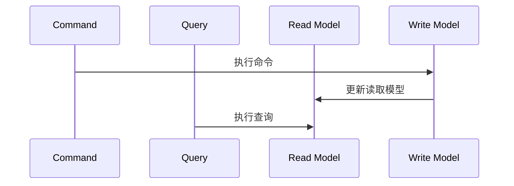

                 


### 文章标题: CQRS模式在系统设计中的应用

关键词：CQRS模式、系统设计、并发处理、数据一致性、架构优化

摘要：本文将深入探讨CQRS（Command Query Responsibility Segregation）模式在系统设计中的应用。通过详细的案例分析，我们将理解CQRS模式的核心概念、基本原理、优势挑战，以及其实际操作中的系统设计与实现方法。

## 第一部分：引言

### 第1章: CQRS模式概述

#### 1.1 CQRS模式的基本概念

**问题背景**

在传统的系统设计中，读取操作（Query）和写入操作（Command）往往耦合在一起，这会导致在处理大量并发请求时，系统性能瓶颈难以突破，同时也增加了数据一致性的复杂性。

**问题描述**

随着互联网的快速发展，用户数量的激增带来了大量的并发读取和写入请求。传统的设计模式在面对这种高并发、大数据量场景时，往往会出现响应速度慢、数据不一致等问题。

**问题解决**

CQRS模式通过将读取和写入分离，分别处理，从而提高了系统的性能和可扩展性。这种模式的基本思想是将系统的数据模型分为两部分：Write Model（写入模型）和Read Model（读取模型）。

#### 1.2 CQRS模式的基本原理

**CQRS的组成部分**

CQRS模式由四个核心组成部分构成：Command、Query、Read Model和Write Model。

**CQRS与传统的读取-写入模型的对比**

传统的读取-写入模型中，读取和写入操作是相互依赖的，而CQRS模式通过将它们分离，实现了数据的独立管理，提高了系统的灵活性。

**CQRS模式的应用场景**

CQRS模式特别适用于以下场景：

1. 高并发场景：通过分离读取和写入，可以有效地处理大量并发请求。
2. 大数据场景：读取模型可以独立于写入模型进行优化，提高查询效率。
3. 复杂业务场景：CQRS模式可以更好地支持复杂业务逻辑的处理。

#### 1.3 CQRS模式的优势与挑战

**优势**

1. 提高性能：通过分离读取和写入，可以显著提高系统的响应速度。
2. 提高扩展性：读取和写入分离，使得系统可以独立扩展。
3. 提高可维护性：分离的模型使得系统的维护变得更加简单。

**挑战**

1. 数据一致性：确保写入模型和读取模型的一致性是一个重要挑战。
2. 复杂性：CQRS模式引入了额外的复杂性，需要开发人员有较高的技能水平。

#### 1.4 本章小结

本章对CQRS模式进行了概述，介绍了其基本概念、原理和应用场景。通过了解CQRS模式，我们可以更好地应对现代系统设计中的复杂性和高性能需求。

----------------------------------------------------------------

## 第二部分: CQRS模式的基础理论

### 第2章: CQRS模式的核心概念与联系

#### 2.1 核心概念

**Command（命令）**

Command是用于修改系统状态的请求，通常包含一些操作指令，如创建、更新或删除数据。

**Query（查询）**

Query是用于获取系统状态的信息请求，通常用于检索数据。

**Read Model（读取模型）**

Read Model是用于存储查询结果的模型，它提供了系统的最终视图，通常与Write Model分离。

**Write Model（写入模型）**

Write Model是用于存储系统变更的模型，它与Command紧密关联，负责处理数据变更。

#### 2.2 概念属性特征对比表格

| 概念         | 定义                                                         | 属性特征                                  |
| ------------ | ------------------------------------------------------------ | ---------------------------------------- |
| Command      | 用于修改系统状态的请求                                         | 单向、无状态、不可缓存                   |
| Query        | 用于获取系统状态的信息请求                                     | 可缓存、支持聚合、可重复执行             |
| Read Model   | 用于存储查询结果的模型                                       | 隔离于Write Model，独立维护               |
| Write Model  | 用于存储系统变更的模型                                       | 与Command紧密关联，保证数据一致性       |

#### 2.3 ER实体关系图架构

```mermaid
erDiagram
    Command --> Read Model : 命令更新读取模型
    Command --> Write Model : 命令更新写入模型
    Query --> Read Model : 查询读取模型
```

### 第3章: CQRS模式的系统设计与实现

#### 3.1 系统设计原则

**分离读取与写入**

CQRS模式的核心原则是分离读取和写入，从而实现系统的高性能和高可扩展性。

**灵活调整读取模型**

读取模型应该能够灵活调整，以适应不同的查询需求。

**保证数据一致性**

确保写入模型和读取模型的一致性是CQRS模式应用中的关键。

#### 3.2 系统架构设计

**总体架构**

CQRS模式通常采用分层架构，将系统分为数据访问层、业务逻辑层和表示层。

**分层架构**

1. 数据访问层：负责与数据库的交互，包括读取和写入操作。
2. 业务逻辑层：实现系统的业务逻辑，包括Command和Query的处理。
3. 表示层：负责与用户的交互，向用户展示系统的查询结果。

**微服务架构**

CQRS模式也可以与微服务架构相结合，每个微服务都可以独立扩展和部署。

#### 3.3 系统接口设计

**命令接口**

命令接口负责接收并处理用户的命令请求，如创建、更新或删除数据。

**查询接口**

查询接口负责处理用户的查询请求，返回系统的查询结果。

#### 3.4 系统交互



### 第4章: CQRS模式的应用实战

#### 4.1 项目介绍

**项目背景**

随着电子商务的兴起，一个在线购物平台需要处理海量的商品查询和订单处理请求。

**项目目标**

实现一个高性能、可扩展的在线购物平台，能够快速响应用户的查询和订单处理请求。

**项目环境**

- 语言：Java
- 框架：Spring Boot、Spring Data JPA
- 数据库：MySQL
- 客户端：REST API

#### 4.2 系统功能设计

**领域模型**

```mermaid
classDiagram
    Customer <<entity>>
    Product <<entity>>
    Order <<entity>>
    OrderItem <<entity>>

    Customer "1" -- "many": Order
    Product "1" -- "many": OrderItem
    Order "1" -- "many": OrderItem
```

**系统架构**

```mermaid
sequenceDiagram
    Participant ProductService
    Participant OrderService
    Participant ProductService <<interface>>
    Participant OrderService <<interface>>

    Customer ->> ProductService: Query Product List
    ProductService ->> ProductService <<interface>>: Process Query
    ProductService ->> Customer: Return Product List

    Customer ->> OrderService: Create Order
    OrderService ->> OrderService <<interface>>: Process Command
    OrderService ->> Customer: Return Order ID
```

#### 4.3 系统核心实现源代码

```java
// ProductService.java
@Service
public class ProductService {

    @Autowired
    private ProductRepository productRepository;

    public List<Product> queryProductList() {
        return productRepository.findAll();
    }
}

// OrderService.java
@Service
public class OrderService {

    @Autowired
    private OrderRepository orderRepository;

    public Long createOrder(Long customerId, List<OrderItem> items) {
        // Process order creation
        Order order = new Order(customerId, items);
        orderRepository.save(order);
        return order.getId();
    }
}
```

#### 4.4 代码应用解读与分析

**解读**

- `ProductService`负责处理商品的查询请求。
- `OrderService`负责处理订单的创建请求。

**分析**

- `ProductService`使用了Spring Data JPA的`findAll()`方法来查询所有商品。
- `OrderService`使用了Spring Data JPA的`save()`方法来创建订单。

#### 4.5 项目小结

通过本项目的实战，我们实现了CQRS模式的基本应用。在实际项目中，我们可以根据具体需求调整读取模型和写入模型，以实现最佳的系统性能和扩展性。

----------------------------------------------------------------

## 最佳实践 Tips

1. **确保数据一致性**：在CQRS模式中，数据一致性的保证是关键。可以使用分布式事务管理或最终一致性模型来确保写入模型和读取模型之间的数据一致性。

2. **优化读取模型**：读取模型的设计对查询性能有很大影响。可以使用缓存、索引和分库分表等技术来优化读取模型。

3. **合理划分读写分离**：在系统设计中，需要根据具体业务场景合理划分读取和写入操作，以达到最佳性能。

4. **持续优化架构**：随着业务的发展，系统架构需要不断调整和优化，以适应新的需求。

## 小结

CQRS模式是一种强大的系统设计模式，通过分离读取和写入操作，可以显著提高系统的性能和可扩展性。在实际应用中，我们需要根据具体业务场景来设计合适的读取模型和写入模型，并确保数据的一致性。通过本文的详细分析和案例分析，我们相信读者对CQRS模式有了更深入的理解。

## 注意事项

- 在使用CQRS模式时，需要注意系统的复杂性可能会增加，因此需要具备一定的系统设计能力。
- 数据一致性的保证是一个持续的过程，需要定期进行检查和优化。

## 拓展阅读

1. 《领域驱动设计》 -Eric Evans
2. 《大规模分布式存储系统设计》 -张涛
3. 《高并发系统设计》 -宋宝库

作者：AI天才研究院/AI Genius Institute & 禅与计算机程序设计艺术 /Zen And The Art of Computer Programming

