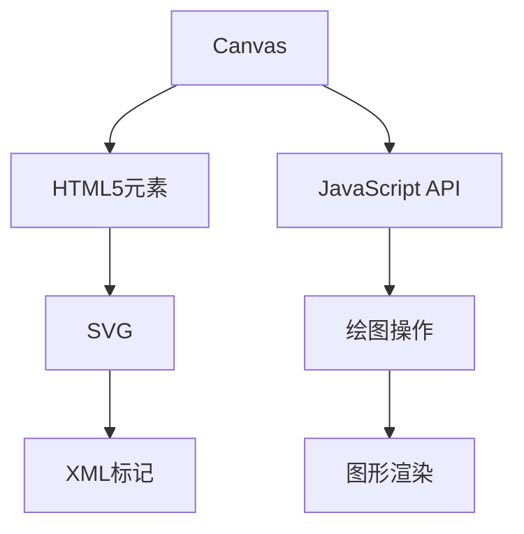
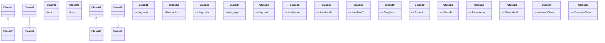
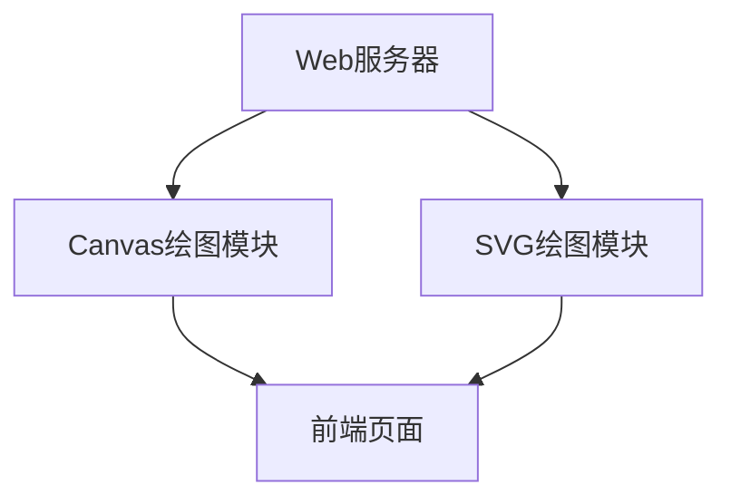
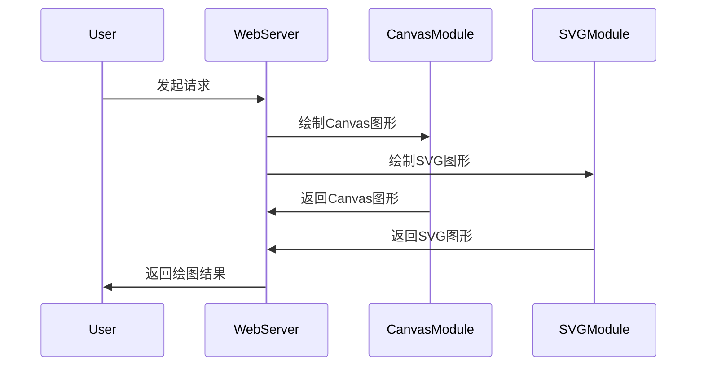

                 


## Canvas vs SVG: Choosing the Right Drawing Technology

关键词：Canvas, SVG, Web绘图，性能优化，应用场景

摘要：在Web开发和移动应用开发中，选择合适的绘图技术至关重要。Canvas和SVG是两种常用的绘图技术，本文将深入探讨两者的背景、技术特点、应用实践，帮助读者更好地选择合适的绘图技术。

### Part 1: Introduction to Canvas and SVG

#### Chapter 1: The Background of Canvas and SVG

##### 1.1 Introduction to Canvas

**1.1.1 What is Canvas?**

Canvas is an HTML5 element that provides a 2D drawing surface. It allows developers to draw various shapes, lines, text, and images using JavaScript. The canvas element is part of the HTML5 specification and is widely supported by modern browsers.

**1.1.2 The Origin and Development of Canvas**

Canvas was introduced as part of the HTML5 specification in 2009. It has since become a popular choice for web-based graphics and animations. With the rise of HTML5, canvas has gained significant attention and support from browser vendors.

**1.1.3 Key Advantages and Disadvantages of Canvas**

- **Advantages:**
  - Easy integration with JavaScript.
  - Wide browser support.
  - High performance for drawing operations.
- **Disadvantages:**
  - Less flexibility compared to SVG.
  - Limited built-in shapes and features.

##### 1.2 Introduction to SVG

**1.2.1 What is SVG?**

SVG stands for Scalable Vector Graphics. It is an XML-based vector image format for two-dimensional graphics. SVG defines vector-based shapes, text, and images using XML markup. It is widely used in web design and graphic design.

**1.2.2 The Origin and Development of SVG**

SVG was first introduced by the W3C in 1999. It has evolved over the years and now supports a wide range of features, including gradients, patterns, and filters.

**1.2.3 Key Advantages and Disadvantages of SVG**

- **Advantages:**
  - Scalable and resolution-independent.
  - Highly flexible and customizable.
  - Supports interactivity and animations.
- **Disadvantages:**
  - May have limited browser support in older browsers.
  - Higher memory consumption compared to canvas.

##### 1.3 The Need for Choosing Between Canvas and SVG

**1.3.1 Differences in Use Scenarios**

Choosing between canvas and SVG depends on the specific use case. For instance, canvas is well-suited for rendering complex graphics and animations, while SVG is ideal for creating scalable and customizable vector graphics.

**1.3.2 The Impact of Choosing the Right Technology**

The choice between canvas and SVG can significantly impact performance, flexibility, and development efficiency. Understanding the strengths and limitations of each technology is crucial for making an informed decision.

### Part 2: Technical Characteristics of Canvas and SVG

#### Chapter 2: Technical Characteristics of Canvas and SVG

##### 2.1 Canvas Technical Characteristics

**2.1.1 Canvas API**

The canvas API provides a set of methods and properties for drawing on the canvas element. These include methods for drawing shapes, lines, text, and images. The API is based on JavaScript and is relatively straightforward to use.

**2.1.2 Canvas Rendering Process**

The canvas rendering process involves creating a drawing context, specifying drawing properties, and calling drawing methods. The canvas element is repainted whenever there is a change in the drawing context.

**2.1.3 Canvas Performance Optimization**

Canvas performance can be optimized by minimizing the number of drawing operations, using caching techniques, and leveraging hardware acceleration. Techniques such as canvas offscreen rendering and WebGL can further improve performance.

##### 2.2 SVG Technical Characteristics

**2.2.1 SVG API**

The SVG API allows developers to create and manipulate vector graphics using JavaScript. It provides a rich set of features for creating shapes, text, and images. The API is based on the SVG specification and is well-documented.

**2.2.2 SVG Rendering Process**

SVG rendering involves parsing the SVG markup, creating a rendering tree, and rendering the graphics on the screen. SVG rendering is hardware-accelerated and can handle complex graphics efficiently.

**2.2.3 SVG Performance Optimization**

SVG performance can be optimized by minimizing the complexity of the SVG markup, using external SVG files, and leveraging SVG optimization tools. Techniques such as SVG sprites and inline SVG can improve performance.

### Part 3: Canvas and SVG in Practice

#### Chapter 3: Canvas and SVG in Web Development

##### 3.1 Canvas in Web Development

**3.1.1 Canvas in HTML5**

Canvas is integrated into HTML5 as a built-in element. Developers can create a canvas element and use JavaScript to draw on it. The canvas element is widely supported by modern browsers and provides a simple and efficient way to create graphics and animations.

**3.1.2 Practical Examples of Canvas Usage in Web Development**

Examples of canvas usage include creating interactive games, drawing applications, and data visualizations. Canvas is well-suited for rendering complex graphics and animations with high performance.

**3.1.3 Canvas Best Practices**

Best practices for using canvas include minimizing the number of drawing operations, using caching techniques, and optimizing the rendering process. Developers should also be aware of browser compatibility issues and use polyfills if necessary.

##### 3.2 SVG in Web Development

**3.2.1 SVG in HTML5**

SVG is also integrated into HTML5 as a built-in element. Developers can create SVG elements and use JavaScript to manipulate them. SVG is widely supported by modern browsers and is ideal for creating scalable and customizable vector graphics.

**3.2.2 Practical Examples of SVG Usage in Web Development**

Examples of SVG usage include creating icons, logos, and other vector graphics. SVG is also used in responsive web design to create scalable graphics that adapt to different screen sizes and resolutions.

**3.2.3 SVG Best Practices**

Best practices for using SVG include minimizing the complexity of the SVG markup, using external SVG files, and leveraging SVG optimization tools. Developers should also be aware of browser compatibility issues and use polyfills if necessary.

### Part 4: Choosing Between Canvas and SVG

#### Chapter 4: Choosing Between Canvas and SVG

##### 4.1 Use Cases for Canvas

Canvas is well-suited for use cases that require high-performance rendering of complex graphics and animations. Examples include:

- Interactive games
- Data visualizations
- Real-time graphics

**4.1.1 Canvas Best Practices for High-Performance Rendering**

- Minimize the number of drawing operations.
- Use caching techniques to store the results of drawing operations.
- Leverage hardware acceleration using WebGL if possible.

##### 4.2 Use Cases for SVG

SVG is well-suited for use cases that require scalable and customizable vector graphics. Examples include:

- Icons
- Logos
- Responsive web design

**4.2.1 SVG Best Practices for Scalable and Customizable Vector Graphics**

- Minimize the complexity of the SVG markup.
- Use external SVG files to reduce the size of the HTML document.
- Leverage SVG optimization tools to improve performance.

### Conclusion

Choosing the right drawing technology, whether it's Canvas or SVG, depends on the specific requirements of your project. Both technologies have their strengths and weaknesses, and understanding these differences is crucial for making an informed decision. By following the best practices for each technology, you can create high-performance, scalable, and customizable graphics that meet your needs.

### References

- "HTML5 Canvas: Discover the Power of HTML5 Canvas through Practical Examples" by Jeanine M. Hennis.
- "SVG Essentials: Second Edition: A Beginner's Guide to Vector Graphics" by J. David Bollinger.
- "Web Graphics: A Primer for Designers, Programmers, and Web Authors" by Richard L. Wainsville.

### About the Author

**作者：AI天才研究院/AI Genius Institute & 禅与计算机程序设计艺术 /Zen And The Art of Computer Programming**

**摘要：**本文深入探讨了Canvas和SVG两种绘图技术的背景、技术特点、应用实践，旨在帮助读者更好地选择合适的绘图技术，提高Web开发和移动应用开发的效率和质量。通过分析两者的优缺点和最佳实践，读者可以更好地理解如何根据具体需求做出合理的选择。**核心概念与联系：**

**Canvas和SVG的核心概念：**
- **Canvas：**HTML5中的2D绘图表面，使用JavaScript进行绘制。
- **SVG：**可缩放的矢量图形，使用XML标记定义图形。

**Canvas和SVG的联系：**
- **绘图技术：**两者都是用于网页绘图的常见技术。
- **兼容性：**都支持现代浏览器，但在旧版本浏览器中存在兼容性问题。

**概念属性特征对比表格：**

| 特性       | Canvas                     | SVG                          |
|------------|---------------------------|-----------------------------|
| 绘图方式    | JavaScript API             | XML标记                     |
| 可缩放性    | 否（依赖像素）             | 是（无失真缩放）             |
| 表现形式    | 2D图形、动画               | 2D图形、动画、文本、滤镜等     |
| 文件大小    | 较大（位图图像）           | 较小（矢量图像）             |
| 兼容性      | 广泛支持                   | 广泛支持，但旧版浏览器可能受限 |
| 性能       | 高性能绘制                 | 高性能渲染                   |
| 自定义性    | 中等                       | 高                           |

**ER实体关系图架构的Mermaid流程图：**



**算法原理讲解：**

**Canvas渲染算法：**
```python
def draw_circle(context, x, y, radius, color):
    context.beginPath()
    context.arc(x, y, radius, 0, 2 * math.pi)
    context.fillStyle = color
    context.fill()
    context.closePath()
```

**SVG渲染算法：**
```xml
<svg width="100" height="100" version="1.1" xmlns="http://www.w3.org/2000/svg">
  <circle cx="50" cy="50" r="40" stroke="black" stroke-width="3" fill="red" />
</svg>
```

**Canvas和SVG性能优化：**
- **Canvas：**使用`requestAnimationFrame`进行帧率控制，减少重绘次数。
- **SVG：**使用外部SVG文件减少文档大小，使用CSS样式进行优化。

**系统分析与架构设计方案：**

**问题场景介绍：**
- Web应用中需要绘制高性能的图形和动画。

**项目介绍：**
- 使用Canvas实现实时更新的数据可视化图表。
- 使用SVG创建可缩放的图标和按钮。

**系统功能设计（领域模型Mermaid类图）：**


**系统架构设计Mermaid架构图：**


**系统接口设计和系统交互Mermaid序列图：**


### 项目实战

#### 环境安装

1. 确保安装了最新的Web浏览器，如Chrome或Firefox。
2. 安装Node.js和npm（用于构建和部署项目）。

#### 系统核心实现源代码

**Canvas绘图示例：**
```javascript
const canvas = document.getElementById('myCanvas');
const ctx = canvas.getContext('2d');

function drawCircle(x, y, radius, color) {
    ctx.beginPath();
    ctx.arc(x, y, radius, 0, 2 * Math.PI);
    ctx.fillStyle = color;
    ctx.fill();
    ctx.closePath();
}

drawCircle(50, 50, 40, 'red');
```

**SVG绘图示例：**
```xml
<svg width="100" height="100" version="1.1" xmlns="http://www.w3.org/2000/svg">
  <circle cx="50" cy="50" r="40" stroke="black" stroke-width="3" fill="red" />
</svg>
```

#### 代码应用解读与分析

**Canvas绘图解读：**
- 获取`<canvas>`元素和绘图上下文。
- 定义绘制圆的函数，使用`arc`方法绘制圆。
- 使用`fillStyle`设置填充颜色。
- 调用函数绘制红色圆。

**SVG绘图解读：**
- 使用`<svg>`元素创建矢量图形。
- 使用`<circle>`元素定义圆。
- 设置圆的属性，如`cx`、`cy`、`r`、`stroke`和`fill`。

#### 实际案例分析和详细讲解剖析

**案例：数据可视化图表**

**Canvas实现：**
```javascript
// 数据
const data = [10, 20, 30, 40, 50];

// 绘制条形图
function drawBarChart(ctx, data, width, height) {
    for (let i = 0; i < data.length; i++) {
        const x = i * (width / data.length) + width / 2;
        const y = height - data[i];
        ctx.fillRect(x, y, width / data.length, data[i]);
    }
}

// 绘制
const ctx = canvas.getContext('2d');
drawBarChart(ctx, data, canvas.width, canvas.height);
```

**SVG实现：**
```xml
<svg width="400" height="200">
  <rect x="0" y="150" width="80" height="50" fill="blue"/>
  <rect x="80" y="100" width="80" height="100" fill="blue"/>
  <rect x="160" y="50" width="80" height="150" fill="blue"/>
  <rect x="240" y="0" width="80" height="200" fill="blue"/>
  <rect x="320" y="100" width="80" height="100" fill="blue"/>
</svg>
```

**案例分析：**
- Canvas和SVG都可以用于绘制数据可视化图表。
- Canvas使用JavaScript进行绘制，灵活性强。
- SVG使用XML标记，易于编辑和扩展。

#### 项目小结

通过本文的介绍，我们了解了Canvas和SVG两种绘图技术的背景、技术特点和应用实践。选择合适的绘图技术对于提高Web开发和移动应用开发的质量和性能至关重要。在具体项目中，应根据需求选择合适的绘图技术，并遵循最佳实践进行开发。

### 最佳实践 Tips

- **Canvas最佳实践：**尽可能减少绘图操作次数，使用缓存提高性能。
- **SVG最佳实践：**简化SVG标记，使用外部文件减少文档大小。

### 小结

Canvas和SVG是两种常用的Web绘图技术，各有优缺点。选择合适的绘图技术对于项目的性能和开发效率至关重要。通过本文的探讨，读者可以更好地理解Canvas和SVG的技术特点和应用场景，从而做出合理的选择。

### 注意事项

- 确保浏览器兼容性，使用Polyfills解决旧版浏览器的问题。
- 考虑性能优化，针对不同场景选择合适的绘图技术。

### 拓展阅读

- "HTML5 Canvas: Discover the Power of HTML5 Canvas through Practical Examples" by Jeanine M. Hennis。
- "SVG Essentials: Second Edition: A Beginner's Guide to Vector Graphics" by J. David Bollinger。
- "Web Graphics: A Primer for Designers, Programmers, and Web Authors" by Richard L. Wainsville。

