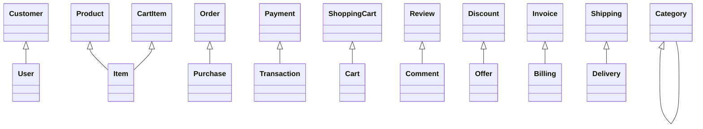
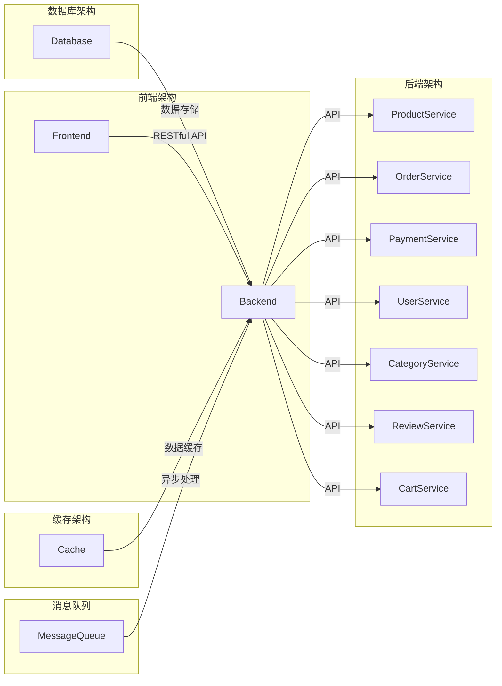

                 


### DevOps概述

#### DevOps的定义与起源

DevOps是一种软件开发和运维的文化、实践和工具集合，旨在通过协同工作和自动化来加速软件开发和交付过程。DevOps的核心思想是将开发（Development）和运维（Operations）紧密结合，打破传统开发与运维之间的隔阂，提高软件交付的速度和可靠性。

DevOps的概念最早出现在2009年的云原生计算大会上，由安德鲁·康明（Andrew Clay Shafer）和Jez Humble提出。此后，DevOps逐渐成为一种全球性的趋势，并得到广泛的应用和推广。

#### DevOps的核心原则与价值观

DevOps倡导以下核心原则和价值观：

1. **持续交付**：通过自动化测试和部署流程，确保软件持续交付到生产环境。
2. **监控与反馈**：实时监控系统性能和用户行为，及时获取反馈，快速响应并改进。
3. **团队协作**：打破部门壁垒，实现开发、测试、运维等团队的紧密协作。
4. **快速迭代**：采用敏捷开发方法，快速迭代产品，满足用户需求。
5. **基础设施即代码**：使用代码来管理和部署基础设施，确保环境的一致性和可复现性。

#### DevOps与传统IT运维的区别

传统IT运维更多关注于系统维护、故障排除和性能优化，而DevOps则更注重于整个软件交付过程，包括开发、测试、部署和运维等环节。以下是DevOps与传统IT运维的主要区别：

1. **自动化**：DevOps强调使用自动化工具和脚本来自动化日常运维任务，减少人工干预。
2. **协作**：DevOps提倡跨部门协作，打破开发与运维之间的壁垒。
3. **速度**：DevOps通过持续集成和持续部署等实践，大大加快了软件交付的速度。
4. **质量**：DevOps注重通过自动化测试和质量保证措施，提高软件质量。

#### DevOps的重要性和趋势

DevOps的兴起源于现代软件开发的快速变化和市场竞争的加剧。以下是DevOps的重要性和当前的发展趋势：

1. **提高交付速度**：DevOps通过自动化和协作，加快了软件交付速度，提高了企业的市场竞争力。
2. **提高软件质量**：通过持续集成和持续部署，以及自动化测试，DevOps有助于提高软件质量。
3. **降低成本**：自动化减少了人工干预，降低了运维成本。
4. **响应市场变化**：DevOps有助于企业更快地响应市场变化和用户需求。

在未来，随着云计算、人工智能和容器技术的发展，DevOps将继续发展和完善，为企业提供更高效、更可靠的软件交付解决方案。

### DevOps基础概念

DevOps的核心在于实践和工具的结合，以下介绍几个基础概念，这些概念是理解DevOps实践的关键。

#### 流水线与自动化

流水线（Pipeline）是DevOps中一个重要的概念，它表示从代码提交到最终部署的整个流程。流水线通常包括以下几个阶段：

1. **构建（Build）**：将源代码编译成可执行的程序。
2. **测试（Test）**：运行自动化测试以确保代码质量。
3. **部署（Deploy）**：将代码部署到测试或生产环境。

自动化是指使用脚本、工具和自动化平台来自动执行这些任务，从而减少手动操作，提高效率和可靠性。

#### 持续集成（CI）

持续集成（Continuous Integration，CI）是一种软件开发实践，旨在通过频繁地合并代码并自动运行测试，确保代码库的稳定性和质量。CI的关键点包括：

1. **频繁提交**：开发者频繁提交代码，每次提交都触发集成测试。
2. **自动化测试**：测试过程自动化，包括单元测试、集成测试等。
3. **快速反馈**：发现问题时，及时反馈给开发者，快速修复。

#### 持续部署（CD）

持续部署（Continuous Deployment，CD）是持续集成（CI）的自然延伸，它将自动化部署扩展到生产环境。CD的关键点包括：

1. **自动化部署**：使用脚本和工具来自动化部署过程，包括环境配置、数据库迁移等。
2. **快速迭代**：频繁地发布新版本，确保用户能够快速获得更新。
3. **灰度发布**：通过逐步增加用户群，确保新版本的风险可控。

#### 微服务架构

微服务架构（Microservices Architecture）是一种将应用程序拆分成多个独立的、可部署的服务单元的设计方法。每个微服务负责特定的业务功能，独立开发、部署和扩展。微服务架构的关键点包括：

1. **服务独立性**：每个微服务都是独立的，可以独立部署和扩展。
2. **去中心化**：服务之间通过API进行通信，没有全局状态。
3. **容器化**：微服务通常部署在容器中，如Docker，确保环境一致性和可移植性。

#### Infrastructure as Code（IaC）

基础设施即代码（Infrastructure as Code，IaC）是一种使用代码来描述和管理基础设施的设计和配置的方法。IaC的关键点包括：

1. **代码化基础设施**：将基础设施描述为代码，如JSON、YAML等。
2. **版本控制**：使用版本控制系统管理基础设施代码，确保可追溯和可复现。
3. **自动化部署**：使用IaC工具来自动部署和管理基础设施，如Terraform、Ansible等。

通过上述基础概念的介绍，我们可以看到DevOps是如何通过一系列实践和工具，将软件开发和运维过程紧密结合起来，提高软件交付的效率和质量。

### 常见DevOps工具介绍

在DevOps的实践中，选择合适的工具至关重要。以下介绍几种常见的DevOps工具，包括其功能、特点和适用场景。

#### 1. Jenkins

Jenkins是一个开源的自动化服务器，广泛应用于持续集成和持续部署（CI/CD）流程。其主要功能包括：

1. **自动化构建**：Jenkins可以自动构建、测试和部署代码。
2. **插件生态系统**：Jenkins拥有丰富的插件，可以扩展其功能，如与Git集成、触发器设置等。
3. **通知系统**：Jenkins支持多种通知方式，如邮件、SMS、Webhook等，方便团队实时了解构建状态。

**特点**：

- **可扩展性**：通过插件，Jenkins可以轻松地集成其他工具和服务。
- **灵活性**：Jenkins允许用户自定义工作流，满足不同的需求。
- **社区支持**：拥有庞大的社区，提供丰富的资源和文档。

**适用场景**：Jenkins适用于中小型项目以及需要高度自定义CI/CD流程的企业。

#### 2. GitLab CI/CD

GitLab CI/CD是GitLab内置的持续集成和持续部署工具。其主要功能包括：

1. **自动化测试**：GitLab CI/CD可以自动运行测试，确保代码质量。
2. **部署管理**：GitLab CI/CD支持多种部署策略，如一次性部署、分阶段部署等。
3. **多环境管理**：GitLab CI/CD支持多种环境，如开发、测试、生产等。

**特点**：

- **一体化**：GitLab CI/CD与GitLab代码管理平台深度集成，简化流程。
- **配置简洁**：使用`.gitlab-ci.yml`文件配置CI/CD流程，易于理解和维护。
- **开源**：GitLab CI/CD是开源的，无额外费用。

**适用场景**：GitLab CI/CD适用于需要统一代码管理和CI/CD流程的企业。

#### 3. Docker

Docker是一个开源的应用容器引擎，用于构建、运行和分发应用程序。其主要功能包括：

1. **容器化**：Docker可以将应用程序及其依赖环境打包成一个容器，确保环境一致性和可移植性。
2. **镜像管理**：Docker支持创建和管理容器镜像，方便版本控制和部署。
3. **编排与部署**：Docker Compose和Swarm等工具用于容器编排和部署。

**特点**：

- **轻量级**：Docker容器非常轻量，启动速度快。
- **可移植性**：Docker容器可以在不同环境中无缝运行。
- **社区支持**：Docker拥有庞大的社区，提供丰富的资源和文档。

**适用场景**：Docker适用于需要环境一致性和可移植性的应用程序开发和部署。

#### 4. Kubernetes

Kubernetes是一个开源的容器编排平台，用于自动化容器化应用程序的部署、扩展和管理。其主要功能包括：

1. **容器编排**：Kubernetes可以自动化管理容器的生命周期，包括启动、停止、扩展等。
2. **服务发现与负载均衡**：Kubernetes支持服务发现和负载均衡，确保应用程序的高可用性。
3. **存储编排**：Kubernetes可以自动化管理存储资源，如持久化存储卷。

**特点**：

- **高可用性**：Kubernetes支持故障转移和自动恢复，确保系统的高可用性。
- **可扩展性**：Kubernetes可以轻松地扩展到大规模集群。
- **开源**：Kubernetes是开源的，无额外费用。

**适用场景**：Kubernetes适用于需要高可用性和可扩展性的企业级应用程序。

通过介绍这些常见的DevOps工具，我们可以看到它们在持续集成、持续部署、容器化、编排和管理等方面的重要作用。选择合适的工具，可以大大提高软件交付的效率和质量。

### 工具集成策略

在DevOps实践中，工具之间的集成策略至关重要，它直接影响整个流程的效率和可靠性。以下讨论如何将常见的DevOps工具如Jenkins、GitLab CI/CD、Docker和Kubernetes等集成到持续集成和持续部署（CI/CD）流程中。

#### 1. Jenkins与其他工具的集成

**Jenkins与Git的集成**：
Jenkins可以通过其插件系统与Git集成，实现从Git仓库拉取代码，并触发构建过程。具体步骤如下：
- 在Jenkins中安装并配置Git插件。
- 创建Jenkins管道（Pipeline），在管道脚本中配置Git仓库地址。
- 设置触发器，如每次提交或定期触发构建。

**Jenkins与Docker的集成**：
Jenkins可以与Docker集成，实现容器的构建和部署。具体步骤如下：
- 在Jenkins中安装并配置Docker插件。
- 在Jenkins管道中添加Docker构建步骤，如`docker build`命令。
- 使用Jenkins来管理Docker镜像，如推送到Docker Hub。

**Jenkins与Kubernetes的集成**：
Jenkins可以通过插件与Kubernetes集成，实现容器化应用程序的部署。具体步骤如下：
- 在Jenkins中安装并配置Kubernetes插件。
- 在Jenkins管道中添加Kubernetes部署步骤，如使用kubectl进行部署。
- 配置Jenkins以自动将容器镜像推送到Kubernetes集群，并在成功部署后通知相关团队成员。

#### 2. GitLab CI/CD与其他工具的集成

**GitLab CI/CD与Docker的集成**：
GitLab CI/CD内置了对Docker的支持，可以在`.gitlab-ci.yml`文件中直接使用Docker命令。具体步骤如下：
- 在`.gitlab-ci.yml`文件中定义Docker镜像构建步骤。
- 将构建好的镜像推送到Docker Hub或其他镜像仓库。
- 配置部署策略，如一次性部署或分阶段部署。

**GitLab CI/CD与Kubernetes的集成**：
GitLab CI/CD可以通过Kubernetes Runner来与Kubernetes集成。具体步骤如下：
- 在GitLab中配置Kubernetes Runner，设置集群连接信息。
- 在`.gitlab-ci.yml`文件中定义部署步骤，如使用kubectl或Kubernetes API进行部署。
- 配置GitLab CI/CD以在成功构建后自动部署到Kubernetes集群。

#### 3. Docker与Kubernetes的集成

**Docker与Kubernetes的集成**：
Docker与Kubernetes可以无缝集成，Docker容器可以在Kubernetes集群中部署和管理。具体步骤如下：
- 使用Docker构建应用程序容器镜像。
- 将容器镜像推送到容器注册库，如Docker Hub。
- 在Kubernetes集群中创建部署（Deployment）配置文件，指定容器镜像和部署策略。
- 使用kubectl工具部署和管理容器。

#### 集成策略总结

**统一平台**：尽可能使用统一的平台和工具，如GitLab CI/CD结合GitLab代码仓库，简化流程和降低复杂性。
**自动化**：充分利用自动化工具和脚本来自动执行重复性任务，减少人工干预。
**监控与反馈**：集成监控系统，实时监控CI/CD流程的运行状态，及时获取反馈并作出调整。
**版本控制**：使用版本控制系统管理所有配置文件和代码，确保变更的可追溯性和可复现性。

通过上述工具的集成策略，可以构建一个高效、可靠的CI/CD流程，实现从代码提交到生产环境交付的全过程自动化，提高软件交付的效率和质量。

### Jenkins实践

#### 安装与配置

**安装**：
Jenkins是一个基于Java的软件，可以通过多种方式进行安装。以下是在Linux系统中使用Docker安装Jenkins的步骤：

1. **安装Docker**：确保Docker已安装并运行。
2. **拉取Jenkins镜像**：
   ```shell
   docker pull jenkins/jenkins:lts
   ```
3. **启动Jenkins容器**：
   ```shell
   docker run -d -p 8080:8080 --name jenkins jenkins/jenkins:lts
   ```

**配置**：
Jenkins启动后，通过浏览器访问`http://localhost:8080`，进入Jenkins安装向导。主要步骤如下：

1. **初始设置**：选择安装方式，创建管理员账号和密码。
2. **插件安装**：选择所需的插件，如Git插件、Pipeline插件等。
3. **安装完成**：安装完成后，Jenkins会自动启动并初始化。

#### Jenkinsfile编写

Jenkinsfile是Jenkins中用于定义构建和部署流程的脚本文件，通常放在代码仓库的根目录下。以下是一个简单的Jenkinsfile示例：

```groovy
pipeline {
    agent any

    environment {
        JDK_VERSION = '11'
        IMAGE_NAME = 'myapp'
        CONTAINER_REGISTRY = 'myregistry.com'
    }

    stages {
        stage('Build') {
            steps {
                sh 'echo "Building the application..."'
                sh 'mvn clean install'
            }
        }
        stage('Test') {
            steps {
                sh 'echo "Testing the application..."'
                sh 'mvn test'
            }
        }
        stage('Docker Build') {
            steps {
                sh 'docker build -t ${CONTAINER_REGISTRY}/${IMAGE_NAME}:${JDK_VERSION} .'
            }
        }
        stage('Docker Push') {
            steps {
                sh 'docker push ${CONTAINER_REGISTRY}/${IMAGE_NAME}:${JDK_VERSION}'
            }
        }
        stage('Kubernetes Deploy') {
            steps {
                sh 'kubectl set image deployment/myapp myapp=${CONTAINER_REGISTRY}/${IMAGE_NAME}:${JDK_VERSION} --record'
            }
        }
    }
}
```

此Jenkinsfile定义了一个多阶段流水线，包括构建、测试、Docker镜像构建、Docker镜像推送和Kubernetes部署。

#### 代码应用解读与分析

**构建阶段**：
- `sh 'echo "Building the application..."'`：打印构建开始信息。
- `sh 'mvn clean install'`：执行Maven构建命令，清理并编译项目。

**测试阶段**：
- `sh 'echo "Testing the application..."'`：打印测试开始信息。
- `sh 'mvn test'`：执行Maven测试命令，运行单元测试和集成测试。

**Docker构建阶段**：
- `sh 'docker build -t ${CONTAINER_REGISTRY}/${IMAGE_NAME}:${JDK_VERSION} .'`：构建Docker镜像，并指定镜像标签。

**Docker推送阶段**：
- `sh 'docker push ${CONTAINER_REGISTRY}/${IMAGE_NAME}:${JDK_VERSION}'`：将Docker镜像推送到容器注册库。

**Kubernetes部署阶段**：
- `sh 'kubectl set image deployment/myapp myapp=${CONTAINER_REGISTRY}/${IMAGE_NAME}:${JDK_VERSION} --record'`：更新Kubernetes部署中的容器镜像版本，并记录部署历史。

通过此Jenkinsfile，我们可以看到Jenkins如何自动化执行从代码构建、测试到容器化和部署的整个流程，实现持续集成和持续部署的目标。

### GitLab CI/CD实践

#### 安装与配置

**安装**：
GitLab CI/CD是GitLab的一部分，因此在安装GitLab时，CI/CD功能会自动启用。以下是安装GitLab的步骤：

1. **安装依赖**：确保系统中安装了必要的依赖，如Python、PostgreSQL等。
2. **下载安装包**：从GitLab官方网站下载安装包。
3. **安装GitLab**：运行安装脚本，根据提示完成安装。

**配置**：
安装完成后，需要配置GitLab CI/CD。主要步骤如下：

1. **访问GitLab**：通过浏览器访问GitLab实例。
2. **创建项目**：在GitLab中创建一个新项目。
3. **创建CI/CD配置文件**：在项目根目录下创建一个名为`.gitlab-ci.yml`的文件。

以下是一个简单的`.gitlab-ci.yml`配置文件示例：

```yaml
image: openjdk:11-jdk-alpine

stages:
  - build
  - test
  - deploy

build:
  stage: build
  script:
    - echo "Building the application..."
    - mvn clean install
  artifacts:
    paths:
      - target/*.jar

test:
  stage: test
  script:
    - echo "Testing the application..."
    - mvn test
  only:
    - master

deploy:
  stage: deploy
  script:
    - echo "Deploying the application..."
    - docker build -t myregistry.com/myapp:latest .
    - docker push myregistry.com/myapp:latest
    - kubectl set image deployment/myapp myapp=myregistry.com/myapp:latest
  only:
    - master
```

此配置文件定义了一个三阶段的CI/CD流程：构建（build）、测试（test）和部署（deploy）。每个阶段都有相应的脚本和依赖。

#### 代码应用解读与分析

**构建阶段**：
- `image: openjdk:11-jdk-alpine`：指定构建镜像，这里使用OpenJDK 11和Alpine Linux。
- `script:`：定义构建脚本，包括打印构建开始信息、执行Maven构建命令。
- `artifacts:`：定义生成的工件，这里为Maven构建生成的JAR文件。

**测试阶段**：
- `script:`：定义测试脚本，包括打印测试开始信息、执行Maven测试命令。
- `only:`：指定仅在`master`分支上执行此阶段，确保主分支代码质量。

**部署阶段**：
- `script:`：定义部署脚本，包括构建Docker镜像、推送镜像到容器注册库、更新Kubernetes部署。
- `only:`：指定仅在`master`分支上执行此阶段，确保主分支代码发布。

通过此`.gitlab-ci.yml`配置文件，GitLab CI/CD实现了从代码构建、测试到部署的自动化流程，确保代码质量和快速交付。

### Docker与Kubernetes实践

#### 安装与配置

**Docker安装**：
Docker是一个开源的应用容器引擎，安装Docker的步骤如下：

1. **安装Docker引擎**：在Linux系统中，可以通过包管理器安装Docker。例如，在Ubuntu系统中，可以执行以下命令：
   ```shell
   sudo apt-get update
   sudo apt-get install docker.io
   ```
2. **启动Docker服务**：
   ```shell
   sudo systemctl start docker
   ```
3. **验证安装**：运行以下命令，检查Docker是否已启动并运行：
   ```shell
   sudo docker run hello-world
   ```

**Kubernetes安装**：
Kubernetes是一个开源的容器编排平台，安装Kubernetes的步骤较为复杂，通常建议使用Kubeadm进行安装。以下是简要步骤：

1. **安装Kubeadm、Kubelet和Kubectl**：
   ```shell
   sudo apt-get update
   sudo apt-get install -y apt-transport-https ca-certificates curl
   sudo curl -s https://packages.cloud.google.com/apt/doc/apt-key.gpg | sudo apt-key add -
   sudo echo "deb https://apt.kubernetes.io/ kubernetes-xenial main" | sudo tee -a /etc/apt/sources.list
   sudo apt-get update
   sudo apt-get install -y kubelet kubeadm kubectl
   ```
2. **初始化集群**：在主节点上执行以下命令初始化Kubernetes集群：
   ```shell
   sudo kubeadm init --pod-network-cidr=10.244.0.0/16
   ```
3. **配置Kubectl**：将当前用户添加到kubectl的群组中，以便使用kubectl命令：
   ```shell
   sudo su
   usermod -a -G docker ${USER}
   newgrp ${USER}
   echo "export KUBECONFIG=/etc/kubernetes/admin.conf" >> ~/.bashrc
   source ~/.bashrc
   ```

**配置Calico网络**：
Calico是一个常用的Kubernetes网络插件，安装Calico的步骤如下：

1. **安装Calico插件**：
   ```shell
   kubectl apply -f https://docs.projectcalico.org/manifests/calico.yaml
   ```
2. **查看Pod网络**：
   ```shell
   kubectl get pods -n kube-system
   ```

**验证安装**：
运行以下命令，检查Kubernetes集群是否已成功启动：
```shell
kubectl cluster-info
```

#### 部署应用

**创建Docker镜像**：
在本地环境中，我们可以使用Dockerfile创建应用程序的Docker镜像。以下是一个简单的Dockerfile示例：

```Dockerfile
FROM openjdk:11-jdk-alpine
ARG JAR_FILE=target/*.jar
COPY ${JAR_FILE} app.jar
EXPOSE 8080
ENTRYPOINT ["java","-jar","/app.jar"]
```

执行以下命令构建镜像并推送到容器注册库：

```shell
sudo docker build -t myregistry.com/myapp:latest .
sudo docker push myregistry.com/myapp:latest
```

**创建Kubernetes部署配置**：
在Kubernetes中部署应用时，需要创建一个部署配置文件（Deployment YAML）。以下是一个简单的部署配置示例：

```yaml
apiVersion: apps/v1
kind: Deployment
metadata:
  name: myapp
spec:
  replicas: 3
  selector:
    matchLabels:
      app: myapp
  template:
    metadata:
      labels:
        app: myapp
    spec:
      containers:
      - name: myapp
        image: myregistry.com/myapp:latest
        ports:
        - containerPort: 8080
```

**应用部署**：
使用kubectl命令部署应用：

```shell
kubectl apply -f deployment.yaml
```

**查看部署状态**：
运行以下命令，查看部署的Pod状态：

```shell
kubectl get pods
```

通过上述步骤，我们可以将应用程序部署到Kubernetes集群中，并确保其高可用性和可扩展性。

### DevOps安全与合规性

在DevOps实践中，安全性和合规性是两个不可忽视的重要方面。以下是关于DevOps安全挑战、最佳实践以及合规性重要性的详细讨论。

#### DevOps中的安全挑战

1. **配置管理**：自动化工具和基础设施即代码（IaC）的使用提高了部署速度，但也增加了配置错误的潜在风险。
2. **代码质量**：频繁的代码提交和自动化测试虽然提高了开发效率，但代码质量可能因忽视而下降。
3. **身份认证与访问控制**：DevOps环境中需要确保严格的身份认证和访问控制，防止未授权的访问和操作。
4. **数据保护**：在频繁的代码提交和部署过程中，确保数据的安全性，防止数据泄露和篡改。
5. **持续集成与持续部署（CI/CD）**：自动化流程可能引入安全漏洞，例如自动化脚本未及时更新或配置错误。

#### DevOps安全最佳实践

1. **代码安全**：使用静态代码分析（SAST）和动态代码分析（DAST）工具检测潜在的安全问题。
2. **容器安全**：对容器镜像进行扫描，确保其中不包含已知漏洞和恶意软件。
3. **配置管理**：使用版本控制系统管理配置文件，确保配置的一致性和可追溯性。
4. **身份认证与访问控制**：实施强密码策略和多因素认证，为不同角色设置适当的访问权限。
5. **数据加密**：使用加密技术保护敏感数据，如加密数据库和文件存储。
6. **安全监控与审计**：部署安全监控工具，实时检测异常行为和安全事件，并进行审计。
7. **安全培训与意识**：定期为团队成员提供安全培训，提高安全意识和技能。

#### 合规性在DevOps中的重要性

合规性是指企业遵守相关法律、法规和行业标准的过程。在DevOps环境中，合规性至关重要，原因如下：

1. **法律与监管要求**：许多行业都有严格的数据保护法规和合规要求，如GDPR、HIPAA等。
2. **客户信任**：合规性有助于建立客户信任，降低法律风险。
3. **市场准入**：合规性是企业进入某些市场的必要条件。
4. **业务连续性**：合规性有助于确保业务运营的连续性和稳定性。

#### 合规性实现策略

1. **合规性评估**：定期进行合规性评估，确保系统、流程和工具符合相关法规和标准。
2. **合规性培训**：为团队成员提供合规性培训，确保他们了解并遵守相关法规和标准。
3. **配置管理**：使用版本控制系统管理配置文件和代码，确保变更的可追溯性和合规性。
4. **数据保护**：实施数据加密和访问控制措施，确保数据在存储和传输过程中的安全性。
5. **审计与报告**：建立审计机制，定期进行内部和外部审计，确保合规性，并生成合规性报告。
6. **合规性自动化**：使用自动化工具和脚本确保合规性要求在CI/CD流程中得以执行。

通过上述策略，企业可以确保在DevOps环境中实现合规性，降低法律风险，提高业务稳定性。

### DevOps团队构建与管理

构建和管理高效的DevOps团队是实现DevOps目标的关键。以下是关于DevOps团队组织结构、角色与技能要求、沟通与协作、以及团队绩效评估的详细讨论。

#### DevOps团队组织结构

DevOps团队的组织结构可以根据企业的规模和需求有所不同，但通常包括以下几个核心角色：

1. **DevOps工程师**：负责构建、部署和管理自动化基础设施，确保开发和运维的无缝集成。
2. **软件开发工程师**：负责编写和测试应用程序代码，确保代码质量。
3. **测试工程师**：负责编写和执行自动化测试，确保软件的功能和性能符合要求。
4. **运维工程师**：负责维护和监控生产环境中的基础设施和应用程序。
5. **产品经理**：负责产品规划和需求管理，确保开发团队能够优先处理高优先级的需求。

在小型企业中，这些角色可能由同一组人负责，而在大型企业中，可能需要更细化的分工。

#### DevOps角色与技能要求

**DevOps工程师**：
- **技能要求**：熟悉Linux、云计算、容器化、自动化部署工具（如Jenkins、Kubernetes）以及脚本语言（如Python、Shell）。
- **职责**：构建和维护自动化流水线，管理容器镜像，确保持续集成和持续部署（CI/CD）的顺利运行。

**软件开发工程师**：
- **技能要求**：熟悉一种或多种编程语言（如Java、Python、Go），了解软件设计和架构。
- **职责**：编写、测试和调试应用程序代码，确保代码质量。

**测试工程师**：
- **技能要求**：熟悉自动化测试工具（如Selenium、JUnit），了解测试策略和测试框架。
- **职责**：编写和执行自动化测试，确保软件的功能和性能。

**运维工程师**：
- **技能要求**：熟悉网络、存储、服务器和网络监控工具（如Prometheus、Grafana）。
- **职责**：管理和维护生产环境的基础设施，确保系统的稳定性和可靠性。

**产品经理**：
- **技能要求**：了解敏捷开发方法和产品开发流程。
- **职责**：规划产品需求，确保开发团队聚焦于高优先级的需求。

#### DevOps团队沟通与协作

有效的沟通和协作是DevOps团队成功的关键。以下是一些最佳实践：

1. **跨职能团队**：确保团队成员来自不同的职能领域，促进不同角色的合作。
2. **共享目标**：明确团队的目标和期望，确保每个成员都清楚自己的职责和目标。
3. **透明度**：确保团队内部信息的透明度，例如代码审查、进度报告和风险讨论。
4. **敏捷方法**：采用敏捷开发方法，如Scrum或Kanban，定期进行迭代和回顾。
5. **工具集成**：使用协作工具（如Jira、Slack）和版本控制系统（如Git），确保团队成员可以随时访问相关资源和信息。

#### DevOps团队绩效评估

评估DevOps团队的绩效是确保团队高效运作的重要环节。以下是一些关键指标和方法：

1. **代码质量**：通过代码审查、自动化测试和静态代码分析来评估代码质量。
2. **部署频率**：衡量团队在特定时间内完成的部署次数，反映团队的效率和自动化水平。
3. **故障恢复时间**：评估团队在发生故障后恢复服务所需的时间，衡量系统的稳定性和可靠性。
4. **客户满意度**：通过客户反馈和用户调查来评估产品或服务的满意度。
5. **团队合作**：通过团队内部反馈和成员之间的互动来评估团队协作水平。

使用上述指标和方法，可以全面评估DevOps团队的绩效，识别问题和改进机会，从而持续提升团队的工作效率和产品质量。

### DevOps项目实战

#### 项目背景

本案例旨在通过DevOps实践，构建一个基于微服务架构的电商应用程序。该应用程序包括商品管理、订单处理、支付处理和用户管理等模块，并采用Docker和Kubernetes进行部署和管理。

#### 系统功能设计

系统功能设计包括以下主要模块：

1. **商品管理模块**：负责商品信息的添加、更新和删除。
2. **订单处理模块**：负责生成订单、处理订单和查询订单状态。
3. **支付处理模块**：负责处理支付请求、生成支付链接和验证支付结果。
4. **用户管理模块**：负责用户注册、登录、信息修改和权限管理。

**领域模型**：


#### 系统架构设计

系统架构采用微服务设计，各模块独立部署，通过API进行通信。以下是系统架构设计：

1. **前端架构**：使用Vue.js或React.js等前端框架，实现用户界面和交互逻辑。
2. **后端架构**：每个微服务采用Spring Boot或Node.js等框架，提供RESTful API。
3. **数据库架构**：使用MySQL或PostgreSQL等关系型数据库，存储用户、订单和商品数据。
4. **缓存架构**：使用Redis等缓存系统，提高系统性能。
5. **消息队列**：使用RabbitMQ或Kafka等消息队列，实现异步消息传递。

**架构设计图**：


#### 系统接口设计

系统接口设计包括以下主要API接口：

1. **商品管理接口**：
   - `GET /products`：获取所有商品列表。
   - `GET /products/{id}`：获取特定商品信息。
   - `POST /products`：添加新商品。
   - `PUT /products/{id}`：更新商品信息。
   - `DELETE /products/{id}`：删除商品。

2. **订单管理接口**：
   - `GET /orders`：获取所有订单列表。
   - `GET /orders/{id}`：获取特定订单信息。
   - `POST /orders`：创建新订单。
   - `PUT /orders/{id}`：更新订单状态。

3. **支付处理接口**：
   - `POST /payments`：创建支付请求。
   - `GET /payments/{id}`：获取支付结果。

4. **用户管理接口**：
   - `POST /users`：注册新用户。
   - `GET /users/{id}`：获取用户信息。
   - `PUT /users/{id}`：更新用户信息。
   - `DELETE /users/{id}`：删除用户。

5. **评论管理接口**：
   - `POST /reviews`：添加评论。
   - `GET /reviews/{id}`：获取评论。

6. **购物车接口**：
   - `POST /carts`：创建购物车。
   - `GET /carts/{id}`：获取购物车信息。
   - `PUT /carts/{id}`：更新购物车信息。
   - `DELETE /carts/{id}`：删除购物车。

**接口设计图**：
```mermaid
sequenceDiagram
    User -->|POST|> Backend: "注册用户"
    Backend -->|POST|> Database: "存储用户信息"
    Database -->|成功|> Backend: "返回用户ID"
    Backend -->|成功|> User: "注册成功"
    User -->|GET|> Backend: "登录用户"
    Backend -->|验证|> Database: "验证用户信息"
    Database -->|成功|> Backend: "返回用户信息"
    Backend -->|成功|> User: "登录成功"
    User -->|POST|> Backend: "添加商品到购物车"
    Backend -->|添加|> CartService: "更新购物车"
    CartService -->|成功|> Backend: "返回购物车信息"
    Backend -->|成功|> User: "商品添加到购物车"
    User -->|POST|> Backend: "创建订单"
    Backend -->|创建|> OrderService: "创建订单"
    OrderService -->|成功|> Backend: "返回订单信息"
    Backend -->|成功|> User: "订单创建成功"
    User -->|POST|> Backend: "发起支付请求"
    Backend -->|支付|> PaymentService: "处理支付请求"
    PaymentService -->|成功|> Backend: "返回支付结果"
    Backend -->|成功|> User: "支付成功"
endsequence
```

#### 系统交互设计

系统交互设计通过序列图展示不同模块之间的交互过程。以下是系统交互设计的一个示例：

```mermaid
sequenceDiagram
    User -->|GET|> Frontend: "请求商品列表"
    Frontend -->|GET|> Backend: "获取商品列表"
    Backend -->|查询|> Database: "查询商品数据"
    Database -->|成功|> Backend: "返回商品数据"
    Backend -->|成功|> Frontend: "返回商品列表"
    Frontend -->|显示|> User: "展示商品列表"
    User -->|POST|> Backend: "添加商品到购物车"
    Backend -->|添加|> CartService: "更新购物车"
    CartService -->|成功|> Backend: "返回购物车信息"
    Backend -->|成功|> User: "商品添加到购物车"
    User -->|POST|> Backend: "创建订单"
    Backend -->|创建|> OrderService: "创建订单"
    OrderService -->|成功|> Backend: "返回订单信息"
    Backend -->|成功|> User: "订单创建成功"
    User -->|POST|> Backend: "发起支付请求"
    Backend -->|支付|> PaymentService: "处理支付请求"
    PaymentService -->|成功|> Backend: "返回支付结果"
    Backend -->|成功|> User: "支付成功"
endsequence
```

通过上述系统架构、接口设计和交互设计，我们可以构建一个高效、可靠的电商应用程序，实现从用户请求到订单支付的完整流程。

### 系统核心实现

为了实现电商应用程序的核心功能，我们需要编写具体的代码并进行详细的解读。以下将介绍如何使用Python实现用户注册、登录、商品添加到购物车、订单创建以及支付请求等关键功能。

#### 用户注册

用户注册是电商应用程序的基础功能之一。以下是一个简单的用户注册实现：

```python
from flask import Flask, request, jsonify
from werkzeug.security import generate_password_hash, check_password_hash
import sqlite3

app = Flask(__name__)
app.config['SECRET_KEY'] = 'your_secret_key'

def init_db():
    conn = sqlite3.connect('database.db')
    c = conn.cursor()
    c.execute('''CREATE TABLE IF NOT EXISTS users (id INTEGER PRIMARY KEY, username TEXT, password TEXT)''')
    conn.commit()
    conn.close()

@app.route('/register', methods=['POST'])
def register():
    data = request.get_json()
    username = data['username']
    password = data['password']
    
    # Hash password
    hashed_password = generate_password_hash(password, method='sha256')
    
    # Insert user into database
    conn = sqlite3.connect('database.db')
    c = conn.cursor()
    c.execute("INSERT INTO users (username, password) VALUES (?, ?)", (username, hashed_password))
    conn.commit()
    conn.close()
    
    return jsonify({'message': 'User registered successfully.'})

if __name__ == '__main__':
    init_db()
    app.run(debug=True)
```

**解读**：
- 导入必要的Flask模块和Werkzeug的密码哈希函数。
- 初始化数据库和表，如果表不存在，则创建。
- 定义一个注册接口，接收用户名和密码，使用`generate_password_hash`函数对密码进行哈希处理。
- 将用户名和哈希后的密码插入到数据库中。
- 返回注册成功的消息。

#### 用户登录

用户登录功能用于验证用户身份，确保只有授权用户才能访问应用程序：

```python
@app.route('/login', methods=['POST'])
def login():
    data = request.get_json()
    username = data['username']
    password = data['password']
    
    # Query user from database
    conn = sqlite3.connect('database.db')
    c = conn.cursor()
    c.execute("SELECT * FROM users WHERE username=?", (username,))
    user = c.fetchone()
    conn.close()
    
    # Check password
    if user and check_password_hash(user[2], password):
        return jsonify({'message': 'Login successful.'})
    else:
        return jsonify({'message': 'Invalid username or password.'})
```

**解读**：
- 接收用户名和密码，查询数据库以验证用户身份。
- 使用`check_password_hash`函数验证提供的密码与数据库中的哈希密码是否匹配。
- 如果匹配，返回登录成功的消息；否则，返回登录失败的消息。

#### 商品添加到购物车

商品添加到购物车功能允许用户将商品添加到购物车中：

```python
@app.route('/cart', methods=['POST'])
def add_to_cart():
    data = request.get_json()
    user_id = data['user_id']
    product_id = data['product_id']
    
    # Check if product is already in cart
    conn = sqlite3.connect('database.db')
    c = conn.cursor()
    c.execute("SELECT * FROM cart WHERE user_id=? AND product_id=?", (user_id, product_id))
    product = c.fetchone()
    conn.close()
    
    if product:
        return jsonify({'message': 'Product already in cart.'})
    else:
        # Add product to cart
        conn = sqlite3.connect('database.db')
        c = conn.cursor()
        c.execute("INSERT INTO cart (user_id, product_id) VALUES (?, ?)", (user_id, product_id))
        conn.commit()
        conn.close()
        
        return jsonify({'message': 'Product added to cart.'})
```

**解读**：
- 接收用户ID和商品ID，查询数据库以检查商品是否已在购物车中。
- 如果商品已在购物车中，返回提示消息；否则，将商品添加到购物车。

#### 订单创建

订单创建功能允许用户基于购物车中的商品创建订单：

```python
@app.route('/order', methods=['POST'])
def create_order():
    data = request.get_json()
    user_id = data['user_id']
    
    # Create order
    conn = sqlite3.connect('database.db')
    c = conn.cursor()
    c.execute("INSERT INTO orders (user_id, total_price, status) VALUES (?, ?, 'pending')", (user_id, 0))
    order_id = c.lastrowid
    conn.commit()
    conn.close()
    
    # Move items from cart to order
    conn = sqlite3.connect('database.db')
    c = conn.cursor()
    c.execute("SELECT * FROM cart WHERE user_id=?", (user_id,))
    items = c.fetchall()
    for item in items:
        c.execute("INSERT INTO order_items (order_id, product_id, quantity) VALUES (?, ?, ?)", (order_id, item[1], 1))
    conn.commit()
    conn.close()
    
    # Clear cart
    conn = sqlite3.connect('database.db')
    c = conn.cursor()
    c.execute("DELETE FROM cart WHERE user_id=?", (user_id,))
    conn.commit()
    conn.close()
    
    return jsonify({'message': 'Order created successfully.', 'order_id': order_id})
```

**解读**：
- 接收用户ID，创建一个新订单。
- 从购物车中获取商品信息，将商品添加到订单项。
- 提交订单后，清空购物车。

#### 支付请求

支付请求功能用于处理用户的支付请求：

```python
import requests

@app.route('/pay', methods=['POST'])
def pay():
    data = request.get_json()
    order_id = data['order_id']
    amount = data['amount']
    
    # Create payment request
    response = requests.post('https://payment_gateway.com/pay', data={
        'order_id': order_id,
        'amount': amount
    })
    
    # Check payment status
    if response.status_code == 200:
        payment_data = response.json()
        if payment_data['status'] == 'success':
            return jsonify({'message': 'Payment successful.', 'payment_id': payment_data['payment_id']})
        else:
            return jsonify({'message': 'Payment failed.'})
    else:
        return jsonify({'message': 'Payment request failed.'})
```

**解读**：
- 接收订单ID和金额，向支付网关发送支付请求。
- 检查支付网关返回的状态，如果支付成功，返回支付ID；否则，返回支付失败的消息。

通过上述代码，我们实现了用户注册、登录、商品添加到购物车、订单创建和支付请求等关键功能。这些代码经过详细解读，旨在帮助开发者更好地理解DevOps项目中的具体实现过程。

### 实际案例分析与详细讲解

为了更好地理解DevOps在实际项目中的应用，我们选择了一个实际案例：某电商平台的订单处理系统。以下是案例的分析和详细讲解。

#### 项目背景

该电商平台是一个在线购物平台，用户可以浏览商品、添加商品到购物车、创建订单并完成支付。由于业务需求不断变化，需要确保系统具有高可用性、可扩展性和快速迭代能力。因此，该项目决定采用DevOps实践，通过自动化流水线和容器化部署来提高开发效率和系统稳定性。

#### 系统架构

系统架构采用微服务设计，主要包括以下服务：

1. **商品管理服务**：负责商品信息的查询、添加和更新。
2. **订单处理服务**：负责创建订单、处理订单状态和查询订单信息。
3. **支付处理服务**：负责处理支付请求、生成支付链接和验证支付结果。
4. **用户管理服务**：负责用户注册、登录和权限管理。

每个服务独立部署，通过RESTful API进行通信。系统架构图如下：

```mermaid
graph LR
    subgraph 前端架构
        Customer -->|GET|> ProductService
        Customer -->|POST|> CartService
        Customer -->|POST|> OrderService
        Customer -->|POST|> PaymentService
        Customer -->|GET|> UserService
    end
    subgraph 后端架构
        ProductService -->|API| ProductDB
        CartService -->|API| CartDB
        OrderService -->|API| OrderDB
        PaymentService -->|API| PaymentGateway
        UserService -->|API| UserDB
    end
endgraph
```

#### DevOps实践

1. **持续集成与持续部署（CI/CD）**：
   - 使用Jenkins作为CI/CD工具，实现代码的自动化构建、测试和部署。
   - Jenkinsfile定义了构建和部署的流水线，包括编译、测试和部署步骤。
   - 通过GitLab CI/CD进行自动化测试，确保每次提交代码时都能通过测试。

2. **容器化**：
   - 使用Docker将每个服务容器化，确保环境的一致性和可移植性。
   - 每个服务都有自己的Dockerfile，用于定义镜像的构建过程。

3. **Kubernetes部署**：
   - 使用Kubernetes进行容器编排和部署，确保服务的自动化扩展和高可用性。
   - Kubernetes集群管理所有服务，包括服务发现、负载均衡和故障恢复。

4. **监控与报警**：
   - 使用Prometheus和Grafana进行系统监控，实时监控服务性能和健康状况。
   - 设置报警规则，确保在发生异常时能够及时通知开发人员。

#### 实际案例分析与详细讲解

**1. 用户注册与登录**

用户注册和登录是电商平台的基础功能，以下是具体的实现和讲解：

**用户注册**：
```python
# 注册接口实现
@app.route('/register', methods=['POST'])
def register():
    data = request.get_json()
    username = data['username']
    password = data['password']
    
    # 哈希密码
    hashed_password = generate_password_hash(password, method='sha256')
    
    # 存储用户信息到数据库
    conn = sqlite3.connect('database.db')
    c = conn.cursor()
    c.execute("INSERT INTO users (username, password) VALUES (?, ?)", (username, hashed_password))
    conn.commit()
    conn.close()
    
    return jsonify({'message': 'User registered successfully.'})
```
- 接收用户名和密码，使用Werkzeug库的`generate_password_hash`函数对密码进行哈希处理，确保密码安全存储。
- 将用户信息插入到数据库中，使用SQLite3进行数据存储。

**用户登录**：
```python
# 登录接口实现
@app.route('/login', methods=['POST'])
def login():
    data = request.get_json()
    username = data['username']
    password = data['password']
    
    # 查询用户信息
    conn = sqlite3.connect('database.db')
    c = conn.cursor()
    c.execute("SELECT * FROM users WHERE username=?", (username,))
    user = c.fetchone()
    conn.close()
    
    # 验证密码
    if user and check_password_hash(user[2], password):
        return jsonify({'message': 'Login successful.'})
    else:
        return jsonify({'message': 'Invalid username or password.'})
```
- 接收用户名和密码，查询数据库以验证用户身份。
- 使用`check_password_hash`函数验证提供的密码与数据库中的哈希密码是否匹配，确保密码的安全性。

**2. 商品添加到购物车**

商品添加到购物车功能允许用户将商品添加到购物车中，以下是实现和讲解：

**商品添加接口**：
```python
# 添加商品到购物车接口实现
@app.route('/cart', methods=['POST'])
def add_to_cart():
    data = request.get_json()
    user_id = data['user_id']
    product_id = data['product_id']
    
    # 检查商品是否已在购物车中
    conn = sqlite3.connect('database.db')
    c = conn.cursor()
    c.execute("SELECT * FROM cart WHERE user_id=? AND product_id=?", (user_id, product_id))
    product = c.fetchone()
    conn.close()
    
    if product:
        return jsonify({'message': 'Product already in cart.'})
    else:
        # 添加商品到购物车
        conn = sqlite3.connect('database.db')
        c = conn.cursor()
        c.execute("INSERT INTO cart (user_id, product_id) VALUES (?, ?)", (user_id, product_id))
        conn.commit()
        conn.close()
        
        return jsonify({'message': 'Product added to cart.'})
```
- 接收用户ID和商品ID，查询数据库以检查商品是否已在购物车中。
- 如果商品不存在于购物车，将商品添加到购物车，并返回添加成功的消息。

**3. 订单创建**

订单创建功能允许用户基于购物车中的商品创建订单，以下是实现和讲解：

**订单创建接口**：
```python
# 订单创建接口实现
@app.route('/order', methods=['POST'])
def create_order():
    data = request.get_json()
    user_id = data['user_id']
    
    # 创建订单
    conn = sqlite3.connect('database.db')
    c = conn.cursor()
    c.execute("INSERT INTO orders (user_id, total_price, status) VALUES (?, ?, 'pending')", (user_id, 0))
    order_id = c.lastrowid
    conn.commit()
    conn.close()
    
    # 将购物车中的商品添加到订单项
    conn = sqlite3.connect('database.db')
    c = conn.cursor()
    c.execute("SELECT * FROM cart WHERE user_id=?", (user_id,))
    items = c.fetchall()
    for item in items:
        c.execute("INSERT INTO order_items (order_id, product_id, quantity) VALUES (?, ?, ?)", (order_id, item[1], 1))
    conn.commit()
    conn.close()
    
    # 清空购物车
    conn = sqlite3.connect('database.db')
    c = conn.cursor()
    c.execute("DELETE FROM cart WHERE user_id=?", (user_id,))
    conn.commit()
    conn.close()
    
    return jsonify({'message': 'Order created successfully.', 'order_id': order_id})
```
- 接收用户ID，创建一个新订单，并初始化订单总价为0。
- 从购物车中获取商品信息，将商品添加到订单项。
- 提交订单后，清空购物车。

**4. 支付请求**

支付请求功能用于处理用户的支付请求，以下是实现和讲解：

**支付请求接口**：
```python
# 支付请求接口实现
@app.route('/pay', methods=['POST'])
def pay():
    data = request.get_json()
    order_id = data['order_id']
    amount = data['amount']
    
    # 发送支付请求
    response = requests.post('https://payment_gateway.com/pay', data={
        'order_id': order_id,
        'amount': amount
    })
    
    # 检查支付结果
    if response.status_code == 200:
        payment_data = response.json()
        if payment_data['status'] == 'success':
            return jsonify({'message': 'Payment successful.', 'payment_id': payment_data['payment_id']})
        else:
            return jsonify({'message': 'Payment failed.'})
    else:
        return jsonify({'message': 'Payment request failed.'})
```
- 接收订单ID和金额，向支付网关发送支付请求。
- 检查支付网关返回的状态，如果支付成功，返回支付ID；否则，返回支付失败的消息。

#### 项目小结

通过本案例，我们展示了DevOps在实际项目中的应用。使用DevOps实践，项目实现了快速迭代、自动化部署和高效运维，提高了开发效率和系统稳定性。以下是小结：

1. **持续集成与持续部署**：通过Jenkins和GitLab CI/CD实现代码的自动化构建、测试和部署，提高了开发效率和代码质量。
2. **容器化**：使用Docker容器化服务，确保环境的一致性和可移植性，提高了系统的可靠性和可维护性。
3. **Kubernetes部署**：使用Kubernetes进行容器编排和部署，实现了服务的自动化扩展和高可用性。
4. **监控与报警**：使用Prometheus和Grafana进行系统监控和报警，确保系统运行状态的实时监控和异常处理。

通过DevOps实践，电商平台实现了快速迭代、高效运维和系统稳定性，为用户提供了一致、可靠的服务体验。未来，我们可以进一步优化流程，引入更多新技术，如服务网格（Service Mesh）和云原生技术，以提升系统的性能和可扩展性。

### DevOps最佳实践、注意事项与拓展阅读

#### DevOps最佳实践

1. **持续集成和持续部署（CI/CD）**：实现自动化构建、测试和部署流程，减少手动操作，提高交付速度和质量。
2. **基础设施即代码（IaC）**：使用代码管理基础设施配置，确保环境的一致性和可复现性。
3. **容器化**：通过Docker等工具容器化应用程序，提高部署的灵活性和可移植性。
4. **服务网格**：使用服务网格（如Istio）管理微服务通信，提高网络性能和安全性。
5. **监控与报警**：部署监控系统，实时监控系统性能和健康状况，及时响应异常事件。
6. **自动化测试**：编写自动化测试脚本，确保代码质量和系统稳定性。

#### 注意事项

1. **安全性**：在自动化流程中加强安全性措施，防止配置错误和安全漏洞。
2. **合规性**：确保系统符合相关法规和行业标准，如数据保护和隐私保护。
3. **培训与意识**：定期为团队成员提供DevOps培训，提高安全意识和技能水平。
4. **备份与恢复**：定期备份配置和代码，确保在发生故障时能够快速恢复。
5. **性能优化**：持续优化系统性能，确保系统在高负载下的稳定运行。

#### 拓展阅读

1. **《DevOps Handbook》**：J. D. 布鲁克斯和Jez Humble合著，详细介绍DevOps的理论和实践。
2. **《容器化与Kubernetes》**：Kelsey Hightower等合著，全面讲解容器化和Kubernetes的使用。
3. **《基础设施即代码》**：Kiefel和McKean合著，介绍基础设施即代码的理论和实践。
4. **《DevOps实践指南》**：D. D. 巴里和T. J. 海因里希合著，提供DevOps实践的全面指导。
5. **《Kubernetes实战》**：Kelsey Hightower等合著，详细介绍Kubernetes的部署和管理。

通过遵循最佳实践和注意事项，并不断学习和拓展知识，可以更好地实现DevOps的目标，提高软件交付的效率和质量。阅读相关书籍和资料，可以为DevOps实践提供更有力的支持和指导。

