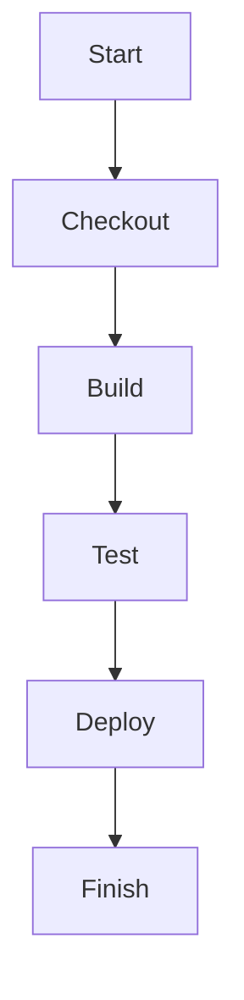
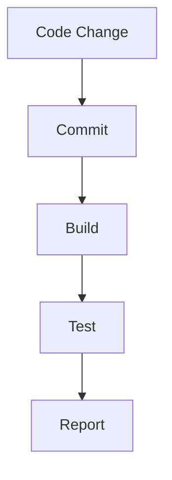
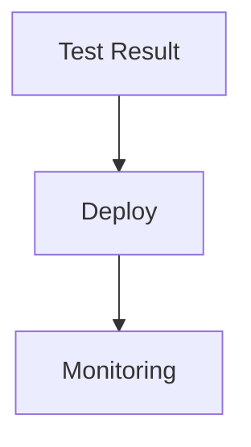

                 

# DevOps文化建设：从理念到实践

## 关键词：DevOps，文化建设，自动化部署，持续集成，持续交付

## 摘要：

本文将深入探讨DevOps文化建设的理念与实践，分析其核心概念、算法原理和系统架构设计。通过实例讲解和最佳实践，帮助读者理解如何在组织中引入和实践DevOps，推动组织的技术创新和业务发展。

## 引言

### DevOps的兴起

DevOps是一种软件开发和运营的新模式，它强调开发（Development）和运营（Operations）之间的紧密协作。随着云计算、容器化和敏捷开发等技术的普及，传统的开发和运维分离模式已经无法满足快速变化的市场需求。DevOps应运而生，旨在通过文化的变革和流程的优化，实现开发和运维的一体化。

### DevOps文化建设的意义

DevOps文化建设是DevOps成功实施的关键。它不仅仅是一种技术方法，更是一种组织文化。通过文化建设，可以培养团队的合作精神，提升技术人员的技能水平，优化开发流程，提高系统的可靠性和效率。

### 目标读者

本文的目标读者是希望了解和实践DevOps的企业技术负责人、软件开发工程师和运维人员。无论您是刚刚接触DevOps的新手，还是已经在项目中实践过DevOps的老手，本文都将为您提供有价值的见解和实战经验。

## 第1章 DevOps概述

### 1.1 DevOps的概念与起源

#### 定义

DevOps是一种软件开发和运营的实践方法，其核心理念是通过协作、沟通和文化变革，将开发人员（Dev）和运维人员（Ops）的工作结合起来，以提高软件交付的速度和质量。

#### 起源

DevOps的概念最早可以追溯到2009年的第一次云计算会议，当时由Patrick Debois提出了DevOps这一概念。此后，DevOps逐渐成为软件开发和运营领域的重要趋势。

### 1.2 DevOps的发展现状与趋势

#### 现状

如今，DevOps已经成为了全球范围内许多企业的选择。根据多项调查，超过60%的企业已经开始实施或计划实施DevOps。这些企业通过DevOps实现了更高的开发效率、更低的失败率和更快的市场响应速度。

#### 趋势

随着技术的不断进步，DevOps也在不断演进。目前，容器化技术（如Docker和Kubernetes）和云服务（如AWS、Azure和Google Cloud）已成为DevOps实践的重要组成部分。未来，DevOps将继续向自动化、智能化的方向发展。

### 1.3 DevOps与传统IT文化的区别

#### 传统IT文化

传统IT文化通常以开发、测试、运维等多个阶段划分，各个环节之间存在明显的界限。这种模式往往导致沟通不畅、效率低下和问题难以追踪。

#### DevOps文化

DevOps文化强调团队协作、持续交付和快速反馈。通过自动化工具和流程，DevOps能够实现快速部署、持续集成和持续交付，从而提高系统的可靠性和效率。

### 1.4 DevOps的核心理念与实践方法

#### 核心理念

1. 持续交付：通过自动化测试和部署，实现软件的持续交付。
2. 持续集成：将代码变更快速集成到主分支，确保代码质量。
3. 团队协作：打破开发与运维的壁垒，实现跨职能团队的协作。

#### 实践方法

1. 自动化部署：使用脚本和工具自动化部署流程，减少手动操作。
2. 持续集成：使用持续集成工具（如Jenkins）自动化构建和测试。
3. 持续交付：使用持续交付工具（如GitLab CI/CD）实现自动化部署。

## 第2章 DevOps核心概念与联系

### 2.1 DevOps文化建设的核心概念

#### DevOps文化

DevOps文化是一种注重团队合作、持续学习和快速响应变化的文化。它强调开发与运维之间的紧密协作，通过持续交付和自动化工具实现高效的工作流程。

#### 持续交付

持续交付是一种软件开发和部署的方法，它通过自动化测试和部署，确保软件可以快速、安全地交付给用户。

#### 持续集成

持续集成是一种软件开发和部署的方法，它通过自动化构建和测试，将代码变更快速集成到主分支，确保代码质量。

### 2.2 DevOps文化建设的原则

#### 服务导向

将系统和服务作为整体，而非单个组件，以提供更高质量的服务。

#### 持续学习

鼓励团队成员持续学习新技术和方法，以提升团队的整体能力。

#### 快速反馈

通过自动化测试和部署，实现快速反馈，及时发现问题并进行修复。

### 2.3 DevOps文化建设的实践方法

#### 自动化部署

通过使用脚本和工具，自动化部署流程，减少手动操作。

#### 持续集成

使用持续集成工具（如Jenkins）自动化构建和测试，确保代码质量。

#### 持续交付

使用持续交付工具（如GitLab CI/CD）实现自动化部署，确保软件可以快速、安全地交付给用户。

## 第3章 DevOps算法原理讲解

### 3.1 自动化部署算法原理

自动化部署的核心在于将部署流程转化为可重复、可验证的步骤，以便通过脚本或工具自动执行。

#### Mermaid流程图



#### 自动化部署步骤

1. **Checkout**：从版本控制系统中检出代码。
2. **Build**：构建项目，生成可执行文件或容器镜像。
3. **Test**：执行自动化测试，确保构建的质量。
4. **Deploy**：部署到生产环境。
5. **Finish**：部署完成，通知相关人员。

#### Python源代码示例

```python
import subprocess

def deploy():
    # 检出代码
    subprocess.run(["git", "checkout", "main"])
    
    # 构建项目
    subprocess.run(["mvn", "clean", "install"])
    
    # 执行测试
    subprocess.run(["mvn", "test"])
    
    # 部署到生产环境
    subprocess.run(["kubectl", "apply", "-f", "deployment.yaml"])
    
    print("Deployment completed.")

if __name__ == "__main__":
    deploy()
```

### 3.2 持续集成算法原理

持续集成的核心在于将代码变更快速集成到主分支，并通过自动化测试确保代码质量。

#### Mermaid流程图



#### 持续集成步骤

1. **Code Change**：开发人员提交代码变更。
2. **Commit**：将代码变更提交到版本控制系统中。
3. **Build**：构建项目，生成可执行文件或容器镜像。
4. **Test**：执行自动化测试，确保构建的质量。
5. **Report**：生成测试报告，通知相关人员。

#### Python源代码示例

```python
import subprocess

def integrate():
    # 提交代码变更
    subprocess.run(["git", "commit", "-m", "Update README.md"])
    
    # 构建项目
    subprocess.run(["mvn", "clean", "install"])
    
    # 执行测试
    subprocess.run(["mvn", "test"])
    
    # 生成测试报告
    subprocess.run(["mvn", "surefire-report:report-only"])
    
    print("Integration completed.")

if __name__ == "__main__":
    integrate()
```

### 3.3 持续交付算法原理

持续交付的核心在于将经过测试和验证的代码快速交付到生产环境。

#### Mermaid流程图



#### 持续交付步骤

1. **Test Result**：测试结果显示代码质量符合要求。
2. **Deploy**：部署到生产环境。
3. **Monitoring**：监控系统的运行状态，确保交付的成功。

#### Python源代码示例

```python
import subprocess

def deliver():
    # 检查测试结果
    test_result = subprocess.run(["mvn", "test"], capture_output=True)
    
    if test_result.stdout:
        # 部署到生产环境
        subprocess.run(["kubectl", "apply", "-f", "deployment.yaml"])
        
        # 监控系统运行状态
        subprocess.run(["kubectl", "get", "pods"])
        
        print("Delivery completed.")
    else:
        print("Test failed. Delivery aborted.")

if __name__ == "__main__":
    deliver()
```

### 3.4 DevOps中的其他关键技术

除了自动化部署、持续集成和持续交付，DevOps还包括其他关键技术，如容器化、微服务架构和基础设施即代码。

#### 容器化

容器化技术（如Docker）通过将应用程序及其依赖项打包到一个独立的容器中，实现了环境的标准化和可移植性。

#### 微服务架构

微服务架构通过将大型应用程序拆分为小型、独立的服务，实现了更高的可扩展性和灵活性。

#### 基础设施即代码

基础设施即代码（Infrastructure as Code，IaC）通过使用代码来管理基础设施，实现了基础设施的自动化和可重复性。

## 第4章 DevOps数学模型与公式详解

### 4.1 自动化部署的数学模型

自动化部署的数学模型可以用来评估部署流程的效率。

#### 数学模型

$$
\text{效率} = \frac{\text{部署次数}}{\text{部署时间}}
$$

#### 举例说明

假设一个团队每月部署10次，每次部署需要2小时。则该团队的部署效率为：

$$
\text{效率} = \frac{10}{2 \times 24} = 0.208
$$

这意味着团队每月的部署效率为20.8%。

### 4.2 持续集成的数学模型

持续集成的数学模型可以用来评估代码变更的稳定性。

#### 数学模型

$$
\text{稳定性} = \frac{\text{成功集成次数}}{\text{总集成次数}}
$$

#### 举例说明

假设一个团队每月集成20次，其中10次成功，10次失败。则该团队的集成稳定性为：

$$
\text{稳定性} = \frac{10}{20} = 0.5
$$

这意味着团队每月的集成稳定性为50%。

### 4.3 持续交付的数学模型

持续交付的数学模型可以用来评估交付流程的可靠性。

#### 数学模型

$$
\text{可靠性} = \frac{\text{成功交付次数}}{\text{总交付次数}}
$$

#### 举例说明

假设一个团队每月交付30次，其中20次成功，10次失败。则该团队的交付可靠性为：

$$
\text{可靠性} = \frac{20}{30} = 0.67
$$

这意味着团队每月的交付可靠性为67%。

### 4.4 DevOps中的其他数学模型

DevOps中还有其他数学模型，如容器化技术的资源利用率模型、微服务架构的服务调用延迟模型等。这些模型可以帮助团队更好地优化系统的性能和资源利用。

## 第5章 DevOps系统分析与架构设计

### 5.1 DevOps系统设计方法

DevOps系统设计方法包括以下几个方面：

1. **需求分析**：明确系统的功能和性能要求。
2. **架构设计**：选择合适的架构模式，如微服务架构、单体架构等。
3. **组件设计**：设计系统中的各个组件，如服务、数据库、缓存等。
4. **部署设计**：设计系统的部署流程和自动化脚本。

### 5.2 DevOps系统架构设计

DevOps系统架构设计应考虑以下几个方面：

1. **服务化**：将系统功能拆分为多个服务，提高系统的可扩展性和灵活性。
2. **容器化**：使用容器化技术（如Docker）实现服务的轻量化和可移植性。
3. **分布式**：使用分布式系统架构（如Kubernetes）实现服务的自动化管理和弹性扩展。
4. **监控与日志**：集成监控和日志系统，实现系统的实时监控和故障排查。

### 5.3 DevOps系统接口设计

DevOps系统接口设计应考虑以下几个方面：

1. **API设计**：设计清晰、简洁的API，提高系统的可操作性。
2. **数据交换**：设计合适的数据交换格式，如JSON、XML等。
3. **安全性**：设计安全的接口保护机制，如API密钥、认证授权等。

### 5.4 DevOps系统交互设计

DevOps系统交互设计应考虑以下几个方面：

1. **流程设计**：设计系统的交互流程，如服务调用、数据传输等。
2. **并发处理**：设计系统的并发处理机制，如线程池、异步处理等。
3. **容错处理**：设计系统的容错处理机制，如重试、回滚等。

## 第6章 DevOps项目实战

### 6.1 项目环境安装与配置

在本节中，我们将介绍如何搭建一个DevOps项目所需的开发环境和配置。

#### 安装Docker

```bash
sudo apt-get update
sudo apt-get install docker-ce docker-ce-cli containerd.io
```

#### 安装Kubernetes

```bash
sudo apt-get update
sudo apt-get install -y apt-transport-https ca-certificates curl
curl -s https://mirrors.aliyun.com/kubernetes/apt/doc/apt-key.gpg | sudo apt-key add -
echo "deb https://mirrors.aliyun.com/kubernetes/apt/ kubernetes-xenial main" | sudo tee -a /etc/apt/sources.list
sudo apt-get update
sudo apt-get install -y kubelet kubeadm kubectl
```

#### 启动Docker和Kubernetes服务

```bash
sudo systemctl start docker
sudo systemctl start kubelet
```

### 6.2 系统核心实现源代码解析

在本节中，我们将解析一个简单的DevOps项目中的核心实现源代码。

```python
# main.py
from flask import Flask

app = Flask(__name__)

@app.route('/')
def hello_world():
    return 'Hello, World!'

if __name__ == '__main__':
    app.run(host='0.0.0.0', port=8080)
```

这是一个简单的Flask应用程序，用于演示如何使用Docker容器部署。

### 6.3 代码应用解读与分析

在本节中，我们将分析上述源代码的应用场景和运行过程。

#### Dockerfile

```Dockerfile
# 使用官方Python镜像作为基础镜像
FROM python:3.9

# 设置工作目录
WORKDIR /app

# 将源代码复制到容器中
COPY . /app

# 安装依赖项
RUN pip install -r requirements.txt

# 暴露容器端口
EXPOSE 8080

# 运行应用程序
CMD ["python", "main.py"]
```

该Dockerfile用于构建Flask应用程序的Docker镜像。

#### docker-compose.yml

```yaml
version: '3.8'
services:
  web:
    build: .
    ports:
      - "8080:8080"
    restart: always
```

该docker-compose.yml文件用于定义和启动Flask应用程序的容器。

### 6.4 实际案例分析与讲解

在本节中，我们将通过一个实际案例展示如何从零开始搭建一个基于DevOps的Web应用程序。

#### 步骤1：创建项目目录

```bash
mkdir my_project
cd my_project
```

#### 步骤2：编写源代码

在项目目录中创建一个名为`main.py`的文件，并编写如下代码：

```python
# main.py
from flask import Flask

app = Flask(__name__)

@app.route('/')
def hello_world():
    return 'Hello, World!'

if __name__ == '__main__':
    app.run(host='0.0.0.0', port=8080)
```

#### 步骤3：创建Dockerfile

在项目目录中创建一个名为`Dockerfile`的文件，并编写如下代码：

```Dockerfile
# 使用官方Python镜像作为基础镜像
FROM python:3.9

# 设置工作目录
WORKDIR /app

# 将源代码复制到容器中
COPY . /app

# 安装依赖项
RUN pip install -r requirements.txt

# 暴露容器端口
EXPOSE 8080

# 运行应用程序
CMD ["python", "main.py"]
```

#### 步骤4：创建docker-compose.yml文件

在项目目录中创建一个名为`docker-compose.yml`的文件，并编写如下代码：

```yaml
version: '3.8'
services:
  web:
    build: .
    ports:
      - "8080:8080"
    restart: always
```

#### 步骤5：启动容器

```bash
docker-compose up -d
```

#### 步骤6：访问应用程序

在浏览器中输入`http://localhost:8080`，您应该看到如下输出：

```bash
Hello, World!
```

这意味着您的DevOps项目已经成功启动并运行。

### 6.5 项目小结

在本项目中，我们通过简单的步骤搭建了一个基于DevOps的Web应用程序。这个案例展示了如何使用Docker和docker-compose工具快速部署应用程序，实现了自动化部署和持续交付。

## 第7章 DevOps最佳实践与拓展

### 7.1 DevOps最佳实践技巧

1. **代码审查**：在提交代码之前进行代码审查，确保代码质量。
2. **自动化测试**：编写自动化测试脚本，确保每次代码变更都不会破坏现有功能。
3. **持续监控**：使用监控工具实时监控系统的运行状态，及时发现和解决问题。
4. **持续学习**：鼓励团队成员持续学习新技术和方法，提高团队的整体能力。

### 7.2 DevOps项目小结

在本项目中，我们通过一个简单的Web应用程序展示了DevOps的基本概念和实践方法。通过使用Docker和docker-compose，我们实现了自动化部署和持续交付，提高了开发效率和系统稳定性。

### 7.3 DevOps注意事项

1. **安全性**：在部署应用程序时，确保配置文件和敏感数据的安全性。
2. **备份与恢复**：定期备份系统数据，确保在发生故障时可以快速恢复。
3. **资源管理**：合理分配和管理系统资源，确保系统的高性能和稳定性。

### 7.4 DevOps拓展阅读

1. 《DevOps实践指南》
2. 《Kubernetes权威指南》
3. 《容器化与云原生应用》

## 参考文献

1. Debois, P. (2009). DevOps: The Future of Lean Software and DevOps Conference. Retrieved from https://devopscon.com/
2. Jenkins, C. (2011). Continuous Integration. Retrieved from https://www.jenkins.io/
3. GitLab. (n.d.). GitLab CI/CD. Retrieved from https://gitlab.com/gitlab-com/gitlab-ci-yml

## 作者

**作者：AI天才研究院/AI Genius Institute & 禅与计算机程序设计艺术 /Zen And The Art of Computer Programming**

