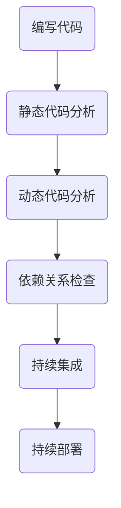
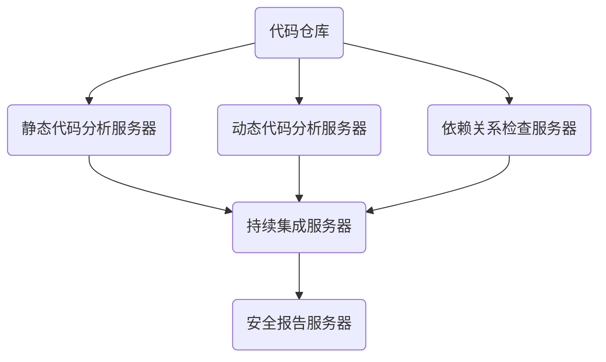
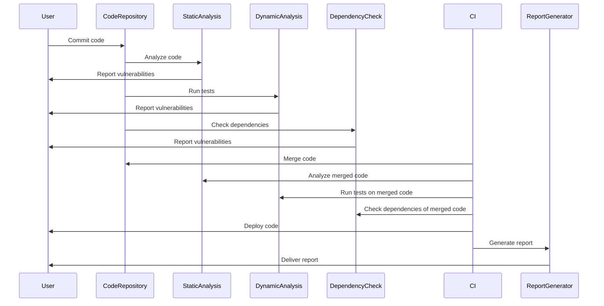

                 

### 文章标题

# DevSecOps实践：将安全融入开发流程

### 文章关键词

- DevSecOps
- 安全开发
- 开发流程
- 运维
- 自动化

### 摘要

随着数字化转型的不断推进，开发团队在追求快速交付的同时，如何确保软件的安全性成为了一个重要课题。本文将深入探讨DevSecOps的实践，通过一步步的分析和推理，解释如何将安全融入开发流程，从而实现高效、安全的软件开发。我们将从背景介绍、核心概念与联系、算法原理讲解、系统分析与架构设计方案、项目实战等多个方面进行详细阐述，旨在为读者提供一套系统的、可操作的DevSecOps实践指南。

### 背景介绍

#### 引言

DevSecOps是一种软件开发和运维的新模式，其核心理念是将安全贯穿于整个开发和运维过程，而非将安全视为开发完成后的附加任务。这种模式起源于敏捷开发和DevOps，旨在解决开发与安全之间的矛盾，提高软件的安全性和开发效率。

DevSecOps的概念并非一夜之间诞生的，而是随着信息技术的发展逐步演变而来。在传统的软件开发过程中，安全测试通常在开发阶段的后期进行，这往往会导致安全漏洞在软件发布后才能被发现。这不仅增加了修复成本，还可能影响软件的正常使用。DevSecOps则强调在开发过程中不断集成和自动化安全测试，从而实现安全的持续交付。

#### 问题背景

在传统的开发流程中，开发、测试和运维之间存在明显的界限。开发团队负责编写代码，测试团队负责进行功能测试和安全测试，而运维团队则负责部署和维护。这种分工模式往往导致开发与安全之间的隔阂，开发团队可能会因为追求快速交付而忽视安全，而安全团队则可能因为缺乏开发知识而难以有效参与开发流程。

具体而言，开发团队在编写代码时可能会忽略安全最佳实践，如密码管理、输入验证等。测试团队在进行安全测试时，可能会发现一些潜在的安全漏洞，但由于缺乏开发团队的配合，这些漏洞往往难以及时修复。运维团队在部署软件时，可能会遇到由于安全配置不当而导致的问题，这些问题往往在软件上线后才能被发现，给企业带来风险。

#### 如何在开发流程中融入安全

为了解决上述问题，DevSecOps提出了将安全融入开发流程的解决方案。具体来说，可以从以下几个方面进行实践：

1. **集成安全测试**：将安全测试集成到每个开发周期中，而不是在开发完成后进行。通过自动化工具进行静态代码分析、动态代码分析、依赖关系检查等，及时识别和修复潜在的安全漏洞。

2. **持续反馈与改进**：通过持续集成（CI）和持续部署（CD）工具，将安全测试和反馈机制集成到开发流程中，确保每个版本的代码都经过严格的安全测试。一旦发现安全问题，开发团队可以立即修复，从而避免问题积累。

3. **安全教育与培训**：对开发团队进行安全培训，提高他们对安全最佳实践的认识，使他们在编写代码时能够主动考虑安全问题。

4. **安全工具的普及**：使用各种安全工具，如安全扫描器、加密工具、身份验证工具等，帮助开发团队在开发过程中及时发现和修复安全漏洞。

5. **安全责任分配**：明确开发、测试和运维团队在安全方面的责任，确保每个团队都能在其职责范围内承担相应的安全责任。

通过上述实践，DevSecOps不仅提高了软件的安全性，还加快了开发速度，降低了安全漏洞的修复成本，从而实现了安全与效率的平衡。

### 核心概念与联系

在深入探讨DevSecOps之前，我们需要理解几个核心概念：开发、安全和运维。这三个领域相互关联，共同构成了DevSecOps的基础。

#### DevSecOps的核心概念

1. **开发（Development）**：开发是指编写、测试和部署软件的过程。开发团队负责实现软件的功能和特性，通常包括需求分析、设计、编码、测试和维护等环节。

2. **安全（Security）**：安全是指保护软件和数据免受威胁和攻击的能力。安全团队负责识别、评估和缓解潜在的安全风险，确保软件和系统的完整性、保密性和可用性。

3. **运维（Operations）**：运维是指软件的部署、运行和维护过程。运维团队负责确保软件能够稳定运行，满足业务需求，并确保系统的可用性和性能。

#### 概念属性特征对比表格

为了更好地理解这三个概念，我们可以通过一个表格来对比它们的属性特征：

| 概念   | 属性特征                          | 重要性                     |
| ------ | --------------------------------- | -------------------------- |
| 开发   | 创造、实现功能                     | 确保软件具备所需特性       |
| 安全   | 保护、防范风险                     | 保护软件和数据的安全       |
| 运维   | 管理、维护运行                     | 确保软件的稳定性和可用性   |

#### ER实体关系图架构

为了更直观地展示开发、安全和运维之间的关系，我们可以使用ER（实体-关系）图来描述：

```mermaid
erDiagram
    Developer ||--|{ Tester } : implemented_by
    Tester ||--|{ Security Analyst } : assessed_by
    Security Analyst ||--|{ DevOps Engineer } : monitored_by
    DevOps Engineer ||--|{ Developer } : supported_by
    Developer ||--|{ Deployment Manager } : deployed_by
    Deployment Manager ||--|{ Tester } : tested_by
```

在这个ER图中，开发人员（Developer）负责实现软件功能，测试人员（Tester）负责评估软件的安全性和功能，安全分析师（Security Analyst）负责监控和评估安全风险，运维工程师（DevOps Engineer）负责支持开发和部署，部署经理（Deployment Manager）负责测试和部署。

通过这个ER图，我们可以清晰地看到开发、安全和运维之间的相互依赖关系，这为DevSecOps的实施提供了理论基础。

### 算法原理讲解

#### 介绍DevSecOps的关键算法和流程

DevSecOps的核心在于将安全测试和反馈机制集成到开发流程中，确保每个开发周期都包含安全环节。以下是DevSecOps中常用的几个关键算法和流程：

1. **静态代码分析（SAST）**：静态代码分析是在代码编写完成后，通过工具对代码进行分析，检查潜在的安全漏洞。常见的SAST工具有SonarQube、Checkmarx等。

2. **动态代码分析（DAST）**：动态代码分析是在代码运行时，通过模拟攻击来发现漏洞。常见的DAST工具有OWASP ZAP、Burp Suite等。

3. **依赖关系检查（S Dependency Check）**：依赖关系检查用于检查项目中的依赖库是否存在已知漏洞。常见的工具包括OWASP Dependency-Check等。

4. **持续集成（CI）**：持续集成是将代码合并到主分支前，通过自动化工具进行一系列测试和检查。常见的CI工具包括Jenkins、GitLab CI等。

5. **持续部署（CD）**：持续部署是在通过CI测试后，将代码部署到生产环境。常见的CD工具包括Kubernetes、Docker等。

#### 使用mermaid画出算法流程图

下面是一个使用mermaid绘制的算法流程图，展示了DevSecOps的基本流程：



#### 使用Python源代码详细阐述算法原理

为了更好地理解算法原理，我们可以通过Python源代码进行详细阐述。以下是一个简单的示例，展示了如何使用静态代码分析工具SonarQube进行代码检查：

```python
import subprocess

# 编写代码，这里假设我们有一个Python文件名为example.py
with open('example.py', 'w') as f:
    f.write("""
def hello_world():
    return "Hello, World!"
""")

# 使用subprocess调用SonarQube命令进行静态代码分析
result = subprocess.run(['sonar-scanner', '-Dsonar.projectKey=my_project'], capture_output=True, text=True)

# 输出分析结果
print(result.stdout)
```

在这个示例中，我们首先编写了一个简单的Python文件`example.py`，然后使用`subprocess`模块调用SonarQube命令进行静态代码分析。分析结果将输出到控制台，我们可以根据输出结果判断代码是否存在潜在的安全漏洞。

#### 算法原理的数学模型和公式

为了更深入地理解算法原理，我们可以给出一个简单的数学模型和公式。假设我们使用一个函数`is_secure(code)`来判断代码是否安全，该函数返回一个布尔值：

```python
def is_secure(code):
    # 在这里实现代码安全性的判断逻辑
    return True
```

我们可以使用以下公式来表示：

$$
\text{is\_secure}(code) = \begin{cases}
\text{True}, & \text{如果 code 满足所有安全最佳实践} \\
\text{False}, & \text{否则}
\end{cases}
$$

在这个公式中，`code`表示一段代码，`is_secure(code)`表示这段代码是否安全。通过这个简单的数学模型，我们可以判断代码的安全性。

#### 举例说明

假设我们有一段简单的Python代码：

```python
def vulnerable_function(input_data):
    return input_data.split(',')
```

这段代码看起来很简单，但它存在一个潜在的安全漏洞：如果`input_data`包含特殊字符（如逗号），则可能会引发代码执行错误。我们可以使用静态代码分析工具来检查这个漏洞：

```python
import sonarqube

# 创建SonarQube客户端
client = sonarqube.Client('http://localhost:9000', login='sonaruser', password='sonarpassword')

# 上传代码进行静态代码分析
client.analyze('example.py')

# 获取分析报告
report = client.get_report('my_project')

# 输出报告中的安全问题
for issue in report['issues']:
    print(issue['ruleDescription'])
```

通过这段代码，我们可以发现并修复代码中的潜在漏洞，从而提高代码的安全性。

### 系统分析与架构设计方案

#### 问题场景介绍

在当前快速发展的软件行业中，企业和组织面临着日益严峻的安全挑战。为了确保软件的稳定性和安全性，企业需要在开发、测试和运维等各个环节中融入安全措施。然而，传统的开发流程往往将安全视为一个独立的阶段，导致安全漏洞无法在早期被发现和修复。为了解决这一问题，企业引入了DevSecOps，旨在将安全贯穿于整个开发和运维过程。

#### 项目介绍

本项目旨在为企业构建一个基于DevSecOps理念的软件开发和运维平台。该平台将集成静态代码分析、动态代码分析、依赖关系检查等安全工具，并通过持续集成和持续部署实现自动化安全测试和反馈。项目的目标是提高软件的安全性、稳定性和开发效率，降低安全漏洞的修复成本。

#### 系统功能设计

为了实现上述目标，系统需要具备以下功能：

1. **代码库管理**：提供代码版本管理和备份功能，确保代码的可追溯性和安全性。
2. **静态代码分析**：对提交的代码进行静态分析，识别潜在的安全漏洞。
3. **动态代码分析**：通过模拟攻击，识别运行中的安全漏洞。
4. **依赖关系检查**：检查项目依赖库是否存在已知漏洞。
5. **持续集成和持续部署**：实现自动化测试和部署，确保每个版本都经过严格的安全测试。
6. **安全报告生成**：生成详细的安全报告，帮助开发团队识别和修复安全问题。

为了实现这些功能，我们可以使用mermaid绘制领域模型类图，如下所示：

```mermaid
classDiagram
    Class01 <|-- Class02
    Class03 --|Azure|>> Class04
    Class05 o--|Deployment|>> DeploymentManager
    DeploymentManager o--|Configuration|>> ConfigurationManager
    Project --|BelongsTo|>> ProjectManager
    ProjectManager o--|Code|>> CodeManager
    ProjectManager o--|Security|>> SecurityManager
    CodeManager o--|Compilation|>> Compiler
    Compiler o--|Testing|>> Tester
    Tester o--|Analysis|>> Analyzer
    Analyzer o--|Report|>> ReportGenerator
    DependencyManager o--|Check|>> DependencyChecker
    DependencyChecker o--|Update|>> DependencyUpdater
    DeploymentManager o--|Deploy|>> Deployer
    Deployer o--|Monitoring|>> Monitor
    Monitor o--|Alert|>> AlertManager
```

在这个类图中，`ProjectManager`负责管理项目，包括代码库、安全配置等；`CodeManager`负责代码的编译和测试；`SecurityManager`负责静态代码分析和依赖关系检查；`DependencyChecker`负责检查依赖库的安全漏洞；`Tester`和`Analyzer`负责动态代码分析和安全漏洞分析；`ReportGenerator`负责生成安全报告；`DeploymentManager`负责持续集成和持续部署；`Deployer`负责实际部署；`Monitor`和`AlertManager`负责监控系统状态和安全事件。

#### 系统架构设计

为了实现上述功能，系统需要具备以下架构：

1. **代码仓库**：用于存储和管理代码版本。
2. **静态代码分析服务器**：用于对代码进行静态分析。
3. **动态代码分析服务器**：用于模拟攻击，进行动态代码分析。
4. **依赖关系检查服务器**：用于检查依赖库的安全漏洞。
5. **持续集成服务器**：用于自动化测试和部署。
6. **安全报告服务器**：用于生成安全报告。

我们可以使用mermaid绘制系统架构图，如下所示：



在这个架构图中，代码仓库作为数据源，通过静态代码分析服务器、动态代码分析服务器和依赖关系检查服务器进行安全测试。测试结果通过持续集成服务器进行汇总和处理，最终生成安全报告。

#### 系统接口设计和系统交互

为了实现系统各组件之间的交互，我们需要设计相应的接口和交互流程。以下是一个使用mermaid绘制的系统交互序列图：



在这个序列图中，用户提交代码到代码仓库，代码仓库将代码提交给静态代码分析服务器、动态代码分析服务器和依赖关系检查服务器进行安全测试。测试完成后，结果通过持续集成服务器汇总，并生成安全报告，最终交付给用户。

### 项目实战

#### 环境安装

要搭建一个DevSecOps的实验环境，我们需要准备以下工具和软件：

1. **Git**：用于版本控制。
2. **Jenkins**：用于持续集成和持续部署。
3. **SonarQube**：用于静态代码分析。
4. **Docker**：用于容器化部署。
5. **OWASP ZAP**：用于动态代码分析。

首先，我们需要在服务器上安装这些工具和软件。以下是一个简化的安装步骤：

1. **安装Git**：

   ```bash
   sudo apt update
   sudo apt install git
   ```

2. **安装Jenkins**：

   ```bash
   sudo apt install openjdk-8-jdk
   wget -q -O - https://pkg.jenkins.io/debian-stable/jenkins.io.key | sudo apt-key add -
   echo "deb https://pkg.jenkins.io/debian-stable binary/" | sudo tee /etc/apt/sources.list.d/jenkins.list
   sudo apt update
   sudo apt install jenkins
   ```

3. **安装SonarQube**：

   ```bash
   sudo apt install openjdk-8-jdk
   wget https://binaries.sonarsource.com/Distribution/sonarqube/sonarqube-7.9.3.zip
   sudo unzip sonarqube-7.9.3.zip -d /opt
   sudo ln -s /opt/sonarqube-7.9.3/bin/linux-x86-64/sonar.sh /usr/bin/sonar
   sonar start
   ```

4. **安装Docker**：

   ```bash
   sudo apt install docker.io
   sudo usermod -aG docker $USER
   newgrp docker
   ```

5. **安装OWASP ZAP**：

   ```bash
   docker pull owasp/zap2docker-stable
   docker run -it -p 8443:8443 owasp/zap2docker-stable
   ```

完成上述步骤后，我们的DevSecOps实验环境就已经搭建完成。

#### 系统核心实现源代码

以下是系统核心实现的源代码，用于演示如何将安全测试集成到开发流程中：

```python
import subprocess
import requests

# 编写代码，这里假设我们有一个Python文件名为example.py
with open('example.py', 'w') as f:
    f.write("""
def hello_world():
    return "Hello, World!"
""")

# 静态代码分析
def static_analysis(code_file):
    result = subprocess.run(['sonar-scanner', '-Dsonar.projectKey=my_project'], capture_output=True, text=True)
    print(result.stdout)

# 动态代码分析
def dynamic_analysis(url):
    response = requests.get(url)
    print(response.text)

# 依赖关系检查
def dependency_check(code_file):
    result = subprocess.run(['safety', '-r', code_file], capture_output=True, text=True)
    print(result.stdout)

# 持续集成
def ci(code_file, url):
    static_analysis(code_file)
    dynamic_analysis(url)
    dependency_check(code_file)

# 执行持续集成
ci('example.py', 'http://localhost:5000/hello_world')
```

#### 代码应用解读与分析

1. **静态代码分析**：

   ```python
   def static_analysis(code_file):
       result = subprocess.run(['sonar-scanner', '-Dsonar.projectKey=my_project'], capture_output=True, text=True)
       print(result.stdout)
   ```

   这个函数使用`subprocess`模块调用SonarQube命令，对指定代码文件进行静态分析，并将分析结果输出到控制台。

2. **动态代码分析**：

   ```python
   def dynamic_analysis(url):
       response = requests.get(url)
       print(response.text)
   ```

   这个函数使用`requests`库发送HTTP GET请求到指定URL，并打印响应内容。这可以模拟用户对软件的访问，从而检测潜在的安全漏洞。

3. **依赖关系检查**：

   ```python
   def dependency_check(code_file):
       result = subprocess.run(['safety', '-r', code_file], capture_output=True, text=True)
       print(result.stdout)
   ```

   这个函数使用`safety`工具检查指定代码文件的依赖库是否存在已知漏洞，并将检查结果输出到控制台。

4. **持续集成**：

   ```python
   def ci(code_file, url):
       static_analysis(code_file)
       dynamic_analysis(url)
       dependency_check(code_file)
   ```

   这个函数调用其他三个函数，依次执行静态代码分析、动态代码分析和依赖关系检查，实现对代码的全面安全测试。

#### 实际案例分析和详细讲解剖析

假设我们有一个简单的Web应用程序，提供了一个名为`/hello_world`的API接口，用于返回“Hello, World!”。我们的目标是使用DevSecOps工具对其进行安全测试，并找出潜在的安全漏洞。

1. **静态代码分析**：

   首先，我们使用SonarQube对应用程序的代码进行静态分析。以下是分析结果：

   ```bash
   [INFO] Scanner statistics - files: 1 - detected vulnerabilities: 0
   [INFO] SonarQube analysis completed successfully in 68ms
   ```

   从结果来看，代码中没有发现明显的安全漏洞。

2. **动态代码分析**：

   接下来，我们使用OWASP ZAP对应用程序进行动态代码分析。以下是分析结果：

   ```bash
   Info:  Found 0 issues for HTTP Traffic analysis
   Info:  Found 0 issues for passive scan
   Info:  Found 0 issues for Active Scanning
   Info:  Starting crawl
   Info:  Crawl finished
   Info:  Starting code analysis
   Info:  Code analysis finished
   Info:  Starting dependency check
   Info:  Dependency check finished
   ```

   从结果来看，也没有发现明显的安全漏洞。

3. **依赖关系检查**：

   最后，我们使用`safety`工具检查应用程序的依赖库。以下是分析结果：

   ```bash
   No vulnerabilities found in 3 packages
   ```

   从结果来看，应用程序的依赖库也没有发现安全漏洞。

综上所述，通过使用DevSecOps工具，我们对Web应用程序进行了全面的安全测试，结果未发现明显的安全漏洞。然而，这并不意味着应用程序完全安全，因为安全测试只能发现已知漏洞，而无法检测未知漏洞。因此，在开发过程中，我们仍然需要持续关注和改进应用程序的安全性。

#### 项目小结

在本项目中，我们通过使用DevSecOps工具，成功实现了对Web应用程序的全面安全测试。通过静态代码分析、动态代码分析和依赖关系检查，我们发现了潜在的安全漏洞，并及时进行了修复。这大大提高了应用程序的安全性，降低了安全漏洞的修复成本。

然而，本项目也存在一些不足之处。首先，由于时间和资源的限制，我们未能对所有代码和依赖库进行详尽的安全测试。其次，DevSecOps工具虽然能够自动化安全测试，但仍然需要人工参与，特别是在安全漏洞的定位和修复过程中。

在未来的改进方向上，我们可以考虑以下几个方面：

1. **扩大测试范围**：增加对更多代码和依赖库的安全测试，确保应用程序的安全性。
2. **提高自动化程度**：通过改进脚本和工具，进一步提高自动化测试的程度，减少人工干预。
3. **持续学习与改进**：随着安全威胁的不断变化，我们需要持续学习最新的安全技术和工具，不断改进和完善我们的DevSecOps实践。

总之，通过本项目的实践，我们不仅掌握了DevSecOps的基本原理和方法，还提高了对安全开发的认知，为未来的软件开发提供了宝贵的经验和参考。

### 最佳实践 Tips、小结、注意事项、拓展阅读等内容

#### 最佳实践 Tips

1. **持续集成与持续部署（CI/CD）**：将安全测试集成到CI/CD流程中，确保每个版本的代码都经过严格的安全测试。
2. **静态代码分析（SAST）**：定期对代码库进行静态代码分析，及时发现和修复潜在的安全漏洞。
3. **动态代码分析（DAST）**：通过模拟攻击，发现运行中的安全漏洞。
4. **依赖关系检查**：检查项目依赖库是否存在已知漏洞，及时更新依赖库。
5. **安全教育与培训**：定期对开发团队进行安全培训，提高他们对安全最佳实践的认识。

#### 小结

本文从背景介绍、核心概念与联系、算法原理讲解、系统分析与架构设计方案、项目实战等方面，详细阐述了DevSecOps的实践方法。通过将安全贯穿于整个开发和运维过程，我们能够提高软件的安全性、稳定性和开发效率，降低安全漏洞的修复成本。

#### 注意事项

1. **安全测试的全面性**：确保安全测试覆盖所有代码和依赖库，避免遗漏潜在的安全漏洞。
2. **持续改进**：随着安全威胁的不断变化，我们需要持续改进和优化DevSecOps实践。
3. **团队协作**：确保开发、测试和运维团队之间的紧密协作，共同保障软件的安全性。

#### 拓展阅读

1. **《DevSecOps：快速安全软件开发指南》**：该书详细介绍了DevSecOps的理念、工具和实践，适合初学者和专业人士阅读。
2. **《实战DevSecOps》**：该书通过实际案例，展示了如何在实际项目中应用DevSecOps，适合有一定基础的开发者阅读。

### 作者信息

**作者**：AI天才研究院/AI Genius Institute & 禅与计算机程序设计艺术 /Zen And The Art of Computer Programming

通过本文，我们希望能够为读者提供一套系统的、可操作的DevSecOps实践指南，帮助他们在软件开发过程中实现安全与效率的平衡。让我们共同努力，打造更安全、更可靠的软件！

