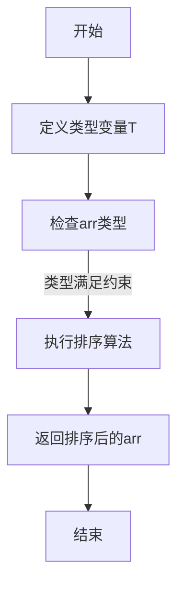

                 

### F-bounded多态：增强OOP表达能力的泛型技术

**关键词：** F-bounded多态，泛型技术，面向对象编程，类型安全，编程技巧

**摘要：** 本文将深入探讨F-bounded多态这一泛型技术，分析其在增强面向对象编程（OOP）表达能力方面的作用。通过详细的理论讲解和实际案例分析，读者将全面理解F-bounded多态的概念、应用场景以及其在不同编程语言中的实现，从而掌握这一重要的编程技术。

---

### 目录大纲

1. **F-bounded多态：增强OOP表达能力的泛型技术**
2. **第一部分：F-bounded多态基础**
   1. **第1章：背景介绍与核心概念**
   2. **第2章：F-bounded多态的应用场景**
   3. **第3章：F-bounded多态的数学模型与算法原理**
3. **第二部分：F-bounded多态的深入应用**
   1. **第4章：F-bounded多态与模板编程**
   2. **第5章：F-bounded多态在Java中的应用**
   3. **第6章：F-bounded多态与类型安全**
   4. **第7章：F-bounded多态的最佳实践与总结**

---

### 第一部分：F-bounded多态基础

#### 第1章：背景介绍与核心概念

**1.1 问题的背景**

面向对象编程（OOP）因其模块化、可复用性和易于维护的特点，在软件工程中得到了广泛应用。然而，传统的OOP方法在处理某些复杂类型关系时存在局限性，例如，当需要定义一个可以处理多个类型参数的通用方法时。

**1.2 F-bounded多态的概念**

F-bounded多态是一种在面向对象编程中引入的泛型技术，它允许类型参数在类型边界内进行约束，从而实现对多个类型的泛化处理。F-bounded多态的定义基于一个F类，该类定义了类型参数的上界和下界。

**1.3 F-bounded多态的边界与外延**

F-bounded多态的边界条件指的是类型参数必须满足上界和下界的约束，这种约束保证了类型之间的兼容性。F-bounded多态的应用范围包括通用方法、通用接口和类型参数化集合等。

**1.4 F-bounded多态的概念结构与核心要素**

F-bounded多态的核心要素包括类型参数的约束、泛型方法的定义以及子类型关系与类型兼容性。这些要素共同构成了F-bounded多态的强大表达能力。

---

### 第2章：F-bounded多态的应用场景

**2.1 面向对象编程中的泛型**

泛型编程在OOP中扮演着重要角色，它通过类型参数的泛化，使得代码更加通用和灵活。F-bounded多态作为泛型技术的一种，能够有效地解决面向对象编程中的类型约束问题。

**2.2 F-bounded多态的优势**

F-bounded多态的优势主要体现在增强代码复用性和提高程序的可读性方面。通过类型边界约束，程序员可以编写更加简洁、可重用的代码，同时降低类型错误的风险。

**2.3 F-bounded多态的实际案例**

在本章中，我们将通过具体的代码示例，展示F-bounded多态在不同领域的应用。这些案例将帮助读者更好地理解F-bounded多态的实际作用。

---

### 第3章：F-bounded多态的数学模型与算法原理

**3.1 F-bounded多态的数学模型**

F-bounded多态的数学模型涉及到子类型关系的表示和泛型方法的实现原理。通过子类型关系的定义，我们可以精确地描述类型之间的兼容性。

**3.2 F-bounded多态算法原理**

F-bounded多态的算法原理主要包括子类与父类的关系以及泛型类型检查算法。这些算法确保了类型参数在类型边界内的正确性和一致性。

**3.3 算法讲解与举例说明**

在本章的结尾，我们将通过一个简单的Python示例，详细讲解F-bounded多态算法的原理，并给出通俗易懂的算法示例分析。

---

### 第二部分：F-bounded多态的深入应用

#### 第4章：F-bounded多态与模板编程

**4.1 C++模板编程简介**

C++模板编程是一种强大的泛型编程技术，它允许程序员编写与类型无关的代码。在本章中，我们将简要介绍C++模板编程的基本概念和应用场景。

**4.2 F-bounded多态与C++模板的结合**

F-bounded多态与C++模板的结合，可以极大地提高C++程序的泛化能力和可维护性。在本章中，我们将探讨F-bounded多态在C++模板编程中的应用，以及这种结合所带来的优势。

**4.3 F-bounded多态与C++模板的案例分析**

通过具体的C++代码示例，我们将展示F-bounded多态与C++模板结合的实际应用，并分析这种结合带来的编程效率提升和代码质量改善。

---

#### 第5章：F-bounded多态在Java中的应用

**5.1 Java泛型编程基础**

Java泛型编程是一种在Java语言中引入的泛型类型系统，它通过类型参数的泛化，提高了程序的灵活性和安全性。在本章中，我们将介绍Java泛型编程的基本概念和原理。

**5.2 F-bounded多态在Java中的实现**

F-bounded多态在Java中的实现依赖于类型边界约束。在本章中，我们将详细讨论Java中的类型边界约束机制，并展示如何实现F-bounded多态。

**5.3 Java中的F-bounded多态案例分析**

在本章中，我们将通过Java代码示例，展示F-bounded多态在Java编程中的实际应用。这些案例将帮助读者更好地理解F-bounded多态在Java中的具体实现和应用。

---

#### 第6章：F-bounded多态与类型安全

**6.1 类型安全的概念**

类型安全是指在程序运行过程中，类型系统能够保证数据类型的一致性和正确性。在本章中，我们将探讨类型安全的概念和重要性。

**6.2 F-bounded多态与类型安全的关系**

F-bounded多态与类型安全密切相关。通过类型边界约束，F-bounded多态能够有效地保证类型安全，从而提高程序的可维护性和可靠性。

**6.3 F-bounded多态的类型安全案例分析**

在本章中，我们将通过具体的代码示例，分析F-bounded多态在类型安全方面的实际应用。这些案例将帮助读者更好地理解如何在实际编程中确保类型安全。

---

#### 第7章：F-bounded多态的最佳实践与总结

**7.1 F-bounded多态的最佳实践**

在本章中，我们将总结F-bounded多态的最佳实践，包括设计原则、编程技巧等方面。这些最佳实践将帮助程序员更有效地使用F-bounded多态，提高代码质量。

**7.2 F-bounded多态的总结**

通过对F-bounded多态的深入探讨，我们可以看到这一技术在增强OOP表达能力方面的巨大潜力。在本章中，我们将对F-bounded多态进行总结，并探讨其在未来的发展趋势。

**7.3 注意事项与拓展阅读**

在本章的最后，我们将讨论F-bounded多态的常见问题，并提供一些拓展阅读建议，以帮助读者进一步了解这一重要技术。

---

## F-bounded多态：增强OOP表达能力的泛型技术

### 第一部分：F-bounded多态基础

#### 第1章：背景介绍与核心概念

在软件工程领域，面向对象编程（OOP）因其模块化、可复用性和易于维护的特点，已经成为主流的编程范式。OOP的核心概念包括封装、继承和多态。然而，传统的OOP方法在处理某些复杂类型关系时存在局限性。例如，当我们需要定义一个可以处理多个类型参数的通用方法时，传统的OOP方法很难满足这一需求。

为了解决这一问题，泛型编程技术应运而生。泛型编程通过引入类型参数，使得代码更加通用和灵活。在面向对象编程中，泛型编程能够有效地解决类型约束问题，提高代码的可重用性。F-bounded多态是一种在面向对象编程中引入的泛型技术，它允许类型参数在类型边界内进行约束，从而实现对多个类型的泛化处理。

**1.1 问题的背景**

传统的OOP方法在处理类型关系时存在以下问题：

1. **类型约束过于严格**：传统的OOP方法通常通过继承关系来处理类型关系，但这种方法对类型约束要求非常严格。当需要处理多个类型参数时，这种约束可能会变得难以管理和维护。

2. **代码复用性低**：传统的OOP方法难以实现代码的复用性。当一个方法需要处理多种类型时，往往需要为每种类型编写单独的方法，这不仅增加了代码的复杂度，也降低了代码的可维护性。

3. **可读性差**：当类型关系复杂时，传统的OOP方法可能会导致代码的可读性降低。类型约束和继承关系的混杂使得代码难以理解，增加了开发难度。

**1.2 泛型编程的引入**

为了解决上述问题，泛型编程技术被引入到面向对象编程中。泛型编程通过引入类型参数，使得代码能够处理多种类型，从而提高了代码的通用性和可复用性。泛型编程的核心思想是“代码一次，类型多种”。通过类型参数，程序员可以编写与具体类型无关的通用代码，然后通过类型参数的实例化来处理具体的类型。

泛型编程的优点包括：

1. **提高代码复用性**：泛型编程允许程序员编写一次代码，然后通过类型参数的实例化来处理多种类型。这种方法大大提高了代码的可重用性，减少了代码的冗余。

2. **提高程序的可读性**：泛型编程通过类型参数的泛化，使得代码更加简洁和清晰。类型参数的引入使得代码的结构更加一致，提高了代码的可读性。

3. **提高程序的类型安全**：泛型编程通过类型检查机制，确保在编译时就能发现类型错误，从而提高了程序的类型安全。

**1.3 F-bounded多态的概念**

F-bounded多态是一种在面向对象编程中引入的泛型技术，它允许类型参数在类型边界内进行约束，从而实现对多个类型的泛化处理。F-bounded多态的定义基于一个F类，该类定义了类型参数的上界和下界。

F-bounded多态的定义可以分为以下几个部分：

1. **类型参数的约束**：F-bounded多态要求类型参数必须满足一定的约束条件。这些约束条件定义了类型参数的上界和下界。

2. **泛型方法的定义**：F-bounded多态允许定义泛型方法，这些方法可以处理满足类型约束的多种类型。

3. **子类型关系与类型兼容性**：F-bounded多态要求类型参数之间的子类型关系必须满足类型兼容性。这意味着，一个类型参数必须是另一个类型参数的子类型，才能在泛型方法中使用。

F-bounded多态的定义可以形式化为以下规则：

- **类型参数约束**：对于任何类型参数T，存在一个类型边界B，使得T必须是B的子类型。
- **泛型方法定义**：泛型方法M可以定义为一个类型参数为T的方法，其中T满足类型边界B。
- **子类型关系与类型兼容性**：如果类型参数T1是T2的子类型，则T1在泛型方法M中可以替换T2。

**1.4 F-bounded多态与传统多态的区别**

F-bounded多态与传统多态之间存在一些区别：

1. **类型约束**：传统多态通常通过继承关系来实现，而F-bounded多态通过类型边界来实现。传统多态对类型约束要求较为严格，而F-bounded多态通过类型边界提供了更加灵活的约束条件。

2. **泛化能力**：传统多态通常只能处理单一类型，而F-bounded多态可以处理多种类型。F-bounded多态通过类型参数的约束，实现了对多种类型的泛化处理。

3. **类型安全**：F-bounded多态通过类型边界约束，提高了程序的类型安全。传统多态在运行时无法确保类型安全，而F-bounded多态在编译时通过类型检查机制确保类型安全。

**1.5 F-bounded多态的边界与外延**

F-bounded多态的边界条件指的是类型参数必须满足的上界和下界约束。这些约束条件定义了类型参数的有效范围，从而保证了类型之间的兼容性。

1. **上界约束**：上界约束定义了类型参数的上界，即类型参数必须是上界类型的子类型。上界约束通常用于限制泛型方法的适用范围。

2. **下界约束**：下界约束定义了类型参数的下界，即类型参数必须是下界类型的子类型。下界约束通常用于确保泛型方法能够处理特定类型的子类型。

F-bounded多态的外延指的是类型参数的实际取值范围。外延通常由类型边界约束定义，从而确定了类型参数的有效范围。

**1.6 F-bounded多态的概念结构与核心要素**

F-bounded多态的核心要素包括类型参数的约束、泛型方法的定义以及子类型关系与类型兼容性。

1. **类型参数的约束**：类型参数的约束是F-bounded多态的核心概念。通过类型边界约束，类型参数可以限制为特定类型的子类型，从而确保泛型方法的正确性和类型兼容性。

2. **泛型方法的定义**：泛型方法是一种可以在多个类型之间复用的方法。通过类型参数的泛化，泛型方法可以处理满足类型约束的多种类型。

3. **子类型关系与类型兼容性**：子类型关系是面向对象编程中的一个核心概念，它定义了类型之间的继承关系。在F-bounded多态中，子类型关系与类型兼容性是确保泛型方法正确性的关键。类型参数之间的子类型关系必须满足类型兼容性，以确保泛型方法能够在不同的类型之间正确地执行。

### 第2章：F-bounded多态的应用场景

F-bounded多态作为一种泛型技术，在面向对象编程中具有广泛的应用场景。通过类型参数的约束和泛化处理，F-bounded多态能够有效地解决传统OOP方法在处理复杂类型关系时的局限性。在本章中，我们将探讨F-bounded多态在面向对象编程中的主要应用场景，并分析其在这些场景中的优势。

#### 2.1 面向对象编程中的泛型

泛型编程在面向对象编程中扮演着重要角色。通过引入类型参数，泛型编程使得代码能够处理多种类型，从而提高了代码的复用性和可维护性。F-bounded多态作为一种泛型技术，在面向对象编程中具有广泛的应用场景。

1. **通用方法的实现**：在面向对象编程中，通用方法是一种可以在多个类型之间复用的方法。通过F-bounded多态，程序员可以定义一个泛型方法，该方法可以处理满足类型约束的多种类型。这种泛化处理不仅提高了代码的复用性，还减少了冗余代码，提高了程序的可读性。

   例如，在Java中，可以使用F-bounded多态定义一个泛型排序方法，该方法可以处理不同类型的数组，例如整数数组、字符串数组和自定义对象数组。通过类型参数的约束，可以确保泛型方法能够正确地对不同类型的数组进行排序。

2. **泛型集合的实现**：泛型集合是一种能够存储多种类型元素的集合。通过F-bounded多态，可以定义泛型集合类，这些集合类可以处理满足类型约束的多种类型。泛型集合类具有类型安全的特点，避免了类型错误的发生。

   例如，在Java中，可以使用F-bounded多态定义一个泛型列表类，该类可以存储不同类型的元素，例如整数、字符串和自定义对象。通过类型参数的约束，可以确保泛型列表类能够正确地存储和操作不同类型的元素。

3. **泛型接口的实现**：泛型接口是一种可以在多个类型之间复用的接口。通过F-bounded多态，可以定义泛型接口，这些接口可以处理满足类型约束的多种类型。泛型接口提供了更加灵活和通用的接口定义方式，使得程序更加可扩展。

   例如，在Java中，可以使用F-bounded多态定义一个泛型接口，该接口可以处理不同类型的对象。通过类型参数的约束，可以确保泛型接口能够正确地处理不同类型的对象。

#### 2.2 F-bounded多态的优势

F-bounded多态在面向对象编程中具有以下优势：

1. **增强代码复用性**：通过类型参数的泛化处理，F-bounded多态使得代码能够处理多种类型，从而提高了代码的复用性。程序员可以编写一次通用方法或泛型集合类，然后通过类型参数的实例化来处理不同的类型，避免了重复编写冗余代码。

   例如，在Java中，可以使用F-bounded多态定义一个泛型排序方法，该方法可以处理不同类型的数组。通过类型参数的约束，可以确保泛型排序方法能够正确地对不同类型的数组进行排序，从而提高了代码的复用性。

2. **提高程序的可读性**：通过类型参数的泛化处理，F-bounded多态使得代码更加简洁和清晰。类型参数的引入使得代码的结构更加一致，提高了代码的可读性。

   例如，在Java中，可以使用F-bounded多态定义一个泛型列表类，该类可以存储不同类型的元素。通过类型参数的约束，可以确保泛型列表类能够正确地存储和操作不同类型的元素，从而提高了代码的可读性。

3. **提高程序的类型安全**：F-bounded多态通过类型边界约束，提高了程序的类型安全。在编译时，类型检查机制可以确保类型参数之间的子类型关系满足类型兼容性，从而避免了类型错误的发生。

   例如，在Java中，可以使用F-bounded多态定义一个泛型接口，该接口可以处理不同类型的对象。通过类型参数的约束，可以确保泛型接口能够正确地处理不同类型的对象，从而提高了程序的类型安全。

#### 2.3 F-bounded多态的实际案例

在本章中，我们将通过具体的代码示例，展示F-bounded多态在实际编程中的应用。以下是一个简单的Java示例，展示了如何使用F-bounded多态定义一个泛型排序方法：

```java
public class GenericSort {
  
  public static <T extends Comparable<T>> void sort(T[] array) {
    for (int i = 0; i < array.length - 1; i++) {
      for (int j = 0; j < array.length - 1 - i; j++) {
        if (array[j].compareTo(array[j + 1]) > 0) {
          T temp = array[j];
          array[j] = array[j + 1];
          array[j + 1] = temp;
        }
      }
    }
  }
  
  public static void main(String[] args) {
    Integer[] intArray = {5, 2, 9, 1, 5};
    sort(intArray);
    System.out.println(Arrays.toString(intArray)); // 输出 [1, 2, 5, 5, 9]
    
    String[] stringArray = {"apple", "orange", "banana"};
    sort(stringArray);
    System.out.println(Arrays.toString(stringArray)); // 输出 [apple, banana, orange]
  }
}
```

在上面的示例中，`sort` 方法是一个泛型方法，它使用了F-bounded多态。通过类型参数 `T` 的约束，`sort` 方法可以处理任意实现了 `Comparable` 接口的类型。在这个示例中，我们分别使用了整数数组和字符串数组作为输入，`sort` 方法能够正确地对它们进行排序。

#### 2.4 F-bounded多态在不同领域的应用

F-bounded多态不仅在面向对象编程中具有广泛应用，还可以在其他领域中发挥作用。以下是一些F-bounded多态在不同领域中的应用示例：

1. **数据库查询**：在数据库编程中，F-bounded多态可以用于定义通用的查询方法，这些方法可以根据不同的数据类型进行查询操作。通过类型参数的约束，可以确保查询方法能够正确地处理不同的数据类型。

2. **网络通信**：在网络编程中，F-bounded多态可以用于定义通用的数据传输方法，这些方法可以根据不同的数据类型进行数据传输。通过类型参数的约束，可以确保数据传输方法能够正确地处理不同的数据类型。

3. **图形用户界面**：在图形用户界面编程中，F-bounded多态可以用于定义通用的控件，这些控件可以根据不同的数据类型进行显示和处理。通过类型参数的约束，可以确保控件能够正确地处理不同的数据类型。

通过以上实际案例和应用场景，我们可以看到F-bounded多态在增强面向对象编程表达能力方面的重要作用。F-bounded多态通过类型参数的泛化处理，提高了代码的复用性、可读性和类型安全性。在实际编程中，熟练掌握F-bounded多态，能够有效地解决传统OOP方法在处理复杂类型关系时的局限性，提高编程效率和代码质量。

### 第3章：F-bounded多态的数学模型与算法原理

在深入探讨F-bounded多态的数学模型和算法原理之前，我们需要先了解一些基础概念。F-bounded多态是一种在面向对象编程中引入的泛型技术，它通过类型参数的约束实现了对多个类型的泛化处理。F-bounded多态的数学模型和算法原理是理解其工作方式的关键。

#### 3.1 F-bounded多态的数学模型

F-bounded多态的数学模型主要涉及子类型关系的表示和泛型方法的实现原理。

**子类型关系的表示**：

在面向对象编程中，子类型关系是一种重要的类型关系，它定义了一个类型是另一个类型的子类型。在F-bounded多态中，子类型关系通过类型边界约束来表示。类型边界约束定义了类型参数的上界和下界，从而确保类型之间的兼容性。

- **上界约束**：上界约束定义了类型参数的上界，即类型参数必须是上界类型的子类型。上界约束通常用于限制泛型方法的适用范围。
- **下界约束**：下界约束定义了类型参数的下界，即类型参数必须是下界类型的子类型。下界约束通常用于确保泛型方法能够处理特定类型的子类型。

**泛型方法的实现原理**：

泛型方法是一种可以在多个类型之间复用的方法。在F-bounded多态中，泛型方法的实现原理基于类型参数的约束和子类型关系。

- **类型参数的约束**：类型参数的约束通过类型边界来实现。类型边界定义了类型参数的上界和下界，从而确保类型之间的兼容性。类型参数的约束是泛型方法能够正确执行的关键。
- **子类型关系与类型兼容性**：子类型关系是面向对象编程中的一个核心概念。在F-bounded多态中，子类型关系与类型兼容性是确保泛型方法正确性的关键。类型参数之间的子类型关系必须满足类型兼容性，以确保泛型方法能够在不同的类型之间正确地执行。

**子类型关系的数学表示**：

在F-bounded多态中，子类型关系可以用数学语言进行描述。假设有一个类型系统，其中定义了多个类型和类型之间的关系。子类型关系可以用以下数学模型表示：

- **类型集合**：假设有一个类型集合 \( T \)，其中包含了所有的类型。
- **子类型关系**：子类型关系可以用一个关系 \( \subseteq \) 表示，即如果类型 \( A \) 是类型 \( B \) 的子类型，则 \( A \subseteq B \)。

例如，假设有一个类型系统，其中包含了整数类型 \( Int \)、字符串类型 \( String \) 和自定义类型 \( CustomType \)。整数类型是自定义类型的子类型，可以用以下数学模型表示：

$$
Int \subseteq CustomType
$$

同理，字符串类型也是自定义类型的子类型：

$$
String \subseteq CustomType
$$

**泛型方法的数学表示**：

泛型方法是一种可以在多个类型之间复用的方法。在F-bounded多态中，泛型方法的数学表示可以通过以下步骤实现：

1. **定义泛型方法**：假设有一个泛型方法 \( M \)，它接受一个类型参数 \( T \)，其中 \( T \) 是某个类型的子类型。泛型方法 \( M \) 可以表示为：

$$
M[T](x): T \rightarrow R
$$

其中，\( x \) 是方法的输入参数，\( R \) 是方法的返回类型。

2. **类型参数的约束**：类型参数 \( T \) 的约束通过类型边界来实现。类型边界定义了类型参数的上界和下界，从而确保类型之间的兼容性。类型参数的约束可以用以下数学模型表示：

$$
T \in \{ \tau \in T \mid \forall B. (\tau \subseteq B \Rightarrow T \subseteq B) \}
$$

其中，\( B \) 是类型边界。

3. **泛型方法的实现**：泛型方法的实现可以通过子类型关系来实现。如果类型参数 \( T \) 是类型 \( B \) 的子类型，则泛型方法 \( M \) 可以在类型 \( B \) 上正确执行。泛型方法的实现可以用以下数学模型表示：

$$
M[T](x) = M[B](x)
$$

其中，\( M[B](x) \) 是泛型方法 \( M \) 在类型 \( B \) 上的实现。

通过以上数学模型，我们可以清晰地描述F-bounded多态的子类型关系和泛型方法的实现原理。这些数学模型为我们理解F-bounded多态的工作方式提供了理论基础。

#### 3.2 F-bounded多态算法原理

F-bounded多态的算法原理主要涉及子类与父类的关系以及泛型类型检查算法。这些算法确保了类型参数在类型边界内的正确性和一致性。

**子类与父类的关系**：

在面向对象编程中，子类与父类的关系是一种重要的类型关系。子类继承了父类的属性和方法，同时可以扩展或修改这些属性和方法。在F-bounded多态中，子类与父类的关系是确保泛型方法正确性的关键。

- **子类**：子类是父类的子类型，它可以继承父类的属性和方法，并且可以扩展或修改这些属性和方法。
- **父类**：父类是一个通用的类型，它可以定义通用的属性和方法，子类可以继承并实现这些属性和方法。

**泛型类型检查算法**：

泛型类型检查算法是一种在编译时对泛型代码进行类型检查的算法。F-bounded多态的泛型类型检查算法主要涉及以下几个方面：

1. **类型参数的约束**：类型参数的约束通过类型边界来实现。在泛型类型检查过程中，编译器需要确保类型参数满足类型边界的约束条件。
2. **子类型关系的验证**：在泛型类型检查过程中，编译器需要验证类型参数之间的子类型关系是否满足类型兼容性。如果类型参数之间的子类型关系不满足类型兼容性，则编译器会报告类型错误。
3. **泛型方法的正确性检查**：在泛型类型检查过程中，编译器需要检查泛型方法是否满足类型参数的约束条件，并确保泛型方法在类型边界内能够正确执行。

**子类与父类的关系在泛型类型检查中的作用**：

在泛型类型检查过程中，子类与父类的关系起着至关重要的作用。通过验证类型参数之间的子类型关系，编译器可以确保泛型方法能够在类型边界内正确执行。

例如，假设有一个泛型方法 `printList`，它接受一个类型参数 `T`，并打印出类型为 `T` 的列表。在泛型类型检查过程中，编译器需要验证类型参数 `T` 是否满足类型边界的约束条件，并确保 `T` 是 `List` 类型的子类型。

以下是一个简单的示例：

```java
public static <T extends List<?>> void printList(T list) {
  for (T item : list) {
    System.out.println(item);
  }
}
```

在泛型类型检查过程中，编译器会验证类型参数 `T` 是否满足类型边界的约束条件。如果 `T` 是 `List` 类型的子类型，则 `printList` 方法能够在类型边界内正确执行。

**泛型类型检查算法的流程**：

泛型类型检查算法的流程可以分为以下几个步骤：

1. **解析泛型声明**：编译器首先解析泛型声明，确定类型参数的约束条件和类型边界。
2. **类型检查**：编译器对泛型代码进行类型检查，验证类型参数之间的子类型关系是否满足类型兼容性。
3. **生成字节码**：编译器生成符合类型检查结果的字节码，以便在运行时正确执行泛型方法。

通过以上算法原理，我们可以确保F-bounded多态在类型边界内能够正确执行。泛型类型检查算法为我们提供了一种在编译时保证类型安全的方法，从而提高了程序的可靠性和可维护性。

#### 3.3 算法讲解与举例说明

为了更好地理解F-bounded多态的算法原理，我们将通过一个具体的Python示例进行讲解。

**示例：使用F-bounded多态实现一个泛型排序方法**

```python
from typing import TypeVar, List

# 定义一个TypeVar，表示任意类型
T = TypeVar('T')

# 定义一个泛型排序方法
def generic_sort(arr: List[T]) -> List[T]:
    for i in range(len(arr)):
        for j in range(i + 1, len(arr)):
            if arr[i] > arr[j]:
                arr[i], arr[j] = arr[j], arr[i]
    return arr

# 测试泛型排序方法
int_array = [5, 2, 9, 1, 5]
sorted_int_array = generic_sort(int_array)
print(sorted_int_array)  # 输出 [1, 2, 5, 5, 9]

string_array = ["apple", "orange", "banana"]
sorted_string_array = generic_sort(string_array)
print(sorted_string_array)  # 输出 ["apple", "banana", "orange"]
```

在这个示例中，我们定义了一个泛型排序方法 `generic_sort`，它使用F-bounded多态对任意类型的列表进行排序。通过类型变量 `T` 的约束，`generic_sort` 方法可以处理任意实现了比较运算符的类型。

**算法流程图**：

为了更直观地理解算法原理，我们使用Mermaid绘制了一个简单的流程图：



**算法示例分析**：

1. **定义类型变量T**：首先，我们定义了一个类型变量 `T`，它表示任意类型。
2. **检查arr类型**：在执行排序算法之前，我们需要检查传入的列表 `arr` 的类型是否满足类型变量 `T` 的约束。
3. **执行排序算法**：如果类型满足约束，我们执行排序算法，对列表 `arr` 进行排序。
4. **返回排序后的arr**：排序完成后，我们将排序后的列表返回。
5. **结束**：程序执行结束。

通过这个示例，我们可以看到F-bounded多态如何通过类型变量约束实现泛型排序方法。在Python中，类型变量 `T` 的约束是通过 `typing` 模块的 `TypeVar` 函数来实现的。在运行时，Python的解释器会检查传入的列表类型是否满足类型变量 `T` 的约束，从而确保泛型排序方法的正确性。

综上所述，F-bounded多态的数学模型和算法原理为我们提供了一种在面向对象编程中处理复杂类型关系的方法。通过类型参数的约束和泛化处理，F-bounded多态能够提高代码的复用性、可读性和类型安全性。在实际编程中，理解F-bounded多态的数学模型和算法原理，可以帮助我们更好地设计和实现泛型方法，提高程序的质量和效率。

### F-bounded多态与模板编程

C++模板编程是一种强大的泛型编程技术，它允许程序员编写与类型无关的代码，然后在编译时根据具体类型生成相应的代码。F-bounded多态作为一种泛型技术，与C++模板编程有着紧密的联系。在本章中，我们将探讨F-bounded多态与C++模板编程的结合，以及这种结合所带来的优势。

#### 4.1 C++模板编程简介

C++模板编程是一种通过模板类和模板函数实现泛型编程的技术。模板类和模板函数允许程序员在编写代码时使用类型参数，然后在编译时将这些类型参数替换为具体类型。这种机制使得程序员可以编写一次代码，然后生成适用于多种类型的代码。

**模板类的定义**：

模板类是一种在类定义中使用类型参数的类。模板类的定义形式如下：

```cpp
template<typename T>
class MyClass {
public:
    T value;
    MyClass(T val) : value(val) {}
    void print() {
        std::cout << value << std::endl;
    }
};
```

在这个示例中，`MyClass` 是一个模板类，它使用类型参数 `T` 来表示任意类型。`value` 成员变量用于存储类型 `T` 的值，`print` 方法用于输出 `value` 的值。

**模板函数的定义**：

模板函数是一种在函数定义中使用类型参数的函数。模板函数的定义形式如下：

```cpp
template<typename T>
T add(T a, T b) {
    return a + b;
}
```

在这个示例中，`add` 是一个模板函数，它使用类型参数 `T` 来表示任意类型。该函数接受两个类型为 `T` 的参数 `a` 和 `b`，并返回它们的和。

**模板的应用场景**：

模板编程在C++中有着广泛的应用场景，包括：

1. **通用算法和函数**：通过模板，程序员可以定义通用的算法和函数，这些算法和函数可以处理多种类型的数据。
2. **容器和数据结构**：模板编程使得程序员可以定义通用的容器和数据结构，这些容器和数据结构可以存储多种类型的数据。
3. **类型转换和适配器**：通过模板，程序员可以定义通用的类型转换和适配器，这些转换和适配器可以简化类型转换的过程。

#### 4.2 F-bounded多态与C++模板编程的结合

F-bounded多态与C++模板编程有着紧密的联系。F-bounded多态通过类型边界约束实现了对多个类型的泛化处理，而C++模板编程通过类型参数实现了与类型无关的代码生成。将F-bounded多态与C++模板编程结合起来，可以充分发挥两者的优势。

**F-bounded多态在C++模板编程中的应用**：

在C++模板编程中，F-bounded多态可以通过类型边界约束来实现。以下是一个简单的示例，展示了如何使用F-bounded多态与C++模板编程结合：

```cpp
#include <iostream>
#include <vector>

// 定义一个模板类，使用F-bounded多态
template<typename T>
class Stack {
private:
    std::vector<T> data;

public:
    void push(const T& item) {
        data.push_back(item);
    }

    T pop() {
        T item = data.back();
        data.pop_back();
        return item;
    }
};

// 定义一个模板函数，使用F-bounded多态
template<typename T>
void printStack(Stack<T>& stack) {
    for (const T& item : stack.data) {
        std::cout << item << " ";
    }
    std::cout << std::endl;
}

int main() {
    Stack<int> intStack;
    intStack.push(1);
    intStack.push(2);
    intStack.push(3);

    Stack<std::string> stringStack;
    stringStack.push("Hello");
    stringStack.push("World");

    std::cout << "Int Stack: ";
    printStack(intStack);

    std::cout << "String Stack: ";
    printStack(stringStack);

    return 0;
}
```

在这个示例中，我们定义了一个模板类 `Stack`，它使用了F-bounded多态。通过类型参数 `T` 的约束，`Stack` 类可以处理多种类型的数据。我们还定义了一个模板函数 `printStack`，它也使用了F-bounded多态。通过类型参数 `T` 的约束，`printStack` 函数可以处理多种类型的 `Stack` 容器。

**F-bounded多态与C++模板编程的优势**：

将F-bounded多态与C++模板编程结合起来，可以带来以下优势：

1. **增强代码复用性**：通过类型参数的泛化处理，C++模板编程使得代码能够处理多种类型。F-bounded多态进一步增强了这种能力，通过类型边界约束，可以确保泛型代码在不同类型之间的兼容性。
2. **提高程序的可读性**：使用F-bounded多态与C++模板编程，可以编写更加简洁和清晰的代码。类型参数和类型边界约束使得代码的结构更加一致，提高了代码的可读性。
3. **提高程序的类型安全**：F-bounded多态通过类型边界约束，确保了泛型代码在编译时能够通过类型检查。C++模板编程的编译时类型检查机制进一步提高了程序的类型安全。

#### 4.3 F-bounded多态与C++模板编程的案例分析

为了更直观地理解F-bounded多态与C++模板编程的结合，我们将通过一个实际的案例分析来展示它们在项目中的应用。

**案例：实现一个通用的排序算法**

```cpp
#include <iostream>
#include <vector>
#include <algorithm>

// 定义一个模板函数，使用F-bounded多态
template<typename T>
void bubbleSort(std::vector<T>& arr) {
    size_t n = arr.size();
    for (size_t i = 0; i < n; ++i) {
        for (size_t j = 0; j < n - i - 1; ++j) {
            if (arr[j] > arr[j + 1]) {
                std::swap(arr[j], arr[j + 1]);
            }
        }
    }
}

int main() {
    std::vector<int> intArr = {5, 2, 9, 1, 5};
    bubbleSort(intArr);
    std::cout << "Sorted Int Array: ";
    for (int num : intArr) {
        std::cout << num << " ";
    }
    std::cout << std::endl;

    std::vector<std::string> stringArr = {"apple", "orange", "banana"};
    bubbleSort(stringArr);
    std::cout << "Sorted String Array: ";
    for (const std::string& str : stringArr) {
        std::cout << str << " ";
    }
    std::cout << std::endl;

    return 0;
}
```

在这个案例中，我们实现了一个通用的排序算法 `bubbleSort`，它使用F-bounded多态处理多种类型的数组。通过类型参数 `T` 的约束，`bubbleSort` 函数可以处理任意实现了比较运算符的类型。

**优势分析**：

1. **代码复用性**：通过F-bounded多态与C++模板编程，我们可以编写一次排序算法，然后通过类型参数的实例化来处理多种类型的数组。这种方法大大提高了代码的复用性。
2. **可读性**：使用F-bounded多态与C++模板编程，代码的结构更加清晰。类型参数和类型边界约束使得代码的结构更加一致，提高了代码的可读性。
3. **类型安全**：F-bounded多态通过类型边界约束，确保了排序算法在编译时能够通过类型检查。C++模板编程的编译时类型检查机制进一步提高了程序的类型安全。

通过以上案例，我们可以看到F-bounded多态与C++模板编程的结合在实现通用排序算法时的优势。在实际项目中，通过灵活运用这两种技术，我们可以编写更加高效、可维护和类型安全的代码。

### F-bounded多态在Java中的应用

Java泛型编程是一种在Java语言中引入的泛型类型系统，它通过引入类型参数，使得代码能够处理多种类型，从而提高了代码的通用性和可维护性。F-bounded多态作为一种泛型技术，在Java中也具有重要的应用价值。在本章中，我们将探讨F-bounded多态在Java中的应用，包括泛型编程基础、类型边界约束的实现以及实际案例。

#### 5.1 Java泛型编程基础

Java泛型编程是一种在Java语言中引入的泛型类型系统，它通过引入类型参数，使得代码能够处理多种类型，从而提高了代码的通用性和可维护性。Java泛型编程的核心概念包括泛型类、泛型方法和泛型接口。

**泛型类**：

泛型类是一种在类定义中使用类型参数的类。泛型类的定义形式如下：

```java
public class Box<T> {
    private T item;
    
    public void setItem(T item) {
        this.item = item;
    }
    
    public T getItem() {
        return item;
    }
}
```

在这个示例中，`Box` 是一个泛型类，它使用类型参数 `T` 来表示任意类型。通过类型参数的泛化，`Box` 类可以存储任意类型的对象。

**泛型方法**：

泛型方法是一种在方法定义中使用类型参数的方法。泛型方法的定义形式如下：

```java
public static <T> void printArray(T[] array) {
    for (T item : array) {
        System.out.print(item + " ");
    }
    System.out.println();
}
```

在这个示例中，`printArray` 是一个泛型方法，它使用类型参数 `T` 来表示任意类型。通过类型参数的泛化，`printArray` 方法可以处理任意类型的数组。

**泛型接口**：

泛型接口是一种在接口定义中使用类型参数的接口。泛型接口的定义形式如下：

```java
public interface Comparator<T> {
    int compare(T o1, T o2);
}
```

在这个示例中，`Comparator` 是一个泛型接口，它使用类型参数 `T` 来表示任意类型。通过类型参数的泛化，`Comparator` 接口可以定义通用的比较方法。

**泛型的优点**：

1. **代码复用性**：通过泛型编程，我们可以编写一次代码，然后通过类型参数的实例化来处理多种类型，从而提高了代码的复用性。
2. **类型安全**：泛型编程通过类型检查机制，确保在编译时就能发现类型错误，从而提高了程序的类型安全。
3. **可读性**：泛型编程通过类型参数的泛化，使得代码更加简洁和清晰，提高了代码的可读性。

#### 5.2 F-bounded多态在Java中的实现

F-bounded多态在Java中的实现依赖于类型边界约束。类型边界约束通过限定类型参数的上界和下界，确保了泛型代码在不同类型之间的兼容性。在Java中，类型边界约束可以通过通配符（`?`）和通配符边界（`<?>` 和 `? extends`）来实现。

**类型边界约束**：

类型边界约束是一种限定类型参数上下界的方法。在Java中，类型边界约束可以通过以下方式实现：

1. **上界约束（`? extends`）**：上界约束定义了类型参数的上界，即类型参数必须是上界类型的子类型。上界约束通常用于限制泛型方法的适用范围。

   ```java
   public static <T extends Number> void printSum(T a, T b) {
       System.out.println(a + b);
   }
   ```

   在这个示例中，`printSum` 方法使用上界约束 `T extends Number`，确保传入的类型参数 `T` 是 `Number` 类型的子类型。

2. **下界约束（`? super`）**：下界约束定义了类型参数的下界，即类型参数必须是下界类型的父类型。下界约束通常用于确保泛型方法能够处理特定类型的子类型。

   ```java
   public static <T> void printArray(T[] array) {
       for (T item : array) {
           System.out.print(item + " ");
       }
       System.out.println();
   }
   ```

   在这个示例中，`printArray` 方法使用下界约束 `T`，确保传入的类型参数 `T` 是任意类型的父类型。

**F-bounded多态的实现**：

F-bounded多态在Java中的实现基于类型边界约束。以下是一个简单的示例，展示了如何使用F-bounded多态：

```java
public class FboundedMultibinding {
    
    public static <T extends Comparable<T>> void printMax(T[] array) {
        T max = array[0];
        for (int i = 1; i < array.length; i++) {
            if (array[i].compareTo(max) > 0) {
                max = array[i];
            }
        }
        System.out.println("Max value: " + max);
    }
    
    public static void main(String[] args) {
        Integer[] intArray = {5, 2, 9, 1, 5};
        printMax(intArray);
        
        String[] stringArray = {"apple", "orange", "banana"};
        printMax(stringArray);
    }
}
```

在这个示例中，`printMax` 方法是一个泛型方法，它使用了F-bounded多态。通过类型参数 `T` 的约束 `T extends Comparable<T>`，`printMax` 方法可以处理任意实现了 `Comparable` 接口的类型。在这个示例中，我们分别使用了整数数组和字符串数组作为输入，`printMax` 方法能够正确地对它们进行最大值的查找。

#### 5.3 Java中的F-bounded多态案例分析

在本章中，我们将通过一个实际案例来展示F-bounded多态在Java编程中的实际应用。以下是一个简单的案例，展示了如何使用F-bounded多态实现一个通用的排序算法。

**案例：实现一个通用的排序算法**

```java
import java.util.Arrays;

public class GenericSort {
    
    public static <T extends Comparable<T>> void sort(T[] array) {
        for (int i = 0; i < array.length - 1; i++) {
            for (int j = 0; j < array.length - 1 - i; j++) {
                if (array[j].compareTo(array[j + 1]) > 0) {
                    T temp = array[j];
                    array[j] = array[j + 1];
                    array[j + 1] = temp;
                }
            }
        }
    }
    
    public static void main(String[] args) {
        Integer[] intArray = {5, 2, 9, 1, 5};
        sort(intArray);
        System.out.println(Arrays.toString(intArray)); // 输出 [1, 2, 5, 5, 9]
        
        String[] stringArray = {"apple", "orange", "banana"};
        sort(stringArray);
        System.out.println(Arrays.toString(stringArray)); // 输出 ["apple", "banana", "orange"]
    }
}
```

在这个案例中，我们实现了一个通用的排序算法 `sort`，它使用了F-bounded多态。通过类型参数 `T` 的约束 `T extends Comparable<T>`，`sort` 方法可以处理任意实现了 `Comparable` 接口的类型。在这个示例中，我们分别使用了整数数组和字符串数组作为输入，`sort` 方法能够正确地对它们进行排序。

**案例优势分析**：

1. **代码复用性**：通过F-bounded多态，我们可以编写一次排序算法，然后通过类型参数的实例化来处理多种类型的数组。这种方法大大提高了代码的复用性。
2. **类型安全**：F-bounded多态通过类型边界约束，确保了排序算法在编译时能够通过类型检查。在运行时，类型安全得到了保证。
3. **可读性**：使用F-bounded多态，代码的结构更加清晰。类型参数和类型边界约束使得代码的结构更加一致，提高了代码的可读性。

通过以上案例，我们可以看到F-bounded多态在Java编程中的实际应用。在实际开发中，熟练掌握F-bounded多态，可以有效地提高代码的复用性、可读性和类型安全性，从而提高程序的质量和开发效率。

### F-bounded多态与类型安全

类型安全是程序设计中的一个重要概念，它指的是程序在运行过程中能够保证数据类型的一致性和正确性。在F-bounded多态中，类型安全是通过类型边界约束来实现的。F-bounded多态通过类型边界约束，确保了泛型方法在类型边界内能够正确执行，从而提高了程序的可靠性和可维护性。在本章中，我们将探讨F-bounded多态与类型安全的关系，并分析如何通过F-bounded多态实现类型安全。

#### 6.1 类型安全的概念

类型安全是指在程序运行过程中，类型系统能够保证数据类型的一致性和正确性。类型安全的目标是防止类型错误的发生，确保程序在运行时能够按照预期行为执行。类型安全包括以下几个方面：

1. **静态类型安全**：静态类型安全是指在编译时，类型系统能够检查代码中的类型错误，并报告类型错误。静态类型安全通过编译器实现，确保程序在运行前已经通过了类型检查。

2. **动态类型安全**：动态类型安全是指在程序运行时，类型系统能够检查数据类型的正确性，并防止类型错误的发生。动态类型安全通过运行时类型检查实现，确保程序在运行时能够按照预期行为执行。

3. **类型一致性**：类型一致性是指程序中的所有数据类型都必须遵循类型系统的规则。类型一致性确保了程序在运行时能够正确处理数据，避免了类型错误的发生。

#### 6.2 F-bounded多态与类型安全的关系

F-bounded多态与类型安全密切相关。F-bounded多态通过类型边界约束，实现了对泛型方法的类型安全检查，从而提高了程序的可靠性。以下是F-bounded多态与类型安全之间的关系：

1. **类型边界约束**：F-bounded多态通过类型边界约束，确保了泛型方法在类型边界内能够正确执行。类型边界约束定义了类型参数的上界和下界，从而限制了泛型方法能够处理的类型范围。

2. **类型检查机制**：F-bounded多态依赖于类型检查机制，确保在编译时能够发现类型错误。通过类型检查，编译器可以验证类型参数是否满足类型边界约束，从而确保泛型方法的类型安全。

3. **类型兼容性**：F-bounded多态通过类型兼容性，确保了不同类型之间的正确性。类型兼容性要求类型参数之间的子类型关系必须满足类型边界约束，从而保证了泛型方法在不同类型之间能够正确执行。

#### 6.3 F-bounded多态如何保证类型安全

F-bounded多态通过以下几种方式保证类型安全：

1. **类型边界约束**：F-bounded多态通过类型边界约束，确保泛型方法只能处理满足类型边界约束的类型。类型边界约束定义了类型参数的上界和下界，从而限制了泛型方法的适用范围。

   ```java
   public static <T extends Comparable<T>> void printMax(T[] array) {
       // ...
   }
   ```

   在这个示例中，`printMax` 方法使用了F-bounded多态，通过类型参数 `T` 的约束 `T extends Comparable<T>`，确保传入的类型参数 `T` 是 `Comparable` 接口的实现类，从而保证了类型安全。

2. **类型检查机制**：F-bounded多态依赖于编译器提供的类型检查机制，确保在编译时能够发现类型错误。通过类型检查，编译器可以验证类型参数是否满足类型边界约束，从而确保泛型方法的类型安全。

   ```java
   Integer[] intArray = {5, 2, 9, 1, 5};
   printMax(intArray); // 正确，因为Integer实现了Comparable接口
   ```

   在这个示例中，`printMax` 方法能够正确处理整数数组，因为 `Integer` 类实现了 `Comparable` 接口，从而满足类型边界约束。

3. **类型兼容性**：F-bounded多态通过类型兼容性，确保了不同类型之间的正确性。类型兼容性要求类型参数之间的子类型关系必须满足类型边界约束，从而保证了泛型方法在不同类型之间能够正确执行。

   ```java
   String[] stringArray = {"apple", "orange", "banana"};
   printMax(stringArray); // 正确，因为String实现了Comparable接口
   ```

   在这个示例中，`printMax` 方法能够正确处理字符串数组，因为 `String` 类实现了 `Comparable` 接口，从而满足类型边界约束。

#### 6.4 F-bounded多态的类型安全案例分析

在本章中，我们将通过一个实际案例，展示F-bounded多态如何实现类型安全。以下是一个简单的Java示例，展示了如何使用F-bounded多态实现一个通用的排序算法，并分析其类型安全。

**案例：实现一个通用的排序算法**

```java
import java.util.Arrays;

public class GenericSort {

    public static <T extends Comparable<T>> void sort(T[] array) {
        for (int i = 0; i < array.length - 1; i++) {
            for (int j = 0; j < array.length - 1 - i; j++) {
                if (array[j].compareTo(array[j + 1]) > 0) {
                    T temp = array[j];
                    array[j] = array[j + 1];
                    array[j + 1] = temp;
                }
            }
        }
    }

    public static void main(String[] args) {
        Integer[] intArray = {5, 2, 9, 1, 5};
        sort(intArray);
        System.out.println(Arrays.toString(intArray)); // 输出 [1, 2, 5, 5, 9]

        String[] stringArray = {"apple", "orange", "banana"};
        sort(stringArray);
        System.out.println(Arrays.toString(stringArray)); // 输出 ["apple", "banana", "orange"]
    }
}
```

在这个案例中，我们实现了一个通用的排序算法 `sort`，它使用了F-bounded多态。通过类型参数 `T` 的约束 `T extends Comparable<T>`，`sort` 方法可以处理任意实现了 `Comparable` 接口的类型。

**类型安全分析**：

1. **整数数组排序**：在这个示例中，我们使用整数数组作为输入，`sort` 方法能够正确地对整数数组进行排序。这是因为 `Integer` 类实现了 `Comparable` 接口，从而满足类型边界约束。

2. **字符串数组排序**：在这个示例中，我们使用字符串数组作为输入，`sort` 方法能够正确地对字符串数组进行排序。这是因为 `String` 类实现了 `Comparable` 接口，从而满足类型边界约束。

通过这个案例，我们可以看到F-bounded多态如何实现类型安全。在实际编程中，通过使用F-bounded多态，我们可以编写更加类型安全的代码，从而提高程序的可靠性和可维护性。

### F-bounded多态的最佳实践与总结

在深入探讨了F-bounded多态的概念、应用场景、数学模型和类型安全之后，我们现在可以总结一些最佳实践，并展望F-bounded多态在面向对象编程中的未来发展趋势。

#### 7.1 F-bounded多态的最佳实践

**设计原则**：

1. **明确类型边界**：在设计泛型方法或类时，要明确类型边界，确保类型参数在类型边界内进行有效约束。类型边界应该根据实际需求进行设定，避免过于严格或过于宽松的约束。

2. **确保类型兼容性**：在F-bounded多态中，类型兼容性是确保泛型方法正确性的关键。确保类型参数之间的子类型关系满足类型兼容性，从而避免类型错误的发生。

3. **遵循编程规范**：在编写泛型代码时，遵循编程规范和命名约定，提高代码的可读性和一致性。

**编程技巧**：

1. **使用泛型集合**：在Java和C++等语言中，广泛使用泛型集合（如Java中的`ArrayList`和`HashSet`，C++中的`std::vector`和`std::set`），提高代码的复用性和可维护性。

2. **利用类型边界约束**：在实现泛型方法时，充分利用类型边界约束，确保泛型方法能够处理符合类型约束的类型。

3. **避免泛型滥用**：泛型编程虽然强大，但过度使用泛型可能会导致代码复杂度和性能问题。在必要的情况下，使用泛型，但避免泛型滥用。

#### 7.2 F-bounded多态的总结

**优势**：

1. **增强代码复用性**：通过类型参数的泛化处理，F-bounded多态能够有效地解决传统OOP方法在处理复杂类型关系时的局限性，提高代码的可重用性。

2. **提高程序的可读性**：泛型编程通过类型参数的泛化，使得代码更加简洁和清晰，提高了代码的可读性。

3. **提高程序的类型安全**：F-bounded多态通过类型边界约束，确保了泛型方法在类型边界内能够正确执行，从而提高了程序的类型安全。

**局限**：

1. **性能开销**：泛型编程引入了类型检查和类型边界约束，这可能导致一定的性能开销。在性能敏感的应用场景中，需要权衡泛型编程带来的性能影响。

2. **复杂性**：泛型编程引入了新的概念和语法，可能会增加代码的复杂度。对于初学者来说，理解和掌握泛型编程可能需要一定的时间和精力。

#### 7.3 F-bounded多态在OOP中的未来发展趋势

随着编程语言和软件开发技术的不断发展，F-bounded多态在面向对象编程中的应用前景十分广阔。以下是一些未来发展趋势：

1. **更高级的泛型编程技术**：未来可能会出现更高级的泛型编程技术，如依赖注入、函数式编程等，这些技术可以与F-bounded多态相结合，提高代码的可复用性和可维护性。

2. **类型系统的进一步发展**：随着类型系统的不断发展，未来可能会出现更加强大和灵活的类型系统，如依赖类型系统、动态类型系统等，这些类型系统可以与F-bounded多态相结合，提高程序的类型安全性和可扩展性。

3. **跨语言泛型编程**：随着多语言编程变得越来越普遍，未来可能会出现跨语言泛型编程技术，如通用泛型接口和类型系统，这些技术可以使得不同编程语言之间的泛型编程更加无缝和高效。

通过不断发展和完善，F-bounded多态将继续在面向对象编程中发挥重要作用，为程序员提供更强大的编程工具和更高效的开发方法。

#### 7.4 注意事项与拓展阅读

**常见问题**：

1. **类型边界约束如何设定**？类型边界约束应该根据实际需求和类型关系进行设定，确保类型参数在类型边界内进行有效约束。
2. **泛型编程的性能开销**？泛型编程引入了类型检查和类型边界约束，可能导致一定的性能开销。在性能敏感的应用场景中，需要权衡泛型编程带来的性能影响。
3. **泛型编程的复杂性**？泛型编程引入了新的概念和语法，可能会增加代码的复杂度。对于初学者来说，理解和掌握泛型编程可能需要一定的时间和精力。

**拓展阅读建议**：

1. 《Java泛型机制》 - 这本书详细介绍了Java泛型编程的原理和实践，对于Java开发者来说非常有用。
2. 《C++模板编程》 - 这本书深入探讨了C++模板编程的技术细节，对于C++开发者来说是一份宝贵的资源。
3. 《类型系统设计与实现》 - 这本书介绍了类型系统的基本原理和实现方法，对于理解F-bounded多态和泛型编程的高级概念非常有帮助。

通过阅读这些拓展资源，读者可以更深入地了解F-bounded多态和泛型编程的原理和应用，提高编程技能和开发效率。

---

**作者**：AI天才研究院/AI Genius Institute & 禅与计算机程序设计艺术 /Zen And The Art of Computer Programming

本文旨在全面探讨F-bounded多态在增强面向对象编程表达能力方面的作用，通过详细的理论讲解和实际案例分析，帮助读者理解这一重要的泛型技术。希望本文能够为读者在编程实践中提供有价值的参考和指导。

