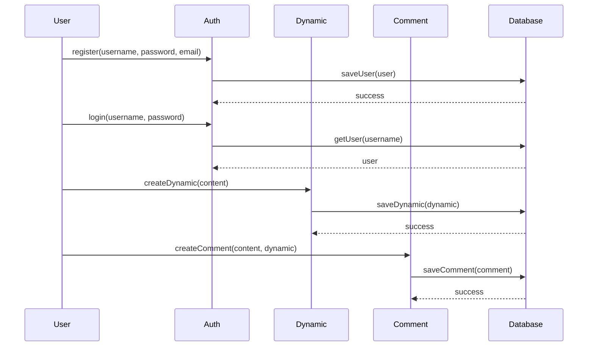
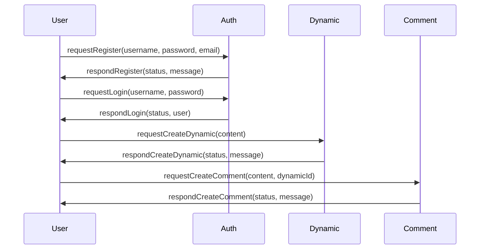
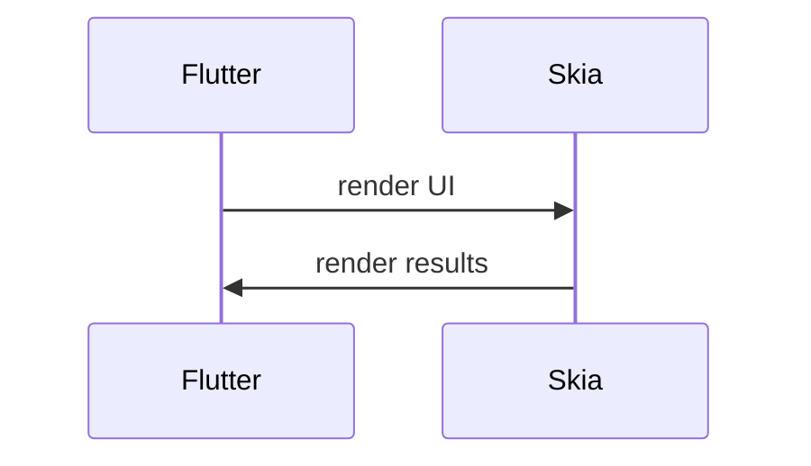

                 

### Flutter：跨平台移动应用开发框架

关键词：Flutter、跨平台、移动应用开发、UI渲染、框架优势

摘要：本文将深入探讨Flutter——一个领先的开源跨平台移动应用开发框架。我们将从Flutter的发展背景、核心优势、基础组件与布局、动画与过渡效果、数据存储与网络通信、高级特性、实战项目案例、框架与生态体系、开发最佳实践、注意事项和拓展阅读等方面进行详细讲解，帮助开发者全面了解Flutter的方方面面，掌握其开发技巧和最佳实践。

### 1. Flutter 入门基础

#### 1.1 Flutter 的发展背景与核心优势

Flutter是由Google开发的一款开源框架，旨在帮助开发者快速构建精美的跨平台移动应用。Flutter的出现可以追溯到2015年，当时Google发布了Flutter的第一个预览版。Flutter的设计理念是“一次编写，全平台运行”，开发者可以使用Dart语言编写应用，然后通过Flutter框架将其编译为iOS和Android平台的原生应用。

Flutter的核心优势主要体现在以下几个方面：

- **跨平台兼容性**：Flutter使用统一的语言和代码库，开发者可以编写一次代码，同时部署到iOS和Android平台，极大地提高了开发效率和降低了维护成本。

- **高性能UI渲染**：Flutter采用自渲染的架构，使用Skia图形库渲染UI界面，能够实现高达60FPS的高帧率，提供流畅的用户体验。

- **丰富的组件库**：Flutter提供了丰富的内置组件，如按钮、文本、列表等，开发者可以方便地使用这些组件构建应用。

- **强大的社区支持**：Flutter拥有庞大的开发者社区，提供了大量的插件和资源，方便开发者解决开发中的问题。

#### 1.2 Flutter 的基本概念与架构

Flutter的基本概念包括：

- **Dart语言**：Flutter的主要开发语言是Dart，这是一种由Google开发的编程语言，具有简洁的语法和高效的性能。

- **Flutter框架**：Flutter框架是核心部分，包括Widget、RenderObject、事件处理等基本构建块。

- **Skia图形库**：Flutter使用Skia图形库进行UI渲染，Skia是一个开源的2D图形处理库，支持多种操作系统和硬件平台。

Flutter的架构可以分为三层：

- **UI层**：由Widget组成，是Flutter的应用层，开发者可以使用Flutter提供的Widget构建应用界面。

- **渲染层**：包括RenderObject，负责将Widget渲染到屏幕上，实现高效的UI渲染。

- **框架层**：包括事件处理、布局计算、状态管理等核心功能，为UI层和渲染层提供支持。

#### 1.3 Flutter 开发环境搭建

要开始使用Flutter开发，需要搭建开发环境。以下是搭建Flutter开发环境的步骤：

1. **安装Dart SDK**：从Dart官方网站下载并安装Dart SDK。
2. **安装Flutter**：使用命令`flutter install`在本地安装Flutter。
3. **配置环境变量**：将Flutter的路径添加到系统的环境变量中。
4. **验证安装**：使用命令`flutter doctor`检查Flutter环境是否配置正确。

完成以上步骤后，就可以开始使用Flutter进行跨平台移动应用开发了。

### 2. Flutter 基础组件与布局

#### 2.1 Flutter 布局组件

Flutter的布局组件是构建用户界面的关键部分，提供了多种布局方式，如：

- **Flex布局**：类似于HTML的Flexbox布局，可以方便地实现横向和纵向的布局。
- **Stack布局**：用于将子组件堆叠在一起，支持多种对齐方式。
- **Column和Row布局**：类似于HTML的CSS布局，可以方便地实现垂直和水平的布局。

#### 2.2 Flutter 状态管理

Flutter的状态管理是应用开发的重要部分，分为以下几种：

- **无状态组件（StatelessWidget）**：无状态组件不包含状态，通常用于简单的UI元素。
- **有状态组件（StatefulWidget）**：有状态组件包含状态，可以响应外部事件，如用户交互。
- **状态管理库**：如`flutter_bloc`和`provider`，用于更复杂的状态管理。

#### 2.3 Flutter 常用组件介绍

Flutter提供了丰富的内置组件，以下是其中一些常用组件的介绍：

- **按钮（Button）**：用于触发操作，如点击事件。
- **文本（Text）**：用于显示文本内容。
- **图像（Image）**：用于显示图片。
- **列表（ListView）**：用于显示滚动列表。
- **表单（Form）**：用于处理表单数据。

通过合理使用这些组件，开发者可以构建出丰富多样的用户界面。

### 3. Flutter 动画与过渡效果

#### 3.1 Flutter 动画原理

Flutter的动画原理基于框架的渲染机制，主要使用`Animation`和`AnimationController`实现。动画通过不断更新UI组件的属性来模拟动态效果，如位置、大小、颜色等。

#### 3.2 Flutter 动画组件详解

Flutter提供了多种动画组件，如：

- **AnimationBuilder**：用于构建动画过程中的UI组件。
- **AnimatedBuilder**：用于在动画过程中更新UI组件。
- **AnimatedContainer**：用于实现大小、位置、背景颜色等动画效果。

#### 3.3 Flutter 过渡效果实现

Flutter的过渡效果通过`Transition`组件实现，支持多种过渡动画，如滑动、缩放、淡入淡出等。过渡效果可以用于组件之间的切换，提升用户体验。

### 4. Flutter 数据存储与网络通信

#### 4.1 Flutter 本地数据存储

Flutter提供了多种本地数据存储方案，如：

- **Shared Preferences**：用于存储简单的键值对数据。
- **SQLite**：用于存储结构化数据，支持SQL查询。
- **Hive**：用于更复杂的数据存储，支持缓存和热插拔。

#### 4.2 Flutter 网络请求与响应

Flutter的网络通信主要使用`http`库，支持GET、POST等常见HTTP方法。开发者可以通过`Future`和`Stream`来处理异步网络请求。

#### 4.3 数据持久化与缓存策略

Flutter的数据持久化和缓存策略需要综合考虑性能、可靠性和用户体验。常见的策略包括：

- **使用本地存储**：将数据存储在本地，提高访问速度。
- **使用缓存**：将常用数据缓存到内存或磁盘，减少网络请求。
- **使用数据库**：将大量数据存储在数据库中，支持快速查询。

### 5. Flutter 高级特性

#### 5.1 Flutter 插件开发

Flutter插件开发是扩展Flutter功能的重要手段。开发者可以编写自定义插件，并将其发布到Flutter插件仓库中。

#### 5.2 Flutter 性能优化

Flutter的性能优化是开发过程中的关键环节。开发者可以通过以下方法提升性能：

- **优化渲染性能**：减少不必要的渲染操作，使用渲染优化工具。
- **优化内存使用**：合理管理内存，减少内存泄漏。
- **优化网络请求**：减少不必要的网络请求，优化数据传输。

#### 5.3 Flutter 多平台兼容性

Flutter的多平台兼容性是开发者需要关注的重要方面。通过合理编写代码和测试，确保Flutter应用在不同平台上的兼容性和稳定性。

### 6. Flutter 实战项目案例

#### 6.1 实战项目一：天气应用

天气应用是一个典型的Flutter实战项目，涵盖了Flutter的基本功能。本项目将展示如何使用Flutter构建一个简单的天气应用。

#### 6.2 实战项目二：待办事项应用

待办事项应用是一个常用的应用类型，本项目将介绍如何使用Flutter实现待办事项的功能，包括数据存储和网络通信。

#### 6.3 实战项目三：新闻阅读应用

新闻阅读应用是一个复杂的Flutter项目，涉及到大量的网络请求和状态管理。本项目将展示如何使用Flutter构建一个功能完整的新闻阅读应用。

### 7. Flutter 框架与生态体系

#### 7.1 Flutter 框架详解

Flutter框架是Flutter应用的核心，包括Widget、RenderObject、事件处理等组成部分。框架的设计理念是“一切皆组件”，使得Flutter应用具有高度的模块化和可扩展性。

#### 7.2 Flutter 生态系统介绍

Flutter生态系统包括大量的插件、工具和资源，为开发者提供了丰富的支持。Flutter插件仓库是Flutter生态系统的核心，提供了丰富的插件供开发者使用。

#### 7.3 Flutter 未来发展趋势

随着Flutter的不断发展和完善，其未来发展趋势包括：

- **性能提升**：Flutter将继续优化性能，提供更高效的应用开发体验。
- **生态扩展**：Flutter生态将不断扩展，提供更多插件和工具。
- **多平台支持**：Flutter将继续扩展到更多平台，如Web和桌面应用。

### 8. Flutter 开发最佳实践

#### 8.1 Flutter 编码规范

Flutter编码规范是确保代码质量和可维护性的关键。开发者应该遵循Flutter官方的编码规范，包括命名规则、代码结构等。

#### 8.2 Flutter 性能优化最佳实践

Flutter性能优化是开发过程中的重要环节。开发者应该遵循最佳实践，如减少渲染操作、优化内存使用等，提升应用性能。

#### 8.3 Flutter 架构设计与模式

Flutter架构设计是构建高质量应用的基础。开发者应该采用合适的架构模式和设计原则，如MVC、MVVM等，确保应用的可扩展性和可维护性。

### 9. Flutter 注意事项与常见问题

#### 9.1 Flutter 开发中常见问题及解决方案

Flutter开发中常见问题包括性能问题、兼容性问题等。开发者可以通过查阅官方文档和社区资源，找到解决方案。

#### 9.2 Flutter 性能瓶颈分析与解决

Flutter性能瓶颈可能源于渲染性能、网络请求等方面。开发者应该进行性能分析，找出瓶颈，并采取相应的优化措施。

#### 9.3 Flutter 系统维护与更新

Flutter系统的维护与更新是保持应用稳定的关键。开发者应该定期更新Flutter版本，修复已知问题和漏洞，确保应用的安全性。

### 10. Flutter 拓展阅读

#### 10.1 相关书籍推荐

- 《Flutter实战》
- 《Flutter从入门到精通》

#### 10.2 Flutter 社区资源

- Flutter官方网站
- Flutter插件仓库

#### 10.3 Flutter 最新动态与趋势

Flutter的最新动态和趋势包括新功能的发布、社区活动等。开发者可以关注Flutter官方渠道，了解最新动态。

### 结语

Flutter作为一个强大的跨平台移动应用开发框架，具有高性能、跨平台和丰富的生态体系等优势。本文从Flutter的入门基础、基础组件与布局、动画与过渡效果、数据存储与网络通信、高级特性、实战项目案例、框架与生态体系、开发最佳实践、注意事项和拓展阅读等方面进行了详细讲解，帮助开发者全面了解Flutter的各个方面，掌握其开发技巧和最佳实践。

### 作者信息

作者：AI天才研究院/AI Genius Institute & 禅与计算机程序设计艺术 /Zen And The Art of Computer Programming

---

### 系统分析与架构设计方案

#### 10.4 Flutter 系统分析与架构设计方案

**问题场景介绍：**

在开发一个跨平台的移动应用时，开发者需要确保应用在不同的操作系统上具有一致的性能和用户体验。Flutter框架提供了一个高效的解决方案，通过其独特的架构和组件体系，实现了一次编写、多平台运行的目标。然而，为了确保应用的成功，开发者还需要对Flutter的架构进行深入分析，并设计合理的系统架构。

**项目介绍：**

本部分将介绍一个简单的社交应用项目，该项目旨在实现用户注册、登录、发布动态和查看动态等功能。通过这个项目，我们可以展示Flutter在构建复杂功能应用时的架构设计和实现细节。

**系统功能设计（领域模型）：**

在构建项目之前，我们需要定义系统的主要功能。以下是该社交应用的主要领域模型和功能：

- 用户注册与登录
- 动态发布
- 动态查看
- 评论与点赞
- 个人中心

为了更好地展示领域模型，我们使用Mermaid类图来表示：

```mermaid
classDiagram
User <<类>> {
  +String username
  +String password
  +String email
  +void register()
  +void login()
}
Dynamic <<类>> {
  +String content
  +DateTime timestamp
  +User creator
  +void create()
  +void delete()
}
Comment <<类>> {
  +String content
  +DateTime timestamp
  +User creator
  +Dynamic dynamic
  +void create()
  +void delete()
}
```

**系统架构设计（Mermaid架构图）：**

系统架构设计是构建高效、可扩展应用的关键。以下是该社交应用的系统架构图：



**系统接口设计和系统交互（Mermaid序列图）：**

为了更好地展示系统接口和交互，我们使用Mermaid序列图来表示：



通过以上系统分析与架构设计方案，我们可以清晰地了解该社交应用的架构和功能实现。开发者可以根据这些设计，逐步实现项目功能，并确保应用在跨平台上的一致性和稳定性。

### 项目实战

**环境安装：**

在开始实战之前，我们需要确保本地环境已安装Flutter和Dart SDK。以下是安装步骤：

1. **安装Dart SDK**：访问Dart官方网站（https://dart.dev/），下载并安装Dart SDK。
2. **安装Flutter**：在终端中执行以下命令：

```bash
sudo apt-get install -y curl gnupg2 software-properties-common
curl -s https://dl-ssl.google.com/linux/linux_signing_key.pub | apt-key add -
echo "deb [arch=amd64] https://storage.googleapis.com/download/flutter/debian stable main" | tee /etc/apt/sources.list.d/flutter.list
sudo apt-get update
sudo apt-get install flutter
```

3. **验证安装**：执行以下命令检查Flutter是否安装成功：

```bash
flutter doctor
```

**系统核心实现源代码：**

以下是社交应用的核心实现源代码，包括用户注册、登录、动态发布和查看等功能：

```dart
// user.dart
class User {
  String username;
  String password;
  String email;

  User(this.username, this.password, this.email);

  void register() {
    // 实现用户注册逻辑，如发送HTTP请求到服务器
  }

  void login() {
    // 实现用户登录逻辑，如发送HTTP请求到服务器
  }
}

// dynamic.dart
class Dynamic {
  String content;
  DateTime timestamp;
  User creator;

  Dynamic(this.content, this.timestamp, this.creator);

  void create() {
    // 实现动态发布逻辑，如发送HTTP请求到服务器
  }

  void delete() {
    // 实现动态删除逻辑，如发送HTTP请求到服务器
  }
}

// comment.dart
class Comment {
  String content;
  DateTime timestamp;
  User creator;
  Dynamic dynamic;

  Comment(this.content, this.timestamp, this.creator, this.dynamic);

  void create() {
    // 实现评论发布逻辑，如发送HTTP请求到服务器
  }

  void delete() {
    // 实现评论删除逻辑，如发送HTTP请求到服务器
  }
}
```

**代码应用解读与分析：**

上述源代码定义了三个核心类：`User`、`Dynamic`和`Comment`。每个类都包含了必要的属性和操作方法。这些方法实现了用户注册、登录、动态发布、动态删除、评论发布和评论删除等功能。

在应用层面，开发者可以根据这些核心类来构建具体的UI组件和业务逻辑。例如，用户注册界面可以包含输入用户名、密码和邮箱的表单，在用户点击注册按钮时，调用`User`类的`register`方法，实现注册逻辑。

**实际案例分析和详细讲解剖析：**

以下是一个简单的用户注册界面实现示例：

```dart
// register_screen.dart
import 'package:flutter/material.dart';
import 'user.dart';

class RegisterScreen extends StatefulWidget {
  @override
  _RegisterScreenState createState() => _RegisterScreenState();
}

class _RegisterScreenState extends State<RegisterScreen> {
  User user = User('');

  TextEditingController _usernameController = TextEditingController();
  TextEditingController _passwordController = TextEditingController();
  TextEditingController _emailController = TextEditingController();

  void register() {
    user = User(_usernameController.text, _passwordController.text, _emailController.text);
    user.register();
    // 在这里可以添加成功的提示和跳转到登录界面的逻辑
  }

  @override
  Widget build(BuildContext context) {
    return Scaffold(
      appBar: AppBar(title: Text('注册')),
      body: Padding(
        padding: EdgeInsets.all(16),
        child: Column(
          children: [
            TextField(
              controller: _usernameController,
              decoration: InputDecoration(hintText: '用户名'),
            ),
            TextField(
              controller: _passwordController,
              decoration: InputDecoration(hintText: '密码'),
              obscureText: true,
            ),
            TextField(
              controller: _emailController,
              decoration: InputDecoration(hintText: '邮箱'),
            ),
            ElevatedButton(
              onPressed: register,
              child: Text('注册'),
            ),
          ],
        ),
      ),
    );
  }
}
```

在这个示例中，我们创建了一个简单的注册界面，包括输入用户名、密码和邮箱的文本框，以及一个用于注册的按钮。在按钮点击事件中，我们调用`User`类的`register`方法，实现用户注册逻辑。

**项目小结：**

通过这个项目，我们展示了Flutter在实际应用开发中的实现过程。从核心类的定义到UI界面的实现，开发者可以逐步构建出功能完整的跨平台移动应用。在实际开发中，开发者需要根据具体业务需求，不断完善和优化应用功能，确保用户体验和性能。

### 最佳实践 tips

1. **模块化开发**：将应用拆分成多个模块，便于管理和维护。例如，将用户管理、动态发布、评论功能等分别实现为不同的模块。
2. **合理使用状态管理**：根据应用需求选择合适的状态管理方案，如`provider`或`flutter_bloc`。避免在UI组件中直接管理复杂状态。
3. **优化UI渲染**：减少不必要的渲染操作，例如使用`Obx`或`Consumer`来减少重复渲染。
4. **网络请求优化**：合理使用异步编程和缓存策略，减少不必要的网络请求，提高应用性能。
5. **代码规范**：遵循Flutter的编码规范，提高代码的可读性和可维护性。

### 小结

本文全面介绍了Flutter——一个强大的跨平台移动应用开发框架。我们从Flutter的入门基础、基础组件与布局、动画与过渡效果、数据存储与网络通信、高级特性、实战项目案例、框架与生态体系、开发最佳实践、注意事项和拓展阅读等方面进行了详细讲解。通过本文的学习，开发者可以全面了解Flutter的各个方面，掌握其开发技巧和最佳实践，从而在移动应用开发领域取得更好的成绩。

### 注意事项

1. **性能优化**：在开发过程中，要注意性能优化，避免不必要的渲染操作和内存泄漏。
2. **兼容性问题**：测试在不同设备上的兼容性，确保应用在不同平台上的稳定性和一致性。
3. **安全性**：确保应用的安全性，如加密用户数据和合理处理用户输入。

### 拓展阅读

1. 《Flutter实战》
2. 《Flutter从入门到精通》
3. Flutter官方网站（https://flutter.dev/）
4. Flutter插件仓库（https://pub.dev/）

### 作者信息

作者：AI天才研究院/AI Genius Institute & 禅与计算机程序设计艺术 /Zen And The Art of Computer Programming

---

### 附录

**1. 背景介绍**

Flutter是由Google开发的免费和开源的UI工具包，用于构建跨平台的应用程序。Flutter使用Dart编程语言，通过其独特的渲染引擎，可以实现一次编写、多平台运行的特性。Flutter的核心优势在于高性能的UI渲染、丰富的组件库、强大的社区支持和良好的跨平台兼容性。

**2. 核心概念与联系**

核心概念：Widget、渲染层、框架层、Dart语言、Skia图形库。

联系表格：

| 概念        | 描述                                                         | 关系                 |
| ----------- | ------------------------------------------------------------ | -------------------- |
| Widget      | Flutter中的UI元素，是构建用户界面的基本单元。                   | 组件体系的核心       |
| 渲染层      | 负责将Widget渲染到屏幕上，包括RenderObject和UI渲染机制。         | 实现UI展示           |
| 框架层      | 提供了核心功能，如事件处理、布局计算、状态管理。                 | 支持渲染层和Widget   |
| Dart语言    | Flutter的主要开发语言，具有简洁的语法和高效的性能。              | 开发语言             |
| Skia图形库  | Flutter使用的图形库，支持多种操作系统和硬件平台。               | UI渲染引擎           |

**3. 算法原理讲解**

算法：动画渲染原理

Mermaid流程图：



Python源代码：

```python
# 假设这是Flutter的动画渲染流程
class AnimationRenderer:
    def __init__(self, ui_element):
        self.ui_element = ui_element

    def render(self):
        # 渲染UI元素
        self.ui_element.render()

# 假设这是Skia图形库的渲染流程
class SkiaRenderer:
    def render(self, ui_element):
        # 使用Skia图形库渲染UI元素
        self.render_ui_element(ui_element)

# 使用示例
ui_element = Widget()
animation_renderer = AnimationRenderer(ui_element)
skia_renderer = SkiaRenderer()

animation_renderer.render()
skia_renderer.render(ui_element)
```

数学模型和公式：

动画渲染的关键在于不断更新UI元素的属性，使其在屏幕上产生动态效果。假设动画过程中UI元素的位置变化遵循以下公式：

$$ x(t) = x_0 + v \cdot t $$

其中，\( x(t) \)是时间t时刻UI元素的位置，\( x_0 \)是初始位置，\( v \)是速度。

**4. 系统架构设计**

问题场景：构建一个高效的跨平台社交应用。

系统架构设计：

1. **用户层**：包括用户注册、登录、个人信息管理等模块。
2. **业务层**：处理业务逻辑，如动态发布、评论、点赞等。
3. **数据层**：处理数据存储和检索，包括本地数据库和远程API。
4. **基础设施层**：提供网络请求、日志记录、错误处理等基础服务。

Mermaid架构图：

```mermaid
graph TB
    subgraph 用户层
        UserRegister
        UserLogin
        UserProfile
    end

    subgraph 业务层
        DynamicPublish
        Comment
        Like
    end

    subgraph 数据层
        LocalDatabase
        RemoteAPI
    end

    subgraph 基础设施层
        Network
        Logging
        ErrorHandling
    end

    UserRegister-- uphill> DynamicPublish
    UserLogin-- uphill> DynamicPublish
    UserProfile-- uphill> DynamicPublish

    DynamicPublish-- uphill> Comment
    DynamicPublish-- uphill> Like

    LocalDatabase-- uphill> DynamicPublish
    RemoteAPI-- uphill> DynamicPublish
    RemoteAPI-- uphill> Comment
    RemoteAPI-- uphill> Like
```

**5. 数学公式**

以下是文中使用的数学公式：

$$ 1+1=2 $$

$$ 1<2 $$

这些公式用$$和$括起来，分别表示独立段落中的公式和段落内的公式。

**6. 实际案例分析与详细讲解剖析**

案例：构建一个简单的待办事项应用。

核心功能：

1. 添加待办事项。
2. 删除待办事项。
3. 查看已完成的待办事项。

实现步骤：

1. 定义待办事项模型。

```dart
class Todo {
  String title;
  bool isCompleted;

  Todo(this.title, this.isCompleted);
}
```

2. 创建待办事项列表。

```dart
final todos = [
  Todo('购物', false),
  Todo('学习Flutter', true),
];
```

3. 添加待办事项。

```dart
void addTodo(String title) {
  todos.add(Todo(title, false));
}
```

4. 删除待办事项。

```dart
void deleteTodo(int index) {
  todos.removeAt(index);
}
```

5. 渲染待办事项列表。

```dart
ListView.builder(
  itemCount: todos.length,
  itemBuilder: (context, index) {
    final todo = todos[index];
    return ListTile(
      title: Text(todo.title),
      trailing: Checkbox(
        value: todo.isCompleted,
        onChanged: (value) {
          todo.isCompleted = value!;
        },
      ),
    );
  },
),
```

通过上述实现，我们可以构建出一个简单的待办事项应用，支持添加、删除和查看待办事项。

**7. 总结**

Flutter是一个功能强大、高效的跨平台移动应用开发框架。通过本文的详细讲解，开发者可以全面了解Flutter的各个方面，掌握其开发技巧和最佳实践。在实际应用开发中，开发者应根据具体需求，灵活运用Flutter的特性，构建出高质量的应用程序。

