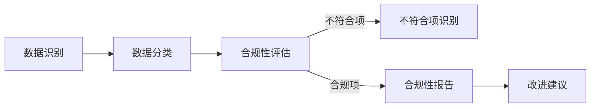
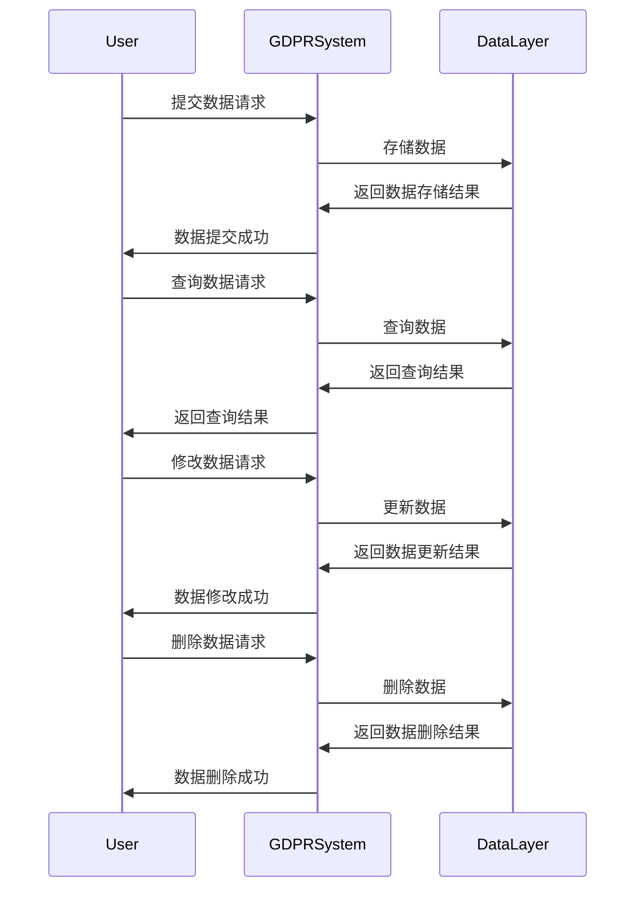

                 

### 1.1 GDPR背景介绍

#### 1.1.1 GDPR的产生与影响

《通用数据保护条例》（General Data Protection Regulation，简称GDPR）是由欧盟立法机关在2016年4月27日正式通过的，并于2018年5月25日正式生效。GDPR的出台旨在强化对个人数据的保护，规范数据处理行为，提高数据透明度和用户控制权。GDPR的产生源于欧盟成员国间数据保护法律法规的不一致，以及对个人数据保护需求的日益增长。

GDPR对全球企业产生了深远的影响。首先，任何处理欧盟居民个人数据的公司，无论其位于哪个国家，都必须遵守GDPR的规定。这一规定使得许多跨国企业不得不重新审视其数据处理流程，以确保合规。其次，GDPR引入了更为严格的个人数据保护标准和处罚措施，使得违规成本大幅提高。例如，GDPR规定，企业若因违反条例导致数据泄露，可能面临高达公司全球营业额4%或2000万欧元（以较高者为准）的罚款。

#### 1.1.2 GDPR的核心原则

GDPR确立了以下几个核心原则，作为数据处理的基本准则：

1. **合法性、公平性和透明性**：数据处理必须具有合法性、公正性和透明性，数据主体有权知道其个人数据被如何处理。

2. **数据最小化原则**：仅收集为实现特定目的所必需的个人数据。

3. **数据准确性和及时更新原则**：确保个人数据是准确的，并在必要时进行更新。

4. **目的限定原则**：个人数据的处理仅限于数据主体同意的目的，未经同意不得用于其他目的。

5. **存储限制原则**：个人数据的存储时间不得超过实现其目的所需的期限。

6. **完整性保护原则**：采取措施确保个人数据的安全性，防止数据泄露、丢失、滥用、修改或破坏。

#### 1.1.3 GDPR的实施与边界

GDPR的实施范围广泛，涵盖了所有处理欧盟居民个人数据的实体，无论这些实体位于欧盟内部还是外部。GDPR适用于以下情况：

- **数据处理者**：指决定如何以及为何处理个人数据的自然人或法人。

- **数据主体**：指个人数据的主体，即个人数据的所有者。

- **数据处理器**：指代表数据处理者处理个人数据的自然人、法人或其他组织。

GDPR的边界还扩展到数据传输，包括数据在欧盟内外部的传输。为了确保跨境数据传输的合规性，GDPR引入了“标准合同条款”（Model Contract Clauses）和“批准的转移机制”（Approved Transfer Mechanisms）。

综上所述，GDPR不仅对企业的数据处理行为提出了严格要求，还为企业提供了一套全面的合规框架，以确保个人数据的保护。理解和遵守GDPR的规定，已经成为全球企业在数据处理过程中必须面对的重要课题。在接下来的章节中，我们将进一步深入探讨GDPR的核心概念、合规性检测算法、数学模型以及系统设计与实施等方面。

### 1.2 GDPR与企业数据合规性

#### 1.2.1 GDPR对企业数据合规性的要求

GDPR对企业数据合规性提出了严格的规范，要求企业在收集、处理、存储和传输个人数据时必须遵循特定的原则和程序。以下是GDPR对企业数据合规性的一些核心要求：

1. **合法性和透明性**：企业必须确保所有数据处理活动都具有合法性和透明性。这包括明确告知数据主体其个人数据将被收集、处理和使用的目的，并获取数据主体的明确同意。

2. **数据最小化原则**：企业应仅收集为实现特定目的所必需的个人数据，不得随意收集多余的信息。

3. **数据准确性和及时更新原则**：企业必须确保个人数据的准确性，并在必要时进行更新。数据应当保持最新，以避免误导或侵犯数据主体的权利。

4. **目的限定原则**：个人数据的处理仅限于数据主体同意的目的，不得用于其他未明确说明的目的。企业必须确保数据处理活动与数据主体初始同意的目的相一致。

5. **存储限制原则**：企业必须设定合理的存储期限，确保个人数据的存储不超过实现其目的所需的期限。超出期限的数据应当被删除或匿名化。

6. **数据保护原则**：企业必须采取适当的技术和组织措施，保护个人数据免受未经授权的访问、泄露、丢失、滥用、修改或破坏。

7. **数据主体权利**：数据主体享有访问、修改、删除和限制其个人数据的权利。企业必须提供便捷的方式和数据主体行使这些权利的渠道。

8. **安全措施**：企业必须实施适当的安全措施，以保护个人数据的安全性和完整性。这些措施包括加密、访问控制、数据备份、事故响应计划等。

#### 1.2.2 GDPR对数据处理的规范

GDPR对数据处理的各个环节进行了详细规范，以下是一些关键规范：

1. **数据处理者的责任**：数据处理者必须对其数据处理活动负责，并确保其数据处理活动符合GDPR的要求。数据处理者必须指定一名数据保护官（Data Protection Officer，DPO），以协助确保合规性。

2. **数据处理者的记录义务**：数据处理者必须记录数据处理活动的过程和目的，包括数据收集、处理、存储和传输的流程。这些记录应便于监管机构和数据主体查阅。

3. **数据处理者的数据处理计划**：数据处理者应制定数据处理计划，明确数据处理的类型、目的、数据种类、数据主体类型、数据处理的方式和处理期限等。

4. **数据泄露通知义务**：若企业发生数据泄露事件，必须立即通知数据保护和监管机构，并在72小时内通知受影响的数据主体。

5. **数据传输规范**：对于跨境数据传输，企业必须确保数据传输符合GDPR的规定，包括使用标准合同条款或批准的转移机制。

#### 1.2.3 GDPR对企业的影响

GDPR的实施对全球企业产生了深远的影响，主要体现在以下几个方面：

1. **合规成本增加**：企业必须投入大量资源和成本来评估、调整和优化其数据处理流程，以确保符合GDPR的要求。这可能包括法律咨询、员工培训、技术升级等。

2. **数据处理流程优化**：为了满足GDPR的要求，企业需要对数据处理流程进行彻底的审查和优化，确保数据处理活动具有合法性、透明性和安全性。

3. **市场竞争压力**：GDPR对企业的数据处理行为提出了严格的规范，导致合规成本增加，这在一定程度上提高了市场准入门槛，增加了企业的竞争压力。

4. **客户信任提升**：通过遵守GDPR的规定，企业能够更好地保护客户的数据隐私，提升客户对企业的信任度，增强品牌形象。

5. **全球合规趋势**：GDPR的严格性和广泛性，使其成为全球数据保护的一个标杆。其他国家和地区可能会借鉴GDPR的框架和原则，推动数据保护的立法和实施。

综上所述，GDPR不仅为企业数据合规性设定了高标准，还对企业的数据处理流程和经营模式产生了深远的影响。企业必须认识到GDPR的重要性，采取积极的合规措施，以应对新的挑战。在接下来的章节中，我们将继续探讨GDPR的核心概念、合规性检测算法、数学模型以及系统设计与实施等方面，帮助读者更深入地理解GDPR的要求和影响。

### 2.1 GDPR核心概念与联系

#### 2.1.1 数据主体权利

数据主体权利是GDPR中非常重要的一部分，旨在增强数据主体的控制权和数据保护。以下是GDPR赋予数据主体的主要权利：

1. **访问权**：数据主体有权请求访问其个人数据，包括数据的使用目的、数据类别、数据来源、数据共享对象等。

2. **修正权**：数据主体有权要求修正其个人数据中不准确或过时的信息。

3. **删除权**（也被称作“被遗忘权”）：数据主体有权要求删除其个人数据，尤其是当数据处理不再需要时。

4. **限制处理权**：数据主体有权要求限制其个人数据的处理，这在某些特定情况下，例如数据主体对数据处理的合法性提出质疑时使用。

5. **数据可携权**：数据主体有权要求将其个人数据从一个系统转移到另一个系统，以增强数据的流动性。

6. **反对权**：数据主体有权反对其个人数据的处理，特别是出于直接营销目的。

7. **自动决策权**：数据主体有权反对基于自动决策过程的处理，尤其是那些对数据主体有法律效力或显著影响的决策。

#### 2.1.2 数据处理者与处理者责任

数据处理者和数据处理者是GDPR中的两个关键角色：

1. **数据处理者**：数据处理者是指决定如何以及为何处理个人数据的自然人或法人。数据处理者负责制定数据处理政策和程序，确保数据处理活动符合GDPR的要求。

2. **数据处理者**：数据处理者是指代表数据处理者处理个人数据的自然人或法人。数据处理者必须按照数据处理者的指示处理数据，并采取适当的安全措施保护个人数据。

数据处理者的责任包括：

- 确保数据处理活动符合GDPR的要求。
- 对数据处理活动进行记录，包括数据处理的目的、数据类别、数据主体类型等。
- 委派一名数据保护官（DPO）以协助确保合规性。
- 对数据泄露事件进行评估并采取适当的措施。
- 与数据处理者合作，确保数据处理者的责任得到履行。

#### 2.1.3 数据保护官(DPO)

数据保护官（Data Protection Officer，DPO）是GDPR中负责确保数据处理活动符合数据保护法规的专职人员。DPO的角色和职责包括：

1. **咨询和指导**：DPO为数据处理者和数据处理者提供有关GDPR和其他数据保护法规的咨询和指导。

2. **风险评估和监控**：DPO负责评估和处理与数据处理活动相关的风险，监控数据处理活动的合规性。

3. **培训和教育**：DPO负责对数据处理者和数据处理者的员工进行数据保护的培训和教育。

4. **数据保护计划**：DPO参与制定和监督数据保护计划，确保数据处理活动符合GDPR的要求。

5. **处理数据主体请求**：DPO负责处理数据主体的访问、修正、删除等请求。

#### 2.1.4 GDPR关键条款与ER图解析

GDPR包含了一系列关键条款，这些条款为数据处理活动提供了明确的指导和要求。以下是GDPR的一些关键条款：

1. **合法性、公正性和透明性**：数据处理必须合法、公正且透明，数据主体有权了解数据处理的目的、类型、存储期限等。

2. **数据最小化原则**：仅收集为实现特定目的所必需的个人数据，不得收集多余信息。

3. **数据准确性和及时更新原则**：确保个人数据的准确性，并在必要时进行更新。

4. **目的限定原则**：个人数据的处理仅限于数据主体同意的目的，不得用于其他目的。

5. **存储限制原则**：个人数据的存储时间不得超过实现其目的所需的期限。

6. **完整性保护原则**：采取措施确保个人数据的安全性，防止数据泄露、丢失、滥用、修改或破坏。

7. **数据主体权利**：数据主体享有访问、修正、删除、限制处理、数据可携权、反对权和自动决策权。

为了更好地理解GDPR的结构和关键概念，可以使用ER图（实体关系图）进行解析。以下是GDPR关键条款的ER图：

```mermaid
erDiagram
    DataSubject ||--|{ DataController }|| Controller
    DataController ||--|{ DataProcessor }|| Processor
    DataController ||--|{ DataRecipient }|| Recipient
    DataProcessor ||--|{ DataSecurityOfficer }|| SecurityOfficer

    Controller {
        id : Integer
        name : String
        email : String
    }

    Processor {
        id : Integer
        name : String
        email : String
    }

    Recipient {
        id : Integer
        name : String
        email : String
    }

    SecurityOfficer {
        id : Integer
        name : String
        email : String
    }

    DataSubject {
        id : Integer
        name : String
        email : String
    }
```

这个ER图展示了GDPR中的主要实体及其关系。数据主体与数据处理者之间存在直接关系，数据处理者可以委托数据处理者，并将数据传输给数据接收者。数据保护官是数据处理者的关键角色，负责确保数据处理活动的合规性。

通过这一章节，我们详细介绍了GDPR的核心概念和关键条款，并使用ER图进行了结构化的解析。在接下来的章节中，我们将深入探讨GDPR合规性检测算法、数学模型以及系统设计与实施等方面，帮助读者更全面地理解GDPR的要求和实施策略。

### 3.1 GDPR合规性检测算法

#### 3.1.1 算法概述

GDPR合规性检测算法是一种用于评估企业数据处理活动是否满足GDPR要求的工具。其主要目的是通过系统化的方法，确保数据处理活动遵循GDPR的规定，从而避免因违规操作而产生的法律和商业风险。该算法通常包括以下步骤：

1. **数据收集**：收集与数据处理活动相关的所有信息，包括数据处理的目的、数据类别、数据主体类型等。

2. **合规性检查**：对收集的数据进行合规性检查，评估是否满足GDPR的各项规定。

3. **报告生成**：根据检查结果生成合规性报告，包括合规性状态、不符合项和改进建议。

4. **持续监控**：定期对数据处理活动进行合规性检测，确保持续合规。

#### 3.1.2 算法流程

GDPR合规性检测算法的流程可以分为以下几个步骤：

1. **数据识别**：识别企业处理的所有个人数据，包括数据的种类、来源、存储位置等。

2. **数据分类**：根据GDPR的规定，对数据进行分类，区分哪些数据需要特别保护。

3. **合规性评估**：对每个数据类别进行合规性评估，检查是否满足合法性、透明性、数据最小化、数据准确性和及时更新等要求。

4. **不符合项识别**：识别不符合GDPR规定的处理活动，包括未经授权的数据处理、数据存储超期等。

5. **合规性报告**：根据检查结果生成合规性报告，列出不符合项及其原因。

6. **改进建议**：提供改进建议，帮助企业优化数据处理流程，确保合规性。

#### 3.1.3 算法原理与mermaid流程图

GDPR合规性检测算法的原理是基于对数据处理活动的系统化评估和监控，以确保所有操作符合GDPR的要求。以下是该算法的mermaid流程图：



在这个流程图中，数据识别是算法的第一步，通过识别企业处理的个人数据，为后续的合规性评估提供基础。数据分类确保数据得到适当的分类和标识，便于后续的合规性评估。合规性评估是核心步骤，通过逐项检查GDPR的要求，判断数据处理活动的合规性。如果发现不符合项，算法将进行识别，并提出改进建议，帮助企业优化数据处理流程。

#### 3.1.4 算法实现

为了更好地理解GDPR合规性检测算法，我们可以通过Python代码实现该算法的核心功能。以下是一个简化的Python代码示例：

```python
# GDPR合规性检测算法实现

def collect_data():
    # 识别和处理个人数据
    data = {
        'name': 'John Doe',
        'email': 'john.doe@example.com',
        'address': '123 Main St'
    }
    return data

def classify_data(data):
    # 对数据进行分类
    classified_data = {
        'sensitive': ['email', 'address'],
        'non-sensitive': ['name']
    }
    return classified_data

def assess_compliance(data, classified_data):
    # 评估合规性
    compliance_issues = []
    for key, value in data.items():
        if key not in classified_data['non-sensitive']:
            compliance_issues.append(f"未经授权处理敏感数据：{key}")
    return compliance_issues

def generate_report(compliance_issues):
    # 生成合规性报告
    if compliance_issues:
        report = "合规性检测报告：\n"
        for issue in compliance_issues:
            report += f"- {issue}\n"
        return report
    else:
        return "合规性检测报告：所有数据处理活动均符合GDPR要求。"

# 主函数
def main():
    data = collect_data()
    classified_data = classify_data(data)
    compliance_issues = assess_compliance(data, classified_data)
    report = generate_report(compliance_issues)
    print(report)

if __name__ == "__main__":
    main()
```

在这个示例中，`collect_data` 函数用于收集个人数据，`classify_data` 函数用于对数据进行分类，`assess_compliance` 函数用于评估数据处理活动的合规性，`generate_report` 函数用于生成合规性报告。通过运行主函数`main`，可以执行整个合规性检测流程。

#### 3.1.5 算法原理与实际应用

GDPR合规性检测算法的设计原则是确保数据处理活动的透明性和合规性，从而保护数据主体的权利。在实际应用中，算法可以为企业提供一个系统化的工具，帮助它们识别和处理合规性问题。以下是算法在GDPR合规性检测中的实际应用：

1. **透明性提升**：算法通过系统化的数据收集和分类，使企业能够清晰地了解其数据处理活动，从而提高数据的透明度。

2. **合规性评估**：算法对数据处理活动进行逐项检查，评估其是否符合GDPR的要求，及时发现潜在的风险和问题。

3. **合规性改进**：算法识别出不符合GDPR规定的处理活动后，会提供具体的改进建议，帮助企业优化数据处理流程，确保合规性。

4. **持续监控**：算法可以定期执行，帮助企业保持数据处理活动的合规性，降低违规风险。

通过GDPR合规性检测算法，企业不仅能够确保其数据处理活动符合GDPR的要求，还能提升数据透明度和用户信任度。在接下来的章节中，我们将进一步探讨GDPR的数学模型和公式，以及系统分析与架构设计等方面，帮助读者更全面地掌握GDPR合规性设计的关键技术。

### 4.1 GDPR合规性度量模型

#### 4.1.1 模型概述

GDPR合规性度量模型是一个用于评估企业数据处理活动是否符合GDPR要求的量化工具。该模型通过一系列指标和计算公式，对企业数据处理活动的合规性进行评估。模型的目的是帮助企业识别潜在的风险点，优化数据处理流程，确保合规性。

#### 4.1.2 数学公式解释

GDPR合规性度量模型的主要计算公式包括：

1. **合规性评分（C）**：
   \[
   C = \frac{\sum_{i=1}^{n} W_i \cdot S_i}{\sum_{i=1}^{n} W_i}
   \]
   其中，\(W_i\) 是指标 \(i\) 的权重，\(S_i\) 是指标 \(i\) 的得分。权重反映了指标在整体合规性评估中的重要性。

2. **指标得分（\(S_i\)）**：
   每个指标的得分基于其在合规性要求中的满足程度。例如：
   \[
   S_i = 
   \begin{cases} 
   1 & \text{如果指标完全满足GDPR要求} \\
   0.5 & \text{如果指标部分满足GDPR要求} \\
   0 & \text{如果指标完全不满足GDPR要求}
   \end{cases}
   \]

3. **合规性指标（\(I_i\)）**：
   合规性指标包括合法性、透明性、数据最小化、数据准确性和及时更新等。例如：
   \[
   I_1 = \text{合法性得分} \\
   I_2 = \text{透明性得分} \\
   I_3 = \text{数据最小化得分} \\
   I_4 = \text{数据准确性得分} \\
   I_5 = \text{数据及时更新得分}
   \]

4. **权重分配（\(W_i\)）**：
   权重分配取决于每个指标对整体合规性的影响程度。例如：
   \[
   W_1 = 0.2 \\
   W_2 = 0.2 \\
   W_3 = 0.2 \\
   W_4 = 0.2 \\
   W_5 = 0.2
   \]

#### 4.1.3 举例说明

假设我们有一个企业，其数据处理活动包括以下合规性指标：

- **合法性**：企业获得了数据主体的明确同意。
- **透明性**：企业明确告知了数据主体其数据处理的目的和方式。
- **数据最小化**：企业仅收集了为实现其数据处理目的所必需的数据。
- **数据准确性**：企业定期检查和更新个人数据的准确性。
- **数据及时更新**：企业能够及时更新数据处理活动的相关记录。

根据上述假设，我们可以计算每个指标的得分：

- **合法性得分（\(I_1\)）**：1（完全满足）
- **透明性得分（\(I_2\)）**：1（完全满足）
- **数据最小化得分（\(I_3\)）**：1（完全满足）
- **数据准确性得分（\(I_4\)）**：1（完全满足）
- **数据及时更新得分（\(I_5\)）**：1（完全满足）

使用权重分配公式，我们可以计算合规性评分（\(C\)）：

\[
C = \frac{0.2 \cdot 1 + 0.2 \cdot 1 + 0.2 \cdot 1 + 0.2 \cdot 1 + 0.2 \cdot 1}{0.2 + 0.2 + 0.2 + 0.2 + 0.2} = 1
\]

因此，该企业的合规性评分为1，表示其数据处理活动完全符合GDPR的要求。

#### 4.1.4 模型应用场景

GDPR合规性度量模型可以应用于以下场景：

1. **合规性评估**：企业可以定期使用该模型评估其数据处理活动的合规性，及时发现和纠正潜在问题。

2. **合规性改进**：模型识别的不合规项可以为企业提供具体的改进方向，帮助其优化数据处理流程。

3. **合规性报告**：企业可以使用模型生成的合规性评分和报告，向监管机构和数据主体展示其合规性水平。

4. **合规性监控**：模型可以集成到企业的数据管理系统中，实现持续合规性监控，确保数据处理活动的持续合规。

通过GDPR合规性度量模型，企业能够系统化地评估其数据处理活动的合规性，提高数据保护水平，降低法律和商业风险。在接下来的章节中，我们将进一步探讨GDPR合规性风险分析模型，以及其在实际应用中的具体实现。

### 4.2 GDPR合规性风险分析模型

#### 4.2.1 模型概述

GDPR合规性风险分析模型是一个用于评估企业在数据处理活动中潜在风险的量化工具。该模型通过识别和分析可能的数据泄露、滥用或其他合规性问题，帮助企业制定有效的风险缓解措施。模型的主要目的是确保企业在数据处理过程中，能够及时识别和应对合规风险，从而避免可能的法律和商业损失。

#### 4.2.2 数学公式解释

GDPR合规性风险分析模型的主要计算公式包括：

1. **风险评分（\(R\)）**：
   \[
   R = \frac{\sum_{i=1}^{n} W_i \cdot S_i}{\sum_{i=1}^{n} W_i}
   \]
   其中，\(W_i\) 是风险因子 \(i\) 的权重，\(S_i\) 是风险因子的得分。权重反映了风险因子在整体风险分析中的重要性。

2. **风险因子得分（\(S_i\)）**：
   每个风险因子的得分基于其在合规性风险中的影响程度。例如：
   \[
   S_i = 
   \begin{cases} 
   1 & \text{如果风险因子对合规性的影响非常大} \\
   0.5 & \text{如果风险因子对合规性的影响中等} \\
   0 & \text{如果风险因子对合规性的影响非常小或不存在}
   \end{cases}
   \]

3. **风险因子（\(I_i\)）**：
   风险因子包括数据泄露风险、数据处理不当风险、数据传输风险、数据存储风险等。例如：
   \[
   I_1 = \text{数据泄露风险得分} \\
   I_2 = \text{数据处理不当风险得分} \\
   I_3 = \text{数据传输风险得分} \\
   I_4 = \text{数据存储风险得分}
   \]

4. **权重分配（\(W_i\)）**：
   权重分配取决于每个风险因子对整体合规风险的影响程度。例如：
   \[
   W_1 = 0.3 \\
   W_2 = 0.3 \\
   W_3 = 0.2 \\
   W_4 = 0.2
   \]

#### 4.2.3 举例说明

假设我们有一个企业，其数据处理活动存在以下风险因子：

- **数据泄露风险**：企业使用了弱密码和不安全的网络传输协议。
- **数据处理不当风险**：企业员工未经过数据保护培训。
- **数据传输风险**：企业在跨境数据传输时未使用加密技术。
- **数据存储风险**：企业的数据存储设施缺乏足够的物理安全措施。

根据上述假设，我们可以计算每个风险因子的得分：

- **数据泄露风险得分（\(I_1\)）**：0.5（影响中等）
- **数据处理不当风险得分（\(I_2\)）**：1（影响较大）
- **数据传输风险得分（\(I_3\)）**：1（影响较大）
- **数据存储风险得分（\(I_4\)）**：0.5（影响中等）

使用权重分配公式，我们可以计算风险评分（\(R\)）：

\[
R = \frac{0.3 \cdot 0.5 + 0.3 \cdot 1 + 0.2 \cdot 1 + 0.2 \cdot 0.5}{0.3 + 0.3 + 0.2 + 0.2} = 0.575
\]

因此，该企业的合规性风险评分为0.575，表示其存在较高的合规风险。

#### 4.2.4 风险缓解措施

基于风险评分，企业可以采取以下风险缓解措施：

1. **数据泄露风险**：使用强密码策略和加密技术，加强网络传输安全。

2. **数据处理不当风险**：对员工进行数据保护培训，提高员工的数据保护意识。

3. **数据传输风险**：在跨境数据传输时使用加密技术，确保数据传输安全。

4. **数据存储风险**：加强数据存储设施的安全措施，如安装监控设备和访问控制系统。

#### 4.2.5 模型应用场景

GDPR合规性风险分析模型可以应用于以下场景：

1. **风险评估**：企业可以定期使用该模型评估其数据处理活动的合规风险，及时发现和评估潜在问题。

2. **风险控制**：模型识别的高风险因子可以为企业提供具体的控制措施，帮助其降低合规风险。

3. **合规报告**：企业可以使用模型生成的风险评分和报告，向监管机构和数据主体展示其合规风险控制情况。

4. **合规监控**：模型可以集成到企业的数据管理系统中，实现持续合规风险监控，确保数据处理活动的合规性。

通过GDPR合规性风险分析模型，企业能够系统地识别和评估数据处理活动的合规风险，制定有效的风险缓解措施，从而确保数据处理活动的合规性和安全性。在接下来的章节中，我们将进一步探讨GDPR的系统分析与架构设计，以及实际项目实施的经验和教训。

### 5.1 GDPR系统场景介绍

#### 5.1.1 GDPR系统介绍

GDPR系统是一个用于确保企业数据处理活动符合《通用数据保护条例》（GDPR）要求的信息系统。该系统旨在帮助企业进行数据合规性管理，包括数据收集、处理、存储、传输和删除等环节。GDPR系统通过自动化工具和流程，确保企业能够及时发现和处理合规性问题，降低合规风险。

#### 5.1.2 GDPR系统项目介绍

GDPR系统项目是一个跨部门、跨系统的综合性项目，涉及多个业务领域和IT系统。项目的主要目标包括：

1. **合规性管理**：确保企业数据处理活动符合GDPR的要求，包括合法性、透明性、数据最小化、数据准确性和及时更新等。
2. **风险控制**：识别和评估数据处理活动中的合规风险，制定和实施有效的风险缓解措施。
3. **数据主体权利保护**：确保数据主体能够轻松地行使访问、修正、删除等权利。
4. **合规性监控**：实现持续合规监控，及时发现和处理合规性问题。

项目的主要参与者包括：

- **业务部门**：负责提供数据处理需求，参与合规性管理策略的制定。
- **IT部门**：负责系统开发、部署和维护，确保系统功能满足合规性要求。
- **法律部门**：提供法律咨询，确保数据处理活动符合相关法律法规。
- **数据保护官（DPO）**：负责合规性管理工作的协调和监督。

### 5.2 GDPR系统功能设计

#### 5.2.1 领域模型类图

GDPR系统的领域模型类图如下所示：

```mermaid
classDiagram
    DataSubject <<class>> "数据主体" 
    DataController <<class>> "数据处理者" 
    DataProcessor <<class>> "数据处理者"
    DataRecipient <<class>> "数据接收者"
    GDPRSystem <<class>> "GDPR系统"
    DataProtectionOfficer <<class>> "数据保护官"
    
    DataSubject "1" --|{授权}| GDPRSystem
    DataController "1" --|{委托}| DataProcessor
    DataController "1" --|{数据}| GDPRSystem
    DataProcessor "1" --|{处理}| GDPRSystem
    DataRecipient "1" --|{接收}| GDPRSystem
    GDPRSystem "1" --|{管理}| DataProtectionOfficer
    
    DataSubject : has姓名，电子邮件，地址
    DataController : has公司名称，联系方式
    DataProcessor : has公司名称，联系方式
    DataRecipient : has公司名称，联系方式
    GDPRSystem : has数据收集模块，数据处理模块，数据存储模块，数据传输模块
    DataProtectionOfficer : has合规性报告生成，合规性监控，数据主体权利处理
```

在这个类图中，GDPR系统包含了数据收集、数据处理、数据存储和数据传输等模块，与数据主体、数据处理者、数据处理者、数据接收者和数据保护官等实体有明确的关联。

#### 5.2.2 系统功能设计

GDPR系统的功能设计涵盖了以下几个核心模块：

1. **数据收集模块**：用于收集和处理数据主体提交的个人数据，包括姓名、电子邮件和地址等信息。该模块需确保数据收集的合法性、透明性和最小化原则。

2. **数据处理模块**：负责处理和分析收集到的个人数据，包括数据清洗、分类、存储和共享等操作。该模块需确保数据处理过程的透明性和合法性。

3. **数据存储模块**：用于存储处理后的个人数据，包括数据库、文件系统等。该模块需确保数据存储的安全性和可访问性。

4. **数据传输模块**：负责在内部系统间传输个人数据，包括跨境数据传输。该模块需确保数据传输的加密和安全。

5. **合规性监控模块**：用于监控数据处理活动的合规性，包括定期检查、风险分析和报告生成等。

6. **数据主体权利处理模块**：用于处理数据主体的访问、修正、删除等请求，确保数据主体权利的保护。

### 5.3 GDPR系统架构设计

#### 5.3.1 系统架构设计

GDPR系统采用分布式架构设计，主要包括以下几个层次：

1. **前端层**：负责与用户交互，提供用户友好的界面和功能。包括网页、移动应用和API接口。

2. **业务逻辑层**：处理业务逻辑，包括数据收集、处理、存储和传输等。该层采用微服务架构，提高系统的灵活性和可扩展性。

3. **数据层**：负责数据存储和管理，包括关系数据库、NoSQL数据库、文件存储等。该层需确保数据的安全性和可靠性。

4. **基础设施层**：包括服务器、网络、存储和安全设备等，提供系统运行的基础设施。

#### 5.3.2 系统接口设计

GDPR系统接口设计主要包括以下几个关键接口：

1. **用户接口**：提供用户操作界面，包括数据提交、查询、修改和删除等。

2. **API接口**：提供与外部系统和应用程序的接口，实现数据的交换和集成。包括RESTful API、SOAP等。

3. **数据接口**：提供数据存储和管理的接口，包括数据库连接、数据查询、数据更新等。

4. **监控接口**：提供系统监控和数据合规性监控的接口，包括日志记录、风险分析、报告生成等。

#### 5.3.3 系统交互序列图

GDPR系统的交互序列图如下所示：



在这个序列图中，用户通过GDPR系统提交数据、查询数据、修改数据和删除数据，GDPR系统通过数据层进行数据存储、查询、更新和删除操作，并返回相应的结果给用户。

### 5.4 GDPR系统测试与部署

#### 5.4.1 测试

GDPR系统的测试主要包括以下方面：

1. **功能测试**：验证系统功能的正确性和完整性，确保各模块和接口按照设计要求正常运行。

2. **性能测试**：评估系统的响应时间、吞吐量和并发能力，确保系统能够应对高负载场景。

3. **安全测试**：检查系统的安全防护措施，包括数据加密、访问控制和安全审计等，确保系统的安全性。

4. **兼容性测试**：验证系统在不同操作系统、浏览器和硬件环境中的兼容性，确保系统在不同环境中稳定运行。

5. **回归测试**：在系统更新或修复后，重新测试相关功能，确保更新或修复不会引入新的问题。

#### 5.4.2 部署

GDPR系统的部署包括以下几个步骤：

1. **环境搭建**：搭建测试、预生产和生产环境，配置服务器、数据库和网络设备。

2. **系统安装**：安装和配置系统软件，包括操作系统、中间件、数据库等。

3. **数据迁移**：将测试数据迁移到生产环境，确保生产环境的数据一致性。

4. **系统上线**：将系统上线，进行实际数据处理活动，并进行监控和调整。

5. **用户培训**：对业务部门人员进行系统操作培训，确保他们能够熟练使用系统。

### 5.5 GDPR系统维护与升级

#### 5.5.1 维护

GDPR系统的维护主要包括以下方面：

1. **系统监控**：实时监控系统的运行状态，包括性能、安全性和稳定性。

2. **故障处理**：及时发现和解决系统故障，确保系统正常运行。

3. **性能优化**：根据系统运行数据，进行性能优化，提高系统响应速度和并发能力。

4. **安全防护**：定期更新系统安全防护措施，应对新的安全威胁。

5. **数据备份**：定期备份数据，确保数据的安全性和可恢复性。

#### 5.5.2 升级

GDPR系统的升级主要包括以下方面：

1. **版本更新**：根据业务需求和系统稳定性，定期更新系统版本。

2. **功能扩展**：根据业务需求，新增或优化系统功能。

3. **兼容性升级**：升级操作系统、数据库和其他依赖组件，确保系统兼容性。

4. **安全性增强**：增强系统安全防护措施，提高系统安全性。

通过上述设计、测试、部署、维护和升级，GDPR系统能够确保企业数据处理活动的合规性，降低合规风险，保护数据主体的权利。在接下来的章节中，我们将通过实际项目案例，进一步探讨GDPR系统的具体实现和实际应用。

### 6.1 环境安装与配置

#### 6.1.1 环境安装

要在企业内部部署GDPR系统，首先需要搭建相应的环境。以下是GDPR系统环境安装的详细步骤：

1. **操作系统安装**：选择支持GDPR系统的操作系统，如Linux或Windows。安装过程中，确保操作系统具备必要的补丁和更新。

2. **中间件安装**：安装和配置中间件，如Web服务器（如Apache或Nginx）、应用服务器（如Tomcat或Jboss）和数据库（如MySQL或PostgreSQL）。确保中间件版本支持GDPR系统所需的功能。

3. **依赖库安装**：根据GDPR系统的需求，安装相关的依赖库，如Python、Java或Node.js等。这些依赖库用于实现系统功能，确保系统正常运行。

4. **工具安装**：安装系统所需的开发工具和辅助工具，如Git、Docker、Kubernetes等。这些工具有助于提高系统的开发和部署效率。

#### 6.1.2 系统核心实现

GDPR系统的核心实现主要包括以下几个模块：

1. **数据收集模块**：该模块负责从企业内部和外部的数据源收集个人数据。具体实现包括数据采集、数据清洗和数据存储等。以下是一个简化的Python代码示例：

   ```python
   import requests
   
   def collect_data(source_url):
       response = requests.get(source_url)
       if response.status_code == 200:
           return response.json()
       else:
           return None
   
   data = collect_data('http://example.com/data.json')
   if data:
       # 数据清洗和存储逻辑
       pass
   ```

2. **数据处理模块**：该模块负责处理和转换收集到的个人数据。具体实现包括数据清洗、数据分析和数据存储等。以下是一个简化的Python代码示例：

   ```python
   import pandas as pd
   
   def process_data(data):
       df = pd.DataFrame(data)
       # 数据清洗逻辑
       df = df.dropna()
       # 数据分析逻辑
       df['age'] = df['age'].apply(lambda x: x // 10 * 10)
       return df
   
   processed_data = process_data(data)
   # 数据存储逻辑
   ```

3. **数据存储模块**：该模块负责存储处理后的个人数据。具体实现包括数据库连接、数据插入和查询等。以下是一个简化的Python代码示例：

   ```python
   import sqlite3
   
   def store_data(df, table_name):
       conn = sqlite3.connect('gdpr.db')
       cursor = conn.cursor()
       for index, row in df.iterrows():
           cursor.execute(f"INSERT INTO {table_name} (column1, column2, column3) VALUES (?, ?, ?)", (row['column1'], row['column2'], row['column3']))
       conn.commit()
       conn.close()
   
   store_data(processed_data, 'personal_data')
   ```

4. **数据传输模块**：该模块负责在系统内部和外部传输个人数据。具体实现包括数据加密、数据传输协议和数据接收等。以下是一个简化的Python代码示例：

   ```python
   import ssl
   
   def transmit_data(data, destination_url):
       context = ssl.create_default_context()
       with requests.post(destination_url, json=data, verify=context) as response:
           if response.status_code == 200:
               return True
           else:
               return False
   
   transmit_data(processed_data, 'https://example.com/transfer')
   ```

5. **合规性监控模块**：该模块负责监控数据处理活动的合规性。具体实现包括合规性检查、不符合项识别和报告生成等。以下是一个简化的Python代码示例：

   ```python
   def check_compliance(data):
       compliance_issues = []
       for record in data:
           if 'name' not in record:
               compliance_issues.append('缺失姓名')
           if 'email' not in record:
               compliance_issues.append('缺失电子邮件')
           # 其他合规性检查逻辑
       return compliance_issues
   
   compliance_issues = check_compliance(processed_data)
   if compliance_issues:
       # 生成合规性报告逻辑
       pass
   ```

通过上述核心实现，GDPR系统可以实现数据收集、处理、存储、传输和合规性监控等功能。在接下来的章节中，我们将通过实际案例深入分析GDPR系统的具体应用和实现。

### 6.2 GDPR实现源代码解读

#### 6.2.1 源代码解读

为了更好地理解GDPR系统的实现，我们将对几个关键模块的源代码进行详细解读。以下是一个简化的GDPR系统源代码示例，涵盖了数据收集、数据处理、数据存储和数据传输等核心功能。

```python
# GDPR系统源代码示例

# 导入必要的库
import requests
import pandas as pd
import sqlite3
import ssl

# 数据收集模块
def collect_data(source_url):
    response = requests.get(source_url)
    if response.status_code == 200:
        return response.json()
    else:
        return None

# 数据处理模块
def process_data(data):
    df = pd.DataFrame(data)
    df = df.dropna()  # 清除缺失值
    df['age'] = df['age'].apply(lambda x: x // 10 * 10)  # 对年龄进行分组
    return df

# 数据存储模块
def store_data(df, table_name):
    conn = sqlite3.connect('gdpr.db')
    cursor = conn.cursor()
    for index, row in df.iterrows():
        cursor.execute(f"INSERT INTO {table_name} (column1, column2, column3) VALUES (?, ?, ?)", (row['column1'], row['column2'], row['column3']))
    conn.commit()
    conn.close()

# 数据传输模块
def transmit_data(data, destination_url):
    context = ssl.create_default_context()
    with requests.post(destination_url, json=data, verify=context) as response:
        if response.status_code == 200:
            return True
        else:
            return False

# 合规性监控模块
def check_compliance(data):
    compliance_issues = []
    for record in data:
        if 'name' not in record:
            compliance_issues.append('缺失姓名')
        if 'email' not in record:
            compliance_issues.append('缺失电子邮件')
        # 其他合规性检查逻辑
    return compliance_issues

# 主函数
def main():
    # 数据收集
    source_url = 'http://example.com/data.json'
    raw_data = collect_data(source_url)
    
    # 数据处理
    processed_data = process_data(raw_data)
    
    # 数据存储
    store_data(processed_data, 'personal_data')
    
    # 数据传输
    destination_url = 'https://example.com/transfer'
    transmit_data(processed_data, destination_url)
    
    # 合规性监控
    compliance_issues = check_compliance(processed_data)
    if compliance_issues:
        print("合规性检查报告：")
        for issue in compliance_issues:
            print(f"- {issue}")

if __name__ == "__main__":
    main()
```

#### 6.2.2 代码应用分析与解读

1. **数据收集模块**：`collect_data` 函数负责从指定的数据源（如URL）获取个人数据。此函数使用`requests`库发送HTTP GET请求，并检查响应状态码以确定数据是否成功获取。

2. **数据处理模块**：`process_data` 函数负责清洗和处理收集到的个人数据。在此示例中，数据被转换为Pandas DataFrame，进行缺失值处理和年龄分组。这些操作确保数据在后续处理中的一致性和准确性。

3. **数据存储模块**：`store_data` 函数负责将处理后的数据存储到SQLite数据库中。该函数使用`sqlite3`库建立数据库连接，并执行插入操作。通过遍历DataFrame的行，将数据插入到指定的表中。

4. **数据传输模块**：`transmit_data` 函数负责将处理后的数据安全地传输到外部系统。此函数使用`ssl`库创建安全上下文，确保数据在传输过程中不会被窃听或篡改。通过发送HTTPS POST请求，将数据传输到指定的URL。

5. **合规性监控模块**：`check_compliance` 函数负责检查数据是否符合GDPR要求。在此示例中，函数检查每个记录是否包含姓名和电子邮件字段。如果发现任何缺失，则将其添加到合规性问题列表中。

6. **主函数**：`main` 函数是程序的入口点，负责协调各个模块的执行。首先，从数据源收集数据，然后进行处理、存储、传输和合规性监控，最后输出合规性检查报告。

通过这个代码示例，我们可以看到GDPR系统的基本架构和实现。在实际应用中，这些模块可能需要根据具体业务需求和系统环境进行进一步的扩展和优化。在接下来的章节中，我们将通过实际案例进一步探讨GDPR系统的应用和效果。

### 6.3 GDPR实际案例分析

#### 6.3.1 案例分析

为了更好地理解GDPR系统在实际中的应用，我们将通过一个具体案例进行分析。这个案例是一个在线零售公司，其业务涉及在线销售商品，并通过网站和应用程序收集客户的个人数据。以下是对这个案例的详细分析。

**案例背景**：该公司在一个大型电商平台上运营，其业务模式包括在线销售商品、客户关系管理（CRM）和客户数据分析。为了提高客户体验和销售转化率，公司收集了客户的个人信息，如姓名、电子邮件、地址、购买历史和浏览行为等。

**数据处理流程**：

1. **数据收集**：公司通过其官方网站和应用程序收集客户信息。数据收集过程遵循GDPR的合法性、透明性和数据最小化原则，确保仅收集为实现特定目的所必需的数据。

2. **数据处理**：收集到的数据在后台服务器进行处理，包括数据清洗、去重、分析和分类。数据处理过程确保数据准确性，并在必要时进行更新。

3. **数据存储**：处理后的数据存储在公司的数据库中，采用加密技术保护数据安全。

4. **数据传输**：公司通过HTTPS协议传输数据，确保数据在传输过程中的安全性。此外，公司还实施了数据最小化原则，确保仅传输必要的数据。

5. **数据合规性监控**：公司定期使用GDPR系统进行合规性检查，确保数据处理活动符合GDPR要求。GDPR系统提供了合规性报告，帮助公司及时发现和处理合规性问题。

**合规性挑战**：

1. **数据泄露风险**：由于公司处理大量客户数据，数据泄露风险较高。公司需要采取严格的数据加密和安全措施，确保数据安全。

2. **数据主体权利**：客户有权访问、修改和删除其个人数据。公司需要提供便捷的方式，使客户能够轻松地行使这些权利。

3. **跨境数据传输**：由于公司业务全球化，涉及跨境数据传输。公司需要确保跨境数据传输符合GDPR的要求，如使用标准合同条款或批准的转移机制。

**解决方案**：

1. **数据加密**：公司使用高级加密标准（AES）对存储和传输的数据进行加密，确保数据在未经授权的情况下无法被读取。

2. **访问控制**：公司实施了严格的访问控制措施，确保只有授权员工能够访问敏感数据。

3. **客户权利管理**：公司通过GDPR系统提供在线工具，使客户能够轻松地访问、修改和删除其个人数据。公司还设立了数据保护官（DPO），负责处理客户的请求和投诉。

4. **合规性检查**：公司定期使用GDPR系统进行合规性检查，确保数据处理活动符合GDPR的要求。公司还制定了详细的合规性管理计划，包括数据收集、处理、存储和传输的流程。

**案例剖析与讲解**：

1. **合规性监控**：通过GDPR系统，公司能够实时监控数据处理活动，及时发现潜在合规性问题。例如，当某个数据字段缺失时，系统会自动生成合规性警告，提醒相关员工进行纠正。

2. **数据主体权利保护**：GDPR系统提供了在线工具，使客户能够方便地管理其个人数据。客户可以在系统中查看、修改和删除其数据，确保数据主体权利得到充分保护。

3. **数据安全措施**：公司采用了多种数据安全措施，包括数据加密、访问控制和定期备份。这些措施有助于确保数据在存储和传输过程中的安全性。

4. **合规性报告**：GDPR系统生成的合规性报告为公司提供了详细的合规性分析，帮助公司了解其数据处理活动的合规性水平。公司可以根据报告中的建议，进一步优化数据处理流程，确保持续合规。

通过这个案例，我们可以看到GDPR系统在实际应用中的重要性。公司通过GDPR系统，能够有效地管理数据处理活动，确保合规性，保护客户数据安全，提高客户信任度。在接下来的章节中，我们将进一步探讨GDPR的最佳实践、注意事项和未来发展趋势。

### 7.1 GDPR最佳实践 tips

#### 7.1.1 实施策略

为了确保GDPR合规性，企业需要制定一套全面的实施策略。以下是一些建议：

1. **制定合规性计划**：企业应首先制定一个详细的合规性计划，明确合规性目标、责任分配、时间表和资源需求。

2. **开展内部培训**：确保所有员工了解GDPR的要求和公司的合规性政策。定期组织培训，提高员工的数据保护意识和技能。

3. **评估现有流程**：对现有的数据处理流程进行全面评估，识别潜在的风险点和改进空间。

4. **制定数据保护政策**：制定详细的数据保护政策，明确数据收集、处理、存储和传输的规范。

5. **建立合规性监控机制**：通过技术工具和流程监控，确保数据处理活动符合GDPR要求。定期进行合规性检查，及时发现和纠正问题。

6. **数据主体权利保护**：确保能够快速响应数据主体的请求，如访问、修正、删除和传输个人数据。

7. **制定事故响应计划**：制定详细的事故响应计划，包括数据泄露事件的应急处理流程，确保能够迅速采取措施降低风险。

#### 7.1.2 挑战与应对

在实际实施GDPR的过程中，企业可能会面临以下挑战：

1. **技术挑战**：GDPR要求企业采用高级加密技术、访问控制和其他安全措施，这对企业IT系统提出了较高要求。应对策略包括引入专业的数据保护工具和服务。

2. **合规性成本**：合规性评估、培训、技术升级等可能需要大量投入。企业可以通过优化流程、共享资源和技术合作等方式降低成本。

3. **员工意识不足**：员工对GDPR的理解和重视程度可能不足。应对策略包括定期培训、宣传和激励措施，提高员工的合规性意识。

4. **跨境数据传输**：跨境数据传输需要符合GDPR的要求，这可能涉及复杂的法律和技术问题。企业可以通过咨询专业律师和使用标准合同条款等方式确保合规性。

5. **合规性持续监控**：GDPR是一个动态的法规，需要持续关注法规的变化和更新。企业应建立持续监控机制，确保合规性措施能够及时调整和优化。

通过上述最佳实践和应对策略，企业可以更好地应对GDPR合规性的挑战，确保数据处理活动的合法性和安全性。在接下来的章节中，我们将对GDPR的实施进行小结，并探讨其发展趋势。

### 7.2 小结与展望

#### 7.2.1 GDPR实施小结

GDPR自2018年5月25日正式生效以来，已经对全球企业的数据处理活动产生了深远的影响。以下是GDPR实施的主要小结：

1. **合规性要求提高**：GDPR对数据处理活动提出了严格的合规性要求，包括合法性、透明性、数据最小化、数据准确性和及时更新等原则。企业必须确保其数据处理活动符合GDPR的要求，否则可能面临高额罚款。

2. **数据处理流程优化**：为了满足GDPR的要求，企业需要对数据处理流程进行彻底的审查和优化，确保数据处理活动具有合法性、透明性和安全性。这包括数据收集、处理、存储和传输等环节。

3. **数据主体权利保护**：GDPR强化了数据主体的权利，包括访问、修正、删除、数据可携权和反对权。企业必须提供便捷的方式和数据主体行使这些权利的渠道，确保数据主体权利得到充分保护。

4. **合规性成本增加**：GDPR的实施导致企业合规成本增加，包括法律咨询、员工培训、技术升级等。企业需要投入大量资源和成本来评估、调整和优化其数据处理流程，以确保合规性。

5. **全球合规趋势**：GDPR的严格性和广泛性，使其成为全球数据保护的一个标杆。其他国家和地区可能会借鉴GDPR的框架和原则，推动数据保护的立法和实施。

#### 7.2.2 GDPR发展趋势

展望未来，GDPR的发展趋势将主要体现在以下几个方面：

1. **法规更新与完善**：随着数据保护需求的增加，GDPR可能会进行修订和完善，以应对新的挑战和风险。例如，针对人工智能和大数据等新兴技术，GDPR可能会出台更加具体的规范。

2. **国际协调与合作**：在全球化的背景下，各国数据保护法规的协调与合作将变得更加重要。GDPR可能会推动国际间的数据保护合作，制定统一的标准和规范。

3. **技术手段的应用**：随着技术的进步，GDPR可能会更加注重技术手段的应用，如区块链、人工智能等，以提高数据保护水平和数据处理效率。

4. **合规性意识的提升**：随着GDPR的实施和影响，全球企业的数据保护意识将不断提高。企业将更加重视数据保护，将其作为战略性的经营行为，确保合规性。

5. **跨国企业的挑战**：跨国企业将面临更加复杂的合规环境，需要在全球范围内协调和统一其数据处理活动，确保符合各国的数据保护法规。

通过持续关注GDPR的发展趋势，企业可以更好地应对未来的合规挑战，确保数据处理活动的合法性和安全性。

### 7.3 注意事项

#### 7.3.1 GDPR合规性管理

为了确保GDPR合规性，企业在数据管理和合规性管理方面需要特别注意以下几点：

1. **合规性评估**：定期对数据处理活动进行合规性评估，识别潜在的风险和问题。评估应涵盖数据的收集、处理、存储和传输等各个环节。

2. **合规性培训**：确保所有员工了解GDPR的要求和公司的合规性政策。定期组织培训，提高员工的数据保护意识和技能。

3. **合规性监控**：建立合规性监控机制，通过技术工具和流程监控，确保数据处理活动符合GDPR的要求。监控应包括数据泄露检测、合规性报告生成等。

4. **合规性记录**：详细记录数据处理活动的过程和结果，包括数据收集、处理、存储和传输的流程。这些记录应便于监管机构和数据主体查阅。

5. **合规性改进**：根据合规性评估的结果，及时调整和优化数据处理流程，确保持续合规。改进措施应包括数据最小化、数据准确性保障、数据存储期限等。

#### 7.3.2 风险评估与应对

数据保护风险是GDPR合规性的重要组成部分。企业需要采取有效的措施进行风险评估和应对：

1. **风险评估**：对数据处理活动进行全面的风险评估，识别潜在的数据泄露、滥用和其他合规性问题。风险评估应涵盖技术、流程和人员等方面。

2. **风险缓解**：根据风险评估的结果，制定和实施有效的风险缓解措施。这些措施可能包括数据加密、访问控制、数据备份和安全培训等。

3. **事故响应**：制定详细的事故响应计划，包括数据泄露事件的应急处理流程。确保在数据泄露事件发生后，能够迅速采取措施降低风险，并通知相关方。

4. **持续监控**：建立持续监控机制，定期评估和更新风险评估结果和风险缓解措施。监控应包括安全审计、合规性检查等。

通过上述注意事项，企业可以更好地确保GDPR合规性，降低合规风险，保护数据主体的权利。

### 7.4 拓展阅读

#### 7.4.1 GDPR相关法规与政策

1. **GDPR官方文档**：访问欧盟官方网站，查阅GDPR的官方文本和解释性文件，了解GDPR的详细规定和实施细节。
   - [GDPR官方文档](https://eur-lex.europa.eu/eli/reg/2016/679/oj)

2. **数据保护官（DPO）指南**：阅读关于数据保护官的角色、职责和权限的指南，了解如何有效地履行DPO的职责。
   - [DPO指南](https://ec.europa.eu/justice/data-protection/cookies/document/gdpr_dpo_guideline_en.pdf)

3. **标准合同条款**：了解如何使用标准合同条款进行跨境数据传输，确保数据传输的合规性。
   - [标准合同条款](https://eur-lex.europa.eu/eli/2021/914/oj)

4. **欧洲数据保护委员会（EDPB）意见和指南**：关注EDPB发布的意见和指南，了解GDPR的最新解释和适用性。
   - [EDPB意见和指南](https://edpb.europa.eu/about-edpb/our-activities/informing-education-and-communication/publications_en)

#### 7.4.2 GDPR研究动态与进展

1. **学术研究和论文**：阅读关于GDPR的学术研究和论文，了解GDPR的理论基础和实际应用。
   - [GDPR学术研究](https://papers.ssrn.com/sol3/search RESULTS?txtname_for_value=gdpr&sort=TITLE&dir=DESC)

2. **行业报告**：关注行业报告和研究，了解GDPR对企业运营和全球数据保护趋势的影响。
   - [行业报告](https://www.pwc.com/gx/en/privacy-ai-dsma/publications/gdpr.html)

3. **专业论坛和会议**：参加专业的GDPR论坛和会议，了解GDPR的最新动态和最佳实践。
   - [GDPR会议](https://www.privacyregulation.eu/events/)

通过阅读上述资源和文献，可以更深入地了解GDPR的要求、实施细节和最新动态，为企业的GDPR合规工作提供有力支持。在未来的数据保护旅程中，这些资源和文献将是不可或缺的学习工具和参考资料。

