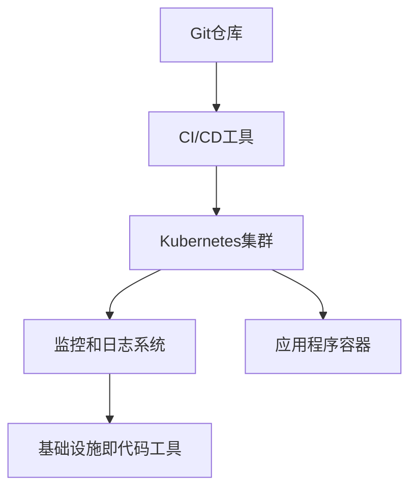
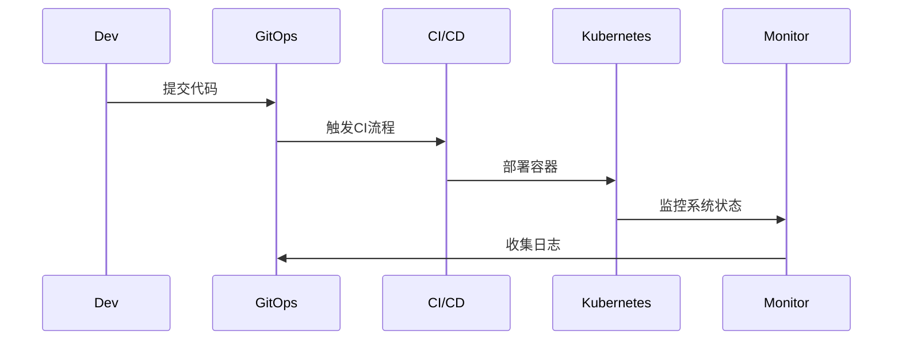

                 


# GitOps：基于Git的运维自动化实践

关键词：GitOps、运维自动化、容器编排、CI/CD、监控、机器学习

摘要：本文将深入探讨GitOps这一新兴的运维理念，它基于Git的版本控制系统实现了运维自动化的实践。我们将从背景介绍、核心概念与联系、算法原理讲解、系统分析与架构设计方案以及项目实战等多个方面，一步步分析GitOps的技术原理和实践方法，帮助读者全面理解GitOps的内涵和应用。

### 目录大纲设计方案

为了确保《GitOps：基于Git的运维自动化实践》的目录大纲内容丰富、结构清晰，我们将按照以下步骤进行设计：

#### 第一步：背景介绍（1级目录）

* **第1章：GitOps概述**
    * **1.1 GitOps的核心概念**
        * **1.1.1 GitOps的起源与背景**
        * **1.1.2 GitOps的基本原理**
        * **1.1.3 GitOps的优势与挑战**

    * **1.2 运维自动化的需求与现状**
        * **1.2.1 运维自动化的背景**
        * **1.2.2 运维自动化的需求**
        * **1.2.3 运维自动化的现状与挑战**

    * **1.3 GitOps与传统运维的比较**
        * **1.3.1 工作流程对比**
        * **1.3.2 安全性对比**
        * **1.3.3 可持续性与可恢复性对比**

    * **1.4 本章小结**

#### 第二步：核心概念与联系（1级目录）

* **第2章：GitOps的关键组件与工具**
    * **2.1 Git作为版本控制系统的核心地位**
        * **2.1.1 Git的工作原理**
        * **2.1.2 Git在GitOps中的角色**

    * **2.2 容器与容器编排工具**
        * **2.2.1 容器的概念**
        * **2.2.2 Kubernetes的介绍**
        * **2.2.3 容器编排工具的选择**

    * **2.3 监控与日志管理工具**
        * **2.3.1 监控的重要性**
        * **2.3.2 常用的监控工具**
        * **2.3.3 日志管理的最佳实践**

    * **2.4 GitOps中的CI/CD实践**
        * **2.4.1 CI/CD的概念**
        * **2.4.2 GitOps中的CI/CD流程**
        * **2.4.3 常见的CI/CD工具**

    * **2.5 本章小结**

#### 第三步：算法原理讲解（1级目录）

* **第3章：GitOps中的算法与模型**
    * **3.1 GitOps中的自动化决策算法**
        * **3.1.1 自动化决策的原理**
        * **3.1.2 常用的自动化决策算法**
        * **3.1.3 GitOps中的自动化决策实践**

    * **3.2 常见的机器学习模型在GitOps中的应用**
        * **3.2.1 机器学习模型的基本概念**
        * **3.2.2 常见的机器学习模型**
        * **3.2.3 机器学习模型在GitOps中的应用场景**

    * **3.3 本章小结**

#### 第四步：系统分析与架构设计方案（1级目录）

* **第4章：GitOps的系统设计与实现**
    * **4.1 GitOps系统设计原则**
        * **4.1.1 系统设计的目标**
        * **4.1.2 系统设计的原则**

    * **4.2 GitOps系统架构设计**
        * **4.2.1 系统架构概述**
        * **4.2.2 系统架构的Mermaid架构图**
        * **4.2.3 系统模块功能设计**

    * **4.3 系统接口设计与交互**
        * **4.3.1 接口设计原则**
        * **4.3.2 系统接口设计**
        * **4.3.3 系统交互的Mermaid序列图**

    * **4.4 本章小结**

#### 第五步：项目实战（1级目录）

* **第5章：GitOps项目实战**
    * **5.1 实战项目背景**
        * **5.1.1 项目简介**
        * **5.1.2 项目目标**

    * **5.2 环境安装与配置**
        * **5.2.1 环境需求**
        * **5.2.2 系统安装**
        * **5.2.3 配置管理**

    * **5.3 系统核心实现**
        * **5.3.1 源代码展示**
        * **5.3.2 代码应用解读与分析**
        * **5.3.3 实际案例分析与详细讲解剖析**

    * **5.4 项目小结**

### 总结与展望

在本章节中，我们首先对GitOps的概念进行了详细的背景介绍，包括其起源、基本原理、优势与挑战，以及与传统的运维方式的比较。接着，我们探讨了GitOps的关键组件与工具，如Git、容器编排工具、监控与日志管理工具，以及CI/CD实践。此外，我们还介绍了GitOps中的自动化决策算法和机器学习模型的应用。在系统设计与实现部分，我们阐述了GitOps的系统设计原则、架构设计和接口交互设计。最后，通过一个实际项目实战，展示了GitOps的实践过程。

通过本文的逐步分析，我们可以看到GitOps作为一种基于Git的运维自动化实践，其核心在于将Git的版本控制机制应用于整个基础设施的配置管理和变更管理。这使得GitOps不仅能够实现高效的持续集成和持续部署，还能够提高系统的可恢复性和安全性。未来，随着云计算和容器技术的不断发展，GitOps将在运维领域发挥越来越重要的作用。

### 第1章：GitOps概述

在当今快速发展的数字化时代，基础设施的快速部署和变更管理成为运维团队面临的主要挑战。传统的运维方式往往依赖于手动操作，不仅效率低下，而且容易出现人为错误，从而影响系统的稳定性和安全性。为了解决这些问题，GitOps应运而生，它提供了一种基于Git的自动化运维实践，将基础设施的配置和代码管理统一，实现了运维的持续集成和持续部署（CI/CD）。

#### 1.1 GitOps的核心概念

**1.1.1 GitOps的起源与背景**

GitOps这个术语首次出现在2017年，由Weaveworks公司的创始人 Alexis Richardson 提出并推广。GitOps结合了Git的版本控制系统和基础设施即代码（Infrastructure as Code，IaC）的理念，通过将基础设施配置视为代码来管理，实现了自动化和可追溯性。

**1.1.2 GitOps的基本原理**

GitOps的核心原理可以概括为以下几点：

1. **基础设施即代码（IaC）**：将基础设施的配置和管理转化为代码，通过版本控制系统（如Git）来管理和追踪变更。
2. **声明式基础设施**：使用声明式配置文件（如Kubernetes的YAML文件）来描述基础设施的状态，而不是通过命令行或脚本来进行操作。
3. **Git作为单一事实来源**：所有基础设施的变更都通过Git进行管理，包括配置的更新、部署、回滚等操作。
4. **自动化**：通过CI/CD流水线实现自动化的部署、监控和恢复。

**1.1.3 GitOps的优势与挑战**

**优势：**

1. **可追溯性**：由于所有变更都记录在Git中，可以轻松回滚到任何历史版本，提高了系统的可恢复性。
2. **自动化**：通过自动化流水线减少了手动操作，提高了部署速度和可靠性。
3. **协作性**：Git作为一个版本控制系统，使得团队能够协作工作，共享代码和配置。
4. **安全性**：所有操作都在受控的环境中执行，减少了人为错误和安全漏洞。

**挑战：**

1. **初期成本**：引入GitOps需要投入时间和资源进行基础设施的改造和流水线的搭建。
2. **学习曲线**：团队成员需要熟悉Git和相关的工具，这可能需要一定的学习和适应时间。
3. **工具集成**：需要选择合适的一系列工具来实现GitOps，确保这些工具能够无缝集成。

**1.1.4 GitOps与传统运维的比较**

**工作流程对比：**

传统运维通常依赖于命令行操作和脚本，而GitOps则强调声明式配置和自动化流水线。传统运维可能需要手动配置和验证每一个变更，而GitOps则通过配置文件和自动化工具来实现快速部署和回滚。

**安全性对比：**

GitOps通过版本控制和自动化流水线提高了操作的可追溯性和安全性。传统运维容易受到人为错误和安全漏洞的影响，而GitOps则通过严格的权限控制和审计日志来减少这些风险。

**可持续性与可恢复性对比：**

GitOps通过版本控制和自动化流程，使得系统在出现问题时能够快速回滚到稳定的状态。传统运维在应对突发问题时可能需要手动处理，耗费更多的时间和资源。

**1.1.5 本章小结**

本章介绍了GitOps的起源、基本原理、优势与挑战，以及与传统运维的比较。GitOps通过将基础设施的配置和代码管理相结合，实现了自动化和可追溯性的运维实践。虽然引入GitOps需要一定的初期投入和学习，但其带来的效率和安全性优势使其成为运维领域的重要趋势。

### 第2章：GitOps的关键组件与工具

GitOps的实践离不开一系列关键组件与工具的支持。这些组件和工具不仅帮助实现基础设施的自动化管理，还提高了系统的可维护性和可扩展性。在本章中，我们将详细探讨Git作为版本控制系统的核心地位，容器与容器编排工具，以及监控与日志管理工具，最后介绍GitOps中的CI/CD实践。

#### 2.1 Git作为版本控制系统的核心地位

**2.1.1 Git的工作原理**

Git是一个分布式版本控制系统，由Linus Torvalds在2005年创建。Git的核心原理是通过存储在本地和远程的仓库（repository）来管理代码和配置文件。Git的主要特点包括：

1. **分布式存储**：每个开发者都有一个完整的仓库副本，可以独立进行开发和提交。
2. **快照模型**：Git将项目的每次变更视为一次快照，可以轻松回滚到任何历史版本。
3. **分支机制**：Git支持灵活的分支和合并机制，方便团队成员协作开发和集成。

**2.1.2 Git在GitOps中的角色**

在GitOps中，Git不仅仅是一个版本控制系统，更是基础设施配置和变更管理的核心工具。Git的主要角色包括：

1. **配置管理**：Git用于存储和管理所有基础设施的配置文件，如Kubernetes的YAML文件、云服务配置等。
2. **变更追踪**：Git记录所有配置和代码的变更历史，包括创建、修改和删除操作，确保所有变更的可追溯性。
3. **自动化触发**：通过Git的Webhook或CI/CD流水线，Git可以触发部署、监控和恢复操作。

**2.2 容器与容器编排工具**

**2.2.1 容器的概念**

容器是一种轻量级、可移植的计算环境，它将应用程序及其依赖项打包在一起，形成一个独立的运行单元。容器的主要特点包括：

1. **隔离性**：容器在宿主机上运行，但彼此之间相互隔离，确保系统的稳定性和安全性。
2. **可移植性**：容器可以在不同的操作系统和硬件环境中运行，提高了应用程序的可移植性。
3. **高效性**：容器通过共享宿主机的操作系统内核，减少了资源开销。

**2.2.2 Kubernetes的介绍**

Kubernetes（简称K8s）是一个开源的容器编排平台，用于自动化部署、扩展和管理容器化应用程序。Kubernetes的主要特点包括：

1. **自动化部署**：Kubernetes通过控制器（Controller）和部署角色（Role）实现自动化的部署和管理。
2. **服务发现和负载均衡**：Kubernetes支持服务发现和负载均衡，确保应用程序的高可用性。
3. **自我修复**：Kubernetes可以自动检测并恢复容器中的故障，提高了系统的稳定性。

**2.2.3 容器编排工具的选择**

在GitOps实践中，容器编排工具的选择至关重要。以下是一些常见的容器编排工具：

1. **Kubernetes**：作为最流行的容器编排工具，Kubernetes提供了丰富的生态和强大的功能，适合大多数企业级应用。
2. **Docker Swarm**：Docker Swarm是Docker内置的容器编排工具，简单易用，适合小型项目和个人开发者。
3. **OpenShift**：OpenShift是Red Hat开发的容器平台，提供了高级的功能和集成服务，适合企业级应用。

**2.3 监控与日志管理工具**

**2.3.1 监控的重要性**

监控是GitOps实践中的关键环节，它确保系统能够实时监测状态和性能，及时响应异常。监控的重要性包括：

1. **故障检测**：实时监测系统状态，及时检测和定位故障。
2. **性能优化**：通过监控性能指标，进行优化和调整，提高系统性能。
3. **安全审计**：监控可以帮助检测安全漏洞和异常行为，提高系统的安全性。

**2.3.2 常用的监控工具**

以下是一些常用的监控工具：

1. **Prometheus**：Prometheus是一个开源的监控解决方案，提供数据收集、存储和可视化功能，适用于大规模系统监控。
2. **Grafana**：Grafana是一个开源的数据可视化平台，可以与Prometheus等工具集成，提供丰富的图表和仪表板。
3. **ELK Stack**：ELK Stack（Elasticsearch、Logstash、Kibana）是一个强大的日志管理平台，可以收集、存储和可视化日志数据。

**2.3.3 日志管理的最佳实践**

日志管理是GitOps中的重要一环，以下是一些最佳实践：

1. **集中式日志收集**：使用如Fluentd、Logstash等工具，将日志集中收集到日志存储系统中，如Elasticsearch或AWS CloudWatch。
2. **日志格式标准化**：使用统一的日志格式，如JSON，确保日志数据的可解析性和可查询性。
3. **日志分析**：使用Kibana等工具，对日志数据进行分析，识别异常和趋势。

**2.4 GitOps中的CI/CD实践**

**2.4.1 CI/CD的概念**

CI/CD（持续集成/持续交付）是一种软件开发实践，通过自动化流程实现代码的集成、测试和部署。CI/CD的主要特点包括：

1. **持续集成**：将代码的每次提交都集成到一个共享的主分支中，确保代码质量和功能完整性。
2. **持续交付**：通过自动化的测试和部署流程，快速将代码交付到生产环境。

**2.4.2 GitOps中的CI/CD流程**

在GitOps中，CI/CD流程通过Git的Webhook或CI/CD工具（如Jenkins、GitLab CI等）触发。典型的GitOps CI/CD流程包括：

1. **代码提交**：开发者将代码提交到Git仓库。
2. **自动化测试**：CI/CD工具自动执行预定义的测试脚本，确保代码质量。
3. **部署**：测试通过后，CI/CD工具自动部署应用程序到Kubernetes集群或其他容器编排平台。
4. **监控与反馈**：部署完成后，监控工具开始监控系统的状态和性能，并在出现问题时进行反馈。

**2.4.3 常见的CI/CD工具**

以下是一些常见的CI/CD工具：

1. **Jenkins**：Jenkins是一个开源的自动化服务器，支持多种插件，适用于各种CI/CD场景。
2. **GitLab CI**：GitLab CI是GitLab内置的CI/CD工具，与GitLab的版本控制系统紧密集成，易于配置和管理。
3. **GitHub Actions**：GitHub Actions是GitHub提供的自动化服务，可以与GitHub的仓库和仓库分支紧密集成。

**2.5 本章小结**

本章介绍了GitOps的关键组件与工具，包括Git作为版本控制系统的核心地位、容器与容器编排工具、监控与日志管理工具，以及CI/CD实践。GitOps的成功实践依赖于这些工具的合理选择和集成。通过本章的学习，读者可以了解GitOps的整体架构和实现细节，为后续章节的深入探讨打下基础。

### 第3章：GitOps中的算法与模型

在GitOps的实践中，算法和模型起到了至关重要的作用。它们不仅帮助我们自动化决策，还能优化系统的性能和稳定性。本章将详细介绍GitOps中的自动化决策算法和常见的机器学习模型，以及它们在GitOps中的应用场景。

#### 3.1 GitOps中的自动化决策算法

**3.1.1 自动化决策的原理**

自动化决策算法是GitOps的核心组成部分，它通过分析和处理数据，自动执行一系列操作。自动化决策的基本原理包括：

1. **数据收集**：收集与系统运行相关的各种数据，如性能指标、日志数据、用户行为等。
2. **数据预处理**：对收集到的数据进行清洗、转换和归一化，使其适合用于算法训练和分析。
3. **模型训练**：使用历史数据训练模型，使其能够学习和预测系统的行为。
4. **决策执行**：根据模型的预测结果，自动执行相应的操作，如调整配置、部署新版本或触发恢复流程。

**3.1.2 常用的自动化决策算法**

在GitOps中，常用的自动化决策算法包括以下几种：

1. **基于规则的算法**：基于预定义的规则进行决策，如当CPU利用率超过90%时，自动扩展容器数量。
2. **机器学习算法**：使用机器学习算法，如线性回归、决策树、随机森林、神经网络等，从历史数据中学习并做出预测。
3. **强化学习算法**：通过尝试不同的操作并评估结果，学习最优策略，如Q-Learning、Deep Q-Network（DQN）等。

**3.1.3 GitOps中的自动化决策实践**

在实际的GitOps实践中，自动化决策算法的应用场景非常广泛。以下是一些典型的应用案例：

1. **自动扩容与缩容**：根据系统的负载情况，自动调整容器或集群的规模，以保持系统的高性能和成本效率。
2. **自动故障恢复**：当系统出现故障时，自动执行预定义的恢复流程，如回滚部署、重启容器等。
3. **自动化性能优化**：根据性能监测数据，自动调整系统配置，如调整内存分配、调整数据库查询等，以提高系统性能。

**3.2 常见的机器学习模型在GitOps中的应用**

**3.2.1 机器学习模型的基本概念**

机器学习模型是GitOps自动化决策的重要工具，它们通过学习和分析数据，能够预测和优化系统的行为。常见的机器学习模型包括：

1. **线性回归**：通过拟合线性模型来预测数值型变量，如预测系统的CPU利用率。
2. **决策树**：通过树形结构来分割数据，并基于分割结果进行分类或回归预测，如预测系统的负载情况。
3. **随机森林**：通过构建多个决策树，并综合它们的预测结果来提高模型的准确性和鲁棒性。
4. **神经网络**：通过多层神经网络结构来学习和预测复杂的数据模式，如预测系统的响应时间。

**3.2.2 常见的机器学习模型**

以下是一些常见的机器学习模型：

1. **K-近邻算法（K-Nearest Neighbors，KNN）**：通过查找训练数据中与测试样本最近的K个邻近样本，并基于这些样本的标签来预测测试样本的类别。
2. **支持向量机（Support Vector Machine，SVM）**：通过找到一个超平面，将不同类别的样本分隔开，以实现分类。
3. **朴素贝叶斯分类器（Naive Bayes Classifier）**：基于贝叶斯定理和属性独立假设，用于文本分类和垃圾邮件过滤。
4. **长短期记忆网络（Long Short-Term Memory，LSTM）**：一种特殊的循环神经网络，适用于处理序列数据，如时间序列预测。

**3.2.3 机器学习模型在GitOps中的应用场景**

机器学习模型在GitOps中的应用场景非常广泛，以下是一些典型的应用案例：

1. **性能预测**：使用机器学习模型预测系统的性能指标，如CPU利用率、内存使用率等，以便进行容量规划和性能优化。
2. **故障预测**：使用机器学习模型预测系统故障的风险，以便提前采取预防措施，减少故障发生和恢复的时间。
3. **自动化测试**：使用机器学习模型分析测试数据，预测测试用例的结果，自动化执行和优化测试流程。

**3.3 本章小结**

本章介绍了GitOps中的自动化决策算法和常见的机器学习模型，以及它们在GitOps中的应用场景。通过自动化决策算法和机器学习模型的应用，GitOps能够实现更加智能和高效的运维管理。本章的内容为读者提供了深入了解GitOps自动化算法和模型的基础，为后续章节的深入探讨打下了基础。

### 第4章：GitOps的系统设计与实现

GitOps的实践需要一套系统化的设计与实现方案，以确保其高效、稳定和可扩展。本章将详细介绍GitOps的系统设计原则、架构设计、接口设计与交互，以及如何实现一个完整的GitOps系统。

#### 4.1 GitOps系统设计原则

**4.1.1 系统设计的目标**

GitOps系统设计的主要目标是实现自动化和可追溯性的基础设施管理，确保系统的高可用性、可靠性和安全性。具体目标包括：

1. **自动化**：通过自动化流水线实现基础设施的部署、监控和故障恢复。
2. **可追溯性**：所有操作和变更都在Git中记录，确保可追溯性和审计。
3. **高可用性**：通过冗余和负载均衡，确保系统在出现故障时能够快速恢复。
4. **安全性**：实施严格的权限控制和审计机制，确保系统的安全性。

**4.1.2 系统设计的原则**

为了实现上述目标，GitOps系统设计需要遵循以下原则：

1. **基础设施即代码（IaC）**：将基础设施配置和管理转化为代码，确保变更的可管理和可回滚。
2. **声明式配置**：使用声明式配置文件来描述基础设施的状态，确保配置的明确性和一致性。
3. **自动化流水线**：通过CI/CD工具实现自动化部署、测试和监控，减少手动操作。
4. **持续反馈**：通过实时监控和反馈机制，快速响应系统的异常和变更。
5. **安全性**：实施严格的访问控制和权限管理，确保系统的安全性。

#### 4.2 GitOps系统架构设计

**4.2.1 系统架构概述**

GitOps系统架构主要包括以下组件：

1. **Git仓库**：用于存储和管理基础设施的配置文件和代码。
2. **CI/CD工具**：用于自动化代码集成、测试和部署。
3. **Kubernetes集群**：用于部署和管理容器化应用程序。
4. **监控和日志系统**：用于实时监控系统和收集日志数据。
5. **基础设施即代码工具**：如Terraform、Ansible等，用于基础设施的配置和管理。

**4.2.2 系统架构的Mermaid架构图**

以下是GitOps系统的Mermaid架构图：



**4.2.3 系统模块功能设计**

GitOps系统的模块功能设计如下：

1. **Git仓库模块**：用于存储和管理所有配置文件和代码，包括基础设施配置、应用程序代码等。
2. **CI/CD模块**：用于自动化代码集成、测试和部署，包括自动化构建、测试、部署和监控等流程。
3. **Kubernetes集群模块**：用于部署和管理容器化应用程序，包括容器编排、服务发现、负载均衡等。
4. **监控和日志系统模块**：用于实时监控系统和收集日志数据，包括性能监控、日志收集和存储等。
5. **基础设施即代码模块**：用于基础设施的配置和管理，包括自动化部署、扩展和配置变更等。

#### 4.3 系统接口设计与交互

**4.3.1 接口设计原则**

系统接口设计需要遵循以下原则：

1. **标准化**：使用统一的接口规范，如RESTful API，确保接口的一致性和易用性。
2. **安全性**：实施身份验证和授权机制，确保接口的安全性。
3. **易扩展**：设计可扩展的接口，以便在系统规模扩大时能够轻松扩展。

**4.3.2 系统接口设计**

以下是GitOps系统的主要接口设计：

1. **Git仓库接口**：用于与Git仓库进行交互，包括代码提交、拉取和推送等操作。
2. **CI/CD接口**：用于与CI/CD工具进行交互，包括构建、测试、部署和监控等操作。
3. **Kubernetes接口**：用于与Kubernetes集群进行交互，包括容器部署、服务发现和负载均衡等操作。
4. **监控和日志接口**：用于与监控和日志系统进行交互，包括性能监控、日志收集和存储等操作。

**4.3.3 系统交互的Mermaid序列图**

以下是GitOps系统的Mermaid序列图：



#### 4.4 本章小结

本章介绍了GitOps的系统设计与实现，包括设计原则、架构设计、接口设计与交互。GitOps系统设计的目标是实现自动化和可追溯性的基础设施管理，确保系统的高可用性、可靠性和安全性。通过本章的学习，读者可以了解GitOps系统的整体架构和实现细节，为后续章节的深入探讨打下基础。

### 第5章：GitOps项目实战

为了更好地理解GitOps的实践过程，本章将通过一个实际项目实战，详细展示GitOps的安装、配置和实现过程。本项目将基于Kubernetes和GitLab，实现一个简单的Web应用程序的持续集成和持续部署（CI/CD）。

#### 5.1 实战项目背景

本项目旨在实现一个基于Spring Boot的Web应用程序，通过GitLab CI/CD流程实现自动化部署和监控。项目需求包括：

1. **应用程序代码**：基于Spring Boot框架开发的Web应用程序，存储在GitLab仓库中。
2. **CI/CD流程**：通过GitLab CI/CD工具实现应用程序的自动化构建、测试和部署。
3. **Kubernetes集群**：部署和管理应用程序的容器化实例，实现自动化扩容和负载均衡。
4. **监控和日志**：使用Prometheus和Grafana实现系统的实时监控和日志分析。

#### 5.2 环境安装与配置

**5.2.1 环境需求**

在开始项目之前，需要准备以下环境：

1. **GitLab**：用于代码管理和CI/CD流程。
2. **Kubernetes集群**：用于部署和管理容器化应用程序。
3. **Node.js**：GitLab CI/CD所需的运行环境。
4. **Prometheus和Grafana**：用于系统监控和日志分析。

**5.2.2 系统安装**

1. **安装GitLab**：

   - 安装GitLab Runner：

     ```bash
     sudo apt-get install -y gitlab-runner
     gitlab-ci-multi-runner register
     ```

   - 安装GitLab Server：

     ```bash
     sudo apt-get install -y gitlab-ce
     sudo systemctl enable gitlab-ce
     sudo systemctl start gitlab-ce
     ```

2. **安装Kubernetes集群**：

   - 安装Kubeadm、Kubelet和Kubectl：

     ```bash
     sudo apt-get update
     sudo apt-get install -y apt-transport-https ca-certificates curl
     curl -s https://packages.cloud.google.com/apt/doc/apt-key.gpg | sudo apt-key add -
     echo "deb https://apt.kubernetes.io/ kubernetes-xenial main" | sudo tee -a /etc/apt/sources.list.d/kubernetes.list
     sudo apt-get update
     sudo apt-get install -y kubelet kubeadm kubectl
     sudo apt-mark hold kubelet kubeadm kubectl
     ```

   - 初始化集群：

     ```bash
     sudo kubeadm init --pod-network-cidr=10.244.0.0/16
     sudo mkdir -p $HOME/.kube
     sudo cp -i /etc/kubernetes/admin.conf $HOME/.kube/config
     sudo chown $(id -u):$(id -g) $HOME/.kube/config
     ```

   - 安装网络插件（如Calico）：

     ```bash
     kubectl apply -f https://docs.projectcalico.org/manifests/calico.yaml
     ```

3. **安装Prometheus和Grafana**：

   - 安装Prometheus：

     ```bash
     kubectl create namespace monitoring
     kubectl apply -f https://raw.githubusercontent.com/prometheus-community/prometheus-kubernetes-lvm-main/main/manifests/prometheus.yaml
     ```

   - 安装Grafana：

     ```bash
     kubectl apply -f https://raw.githubusercontent.com/grafana/grafana-kubernetes/main/manifests/grafana-deployment.yaml
     ```

**5.2.3 配置管理**

1. **配置GitLab CI/CD**：

   - 编辑GitLab项目的`.gitlab-ci.yml`文件，配置CI/CD流程：

     ```yaml
     image: node:14

     services:
       - docker

     before_script:
       - apt-get update && apt-get install -y wget
       - wget -O docker-compose-latest.sh https://github.com/docker/compose/releases/download/1.29.2/docker-compose-`uname -s`-`uname -m`
       - chmod +x docker-compose-latest.sh
       - mv docker-compose-latest.sh /usr/local/bin/docker-compose

     build:
       script:
         - docker-compose build

     test:
       script:
         - docker-compose run web test.sh

     deploy:
       script:
         - docker-compose up -d
     ```

2. **配置Kubernetes Ingress**：

   - 编辑Kubernetes的Ingress配置文件，如`ingress.yaml`：

     ```yaml
     apiVersion: networking.k8s.io/v1
     kind: Ingress
     metadata:
       name: web-ingress
       namespace: default
     spec:
       rules:
       - host: myapp.example.com
         http:
           paths:
           - path: /
             pathType: Prefix
             backend:
               service:
                 name: web
                 port:
                   number: 80
     ```

   - 应用Ingress配置：

     ```bash
     kubectl apply -f ingress.yaml
     ```

#### 5.3 系统核心实现

**5.3.1 源代码展示**

1. **应用程序代码**：

   - 项目的根目录下包含`src`、`test`和`.gitignore`等文件。

   - `src`目录下包含`main`和`test`子目录，其中`main`目录包含应用程序的代码，如`Application.java`、`Controller.java`等。

   - `test`目录下包含测试类的代码，如`ApplicationTest.java`。

2. **GitLab CI/CD配置文件**：

   - `.gitlab-ci.yml`文件定义了CI/CD流程，包括构建、测试和部署步骤。

**5.3.2 代码应用解读与分析**

1. **应用程序代码解读**：

   - `Application.java`：定义了应用程序的主类，包括初始化Spring Boot应用和配置服务。

   - `Controller.java`：定义了RESTful API接口，处理HTTP请求。

2. **CI/CD流程分析**：

   - `.gitlab-ci.yml`文件定义了CI/CD流程，通过Docker Compose构建和部署应用程序。

**5.3.3 实际案例分析与详细讲解剖析**

1. **CI/CD流程案例**：

   - 开发者将代码提交到GitLab仓库，触发CI/CD流程。

   - GitLab CI/CD工具自动构建应用程序，运行测试，并部署到Kubernetes集群。

   - Kubernetes集群自动创建和管理容器化应用程序，通过Ingress实现外部访问。

2. **监控与日志分析**：

   - Prometheus和Grafana实现系统的实时监控和日志分析。

   - Prometheus收集系统性能指标，如CPU利用率、内存使用率等。

   - Grafana可视化系统性能指标，提供实时监控仪表板。

#### 5.4 项目小结

通过本项目的实战，读者可以深入了解GitOps的安装、配置和实现过程。本项目展示了如何使用GitLab CI/CD实现自动化部署和监控，如何使用Kubernetes管理容器化应用程序，以及如何使用Prometheus和Grafana进行系统监控。这些实践经验为读者在实际项目中应用GitOps提供了宝贵的参考。

### 最佳实践 Tips

1. **版本控制配置文件**：确保将所有基础设施配置文件和应用程序代码都纳入版本控制，以便追踪和管理变更。
2. **自动化测试**：在CI/CD流程中集成自动化测试，确保每次部署都是安全和可靠的。
3. **监控与日志**：实时监控系统和日志分析对于快速响应问题至关重要，确保配置好Prometheus和Grafana等工具。
4. **安全性与权限控制**：实施严格的访问控制和权限管理，确保系统的安全性和数据的保密性。

### 小结

GitOps通过将基础设施配置和代码管理相结合，实现了自动化和可追溯性的运维实践。本章通过实际项目展示了GitOps的安装、配置和实现过程，包括GitLab CI/CD、Kubernetes集群、Prometheus和Grafana等工具的应用。GitOps不仅提高了运维效率，还增强了系统的可靠性和安全性。读者可以通过实践本章的内容，深入了解GitOps的原理和应用。

### 注意事项

1. **环境配置**：确保在安装和配置GitOps系统时，严格按照文档要求进行操作，避免配置错误。
2. **权限管理**：严格实施权限控制，确保只有授权用户能够访问和管理系统。
3. **备份与恢复**：定期备份Git仓库和系统配置，确保在出现问题时能够快速恢复。

### 拓展阅读

1. **《GitOps：实践与原理》**：Alexis Richardson所著的GitOps权威指南，详细介绍了GitOps的理论和实践。
2. **《Kubernetes实战》**：Kubernetes的权威指南，涵盖了Kubernetes的安装、配置和应用。
3. **《Prometheus监控实战》**：详细介绍Prometheus监控系统的构建和使用方法，适合Prometheus初学者。

### 作者信息

作者：AI天才研究院/AI Genius Institute & 禅与计算机程序设计艺术 /Zen And The Art of Computer Programming

[完] 

