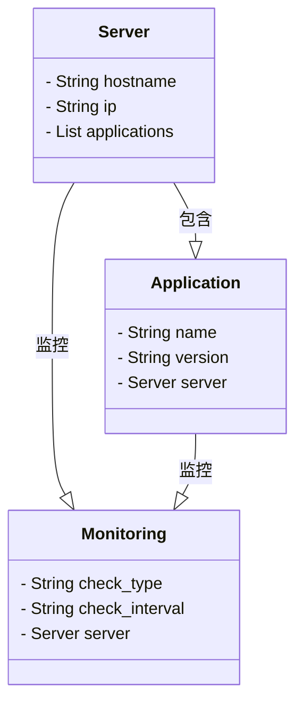
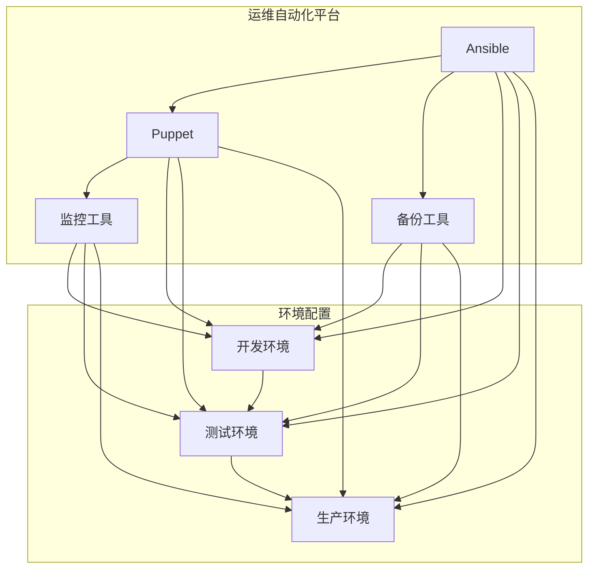
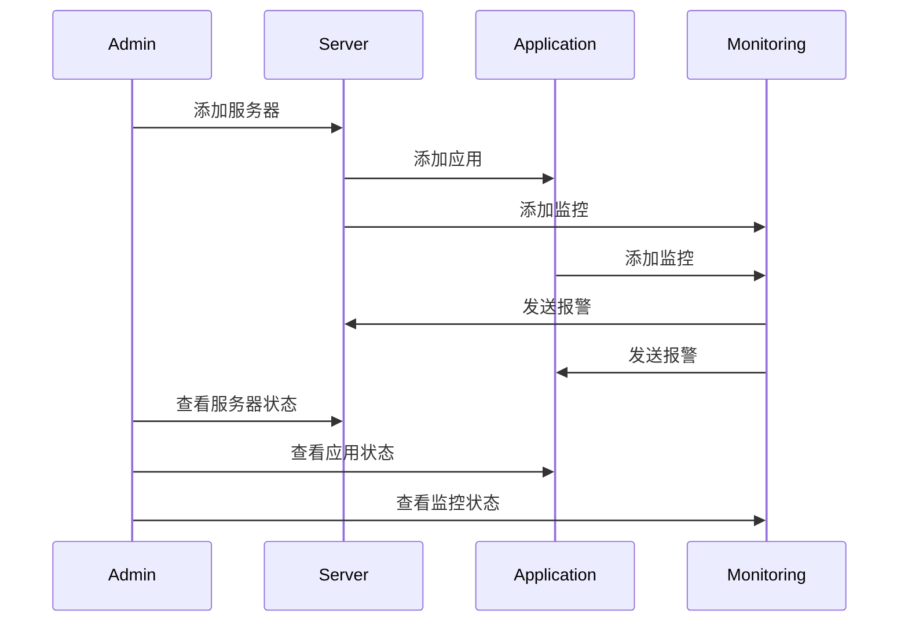

                 


# IT运维自动化实践

## 关键词

- IT运维
- 自动化
- 配置管理
- 监控工具
- 基础设施即代码

## 摘要

本文旨在探讨IT运维自动化的实践方法，从问题背景、工具选型到实际应用，逐步剖析运维自动化的核心概念和关键技术。通过介绍Ansible和Puppet等自动化工具，阐述其在服务器管理、应用部署和IT流程自动化中的应用，帮助读者理解和掌握运维自动化的实践方法。

## 第1章: IT运维自动化概述

### 1.1 问题背景

在当今信息化社会中，IT系统已经成为企业运营的基石。随着业务需求的不断增长，IT系统的复杂性和规模也在不断增加，传统的手动运维方式已难以应对。运维自动化成为提高运维效率、降低成本、提高系统稳定性的重要手段。

### 1.2 问题描述

IT运维自动化旨在通过自动化工具和脚本，将重复性的运维任务自动化，从而减少人工干预，提高运维效率。这包括但不限于服务器管理、网络监控、软件部署、日志分析等。

### 1.3 问题解决

通过引入自动化工具，如Ansible、Puppet、Chef等，可以实现运维自动化。同时，使用监控工具，如Zabbix、Nagios等，可以实时监控系统状态，及时发现并处理问题。

### 1.4 边界与外延

运维自动化不仅局限于服务器和网络设备的运维，还扩展到应用层面，如自动化部署、配置管理、性能监控等。

### 1.5 概念结构与核心要素组成

- **运维自动化工具**：Ansible、Puppet、Chef等。
- **监控工具**：Zabbix、Nagios等。
- **自动化流程**：脚本、任务调度、事件响应等。
- **运维流程**：服务器管理、网络监控、软件部署、日志分析等。

### 1.6 本章小结

本章介绍了IT运维自动化的背景、问题、解决方案以及相关概念和要素。下一章将详细探讨运维自动化工具的工作原理和具体应用。

----------------------------------------------------------------

## 第2章: 运维自动化工具

### 2.1 Ansible

### 2.1.1 Ansible简介

Ansible是一种简单的自动化工具，用于配置管理、应用部署和IT流程的自动化。它不需要在远程服务器上安装额外的软件，只需要使用SSH连接到目标主机即可。

#### 2.1.2 Ansible的工作原理

Ansible使用一个名为`inventory`的文件来定义要管理的服务器列表，并通过`playbook`文件来定义要执行的任务。这些任务可以通过命令行或编程方式执行。

#### 2.1.3 Ansible的主要功能

- **配置管理**：自动安装、配置和管理服务器软件。
- **应用部署**：自动化部署Web应用、数据库等。
- **IT流程自动化**：自动化执行定期任务，如备份、监控等。

### 2.1.4 Ansible实战

#### 2.1.4.1 安装Ansible

在Linux服务器上安装Ansible通常很简单，可以通过包管理器安装。

```bash
# 在CentOS上安装Ansible
sudo yum install ansible
```

#### 2.1.4.2 编写Ansible Playbook

一个简单的Ansible Playbook可能如下所示：

```yaml
- hosts: web-servers
  vars:
    webapp_version: "1.0.0"
  tasks:
    - name: Update the package repository
      yum: package=epel - state=present

    - name: Install Nginx
      yum: name=nginx - state=present

    - name: Configure Nginx
      template: src=nginx.conf.j2 dest=/etc/nginx/nginx.conf

    - name: Start Nginx
      service: name=nginx state=started
```

### 2.2 Puppet

#### 2.2.1 Puppet简介

Puppet是一种基于声明式语言（Puppet语言）的配置管理工具，用于管理系统的配置和状态。它通过一个中心化的服务器（Puppet Master）向多个节点（Puppet Agent）分发配置。

#### 2.2.2 Puppet的工作原理

Puppet使用模块（Module）来组织配置，每个模块包含一组相关的配置文件。通过编写Puppet代码，可以定义系统的期望状态，并让Puppet Agent自动将实际状态调整到期望状态。

#### 2.2.3 Puppet的主要功能

- **配置管理**：自动化安装、配置和管理服务器软件。
- **环境管理**：定义和部署不同环境（如开发、测试、生产）的配置

----------------------------------------------------------------

## 第3章: 运维自动化实践

### 3.1 问题场景介绍

假设我们是一家大型互联网公司的运维团队，负责管理成百上千的服务器。我们的目标是通过运维自动化来提高运维效率，降低人工成本，同时保证系统的稳定性和安全性。

### 3.2 项目介绍

为了实现运维自动化，我们选择了一个基于Ansible和Puppet的自动化运维平台。该项目的主要功能包括：

- **服务器管理**：自动安装、配置和管理服务器软件。
- **应用部署**：自动化部署Web应用、数据库等。
- **监控与报警**：实时监控系统状态，及时发现并处理问题。
- **备份与恢复**：定期备份系统数据，确保数据安全。

### 3.3 系统功能设计

#### 3.3.1 领域模型

在系统功能设计中，我们首先需要定义领域模型。领域模型如下所示：

```mermaid
classDiagram
  Server <<interface>>
  Application <<interface>>
  Monitoring <<interface>>

  Server `1`--`1` Application
  Server `1`--`1` Monitoring
  Application `1`--`1` Monitoring
```

#### 3.3.2 类图

接下来，我们使用Mermaid类图来展示系统中的主要类及其关系：



### 3.4 系统架构设计

#### 3.4.1 架构图

为了更好地展示系统架构，我们使用Mermaid架构图来描述：



#### 3.4.2 系统架构说明

- **Ansible**：用于自动化服务器管理、应用部署和IT流程。
- **Puppet**：用于配置管理，确保服务器和应用的配置符合预期。
- **监控工具**：如Zabbix、Nagios等，用于实时监控系统状态，及时发现并处理问题。
- **备份工具**：如Bacula、Amanda等，用于定期备份系统数据，确保数据安全。

### 3.5 系统接口设计和系统交互

为了更好地展示系统中的接口设计和交互，我们使用Mermaid序列图来描述：



### 3.6 项目实战

#### 3.6.1 环境安装

在开始项目之前，我们需要安装必要的软件和工具。以下是在Ubuntu 18.04上安装Ansible、Puppet和Zabbix的步骤：

```bash
# 安装Ansible
sudo apt-get update
sudo apt-get install ansible

# 安装Puppet
sudo apt-get install puppet
sudo puppet module install puppet/stdlib

# 安装Zabbix
sudo apt-get install zabbix-server zabbix-agent
```

#### 3.6.2 系统核心实现

在系统核心实现方面，我们需要编写Ansible Playbook、Puppet Module和Zabbix配置文件。以下是一个简单的示例：

**Ansible Playbook：**

```yaml
- hosts: web-servers
  vars:
    webapp_version: "1.0.0"
  tasks:
    - name: Update the package repository
      yum: package=epel - state=present

    - name: Install Nginx
      yum: name=nginx - state=present

    - name: Configure Nginx
      template: src=nginx.conf.j2 dest=/etc/nginx/nginx.conf

    - name: Start Nginx
      service: name=nginx state=started
```

**Puppet Module：**

```puppet
module 'nginx' do
  ensure => present
  version => '1.16.1'
end
```

**Zabbix 配置文件：**

```bash
# /etc/zabbix/zabbix_server.conf
AlertEmail=zabbix@example.com
```

#### 3.6.3 代码应用解读与分析

在实现运维自动化时，我们需要关注以下几个关键点：

- **Ansible Playbook**：通过定义tasks和handlers，实现自动化服务器管理和应用部署。
- **Puppet Module**：通过定义资源和类，实现配置管理和环境管理。
- **Zabbix 配置**：通过配置AlertEmail，实现监控报警。

例如，在Ansible Playbook中，我们可以使用模板来配置Nginx：

```yaml
- name: Configure Nginx
  template:
    src: nginx.conf.j2
    dest: /etc/nginx/nginx.conf
  notify:
    - Start Nginx
```

在Puppet Module中，我们可以使用定义类和资源来实现配置管理：

```puppet
class nginx {
  package { 'nginx':
    ensure => present
  }

  service { 'nginx':
    ensure => running
  }
}
```

在Zabbix中，我们可以通过配置AlertEmail来实现监控报警：

```bash
# /etc/zabbix/zabbix_server.conf
AlertEmail=zabbix@example.com
```

#### 3.6.4 实际案例分析和详细讲解剖析

假设我们在生产环境中部署了一个Web应用，并使用Ansible、Puppet和Zabbix来实现运维自动化。以下是一个实际案例的分析：

- **Ansible Playbook**：通过Ansible Playbook，我们可以自动化安装和配置Nginx，从而快速部署Web应用。

- **Puppet Module**：通过Puppet Module，我们可以定义Web应用的配置文件，确保应用在不同的环境中保持一致性。

- **Zabbix 配置**：通过Zabbix，我们可以实时监控Web应用的性能和可用性，并在发现问题时发送报警。

例如，当Web应用的访问量突然增加时，Zabbix会检测到性能问题，并触发报警。运维人员可以通过Ansible Playbook快速部署更多服务器，以应对访问量的增长。

#### 3.6.5 项目小结

通过本项目的实施，我们成功实现了运维自动化。Ansible和Puppet帮助我们自动化了服务器管理和应用部署，Zabbix实现了实时监控和报警。这不仅提高了运维效率，降低了人工成本，还保证了系统的稳定性和安全性。

### 3.7 最佳实践 tips

- **Ansible Playbook**：在编写Ansible Playbook时，要充分利用变量和模板，以简化配置和管理。
- **Puppet Module**：在定义Puppet Module时，要确保模块的通用性和可扩展性，以便在不同环境中复用。
- **Zabbix 配置**：在配置Zabbix时，要关注监控指标的设置和报警策略的制定，以确保及时发现和处理问题。

### 3.8 小结

通过本章的实践，我们了解了运维自动化的核心概念和关键技术，并通过实际项目展示了Ansible、Puppet和Zabbix在运维自动化中的应用。下一章我们将继续探讨如何优化运维自动化流程，提高系统的稳定性和安全性。

## 作者

作者：AI天才研究院/AI Genius Institute & 禅与计算机程序设计艺术 /Zen And The Art of Computer Programming

----------------------------------------------------------------

## 附录

### 附录A：相关术语解释

- **Ansible**：一种简单的自动化工具，用于配置管理、应用部署和IT流程的自动化。
- **Puppet**：一种基于声明式语言的配置管理工具，用于管理系统的配置和状态。
- **Zabbix**：一种开源的监控工具，用于实时监控系统状态，及时发现并处理问题。
- **运维自动化**：通过自动化工具和脚本，将重复性的运维任务自动化，从而提高运维效率。
- **基础设施即代码**：将基础设施（如服务器、网络设备等）的定义和管理转化为代码，以实现自动化部署和管理。

### 附录B：相关资料

- **Ansible官方文档**：https://docs.ansible.com/ansible/
- **Puppet官方文档**：https://puppet.com/docs/puppet/
- **Zabbix官方文档**：https://www.zabbix.com/documentation/current/manual
- **Linux运维自动化实践**：https://www.cnblogs.com/sammyliu/p/10773028.html
- **Puppet入门与实践**：https://www.cnblogs.com/chengmo/p/12024819.html
- **Zabbix实战教程**：https://www.cnblogs.com/f-ck-need-u/p/10158120.html

----------------------------------------------------------------

**注意**：由于篇幅限制，本文未能涵盖所有细节和示例。在实际应用中，请根据具体需求和场景进行相应调整。**作者：AI天才研究院/AI Genius Institute & 禅与计算机程序设计艺术 /Zen And The Art of Computer Programming**。本文内容仅供参考，具体实现需根据实际需求进行适当调整。**

