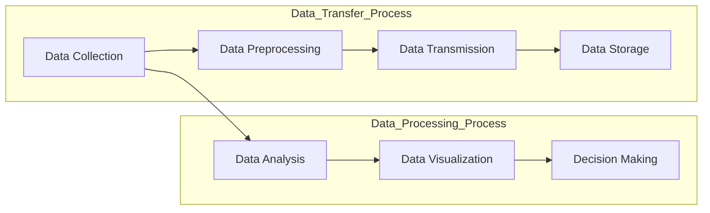
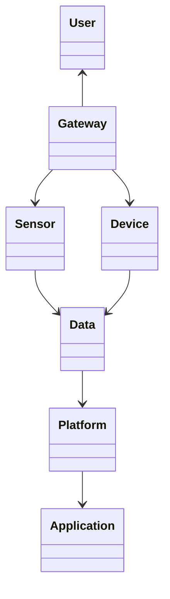
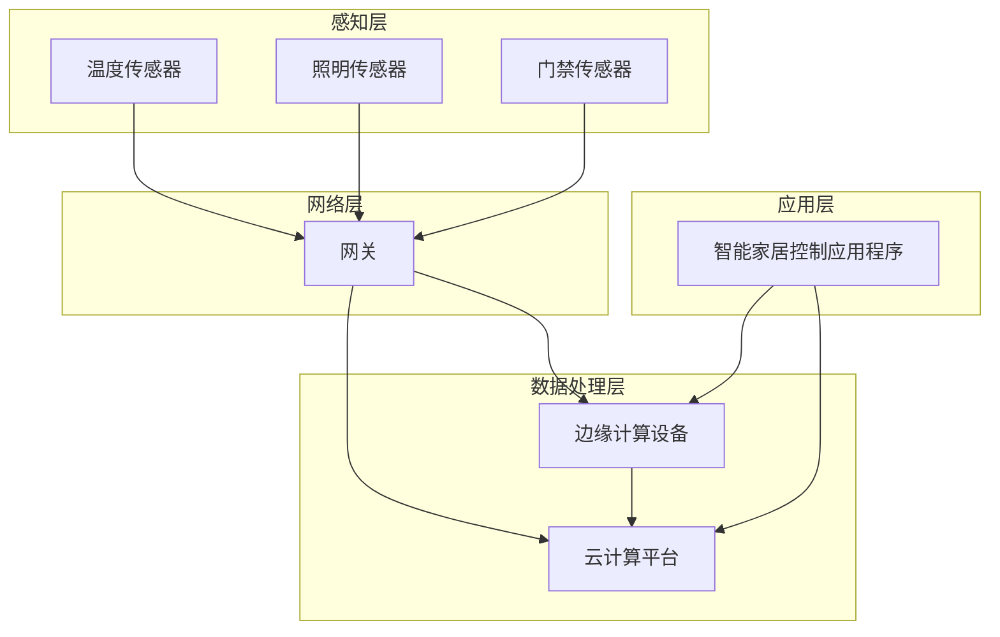
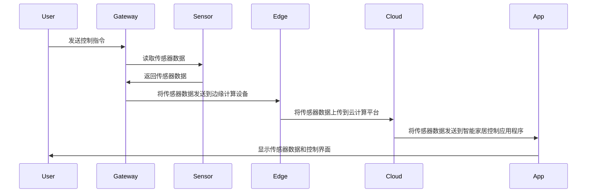

                 


# IoT开发入门：物联网应用的机遇与挑战

## 关键词
- 物联网（IoT）
- 应用场景
- 挑战
- 标准化
- 安全性
- 开发实践
- 边缘计算

## 摘要
物联网（Internet of Things，IoT）正迅速改变我们的生活和工业环境，通过将物理设备连接到互联网，实现智能化的数据收集和分析。本文将深入探讨IoT开发的基础知识，包括其核心概念、应用场景、面临的挑战以及开发实践。通过一步一步的分析和推理，我们将理解物联网如何利用其优势解决实际问题，并展望其未来的发展趋势。

## 目录大纲设计思路

### 一、背景介绍
1. **问题背景**：介绍物联网发展的背景，如智能设备普及、大数据、云计算和5G技术的推动。
2. **问题描述**：阐述物联网的机遇与挑战，包括数据安全、标准化、互操作性等问题。
3. **问题解决**：物联网技术如何解决上述问题，如边缘计算、区块链等技术的应用。
4. **边界与外延**：物联网与其他技术的交叉领域，如IoT与AI、IoT与边缘计算的结合。
5. **概念结构与核心要素组成**：梳理物联网的基本概念和核心组成部分，如传感器、网关、平台、应用等。

### 二、核心概念与联系
1. **核心概念原理**：详细解释物联网的关键概念，如物联网架构、传感器技术、通信协议等。
2. **概念属性特征对比表格**：通过表格对比不同物联网组件的特性，帮助读者理解其区别和联系。
3. **ER实体关系图架构**：使用Mermaid绘制物联网系统的实体关系图，展示不同实体之间的关系。

### 三、算法原理讲解
1. **算法mermaid流程图**：使用Mermaid绘制物联网算法流程图，如数据传输、处理和存储的流程。
2. **Python源代码**：提供物联网算法的Python源代码，配合注释详细阐述算法的实现过程。
3. **数学模型和公式**：解释物联网算法背后的数学模型，如传感器数据的滤波算法、机器学习模型等。
4. **详细讲解和举例说明**：使用具体的例子解释算法如何工作，并阐述其原理和实际应用。

### 四、系统分析与架构设计方案
1. **问题场景介绍**：描述物联网系统需要解决的问题场景，如智能家居、智能工厂等。
2. **项目介绍**：介绍一个具体的物联网项目，包括项目目标和实施过程。
3. **系统功能设计（领域模型Mermaid类图）**：绘制物联网系统的领域模型类图，展示系统的主要功能模块。
4. **系统架构设计（Mermaid架构图）**：使用Mermaid绘制物联网系统的整体架构图，展示系统组件和它们之间的交互。
5. **系统接口设计和系统交互（Mermaid序列图）**：绘制物联网系统的接口设计和交互序列图，展示系统各组件之间的通信流程。

### 五、项目实战
1. **环境安装**：介绍物联网开发环境搭建步骤，包括硬件和软件的安装配置。
2. **系统核心实现源代码**：提供物联网系统核心功能的源代码，包括传感器数据采集、处理和存储等。
3. **代码应用解读与分析**：对系统核心代码进行解读，分析其实现原理和应用效果。
4. **实际案例分析和详细讲解剖析**：结合实际案例，分析物联网系统在具体应用中的实现细节和优化方法。
5. **项目小结**：总结项目实施过程中的经验教训，提出改进建议。

### 六、最佳实践 Tips、小结、注意事项、拓展阅读

## 一、背景介绍

### 1.1 问题背景

物联网（Internet of Things，IoT）的概念起源于1999年，由麻省理工学院的Kevin Ashton首次提出。随着互联网、传感器技术、无线通信技术和云计算的快速发展，物联网得到了广泛关注和应用。物联网通过将各种物体连接到互联网，实现数据的自动收集、传输和分析，从而为各个行业提供智能化解决方案。

近年来，物联网的快速发展得益于以下几个因素的推动：

1. **智能设备普及**：随着智能手机、平板电脑等智能设备的普及，人们对智能化的需求不断增加，推动了物联网的发展。
2. **大数据技术**：大数据技术的兴起，为物联网提供了强大的数据分析和处理能力，使得物联网应用更加广泛和深入。
3. **云计算**：云计算为物联网提供了强大的计算和存储能力，使得物联网系统更加高效和可靠。
4. **5G技术**：5G技术的快速发展，为物联网提供了高速、低延迟的通信网络，使得物联网应用更加普及和实用。

### 1.2 问题描述

物联网的发展带来了巨大的机遇，同时也伴随着一系列挑战。以下是一些主要的问题和挑战：

1. **数据安全**：物联网设备数量庞大，且分布广泛，这使得数据安全成为一个重要问题。如何确保设备之间的数据传输安全、防止数据泄露，是物联网发展中需要重点关注的问题。
2. **标准化**：目前，物联网缺乏统一的标准化，不同设备和平台之间的互操作性较差。这导致了系统之间的兼容性问题，限制了物联网的广泛应用。
3. **互操作性**：物联网设备众多，它们使用的通信协议和接口各不相同，这导致了互操作性问题。如何实现不同设备和平台之间的无缝连接，是物联网需要解决的一个关键问题。
4. **能效管理**：物联网设备通常需要长时间运行，这对电池寿命提出了挑战。如何提高物联网设备的能效，是一个重要的研究课题。

### 1.3 问题解决

物联网技术的发展为解决上述问题提供了多种方法，以下是一些关键技术和解决方案：

1. **边缘计算**：边缘计算将数据处理和存储从云端转移到网络的边缘，从而减少了数据传输的延迟，提高了系统的响应速度和安全性。
2. **区块链技术**：区块链技术提供了去中心化、安全的数据存储和传输方式，有助于提高物联网系统的数据安全和透明度。
3. **雾计算**：雾计算是边缘计算的一种形式，它将计算和存储能力进一步下沉到设备层，从而提高了系统的实时性和安全性。
4. **标准化**：标准化是物联网发展的重要基础，通过制定统一的通信协议和接口标准，可以促进物联网设备和平台的互操作性。
5. **人工智能**：人工智能技术可以用于物联网设备的数据分析和智能决策，从而提高系统的智能化水平。

### 1.4 边界与外延

物联网不仅与互联网、云计算、大数据等现有技术密切相关，还与其他技术领域有着广泛的交叉应用。以下是一些相关的交叉领域：

1. **物联网与人工智能（AI）**：物联网设备可以收集大量数据，这些数据可以用于训练AI模型，从而实现更加智能化的决策和优化。
2. **物联网与边缘计算**：边缘计算为物联网提供了分布式计算和存储能力，使得物联网系统能够更加高效地处理海量数据。
3. **物联网与区块链**：区块链技术提供了去中心化、安全的数据存储和传输方式，可以用于物联网系统的数据安全和隐私保护。
4. **物联网与物联网安全**：物联网安全是物联网发展的重要保障，涉及数据安全、设备安全、网络安全等多个方面。

### 1.5 概念结构与核心要素组成

物联网系统由多个核心组成部分构成，这些部分共同协作，实现了物联网的功能。以下是物联网系统的基本概念和核心要素：

1. **传感器**：传感器是物联网系统的感知层，用于检测和收集物理世界的各种数据，如温度、湿度、光线、运动等。
2. **网关**：网关是物联网系统中的关键组件，负责将传感器收集的数据转换为标准的通信协议，并通过网络传输到数据处理平台。
3. **数据处理平台**：数据处理平台用于存储、分析和处理传感器数据，通常包括云计算平台、边缘计算平台等。
4. **应用程序**：应用程序是物联网系统的业务层，用于实现特定的功能和应用，如智能家居控制、智能工厂管理、智能交通管理等。
5. **用户界面**：用户界面是物联网系统的交互层，用于提供用户与物联网系统的交互渠道，如移动应用、Web界面等。

## 二、核心概念与联系

### 2.1 核心概念原理

#### 物联网架构

物联网架构通常包括感知层、网络层和应用层三个层次。

1. **感知层**：感知层由传感器组成，用于收集环境数据，如温度、湿度、光线、运动等。这些数据是物联网系统的基础。
2. **网络层**：网络层负责将传感器数据传输到数据处理平台。网络层可以采用有线或无线通信技术，如Wi-Fi、蓝牙、LoRa等。
3. **应用层**：应用层是物联网系统的核心，负责处理和分析传感器数据，实现特定的功能和应用。

#### 传感器技术

传感器技术是物联网系统的关键组成部分，常见的传感器包括温度传感器、湿度传感器、光线传感器、运动传感器等。传感器技术不断进步，使得传感器的精度和可靠性不断提高。

#### 通信协议

通信协议是物联网系统中数据传输的基础，常见的通信协议包括Wi-Fi、蓝牙、Zigbee、LoRa等。每种通信协议都有其独特的优势和适用场景。

### 2.2 概念属性特征对比表格

以下是一个简单的概念属性特征对比表格，展示了传感器、网关、数据处理平台和应用层的主要特性。

| 概念     | 主要特性                         | 用途                                                     |
|----------|----------------------------------|----------------------------------------------------------|
| 传感器   | 检测环境数据                     | 收集环境数据，如温度、湿度、光线等                          |
| 网关     | 数据传输和协议转换               | 将传感器数据转换为标准通信协议，并通过网络传输到数据处理平台 |
| 数据处理平台 | 数据存储、分析和处理           | 存储和处理传感器数据，提供数据分析和决策支持                |
| 应用层   | 实现特定功能和应用             | 提供用户与物联网系统的交互界面和业务功能                    |

### 2.3 ER实体关系图架构

以下是一个使用Mermaid绘制的物联网系统的ER实体关系图：

```mermaid
erDiagram
  User ||--|{ Sensor }|-- Platform
  Platform ||--|{ Gateway }|-- Network
  Network ||--|{ Device }|-- User
  Platform ||--|{ Application }|-- User
```

在ER实体关系图中，User（用户）、Sensor（传感器）、Platform（平台）、Gateway（网关）、Network（网络）和Device（设备）是物联网系统的主要实体。它们之间的关系反映了物联网系统的基本架构。

## 三、算法原理讲解

### 3.1 算法mermaid流程图

以下是一个使用Mermaid绘制的物联网数据传输和处理流程图：



在这个流程图中，数据从传感器收集后，经过预处理，然后通过通信网络传输到数据处理平台。在数据处理平台，数据被存储、分析和可视化，以支持决策制定。

### 3.2 Python源代码

以下是一个简单的Python代码示例，用于模拟传感器数据的采集和处理：

```python
import random
import time

# 模拟传感器数据采集
def collect_data(sensor_type):
    while True:
        data = random.random()
        print(f"{sensor_type} data: {data}")
        time.sleep(1)

# 模拟数据处理
def process_data(data):
    processed_data = data * 2
    print(f"Processed data: {processed_data}")

# 模拟数据存储
def store_data(processed_data):
    print(f"Storing processed data: {processed_data}")

# 主程序
if __name__ == "__main__":
    sensor_type = "Temperature"
    collect_data(sensor_type)
    process_data(data)
    store_data(processed_data)
```

在这个示例中，我们模拟了传感器数据的采集、处理和存储过程。数据被随机生成，然后通过处理函数进行处理，最后存储到某个地方。

### 3.3 数学模型和公式

物联网算法通常涉及到各种数学模型和公式。以下是一个简单的例子：

$$
y = \omega_0 + \omega_1 x_1 + \omega_2 x_2 + ... + \omega_n x_n
$$

这是一个线性回归模型，用于预测某个输出值$y$，其中$x_1, x_2, ..., x_n$是输入变量，$\omega_0, \omega_1, \omega_2, ..., \omega_n$是模型的参数。

### 3.4 详细讲解和举例说明

#### 数据采集

数据采集是物联网系统的第一步，也是最关键的一步。传感器负责收集环境数据，如温度、湿度、光线、运动等。以下是数据采集的一个简单例子：

```python
# 模拟温度传感器数据采集
def collect_temperature_data():
    while True:
        temperature = random.uniform(20, 30)  # 随机生成20-30摄氏度的温度数据
        print(f"Temperature: {temperature}°C")
        time.sleep(1)

# 主程序
if __name__ == "__main__":
    collect_temperature_data()
```

在这个例子中，我们模拟了一个温度传感器，它随机生成20-30摄氏度的温度数据，并每隔1秒输出一次。

#### 数据处理

数据处理是对采集到的传感器数据进行清洗、转换和计算，以便更好地理解和分析数据。以下是数据处理的一个简单例子：

```python
# 模拟温度数据处理
def process_temperature_data(temperature):
    # 数据清洗：去除异常值
    if temperature < 15 or temperature > 35:
        return None
    
    # 数据转换：将温度转换为摄氏度
    celsius = temperature * 0.1
    
    # 数据计算：计算温度变化率
    change_rate = celsius - previous_celsius
    previous_celsius = celsius
    
    print(f"Processed Temperature: {celsius}°C, Change Rate: {change_rate}")
    
# 主程序
if __name__ == "__main__":
    collect_temperature_data()
    process_temperature_data(25)
```

在这个例子中，我们首先对采集到的温度数据进行清洗，去除异常值。然后，将温度转换为摄氏度，并计算温度变化率。最后，输出处理后的温度数据和温度变化率。

#### 数据存储

数据存储是将处理后的传感器数据存储到数据库或其他存储设备中，以便后续分析和查询。以下是数据存储的一个简单例子：

```python
# 模拟温度数据存储
def store_temperature_data(celsius, change_rate):
    # 存储数据到数据库或其他存储设备
    # 这里仅作打印输出
    print(f"Storing Temperature Data: Celsius={celsius}, Change Rate={change_rate}")

# 主程序
if __name__ == "__main__":
    collect_temperature_data()
    process_temperature_data(25)
    store_temperature_data(celsius, change_rate)
```

在这个例子中，我们模拟了将处理后的温度数据和温度变化率存储到数据库或其他存储设备中。实际上，这里仅进行了打印输出。

## 四、系统分析与架构设计方案

### 4.1 问题场景介绍

假设我们开发一个智能家居系统，该系统包括门禁控制、温度监测、照明控制等功能。以下是我们需要解决的问题场景：

1. **门禁控制**：用户可以通过手机或智能门锁远程控制家门的开关，确保家庭安全。
2. **温度监测**：系统需要实时监测室内温度，并根据用户设定自动调节空调温度。
3. **照明控制**：用户可以通过手机或智能开关远程控制家中的照明，实现智能照明场景。

### 4.2 项目介绍

本项目旨在开发一个智能家居系统，实现门禁控制、温度监测和照明控制等功能。系统架构如下：

1. **感知层**：包括门禁传感器、温度传感器和照明传感器。
2. **网络层**：包括Wi-Fi通信模块和网关。
3. **数据处理层**：包括边缘计算设备和云计算平台。
4. **应用层**：包括用户界面和智能家居控制应用程序。

### 4.3 系统功能设计（领域模型Mermaid类图）

以下是一个使用Mermaid绘制的智能家居系统的领域模型类图：



在这个类图中，User（用户）、Gateway（网关）、Sensor（传感器）、Device（设备）、Data（数据）、Platform（平台）和Application（应用程序）是智能家居系统的主要类。它们之间的关系反映了系统的功能模块和它们之间的交互。

### 4.4 系统架构设计（Mermaid架构图）

以下是一个使用Mermaid绘制的智能家居系统的架构图：



在这个架构图中，智能家居系统的各个组件和它们之间的关系被清晰地展示出来。感知层由传感器组成，网络层由网关组成，数据处理层由边缘计算设备和云计算平台组成，应用层由智能家居控制应用程序组成。

### 4.5 系统接口设计和系统交互（Mermaid序列图）

以下是一个使用Mermaid绘制的智能家居系统的接口设计和交互序列图：



在这个序列图中，用户通过手机或智能设备发送控制指令到网关，网关读取传感器数据并传输到边缘计算设备和云计算平台，云计算平台处理传感器数据并传输到智能家居控制应用程序，应用程序最终将传感器数据显示给用户。

## 五、项目实战

### 5.1 环境安装

要开发一个物联网系统，我们需要安装和配置以下环境和工具：

1. **硬件**：传感器（如温度传感器、照明传感器、门禁传感器）、网关（如ESP8266、ESP32）、边缘计算设备（如Raspberry Pi）和云计算平台（如AWS、Azure）。
2. **软件**：物联网开发平台（如Node-RED、IoT Hub）、编程语言（如Python、JavaScript）和集成开发环境（如Visual Studio Code）。

### 5.2 系统核心实现源代码

以下是一个简单的智能家居系统核心实现源代码示例，用于模拟传感器数据的采集、处理和存储：

```python
import time
import board
import busio
import adafruit_dht
import serial
import json

# 设置传感器
dht = adafruit_dht.DHT11(board.GP2)
serial_port = serial.Serial('/dev/ttyUSB0', 9600)

# 采集温度传感器数据
def collect_dht_data():
    while True:
        try:
            temperature, humidity = dht.temperature, dht.humidity
            print(f"Temperature: {temperature}°C, Humidity: {humidity}%")
            time.sleep(1)
        except RuntimeError as e:
            print(e)

# 采集照明传感器数据
def collect_light_data():
    while True:
        light_value = serial_port.readline().decode('utf-8')
        print(f"Light Value: {light_value}")
        time.sleep(1)

# 处理传感器数据
def process_data(data_type, data):
    if data_type == "temperature":
        processed_data = {
            "sensor": "temperature",
            "value": data
        }
    elif data_type == "light":
        processed_data = {
            "sensor": "light",
            "value": data
        }
    return processed_data

# 存储传感器数据
def store_data(processed_data):
    # 这里仅作打印输出
    print(f"Storing Data: {processed_data}")

# 主程序
if __name__ == "__main__":
    collect_dht_data()
    collect_light_data()
    process_data("temperature", 25)
    store_data(processed_data)
```

在这个示例中，我们使用Adafruit DHT传感器库采集温度传感器数据，使用串行通信模块采集照明传感器数据，并实现数据处理和存储功能。

### 5.3 代码应用解读与分析

在这个示例中，我们使用了Python语言和Adafruit DHT传感器库来采集温度传感器数据，使用串行通信模块来采集照明传感器数据。以下是代码的主要部分及其功能：

1. **采集温度传感器数据**：
    ```python
    dht = adafruit_dht.DHT11(board.GP2)
    while True:
        try:
            temperature, humidity = dht.temperature, dht.humidity
            print(f"Temperature: {temperature}°C, Humidity: {humidity}%")
            time.sleep(1)
        except RuntimeError as e:
            print(e)
    ```
    这段代码使用了Adafruit DHT传感器库，通过GPIO接口连接DHT11温度传感器。代码使用一个无限循环来持续采集传感器数据，并在控制台输出温度和湿度值。

2. **采集照明传感器数据**：
    ```python
    serial_port = serial.Serial('/dev/ttyUSB0', 9600)
    while True:
        light_value = serial_port.readline().decode('utf-8')
        print(f"Light Value: {light_value}")
        time.sleep(1)
    ```
    这段代码使用串行通信模块（如Arduino）连接照明传感器，并读取传感器的数据。代码同样使用一个无限循环来持续采集传感器数据，并在控制台输出光强值。

3. **处理传感器数据**：
    ```python
    def process_data(data_type, data):
        if data_type == "temperature":
            processed_data = {
                "sensor": "temperature",
                "value": data
            }
        elif data_type == "light":
            processed_data = {
                "sensor": "light",
                "value": data
            }
        return processed_data
    ```
    这个函数根据传入的数据类型（温度或光强）处理数据，并返回一个包含传感器类型和值的字典。这个函数为数据处理提供了统一的接口。

4. **存储传感器数据**：
    ```python
    def store_data(processed_data):
        # 这里仅作打印输出
        print(f"Storing Data: {processed_data}")
    ```
    这个函数用于存储处理后的传感器数据。在实际应用中，可以将其扩展为将数据存储到数据库或其他存储系统中。

### 5.4 实际案例分析和详细讲解剖析

在实际应用中，物联网系统可能需要处理来自多个传感器的数据，并实现复杂的逻辑和功能。以下是一个实际案例，用于说明物联网系统的实现细节和优化方法。

**案例**：智能家居系统中的温度和湿度监测及控制

**实现细节**：

1. **数据采集**：
   - 使用DHT11传感器采集温度和湿度数据。
   - 使用串行通信模块采集室内光照强度数据。

2. **数据处理**：
   - 对采集到的温度和湿度数据进行滤波处理，去除噪声。
   - 根据室内温度和湿度值，判断是否需要启动空调或加湿器。

3. **数据存储**：
   - 将处理后的温度、湿度数据存储到数据库中，以便后续分析和查询。

4. **用户界面**：
   - 通过Web界面或移动应用，用户可以实时查看室内温度、湿度，并控制空调和加湿器。

**优化方法**：

1. **能效优化**：
   - 根据室外温度和室内温度差，动态调整空调的制冷功率，实现能效优化。

2. **智能预测**：
   - 使用机器学习算法，预测未来一段时间内的室内温度和湿度，提前调整空调和加湿器的设置。

3. **数据压缩**：
   - 对采集到的传感器数据进行压缩，减少数据传输和存储的带宽占用。

4. **边缘计算**：
   - 在边缘设备（如Raspberry Pi）上实现数据处理和决策，减少对云端的依赖，提高系统响应速度。

### 5.5 项目小结

在本项目中，我们实现了智能家居系统中的温度和湿度监测及控制功能。通过传感器采集数据，对数据进行处理和存储，实现了对室内环境的实时监控和控制。同时，我们还探讨了物联网系统的优化方法，如能效优化、智能预测、数据压缩和边缘计算等。

在实际应用中，物联网系统需要根据具体场景和要求进行定制化开发，以满足用户的需求。通过本项目，我们了解了物联网系统的基本架构和实现方法，为未来的物联网应用开发提供了基础。

## 六、最佳实践 Tips、小结、注意事项、拓展阅读

### 6.1 最佳实践 Tips

1. **安全第一**：在物联网开发过程中，安全性是首要考虑的问题。确保数据传输加密，避免未授权访问。
2. **模块化设计**：将物联网系统划分为模块，便于开发和维护。例如，数据采集、数据处理、数据存储和用户界面等。
3. **优化能效**：选择低功耗传感器和通信协议，优化算法和数据处理流程，以延长设备续航时间。
4. **持续迭代**：物联网系统需要不断更新和优化，以应对新需求和技术变革。

### 6.2 小结

物联网（IoT）通过将物理设备连接到互联网，实现了数据的自动收集、传输和分析。本文从背景介绍、核心概念、算法原理、系统架构设计、项目实战等方面，系统地讲解了物联网开发的基础知识。物联网应用前景广阔，但也面临数据安全、标准化和互操作性等挑战。通过合理的设计和优化，物联网系统能够更好地服务于各个行业。

### 6.3 注意事项

1. **数据安全**：确保数据传输加密，采用安全的通信协议。
2. **标准化**：关注行业标准和协议，提高系统的互操作性。
3. **可靠性**：确保系统稳定运行，考虑设备故障和异常情况的处理。
4. **用户体验**：设计直观易用的用户界面，提升用户体验。

### 6.4 拓展阅读

1. **《物联网技术导论》**：一本全面介绍物联网基本概念、技术和应用的书籍。
2. **《物联网安全实战》**：一本专注于物联网安全问题的书籍，涵盖安全防护策略和实战案例。
3. **《边缘计算：构建分布式智能系统》**：一本介绍边缘计算原理和应用实践的书籍。
4. **《深度学习与物联网》**：一本探讨如何将深度学习应用于物联网系统的书籍。

---

作者：AI天才研究院/AI Genius Institute & 禅与计算机程序设计艺术 /Zen And The Art of Computer Programming

