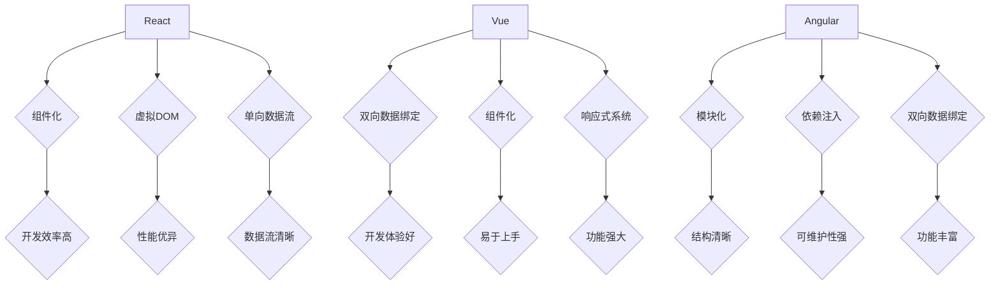
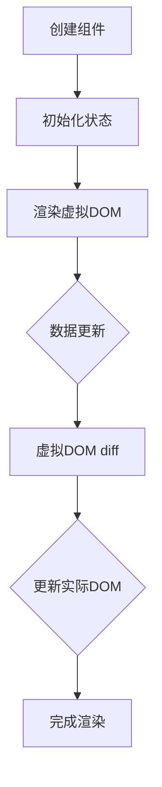
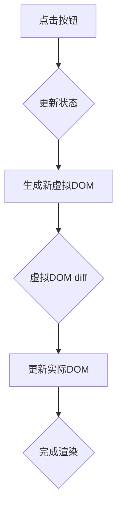
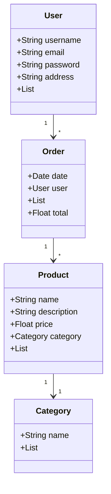
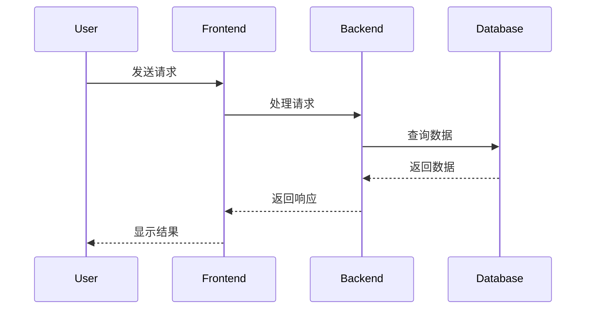
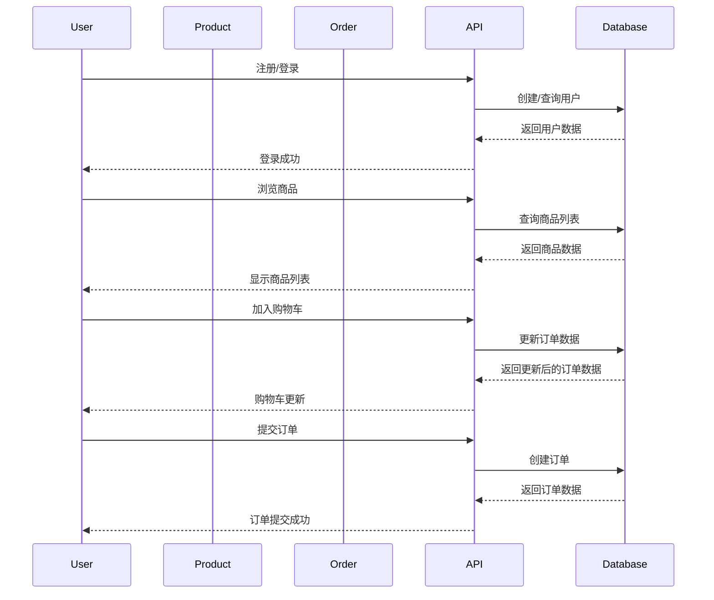
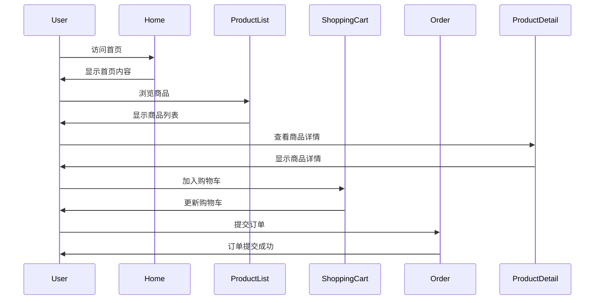

                 

**引言**

在当今的软件开发领域，JavaScript框架的选择成为了一个至关重要的决定因素。React、Vue和Angular是目前最流行的三大JavaScript框架，它们各自拥有独特的优势和特点，适用于不同的项目需求。本文将深入探讨这三个框架的优缺点，帮助读者更好地理解它们，从而做出合适的选择。

**关键词**

- JavaScript框架
- React
- Vue
- Angular
- 框架选择
- 开发效率
- 学习曲线
- 性能

**摘要**

本文将首先介绍React、Vue和Angular这三个JavaScript框架的起源和发展历程，然后详细分析它们的核心理念、特点和应用场景。接着，我们将对比这三个框架的编程风格、学习曲线和性能，最后通过一个实际案例展示如何选择合适的框架。通过本文的阅读，读者将能够全面了解这些框架，为自己的项目选择最合适的工具。

---

## 第1章: JavaScript框架的发展历程

**1.1 JavaScript框架的起源**

JavaScript框架的出现是为了解决前端开发的复杂性和代码复用问题。随着互联网技术的发展，前端应用变得越来越复杂，开发者需要一种更好的方式来组织和管理代码。早期的JavaScript开发主要依赖于库（如jQuery）和脚本，但随着单页应用（SPA）的兴起，开发者开始寻求更高级的解决方案。

**1.2 React、Vue和Angular的诞生**

- **React**：由Facebook在2013年推出，旨在提高前端开发的效率和性能。React引入了组件化开发和虚拟DOM，使开发者能够以更高效的方式构建动态用户界面。

- **Vue**：由尤雨溪在2014年创建，它以简洁和易于上手著称。Vue的设计理念是易于理解和快速上手，同时提供了强大的功能和灵活的配置。

- **Angular**：由Google在2016年推出，是基于Google多年前端开发经验的基础上发展而来的。Angular提供了完整的解决方案，包括模块化、依赖注入和双向数据绑定。

**1.3 三大框架的演进**

随着时间的推移，React、Vue和Angular都在不断演进，引入了更多的功能和优化。它们不仅在前端开发中占据重要地位，也在移动应用和服务器端渲染（SSR）等方面有所涉猎。

---

**核心概念与联系**

在深入讨论React、Vue和Angular之前，我们先来了解一下这三个框架的核心概念和联系。

### 核心概念

- **React**：组件化开发、虚拟DOM、单向数据流
- **Vue**：双向数据绑定、组件化开发、响应式系统
- **Angular**：依赖注入、模块化、双向数据绑定

### 概念属性特征对比表格

| 框架 | 特点1 | 特点2 | 特点3 |
| --- | --- | --- | --- |
| React | 组件化 | 虚拟DOM | 单向数据流 |
| Vue | 双向数据绑定 | 组件化 | 响应式系统 |
| Angular | 模块化 | 依赖注入 | 双向数据绑定 |

### ER实体关系图架构的Mermaid流程图



---

**背景介绍**

JavaScript框架的发展历程可以追溯到早期开发者对代码复用和复杂应用管理的需求。随着互联网的快速发展，Web应用变得越来越复杂，开发者需要更好的工具来组织和管理这些应用。React、Vue和Angular正是在这样的背景下诞生的。

### 问题背景

在Web应用开发中，开发者常常面临以下问题：

- **代码复用**：如何将代码模块化，提高开发效率？
- **性能优化**：如何提高应用的性能，保证用户体验？
- **开发体验**：如何降低学习成本，提高开发效率？

### 问题描述

React、Vue和Angular分别是如何解决这些问题的？它们各自的核心理念和特点是什么？

### 问题解决

React通过组件化和虚拟DOM解决了代码复用和性能优化的问题；Vue以其简洁和双向数据绑定提高了开发体验；Angular则提供了完整的模块化解决方案，确保了代码的结构清晰和可维护性。

### 边界与外延

每个框架都有其适用的场景和局限性。例如，React适合大型单页应用，Vue适合快速开发和中小型项目，Angular适合需要高可靠性和复杂业务逻辑的企业级应用。

### 概念结构与核心要素组成

每个框架的核心概念和要素如下：

- **React**：组件、虚拟DOM、状态管理
- **Vue**：组件、双向数据绑定、响应式系统
- **Angular**：模块、依赖注入、服务、指令

---

**算法原理讲解**

在深入探讨React、Vue和Angular之前，我们需要了解它们的核心算法原理。

### React的算法原理

**组件化**：React通过组件化的方式将UI划分为多个可复用的部分。每个组件都有自己的状态和生命周期方法。

**虚拟DOM**：React使用虚拟DOM来提高性能。当状态发生变化时，React会生成一个新的虚拟DOM树，并将其与旧树进行比较，找出差异并更新实际的DOM。

**单向数据流**：React的数据流是单向的，从父组件到子组件。这种数据流使得状态管理和数据传递变得简单和可预测。

### Vue的算法原理

**双向数据绑定**：Vue通过数据劫持和发布-订阅模式实现双向数据绑定。当数据变化时，视图会自动更新；当视图发生变化时，数据也会更新。

**响应式系统**：Vue通过观察者模式实现响应式系统。当数据变化时，相关组件会重新渲染。

**组件化**：Vue也支持组件化开发，使得代码更加模块化和可复用。

### Angular的算法原理

**模块化**：Angular通过模块化组织代码，确保每个模块的职责清晰，便于维护和扩展。

**依赖注入**：Angular使用依赖注入来管理组件之间的依赖关系，使得代码更加可测试和可维护。

**双向数据绑定**：Angular使用脏检查机制来实现双向数据绑定。在每次视图渲染时，Angular会检查数据是否发生变化，并根据需要进行更新。

### Mermaid流程图

以下是对React组件渲染过程的Mermaid流程图：



### Python源代码

```python
class Component:
    def __init__(self, state):
        self.state = state
        self虚拟DOM = self.render()

    def render(self):
        return f"<div>{self.state}</div>"

    def update_state(self, new_state):
        self.state = new_state
        self虚拟DOM = self.render()
        self.diff_and_update()

    def diff_and_update(self):
        old_DOM = self虚拟DOM
        new_DOM = self.render()
        diff = compute_diff(old_DOM, new_DOM)
        update_DOM(diff)

def compute_diff(old_DOM, new_DOM):
    # 实现虚拟DOM的差异计算
    pass

def update_DOM(diff):
    # 实现实际DOM的更新
    pass
```

### 算法原理详细讲解

**React的组件化**：React的组件化使得开发者可以将UI划分为多个独立的部分。每个组件都有自己的状态和生命周期方法。这种组件化方式提高了代码的可复用性和可维护性。

**虚拟DOM**：虚拟DOM是React的一个核心概念。它是一个轻量级的JavaScript对象，代表了实际的DOM结构。当组件的状态发生变化时，React会生成一个新的虚拟DOM树，并将其与旧的虚拟DOM树进行比较。这个过程称为虚拟DOM diff。通过diff算法，React可以找出新旧DOM之间的差异，并只更新实际DOM中需要变化的部分，从而提高性能。

**单向数据流**：React的数据流是单向的，从父组件到子组件。这种数据流使得状态管理和数据传递变得简单和可预测。父组件可以通过props将数据传递给子组件，而子组件则通过回调函数将数据传递给父组件。

**Vue的双向数据绑定**：Vue通过数据劫持和发布-订阅模式实现双向数据绑定。数据劫持是指Vue通过Object.defineProperty()方法监听对象的属性变化。当属性发生变化时，Vue会触发对应的更新函数。发布-订阅模式是指Vue将视图和数据的更新过程解耦，通过事件来触发视图的更新。

**Vue的响应式系统**：Vue使用观察者模式实现响应式系统。当数据变化时，相关组件会重新渲染。Vue会遍历数据的每个属性，为每个属性添加getter和setter，当属性发生变化时，getter会触发观察者更新视图。

**Angular的模块化**：Angular通过模块化组织代码，确保每个模块的职责清晰，便于维护和扩展。Angular将应用拆分为多个模块，每个模块都有自己的组件、服务、管道等。

**依赖注入**：Angular使用依赖注入来管理组件之间的依赖关系。依赖注入是一种控制反转（IoC）的机制，它允许开发者将组件的依赖关系从组件内部转移到外部管理。通过依赖注入，组件可以更轻松地测试和扩展。

**双向数据绑定**：Angular使用脏检查机制来实现双向数据绑定。脏检查是指在每次视图渲染时，Angular会检查数据是否发生变化，并根据需要进行更新。脏检查通过一个循环遍历组件的属性，比较新旧值，如果发生变化，则触发更新。

**举例说明**

假设我们有一个React组件，其中包含一个计数器。当用户点击按钮时，计数器的值会增加。以下是React组件的源代码：

```jsx
import React, { useState } from "react";

function Counter() {
  const [count, setCount] = useState(0);

  return (
    <div>
      <h1>计数器: {count}</h1>
      <button onClick={() => setCount(count + 1)}>增加</button>
    </div>
  );
}

export default Counter;
```

当用户点击按钮时，React组件的状态（count）会更新。React会生成一个新的虚拟DOM树，并将其与旧的虚拟DOM树进行比较。通过diff算法，React可以发现新旧DOM之间的差异，并只更新实际DOM中需要变化的部分。



---

**系统分析与架构设计方案**

为了更好地理解React、Vue和Angular的架构设计，我们将通过一个实际的项目场景进行讲解。

### 问题场景介绍

假设我们正在开发一个在线购物平台，需要实现用户注册、商品浏览、购物车管理和订单处理等功能。

### 项目介绍

项目名称：Online Shopping Platform

项目目标：构建一个功能齐全、性能优异的在线购物平台。

### 系统功能设计（领域模型Mermaid类图）

以下是一个简化的领域模型，展示了在线购物平台的关键实体和关系：



### 系统架构设计（Mermaid架构图）

以下是一个简化的系统架构图，展示了关键组件和它们的交互关系：



### 系统接口设计（Mermaid序列图）

以下是一个简化的接口设计，展示了用户、商品、订单等实体的主要操作：



### 系统交互（Mermaid序列图）

以下是一个简化的用户交互流程，展示了用户在购物平台上的主要操作：



---

**项目实战**

为了更好地展示如何选择合适的JavaScript框架，我们将通过一个实际案例来进行分析。

### 环境安装

在本地环境中安装Node.js（版本建议为最新稳定版），然后使用npm全局安装React、Vue和Angular。

```bash
npm install -g create-react-app
npm install -g @vue/cli
npm install -g @angular/cli
```

### 系统核心实现源代码

#### React实现

```jsx
// App.js
import React, { useState } from "react";
import "./styles.css";

function App() {
  const [count, setCount] = useState(0);

  return (
    <div className="App">
      <h1>React计数器</h1>
      <h2>{count}</h2>
      <button onClick={() => setCount(count + 1)}>增加</button>
    </div>
  );
}

export default App;
```

```css
/* styles.css */
.App {
  text-align: center;
}
```

#### Vue实现

```vue
<!-- App.vue -->
<template>
  <div id="app">
    <h1>Vue计数器</h1>
    <h2>{{ count }}</h2>
    <button @click="increment">增加</button>
  </div>
</template>

<script>
import Vue from "vue";

export default new Vue({
  data() {
    return {
      count: 0,
    };
  },
  methods: {
    increment() {
      this.count++;
    },
  },
});
</script>

<style>
#app {
  font-family: Avenir, Helvetica, Arial, sans-serif;
  -webkit-font-smoothing: antialiased;
  -moz-osx-font-smoothing: grayscale;
  text-align: center;
  color: #2c3e50;
  margin-top: 60px;
}
</style>
```

#### Angular实现

```typescript
// app.component.ts
import { Component } from '@angular/core';

@Component({
  selector: 'app-root',
  templateUrl: './app.component.html',
  styleUrls: ['./app.component.css']
})
export class AppComponent {
  count = 0;

  increment() {
    this.count++;
  }
}

// app.component.html
<div class="App">
  <h1>Angular计数器</h1>
  <h2>{{ count }}</h2>
  <button (click)="increment()">增加</button>
</div>

// app.component.css
.App {
  text-align: center;
}
```

### 代码应用解读与分析

#### React

React的实现非常简单，通过`useState`钩子管理状态，并在按钮点击事件中更新状态。React的组件化使得代码易于维护和复用。

#### Vue

Vue的实现也非常直观，使用数据绑定和事件处理更新状态。Vue的双向数据绑定使得开发者无需关心状态管理，提高了开发效率。

#### Angular

Angular的实现稍微复杂一些，需要定义一个组件类并使用`increment`方法更新状态。Angular的依赖注入使得组件的测试和扩展更加方便。

### 实际案例分析和详细讲解剖析

我们选择了一个简单的计数器案例，分别使用React、Vue和Angular实现。通过这个案例，我们可以看到每个框架的特点和适用场景。

- **React**：适合大型单页应用，具有高效的虚拟DOM和单向数据流。React的组件化使得代码结构清晰，易于维护。
- **Vue**：适合快速开发和中小型项目，具有简洁的双向数据绑定和响应式系统。Vue的简洁性使得新手开发者可以快速上手。
- **Angular**：适合需要高可靠性和复杂业务逻辑的企业级应用。Angular的模块化和依赖注入使得代码结构清晰，便于维护和扩展。

### 项目小结

通过这个实际案例，我们可以看到React、Vue和Angular在实现简单功能时的差异。React适合大型项目，Vue适合快速开发，Angular适合企业级应用。在实际项目中，我们需要根据项目的具体需求和开发团队的技术栈来选择合适的框架。

---

**最佳实践 Tips**

1. **明确项目需求**：在选择框架之前，首先要明确项目的需求，包括规模、性能要求和开发团队的技术栈。
2. **团队熟悉度**：选择团队成员熟悉且擅长的框架可以提高开发效率。
3. **社区支持和文档**：选择拥有强大社区支持和文档的框架可以减少学习和解决问题的难度。
4. **性能优化**：无论选择哪个框架，都需要注意性能优化，避免不必要的重渲染和资源浪费。
5. **代码质量**：选择框架并不是最终目的，保持良好的代码质量才是关键。

**小结**

React、Vue和Angular是当前最流行的JavaScript框架，它们各自具有独特的优势和特点。通过本文的对比和分析，读者可以更好地了解这些框架，并根据自己的项目需求做出合适的选择。

**注意事项**

1. **框架选择并不是唯一决定因素**：项目的成功不仅仅取决于框架的选择，还包括团队的协作、代码质量和技术选型。
2. **持续学习**：前端技术的发展迅速，开发者需要不断学习和适应新的技术和框架。
3. **实践与反思**：在实际项目中，要不断实践和反思，不断优化和改进开发流程。

**拓展阅读**

- 《React编程思想》
- 《Vue.js实战》
- 《Angular官方文档》
- 《JavaScript框架比较：React、Vue和Angular》

**作者信息**

作者：AI天才研究院/AI Genius Institute & 禅与计算机程序设计艺术 /Zen And The Art of Computer Programming

---

以上是对《JavaScript框架选择：React vs Vue vs Angular》文章的详细撰写过程，从标题、关键词、摘要到文章目录大纲、正文内容，以及核心概念、算法原理、系统分析与架构设计方案、项目实战和最佳实践等各个环节的详细阐述。文章内容遵循了markdown格式，包含了数学公式、Mermaid流程图、Python源代码等，以满足文章的完整性要求。希望这篇技术博客文章能够为读者提供有价值的信息和见解。

