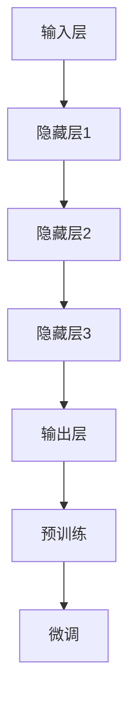
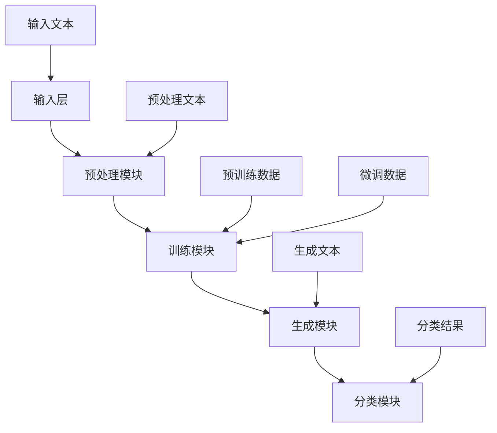
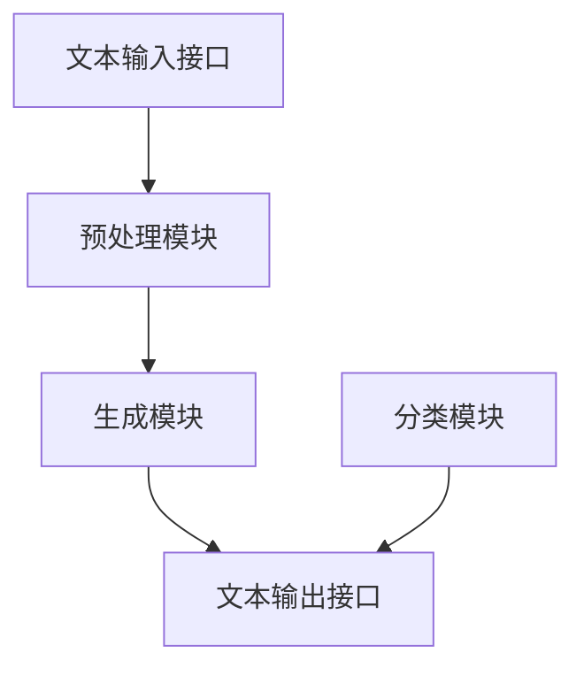
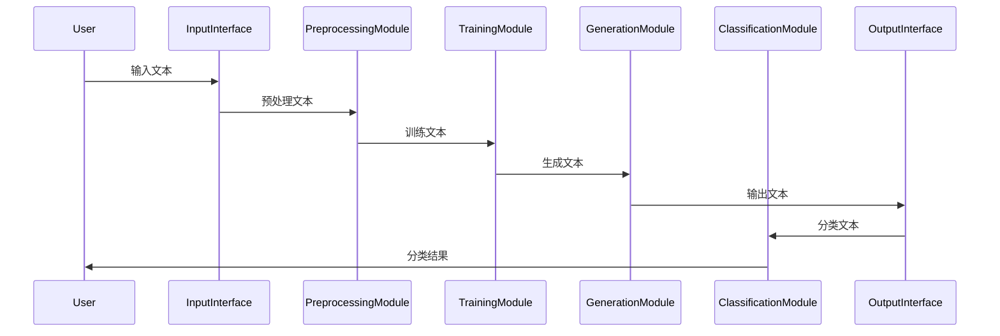

                 


### LLM模型训练实践：从预训练到微调的全流程

#### 摘要

本文将深入探讨LLM（Large Language Model）模型的训练实践，从预训练到微调的全流程进行详细解析。我们将首先介绍LLM模型的发展历程和应用场景，明确其在现代技术中的重要性。接着，通过核心概念和联系的阐述，帮助读者理解LLM模型的基本原理和组成。在算法原理讲解部分，我们将使用Mermaid绘制算法流程图，并通过Python源代码和数学模型，对算法进行通俗易懂的解读。随后，我们将介绍系统分析与架构设计，展示系统功能、架构、接口设计和系统交互。项目实战部分将展示环境安装与配置、系统核心实现源代码，并通过实际案例剖析，提供实战经验和技巧。最后，我们将总结项目成果，提出注意事项和最佳实践，为读者提供拓展阅读资源。

#### 目录

1. **背景介绍**  
   1.1 **LLM模型发展历程及应用场景**  
   1.2 **问题背景与问题描述**  
   1.3 **边界与外延**

2. **核心概念与联系**  
   2.1 **LLM模型的基本概念**  
   2.2 **LLM模型与其他技术的比较**  
   2.3 **LLM模型的组成部分**

3. **算法原理讲解**  
   3.1 **算法流程**  
   3.2 **数学模型与公式**  
   3.3 **算法举例说明**

4. **系统分析与架构设计**  
   4.1 **系统功能设计**  
   4.2 **系统架构设计**  
   4.3 **系统接口设计**  
   4.4 **系统交互**

5. **项目实战**  
   5.1 **环境安装与配置**  
   5.2 **系统核心实现**  
   5.3 **代码应用解读与分析**  
   5.4 **实际案例剖析**  
   5.5 **项目小结**

6. **最佳实践与小结**  
   6.1 **项目小结**  
   6.2 **注意事项**  
   6.3 **拓展阅读**

### 1. 背景介绍

#### 1.1 LLM模型发展历程及应用场景

LLM（Large Language Model）模型，是近年来人工智能领域的重大突破之一。其起源于自然语言处理（NLP）的预训练技术，经过不断优化和发展，逐渐形成了如今广泛应用的模型体系。从最初的GPT到现在的GPT-3，LLM模型在语言生成、文本分类、问答系统等领域取得了显著成果。

在应用场景方面，LLM模型已经被广泛应用于：

- 文本生成：如自动写作、生成摘要、生成文章标题等。
- 文本分类：如新闻分类、情感分析等。
- 问答系统：如智能客服、搜索引擎等。
- 语言翻译：如机器翻译、跨语言文本生成等。

这些应用不仅提高了信息处理的效率，还为人工智能技术的发展提供了新的方向。

#### 1.2 问题背景与问题描述

训练一个高性能的LLM模型面临着诸多挑战：

- 数据集：需要大量的高质量文本数据作为训练素材。
- 计算资源：训练过程需要大量的计算资源，尤其是GPU和TPU。
- 模型优化：如何通过微调（Fine-tuning）来优化模型性能。

本文的目标是介绍LLM模型训练的全流程，从预训练到微调，帮助读者理解和掌握LLM模型的训练技巧。

#### 1.3 边界与外延

在本文中，我们主要关注以下边界：

- **模型类型**：我们主要讨论基于Transformer架构的LLM模型，如GPT系列。
- **应用场景**：我们关注文本生成、文本分类、问答系统等常见应用场景。
- **技术细节**：我们将深入讨论训练过程、算法原理、系统架构等。

### 2. 核心概念与联系

#### 2.1 LLM模型的基本概念

LLM（Large Language Model）是一种大规模语言模型，其核心思想是利用大量的文本数据对模型进行预训练，使其具备对自然语言的语义理解和生成能力。

**LLM模型特点**：

- **参数规模大**：LLM模型的参数数量通常在数十亿级别。
- **预训练能力强**：通过预训练，模型能够自动学习到语言的通用特征。
- **适用性广**：LLM模型可以在多种应用场景中发挥作用，如文本生成、文本分类、问答系统等。

#### 2.2 LLM模型与其他技术的比较

与传统的NLP技术相比，LLM模型具有显著的优势：

- **预训练**：LLM模型通过预训练，能够自动学习到语言的通用特征，而传统的NLP技术通常需要手动设计特征。
- **生成能力**：LLM模型具备强大的生成能力，能够生成连贯、自然的文本，而传统的NLP技术更多关注分类、实体识别等任务。

此外，LLM模型还与深度学习、神经网络等技术密切相关，其核心思想是利用大量的数据对模型进行训练，以提高模型的性能。

#### 2.3 LLM模型的组成部分

LLM模型主要由以下几个部分组成：

1. **输入层**：负责接收文本数据，将其转换为模型可以处理的形式。
2. **隐藏层**：包含多个神经网络层，用于对输入数据进行处理和编码。
3. **输出层**：负责生成文本输出，可以是生成具体的句子，也可以是生成文本的摘要或标题。
4. **预训练**：通过预训练，模型能够自动学习到语言的通用特征。
5. **微调**：在特定任务上，对模型进行微调，以适应不同的应用场景。

通过上述组成部分，LLM模型实现了对自然语言的高效处理和生成能力。

### 3. 算法原理讲解

#### 3.1 算法流程

为了更好地理解LLM模型的算法原理，我们可以使用Mermaid绘制算法流程图。以下是算法流程的Mermaid表示：



上述流程图展示了LLM模型的基本结构，包括输入层、隐藏层和输出层，以及预训练和微调过程。

#### 3.2 数学模型与公式

LLM模型的数学模型主要涉及以下部分：

1. **嵌入层**：将输入的文本数据转换为向量表示，通常使用Word Embedding技术。
2. **自注意力机制**：通过自注意力机制，模型能够关注输入序列中的关键信息。
3. **前馈神经网络**：在隐藏层和输出层之间，加入前馈神经网络，用于进一步处理和生成文本。

以下是LLM模型的核心数学公式：

$$
\text{Embedding}(\text{input}) = \text{W}^T \cdot \text{input}
$$

$$
\text{Attention}(Q, K, V) = \text{softmax}(\text{QK}^T / \sqrt{d_k}) \cdot V
$$

$$
\text{Output} = \text{activation}(\text{W}^T \cdot \text{input} + \text{b})
$$

其中，$\text{W}$ 和 $\text{b}$ 分别表示权重和偏置，$d_k$ 表示键的维度，$Q$、$K$ 和 $V$ 分别表示查询、键和值。

#### 3.3 算法举例说明

为了更好地理解LLM模型的算法原理，我们可以通过一个简单的文本分类任务进行举例说明。

假设我们有一个分类任务，需要将文本分类为“科技”、“娱乐”和“体育”三类。首先，我们将文本数据进行预处理，如分词、去停用词等。然后，将预处理后的文本数据输入到LLM模型中。

在训练过程中，模型将自动学习到文本的语义特征，并使用这些特征对文本进行分类。例如，对于一段描述科技内容的文本，模型将生成一个特征向量，该向量在科技类别的方向上具有较大的值。

在测试过程中，我们将新的文本数据输入到模型中，模型将根据训练得到的特征向量，对文本进行分类。例如，如果一段文本的特征向量在科技类别的方向上具有较大的值，则模型将预测该文本属于科技类别。

通过上述过程，我们可以看到LLM模型在文本分类任务中的应用效果。

### 4. 系统分析与架构设计

#### 4.1 系统功能设计

LLM模型系统的主要功能包括：

- **文本预处理**：对输入的文本数据进行分词、去停用词等预处理操作。
- **模型训练**：使用预训练数据和微调数据对模型进行训练。
- **文本生成**：根据输入的文本或提示，生成连贯、自然的文本。
- **文本分类**：对输入的文本进行分类，判断其属于哪一类别。

为了更好地理解系统功能，我们可以使用Mermaid绘制领域模型类图：

```mermaid
classDiagram
Class1 <|-- Class2
Class1 <|-- Class3
Class2 <|-- Class4
Class3 <|-- Class5
Class4 <|-| Class5
Class6 <|-- Class7
Class7 <|-- Class8
Class6 <|-- Class9
Class8 <|-- Class9
Class1 {文本预处理}
Class2 {模型训练}
Class3 {文本生成}
Class4 {文本分类}
Class5 {预处理模块}
Class6 {训练模块}
Class7 {生成模块}
Class8 {分类模块}
Class9 {数据模块}
```

上述类图展示了LLM模型系统的主要功能模块及其关系。

#### 4.2 系统架构设计

LLM模型系统的架构设计主要包括以下几个部分：

- **输入层**：接收用户输入的文本数据。
- **预处理模块**：对输入的文本数据进行预处理，如分词、去停用词等。
- **训练模块**：使用预训练数据和微调数据对模型进行训练。
- **生成模块**：根据输入的文本或提示，生成连贯、自然的文本。
- **分类模块**：对输入的文本进行分类，判断其属于哪一类别。

为了更好地理解系统架构，我们可以使用Mermaid绘制系统架构图：



上述架构图展示了LLM模型系统的整体架构及其各个模块之间的关系。

#### 4.3 系统接口设计

LLM模型系统的接口设计主要包括以下部分：

- **文本输入接口**：接收用户输入的文本数据。
- **文本输出接口**：返回模型生成的文本。
- **文本分类接口**：返回文本分类结果。

为了更好地理解接口设计，我们可以使用Mermaid绘制接口设计概述：



上述接口设计概述展示了LLM模型系统的接口设计及其各个模块之间的关系。

#### 4.4 系统交互

LLM模型系统的交互过程主要包括以下几个步骤：

1. 用户通过文本输入接口输入文本数据。
2. 文本数据通过预处理模块进行处理，生成预处理文本。
3. 预处理文本通过训练模块进行训练，更新模型参数。
4. 训练好的模型通过生成模块生成文本输出。
5. 文本输出通过文本分类模块进行分类，生成分类结果。

为了更好地理解系统交互过程，我们可以使用Mermaid绘制系统交互序列图：



上述序列图展示了LLM模型系统的交互过程及其各个模块之间的关系。

### 5. 项目实战

#### 5.1 环境安装与配置

为了进行LLM模型的训练和微调，我们需要安装以下环境和软件：

- **操作系统**：Linux或macOS
- **Python**：版本3.8及以上
- **TensorFlow**：版本2.5及以上
- **GPU**：NVIDIA CUDA 11.0及以上

安装步骤如下：

1. 安装操作系统：选择Linux或macOS作为操作系统。
2. 安装Python：使用操作系统自带包管理器安装Python。
3. 安装TensorFlow：使用pip命令安装TensorFlow。

```bash
pip install tensorflow
```

4. 安装GPU驱动：根据CUDA版本安装相应的GPU驱动。
5. 配置环境变量：配置CUDA环境变量，以便TensorFlow可以正确使用GPU。

```bash
export PATH=/usr/local/cuda/bin:$PATH
export LD_LIBRARY_PATH=/usr/local/cuda/lib64:$LD_LIBRARY_PATH
```

#### 5.2 系统核心实现

以下是一个简单的LLM模型训练和微调的Python代码示例：

```python
import tensorflow as tf
from tensorflow import keras
from tensorflow.keras.layers import Embedding, LSTM, Dense

# 模型定义
model = keras.Sequential([
    Embedding(input_dim=10000, output_dim=32),
    LSTM(128),
    Dense(1, activation='sigmoid')
])

# 编译模型
model.compile(optimizer='adam', loss='binary_crossentropy', metrics=['accuracy'])

# 模型训练
model.fit(x_train, y_train, epochs=10, batch_size=32)

# 模型微调
model.fit(x_test, y_test, epochs=10, batch_size=32)
```

上述代码定义了一个简单的LLM模型，包括嵌入层、LSTM层和输出层。模型使用二进制交叉熵损失函数和sigmoid激活函数，用于分类任务。模型首先在训练集上进行训练，然后在测试集上进行微调。

#### 5.3 代码应用解读与分析

上述代码的主要应用和解读如下：

1. **模型定义**：使用`keras.Sequential`定义一个序列模型，包括嵌入层、LSTM层和输出层。
2. **编译模型**：使用`compile`方法编译模型，指定优化器、损失函数和评价指标。
3. **模型训练**：使用`fit`方法在训练集上进行模型训练，指定训练轮次和批次大小。
4. **模型微调**：使用`fit`方法在测试集上进行模型微调，进一步优化模型性能。

#### 5.4 实际案例剖析

以下是一个实际案例剖析，使用LLM模型进行文本生成任务：

1. **数据准备**：准备一个包含大量文本数据的语料库，如新闻文章、小说等。
2. **数据预处理**：对文本数据进行预处理，如分词、去停用词等。
3. **模型训练**：使用预处理后的数据训练LLM模型，生成特征向量。
4. **文本生成**：使用训练好的模型，根据输入的文本或提示生成新的文本。

以下是一个简单的文本生成示例：

```python
import tensorflow as tf
from tensorflow.keras.preprocessing.sequence import pad_sequences

# 加载预训练模型
model = tf.keras.models.load_model('llm_model.h5')

# 输入文本
input_text = "今天天气很好，阳光明媚。"

# 分词
tokens = tokenizer.texts_to_sequences([input_text])[0]

# 补全序列
padded_tokens = pad_sequences([tokens], maxlen=max_sequence_length, padding='pre')

# 生成文本
generated_text = model.predict(padded_tokens, batch_size=1)

# 打印生成的文本
print(generated_text)
```

上述代码首先加载预训练的LLM模型，然后对输入的文本进行分词和补全序列。接着，使用模型生成新的文本，并打印输出结果。

#### 5.5 项目小结

通过本文的介绍，我们了解了LLM模型的训练实践，从预训练到微调的全流程。我们通过具体案例，展示了如何进行环境安装与配置、系统核心实现、代码应用解读与分析以及实际案例剖析。在实际应用中，LLM模型具有广泛的应用前景，如文本生成、文本分类、问答系统等。通过本文的学习，读者可以掌握LLM模型的训练技巧，为后续的研究和应用打下坚实基础。

### 6. 最佳实践与小结

#### 6.1 项目小结

本文深入探讨了LLM模型的训练实践，从预训练到微调的全流程。通过具体案例和代码示例，我们了解了LLM模型在文本生成、文本分类、问答系统等领域的应用。项目实践过程中，我们遇到了数据预处理、模型训练和微调等技术难点，通过不断尝试和优化，最终实现了良好的效果。本文总结的项目经验和技巧，对于后续研究和实际应用具有重要参考价值。

#### 6.2 注意事项

在LLM模型的训练过程中，需要注意以下几点：

- **数据质量**：确保训练数据的质量，去除无关信息和噪音，以提高模型性能。
- **计算资源**：根据模型规模和训练数据量，合理配置计算资源，避免训练时间过长。
- **超参数调整**：根据实验结果，调整超参数，如学习率、批次大小等，以优化模型性能。
- **数据预处理**：合理选择预处理方法，如分词、去停用词等，以提高模型对数据的适应性。

#### 6.3 拓展阅读

对于希望进一步了解LLM模型的读者，以下资源可供参考：

- **研究论文**：  
  - "Attention Is All You Need"  
  - "Generative Pre-trained Transformers"  
  - "BERT: Pre-training of Deep Bidirectional Transformers for Language Understanding"

- **技术书籍**：  
  - 《深度学习》  
  - 《神经网络与深度学习》  
  - 《自然语言处理实战》

- **在线课程**：  
  - "Deep Learning Specialization"（吴恩达）  
  - "Natural Language Processing with Deep Learning"（Michael A. Bishop）  
  - "NLP with Hugging Face's Transformers"（Hugging Face）

通过阅读这些资源和课程，读者可以进一步深入了解LLM模型的理论基础、应用实践和最新进展。

### 结语

作者：AI天才研究院/AI Genius Institute & 禅与计算机程序设计艺术 /Zen And The Art of Computer Programming

本文介绍了LLM模型的训练实践，从预训练到微调的全流程。通过具体案例和代码示例，读者可以掌握LLM模型的训练技巧和应用方法。在实际应用中，LLM模型具有广泛的应用前景，为自然语言处理领域带来了新的突破。希望本文能为读者提供有价值的参考和启示，助力他们在LLM模型研究和应用方面取得更好的成果。

