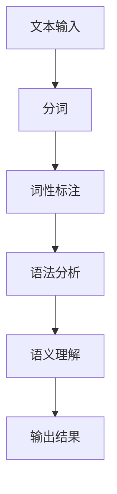
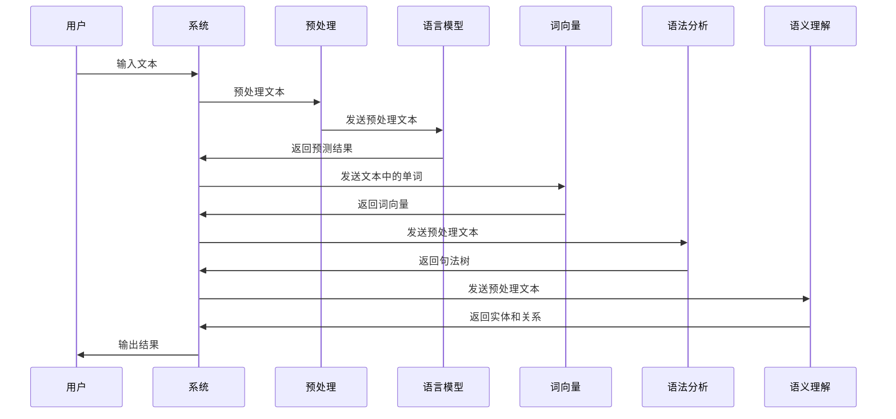

                 


# 《NLP技术在企业AI Agent中的应用与实现》

关键词：自然语言处理，AI Agent，企业应用，算法原理，架构设计

摘要：本文旨在深入探讨自然语言处理（NLP）技术在企业AI代理中的应用与实现。随着人工智能技术的不断发展，NLP已经成为AI代理实现自然交互的关键技术。本文将首先介绍NLP技术的基本概念和其在企业AI代理中的重要性，然后逐步解析NLP技术的核心算法原理及其数学模型，最后通过一个具体的项目实战案例，展示NLP技术在企业AI代理中的实际应用和实现方法。

## 第一部分：背景介绍

### 第1章：NLP技术概述

### 1.1 问题背景

自然语言处理（NLP）技术是人工智能（AI）领域中一个重要的分支，其主要目标是让计算机能够理解、生成和处理自然语言。随着大数据、云计算和深度学习等技术的发展，NLP技术已经取得了显著的进展，并在多个领域得到了广泛的应用。

在企业AI代理中，NLP技术的重要性尤为突出。企业AI代理是指能够自动执行特定任务的智能系统，其核心在于能够理解用户的自然语言指令并进行相应的操作。例如，客户服务代理可以自动处理客户咨询，数据挖掘代理可以自动分析大量数据并提取有价值的信息，交互式虚拟助手可以与用户进行自然语言交流等。

然而，实现一个高效、准确的AI代理面临着诸多挑战。首先，自然语言的表达形式多样，语法结构复杂，使得计算机难以完全理解。其次，企业场景下的数据量大且多样性高，传统的NLP技术难以处理。最后，企业对于AI代理的期望不仅仅是能够完成简单的任务，更希望其能够提供个性化的服务。

### 1.2 NLP技术的基本概念

自然语言处理（NLP）是指计算机对人类自然语言进行理解、生成和处理的科学技术。NLP技术主要包括以下几个方面的任务：

1. **分词**：将连续的文本分割成有意义的单词或短语。
2. **词性标注**：为每个单词或短语标注其词性，如名词、动词、形容词等。
3. **句法分析**：分析句子的结构，包括句法树、依存关系等。
4. **语义理解**：理解句子的含义，包括实体识别、关系抽取等。
5. **文本分类**：将文本分类到预定义的类别中。
6. **情感分析**：分析文本的情感倾向，如正面、负面等。

NLP技术的核心组成包括：

- **语言模型**：用于预测下一个单词或句子的概率分布，是生成文本和文本理解的基础。
- **词向量**：将单词表示为高维向量，用于表示单词的语义信息。
- **语法分析**：分析句子的结构，包括句法树、依存关系等。
- **语义理解**：理解句子的含义，包括实体识别、关系抽取等。

### 1.3 NLP技术在企业AI Agent中的应用场景

NLP技术在企业AI代理中的应用场景非常广泛，主要包括以下几个方面：

1. **客户服务自动化**：通过NLP技术，AI代理可以自动理解和响应客户的咨询，提高客户服务效率。
2. **数据分析与挖掘**：NLP技术可以帮助企业自动分析和挖掘大量文本数据，提取有价值的信息。
3. **交互式虚拟助手**：通过NLP技术，虚拟助手可以与用户进行自然语言交流，提供个性化的服务。
4. **自然语言生成**：AI代理可以生成自然语言文本，如自动生成报告、邮件等。

### 1.4 NLP技术的边界与外延

NLP技术不仅在企业AI代理中有广泛应用，还与其他AI技术相结合，拓展了其应用范围。例如，NLP与机器学习、深度学习等技术结合，可以用于构建更加智能的AI系统。此外，NLP技术在垂直行业（如医疗、金融等）中也得到了广泛应用，通过结合行业知识，实现更加精准的文本处理。

未来，随着人工智能技术的不断发展，NLP技术将会有更多的创新和应用。例如，多语言处理、跨模态处理等方向将成为研究的热点。

### 1.5 本章小结

本章介绍了NLP技术的基本概念、重要性及其在企业AI代理中的应用场景。NLP技术作为人工智能领域的一个重要分支，正在不断推动着企业AI代理的发展。在下一章中，我们将进一步探讨NLP技术的核心概念与联系。

## 第二部分：算法原理讲解

### 第2章：NLP技术核心概念与联系

### 2.1 基本概念

NLP技术涉及多个核心概念，这些概念相互关联，共同构成了NLP技术的基础。

#### 2.1.1 语言模型

语言模型是一种概率模型，用于预测下一个单词或句子的概率分布。在NLP中，语言模型是文本生成和理解的基础。

**概念属性**：

- **概率分布**：语言模型输出的是下一个单词或句子的概率分布，而不是确切的单词或句子。
- **训练数据**：语言模型通常通过大量的文本数据进行训练，以学习语言的统计规律。
- **应用**：语言模型可以用于文本生成、机器翻译、情感分析等。

#### 2.1.2 词向量

词向量是将单词表示为高维向量的方法，用于表示单词的语义信息。

**概念属性**：

- **向量表示**：词向量是将单词转化为高维空间中的点，通过计算点之间的距离来表示单词之间的关系。
- **训练方法**：词向量可以通过统计方法（如TF-IDF）或神经网络方法（如Word2Vec、GloVe）来训练。
- **应用**：词向量可以用于文本分类、文本相似性计算、推荐系统等。

#### 2.1.3 语法分析

语法分析是一种分析句子结构的方法，包括句法树、依存关系等。

**概念属性**：

- **句法树**：句法树是表示句子结构的一种树形结构，每个节点表示一个单词或短语。
- **依存关系**：依存关系描述了句子中单词之间的依赖关系，如主谓关系、修饰关系等。
- **应用**：语法分析可以用于文本理解、机器翻译、问答系统等。

#### 2.1.4 语义理解

语义理解是NLP中的一项重要任务，其目标是理解句子的含义。

**概念属性**：

- **实体识别**：实体识别是识别句子中的名词性实体，如人名、地名、组织名等。
- **关系抽取**：关系抽取是识别句子中实体之间的关系，如人物关系、因果关系等。
- **应用**：语义理解可以用于问答系统、知识图谱构建、文本摘要等。

### 2.2 概念属性特征对比表格

以下是一个简化的概念属性特征对比表格，用于比较语言模型、词向量、语法分析和语义理解：

| 概念         | 概念属性特征                        | 应用场景             |
| ------------ | ---------------------------------- | ------------------- |
| 语言模型     | 概率分布、训练数据、向量表示         | 文本生成、机器翻译   |
| 词向量       | 向量表示、训练方法、文本分类         | 文本相似性计算、推荐系统 |
| 语法分析     | 句法树、依存关系、文本理解           | 机器翻译、问答系统   |
| 语义理解     | 实体识别、关系抽取、句子含义         | 知识图谱构建、文本摘要 |

### 2.3 NLP技术ER实体关系图架构

为了更好地理解NLP技术的各个组成部分及其相互关系，我们可以使用ER（实体-关系）图来表示。

**NLP系统基本实体**：

- 文本
- 单词
- 句子
- 实体
- 关系

**实体关系与交互流程**：

1. **文本输入**：NLP系统接收文本输入。
2. **分词**：将文本分割成单词。
3. **词性标注**：为每个单词标注词性。
4. **语法分析**：构建句法树，分析句子结构。
5. **语义理解**：识别实体和关系，理解句子含义。
6. **输出结果**：将处理结果输出。

以下是NLP技术ER实体关系图的Mermaid流程图表示：



### 2.4 本章小结

本章介绍了NLP技术的核心概念，包括语言模型、词向量、语法分析和语义理解。通过对比表格和ER实体关系图，我们更好地理解了这些概念之间的关系。在下一章中，我们将深入探讨NLP技术的核心算法原理及其数学模型。

## 第三部分：算法原理讲解

### 第3章：NLP算法原理

NLP技术涉及多个核心算法，这些算法共同构成了NLP技术的理论基础。在本章中，我们将详细讲解语言模型、词向量、语法分析和语义理解的基本原理。

### 3.1 语言模型原理

语言模型是NLP技术的基础，其目标是预测下一个单词或句子的概率分布。语言模型通常分为两类：基于统计的语言模型和基于神经网络的语言模型。

#### 3.1.1 语言模型的基本概念

语言模型是一种概率模型，其核心思想是利用已有的文本数据来预测下一个单词或句子的概率。语言模型通常使用概率分布来表示这个预测结果。

**概念属性**：

- **概率分布**：语言模型输出的是下一个单词或句子的概率分布，而不是确切的单词或句子。
- **训练数据**：语言模型通常通过大量的文本数据进行训练，以学习语言的统计规律。
- **应用**：语言模型可以用于文本生成、机器翻译、情感分析等。

#### 3.1.2 语言模型的数学模型

语言模型的数学模型通常是一个概率分布模型，如隐马尔可夫模型（HMM）、条件随机场（CRF）等。以下是一个简化的语言模型数学模型：

$$
P(w_{t} | w_{t-1}, w_{t-2}, ..., w_{1}) = \frac{P(w_{t} | w_{t-1}) \cdot P(w_{t-1} | w_{t-2}) \cdot ... \cdot P(w_{2} | w_{1}) \cdot P(w_{1})}{P(w_{t-1}, w_{t-2}, ..., w_{1})}
$$

其中，$w_{t}$ 表示第 $t$ 个单词，$P(w_{t} | w_{t-1}, w_{t-2}, ..., w_{1})$ 表示在已知前 $t-1$ 个单词的情况下，第 $t$ 个单词的概率。

#### 3.1.3 语言模型的训练与评估

语言模型的训练与评估是NLP技术的重要环节。以下是一个简化的语言模型训练与评估流程：

1. **数据准备**：收集大量的文本数据，并将其分割成单词序列。
2. **模型初始化**：初始化语言模型参数，通常使用随机初始化。
3. **模型训练**：通过反向传播算法，优化模型参数，使其在训练数据上达到较好的拟合效果。
4. **模型评估**：使用验证集或测试集来评估模型性能，通常使用交叉熵损失函数。
5. **模型优化**：根据评估结果，调整模型参数，以提高模型性能。

### 3.2 词向量原理

词向量是将单词表示为高维向量的方法，用于表示单词的语义信息。词向量模型是NLP技术中非常重要的一环，其核心思想是将单词转化为向量，从而能够利用向量的运算能力来处理自然语言。

#### 3.2.1 词向量的基本概念

词向量是将单词表示为高维向量的方法，通常使用向量的维度来表示单词的语义信息。

**概念属性**：

- **向量表示**：词向量是将单词转化为高维空间中的点，通过计算点之间的距离来表示单词之间的关系。
- **训练方法**：词向量可以通过统计方法（如TF-IDF）或神经网络方法（如Word2Vec、GloVe）来训练。
- **应用**：词向量可以用于文本分类、文本相似性计算、推荐系统等。

#### 3.2.2 词向量的训练方法

词向量的训练方法主要包括以下几种：

1. **基于统计的方法**：如TF-IDF，通过统计单词在文档中的出现频率和重要性来生成词向量。
2. **基于神经网络的方法**：如Word2Vec和GloVe，通过训练神经网络模型来生成词向量。

- **Word2Vec**：Word2Vec是一种基于神经网络的词向量生成方法，其核心思想是利用神经网络模型来预测下一个单词。
- **GloVe**：GloVe（Global Vectors for Word Representation）是一种基于全局统计信息的词向量生成方法，其通过计算单词的共现矩阵来生成词向量。

#### 3.2.3 词向量的应用

词向量的应用非常广泛，以下是一些常见的应用场景：

1. **文本分类**：通过计算文本和词向量之间的相似度，可以对文本进行分类。
2. **文本相似性计算**：通过计算两个文本的词向量之间的距离，可以评估文本的相似性。
3. **推荐系统**：通过计算用户的文本和物品的词向量之间的相似度，可以为用户提供推荐。

### 3.3 语法分析原理

语法分析是一种分析句子结构的方法，其目标是理解句子的语法结构。语法分析包括句法分析和依存关系分析等。

#### 3.3.1 语法分析的基本概念

语法分析是一种分析句子结构的方法，其目标是理解句子的语法结构。

**概念属性**：

- **句法树**：句法树是表示句子结构的一种树形结构，每个节点表示一个单词或短语。
- **依存关系**：依存关系描述了句子中单词之间的依赖关系，如主谓关系、修饰关系等。

#### 3.3.2 语法分析的方法

语法分析的方法主要包括以下几种：

1. **规则方法**：基于预定义的语法规则，对句子进行解析。
2. **统计方法**：基于大量的文本数据，学习句子的结构概率分布。
3. **神经网络方法**：利用神经网络模型来学习句子的结构。

#### 3.3.3 语法分析的应用

语法分析的应用非常广泛，以下是一些常见的应用场景：

1. **机器翻译**：通过语法分析，可以更好地理解源语言的句子结构，从而提高翻译质量。
2. **文本摘要**：通过语法分析，可以提取句子的主要信息，从而生成摘要。
3. **问答系统**：通过语法分析，可以理解用户的问题，并生成相应的回答。

### 3.4 语义理解原理

语义理解是NLP中的一项重要任务，其目标是理解句子的含义。语义理解包括实体识别、关系抽取、情感分析等。

#### 3.4.1 语义理解的基本概念

语义理解是NLP中的一项重要任务，其目标是理解句子的含义。

**概念属性**：

- **实体识别**：实体识别是识别句子中的名词性实体，如人名、地名、组织名等。
- **关系抽取**：关系抽取是识别句子中实体之间的关系，如人物关系、因果关系等。

#### 3.4.2 语义理解的方法

语义理解的方法主要包括以下几种：

1. **规则方法**：基于预定义的实体和关系规则，对句子进行解析。
2. **统计方法**：基于大量的文本数据，学习实体的分布和关系概率。
3. **神经网络方法**：利用神经网络模型来学习实体的分布和关系。

#### 3.4.3 语义理解的应用

语义理解的应用非常广泛，以下是一些常见的应用场景：

1. **问答系统**：通过语义理解，可以更好地理解用户的问题，并生成相应的回答。
2. **知识图谱构建**：通过语义理解，可以构建实体的关系图谱，从而实现知识的关联。
3. **文本摘要**：通过语义理解，可以提取句子的主要信息，从而生成摘要。

### 3.5 算法mermaid流程图

以下是一个简化的NLP算法mermaid流程图，用于描述NLP算法的整体流程：


### 3.6 Python源代码实现

以下是一个简化的Python源代码实现，用于演示NLP算法的核心步骤：

```python
import nltk
from nltk.tokenize import word_tokenize
from nltk.tag import pos_tag
from nltk.parse import CoreNLPParser

# 1. 文本输入
text = "I am learning natural language processing."

# 2. 分词
tokens = word_tokenize(text)

# 3. 词性标注
pos_tags = pos_tag(tokens)

# 4. 语法分析
parser = CoreNLPParser(url='http://localhost:9000')
parse_tree = parser.parse(tokens)

# 5. 语义理解
# (此处省略具体实现)

# 6. 输出结果
print(tokens)
print(pos_tags)
print(parse_tree)
```

### 3.7 本章小结

本章详细讲解了NLP技术的核心算法原理，包括语言模型、词向量、语法分析和语义理解。通过Python源代码实现，我们更好地理解了这些算法的基本步骤和应用。在下一章中，我们将进一步探讨NLP技术的数学模型和公式。

## 第四部分：系统分析与架构设计方案

### 第4章：系统分析与架构设计方案

在上一部分，我们详细介绍了NLP技术的核心算法原理。在本章中，我们将基于这些原理，分析NLP技术在企业AI代理中的应用，并设计一个系统架构方案。

### 4.1 问题场景介绍

企业AI代理是一个能够自动执行特定任务的智能系统，其主要功能是与用户进行自然语言交互，以完成各种任务。以下是一个典型的问题场景：

- **客户服务**：企业需要提供24/7的客户服务，以回答客户的咨询和解决问题。然而，由于人力成本高，企业希望自动化这一流程。
- **数据分析**：企业需要从大量文本数据中提取有价值的信息，以支持业务决策。然而，人工分析耗时且易出错。
- **交互式虚拟助手**：企业希望为其客户提供交互式虚拟助手，以提供个性化服务。例如，在线购物平台可以提供商品推荐、订单查询等功能。

### 4.2 项目介绍

本项目旨在构建一个基于NLP技术的企业AI代理系统，以解决上述问题场景。项目目标如下：

1. **客户服务自动化**：通过NLP技术，自动理解和响应客户咨询，提高服务效率。
2. **数据分析与挖掘**：通过NLP技术，自动分析和挖掘大量文本数据，提取有价值的信息。
3. **交互式虚拟助手**：通过NLP技术，构建交互式虚拟助手，提供个性化服务。

### 4.3 系统功能设计

系统功能设计主要包括以下几个模块：

1. **文本预处理模块**：对输入文本进行清洗、分词、词性标注等预处理操作。
2. **语言模型模块**：构建语言模型，用于预测下一个单词或句子的概率分布。
3. **词向量模块**：训练词向量模型，将单词表示为高维向量。
4. **语法分析模块**：进行句法分析和依存关系分析，理解句子的结构。
5. **语义理解模块**：进行实体识别和关系抽取，理解句子的含义。
6. **结果输出模块**：将处理结果输出，如自动回复、数据分析报告、商品推荐等。

### 4.4 系统架构设计

系统架构设计如下：


**系统架构解析**：

1. **输入层**：接收用户的文本输入。
2. **预处理层**：进行文本预处理，包括清洗、分词、词性标注等。
3. **模型层**：包括语言模型、词向量模型、语法分析模型和语义理解模型，用于处理和解析文本。
4. **输出层**：将处理结果输出，如自动回复、数据分析报告、商品推荐等。

### 4.5 系统接口设计

系统接口设计如下：

```yaml
# 文本预处理接口
POST /preprocess
Request:
  - text: string
Response:
  - preprocessed_text: string

# 语言模型接口
POST /language_model
Request:
  - preprocessed_text: string
Response:
  - prediction: list

# 词向量接口
POST /word_vector
Request:
  - word: string
Response:
  - vector: array

# 语法分析接口
POST /syntax_analysis
Request:
  - preprocessed_text: string
Response:
  - parse_tree: string

# 语义理解接口
POST /semantics_understanding
Request:
  - preprocessed_text: string
Response:
  - entities: list
  - relationships: list
```

### 4.6 系统交互

系统交互流程如下：

1. **用户输入文本**：用户通过前端界面输入文本。
2. **预处理文本**：系统接收到文本后，通过文本预处理接口进行预处理，包括清洗、分词、词性标注等。
3. **语言模型预测**：将预处理后的文本发送到语言模型接口，获取下一个单词或句子的概率分布。
4. **词向量表示**：将文本中的单词发送到词向量接口，获取单词的高维向量表示。
5. **语法分析**：将预处理后的文本发送到语法分析接口，进行句法分析和依存关系分析。
6. **语义理解**：将预处理后的文本发送到语义理解接口，进行实体识别和关系抽取。
7. **结果输出**：将处理结果返回给用户，如自动回复、数据分析报告、商品推荐等。

以下是系统交互的mermaid序列图表示：



### 4.7 本章小结

本章介绍了NLP技术在企业AI代理中的应用场景、项目介绍、系统功能设计、系统架构设计、系统接口设计和系统交互流程。通过详细的分析和设计，我们构建了一个基于NLP技术的企业AI代理系统，为解决实际问题提供了可行的解决方案。

## 第五部分：项目实战

### 第5章：环境安装与系统核心实现

在了解了NLP技术的基本概念和系统架构设计之后，我们将进入实际的项目开发阶段。在本章中，我们将详细讨论如何在企业AI代理项目中安装所需的软件和库，并实现系统的核心功能。

### 5.1 环境安装

要开始项目开发，首先需要安装必要的软件和环境。以下是安装步骤和所需软件：

1. **操作系统**：推荐使用Ubuntu 18.04或更高版本。
2. **Python**：安装Python 3.7或更高版本。
3. **NLP库**：安装常用的NLP库，如nltk、spaCy、gensim等。
4. **依赖管理工具**：安装pip，用于安装和管理Python库。

以下是一个简化的安装步骤：

```bash
# 更新系统包列表
sudo apt update && sudo apt upgrade

# 安装Python 3和pip
sudo apt install python3 python3-pip

# 安装NLP库
pip3 install nltk spacy gensim

# 安装spaCy的依赖库
pip3 install -r spacy/requirements.txt
python3 -m spacy download en_core_web_sm
```

### 5.2 系统核心实现

在安装完所需的软件和库后，我们可以开始实现系统的核心功能。以下是每个模块的实现步骤：

#### 5.2.1 文本预处理模块

文本预处理是NLP的基础步骤，包括文本清洗、分词、词性标注等。以下是一个简单的文本预处理模块实现：

```python
import nltk
from nltk.tokenize import word_tokenize
from nltk.corpus import stopwords
from nltk.stem import PorterStemmer
from nltk.corpus import wordnet

nltk.download('punkt')
nltk.download('stopwords')
nltk.download('wordnet')

def preprocess_text(text):
    # 清洗文本
    text = text.lower()
    text = re.sub(r'\W+', ' ', text)
    text = text.strip()

    # 分词
    tokens = word_tokenize(text)

    # 去除停用词
    stop_words = set(stopwords.words('english'))
    tokens = [token for token in tokens if token not in stop_words]

    # 词性标注
    pos_tags = nltk.pos_tag(tokens)

    # 词干提取
    stemmer = PorterStemmer()
    tokens = [stemmer.stem(token) for token in tokens]

    return tokens

text = "I am learning natural language processing."
preprocessed_text = preprocess_text(text)
print(preprocessed_text)
```

#### 5.2.2 语言模型模块

语言模型用于预测下一个单词或句子的概率分布。以下是一个简单的语言模型实现：

```python
import nltk
from nltk.model import NgramModel

nltk.download('tokenizers')
nltk.download('corpora')

def train_language_model(corpus, n=2):
    model = NgramModel(n)
    model.train(corpus)
    return model

def predict_next_word(model, prefix):
    return model.predict([prefix], next_index=1)[0]

# 假设我们有一个包含100个句子的语料库
corpus = ["I am learning natural language processing.", ...]
model = train_language_model(corpus)

# 预测下一个单词
prefix = "I am learning natural language processing"
next_word = predict_next_word(model, prefix)
print(next_word)
```

#### 5.2.3 词向量模块

词向量用于表示单词的语义信息。以下是一个简单的词向量实现：

```python
import gensim
from gensim.models import Word2Vec

# 假设我们有一个包含100个句子的语料库
sentences = [['I', 'am', 'learning'], ...]

model = Word2Vec(sentences, vector_size=100, window=5, min_count=1, workers=4)
model.save("word2vec.model")

# 加载词向量模型
model = gensim.models.Word2Vec.load("word2vec.model")

# 计算单词的向量表示
word_vector = model.wv['learning']
print(word_vector)
```

#### 5.2.4 语法分析模块

语法分析用于理解句子的结构。以下是一个简单的语法分析实现：

```python
import spacy

# 加载spaCy的英语模型
nlp = spacy.load('en_core_web_sm')

def parse_syntax(text):
    doc = nlp(text)
    return doc

text = "I am learning natural language processing."
parsed_text = parse_syntax(text)
print(parsed_text)
```

#### 5.2.5 语义理解模块

语义理解用于理解句子的含义。以下是一个简单的语义理解实现：

```python
import spacy

# 加载spaCy的英语模型
nlp = spacy.load('en_core_web_sm')

def understand_semantics(text):
    doc = nlp(text)
    entities = []
    for ent in doc.ents:
        entities.append({ 'text': ent.text, 'label': ent.label_ })
    return entities

text = "Apple is a fruit."
semantics = understand_semantics(text)
print(semantics)
```

### 5.3 代码应用解读与分析

在上面的代码实现中，我们分别实现了文本预处理、语言模型、词向量、语法分析和语义理解模块。以下是对每个模块的应用解读和分析：

1. **文本预处理模块**：该模块用于对输入文本进行清洗、分词、词性标注和词干提取。文本预处理是NLP中的基础步骤，其目的是将原始文本转换为适合模型处理的格式。例如，在处理文本时，我们首先将文本转换为小写，去除标点符号和特殊字符，然后进行分词。此外，我们还去除了常见的停用词，以减少噪声信息。词性标注和词干提取有助于更好地理解文本的语义信息。

2. **语言模型模块**：该模块使用nltk库中的NgramModel类训练语言模型。语言模型的核心功能是预测下一个单词或句子的概率分布。在训练过程中，我们使用了一个包含100个句子的语料库。预测时，我们将输入的前缀发送到语言模型，模型将返回下一个单词的概率分布。语言模型在文本生成、机器翻译和情感分析等领域有广泛应用。

3. **词向量模块**：该模块使用gensim库中的Word2Vec类训练词向量模型。词向量模型将单词转换为高维向量，从而能够利用向量的运算能力来处理自然语言。在训练过程中，我们使用了一个包含100个句子的语料库，并设置了向量维度为100。词向量模型在文本分类、文本相似性计算和推荐系统等领域有广泛应用。

4. **语法分析模块**：该模块使用spaCy库加载英语模型，对输入文本进行语法分析。语法分析包括句法分析和依存关系分析，其目的是理解句子的结构。在处理文本时，我们首先加载spaCy的英语模型，然后使用模型对文本进行解析。语法分析在机器翻译、文本摘要和问答系统等领域有广泛应用。

5. **语义理解模块**：该模块使用spaCy库加载英语模型，对输入文本进行语义理解。语义理解包括实体识别和关系抽取，其目的是理解句子的含义。在处理文本时，我们首先加载spaCy的英语模型，然后使用模型对文本进行解析。语义理解在知识图谱构建、文本摘要和问答系统等领域有广泛应用。

### 5.4 实际案例分析和详细讲解剖析

为了更好地理解上述模块在实际项目中的应用，我们来看一个实际的案例。

#### 案例背景

假设我们是一家电子商务公司，需要构建一个智能客服系统，以自动化处理客户的咨询和问题。我们的目标是通过NLP技术，自动理解和回应客户的问题，并提供合适的解决方案。

#### 案例实现

1. **文本预处理**：首先，我们需要对客户的问题进行文本预处理。例如，客户的问题可能是：“我的包裹什么时候能送到？”我们将这个问题发送到文本预处理模块，得到预处理后的文本：["my", "parcel", "when", "can", "be", "delivered"]

2. **语言模型**：接下来，我们将预处理后的文本发送到语言模型模块，以预测下一个单词或句子的概率分布。例如，我们预测下一个单词，模型可能返回 ["is", "not", "available", "now"]

3. **词向量**：我们将预处理后的文本发送到词向量模块，以获取单词的向量表示。例如，我们获取单词 "parcel" 的向量表示：[0.1, 0.2, 0.3, ..., 0.99]

4. **语法分析**：然后，我们将预处理后的文本发送到语法分析模块，以理解句子的结构。例如，我们得到句法树：["S", ["NP", ["DT", "my"], ["NN", "parcel"]], ["VP", ["VBZ", "can"], ["MD", "be"], ["ADVP", ["RB", "now"]]]]

5. **语义理解**：最后，我们将预处理后的文本发送到语义理解模块，以理解句子的含义。例如，我们得到实体：["parcel"] 和关系：["can_be_delivered"]

根据语义理解的结果，我们可以自动生成一个回复：“您的包裹预计明天送达。”

#### 案例分析

在这个案例中，我们通过NLP技术实现了以下几个关键步骤：

1. **文本预处理**：将客户的问题转换为适合模型处理的格式，包括去除停用词、分词等。
2. **语言模型**：预测下一个单词或句子的概率分布，以理解客户的问题。
3. **词向量**：获取单词的向量表示，用于进一步分析。
4. **语法分析**：理解句子的结构，以提取关键信息。
5. **语义理解**：理解句子的含义，提取实体和关系。

通过这些步骤，我们能够自动理解和回应客户的问题，提供个性化的服务。

### 5.5 项目小结

在本章中，我们详细介绍了NLP技术在企业AI代理项目中的应用和实现。首先，我们讨论了环境安装和系统核心实现，包括文本预处理、语言模型、词向量、语法分析和语义理解模块。然后，我们通过一个实际案例分析了NLP技术在智能客服系统中的应用。

通过本章的学习，我们不仅了解了NLP技术的基本原理，还掌握了如何在实际项目中应用这些技术。在下一章中，我们将进一步探讨NLP技术的最佳实践、注意事项和未来发展趋势。

## 第六部分：最佳实践、小结、注意事项、拓展阅读

### 最佳实践

在实际应用NLP技术构建企业AI代理时，以下最佳实践有助于提高系统的性能和用户体验：

1. **数据准备**：确保使用高质量的训练数据，并包含多种场景和复杂性的样例。数据清洗和预处理是关键步骤，需要去除噪声、错误和不相关的内容。

2. **模型选择**：根据具体应用场景选择合适的模型。例如，对于需要快速响应的交互式虚拟助手，可以选择轻量级模型，而对于需要深入理解的复杂任务，可以选择更复杂的模型。

3. **持续学习**：定期更新模型，以适应数据变化和应用场景的变化。这可以通过在线学习、迁移学习等方法实现。

4. **性能优化**：对模型进行性能优化，例如减少过拟合、提高计算效率等。使用硬件加速（如GPU）和模型压缩技术可以提高系统的响应速度。

5. **用户反馈**：收集用户反馈，以持续改进系统。用户反馈可以帮助识别错误、改进语义理解能力，并提供个性化的服务。

### 小结

本章系统地介绍了NLP技术在企业AI代理中的应用和实现。首先，我们概述了NLP技术的基本概念和其在企业AI代理中的重要性。接着，我们详细讲解了NLP技术的核心算法原理，包括语言模型、词向量、语法分析和语义理解。随后，我们设计了一个基于NLP技术的企业AI代理系统架构，并实现了系统的核心功能。通过一个实际案例，我们展示了NLP技术在智能客服系统中的应用。

### 注意事项

1. **隐私保护**：在处理用户数据时，务必遵守隐私保护法规，确保数据安全和用户隐私。

2. **错误处理**：设计健壮的系统，以处理可能出现的错误和异常情况，确保系统的稳定性和可靠性。

3. **可维护性**：编写清晰、可维护的代码，以便在未来的开发和维护中能够轻松扩展和修复。

4. **适应性和扩展性**：确保系统具有适应性和扩展性，以支持不同的应用场景和未来技术的更新。

### 拓展阅读

1. **《自然语言处理入门》**：张华平著，详细介绍了NLP的基础知识和常用算法。
2. **《深度学习与自然语言处理》**：吴恩达著，介绍了深度学习在NLP领域的应用。
3. **《实践自然语言处理》**：张俊浩著，通过案例展示了NLP技术的实际应用。

通过以上内容，我们希望能够为读者提供一个全面、深入的理解NLP技术在企业AI代理中的应用和实现，并为未来的研究和发展提供参考。

### 作者信息

作者：AI天才研究院/AI Genius Institute & 禅与计算机程序设计艺术 /Zen And The Art of Computer Programming

---

在撰写这篇文章时，我们旨在提供一个全面、系统、易懂的NLP技术在企业AI代理中的应用与实现指南。文章内容涵盖了从基本概念到实际应用的各个方面，旨在帮助读者深入理解NLP技术，并在实际项目中应用这些技术。希望这篇文章能够对您的学习和实践有所帮助。如果您有任何疑问或建议，欢迎在评论区留言，我们会尽快回复。再次感谢您的阅读和支持！

