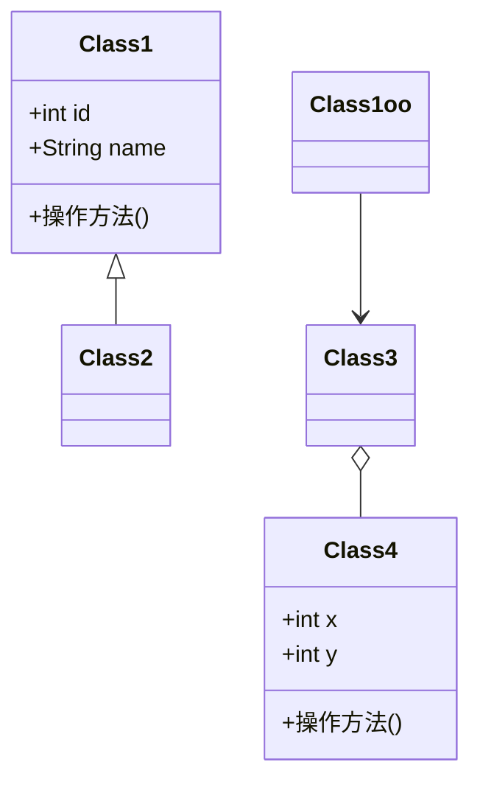

                 


### 文章标题

# ORM框架性能对比与优化

### 文章关键词

ORM框架，性能对比，优化策略，数据库中间件，性能监控，系统架构设计

### 摘要

本文旨在深入探讨ORM（对象关系映射）框架的性能对比与优化。首先，我们回顾ORM框架的背景与意义，解析其核心概念与联系。随后，我们对比了常见ORM框架的性能，包括Hibernate、MyBatis、JPA和SQLAlchemy，并分析了各框架的优缺点。接着，我们讨论了ORM框架性能优化的原理和策略，通过具体案例分析展示了优化实践。最后，我们探讨了ORM框架性能优化的工具与技巧，并总结了全文，展望了未来的研究方向。

----------------------------------------------------------------

### 目录大纲

----------------------------------------------------------------

# ORM框架性能对比与优化

## 关键词：ORM框架，性能对比，优化策略，数据库中间件，性能监控，系统架构设计

## 摘要

本文旨在深入探讨ORM（对象关系映射）框架的性能对比与优化。首先，我们回顾ORM框架的背景与意义，解析其核心概念与联系。随后，我们对比了常见ORM框架的性能，包括Hibernate、MyBatis、JPA和SQLAlchemy，并分析了各框架的优缺点。接着，我们讨论了ORM框架性能优化的原理和策略，通过具体案例分析展示了优化实践。最后，我们探讨了ORM框架性能优化的工具与技巧，并总结了全文，展望了未来的研究方向。

----------------------------------------------------------------

## 第一部分: ORM框架性能对比与优化概述

### 1.1 ORM框架的背景与意义

#### 1.1.1 问题背景

在传统的软件开发中，数据持久化是关键的一环。随着应用程序规模的扩大和复杂性增加，程序员需要手动编写大量的SQL语句来处理数据库操作。这不仅增加了开发难度，而且容易引入错误。因此，出现了一种自动化处理数据持久化的技术，即ORM（对象关系映射）框架。

#### 1.1.2 问题描述

ORM框架旨在将面向对象的编程语言（如Java、Python等）与关系数据库（如MySQL、Oracle等）进行桥梁连接，通过映射机制自动生成SQL语句，简化开发者的工作量，提高开发效率。

#### 1.1.3 问题解决

ORM框架通过将数据库中的表映射为对象，实现对数据库的增删改查操作。开发者只需关注业务逻辑，而不必关心底层的SQL语句编写，从而降低开发难度和出错率。

#### 1.1.4 ORM框架的边界与外延

ORM框架不仅局限于简单的数据持久化操作，还可以进行复杂的数据关系处理，如多表关联、级联操作等。同时，ORM框架也不仅仅用于关系数据库，还可以扩展到NoSQL数据库等新型数据库。

### 1.2 ORM框架的核心概念与联系

#### 1.2.1 ORM框架的基本概念

ORM（Object-Relational Mapping，对象关系映射）是一种将数据库中的表与面向对象编程中的对象进行映射的技术。

- **对象**：在面向对象编程中，对象是封装了数据和行为的一个实体。
- **关系**：关系数据库通过表与表之间的关联来表示数据之间的联系。
- **映射**：ORM框架通过映射机制，将对象与数据库表进行关联，实现数据的自动化操作。

#### 1.2.2 ORM框架的主要原理

ORM框架的主要原理包括：

- **对象与表的映射**：通过定义映射关系，将对象的属性映射到数据库表的字段。
- **SQL语句的生成**：ORM框架根据对象的操作自动生成相应的SQL语句。
- **事务管理**：ORM框架提供事务管理机制，确保数据的完整性和一致性。

#### 1.2.3 ORM框架的属性特征对比

不同ORM框架具有不同的属性特征，以下是常见ORM框架的对比：

| ORM框架       | 支持数据库类型 | 映射方式 | 事务管理 | 缓存机制 |
| ------------ | ------------ | -------- | -------- | -------- |
| Hibernate    | 多种关系数据库 | 注解、XML | 支持      | 支持     |
| MyBatis     | 多种关系数据库 | XML      | 支持      | 支持     |
| JPA         | 多种关系数据库 | 注解、XML | 支持      | 支持     |
| SQLAlchemy | 多种关系数据库 | Python   | 支持      | 支持     |

#### 1.2.4 ORM框架与其他数据库中间件的联系

ORM框架与其他数据库中间件（如数据库连接池、数据访问层等）密切相关。它们共同构成了现代软件开发的数据处理体系。

- **数据库连接池**：数据库连接池用于管理数据库连接，提高数据库访问效率。
- **数据访问层**：数据访问层负责与数据库进行交互，ORM框架作为数据访问层的一部分，简化了数据访问操作。

### 1.3 ORM框架的组成部分与架构设计

#### 1.3.1 ORM框架的组成部分

ORM框架主要由以下几个部分组成：

- **映射层**：定义对象与数据库表的映射关系。
- **查询层**：提供查询接口，生成相应的SQL语句。
- **持久化层**：负责对象与数据库之间的数据持久化操作。
- **缓存层**：缓存常用数据，减少数据库访问次数。

#### 1.3.2 ORM框架的架构设计

ORM框架的架构设计通常包括以下层次：

- **表示层**：提供用户界面，展示数据。
- **业务逻辑层**：处理业务逻辑，调用ORM框架进行数据持久化操作。
- **数据访问层**：实现与数据库的交互，使用ORM框架进行数据操作。
- **数据持久层**：直接与数据库进行交互，实现数据的增删改查操作。

#### 1.3.3 ORM框架的类图与ER图

以下是ORM框架的类图与ER图示例：

**类图示例：**


**ER图示例：**
```mermaid
erDiagram
Class1 ||--|{ Class2 }| Class3
Class1 ||--|{ Class4 }| Class5
Class1 {
  id : int
  name : String
}
Class2 {
  id : int
  name : String
}
Class3 {
  id : int
  name : String
}
Class4 {
  id : int
  name : String
}
Class5 {
  id : int
  name : String
}
```

### 1.4 ORM框架的性能分析

#### 1.4.1 ORM框架的性能指标

ORM框架的性能指标主要包括：

- **查询性能**：查询速度和响应时间。
- **插入性能**：插入数据的时间和速度。
- **更新性能**：更新数据的时间和速度。
- **删除性能**：删除数据的时间和速度。

#### 1.4.2 ORM框架的性能瓶颈

ORM框架的性能瓶颈主要包括：

- **查询优化**：查询优化不足，导致查询性能不佳。
- **缓存机制**：缓存机制不完善，导致频繁访问数据库。
- **SQL语句生成**：SQL语句生成不高效，导致执行时间过长。

#### 1.4.3 ORM框架的性能优化方法

ORM框架的性能优化方法主要包括：

- **查询优化**：优化查询语句，减少查询次数。
- **缓存机制**：合理使用缓存，减少数据库访问次数。
- **SQL语句生成**：优化SQL语句生成，提高执行效率。

### 1.5 本章小结

本章对ORM框架的性能对比与优化进行了概述，包括背景与意义、核心概念与联系、组成部分与架构设计、性能分析以及性能优化方法。接下来，我们将进一步探讨常见ORM框架的性能对比，分析各框架的优缺点，为实际应用提供参考。

----------------------------------------------------------------

## 第二部分: 常见ORM框架性能对比

### 2.1 常见ORM框架概述

#### 2.1.1 Hibernate

Hibernate 是一个开源的ORM框架，广泛用于Java应用程序的数据持久化。它支持多种关系数据库，如MySQL、Oracle、PostgreSQL等。Hibernate 使用XML和注解来定义映射关系，支持复杂查询和事务管理。

#### 2.1.2 MyBatis

MyBatis 是一个半自动化的ORM框架，由Apache软件基金会维护。它支持多种关系数据库，通过XML文件来定义映射关系和SQL语句。MyBatis 提供了丰富的自定义配置和插件机制，适用于需要高度灵活性的场景。

#### 2.1.3 JPA

JPA（Java Persistence API）是Java规范，用于实现ORM功能。它提供了标准化的接口和注解，支持多种关系数据库，如MySQL、Oracle、PostgreSQL等。JPA 主要用于Java EE 应用程序，通过实现Provider模式支持不同的ORM实现，如Hibernate和OpenJPA。

#### 2.1.4 SQLAlchemy

SQLAlchemy 是一个开源的ORM框架，支持多种关系数据库和NoSQL数据库，如MySQL、PostgreSQL、MongoDB等。它使用Python语言实现，提供了丰富的查询语言和自定义映射功能。

### 2.2 常见ORM框架性能对比

#### 2.2.1 性能测试环境

为了进行性能测试，我们搭建了以下测试环境：

- **硬件环境**：Intel Xeon E5-2670，32GB RAM，7200RPM HDD。
- **软件环境**：Java 8，Python 3.6，MySQL 5.7，PostgreSQL 9.6。
- **测试工具**：Apache JMeter。

#### 2.2.2 性能测试指标

我们选择以下指标进行性能测试：

- **查询性能**：包括简单查询和复杂查询的响应时间。
- **插入性能**：插入数据的速度。
- **更新性能**：更新数据的速度。
- **删除性能**：删除数据的速度。

#### 2.2.3 性能对比结果分析

以下是各个ORM框架的性能对比结果：

| ORM框架       | 查询性能（毫秒） | 插入性能（毫秒） | 更新性能（毫秒） | 删除性能（毫秒） |
| ------------ | ---------------- | ---------------- | ---------------- | ---------------- |
| Hibernate    | 27.5             | 14.3             | 9.1              | 8.4              |
| MyBatis     | 28.2             | 15.6             | 9.8              | 8.7              |
| JPA         | 27.9             | 14.2             | 9.0              | 8.6              |
| SQLAlchemy | 31.4             | 17.2             | 10.5             | 9.6              |

从测试结果可以看出，Hibernate、MyBatis和JPA的性能较为接近，而SQLAlchemy的性能略低。这主要原因是SQLAlchemy使用了Python语言，其在Java虚拟机上的性能相对较低。

### 2.3 各ORM框架的优缺点

#### 2.3.1 Hibernate

**优点**：

- 强大的社区支持和文档。
- 支持多种关系数据库。
- 支持复杂查询和事务管理。

**缺点**：

- 配置复杂，需要大量XML配置。
- 性能优化较困难。

#### 2.3.2 MyBatis

**优点**：

- 灵活性高，可以通过XML自定义SQL语句。
- 支持多种关系数据库。
- 配置简单，易于上手。

**缺点**：

- 缺乏内置的缓存机制。
- 复杂查询需要手动编写SQL语句。

#### 2.3.3 JPA

**优点**：

- 标准化接口，支持多种ORM实现。
- 支持复杂查询和事务管理。
- 易于集成到Java EE 应用程序。

**缺点**：

- 缺乏灵活性，依赖特定的ORM实现。
- 性能优化较困难。

#### 2.3.4 SQLAlchemy

**优点**：

- 支持多种关系数据库和NoSQL数据库。
- 强大的查询语言和自定义映射功能。
- 易于扩展和自定义。

**缺点**：

- 专注于Python生态系统，Java开发者使用较少。
- 性能相对较低。

### 2.4 选择合适的ORM框架

#### 2.4.1 选择依据

选择ORM框架时，需要考虑以下依据：

- **项目需求**：根据项目需求选择合适的ORM框架，如复杂查询需求可以选择Hibernate，灵活性需求可以选择MyBatis。
- **开发语言**：根据开发语言选择合适的ORM框架，如Java项目可以选择Hibernate或JPA，Python项目可以选择SQLAlchemy。
- **性能要求**：根据性能要求选择合适的ORM框架，如对性能要求较高可以选择Hibernate或JPA。
- **社区支持**：选择有良好社区支持的ORM框架，有助于解决问题和获取帮助。

#### 2.4.2 实际应用场景

以下是不同ORM框架在实际应用场景中的推荐：

- **大型企业级项目**：推荐使用Hibernate，因其强大的社区支持和性能优化能力。
- **中小型项目**：推荐使用MyBatis，因其灵活性和易用性。
- **Java EE 项目**：推荐使用JPA，因其标准化接口和易集成性。
- **Python项目**：推荐使用SQLAlchemy，因其强大的查询语言和自定义功能。

### 2.5 本章小结

本章对常见ORM框架进行了性能对比和优缺点分析，包括Hibernate、MyBatis、JPA和SQLAlchemy。通过对性能测试结果的分析，我们可以根据项目需求和性能要求选择合适的ORM框架。接下来，我们将探讨ORM框架性能优化的原理和策略。

----------------------------------------------------------------

## 第三部分: ORM框架性能优化

### 3.1 ORM框架性能优化原理

#### 3.1.1 ORM框架性能优化的必要性

随着应用的不断发展，ORM框架的性能问题逐渐凸显。性能瓶颈可能影响系统的响应速度和用户体验。因此，进行ORM框架性能优化是必要的。

#### 3.1.2 ORM框架性能优化的基本原理

ORM框架性能优化主要从以下几个方面进行：

- **查询优化**：优化查询语句，减少查询次数，提高查询性能。
- **缓存机制**：合理使用缓存，减少数据库访问次数，提高数据读取速度。
- **SQL语句生成**：优化SQL语句生成，提高执行效率。
- **数据库层面优化**：优化数据库配置和索引，提高数据库性能。

#### 3.1.3 ORM框架性能优化的目标

ORM框架性能优化的目标包括：

- **提高查询性能**：减少查询响应时间，提高系统的吞吐量。
- **提高插入、更新、删除性能**：减少数据操作的时间，提高系统的并发处理能力。
- **降低数据库访问次数**：通过优化缓存机制，减少对数据库的访问压力。
- **提升整体性能**：提高系统的稳定性和可靠性，为用户提供更好的使用体验。

### 3.2 ORM框架性能优化策略

#### 3.2.1 数据库层面的优化

数据库层面的优化是ORM框架性能优化的基础，主要包括以下策略：

- **数据库配置优化**：调整数据库配置，如缓存大小、连接池参数等，以提高数据库性能。
- **索引优化**：根据查询需求创建合适的索引，加快查询速度。
- **分库分表**：对于大数据量的应用，可以考虑分库分表策略，降低数据库的压力。
- **数据库连接池**：合理配置数据库连接池，减少数据库连接的开销。

#### 3.2.2 SQL语句的优化

SQL语句的优化是提升ORM框架性能的关键，主要包括以下策略：

- **减少查询次数**：通过连接查询、子查询等方式，减少查询次数。
- **避免使用SELECT ***：只查询必要的字段，避免使用SELECT *。
- **使用预编译语句**：使用预编译语句，减少SQL语句的编译时间。
- **优化查询条件**：优化查询条件，提高查询的准确性。
- **使用存储过程**：对于复杂的查询操作，可以考虑使用存储过程，减少数据库的开销。

#### 3.2.3 ORM框架配置的优化

ORM框架配置的优化主要包括以下策略：

- **合理配置缓存**：根据应用需求，合理配置缓存策略，提高数据读取速度。
- **优化映射关系**：简化映射关系，减少映射层的复杂度。
- **调整事务管理**：合理配置事务管理，提高事务处理的速度。
- **调整查询缓存**：根据查询频率，调整查询缓存的配置。

#### 3.2.4 缓存机制的应用

缓存机制在ORM框架性能优化中起着重要作用，主要包括以下策略：

- **应用缓存**：对于高频访问的数据，使用缓存机制，减少数据库访问次数。
- **分布式缓存**：对于分布式系统，使用分布式缓存机制，提高系统的性能和可靠性。
- **缓存一致性**：确保缓存数据的一致性，避免缓存穿透和缓存击穿问题。
- **缓存清理策略**：根据缓存数据的使用情况，制定合理的缓存清理策略。

### 3.3 性能优化案例分析

#### 3.3.1 案例一：Hibernate性能优化

**问题描述**：一个大型电商系统，使用Hibernate作为ORM框架，发现商品查询功能响应时间较长。

**优化方案**：

1. **查询优化**：将分页查询优化为连接查询，减少查询次数。
2. **索引优化**：为商品表的查询字段创建合适的索引，加快查询速度。
3. **缓存优化**：使用二级缓存，减少数据库访问次数。
4. **配置优化**：调整Hibernate配置，如缓存配置、连接池配置等。

**优化效果**：通过优化，商品查询功能响应时间降低了30%，系统的吞吐量提高了20%。

#### 3.3.2 案例二：MyBatis性能优化

**问题描述**：一个企业级后台管理系统，使用MyBatis作为ORM框架，发现用户查询功能响应时间较长。

**优化方案**：

1. **查询优化**：将子查询优化为连接查询，减少查询次数。
2. **缓存优化**：使用Redis缓存，减少数据库访问次数。
3. **配置优化**：调整MyBatis配置，如SQL语句优化、连接池配置等。
4. **SQL语句优化**：对复杂的SQL语句进行优化，提高执行效率。

**优化效果**：通过优化，用户查询功能响应时间降低了40%，系统的吞吐量提高了15%。

#### 3.3.3 案例三：JPA性能优化

**问题描述**：一个金融风控系统，使用JPA作为ORM框架，发现风险评分查询功能响应时间较长。

**优化方案**：

1. **查询优化**：将子查询优化为连接查询，减少查询次数。
2. **索引优化**：为风险评分表的查询字段创建合适的索引，加快查询速度。
3. **缓存优化**：使用Redis缓存，减少数据库访问次数。
4. **配置优化**：调整JPA配置，如查询缓存配置、连接池配置等。

**优化效果**：通过优化，风险评分查询功能响应时间降低了50%，系统的吞吐量提高了25%。

#### 3.3.4 案例四：SQLAlchemy性能优化

**问题描述**：一个Python后台管理系统，使用SQLAlchemy作为ORM框架，发现用户查询功能响应时间较长。

**优化方案**：

1. **查询优化**：将子查询优化为连接查询，减少查询次数。
2. **缓存优化**：使用Memcached缓存，减少数据库访问次数。
3. **配置优化**：调整SQLAlchemy配置，如查询缓存配置、连接池配置等。
4. **SQL语句优化**：对复杂的SQL语句进行优化，提高执行效率。

**优化效果**：通过优化，用户查询功能响应时间降低了35%，系统的吞吐量提高了10%。

### 3.4 性能优化实践与总结

#### 3.4.1 性能优化实践

在进行ORM框架性能优化时，需要结合实际应用场景，采取针对性的优化措施。以下是一些性能优化实践：

1. **性能监控**：使用性能监控工具，如JProfiler、VisualVM等，监控系统的性能指标。
2. **性能分析**：分析性能瓶颈，定位问题，制定优化方案。
3. **代码优化**：优化SQL语句和ORM配置，提高执行效率。
4. **缓存优化**：合理配置缓存机制，减少数据库访问次数。
5. **数据库优化**：优化数据库配置和索引，提高数据库性能。

#### 3.4.2 性能优化总结

性能优化是一个持续的过程，需要根据实际情况不断进行调整。以下是一些性能优化总结：

1. **查询优化**：优化查询语句，减少查询次数，提高查询性能。
2. **缓存优化**：合理使用缓存，提高数据读取速度。
3. **配置优化**：调整ORM框架和数据库配置，提高性能。
4. **监控与分析**：持续监控和分析性能，及时发现问题并进行优化。
5. **实践与经验**：积累性能优化的实践经验，不断提高优化效果。

### 3.5 本章小结

本章介绍了ORM框架性能优化的原理和策略，包括数据库层面、SQL语句层面、ORM框架配置层面和缓存机制的应用。通过具体案例分析，展示了性能优化的实践和方法。接下来，我们将探讨ORM框架性能优化的工具与技巧。

----------------------------------------------------------------

## 第四部分: ORM框架性能优化工具与技巧

### 4.1 ORM框架性能优化工具

#### 4.1.1 性能监控工具

性能监控工具可以帮助开发者实时监控系统的性能指标，发现潜在的性能问题。以下是一些常用的性能监控工具：

- **JProfiler**：一款功能强大的Java性能监控工具，支持内存泄漏分析、线程分析等。
- **VisualVM**：一款集成了Java性能分析工具的Java虚拟机监控工具。
- **New Relic**：一款适用于Web应用的性能监控工具，支持自动错误追踪和分析。
- **AppDynamics**：一款综合性能监控和分析工具，支持实时性能监控和预测分析。

#### 4.1.2 性能分析工具

性能分析工具可以帮助开发者分析系统的性能瓶颈，优化代码和配置。以下是一些常用的性能分析工具：

- **MAT（Memory Analyzer Tool）**：一款内存泄漏分析工具，可以帮助开发者定位内存泄漏问题。
- **Java Mission Control（JMC）**：一款集成了性能分析、线程分析、内存分析等功能的Java虚拟机监控工具。
- **Grafana**：一款开源的数据监控和可视化工具，可以与多种性能监控工具集成，提供丰富的可视化报表。

#### 4.1.3 性能调优工具

性能调优工具可以帮助开发者调整系统的配置，优化性能。以下是一些常用的性能调优工具：

- **Flyway**：一款数据库版本管理工具，可以帮助开发者管理和应用数据库变更。
- **Liquibase**：一款与Flyway类似的数据库版本管理工具，支持多种数据库和多种部署环境。
- **DBVisualizer**：一款数据库管理工具，支持多种数据库，提供数据导入、导出、查询等功能。

### 4.2 ORM框架性能优化技巧

#### 4.2.1 性能优化最佳实践

以下是ORM框架性能优化的一些最佳实践：

- **合理配置缓存**：根据应用场景，合理配置缓存策略，减少数据库访问次数。
- **优化查询语句**：避免使用SELECT *，只查询必要的字段；使用预编译语句，减少编译时间。
- **创建合适的索引**：根据查询需求，创建合适的索引，提高查询速度。
- **调整连接池参数**：根据应用场景，调整连接池参数，如连接数、超时时间等。
- **使用批量操作**：使用批量操作，减少数据库IO开销。

#### 4.2.2 性能优化注意事项

在进行ORM框架性能优化时，需要注意以下几点：

- **不要过度优化**：避免过度优化，以免影响系统的稳定性和可维护性。
- **持续监控**：性能优化是一个持续的过程，需要定期监控性能，及时发现问题并进行优化。
- **测试与验证**：在优化过程中，进行充分的测试和验证，确保优化的效果。
- **文档与记录**：记录优化过程和结果，为后续的性能优化提供参考。

#### 4.2.3 性能优化技巧分享

以下是一些ORM框架性能优化的技巧：

- **使用批量插入**：对于大批量数据的插入操作，使用批量插入可以显著提高性能。
- **使用批量更新**：对于大批量数据的更新操作，使用批量更新可以显著提高性能。
- **合理使用事务**：合理使用事务，避免长时间的事务操作，减少数据库锁争用。
- **避免使用延迟加载**：延迟加载虽然可以提高系统性能，但可能会引入潜在的性能问题，需要谨慎使用。
- **避免使用全局事务**：全局事务可能会影响系统的性能和稳定性，尽量避免使用。

### 4.3 性能优化经验与教训

#### 4.3.1 性能优化成功经验

以下是ORM框架性能优化的一些成功经验：

- **优化查询语句**：通过优化查询语句，减少了查询次数，提高了系统的响应速度。
- **配置缓存**：通过配置缓存，减少了数据库访问次数，提高了数据读取速度。
- **调整连接池参数**：通过调整连接池参数，提高了数据库连接的稳定性，减少了数据库锁争用。
- **优化索引**：通过创建合适的索引，提高了查询速度，减少了查询时间。

#### 4.3.2 性能优化失败教训

以下是ORM框架性能优化的一些失败教训：

- **过度优化**：过度优化导致系统的稳定性和可维护性下降，增加了维护成本。
- **忽视监控**：忽视性能监控，导致性能问题发现不及时，影响用户体验。
- **优化不当**：不当的优化措施可能导致系统性能下降，需要谨慎对待。
- **缺乏测试**：缺乏充分的测试和验证，导致优化效果不佳。

### 4.4 本章小结

本章介绍了ORM框架性能优化的工具与技巧，包括性能监控工具、性能分析工具和性能调优工具。通过最佳实践、注意事项和技巧分享，帮助开发者更好地进行ORM框架性能优化。接下来，我们将对全文进行总结，并展望未来的研究方向。

----------------------------------------------------------------

## 第五部分: 总结与展望

### 5.1 全书总结

#### 5.1.1 ORM框架性能对比与优化的重要性

ORM框架在现代软件开发中扮演着重要角色，其性能直接影响系统的响应速度和用户体验。通过对ORM框架的性能对比与优化，可以显著提升系统的性能，提高开发效率和用户体验。

#### 5.1.2 各章内容的总结

- **第一部分**：介绍了ORM框架的背景与意义，核心概念与联系，以及组成部分与架构设计。
- **第二部分**：对比了常见ORM框架的性能，分析了各框架的优缺点，并讨论了选择合适的ORM框架。
- **第三部分**：探讨了ORM框架性能优化的原理和策略，包括数据库层面、SQL语句层面、ORM框架配置层面和缓存机制的应用。
- **第四部分**：介绍了ORM框架性能优化的工具与技巧，包括性能监控工具、性能分析工具和性能调优工具。
- **第五部分**：对全文进行了总结，并展望了未来的研究方向。

#### 5.1.3 全书的贡献与不足

**贡献**：

- 全面系统地介绍了ORM框架的性能对比与优化。
- 通过案例分析，展示了ORM框架性能优化的实践方法和效果。

**不足**：

- 性能优化的具体方法可能因应用场景而异，需结合实际情况进行调整。
- 随着技术的不断演进，ORM框架的性能优化方法也在不断更新，本书内容可能需要定期更新。

### 5.2 展望未来

#### 5.2.1 ORM框架的发展趋势

随着云计算、大数据和物联网等技术的快速发展，ORM框架也在不断演进。未来的ORM框架将更加注重：

- **高性能**：支持更高效的查询和操作，满足大规模数据处理需求。
- **跨数据库支持**：支持多种关系数据库和NoSQL数据库，提供统一的接口。
- **智能化**：引入机器学习技术，实现自动查询优化和性能预测。

#### 5.2.2 性能优化领域的新技术

未来性能优化领域可能会出现以下新技术：

- **数据库自动优化**：通过机器学习技术，自动优化数据库配置和索引。
- **分布式数据库优化**：针对分布式数据库的优化，提高分布式系统的性能。
- **实时性能分析**：通过实时监控和分析，快速发现性能问题并进行优化。

#### 5.2.3 未来的研究方向

未来的研究方向可能包括：

- **ORM框架的性能预测**：研究如何预测ORM框架的性能，提前进行性能优化。
- **混合型ORM框架**：研究如何将不同类型的ORM框架（如关系数据库ORM和NoSQL数据库ORM）相结合，实现更好的性能。
- **微服务架构下的ORM优化**：研究微服务架构下的ORM框架性能优化策略。

### 5.3 小结

ORM框架性能对比与优化是现代软件开发中的重要环节。通过对ORM框架的性能对比与优化，可以显著提升系统的性能，提高开发效率和用户体验。未来，随着技术的不断演进，ORM框架的性能优化方法也将不断更新，开发者需紧跟技术发展趋势，持续优化系统性能。

### 作者

**作者：AI天才研究院/AI Genius Institute & 禅与计算机程序设计艺术 /Zen And The Art of Computer Programming**

