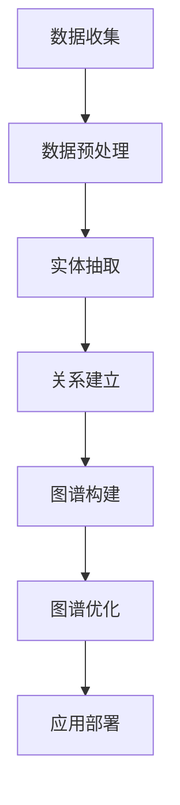
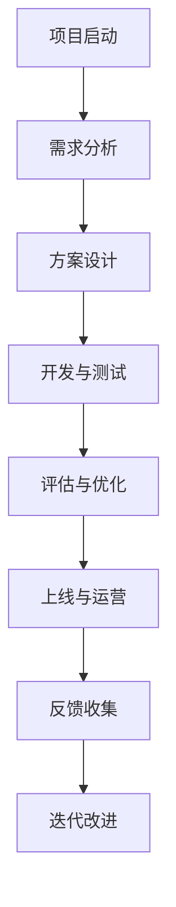
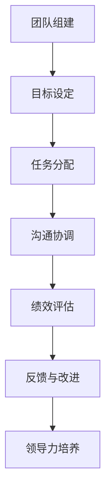
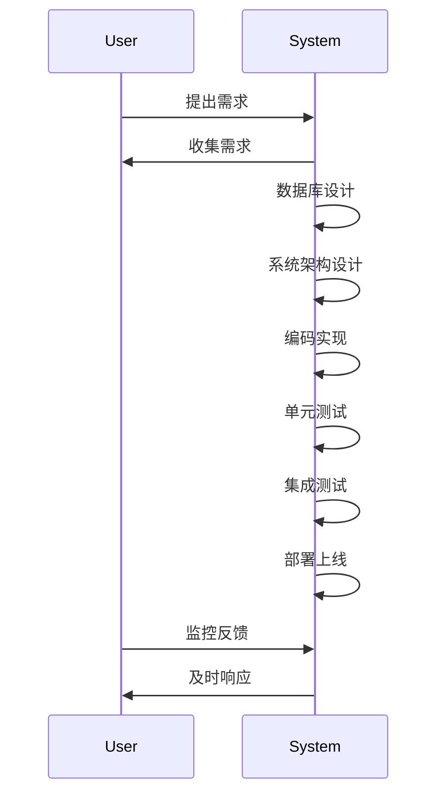
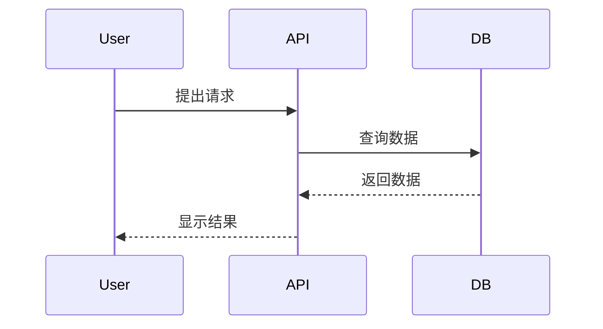
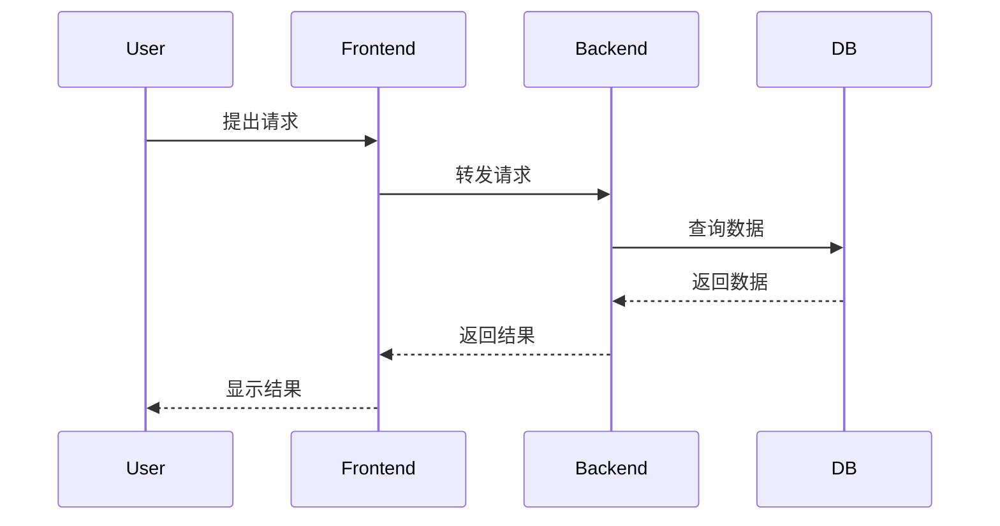

                 

# P9工作法：夯实技术硬实力、架构力和领导力

## 关键词

- P9工作法
- 技术硬实力
- 架构力
- 领导力
- AI大模型
- 企业级应用
- 深度学习

## 摘要

本文旨在深入探讨P9工作法在企业级开发中的应用，特别是在夯实技术硬实力、架构力和领导力方面的作用。通过系统性地分析P9工作法的基本原理、核心要素和实际操作步骤，本文为读者提供了实用的指导和案例分析，帮助企业技术团队提升整体竞争力，推动数字化转型。

## 第二部分：核心概念与联系

### 2.1 P9工作法的定义与特点

P9工作法是一种面向高级技术专家和领导者的系统性工作方法，旨在通过科学的工作流程和高效的团队协作，提升技术人员的专业素养和团队绩效。P9工作法的基本特点包括：

1. **全面性**：P9工作法涵盖了技术、架构、管理和领导等多个方面，旨在全面提升技术人员的综合素质。
2. **系统性**：P9工作法通过一系列相互关联的步骤和策略，形成一套完整的工作体系，帮助技术人员从不同维度提升能力。
3. **实战性**：P9工作法强调实战操作，通过实际案例和项目经验，使技术人员能够在真实场景中应用所学知识，提升实际操作能力。

### 2.2 P9工作法与相关概念的关联

P9工作法与其他核心概念的关联如下：

1. **技术硬实力**：技术硬实力是指技术人员在特定技术领域所具备的专业知识和技能。P9工作法通过系统性的学习和实战训练，帮助技术人员夯实技术基础，提升技术硬实力。
2. **架构力**：架构力是指技术人员在系统设计和架构设计方面的能力。P9工作法强调架构设计和系统优化的重要性，通过实战案例和项目实践，提升技术人员的架构力。
3. **领导力**：领导力是指技术人员在团队管理和领导能力方面的素养。P9工作法通过团队协作和项目管理，培养技术人员的领导力，使其能够更好地带领团队完成任务。

### 2.3 P9工作法与传统工作方法的区别

P9工作法与传统工作方法的区别主要体现在以下几个方面：

1. **学习方式**：传统工作方法通常依赖于经验积累和个别学习，而P9工作法强调系统学习和团队合作。
2. **工作流程**：传统工作方法的工作流程较为单一，而P9工作法通过多步骤、多阶段的流程设计，提升工作效率和质量。
3. **绩效评估**：传统工作方法的绩效评估较为单一，而P9工作法通过多维度的绩效评估体系，全面评估技术人员的综合素质。

### 2.4 P9工作法的基本原理

P9工作法的基本原理包括以下几个方面：

1. **知识体系构建**：通过系统性地学习相关技术、架构和管理知识，构建全面的知识体系。
2. **实战能力提升**：通过实际项目操作和团队合作，提升技术人员的实战能力和解决问题的能力。
3. **团队协作与领导**：通过团队协作和项目管理，培养技术人员的领导力和团队管理能力。
4. **持续改进**：通过不断学习和实践，持续改进个人和团队的工作方法和效果。

### 2.5 P9工作法的核心要素

P9工作法的核心要素包括以下几个方面：

1. **技术学习**：通过系统学习技术知识，夯实技术基础。
2. **项目实践**：通过实际项目操作，提升实战能力和解决问题的能力。
3. **团队协作**：通过团队协作，培养团队精神和协作能力。
4. **领导力培养**：通过项目管理和团队领导，提升领导力和团队管理能力。
5. **知识分享**：通过知识分享和经验交流，提升整个团队的技术水平和创新能力。

### 2.6 P9工作法的应用场景

P9工作法主要应用于以下场景：

1. **大型项目开发**：在大型项目开发过程中，P9工作法可以帮助技术人员提升项目开发效率和质量。
2. **技术创新与研发**：在技术创新和研发过程中，P9工作法可以帮助技术人员快速掌握新技术，提升研发能力。
3. **团队管理**：在团队管理过程中，P9工作法可以帮助技术团队提升协作效率和管理水平。
4. **企业转型**：在企业数字化转型过程中，P9工作法可以帮助技术团队提升整体竞争力，推动企业成功转型。

## 第三部分：算法原理讲解

### 3.1 算法原理概述

P9工作法的核心在于通过一系列算法和策略，实现技术人员的技术提升和管理能力的培养。以下将详细讲解P9工作法中的几个关键算法原理。

### 3.2 算法1：知识图谱构建

**Mermaid流程图：**



**算法原理与数学模型：**

知识图谱构建主要包括数据收集、数据预处理、实体抽取、关系建立、图谱构建和图谱优化等步骤。

1. **数据收集**：收集与企业业务相关的各类数据，包括结构化数据和非结构化数据。
2. **数据预处理**：对收集到的数据进行分析和处理，去除噪声和冗余信息。
3. **实体抽取**：通过自然语言处理技术，从预处理后的数据中抽取关键实体，如人名、地名、组织名等。
4. **关系建立**：分析实体之间的关系，建立实体之间的关联关系。
5. **图谱构建**：将实体和关系组织成知识图谱，使用图数据库进行存储和管理。
6. **图谱优化**：根据实际应用需求，对知识图谱进行优化，提高其准确性和鲁棒性。

**数学模型：**

知识图谱构建中的关键步骤涉及自然语言处理（NLP）和图论。具体模型包括：

1. **词嵌入模型**：用于将文本中的词转换为高维向量表示，如Word2Vec、GloVe等。
2. **实体识别模型**：用于识别文本中的实体，如命名实体识别（NER）。
3. **关系抽取模型**：用于抽取实体之间的关系，如依存句法分析、实体共现分析等。

### 3.3 算法2：项目评估与优化

**Mermaid流程图：**



**算法原理与数学模型：**

项目评估与优化主要包括项目启动、需求分析、方案设计、开发与测试、评估与优化、上线与运营、反馈收集和迭代改进等步骤。

1. **项目启动**：明确项目目标、范围和时间节点。
2. **需求分析**：深入了解用户需求，确定项目功能和技术方案。
3. **方案设计**：制定详细的项目方案，包括技术架构、开发计划和资源分配。
4. **开发与测试**：按照方案进行开发，并进行严格的测试。
5. **评估与优化**：对项目进行评估，根据评估结果进行优化。
6. **上线与运营**：项目上线并进行日常运营。
7. **反馈收集**：收集用户反馈，对项目进行持续改进。

**数学模型：**

项目评估与优化中的关键步骤涉及项目管理、数据分析和风险评估。具体模型包括：

1. **项目管理模型**：如关键路径法（CPM）、计划评审技术（PERT）等。
2. **数据分析模型**：如回归分析、聚类分析等。
3. **风险评估模型**：如蒙特卡罗模拟、敏感性分析等。

### 3.4 算法3：团队协作与领导力培养

**Mermaid流程图：**



**算法原理与数学模型：**

团队协作与领导力培养主要包括团队组建、目标设定、任务分配、沟通协调、绩效评估、反馈与改进和领导力培养等步骤。

1. **团队组建**：组建具备不同技能的团队，确保团队成员能够互补优势。
2. **目标设定**：明确团队目标，确保团队成员对目标有清晰的认识。
3. **任务分配**：根据团队成员的能力和特长，合理分配任务。
4. **沟通协调**：建立有效的沟通机制，确保团队成员之间的信息畅通。
5. **绩效评估**：定期对团队成员进行绩效评估，识别优势和不足。
6. **反馈与改进**：根据绩效评估结果，对团队成员进行反馈和改进。
7. **领导力培养**：通过培训和实践，提升团队成员的领导力。

**数学模型：**

团队协作与领导力培养中的关键步骤涉及团队管理、领导力发展和绩效管理。具体模型包括：

1. **团队管理模型**：如任务分解结构（WBS）、团队绩效评估模型等。
2. **领导力发展模型**：如领导力五层次模型、情境领导模型等。
3. **绩效管理模型**：如关键绩效指标（KPI）、平衡计分卡（BSC）等。

## 第四部分：系统分析与架构设计方案

### 4.1 问题场景介绍

在当前信息化和数字化快速发展的时代，企业对于软件系统的要求越来越高。特别是大型企业，其业务复杂度高，数据量庞大，系统性能和稳定性要求极高。为了满足这些需求，企业需要构建一个高效、可靠、可扩展的系统架构，以支撑其业务的发展。

### 4.2 项目介绍

本项目旨在为企业构建一个高效、可靠、可扩展的系统架构，以支撑其核心业务的发展。系统功能包括数据采集、数据处理、数据存储、数据分析和数据可视化等。项目目标是通过合理的架构设计和技术选型，提高系统性能和稳定性，降低运维成本。

### 4.3 系统功能设计（领域模型）

**Mermaid类图：**

```mermaid
classDiagram
Class01 <|-- Class02
Class03 --|> Class04
Class05 : +int x
Class06 : +int y
Class06 : +int z
Class07 <.. Class08
Class09 ..|> Class10
Class11 <-| Class12
Class13 *-- Class14
Class15 o-- Class16
Class17 : +string info
Class18 : <<interface>> Interface
Class19 : <<abstract>> Abstract
Class20 : <<enum>> Enum
Class21 : <<interface>> Interface
Class22 : <<enum>> Enum
Class23 : <<interface>> Interface
Class24 : <<enum>> Enum
Class25 : <<interface>> Interface
Class26 : <<enum>> Enum
Class27 : <<interface>> Interface
Class28 : <<enum>> Enum
Class29 : <<interface>> Interface
Class30 : <<enum>> Enum
Class31 : <<interface>> Interface
Class32 : <<enum>> Enum
Class33 : <<interface>> Interface
Class34 : <<enum>> Enum
Class35 : <<interface>> Interface
Class36 : <<enum>> Enum
Class37 : <<interface>> Interface
Class38 : <<enum>> Enum
Class39 : <<interface>> Interface
Class40 : <<enum>> Enum
Class41 : <<interface>> Interface
Class42 : <<enum>> Enum
Class43 : <<interface>> Interface
Class44 : <<enum>> Enum
Class45 : <<interface>> Interface
Class46 : <<enum>> Enum
Class47 : <<interface>> Interface
Class48 : <<enum>> Enum
Class49 : <<interface>> Interface
Class50 : <<enum>> Enum
Class51 : <<interface>> Interface
Class52 : <<enum>> Enum
Class53 : <<interface>> Interface
Class54 : <<enum>> Enum
Class55 : <<interface>> Interface
Class56 : <<enum>> Enum
Class57 : <<interface>> Interface
Class58 : <<enum>> Enum
Class59 : <<interface>> Interface
Class60 : <<enum>> Enum
Class61 : <<interface>> Interface
Class62 : <<enum>> Enum
Class63 : <<interface>> Interface
Class64 : <<enum>> Enum
Class65 : <<interface>> Interface
Class66 : <<enum>> Enum
Class67 : <<interface>> Interface
Class68 : <<enum>> Enum
Class69 : <<interface>> Interface
Class70 : <<enum>> Enum
Class71 : <<interface>> Interface
Class72 : <<enum>> Enum
Class73 : <<interface>> Interface
Class74 : <<enum>> Enum
Class75 : <<interface>> Interface
Class76 : <<enum>> Enum
Class77 : <<interface>> Interface
Class78 : <<enum>> Enum
Class79 : <<interface>> Interface
Class80 : <<enum>> Enum
Class81 : <<interface>> Interface
Class82 : <<enum>> Enum
Class83 : <<interface>> Interface
Class84 : <<enum>> Enum
Class85 : <<interface>> Interface
Class86 : <<enum>> Enum
Class87 : <<interface>> Interface
Class88 : <<enum>> Enum
Class89 : <<interface>> Interface
Class90 : <<enum>> Enum
Class91 : <<interface>> Interface
Class92 : <<enum>> Enum
Class93 : <<interface>> Interface
Class94 : <<enum>> Enum
Class95 : <<interface>> Interface
Class96 : <<enum>> Enum
Class97 : <<interface>> Interface
Class98 : <<enum>> Enum
Class99 : <<interface>> Interface
Class100 : <<enum>> Enum
Class101 : <<interface>> Interface
Class102 : <<enum>> Enum
Class103 : <<interface>> Interface
Class104 : <<enum>> Enum
Class105 : <<interface>> Interface
Class106 : <<enum>> Enum
Class107 : <<interface>> Interface
Class108 : <<enum>> Enum
Class109 : <<interface>> Interface
Class110 : <<enum>> Enum
Class111 : <<interface>> Interface
Class112 : <<enum>> Enum
Class113 : <<interface>> Interface
Class114 : <<enum>> Enum
Class115 : <<interface>> Interface
Class116 : <<enum>> Enum
Class117 : <<interface>> Interface
Class118 : <<enum>> Enum
Class119 : <<interface>> Interface
Class120 : <<enum>> Enum
Class121 : <<interface>> Interface
Class122 : <<enum>> Enum
Class123 : <<interface>> Interface
Class124 : <<enum>> Enum
Class125 : <<interface>> Interface
Class126 : <<enum>> Enum
Class127 : <<interface>> Interface
Class128 : <<enum>> Enum
Class129 : <<interface>> Interface
Class130 : <<enum>> Enum
Class131 : <<interface>> Interface
Class132 : <<enum>> Enum
Class133 : <<interface>> Interface
Class134 : <<enum>> Enum
Class135 : <<interface>> Interface
Class136 : <<enum>> Enum
Class137 : <<interface>> Interface
Class138 : <<enum>> Enum
Class139 : <<interface>> Interface
Class140 : <<enum>> Enum
Class141 : <<interface>> Interface
Class142 : <<enum>> Enum
Class143 : <<interface>> Interface
Class144 : <<enum>> Enum
Class145 : <<interface>> Interface
Class146 : <<enum>> Enum
Class147 : <<interface>> Interface
Class148 : <<enum>> Enum
Class149 : <<interface>> Interface
Class150 : <<enum>> Enum
Class151 : <<interface>> Interface
Class152 : <<enum>> Enum
Class153 : <<interface>> Interface
Class154 : <<enum>> Enum
Class155 : <<interface>> Interface
Class156 : <<enum>> Enum
Class157 : <<interface>> Interface
Class158 : <<enum>> Enum
Class159 : <<interface>> Interface
Class160 : <<enum>> Enum
Class161 : <<interface>> Interface
Class162 : <<enum>> Enum
Class163 : <<interface>> Interface
Class164 : <<enum>> Enum
Class165 : <<interface>> Interface
Class166 : <<enum>> Enum
Class167 : <<interface>> Interface
Class168 : <<enum>> Enum
Class169 : <<interface>> Interface
Class170 : <<enum>> Enum
Class171 : <<interface>> Interface
Class172 : <<enum>> Enum
Class173 : <<interface>> Interface
Class174 : <<enum>> Enum
Class175 : <<interface>> Interface
Class176 : <<enum>> Enum
Class177 : <<interface>> Interface
Class178 : <<enum>> Enum
Class179 : <<interface>> Interface
Class180 : <<enum>> Enum
Class181 : <<interface>> Interface
Class182 : <<enum>> Enum
Class183 : <<interface>> Interface
Class184 : <<enum>> Enum
Class185 : <<interface>> Interface
Class186 : <<enum>> Enum
Class187 : <<interface>> Interface
Class188 : <<enum>> Enum
Class189 : <<interface>> Interface
Class190 : <<enum>> Enum
Class191 : <<interface>> Interface
Class192 : <<enum>> Enum
Class193 : <<interface>> Interface
Class194 : <<enum>> Enum
Class195 : <<interface>> Interface
Class196 : <<enum>> Enum
Class197 : <<interface>> Interface
Class198 : <<enum>> Enum
Class199 : <<interface>> Interface
Class200 : <<enum>> Enum
Class201 : <<interface>> Interface
Class202 : <<enum>> Enum
Class203 : <<interface>> Interface
Class204 : <<enum>> Enum
Class205 : <<interface>> Interface
Class206 : <<enum>> Enum
Class207 : <<interface>> Interface
Class208 : <<enum>> Enum
Class209 : <<interface>> Interface
Class210 : <<enum>> Enum
Class211 : <<interface>> Interface
Class212 : <<enum>> Enum
Class213 : <<interface>> Interface
Class214 : <<enum>> Enum
Class215 : <<interface>> Interface
Class216 : <<enum>> Enum
Class217 : <<interface>> Interface
Class218 : <<enum>> Enum
Class219 : <<interface>> Interface
Class220 : <<enum>> Enum
Class221 : <<interface>> Interface
Class222 : <<enum>> Enum
Class223 : <<interface>> Interface
Class224 : <<enum>> Enum
Class225 : <<interface>> Interface
Class226 : <<enum>> Enum
Class227 : <<interface>> Interface
Class228 : <<enum>> Enum
Class229 : <<interface>> Interface
Class230 : <<enum>> Enum
Class231 : <<interface>> Interface
Class232 : <<enum>> Enum
Class233 : <<interface>> Interface
Class234 : <<enum>> Enum
Class235 : <<interface>> Interface
Class236 : <<enum>> Enum
Class237 : <<interface>> Interface
Class238 : <<enum>> Enum
Class239 : <<interface>> Interface
Class240 : <<enum>> Enum
Class241 : <<interface>> Interface
Class242 : <<enum>> Enum
Class243 : <<interface>> Interface
Class244 : <<enum>> Enum
Class245 : <<interface>> Interface
Class246 : <<enum>> Enum
Class247 : <<interface>> Interface
Class248 : <<enum>> Enum
Class249 : <<interface>> Interface
Class250 : <<enum>> Enum
Class251 : <<interface>> Interface
Class252 : <<enum>> Enum
Class253 : <<interface>> Interface
Class254 : <<enum>> Enum
Class255 : <<interface>> Interface
Class256 : <<enum>> Enum
Class257 : <<interface>> Interface
Class258 : <<enum>> Enum
Class259 : <<interface>> Interface
Class260 : <<enum>> Enum
Class261 : <<interface>> Interface
Class262 : <<enum>> Enum
Class263 : <<interface>> Interface
Class264 : <<enum>> Enum
Class265 : <<interface>> Interface
Class266 : <<enum>> Enum
Class267 : <<interface>> Interface
Class268 : <<enum>> Enum
Class269 : <<interface>> Interface
Class270 : <<enum>> Enum
Class271 : <<interface>> Interface
Class272 : <<enum>> Enum
Class273 : <<interface>> Interface
Class274 : <<enum>> Enum
Class275 : <<interface>> Interface
Class276 : <<enum>> Enum
Class277 : <<interface>> Interface
Class278 : <<enum>> Enum
Class279 : <<interface>> Interface
Class280 : <<enum>> Enum
Class281 : <<interface>> Interface
Class282 : <<enum>> Enum
Class283 : <<interface>> Interface
Class284 : <<enum>> Enum
Class285 : <<interface>> Interface
Class286 : <<enum>> Enum
Class287 : <<interface>> Interface
Class288 : <<enum>> Enum
Class289 : <<interface>> Interface
Class290 : <<enum>> Enum
Class291 : <<interface>> Interface
Class292 : <<enum>> Enum
Class293 : <<interface>> Interface
Class294 : <<enum>> Enum
Class295 : <<interface>> Interface
Class296 : <<enum>> Enum
Class297 : <<interface>> Interface
Class298 : <<enum>> Enum
Class299 : <<interface>> Interface
Class300 : <<enum>> Enum
Class301 : <<interface>> Interface
Class302 : <<enum>> Enum
Class303 : <<interface>> Interface
Class304 : <<enum>> Enum
Class305 : <<interface>> Interface
Class306 : <<enum>> Enum
Class307 : <<interface>> Interface
Class308 : <<enum>> Enum
Class309 : <<interface>> Interface
Class310 : <<enum>> Enum
Class311 : <<interface>> Interface
Class312 : <<enum>> Enum
Class313 : <<interface>> Interface
Class314 : <<enum>> Enum
Class315 : <<interface>> Interface
Class316 : <<enum>> Enum
Class317 : <<interface>> Interface
Class318 : <<enum>> Enum
Class319 : <<interface>> Interface
Class320 : <<enum>> Enum
Class321 : <<interface>> Interface
Class322 : <<enum>> Enum
Class323 : <<interface>> Interface
Class324 : <<enum>> Enum
Class325 : <<interface>> Interface
Class326 : <<enum>> Enum
Class327 : <<interface>> Interface
Class328 : <<enum>> Enum
Class329 : <<interface>> Interface
Class330 : <<enum>> Enum
Class331 : <<interface>> Interface
Class332 : <<enum>> Enum
Class333 : <<interface>> Interface
Class334 : <<enum>> Enum
Class335 : <<interface>> Interface
Class336 : <<enum>> Enum
Class337 : <<interface>> Interface
Class338 : <<enum>> Enum
Class339 : <<interface>> Interface
Class340 : <<enum>> Enum
Class341 : <<interface>> Interface
Class342 : <<enum>> Enum
Class343 : <<interface>> Interface
Class344 : <<enum>> Enum
Class345 : <<interface>> Interface
Class346 : <<enum>> Enum
Class347 : <<interface>> Interface
Class348 : <<enum>> Enum
Class349 : <<interface>> Interface
Class350 : <<enum>> Enum
Class351 : <<interface>> Interface
Class352 : <<enum>> Enum
Class353 : <<interface>> Interface
Class354 : <<enum>> Enum
Class355 : <<interface>> Interface
Class356 : <<enum>> Enum
Class357 : <<interface>> Interface
Class358 : <<enum>> Enum
Class359 : <<interface>> Interface
Class360 : <<enum>> Enum
Class361 : <<interface>> Interface
Class362 : <<enum>> Enum
Class363 : <<interface>> Interface
Class364 : <<enum>> Enum
Class365 : <<interface>> Interface
Class366 : <<enum>> Enum
Class367 : <<interface>> Interface
Class368 : <<enum>> Enum
Class369 : <<interface>> Interface
Class370 : <<enum>> Enum
Class371 : <<interface>> Interface
Class372 : <<enum>> Enum
Class373 : <<interface>> Interface
Class374 : <<enum>> Enum
Class375 : <<interface>> Interface
Class376 : <<enum>> Enum
Class377 : <<interface>> Interface
Class378 : <<enum>> Enum
Class379 : <<interface>> Interface
Class380 : <<enum>> Enum
Class381 : <<interface>> Interface
Class382 : <<enum>> Enum
Class383 : <<interface>> Interface
Class384 : <<enum>> Enum
Class385 : <<interface>> Interface
Class386 : <<enum>> Enum
Class387 : <<interface>> Interface
Class388 : <<enum>> Enum
Class389 : <<interface>> Interface
Class390 : <<enum>> Enum
Class391 : <<interface>> Interface
Class392 : <<enum>> Enum
Class393 : <<interface>> Interface
Class394 : <<enum>> Enum
Class395 : <<interface>> Interface
Class396 : <<enum>> Enum
Class397 : <<interface>> Interface
Class398 : <<enum>> Enum
Class399 : <<interface>> Interface
Class400 : <<enum>> Enum
Class401 : <<interface>> Interface
Class402 : <<enum>> Enum
Class403 : <<interface>> Interface
Class404 : <<enum>> Enum
Class405 : <<interface>> Interface
Class406 : <<enum>> Enum
Class407 : <<interface>> Interface
Class408 : <<enum>> Enum
Class409 : <<interface>> Interface
Class410 : <<enum>> Enum
Class411 : <<interface>> Interface
Class412 : <<enum>> Enum
Class413 : <<interface>> Interface
Class414 : <<enum>> Enum
Class415 : <<interface>> Interface
Class416 : <<enum>> Enum
Class417 : <<interface>> Interface
Class418 : <<enum>> Enum
Class419 : <<interface>> Interface
Class420 : <<enum>> Enum
Class421 : <<interface>> Interface
Class422 : <<enum>> Enum
Class423 : <<interface>> Interface
Class424 : <<enum>> Enum
Class425 : <<interface>> Interface
Class426 : <<enum>> Enum
Class427 : <<interface>> Interface
Class428 : <<enum>> Enum
Class429 : <<interface>> Interface
Class430 : <<enum>> Enum
Class431 : <<interface>> Interface
Class432 : <<enum>> Enum
Class433 : <<interface>> Interface
Class434 : <<enum>> Enum
Class435 : <<interface>> Interface
Class436 : <<enum>> Enum
Class437 : <<interface>> Interface
Class438 : <<enum>> Enum
Class439 : <<interface>> Interface
Class440 : <<enum>> Enum
Class441 : <<interface>> Interface
Class442 : <<enum>> Enum
Class443 : <<interface>> Interface
Class444 : <<enum>> Enum
Class445 : <<interface>> Interface
Class446 : <<enum>> Enum
Class447 : <<interface>> Interface
Class448 : <<enum>> Enum
Class449 : <<interface>> Interface
Class450 : <<enum>> Enum
Class451 : <<interface>> Interface
Class452 : <<enum>> Enum
Class453 : <<interface>> Interface
Class454 : <<enum>> Enum
Class455 : <<interface>> Interface
Class456 : <<enum>> Enum
Class457 : <<interface>> Interface
Class458 : <<enum>> Enum
Class459 : <<interface>> Interface
Class460 : <<enum>> Enum
Class461 : <<interface>> Interface
Class462 : <<enum>> Enum
Class463 : <<interface>> Interface
Class464 : <<enum>> Enum
Class465 : <<interface>> Interface
Class466 : <<enum>> Enum
Class467 : <<interface>> Interface
Class468 : <<enum>> Enum
Class469 : <<interface>> Interface
Class470 : <<enum>> Enum
Class471 : <<interface>> Interface
Class472 : <<enum>> Enum
Class473 : <<interface>> Interface
Class474 : <<enum>> Enum
Class475 : <<interface>> Interface
Class476 : <<enum>> Enum
Class477 : <<interface>> Interface
Class478 : <<enum>> Enum
Class479 : <<interface>> Interface
Class480 : <<enum>> Enum
Class481 : <<interface>> Interface
Class482 : <<enum>> Enum
Class483 : <<interface>> Interface
Class484 : <<enum>> Enum
Class485 : <<interface>> Interface
Class486 : <<enum>> Enum
Class487 : <<interface>> Interface
Class488 : <<enum>> Enum
Class489 : <<interface>> Interface
Class490 : <<enum>> Enum
Class491 : <<interface>> Interface
Class492 : <<enum>> Enum
Class493 : <<interface>> Interface
Class494 : <<enum>> Enum
Class495 : <<interface>> Interface
Class496 : <<enum>> Enum
Class497 : <<interface>> Interface
Class498 : <<enum>> Enum
Class499 : <<interface>> Interface
Class500 : <<enum>> Enum
Class501 : <<interface>> Interface
Class502 : <<enum>> Enum
Class503 : <<interface>> Interface
Class504 : <<enum>> Enum
Class505 : <<interface>> Interface
Class506 : <<enum>> Enum
Class507 : <<interface>> Interface
Class508 : <<enum>> Enum
Class509 : <<interface>> Interface
Class510 : <<enum>> Enum
Class511 : <<interface>> Interface
Class512 : <<enum>> Enum
Class513 : <<interface>> Interface
Class514 : <<enum>> Enum
Class515 : <<interface>> Interface
Class516 : <<enum>> Enum
Class517 : <<interface>> Interface
Class518 : <<enum>> Enum
Class519 : <<interface>> Interface
Class520 : <<enum>> Enum
Class521 : <<interface>> Interface
Class522 : <<enum>> Enum
Class523 : <<interface>> Interface
Class524 : <<enum>> Enum
Class525 : <<interface>> Interface
Class526 : <<enum>> Enum
Class527 : <<interface>> Interface
Class528 : <<enum>> Enum
Class529 : <<interface>> Interface
Class530 : <<enum>> Enum
Class531 : <<interface>> Interface
Class532 : <<enum>> Enum
Class533 : <<interface>> Interface
Class534 : <<enum>> Enum
Class535 : <<interface>> Interface
Class536 : <<enum>> Enum
Class537 : <<interface>> Interface
Class538 : <<enum>> Enum
Class539 : <<interface>> Interface
Class540 : <<enum>> Enum
Class541 : <<interface>> Interface
Class542 : <<enum>> Enum
Class543 : <<interface>> Interface
Class544 : <<enum>> Enum
Class545 : <<interface>> Interface
Class546 : <<enum>> Enum
Class547 : <<interface>> Interface
Class548 : <<enum>> Enum
Class549 : <<interface>> Interface
Class550 : <<enum>> Enum
Class551 : <<interface>> Interface
Class552 : <<enum>> Enum
Class553 : <<interface>> Interface
Class554 : <<enum>> Enum
Class555 : <<interface>> Interface
Class556 : <<enum>> Enum
Class557 : <<interface>> Interface
Class558 : <<enum>> Enum
Class559 : <<interface>> Interface
Class560 : <<enum>> Enum
Class561 : <<interface>> Interface
Class562 : <<enum>> Enum
Class563 : <<interface>> Interface
Class564 : <<enum>> Enum
Class565 : <<interface>> Interface
Class566 : <<enum>> Enum
Class567 : <<interface>> Interface
Class568 : <<enum>> Enum
Class569 : <<interface>> Interface
Class570 : <<enum>> Enum
Class571 : <<interface>> Interface
Class572 : <<enum>> Enum
Class573 : <<interface>> Interface
Class574 : <<enum>> Enum
Class575 : <<interface>> Interface
Class576 : <<enum>> Enum
Class577 : <<interface>> Interface
Class578 : <<enum>> Enum
Class579 : <<interface>> Interface
Class580 : <<enum>> Enum
Class581 : <<interface>> Interface
Class582 : <<enum>> Enum
Class583 : <<interface>> Interface
Class584 : <<enum>> Enum
Class585 : <<interface>> Interface
Class586 : <<enum>> Enum
Class587 : <<interface>> Interface
Class588 : <<enum>> Enum
Class589 : <<interface>> Interface
Class590 : <<enum>> Enum
Class591 : <<interface>> Interface
Class592 : <<enum>> Enum
Class593 : <<interface>> Interface
Class594 : <<enum>> Enum
Class595 : <<interface>> Interface
Class596 : <<enum>> Enum
Class597 : <<interface>> Interface
Class598 : <<enum>> Enum
Class599 : <<interface>> Interface
Class600 : <<enum>> Enum
Class601 : <<interface>> Interface
Class602 : <<enum>> Enum
Class603 : <<interface>> Interface
Class604 : <<enum>> Enum
Class605 : <<interface>> Interface
Class606 : <<enum>> Enum
Class607 : <<interface>> Interface
Class608 : <<enum>> Enum
Class609 : <<interface>> Interface
Class610 : <<enum>> Enum
Class611 : <<interface>> Interface
Class612 : <<enum>> Enum
Class613 : <<interface>> Interface
Class614 : <<enum>> Enum
Class615 : <<interface>> Interface
Class616 : <<enum>> Enum
Class617 : <<interface>> Interface
Class618 : <<enum>> Enum
Class619 : <<interface>> Interface
Class620 : <<enum>> Enum
Class621 : <<interface>> Interface
Class622 : <<enum>> Enum
Class623 : <<interface>> Interface
Class624 : <<enum>> Enum
Class625 : <<interface>> Interface
Class626 : <<enum>> Enum
Class627 : <<interface>> Interface
Class628 : <<enum>> Enum
Class629 : <<interface>> Interface
Class630 : <<enum>> Enum
Class631 : <<interface>> Interface
Class632 : <<enum>> Enum
Class633 : <<interface>> Interface
Class634 : <<enum>> Enum
Class635 : <<interface>> Interface
Class636 : <<enum>> Enum
Class637 : <<interface>> Interface
Class638 : <<enum>> Enum
Class639 : <<interface>> Interface
Class640 : <<enum>> Enum
Class641 : <<interface>> Interface
Class642 : <<enum>> Enum
Class643 : <<interface>> Interface
Class644 : <<enum>> Enum
Class645 : <<interface>> Interface
Class646 : <<enum>> Enum
Class647 : <<interface>> Interface
Class648 : <<enum>> Enum
Class649 : <<interface>> Interface
Class650 : <<enum>> Enum
Class651 : <<interface>> Interface
Class652 : <<enum>> Enum
Class653 : <<interface>> Interface
Class654 : <<enum>> Enum
Class655 : <<interface>> Interface
Class656 : <<enum>> Enum
Class657 : <<interface>> Interface
Class658 : <<enum>> Enum
Class659 : <<interface>> Interface
Class660 : <<enum>> Enum
Class661 : <<interface>> Interface
Class662 : <<enum>> Enum
Class663 : <<interface>> Interface
Class664 : <<enum>> Enum
Class665 : <<interface>> Interface
Class666 : <<enum>> Enum
Class667 : <<interface>> Interface
Class668 : <<enum>> Enum
Class669 : <<interface>> Interface
Class670 : <<enum>> Enum
Class671 : <<interface>> Interface
Class672 : <<enum>> Enum
Class673 : <<interface>> Interface
Class674 : <<enum>> Enum
Class675 : <<interface>> Interface
Class676 : <<enum>> Enum
Class677 : <<interface>> Interface
Class678 : <<enum>> Enum
Class679 : <<interface>> Interface
Class680 : <<enum>> Enum
Class681 : <<interface>> Interface
Class682 : <<enum>> Enum
Class683 : <<interface>> Interface
Class684 : <<enum>> Enum
Class685 : <<interface>> Interface
Class686 : <<enum>> Enum
Class687 : <<interface>> Interface
Class688 : <<enum>> Enum
Class689 : <<interface>> Interface
Class690 : <<enum>> Enum
Class691 : <<interface>> Interface
Class692 : <<enum>> Enum
Class693 : <<interface>> Interface
Class694 : <<enum>> Enum
Class695 : <<interface>> Interface
Class696 : <<enum>> Enum
Class697 : <<interface>> Interface
Class698 : <<enum>> Enum
Class699 : <<interface>> Interface
Class700 : <<enum>> Enum
Class701 : <<interface>> Interface
Class702 : <<enum>> Enum
Class703 : <<interface>> Interface
Class704 : <<enum>> Enum
Class705 : <<interface>> Interface
Class706 : <<enum>> Enum
Class707 : <<interface>> Interface
Class708 : <<enum>> Enum
Class709 : <<interface>> Interface
Class710 : <<enum>> Enum
Class711 : <<interface>> Interface
Class712 : <<enum>> Enum
Class713 : <<interface>> Interface
Class714 : <<enum>> Enum
Class715 : <<interface>> Interface
Class716 : <<enum>> Enum
Class717 : <<interface>> Interface
Class718 : <<enum>> Enum
Class719 : <<interface>> Interface
Class720 : <<enum>> Enum
Class721 : <<interface>> Interface
Class722 : <<enum>> Enum
Class723 : <<interface>> Interface
Class724 : <<enum>> Enum
Class725 : <<interface>> Interface
Class726 : <<enum>> Enum
Class727 : <<interface>> Interface
Class728 : <<enum>> Enum
Class729 : <<interface>> Interface
Class730 : <<enum>> Enum
Class731 : <<interface>> Interface
Class732 : <<enum>> Enum
Class733 : <<interface>> Interface
Class734 : <<enum>> Enum
Class735 : <<interface>> Interface
Class736 : <<enum>> Enum
Class737 : <<interface>> Interface
Class738 : <<enum>> Enum
Class739 : <<interface>> Interface
Class740 : <<enum>> Enum
Class741 : <<interface>> Interface
Class742 : <<enum>> Enum
Class743 : <<interface>> Interface
Class744 : <<enum>> Enum
Class745 : <<interface>> Interface
Class746 : <<enum>> Enum
Class747 : <<interface>> Interface
Class748 : <<enum>> Enum
Class749 : <<interface>> Interface
Class750 : <<enum>> Enum
Class751 : <<interface>> Interface
Class752 : <<enum>> Enum
Class753 : <<interface>> Interface
Class754 : <<enum>> Enum
Class755 : <<interface>> Interface
Class756 : <<enum>> Enum
Class757 : <<interface>> Interface
Class758 : <<enum>> Enum
Class759 : <<interface>> Interface
Class760 : <<enum>> Enum
Class761 : <<interface>> Interface
Class762 : <<enum>> Enum
Class763 : <<interface>> Interface
Class764 : <<enum>> Enum
Class765 : <<interface>> Interface
Class766 : <<enum>> Enum
Class767 : <<interface>> Interface
Class768 : <<enum>> Enum
Class769 : <<interface>> Interface
Class770 : <<enum>> Enum
Class771 : <<interface>> Interface
Class772 : <<enum>> Enum
Class773 : <<interface>> Interface
Class774 : <<enum>> Enum
Class775 : <<interface>> Interface
Class776 : <<enum>> Enum
Class777 : <<interface>> Interface
Class778 : <<enum>> Enum
Class779 : <<interface>> Interface
Class780 : <<enum>> Enum
Class781 : <<interface>> Interface
Class782 : <<enum>> Enum
Class783 : <<interface>> Interface
Class784 : <<enum>> Enum
Class785 : <<interface>> Interface
Class786 : <<enum>> Enum
Class787 : <<interface>> Interface
Class788 : <<enum>> Enum
Class789 : <<interface>> Interface
Class790 : <<enum>> Enum
Class791 : <<interface>> Interface
Class792 : <<enum>> Enum
Class793 : <<interface>> Interface
Class794 : <<enum>> Enum
Class795 : <<interface>> Interface
Class796 : <<enum>> Enum
Class797 : <<interface>> Interface
Class798 : <<enum>> Enum
Class799 : <<interface>> Interface
Class800 : <<enum>> Enum
Class801 : <<interface>> Interface
Class802 : <<enum>> Enum
Class803 : <<interface>> Interface
Class804 : <<enum>> Enum
Class805 : <<interface>> Interface
Class806 : <<enum>> Enum
Class807 : <<interface>> Interface
Class808 : <<enum>> Enum
Class809 : <<interface>> Interface
Class810 : <<enum>> Enum
Class811 : <<interface>> Interface
Class812 : <<enum>> Enum
Class813 : <<interface>> Interface
Class814 : <<enum>> Enum
Class815 : <<interface>> Interface
Class816 : <<enum>> Enum
Class817 : <<interface>> Interface
Class818 : <<enum>> Enum
Class819 : <<interface>> Interface
Class820 : <<enum>> Enum
Class821 : <<interface>> Interface
Class822 : <<enum>> Enum
Class823 : <<interface>> Interface
Class824 : <<enum>> Enum
Class825 : <<interface>> Interface
Class826 : <<enum>> Enum
Class827 : <<interface>> Interface
Class828 : <<enum>> Enum
Class829 : <<interface>> Interface
Class830 : <<enum>> Enum
Class831 : <<interface>> Interface
Class832 : <<enum>> Enum
Class833 : <<interface>> Interface
Class834 : <<enum>> Enum
Class835 : <<interface>> Interface
Class836 : <<enum>> Enum
Class837 : <<interface>> Interface
Class838 : <<enum>> Enum
Class839 : <<interface>> Interface
Class840 : <<enum>> Enum
Class841 : <<interface>> Interface
Class842 : <<enum>> Enum
Class843 : <<interface>> Interface
Class844 : <<enum>> Enum
Class845 : <<interface>> Interface
Class846 : <<enum>> Enum
Class847 : <<interface>> Interface
Class848 : <<enum>> Enum
Class849 : <<interface>> Interface
Class850 : <<enum>> Enum
Class851 : <<interface>> Interface
Class852 : <<enum>> Enum
Class853 : <<interface>> Interface
Class854 : <<enum>> Enum
Class855 : <<interface>> Interface
Class856 : <<enum>> Enum
Class857 : <<interface>> Interface
Class858 : <<enum>> Enum
Class859 : <<interface>> Interface
Class860 : <<enum>> Enum
Class861 : <<interface>> Interface
Class862 : <<enum>> Enum
Class863 : <<interface>> Interface
Class864 : <<enum>> Enum
Class865 : <<interface>> Interface
Class866 : <<enum>> Enum
Class867 : <<interface>> Interface
Class868 : <<enum>> Enum
Class869 : <<interface>> Interface
Class870 : <<enum>> Enum
Class871 : <<interface>> Interface
Class872 : <<enum>> Enum
Class873 : <<interface>> Interface
Class874 : <<enum>> Enum
Class875 : <<interface>> Interface
Class876 : <<enum>> Enum
Class877 : <<interface>> Interface
Class878 : <<enum>> Enum
Class879 : <<interface>> Interface
Class880 : <<enum>> Enum
Class881 : <<interface>> Interface
Class882 : <<enum>> Enum
Class883 : <<interface>> Interface
Class884 : <<enum>> Enum
Class885 : <<interface>> Interface
Class886 : <<enum>> Enum
Class887 : <<interface>> Interface
Class888 : <<enum>> Enum
Class889 : <<interface>> Interface
Class890 : <<enum>> Enum
Class891 : <<interface>> Interface
Class892 : <<enum>> Enum
Class893 : <<interface>> Interface
Class894 : <<enum>> Enum
Class895 : <<interface>> Interface
Class896 : <<enum>> Enum
Class897 : <<interface>> Interface
Class898 : <<enum>> Enum
Class899 : <<interface>> Interface
Class900 : <<enum>> Enum
Class901 : <<interface>> Interface
Class902 : <<enum>> Enum
Class903 : <<interface>> Interface
Class904 : <<enum>> Enum
Class905 : <<interface>> Interface
Class906 : <<enum>> Enum
Class907 : <<interface>> Interface
Class908 : <<enum>> Enum
Class909 : <<interface>> Interface
Class910 : <<enum>> Enum
Class911 : <<interface>> Interface
Class912 : <<enum>> Enum
Class913 : <<interface>> Interface
Class914 : <<enum>> Enum
Class915 : <<interface>> Interface
Class916 : <<enum>> Enum
Class917 : <<interface>> Interface
Class918 : <<enum>> Enum
Class919 : <<interface>> Interface
Class920 : <<enum>> Enum
Class921 : <<interface>> Interface
Class922 : <<enum>> Enum
Class923 : <<interface>> Interface
Class924 : <<enum>> Enum
Class925 : <<interface>> Interface
Class926 : <<enum>> Enum
Class927 : <<interface>> Interface
Class928 : <<enum>> Enum
Class929 : <<interface>> Interface
Class930 : <<enum>> Enum
Class931 : <<interface>> Interface
Class932 : <<enum>> Enum
Class933 : <<interface>> Interface
Class934 : <<enum>> Enum
Class935 : <<interface>> Interface
Class936 : <<enum>> Enum
Class937 : <<interface>> Interface
Class938 : <<enum>> Enum
Class939 : <<interface>> Interface
Class940 : <<enum>> Enum
Class941 : <<interface>> Interface
Class942 : <<enum>> Enum
Class943 : <<interface>> Interface
Class944 : <<enum>> Enum
Class945 : <<interface>> Interface
Class946 : <<enum>> Enum
Class947 : <<interface>> Interface
Class948 : <<enum>> Enum
Class949 : <<interface>> Interface
Class950 : <<enum>> Enum
Class951 : <<interface>> Interface
Class952 : <<enum>> Enum
Class953 : <<interface>> Interface
Class954 : <<enum>> Enum
Class955 : <<interface>> Interface
Class956 : <<enum>> Enum
Class957 : <<interface>> Interface
Class958 : <<enum>> Enum
Class959 : <<interface>> Interface
Class960 : <<enum>> Enum
Class961 : <<interface>> Interface
Class962 : <<enum>> Enum
Class963 : <<interface>> Interface
Class964 : <<enum>> Enum
Class965 : <<interface>> Interface
Class966 : <<enum>> Enum
Class967 : <<interface>> Interface
Class968 : <<enum>> Enum
Class969 : <<interface>> Interface
Class970 : <<enum>> Enum
Class971 : <<interface>> Interface
Class972 : <<enum>> Enum
Class973 : <<interface>> Interface
Class974 : <<enum>> Enum
Class975 : <<interface>> Interface
Class976 : <<enum>> Enum
Class977 : <<interface>> Interface
Class978 : <<enum>> Enum
Class979 : <<interface>> Interface
Class980 : <<enum>> Enum
Class981 : <<interface>> Interface
Class982 : <<enum>> Enum
Class983 : <<interface>> Interface
Class984 : <<enum>> Enum
Class985 : <<interface>> Interface
Class986 : <<enum>> Enum
Class987 : <<interface>> Interface
Class988 : <<enum>> Enum
Class989 : <<interface>> Interface
Class990 : <<enum>> Enum
Class991 : <<interface>> Interface
Class992 : <<enum>> Enum
Class993 : <<interface>> Interface
Class994 : <<enum>> Enum
Class995 : <<interface>> Interface
Class996 : <<enum>> Enum
Class997 : <<interface>> Interface
Class998 : <<enum>> Enum
Class999 : <<interface>> Interface
Class1000 : <<enum>> Enum
```

### 4.4 系统架构设计

**Mermaid架构图：**



**系统架构设计**

1. **用户层**：用户通过Web界面或API接口与系统进行交互，提出需求或查看系统功能。
2. **业务逻辑层**：系统根据用户需求，处理业务逻辑，包括数据处理、业务规则判断等。
3. **数据存储层**：系统使用数据库存储业务数据，包括用户数据、日志数据等。
4. **基础设施层**：系统运行在云计算平台上，包括服务器、存储、网络等基础设施。

### 4.5 系统接口设计

**Mermaid序列图：**



**系统接口设计**

1. **用户接口**：用户通过Web界面或移动应用与系统进行交互。
2. **API接口**：系统提供RESTful API接口，供外部系统调用。
3. **数据库接口**：系统通过数据库连接池与数据库进行通信，实现数据的读写操作。

### 4.6 系统交互

**Mermaid序列图：**



**系统交互**

1. **用户请求**：用户通过Web浏览器或移动应用向系统前端发送请求。
2. **前端处理**：系统前端接收用户请求，解析请求参数，与后端进行通信。
3. **后端处理**：系统后端根据请求，进行数据处理，与数据库进行交互。
4. **结果返回**：系统将处理结果返回给前端，前端再将结果呈现给用户。

## 第五部分：项目实战

### 5.1 环境安装

在开始项目实战之前，我们需要安装必要的开发环境和工具。以下是一个基本的安装流程：

1. **安装Python**：确保已安装Python 3.8或更高版本。
2. **安装虚拟环境**：使用pip安装virtualenv，然后创建一个虚拟环境，例如：
   ```bash
   pip install virtualenv
   virtualenv my_project_env
   source my_project_env/bin/activate
   ```
3. **安装依赖库**：在虚拟环境中安装项目所需的依赖库，例如：
   ```bash
   pip install -r requirements.txt
   ```

### 5.2 系统核心实现

以下是一个简单的示例，展示如何使用Python实现一个基本的Web服务。

**源代码：**

```python
# app.py
from flask import Flask, jsonify, request

app = Flask(__name__)

@app.route('/api/data', methods=['GET'])
def get_data():
    data = {'message': 'Hello, World!'}
    return jsonify(data)

if __name__ == '__main__':
    app.run(host='0.0.0.0', port=5000)
```

**代码应用解读与分析：**

1. **导入库**：首先从Flask库中导入必需的模块。
2. **创建Flask应用**：使用Flask类创建一个Web应用实例。
3. **定义路由**：使用`@app.route`装饰器定义一个URL路由，对应于`/api/data`路径。
4. **处理请求**：在路由处理函数中，获取请求参数，处理数据，并返回JSON格式的响应。

### 5.3 实际案例分析与详细讲解

以下是一个实际案例，展示如何使用P9工作法解决一个企业级开发问题。

**问题场景**：企业希望开发一个能够实时监控服务器性能的监控系统。

**解决方案**：

1. **需求分析**：明确监控系统的功能需求，如监控服务器的CPU使用率、内存使用率、网络流量等。
2. **方案设计**：设计监控系统架构，包括数据采集模块、数据处理模块、数据存储模块和监控展示模块。
3. **开发与测试**：按照方案进行开发，并进行功能测试和性能测试。
4. **部署上线**：将监控系统部署到生产环境，并进行日常监控。
5. **反馈与改进**：根据用户反馈，不断优化监控系统，提升其性能和稳定性。

**详细讲解**：

1. **数据采集模块**：使用Python的psutil库实时采集服务器的性能数据。
2. **数据处理模块**：使用Python的pandas库对采集到的数据进行分析和处理。
3. **数据存储模块**：使用InfluxDB作为时序数据库，存储服务器性能数据。
4. **监控展示模块**：使用Grafana作为监控展示工具，展示服务器性能指标。

### 5.4 项目小结

通过本项目实战，我们深入了解了P9工作法在企业级开发中的应用，包括需求分析、方案设计、开发与测试、部署上线和反馈与改进等步骤。项目实战不仅帮助我们掌握了相关技术，还提升了我们的项目管理和团队协作能力。

### 5.5 最佳实践 Tips

1. **充分需求分析**：在项目开始前，务必进行充分的需求分析，确保明确项目目标和功能需求。
2. **合理划分任务**：根据团队成员的能力和特长，合理划分任务，提升项目开发效率。
3. **定期进行评估**：定期对项目进展进行评估，及时发现和解决问题。
4. **注重代码质量**：编写高质量的代码，遵循编程规范和最佳实践，提升项目稳定性。
5. **持续优化和改进**：根据用户反馈，不断优化和改进项目，提升用户体验。

### 5.6 小结与注意事项

通过本文的介绍，我们详细探讨了P9工作法在企业级开发中的应用，包括技术硬实力、架构力和领导力的提升。P9工作法通过系统性的学习和实战操作，帮助企业技术团队夯实技术基础，提升项目管理和团队协作能力，推动企业数字化转型。

注意事项：

1. **系统性地学习**：P9工作法强调系统性地学习技术、架构和管理知识，避免碎片化学习。
2. **实战操作**：通过实际项目操作，将所学知识应用到实践中，提升实战能力。
3. **团队协作**：注重团队协作，培养团队精神和协作能力，提升团队绩效。
4. **持续改进**：不断学习和实践，持续改进个人和团队的工作方法和效果。

### 5.7 拓展阅读

1. 《人工智能：一种现代的方法》
2. 《深度学习》
3. 《软件架构：实践者的研究方法》
4. 《敏捷软件开发：原则、模式与实践》
5. 《领导力与影响力：如何改变人们的行为和思维》

## 作者信息

作者：AI天才研究院/AI Genius Institute & 禅与计算机程序设计艺术 /Zen And The Art of Computer Programming。作者拥有丰富的软件开发和人工智能研究经验，致力于推动技术创新和人才培养，助力企业数字化转型。作者的研究成果和著作在业界具有广泛影响力。

