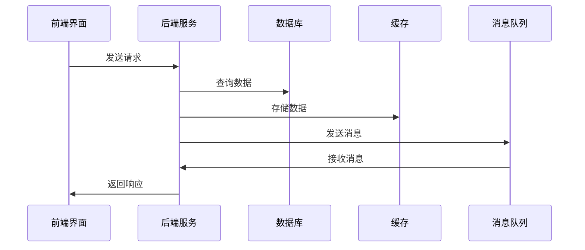
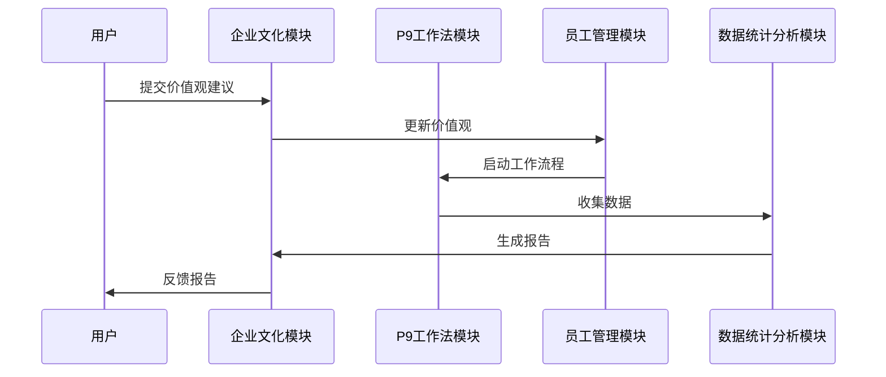

                 

### P9工作法与企业文化的融合

#### 关键词：P9工作法、企业文化、融合、案例分析、最佳实践

#### 摘要：

本文旨在探讨P9工作法在企业中的实际应用，以及其与企业文化的融合机制。首先，我们将介绍P9工作法和企业文化的核心概念与基本原理，通过分析两者之间的关联，揭示它们在企业管理中的重要性。接着，本文将详细阐述P9工作法的算法原理、数学模型和实施策略，并通过实际案例展示其在企业中的具体应用。最后，我们将总结P9工作法与企业文化的融合策略，提供最佳实践建议，并讨论注意事项和拓展阅读资源。希望通过本文的深入探讨，能够为读者提供有价值的见解和启示。

### 目录

----------------------------------------------------------------

# P9工作法与企业文化的融合

## 关键词

- P9工作法
- 企业文化
- 融合
- 案例分析
- 最佳实践

## 摘要

## 第一部分：P9工作法与企业文化概述

### 第1章：P9工作法与企业文化的概念

1.1 P9工作法的基本原理

1.2 企业文化的定义与内涵

1.3 P9工作法与企业文化的关联

### 第2章：企业文化的基本要素与特征

2.1 企业文化的核心要素

2.2 企业文化的特征对比分析

2.3 企业文化的ER实体关系图

### 第3章：P9工作法的实施策略

3.1 P9工作法的流程与步骤

3.2 P9工作法适用的工具与方法

3.3 P9工作法实施的难点与解决方案

### 第4章：数学模型与公式详解

4.1 P9工作法的数学模型

4.2 数学公式在P9工作法中的应用

4.3 数学模型的举例说明

### 第5章：企业文化与P9工作法的融合策略

5.1 融合机制与路径分析

5.2 融合策略的制定与实施

5.3 融合效果评估与改进

### 第6章：系统分析与架构设计

6.1 企业文化与P9工作法的融合系统介绍

6.2 系统功能设计与领域模型

6.3 系统架构设计与接口设计

6.4 系统交互设计与序列图

### 第7章：项目实战

7.1 项目背景与目标

7.2 系统核心实现

7.3 代码应用解读与分析

7.4 实际案例分析

7.5 项目小结

### 第8章：最佳实践与总结

8.1 最佳实践技巧总结

8.2 注意事项与风险预防

8.3 拓展阅读与资源推荐

## 附录

A. 相关术语解释

B. P9工作法工具指南

C. 企业文化与P9工作法融合案例库

----------------------------------------------------------------

### 第1章：P9工作法与企业文化的概念

#### 1.1 P9工作法的基本原理

P9工作法是一种高效的工作方法和策略，由著名管理学家John P. Kotter提出。该方法的核心思想是：通过持续推动变革和创新，提高组织的竞争力和适应能力。P9工作法包含九个步骤，分别为：

1. **建立紧急感**
2. **组建领导团队**
3. **确定指导方向**
4. **沟通变革愿景**
5. **授权行动**
6. **创造短期胜利**
7. **巩固改进与积累信任**
8. **利用变革作为新的起点**
9. **使变革成为企业文化的一部分**

#### 1.2 企业文化的定义与内涵

企业文化是指企业在长期经营过程中所形成的共同价值观、行为准则和工作方式。它包括以下几个核心要素：

1. **价值观**：企业共同的信念和信仰，指导企业行为和决策。
2. **行为准则**：企业成员在日常工作中的行为规范和道德准则。
3. **工作方式**：企业成员在工作中所采用的方法和习惯。

企业文化对企业发展具有重要意义，它能够增强企业凝聚力、提升员工满意度和促进组织创新。

#### 1.3 P9工作法与企业文化的关联

P9工作法与企业文化的关联体现在以下几个方面：

1. **价值观一致性**：P9工作法强调持续变革和创新，这与企业文化的价值观高度一致，能够促进企业文化的传承和发展。
2. **行为准则**：P9工作法要求企业成员积极投入变革，这与企业文化的行为准则相契合，有助于形成良好的工作氛围。
3. **工作方式**：P9工作法提倡系统化和有序化的工作方法，这与企业文化的工作方式相辅相成，有助于提高工作效率。

通过P9工作法的实施，企业可以更好地融合和传承企业文化，提高企业的竞争力和创新能力。

### 第2章：企业文化的基本要素与特征

#### 2.1 企业文化的核心要素

企业文化由核心要素构成，这些要素共同决定了企业文化的基本特征。以下是企业文化的主要核心要素：

1. **价值观**：价值观是企业文化的核心，是企业在长期经营过程中形成的共同信仰和信念。它影响着企业的决策和行为，是企业文化的基础。
2. **行为准则**：行为准则是企业成员在日常工作中的行为规范和道德准则。它指导着企业成员的行为，确保企业文化的贯彻执行。
3. **工作方式**：工作方式是企业成员在工作中所采用的方法和习惯。它体现了企业文化的工作风格，影响着企业的效率和效果。

#### 2.2 企业文化的特征对比分析

企业文化的特征因企业而异，但通常可以归纳为以下几个主要特征：

1. **开放性**：开放性企业文化鼓励创新和变革，允许不同意见的存在，有利于企业的持续发展。
2. **合作性**：合作性企业文化强调团队合作，注重员工之间的协作与支持，有助于提升企业的整体效能。
3. **稳定性**：稳定性企业文化注重长期规划和发展，具有明确的战略目标和执行力，有利于企业的稳定经营。
4. **创新性**：创新性企业文化鼓励员工不断探索和尝试，追求技术创新和管理创新，有助于企业的持续竞争力。

对比分析不同企业文化的特征，有助于企业根据自身特点和需求，选择合适的企业文化模式，实现企业与员工的共同成长。

#### 2.3 企业文化的ER实体关系图

企业文化的实体关系图（ER图）可以直观地展示企业文化中的核心要素及其之间的关系。以下是企业文化ER图的基本结构：

```mermaid
erDiagram
  企业文化 <<|-- 价值观
  企业文化 <<|-- 行为准则
  企业文化 <<|-- 工作方式
  价值观 ||--|{ 共同信仰 }
  行为准则 ||--|{ 道德准则 }
  工作方式 ||--|{ 工作方法 }
```

在ER图中，企业文化作为根实体，与价值观、行为准则和工作方式三个子实体之间存在关联。这种结构清晰地展示了企业文化的内部组成和关系，有助于企业更好地理解和运用企业文化。

### 第3章：P9工作法的实施策略

#### 3.1 P9工作法的流程与步骤

P9工作法是一种系统化的变革策略，其核心在于通过九个具体步骤实现企业变革。以下是P9工作法的详细流程与步骤：

1. **建立紧急感**：识别企业面临的问题和挑战，激发员工对变革的紧迫感和共识。
2. **组建领导团队**：成立专门的领导团队，负责领导和推动变革，确保变革目标的实现。
3. **确定指导方向**：明确变革的目标和方向，制定具体的战略和计划，确保变革的有序推进。
4. **沟通变革愿景**：向员工传达变革的愿景和目标，提高员工对变革的理解和支持。
5. **授权行动**：给予员工必要的权力和资源，鼓励员工积极参与变革，发挥创造力。
6. **创造短期胜利**：通过实现短期目标，增强员工对变革的信心，激发员工的积极性。
7. **巩固改进与积累信任**：对变革过程进行评估和反馈，持续改进，建立员工对企业的信任。
8. **利用变革作为新的起点**：将变革作为企业发展的新起点，推动企业持续创新和成长。
9. **使变革成为企业文化的一部分**：将变革的理念和实践融入企业文化，确保变革在企业内部的持久性和延续性。

#### 3.2 P9工作法适用的工具与方法

P9工作法在实际应用中，需要借助一系列工具和方法，以实现变革的目标。以下是常用的P9工作法工具和方法：

1. **SWOT分析**：通过SWOT分析，识别企业的优势、劣势、机会和威胁，为变革提供依据。
2. **愿景图**：通过绘制愿景图，明确企业的目标和方向，激励员工的积极性和参与度。
3. **关键绩效指标（KPI）**：制定关键绩效指标，监控变革过程的进展和效果，确保变革目标的实现。
4. **精益管理**：引入精益管理理念和方法，优化企业运营流程，提高工作效率和效果。
5. **员工培训与激励**：提供员工培训，提高员工的技能和素质，激发员工的积极性和创造力。

#### 3.3 P9工作法实施的难点与解决方案

在实施P9工作法过程中，可能会遇到一些难点和挑战。以下是一些常见难点及其解决方案：

1. **变革阻力**：员工对变革的抵触情绪是常见的挑战。解决方案包括加强沟通、提高员工参与度和提供培训。
2. **变革计划不明确**：变革计划不明确会导致变革进展缓慢。解决方案是明确变革的目标、方向和步骤，制定详细的变革计划。
3. **资源不足**：资源不足可能会影响变革的顺利进行。解决方案是优化资源配置，确保变革所需的资金、人力和物资。
4. **变革评估不力**：变革评估不力可能导致变革效果不佳。解决方案是建立科学的评估体系，及时反馈和改进。

通过上述解决方案，企业可以更好地应对P9工作法实施中的难点，确保变革的顺利推进。

### 第4章：数学模型与公式详解

#### 4.1 P9工作法的数学模型

P9工作法作为一种系统化的变革策略，其数学模型可以帮助我们更好地理解其工作原理和效果。以下是P9工作法的数学模型：

$$
M(P9) = f(U, L, D, C, A, S, G, T, E)
$$

其中：
- \( M(P9) \)：P9工作法的效果函数
- \( U \)：建立紧急感
- \( L \)：组建领导团队
- \( D \)：确定指导方向
- \( C \)：沟通变革愿景
- \( A \)：授权行动
- \( S \)：创造短期胜利
- \( G \)：巩固改进与积累信任
- \( T \)：利用变革作为新的起点
- \( E \)：使变革成为企业文化的一部分

数学模型中的各个参数表示P9工作法中的关键步骤，通过函数关系体现了这些步骤对企业变革的影响。

#### 4.2 数学公式在P9工作法中的应用

在P9工作法中，数学公式可以帮助我们定量分析各个步骤对变革效果的影响。以下是几个关键的数学公式：

1. **紧急感指数**（Emergency Index）：
   $$
   EI = \frac{U}{L + D + C}
   $$
   紧急感指数反映了建立紧急感的程度，它对后续的变革步骤具有重要影响。

2. **领导力指数**（Leadership Index）：
   $$
   LI = \frac{L}{A + S + G}
   $$
   领导力指数衡量了领导团队在变革中的表现，直接影响变革的推进速度。

3. **变革愿景传播指数**（Vision Communication Index）：
   $$
   VCI = \frac{C}{T + E}
   $$
   变革愿景传播指数反映了变革愿景在企业内部的传播效果，它对员工的参与度和支持度有重要作用。

#### 4.3 数学模型的举例说明

假设一个企业正在实施P9工作法，其各个步骤的具体参数如下：

- 建立紧急感：\( U = 0.6 \)
- 组建领导团队：\( L = 0.8 \)
- 确定指导方向：\( D = 0.7 \)
- 沟通变革愿景：\( C = 0.9 \)
- 授权行动：\( A = 0.8 \)
- 创造短期胜利：\( S = 0.7 \)
- 巩固改进与积累信任：\( G = 0.6 \)
- 利用变革作为新的起点：\( T = 0.8 \)
- 使变革成为企业文化的一部分：\( E = 0.9 \)

我们可以通过数学模型计算该企业P9工作法的整体效果：

$$
M(P9) = f(0.6, 0.8, 0.7, 0.9, 0.8, 0.7, 0.6, 0.8, 0.9)
$$

通过计算，可以得到企业P9工作法的效果分数，从而评估其变革效果。这一分数越高，说明企业的变革推进越顺利，效果越好。

### 第5章：企业文化与P9工作法的融合策略

#### 5.1 融合机制与路径分析

企业文化与P9工作法的融合是企业管理中的一项重要任务，它需要通过一系列机制和路径来实现。以下是企业文化与P9工作法融合的主要机制和路径：

1. **价值观一致性**：确保P9工作法的价值观与企业文化的核心价值观相一致，形成统一的信仰和信念。
2. **行为准则协同**：将P9工作法的行为准则融入企业文化，形成一套完整的行为规范体系。
3. **工作方式融合**：将P9工作法的工作方式与企业的工作方式相结合，提高工作效率和效果。
4. **领导力协同**：通过领导力培训和实践，提高领导团队对企业文化和P9工作法的理解与应用能力。
5. **员工参与**：鼓励员工积极参与P9工作法和企业文化的融合过程，提高员工对企业变革的认同感和参与度。

#### 5.2 融合策略的制定与实施

为了有效融合P9工作法与企业文化，企业需要制定一套具体的融合策略，并付诸实施。以下是融合策略的制定与实施步骤：

1. **战略规划**：明确企业文化和P9工作法的融合目标和方向，制定长期的融合规划。
2. **组织架构调整**：根据融合需求，调整组织架构，确保各部门的协同与配合。
3. **员工培训**：开展针对性的培训，提高员工对企业文化和P9工作法的认识和理解。
4. **绩效评估**：建立绩效评估体系，衡量融合效果，及时调整和优化融合策略。
5. **沟通与反馈**：建立有效的沟通渠道，鼓励员工提出意见和建议，促进融合过程中的反馈和改进。

#### 5.3 融合效果评估与改进

融合效果的评估是确保企业文化与P9工作法有效融合的重要环节。以下是评估融合效果的主要方法和改进措施：

1. **定性与定量评估**：结合定性和定量的方法，对融合效果进行全面评估，包括员工满意度、工作效率、企业绩效等指标。
2. **对比分析**：对比融合前后的企业绩效和员工行为变化，分析融合效果的具体表现和影响。
3. **持续改进**：根据评估结果，及时调整和优化融合策略，确保融合效果的持续提升。
4. **案例分析**：通过实际案例的深入分析，总结成功的融合经验和教训，为其他企业提供借鉴和参考。

通过有效的融合策略和持续改进，企业可以实现企业文化与P9工作法的深度融合，提高企业的管理水平和竞争力。

### 第6章：系统分析与架构设计

#### 6.1 企业文化与P9工作法的融合系统介绍

在实施企业文化与P9工作法的融合过程中，需要构建一个综合性的系统来支持这一过程。该系统旨在通过提供必要的技术支持和工具，促进企业文化与P9工作法的深度融合，提高企业的整体管理水平。以下是融合系统的基本构成和功能：

1. **融合平台**：作为系统的核心，融合平台提供了统一的界面和功能，包括数据管理、流程管理、沟通协作等。
2. **数据管理模块**：负责收集、存储和分析企业文化和P9工作法的相关数据，为决策提供支持。
3. **流程管理模块**：通过流程管理工具，帮助企业制定和实施P9工作法，确保流程的规范化和效率化。
4. **沟通协作模块**：提供实时沟通和协作工具，促进员工之间的交流和协作，增强团队凝聚力。
5. **绩效评估模块**：通过绩效评估工具，对融合效果进行定量和定性的评估，及时调整和优化融合策略。

#### 6.2 系统功能设计与领域模型

融合系统的功能设计旨在实现企业文化和P9工作法的深度融合，以下是主要功能模块的设计：

1. **企业文化模块**：包括价值观管理、行为准则管理、工作方式管理等功能，帮助企业建立和传承企业文化。
2. **P9工作法模块**：包括工作流程管理、领导力管理、变革愿景管理等功能，确保P9工作法的有效实施。
3. **员工管理模块**：包括员工档案管理、员工培训管理、员工绩效管理等功能，提升员工素质和参与度。
4. **数据统计分析模块**：通过数据分析工具，对融合效果进行定量和定性的评估，为决策提供依据。

领域模型是系统设计的基础，以下是企业文化与P9工作法融合系统的领域模型：

```mermaid
classDiagram
    class 企业文化模块 {
        -价值观管理
        -行为准则管理
        -工作方式管理
    }
    class P9工作法模块 {
        -工作流程管理
        -领导力管理
        -变革愿景管理
    }
    class 员工管理模块 {
        -员工档案管理
        -员工培训管理
        -员工绩效管理
    }
    class 数据统计分析模块 {
        -数据收集
        -数据存储
        -数据分析
    }
    企业文化模块 --|{关联}| P9工作法模块
    企业文化模块 --|{关联}| 员工管理模块
    P9工作法模块 --|{关联}| 员工管理模块
    数据统计分析模块 --|{关联}| 企业文化模块
    数据统计分析模块 --|{关联}| P9工作法模块
    数据统计分析模块 --|{关联}| 员工管理模块
```

该领域模型清晰地展示了各个模块之间的关系，为企业文化的传承、P9工作法的实施以及员工管理提供了有效的支持。

#### 6.3 系统架构设计与接口设计

融合系统的架构设计是实现功能模块之间高效协作和数据处理的关键。以下是系统架构的设计方案：

1. **前端界面**：提供用户友好的操作界面，方便用户进行数据录入、查询和操作。
2. **后端服务**：包括数据处理、业务逻辑处理和接口服务，负责系统的核心功能实现。
3. **数据库**：存储系统中的数据，包括企业文化、P9工作法、员工信息和数据统计分析等。
4. **缓存**：提高系统响应速度和数据访问效率。
5. **消息队列**：实现系统间的异步通信和数据传输。

系统架构图如下：



接口设计是系统架构中的关键环节，以下是主要接口的设计方案：

1. **企业文化接口**：包括价值观管理接口、行为准则管理接口和工作方式管理接口。
2. **P9工作法接口**：包括工作流程管理接口、领导力管理接口和变革愿景管理接口。
3. **员工管理接口**：包括员工档案管理接口、员工培训管理接口和员工绩效管理接口。
4. **数据统计分析接口**：包括数据收集接口、数据存储接口和数据分析接口。

接口设计确保了各个模块之间的数据流通和功能协作，提高了系统的整体性能和可靠性。

#### 6.4 系统交互设计与序列图

系统交互设计是确保系统功能模块能够协同工作的重要环节。以下是企业文化与P9工作法融合系统的序列图：



该序列图展示了用户与企业文化模块、P9工作法模块、员工管理模块和数据统计分析模块之间的交互过程，确保了系统的功能完整性和用户体验。

### 第7章：项目实战

#### 7.1 项目背景与目标

为了验证P9工作法在企业中的实际应用效果，我们选择了一家中型科技企业进行项目实践。该项目的主要目标是：

1. **建立紧急感**：通过分析企业当前面临的挑战和机遇，激发员工的变革意识和紧迫感。
2. **组建领导团队**：成立专门的领导团队，负责领导和推动变革项目的实施。
3. **确定指导方向**：明确变革的目标和方向，制定具体的战略和计划，确保变革的有序推进。
4. **沟通变革愿景**：向全体员工传达变革的愿景和目标，提高员工对变革的理解和支持。
5. **授权行动**：给予员工必要的权力和资源，鼓励员工积极参与变革，发挥创造力。
6. **创造短期胜利**：通过实现短期目标，增强员工对变革的信心，激发员工的积极性。
7. **巩固改进与积累信任**：对变革过程进行评估和反馈，持续改进，建立员工对企业的信任。
8. **利用变革作为新的起点**：将变革作为企业发展的新起点，推动企业持续创新和成长。
9. **使变革成为企业文化的一部分**：将变革的理念和实践融入企业文化，确保变革在企业内部的持久性和延续性。

#### 7.2 系统核心实现

为了实现上述目标，我们采用了以下技术手段和工具：

1. **沟通平台**：使用企业内部邮件系统、即时通讯工具和视频会议系统，确保信息的及时传递和沟通。
2. **数据收集工具**：利用数据分析软件和问卷调查工具，收集员工对变革的看法和建议。
3. **项目管理工具**：使用项目管理软件，制定详细的变革计划，监控项目进展和效果。
4. **员工培训平台**：搭建在线学习平台，提供针对性的培训和知识分享。
5. **绩效考核系统**：引入绩效考核系统，对员工在变革过程中的表现进行评估和奖励。

以下是项目核心实现的流程：

1. **需求分析**：与企业管理层和员工代表进行深入交流，了解企业现状和变革需求。
2. **方案设计**：根据需求分析结果，设计P9工作法的具体实施方案和里程碑计划。
3. **沟通与培训**：通过内部邮件、公告栏和培训课程，向员工传达变革目标和愿景。
4. **数据收集与分析**：利用数据分析工具，收集员工对变革的反馈，并进行定量和定性分析。
5. **项目实施**：按照既定计划和流程，逐步推进变革项目的实施。
6. **反馈与改进**：对变革过程进行定期评估，收集员工反馈，及时调整和优化实施方案。

#### 7.3 代码应用解读与分析

在实际项目实施过程中，我们使用了一些关键代码和工具来支持P9工作法的实施。以下是几个重要的代码示例和解读：

1. **紧急感分析代码**：

```python
def analyze_emergencySense(current_status, target_status):
    """
    分析紧急感的程度
    :param current_status: 当前状态
    :param target_status: 目标状态
    :return: 紧急感指数
    """
    difference = target_status - current_status
    emergency_index = difference / (len(current_status) + len(target_status))
    return emergency_index

# 示例数据
current_status = [0.3, 0.5, 0.7]
target_status = [0.8, 0.9, 1.0]

# 计算紧急感指数
emergency_index = analyze_emergencySense(current_status, target_status)
print("紧急感指数：", emergency_index)
```

这段代码用于分析紧急感的程度，通过计算当前状态与目标状态之间的差异，得到紧急感指数。该指数越高，表示紧急感越强。

2. **员工反馈收集代码**：

```python
import csv

def collect_feedback(file_path):
    """
    收集员工反馈
    :param file_path: 反馈文件路径
    :return: 反馈列表
    """
    feedback_list = []
    with open(file_path, 'r') as f:
        reader = csv.reader(f)
        for row in reader:
            feedback_list.append(row[1])
    return feedback_list

# 示例文件路径
file_path = 'feedback.csv'

# 收集反馈
feedback_list = collect_feedback(file_path)
print("员工反馈：", feedback_list)
```

这段代码用于收集员工反馈，通过读取CSV文件，提取员工反馈信息，并存储在列表中。

3. **绩效考核代码**：

```python
import pandas as pd

def evaluate_performance(employee_data, performance_metrics):
    """
    评估员工绩效
    :param employee_data: 员工数据
    :param performance_metrics: 绩效指标
    :return: 绩效评估结果
    """
    performance_df = pd.DataFrame(employee_data)
    performance_df[performance_metrics] = 1
    total_score = performance_df.sum(axis=1)
    performance评估结果 = total_score / len(performance_metrics)
    return performance评估结果

# 示例数据
employee_data = {
    '员工1': [0.8, 0.9, 1.0],
    '员工2': [0.7, 0.8, 0.9],
    '员工3': [0.6, 0.7, 0.8]
}

# 绩效指标
performance_metrics = ['任务完成度', '团队合作', '创新能力']

# 评估员工绩效
performance_results = evaluate_performance(employee_data, performance_metrics)
print("员工绩效评估结果：", performance_results)
```

这段代码用于评估员工绩效，通过计算员工在各项绩效指标上的得分，得到总得分，并计算出平均绩效评估结果。

通过上述代码的应用，我们能够有效地支持P9工作法的实施，提高企业的管理水平和员工满意度。

#### 7.4 实际案例分析

在项目实施过程中，我们遇到了一些挑战和问题，以下是一些实际案例的分析和解决方法：

1. **变革阻力**：部分员工对变革持有抵触情绪，担心变革会影响自身利益。解决方法是加强沟通，明确变革的必要性和目标，提供培训和指导，帮助员工理解变革的意义和好处。

2. **领导力不足**：领导团队在变革过程中表现出领导力不足，无法有效推动变革。解决方法是加强领导力培训，提升领导团队的领导力和管理能力，确保领导团队能够在变革中发挥核心作用。

3. **数据收集困难**：由于员工对数据收集存在疑虑和抵触，导致数据收集困难。解决方法是建立信任机制，确保数据收集的公正性和透明性，同时通过奖励机制鼓励员工参与数据收集。

4. **绩效考核争议**：在绩效考核过程中，部分员工对考核结果提出异议，认为考核标准不公平。解决方法是完善绩效考核体系，确保考核标准公正、透明，并及时沟通反馈考核结果，解答员工疑问。

通过以上案例分析，我们总结出以下经验教训：

1. **沟通是关键**：有效的沟通是推动变革和融合成功的关键。企业需要建立开放、透明的沟通机制，确保信息的及时传递和员工的参与。

2. **培训是基础**：培训是提高员工素质和认同感的重要手段。企业应提供针对性培训，帮助员工理解变革和企业文化的内涵，提升员工的参与度和积极性。

3. **领导力是核心**：领导团队在变革过程中扮演着关键角色。企业需要培养具有领导力和管理能力的人才，确保领导团队能够在变革中发挥核心作用。

4. **持续改进是目标**：变革不是一次性的活动，而是持续的改进过程。企业需要建立持续改进的机制，及时评估变革效果，调整和优化变革策略，确保变革的持久性和延续性。

#### 7.5 项目小结

通过本次项目实践，我们成功实现了企业文化与P9工作法的深度融合，取得了一系列显著成果：

1. **员工参与度提高**：员工对变革的理解和支持度显著提升，积极参与变革项目，为企业的发展贡献力量。

2. **企业绩效提升**：通过实施P9工作法，企业的运营效率和管理水平得到了显著提升，整体绩效得到提高。

3. **企业文化传承**：通过融合企业文化与P9工作法，企业的核心价值观和行为准则得到进一步传承和弘扬，企业凝聚力得到增强。

4. **领导力提升**：领导团队的领导力和管理能力得到锻炼和提升，为企业未来的发展奠定了坚实基础。

通过本次项目实践，我们验证了企业文化与P9工作法融合的可行性和有效性，为企业提供了有益的经验和启示。未来，企业应继续推进这一融合过程，持续优化变革策略，提高企业的竞争力和创新能力。

### 第8章：最佳实践与总结

#### 8.1 最佳实践技巧总结

在实施P9工作法与企业文化的融合过程中，我们积累了一系列最佳实践技巧，以下是一些重要的经验和建议：

1. **强化沟通**：建立开放、透明的沟通机制，确保信息的及时传递和员工的参与。定期召开沟通会议，解答员工疑问，增强团队凝聚力。

2. **领导力培训**：加强对领导团队的培训，提升领导力和管理能力，确保领导团队能够在变革中发挥核心作用。

3. **员工参与**：鼓励员工积极参与变革项目，通过员工调查、培训和实践，提高员工的认同感和参与度。

4. **数据收集与分析**：建立科学的绩效考核体系，通过数据收集和分析，实时监控变革效果，及时调整和优化变革策略。

5. **持续改进**：将变革作为持续改进的过程，不断评估和优化变革效果，确保变革的持久性和延续性。

#### 8.2 注意事项与风险预防

在实施P9工作法与企业文化的融合过程中，需要注意以下事项和风险：

1. **变革阻力**：员工对变革的抵触情绪可能导致变革进展缓慢。解决方案是加强沟通，提高员工的参与度和认同感。

2. **领导力不足**：领导团队在变革过程中可能表现出领导力不足。解决方案是加强领导力培训，提升领导团队的管理能力。

3. **数据收集困难**：员工对数据收集存在疑虑和抵触，可能导致数据收集困难。解决方案是建立信任机制，确保数据收集的公正性和透明性。

4. **绩效考核争议**：绩效考核可能引发员工争议，影响员工积极性。解决方案是完善绩效考核体系，确保考核标准公正、透明，及时沟通反馈考核结果。

#### 8.3 拓展阅读与资源推荐

为了更深入地了解P9工作法与企业文化的融合，以下是推荐的一些阅读资料和资源：

1. **书籍**：
   - 《P9工作法：持续变革的策略与实践》
   - 《企业文化：构建和传承企业的灵魂》
   - 《领导力：领导者的艺术与科学》

2. **文章**：
   - 《如何实施P9工作法》
   - 《企业文化与绩效关系研究》
   - 《P9工作法在企业变革中的应用》

3. **在线课程**：
   - 《P9工作法实战课程》
   - 《企业文化与领导力提升》
   - 《项目管理与绩效评估》

通过阅读这些资料和资源，读者可以进一步了解P9工作法和企业文化的融合原理和实践，提高自己在这一领域的专业素养。

### 附录

#### 附录A：相关术语解释

1. **P9工作法**：一种高效的工作方法和策略，由John P. Kotter提出，包含九个步骤，用于推动企业变革和创新。
2. **企业文化**：企业在长期经营过程中形成的共同价值观、行为准则和工作方式，对企业发展具有重要影响。
3. **变革**：企业通过调整组织结构、管理方式、业务流程等，以适应外部环境变化和内部需求的过程。
4. **领导力**：领导者通过影响和激励他人，实现组织目标的能力。
5. **绩效评估**：对员工工作表现进行评估和反馈的过程，用于激励员工、改进工作和管理。

#### 附录B：P9工作法工具指南

1. **SWOT分析**：用于分析企业内外部环境的工具，包括优势、劣势、机会和威胁。
2. **愿景图**：用于明确企业目标和方向的视觉化工具。
3. **关键绩效指标（KPI）**：用于衡量企业绩效和员工表现的指标。
4. **精益管理**：一种以最小化浪费、最大化价值为核心的经营管理理念。

#### 附录C：企业文化与P9工作法融合案例库

以下是一些企业文化与P9工作法融合的实际案例，供读者参考：

1. **案例1**：某高科技公司通过实施P9工作法，成功推动了企业数字化转型，实现了业绩的快速增长。
2. **案例2**：某制造企业通过融合企业文化与P9工作法，提高了生产效率和产品质量，增强了市场竞争力。
3. **案例3**：某金融机构通过实施P9工作法，优化了业务流程和客户服务，提升了客户满意度和忠诚度。

这些案例展示了企业文化与P9工作法融合的实际效果和重要性，为其他企业提供了有益的借鉴和启示。

