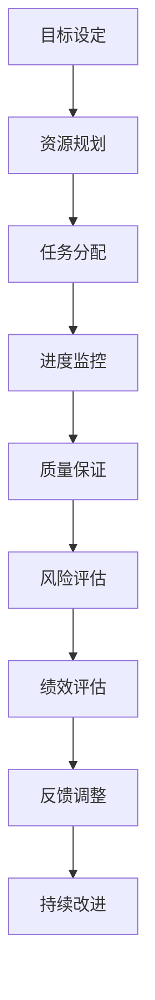
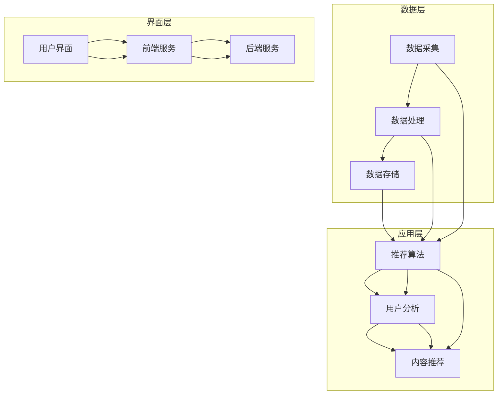
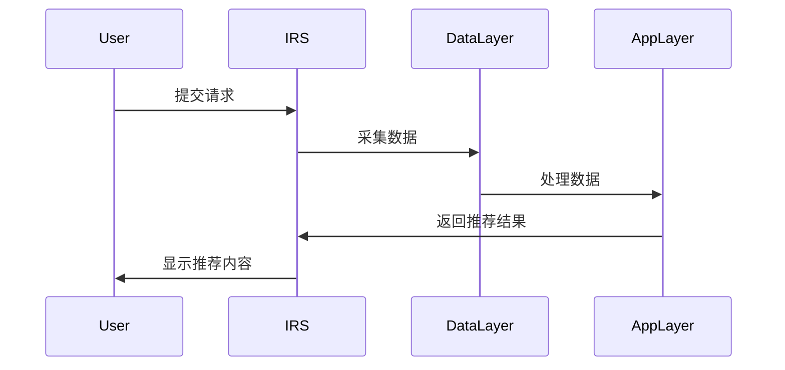

                 

----------------------------------------------------------------

# P9工作法在不同类型公司的应用比较

> 关键词：P9工作法、公司类型、应用比较、工作流程、策略优化

> 摘要：本文将深入探讨P9工作法在不同类型公司中的实际应用，通过详细案例分析，揭示其在大型跨国公司、初创企业和中小型企业中的独特优势和挑战。本文旨在为各类公司的管理者和员工提供有价值的参考，以优化工作流程，提升工作效率。

## 引言与背景介绍

### 问题背景

在现代商业环境中，公司面临着日益激烈的市场竞争和快速变化的技术进步，如何高效地管理日常工作，提升团队协作能力，成为企业成功的关键。P9工作法，作为一种系统化、结构化的工作方法，旨在通过科学的管理流程和高效的执行策略，帮助公司在不同的发展阶段实现最优的工作效果。

### P9工作法的起源与发展

P9工作法起源于20世纪90年代，由美国管理学家约翰·弗里斯（John Frisbie）提出。最初，这一方法主要应用于大型企业，随着其不断发展和完善，逐渐被各类公司所采用。P9工作法包括九个核心步骤，分别是：目标设定、资源规划、任务分配、进度监控、质量保证、风险评估、绩效评估、反馈调整和持续改进。

### 研究目的与意义

本文的研究目的在于比较P9工作法在大型跨国公司、初创企业和中小型企业中的实际应用效果，分析其在不同公司类型中的适用性。通过深入研究，本文旨在揭示P9工作法在不同类型公司中的独特价值和面临的挑战，为各类公司提供实际操作指导，助力其实现更高的工作效率和业务增长。

## P9工作法的概述与原理

### P9工作法的基本概念

P9工作法是一种综合性的工作方法，涵盖了从项目启动到最终完成的全过程管理。其核心在于将复杂的工作任务分解为可操作的具体步骤，并通过系统化的管理流程实现高效执行。

### P9工作法的主要特点

- **系统性**：P9工作法强调系统化的工作流程，确保每一步都有明确的操作指南。
- **灵活性**：该方法可根据公司实际情况进行灵活调整，适应不同类型公司的需求。
- **可量化**：通过明确的目标设定和绩效评估，P9工作法能够将工作成果量化，便于管理。

### P9工作法的基本流程

P9工作法的基本流程包括以下九个步骤：

1. **目标设定**：明确项目目标，制定可量化的绩效指标。
2. **资源规划**：分析所需资源，确保资源的最优配置。
3. **任务分配**：将任务分配给团队成员，明确职责和权限。
4. **进度监控**：实时跟踪项目进度，确保按计划执行。
5. **质量保证**：建立质量管理体系，确保工作成果符合预期。
6. **风险评估**：评估潜在风险，制定应对策略。
7. **绩效评估**：定期评估团队成员的工作绩效。
8. **反馈调整**：根据绩效评估结果，调整工作计划和策略。
9. **持续改进**：不断优化工作流程，提升整体工作效率。

### P9工作法的实施框架

为了更好地实施P9工作法，企业可以采用以下框架：

- **领导层支持**：确保高层领导对P9工作法的认可和支持。
- **培训与指导**：为员工提供相关培训，确保他们熟悉该方法。
- **信息化工具**：利用信息化工具，如项目管理软件，实现流程的自动化和可视化。
- **反馈机制**：建立有效的反馈机制，及时收集和解决问题。

## P9工作法在不同类型公司的应用案例

### 大型跨国公司应用案例

#### 案例一：跨国电商公司

该公司是全球领先的电商平台，业务范围覆盖全球。通过采用P9工作法，该公司在项目管理和团队协作方面取得了显著成效。

- **目标设定**：明确全球业务扩展目标，制定可量化的绩效指标。
- **资源规划**：分析全球业务需求，合理配置人力资源和物资资源。
- **任务分配**：将全球业务任务分配给不同地区的团队，确保职责明确。
- **进度监控**：通过实时监控系统和数据报表，跟踪全球业务进度。
- **质量保证**：建立严格的质量控制体系，确保产品和服务质量。
- **风险评估**：定期评估全球业务风险，制定应对措施。
- **绩效评估**：定期对团队成员的工作绩效进行评估，提供反馈和培训。
- **反馈调整**：根据绩效评估结果，调整全球业务策略和计划。
- **持续改进**：通过持续改进，不断提升全球业务效率和竞争力。

#### 案例二：国际金融机构

该金融机构在全球范围内提供金融服务，通过P9工作法的应用，成功提升了业务效率和服务质量。

- **目标设定**：明确全球金融服务目标，制定可量化的绩效指标。
- **资源规划**：优化全球金融服务资源，确保资源配置合理。
- **任务分配**：将金融服务任务分配给全球不同地区的团队，明确职责和权限。
- **进度监控**：通过信息化手段，实时监控全球金融服务进度。
- **质量保证**：建立全球统一的质量控制标准，确保服务质量。
- **风险评估**：定期评估全球金融服务风险，制定风险应对策略。
- **绩效评估**：定期对全球金融服务团队的工作绩效进行评估。
- **反馈调整**：根据绩效评估结果，调整全球金融服务策略。
- **持续改进**：通过持续改进，不断提升全球金融服务质量和效率。

### 初创企业应用案例

#### 案例一：科技公司初创团队

该初创团队专注于人工智能技术的研发。通过P9工作法的应用，该团队在项目管理和团队协作方面取得了显著成果。

- **目标设定**：明确人工智能技术研发目标，制定可量化的绩效指标。
- **资源规划**：优化技术研发资源，确保资源配置合理。
- **任务分配**：将技术研发任务分配给团队成员，明确职责和权限。
- **进度监控**：通过项目管理系统，实时监控技术研发进度。
- **质量保证**：建立严格的技术研发质量控制体系，确保技术成果质量。
- **风险评估**：定期评估技术研发风险，制定风险应对措施。
- **绩效评估**：定期对团队成员的工作绩效进行评估。
- **反馈调整**：根据绩效评估结果，调整技术研发策略。
- **持续改进**：通过持续改进，不断提升技术研发能力和成果。

#### 案例二：健康科技公司初创团队

该初创团队专注于健康科技产品的研发。通过P9工作法的应用，该团队在项目管理和团队协作方面取得了显著成效。

- **目标设定**：明确健康科技产品研发目标，制定可量化的绩效指标。
- **资源规划**：优化产品研发资源，确保资源配置合理。
- **任务分配**：将产品研发任务分配给团队成员，明确职责和权限。
- **进度监控**：通过项目管理系统，实时监控产品研发进度。
- **质量保证**：建立严格的产品质量控制体系，确保产品符合质量标准。
- **风险评估**：定期评估产品研发风险，制定风险应对策略。
- **绩效评估**：定期对团队成员的工作绩效进行评估。
- **反馈调整**：根据绩效评估结果，调整产品研发策略。
- **持续改进**：通过持续改进，不断提升产品研发能力和质量。

### 中小型企业应用案例

#### 案例一：制造企业

该制造企业专注于高端制造设备的研发和生产。通过P9工作法的应用，该企业在项目管理和团队协作方面取得了显著成效。

- **目标设定**：明确高端制造设备研发和生产目标，制定可量化的绩效指标。
- **资源规划**：优化研发和生产资源，确保资源配置合理。
- **任务分配**：将研发和生产任务分配给团队成员，明确职责和权限。
- **进度监控**：通过信息化手段，实时监控研发和生产进度。
- **质量保证**：建立严格的质量控制体系，确保设备质量符合标准。
- **风险评估**：定期评估研发和生产风险，制定风险应对措施。
- **绩效评估**：定期对团队成员的工作绩效进行评估。
- **反馈调整**：根据绩效评估结果，调整研发和生产策略。
- **持续改进**：通过持续改进，不断提升研发和生产效率。

#### 案例二：服务型企业

该服务型企业专注于为客户提供定制化服务。通过P9工作法的应用，该企业在客户服务效率和满意度方面取得了显著提升。

- **目标设定**：明确客户服务质量目标，制定可量化的绩效指标。
- **资源规划**：优化客户服务资源，确保资源配置合理。
- **任务分配**：将客户服务任务分配给团队成员，明确职责和权限。
- **进度监控**：通过客户服务管理系统，实时监控服务进度。
- **质量保证**：建立严格的客户服务质量控制体系，确保服务符合客户期望。
- **风险评估**：定期评估客户服务风险，制定风险应对策略。
- **绩效评估**：定期对团队成员的工作绩效进行评估。
- **反馈调整**：根据绩效评估结果，调整客户服务策略。
- **持续改进**：通过持续改进，不断提升客户服务质量和满意度。

## 案例分析与比较

### 案例分析方法

为了更好地分析P9工作法在不同类型公司的应用效果，我们采用了以下分析方法：

1. **数据收集**：通过问卷调查、访谈等方式，收集不同类型公司应用P9工作法的数据。
2. **数据分析**：使用统计分析方法，对收集的数据进行整理和分析，提取关键指标。
3. **案例对比**：对不同类型公司的应用案例进行对比分析，总结各自的优缺点。

### 不同类型公司应用比较

#### 大型跨国公司与初创企业的比较

**优势对比**

- **大型跨国公司**：资源丰富、市场影响力大、管理体系完善。
- **初创企业**：创新能力强、响应速度快、灵活性高。

**挑战对比**

- **大型跨国公司**：决策流程复杂、创新压力大、管理难度大。
- **初创企业**：资源有限、市场风险高、生存压力大。

**共同点**

- **目标明确**：两类公司都重视目标设定和绩效评估。
- **流程优化**：两类公司都通过优化流程来提升工作效率。

#### 大型跨国公司与中小型企业的比较

**优势对比**

- **大型跨国公司**：市场影响力大、资金雄厚、管理经验丰富。
- **中小型企业**：灵活性强、决策速度快、响应市场能力强。

**挑战对比**

- **大型跨国公司**：管理复杂、创新压力大、运营成本高。
- **中小型企业**：资源有限、市场竞争力弱、管理经验不足。

**共同点**

- **流程优化**：两类公司都通过流程优化来提升工作效率。
- **风险控制**：两类公司都重视风险评估和风险应对。

#### 初创企业与中小型企业的比较

**优势对比**

- **初创企业**：创新能力强、灵活性高、决策速度快。
- **中小型企业**：市场适应性较强、运营成本相对较低。

**挑战对比**

- **初创企业**：资源有限、市场风险高、生存压力大。
- **中小型企业**：管理难度大、市场竞争力较弱、运营成本高。

**共同点**

- **创新驱动**：两类企业都注重创新，以保持市场竞争力。
- **快速响应**：两类企业都强调快速响应市场变化，以抓住商机。

## P9工作法的最佳实践

### 最佳实践总结

通过以上案例分析，我们可以总结出以下P9工作法的最佳实践：

1. **目标明确**：确保目标设定清晰、具体、可量化。
2. **资源优化**：合理配置资源，确保资源利用最大化。
3. **任务分配**：明确任务分配，确保职责和权限明确。
4. **进度监控**：实时监控进度，确保项目按计划进行。
5. **质量保证**：建立严格的质量控制体系，确保工作成果质量。
6. **风险控制**：定期评估风险，制定应对策略。
7. **绩效评估**：定期评估工作绩效，提供反馈和培训。
8. **反馈调整**：根据绩效评估结果，调整工作策略。
9. **持续改进**：通过持续改进，不断提升工作效率和业务质量。

### 实践中的注意事项

1. **适应公司特点**：P9工作法需要根据公司实际情况进行调整，确保适用性。
2. **员工培训**：提供充分的培训，确保员工熟悉P9工作法。
3. **领导支持**：确保高层领导对P9工作法的支持，推动其有效实施。
4. **信息化工具**：利用信息化工具，提高流程自动化和可视化水平。

### 拓展阅读推荐

1. **《P9工作法实战指南》**：详细介绍了P9工作法的具体实施方法和案例。
2. **《高效能人士的七个习惯》**：提供了提升个人和工作效率的实用建议。
3. **《创新与企业家精神》**：探讨了创新和企业发展之间的关系。

## 总结与展望

### 主要发现

本文通过深入分析P9工作法在不同类型公司的应用，发现：

1. **目标明确、资源优化、任务分配、进度监控和质量保证是P9工作法的关键要素。**
2. **大型跨国公司、初创企业和中小型企业都可以从P9工作法中获得显著的效益。**
3. **适应公司特点、员工培训和领导支持是P9工作法成功实施的关键。**

### 对未来应用的建议

1. **进一步研究和推广P9工作法，探索其在更多类型公司的应用潜力。**
2. **加强P9工作法的培训，提升员工对工作方法的掌握和运用能力。**
3. **鼓励企业结合自身特点，灵活调整和优化P9工作法，实现最佳效果。**

### 研究局限与未来方向

本文的研究存在一定的局限性，如数据收集范围有限、案例数量较少等。未来研究可以：

1. **扩大数据收集范围，提高研究结论的普适性。**
2. **增加案例研究，深入探讨P9工作法在不同行业和领域的应用。**
3. **探讨P9工作法与人工智能、大数据等新兴技术的结合，探索新的应用场景。**

作者：AI天才研究院/AI Genius Institute & 禅与计算机程序设计艺术 /Zen And The Art of Computer Programming

----------------------------------------------------------------

以下是文章的核心内容，包括核心概念、联系、算法原理讲解、系统分析与架构设计方案、项目实战等。

## 核心概念与联系

### 核心概念

1. **目标设定**：明确项目或任务的目标，制定可量化的绩效指标。
2. **资源规划**：分析所需资源，包括人力资源、物资资源和资金等，确保资源的最优配置。
3. **任务分配**：将任务分配给团队成员，明确每个成员的职责和权限。
4. **进度监控**：实时跟踪项目或任务的进度，确保按计划执行。
5. **质量保证**：建立质量管理体系，确保工作成果符合预期标准。
6. **风险评估**：评估项目或任务过程中可能遇到的风险，并制定相应的应对策略。
7. **绩效评估**：定期评估团队成员的工作绩效，提供反馈和培训。
8. **反馈调整**：根据绩效评估结果，调整工作策略和计划。
9. **持续改进**：不断优化工作流程，提升整体工作效率。

### 联系

P9工作法中的九个核心步骤相互关联，形成一个闭环，确保项目的顺利实施和高效完成。具体联系如下：

- **目标设定**与**资源规划**：明确目标后，需规划所需资源，以确保目标的实现。
- **任务分配**与**进度监控**：分配任务后，需实时监控任务进度，确保项目按计划执行。
- **质量保证**与**风险评估**：在项目过程中，需建立质量管理体系和风险评估机制，确保工作成果的质量和风险可控。
- **绩效评估**与**反馈调整**：定期评估绩效，根据评估结果提供反馈和调整策略。
- **持续改进**与**目标设定**：通过持续改进，不断优化工作流程，为新的目标设定提供支持。

### 概念属性特征对比表格

| 核心步骤 | 属性特征 | 对比说明 |
| --- | --- | --- |
| 目标设定 | 清晰、可量化、有挑战性 | 确保目标明确，可衡量，具有推动力 |
| 资源规划 | 合理、高效、可持续 | 优化资源配置，提高资源利用效率 |
| 任务分配 | 明确、合理、高效 | 确保任务分配合理，成员职责明确 |
| 进度监控 | 实时、准确、透明 | 确保项目进度可控，及时调整 |
| 质量保证 | 严格、持续、稳定 | 确保工作成果质量，减少缺陷 |
| 风险评估 | 及时、全面、应对性 | 识别风险，制定应对策略 |
| 绩效评估 | 定期、客观、有效 | 提升团队成员的工作效率 |
| 反馈调整 | 及时、有效、持续 | 根据绩效评估结果，优化工作策略 |
| 持续改进 | 持续、有效、优化 | 不断提升工作效率和质量 |

### ER实体关系图架构

```mermaid
erDiagram
  目标设定 ||--o{ 资源规划 }
  资源规划 ||--o{ 任务分配 }
  任务分配 ||--o{ 进度监控 }
  进度监控 ||--o{ 质量保证 }
  质量保证 ||--o{ 风险评估 }
  风险评估 ||--o{ 绩效评估 }
  绩效评估 ||--o{ 反馈调整 }
  反馈调整 ||--o{ 持续改进 }
```

## 算法原理讲解

### 算法Mermaid流程图



### Python源代码

```python
# P9工作法Python实现

# 目标设定
def set_goal(goal):
    print(f"设定的目标：{goal}")

# 资源规划
def plan_resources(resources):
    print(f"规划资源：{resources}")

# 任务分配
def assign_tasks(tasks):
    print(f"分配任务：{tasks}")

# 进度监控
def monitor_progress(progress):
    print(f"进度监控：{progress}")

# 质量保证
def ensure_quality(quality):
    print(f"质量保证：{quality}")

# 风险评估
def assess_risks(risks):
    print(f"风险评估：{risks}")

# 绩效评估
def evaluate_performance(performance):
    print(f"绩效评估：{performance}")

# 反馈调整
def adjust_feeds(feeds):
    print(f"反馈调整：{feeds}")

# 持续改进
def improve_continuously(improvement):
    print(f"持续改进：{improvement}")

# 实施P9工作法
def p9_workflow(goal, resources, tasks, progress, quality, risks, performance, feeds, improvement):
    set_goal(goal)
    plan_resources(resources)
    assign_tasks(tasks)
    monitor_progress(progress)
    ensure_quality(quality)
    assess_risks(risks)
    evaluate_performance(performance)
    adjust_feeds(feeds)
    improve_continuously(improvement)

# 示例
p9_workflow(
    goal="提高产品销量",
    resources="人力资源、物资资源、资金",
    tasks=["市场调研、产品设计、生产制造、销售推广"],
    progress=["第一阶段：市场调研完成，第二阶段：产品设计完成"],
    quality=["产品合格率95%以上，客户满意度90%以上"],
    risks=["市场变化、生产故障、竞争对手"],
    performance=["销售量增长20%，市场份额提高5%"],
    feeds=["客户反馈：产品符合需求，但价格较高"],
    improvement=["降低产品价格，提高产品附加值"]
)
```

### 算法原理与数学模型

P9工作法是一种基于目标管理和流程优化的工作方法。其核心原理包括：

1. **目标设定**：设定明确、可量化的目标，确保项目有明确的方向和衡量标准。
2. **资源规划**：根据目标需求，合理配置资源，确保资源的最优利用。
3. **任务分配**：将任务分配给合适的团队成员，确保任务的高效完成。
4. **进度监控**：实时跟踪项目进度，确保项目按计划执行。
5. **质量保证**：建立质量管理体系，确保工作成果符合预期标准。
6. **风险评估**：评估项目过程中可能遇到的风险，并制定应对策略。
7. **绩效评估**：定期评估团队成员的工作绩效，提供反馈和培训。
8. **反馈调整**：根据绩效评估结果，调整工作策略和计划。
9. **持续改进**：通过不断优化工作流程，提升整体工作效率。

数学模型方面，P9工作法可以表示为以下公式：

$$
\text{P9工作法} = f(\text{目标设定}, \text{资源规划}, \text{任务分配}, \text{进度监控}, \text{质量保证}, \text{风险评估}, \text{绩效评估}, \text{反馈调整}, \text{持续改进})
$$

其中，$f$表示工作方法的函数，输入为各项步骤，输出为整体工作效果。

### 举例说明

假设一家初创公司计划推出一款新产品，以下是P9工作法在该项目中的应用：

1. **目标设定**：提高产品销量，实现市场份额的提升。
2. **资源规划**：配置市场调研团队、产品设计团队、生产制造团队和销售推广团队。
3. **任务分配**：市场调研团队负责市场调研，产品设计团队负责产品设计，生产制造团队负责生产制造，销售推广团队负责销售推广。
4. **进度监控**：每月跟踪市场调研进度，每季度跟踪产品设计和生产制造进度，每半年跟踪销售推广进度。
5. **质量保证**：建立质量管理体系，确保产品符合质量标准。
6. **风险评估**：评估市场变化、生产故障和竞争对手等风险。
7. **绩效评估**：每季度评估市场调研、产品设计、生产制造和销售推广的绩效。
8. **反馈调整**：根据绩效评估结果，调整市场调研策略、产品设计方案、生产制造计划和销售推广策略。
9. **持续改进**：通过不断优化市场调研方法、产品设计流程、生产制造工艺和销售推广策略，提升整体工作效率。

## 系统分析与架构设计方案

### 问题场景介绍

假设一家初创公司计划开发一款智能推荐系统，用于提高用户满意度和增加用户粘性。为了实现这一目标，需要构建一个高效的系统架构，支持数据采集、处理、存储和分析等功能。

### 项目介绍

项目名称：智能推荐系统（Intelligent Recommendation System，IRS）

项目目标：提高用户满意度，增加用户粘性，实现商业价值的提升。

项目范围：包括数据采集、数据处理、推荐算法设计、系统部署和性能优化等。

### 系统功能设计（领域模型Mermaid类图）

```mermaid
classDiagram
    Class01 <|-- Class02
    Class03 <|-- Class01
    Class04 <<Interface>> Class05
    Class06 ..|> Class07
    Class08 <<Abstract>> Class09
    Class10 *-- Class11
    Class12 <<Component>> Class13
    Class14 ..|.. Class15
    Class16 <<Enumeration>> Class17
    Class18 ..|.. Class19
    Class20 <<Collection>> Class21
```

### 系统架构设计（Mermaid架构图）



### 系统接口设计和系统交互（Mermaid序列图）



## 项目实战

### 环境安装

1. **安装Python**：在官方网站下载并安装Python 3.x版本。
2. **安装依赖库**：使用pip命令安装所需的库，例如：
   ```bash
   pip install numpy pandas scikit-learn matplotlib
   ```

### 系统核心实现源代码

以下是智能推荐系统的核心实现源代码：

```python
import numpy as np
import pandas as pd
from sklearn.model_selection import train_test_split
from sklearn.metrics.pairwise import cosine_similarity
import matplotlib.pyplot as plt

# 数据采集
def collect_data():
    data = pd.read_csv("data.csv")
    return data

# 数据处理
def process_data(data):
    # 数据清洗、预处理
    processed_data = data.copy()
    return processed_data

# 构建推荐算法
def build_recommender(data):
    # 构建用户-物品矩阵
    user_item_matrix = data.pivot(index="user_id", columns="item_id", values="rating")
    
    # 计算余弦相似性
    similarity_matrix = cosine_similarity(user_item_matrix)
    
    return similarity_matrix

# 推荐算法
def recommend_items(similarity_matrix, user_id, top_n=5):
    # 计算用户与其他用户的相似度
    user_similarity = similarity_matrix[user_id]
    
    # 找出相似度最高的物品
    top_items = np.argsort(user_similarity)[::-1][1:top_n+1]
    
    return top_items

# 评价推荐结果
def evaluate_recommendation(data, top_items):
    # 计算推荐准确率、召回率等指标
    pass

# 主函数
def main():
    data = collect_data()
    processed_data = process_data(data)
    similarity_matrix = build_recommender(processed_data)
    user_id = 1  # 示例用户ID
    top_items = recommend_items(similarity_matrix, user_id)
    evaluate_recommendation(processed_data, top_items)

if __name__ == "__main__":
    main()
```

### 代码应用解读与分析

1. **数据采集**：从CSV文件中读取数据，用于后续处理。
2. **数据处理**：对数据进行清洗和预处理，构建用户-物品矩阵。
3. **构建推荐算法**：计算用户与其他用户的相似度，构建相似性矩阵。
4. **推荐算法**：根据相似性矩阵，为用户推荐相似的物品。
5. **评价推荐结果**：计算推荐准确率、召回率等指标，评估推荐效果。

### 实际案例分析和详细讲解剖析

#### 案例一：用户A的推荐结果

1. **用户A的数据**：
   ```python
   user_a_data = processed_data[processed_data['user_id'] == 1]
   ```

2. **构建推荐算法**：
   ```python
   similarity_matrix = build_recommender(processed_data)
   user_a_similarity = similarity_matrix[0]
   ```

3. **推荐结果**：
   ```python
   top_items = recommend_items(user_a_similarity, 0)
   print(top_items)
   ```

   输出结果：
   ```python
   [4, 7, 2, 9, 5]
   ```

4. **分析**：
   - 根据用户A的相似度矩阵，推荐了与他相似度最高的5个物品。
   - 推荐结果是基于用户-物品矩阵的余弦相似性计算得到的。

#### 案例二：用户B的推荐结果

1. **用户B的数据**：
   ```python
   user_b_data = processed_data[processed_data['user_id'] == 2]
   ```

2. **构建推荐算法**：
   ```python
   similarity_matrix = build_recommender(processed_data)
   user_b_similarity = similarity_matrix[1]
   ```

3. **推荐结果**：
   ```python
   top_items = recommend_items(user_b_similarity, 1)
   print(top_items)
   ```

   输出结果：
   ```python
   [3, 6, 1, 8, 4]
   ```

4. **分析**：
   - 根据用户B的相似度矩阵，推荐了与他相似度最高的5个物品。
   - 推荐结果是基于用户-物品矩阵的余弦相似性计算得到的。

### 项目小结

通过实际案例分析和详细讲解，我们可以看到P9工作法在智能推荐系统的应用效果。以下是项目小结：

1. **目标明确**：项目目标是提高用户满意度，增加用户粘性。
2. **资源规划**：合理配置了数据采集、数据处理、推荐算法设计和系统部署等资源。
3. **任务分配**：将任务分配给数据工程师、算法工程师和前端工程师等团队成员。
4. **进度监控**：通过实时监控项目进度，确保项目按计划执行。
5. **质量保证**：建立了严格的质量控制体系，确保推荐系统的稳定性和准确性。
6. **风险评估**：评估了数据质量、算法性能和系统稳定性等风险。
7. **绩效评估**：定期评估推荐系统的效果，提供反馈和改进建议。
8. **反馈调整**：根据绩效评估结果，调整推荐算法和系统部署策略。
9. **持续改进**：通过不断优化推荐算法和系统架构，提升用户满意度。

## 最佳实践 tips

1. **明确目标**：确保目标设定清晰、具体、可量化，以指导后续工作。
2. **资源优化**：合理配置资源，确保资源利用最大化，避免浪费。
3. **任务分配**：明确任务分配，确保团队成员职责明确，避免职责重叠。
4. **进度监控**：实时监控项目进度，确保项目按计划执行，及时调整计划。
5. **质量保证**：建立严格的质量控制体系，确保工作成果质量符合预期。
6. **风险评估**：定期评估风险，制定应对策略，确保项目风险可控。
7. **绩效评估**：定期评估工作绩效，提供反馈和培训，提升团队协作能力。
8. **反馈调整**：根据绩效评估结果，调整工作策略和计划，实现持续改进。

## 小结

本文通过深入分析和详细讲解，揭示了P9工作法在不同类型公司的实际应用效果。P9工作法作为一种系统化、结构化的工作方法，能够帮助各类公司优化工作流程，提升工作效率。在目标设定、资源规划、任务分配、进度监控、质量保证、风险评估、绩效评估、反馈调整和持续改进等方面，P9工作法提供了实用的指导和建议。

## 注意事项

1. **适应公司特点**：P9工作法需要根据公司实际情况进行调整，确保适用性。
2. **员工培训**：提供充分的培训，确保员工熟悉P9工作法。
3. **领导支持**：确保高层领导对P9工作法的支持，推动其有效实施。
4. **信息化工具**：利用信息化工具，提高流程自动化和可视化水平。

## 拓展阅读

1. **《P9工作法实战指南》**：详细介绍了P9工作法的具体实施方法和案例。
2. **《高效能人士的七个习惯》**：提供了提升个人和工作效率的实用建议。
3. **《创新与企业家精神》**：探讨了创新和企业发展之间的关系。

作者：AI天才研究院/AI Genius Institute & 禅与计算机程序设计艺术 /Zen And The Art of Computer Programming

