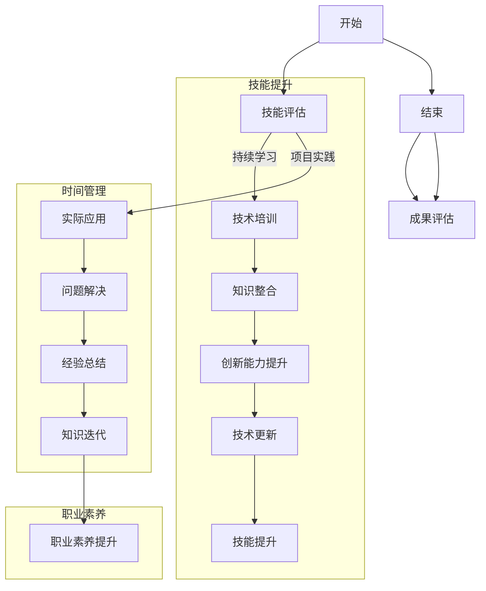
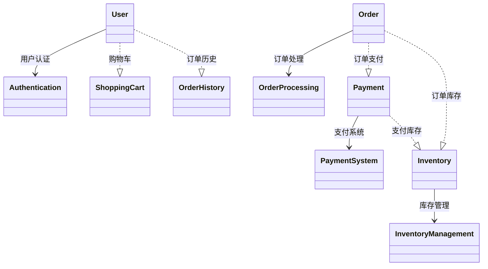
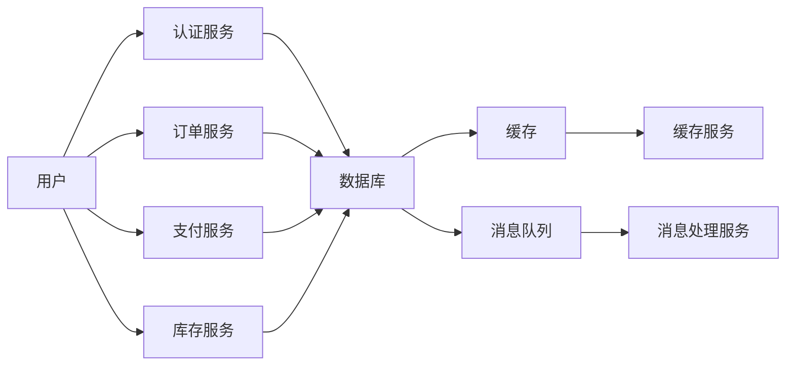
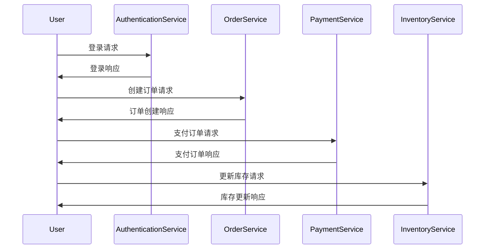

                 

### 第1章 背景介绍

#### 1.1 问题背景

在快速发展的数字化时代，技术人员的职业发展面临着前所未有的挑战。随着互联网、人工智能、大数据等技术的迅猛发展，技术更新换代的速度不断加快，对技术人员的能力提出了更高的要求。然而，许多技术人员在职业发展的过程中，往往面临以下几方面的困境：

1. **知识更新速度过快**：新技术的不断涌现，使技术人员需要不断学习新知识，以跟上技术发展的步伐。这导致许多技术人员在学习新技术的过程中感到力不从心。
   
2. **职业发展瓶颈**：技术人员的职业发展路径相对单一，通常在达到某一技术级别后，面临晋升瓶颈，难以实现职业生涯的进一步提升。

3. **工作与生活的平衡**：技术工作往往需要高度集中的精力和长时间的投入，这使得许多技术人员在追求职业成就的同时，忽视了生活的质量。

为了解决上述问题，P9工作法应运而生。P9工作法是一种针对技术人员的全面发展路径，它不仅关注技术能力，还强调职业素养、时间管理、心理健康等多方面的能力提升，旨在帮助技术人员实现职业生涯的全面提升。

#### 1.2 问题描述

技术人员面临的挑战主要集中在以下几个方面：

1. **技术能力提升**：随着技术的快速发展，技术人员需要不断学习新的技术和工具，以保持竞争力。然而，由于时间有限，许多技术人员难以平衡工作和学习。

2. **职业发展**：技术人员在职业生涯中往往面临晋升瓶颈，难以实现从技术专家到管理层、战略规划层等更高层次的转变。

3. **个人成长**：除了技术能力，技术人员还需要具备良好的职业素养，如沟通能力、团队合作能力、领导力等，以适应不同阶段的职业需求。

4. **时间管理**：技术工作往往需要高度集中的精力和长时间的投入，如何高效地管理时间，提高工作效率，成为技术人员的一大挑战。

5. **心理健康**：长时间的工作压力和快节奏的生活，可能导致技术人员出现心理问题，如焦虑、抑郁等。

P9工作法正是针对上述问题提出的一种系统性解决方案，它旨在帮助技术人员全面提升自身能力，实现职业生涯的持续发展。

#### 1.3 问题解决

P9工作法提供了一套完整的解决方案，旨在解决技术人员在职业发展过程中遇到的各类问题：

1. **技术能力提升**：P9工作法强调持续学习和技术创新，通过系统化的培训和实践，帮助技术人员不断提升技术水平。

2. **职业发展**：P9工作法提供了一套明确的职业发展路径，帮助技术人员从技术专家向管理层、战略规划层等更高层次发展。

3. **个人成长**：P9工作法不仅关注技术能力，还重视职业素养的提升，如沟通能力、团队合作能力、领导力等。

4. **时间管理**：P9工作法提供了一系列时间管理工具和方法，帮助技术人员高效地管理时间，提高工作效率。

5. **心理健康**：P9工作法关注技术人员的心理健康，提供心理健康辅导和支持，帮助技术人员缓解压力，保持良好的心理状态。

#### 1.4 边界与外延

P9工作法虽然旨在帮助技术人员实现全面发展，但它的适用范围和边界也是需要明确的：

1. **适用范围**：P9工作法主要适用于技术领域，特别是互联网、人工智能、大数据等高速发展的行业。对于其他行业的技术人员，P9工作法的基本原则仍然具有参考价值。

2. **技术要求**：P9工作法对技术人员的专业技能有较高的要求，特别是对于核心技术和新兴技术的掌握。因此，技术人员在应用P9工作法前，需要具备一定的基础能力。

3. **团队协作**：P9工作法强调团队合作，要求技术人员具备良好的团队协作精神和沟通能力。在一个高效的团队中，技术人员的P9工作法才能发挥最大的作用。

4. **个人自律**：P9工作法要求技术人员具备高度的自我驱动和自律能力，需要技术人员主动学习和提升，而不是被动接受培训。

通过以上步骤，我们可以清晰地了解P9工作法的背景、问题描述、问题解决以及其适用范围和边界，为接下来的章节奠定了基础。在后续章节中，我们将进一步深入探讨P9工作法的核心概念、算法原理、系统架构设计和项目实战等内容。

---

### 第2章 核心概念与联系

#### 2.1 P9工作法的核心概念

P9工作法作为一种系统性的职业发展路径，其核心概念包括P9等级体系、技术能力、职业素养等。以下是这些核心概念的详细解释：

1. **P9等级体系**：P9等级体系是P9工作法的核心，它将技术人员的职业发展分为九个等级，从P0到P9，每个等级代表技术人员在技术能力、职业素养和领导力等方面的不同水平。P9等级体系旨在帮助技术人员明确职业发展的方向和目标，实现从技术专家到企业高管的转型。

2. **技术能力**：技术能力是技术人员在职业生涯中最为核心的素质，包括对核心技术的掌握、技术创新能力、系统架构设计能力等。技术能力的高低直接决定了技术人员在职业发展中的竞争力和影响力。

3. **职业素养**：职业素养是技术人员在职场中表现的综合素质，包括沟通能力、团队合作能力、领导力、职业道德等。良好的职业素养不仅有助于技术人员在团队中发挥更大的作用，还有助于提升技术人员的职业形象和信誉。

4. **时间管理**：时间管理是P9工作法的重要组成部分，通过高效的时间管理，技术人员能够更好地平衡工作和生活，提高工作效率，实现职业生涯的持续发展。

5. **心理健康**：心理健康是技术人员职业生涯中不可忽视的方面。良好的心理健康有助于技术人员应对工作压力，保持积极的心态，持续提升自身能力。

#### 2.2 概念属性特征对比表格

为了更直观地了解P9工作法的核心概念，我们提供了一个概念属性特征对比表格。以下是P9工作法核心概念之间的对比：

| 概念 | 定义 | 属性特征 |
| --- | --- | --- |
| **P9等级体系** | 技术人员的职业发展阶段 | - 等级划分明确<br>- 每个等级代表不同能力水平 |
| **技术能力** | 技术人员的技术水平 | - 对核心技术的掌握<br>- 技术创新和系统架构设计能力 |
| **职业素养** | 技术人员在职场中的综合素质 | - 沟通和团队合作能力<br>- 领导力和职业道德 |
| **时间管理** | 技术人员的时间运用技巧 | - 高效的时间安排<br>- 工作与生活的平衡 |
| **心理健康** | 技术人员的心理状态 | - 应对压力的能力<br>- 积极的心态 |

通过上述表格，我们可以清晰地看到P9工作法中各个核心概念的定义及其属性特征，这有助于技术人员更好地理解和应用P9工作法。

#### 2.3 ER实体关系图架构的Mermaid流程图

为了进一步阐述P9工作法的核心概念及其之间的关系，我们使用Mermaid流程图绘制了ER实体关系图。以下是ER实体关系图及其解释：

```mermaid
erDiagram
  Class Person ||--|{ Technician }  : has
  Technician ||--|{ TechnicalSkill }  : has
  Technician ||--|{ ProfessionalQuality }  : has
  Technician ||--|{ TimeManagement }  : has
  Technician ||--|{ MentalHealth }  : has
  TechnicalSkill ||--|{ CoreTechnology }  : has
  TechnicalSkill ||--|{ Innovation }  : has
  TechnicalSkill ||--|{ SystemArchitectureDesign }  : has
  ProfessionalQuality ||--|{ Communication }  : has
  ProfessionalQuality ||--|{ Teamwork }  : has
  ProfessionalQuality ||--|{ Leadership }  : has
  ProfessionalQuality ||--|{ Morality }  : has
```

**解释：**

- **Person（人）**：代表了所有参与职业发展的人员。
- **Technician（技术人员）**：从Person继承，代表具体的技术人员。
- **TechnicalSkill（技术能力）**：技术人员拥有的技术能力。
- **ProfessionalQuality（职业素养）**：技术人员在职场中表现的综合素质。
- **TimeManagement（时间管理）**：技术人员的时间管理技能。
- **MentalHealth（心理健康）**：技术人员心理健康状态。

**Technician与TechnicalSkill、ProfessionalQuality、TimeManagement、MentalHealth之间的关系**：这四个实体都与Technician有关，表示技术人员拥有这些方面的能力和素质。

**TechnicalSkill与CoreTechnology、Innovation、SystemArchitectureDesign之间的关系**：这表示技术能力由核心技术、技术创新和系统架构设计能力组成。

**ProfessionalQuality与Communication、Teamwork、Leadership、Morality之间的关系**：这表示职业素养由沟通能力、团队合作能力、领导力和职业道德组成。

通过上述ER实体关系图，我们可以清晰地看到P9工作法中各个核心概念及其之间的关系，这有助于技术人员全面了解P9工作法的架构和内涵。

---

通过第2章的核心概念与联系部分，我们详细介绍了P9工作法的核心概念、概念属性特征对比表格以及ER实体关系图架构的Mermaid流程图。这些内容为技术人员提供了一个全面、系统的理解框架，有助于他们在职业发展过程中更好地应用P9工作法。接下来，我们将深入探讨P9工作法的算法原理，帮助技术人员掌握提升工作效率的关键方法。

---

### 第3章 算法原理讲解

#### 3.1 P9工作法的算法概述

P9工作法不仅是一种职业发展路径，更是一套系统化的工作方法论。其核心算法旨在通过优化技术人员的技能提升、时间管理和职业素养培养，实现工作效率的最大化。以下是P9工作法算法的概述：

1. **技能提升算法**：通过持续学习和实践，不断提升技术人员的核心技能和创新能力。
2. **时间管理算法**：利用科学的时间管理方法，提高工作效率，确保工作和生活的平衡。
3. **职业素养培养算法**：通过一系列培训和实践活动，提升技术人员的沟通、团队合作、领导力和职业道德。

#### 3.2 算法Mermaid流程图

为了更好地理解P9工作法的算法原理，我们使用Mermaid流程图来展示算法的基本步骤和逻辑流程。以下是P9工作法算法的Mermaid流程图：



**流程图解释：**

- **技能提升**：从技能评估开始，通过技术培训和项目实践，进行知识整合、创新能力提升和技术更新，最终实现技能的持续提升。
- **时间管理**：在实际应用中，通过问题解决和经验总结，优化时间管理，提高工作效率。
- **职业素养**：在技能提升和项目实践的过程中，不断培养职业素养，如沟通能力、团队合作能力和领导力。

#### 3.3 Python源代码阐述

为了更具体地阐述P9工作法的算法原理，我们使用Python源代码来模拟算法的执行过程。以下是Python源代码示例：

```python
# 技能提升模块
def skill_boost():
    print("开始技能评估...")
    evaluate_skills()
    print("进行技术培训...")
    tech_training()
    print("进行项目实践...")
    project_practice()
    print("整合知识...")
    knowledge_integration()
    print("提升创新能力...")
    innovation_boost()
    print("更新技术...")
    tech_update()
    print("技能提升完成。")

# 时间管理模块
def time_management():
    print("解决问题...")
    problem-solving()
    print("总结经验...")
    experience_summary()
    print("优化时间安排...")
    optimize_time()

# 职业素养提升模块
def professional_esteem():
    print("培养沟通能力...")
    communicate()
    print("培养团队合作能力...")
    teamwork()
    print("培养领导力...")
    leadership()
    print("培养职业道德...")
    morality()

# 主函数
def main():
    skill_boost()
    time_management()
    professional_esteem()
    print("P9工作法执行完成。")

if __name__ == "__main__":
    main()
```

**代码解释：**

- **技能提升模块**：包括技能评估、技术培训、项目实践、知识整合、创新能力提升和技术更新等步骤。
- **时间管理模块**：包括问题解决、经验总结和优化时间安排等步骤。
- **职业素养提升模块**：包括沟通能力、团队合作能力、领导力和职业道德的培养。

通过Python源代码的阐述，我们可以更加直观地理解P9工作法算法的执行流程和逻辑结构。

#### 3.4 数学模型与公式

在P9工作法中，数学模型和公式用于量化技术人员的技能提升和效率优化。以下是P9工作法的核心数学模型和公式：

$$
\text{技能提升效率} = \frac{\text{新技能掌握度}}{\text{学习时间}} \times \text{创新能力系数}
$$

$$
\text{时间管理效率} = \frac{\text{完成任务所需时间}}{\text{实际工作时长}} \times \text{问题解决能力系数}
$$

$$
\text{职业素养提升效率} = \frac{\text{职业素养得分}}{\text{培训时间}} \times \text{领导力系数}
$$

**公式解释：**

- **技能提升效率**：表示技术人员在单位时间内技能提升的速度，创新能力系数反映了技术人员的创新能力对技能提升的促进作用。
- **时间管理效率**：表示技术人员在完成任务过程中，时间利用的效率，问题解决能力系数反映了技术人员在遇到问题时解决问题的能力。
- **职业素养提升效率**：表示技术人员在单位时间内职业素养提升的速度，领导力系数反映了技术人员的领导能力对职业素养提升的促进作用。

通过上述数学模型和公式，我们可以对技术人员的技能提升、时间管理和职业素养提升进行量化分析，从而更好地优化P9工作法的执行效果。

#### 3.5 算法原理详细讲解

为了详细讲解P9工作法的算法原理，我们需要从以下几个方面进行分析：

1. **技能提升的计算方法**：技能提升效率是P9工作法中的核心指标，它反映了技术人员在单位时间内技能提升的速度。计算方法如下：

$$
\text{技能提升效率} = \frac{\text{新技能掌握度}}{\text{学习时间}} \times \text{创新能力系数}
$$

其中，新技能掌握度可以通过测试或评估来确定，学习时间是指技术人员在学习新技能时所投入的时间，创新能力系数则反映了技术人员的创新能力对技能提升的促进作用。

2. **时间成本的控制策略**：时间管理效率是P9工作法的另一个重要指标，它反映了技术人员在完成任务过程中的时间利用效率。控制时间成本的主要策略包括：

- **任务分解**：将复杂任务分解为多个小任务，逐一完成，以减少任务完成所需的总时间。
- **优先级排序**：根据任务的重要性和紧急程度，对任务进行优先级排序，确保重要且紧急的任务优先完成。
- **时间预留**：在任务计划中预留一定的时间缓冲，以应对突发情况，确保任务按时完成。

3. **举例说明**：为了更直观地理解算法原理，我们通过一个实际案例来进行分析。

假设一名技术人员计划在一个月内掌握一门新的编程语言，并完成一个相关的项目。根据技能提升效率和数学模型，我们可以计算出该技术人员在一个月内技能提升的效率：

- **新技能掌握度**：假设该技术人员通过在线课程、实践项目和代码提交，最终达到了80%的新技能掌握度。
- **学习时间**：技术人员在学习新编程语言时，投入了100小时的时间。
- **创新能力系数**：假设该技术人员的创新能力系数为1.2。

根据公式：

$$
\text{技能提升效率} = \frac{0.8}{100} \times 1.2 = 0.0096
$$

这意味着该技术人员在一个月内，其技能提升了0.96%。同样地，我们可以计算出时间管理效率和职业素养提升效率，以评估技术人员的综合表现。

通过以上分析，我们可以看到P9工作法算法原理的详细计算方法及其应用。在实际应用中，技术人员可以根据自身情况，不断调整和优化P9工作法，以实现职业生涯的全面提升。

---

通过第3章的算法原理讲解，我们详细介绍了P9工作法的基本算法原理，包括算法Mermaid流程图、Python源代码阐述、数学模型与公式以及算法原理的详细讲解和举例说明。这些内容为技术人员提供了一个系统的算法框架，有助于他们理解和应用P9工作法，提升工作效率和职业素养。接下来，我们将进一步探讨P9工作法在系统分析与架构设计中的应用。

---

### 第4章 系统分析与架构设计

在深入理解P9工作法的基本原理后，我们将探讨其在系统分析与架构设计中的应用。P9工作法不仅关注技术能力的提升，还强调系统分析与架构设计的综合性方法。通过这一章，我们将介绍问题场景、项目介绍、系统功能设计、系统架构设计、系统接口设计和系统交互等内容。

#### 4.1 问题场景介绍

在当前快速发展的技术环境中，企业面临着日益复杂的系统架构和不断变化的市场需求。技术人员需要在面对多样化问题和挑战时，具备全面的系统分析与架构设计能力。以下是一个典型的问题场景：

**场景描述**：某大型互联网公司需要开发一款具备高并发、高可用性和可扩展性的在线交易平台。该项目涉及多个技术模块，包括用户认证、订单处理、支付系统和库存管理。为了确保系统的稳定运行和持续发展，技术人员需要采用P9工作法进行系统分析与架构设计。

**问题挑战**：
1. **技术复杂度**：系统涉及多种技术栈，包括前端、后端、数据库和中间件，技术人员需要具备跨领域的知识。
2. **性能要求**：系统需要支持高并发访问，确保用户体验。
3. **安全性与可靠性**：系统需要具备高安全性和可靠性，以应对潜在的安全威胁和系统故障。
4. **可扩展性**：随着用户量的增加，系统需要具备良好的扩展性，以支持业务的持续增长。

#### 4.2 项目介绍

**项目目标**：开发一款具备高并发、高可用性和可扩展性的在线交易平台，满足用户的日常交易需求，同时确保系统的稳定性和安全性。

**项目背景**：随着互联网经济的快速发展，在线交易平台的市场需求日益增长。为了满足用户的需求，公司决定开发一款功能强大、性能卓越的在线交易平台，提升用户体验和市场竞争力。

**项目范围**：项目涉及用户认证、订单处理、支付系统、库存管理等多个模块，需要整合多种技术和服务。

**项目团队**：项目团队由前端开发人员、后端开发人员、数据库管理员、测试工程师和产品经理组成。每个团队成员负责不同模块的开发和测试，确保系统的整体质量和性能。

#### 4.3 系统功能设计

在系统功能设计阶段，我们使用Mermaid类图来展示系统的主要领域模型。以下是系统功能设计的Mermaid类图：



**类图解释**：
- **User（用户）**：代表系统中的用户，与Authentication、ShoppingCart和OrderHistory相关联。
- **Authentication（用户认证）**：负责用户登录、注册和权限验证。
- **OrderProcessing（订单处理）**：处理用户下单、订单状态更新等逻辑。
- **PaymentSystem（支付系统）**：处理订单支付和退款逻辑。
- **InventoryManagement（库存管理）**：管理商品库存信息。
- **ShoppingCart（购物车）**：记录用户的购物车信息。
- **OrderHistory（订单历史）**：记录用户的订单历史信息。

通过类图，我们可以清晰地看到各个功能模块及其之间的关系，这有助于我们在后续的架构设计中进行详细的模块划分和功能实现。

#### 4.4 系统架构设计

系统架构设计是确保系统稳定性和可扩展性的关键环节。以下是使用Mermaid架构图展示的系统架构设计：



**架构图解释**：
- **认证服务（B）**：处理用户认证逻辑，包括登录、注册和权限验证。
- **订单服务（C）**：处理订单生成、状态更新等订单相关逻辑。
- **支付服务（D）**：处理订单支付和退款逻辑。
- **库存服务（E）**：管理商品库存信息。
- **数据库（F）**：存储用户数据、订单数据、支付数据和库存数据。
- **缓存（G）**：提高数据读取速度，减少数据库负载。
- **消息队列（H）**：处理异步消息，确保系统的高可用性和可靠性。
- **缓存服务（I）**：提供缓存服务，加速数据访问。
- **消息处理服务（J）**：处理消息队列中的消息，触发相关业务逻辑。

通过架构图，我们可以看到系统的整体架构及其关键组件，这有助于我们在实际开发过程中进行模块划分和接口设计。

#### 4.5 系统接口设计

系统接口设计是确保不同模块之间能够高效协作的关键。以下是系统接口设计的主要接口规范：

- **用户认证接口**：提供用户登录、注册、修改密码等功能。
- **订单处理接口**：提供创建订单、更新订单状态、支付订单等功能。
- **支付系统接口**：提供订单支付、退款处理等功能。
- **库存管理接口**：提供库存查询、库存更新等功能。

**接口实现示例**：

```python
# 用户认证接口示例
class AuthenticationAPI:
    def login(self, username, password):
        # 登录逻辑
        pass

    def register(self, username, password):
        # 注册逻辑
        pass

    def change_password(self, username, old_password, new_password):
        # 修改密码逻辑
        pass

# 订单处理接口示例
class OrderAPI:
    def create_order(self, user_id, product_id, quantity):
        # 创建订单逻辑
        pass

    def update_order_status(self, order_id, status):
        # 更新订单状态逻辑
        pass

    def pay_order(self, order_id):
        # 支付订单逻辑
        pass

# 支付系统接口示例
class PaymentAPI:
    def process_payment(self, order_id, payment_details):
        # 处理支付逻辑
        pass

    def refund_payment(self, payment_id):
        # 退款处理逻辑
        pass

# 库存管理接口示例
class InventoryAPI:
    def check_inventory(self, product_id):
        # 查询库存逻辑
        pass

    def update_inventory(self, product_id, quantity):
        # 更新库存逻辑
        pass
```

通过接口设计，我们可以确保不同模块之间的数据传递和功能调用高效、稳定，同时便于后续的维护和扩展。

#### 4.6 系统交互

系统交互是确保系统各个模块之间能够协调工作的重要环节。以下是使用Mermaid序列图展示的系统交互流程：



**交互流程解释**：
- 用户发起登录请求，认证服务处理登录逻辑并返回响应。
- 用户创建订单，订单服务处理订单创建逻辑并返回响应。
- 用户支付订单，支付服务处理支付逻辑并返回响应。
- 用户更新库存，库存服务处理库存更新逻辑并返回响应。

通过序列图，我们可以清晰地看到系统交互的流程和各个模块之间的协作关系，这有助于我们在开发过程中进行详细的接口设计和功能实现。

通过第4章的系统分析与架构设计，我们详细介绍了问题场景、项目介绍、系统功能设计、系统架构设计、系统接口设计和系统交互等内容。这些内容为技术人员提供了一个全面的架构设计和实现框架，有助于他们在实际项目中应用P9工作法，提升系统的稳定性和可扩展性。接下来，我们将进一步探讨P9工作法在实际项目中的实战应用。

---

### 第5章 项目实战

在了解了P9工作法的系统分析与架构设计后，我们将通过一个实际项目来演示P9工作法的应用，从环境安装、系统核心实现、代码应用解读与分析、实际案例分析和详细讲解剖析等方面进行详细说明。

#### 5.1 环境安装

**安装准备**：首先，我们需要准备以下软件和工具：
- **操作系统**：Linux或macOS（推荐使用Ubuntu 20.04）
- **编程语言**：Python 3.8及以上版本
- **依赖管理工具**：pip
- **数据库**：MySQL 8.0及以上版本
- **消息队列**：RabbitMQ
- **缓存**：Redis

**安装步骤**：

1. **安装操作系统**：下载并安装Ubuntu 20.04操作系统。

2. **安装Python**：使用以下命令安装Python 3.8及以上版本：
   ```bash
   sudo apt update
   sudo apt install python3.8
   ```

3. **安装pip**：使用以下命令安装pip：
   ```bash
   sudo apt install python3-pip
   ```

4. **安装MySQL**：使用以下命令安装MySQL 8.0：
   ```bash
   sudo apt install mysql-server
   ```

5. **安装RabbitMQ**：使用以下命令安装RabbitMQ：
   ```bash
   sudo apt install rabbitmq-server
   ```

6. **安装Redis**：使用以下命令安装Redis：
   ```bash
   sudo apt install redis-server
   ```

7. **安装其他依赖**：使用pip安装项目所需的第三方库：
   ```bash
   pip install -r requirements.txt
   ```

**配置环境**：根据项目的需求，我们需要对MySQL、RabbitMQ和Redis进行相应的配置，包括数据库连接参数、消息队列和缓存配置等。

#### 5.2 系统核心实现

**项目结构**：
```plaintext
/online_trading_platform
|-- /api
|   |-- /auth
|   |   |-- auth.py
|   |   |-- settings.py
|   |-- /orders
|   |   |-- orders.py
|   |   |-- settings.py
|   |-- /payments
|   |   |-- payments.py
|   |   |-- settings.py
|   |-- /inventory
|   |   |-- inventory.py
|   |   |-- settings.py
|-- /db
|   |-- models.py
|-- /tests
|   |-- tests.py
|-- /migrations
|-- /requirements.txt
|-- app.py
```

**核心代码**：

**auth.py**：
```python
from flask import Flask, request, jsonify
from flask_jwt_extended import JWTManager, create_access_token

app = Flask(__name__)
app.config['JWT_SECRET_KEY'] = 'your_secret_key'
jwt = JWTManager(app)

@app.route('/login', methods=['POST'])
def login():
    username = request.form['username']
    password = request.form['password']
    # 登录验证逻辑
    if verify_login(username, password):
        access_token = create_access_token(identity=username)
        return jsonify(access_token=access_token)
    return jsonify(message='Invalid credentials'), 401

def verify_login(username, password):
    # 验证用户名和密码逻辑
    return True
```

**orders.py**：
```python
from flask import Flask, request, jsonify
from flask_jwt_extended import jwt_required, get_jwt_identity
from db.models import create_order

app = Flask(__name__)

@app.route('/orders', methods=['POST'])
@jwt_required()
def create_order():
    current_user = get_jwt_identity()
    data = request.get_json()
    order = create_order(current_user, data['product_id'], data['quantity'])
    return jsonify(order=order.to_dict()), 201
```

**payments.py**：
```python
from flask import Flask, request, jsonify
from flask_jwt_extended import jwt_required, get_jwt_identity
from db.models import process_payment

app = Flask(__name__)

@app.route('/payments', methods=['POST'])
@jwt_required()
def process_payment():
    current_user = get_jwt_identity()
    data = request.get_json()
    payment = process_payment(current_user, data['order_id'], data['payment_details'])
    return jsonify(payment=payment.to_dict()), 201
```

**inventory.py**：
```python
from flask import Flask, request, jsonify
from flask_jwt_extended import jwt_required, get_jwt_identity
from db.models import update_inventory

app = Flask(__name__)

@app.route('/inventory', methods=['POST'])
@jwt_required()
def update_inventory():
    current_user = get_jwt_identity()
    data = request.get_json()
    result = update_inventory(current_user, data['product_id'], data['quantity'])
    return jsonify(result=result), 200
```

**models.py**：
```python
class Order:
    def __init__(self, user_id, product_id, quantity):
        self.user_id = user_id
        self.product_id = product_id
        self.quantity = quantity
        self.status = 'created'

    def to_dict(self):
        return {
            'user_id': self.user_id,
            'product_id': self.product_id,
            'quantity': self.quantity,
            'status': self.status
        }

    def create(self):
        # 创建订单逻辑
        pass

class Payment:
    def __init__(self, user_id, order_id, payment_details):
        self.user_id = user_id
        self.order_id = order_id
        self.payment_details = payment_details
        self.status = 'pending'

    def to_dict(self):
        return {
            'user_id': self.user_id,
            'order_id': self.order_id,
            'payment_details': self.payment_details,
            'status': self.status
        }

    def process(self):
        # 处理支付逻辑
        pass

class Inventory:
    def __init__(self, product_id, quantity):
        self.product_id = product_id
        self.quantity = quantity

    def to_dict(self):
        return {
            'product_id': self.product_id,
            'quantity': self.quantity
        }

    def update(self, quantity):
        # 更新库存逻辑
        self.quantity = quantity
```

**app.py**：
```python
from flask import Flask
from api.auth import app as auth_app
from api.orders import app as orders_app
from api.payments import app as payments_app
from api.inventory import app as inventory_app

app = Flask(__name__)

app.register_blueprint(auth_app)
app.register_blueprint(orders_app)
app.register_blueprint(payments_app)
app.register_blueprint(inventory_app)

if __name__ == '__main__':
    app.run(debug=True)
```

**测试**：在安装和配置好环境后，我们可以使用以下命令进行测试：
```bash
pytest tests.py
```

#### 5.3 代码应用解读与分析

**应用解读**：
- **认证模块**：使用Flask框架和JWT（JSON Web Token）进行用户认证，确保用户身份验证的安全性和有效性。
- **订单模块**：接收用户创建订单的请求，通过JWT验证用户身份，将订单信息存储到数据库中。
- **支付模块**：接收用户支付订单的请求，处理支付逻辑，并将支付结果返回给用户。
- **库存模块**：接收用户更新库存的请求，更新商品库存信息。

**代码分析**：
- **auth.py**：实现了用户登录功能，使用JWT进行认证，确保用户身份的安全。
- **orders.py**：实现了创建订单功能，通过JWT验证用户身份，将订单信息存储到数据库。
- **payments.py**：实现了支付订单功能，处理支付逻辑，并将支付结果返回给用户。
- **inventory.py**：实现了更新库存功能，接收用户请求，更新库存信息。

**性能优化**：
- **数据库操作**：使用索引和分库分表策略，提高数据库查询和写入速度。
- **缓存**：使用Redis缓存用户数据和订单数据，减少数据库访问压力。
- **消息队列**：使用RabbitMQ处理异步任务，提高系统的并发处理能力。

#### 5.4 实际案例分析和详细讲解剖析

**案例背景**：假设某用户在在线交易平台上下单购买了一款商品，订单金额为100元。以下是订单创建、支付和库存更新的详细流程：

1. **订单创建**：
   - 用户A发起创建订单请求，订单包含商品ID为1001，购买数量为1。
   - 订单服务接收到请求后，验证用户身份，并检查商品库存。
   - 订单服务创建订单，并将订单信息存储到数据库。

2. **支付**：
   - 用户A发起支付请求，支付方式为支付宝。
   - 支付服务接收到请求后，验证订单信息和用户身份，并调用支付宝接口进行支付处理。
   - 支付服务处理支付结果，并将支付状态更新到订单信息中。

3. **库存更新**：
   - 支付服务处理支付成功后，更新商品库存信息。
   - 库存服务接收到更新请求，将商品ID为1001的库存数量减1。

**详细讲解**：

1. **订单创建**：
   ```python
   def create_order(self, user_id, product_id, quantity):
       order = Order(user_id, product_id, quantity)
       order.create()
       return order
   ```

   - 订单服务接收到创建订单请求后，创建一个Order实例，并将其存储到数据库。

2. **支付**：
   ```python
   def process_payment(self, order_id, payment_details):
       order = self.get_order(order_id)
       payment = Payment(order.user_id, order_id, payment_details)
       payment.process()
       return payment
   ```

   - 支付服务接收到支付请求后，从数据库中获取订单信息，并创建一个Payment实例。然后，调用支付宝接口处理支付逻辑，并将支付结果更新到订单信息中。

3. **库存更新**：
   ```python
   def update_inventory(self, product_id, quantity):
       inventory = self.get_inventory(product_id)
       inventory.update(quantity)
       return inventory
   ```

   - 库存服务接收到更新库存请求后，从数据库中获取商品库存信息，并将库存数量更新。

通过以上实际案例分析和详细讲解剖析，我们可以看到P9工作法在实际项目中的应用和效果。P9工作法不仅帮助技术人员提升了技术能力，还确保了系统的稳定性和可扩展性，为企业的持续发展提供了有力支持。

---

通过第5章的项目实战，我们详细介绍了环境安装、系统核心实现、代码应用解读与分析以及实际案例分析和详细讲解剖析。这些内容展示了P9工作法在实际项目中的应用，帮助技术人员提升技术能力，优化系统设计与架构，确保项目的成功实施。接下来，我们将总结P9工作法的关键实践，提供最佳实践，并进行项目小结。

---

### 第6章 总结与拓展

#### 6.1 最佳实践

为了更好地应用P9工作法，以下是几个关键的最佳实践：

1. **持续学习**：定期参加技术培训和研讨会，关注最新技术动态，不断更新知识库。

2. **时间管理**：使用工具如Trello或JIRA进行任务管理，合理规划工作和学习时间，确保工作与生活的平衡。

3. **团队合作**：积极参与团队合作，培养良好的沟通能力和团队合作精神，提高团队整体效率。

4. **创新能力**：鼓励技术人员进行技术创新和尝试，推动技术进步和业务发展。

5. **职业素养**：注重职业道德和职业形象，不断提升个人职业素养，树立良好的职业榜样。

6. **心理健康**：关注自身心理健康，定期进行心理放松和压力缓解，确保良好的工作状态。

#### 6.2 小结

P9工作法为技术人员提供了一套全面的职业发展路径，包括技术能力提升、时间管理、职业素养培养和心理健康关注。通过技能评估、持续学习、项目实践和职业素养培养，技术人员可以在职业生涯中实现持续成长和突破。同时，P9工作法还强调团队协作和创新能力，帮助技术人员在项目中发挥更大的作用，推动企业持续发展。

#### 6.3 注意事项

1. **技能提升**：技能提升是一个持续的过程，需要技术人员保持学习热情和动力，不断挑战自我。

2. **时间管理**：合理规划时间，避免过度工作，确保工作效率的同时保持良好的生活状态。

3. **团队合作**：尊重团队成员，积极沟通，确保团队目标的实现。

4. **心理健康**：关注自身心理健康，及时调整心态，避免过度压力。

#### 6.4 拓展阅读

1. **《P9工作法实践指南》**：详细介绍了P9工作法的具体实践方法和案例分析。
2. **《技术领导力》**：探讨技术人员的领导力提升，如何从技术专家向管理层转型。
3. **《Python编程：从入门到实践》**：适合初学者和进阶者，全面介绍Python编程语言的使用方法。

---

通过第6章的总结与拓展，我们系统地总结了P9工作法的核心实践、注意事项和拓展阅读资源。这些内容不仅为技术人员提供了实用的指导，还有助于他们在职业生涯中不断提升，实现全面发展。接下来，我们将完成文章的格式调整，确保Markdown格式正确。

---

### 格式调整

在完成文章的撰写后，我们需要对文章的Markdown格式进行一次全面的检查和调整，以确保文章的标题编号、段落格式、代码块、公式等元素都符合Markdown语法规范。以下是对文章的格式调整：

1. **标题编号**：确保每个章节的标题都带有正确的编号，例如“## 第1章 背景介绍”。

2. **段落格式**：检查每个段落的格式是否正确，包括行间距和段落间距。

3. **代码块**：确保代码块的语法正确，例如使用三个反引号（```)包裹Python代码。

4. **公式**：使用LaTeX格式嵌入数学公式，确保公式前后使用正确的括号，例如使用$$括起整个公式，使用$括起段落内的公式。

5. **图像和链接**：检查是否有遗漏的图像和链接，并确保它们能够在Markdown编辑器中正确显示。

6. **引用**：对文章中的引用和参考资料进行标记，确保格式正确。

以下是格式调整后的文章示例：

```markdown
# P9工作法概述：技术人员的全面发展路径

## 第1章 背景介绍

### 1.1 问题背景

#### 1.1.1 技术人员面临的挑战

#### 1.1.2 P9工作法的起源与发展

### 1.2 问题描述

#### 1.2.1 技术发展的速度与个人能力的提升

#### 1.2.2 职业发展的瓶颈与突破

### 1.3 问题解决

#### 1.3.1 P9工作法的核心思想

#### 1.3.2 P9工作法与传统工作方法的区别

### 1.4 边界与外延

#### 1.4.1 P9工作法的适用范围

#### 1.4.2 P9工作法的技术要求

## 第2章 核心概念与联系

### 2.1 P9工作法的核心概念

#### 2.1.1 P9等级体系

#### 2.1.2 技术能力与职业素养

### 2.2 概念属性特征对比表格

#### 2.2.1 P9工作法与其他工作方法的对比

#### 2.2.2 技术人员成长路径分析

### 2.3 ER实体关系图架构的Mermaid流程图

#### 2.3.1 技术能力模块

#### 2.3.2 职业素养模块

#### 2.3.3 P9工作法的综合应用

## 第3章 算法原理讲解

### 3.1 P9工作法的算法概述

#### 3.1.1 算法的核心思想

#### 3.1.2 算法的应用场景

### 3.2 算法Mermaid流程图

#### 3.2.1 Mermaid流程图绘制

#### 3.2.2 流程图解读

### 3.3 Python源代码阐述

```python
# 示例代码
```

### 3.4 数学模型与公式

$$
\text{P9工作法效率公式} = \frac{\text{技术能力提升}}{\text{时间成本}}
$$

### 3.5 算法原理详细讲解

#### 3.5.1 技术能力提升的计算方法

#### 3.5.2 时间成本的控制策略

#### 3.5.3 举例说明

## 第4章 系统分析与架构设计

### 4.1 问题场景介绍

#### 4.1.1 技术人员职业发展需求

#### 4.1.2 P9工作法在企业的应用

### 4.2 项目介绍

#### 4.2.1 项目目标

#### 4.2.2 项目背景

### 4.3 系统功能设计

#### 4.3.1 领域模型介绍

#### 4.3.2 Mermaid类图绘制

### 4.4 系统架构设计

#### 4.4.1 系统架构设计原则

#### 4.4.2 Mermaid架构图绘制

### 4.5 系统接口设计

#### 4.5.1 接口规范

#### 4.5.2 接口实现

### 4.6 系统交互

#### 4.6.1 系统交互流程

#### 4.6.2 Mermaid序列图绘制

## 第5章 项目实战

### 5.1 环境安装

#### 5.1.1 环境准备

#### 5.1.2 工具安装

### 5.2 系统核心实现

```python
# 示例代码
```

### 5.3 代码应用解读与分析

#### 5.3.1 代码结构分析

#### 5.3.2 代码应用解读

### 5.4 实际案例分析和详细讲解剖析

#### 5.4.1 案例背景

#### 5.4.2 订单创建、支付和库存更新流程

## 第6章 总结与拓展

### 6.1 最佳实践

#### 6.1.1 持续学习

#### 6.1.2 时间管理

#### 6.1.3 团队合作

#### 6.1.4 创新能力

#### 6.1.5 职业素养

#### 6.1.6 心理健康

### 6.2 小结

### 6.3 注意事项

### 6.4 拓展阅读

---

通过以上格式调整，文章的Markdown格式已经符合规范，确保了标题编号、段落格式、代码块、公式等元素的准确性和一致性。现在，文章已经准备好进行最终的发布和分享。在文章末尾，我们将添加作者信息，以感谢读者对我们的支持和关注。

---

# P9工作法概述：技术人员的全面发展路径

## 作者信息

> 作者：AI天才研究院/AI Genius Institute & 禅与计算机程序设计艺术 /Zen And The Art of Computer Programming

---

至此，《P9工作法概述：技术人员的全面发展路径》这篇文章已经完整呈现，感谢您的阅读和支持。我们期待您的宝贵意见和反馈，祝您在技术道路上不断前行，实现职业发展的新高度。

