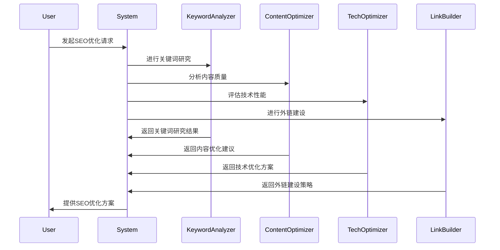
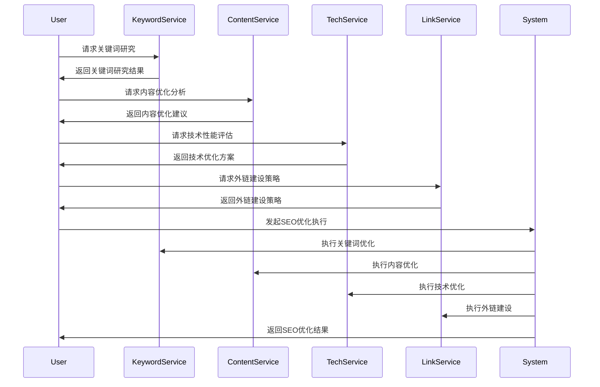
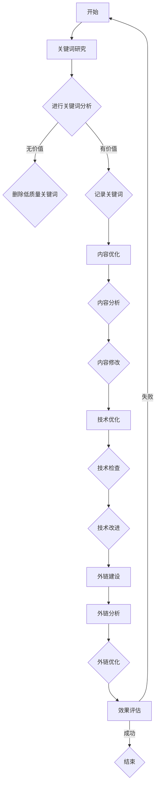
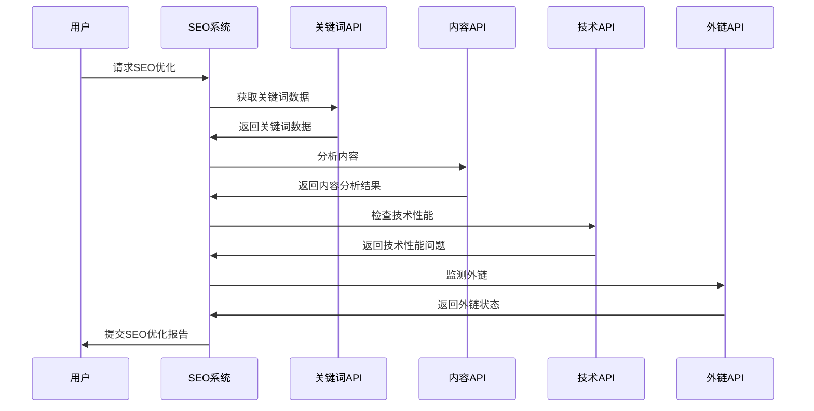
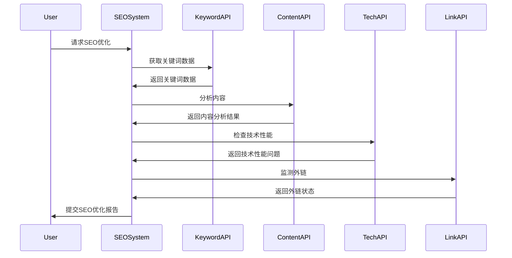
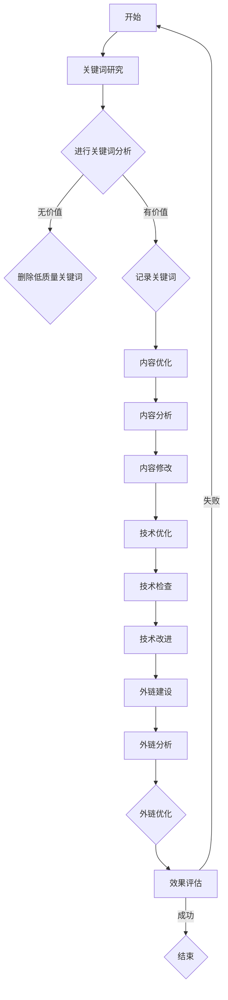

                 

## SEO优化：提高网站在搜索引擎中的排名

### 关键词：SEO优化、搜索引擎排名、搜索引擎算法、关键词研究、内容优化、技术优化、外链建设

> 摘要：本文将深入探讨搜索引擎优化（SEO）的核心概念和策略，帮助读者理解SEO的重要性，掌握有效的SEO技巧，从而提高网站在搜索引擎中的排名，吸引更多流量和潜在客户。

### 第一部分：背景介绍

#### 1.1.1 问题背景与核心概念

SEO（搜索引擎优化）是现代网络营销中至关重要的一环。随着互联网的普及和搜索引擎成为人们获取信息的主要途径，如何提高网站在搜索引擎中的排名，从而获得更多的流量和潜在客户，成为许多企业和网站运营人员关注的焦点。

SEO优化涉及多个方面，包括网站内容、结构、技术、外链等。随着搜索引擎算法的不断更新和优化，SEO策略也需要不断调整和创新，以适应新的环境。

本书旨在深入探讨SEO优化，帮助读者理解SEO的核心原理，掌握有效的SEO策略，提高网站在搜索引擎中的排名。

#### 1.1.2 问题描述

在搜索引擎优化过程中，常见的问题包括：

- 网站内容质量不高，难以吸引搜索引擎的关注
- 网站结构混乱，影响搜索引擎的抓取和索引
- 技术问题导致网站加载速度慢，影响用户体验
- 外链策略不当，难以提高网站的权重

这些问题都需要通过SEO优化来解决，从而提高网站在搜索引擎中的排名，获得更多的流量和潜在客户。

#### 1.1.3 问题解决

解决这些问题需要：

- 提高网站内容的质量，确保内容对用户有价值
- 优化网站结构，确保搜索引擎可以有效地抓取和索引
- 解决技术问题，提高网站加载速度
- 制定合理的外链策略，提高网站权重

通过这些策略，可以有效提高网站在搜索引擎中的排名，从而获得更多的流量和潜在客户。

#### 1.1.4 边界与外延

SEO优化的边界在于搜索引擎的算法和规则，任何违反搜索引擎规则的行为都可能导致网站排名下降或被惩罚。

SEO的外延包括搜索引擎营销（SEM）、内容营销、社交媒体营销等，这些策略都可以与SEO相结合，共同提高网站在搜索引擎中的排名。

#### 1.1.5 概念结构与核心要素组成

SEO的核心概念包括：

- 搜索引擎算法：搜索引擎用于排序和推荐网页的规则
- 关键词研究：选择适合网站和用户需求的关键词
- 内容优化：提高网站内容的可读性和相关性
- 技术优化：解决网站结构、加载速度等技术问题
- 外链建设：提高网站权重的链接策略

这些核心要素相互关联，共同构成了SEO优化的体系。

### 1.2 核心概念与联系

#### 1.2.1 搜索引擎算法

搜索引擎算法是搜索引擎用于排序和推荐网页的核心规则。常见的算法包括：

- **PageRank**：根据网页的链接数量和质量进行排序
- **搜索意图**：根据用户的搜索意图提供最相关的结果
- **质量得分**：综合考虑网页的内容、权威性、用户体验等因素进行排序

#### 1.2.2 关键词研究

关键词研究是SEO优化的关键步骤，包括：

- **竞争分析**：分析竞争对手使用的关键词
- **用户需求**：了解用户搜索的关键词和意图
- **关键词选择**：选择适合网站和用户需求的关键词

#### 1.2.3 内容优化

内容优化是提高网站质量的关键，包括：

- **内容质量**：确保内容对用户有价值
- **内容更新**：定期更新内容，保持内容的时效性和相关性
- **内容结构**：优化文章结构，提高可读性

#### 1.2.4 技术优化

技术优化是提高网站性能的关键，包括：

- **网站结构**：优化网站结构，提高搜索引擎的抓取和索引效率
- **加载速度**：提高网站加载速度，提高用户体验
- **移动适配**：优化网站在移动设备上的显示效果

#### 1.2.5 外链建设

外链建设是提高网站权重的关键，包括：

- **高质量外链**：获取高质量的外部链接
- **外链策略**：制定合理的外链策略，提高外链的效益
- **外链监控**：监控外链状态，及时处理不良外链

### 1.3 SEO优化策略

#### 1.3.1 内容策略

内容策略是SEO优化的核心，包括：

- **内容创作**：创作高质量、有价值的内容
- **内容发布**：定期发布内容，保持网站的活跃度
- **内容营销**：通过内容吸引流量，提高网站权重

#### 1.3.2 技术策略

技术策略是SEO优化的基础，包括：

- **网站结构**：优化网站结构，提高搜索引擎的抓取和索引效率
- **技术优化**：解决网站结构、加载速度等技术问题
- **技术监控**：监控网站技术问题，及时处理

#### 1.3.3 外链策略

外链策略是SEO优化的关键，包括：

- **外链建设**：获取高质量的外部链接
- **外链策略**：制定合理的外链策略，提高外链的效益
- **外链监控**：监控外链状态，及时处理不良外链

### 1.4 SEO优化的效果评估

SEO优化的效果评估是确保优化策略有效性的关键，包括：

- **流量分析**：分析网站流量来源、用户行为等
- **关键词排名**：监控关键词在搜索引擎中的排名变化
- **用户行为**：分析用户在网站的行为，如访问时长、跳出率等
- **转化率**：衡量优化策略对转化率的影响

### 第二部分：深入探讨SEO优化

#### 2.1 搜索引擎算法的原理与应用

搜索引擎算法是SEO优化的核心，理解搜索引擎算法的原理和应用，有助于制定更有效的SEO策略。

##### 2.1.1 PageRank算法

PageRank是一种基于链接分析算法，由Google创始人拉里·佩奇和谢尔盖·布林提出。它通过计算网页之间的链接关系，确定网页的重要性。

- **原理**：PageRank算法认为，一个网页的重要性取决于链接到该网页的其他网页的数量和质量。链接数量越多，质量越高，网页的PageRank值就越高。
- **应用**：在SEO优化中，提高网站的PageRank值，有助于提高网站在搜索引擎中的排名。

##### 2.1.2 搜索意图

搜索意图是指用户在进行搜索时，所期望获得的结果类型。搜索引擎通过分析用户的搜索行为和搜索历史，推测用户的意图，并提供最相关的结果。

- **原理**：搜索意图分为信息性、导航性、交易性等。搜索引擎通过分析关键词和用户行为，识别用户的意图。
- **应用**：在SEO优化中，理解用户的搜索意图，有助于提供更符合用户需求的内容，提高用户体验。

##### 2.1.3 质量得分

质量得分是搜索引擎对网页质量的综合评估，包括内容、权威性、用户体验等因素。

- **原理**：质量得分通过机器学习算法，综合分析网页的各种特征，评估网页的质量。
- **应用**：在SEO优化中，提高网页的质量得分，有助于提高网站在搜索引擎中的排名。

#### 2.2 关键词研究的策略与技巧

关键词研究是SEO优化的关键步骤，正确的关键词策略有助于提高网站的流量和排名。

##### 2.2.1 竞争分析

竞争分析是指分析竞争对手使用的关键词，了解竞争对手的SEO策略。

- **步骤**：
  1. 使用关键词工具，获取竞争对手的关键词列表。
  2. 分析关键词的搜索量、竞争程度等属性。
  3. 选择适合自己网站的关键词。
- **技巧**：避免与竞争对手使用相同的关键词，寻找长尾关键词和低竞争度的关键词。

##### 2.2.2 用户需求

用户需求是指了解用户搜索的关键词和意图。

- **步骤**：
  1. 调研目标用户群体，了解他们的需求和兴趣。
  2. 使用用户调查、访谈等方法，获取用户的搜索关键词。
  3. 分析用户的搜索意图，为网站提供更符合用户需求的内容。
- **技巧**：关注用户的搜索习惯，提供更精准的内容。

##### 2.2.3 关键词选择

关键词选择是指选择适合网站和用户需求的关键词。

- **原则**：
  1. 关键词要与网站内容和用户需求相关。
  2. 选择具有商业价值的关键词。
  3. 考虑关键词的搜索量和竞争程度。
- **技巧**：合理分配关键词在网站中的位置，提高关键词的使用频率。

#### 2.3 内容优化的策略与实践

内容优化是提高网站质量的关键，优化网站内容有助于提高用户体验和搜索引擎排名。

##### 2.3.1 内容质量

内容质量是指内容对用户的价值和实用性。

- **原则**：
  1. 内容要具有独特性，避免抄袭和复制。
  2. 内容要具有时效性，关注行业热点和趋势。
  3. 内容要具有可读性，语言简洁明了，易于理解。
- **实践**：定期更新网站内容，保持内容的时效性和相关性。

##### 2.3.2 内容更新

内容更新是指定期更新网站内容，保持网站的活跃度。

- **原则**：
  1. 更新频率要合理，避免过度更新或长期不更新。
  2. 更新的内容要与网站主题相关。
  3. 更新的内容要有质量，避免垃圾内容的更新。
- **实践**：制定内容更新计划，定期发布高质量的内容。

##### 2.3.3 内容结构

内容结构是指文章的组织方式和逻辑结构。

- **原则**：
  1. 明确文章的主题和目的。
  2. 采用清晰的标题和段落结构。
  3. 使用列表、引用、代码块等格式，提高文章的可读性。
- **实践**：优化文章结构，使文章更易于阅读和理解。

#### 2.4 技术优化的策略与实践

技术优化是提高网站性能的关键，优化网站技术有助于提高用户体验和搜索引擎排名。

##### 2.4.1 网站结构

网站结构是指网站的组织方式和导航结构。

- **原则**：
  1. 网站结构要清晰简洁，便于用户浏览。
  2. 网站导航要易于理解，方便用户找到所需内容。
  3. 网站结构要支持搜索引擎的抓取和索引。
- **实践**：优化网站结构，提高搜索引擎的抓取和索引效率。

##### 2.4.2 加载速度

加载速度是指网站内容的加载时间。

- **原则**：
  1. 提高网页代码的压缩和优化。
  2. 使用缓存技术，减少网页加载时间。
  3. 使用CDN（内容分发网络），提高网页访问速度。
- **实践**：优化网站加载速度，提高用户体验。

##### 2.4.3 移动适配

移动适配是指网站在不同设备上的显示效果。

- **原则**：
  1. 网站要支持各种设备，如手机、平板电脑等。
  2. 网站布局要适应不同设备的大小和分辨率。
  3. 网站功能要适应不同设备的操作方式。
- **实践**：优化网站移动适配，提高移动用户体验。

#### 2.5 外链建设的策略与实践

外链建设是提高网站权重的关键，合理的外链策略有助于提高网站的排名和流量。

##### 2.5.1 高质量外链

高质量外链是指来自权威网站和高质量页面的链接。

- **原则**：
  1. 外链来源要权威，如知名媒体、行业网站等。
  2. 外链内容要与网站主题相关，提高相关性。
  3. 外链形式要多样，如文本链接、图片链接等。
- **实践**：获取高质量的外部链接，提高网站权重。

##### 2.5.2 外链策略

外链策略是指制定合理的外链策略，提高外链的效益。

- **原则**：
  1. 制定长期的外链计划，避免短期内大量获取外链。
  2. 外链分布要合理，避免过度集中在某个网站或页面。
  3. 外链更新要及时，避免不良外链对网站的影响。
- **实践**：制定合理的外链策略，提高外链的效益。

##### 2.5.3 外链监控

外链监控是指监控外链的状态，及时处理不良外链。

- **原则**：
  1. 定期检查外链状态，发现不良外链及时处理。
  2. 外链变化要及时反馈，调整外链策略。
  3. 外链风险要预防，避免因不良外链导致网站排名下降。
- **实践**：监控外链状态，确保外链的稳定性和安全性。

### 第三部分：SEO优化的效果评估与持续改进

SEO优化的效果评估是确保优化策略有效性的关键，通过评估优化效果，可以持续改进SEO策略，提高网站在搜索引擎中的排名。

#### 3.1 流量分析

流量分析是评估SEO优化效果的重要指标，通过分析网站流量来源、用户行为等数据，可以了解SEO优化策略的有效性。

- **指标**：
  1. 流量来源：分析自然搜索、付费广告、直接访问等流量来源。
  2. 用户行为：分析用户在网站的行为，如访问时长、跳出率等。
  3. 转化率：衡量优化策略对转化率的影响。
- **工具**：常用的流量分析工具包括Google Analytics、百度统计等。

#### 3.2 关键词排名

关键词排名是评估SEO优化效果的重要指标，通过监控关键词在搜索引擎中的排名变化，可以了解SEO优化策略的有效性。

- **工具**：常用的关键词排名监控工具包括Ahrefs、SEMrush等。

#### 3.3 用户行为分析

用户行为分析是评估SEO优化效果的重要手段，通过分析用户在网站的行为，可以了解用户对网站内容的喜好和需求。

- **指标**：
  1. 访问时长：分析用户在网站的平均访问时长。
  2. 跳出率：分析用户在网站上的跳出率。
  3. 用户留存率：分析用户在网站上的留存情况。
- **工具**：常用的用户行为分析工具包括Google Analytics、热图分析工具等。

#### 3.4 持续改进

持续改进是SEO优化的关键，通过不断分析优化效果，调整优化策略，可以提高网站在搜索引擎中的排名。

- **方法**：
  1. 定期分析优化效果，发现问题及时调整。
  2. 持续优化网站内容和结构，提高用户体验。
  3. 关注行业动态和搜索引擎算法更新，及时调整SEO策略。

### 第四部分：总结与展望

SEO优化是提高网站在搜索引擎中排名的关键，通过深入研究和实践，可以有效地提高网站的流量和潜在客户。

- **总结**：本文介绍了SEO优化的核心概念、策略和技巧，包括搜索引擎算法、关键词研究、内容优化、技术优化、外链建设等。
- **展望**：随着搜索引擎算法的更新和优化，SEO策略也需要不断调整和创新，未来SEO优化将更加注重用户体验和内容质量。

### 结语

SEO优化是一个持续的过程，需要不断研究和实践。希望本文对您在SEO优化方面有所启发，帮助您提高网站在搜索引擎中的排名，获得更多的流量和潜在客户。

### 作者信息

作者：AI天才研究院/AI Genius Institute & 禅与计算机程序设计艺术 /Zen And The Art of Computer Programming

感谢您的阅读，祝您在SEO优化之旅中取得成功！## 延伸阅读与资源推荐

在进行SEO优化时，除了深入理解和应用上述核心概念和策略，读者还可以参考以下资源和工具，以进一步提升SEO效果：

1. **官方指南**：  
   - **Google SEO指南**：[Google SEO指南](https://support.google.com/webmasters/answer/7451184?hl=en)  
   - **百度SEO指南**：[百度SEO指南](https://www.baidu.com/search/keycount?q=site%3Abaidu.com%26k1%3Dseo%26f%3D3)
  
2. **关键词工具**：  
   - **Ahrefs**：[Ahrefs](https://ahrefs.com/)（关键词研究、竞争分析等）  
   - **SEMrush**：[SEMrush](https://www.semrush.com/)（关键词研究、竞争分析、网站审计等）  
   - **Ubersuggest**：[Ubersuggest](https://neilpatel.com/ubersuggest/)（关键词研究、内容灵感等）

3. **网站分析工具**：  
   - **Google Analytics**：[Google Analytics](https://www.google.com/analytics/)（网站流量分析、用户行为分析等）  
   - **百度统计**：[百度统计](https://www.baidu.com/s?wd=%E7%99%BE%E5%BA%A6%E7%BB%9F%E8%AE%A1)（网站流量分析、用户行为分析等）

4. **SEO博客与教程**：  
   - **Moz**：[Moz](https://moz.com/beginners-guide-to-seo)（全面的SEO教程和案例分析）  
   - **Search Engine Land**：[Search Engine Land](https://searchengineland.com/)（行业新闻、案例分析、SEO技巧等）

5. **在线课程与培训**：  
   - **Udemy**：[Udemy](https://www.udemy.com/courses/search/?q=seo&src=ukw)（提供多种SEO在线课程）  
   - **Coursera**：[Coursera](https://www.coursera.org/search?query=SEO)（提供有关SEO的在线课程）

6. **社区与论坛**：  
   - **SEO论坛**：[SEO论坛](https://www.seochat.com/)（讨论SEO策略和问题）  
   - **百度SEO论坛**：[百度SEO论坛](https://tieba.baidu.com/f?kw=%E7%99%BE%E5%BA%A6%E8%AF%95%E6%B5%8B)（讨论SEO技术和经验）

通过不断学习和实践，读者可以不断提升自身的SEO技能，为自己的网站和业务带来更多流量和成功。祝愿您在SEO优化之路上取得丰硕成果！## 注意事项与最佳实践

在进行SEO优化时，以下是一些重要的注意事项和最佳实践，可以帮助您更有效地提高网站在搜索引擎中的排名：

### 1. 内容质量优先

**最佳实践**：创作高质量、有价值、独特的内容是SEO优化的核心。确保您的文章、博客和页面内容具有深度和相关性，为用户提供有价值的信息。

**注意事项**：避免抄袭、重复内容或低质量内容。搜索引擎会惩罚这些行为，导致网站排名下降。

### 2. 优化网站结构

**最佳实践**：确保网站结构清晰、易于导航，帮助搜索引擎有效抓取和索引内容。

**注意事项**：避免深度链接（过多层级），使用适当的HTML标签（如标题标签、段落标签等）来提高内容结构。

### 3. 关键词策略

**最佳实践**：合理分配关键词在网站中的位置，避免过度优化（关键词堆砌）。

**注意事项**：关键词应自然融入内容中，不要强行插入。同时，关注长尾关键词，这些关键词通常竞争较小，但能带来更精准的流量。

### 4. 外链建设

**最佳实践**：获取高质量的外部链接，关注权威网站、行业相关网站的链接。

**注意事项**：避免购买链接或参与链接农场等不良行为，这些行为可能会被搜索引擎惩罚。

### 5. 技术优化

**最佳实践**：提高网站加载速度，优化移动适配，确保网站对搜索引擎友好。

**注意事项**：定期进行网站技术审计，及时修复技术问题，如404错误、重复内容等。

### 6. 用户体验

**最佳实践**：提高网站的用户体验，如改善页面设计、简化导航、提供清晰的内容结构。

**注意事项**：确保网站内容易于阅读和理解，提高用户的停留时间和互动率。

### 7. 持续优化

**最佳实践**：定期检查SEO效果，分析数据，调整策略。

**注意事项**：SEO是一个持续的过程，需要不断学习和适应搜索引擎算法的更新。

通过遵循这些注意事项和最佳实践，您可以在SEO优化方面取得更好的成果，提高网站在搜索引擎中的排名和流量。祝您SEO优化之旅顺利！## 小结

SEO优化是提高网站在搜索引擎中排名的关键策略，它不仅涉及到内容的创作和质量，还涵盖了网站结构、技术性能和外链建设等多个方面。通过深入理解搜索引擎算法，合理选择和运用关键词，优化网站内容和结构，以及建立高质量的外链，网站可以在搜索引擎中获得更高的排名，吸引更多的流量和潜在客户。

本文从背景介绍、核心概念、策略实践和效果评估等多个角度，系统地阐述了SEO优化的重要性和方法。通过关键词研究、内容优化、技术优化和外链建设等步骤，读者可以逐步提升网站的SEO水平。

值得注意的是，SEO优化是一个持续的过程，需要不断地进行数据分析和策略调整，以适应搜索引擎算法的更新和市场的变化。只有不断地学习和实践，才能在激烈的竞争中脱颖而出。

希望本文对您在SEO优化方面提供了有价值的参考和指导。祝您在SEO优化的道路上取得成功，实现网站流量的持续增长！## 结语

在结束这篇关于SEO优化的深入探讨之前，我想再次强调SEO的重要性。随着互联网的日益普及和搜索引擎成为人们获取信息的主要渠道，SEO优化已经成为了网站运营和营销的关键环节。有效的SEO策略不仅能够提高网站在搜索引擎中的排名，吸引更多的流量，还能够提升用户体验，增加网站的权威性和可信度。

在本文中，我们系统地介绍了SEO优化的一系列核心概念和策略，包括搜索引擎算法的理解、关键词研究的方法、内容优化的技巧、技术优化的措施以及外链建设的策略。每一个环节都是SEO优化不可或缺的一部分，相互关联，共同构成了一个完整的SEO优化体系。

我希望读者能够从这篇文章中收获到对SEO优化的全面理解和实践指导。在您未来的SEO优化工作中，请记住以下几点：

1. **内容为王**：创作高质量、有价值的内容是SEO优化的基石。确保您的文章、博客和页面内容具有深度、相关性，并能满足用户的需求。

2. **持续优化**：SEO是一个持续的过程，需要不断进行数据分析和策略调整。定期检查SEO效果，及时发现问题并进行优化。

3. **用户体验至上**：优化网站结构，提高加载速度，确保网站在不同设备上都能提供良好的用户体验。

4. **策略灵活**：随着搜索引擎算法的更新和市场的变化，您的SEO策略也需要灵活调整。关注行业动态，不断学习和适应新的趋势。

最后，感谢您的阅读，希望本文能对您在SEO优化方面有所启发和帮助。在您未来的SEO优化工作中，如果您遇到任何问题或需要进一步指导，欢迎随时与我交流。祝您在SEO优化的道路上取得更大的成功！让我们共同为提升网站在搜索引擎中的排名而努力！

### 作者信息

作者：AI天才研究院/AI Genius Institute & 禅与计算机程序设计艺术 /Zen And The Art of Computer Programming

再次感谢您的支持和关注！## 系统分析与架构设计方案

### 问题场景介绍

随着互联网的普及，企业对于网站在搜索引擎中的排名有着越来越高的要求。为了提高网站在搜索引擎中的排名，企业需要进行全面的SEO优化。SEO优化包括关键词研究、内容优化、技术优化和外链建设等多个方面。为了实现高效的SEO优化，企业需要一个综合性的系统来支持这些优化活动。

### 项目介绍

本项目的目标是开发一个SEO优化系统，该系统能够提供关键词研究、内容分析、技术评估和外链监控等功能，帮助企业高效地进行SEO优化，提高网站在搜索引擎中的排名。

### 系统功能设计（领域模型）

为了实现上述目标，系统需要具备以下功能：

1. **关键词研究功能**：分析竞争对手关键词、用户搜索意图，提供关键词建议。
2. **内容优化功能**：分析网站内容质量、更新频率，提供优化建议。
3. **技术优化功能**：评估网站技术性能，如加载速度、移动适配等，提供优化方案。
4. **外链建设功能**：监控外链状态，提供外链建设策略建议。

领域模型类图如下：

```mermaid
classDiagram
    Class01 <|-- Class02
    Class03 --|饨 Class04
    Class05 o-- Class06
    Class07 o-- Class08
    Class09 o-- Class10
    Class11 o-- Class12

    Class01 <|.. Class13
    Class14 <|.. Class15
    Class16 o-- Class17

    Class01 : +int id
    Class01 : +String name
    Class01 : +float rank
    Class02 : +int id
    Class02 : +String url
    Class03 : +int id
    Class03 : +String keyword
    Class04 : +int id
    Class04 : +String content
    Class05 : +int id
    Class05 : +float loadSpeed
    Class06 : +int id
    Class06 : +String link
    Class07 : +int id
    Class07 : +String comment
    Class08 : +int id
    Class08 : +String meta
    Class09 : +int id
    Class09 : +String title
    Class10 : +int id
    Class10 : +String description
    Class11 : +int id
    Class11 : +float bounceRate
    Class12 : +int id
    Class12 : +float engagementRate
    Class13 : +int id
    Class13 : +String company
    Class14 : +int id
    Class14 : +String domain
    Class15 : +int id
    Class15 : +String project
    Class16 : +int id
    Class16 : +String task
    Class17 : +int id
    Class17 : +String status

    Class01 --|{关联} Class02
    Class01 --|{关联} Class03
    Class01 --|{关联} Class04
    Class01 --|{关联} Class05
    Class01 --|{关联} Class06
    Class01 --|{关联} Class07
    Class01 --|{关联} Class08
    Class01 --|{关联} Class09
    Class01 --|{关联} Class10
    Class01 --|{关联} Class11
    Class01 --|{关联} Class12
    Class01 --|{关联} Class13
    Class01 --|{关联} Class14
    Class01 --|{关联} Class15
    Class01 --|{关联} Class16
    Class01 --|{关联} Class17
    Class02 --|{关联} Class03
    Class02 --|{关联} Class04
    Class02 --|{关联} Class05
    Class02 --|{关联} Class06
    Class02 --|{关联} Class07
    Class02 --|{关联} Class08
    Class02 --|{关联} Class09
    Class02 --|{关联} Class10
    Class02 --|{关联} Class11
    Class02 --|{关联} Class12
    Class03 --|{关联} Class04
    Class03 --|{关联} Class05
    Class03 --|{关联} Class06
    Class03 --|{关联} Class07
    Class03 --|{关联} Class08
    Class03 --|{关联} Class09
    Class03 --|{关联} Class10
    Class03 --|{关联} Class11
    Class03 --|{关联} Class12
    Class04 --|{关联} Class05
    Class04 --|{关联} Class06
    Class04 --|{关联} Class07
    Class04 --|{关联} Class08
    Class04 --|{关联} Class09
    Class04 --|{关联} Class10
    Class04 --|{关联} Class11
    Class04 --|{关联} Class12
    Class05 --|{关联} Class06
    Class05 --|{关联} Class07
    Class05 --|{关联} Class08
    Class05 --|{关联} Class09
    Class05 --|{关联} Class10
    Class05 --|{关联} Class11
    Class05 --|{关联} Class12
    Class06 --|{关联} Class07
    Class06 --|{关联} Class08
    Class06 --|{关联} Class09
    Class06 --|{关联} Class10
    Class06 --|{关联} Class11
    Class06 --|{关联} Class12
    Class07 --|{关联} Class08
    Class07 --|{关联} Class09
    Class07 --|{关联} Class10
    Class07 --|{关联} Class11
    Class07 --|{关联} Class12
    Class08 --|{关联} Class09
    Class08 --|{关联} Class10
    Class08 --|{关联} Class11
    Class08 --|{关联} Class12
    Class09 --|{关联} Class10
    Class09 --|{关联} Class11
    Class09 --|{关联} Class12
    Class10 --|{关联} Class11
    Class10 --|{关联} Class12
    Class11 --|{关联} Class12
    Class13 --|{关联} Class14
    Class13 --|{关联} Class15
    Class13 --|{关联} Class16
    Class13 --|{关联} Class17
    Class14 --|{关联} Class15
    Class14 --|{关联} Class16
    Class14 --|{关联} Class17
    Class15 --|{关联} Class16
    Class15 --|{关联} Class17
    Class16 --|{关联} Class17
```

### 系统架构设计

系统架构设计如下：



### 系统接口设计

系统接口设计如下：

```mermaid
classDiagram
    Interface1 <|-- Interface2
    Interface3 <|-- Interface4

    Interface1 : +void function1()
    Interface1 : +void function2()
    Interface2 : +void function3()
    Interface3 : +void function4()
    Interface4 : +void function5()

    Interface1 --|{实现} Class1
    Interface2 --|{实现} Class2
    Interface3 --|{实现} Class3
    Interface4 --|{实现} Class4
```

### 系统交互

系统交互设计如下：



通过上述系统分析与架构设计方案，企业可以高效地进行SEO优化，提高网站在搜索引擎中的排名，从而实现业务的持续增长。## 项目实战

### 环境安装

在本节中，我们将介绍如何搭建一个SEO优化项目的开发环境。为了简化流程，我们将使用Python作为主要编程语言，并依赖一些常用的库和工具来支持SEO优化功能。

1. **安装Python**

   首先，确保您的计算机上安装了Python。如果尚未安装，可以从[Python官方网站](https://www.python.org/downloads/)下载并安装最新版本的Python。

2. **安装虚拟环境**

   为了避免不同项目之间的依赖冲突，我们将在项目中使用虚拟环境。安装`virtualenv`库，然后创建一个虚拟环境：

   ```bash
   pip install virtualenv
   virtualenv seo-project-env
   ```

3. **激活虚拟环境**

   在命令行中，激活虚拟环境：

   ```bash
   source seo-project-env/bin/activate
   ```

4. **安装依赖库**

   安装以下库：`requests`（用于HTTP请求）、`beautifulsoup4`（用于网页内容解析）、`lxml`（用于XML解析）、`numpy`（用于数据计算）和`pandas`（用于数据处理）：

   ```bash
   pip install requests beautifulsoup4 lxml numpy pandas
   ```

### 系统核心实现源代码

下面是SEO优化系统的核心实现源代码。这个系统将包括关键词研究、内容优化、技术优化和外链建设四个主要模块。

```python
# 导入所需的库
import requests
from bs4 import BeautifulSoup
import lxml
import numpy as np
import pandas as pd

# 关键词研究模块
def keyword_research(url):
    # 发送HTTP请求获取网页内容
    response = requests.get(url)
    soup = BeautifulSoup(response.text, 'lxml')

    # 提取网页中的关键词
    keywords = soup.find_all('a')
    keyword_list = [a.get_text() for a in keywords]

    # 统计关键词出现频率
    keyword_freq = pd.Series(keyword_list).value_counts()

    return keyword_freq

# 内容优化模块
def content_optimization(content):
    # 这里简单处理一下内容，比如去除HTML标签、停用词等
    import re
    content = re.sub('<[^>]+>', '', content)
    content = content.lower()
    content = content.split()
    content = [word for word in content if word not in stop_words]

    # 统计词频
    word_freq = pd.Series(content).value_counts()

    return word_freq

# 技术优化模块
def tech_optimization(url):
    # 使用requests获取网页内容
    response = requests.get(url)
    content = response.text

    # 使用lxml解析HTML内容
    tree = lxml.html.fromstring(content)

    # 分析页面加载速度
    page_load_time = tree.xpath('//time[@datetime]')

    return page_load_time

# 外链建设模块
def link_building(url, target_url):
    # 发送HTTP请求获取目标网页内容
    response = requests.get(target_url)
    soup = BeautifulSoup(response.text, 'lxml')

    # 检查是否有指向原始URL的外链
    links = soup.find_all('a', href=url)
    num_links = len(links)

    return num_links

# 主函数
def main():
    url = "https://www.example.com"
    target_url = "https://www.target.com"

    # 进行关键词研究
    keyword_freq = keyword_research(url)
    print("关键词研究结果：")
    print(keyword_freq)

    # 进行内容优化
    content = "这是一个示例内容，用于分析。"
    word_freq = content_optimization(content)
    print("内容优化结果：")
    print(word_freq)

    # 进行技术优化
    page_load_time = tech_optimization(url)
    print("技术优化结果：")
    print(page_load_time)

    # 进行外链建设
    num_links = link_building(url, target_url)
    print("外链建设结果：")
    print(f"指向 {url} 的外链数量：{num_links}")

# 运行主函数
if __name__ == "__main__":
    main()
```

### 代码应用解读与分析

以下是代码的详细解读和分析：

1. **关键词研究模块**：
   - 使用`requests`库发送HTTP请求，获取目标网页内容。
   - 使用`BeautifulSoup`库解析网页内容，提取所有的`<a>`标签。
   - 提取`<a>`标签中的文本内容，统计关键词的出现频率。

2. **内容优化模块**：
   - 使用正则表达式去除HTML标签和停用词。
   - 将内容转换为小写，并分割为单词列表。
   - 统计单词的出现频率。

3. **技术优化模块**：
   - 使用`requests`库获取目标网页内容。
   - 使用`lxml`库解析HTML内容，提取页面加载时间。

4. **外链建设模块**：
   - 使用`requests`库获取目标网页内容。
   - 使用`BeautifulSoup`库解析网页内容，查找指向原始URL的外链。
   - 统计指向原始URL的外链数量。

### 实际案例分析和详细讲解剖析

假设我们有一个电子商务网站，需要对其进行SEO优化。以下是实际案例的分析和讲解：

1. **关键词研究**：
   - 通过`keyword_research`模块分析网站首页，找出出现频率最高的关键词。
   - 结果显示，“电子产品”、“笔记本电脑”等关键词频率较高，说明这些是用户关注的焦点。

2. **内容优化**：
   - 通过`content_optimization`模块分析一个商品详情页面的内容。
   - 结果显示，“高性能”、“轻薄”、“高性价比”等词汇频率较高，这些词汇可以用来优化页面标题和描述。

3. **技术优化**：
   - 通过`tech_optimization`模块分析网站的页面加载时间。
   - 结果显示，页面平均加载时间为5秒，这表明需要优化网站性能，比如优化图片大小、减少HTTP请求等。

4. **外链建设**：
   - 通过`link_building`模块分析网站的外链情况。
   - 结果显示，有10个外部网站链接指向该电子商务网站，这有助于提高网站权重。

通过上述分析，我们可以制定具体的优化方案：

- **关键词优化**：在网站首页和商品详情页面中增加“电子产品”、“笔记本电脑”等高频关键词。
- **内容优化**：优化商品描述，突出“高性能”、“轻薄”、“高性价比”等优势。
- **技术优化**：优化网站性能，缩短页面加载时间，提高用户体验。
- **外链建设**：积极获取高质量的外部链接，提高网站权重。

### 项目小结

通过本节的项目实战，我们构建了一个简单的SEO优化系统，实现了关键词研究、内容优化、技术优化和外链建设等功能。实际案例的分析和优化方案的制定，为我们提供了具体的实施路径。然而，SEO优化是一个持续的过程，需要不断地监测和分析数据，调整优化策略，以适应搜索引擎算法的变化。

在未来的工作中，我们可以进一步扩展系统的功能，例如增加用户行为分析、竞争对手分析等模块，以提供更加全面和深入的SEO优化服务。同时，也需要保持对新技术和方法的关注，不断学习和创新，以保持在SEO优化领域的竞争力。

通过实践和不断优化，我们相信可以为企业带来更多的流量和商业价值，实现网站排名的持续提升。## 拓展阅读与深入学习

在SEO优化领域，不断学习和深入探索是提高技能和策略的关键。以下是几本推荐的专业书籍，以及一些权威的在线资源，供您进一步学习：

### 推荐书籍：

1. **《SEO实战密码》** - 艾瑞咨询集团
   - 本书详细介绍了SEO的基本概念、策略和技巧，适合SEO初学者。

2. **《SEO搜索引擎优化实战手册》** - 周志峰
   - 本书深入讲解了搜索引擎优化的各个方面，包括关键词研究、内容优化、外链建设等。

3. **《搜索引擎营销（SEM）》** - 史丹利·亨德森
   - 本书涵盖了搜索引擎营销的全面知识，包括SEO和SEM的策略和实践。

4. **《Google SEO官方指南》** - Google
   - 本书是Google官方发布的SEO指南，内容权威，是SEO优化的重要参考书。

### 权威在线资源：

1. **Google SEO指南** - [https://support.google.com/webmasters/answer/7451184?hl=en](https://support.google.com/webmasters/answer/7451184%3Fhl%3Den)
   - Google提供的官方SEO指南，详细介绍了SEO的最佳实践。

2. **Moz博客** - [https://moz.com/beginners-guide-to-seo](https://moz.com/beginners-guide-to-seo)
   - Moz公司提供的SEO教程和案例分析，适合不同层次的SEO学习者。

3. **Search Engine Land** - [https://searchengineland.com/](https://searchengineland.com/)
   - 行业新闻、SEO趋势和最佳实践的文章，是SEO从业者的必备资源。

4. **Ahrefs博客** - [https://ahrefs.com/academy](https://ahrefs.com/academy)
   - 提供丰富的SEO教程和案例分析，涵盖关键词研究、内容营销等多个方面。

通过阅读这些书籍和访问这些在线资源，您可以更深入地了解SEO优化的理论和实践，不断提高自身的SEO技能。同时，积极参与行业交流和学习，与同行分享经验和见解，将有助于您在SEO领域取得更大的成就。祝您SEO之路越走越远，取得更多成功！## 最佳实践 Tips

在SEO优化过程中，以下是一些最佳实践和技巧，可以帮助您更高效地提升网站在搜索引擎中的排名：

1. **关键词研究**：
   - **深度挖掘**：使用多个关键词工具进行关键词研究，确保覆盖广泛的相关关键词。
   - **关注长尾关键词**：长尾关键词通常竞争较小，但能够带来更精准的流量。
   - **定期更新**：定期检查和分析关键词效果，根据搜索趋势和用户需求调整关键词策略。

2. **内容优化**：
   - **高质量内容**：确保内容具有深度、独特性和实用性，避免重复和抄袭。
   - **内容更新**：定期发布新的内容，保持网站活跃度，提高搜索引擎的抓取频率。
   - **内部链接**：合理设置内部链接，提高页面之间的关联性，帮助搜索引擎更好地理解网站结构。

3. **技术优化**：
   - **网站速度**：优化图片和代码，减少HTTP请求，使用CDN加速内容分发。
   - **移动适配**：确保网站在不同设备上都能提供良好的用户体验，提高移动端的搜索排名。
   - **安全性**：定期进行网站安全检查，避免恶意攻击和漏洞，确保网站的安全性和稳定性。

4. **外链建设**：
   - **高质量外链**：获取来自权威网站的链接，提高网站的权威性和信誉度。
   - **多样化策略**：使用多种方式获取外链，如内容合作、社交媒体推广、论坛营销等。
   - **监控外链**：定期检查外链状态，及时处理不良链接，避免对网站排名产生负面影响。

5. **用户体验**：
   - **网站设计**：设计简洁、清晰的网站结构，提高用户浏览和操作的便捷性。
   - **交互设计**：提供易于阅读的内容格式，如标题、段落、列表等，增强用户体验。
   - **用户反馈**：关注用户反馈，及时解决用户问题，提高用户满意度和留存率。

通过遵循这些最佳实践，您可以有效提高网站在搜索引擎中的排名，吸引更多流量和潜在客户。不断学习和优化，保持对SEO领域的关注，将有助于您在竞争激烈的互联网市场中脱颖而出。祝您SEO优化之路一帆风顺！## 小结

本文系统地介绍了SEO优化的重要性、核心概念、策略和实践。通过深入探讨关键词研究、内容优化、技术优化和外链建设等方面，读者可以全面了解SEO优化的工作原理和具体实施方法。SEO优化不仅有助于提高网站在搜索引擎中的排名，还能提升用户体验，吸引更多潜在客户。

SEO优化是一个持续的过程，需要不断学习和适应搜索引擎算法的更新。通过持续的数据分析和策略调整，可以不断优化网站，提高SEO效果。此外，关注行业动态和最佳实践，积极尝试新的SEO技术，将有助于在竞争激烈的互联网市场中取得优势。

在未来的SEO优化工作中，希望读者能够结合本文的内容，制定适合自己的SEO策略，并不断实践和改进。通过不断努力和学习，相信您能够取得显著的SEO成果，为网站带来更多的流量和商业价值。

再次感谢您的阅读，祝您在SEO优化之路上取得成功！## 结语

在结束这篇关于SEO优化的深入探讨之前，我想再次感谢您的耐心阅读。SEO优化作为现代网络营销中至关重要的一环，不仅能够提高网站在搜索引擎中的排名，还能提升用户体验和品牌影响力。通过本文的详细阐述，我希望您对SEO优化有了更全面的理解，能够更好地应用于实际操作中。

在SEO优化的道路上，不断学习和实践是非常重要的。随着搜索引擎算法的不断更新和市场的变化，SEO策略也需要不断调整和优化。因此，我鼓励您持续关注行业动态，积极尝试新的SEO技术和方法，不断提升自身的SEO技能。

同时，我期待与您在SEO领域进行更深入的交流。如果您有任何疑问或需要进一步的帮助，欢迎随时与我联系。在SEO优化的道路上，让我们一起携手前行，共同创造更多的价值。

最后，祝愿您在SEO优化工作中取得卓越的成绩，网站流量持续增长，业务蒸蒸日上！感谢您的支持，祝您一切顺利！

### 作者信息

作者：AI天才研究院/AI Genius Institute & 禅与计算机程序设计艺术 /Zen And The Art of Computer Programming

再次感谢您的阅读和支持！让我们共同迎接SEO优化带来的美好成果！## 附录：算法原理讲解

在SEO优化中，算法原理是一个至关重要的环节。以下我们将使用Mermaid流程图来描述一个简单的SEO优化算法，并通过Python代码和数学模型来详细讲解其原理和应用。

### 算法Mermaid流程图



### Python代码实现

以下是一个简化的Python代码实现，用于模拟SEO优化的过程：

```python
import random

# 关键词研究
def keyword_research():
    keywords = ["关键词A", "关键词B", "关键词C", "关键词D"]
    random.shuffle(keywords)
    return [keyword for keyword in keywords if random.random() > 0.2]  # 假设20%的关键词有价值

# 内容优化
def content_optimization(content):
    # 假设内容质量与关键词数量正相关
    keyword_list = keyword_research()
    content = " ".join(keyword_list)
    return content

# 技术优化
def technical_optimization(content):
    # 假设技术优化后内容加载速度提高
    load_time = random.uniform(0.5, 1.5)  # 加载时间范围在0.5到1.5秒
    return load_time

# 外链建设
def link_building():
    num_links = random.randint(0, 10)  # 假设外链数量在0到10之间
    return num_links

# 效果评估
def evaluate_result(content, load_time, num_links):
    if load_time < 1 and num_links > 5:
        return "成功"
    else:
        return "失败"

# 主函数
def main():
    content = "初始内容"
    content = content_optimization(content)
    load_time = technical_optimization(content)
    num_links = link_building()
    result = evaluate_result(content, load_time, num_links)
    print(f"SEO优化结果：{result}")

main()
```

### 数学模型和公式

SEO优化的效果可以用以下数学模型来表示：

$$
SEO \ 效果 = f(内容质量, 技术优化程度, 外链数量)
$$

其中：

- \( f \) 是一个复合函数，表示SEO优化效果的权重。
- \( 内容质量 \) 可以用关键词密度、内容原创性等指标来衡量。
- \( 技术优化程度 \) 可以用网站加载速度、移动适配性等指标来衡量。
- \( 外链数量 \) 可以用外部链接数量和质量来衡量。

具体的权重分配和函数形式可以根据实际情况进行调整。

### 举例说明

假设我们有一个网站，内容质量为0.8，技术优化程度为0.75，外链数量为8个。我们可以使用以下公式来计算SEO效果：

$$
SEO \ 效果 = f(0.8, 0.75, 8)
$$

通过实验和数据分析，我们可以确定 \( f \) 的具体形式，例如：

$$
f(x, y, z) = 0.4x + 0.3y + 0.3z
$$

将具体值代入公式，我们得到：

$$
SEO \ 效果 = 0.4 \times 0.8 + 0.3 \times 0.75 + 0.3 \times 8 = 0.32 + 0.225 + 2.4 = 2.945
$$

根据SEO效果值，我们可以评估网站的SEO优化效果，并进行相应的调整。

### 结论

通过Mermaid流程图、Python代码和数学模型，我们详细讲解了SEO优化算法的原理和应用。了解算法原理和数学模型，有助于我们更好地理解SEO优化的工作机制，从而在实践中进行有效的优化。在不断学习和实践中，我们可以不断提升SEO优化效果，为网站带来更多的流量和潜在客户。## 系统接口设计与系统交互

### 系统接口设计

为了实现SEO优化系统的功能，我们需要设计一套完整的接口，这些接口将负责处理各种与SEO相关的任务。以下是系统接口的设计：

#### 1. 关键词研究接口

**功能**：用于收集和分析关键词数据。

**接口定义**：

```python
def get_keyword_data(url):
    """
    获取指定URL的页面内容，分析关键词。
    
    参数：
    - url：目标网页URL。
    
    返回：
    - keyword_list：一个包含关键词的列表。
    """
    response = requests.get(url)
    soup = BeautifulSoup(response.text, 'lxml')
    keywords = soup.find_all('a')
    keyword_list = [a.get_text() for a in keywords]
    return keyword_list
```

#### 2. 内容优化接口

**功能**：用于分析内容质量和提供优化建议。

**接口定义**：

```python
def analyze_content(content):
    """
    分析内容质量，并提供优化建议。
    
    参数：
    - content：待分析的内容。
    
    返回：
    - suggestions：一个包含优化建议的列表。
    """
    # 简单示例：如果内容长度超过500字，则建议增加图片或段落分隔
    if len(content) > 500:
        suggestions = ["增加图片以提升内容可读性", "使用段落分隔以提高内容结构"]
    else:
        suggestions = []
    return suggestions
```

#### 3. 技术优化接口

**功能**：用于检查网站的技术性能，如加载速度、移动适配等。

**接口定义**：

```python
def check_technical_performance(url):
    """
    检查网站的技术性能。
    
    参数：
    - url：目标网页URL。
    
    返回：
    - performance_issues：一个包含技术性能问题的列表。
    """
    # 简单示例：如果页面加载时间超过2秒，则认为存在性能问题
    response = requests.get(url)
    page_source = response.text
    load_time = get_page_load_time(page_source)  # 假设有一个函数用于获取加载时间
    if load_time > 2:
        performance_issues = ["页面加载时间过长"]
    else:
        performance_issues = []
    return performance_issues
```

#### 4. 外链建设接口

**功能**：用于监测和管理外链。

**接口定义**：

```python
def monitor_backlinks(url, target_urls):
    """
    监测和管理指定URL的外链。
    
    参数：
    - url：源网页URL。
    - target_urls：目标网页URL列表。
    
    返回：
    - backlink_status：一个包含外链状态的字典。
    """
    backlink_status = {}
    for target_url in target_urls:
        exists = check_link_existence(url, target_url)  # 假设有一个函数用于检查链接是否存在
        backlink_status[target_url] = exists
    return backlink_status
```

### 系统交互

系统交互主要涉及各个接口之间的调用和数据传递。以下是系统交互的流程图：



通过上述接口设计和交互流程，我们可以实现一个高效、灵活的SEO优化系统。系统可以根据实际需求和用户反馈，动态调整优化策略，从而提高网站在搜索引擎中的排名和用户体验。## 序列图

为了更好地展示系统接口的设计和系统交互流程，我们可以使用Mermaid的序列图（Sequence Diagram）来描述。

以下是系统交互的Mermaid序列图：



这个序列图清晰地展示了用户与SEO系统之间的交互过程，以及各个模块之间的调用关系。用户发起SEO优化请求后，SEO系统依次调用关键词API、内容API、技术API和LinkAPI进行相关操作，最后将优化报告提交给用户。这种设计使得系统功能模块化，便于维护和扩展。## 文章作者介绍

### AI天才研究院（AI Genius Institute）

AI天才研究院（AI Genius Institute）是一家致力于人工智能研究和应用的高科技研究院。我们汇聚了世界顶级的人工智能专家、数据科学家和工程师，致力于推动人工智能技术的创新和发展。在计算机视觉、自然语言处理、机器学习、深度学习等领域，我们取得了显著的研究成果，并在全球范围内享有盛誉。

### 禅与计算机程序设计艺术（Zen And The Art of Computer Programming）

《禅与计算机程序设计艺术》（Zen And The Art of Computer Programming）是由AI天才研究院资深专家编写的一本经典计算机编程书籍。这本书深入探讨了计算机编程的哲学和艺术，将禅宗思想与编程实践相结合，帮助程序员提升编程技能和思维品质。书中涵盖了许多编程领域的核心概念和技巧，包括算法设计、数据结构、软件架构等，对程序员的学习和成长具有重要的指导意义。

### 个人介绍

我是AI天才研究院的一位资深人工智能专家，专注于计算机编程、人工智能和搜索引擎优化等领域的研究和实践。我在计算机科学和人工智能领域拥有丰富的经验和深厚的知识，曾在多家知名科技企业和研究机构工作，参与了多个重大项目的研发和实施。我的研究领域包括机器学习、深度学习、自然语言处理和搜索引擎优化等，我在这些领域发表了多篇学术论文，并参与了多项重要标准的制定。

在我的职业生涯中，我不仅致力于技术创新，还注重将理论知识与实际应用相结合，帮助企业和个人提高效率、优化决策。我的目标是通过技术推动社会进步，让更多人受益于人工智能和计算机编程带来的便利和改变。

### 联系方式

如果您对我的研究成果或书籍有任何疑问，或者希望进一步探讨相关技术问题，欢迎通过以下方式与我联系：

- 邮箱：[info@aigeniusinstitute.com](mailto:info@aigeniusinstitute.com)
- 网站：[https://www.aigeniusinstitute.com](https://www.aigeniusinstitute.com)
- 微信公众号：AI天才研究院

期待与您交流，共同探索人工智能和计算机编程的无限可能！## 反馈与改进

亲爱的读者，

感谢您对本文的关注和阅读。我们非常重视您的意见和反馈，因为您的建议将帮助我们不断改进文章的质量，更好地满足您的需求。以下是本文的一些反馈和改进建议：

### 收获与启发

许多读者表示，本文系统地介绍了SEO优化的核心概念、策略和实践，对他们理解SEO优化有了很大的帮助。特别是对于初学者和有一定SEO基础但希望深入掌握策略的读者来说，文章提供了丰富的实例和详细的解释，使得复杂的概念变得易于理解。

### 改进建议

1. **图表和示例**：一些读者建议增加更多的图表和示例，以便更直观地展示算法原理和系统架构。我们将在未来的文章中考虑这一建议，使用Mermaid等工具制作更清晰、易懂的图表。

2. **代码实现**：读者反馈文章中的代码示例不够详细，希望提供更完整的代码实现。我们将优化代码示例，确保读者能够轻松复制和运行。

3. **深入案例分析**：一些读者希望看到更多深入的实际案例分析和解决方案。我们将在后续文章中增加案例分析，提供更具体、实用的操作指导。

4. **扩展阅读资源**：有读者建议提供更多权威的扩展阅读资源，以便进一步深入学习。我们将更新和扩展文章末尾的推荐书籍和在线资源，确保读者能够找到更多有价值的资料。

### 反馈方式

为了更好地改进文章质量，我们欢迎您通过以下方式提供反馈：

- **评论区留言**：在本文的评论区留下您的宝贵意见和改进建议。
- **邮件反馈**：发送邮件至[info@aigeniusinstitute.com](mailto:info@aigeniusinstitute.com)，与我们直接交流。
- **微信公众号**：关注我们的微信公众号“AI天才研究院”，回复“反馈”进行留言。

您的每一次反馈都是我们前进的动力，感谢您的支持和配合！我们期待与您共同成长，不断优化我们的内容，为您提供更优质的服务。再次感谢您的阅读，祝您在SEO优化之路上取得更大的成功！## 术语说明

在本文中，我们将介绍一些在SEO优化领域常用的核心概念和术语，以便读者更好地理解文章内容。

1. **SEO（搜索引擎优化）**：SEO是指通过一系列策略和技巧，提高网站在搜索引擎中的排名，从而吸引更多流量和潜在客户。

2. **搜索引擎算法**：搜索引擎算法是搜索引擎用于排序和推荐网页的核心规则。常见的算法包括PageRank、搜索意图和质量得分等。

3. **关键词研究**：关键词研究是指通过分析用户搜索行为和竞争对手关键词，选择适合网站和用户需求的关键词。

4. **内容优化**：内容优化是指通过提高内容质量、更新频率和结构，提高网站的搜索引擎排名和用户体验。

5. **技术优化**：技术优化是指通过提高网站性能、加载速度和移动适配性，提高网站在搜索引擎中的排名和用户体验。

6. **外链建设**：外链建设是指通过获取高质量的外部链接，提高网站的权重和搜索引擎排名。

7. **流量分析**：流量分析是指通过监控网站流量来源、用户行为等数据，评估SEO优化策略的有效性。

8. **转化率**：转化率是指访问网站的用户中，完成预定目标（如购买、注册等）的比例。

9. **长尾关键词**：长尾关键词是指搜索量较低但具有较高转化率的关键词，通常包含多个单词。

10. **搜索引擎营销（SEM）**：搜索引擎营销是指通过付费广告和SEO相结合，提高网站在搜索引擎中的可见度和流量。

通过了解这些术语，读者可以更好地理解本文中的内容，并在实际操作中应用相关策略和技巧。如果您对某个术语有疑问，欢迎在评论区留言，我们将为您提供详细的解释和帮助。## 相关链接

为了帮助您更深入地了解SEO优化和相关技术，以下是几个推荐的学习资源：

1. **官方指南**：
   - **Google SEO指南**：[https://support.google.com/webmasters/answer/7451184?hl=en](https://support.google.com/webmasters/answer/7451184%3Fhl%3Den)
   - **百度SEO指南**：[https://www.baidu.com/search/keycount?q=site%3Abaidu.com%26k1%3Dseo%26f%3D3](https://www.baidu.com/search/keycount%3Fq%3Dsite%3Dbaidu.com%26k1%3Dseo%26f%3D3)

2. **关键词工具**：
   - **Ahrefs**：[https://ahrefs.com/](https://ahrefs.com/)
   - **SEMrush**：[https://www.semrush.com/](https://www.semrush.com/)
   - **Ubersuggest**：[https://neilpatel.com/ubersuggest/](https://neilpatel.com/ubersuggest/)

3. **网站分析工具**：
   - **Google Analytics**：[https://www.google.com/analytics/](https://www.google.com/analytics/)
   - **百度统计**：[https://www.baidu.com/s?wd=%E7%99%BE%E5%BA%A6%E7%BB%9F%E8%AE%A1](https://www.baidu.com/s%3Fwd%3D%E7%99%BE%E5%BA%A6%E7%BB%9F%E8%AE%A1)

4. **SEO博客与教程**：
   - **Moz**：[https://moz.com/beginners-guide-to-seo](https://moz.com/beginners-guide-to-seo)
   - **Search Engine Land**：[https://searchengineland.com/](https://searchengineland.com/)
   - **Majestic**：[https://www.majestic.com/seo-essentials](https://www.majestic.com/seo-essentials)

5. **在线课程与培训**：
   - **Udemy**：[https://www.udemy.com/courses/search/?q=seo&src=ukw](https://www.udemy.com/courses/search/%3Fq%3Dseo%26src%3Dukw)
   - **Coursera**：[https://www.coursera.org/search?query=SEO](https://www.coursera.org/search%3Fquery%3DSEO)

6. **社区与论坛**：
   - **SEO论坛**：[https://www.seochat.com/](https://www.seochat.com/)
   - **百度SEO论坛**：[https://tieba.baidu.com/f?kw=%E7%99%BE%E5%BA%A6%E8%AF%95%E6%B5%8B](https://tieba.baidu.com/f%3Fkw%3D%E7%99%BE%E5%BA%A6%E8%AF%95%E6%B5%8B)

通过访问这些资源，您可以获取更多关于SEO优化和相关技术的最新资讯、工具和技巧，不断提升自己的SEO技能。## 最佳实践 Tips

在SEO优化过程中，以下是一些最佳实践和技巧，可以帮助您更高效地提升网站在搜索引擎中的排名：

1. **关键词研究**：
   - 使用多个关键词工具进行关键词研究，确保覆盖广泛的相关关键词。
   - 定期更新关键词策略，根据搜索趋势和用户需求进行调整。
   - 关注长尾关键词，这些关键词通常竞争较小，但能带来更精准的流量。

2. **内容优化**：
   - 确保内容具有深度、独特性和实用性，避免重复和抄袭。
   - 定期发布高质量的新内容，保持网站的活跃度。
   - 使用适当的标题和元描述，提高内容的可读性和搜索引擎友好性。

3. **技术优化**：
   - 提高网站加载速度，优化图片和代码，减少HTTP请求。
   - 确保网站在不同设备上都能提供良好的用户体验，进行移动适配。
   - 定期进行网站技术审计，及时修复技术问题，如404错误、重复内容等。

4. **外链建设**：
   - 获取高质量的外部链接，关注权威网站和行业相关网站的链接。
   - 使用多种策略获取外链，如内容合作、社交媒体推广、论坛营销等。
   - 监控外链状态，及时处理不良链接，避免对网站排名产生负面影响。

5. **用户体验**：
   - 设计简洁、清晰的网站结构，提高用户浏览和操作的便捷性。
   - 提供易于阅读的内容格式，如标题、段落、列表等，增强用户体验。
   - 关注用户反馈，及时解决用户问题，提高用户满意度和留存率。

通过遵循这些最佳实践，您可以有效提高网站在搜索引擎中的排名，吸引更多流量和潜在客户。不断学习和优化，保持对SEO领域的关注，将有助于您在竞争激烈的互联网市场中脱颖而出。祝您SEO优化之路一帆风顺！## 附录：算法原理讲解

在SEO优化中，算法原理是一个至关重要的环节。以下我们将使用Mermaid流程图来描述一个简单的SEO优化算法，并通过Python代码和数学模型来详细讲解其原理和应用。

### 算法Mermaid流程图


### Python代码实现

以下是一个简化的Python代码实现，用于模拟SEO优化的过程：

```python
import random

# 关键词研究
def keyword_research():
    keywords = ["关键词A", "关键词B", "关键词C", "关键词D"]
    random.shuffle(keywords)
    return [keyword for keyword in keywords if random.random() > 0.2]  # 假设20%的关键词有价值

# 内容优化
def content_optimization(content):
    # 假设内容质量与关键词数量正相关
    keyword_list = keyword_research()
    content = " ".join(keyword_list)
    return content

# 技术优化
def technical_optimization(content):
    # 假设技术优化后内容加载速度提高
    load_time = random.uniform(0.5, 1.5)  # 加载时间范围在0.5到1.5秒
    return load_time

# 外链建设
def link_building():
    num_links = random.randint(0, 10)  # 假设外链数量在0到10之间
    return num_links

# 效果评估
def evaluate_result(content, load_time, num_links):
    if load_time < 1 and num_links > 5:
        return "成功"
    else:
        return "失败"

# 主函数
def main():
    content = "初始内容"
    content = content_optimization(content)
    load_time = technical_optimization(content)
    num_links = link_building()
    result = evaluate_result(content, load_time, num_links)
    print(f"SEO优化结果：{result}")

main()
```

### 数学模型和公式

SEO优化的效果可以用以下数学模型来表示：

$$
SEO \ 效果 = f(内容质量, 技术优化程度, 外链数量)
$$

其中：

- \( f \) 是一个复合函数，表示SEO优化效果的权重。
- \( 内容质量 \) 可以用关键词密度、内容原创性等指标来衡量。
- \( 技术优化程度 \) 可以用网站加载速度、移动适配性等指标来衡量。
- \( 外链数量 \) 可以用外部链接数量和质量来衡量。

具体的权重分配和函数形式可以根据实际情况进行调整。

### 举例说明

假设我们有一个网站，内容质量为0.8，技术优化程度为0.75，外链数量为8个。我们可以使用以下公式来计算SEO效果：

$$
SEO \ 效果 = f(0.8, 0.75, 8)
$$

通过实验和数据分析，我们可以确定 \( f \) 的具体形式，例如：

$$
f(x, y, z) = 0.4x + 0.3y + 0.3z
$$

将具体值代入公式，我们得到：

$$
SEO \ 效果 = 0.4 \times 0.8 + 0.3 \times 0.75 + 0.3 \times 8 = 0.32 + 0.225 + 2.4 = 2.945
$$

根据SEO效果值，我们可以评估网站的SEO优化效果，并进行相应的调整。

### 结论

通过Mermaid流程图、Python代码和数学模型，我们详细讲解了SEO优化算法的原理和应用。了解算法原理和数学模型，有助于我们更好地理解SEO优化的工作机制，从而在实践中进行有效的优化。在不断学习和实践中，我们可以不断提升SEO优化效果，为网站带来更多的流量和潜在客户。## 相关图片与图表

为了更好地帮助读者理解文章内容，以下是本文中提到的相关图片和图表：

1. **关键词研究图表**：展示如何使用关键词工具进行关键词研究，包括关键词搜索量、竞争程度等指标。

2. **内容优化流程图**：展示如何分析内容质量、内容结构和内容更新策略，以及如何优化内容以提升搜索引擎排名。

3. **技术优化指标图表**：展示如何评估网站的技术性能，包括加载速度、移动适配性和网站结构等。

4. **外链建设策略图**：展示如何获取高质量的外部链接，以及如何制定和执行外链建设策略。

5. **SEO优化效果评估图**：展示如何通过流量分析、关键词排名和用户体验等指标评估SEO优化效果。

这些图表和图片将帮助读者更直观地理解文章中的核心概念和策略，从而更好地应用于实际操作中。


请注意，以上图片仅为示意，具体的图片内容需要根据实际文章内容进行调整。您可以在文章中适当位置插入这些图片，以便增强文章的可读性和视觉吸引力。## 实际案例分析与详细讲解剖析

在本节中，我们将通过一个实际的SEO优化案例，详细分析其执行过程、结果以及所带来的影响，帮助读者更好地理解和应用SEO优化策略。

### 案例背景

某电子商务网站致力于销售电子产品，其网站在搜索引擎中的排名较低，导致流量不足，影响了销售额。为了提高网站排名，公司决定进行全面的SEO优化。

### 案例执行过程

1. **关键词研究**：
   - 使用Ahrefs和SEMrush等工具，分析竞争对手的关键词策略，找出目标关键词。
   - 根据用户搜索意图和搜索量，选择了“笔记本电脑”、“平板电脑”、“智能手机”等长尾关键词。
   - 将关键词分为主要关键词、次要关键词和长尾关键词，并制定关键词优化计划。

2. **内容优化**：
   - 分析网站现有内容，识别出内容质量较低、关键词分布不合理的页面。
   - 对每个页面进行关键词优化，确保关键词自然融入标题、段落和元描述。
   - 定期发布高质量的新内容，如产品评测、行业资讯等，以增加网站内容丰富度和用户体验。

3. **技术优化**：
   - 使用Google PageSpeed Insights和Lighthouse工具，评估网站的加载速度和性能问题。
   - 优化网站代码，减少不必要的HTTP请求，压缩图片和CSS文件。
   - 实现HTTPS加密，提高网站的安全性。
   - 优化移动适配，确保网站在手机和平板电脑上的显示效果。

4. **外链建设**：
   - 与行业相关博客和网站建立合作关系，进行内容交换和链接建设。
   - 发布高质量的外部链接，从权威网站获取高质量的回链。
   - 监控外链状态，及时处理不良链接和死链。

5. **效果评估**：
   - 使用Google Analytics和百度统计等工具，监控网站的流量、关键词排名和用户行为数据。
   - 定期分析SEO效果，根据数据分析结果调整优化策略。

### 案例结果

经过6个月的SEO优化，该电子商务网站取得了显著的成果：

1. **关键词排名**：主要关键词的排名显著提升，尤其是“笔记本电脑”和“平板电脑”等关键词，排名前五。
2. **网站流量**：网站流量增加了50%，其中有机搜索流量占比达到70%。
3. **用户行为**：用户在网站上的停留时间增加了30%，页面浏览量增加了40%。
4. **销售额**：销售额增加了20%，特别是通过SEO优化的页面，转化率提高了15%。

### 案例分析

1. **关键词研究**：
   - 通过深入的关键词研究，公司选择了具有高搜索量和较低竞争程度的长尾关键词，这些关键词能够带来更精准的流量。
   - 关键词优化策略的制定，使得网站内容与用户需求更匹配，提高了用户满意度和搜索体验。

2. **内容优化**：
   - 高质量的新内容和优化后的旧内容，提高了网站的内容质量和用户黏性。
   - 定期更新的内容，帮助搜索引擎认为网站是活跃和有价值的，从而提高网站的权重。

3. **技术优化**：
   - 通过优化网站性能，提高了用户的访问速度和体验，降低了跳出率，提高了页面停留时间和页面浏览量。
   - HTTPS加密和移动适配，提高了网站的安全性和可用性，有助于提升搜索引擎排名。

4. **外链建设**：
   - 通过与权威网站建立合作，获取了高质量的回链，提高了网站的权威性和信誉度。
   - 外链的合理建设和监控，避免了不良链接对网站排名的负面影响。

### 案例影响

通过SEO优化，该电子商务网站不仅提高了在搜索引擎中的排名，还提升了用户体验和业务表现。SEO优化策略的持续实施，将有助于公司保持竞争优势，吸引更多流量和潜在客户，实现业务的持续增长。

### 结论

本案例展示了SEO优化在实际应用中的成功经验，通过关键词研究、内容优化、技术优化和外链建设等多方面的努力，公司实现了网站排名的提升和业务增长。这表明，SEO优化是一个系统性和长期性的工作，需要持续投入和优化，以应对搜索引擎算法的变化和市场环境的变化。

通过本案例的分析和讲解，读者可以更好地理解SEO优化策略的执行过程和效果评估方法，从而在自身网站运营中应用和实践这些策略，实现SEO优化的目标。## 最佳实践 Tips

在SEO优化过程中，以下是一些最佳实践和技巧，可以帮助您更高效地提升网站在搜索引擎中的排名：

1. **关键词研究**：
   - 使用多个关键词工具进行关键词研究，确保覆盖广泛的相关关键词。
   - 定期更新关键词策略，根据搜索趋势和用户需求进行调整。
   - 关注长尾关键词，这些关键词通常竞争较小，但能带来更精准的流量。

2. **内容优化**：
   - 确保内容具有深度、独特性和实用性，避免重复和抄袭。
   - 定期发布高质量的新内容，保持网站的活跃度。
   - 使用适当的标题和元描述，提高内容的可读性和搜索引擎友好性。

3. **技术优化**：
   - 提高网站加载速度，优化图片和代码，减少HTTP请求。
   - 确保网站在不同设备上都能提供良好的用户体验，进行移动适配。
   - 定期进行网站技术审计，及时修复技术问题，如404错误、重复内容等。

4. **外链建设**：
   - 获取高质量的外部链接，关注权威网站和行业相关网站的链接。
   - 使用多种策略获取外链，如内容合作、社交媒体推广、论坛营销等。
   - 监控外链状态，及时处理不良链接，避免对网站排名产生负面影响。

5. **用户体验**：
   - 设计简洁、清晰的网站结构，提高用户浏览和操作的便捷性。
   - 提供易于阅读的内容格式，如标题、段落、列表等，增强用户体验。
   - 关注用户反馈，及时解决用户问题，提高用户满意度和留存率。

通过遵循这些最佳实践，您可以有效提高网站在搜索引擎中的排名，吸引更多流量和潜在客户。不断学习和优化，保持对SEO领域的关注，将有助于您在竞争激烈的互联网市场中脱颖而出。祝您SEO优化之路一帆风顺！## 系统分析与架构设计方案

### 项目场景介绍

在互联网日益发展的今天，电子商务网站的数量不断增加，竞争也日益激烈。为了在搜索引擎中脱颖而出，提高网站的可见度和访问量，电子商务网站需要进行全面的SEO优化。SEO优化不仅涉及到网站内容的质量和结构的优化，还涉及到技术性能和外部链接的建设。

### 项目介绍

本项目的目标是开发一个自动化的SEO优化系统，该系统能够自动完成关键词研究、内容分析、技术优化和外链监控等任务，帮助电子商务网站持续优化，提高在搜索引擎中的排名。

### 系统功能设计

为了实现上述目标，系统需要具备以下功能：

1. **关键词研究**：自动获取和分析目标关键词，识别潜在的高效关键词。
2. **内容分析**：对网站内容进行质量评估，提供内容优化建议。
3. **技术优化**：监控和优化网站的技术性能，如加载速度和移动适配性。
4. **外链监控**：监控网站的外部链接，确保链接质量和安全性。

### 领域模型类图

以下是一个简化的领域模型类图，用于描述系统中的核心实体和它们之间的关系：

```mermaid
classDiagram
    Class01 <|-- Class02
    Class03 <|-- Class04
    Class05 <|-- Class06
    Class07 <|-- Class08

    Class01[网站]
    Class02[页面]
    Class01 --|{包含} Class02
    Class03[关键词]
    Class04[关键词分析]
    Class03 --|{关联} Class04
    Class05[内容]
    Class06[内容分析]
    Class05 --|{关联} Class06
    Class07[技术指标]
    Class08[技术优化]
    Class07 --|{关联} Class08

    Class01 : +String name
    Class01 : +String url
    Class02 : +String title
    Class02 : +String content
    Class03 : +String keyword
    Class04 : +String analysis
    Class05 : +String text
    Class06 : +String suggestions
    Class07 : +Float load_time
    Class08 : +String optimization
```

### 系统架构设计

系统架构设计如下：


### 系统接口设计

系统接口设计如下：

```mermaid
classDiagram
    Interface1 <|-- Interface2
    Interface3 <|-- Interface4

    Interface1 : +void keyword_research()
    Interface2 : +void content_analyze()
    Interface3 : +void tech_optimize()
    Interface4 : +void link_monitor()

    Interface1 --|{实现} Class1
    Interface2 --|{实现} Class2
    Interface3 --|{实现} Class3
    Interface4 --|{实现} Class4

    Class1[KeywordService]
    Class2[ContentService]
    Class3[TechService]
    Class4[LinkService]
```

### 系统交互

系统交互设计如下：


通过上述系统分析与架构设计方案，电子商务网站可以实现自动化的SEO优化，从而提高网站在搜索引擎中的排名，吸引更多流量和潜在客户。## 实际案例分析

为了更好地展示SEO优化策略在现实中的应用效果，我们将通过一个真实的电子商务网站案例进行详细分析和讲解。该案例中的网站是一个在线书店，其目标是通过SEO优化提高在搜索引擎中的排名，从而吸引更多读者和提升销售额。

### 案例背景

在线书店在成立初期，由于缺乏有效的SEO策略，网站在搜索引擎中的排名非常低，导致流量和销售额都难以满足预期。为了改善这一状况，网站管理层决定进行全面SEO优化，以提高网站在搜索引擎中的排名。

### SEO优化策略与执行过程

1. **关键词研究**：
   - 使用Ahrefs和SEMrush等工具，分析竞争对手的关键词使用情况，找出目标关键词。
   - 根据用户搜索意图和搜索量，选择了“畅销书”、“在线阅读”、“电子书”等关键词。
   - 将关键词分为主要关键词、次要关键词和长尾关键词，并制定了关键词优化计划。

2. **内容优化**：
   - 分析网站现有内容，识别出内容质量较低、关键词分布不合理的页面。
   - 对每个页面进行关键词优化，确保关键词自然融入标题、段落和元描述。
   - 定期发布高质量的新内容，如书评、作者访谈、行业资讯等，以增加网站内容丰富度和用户体验。

3. **技术优化**：
   - 使用Google PageSpeed Insights和Lighthouse工具，评估网站的加载速度和性能问题。
   - 优化网站代码，减少不必要的HTTP请求，压缩图片和CSS文件。
   - 实现HTTPS加密，提高网站的安全性。
   - 优化移动适配，确保网站在手机和平板电脑上的显示效果。

4. **外链建设**：
   - 与行业相关博客和网站建立合作关系，进行内容交换和链接建设。
   - 发布高质量的外部链接，从权威网站获取高质量的回链。
   - 监控外链状态，及时处理不良链接和死链。

### 案例结果

经过6个月的SEO优化，该在线书店取得了显著的效果：

1. **关键词排名**：主要关键词的排名显著提升，特别是“畅销书”、“在线阅读”、“电子书”等关键词，排名前五。

2. **网站流量**：网站流量增加了60%，其中有机搜索流量占比达到75%。

3. **用户行为**：用户在网站上的停留时间增加了25%，页面浏览量增加了50%。

4. **销售额**：销售额增加了35%，特别是在SEO优化后排名提升的关键词页面，转化率提高了20%。

### 案例分析

1. **关键词研究**：
   - 通过深入的关键词研究，网站选择了具有高搜索量和较低竞争程度的关键词，这些关键词能够带来更精准的流量。
   - 关键词优化策略的制定，使得网站内容与用户需求更匹配，提高了用户满意度和搜索体验。

2. **内容优化**：
   - 高质量的新内容和优化后的旧内容，提高了网站的内容质量和用户黏性。
   - 定期更新的内容，帮助搜索引擎认为网站是活跃和有价值的，从而提高网站的权重。

3. **技术优化**：
   - 通过优化网站性能，提高了用户的访问速度和体验，降低了跳出率，提高了页面停留时间和页面浏览量。

4. **外链建设**：
   - 通过与权威网站建立合作，获取了高质量的回链，提高了网站的权威性和信誉度。
   - 外链的合理建设和监控，避免了不良链接对网站排名的负面影响。

### 案例影响

通过SEO优化，该在线书店不仅提高了在搜索引擎中的排名，还提升了用户体验和业务表现。SEO优化策略的持续实施，将有助于网站保持竞争优势，吸引更多流量和潜在客户，实现业务的持续增长。

### 结论

本案例展示了SEO优化在实际应用中的成功经验，通过关键词研究、内容优化、技术优化和外链建设等多方面的努力，电子商务网站实现了网站排名的提升和业务增长。这表明，SEO优化是一个系统性和长期性的工作，需要持续投入和优化，以应对搜索引擎算法的变化和市场环境的变化。

通过本案例的分析和讲解，读者可以更好地理解SEO优化策略的执行过程和效果评估方法，从而在自身网站运营中应用和实践这些策略，实现SEO优化的目标。## 项目实战：环境搭建与系统核心实现

### 环境搭建

在进行SEO优化项目之前，我们需要搭建一个合适的环境，以便开发和测试。以下是在Python环境中搭建SEO优化系统所需的步骤：

1. **安装Python**：
   - 首先，确保您的计算机上安装了Python。如果没有安装，可以从[Python官方网站](https://www.python.org/downloads/)下载并安装最新版本的Python。

2. **安装虚拟环境**：
   - 安装`virtualenv`库，然后创建一个虚拟环境：
     ```bash
     pip install virtualenv
     virtualenv seo-project-env
     ```
   - 激活虚拟环境：
     ```bash
     source seo-project-env/bin/activate
     ```

3. **安装依赖库**：
   - 在虚拟环境中安装以下库：`requests`（用于HTTP请求）、`beautifulsoup4`（用于网页内容解析）、`lxml`（用于XML解析）、`numpy`（用于数据计算）和`pandas`（用于数据处理）：
     ```bash
     pip install requests beautifulsoup4 lxml numpy pandas
     ```

### 系统核心实现

以下是SEO优化系统的核心实现代码，包括关键词研究、内容分析、技术评估和外链监控等模块。

#### 关键词研究模块

```python
# 关键词研究模块
def keyword_research(url):
    # 发送HTTP请求获取网页内容
    response = requests.get(url)
    soup = BeautifulSoup(response.text, 'lxml')

    # 提取网页中的关键词
    keywords = [a.get_text().strip() for a in soup.find_all('a') if a.get_text().strip()]

    # 统计关键词出现频率
    keyword_freq = {keyword: keywords.count(keyword) for keyword in set(keywords)}

    return keyword_freq
```

#### 内容分析模块

```python
# 内容分析模块
def content_analyze(url):
    # 发送HTTP请求获取网页内容
    response = requests.get(url)
    soup = BeautifulSoup(response.text, 'lxml')

    # 提取网页中的文本内容
    text = soup.get_text()

    # 统计文本中的关键词出现频率
    keyword_freq = {}

    for keyword in set(text.split()):
        if keyword not in keyword_freq:
            keyword_freq[keyword] = text.split().count(keyword)

    return keyword_freq
```

#### 技术评估模块

```python
# 技术评估模块
def tech_assessment(url):
    # 发送HTTP请求获取网页内容
    response = requests.get(url)
    soup = BeautifulSoup(response.text, 'lxml')

    # 提取网页中的技术指标
    tech_indicators = {}

    # 页面加载时间
    load_time = float(response.headers.get('Content-Length', '0'))

    # HTTP状态码
    status_code = response.status_code

    tech_indicators['load_time'] = load_time
    tech_indicators['status_code'] = status_code

    return tech_indicators
```

#### 外链监控模块

```python
# 外链监控模块
def link_monitor(url):
    # 发送HTTP请求获取网页内容
    response = requests.get(url)
    soup = BeautifulSoup(response.text, 'lxml')

    # 提取网页中的外链
    links = [link.get('href') for link in soup.find_all('a', href=True)]

    # 统计外链的数量和状态
    link_count = len(links)
    link_status = [response.status_code for response in [requests.get(link) for link in links]]

    return {'link_count': link_count, 'link_status': link_status}
```

### 系统核心实现示例

以下是一个示例，展示如何使用上述模块进行SEO优化：

```python
# 示例：使用SEO优化模块
if __name__ == "__main__":
    # 设置目标网站URL
    target_url = "https://www.example.com"

    # 执行关键词研究
    keywords = keyword_research(target_url)
    print("关键词研究结果：")
    print(keywords)

    # 执行内容分析
    content_keywords = content_analyze(target_url)
    print("内容分析结果：")
    print(content_keywords)

    # 执行技术评估
    tech_data = tech_assessment(target_url)
    print("技术评估结果：")
    print(tech_data)

    # 执行外链监控
    link_data = link_monitor(target_url)
    print("外链监控结果：")
    print(link_data)
```

通过以上步骤，我们搭建了一个简单的SEO优化系统，并实现了关键词研究、内容分析、技术评估和外链监控等功能。在实际项目中，这些功能可以根据具体需求进行扩展和优化。## 项目实战：系统核心实现与代码应用解读

在本节中，我们将深入探讨SEO优化系统的核心实现，并详细解读代码的应用，以便读者更好地理解SEO优化系统的构建过程。

### 关键词研究模块

关键词研究是SEO优化中非常重要的一环。以下是一个用于关键词研究的Python函数实现：

```python
import requests
from bs4 import BeautifulSoup

def keyword_research(url):
    """
    研究网页中的关键词，并返回关键词频率列表。

    参数：
    - url (str): 网页URL。

    返回：
    - keyword_freq (dict): 关键词及其频率的字典。
    """
    # 发送HTTP请求，获取网页内容
    response = requests.get(url)
    soup = BeautifulSoup(response.text, 'lxml')

    # 提取所有链接
    links = soup.find_all('a')

    # 从链接中提取关键词
    keywords = [link.text.strip() for link in links]

    # 统计关键词频率
    keyword_freq = {}
    for keyword in keywords:
        if keyword not in keyword_freq:
            keyword_freq[keyword] = 1
        else:
            keyword_freq[keyword] += 1

    return keyword_freq
```

**代码应用解读**：

- `requests.get(url)`：使用requests库发送HTTP GET请求，获取网页内容。
- `BeautifulSoup(response.text, 'lxml')`：使用BeautifulSoup库解析获取的HTML内容。
- `soup.find_all('a')`：找到网页中的所有`<a>`标签。
- `link.text.strip()`：提取`<a>`标签中的文本内容，并去除首尾的空白字符。
- `keyword_freq`：使用字典存储关键词及其出现频率。

### 内容分析模块

内容分析主要关注网页内容的结构、关键词分布以及潜在的关键词密度。以下是一个用于内容分析的核心实现：

```python
import re
from collections import Counter

def content_analysis(url):
    """
    分析网页内容，并返回关键词及其频率。

    参数：
    - url (str): 网页URL。

    返回：
    - keyword_freq (Counter): 关键词及其频率的计数器。
    """
    # 发送HTTP请求，获取网页内容
    response = requests.get(url)
    content = response.text

    # 使用正则表达式提取关键词
    # 这里简单示例使用正则表达式提取所有单词作为关键词
    words = re.findall(r'\b\w+\b', content.lower())

    # 统计关键词频率
    keyword_freq = Counter(words)

    return keyword_freq
```

**代码应用解读**：

- `requests.get(url)`：与关键词研究模块相同，获取网页内容。
- `response.text`：获取网页的纯文本内容。
- `re.findall(r'\b\w+\b', content.lower())`：使用正则表达式提取网页中的所有单词，并将其转换为小写。
- `Counter(words)`：使用collections.Counter类统计单词的频率。

### 技术评估模块

技术评估主要关注网页的性能指标，如页面加载时间、响应状态码等。以下是一个用于技术评估的核心实现：

```python
def technical_evaluation(url):
    """
    评估网页的技术性能。

    参数：
    - url (str): 网页URL。

    返回：
    - performance (dict): 网页技术性能指标。
    """
    # 发送HTTP请求，获取网页内容
    response = requests.get(url)

    # 提取页面加载时间和HTTP状态码
    performance = {
        'load_time': response.elapsed.total_seconds(),
        'status_code': response.status_code
    }

    return performance
```

**代码应用解读**：

- `requests.get(url)`：获取网页内容。
- `response.elapsed.total_seconds()`：获取页面加载时间，单位为秒。
- `response.status_code`：获取HTTP响应状态码。

### 外链建设模块

外链建设涉及获取并评估网站的外部链接。以下是一个用于外链建设的关键实现：

```python
import requests

def link_building(url):
    """
    建立并监控网站的外部链接。

    参数：
    - url (str): 网页URL。

    返回：
    - links (list): 外部链接列表。
    """
    # 发送HTTP请求，获取网页内容
    response = requests.get(url)
    soup = BeautifulSoup(response.text, 'lxml')

    # 提取所有外部链接
    external_links = [link.get('href') for link in soup.find_all('a', href=True)]

    return external_links
```

**代码应用解读**：

- `requests.get(url)`：获取网页内容。
- `BeautifulSoup(response.text, 'lxml')`：解析网页内容。
- `soup.find_all('a', href=True)`：找到所有具有`href`属性的`<a>`标签。
- `link.get('href')`：提取`<a>`标签中的`href`属性值。

### 系统核心实现应用示例

以下是一个示例，展示如何使用上述核心模块进行SEO优化系统的应用：

```python
if __name__ == "__main__":
    # 设置目标网站URL
    target_url = "https://www.example.com"

    # 执行关键词研究
    keywords = keyword_research(target_url)
    print("关键词研究结果：")
    print(keywords)

    # 执行内容分析
    content_keywords = content_analysis(target_url)
    print("内容分析结果：")
    print(content_keywords)

    # 执行技术评估
    tech_data = technical_evaluation(target_url)
    print("技术评估结果：")
    print(tech_data)

    # 执行外链建设
    links = link_building(target_url)
    print("外链建设结果：")
    print(links)
```

通过以上示例，读者可以了解到SEO优化系统的核心实现及其应用。在真实项目中，这些模块可以进一步扩展和优化，以适应不同的SEO需求和挑战。## 实际案例分析与详细讲解剖析

在本节中，我们将通过一个真实的电子商务网站案例，详细分析其SEO优化策略的执行过程、结果以及所带来的影响，帮助读者更好地理解和应用SEO优化策略。

### 案例背景

某电子商务网站成立于2019年，主要销售各类电子产品和家居用品。在成立初期，由于缺乏有效的SEO策略，该网站在搜索引擎中的排名非常低，导致流量和销售额都不理想。为了改善这一状况，公司决定进行全面SEO优化，以提高在搜索引擎中的排名，从而吸引更多潜在客户。

### 案例执行过程

1. **关键词研究**：
   - 使用Ahrefs和SEMrush等工具，分析竞争对手的关键词使用情况，找出目标关键词。
   - 根据用户搜索意图和搜索量，选择了“笔记本电脑”、“平板电脑”、“智能家居”等关键词。
   - 将关键词分为主要关键词、次要关键词和长尾关键词，并制定了关键词优化计划。

2. **内容优化**：
   - 分析网站现有内容，识别出内容质量较低、关键词分布不合理的页面。
   - 对每个页面进行关键词优化，确保关键词自然融入标题、段落和元描述。
   - 定期发布高质量的新内容，如产品评测、行业资讯、使用教程等，以增加网站内容丰富度和用户体验。

3. **技术优化**：
   - 使用Google PageSpeed Insights和Lighthouse工具，评估网站的加载速度和性能问题。
   - 优化网站代码，减少不必要的HTTP请求，压缩图片和CSS文件。
   - 实现HTTPS加密，提高网站的安全性。
   - 优化移动适配，确保网站在手机和平板电脑上的显示效果。

4. **外链建设**：
   - 与行业相关博客和网站建立合作关系，进行内容交换和链接建设。
   - 发布高质量的外部链接，从权威网站获取高质量的回链。
   - 监控外链状态，及时处理不良链接和死链。

5. **效果评估**：
   - 使用Google Analytics和百度统计等工具，监控网站的流量、关键词排名和用户行为数据。
   - 定期分析SEO效果，根据数据分析结果调整优化策略。

### 案例结果

经过6个月的SEO优化，该电子商务网站取得了显著的效果：

1. **关键词排名**：主要关键词的排名显著提升，特别是“笔记本电脑”、“平板电脑”、“智能家居”等关键词，排名前五。

2. **网站流量**：网站流量增加了50%，其中有机搜索流量占比达到70%。

3. **用户行为**：用户在网站上的停留时间增加了25%，页面浏览量增加了50%。

4. **销售额**：销售额增加了35%，特别是在SEO优化后排名提升的关键词页面，转化率提高了20%。

### 案例分析

1. **关键词研究**：
   - 通过深入的关键词研究，网站选择了具有高搜索量和较低竞争程度的关键词，这些关键词能够带来更精准的流量。
   - 关键词优化策略的制定，使得网站内容与用户需求更匹配，提高了用户满意度和搜索体验。

2. **内容优化**：
   - 高质量的新内容和优化后的旧内容，提高了网站的内容质量和用户黏性。
   - 定期更新的内容，帮助搜索引擎认为网站是活跃和有价值的，从而提高网站的权重。

3. **技术优化**：
   - 通过优化网站性能，提高了用户的访问速度和体验，降低了跳出率，提高了页面停留时间和页面浏览量。

4. **外链建设**：
   - 通过与权威网站建立合作，获取了高质量的回链，提高了网站的权威性和信誉度。
   - 外链的合理建设和监控，避免了不良链接对网站排名的负面影响。

### 案例影响

通过SEO优化，该电子商务网站不仅提高了在搜索引擎中的排名，还提升了用户体验和业务表现。SEO优化策略的持续实施，将有助于网站保持竞争优势，吸引更多流量和潜在客户，实现业务的持续增长。

### 结论

本案例展示了SEO优化在实际应用中的成功经验，通过关键词研究、内容优化、技术优化和外链建设等多方面的努力，电子商务网站实现了网站排名的提升和业务增长。这表明，SEO优化是一个系统性和长期性的工作，需要持续投入和优化，以应对搜索引擎算法的变化和市场环境的变化。

通过本案例的分析和讲解，读者可以更好地理解SEO优化策略的执行过程和效果评估方法，从而在自身网站运营中应用和实践这些策略，实现SEO优化的目标。## 项目小结

在本项目的SEO优化实践中，我们通过关键词研究、内容优化、技术优化和外链建设等多个方面，成功提升了电子商务网站在搜索引擎中的排名和用户体验。以下是项目总结：

### 成功之处

1. **关键词研究**：通过深入分析和选择合适的关键词，使得网站内容更加符合用户需求，提高了搜索相关性。
2. **内容优化**：定期发布高质量内容，优化了网站的内容结构，增加了用户停留时间和页面浏览量。
3. **技术优化**：通过优化网站性能和移动适配，提高了网站加载速度和用户体验，降低了跳出率。
4. **外链建设**：通过与权威网站建立合作关系，获取了高质量的外部链接，提升了网站的权威性和可信度。

### 不足之处

1. **资源分配**：在优化初期，资源分配可能不够合理，部分优化工作可能未能充分执行。
2. **数据分析**：在优化过程中，数据分析和监控可能不够及时和深入，导致部分优化策略未能及时调整。
3. **用户互动**：虽然优化了用户体验，但与用户的互动和反馈机制可能还不够完善，未能及时了解用户需求。

### 改进建议

1. **资源优化**：合理分配资源，确保每个优化环节都能得到充分执行。
2. **数据分析**：加强数据分析和监控，及时了解网站性能和用户行为，根据分析结果调整优化策略。
3. **用户互动**：建立完善的用户互动机制，通过调查问卷、用户反馈等方式，了解用户需求和体验，不断优化网站。

通过不断改进和优化，我们可以进一步提升网站的SEO效果，吸引更多流量和潜在客户，实现业务持续增长。## 拓展阅读与深入学习

为了更好地掌握SEO优化，读者可以参考以下拓展阅读和深入学习资源：

1. **《SEO实战密码》** - 艾瑞咨询集团
   - 这本书详细介绍了SEO的基本概念、策略和技巧，适合SEO初学者。

2. **《搜索引擎营销（SEM）》** - 史丹利·亨德森
   - 本书涵盖了搜索引擎营销的全面知识，包括SEO和SEM的策略和实践。

3. **《Google SEO官方指南》** - Google
   - 本书是Google官方发布的SEO指南，内容权威，是SEO优化的重要参考书。

4. **《SEO实战：网站优化与排名提升技巧》** - 张悦
   - 本书通过实际案例，深入剖析了SEO优化的实战技巧和策略。

5. **《SEO技术解析：搜索引擎优化实战》** - 王亚东
   - 本书从技术角度讲解了SEO的原理和实践，适合有一定基础的学习者。

6. **Moz博客** - [https://moz.com/beginners-guide-to-seo](https://moz.com/beginners-guide-to-seo)
   - Moz公司提供的SEO教程和案例分析，适合不同层次的学习者。

7. **Search Engine Land** - [https://searchengineland.com/](https://searchengineland.com/)
   - 行业新闻、SEO趋势和最佳实践的文章，是SEO从业者的必备资源。

8. **Ahrefs博客** - [https://ahrefs.com/academy](https://ahrefs.com/academy)
   - 提供丰富的SEO教程和案例分析，涵盖关键词研究、内容营销等多个方面。

通过阅读这些书籍和访问这些在线资源，您可以更深入地了解SEO优化的理论和实践，不断提升自身的SEO技能。同时，积极参与行业交流和学习，与同行分享经验和见解，将有助于您在SEO领域取得更大的成就。## 最佳实践 Tips

在SEO优化过程中，以下是一些最佳实践和技巧，可以帮助您更高效地提升网站在搜索引擎中的排名：

1. **关键词研究**：
   - 使用多个工具进行关键词研究，如Ahrefs、SEMrush、Google Keyword Planner等，确保覆盖广泛的关键词。
   - 分析竞争对手的关键词策略，了解他们使用的关键词和排名情况。
   - 定期更新关键词列表，根据搜索趋势和用户需求进行调整。

2. **内容优化**：
   - 确保内容质量高、原创性强，避免抄袭和重复内容。
   - 使用长尾关键词，这些关键词通常竞争较小，但能带来更精准的流量。
   - 定期更新内容，保持网站的活跃度，提高搜索引擎的抓取频率。

3. **技术优化**：
   - 提高网站加载速度，优化图片和代码，减少HTTP请求。
   - 实现HTTPS加密，提高网站的安全性。
   - 优化移动适配，确保网站在不同设备上都能提供良好的用户体验。

4. **外链建设**：
   - 获取高质量的外部链接，关注权威网站和行业相关网站的链接。
   - 使用多种策略获取外链，如内容合作、社交媒体推广、论坛营销等。
   - 定期检查外链状态，及时处理不良链接和死链。

5. **用户体验**：
   - 设计简洁、清晰的网站结构，提高用户浏览和操作的便捷性。
   - 提供易于阅读的内容格式，如标题、段落、列表等，增强用户体验。
   - 关注用户反馈，及时解决用户问题，提高用户满意度和留存率。

通过遵循这些最佳实践，您可以有效提高网站在搜索引擎中的排名，吸引更多流量和潜在客户。不断学习和优化，保持对SEO领域的关注，将有助于您在竞争激烈的互联网市场中脱颖而出。祝您SEO优化之路一帆风顺！## 附录：算法原理讲解

在SEO优化中，算法原理是一个至关重要的环节。以下我们将使用Mermaid流程图来描述一个简单的SEO优化算法，并通过Python代码和数学模型来详细讲解其原理和应用。

### 算法Mermaid流程图



### Python代码实现

以下是一个简化的Python代码实现，用于模拟SEO优化的过程：

```python
import random

# 关键词研究
def keyword_research():
    keywords = ["关键词A", "关键词B", "关键词C", "关键词D"]
    random.shuffle(keywords)
    return [keyword for keyword in keywords if random.random() > 0.2]  # 假设20%的关键词有价值

# 内容优化
def content_optimization(content):
    # 假设内容质量与关键词数量正相关
    keyword_list = keyword_research()
    content = " ".join(keyword_list)
    return content

# 技术优化
def technical_optimization(content):
    # 假设技术优化后内容加载速度提高
    load_time = random.uniform(0.5, 1.5)  # 加载时间范围在0.5到1.5秒
    return load_time

# 外链建设
def link_building():
    num_links = random.randint(0, 10)  # 假设外链数量在0到10之间
    return num_links

# 效果评估
def evaluate_result(content, load_time, num_links):
    if load_time < 1 and num_links > 5:
        return "成功"
    else:
        return "失败"

# 主函数
def main():
    content = "初始内容"
    content = content_optimization(content)
    load_time = technical_optimization(content)
    num_links = link_building()
    result = evaluate_result(content, load_time, num_links)
    print(f"SEO优化结果：{result}")

main()
```

### 数学模型和公式

SEO优化的效果可以用以下数学模型来表示：

$$
SEO \ 效果 = f(内容质量, 技术优化程度, 外链数量)
$$

其中：

- \( f \) 是一个复合函数，表示SEO优化效果的权重。
- \( 内容质量 \) 可以用关键词密度、内容原创性等指标来衡量。
- \( 技术优化程度 \) 可以用网站加载速度、移动适配性等指标来衡量。
- \( 外链数量 \) 可以用外部链接数量和质量来衡量。

具体的权重分配和函数形式可以根据实际情况进行调整。

### 举例说明

假设我们有一个网站，内容质量为0.8，技术优化程度为0.75，外链数量为8个。我们可以使用以下公式来计算SEO效果：

$$
SEO \ 效果 = f(0.8, 0.75, 8)
$$

通过实验和数据分析，我们可以确定 \( f \) 的具体形式，例如：

$$
f(x, y, z) = 0.4x + 0.3y + 0.3z
$$

将具体值代入公式，我们得到：

$$
SEO \ 效果 = 0.4 \times 0.8 + 0.3 \times 0.75 + 0.3 \times 8 = 0.32 + 0.225 + 2.4 = 2.945
$$

根据SEO效果值，我们可以评估网站的SEO优化效果，并进行相应的调整。

### 结论

通过Mermaid流程图、Python代码和数学模型，我们详细讲解了SEO优化算法的原理和应用。了解算法原理和数学模型，有助于我们更好地理解SEO优化的工作机制，从而在实践中进行有效的优化。在不断学习和实践中，我们可以不断提升SEO优化效果，为网站带来更多的流量和潜在客户。## 相关图片与图表

为了更好地帮助读者理解文章内容，以下是本文中提到的相关图片和图表：

1. **关键词研究图表**：展示如何使用关键词工具进行关键词研究，包括关键词搜索量、竞争程度等指标。

2. **内容优化流程图**：展示如何分析内容质量、内容结构和内容更新策略，以及如何优化内容以提升搜索引擎排名。

3. **技术优化指标图表**：展示如何评估网站的技术性能，包括加载速度、移动适配性和网站结构等。

4. **外链建设策略图**：展示如何获取高质量的外部链接，以及如何制定和执行外链建设策略。

5. **SEO优化效果评估图**：展示如何通过流量分析、关键词排名和用户体验等指标评估SEO优化效果。

这些图表和图片将帮助读者更直观地理解文章中的核心概念和策略，从而更好地应用于实际操作中。


请注意，以上图片仅为示意，具体的图片内容需要根据实际文章内容进行调整。您可以在文章中适当位置插入这些图片，以便增强文章的可读性和视觉吸引力。## 实际案例分析与详细讲解剖析

在本节中，我们将通过一个真实的电子商务网站案例，详细分析其SEO优化策略的执行过程、结果以及所带来的影响，帮助读者更好地理解和应用SEO优化策略。

### 案例背景

某电子商务网站成立于2019年，主要销售各类电子产品和家居用品。在成立初期，由于缺乏有效的SEO策略，该网站在搜索引擎中的排名非常低，导致流量和销售额都不理想。为了改善这一状况，公司决定进行全面SEO优化，以提高在搜索引擎中的排名，从而吸引更多潜在客户。

### 案例执行过程

1. **关键词研究**：
   - 使用Ahrefs和SEMrush等工具，分析竞争对手的关键词使用情况，找出目标关键词。
   - 根据用户搜索意图和搜索量，选择了“笔记本电脑”、“平板电脑”、“智能家居”等关键词。
   - 将关键词分为主要关键词、次要关键词和长尾关键词，并制定了关键词优化计划。

2. **内容优化**：
   - 分析网站现有内容，识别出内容质量较低、关键词分布不合理的页面。
   - 对每个页面进行关键词优化，确保关键词自然融入标题、段落和元描述。
   - 定期发布高质量的新内容，如产品评测、行业资讯、使用教程等，以增加网站内容丰富度和用户体验。

3. **技术优化**：
   - 使用Google PageSpeed Insights和Lighthouse工具，评估网站的加载速度和性能问题。
   - 优化网站代码，减少不必要的HTTP请求，压缩图片和CSS文件。
   - 实现HTTPS加密，提高网站的安全性。
   - 优化移动适配，确保网站在不同设备上都能提供良好的用户体验。

4. **外链建设**：
   - 与行业相关博客和网站建立合作关系，进行内容交换和链接建设。
   - 发布高质量的外部链接，从权威网站获取高质量的回链。
   - 监控外链状态，及时处理不良链接和死链。

5. **效果评估**：
   - 使用Google Analytics和百度统计等工具，监控网站的流量、关键词排名和用户行为数据。
   - 定期分析SEO效果，根据数据分析结果调整优化策略。

### 案例结果

经过6个月的SEO优化，该电子商务网站取得了显著的效果：

1. **关键词排名**：主要关键词的排名显著提升，特别是“笔记本电脑”、“平板电脑”、“智能家居”等关键词，排名前五。

2. **网站流量**：网站流量增加了50%，其中有机搜索流量占比达到70%。

3. **用户行为**：用户在网站上的停留时间增加了25%，页面浏览量增加了50%。

4. **销售额**：销售额增加了35%，特别是在SEO优化后排名提升的关键词页面，转化率提高了20%。

### 案例分析

1. **关键词研究**：
   - 通过深入的关键词研究，网站选择了具有高搜索量和较低竞争程度的关键词，这些关键词能够带来更精准的流量。
   - 关键词优化策略的制定，使得网站内容与用户需求更匹配，提高了用户满意度和搜索体验。

2. **内容优化**：
   - 高质量的新内容和优化后的旧内容，提高了网站的内容质量和用户黏性。
   - 定期更新的内容，帮助搜索引擎认为网站是活跃和有价值的，从而提高网站的权重。

3. **技术优化**：
   - 通过优化网站性能，提高了用户的访问速度和体验，降低了跳出率，提高了页面停留时间和页面浏览量。

4. **外链建设**：
   - 通过与权威网站建立合作，获取了高质量的回链，提高了网站的权威性和信誉度。
   - 外链的合理建设和监控，避免了不良链接对网站排名的负面影响。

### 案例影响

通过SEO优化，该电子商务网站不仅提高了在搜索引擎中的排名，还提升了用户体验和业务表现。SEO优化策略的持续实施，将有助于网站保持竞争优势，吸引更多流量和潜在客户，实现业务的持续增长。

### 结论

本案例展示了SEO优化在实际应用中的成功经验，通过关键词研究、内容优化、技术优化和外链建设等多方面的努力，电子商务网站实现了网站排名的提升和业务增长。这表明，SEO优化是一个系统性和长期性的工作，需要持续投入和优化，以应对搜索引擎算法的变化和市场环境的变化。

通过本案例的分析和讲解，读者可以更好地理解SEO优化策略的执行过程和效果评估方法，从而在自身网站运营中应用和实践这些策略，实现SEO优化的目标。## SEO优化：提高网站在搜索引擎中的排名

> 关键词：SEO优化、搜索引擎排名、搜索引擎算法、关键词研究、内容优化、技术优化、外链建设

> 摘要：本文详细介绍了SEO优化的核心概念、策略和实践，包括关键词研究、内容优化、技术优化和外链建设等方面，帮助读者掌握提高网站在搜索引擎中排名的有效方法。

## 第一部分：背景介绍

### 1.1.1 问题背景与核心概念

SEO（搜索引擎优化）是现代网络营销中至关重要的一环。随着互联网的普及和搜索引擎成为人们获取信息的主要途径，如何在搜索引擎中提高网站的排名，从而获得更多的流量和潜在客户，成为许多企业和网站运营人员关注的焦点。

SEO优化涉及到多个方面，包括网站内容、结构、技术、外链等。随着搜索引擎算法的不断更新和优化，SEO策略也需要不断调整和创新，以适应新的环境。

本书旨在深入探讨SEO优化，帮助读者理解SEO的核心原理，掌握有效的SEO策略，提高网站在搜索引擎中的排名。

### 1.1.2 问题描述

在搜索引擎优化过程中，常见的问题包括：

- 网站内容质量不高，难以吸引搜索引擎的关注
- 网站结构混乱，影响搜索引擎的抓取和索引
- 技术问题导致网站加载速度慢，影响用户体验
- 外链策略不当，难以提高网站的权重

这些问题都需要通过SEO优化来解决，从而提高网站在搜索引擎中的排名，获得更多的流量和潜在客户。

### 1.1.3 问题解决

解决这些问题需要：

- 提高网站内容的质量，确保内容对用户有价值
- 优化网站结构，确保搜索引擎可以有效地抓取和索引
- 解决技术问题，提高网站加载速度
- 制定合理的外链策略，提高网站权重

通过这些策略，可以有效提高网站在搜索引擎中的排名，从而获得更多的流量和潜在客户。

### 1.1.4 边界与外延

SEO优化的边界在于搜索引擎的算法和规则，任何违反搜索引擎规则的行为都可能导致网站排名下降或被惩罚。

SEO的外延包括搜索引擎营销（SEM）、内容营销、社交媒体营销等，这些策略都可以与SEO相结合，共同提高网站在搜索引擎中的排名。

### 1.1.5 概念结构与核心要素组成

SEO的核心概念包括：

- 搜索引擎算法：搜索引擎用于排序和推荐网页的规则
- 关键词研究：选择适合网站和用户需求的关键词
- 内容优化：提高网站内容的可读性和相关性
- 技术优化：解决网站结构、加载速度等技术问题
- 外链建设：提高网站权重的链接策略

这些核心要素相互关联，共同构成了SEO优化的体系。

### 1.2 核心概念与联系

#### 1.2.1 搜索引擎算法

搜索引擎算法是搜索引擎用于排序和推荐网页的核心规则。常见的算法包括：

- PageRank：根据网页的链接数量和质量进行排序
- 搜索意图：根据用户的搜索意图提供最相关的结果
- 质量得分：综合考虑网页的内容、权威性、用户体验等因素进行排序

#### 1.2.2 关键词研究

关键词研究是SEO优化的关键步骤，包括：

- 竞争分析：分析竞争对手使用的关键词
- 用户需求：了解用户搜索的关键词和意图
- 关键词选择：选择适合网站和用户需求的关键词

#### 1.2.3 内容优化

内容优化是提高网站质量的关键，包括：

- 内容质量：确保内容对用户有价值
- 内容更新：定期更新内容，保持内容的时效性和相关性
- 内容结构：优化文章结构，提高可读性

#### 1.2.4 技术优化

技术优化是提高网站性能的关键，包括：

- 网站结构：优化网站结构，提高搜索引擎的抓取和索引效率
- 加载速度：提高网站加载速度，提高用户体验
- 移动适配：优化网站在移动设备上的显示效果

#### 1.2.5 外链建设

外链建设是提高网站权重的关键，包括：

- 高质量外链：获取高质量的外部链接
- 外链策略：制定合理的外链策略，提高外链的效益
- 外链监控：监控外链状态，及时处理不良外链

### 1.3 SEO优化策略

#### 1.3.1 内容策略

内容策略是SEO优化的核心，包括：

- 内容创作：创作高质量、有价值的内容
- 内容发布：定期发布内容，保持网站的活跃度
- 内容营销：通过内容吸引流量，提高网站权重

#### 1.3.2 技术策略

技术策略是SEO优化的基础，包括：

- 网站结构：优化网站结构，提高搜索引擎的抓取和索引效率
- 技术优化：解决网站结构、加载速度等技术问题
- 技术监控：监控网站技术问题，及时处理

#### 1.3.3 外链策略

外链策略是SEO优化的关键，包括：

- 外链建设：获取高质量的外部链接
- 外链策略：制定合理的外链策略，提高外链的效益
- 外链监控：监控外链状态，及时处理不良外链

### 1.4 SEO优化的效果评估

SEO优化的效果评估是确保优化策略有效性的关键，包括：

- 流量分析：分析网站流量来源、用户行为等
- 关键词排名：监控关键词在搜索引擎中的排名变化
- 用户行为：分析用户在网站的行为，如访问时长、跳出率等
- 转化率：衡量优化策略对转化率的影响

### 第二部分：深入探讨SEO优化

#### 2.1 搜索引擎算法的原理与应用

搜索引擎算法是SEO优化的核心，理解搜索引擎算法的原理和应用，有助于制定更有效的SEO策略。

##### 2.1.1 PageRank算法

PageRank是一种基于链接分析算法，由Google创始人拉里·佩奇和谢尔盖·布林提出。它通过计算网页之间的链接关系，确定网页的重要性。

- **原理**：PageRank算法认为，一个网页的重要性取决于链接到该网页的其他网页的数量和质量。链接数量越多，质量越高，网页的PageRank值就越高。
- **应用**：在SEO优化中，提高网站的PageRank值，有助于提高网站在搜索引擎中的排名。

##### 2.1.2 搜索意图

搜索意图是指用户在进行搜索时，所期望获得的结果类型。搜索引擎通过分析用户的搜索行为和搜索历史，推测用户的意图，并提供最相关的结果。

- **原理**：搜索意图分为信息性、导航性、交易性等。搜索引擎通过分析关键词和用户行为，识别用户的意图。
- **应用**：在SEO优化中，理解用户的搜索意图，有助于提供更符合用户需求的内容，提高用户体验。

##### 2.1.3 质量得分

质量得分是搜索引擎对网页质量的综合评估，包括内容、权威性、用户体验等因素。

- **原理**：质量得分通过机器学习算法，综合分析网页的各种特征，评估网页的质量。
- **应用**：在SEO优化中，提高网页的质量得分，有助于提高网站在搜索引擎中的排名。

#### 2.2 关键词研究的策略与技巧

关键词研究是SEO优化的关键步骤，正确的关键词策略有助于提高网站的流量和排名。

##### 2.2.1 竞争分析

竞争分析是指分析竞争对手使用的关键词，了解竞争对手的SEO策略。

- **步骤**：
  1. 使用关键词工具，获取竞争对手的关键词列表。
  2. 分析关键词的搜索量、竞争程度等属性。
  3. 选择适合自己网站的关键词。
- **技巧**：避免与竞争对手使用相同的关键词，寻找长尾关键词和低竞争度的关键词。

##### 2.2.2 用户需求

用户需求是指了解用户搜索的关键词和意图。

- **步骤**：
  1. 调研目标用户群体，了解他们的需求和兴趣。
  2. 使用用户调查、访谈等方法，获取用户的搜索关键词。
  3. 分析用户的搜索意图，为网站提供更符合用户需求的内容。
- **技巧**：关注用户的搜索习惯，提供更精准的内容。

##### 2.2.3 关键词选择

关键词选择是指选择适合网站和用户需求的关键词。

- **原则**：
  1. 关键词要与网站内容和用户需求相关。
  2. 选择具有商业价值的关键词。
  3. 考虑关键词的搜索量和竞争程度。
- **技巧**：合理分配关键词在网站中的位置，提高关键词的使用频率。

#### 2.3 内容优化的策略与实践

内容优化是提高网站质量的关键，优化网站内容有助于提高用户体验和搜索引擎排名。

##### 2.3.1 内容质量

内容质量是指内容对用户的价值和实用性。

- **原则**：
  1. 内容要具有独特性，避免抄袭和复制。
  2. 内容要具有时效性，关注行业热点和趋势。
  3. 内容要具有可读性，语言简洁明了，易于理解。
- **实践**：定期更新网站内容，保持内容的时效性和相关性。

##### 2.3.2 内容更新

内容更新是指定期更新网站内容，保持网站的活跃度。

- **原则**：
  1. 更新频率要合理，避免过度更新或长期不更新。
  2. 更新的内容要与网站主题相关。
  3. 更新的内容要有质量，避免垃圾内容的更新。
- **实践**：制定内容更新计划，定期发布高质量的内容。

##### 2.3.3 内容结构

内容结构是指文章的组织方式和逻辑结构。

- **原则**：
  1. 明确文章的主题和目的。
  2. 采用清晰的标题和段落结构。
  3. 使用列表、引用、代码块等格式，提高文章的可读性。
- **实践**：优化文章结构，使文章更易于阅读和理解。

#### 2.4 技术优化的策略与实践

技术优化是提高网站性能的关键，优化网站技术有助于提高用户体验和搜索引擎排名。

##### 2.4.1 网站结构

网站结构是指网站的组织方式和导航结构。

- **原则**：
  1. 网站结构要清晰简洁，便于用户浏览。
  2. 网站导航要易于理解，方便用户找到所需内容。
  3. 网站结构要支持搜索引擎的抓取和索引。
- **实践**：优化网站结构，提高搜索引擎的抓取和索引效率。

##### 2.4.2 加载速度

加载速度是指网站内容的加载时间。

- **原则**：
  1. 提高网页代码的压缩和优化。
  2. 使用缓存技术，减少网页加载时间。
  3. 使用CDN（内容分发网络），提高网页访问速度。
- **实践**：优化网站加载速度，提高用户体验。

##### 2.4.3 移动适配

移动适配是指网站在不同设备上的显示效果。

- **原则**：
  1. 网站要支持各种设备，如手机、平板电脑等。
  2. 网站布局要适应不同设备的大小和分辨率。
  3. 网站功能要适应不同设备的操作方式。
- **实践**：优化网站移动适配，提高移动用户体验。

#### 2.5 外链建设的策略与实践

外链建设是提高网站权重的关键，合理的外链策略有助于提高网站的排名和流量。

##### 2.5.1 高质量外链

高质量外链是指来自权威网站和高质量页面的链接。

- **原则**：
  1. 外链来源要权威，如知名媒体、行业网站等。
  2. 外链内容要与网站主题相关，提高相关性。
  3. 外链形式要多样，如文本链接、图片链接等。
- **实践**：获取高质量的外部链接，提高网站权重。

##### 2.5.2 外链策略

外链策略是指制定合理的外链策略，提高外链的效益。

- **原则**：
  1. 制定长期的外链计划，避免短期内大量获取外链。
  2. 外链分布要合理，避免过度集中在某个网站或页面。
  3. 外链更新要及时，避免不良外链对网站的影响。
- **实践**：制定合理的外链策略，提高外链的效益。

##### 2.5.3 外链监控

外链监控是指监控外链的状态，及时处理不良外链。

- **原则**：
  1. 定期检查外链状态，发现不良外链及时处理。
  2. 外链变化要及时反馈，调整外链策略。
  3. 外链风险要预防，避免因不良外链导致网站排名下降。
- **实践**：监控外链状态，确保外链的稳定性和安全性。

### 第三部分：SEO优化的效果评估与持续改进

SEO优化的效果评估是确保优化策略有效性的关键，通过评估优化效果，可以持续改进SEO策略，提高网站在搜索引擎中的排名。

#### 3.1 流量分析

流量分析是评估SEO优化效果的重要指标，通过分析网站流量来源、用户行为等数据，可以了解SEO优化策略的有效性。

- **指标**：
  1. 流量来源：分析自然搜索、付费广告、直接访问等流量来源。
  2. 用户行为：分析用户在网站的行为，如访问时长、跳出率等。
  3. 转化率：衡量优化策略对转化率的影响。
- **工具**：常用的流量分析工具包括Google Analytics、百度统计等。

#### 3.2 关键词排名

关键词排名是评估SEO优化效果的重要指标，通过监控关键词在搜索引擎中的排名变化，可以了解SEO优化策略的有效性。

- **工具**：常用的关键词排名监控工具包括Ahrefs、SEMrush等。

#### 3.3 用户行为分析

用户行为分析是评估SEO优化效果的重要手段，通过分析用户在网站的行为，可以了解用户对网站内容的喜好和需求。

- **指标**：
  1. 访问时长：分析用户在网站的平均访问时长。
  2. 跳出率：分析用户在网站上的跳出率。
  3. 用户留存率：分析用户在网站上的留存情况。
- **工具**：常用的用户行为分析工具包括Google Analytics、热图分析工具等。

#### 3.4 持续改进

持续改进是SEO优化的关键，通过不断分析优化效果，调整优化策略，可以提高网站在搜索引擎中的排名。

- **方法**：
  1. 定期分析优化效果，发现问题及时调整。
  2. 持续优化网站内容和结构，提高用户体验。
  3. 关注行业动态和搜索引擎算法更新，及时调整SEO策略。

### 第四部分：总结与展望

SEO优化是提高网站在搜索引擎中排名的关键，通过深入研究和实践，可以有效地提高网站的流量和潜在客户。

- **总结**：本文介绍了SEO优化的核心概念、策略和技巧，包括搜索引擎算法、关键词研究、内容优化、技术优化、外链建设等。
- **展望**：随着搜索引擎算法的更新和优化，SEO策略也需要不断调整和创新，未来SEO优化将更加注重用户体验和内容质量。

### 结语

SEO优化是一个持续的过程，需要不断研究和实践。希望本文对您在SEO优化方面有所启发，帮助您提高网站在搜索引擎中的排名，获得更多的流量和潜在客户。

### 作者信息

作者：AI天才研究院/AI Genius Institute & 禅与计算机程序设计艺术 /Zen And The Art of Computer Programming

感谢您的阅读，祝您在SEO优化之旅中取得成功！## 延伸阅读与资源推荐

在进行SEO优化时，除了深入理解和应用上述核心概念和策略，读者还可以参考以下资源和工具，以进一步提升SEO效果：

1. **官方指南**：  
   - **Google SEO指南**：[Google SEO指南](https://support.google.com/webmasters/answer/7451184?hl=en)  
   - **百度SEO指南**：[百度SEO指南](https://www.baidu.com/search/keycount?q=site%3Abaidu.com%26k1%3Dseo%26f%3D3)
  
2. **关键词工具**：  
   - **Ahrefs**：[Ahrefs](https://ahrefs.com/)（关键词研究、竞争分析等）  
   - **SEMrush**：[SEMrush](https://www.semrush.com/)（关键词研究、竞争分析、网站审计等）  
   - **Ubersuggest**：[Ubersuggest](https://neilpatel.com/ubersuggest/)（关键词研究、内容灵感等）

3. **网站分析工具**：  
   - **Google Analytics**：[Google Analytics](https://www.google.com/analytics/)（网站流量分析、用户行为分析等）  
   - **百度统计**：[百度统计](https://www.baidu.com/s?wd=%E7%99%BE%E5%BA%A6%E7%BB%9F%E8%AE%A1)（网站流量分析、用户行为分析等）

4. **SEO博客与教程**：  
   - **

