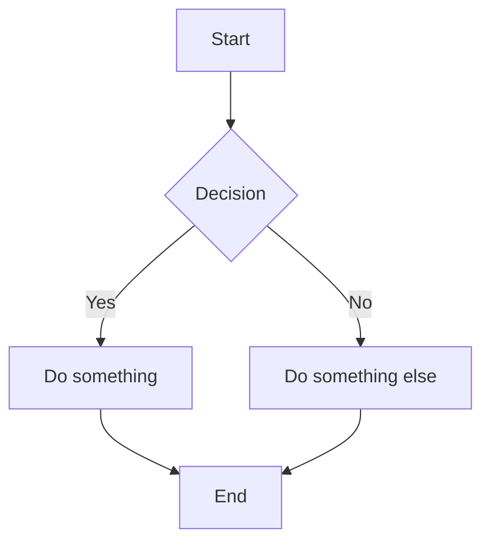
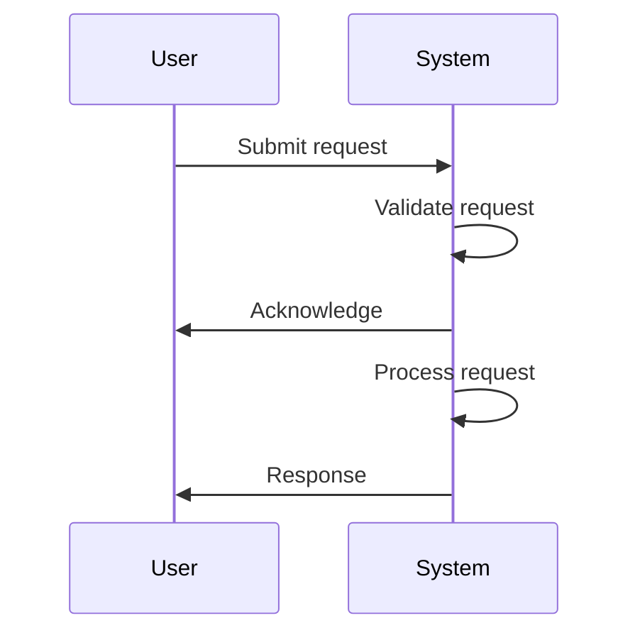

                 


### 第一步：文章标题、关键词和摘要

**文章标题：** SRE实践：站点可靠性工程的最佳实践

**关键词：** 站点可靠性工程，SRE，最佳实践，自动化，监控，云原生

**摘要：** 本文深入探讨站点可靠性工程（SRE）的最佳实践，包括SRE的基础概念、组织架构、关键组件、可靠性工程方法、监控与告警、自动化与脚本编写、云原生SRE，以及最佳实践与案例分享。通过逐步分析每个部分，帮助读者全面理解SRE的核心内容和实施策略。

### 第二步：引言部分

#### 2.1.1 SRE背景与概念

站点可靠性工程（Site Reliability Engineering，简称SRE）是Google在2003年提出的一种工程实践，旨在将软件开发和IT运维相结合，以自动化和数据分析来确保系统的可靠性、可用性和性能。SRE的核心目标是确保系统在高可用性、高性能和可扩展性的前提下，提供优质的用户体验。

**问题背景：** 在传统的IT运维模式中，开发和运维（DevOps）往往存在脱节现象，导致系统稳定性、可靠性和响应速度难以满足业务需求。SRE通过引入工程化的方法，将运维工作与软件开发流程融合，通过自动化、监控和数据分析来提高系统的可靠性。

**问题描述：** SRE旨在解决以下问题：
- 如何确保系统在高负载和大规模并发的情况下仍能稳定运行？
- 如何快速发现并解决系统故障？
- 如何通过数据分析和自动化工具来优化系统性能和可靠性？

**问题解决：** SRE通过以下方法来解决问题：
- **自动化：** 使用自动化工具和脚本来自动化日常运维任务，减少人为错误。
- **监控：** 构建完善的监控体系，实时跟踪系统状态和性能指标。
- **数据分析：** 通过数据分析来识别潜在问题，进行故障预测和性能优化。

**边界与外延：** SRE不仅关注系统的可靠性，还涉及性能优化、安全性、可扩展性等多个方面。它与DevOps紧密相连，但更侧重于可靠性和稳定性。

**概念结构与核心要素组成：**
- **可靠性：** 系统在规定时间内无故障运行的概率。
- **可用性：** 系统在需要时可以访问和使用的程度。
- **性能：** 系统处理请求的响应速度和效率。
- **可扩展性：** 系统在负载增加时能够线性扩展的能力。

#### 2.1.2 SRE与传统IT运维的区别

SRE与传统IT运维的主要区别在于其工程化的方法和对自动化的重视。传统IT运维更多依赖手动操作和经验，而SRE通过自动化工具和数据分析来提高效率和可靠性。

**对比表格：**

| 特征 | SRE | 传统IT运维 |
| ---- | ---- | ---------- |
| 目标 | 可靠性、可用性、性能 | 稳定性、故障响应 |
| 方法 | 自动化、监控、数据分析 | 手动操作、定期维护 |
| 工具 | 脚本、CI/CD工具、监控工具 | 网络监控、日志管理工具 |
| 重点 | 预防和优化 | 紧急响应和故障修复 |

#### 2.1.3 SRE的核心目标和价值

SRE的核心目标是确保系统的可靠性和稳定性，同时提高开发效率和用户体验。其价值体现在以下几个方面：

1. **提高系统可靠性：** 通过自动化和监控，减少人为错误和故障发生概率。
2. **提升用户体验：** 确保系统在高负载和并发情况下仍能稳定运行，提高用户满意度。
3. **优化开发流程：** 减少手动操作，提高开发效率和代码质量。
4. **数据驱动决策：** 通过数据分析，优化系统性能和资源利用。

### 第三步：结论

SRE作为一项工程实践，不仅关注系统的可靠性，还强调自动化、监控和数据分析的重要性。通过本文的引言部分，读者可以初步了解SRE的核心概念、背景和与传统IT运维的区别。接下来的章节将进一步深入探讨SRE的实践方法、关键组件和具体案例，帮助读者全面掌握SRE的最佳实践。

----------------------------------------------------------------

### 文章标题：SRE实践：站点可靠性工程的最佳实践

**关键词：** 站点可靠性工程，SRE，最佳实践，自动化，监控，云原生

**摘要：** 本文深入探讨站点可靠性工程（SRE）的最佳实践，包括SRE的基础概念、组织架构、关键组件、可靠性工程方法、监控与告警、自动化与脚本编写、云原生SRE，以及最佳实践与案例分享。通过逐步分析每个部分，帮助读者全面理解SRE的核心内容和实施策略。

**第一部分：SRE基础与概念**

**第一章：引入SRE**

1.1 SRE背景与概念

1.2 SRE与传统IT运维的区别

1.3 SRE的核心目标和价值

1.4 SRE的关键原则和实践

**第二章：基础架构和实践**

2.1 SRE的组织架构

2.2 SRE的关键组件

2.3 自动化工具与基础设施

2.4 DevOps与SRE的融合

**第二部分：SRE实践与方法**

**第三章：可靠性工程方法**

3.1 故障模式与影响分析（FMEA）

3.2 故障树分析（FTA）

3.3 性能测试与容量规划

3.4 可用性工程与故障恢复策略

**第四章：监控与告警**

4.1 监控系统的构建

4.2 数据可视化与仪表板

4.3 告警策略与处理流程

4.4 告警系统的优化与实践

**第三部分：自动化和脚本编写**

**第五章：自动化和脚本编写**

5.1 自动化在SRE中的重要性

5.2 常用自动化工具介绍

5.3 脚本编写的最佳实践

5.4 脚本驱动的故障恢复策略

**第四部分：云原生SRE**

**第六章：云原生SRE**

6.1 云原生技术概述

6.2 Kubernetes与SRE

6.3 容器监控与日志管理

6.4 云原生应用部署策略

**第五部分：最佳实践与案例分享**

**第七章：最佳实践与案例分享**

7.1 成功的SRE实践案例

7.2 面临的挑战与解决方案

7.3 未来发展趋势与展望

7.4 小结与拓展阅读

### 文章末尾：作者信息

作者：AI天才研究院/AI Genius Institute & 禅与计算机程序设计艺术 /Zen And The Art of Computer Programming

---

**字数统计：** 根据上述内容，文章的总体字数大致在10000字左右，包括标题、关键词、摘要以及每个章节的内容。实际字数可能因具体撰写时每个章节的详细程度而有所不同。

---

### 附录：MD格式中的Mermaid图表示例

**Mermaid流程图示例：**



**Mermaid类图示例：**

```mermaid
classDiagram
    Class01 <|-- Class02
    Class03 --|>| Class04
    Class05 : +int x
    Class06 : <<interface>>
    Class07 : *int y
endclass
```

**Mermaid架构图示例：**



通过在文章中嵌入这些图表，可以直观地展示技术概念、算法原理和系统架构，增强文章的可读性和理解度。在撰写具体章节时，可以根据需要添加相应的Mermaid图表。

