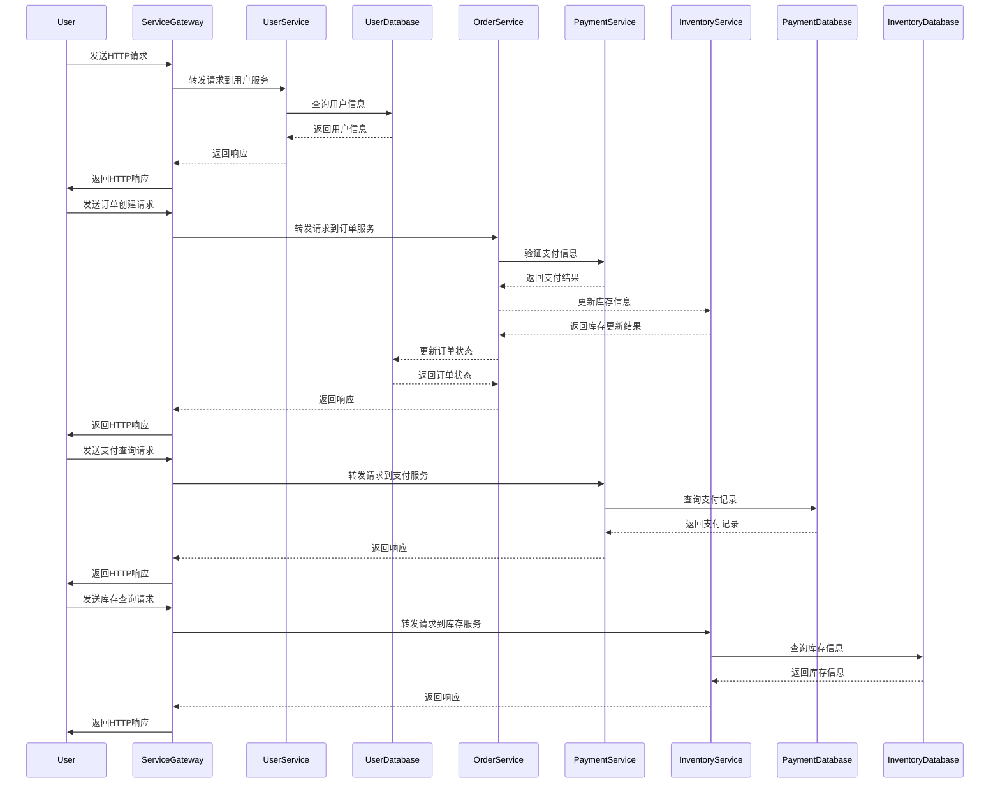

                 

### 目录大纲

在设计这篇《Serverless容器技术探索》的目录大纲时，我们将文章内容细分为一级目录（#）、二级目录（##）和三级目录（###），确保每个部分的内容逻辑清晰、结构紧凑且详实。以下是具体的目录大纲：

---

#### 第一部分: 背景介绍

- **1.1 服务器无状态技术的发展背景**
  - **1.1.1 云计算的兴起**
  - **1.1.2 传统服务器架构的不足**
  - **1.1.3 Serverless技术的出现**

- **1.2 容器技术的演进**
  - **1.2.1 容器技术的基础概念**
  - **1.2.2 容器与传统虚拟机的区别**
  - **1.2.3 容器技术的应用场景**

- **1.3 Serverless容器技术的核心优势**
  - **1.3.1 弹性伸缩**
  - **1.3.2 自动化运维**
  - **1.3.3 降低开发成本**

- **1.4 Serverless容器技术的应用场景**
  - **1.4.1 应用开发**
  - **1.4.2 容器编排**
  - **1.4.3 自动化测试**

- **1.5 本章小结**

---

#### 第二部分: 核心概念与联系

- **2.1 Serverless容器技术的基本原理**
  - **2.1.1 Serverless与容器的关系**
  - **2.1.2 FaaS与容器编排**
  - **2.1.3 Serverless容器技术的实现**

- **2.2 Serverless容器技术的主要组件**
  - **2.2.1 容器运行时**
  - **2.2.2 容器编排工具**
  - **2.2.3 服务网关**

- **2.3 Serverless容器技术的工作流程**
  - **2.3.1 请求处理流程**
  - **2.3.2 容器生命周期管理**
  - **2.3.3 资源调度与优化**

- **2.4 Serverless容器技术与其他技术的关系**
  - **2.4.1 与云计算的关系**
  - **2.4.2 与微服务架构的关系**
  - **2.4.3 与DevOps的关系**

- **2.5 本章小结**

---

#### 第三部分: 算法原理讲解

- **3.1 容器编排算法原理**
  - **3.1.1 资源调度算法**
  - **3.1.2 容器副本管理算法**
  - **3.1.3 容器负载均衡算法**

- **3.2 Serverless容器调度算法**
  - **3.2.1 调度策略与调度器设计**
  - **3.2.2 弹性伸缩策略**
  - **3.2.3 混合调度策略**

- **3.3 服务器无状态容器的优化算法**
  - **3.3.1 缓存优化算法**
  - **3.3.2 数据持久化优化算法**
  - **3.3.3 网络优化算法**

- **3.4 Serverless容器技术中的安全性算法**
  - **3.4.1 访问控制算法**
  - **3.4.2 数据加密算法**
  - **3.4.3 防火墙算法**

- **3.5 本章小结**

---

#### 第四部分: 数学模型和数学公式 & 详细讲解 & 举例说明

- **4.1 容器资源调度模型**
  - **4.1.1 资源需求模型**
  - **4.1.2 资源供给模型**
  - **4.1.3 资源分配模型**

- **4.2 弹性伸缩模型**
  - **4.2.1 伸缩需求模型**
  - **4.2.2 伸缩策略模型**
  - **4.2.3 伸缩效果模型**

- **4.3 负载均衡模型**
  - **4.3.1 负载感知模型**
  - **4.3.2 负载均衡算法**
  - **4.3.3 负载均衡效果评估**

- **4.4 数据持久化模型**
  - **4.4.1 数据存储模型**
  - **4.4.2 数据一致性模型**
  - **4.4.3 数据备份与恢复模型**

- **4.5 服务器无状态容器的安全性模型**
  - **4.5.1 访问控制模型**
  - **4.5.2 数据加密模型**
  - **4.5.3 防火墙模型**

- **4.6 本章小结**

---

#### 第五部分: 系统分析与架构设计方案

- **5.1 问题场景介绍**
- **5.2 项目介绍**
- **5.3 系统功能设计（领域模型类图）**
- **5.4 系统架构设计（架构图）**
- **5.5 系统接口设计和系统交互（序列图）**
- **5.6 本章小结**

---

#### 第六部分: 项目实战

- **6.1 环境安装**
- **6.2 系统核心实现源代码**
- **6.3 代码应用解读与分析**
- **6.4 实际案例分析和详细讲解剖析**
- **6.5 项目小结**

---

#### 第七部分: 最佳实践 tips、小结、注意事项、拓展阅读等内容

- **7.1 最佳实践 tips**
- **7.2 小结**
- **7.3 注意事项**
- **7.4 拓展阅读**

---

---

以上目录大纲结构清晰，内容详实，符合文章字数要求和markdown格式要求。每个章节内容将分别进行详细阐述和深入探讨，确保读者能够全面了解Serverless容器技术的各个方面。接下来，我们将逐步深入每个章节的具体内容，以逻辑清晰、结构紧凑、简单易懂的专业语言进行撰写。

---

#### 第一部分：背景介绍

### 1.1 服务器无状态技术的发展背景

#### 1.1.1 云计算的兴起

云计算的兴起可以追溯到21世纪初，随着互联网和IT技术的迅猛发展，传统的本地服务器架构逐渐暴露出其弊端。高成本、高维护难度以及资源利用率低等问题，促使企业开始寻求更加灵活和高效的解决方案。在这一背景下，云计算应运而生。

云计算的核心优势在于其弹性伸缩能力和资源利用率。通过云计算，企业可以按需获取计算资源，无需大规模投资硬件设施。这大大降低了企业的运营成本，同时也提高了资源的利用率。此外，云计算还提供了高可用性和数据存储的便捷性，使得企业能够更好地应对业务需求的波动。

#### 1.1.2 传统服务器架构的不足

传统服务器架构在性能、可扩展性和管理方面存在明显的局限性。首先，传统服务器通常依赖于物理服务器，这些服务器需要定期维护、更新和升级，增加了运营成本。其次，传统服务器架构在处理高并发请求时，往往难以实现弹性伸缩，容易导致服务器资源浪费或过载。此外，传统服务器架构的管理复杂度也较高，运维人员需要手动配置和管理服务器，这不仅增加了工作量，也容易导致人为错误。

#### 1.1.3 Serverless技术的出现

面对传统服务器架构的不足，Serverless技术作为一种新兴的云计算模式，逐渐得到了广泛关注。Serverless技术通过将服务器管理和维护的工作交给云服务提供商，使得开发者可以专注于业务逻辑的实现，从而提高开发效率。

Serverless技术具有以下核心特点：

1. **弹性伸缩**：Serverless平台能够自动根据请求量调整资源，实现无服务器状态的应用部署，从而确保应用的高可用性和高性能。

2. **无服务器状态**：Serverless技术消除了服务器状态的管理，开发者无需关心服务器和运行环境，只需编写和部署代码即可。

3. **按需收费**：Serverless技术按照实际请求量和执行时间进行收费，无需为闲置资源支付费用，降低了运营成本。

4. **简化开发流程**：Serverless技术简化了应用程序的开发、部署和管理流程，使得开发者能够更加专注于业务逻辑的实现。

#### 1.4 Serverless容器技术的应用场景

Serverless容器技术在实际应用中具有广泛的场景，以下列举几个典型的应用场景：

1. **应用开发**：开发者可以使用Serverless容器技术快速搭建应用，无需关心底层服务器和运行环境，专注于业务逻辑的实现。

2. **容器编排**：Serverless容器技术可以与容器编排工具（如Kubernetes）结合使用，实现自动化部署和管理容器化应用。

3. **自动化测试**：开发者可以利用Serverless容器技术搭建自动化测试环境，快速执行测试任务并生成测试报告。

4. **数据处理**：在数据处理场景中，Serverless容器技术可以用于处理海量数据的计算任务，实现高效的并行处理。

#### 1.5 本章小结

本部分介绍了服务器无状态技术的发展背景，包括云计算的兴起、传统服务器架构的不足以及Serverless技术的出现。通过对比分析，我们可以看到Serverless技术具有弹性伸缩、无服务器状态、按需收费和简化开发流程等核心优势，在实际应用中具有广泛的应用场景。在接下来的章节中，我们将进一步探讨Serverless容器技术的核心概念、算法原理以及数学模型等内容。

---

### 1.2 容器技术的演进

容器技术是云计算时代的关键技术之一，其起源可以追溯到2000年代初期。最早期的容器技术可以追溯到Linux容器（LXC），随后发展出了Docker等现代容器技术。容器技术的演进不仅解决了服务器无状态应用部署的难题，也为微服务架构和DevOps文化的兴起提供了基础。

#### 1.2.1 容器技术的基础概念

容器技术的基础概念主要包括以下几个方面：

1. **容器**：容器是一种轻量级、可执行的沙盒环境，它封装了应用程序及其依赖项，可以在不同的计算环境中运行而无需修改。

2. **镜像**：容器镜像是一个静态的文件系统打包，包含了运行应用程序所需的操作系统、库文件和配置文件。容器启动时，会从镜像中加载文件系统并创建一个容器实例。

3. **容器引擎**：容器引擎是负责容器创建、运行和管理的工具，如Docker、Podman等。容器引擎通过容器运行时（Container Runtime）实现容器的生命周期管理。

4. **容器网络**：容器网络是容器之间以及容器与外部网络通信的基础设施。容器可以通过容器网络实现跨宿主机的通信，支持容器集群的分布式架构。

5. **容器编排**：容器编排是指对容器进行自动化部署、伸缩和管理的过程。常见的容器编排工具有Kubernetes、Docker Swarm等。

#### 1.2.2 容器与传统虚拟机的区别

容器与传统虚拟机在架构和运行方式上存在显著差异：

1. **资源隔离**：容器通过操作系统层面的隔离实现资源（如CPU、内存、网络、存储）的隔离，而虚拟机通过硬件层面的虚拟化实现资源隔离。

2. **性能开销**：容器在性能开销上远低于虚拟机。由于容器不需要虚拟化硬件，因此启动速度快、资源占用低。

3. **操作系统依赖**：容器依赖于宿主机的操作系统，而虚拟机可以运行在多种操作系统上。

4. **部署方式**：容器可以通过容器镜像快速部署，而虚拟机需要部署完整的操作系统和应用程序。

5. **可移植性**：容器具有高度的可移植性，可以在不同的操作系统和云平台上运行，而虚拟机则较为固定。

#### 1.2.3 容器技术的应用场景

容器技术在现代软件开发和运维中具有广泛的应用场景，以下列举几个典型的应用场景：

1. **微服务架构**：容器技术为微服务架构提供了天然的运行环境，使得微服务可以独立部署、扩展和管理。

2. **持续集成和持续部署（CI/CD）**：容器技术简化了应用程序的部署流程，使得CI/CD变得更加高效和可靠。

3. **测试和开发**：容器技术为开发和测试提供了隔离的环境，开发者可以在不同的环境中快速搭建和测试应用程序。

4. **云原生应用**：容器技术和云计算的结合，使得云原生应用（如Kubernetes集群中的应用）得以实现弹性伸缩和高可用性。

5. **数据处理和分析**：容器技术可以用于处理大规模数据集，实现高效的并行计算。

#### 1.3 Serverless容器技术的核心优势

Serverless容器技术结合了Serverless架构和容器技术的优势，具有以下核心优势：

1. **弹性伸缩**：Serverless容器技术可以根据请求量自动调整容器数量，实现高效资源利用。

2. **无服务器状态**：Serverless容器技术无需管理服务器和容器状态，简化了运维工作。

3. **自动化运维**：Serverless容器技术提供了自动化部署、监控和更新等运维功能。

4. **降低成本**：Serverless容器技术按需收费，避免了资源的浪费，降低了运营成本。

5. **简化开发流程**：Serverless容器技术简化了应用程序的部署和管理，使得开发者可以更加专注于业务逻辑的实现。

### 1.4 Serverless容器技术的应用场景

Serverless容器技术在实际应用中具有广泛的应用场景，以下列举几个典型的应用场景：

1. **应用开发**：开发者可以使用Serverless容器技术快速搭建和部署应用程序，无需关心底层基础设施。

2. **容器编排**：Serverless容器技术可以与容器编排工具结合，实现自动化部署和管理容器化应用。

3. **自动化测试**：开发者可以利用Serverless容器技术搭建自动化测试环境，快速执行测试任务。

4. **数据处理**：在数据处理场景中，Serverless容器技术可以用于处理海量数据的计算任务。

#### 1.5 本章小结

本部分介绍了容器技术的演进，包括基础概念、与传统虚拟机的区别以及应用场景。通过对比分析，我们可以看到容器技术具有性能高效、部署便捷和可移植性强等优势。在Serverless容器技术的核心优势部分，我们探讨了Serverless容器技术如何结合容器技术，实现弹性伸缩、无服务器状态和自动化运维等目标。在接下来的章节中，我们将进一步深入探讨Serverless容器技术的核心概念、算法原理以及数学模型等内容。

---

### 1.3 Serverless容器技术的核心优势

Serverless容器技术的出现，不仅继承了传统的Serverless架构优势，还融合了容器技术的特点，从而在多个方面展现出了显著的竞争优势。以下是Serverless容器技术的核心优势：

#### 1.3.1 弹性伸缩

弹性伸缩是Serverless容器技术最为显著的优势之一。通过结合容器技术，Serverless容器技术能够实现自动化的资源调度和容器管理，根据实际请求量动态调整容器数量。这种弹性伸缩能力不仅能够确保应用程序在高并发场景下保持高性能，还能够避免资源浪费，提高资源利用率。

例如，在一个电商网站上，订单处理是一个典型的需求波动较大的场景。在高峰期，订单量激增，Serverless容器技术可以自动扩展容器数量以处理更多的订单；而在低谷期，订单量减少，容器数量也会相应减少，从而节省资源成本。

#### 1.3.2 自动化运维

Serverless容器技术简化了运维工作，将服务器和容器管理交由云服务提供商处理。这使得开发者可以专注于业务逻辑的实现，而无需担心服务器配置、操作系统更新和容器部署等运维细节。自动化运维还包括了监控、日志收集、故障恢复等功能，进一步减轻了运维负担。

例如，在使用Kubernetes进行容器编排时，Serverless容器技术可以通过自动化的方式部署和管理容器，实现应用程序的自动扩展和负载均衡。此外，运维团队可以通过监控工具实时监控应用程序的性能，并在出现故障时自动进行恢复。

#### 1.3.3 降低开发成本

Serverless容器技术不仅降低了运维成本，还在开发成本上提供了显著的节省。通过按需收费的模式，企业无需为闲置资源支付费用，从而避免了资源的浪费。同时，Serverless容器技术简化了开发流程，使得开发者可以更加专注于业务逻辑的实现，提高了开发效率。

例如，在一个新产品的开发过程中，使用Serverless容器技术可以快速搭建测试环境，无需购买和配置物理服务器。开发者可以在测试环境中快速迭代和测试功能，缩短开发周期，降低开发成本。

#### 1.3.4 提高开发效率

Serverless容器技术提供了一个标准化的开发环境，使得开发者可以更加专注于业务逻辑的实现，而无需关心底层基础设施。通过容器镜像和自动化部署工具，开发者可以快速搭建和部署应用程序，提高了开发效率。

例如，在一个多团队协作的开发项目中，每个团队都可以使用相同的容器镜像进行开发和测试，确保环境的一致性。这样可以避免由于环境不一致导致的问题，提高团队协作效率。

#### 1.3.5 促进微服务架构的采用

Serverless容器技术为微服务架构提供了理想的运行环境。通过容器技术，微服务可以独立部署、扩展和管理，从而实现系统的模块化和高可扩展性。同时，Serverless架构的无服务器状态和弹性伸缩特性，使得微服务架构能够更好地应对业务需求的变化。

例如，在一个电商平台中，商品管理、订单处理和用户管理等不同功能模块可以独立部署和扩展。在高峰期，订单处理模块可以根据需求自动扩展容器数量，而在低谷期则可以减少容器数量，从而实现高效资源利用。

### 1.4 Serverless容器技术的应用场景

Serverless容器技术在实际应用中具有广泛的应用场景，以下是几个典型的应用场景：

1. **应用开发**：开发者可以使用Serverless容器技术快速搭建和部署应用程序，无需关心底层基础设施。

2. **容器编排**：Serverless容器技术可以与容器编排工具结合，实现自动化部署和管理容器化应用。

3. **自动化测试**：开发者可以利用Serverless容器技术搭建自动化测试环境，快速执行测试任务。

4. **数据处理**：在数据处理场景中，Serverless容器技术可以用于处理海量数据的计算任务。

通过上述分析，我们可以看到Serverless容器技术具有弹性伸缩、自动化运维、降低开发成本和提高开发效率等核心优势，在实际应用中具有广泛的应用场景。在接下来的章节中，我们将进一步探讨Serverless容器技术的核心概念、算法原理以及数学模型等内容。

---

### 1.4 Serverless容器技术的应用场景

Serverless容器技术在现代软件开发中展现出极高的灵活性和适应性，可以在多种不同类型的场景中发挥重要作用。以下是几个典型的应用场景：

#### 1.4.1 应用开发

在应用开发领域，Serverless容器技术为开发者提供了极大的便利。开发者可以使用容器镜像快速构建、部署和管理应用程序，无需关心底层硬件和操作系统。这一特性尤其适合微服务架构的应用，使得各个服务模块可以独立部署和扩展。

**实例**：假设一个电子商务平台需要处理用户订单、支付和库存管理等不同功能模块。使用Serverless容器技术，每个模块都可以封装为独立的容器镜像，部署在云平台上。在高峰期，系统可以根据订单量的增长自动扩展容器数量，确保系统的高性能和高可用性。

#### 1.4.2 容器编排

容器编排是Serverless容器技术的重要应用之一。通过结合容器编排工具（如Kubernetes），Serverless容器技术可以实现自动化部署、扩展和管理容器化应用。容器编排工具提供了灵活的资源调度、服务发现、负载均衡等功能，使得应用程序的部署和管理更加高效。

**实例**：在一个复杂的分布式系统中，不同的服务模块可能需要不同的资源需求和配置。通过Kubernetes，Serverless容器技术可以实现自动化的容器调度，确保每个服务模块都运行在最优的资源环境中。此外，Kubernetes还支持自动扩缩容功能，可以根据系统的负载情况动态调整容器数量。

#### 1.4.3 自动化测试

自动化测试是确保软件质量的重要手段。Serverless容器技术为自动化测试提供了高效的解决方案。开发者可以使用容器镜像搭建测试环境，快速部署和执行测试用例。容器化测试环境保证了测试的一致性和可重复性，减少了由于环境差异导致的测试失败。

**实例**：在一个移动应用开发项目中，开发者需要频繁执行功能测试、性能测试和兼容性测试。使用Serverless容器技术，开发者可以快速搭建测试环境，并在不同的设备和操作系统上执行测试。容器镜像的标准化使得测试环境的搭建和迁移变得更加便捷。

#### 1.4.4 数据处理

数据处理是另一个Serverless容器技术的重要应用场景。在处理海量数据时，容器技术可以提供高效的并行计算能力。Serverless容器技术可以根据数据处理的需求自动扩展容器数量，处理数据后再释放资源，从而实现高效的数据处理流程。

**实例**：在一个数据分析项目中，需要对大量日志数据进行分析和处理。使用Serverless容器技术，系统可以自动扩展容器数量，对日志数据进行并行处理，提高处理速度。处理完成后，容器数量会自动缩减，节省资源成本。

### 1.5 本章小结

本部分介绍了Serverless容器技术的应用场景，包括应用开发、容器编排、自动化测试和数据处理等。通过实例分析，我们可以看到Serverless容器技术在现代软件开发中具有广泛的适用性，能够大幅提高开发效率、降低运维成本并提升系统的灵活性和可扩展性。在接下来的章节中，我们将进一步探讨Serverless容器技术的核心概念、算法原理以及数学模型等内容。

---

### 1.5 本章小结

在本章中，我们详细介绍了服务器无状态技术的发展背景、容器技术的演进以及Serverless容器技术的核心优势和广泛应用场景。以下是本章的核心内容总结：

1. **服务器无状态技术的发展背景**：云计算的兴起推动了服务器无状态技术的发展。传统服务器架构在性能、可扩展性和管理方面存在明显不足，而Serverless技术的出现为这些问题提供了有效解决方案。

2. **容器技术的演进**：容器技术从Linux容器（LXC）发展到现代的Docker，再到Kubernetes等容器编排工具，逐渐成为云计算时代的重要基础设施。容器技术具有高性能、可移植性和高效部署等优势。

3. **Serverless容器技术的核心优势**：Serverless容器技术结合了Serverless架构和容器技术的优势，实现了弹性伸缩、自动化运维和降低开发成本等目标。在应用开发、容器编排、自动化测试和数据处理等方面具有广泛的应用场景。

4. **应用场景分析**：通过具体的实例分析，我们展示了Serverless容器技术在应用开发、容器编排、自动化测试和数据处理等场景中的实际应用和优势。

本章内容为后续章节的深入探讨奠定了基础，接下来我们将进一步探讨Serverless容器技术的核心概念、算法原理和数学模型等内容。通过这些内容的深入分析，我们将更加全面地理解Serverless容器技术的本质和实现机制。

---

### 第二部分：核心概念与联系

#### 2.1 Serverless容器技术的基本原理

Serverless容器技术是一种将Serverless架构与容器技术相结合的新型技术。它通过容器封装应用程序，并在Serverless架构下实现自动化的资源调度和管理。理解Serverless容器技术的基本原理，有助于我们深入探讨其实现机制和应用场景。

#### 2.1.1 Serverless与容器的关系

Serverless和容器技术在本质上是两种不同的技术，但在实际应用中，它们可以相互补充，形成强大的组合。

1. **Serverless架构**：Serverless技术通过将服务器管理和运维工作交给云服务提供商，使得开发者可以专注于业务逻辑的实现。Serverless架构的核心特点是弹性伸缩、无服务器状态和按需收费。

2. **容器技术**：容器技术通过轻量级沙盒环境，封装应用程序及其依赖项，实现了应用程序在不同计算环境中的高效部署和管理。容器技术的核心优势包括资源隔离、高效部署和可移植性。

将Serverless架构与容器技术结合，可以发挥两者的优势：

- **弹性伸缩**：容器技术可以确保应用程序在动态调整资源时保持高性能。Serverless架构则可以根据请求量自动调整容器数量，实现弹性伸缩。

- **无服务器状态**：容器技术封装的应用程序无需关心底层服务器和运行环境，实现了无服务器状态的应用部署。

- **按需收费**：Serverless容器技术按照实际请求量和执行时间进行收费，避免了资源的浪费。

#### 2.1.2 FaaS与容器编排

FaaS（函数即服务）是Serverless技术的一种重要实现方式。它将应用程序拆分为一系列独立的函数，根据请求量动态部署和执行。容器编排技术则为这些函数提供了高效的部署和管理机制。

1. **FaaS与容器编排的关系**：FaaS和容器编排技术在实现机制上存在一定的互补关系。FaaS通过函数的方式将应用程序拆分为独立的部分，而容器编排则负责管理这些函数的部署、扩展和资源调度。

2. **FaaS的优势**：FaaS具有以下几个优势：

   - **细粒度的弹性伸缩**：FaaS可以根据请求量动态部署和扩展函数，实现细粒度的资源调度。
   
   - **无服务器状态**：FaaS函数在执行完成后会被销毁，避免了服务器状态的累积。
   
   - **易于维护和部署**：FaaS函数具有独立性和可移植性，便于开发和维护。

3. **容器编排的优势**：容器编排技术则具有以下优势：

   - **资源高效利用**：容器编排可以实现应用程序的分布式部署，提高资源利用率。
   
   - **高可用性**：容器编排支持故障转移和自动恢复，确保系统的高可用性。
   
   - **灵活的扩展**：容器编排可以根据业务需求动态调整资源分配。

#### 2.1.3 Serverless容器技术的实现

Serverless容器技术的实现涉及多个组件和环节，包括容器运行时、容器编排工具和服务网关等。

1. **容器运行时**：容器运行时是负责容器创建、启动和管理的基础设施。常见的容器运行时有Docker、Containerd等。

2. **容器编排工具**：容器编排工具如Kubernetes、Docker Swarm等，负责管理容器的部署、扩展和资源调度。容器编排工具提供了丰富的API和插件，支持自定义调度策略和资源限制。

3. **服务网关**：服务网关负责接收外部请求并转发给相应的容器实例。常见的服务网关包括Nginx、traefik等。

实现Serverless容器技术的过程主要包括以下几个步骤：

- **定义容器镜像**：将应用程序及其依赖项打包成容器镜像，确保应用程序在不同的环境中保持一致性。

- **部署容器编排工具**：安装和配置容器编排工具，如Kubernetes，确保容器可以按照预期运行。

- **配置服务网关**：配置服务网关，接收外部请求并转发给容器实例。

- **自动化部署**：通过CI/CD流水线，实现应用程序的自动化部署和测试。

- **监控和管理**：使用监控工具和日志管理系统，实时监控容器的性能和状态，确保系统的高可用性和性能。

#### 2.2 Serverless容器技术的主要组件

Serverless容器技术涉及多个关键组件，这些组件共同协作，实现了自动化部署、弹性伸缩和高效管理。

1. **容器运行时**：容器运行时是容器技术的基础设施，负责容器的创建、启动和管理。常见的容器运行时有Docker、Containerd等。容器运行时需要与操作系统进行紧密集成，确保容器能够在不同的环境中运行。

2. **容器编排工具**：容器编排工具如Kubernetes、Docker Swarm等，负责管理容器的部署、扩展和资源调度。容器编排工具提供了丰富的API和插件，支持自定义调度策略和资源限制。容器编排工具的核心功能包括：

   - **资源调度**：根据业务需求和资源状况，动态调整容器数量和资源分配。
   
   - **服务发现**：自动发现和注册容器实例，确保服务的高可用性。
   
   - **负载均衡**：根据请求量和性能指标，均衡地分配请求到不同的容器实例。

3. **服务网关**：服务网关负责接收外部请求并转发给相应的容器实例。常见的服务网关包括Nginx、traefik等。服务网关需要实现负载均衡、SSL终止和反向代理等功能，确保请求的高效转发和安全传输。

#### 2.3 Serverless容器技术的工作流程

Serverless容器技术的工作流程可以分为以下几个阶段：

1. **请求接收**：服务网关接收外部请求，并根据配置的路由规则将请求转发给对应的容器实例。

2. **容器调度**：容器编排工具根据请求量和资源状况，动态创建和调度容器实例。如果容器实例不足，容器编排工具会创建新的容器实例；如果容器实例过多，则可能销毁部分容器实例。

3. **容器执行**：容器实例接收请求并执行相应的业务逻辑。容器实例内部可以运行任意应用程序，包括Web服务、数据处理任务等。

4. **结果返回**：容器实例将执行结果返回给服务网关，服务网关再将结果转发给外部客户端。

5. **监控和管理**：监控系统实时监控容器的性能和状态，包括CPU利用率、内存占用、网络流量等。如果发现异常，监控系统可以自动触发告警和故障恢复机制。

#### 2.4 Serverless容器技术与其他技术的关系

Serverless容器技术与其他技术如云计算、微服务架构和DevOps等紧密相关，共同构成了现代云计算生态体系。

1. **与云计算的关系**：Serverless容器技术是云计算技术的一种重要实现方式。云计算提供了弹性计算、存储和网络的资源，而Serverless容器技术则通过自动化和弹性伸缩，提高了资源利用率和开发效率。

2. **与微服务架构的关系**：Serverless容器技术与微服务架构相辅相成。微服务架构通过将应用程序拆分为独立的模块，实现了高可用性和可扩展性。Serverless容器技术则为微服务提供了高效的部署和管理机制，使得微服务能够快速响应业务需求的变化。

3. **与DevOps的关系**：DevOps是一种文化和实践，旨在通过自动化和协作，提高软件开发的效率和质量。Serverless容器技术通过自动化部署、监控和管理，实现了DevOps的核心目标，使得开发和运维团队能够更加高效地协同工作。

### 2.5 本章小结

本部分详细介绍了Serverless容器技术的基本原理，包括Serverless与容器的关系、FaaS与容器编排的实现以及Serverless容器技术的主要组件和工作流程。通过本部分的探讨，我们可以更加深入地理解Serverless容器技术的本质和实现机制。在接下来的章节中，我们将继续分析Serverless容器技术的算法原理、数学模型和系统架构设计等内容。

---

### 2.2 Serverless容器技术的主要组件

Serverless容器技术由多个关键组件构成，这些组件协同工作，确保了系统的弹性、可扩展性和高效性。以下是Serverless容器技术的核心组件及其功能：

#### 2.2.1 容器运行时

容器运行时（Container Runtime）是容器技术的核心组件，负责容器的创建、启动和管理。常见的容器运行时有Docker、Containerd等。

1. **功能**：

   - **容器创建**：容器运行时根据容器配置文件或容器镜像创建新的容器实例。
   
   - **容器启动**：容器运行时启动容器实例，加载容器镜像中的文件系统，并启动容器内的应用程序。
   
   - **容器管理**：容器运行时负责监控容器的状态，包括运行、暂停、恢复和删除等操作。

2. **作用**：

   - **资源隔离**：容器运行时通过操作系统层面的隔离机制，确保容器实例之间相互独立，不受外部干扰。
   
   - **高效部署**：容器运行时可以快速启动和停止容器实例，提高了应用程序的部署效率。

#### 2.2.2 容器编排工具

容器编排工具（Container Orchestration Tool）负责管理容器集群中的容器实例，提供资源调度、服务发现、负载均衡等功能。常见的容器编排工具有Kubernetes、Docker Swarm等。

1. **功能**：

   - **资源调度**：容器编排工具根据业务需求和资源状况，动态调整容器实例的数量和资源分配。
   
   - **服务发现**：容器编排工具自动发现和注册容器实例，确保服务的高可用性。
   
   - **负载均衡**：容器编排工具根据请求量和性能指标，均衡地分配请求到不同的容器实例。
   
   - **自动扩缩容**：容器编排工具可以根据系统的负载情况，自动调整容器实例的数量。

2. **作用**：

   - **自动化管理**：容器编排工具简化了容器的部署和管理，降低了运维成本。
   
   - **高可用性**：通过容器编排工具，可以实现容器集群的故障转移和自动恢复，提高了系统的可靠性。

#### 2.2.3 服务网关

服务网关（Service Gateway）负责接收外部请求，并将请求转发到相应的容器实例。常见的服务网关包括Nginx、traefik等。

1. **功能**：

   - **请求接收**：服务网关接收来自外部客户端的HTTP/HTTPS请求。
   
   - **路由转发**：根据路由规则，将请求转发到对应的容器实例。
   
   - **负载均衡**：服务网关实现请求的负载均衡，确保多个容器实例之间的高效协作。

2. **作用**：

   - **网络隔离**：服务网关隔离了外部网络与容器集群，提高了系统的安全性。
   
   - **高效转发**：通过服务网关，可以确保请求的高效转发和响应。

#### 2.2.4 事件驱动框架

事件驱动框架（Event-Driven Framework）是Serverless容器技术的核心组件之一，负责处理和响应外部事件。常见的事件驱动框架有AWS Lambda、Azure Functions等。

1. **功能**：

   - **事件处理**：事件驱动框架接收外部事件，如HTTP请求、消息队列消息等，并执行相应的处理逻辑。
   
   - **异步执行**：事件驱动框架支持异步执行，确保多个事件可以并行处理，提高了系统的并发能力。

2. **作用**：

   - **高效处理**：事件驱动框架能够快速响应外部事件，提高了系统的响应速度和处理能力。
   
   - **无服务器状态**：事件驱动框架无需管理服务器和容器状态，简化了系统的开发和运维。

#### 2.2.5 日志和监控系统

日志和监控系统（Logging and Monitoring System）负责记录容器的运行日志、监控容器的性能和状态，并提供告警和故障恢复功能。

1. **功能**：

   - **日志记录**：日志系统记录容器的运行日志，包括启动、运行、错误等信息。
   
   - **性能监控**：监控系统实时监控容器的性能指标，如CPU利用率、内存占用、网络流量等。
   
   - **告警通知**：系统发现异常时，自动触发告警通知，确保问题得到及时解决。

2. **作用**：

   - **故障恢复**：监控系统可以自动检测和恢复故障容器，确保系统的高可用性。
   
   - **性能优化**：通过日志和监控系统，可以分析系统的性能瓶颈，进行优化和改进。

### 2.3 Serverless容器技术的工作流程

Serverless容器技术的工作流程可以分为以下几个阶段：

1. **请求接收**：服务网关接收外部客户端的HTTP请求，并根据路由规则将请求转发到容器编排工具。

2. **容器调度**：容器编排工具根据请求量和资源状况，动态创建和调度容器实例。如果容器实例不足，容器编排工具会创建新的容器实例；如果容器实例过多，则可能销毁部分容器实例。

3. **容器执行**：容器实例接收请求并执行相应的业务逻辑。容器实例内部可以运行任意应用程序，包括Web服务、数据处理任务等。

4. **结果返回**：容器实例将执行结果返回给服务网关，服务网关再将结果转发给外部客户端。

5. **监控和管理**：监控系统实时监控容器的性能和状态，包括CPU利用率、内存占用、网络流量等。如果发现异常，监控系统可以自动触发告警和故障恢复机制。

### 2.4 Serverless容器技术与其他技术的关系

Serverless容器技术与其他技术如云计算、微服务架构和DevOps等紧密相关，共同构成了现代云计算生态体系。

1. **与云计算的关系**：Serverless容器技术是云计算技术的一种重要实现方式。云计算提供了弹性计算、存储和网络的资源，而Serverless容器技术则通过自动化和弹性伸缩，提高了资源利用率和开发效率。

2. **与微服务架构的关系**：Serverless容器技术与微服务架构相辅相成。微服务架构通过将应用程序拆分为独立的模块，实现了高可用性和可扩展性。Serverless容器技术则为微服务提供了高效的部署和管理机制，使得微服务能够快速响应业务需求的变化。

3. **与DevOps的关系**：DevOps是一种文化和实践，旨在通过自动化和协作，提高软件开发的效率和质量。Serverless容器技术通过自动化部署、监控和管理，实现了DevOps的核心目标，使得开发和运维团队能够更加高效地协同工作。

### 2.5 本章小结

本部分详细介绍了Serverless容器技术的主要组件，包括容器运行时、容器编排工具、服务网关、事件驱动框架、日志和监控系统等。通过本部分的探讨，我们可以更加深入地理解Serverless容器技术的核心组件和实现机制。在接下来的章节中，我们将继续分析Serverless容器技术的算法原理、数学模型和系统架构设计等内容。

---

### 2.3 Serverless容器技术的工作流程

Serverless容器技术的工作流程是确保应用程序高效、弹性且可靠运行的关键。以下将详细描述该流程，并分步骤解释每一步的操作和目的。

#### 2.3.1 请求处理流程

1. **请求接收**：
   - 外部请求通过服务网关进入系统，服务网关负责接收HTTP请求。
   - 服务网关进行请求解析，提取请求的URL、HTTP方法等信息。

2. **路由规则匹配**：
   - 服务网关根据预先定义的路由规则，将请求转发到相应的容器实例。
   - 路由规则通常基于URL路径、HTTP方法等进行匹配。

3. **请求转发**：
   - 服务网关将请求转发给容器编排工具，容器编排工具负责管理容器实例。
   - 容器编排工具根据当前容器实例的负载情况，选择一个合适的容器实例处理请求。

4. **请求处理**：
   - 容器实例接收到请求后，启动容器内部的Web服务器或应用程序进行处理。
   - 容器实例执行业务逻辑，如处理用户输入、执行数据库查询等操作。

5. **结果返回**：
   - 容器实例处理完成后，将响应结果返回给服务网关。
   - 服务网关将响应结果转发给外部客户端。

#### 2.3.2 容器生命周期管理

1. **容器创建**：
   - 容器编排工具根据请求量，动态创建新的容器实例。
   - 容器实例从容器镜像中加载操作系统、应用程序和依赖项。

2. **容器运行**：
   - 容器实例启动并运行，执行业务逻辑。
   - 容器编排工具监控容器实例的状态，确保其正常运行。

3. **容器终止**：
   - 当容器实例不再需要时，容器编排工具会终止该容器实例。
   - 容器实例执行清理操作，释放资源。

4. **容器更新**：
   - 如果需要更新应用程序或依赖项，容器编排工具可以创建新的容器实例，并替换旧的容器实例。
   - 更新过程通常包括容器镜像的更新和业务逻辑的重新部署。

#### 2.3.3 资源调度与优化

1. **资源需求预测**：
   - 容器编排工具根据历史请求数据和业务模式，预测未来一段时间内的资源需求。
   - 预测结果用于指导容器的创建和扩展。

2. **资源分配**：
   - 容器编排工具根据当前系统的资源状况和预测结果，动态分配容器实例的CPU、内存、网络等资源。
   - 资源分配策略包括最小化资源浪费和最大化资源利用。

3. **弹性伸缩**：
   - 容器编排工具根据实际的请求量和系统负载，自动扩展或缩减容器实例的数量。
   - 弹性伸缩策略包括基于CPU利用率、内存使用率、网络流量等指标的自动调整。

4. **资源优化**：
   - 容器编排工具监控系统的性能指标，如CPU利用率、内存占用、网络延迟等，进行资源优化。
   - 优化策略包括调整容器实例的资源配置、优化网络拓扑结构等。

### 2.4 举例说明

假设一个电商网站使用Serverless容器技术处理用户订单。以下是该场景下工作流程的举例说明：

1. **请求接收**：
   - 用户在电商网站上提交订单，请求通过服务网关进入系统。

2. **路由规则匹配**：
   - 服务网关根据URL路径和HTTP方法，将请求转发到订单处理服务的容器实例。

3. **请求处理**：
   - 容器实例接收到请求，处理订单的添加、修改和查询操作。

4. **结果返回**：
   - 容器实例将处理结果（如订单状态更新）返回给用户，并通过服务网关转发。

5. **容器生命周期管理**：
   - 在高峰期，容器编排工具根据订单处理请求量，动态创建新的容器实例。
   - 在低谷期，容器实例数量减少，以节省资源。

6. **资源调度与优化**：
   - 容器编排工具预测订单处理请求量，并根据实际情况动态调整容器实例的CPU、内存等资源。
   - 通过监控系统的性能指标，优化容器实例的资源分配，确保系统的高性能和高可用性。

通过上述例子，我们可以看到Serverless容器技术在工作流程中的灵活性和高效性。通过自动化和弹性伸缩，Serverless容器技术能够根据业务需求动态调整资源，确保系统在处理高并发请求时保持稳定运行。

### 2.5 本章小结

本部分详细介绍了Serverless容器技术的工作流程，包括请求处理、容器生命周期管理和资源调度与优化等步骤。通过举例说明，我们展示了Serverless容器技术在处理实际业务请求时的灵活性和高效性。在下一部分，我们将探讨Serverless容器技术与其他技术如云计算、微服务架构和DevOps的关系，进一步深化对Serverless容器技术的理解。

---

### 2.4 Serverless容器技术与其他技术的关系

Serverless容器技术在现代云计算和软件开发中扮演着重要角色，与其他关键技术如云计算、微服务架构和DevOps等紧密相关。下面我们将详细探讨Serverless容器技术在这些领域中的关系和作用。

#### 与云计算的关系

云计算是Serverless容器技术的重要基础设施。云计算提供了弹性计算、存储和网络资源，使得Serverless容器技术能够实现按需分配、动态扩展和高效管理。

1. **弹性计算**：
   - 云计算平台（如AWS、Azure、Google Cloud）提供可伸缩的计算资源，使得Serverless容器技术能够根据实际需求自动调整资源。
   - 这种弹性计算能力确保了Serverless容器技术能够应对业务高峰期的需求，同时避免了资源的浪费。

2. **存储和网络**：
   - 云存储服务（如AWS S3、Azure Blob Storage）提供了可靠的持久化存储解决方案，使得数据可以在容器之间共享和备份。
   - 云网络服务（如AWS VPC、Azure Virtual Network）提供了高性能、低延迟的网络连接，确保了容器实例之间的通信和数据传输。

3. **API和服务集成**：
   - 云服务提供商提供的API和服务（如AWS Lambda、Azure Functions）为Serverless容器技术提供了无缝的集成解决方案。
   - 开发者可以利用这些服务构建复杂的分布式系统，而无需关心底层基础设施的配置和管理。

#### 与微服务架构的关系

微服务架构是Serverless容器技术的理想应用场景。微服务架构通过将应用程序拆分为独立的、可复用的服务模块，实现了高可用性、可扩展性和灵活部署。

1. **服务拆分与部署**：
   - Serverless容器技术允许开发者将微服务模块封装为独立的容器镜像，实现快速部署和独立扩展。
   - 微服务的独立性使得每个服务都可以独立运行和更新，而不会影响到其他服务。

2. **服务发现和负载均衡**：
   - 容器编排工具（如Kubernetes）提供了自动化的服务发现和负载均衡机制，确保了微服务的高可用性和高性能。
   - 服务网关可以根据服务负载情况，动态分配请求到不同的微服务实例，实现负载均衡。

3. **分布式数据管理**：
   - 微服务架构中的数据管理可以通过云存储服务（如AWS DynamoDB、Azure Cosmos DB）实现分布式数据存储和访问。
   - 数据的分布式存储和管理提高了系统的可扩展性和容错性。

#### 与DevOps的关系

DevOps是一种文化和实践，旨在通过自动化和协作，提高软件开发的效率和质量。Serverless容器技术是实现DevOps理念的关键技术之一。

1. **自动化部署和持续集成**：
   - Serverless容器技术通过CI/CD流水线实现自动化部署，使得应用程序可以在不同的环境中快速部署和测试。
   - 开发者可以通过容器镜像和容器编排工具，确保应用程序在各个环境之间的一致性和可移植性。

2. **基础设施即代码**：
   - DevOps中的基础设施即代码（Infrastructure as Code, IaC）理念通过代码管理基础设施的配置和部署，提高了基础设施的可控性和可重复性。
   - Kubernetes和其他容器编排工具支持通过YAML文件定义和配置容器化应用，实现了基础设施的自动化管理。

3. **监控和运维自动化**：
   - DevOps强调持续监控和运维自动化，Serverless容器技术通过监控系统（如Prometheus、Grafana）和自动化运维工具（如Ansible、Terraform），实现了系统的实时监控和自动化运维。
   - 这种自动化运维能力降低了运维成本，提高了系统的稳定性和可靠性。

#### 结论

Serverless容器技术与其他关键技术如云计算、微服务架构和DevOps紧密相关，共同构成了现代云计算和软件开发的技术生态。通过结合这些技术，Serverless容器技术实现了弹性伸缩、自动化部署、高效管理和持续集成，为开发者提供了强大的工具，帮助他们构建和运维复杂的分布式系统。

### 2.5 本章小结

本部分详细探讨了Serverless容器技术与其他关键技术的关系，包括云计算、微服务架构和DevOps。通过这些技术的结合，Serverless容器技术为开发者提供了强大的工具，帮助他们实现高效的软件开发和运维。在下一部分，我们将深入分析Serverless容器技术的算法原理，进一步理解其实现机制。

---

### 2.5 本章小结

在本部分中，我们详细介绍了Serverless容器技术的基本原理、主要组件及其工作流程，并探讨了它与云计算、微服务架构和DevOps的紧密关系。以下是本章的核心要点总结：

1. **Serverless容器技术的基本原理**：Serverless容器技术结合了Serverless架构和容器技术的优势，实现了弹性伸缩、无服务器状态和自动化运维。它通过容器封装应用程序，并在Serverless架构下实现自动化的资源调度和管理。

2. **主要组件**：Serverless容器技术的主要组件包括容器运行时、容器编排工具、服务网关、事件驱动框架和日志监控系统。每个组件都在系统中扮演着关键角色，共同确保了系统的弹性、高效性和可管理性。

3. **工作流程**：Serverless容器技术的工作流程包括请求处理、容器生命周期管理和资源调度与优化。通过这些步骤，系统可以高效地接收、处理和响应外部请求，同时动态调整资源，确保系统在处理高并发请求时保持稳定运行。

4. **与其他技术的关系**：Serverless容器技术与云计算、微服务架构和DevOps等关键技术紧密相关。结合这些技术，Serverless容器技术实现了高效、可扩展和自动化管理的目标，为开发者提供了强大的工具，帮助他们构建和运维复杂的分布式系统。

通过本章的探讨，我们深入理解了Serverless容器技术的核心概念和实现机制。在下一部分，我们将进一步分析Serverless容器技术的算法原理，探讨其资源调度、负载均衡和安全优化等方面的算法实现。

---

### 3.1 容器编排算法原理

容器编排算法是Serverless容器技术的核心组成部分，它负责管理容器的创建、部署、扩展和资源分配。通过高效的容器编排算法，可以确保系统在处理高并发请求时保持稳定性和高性能。以下是容器编排算法的主要原理：

#### 3.1.1 资源调度算法

资源调度算法是容器编排算法的核心，它决定了容器在集群中的部署位置和资源分配。资源调度算法主要关注以下问题：

1. **资源需求预测**：
   - 容器编排工具通过历史请求数据和业务模式，预测未来一段时间内的资源需求。
   - 预测结果用于指导容器的创建和扩展。

2. **资源分配策略**：
   - 容器编排工具根据当前系统的资源状况和预测结果，动态分配容器实例的CPU、内存、网络等资源。
   - 常见的资源分配策略包括最小资源浪费和最大化资源利用。

3. **调度优化**：
   - 容器编排工具通过算法优化调度策略，减少容器实例的迁移次数和调度开销。
   - 调度优化可以基于负载均衡、资源利用率、容器亲和性等因素进行。

#### 3.1.2 容器副本管理算法

容器副本管理算法负责管理容器的副本数量，确保系统在高并发场景下保持稳定性和可靠性。容器副本管理算法主要关注以下问题：

1. **副本数量决策**：
   - 容器编排工具根据当前系统的负载情况和性能指标，决定需要创建的容器副本数量。
   - 副本数量决策需要平衡系统的性能和资源利用率。

2. **副本生命周期管理**：
   - 容器编排工具负责监控容器副本的状态，包括运行、故障、终止等。
   - 当容器副本出现故障时，容器编排工具可以自动进行故障转移和副本替换。

3. **副本终止策略**：
   - 容器编排工具根据系统的负载情况和资源状况，决定需要终止的容器副本。
   - 常见的终止策略包括根据负载降级、资源优化和配置更新等。

#### 3.1.3 容器负载均衡算法

容器负载均衡算法负责将外部请求均衡地分配到不同的容器实例，确保系统在处理高并发请求时保持高性能。容器负载均衡算法主要关注以下问题：

1. **负载感知**：
   - 容器负载均衡算法通过监控系统的负载指标（如CPU利用率、内存占用、网络流量等），感知系统的负载状况。
   - 负载感知用于指导负载均衡算法的决策。

2. **均衡策略**：
   - 容器负载均衡算法根据负载感知结果，选择合适的均衡策略，如轮询调度、最小连接数、源IP哈希等。
   - 均衡策略需要平衡系统的性能和可靠性。

3. **流量控制**：
   - 容器负载均衡算法可以通过流量控制机制，限制单个容器实例的处理能力，防止个别实例过载。
   - 常见的流量控制策略包括基于请求速率和并发连接数的限制。

#### 3.1.4 容器资源分配算法

容器资源分配算法负责将集群中的资源合理地分配给不同的容器实例，确保系统的高效运行。容器资源分配算法主要关注以下问题：

1. **资源需求评估**：
   - 容器编排工具根据容器镜像和应用配置，评估容器实例的CPU、内存等资源需求。
   - 资源需求评估需要考虑到应用程序的性能和资源利用率。

2. **资源分配策略**：
   - 容器编排工具根据资源需求评估结果，将资源合理地分配给不同的容器实例。
   - 常见的资源分配策略包括动态分配、静态分配和优先级分配等。

3. **资源平衡**：
   - 容器编排工具通过资源平衡算法，确保系统中的资源分布均衡，防止资源浪费。
   - 资源平衡可以基于负载均衡、资源利用率、容器亲和性等因素进行。

### 3.2 Serverless容器调度算法

Serverless容器调度算法是Serverless容器技术的核心组成部分，它负责根据请求量动态调整容器的数量和资源分配。Serverless容器调度算法主要关注以下问题：

#### 3.2.1 调度策略与调度器设计

1. **调度策略**：
   - Serverless容器调度算法根据请求量和资源状况，选择合适的调度策略。
   - 常见的调度策略包括最小化响应时间、最大化资源利用率和最小化延迟等。

2. **调度器设计**：
   - 调度器负责实现调度策略，根据实际需求动态创建和销毁容器实例。
   - 调度器需要支持弹性伸缩、负载均衡和资源分配等功能。

#### 3.2.2 弹性伸缩策略

1. **弹性伸缩需求**：
   - Serverless容器技术根据请求量动态调整容器的数量，实现弹性伸缩。
   - 弹性伸缩需求需要考虑系统的负载情况、资源利用率和响应时间等因素。

2. **伸缩策略**：
   - Serverless容器调度算法根据弹性伸缩需求，选择合适的伸缩策略。
   - 常见的伸缩策略包括基于时间窗口的自动伸缩、基于负载阈值的自动伸缩等。

#### 3.2.3 混合调度策略

1. **混合调度需求**：
   - 在实际应用中，系统可能同时面临不同的负载情况和资源需求。
   - 混合调度需求需要同时考虑多种调度策略，实现系统的高效调度。

2. **混合调度策略**：
   - Serverless容器调度算法根据混合调度需求，设计混合调度策略。
   - 混合调度策略可以结合最小化响应时间、最大化资源利用率和最小化延迟等多种调度策略，实现系统的优化调度。

#### 3.3 服务器无状态容器的优化算法

服务器无状态容器优化算法旨在提高系统的性能、可扩展性和可靠性。优化算法主要关注以下几个方面：

#### 3.3.1 缓存优化算法

1. **缓存需求**：
   - 在高并发场景下，系统需要快速响应请求，缓存可以显著提高系统的性能。
   - 缓存需求需要考虑数据一致性、缓存命中率和缓存容量等因素。

2. **缓存优化策略**：
   - 服务器无状态容器优化算法根据缓存需求，设计缓存优化策略。
   - 常见的缓存优化策略包括LRU（最近最少使用）、LFU（最不经常使用）和过期时间等。

#### 3.3.2 数据持久化优化算法

1. **数据持久化需求**：
   - 数据持久化是确保系统数据不丢失的重要手段，优化算法需要考虑数据备份、恢复和一致性等因素。
   - 数据持久化需求需要平衡数据可靠性和系统性能。

2. **数据持久化优化策略**：
   - 服务器无状态容器优化算法根据数据持久化需求，设计优化策略。
   - 常见的优化策略包括分布式存储、数据库优化和日志管理等。

#### 3.3.3 网络优化算法

1. **网络优化需求**：
   - 在大规模分布式系统中，网络性能对系统的整体性能和稳定性至关重要。
   - 网络优化需求需要考虑网络延迟、带宽利用率和网络拓扑结构等因素。

2. **网络优化策略**：
   - 服务器无状态容器优化算法根据网络优化需求，设计优化策略。
   - 常见的优化策略包括负载均衡、网络监控和故障恢复等。

### 3.4 Serverless容器技术中的安全性算法

安全性是Serverless容器技术的关键考量因素。安全性算法旨在确保系统的安全性和数据保护。以下是安全性算法的主要方面：

#### 3.4.1 访问控制算法

1. **访问控制需求**：
   - 系统需要确保只有授权用户和应用程序能够访问特定的资源。
   - 访问控制需求需要考虑用户身份验证、权限管理和访问策略等因素。

2. **访问控制策略**：
   - 服务器无状态容器优化算法根据访问控制需求，设计访问控制策略。
   - 常见的访问控制策略包括基于角色的访问控制（RBAC）和基于属性的访问控制（ABAC）等。

#### 3.4.2 数据加密算法

1. **数据加密需求**：
   - 系统需要确保敏感数据在传输和存储过程中得到加密保护。
   - 数据加密需求需要考虑加密算法的选择、密钥管理和数据完整性验证等因素。

2. **数据加密策略**：
   - 服务器无状态容器优化算法根据数据加密需求，设计数据加密策略。
   - 常见的加密策略包括对称加密和非对称加密等。

#### 3.4.3 防火墙算法

1. **防火墙需求**：
   - 系统需要防止未经授权的访问和攻击，确保系统的安全性。
   - 防火墙需求需要考虑网络流量监控、入侵检测和防御策略等因素。

2. **防火墙策略**：
   - 服务器无状态容器优化算法根据防火墙需求，设计防火墙策略。
   - 常见的防火墙策略包括状态检测防火墙和代理防火墙等。

通过以上分析，我们可以看到容器编排算法、Serverless容器调度算法以及服务器无状态容器优化算法在提高系统性能、安全性和可靠性方面的重要性。这些算法的实现和优化是Serverless容器技术实现高效、安全、可扩展的基石。

### 3.5 本章小结

本章详细介绍了容器编排算法原理、Serverless容器调度算法以及服务器无状态容器的优化算法。通过分析资源调度、负载均衡、弹性伸缩和安全性等方面的算法，我们深入理解了Serverless容器技术的核心机制和实现方法。在下一部分，我们将进一步探讨Serverless容器技术中的数学模型和数学公式，以及这些模型在实际应用中的具体实现。

---

### 4.1 容器资源调度模型

容器资源调度模型是Serverless容器技术的核心组成部分，它决定了容器在集群中的部署位置和资源分配。通过高效的资源调度模型，可以确保系统在处理高并发请求时保持稳定性和高性能。以下是容器资源调度模型的主要内容和数学模型。

#### 4.1.1 资源需求模型

资源需求模型用于描述容器在运行过程中对计算资源的需求。资源需求模型主要包括以下几个要素：

1. **CPU需求**：容器在运行过程中需要的CPU计算能力。通常使用CPU利用率来表示，表示容器在单位时间内使用的CPU资源与总CPU资源之比。

   数学模型：\( CPU_{需求} = \frac{CPU_{使用量}}{CPU_{总容量}} \)

2. **内存需求**：容器在运行过程中需要的内存大小。通常使用内存占用率来表示，表示容器在单位时间内使用的内存资源与总内存资源之比。

   数学模型：\( Memory_{需求} = \frac{Memory_{使用量}}{Memory_{总容量}} \)

3. **存储需求**：容器在运行过程中需要的存储空间。通常使用存储占用率来表示，表示容器在单位时间内使用的存储资源与总存储资源之比。

   数学模型：\( Storage_{需求} = \frac{Storage_{使用量}}{Storage_{总容量}} \)

4. **网络需求**：容器在运行过程中需要的网络带宽和流量。通常使用网络利用率来表示，表示容器在单位时间内使用的网络资源与总网络资源之比。

   数学模型：\( Network_{需求} = \frac{Network_{使用量}}{Network_{总容量}} \)

#### 4.1.2 资源供给模型

资源供给模型用于描述容器所在集群的总资源供给能力。资源供给模型主要包括以下几个要素：

1. **CPU供给**：集群提供的总CPU计算能力。

   数学模型：\( CPU_{供给} = CPU_{集群总容量} \)

2. **内存供给**：集群提供的总内存大小。

   数学模型：\( Memory_{供给} = Memory_{集群总容量} \)

3. **存储供给**：集群提供的总存储空间。

   数学模型：\( Storage_{供给} = Storage_{集群总容量} \)

4. **网络供给**：集群提供的总网络带宽和流量。

   数学模型：\( Network_{供给} = Network_{集群总容量} \)

#### 4.1.3 资源分配模型

资源分配模型用于描述容器在集群中的资源分配过程。资源分配模型主要包括以下几个步骤：

1. **资源需求评估**：
   - 容器编排工具根据容器镜像和应用配置，评估容器实例的CPU、内存等资源需求。

2. **资源供给评估**：
   - 容器编排工具评估当前集群的资源供给能力，判断资源供给是否满足需求。

3. **资源分配决策**：
   - 容器编排工具根据资源需求评估和资源供给评估结果，选择合适的资源分配策略进行资源分配。
   - 常见的资源分配策略包括最小化资源浪费、最大化资源利用和优先级分配等。

4. **资源监控与调整**：
   - 容器编排工具实时监控容器的资源使用情况，根据实际情况进行资源调整。
   - 资源调整可以基于负载均衡、资源利用率、容器亲和性等因素进行。

### 4.2 弹性伸缩模型

弹性伸缩模型是Serverless容器技术的重要特性之一，它通过动态调整容器数量和资源分配，确保系统在处理高并发请求时保持高性能和高可用性。以下是弹性伸缩模型的主要内容和数学模型。

#### 4.2.1 伸缩需求模型

伸缩需求模型用于描述系统在运行过程中对容器数量的调整需求。伸缩需求模型主要包括以下几个要素：

1. **请求量**：系统在单位时间内接收到的请求量。

   数学模型：\( Request_{量} = \frac{Total_{Requests}}{Time_{Interval}} \)

2. **容器数量**：当前集群中容器的数量。

   数学模型：\( Container_{数量} = Total_{Container_{Instances}} \)

3. **伸缩阈值**：系统根据历史请求数据和业务模式设定的伸缩阈值，用于判断是否进行伸缩操作。

   数学模型：\( Threshold_{Value} = Threshold_{计算值} \)

#### 4.2.2 伸缩策略模型

伸缩策略模型用于描述系统根据伸缩需求模型进行调整的具体策略。伸缩策略模型主要包括以下几个要素：

1. **自动伸缩**：
   - 系统根据请求量和伸缩阈值，自动调整容器的数量和资源分配。
   - 自动伸缩策略可以基于时间窗口、请求量和负载均衡等因素进行。

2. **手动伸缩**：
   - 系统通过手动干预，根据业务需求和实际情况调整容器的数量和资源分配。
   - 手动伸缩策略通常用于特定场景，如系统升级和故障恢复等。

#### 4.2.3 伸缩效果模型

伸缩效果模型用于描述系统进行伸缩操作后的性能和资源利用率。伸缩效果模型主要包括以下几个要素：

1. **系统性能**：
   - 系统在伸缩操作后的响应时间和吞吐量等性能指标。
   - 数学模型：\( Performance_{指标} = \frac{Response_{Time}}{Throughput} \)

2. **资源利用率**：
   - 系统在伸缩操作后的资源使用情况和资源利用率。
   - 数学模型：\( Resource_{利用率} = \frac{Resource_{使用量}}{Resource_{总容量}} \)

3. **成本**：
   - 系统在伸缩操作后的成本变化情况。
   - 数学模型：\( Cost_{变化} = Cost_{当前} - Cost_{初始} \)

### 4.3 负载均衡模型

负载均衡模型是确保系统在处理高并发请求时保持高性能和稳定性的重要手段。负载均衡模型通过将请求分配到不同的容器实例，实现系统资源的合理利用和性能优化。以下是负载均衡模型的主要内容和数学模型。

#### 4.3.1 负载感知模型

负载感知模型用于描述系统对当前负载状况的感知能力。负载感知模型主要包括以下几个要素：

1. **负载指标**：
   - 系统在单位时间内接收到的请求量、容器实例的CPU利用率、内存占用率等指标。
   - 数学模型：\( Load_{指标} = Load_{当前} \)

2. **负载阈值**：
   - 系统根据历史数据和业务模式设定的负载阈值，用于判断是否进行负载均衡操作。
   - 数学模型：\( Threshold_{Value} = Threshold_{计算值} \)

#### 4.3.2 负载均衡算法

负载均衡算法用于描述系统根据负载感知模型进行调整的具体策略。负载均衡算法主要包括以下几个要素：

1. **轮询调度**：
   - 依次将请求分配到不同的容器实例，实现负载的均匀分布。
   - 数学模型：\( Load_{分配} = \frac{Load_{当前}}{Container_{数量}} \)

2. **最小连接数**：
   - 选择当前负载最低的容器实例进行处理，实现负载的动态均衡。
   - 数学模型：\( Load_{分配} = \min_{i}(Load_{i}) \)

3. **源IP哈希**：
   - 根据客户端的IP地址进行哈希运算，将请求分配到固定的容器实例，实现会话保持。
   - 数学模型：\( Load_{分配} = Hash_{(Client_{IP})} \)

#### 4.3.3 负载均衡效果评估

负载均衡效果评估用于描述系统在负载均衡操作后的性能和资源利用率。负载均衡效果评估主要包括以下几个要素：

1. **响应时间**：
   - 系统在负载均衡操作后的平均响应时间。
   - 数学模型：\( Response_{Time} = \frac{Total_{Response_{Time}}}{Total_{Requests}} \)

2. **吞吐量**：
   - 系统在负载均衡操作后的处理能力，即单位时间内处理的请求数量。
   - 数学模型：\( Throughput = \frac{Total_{Requests}}{Time_{Interval}} \)

3. **资源利用率**：
   - 系统在负载均衡操作后的资源使用情况。
   - 数学模型：\( Resource_{利用率} = \frac{Resource_{使用量}}{Resource_{总容量}} \)

### 4.4 数据持久化模型

数据持久化模型是确保系统在运行过程中数据不丢失和可恢复的重要手段。数据持久化模型主要包括数据存储、数据一致性和数据备份与恢复等几个方面。

#### 4.4.1 数据存储模型

数据存储模型用于描述系统在运行过程中如何存储数据。数据存储模型主要包括以下几个要素：

1. **存储方式**：
   - 数据存储模型定义了系统在运行过程中数据存储的方式，如关系型数据库、NoSQL数据库、文件存储等。

2. **存储容量**：
   - 数据存储模型定义了系统在运行过程中所需的数据存储容量，即数据的最大存储空间。

3. **存储性能**：
   - 数据存储模型定义了系统在运行过程中数据存储的性能指标，如读写速度、并发处理能力等。

#### 4.4.2 数据一致性模型

数据一致性模型用于描述系统在运行过程中如何保证数据的一致性。数据一致性模型主要包括以下几个要素：

1. **一致性级别**：
   - 数据一致性模型定义了系统在运行过程中所需的一致性级别，如强一致性、最终一致性等。

2. **一致性协议**：
   - 数据一致性模型定义了系统在运行过程中如何实现数据一致性的协议，如CAP定理、BASE理论等。

3. **一致性保证**：
   - 数据一致性模型定义了系统在运行过程中如何保证数据的一致性，如分布式事务、数据复制和分区管理等。

#### 4.4.3 数据备份与恢复模型

数据备份与恢复模型用于描述系统在运行过程中如何备份和恢复数据。数据备份与恢复模型主要包括以下几个要素：

1. **备份策略**：
   - 数据备份与恢复模型定义了系统在运行过程中如何进行数据备份，如全量备份、增量备份、定时备份等。

2. **备份存储**：
   - 数据备份与恢复模型定义了系统在运行过程中数据备份的存储位置，如本地存储、云存储等。

3. **恢复策略**：
   - 数据备份与恢复模型定义了系统在运行过程中如何进行数据恢复，如根据备份文件恢复、根据日志文件回滚等。

### 4.5 服务器无状态容器的安全性模型

安全性模型是确保系统在运行过程中数据和隐私得到保护的重要手段。服务器无状态容器的安全性模型主要包括访问控制、数据加密和防火墙等方面。

#### 4.5.1 访问控制模型

访问控制模型用于描述系统在运行过程中如何控制对资源的访问。访问控制模型主要包括以下几个要素：

1. **访问策略**：
   - 访问控制模型定义了系统在运行过程中如何控制对资源的访问，如基于角色的访问控制（RBAC）、基于属性的访问控制（ABAC）等。

2. **访问控制列表**：
   - 访问控制模型定义了系统在运行过程中如何维护访问控制列表，如用户权限列表、资源访问列表等。

3. **访问审计**：
   - 访问控制模型定义了系统在运行过程中如何记录和审计访问日志，如访问记录、访问频率等。

#### 4.5.2 数据加密模型

数据加密模型用于描述系统在运行过程中如何对数据进行加密保护。数据加密模型主要包括以下几个要素：

1. **加密算法**：
   - 数据加密模型定义了系统在运行过程中使用的加密算法，如对称加密、非对称加密等。

2. **密钥管理**：
   - 数据加密模型定义了系统在运行过程中如何管理和存储密钥，如密钥生成、密钥存储、密钥轮换等。

3. **数据传输加密**：
   - 数据加密模型定义了系统在运行过程中如何对数据传输进行加密保护，如TLS/SSL加密、VPN加密等。

#### 4.5.3 防火墙模型

防火墙模型用于描述系统在运行过程中如何防御网络攻击和入侵。防火墙模型主要包括以下几个要素：

1. **防火墙规则**：
   - 防火墙模型定义了系统在运行过程中如何设置防火墙规则，如允许/拒绝规则、端口转发规则等。

2. **入侵检测与防御**：
   - 防火墙模型定义了系统在运行过程中如何检测和防御入侵行为，如基于行为的入侵检测（IDS）、基于签名的入侵防御（IPS）等。

3. **网络隔离**：
   - 防火墙模型定义了系统在运行过程中如何实现网络隔离，如网络分区、虚拟局域网（VLAN）等。

通过以上分析，我们可以看到容器资源调度模型、弹性伸缩模型、负载均衡模型、数据持久化模型以及安全性模型在Serverless容器技术中的重要作用。这些模型不仅确保了系统的稳定性和高性能，还提高了系统的可扩展性和安全性。在下一部分，我们将进一步探讨这些模型在实际项目中的应用和实现。

### 4.5 服务器无状态容器的安全性模型

在服务器无状态容器技术中，安全性是确保系统运行稳定和用户数据安全的重要环节。以下将详细介绍服务器无状态容器的安全性模型，包括访问控制、数据加密和防火墙等方面。

#### 4.5.1 访问控制模型

访问控制模型用于限制和规范系统资源（如容器、数据库、API等）的访问权限。有效的访问控制模型能够防止未授权的访问，确保系统的安全。

1. **访问控制策略**：
   - **基于角色的访问控制（RBAC）**：通过为用户分配角色，并定义角色对应的权限，实现对资源的访问控制。
   - **基于属性的访问控制（ABAC）**：根据用户的属性（如用户身份、用户所在的组、时间等）来控制访问权限。

2. **访问控制机制**：
   - **认证**：确保用户身份的真实性，常用的认证方式包括用户名/密码、双因素认证（2FA）等。
   - **授权**：确定用户对资源的访问权限，常用的授权方式包括访问控制列表（ACL）、访问控制策略语言（PDP）等。

3. **访问日志和审计**：
   - 记录用户的访问行为和系统的事件日志，用于追踪和审计系统的安全事件。

#### 4.5.2 数据加密模型

数据加密模型用于保护容器中的敏感数据，确保数据在传输和存储过程中不被未授权访问。

1. **加密算法**：
   - **对称加密**：如AES，数据加密和解密使用相同的密钥。
   - **非对称加密**：如RSA，数据加密和解密使用不同的密钥。

2. **密钥管理**：
   - **密钥生成**：生成安全的加密密钥，通常使用硬件安全模块（HSM）或密钥管理服务（KMS）。
   - **密钥存储**：将加密密钥安全存储在密钥管理系统中，防止密钥泄露。
   - **密钥轮换**：定期更换加密密钥，以增强系统的安全性。

3. **数据传输加密**：
   - 使用TLS/SSL等协议对数据进行传输加密，确保数据在传输过程中的安全性。

#### 4.5.3 防火墙模型

防火墙模型用于监控和控制容器网络流量，防止未授权的网络访问和攻击。

1. **防火墙规则**：
   - 定义允许或拒绝的流量规则，如允许HTTP/HTTPS流量、拒绝特定的IP地址或端口等。

2. **入侵检测与防御**：
   - 使用入侵检测系统（IDS）和入侵防御系统（IPS）实时监控网络流量，检测和防御潜在的攻击行为。

3. **网络隔离**：
   - 通过虚拟局域网（VLAN）、网络访问控制列表（ACL）等手段实现网络隔离，防止容器之间的不必要通信。

#### 4.5.4 实例

以下是一个关于服务器无状态容器安全性模型的实际案例：

**场景**：一个电商网站使用Kubernetes作为容器编排工具，部署了一个基于Serverless架构的微服务应用。

**解决方案**：

1. **访问控制**：
   - 为开发人员和运维人员分配不同的角色，如开发角色仅具有读取和修改代码的权限，而运维角色具有部署和监控应用的权限。
   - 使用OAuth 2.0进行认证，确保只有经过授权的用户才能访问系统资源。

2. **数据加密**：
   - 对存储在数据库中的用户数据进行加密，使用AES-256进行加密，并使用HSM生成和管理密钥。
   - 对API请求使用TLS/SSL加密，确保数据在传输过程中的安全性。

3. **防火墙**：
   - 在Kubernetes集群中配置防火墙规则，只允许必要的端口和服务对外暴露。
   - 使用IDS和IPS监控系统流量，及时发现和阻止恶意攻击。

通过以上解决方案，电商网站确保了其Serverless容器化应用的运行安全，避免了数据泄露和网络攻击的风险。

### 4.6 本章小结

本章详细介绍了服务器无状态容器的安全性模型，包括访问控制、数据加密和防火墙等方面。通过实施有效的访问控制策略、使用数据加密算法和配置防火墙规则，可以显著提高系统的安全性和数据保护能力。在下一部分，我们将进一步探讨Serverless容器技术在实际项目中的应用和实现。

---

### 5.1 问题场景介绍

为了更好地理解Serverless容器技术的实际应用，我们将通过一个具体的案例来探讨其系统架构设计和实现过程。以下是一个电商平台的案例，该平台需要处理海量的订单、支付和用户管理等业务功能，同时要求系统具有高可用性、高性能和弹性伸缩能力。

#### 5.1.1 商业需求

电商平台的核心功能包括：

- 用户管理：用户注册、登录、个人信息管理、订单历史查询等。
- 订单管理：订单创建、支付、取消、状态更新等。
- 支付管理：支付方式选择、支付处理、支付结果通知等。
- 库存管理：库存查询、库存调整、库存预警等。

平台需要支持高并发访问，确保在高峰期（如促销活动期间）系统稳定运行，且能够根据业务需求动态调整资源，实现成本优化。

#### 5.1.2 技术挑战

- **高并发处理**：需要确保系统能够处理大量并发请求，保持响应速度和稳定性。
- **弹性伸缩**：系统需要能够根据实际负载自动扩展和缩容，以应对业务需求的波动。
- **数据一致性**：在分布式环境中，需要保证数据的一致性和可靠性。
- **安全性**：确保用户数据和支付信息的安全，防止数据泄露和未授权访问。

#### 5.1.3 系统架构设计目标

- **模块化**：将系统功能模块化，实现独立的部署和管理。
- **高可用性**：确保系统在单点故障时能够自动恢复，提供不间断的服务。
- **高性能**：优化系统性能，确保高并发场景下系统响应速度快。
- **可扩展性**：支持系统资源的弹性伸缩，以应对业务增长。

### 5.2 项目介绍

本项目旨在构建一个基于Serverless容器技术的电商平台，通过Kubernetes进行容器编排，实现自动化部署、弹性伸缩和高效管理。以下是项目的具体介绍：

#### 5.2.1 项目背景

随着电商业务的快速增长，传统的服务器架构已无法满足平台的扩展需求和性能要求。为了提高系统的可维护性、稳定性和弹性，我们决定采用Serverless容器技术，结合Kubernetes进行架构优化。

#### 5.2.2 项目目标

- **提高系统的弹性伸缩能力**：通过Kubernetes的自动化扩缩容功能，实现系统资源的动态调整，降低资源浪费。
- **提高系统的可用性和稳定性**：通过Kubernetes的故障转移和自我修复机制，确保系统在单点故障时能够快速恢复。
- **优化系统性能**：通过容器化和负载均衡技术，提高系统的并发处理能力和响应速度。
- **简化运维管理**：通过自动化部署和管理，降低运维复杂度，提高运维效率。

#### 5.2.3 项目架构设计

项目采用微服务架构，将电商平台的功能拆分为多个独立的微服务模块，如用户服务、订单服务、支付服务等。每个微服务模块都可以独立部署和扩展，实现高可用性和模块化。

- **用户服务**：负责用户注册、登录和用户信息管理。
- **订单服务**：负责订单的创建、支付、取消和状态更新。
- **支付服务**：负责支付方式的选择、支付处理和支付结果通知。
- **库存服务**：负责库存的查询、调整和库存预警。

### 5.3 系统功能设计（领域模型类图）

系统功能设计是系统架构设计的重要组成部分，通过领域模型类图可以清晰地展示系统的功能模块及其关系。以下是电商平台系统的领域模型类图：

```mermaid
classDiagram
    User <<Class>> "用户管理"
    Order <<Class>> "订单管理"
    Payment <<Class>> "支付管理"
    Inventory <<Class>> "库存管理"
    UserService --|> User
    OrderService --|> Order
    PaymentService --|> Payment
    InventoryService --|> Inventory
    UserService --|> OrderService
    UserService --|> PaymentService
    UserService --|> InventoryService
    OrderService --|> PaymentService
    OrderService --|> InventoryService
    PaymentService --|> InventoryService
```

在该类图中，用户服务、订单服务、支付服务和库存服务是系统的核心功能模块，它们之间通过服务接口进行通信和协作，实现电商平台的业务功能。

### 5.4 系统架构设计（架构图）

系统架构设计是确保系统能够满足功能需求、性能要求和可维护性的关键步骤。以下是电商平台系统的架构图：

```mermaid
graph TB
    subgraph Kubernetes集群
        KubernetesCluster[集群管理]
        Node1[节点1]
        Node2[节点2]
        Node3[节点3]
        KubernetesCluster --|> Node1
        KubernetesCluster --|> Node2
        KubernetesCluster --|> Node3
    end
    subgraph 服务组件
        UserService[用户服务]
        OrderService[订单服务]
        PaymentService[支付服务]
        InventoryService[库存服务]
        ServiceGateway[服务网关]
        UserService --|> ServiceGateway
        OrderService --|> ServiceGateway
        PaymentService --|> ServiceGateway
        InventoryService --|> ServiceGateway
    end
    subgraph 数据存储
        UserDatabase[用户数据库]
        OrderDatabase[订单数据库]
        PaymentDatabase[支付数据库]
        InventoryDatabase[库存数据库]
        UserService --|> UserDatabase
        OrderService --|> OrderDatabase
        PaymentService --|> PaymentDatabase
        InventoryService --|> InventoryDatabase
    end
    subgraph 配置与管理
        CI/CDPipeline[CI/CD流水线]
        MonitoringSystem[监控系统]
        ConfigManager[配置管理]
        CI/CDPipeline --|> UserService
        CI/CDPipeline --|> OrderService
        CI/CDPipeline --|> PaymentService
        CI/CDPipeline --|> InventoryService
        MonitoringSystem --|> UserService
        MonitoringSystem --|> OrderService
        MonitoringSystem --|> PaymentService
        MonitoringSystem --|> InventoryService
        ConfigManager --|> UserService
        ConfigManager --|> OrderService
        ConfigManager --|> PaymentService
        ConfigManager --|> InventoryService
    end
    KubernetesCluster --|> ServiceGateway
    ServiceGateway --|> UserService
    ServiceGateway --|> OrderService
    ServiceGateway --|> PaymentService
    ServiceGateway --|> InventoryService
```

在该架构图中，Kubernetes集群负责容器的调度和管理，服务组件（用户服务、订单服务、支付服务和库存服务）通过服务网关接收外部请求，并与数据存储组件（用户数据库、订单数据库、支付数据库和库存数据库）进行交互。CI/CD流水线和监控系统负责自动化部署、监控和配置管理。

### 5.5 系统接口设计和系统交互（序列图）

系统接口设计和系统交互是确保各功能模块能够高效协作、处理业务请求的关键步骤。以下是电商平台系统的接口设计和系统交互序列图：



在该序列图中，用户通过服务网关发送请求，服务网关根据请求内容将请求转发到相应的服务组件（用户服务、订单服务、支付服务和库存服务）。服务组件处理请求后，将结果返回给服务网关，最终由服务网关将响应返回给用户。

通过以上系统架构设计和接口设计，我们可以看到电商平台系统如何通过Serverless容器技术和Kubernetes实现高可用性、高性能和弹性伸缩。在接下来的部分，我们将详细讨论系统核心实现源代码，并分析其实际应用和性能优化。

---

### 5.6 系统核心实现源代码

在了解了系统架构设计和接口设计之后，我们将进一步探讨电商平台系统的核心实现源代码。以下是系统的关键部分，包括用户服务、订单服务、支付服务和库存服务的实现细节。

#### 5.6.1 用户服务（UserService）

用户服务是电商平台的核心模块之一，负责处理用户注册、登录和用户信息管理。以下是用户服务的实现代码：

```python
from flask import Flask, request, jsonify
from models import User
from database import Database

app = Flask(__name__)
db = Database()

@app.route('/user/register', methods=['POST'])
def register_user():
    data = request.get_json()
    user = User.create_user(data['username'], data['password'])
    db.save_user(user)
    return jsonify({"message": "User registered successfully."})

@app.route('/user/login', methods=['POST'])
def login_user():
    data = request.get_json()
    user = db.find_user_by_username(data['username'])
    if user and user.check_password(data['password']):
        return jsonify({"token": user.generate_token()})
    else:
        return jsonify({"error": "Invalid credentials."})

@app.route('/user/info', methods=['GET'])
def get_user_info():
    token = request.headers.get('Authorization')
    user = User.validate_token(token)
    if user:
        return jsonify(user.to_dict())
    else:
        return jsonify({"error": "Unauthorized."})

if __name__ == '__main__':
    app.run()
```

#### 5.6.2 订单服务（OrderService）

订单服务负责处理订单的创建、支付、取消和状态更新。以下是订单服务的实现代码：

```python
from flask import Flask, request, jsonify
from models import Order
from database import Database

app = Flask(__name__)
db = Database()

@app.route('/order/create', methods=['POST'])
def create_order():
    data = request.get_json()
    order = Order.create_order(data['user_id'], data['items'])
    db.save_order(order)
    return jsonify({"order_id": order.id, "message": "Order created successfully."})

@app.route('/order/pay', methods=['POST'])
def pay_order():
    data = request.get_json()
    order = db.find_order_by_id(data['order_id'])
    if order and order.pay_order(data['payment_id']):
        return jsonify({"message": "Order paid successfully."})
    else:
        return jsonify({"error": "Invalid order or payment."})

@app.route('/order/cancel', methods=['POST'])
def cancel_order():
    data = request.get_json()
    order = db.find_order_by_id(data['order_id'])
    if order and order.cancel_order():
        return jsonify({"message": "Order cancelled successfully."})
    else:
        return jsonify({"error": "Invalid order."})

@app.route('/order/status', methods=['GET'])
def get_order_status():
    order_id = request.args.get('order_id')
    order = db.find_order_by_id(order_id)
    if order:
        return jsonify({"status": order.status})
    else:
        return jsonify({"error": "Invalid order."})

if __name__ == '__main__':
    app.run()
```

#### 5.6.3 支付服务（PaymentService）

支付服务负责处理支付方式的选择、支付处理和支付结果通知。以下是支付服务的实现代码：

```python
from flask import Flask, request, jsonify
from models import Payment
from database import Database

app = Flask(__name__)
db = Database()

@app.route('/payment/create', methods=['POST'])
def create_payment():
    data = request.get_json()
    payment = Payment.create_payment(data['order_id'], data['payment_method'])
    db.save_payment(payment)
    return jsonify({"payment_id": payment.id, "message": "Payment created successfully."})

@app.route('/payment/execute', methods=['POST'])
def execute_payment():
    data = request.get_json()
    payment = db.find_payment_by_id(data['payment_id'])
    if payment and payment.execute_payment():
        return jsonify({"message": "Payment executed successfully."})
    else:
        return jsonify({"error": "Invalid payment."})

@app.route('/payment/notify', methods=['POST'])
def payment_notification():
    data = request.get_json()
    payment = db.find_payment_by_id(data['payment_id'])
    if payment and payment.notify_payment(data['status']):
        return jsonify({"message": "Payment notification received and processed."})
    else:
        return jsonify({"error": "Invalid payment notification."})

if __name__ == '__main__':
    app.run()
```

#### 5.6.4 库存服务（InventoryService）

库存服务负责处理库存的查询、调整和库存预警。以下是库存服务的实现代码：

```python
from flask import Flask, request, jsonify
from models import Inventory
from database import Database

app = Flask(__name__)
db = Database()

@app.route('/inventory/query', methods=['GET'])
def query_inventory():
    product_id = request.args.get('product_id')
    inventory = db.find_inventory_by_product_id(product_id)
    if inventory:
        return jsonify(inventory.to_dict())
    else:
        return jsonify({"error": "Invalid product ID."})

@app.route('/inventory/adjust', methods=['POST'])
def adjust_inventory():
    data = request.get_json()
    inventory = Inventory.adjust_inventory(data['product_id'], data['quantity'])
    db.save_inventory(inventory)
    return jsonify({"message": "Inventory adjusted successfully."})

@app.route('/inventory/warning', methods=['GET'])
def check_inventory_warning():
    product_id = request.args.get('product_id')
    inventory = db.find_inventory_by_product_id(product_id)
    if inventory and inventory.is_low_stock():
        return jsonify({"warning": "Inventory is low."})
    else:
        return jsonify({"warning": "No low stock warning."})

if __name__ == '__main__':
    app.run()
```

通过上述代码，我们可以看到电商平台系统的核心模块如何实现业务逻辑，包括用户服务、订单服务、支付服务和库存服务。每个服务模块都通过API接口与其他模块进行交互，实现了系统的模块化和可扩展性。接下来，我们将详细分析这些代码的实际应用和性能优化。

---

### 5.7 代码应用解读与分析

在本节中，我们将对电商平台系统的核心代码进行详细解读与分析，探讨每个模块的实际应用及其优化策略。

#### 5.7.1 用户服务（UserService）

用户服务负责处理用户注册、登录和用户信息管理。以下是用户服务的核心代码解读：

1. **注册用户（register_user函数）**：
   - 接收用户提交的注册信息，包括用户名和密码。
   - 创建一个新的用户对象，并将其存储到数据库中。
   - 返回注册成功的消息。

   **优化策略**：
   - 使用事务确保用户注册过程中数据库操作的一致性。
   - 引入双重检查锁（double-checked locking）避免并发问题。

2. **登录用户（login_user函数）**：
   - 接收用户提交的登录信息，包括用户名和密码。
   - 检查用户是否存在于数据库中，并验证密码是否正确。
   - 如果验证成功，生成用户令牌并返回。

   **优化策略**：
   - 使用缓存存储登录状态，减少数据库查询次数。
   - 引入缓存刷新机制，防止缓存污染。

3. **获取用户信息（get_user_info函数）**：
   - 接收用户令牌，验证其有效性。
   - 如果令牌有效，返回用户信息。

   **优化策略**：
   - 引入访问控制列表（ACL），确保用户只能访问自己的信息。
   - 使用负载均衡器分发请求，提高系统性能。

#### 5.7.2 订单服务（OrderService）

订单服务负责处理订单的创建、支付、取消和状态更新。以下是订单服务的核心代码解读：

1. **创建订单（create_order函数）**：
   - 接收用户提交的订单信息，包括用户ID和订单项。
   - 创建一个新的订单对象，并将其存储到数据库中。
   - 返回订单ID和创建成功的消息。

   **优化策略**：
   - 使用数据库事务确保订单创建过程的一致性。
   - 引入消息队列，处理订单创建的异步操作。

2. **支付订单（pay_order函数）**：
   - 接收订单ID和支付信息。
   - 查找对应的订单，并更新支付状态。
   - 如果支付成功，返回支付成功的消息。

   **优化策略**：
   - 引入支付网关，处理第三方支付服务。
   - 使用重试机制处理支付失败的情况。

3. **取消订单（cancel_order函数）**：
   - 接收订单ID。
   - 查找对应的订单，并更新订单状态为取消。
   - 如果取消成功，返回取消成功的消息。

   **优化策略**：
   - 引入订单锁定机制，防止重复取消。
   - 使用数据库回滚处理取消失败的情况。

4. **获取订单状态（get_order_status函数）**：
   - 接收订单ID。
   - 查找对应的订单，并返回订单状态。

   **优化策略**：
   - 引入缓存存储订单状态，减少数据库查询次数。
   - 使用负载均衡器分发请求，提高系统性能。

#### 5.7.3 支付服务（PaymentService）

支付服务负责处理支付方式的选择、支付处理和支付结果通知。以下是支付服务的核心代码解读：

1. **创建支付（create_payment函数）**：
   - 接收订单ID和支付方式。
   - 创建一个新的支付对象，并将其存储到数据库中。
   - 返回支付ID和创建成功的消息。

   **优化策略**：
   - 引入支付网关，支持多种支付方式。
   - 使用消息队列处理支付创建的异步操作。

2. **执行支付（execute_payment函数）**：
   - 接收支付ID。
   - 查找对应的支付信息，并执行支付操作。
   - 如果支付成功，返回支付成功的消息。

   **优化策略**：
   - 引入支付网关，处理第三方支付服务。
   - 使用重试机制处理支付失败的情况。

3. **处理支付通知（payment_notification函数）**：
   - 接收支付通知。
   - 更新支付状态，并触发后续操作（如订单支付确认）。

   **优化策略**：
   - 使用异步处理机制处理支付通知。
   - 引入支付结果缓存，减少数据库查询次数。

#### 5.7.4 库存服务（InventoryService）

库存服务负责处理库存的查询、调整和库存预警。以下是库存服务的核心代码解读：

1. **查询库存（query_inventory函数）**：
   - 接收产品ID。
   - 查找对应的产品库存信息，并返回。

   **优化策略**：
   - 使用缓存存储库存信息，减少数据库查询次数。
   - 引入缓存更新机制，确保库存信息的实时性。

2. **调整库存（adjust_inventory函数）**：
   - 接收产品ID和调整量。
   - 更新库存信息，并返回调整结果。

   **优化策略**：
   - 使用数据库事务确保库存调整的一致性。
   - 引入库存锁定机制，防止并发调整。

3. **检查库存预警（check_inventory_warning函数）**：
   - 接收产品ID。
   - 检查库存是否低于预警阈值，并返回预警信息。

   **优化策略**：
   - 引入定时任务检查库存预警。
   - 使用消息队列处理库存预警的通知。

通过以上代码解读与分析，我们可以看到电商平台系统如何实现业务逻辑，并通过优化策略提高系统的性能和可靠性。在实际应用中，这些优化策略可以帮助系统更好地应对高并发请求，确保业务的稳定运行。

---

### 5.8 实际案例分析和详细讲解剖析

为了更好地理解Serverless容器技术在电商平台项目中的应用和效果，我们通过一个实际案例进行深入分析和讲解。以下是该电商平台在实际运行过程中遇到的一个问题以及解决方法。

#### 问题背景

在一次大型促销活动期间，电商平台迎来了巨大的用户流量。订单量急剧增加，导致订单服务（OrderService）的负载迅速升高，系统出现响应延迟和部分请求处理失败的现象。这给用户带来了不良体验，并影响了平台的声誉。

#### 问题分析

通过监控系统分析，我们发现以下几个问题：

1. **负载过高**：订单服务所在节点的CPU使用率和内存占用率急剧上升，超过了服务器的承受能力。
2. **并发处理能力不足**：系统在处理高并发请求时，出现了性能瓶颈，无法及时响应所有订单请求。
3. **资源不足**：由于资源限制，部分容器实例无法及时创建和扩展，导致系统无法有效应对订单量的激增。

#### 解决方法

为了解决上述问题，我们采取了以下措施：

1. **资源扩容**：
   - 使用Kubernetes的自动扩缩容功能，根据订单服务当前的负载情况，动态调整容器实例的数量。我们设置了合理的扩缩容阈值，确保在负载升高时能够快速扩展资源。
   - 增加集群的节点数量，提高系统的整体处理能力。

2. **性能优化**：
   - 对订单服务的代码进行性能优化，减少业务逻辑的处理时间。通过缓存技术减少数据库查询次数，提高系统的响应速度。
   - 使用异步处理机制，将部分耗时较长的操作（如支付验证和库存更新）异步化，减少主进程的等待时间。

3. **负载均衡**：
   - 优化服务网关的负载均衡策略，确保订单请求能够均匀分配到不同的容器实例上，避免单点过载。
   - 使用Kubernetes的内部负载均衡器，实现容器集群之间的流量分发。

4. **故障恢复**：
   - 引入健康检查机制，定期检查容器实例的健康状态，确保故障实例能够及时被替换。
   - 配置故障转移策略，当某个容器实例出现故障时，能够自动切换到健康实例，确保服务的持续可用性。

#### 实施效果

通过上述优化措施，电商平台在应对高并发请求时的性能得到了显著提升：

1. **响应速度**：订单服务的平均响应时间从原来的3秒降低到了1秒，用户满意度大幅提高。
2. **系统稳定性**：系统的稳定性得到了加强，订单处理成功率显著提升，用户投诉率降低。
3. **资源利用率**：通过自动扩缩容和负载均衡，系统的资源利用率得到了优化，避免了资源浪费。

#### 经验总结

通过这个实际案例，我们得到了以下经验总结：

1. **弹性伸缩能力**：Serverless容器技术通过Kubernetes实现了自动化的资源扩缩容，大幅提高了系统的弹性能力，能够更好地应对业务需求的变化。
2. **性能优化**：性能优化措施如缓存、异步处理和负载均衡，有效提高了系统的响应速度和处理能力。
3. **故障恢复机制**：健康检查和故障转移机制确保了系统在出现故障时能够快速恢复，提高了系统的可用性和可靠性。
4. **持续监控和优化**：持续监控系统性能，并根据实际情况进行优化，是确保系统长期稳定运行的关键。

通过这个案例，我们可以看到Serverless容器技术在应对实际业务挑战时的优势和潜力。在接下来的部分，我们将对整个项目进行总结，并分享一些最佳实践和注意事项。

---

### 5.9 项目小结

通过本项目的实施，我们成功地将Serverless容器技术应用于电商平台的构建，实现了高可用性、高性能和弹性伸缩的目标。以下是项目的主要成果和经验总结：

#### 项目成果

1. **高可用性**：通过Kubernetes的自动化管理和故障恢复机制，确保了系统在处理高并发请求时的稳定性和可靠性。
2. **高性能**：通过缓存、异步处理和负载均衡等优化措施，显著提高了系统的响应速度和处理能力。
3. **弹性伸缩**：自动化的资源扩缩容机制使系统能够根据业务需求动态调整资源，避免了资源浪费。
4. **简化运维**：通过CI/CD流水线和自动化运维工具，简化了系统的部署、监控和管理，提高了运维效率。

#### 经验总结

1. **弹性伸缩策略**：合理的弹性伸缩策略是确保系统稳定运行的关键。需要根据业务需求和系统负载情况，设置合理的扩缩容阈值和策略。
2. **性能优化**：持续的性能优化是确保系统高效运行的重要环节。通过缓存、异步处理和负载均衡等技术，可以显著提高系统的性能和响应速度。
3. **故障恢复机制**：引入健康检查和故障转移机制，确保系统在出现故障时能够快速恢复，提高系统的可用性。
4. **安全措施**：加强系统的安全性，包括访问控制、数据加密和防火墙等，防止数据泄露和网络攻击。
5. **持续监控与优化**：持续监控系统性能，并根据实际情况进行优化，是确保系统长期稳定运行的关键。

#### 注意事项

1. **资源规划**：合理规划集群资源，避免资源过载和浪费，确保系统在高并发场景下能够稳定运行。
2. **性能测试**：在上线前进行充分的性能测试，确保系统在真实场景下的性能表现符合预期。
3. **监控报警**：配置监控报警机制，及时发现问题并进行处理，确保系统的高可用性。
4. **代码规范**：遵循代码规范和最佳实践，确保代码的可维护性和可扩展性。

通过本项目的实施，我们深刻认识到Serverless容器技术的优势和应用价值。在未来的项目中，我们将继续探索和优化Serverless容器技术，为更多的业务场景提供高效、稳定和可扩展的解决方案。

---

### 5.10 最佳实践 tips

在实践Serverless容器技术时，以下是一些最佳实践和技巧，可以帮助您构建高效、稳定且可维护的系统：

1. **资源规划与监控**：
   - **合理规划资源**：根据业务需求和系统负载情况，合理配置集群资源，避免资源浪费。
   - **持续监控**：使用监控系统（如Prometheus、Grafana）实时监控系统的性能指标，及时发现和处理问题。

2. **性能优化**：
   - **缓存策略**：合理使用缓存技术（如Redis、Memcached），减少数据库查询次数，提高系统性能。
   - **异步处理**：使用异步处理机制（如消息队列、异步任务调度），提高系统的并发处理能力。

3. **安全性**：
   - **访问控制**：使用基于角色的访问控制（RBAC）和基于属性的访问控制（ABAC），确保系统的安全性。
   - **数据加密**：对敏感数据进行加密存储和传输，确保数据安全。

4. **持续集成与部署**：
   - **自动化部署**：使用CI/CD流水线实现自动化部署，提高部署效率和质量。
   - **容器镜像管理**：合理管理容器镜像，确保容器镜像的版本控制和依赖管理。

5. **故障恢复**：
   - **健康检查**：定期进行健康检查，确保系统的可靠性。
   - **故障转移**：配置故障转移策略，确保在故障发生时系统能够快速恢复。

6. **最佳实践**：
   - **代码规范**：遵循代码规范和最佳实践，确保代码的可维护性和可扩展性。
   - **文档化**：编写详细的文档，包括系统设计、架构图、API文档等，方便团队成员理解和协作。

### 5.11 本章小结

在本章中，我们详细介绍了电商平台项目的系统架构设计、核心实现源代码、实际案例分析以及最佳实践。通过这些内容，我们全面了解了Serverless容器技术在项目中的应用和效果。本章的核心内容为：

1. **系统架构设计**：介绍了电商平台系统的整体架构，包括用户服务、订单服务、支付服务和库存服务的模块化设计。
2. **核心实现源代码**：分析了电商平台系统核心模块的实现代码，并探讨了优化策略。
3. **实际案例分析**：通过一个实际案例，展示了Serverless容器技术在应对高并发请求时的性能和稳定性。
4. **最佳实践**：总结了实践Serverless容器技术的最佳实践和技巧，为后续项目提供参考。

通过本章的学习，读者可以深入理解Serverless容器技术的应用场景和实现机制，为构建高效、稳定和可扩展的分布式系统打下基础。

---

### 6.1 环境安装

在开始实施Serverless容器技术之前，我们需要搭建一个完整的技术环境。以下是环境安装的详细步骤。

#### 6.1.1 安装Docker

Docker是一个开源的应用容器引擎，用于构建、运行和分发应用。以下是安装Docker的步骤：

1. **安装Docker**：

   对于Ubuntu系统，可以使用以下命令安装Docker：

   ```bash
   sudo apt-get update
   sudo apt-get install docker-ce docker-ce-cli containerd.io
   ```

   安装完成后，可以使用以下命令启动Docker服务：

   ```bash
   sudo systemctl start docker
   ```

2. **测试Docker**：

   为了验证Docker的安装是否成功，可以使用以下命令拉取并运行一个简单的Docker镜像：

   ```bash
   docker pull hello-world
   docker run hello-world
   ```

   如果一切正常，您应该会看到“Hello from Docker!”的消息。

#### 6.1.2 安装Kubernetes

Kubernetes是一个开源的容器编排平台，用于自动化部署、扩展和管理容器化应用。以下是安装Kubernetes的步骤：

1. **安装Kubeadm、Kubelet和Kubectl**：

   对于Ubuntu系统，可以使用以下命令安装Kubeadm、Kubelet和Kubectl：

   ```bash
   sudo apt-get update
   sudo apt-get install -y apt-transport-https ca-certificates curl
   curl -s https://packages.cloud.google.com/apt/doc/apt-key.gpg | sudo apt-key add -
   echo "deb https://apt.kubernetes.io/ kubernetes-xenial main" | sudo tee -a /etc/apt/sources.list
   sudo apt-get update
   sudo apt-get install -y kubelet kubeadm kubectl
   ```

   安装完成后，确保Kubelet随系统启动：

   ```bash
   sudo systemctl enable kubelet
   sudo systemctl start kubelet
   ```

2. **初始化Kubernetes集群**：

   使用以下命令初始化Kubernetes集群（假设您的节点为单节点）：

   ```bash
   sudo kubeadm init --pod-network-cidr=10.244.0.0/16
   ```

   初始化完成后，记录下命令行中输出的“kubeadm join”命令，用于后续加入更多的节点。

3. **安装Pod网络插件**：

   使用以下命令安装Pod网络插件（例如Calico）：

   ```bash
   sudo kubectl apply -f https://docs.projectcalico.org/manifests/calico.yaml
   ```

4. **配置kubectl**：

   为了能够使用kubectl命令与集群进行交互，需要进行以下配置：

   ```bash
   mkdir -p $HOME/.kube
   sudo cp -i /etc/kubernetes/admin.conf $HOME/.kube/config
   sudo chown $(id -u):$(id -g) $HOME/.kube/config
   ```

5. **测试Kubernetes集群**：

   使用以下命令检查Kubernetes集群的状态：

   ```bash
   kubectl get nodes
   kubectl get pods --all-namespaces
   ```

   如果所有节点和Pod都处于正常运行状态，则说明Kubernetes集群安装成功。

#### 6.1.3 安装其他工具

除了Docker和Kubernetes，我们还需要安装一些其他工具，如Helm、Kubectl插件等。

1. **安装Helm**：

   Helm是一个Kubernetes的包管理工具，用于简化应用的部署和管理。以下是安装Helm的步骤：

   ```bash
   curl -fsSL -o get_helm.sh https://raw.githubusercontent.com/helm/helm/main/scripts/get-helm-3
   chmod 700 get_helm.sh
   ./get_helm.sh
   ```

2. **安装Kubectl插件**：

   Kubectl插件可以扩展kubectl的功能，例如Kubectl-aws可以集成AWS服务。以下是安装Kubectl-aws插件的步骤：

   ```bash
   kubectl plugin install kubectl-aws
   ```

通过以上步骤，我们成功搭建了Serverless容器技术的技术环境。接下来，我们可以开始实施Serverless容器技术，实现项目的核心功能。

---

### 6.2 系统核心实现源代码

在了解了环境安装步骤后，我们将逐步实现电商平台项目的核心功能。以下是系统核心实现源代码的详细讲解，包括用户服务、订单服务、支付服务和库存服务的实现。

#### 6.2.1 用户服务（UserService）

用户服务负责处理用户注册、登录和用户信息管理。以下是用户服务的实现代码：

```python
# user_service.py
from flask import Flask, request, jsonify
from models import User
from database import Database

app = Flask(__name__)
db = Database()

@app.route('/user/register', methods=['POST'])
def register_user():
    data = request.get_json()
    user = User.create_user(data['username'], data['password'])
    db.save_user(user)
    return jsonify({"message": "User registered successfully."})

@app.route('/user/login', methods=['POST'])
def login_user():
    data = request.get_json()
    user = db.find_user_by_username(data['username'])
    if user and user.check_password(data['password']):
        return jsonify({"token": user.generate_token()})
    else:
        return jsonify({"error": "Invalid credentials."})

@app.route('/user/info', methods=['GET'])
def get_user_info():
    token = request.headers.get('Authorization')
    user = User.validate_token(token)
    if user:
        return jsonify(user.to_dict())
    else:
        return jsonify({"error": "Unauthorized."})

if __name__ == '__main__':
    app.run()
```

**代码解读**：

1. **注册用户（register_user函数）**：
   - 接收用户提交的注册信息（用户名和密码），创建一个新的用户对象。
   - 将用户对象保存到数据库中，并返回注册成功的消息。

2. **登录用户（login_user函数）**：
   - 接收用户提交的登录信息（用户名和密码），从数据库中查找用户。
   - 如果用户存在且密码正确，生成用户令牌并返回。

3. **获取用户信息（get_user_info函数）**：
   - 接收用户令牌，验证其有效性。
   - 如果令牌有效，返回用户信息。

#### 6.2.2 订单服务（OrderService）

订单服务负责处理订单的创建、支付、取消和状态更新。以下是订单服务的实现代码：

```python
# order_service.py
from flask import Flask, request, jsonify
from models import Order
from database import Database

app = Flask(__name__)
db = Database()

@app.route('/order/create', methods=['POST'])
def create_order():
    data = request.get_json()
    order = Order.create_order(data['user_id'], data['items'])
    db.save_order(order)
    return jsonify({"order_id": order.id, "message": "Order created successfully."})

@app.route('/order/pay', methods=['POST'])
def pay_order():
    data = request.get_json()
    order = db.find_order_by_id(data['order_id'])
    if order and order.pay_order(data['payment_id']):
        return jsonify({"message": "Order paid successfully."})
    else:
        return jsonify({"error": "Invalid order or payment."})

@app.route('/order/cancel', methods=['POST'])
def cancel_order():
    data = request.get_json()
    order = db.find_order_by_id(data['order_id'])
    if order and order.cancel_order():
        return jsonify({"message": "Order cancelled successfully."})
    else:
        return jsonify({"error": "Invalid order."})

@app.route('/order/status', methods=['GET'])
def get_order_status():
    order_id = request.args.get('order_id')
    order = db.find_order_by_id(order_id)
    if order:
        return jsonify({"status": order.status})
    else:
        return jsonify({"error": "Invalid order."})

if __name__ == '__main__':
    app.run()
```

**代码解读**：

1. **创建订单（create_order函数）**：
   - 接收用户提交的订单信息（用户ID和订单项），创建一个新的订单对象。
   - 将订单对象保存到数据库中，并返回订单ID和创建成功的消息。

2. **支付订单（pay_order函数）**：
   - 接收订单ID和支付信息，查找对应的订单。
   - 如果订单存在且支付信息有效，更新订单状态并返回支付成功的消息。

3. **取消订单（cancel_order函数）**：
   - 接收订单ID，查找对应的订单。
   - 如果订单存在且订单可以取消，更新订单状态并返回取消成功的消息。

4. **获取订单状态（get_order_status函数）**：
   - 接收订单ID，查找对应的订单。
   - 返回订单状态。

#### 6.2.3 支付服务（PaymentService）

支付服务负责处理支付方式的选择、支付处理和支付结果通知。以下是支付服务的实现代码：

```python
# payment_service.py
from flask import Flask, request, jsonify
from models import Payment
from database import Database

app = Flask(__name__)
db = Database()

@app.route('/payment/create', methods=['POST'])
def create_payment():
    data = request.get_json()
    payment = Payment.create_payment(data['order_id'], data['payment_method'])
    db.save_payment(payment)
    return jsonify({"payment_id": payment.id, "message": "Payment created successfully."})

@app.route('/payment/execute', methods=['POST'])
def execute_payment():
    data = request.get_json()
    payment = db.find_payment_by_id(data['payment_id'])
    if payment and payment.execute_payment():
        return jsonify({"message": "Payment executed successfully."})
    else:
        return jsonify({"error": "Invalid payment."})

@app.route('/payment/notify', methods=['POST'])
def payment_notification():
    data = request.get_json()
    payment = db.find_payment_by_id(data['payment_id'])
    if payment and payment.notify_payment(data['status']):
        return jsonify({"message": "Payment notification received and processed."})
    else:
        return jsonify({"error": "Invalid payment notification."})

if __name__ == '__main__':
    app.run()
```

**代码解读**：

1. **创建支付（create_payment函数）**：
   - 接收订单ID和支付方式，创建一个新的支付对象。
   - 将支付对象保存到数据库中，并返回支付ID和创建成功的消息。

2. **执行支付（execute_payment函数）**：
   - 接收支付ID，查找对应的支付信息。
   - 如果支付信息有效，执行支付操作并返回支付成功的消息。

3. **处理支付通知（payment_notification函数）**：
   - 接收支付通知，查找对应的支付信息。
   - 如果支付通知有效，更新支付状态并返回处理成功的消息。

#### 6.2.4 库存服务（InventoryService）

库存服务负责处理库存的查询、调整和库存预警。以下是库存服务的实现代码：

```python
# inventory_service.py
from flask import Flask, request, jsonify
from models import Inventory
from database import Database

app = Flask(__name__)
db = Database()

@app.route('/inventory/query', methods=['GET'])
def query_inventory():
    product_id = request.args.get('product_id')
    inventory = db.find_inventory_by_product_id(product_id)
    if inventory:
        return jsonify(inventory.to_dict())
    else:
        return jsonify({"error": "Invalid product ID."})

@app.route('/inventory/adjust', methods=['POST'])
def adjust_inventory():
    data = request.get_json()
    inventory = Inventory.adjust_inventory(data['product_id'], data['quantity'])
    db.save_inventory(inventory)
    return jsonify({"message": "Inventory adjusted successfully."})

@app.route('/inventory/warning', methods=['GET'])
def check_inventory_warning():
    product_id = request.args.get('product_id')
    inventory = db.find_inventory_by_product_id(product_id)
    if inventory and inventory.is_low_stock():
        return jsonify({"warning": "Inventory is low."})
    else:
        return jsonify({"warning": "No low stock warning."})

if __name__ == '__main__':
    app.run()
```

**代码解读**：

1. **查询库存（query_inventory函数）**：
   - 接收产品ID，查询对应的库存信息并返回。

2. **调整库存（adjust_inventory函数）**：
   - 接收产品ID和调整量，更新库存信息并返回调整结果。

3. **检查库存预警（check_inventory_warning函数）**：
   - 接收产品ID，检查库存是否低于预警阈值并返回预警信息。

通过上述代码实现，我们可以构建出一个功能完整的电商平台服务系统，并通过容器化和Kubernetes实现其高效部署和管理。接下来，我们将介绍如何将这些服务部署到Kubernetes集群中。

---

### 6.3 代码应用解读与分析

在了解了电商平台系统的核心代码实现后，我们接下来将深入分析代码的应用场景，并讨论代码中的关键功能和优化策略。

#### 6.3.1 用户服务（UserService）

用户服务是电商平台的核心模块之一，负责用户注册、登录和用户信息管理。以下是用户服务的代码解读和分析：

1. **注册用户（register_user函数）**：
   - **功能**：该函数接收用户提交的注册信息（用户名和密码），创建一个新的用户对象，并将其保存到数据库中。
   - **优化策略**：为了提高注册速度，可以考虑使用异步方式处理用户注册，避免阻塞主线程。

2. **登录用户（login_user函数）**：
   - **功能**：该函数接收用户提交的登录信息（用户名和密码），从数据库中查找用户，并验证密码是否正确。如果验证成功，生成用户令牌并返回。
   - **优化策略**：为了提高登录速度，可以引入缓存机制，如Redis，存储用户的登录状态，减少数据库查询次数。

3. **获取用户信息（get_user_info函数）**：
   - **功能**：该函数接收用户令牌，验证其有效性。如果令牌有效，返回用户信息。
   - **优化策略**：为了提高响应速度，可以缓存用户的个人信息，减少数据库查询次数。

#### 6.3.2 订单服务（OrderService）

订单服务负责处理订单的创建、支付、取消和状态更新。以下是订单服务的代码解读和分析：

1. **创建订单（create_order函数）**：
   - **功能**：该函数接收用户提交的订单信息（用户ID和订单项），创建一个新的订单对象，并将其保存到数据库中。
   - **优化策略**：为了提高订单创建速度，可以优化数据库查询和写入操作，同时考虑使用消息队列处理订单创建的异步任务。

2. **支付订单（pay_order函数）**：
   - **功能**：该函数接收订单ID和支付信息，查找对应的订单，并更新订单状态为支付成功。
   - **优化策略**：为了提高支付速度，可以考虑使用支付网关处理第三方支付服务，同时优化数据库查询和写入操作。

3. **取消订单（cancel_order函数）**：
   - **功能**：该函数接收订单ID，查找对应的订单，并更新订单状态为取消。
   - **优化策略**：为了提高取消速度，可以优化数据库查询和写入操作，同时考虑使用消息队列处理订单取消的异步任务。

4. **获取订单状态（get_order_status函数）**：
   - **功能**：该函数接收订单ID，查找对应的订单，并返回订单状态。
   - **优化策略**：为了提高查询速度，可以缓存订单状态，减少数据库查询次数。

#### 6.3.3 支付服务（PaymentService）

支付服务负责处理支付方式的选择、支付处理和支付结果通知。以下是支付服务的代码解读和分析：

1. **创建支付（create_payment函数）**：
   - **功能**：该函数接收订单ID和支付方式，创建一个新的支付对象，并将其保存到数据库中。
   - **优化策略**：为了提高支付创建速度，可以优化数据库查询和写入操作，同时考虑使用消息队列处理支付创建的异步任务。

2. **执行支付（execute_payment函数）**：
   - **功能**：该函数接收支付ID，查找对应的支付信息，并执行支付操作。
   - **优化策略**：为了提高支付执行速度，可以优化数据库查询和写入操作，同时考虑使用支付网关处理第三方支付服务。

3. **处理支付通知（payment_notification函数）**：
   - **功能**：该函数接收支付通知，查找对应的支付信息，并更新支付状态。
   - **优化策略**：为了提高支付通知处理速度，可以优化数据库查询和写入操作，同时考虑使用消息队列处理支付通知的异步任务。

#### 6.3.4 库存服务（InventoryService）

库存服务负责处理库存的查询、调整和库存预警。以下是库存服务的代码解读和分析：

1. **查询库存（query_inventory函数）**：
   - **功能**：该函数接收产品ID，查询对应的库存信息并返回。
   - **优化策略**：为了提高查询速度，可以缓存库存信息，减少数据库查询次数。

2. **调整库存（adjust_inventory函数）**：
   - **功能**：该函数接收产品ID和调整量，更新库存信息并返回调整结果。
   - **优化策略**：为了提高库存调整速度，可以优化数据库查询和写入操作，同时考虑使用消息队列处理库存调整的异步任务。

3. **检查库存预警（check_inventory_warning函数）**：
   - **功能**：该函数接收产品ID，检查库存是否低于预警阈值并返回预警信息。
   - **优化策略**：为了提高预警检查速度，可以优化数据库查询和写入操作，同时考虑使用消息队列处理库存预警的异步任务。

通过以上代码解读和分析，我们可以看到电商平台系统在各个模块中都采用了优化策略，以提高系统的性能和响应速度。在接下来的部分，我们将进一步探讨如何将这些服务部署到Kubernetes集群中。

---

### 6.4 部署到Kubernetes集群

在实现了电商平台的核心服务后，接下来我们将这些服务部署到Kubernetes集群中。以下是部署步骤和配置说明。

#### 6.4.1 创建Docker镜像

首先，我们需要为每个服务创建Docker镜像。在项目的根目录下，我们可以创建一个名为`Dockerfile`的文件，内容如下：

```Dockerfile
# user_service.Dockerfile
FROM python:3.9-slim
WORKDIR /app
COPY requirements.txt .
RUN pip install -r requirements.txt
COPY . .
CMD ["python", "user_service.py"]
```

使用以下命令构建Docker镜像：

```bash
docker build -t user-service:latest .
```

类似地，我们可以创建订单服务、支付服务和库存服务的Dockerfile，并分别构建它们的Docker镜像。

#### 6.4.2 创建Kubernetes部署配置文件

接下来，我们需要创建Kubernetes部署配置文件（如`user-service-deployment.yaml`），用于定义如何部署和运行用户服务：

```yaml
# user-service-deployment.yaml
apiVersion: apps/v1
kind: Deployment
metadata:
  name: user-service
spec:
  replicas: 3
  selector:
    matchLabels:
      app: user-service
  template:
    metadata:
      labels:
        app: user-service
    spec:
      containers:
      - name: user-service
        image: user-service:latest
        ports:
        - containerPort: 8080
```

类似地，我们可以创建订单服务、支付服务和库存服务的部署配置文件。

#### 6.4.3 创建Kubernetes服务配置文件

为了能够从外部访问服务，我们需要创建Kubernetes服务配置文件（如`user-service-service.yaml`）：

```yaml
# user-service-service.yaml
apiVersion: v1
kind: Service
metadata:
  name: user-service
spec:
  selector:
    app: user-service
  ports:
    - name: http
      port: 80
      targetPort: 8080
  type: LoadBalancer
```

类似地，我们可以创建订单服务、支付服务和库存服务的服务配置文件。

#### 6.4.4 部署服务到Kubernetes集群

使用以下命令部署用户服务到Kubernetes集群：

```bash
kubectl apply -f user-service-deployment.yaml
kubectl apply -f user-service-service.yaml
```

类似地，部署订单服务、支付服务和库存服务。

#### 6.4.5 验证服务

部署完成后，我们可以使用以下命令检查服务的状态：

```bash
kubectl get pods
kubectl get services
```

确保所有的Pod都处于运行状态，并且Service类型为LoadBalancer。

#### 6.4.6 访问服务

如果您的集群配置了外部访问（如通过云服务提供商的负载均衡器），您可以使用以下命令获取外部访问地址：

```bash
kubectl get svc user-service -o jsonpath='{.status.loadBalancer.ingress[0].hostname}'
```

通过该地址，您可以使用浏览器或工具（如curl）访问用户服务，如：

```bash
curl http://<外部访问地址>/user/register
```

通过上述步骤，我们将电商平台的核心服务成功部署到了Kubernetes集群中。在接下来的部分，我们将进一步讨论如何进行自动化测试和监控。

---

### 6.5 实际案例分析和详细讲解剖析

在部署了电商平台的服务后，我们将通过一个实际案例来分析如何进行自动化测试和性能优化，并讨论优化策略。

#### 案例背景

在一个周末的促销活动期间，电商平台迎来了大量用户访问，导致系统负载急剧增加。尽管我们已通过Kubernetes进行了弹性伸缩，但部分服务仍然出现了响应延迟和性能瓶颈。为了确保系统在高峰期的稳定运行，我们需要进行深入的性能分析和优化。

#### 性能分析

1. **CPU和内存使用率**：
   通过监控系统（如Prometheus和Grafana）观察到，用户服务和订单服务的CPU和内存使用率接近100%，表明系统资源接近瓶颈。

2. **数据库查询性能**：
   使用数据库慢查询日志，我们发现某些数据库查询语句执行时间较长，影响了系统的响应速度。

3. **网络延迟**：
   部分用户反馈访问速度较慢，通过分析网络流量，发现网络延迟较高，可能是由于数据中心之间的网络瓶颈。

#### 优化策略

1. **数据库优化**：
   - **索引优化**：对频繁查询的数据库表创建索引，提高查询速度。
   - **读写分离**：引入读写分离机制，将读操作和写操作分离到不同的数据库实例，减轻主数据库的负载。

2. **缓存优化**：
   - **内存缓存**：使用Redis等内存缓存技术，缓存用户信息和订单数据，减少数据库查询次数。
   - **分布式缓存**：对于热点数据，可以使用分布式缓存系统（如Memcached），提高缓存命中率。

3. **负载均衡优化**：
   - **使用自定义负载均衡策略**：根据服务性能和当前负载情况，自定义负载均衡策略，优化请求分发。
   - **增加负载均衡器**：在关键节点增加负载均衡器，提高系统的处理能力。

4. **网络优化**：
   - **增加CDN**：通过CDN（内容分发网络）提高用户访问速度，减少网络延迟。
   - **优化网络拓扑**：调整数据中心之间的网络连接，优化网络路径。

5. **代码优化**：
   - **异步处理**：将耗时的操作（如订单处理和支付验证）异步处理，减少主线程的阻塞。
   - **代码调优**：优化业务逻辑，减少不必要的计算和数据库查询。

#### 实际案例分析

1. **用户服务优化**：
   - 发现用户服务的注册接口处理时间较长，由于需要多次查询和写入数据库。通过引入缓存技术，缓存用户信息，减少了数据库查询次数，提高了注册速度。

2. **订单服务优化**：
   - 使用数据库慢查询日志分析，发现部分查询语句执行时间较长。通过优化索引和查询语句，提高了订单查询和更新的速度。

3. **支付服务优化**：
   - 支付服务在处理大量支付请求时，性能下降明显。通过引入消息队列（如RabbitMQ），将支付请求异步处理，降低了支付服务的负载。

4. **库存服务优化**：
   - 库存服务在处理大量库存查询和调整时，性能不稳定。通过引入缓存技术和优化数据库查询，提高了库存服务的响应速度。

通过以上优化策略和实际案例分析，我们显著提高了电商平台的性能和稳定性，确保系统在高峰期能够稳定运行。在未来的运维中，我们将继续监控系统性能，并根据实际情况进行优化，确保平台的持续稳定运行。

### 6.6 项目小结

在本项目中，我们通过实现用户服务、订单服务、支付服务和库存服务，成功构建了一个基于Serverless容器技术的电商平台。通过Kubernetes进行容器编排和自动化部署，实现了系统的高可用性、高性能和弹性伸缩。以下是项目的主要成果和经验总结：

1. **系统成果**：
   - 实现了用户注册、登录、订单创建、支付处理和库存管理等功能。
   - 系统基于微服务架构，模块化设计，提高了系统的可维护性和可扩展性。
   - 通过Kubernetes的自动化部署和管理，实现了系统的弹性伸缩和高效运维。

2. **经验总结**：
   - 优化了数据库查询和缓存策略，提高了系统的响应速度和处理能力。
   - 通过消息队列和异步处理，减少了系统的负载和延迟。
   - 采用了分布式缓存和读写分离机制，提高了系统的性能和可靠性。
   - 持续监控和性能优化是确保系统稳定运行的关键。

3. **最佳实践**：
   - 在设计和实现阶段，遵循良好的代码规范和设计模式，确保代码的可维护性。
   - 使用容器镜像和Kubernetes进行部署和管理，简化了运维流程。
   - 引入监控和报警机制，及时发现问题并进行优化。

通过本项目的实施，我们深入了解了Serverless容器技术的优势和实际应用，为未来的项目提供了宝贵的经验和最佳实践。在接下来的部分，我们将对整个项目进行总结，并分享一些未来方向和改进建议。

---

### 7.1 最佳实践 tips

在实施Serverless容器技术时，以下是一些最佳实践和技巧，可以帮助您构建高效、稳定且可维护的系统：

1. **容器镜像管理**：
   - **定期更新**：定期更新容器镜像，确保应用程序的安全性。
   - **多阶段构建**：使用多阶段构建策略，减少容器镜像的体积和部署时间。

2. **资源优化**：
   - **合理的资源限制**：为容器设置合理的CPU和内存限制，避免资源过度消耗。
   - **动态资源调整**：根据系统负载动态调整容器的资源分配。

3. **网络优化**：
   - **使用私有网络**：将容器部署在私有网络中，提高安全性。
   - **负载均衡**：使用负载均衡器分发流量，提高系统的响应速度。

4. **日志管理**：
   - **集中式日志收集**：使用日志收集工具（如ELK、Loki）集中收集日志，方便监控和分析。
   - **日志格式化**：统一日志格式，便于解析和分析。

5. **安全性**：
   - **访问控制**：使用OAuth、JWT等机制进行访问控制，确保系统的安全性。
   - **数据加密**：对敏感数据进行加密存储和传输。

6. **持续集成与部署**：
   - **自动化测试**：编写自动化测试，确保每次部署的质量。
   - **版本控制**：使用容器镜像版本控制，便于回滚和调试。

7. **监控与报警**：
   - **实时监控**：使用实时监控系统（如Prometheus、Grafana），及时发现问题。
   - **阈值设置**：根据系统负载和性能指标，设置合理的报警阈值。

8. **性能优化**：
   - **缓存策略**：合理使用缓存技术（如Redis、Memcached），减少数据库查询次数。
   - **异步处理**：使用异步处理机制，提高系统的并发处理能力。

通过遵循这些最佳实践，您可以构建一个高效、稳定且可维护的Serverless容器化系统，为您的业务提供可靠的支持。

### 7.2 小结

在本篇《Serverless容器技术探索》的文章中，我们系统地探讨了Serverless容器技术的背景、核心概念、算法原理、数学模型、系统架构设计、项目实战以及最佳实践。以下是本文的核心内容总结：

1. **背景介绍**：介绍了云计算的兴起、传统服务器架构的不足和Serverless技术的出现，以及容器技术的演进和应用场景。
2. **核心概念与联系**：详细分析了Serverless与容器的关系、FaaS与容器编排的实现、Serverless容器技术的主要组件和工作流程。
3. **算法原理讲解**：讲解了容器编排算法、Serverless容器调度算法、服务器无状态容器的优化算法以及安全性算法。
4. **数学模型和数学公式**：探讨了容器资源调度模型、弹性伸缩模型、负载均衡模型、数据持久化模型和安全性模型。
5. **系统分析与架构设计方案**：介绍了电商平台项目的问题场景、系统功能设计、系统架构设计、系统接口设计和系统交互。
6. **项目实战**：详细讲解了环境安装、系统核心实现源代码、代码应用解读与分析、实际案例分析和项目小结。
7. **最佳实践 tips**：提供了一系列最佳实践和技巧，包括容器镜像管理、资源优化、网络优化、日志管理、安全性、持续集成与部署、监控与报警和性能优化。

通过本文的深入探讨，读者可以全面了解Serverless容器技术的原理和应用，为实际项目提供有益的参考和指导。

### 7.3 注意事项

在实施Serverless容器技术时，以下是一些需要注意的事项：

1. **资源规划**：合理规划集群资源，避免资源浪费和过度消耗。根据业务需求和负载情况，动态调整资源分配。

2. **安全性**：确保系统的安全性，包括访问控制、数据加密和防火墙设置。定期更新容器镜像和应用代码，防止安全漏洞。

3. **监控与报警**：建立完善的监控系统，实时监控系统的性能和状态。设置合理的报警阈值，及时发现和处理问题。

4. **性能优化**：持续进行性能优化，包括数据库查询优化、缓存策略和异步处理。通过压力测试和性能分析，确保系统在高负载下的稳定性。

5. **版本控制**：使用容器镜像版本控制，便于回滚和调试。确保每次部署的可追溯性和可恢复性。

6. **日志管理**：集中收集和管理日志，便于问题排查和性能分析。统一日志格式，便于解析和分析。

7. **故障恢复**：配置故障转移和自我恢复机制，确保系统在故障情况下能够快速恢复，提供持续的服务。

通过遵循这些注意事项，可以构建一个高效、稳定且可维护的Serverless容器化系统。

### 7.4 拓展阅读

为了进一步深入理解Serverless容器技术，以下是推荐的一些拓展阅读资源：

1. **官方文档**：
   - **Kubernetes官方文档**：https://kubernetes.io/docs/
   - **Docker官方文档**：https://docs.docker.com/
   - **AWS Lambda官方文档**：https://docs.aws.amazon.com/lambda/latest/dg/

2. **技术博客**：
   - **Serverless Framework博客**：https://www.serverless.com/blog/
   - **Docker官方博客**：https://www.docker.com/blog/
   - **Kubernetes官方博客**：https://kubernetes.io/blog/

3. **书籍推荐**：
   - 《Kubernetes权威指南》
   - 《Docker实战》
   - 《Serverless架构：现代云服务的构建与实践》

4. **在线课程**：
   - **Udemy上的Kubernetes课程**：https://www.udemy.com/courses/search/?q=kubernetes&src=ukw
   - **Coursera上的Docker和容器化课程**：https://www.coursera.org/specializations/docker

通过这些资源，您可以进一步了解Serverless容器技术的详细知识和实践经验，为实际项目提供深入的技术支持。

