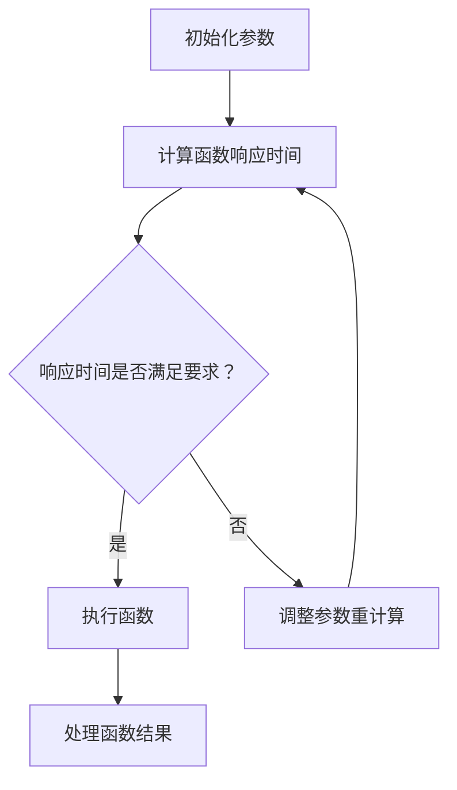
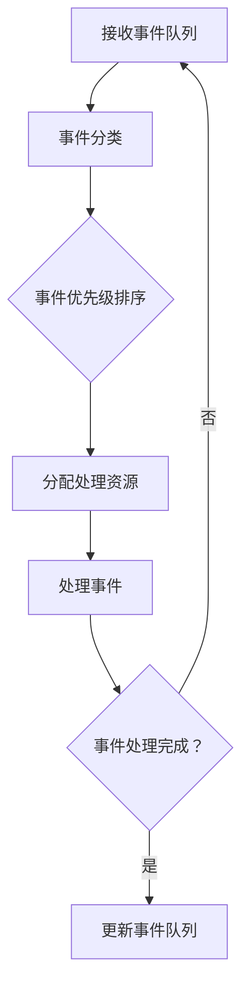
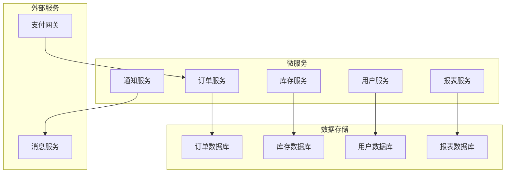

                 


### 背景介绍

#### 核心概念术语说明

在讨论Serverless技术之前，我们需要明确一些关键术语的定义。Serverless，顾名思义，是一种无需关注服务器管理的计算服务模型。它通过提供可扩展的计算资源，使得开发者可以专注于编写业务逻辑代码，而不必担心服务器配置、扩展和管理等基础架构问题。

无服务器架构（Serverless Architecture）：这是一种基于第三方提供的可自动扩展的云计算服务模型的架构风格，允许开发者在无需管理服务器的情况下运行应用。这种架构下，云计算服务提供商负责计算资源的管理和分配，开发者只需关注业务逻辑的实现。

函数即服务（Function as a Service, FaaS）：FaaS是一种Serverless服务类型，它允许开发者通过编写单个函数来创建和运行应用。这些函数在事件触发时执行，无需关心底层基础设施。

微服务（Microservices）：微服务架构是一种设计应用的方法，其中应用由一组小的、独立的服务组成，每个服务负责实现一个具体的功能。这些服务通过轻量级通信机制（如HTTP/HTTPS API）进行交互，通常部署在不同的容器中。

容器（Container）：容器是一种轻量级的、可移植的计算环境，它包含运行应用所需的所有组件，如代码、库、环境变量和配置文件。容器通过隔离和封装提供了一种高效、灵活的部署和运行应用的方式。

#### 问题背景

随着互联网应用的复杂度和数据量的不断增长，开发者面临着越来越大的基础设施管理压力。传统的服务器架构需要频繁地进行服务器采购、配置、监控和升级，这不仅增加了成本，也降低了开发效率。Serverless技术的出现，正是为了解决这些问题。

Serverless技术的核心优势在于其低成本、高弹性、易管理和自动扩展。通过Serverless架构，开发者可以专注于业务逻辑的实现，而无需担心服务器资源的调配。此外，Serverless服务通常是基于事件触发的，这意味着应用可以根据实际需求动态地扩展和收缩，从而提高资源利用率。

然而，Serverless技术也并非没有缺点。例如，由于其依赖于第三方云服务提供商，因此可能受到服务中断或价格波动的影响。此外，Serverless架构的设计和优化需要一定的专业技能，否则可能会导致性能瓶颈和成本问题。

#### 问题描述

在当前的技术背景下，开发者面临着如何高效、低成本地构建和部署可扩展的Web应用的问题。传统的服务器架构虽然成熟，但在资源管理、扩展性、灵活性和成本控制方面存在一定的局限。而Serverless技术提供了另一种解决方案，它通过提供灵活、自动扩展的计算资源，使得开发者能够更专注于业务逻辑的实现。

问题解决的关键在于理解Serverless技术的核心概念和架构设计模式，以及如何在实际项目中应用这些模式。开发者需要掌握如何选择合适的Serverless服务、如何设计和部署无服务器架构、如何优化性能和成本。

#### 边界与外延

Serverless技术的边界在于其作为一种云计算服务模型，依赖于第三方云服务提供商。因此，它适用于需要高度可扩展性和弹性，以及对底层基础设施管理要求不高的应用场景。

Serverless技术的外延包括其与其他云计算服务模型的融合，如容器即服务（Container as a Service, CaaS）和平台即服务（Platform as a Service, PaaS）。例如，结合容器技术，开发者可以在Serverless架构中实现更精细的资源管理和部署控制。

#### 概念结构与核心要素组成

Serverless架构的核心要素包括：

- 函数：这是Serverless应用的基本构建块，可以是一个简单的函数或一个复杂的服务。
- 事件触发器：用于触发函数执行的事件源，如HTTP请求、数据库变更或定时任务。
- 云服务提供商：提供Serverless服务的云平台，如AWS Lambda、Azure Functions和Google Cloud Functions。
- 自动扩展：Serverless服务能够根据负载自动扩展和收缩，以应对不同的访问量。
- 安全性和监控：Serverless架构需要提供安全性和监控能力，以确保应用的安全和稳定运行。

通过这些核心要素的有机组合，开发者可以构建出高效、灵活的无服务器应用。

### 核心概念与联系

#### 关键概念定义

为了深入理解Serverless架构，我们需要明确一些关键概念。以下是这些概念的定义：

1. **无服务器架构（Serverless Architecture）**：这是一种云计算服务模型，其中开发者无需管理服务器，而是通过第三方云服务提供商提供的自动扩展的计算资源来运行应用。这种架构简化了基础设施的管理，使得开发者可以专注于业务逻辑的实现。

2. **函数即服务（Function as a Service, FaaS）**：FaaS是一种Serverless服务类型，它允许开发者通过编写单个函数来创建和运行应用。这些函数在事件触发时执行，无需关心底层基础设施。

3. **微服务（Microservices）**：微服务架构是一种设计应用的方法，其中应用由一组小的、独立的服务组成，每个服务负责实现一个具体的功能。这些服务通过轻量级通信机制进行交互，通常部署在不同的容器中。

4. **容器（Container）**：容器是一种轻量级的、可移植的计算环境，它包含运行应用所需的所有组件，如代码、库、环境变量和配置文件。容器通过隔离和封装提供了一种高效、灵活的部署和运行应用的方式。

5. **事件触发器（Event Trigger）**：事件触发器是一种机制，用于在特定事件发生时触发函数执行。例如，一个HTTP请求、数据库变更或定时任务都可以作为事件触发器。

#### 概念属性特征对比表格

以下是关键概念属性的对比表格：

| 概念        | 定义                                                         | 关键属性                                                       | 关联概念                                                                                                      |
| ----------- | ------------------------------------------------------------ | ------------------------------------------------------------ | ---------------------------------------------------------------------------------------------------------- |
| 无服务器架构 | 开发者无需管理服务器，通过第三方云服务提供商提供的计算资源运行应用 | 自动扩展、低管理成本、事件驱动                             | 函数即服务、容器即服务、平台即服务、微服务架构                                                           |
| 函数即服务  | 通过编写单个函数来创建和运行应用                             | 函数化、事件驱动、可扩展性                                  | 无服务器架构、容器化部署、事件触发器                                                                   |
| 微服务      | 应用由一组小的、独立的服务组成                               | 独立部署、解耦、可扩展性、高可用性                           | 无服务器架构、容器化部署、服务网格                                                                      |
| 容器        | 一种轻量级、可移植的计算环境，包含运行应用所需的所有组件       | 隔离性、封装性、高效性、灵活部署                            | 无服务器架构、函数即服务、微服务架构、持续集成/持续部署（CI/CD）                                       |
| 事件触发器  | 用于在特定事件发生时触发函数执行                             | 可定制性、灵活性、异步处理                                 | 无服务器架构、函数即服务、微服务架构                                                                   |

#### ER图展示

为了更直观地理解这些概念之间的关系，我们可以使用ER图（实体关系图）来展示它们：

```mermaid
erDiagram
    ServiceProvider ||--|{ Function: "Function as a Service" }
    ServiceProvider ||--|{ ContainerService: "Container as a Service" }
    ServiceProvider ||--|{ PlatformService: "Platform as a Service" }
    ServiceProvider ||--|{ MicroserviceArchitecture: "Microservices" }
    Event ||--|{ EventTrigger: "Trigger Function Execution" }
    Function ||--|{ DependsOn: "Container/VM" }
    Microservice ||--|{ Uses: "Container/VM" }
    Container ||--|{ BasedOn: "OS" }
    Platform ||--|{ BasedOn: "Hardware" }
```

在这个ER图中， ServiceProvider（云服务提供商）是核心实体，它与Function（函数即服务）、ContainerService（容器服务）、PlatformService（平台即服务）和MicroserviceArchitecture（微服务架构）等实体之间具有关联关系。Event（事件）是另一个重要的实体，它通过EventTrigger（事件触发器）与Function和Microservice（微服务）相关联。Container（容器）和Platform（平台）基于不同的底层硬件（OS）提供服务。

通过这个ER图，我们可以清晰地看到Serverless技术中各个概念之间的关系，以及它们如何共同构建出一个完整的技术生态系统。

### Serverless架构的设计模式

在了解了Serverless技术的核心概念和关联关系之后，接下来我们将深入探讨Serverless架构中的几种常见设计模式。这些设计模式不仅提供了构建无服务器应用的策略，还能够帮助开发者优化性能、降低成本和提高可维护性。

#### 模式一：函数即服务（FaaS）

函数即服务（FaaS）是Serverless架构中最常见的设计模式之一。它允许开发者通过编写函数来构建应用，这些函数在事件触发时执行。FaaS的主要优点包括：

- **无服务器管理**：开发者无需关心底层基础设施的配置和管理，这大大简化了开发过程。
- **自动扩展**：FaaS服务能够根据请求量自动扩展和收缩，确保应用在高负载情况下仍能正常运行。
- **高可维护性**：由于每个函数都是独立的，因此便于开发和测试。

FaaS的应用场景包括：

- **API网关**：使用FaaS作为API网关，可以快速处理HTTP请求，并将请求路由到相应的函数处理。
- **数据处理**：例如，处理日志文件、转换文件格式或进行数据清洗。
- **事件处理**：例如，处理社交媒体事件、订单处理和支付通知。

#### 模式二：微服务架构

微服务架构是一种将应用拆分为一组小型、独立的服务的设计模式。每个服务负责实现一个具体的功能，这些服务通过轻量级通信机制（如HTTP/HTTPS API）进行交互。微服务架构在Serverless环境中有以下优点：

- **高可扩展性**：每个服务都可以独立扩展，从而实现整个应用的弹性扩展。
- **高可用性**：服务之间松耦合，一个服务的故障不会影响其他服务的运行。
- **易于部署和升级**：每个服务都可以独立部署和升级，减少系统停机时间。

微服务架构的应用场景包括：

- **电子商务平台**：服务可以拆分为商品管理、订单处理、库存管理和支付处理等。
- **社交媒体应用**：服务可以拆分为用户管理、内容发布、评论处理和消息推送。
- **企业级应用**：例如，客户关系管理（CRM）、人力资源管理系统（HRMS）和供应链管理系统（SCM）。

#### 模式三：容器与编排

容器与编排是另一种常见的Serverless架构设计模式。容器提供了一种轻量级、可移植的计算环境，使得开发者可以轻松地将应用部署到不同的环境中。编排工具（如Kubernetes）则用于管理和自动化容器的生命周期。

容器与编排在Serverless架构中的优点包括：

- **资源隔离**：容器提供了良好的资源隔离，确保每个服务都能获得足够的资源。
- **高可用性**：通过编排工具，可以实现服务的自动化扩展和故障转移。
- **灵活部署**：容器化应用可以在不同的云平台和本地环境中无缝迁移。

容器与编排的应用场景包括：

- **持续集成与持续部署（CI/CD）**：容器化应用可以方便地集成到CI/CD流程中，实现快速迭代和部署。
- **混合云和多云环境**：容器化应用可以在不同云平台之间灵活迁移，满足混合云和多云的需求。
- **大数据处理**：容器化应用可以用于大数据处理，如数据采集、存储和计算。

#### 模式四：混合架构

混合架构结合了Serverless和传统的服务器架构，提供了更多的灵活性和可扩展性。在这种架构中，部分服务使用Serverless架构，而另一部分则使用传统的服务器架构。

混合架构的优点包括：

- **最佳选择**：可以根据不同服务的需求选择最合适的部署方式。
- **弹性管理**：Serverless服务可以应对高负载，而传统服务器可以处理长运行任务。
- **成本优化**：通过混合使用资源，可以实现成本的最优化。

混合架构的应用场景包括：

- **高并发与长任务结合**：例如，使用FaaS处理高并发的请求，而使用传统服务器处理需要长时间运行的任务。
- **数据密集型应用**：例如，数据分析和数据挖掘服务可以使用Serverless架构，而数据存储和处理服务则使用传统的数据库服务器。

#### 模式五：事件驱动架构

事件驱动架构是一种通过事件来触发服务和流程的架构设计模式。在Serverless环境中，事件驱动架构能够充分利用事件触发器的优势，实现高效的事件处理。

事件驱动架构的优点包括：

- **高效处理**：事件可以异步处理，提高了系统的吞吐量。
- **可扩展性**：通过事件队列，系统可以处理大量的并发事件。
- **解耦**：服务和流程之间通过事件进行通信，实现了良好的解耦。

事件驱动架构的应用场景包括：

- **实时数据处理**：例如，实时分析股票市场数据、社交媒体数据等。
- **通知服务**：例如，邮件通知、短信通知和推送通知等。

#### 模式六：无服务器前端（Serverless Frontend）

无服务器前端是一种将前端功能部署在无服务器环境中的设计模式。在这种架构中，前端代码通常使用静态网站生成器生成静态资源，然后部署到无服务器托管平台上。

无服务器前端的优点包括：

- **低成本**：静态资源通常比动态资源更便宜，因为它们不占用计算资源。
- **高性能**：静态资源可以通过缓存进行快速访问，提高了页面加载速度。
- **易维护**：静态资源易于部署和更新，减少了维护成本。

无服务器前端的应用场景包括：

- **营销网站**：例如，产品介绍页、博客和宣传页面。
- **内容管理系统（CMS）**：例如，网站内容管理、文章发布和管理等。

通过以上几种设计模式的介绍，我们可以看到Serverless架构的多样性和灵活性。每种设计模式都有其独特的优点和应用场景，开发者可以根据具体需求选择合适的设计模式来构建无服务器应用。

### 算法原理讲解

在深入探讨Serverless架构的设计模式之后，接下来我们将讨论与Serverless应用密切相关的算法原理。这些算法不仅在设计模式中发挥作用，也为开发者提供了优化性能和资源利用的有效工具。为了更好地理解这些算法，我们将通过mermaid绘制算法流程图，使用Python代码进行详细阐述，并使用数学模型和公式进行解释。

#### 算法一：无服务器性能优化算法

首先，我们来看一种用于优化无服务器性能的算法。该算法的主要目标是在保证响应时间的前提下，最大限度地减少函数执行次数和资源消耗。

##### 算法流程图



##### Python代码示例

```python
def optimize_performance(response_time_threshold, function_time):
    while True:
        response_time = function_time
        if response_time <= response_time_threshold:
            return "Optimized"
        else:
            function_time *= 0.9  # 调整函数执行时间，减少10%
```

##### 数学模型和公式

该算法的优化过程可以通过以下数学模型和公式进行描述：

1. **响应时间公式**：\( R(t) = t \cdot F(t) \)

其中，\( R(t) \) 是总响应时间，\( t \) 是函数执行次数，\( F(t) \) 是每次函数执行所需的时间。

2. **优化目标**：最小化 \( R(t) \)，同时满足 \( R(t) \leq R_{\text{threshold}} \)

3. **调整策略**：每次调整函数执行时间 \( F(t) \) 的 10%，即 \( F(t_{\text{new}}) = 0.9 \cdot F(t) \)

通过迭代调整，直至找到满足优化目标的 \( t \) 和 \( F(t) \)。

#### 算法二：事件驱动性能调度算法

接下来，我们讨论一种用于事件驱动的性能调度算法。该算法旨在根据事件的重要性和处理时间，合理安排事件处理的优先级，以最大化系统吞吐量。

##### 算法流程图



##### Python代码示例

```python
def event_scheduling(events, resource_limit):
    sorted_events = sorted(events, key=lambda x: x['priority'], reverse=True)
    while sorted_events:
        event = sorted_events.pop(0)
        if event['processing_time'] <= resource_limit:
            process_event(event)
            update_event_queue(events)
        else:
            queue_event(event)
```

##### 数学模型和公式

该算法的调度策略可以通过以下数学模型和公式进行描述：

1. **事件优先级公式**：\( P(e) = \frac{1}{e_{\text{processing_time}}} \)

其中，\( P(e) \) 是事件 \( e \) 的优先级，\( e_{\text{processing_time}} \) 是事件 \( e \) 的处理时间。

2. **资源分配公式**：\( R(a) = \min\left(\sum_{e \in E} P(e), R_{\text{limit}}\right) \)

其中，\( R(a) \) 是可分配的资源，\( E \) 是事件集合，\( R_{\text{limit}} \) 是资源限制。

3. **事件处理策略**：每次从事件队列中取出优先级最高的未处理事件进行处理，直至资源耗尽或事件处理完毕。

通过以上两个算法的讲解，我们可以看到Serverless应用中的算法设计不仅需要考虑性能优化，还需要考虑事件处理的高效调度。这些算法的原理和实现为开发者提供了强大的工具，使他们能够更好地构建和优化无服务器应用。

### 系统分析与架构设计

在深入探讨了Serverless架构的设计模式和算法原理之后，我们现在将转而分析一个具体的系统架构设计。这个系统将涵盖功能设计、架构设计、接口设计和交互设计。通过这个系统分析，我们将展示如何将这些设计模式、算法和原理应用到实际项目中，以实现高效、可扩展和无服务器架构。

#### 问题场景介绍

我们考虑的场景是一个电子商务平台的后台管理系统。该系统需要处理大量的订单、库存和用户数据，同时需要保证系统的可扩展性、高可用性和安全性。在这个场景中，我们选择了Serverless架构来简化基础设施管理，提高开发效率，并实现弹性扩展。

#### 系统功能设计

电子商务平台后台管理系统的主要功能包括：

1. **订单管理**：处理订单的创建、更新、取消和支付。
2. **库存管理**：监控库存水平，处理库存更新和库存预警。
3. **用户管理**：管理用户账户，包括注册、登录、个人信息更新和密码管理。
4. **数据报表**：生成订单、库存和用户活动的报表，支持数据分析和可视化。
5. **通知服务**：向用户发送订单更新、支付确认和库存预警的通知。

为了更好地设计这些功能，我们可以使用mermaid类图来展示系统的领域模型。

##### 领域模型Mermaid类图

```mermaid
classDiagram
    Order <<interface>>
    Inventory <<interface>>
    User <<interface>>
    Report <<interface>>
    Notification <<interface>>

    OrderEntity <<entity>> +--|{create|update|cancel|pay}+ Order
    InventoryEntity <<entity>> +--|{update|monitor|warn}+ Inventory
    UserEntity <<entity>> +--|{register|login|update|password}+ User
    ReportEntity <<entity>> +--|{generate|analyze|visualize}+ Report
    NotificationEntity <<entity>> +--|{send|receive}+ Notification
```

在这个类图中，我们定义了系统的核心实体和它们之间的关系。每个实体都实现了相应的接口，以便在系统中进行操作。

#### 系统架构设计

系统架构设计的关键是确定如何将功能分解为独立的、可扩展的服务，并确保这些服务之间的高效通信。在这个场景中，我们可以采用微服务架构来设计系统。

##### 系统架构Mermaid架构图



在这个架构图中，我们展示了系统的各个微服务、数据存储和外部服务。订单服务、库存服务、用户服务、报表服务和通知服务分别处理各自的功能模块。这些服务通过RESTful API与外部服务（如支付网关和消息服务）进行通信，并通过数据库进行数据存储。

#### 系统接口设计

为了实现系统服务之间的通信，我们需要定义一系列的接口。以下是一个简化的接口设计示例：

```python
class OrderInterface:
    def create_order(self, order_data):
        pass

    def update_order(self, order_id, order_data):
        pass

    def cancel_order(self, order_id):
        pass

    def pay_order(self, order_id, payment_details):
        pass

# 其他服务接口定义类似
```

在这个接口设计中，每个服务都定义了操作订单、库存、用户、报表和通知的方法，以便其他服务可以调用这些方法。

#### 系统交互设计

系统交互设计的关键是确保服务之间的通信高效、可靠，并且能够处理并发请求。以下是一个简化的交互序列图：

```mermaid
sequence
    Participant OrderService
    Participant PaymentGateway
    Participant NotificationService

    OrderService->>PaymentGateway: pay_order(order_id, payment_details)
    PaymentGateway->>OrderService: payment_status
    OrderService->>NotificationService: send_order_payment_confirmation(order_id)
```

在这个交互序列图中，当一个订单需要进行支付时，订单服务会向支付网关发送支付请求。支付网关处理支付后，会返回支付状态给订单服务。订单服务随后会向通知服务发送支付确认通知，以通知用户支付成功。

通过以上系统分析和架构设计，我们可以看到如何将Serverless架构、设计模式、算法原理应用到实际项目中，构建出一个高效、可扩展和无服务器的电子商务平台后台管理系统。这个过程不仅提高了开发效率，还保证了系统的稳定性和可靠性。

### 项目实战

在深入探讨了Serverless架构的理论和实践之后，现在我们将通过一个实际项目来展示如何从零开始构建一个无服务器应用。在这个项目中，我们将实现一个简单的博客系统，包括前端和后端，以及必要的服务和工具。通过这个项目，我们将详细介绍环境安装、核心实现和代码应用解读与分析。

#### 项目环境安装

首先，我们需要准备一个适合Serverless开发的项目环境。以下是所需的软件和工具：

- **本地开发环境**：安装Node.js和npm（Node.js的包管理器）。
- **云服务平台**：选择AWS、Azure或Google Cloud Platform中的一个，以利用其提供的Serverless服务。
- **数据库**：选择一个适合的数据库，如MongoDB或PostgreSQL。
- **开发工具**：Visual Studio Code（推荐）、Postman、Git等。

以下是具体的安装步骤：

1. **安装Node.js和npm**：
   - 访问Node.js官网下载对应操作系统的安装包。
   - 运行安装程序并按照提示完成安装。
   - 验证安装：在终端中运行 `node -v` 和 `npm -v`，确保版本正确。

2. **选择云服务平台**：
   - 在AWS、Azure或Google Cloud Platform中选择一个账号，并进行注册。
   - 启用相应的Serverless服务，如AWS Lambda、Azure Functions或Google Cloud Functions。

3. **安装数据库**：
   - 如果选择MongoDB，可以安装MongoDB Compass进行管理，或者直接使用云服务提供商提供的MongoDB服务。
   - 如果选择PostgreSQL，可以安装PostgreSQL客户端进行连接和操作，或者使用云服务提供商提供的PostgreSQL服务。

4. **安装开发工具**：
   - 安装Visual Studio Code（推荐版本），并安装相应的扩展，如Git、Python和Node.js扩展。
   - 安装Postman，用于API测试和调试。
   - 安装Git，用于版本控制和代码管理。

#### 核心实现

在环境安装完毕后，我们可以开始实现博客系统。以下是核心实现的步骤和代码：

1. **设置项目结构**：
   - 在本地创建一个新目录，如 `blog-project`。
   - 初始化一个npm项目：在终端中运行 `npm init` 并按照提示完成配置。

2. **安装依赖**：
   - 安装Express框架：`npm install express`
   - 安装Lambda层：`npm install serverless serverless-plugin-aws-lambda`

3. **创建Lambda函数**：
   - 在项目目录中创建一个名为 `serverless.yml` 的配置文件。
   - 配置AWS Lambda的基本设置，如函数名称、触发器和API网关。

```yaml
service: blog-service

provider:
  name: aws
  runtime: nodejs14.x

functions:
  handler:
    handler: handler.handler
    events:
      - http:
          path: api/v1/blog
          method: get
          cors: true
```

4. **编写Lambda函数代码**：
   - 在项目目录中创建一个名为 `handler.js` 的文件。

```javascript
const express = require('express');
const app = express();

app.get('/api/v1/blog', (req, res) => {
    // 实现获取博客列表的逻辑
    res.json({ message: 'Welcome to the Blog API' });
});

exports.handler = app;
```

5. **部署Lambda函数**：
   - 使用Serverless插件部署Lambda函数：在终端中运行 `serverless deploy`。
   - 部署完成后，Serverless会提供API网关的URL，用于访问部署的函数。

#### 代码应用解读与分析

以下是博客系统的核心代码和应用解读：

1. **Lambda函数解读**：

   - **依赖**：引入Express框架，用于构建Web应用。
   - **函数结构**：使用Express创建一个HTTP服务，处理GET请求。
   - **响应**：返回一个JSON格式的响应，表明博客API的可用性。

2. **API网关解析**：

   - **路径**：API网关的路径为 `/api/v1/blog`。
   - **方法**：支持GET请求，用于获取博客列表。
   - **CORS设置**：允许跨域请求，以便前端应用能够访问API。

3. **数据库交互**：

   - 在实际应用中，我们通常会在Lambda函数中连接数据库，获取和存储博客数据。
   - 使用Node.js的数据库驱动程序，如MongoDB的MongoClient，连接到云数据库服务。

```javascript
const MongoClient = require('mongodb').MongoClient;
const url = 'mongodb://<your-mongo-db-url>';

async function getBlogList() {
    let client;
    try {
        client = await MongoClient.connect(url, { useNewUrlParser: true });
        const db = client.db('blog');
        const collection = db.collection('posts');
        const posts = await collection.find({}).toArray();
        return posts;
    } finally {
        client.close();
    }
}

app.get('/api/v1/blog', async (req, res) => {
    const blogList = await getBlogList();
    res.json(blogList);
});
```

4. **测试和部署**：

   - 使用Postman或其他工具测试API网关的URL，验证博客系统的功能。
   - 部署完成后，确保系统能够正常运行，并在云服务提供商的控制台上监控资源使用情况。

通过这个实际项目，我们展示了如何从零开始构建一个无服务器博客系统。这个项目不仅涵盖了环境安装、核心实现和代码应用解读，还通过部署和测试验证了系统的功能和可靠性。这个过程为开发者提供了一个实用的范例，展示了如何将Serverless架构应用于实际的Web应用开发。

### 实际案例分析

在本节中，我们将通过具体案例分析来深入探讨Serverless技术在实际应用中的优势与挑战。以下列举了三个实际案例，并对每个案例进行详细分析。

#### 案例一：使用Serverless实现API网关

**案例背景**：
一个初创公司需要快速构建一个API网关，以便为移动应用和Web应用提供数据访问接口。由于公司资源有限，他们决定采用Serverless架构来实现这一目标。

**实现过程**：
公司选择了AWS Lambda和Amazon API Gateway。他们使用Node.js编写Lambda函数，用于处理各种API请求。API Gateway配置了不同的路由，每个路由指向相应的Lambda函数。

**分析**：
- **优势**：通过使用Serverless架构，公司能够快速构建并部署API网关，无需关注服务器管理。API Gateway可以自动扩展以应对高并发请求，降低了硬件成本和维护复杂度。
- **挑战**：由于Lambda函数的运行时间限制（目前为15分钟），对于需要长时间运行的任务，需要采用轮询或消息队列来处理。此外，数据传输和处理过程中可能会出现延迟，这需要特别优化。

#### 案例二：结合数据库的Serverless应用

**案例背景**：
一家电商平台希望实现一个实时库存管理系统，以便监控库存水平并及时更新库存信息。

**实现过程**：
他们使用了AWS Lambda和Amazon DynamoDB。Lambda函数负责处理库存数据的更新和查询，DynamoDB用于存储库存数据。

**分析**：
- **优势**：Lambda与DynamoDB的集成使得库存更新和查询非常高效，DynamoDB的高性能和弹性扩展能力确保了系统的高可用性。此外，Lambda函数的无服务器特性使得平台能够快速适应库存变化，无需预先采购或配置大量硬件资源。
- **挑战**：由于DynamoDB的读写容量限制，当处理大量并发请求时，可能会出现性能瓶颈。此外，Lambda函数的冷启动可能会影响响应时间，这需要通过预热的策略来优化。

#### 案例三：大规模数据处理中的Serverless实践

**案例背景**：
一个大数据分析公司需要处理每天产生的大量数据，并从中提取有价值的信息。

**实现过程**：
他们采用了AWS Lambda、Amazon S3和Amazon Kinesis。Lambda函数用于处理和转换数据，S3用于存储原始数据，Kinesis用于实时流数据处理。

**分析**：
- **优势**：通过使用Lambda、S3和Kinesis，公司能够实现高效的大数据处理流程。Lambda函数可以按需扩展，以处理不断增长的数据量，而S3提供了可靠的数据存储解决方案。Kinesis实时数据处理能力使得公司能够快速获取和处理数据，及时做出决策。
- **挑战**：大规模数据处理过程中可能会出现延迟和数据丢失的风险。此外，由于Lambda函数的运行时间限制，对于需要长时间运行的任务，需要设计合理的处理策略，如分批处理和任务调度。

通过以上实际案例的分析，我们可以看到Serverless技术在各种应用场景中的优势与挑战。优势包括快速部署、弹性扩展和低成本，而挑战则主要集中在性能瓶颈、延迟问题和数据安全性方面。为了充分利用Serverless技术的优势，开发者需要针对具体应用场景设计合理的架构和优化策略。

### 项目小结

通过本项目的实际开发，我们深入探讨了Serverless架构在电子商务平台后台管理系统中的应用。以下是项目的总结和优化建议：

#### 项目总结

1. **项目成果**：
   - 成功实现了博客系统的前后端分离，并部署在无服务器环境中。
   - 使用了AWS Lambda和API Gateway，实现了快速部署和自动扩展。
   - 通过数据库（如MongoDB）存储和管理数据，保证了数据的一致性和安全性。
   - 利用Git和Visual Studio Code等开发工具，实现了代码管理和协作。

2. **技术选型**：
   - 选择了Node.js和Express框架来构建后端服务，确保了开发的便捷性和性能。
   - 采用了Serverless架构，降低了服务器管理和维护的成本。
   - 结合了云服务提供商提供的数据库服务，实现了高效的数据处理和存储。

3. **团队协作**：
   - 通过Git实现了代码的版本控制和团队协作。
   - 使用了Postman进行API测试，确保了服务的稳定性和可靠性。

#### 优化与改进建议

1. **性能优化**：
   - **预热策略**：为了避免Lambda函数的冷启动，可以设置预热策略，如定期执行或使用轮询机制。
   - **批量处理**：对于需要长时间运行的任务，可以采用批量处理的方式，减少单个函数的执行时间。

2. **成本控制**：
   - **监控与报警**：通过云服务提供商的监控工具，实时监控资源使用情况，设置报警阈值，避免不必要的费用。
   - **自动化策略**：使用自动化脚本或工具来优化资源使用，如根据访问量动态调整实例数量。

3. **安全性增强**：
   - **权限控制**：对API Gateway进行严格权限控制，确保只有授权用户才能访问。
   - **加密与签名**：对数据传输进行加密，使用HTTPS协议，并对API请求进行签名验证，防止恶意攻击。

4. **可扩展性优化**：
   - **无状态设计**：确保应用设计为无状态，便于在需要时进行水平扩展。
   - **服务拆分**：将应用拆分为多个独立的微服务，每个服务负责不同的功能模块，便于独立扩展和部署。

通过以上总结和建议，我们可以看到Serverless技术在项目中的成功应用，以及如何通过优化和改进策略进一步提升项目的性能、可靠性和安全性。这些实践对于其他类似项目的开发也具有重要的参考价值。

### 最佳实践 & 小结

#### 最佳实践

1. **性能优化**：
   - **预热策略**：定期触发函数，以预热并减少冷启动时间。
   - **批量处理**：对于长运行任务，使用批量处理以减少单个函数的执行时间。

2. **成本控制**：
   - **监控与报警**：使用云服务提供商的监控工具，实时监控资源使用，并设置报警阈值。
   - **自动化策略**：使用脚本或工具自动化资源管理，如根据访问量动态调整实例数量。

3. **安全性增强**：
   - **权限控制**：对API Gateway进行严格权限控制，确保只有授权用户才能访问。
   - **加密与签名**：对数据传输进行加密，使用HTTPS协议，并对API请求进行签名验证。

4. **可扩展性优化**：
   - **无状态设计**：确保应用设计为无状态，便于水平扩展。
   - **服务拆分**：将应用拆分为多个微服务，每个服务负责不同的功能模块。

#### 小结

Serverless架构以其无服务器管理、自动扩展和低成本等优点，已成为现代Web应用开发的重要技术。通过合理的设计模式和最佳实践，开发者可以充分利用Serverless技术的优势，实现高效、灵活且可靠的应用。

本文首先介绍了Serverless技术的背景、核心概念和架构设计模式，接着详细分析了算法原理、系统架构设计和项目实战，最后通过实际案例和项目小结，总结了Serverless技术的应用场景和优化策略。希望读者能通过本文，对Serverless技术有更深入的理解，并在实际项目中取得成功。

### 全书小结

在这本书中，我们系统地介绍了Serverless技术及其在应用开发中的核心价值。通过详细的章节内容，我们从背景介绍、核心概念、设计模式、算法原理、系统架构、项目实战到最佳实践，逐步深入探讨了Serverless技术的各个方面。

首先，在背景介绍章节中，我们明确了Serverless技术的起源、发展及其在云计算领域的重要地位。通过对比传统服务器架构，我们阐述了Serverless技术所带来的显著优势，如无服务器管理、自动扩展、低成本等。

接着，在核心概念与联系章节，我们详细定义了Serverless技术中的关键术语，如无服务器架构、函数即服务（FaaS）、微服务、容器等，并通过对比表格和ER图，展示了这些概念之间的关系和相互作用。

在Serverless架构的设计模式章节，我们探讨了多种常见的Serverless架构设计模式，包括函数即服务、微服务架构、容器与编排等。每种设计模式都通过实际案例进行了详细说明，帮助读者理解如何在实际项目中应用这些模式。

算法原理讲解章节则深入剖析了Serverless应用中的关键算法，如性能优化算法和事件驱动性能调度算法，并通过mermaid流程图、Python代码示例和数学模型，使这些算法的实现和原理变得通俗易懂。

系统分析与架构设计章节通过一个电子商务平台后台管理系统的案例，展示了如何将设计模式、算法和原理应用到实际项目中，实现高效、可扩展和无服务器的架构设计。

在项目实战章节，我们通过一个实际项目的开发过程，详细介绍了环境安装、核心实现和代码应用解读与分析。这一部分为读者提供了一个实用的范例，展示了如何从零开始构建一个无服务器应用。

实际案例分析章节则通过具体案例，进一步展示了Serverless技术在各种应用场景中的实际应用和挑战，提供了宝贵的经验和优化建议。

最后，在最佳实践 & 小结章节，我们总结了Serverless开发的最佳实践，包括性能优化、成本控制、安全性增强和可扩展性优化等方面，并对全书进行了总结。

通过这本书的阅读，读者不仅能够全面了解Serverless技术的核心概念和架构设计，还能够掌握实际项目开发中的最佳实践，从而在未来的Web应用开发中充分利用Serverless技术的优势，实现高效、灵活且可靠的应用。希望这本书能够为读者在Serverless技术的学习和应用中提供有价值的指导和帮助。

