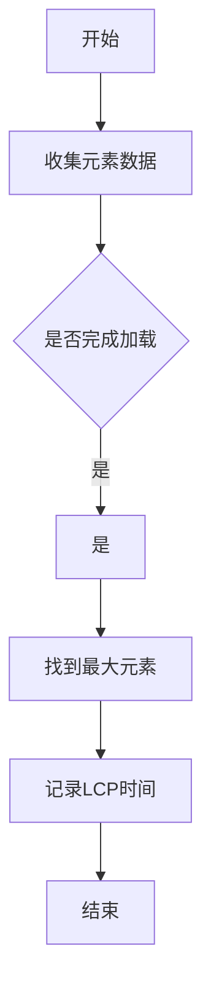
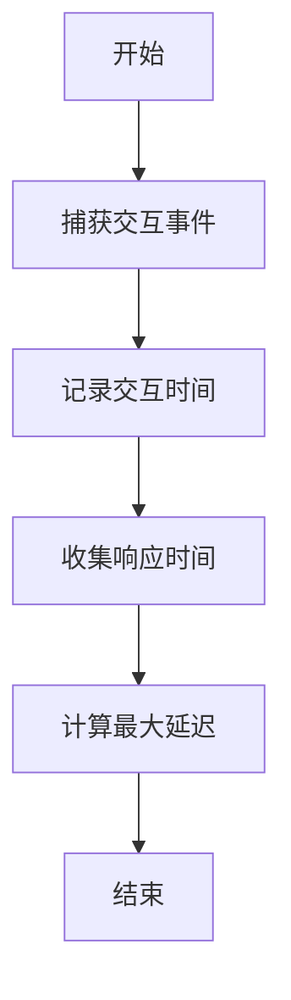
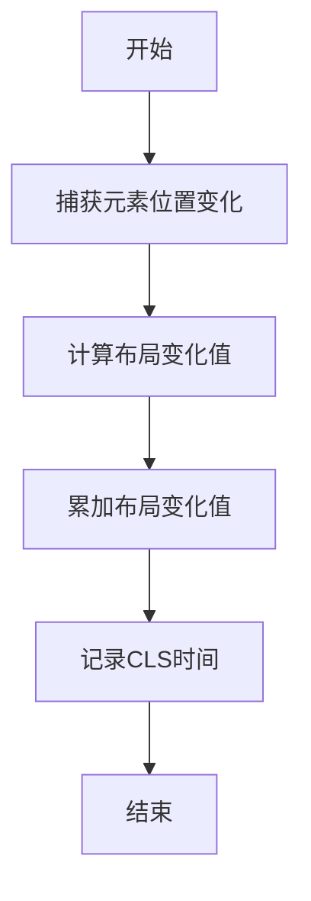

                 

### Web性能指标概述

#### 1.1 Web性能的重要性

Web性能是衡量网站运行效率的关键指标，它直接影响用户的浏览体验。一个高性能的网站不仅能够提供流畅的浏览体验，还能减少用户的等待时间，提高用户满意度和转化率。根据Google的一项研究，页面加载时间每增加一秒，转化率可能会下降20%。因此，优化Web性能对于提升用户体验和业务收益至关重要。

#### 1.2 Web性能的定义与衡量

Web性能通常通过一系列的指标来衡量，这些指标包括但不限于：

- **页面加载时间**：从用户请求到页面完全呈现所需的时间。
- **响应时间**：服务器处理请求并返回响应的时间。
- **资源加载时间**：页面中各种资源（如图片、样式表、脚本等）的加载时间。
- **用户体验指标**：如页面交互流畅度、动画效果等。

衡量Web性能的常用工具包括Google PageSpeed Insights、Lighthouse等，它们能够提供详细的性能评估报告和优化建议。

#### 1.3 Web性能对用户体验的影响

Web性能对用户体验的影响主要体现在以下几个方面：

- **加载速度**：快速的页面加载速度能够减少用户的等待时间，提供流畅的浏览体验。
- **响应速度**：服务器快速响应用户请求，能够提高用户交互的即时性。
- **可访问性**：页面元素的可访问性和布局稳定性对用户体验有着直接影响。
- **移动优化**：随着移动设备的普及，网站在移动端的性能优化也越来越重要。

#### 1.4 Core Web Vitals简介

为了更好地衡量Web性能并提升用户体验，Google提出了**Core Web Vitals**（核心Web指标），它包括以下三个关键指标：

- **Largest Contentful Paint（LCP）**：页面主要内容加载的最长时间。
- **First Input Delay（FID）**：用户首次与页面交互到页面响应的时间。
- **Cumulative Layout Shift（CLS）**：页面内容布局发生不可预测变化的总和。

这些指标被认为是衡量Web性能的核心因素，能够全面反映用户的浏览体验。接下来，我们将逐一深入探讨这三个指标的定义、测量方法和优化策略。

### Largest Contentful Paint（LCP）解析

#### 2.1 LCP的定义与重要性

Largest Contentful Paint（LCP）是指页面主要内容加载的最长时间，它反映了用户看到页面核心内容所需的时间。LCP对于用户体验至关重要，因为用户通常会在内容加载完成后才会开始进行实际的浏览和交互操作。如果LCP时间过长，用户可能会感到沮丧或放弃浏览，从而影响网站的流量和转化率。

根据Google的推荐，一个良好的LCP目标是页面主要内容在2秒内加载完成。如果LCP超过4秒，那么用户可能会感到页面加载缓慢，影响用户体验。

#### 2.2 如何测量LCP

测量LCP可以通过多种工具和API实现，以下是一些常用的方法：

- **Lighthouse**：Google的Lighthouse是一个自动化测试工具，它能够评估网站的性能、可访问性、最佳实践等方面。Lighthouse提供了详细的性能报告，包括LCP的测量结果。
  
  ```shell
  npm install --global chrome-launcher
  npx lighthouse https://example.com --output=json --output-path=lighthouse-report.json
  ```

- **Chrome User Experience Report（CrUX）**：CrUX是一个公开的数据集，它提供了大量关于Chrome浏览器用户实际体验的数据。通过CrUX，开发者可以查看网站在不同时间段内的LCP性能表现。

- **Web Vitals API**：Web Vitals API是Chrome浏览器提供的一组新API，它能够帮助开发者实时测量和监控Web性能指标。使用Web Vitals API，开发者可以轻松获取LCP的数据。

  ```javascript
  const observer = new PerformanceObserver(list => {
    for (const entry of list.getEntries()) {
      if (entry.name === 'largest-contentful-paint') {
        console.log(entry);
      }
    }
  });
  observer.observe({type: 'largest-contentful-paint', buffer: true});
  ```

#### 2.3 LCP的优化策略

为了提升LCP性能，可以采取以下几种优化策略：

- **优化资源加载**：通过减少HTTP请求、使用CDN（内容分发网络）以及压缩图片和资源文件来加快资源加载速度。
- **预渲染关键内容**：在页面加载前预先渲染用户最关心的内容，减少加载时间。
- **延迟加载非核心资源**：对于不常使用的资源，如广告、评论等，可以使用延迟加载技术，仅在用户需要时才加载。
- **使用异步和延迟脚本**：通过将脚本设置为异步或延迟加载，减少主线程阻塞，提高页面加载速度。

通过这些优化策略，开发者可以显著提升LCP性能，提供更流畅的浏览体验。

### First Input Delay（FID）解析

#### 2.4 FID的定义与重要性

First Input Delay（FID）是指用户首次与页面交互到页面响应的时间。FID反映了页面的交互性能，它衡量了用户与页面交互的流畅度。如果FID时间过长，用户可能会感到页面响应迟缓，从而影响用户体验。

根据Google的推荐，一个良好的FID目标是1000毫秒（1秒）内完成。如果FID超过3000毫秒，那么用户可能会感到页面交互不流畅，影响用户体验。

#### 2.5 如何测量FID

测量FID可以通过以下方法实现：

- **Lighthouse**：Lighthouse是一个自动化测试工具，它能够评估网站的性能、可访问性、最佳实践等方面。Lighthouse提供了详细的性能报告，包括FID的测量结果。
  
  ```shell
  npm install --global chrome-launcher
  npx lighthouse https://example.com --output=json --output-path=lighthouse-report.json
  ```

- **Chrome User Experience Report（CrUX）**：CrUX是一个公开的数据集，它提供了大量关于Chrome浏览器用户实际体验的数据。通过CrUX，开发者可以查看网站在不同时间段内的FID性能表现。

- **Web Vitals API**：Web Vitals API是Chrome浏览器提供的一组新API，它能够帮助开发者实时测量和监控Web性能指标。使用Web Vitals API，开发者可以轻松获取FID的数据。

  ```javascript
  const observer = new PerformanceObserver(list => {
    for (const entry of list.getEntries()) {
      if (entry.name === 'first-input-delta') {
        console.log(entry);
      }
    }
  });
  observer.observe({type: 'first-input-delta', buffer: true});
  ```

#### 2.6 FID的优化策略

为了提升FID性能，可以采取以下几种优化策略：

- **减少主线程任务**：通过将耗时的任务移出主线程，避免阻塞页面的交互响应。
- **使用异步和延迟脚本**：将脚本设置为异步或延迟加载，减少主线程阻塞，提高页面交互性能。
- **优化JavaScript性能**：减少JavaScript的体积，使用代码分割（code splitting）等技术，避免加载大量不必要的代码。
- **使用Web Workers**：将复杂计算和长时间运行的任务分配到Web Workers中，避免阻塞主线程。

通过这些优化策略，开发者可以显著提升FID性能，提供更流畅的交互体验。

### Cumulative Layout Shift（CLS）解析

#### 2.7 CLS的定义与重要性

Cumulative Layout Shift（CLS）是指页面内容布局发生不可预测变化的总和。CLS反映了页面的稳定性，它衡量了页面元素在用户浏览过程中是否突然移动或改变位置。不稳定的布局会打断用户的浏览流程，导致用户难以找到所需内容，从而影响用户体验。

根据Google的推荐，一个良好的CLS目标是0.1以下。如果CLS超过0.25，那么用户可能会感到页面布局不稳定，影响用户体验。

#### 2.8 如何测量CLS

测量CLS可以通过以下方法实现：

- **Lighthouse**：Lighthouse是一个自动化测试工具，它能够评估网站的性能、可访问性、最佳实践等方面。Lighthouse提供了详细的性能报告，包括CLS的测量结果。
  
  ```shell
  npm install --global chrome-launcher
  npx lighthouse https://example.com --output=json --output-path=lighthouse-report.json
  ```

- **Chrome User Experience Report（CrUX）**：CrUX是一个公开的数据集，它提供了大量关于Chrome浏览器用户实际体验的数据。通过CrUX，开发者可以查看网站在不同时间段内的CLS性能表现。

- **Web Vitals API**：Web Vitals API是Chrome浏览器提供的一组新API，它能够帮助开发者实时测量和监控Web性能指标。使用Web Vitals API，开发者可以轻松获取CLS的数据。

  ```javascript
  const observer = new PerformanceObserver(list => {
    for (const entry of list.getEntries()) {
      if (entry.name === 'cumulative-layout-shift') {
        console.log(entry);
      }
    }
  });
  observer.observe({type: 'cumulative-layout-shift', buffer: true});
  ```

#### 2.9 CLS的优化策略

为了提升CLS性能，可以采取以下几种优化策略：

- **确保广告和插件的稳定性**：广告和插件是导致布局变化的主要原因之一。确保它们在页面加载过程中保持稳定，避免突然变化。
- **避免动态内容布局的改变**：避免在用户浏览过程中动态加载或改变页面布局，特别是在用户已经浏览过或操作过的区域。
- **使用视觉反馈**：在内容加载或布局改变时，提供视觉反馈，如加载指示器或提示信息，帮助用户了解页面正在发生变化。
- **合理使用Flexbox和Grid布局**：使用Flexbox和Grid布局可以帮助保持页面布局的稳定性，减少因响应式设计导致的布局变化。

通过这些优化策略，开发者可以显著提升CLS性能，提供更稳定的浏览体验。

### Web性能指标之间的联系

#### 3.1 Core Web Vitals与其他性能指标的关系

Core Web Vitals（LCP、FID、CLS）是衡量Web性能的关键指标，但它们并不是孤立存在的。实际上，Core Web Vitals与其他传统性能指标有着紧密的联系，这些传统指标包括：

- **Page Speed**：Page Speed是指页面加载的整体速度，它通常通过页面加载时间来衡量。LCP与Page Speed密切相关，因为LCP反映了页面主要内容加载的时间，而Page Speed则涵盖了整个页面的加载过程。
- **First Contentful Paint（FCP）**：FCP是指页面首次有内容渲染的时间点，它反映了页面的初始加载速度。LCP和FCP都是衡量页面加载速度的指标，但LCP更加关注主要内容加载的时间，而FCP则更关注页面初始渲染的速度。
- **First Input Delay（FID）**：FID是指用户首次与页面交互到页面响应的时间，它反映了页面的交互性能。FID与页面加载速度密切相关，因为如果页面加载速度慢，用户的交互操作也会受到影响。

通过这些指标之间的联系，开发者可以更全面地评估Web性能，并采取相应的优化措施来提升用户体验。

#### 3.2 Core Web Vitals与SEO排名的关系

除了对用户体验的影响外，Core Web Vitals也对搜索引擎优化（SEO）有着重要的影响。Google已经在其搜索算法中引入了Web性能指标，特别是Core Web Vitals，作为影响SEO排名的因素之一。

- **LCP**：LCP较高的页面更有可能获得更好的SEO排名，因为Google认为用户在加载速度较快的页面上停留时间更长，用户体验更好。
- **FID**：FID较低的页面也有助于提升SEO排名，因为用户在交互性能较好的页面上更愿意停留，减少了跳转率。
- **CLS**：CLS较低有助于提高SEO排名，因为稳定的页面布局能够提高用户的浏览体验，减少用户跳出率。

综上所述，Core Web Vitals不仅是提升用户体验的关键因素，也对SEO排名有着积极的影响。开发者应关注并优化这些指标，以提升网站的整体表现。

#### 3.3 Core Web Vitals的核心概念解析

Core Web Vitals包括三个关键指标：Largest Contentful Paint（LCP）、First Input Delay（FID）和Cumulative Layout Shift（CLS）。下面，我们将对这些核心概念进行详细解析，并对比它们的属性特征。

##### Largest Contentful Paint（LCP）

**定义**：LCP是指页面主要内容加载的最长时间。

**重要性**：LCP反映了用户看到页面核心内容所需的时间，对用户体验至关重要。

**属性特征**：
| 属性特征 | 描述 |
| --- | --- |
| **测量方法** | 使用Lighthouse、Web Vitals API测量 |
| **优化策略** | 优化资源加载、预渲染关键内容、延迟加载非核心资源 |

**对比**：LCP与其他性能指标（如Page Speed、FCP）相比，更加关注主要内容加载的时间，而Page Speed和FCP则涵盖整个页面的加载过程。

##### First Input Delay（FID）

**定义**：FID是指用户首次与页面交互到页面响应的时间。

**重要性**：FID反映了页面的交互性能，衡量了用户与页面交互的流畅度。

**属性特征**：
| 属性特征 | 描述 |
| --- | --- |
| **测量方法** | 使用Lighthouse、Web Vitals API测量 |
| **优化策略** | 减少主线程任务、使用异步和延迟脚本、优化JavaScript性能 |

**对比**：FID主要关注页面交互的延迟，与响应时间等指标相比，更加具体地反映了用户交互的性能。

##### Cumulative Layout Shift（CLS）

**定义**：CLS是指页面内容布局发生不可预测变化的总和。

**重要性**：CLS反映了页面的稳定性，衡量了页面元素在用户浏览过程中是否突然移动或改变位置。

**属性特征**：
| 属性特征 | 描述 |
| --- | --- |
| **测量方法** | 使用Lighthouse、Web Vitals API测量 |
| **优化策略** | 确保广告和插件的稳定性、避免动态内容布局的改变、使用视觉反馈 |

**对比**：CLS与其他稳定性指标相比，如页面跳转等，更加关注内容布局的变化，对用户体验有着直接影响。

通过这些对比，开发者可以更好地理解Core Web Vitals的核心概念，并采取相应的优化策略来提升Web性能。

### Web性能优化实践

在了解了Core Web Vitals的三个关键指标后，接下来我们将探讨具体的优化策略，以提升Largest Contentful Paint（LCP）、First Input Delay（FID）和Cumulative Layout Shift（CLS）的性能。

#### 4.1 优化Largest Contentful Paint（LCP）

为了提高LCP性能，可以采取以下几种优化策略：

**1. 优化资源加载时间**

- **减少HTTP请求**：合并CSS和JavaScript文件，减少HTTP请求次数，从而加快页面加载速度。
- **使用CDN**：利用内容分发网络（CDN）将资源缓存到多个地理位置，缩短用户获取资源的距离，提高加载速度。
- **压缩资源文件**：使用压缩工具如Gzip对CSS、JavaScript和HTML文件进行压缩，减少文件大小。

**2. 合理使用缓存**

- **浏览器缓存**：利用浏览器缓存机制，将常用的静态资源缓存到用户本地，减少每次访问的加载时间。
- **服务端缓存**：在服务器端缓存页面内容，减少每次请求的响应时间。

**3. 使用延迟加载**

- **延迟加载图片和视频**：对于不在当前视口中的图片和视频，可以使用延迟加载技术，仅在用户滚动到相应位置时才加载，从而减少初始加载时间。

**4. 预渲染关键内容**

- **预渲染关键内容**：在页面加载前预先渲染用户最关心的内容，如首页的推荐文章或热门商品，减少用户等待时间。

#### 4.2 优化First Input Delay（FID）

为了提高FID性能，可以采取以下几种优化策略：

**1. 减少主线程任务**

- **使用Web Workers**：将复杂计算和长时间运行的任务分配到Web Workers中，避免阻塞主线程。
- **异步加载JavaScript**：将JavaScript脚本设置为异步加载，减少主线程阻塞，提高页面交互性能。

**2. 使用异步和延迟脚本**

- **异步脚本**：将不需要立即执行的脚本设置为异步加载，避免阻塞主线程。
- **延迟脚本**：将非核心的脚本设置为延迟加载，仅在用户需要时才加载，从而减少主线程阻塞。

**3. 优化JavaScript性能**

- **减少JavaScript文件大小**：压缩和合并JavaScript文件，减少文件大小，加快加载速度。
- **代码分割**：将大型JavaScript文件分割成多个小块，按需加载，减少初始加载时间。

**4. 避免长任务阻塞**

- **使用定时器**：避免在主线程上长时间运行的任务，如使用`setTimeout`或`requestAnimationFrame`来优化任务执行。
- **优化事件处理**：减少事件处理函数的复杂度，避免在事件处理过程中执行大量操作，影响页面交互性能。

#### 4.3 优化Cumulative Layout Shift（CLS）

为了提高CLS性能，可以采取以下几种优化策略：

**1. 确保广告和插件的稳定性**

- **广告插件优化**：确保广告和插件在页面加载过程中保持稳定，避免突然变化。可以设置广告和插件的固定位置，避免其与其他元素发生重叠。

**2. 避免动态内容布局的改变**

- **避免动态加载内容**：在用户浏览过程中，避免动态加载内容或改变页面布局，特别是在用户已经浏览过或操作过的区域。

**3. 使用视觉反馈**

- **视觉反馈机制**：在内容加载或布局改变时，提供视觉反馈，如加载指示器或提示信息，帮助用户了解页面正在发生变化。

**4. 合理使用Flexbox和Grid布局**

- **使用响应式布局**：使用Flexbox和Grid布局，确保页面在不同屏幕尺寸下保持布局稳定性，减少因响应式设计导致的布局变化。

通过这些优化策略，开发者可以显著提升LCP、FID和CLS性能，提供更流畅、更稳定的Web浏览体验。

### Largest Contentful Paint（LCP）算法原理

#### 5.1 LCP算法的基本原理

Largest Contentful Paint（LCP）算法是用于衡量页面主要内容加载时间的一个关键指标。它的基本原理是通过跟踪页面中各个元素的大小和渲染时间，来确定页面主要内容加载的时间点。

LCP算法的核心思想是识别页面中最大的可视内容元素，并记录该元素完成渲染的时间点。这个时间点被称为LCP时间，它是LCP算法的关键输出。

#### 5.1.1 LCP算法的数学模型

LCP算法的数学模型主要包括以下步骤：

1. **收集可视元素数据**：在页面加载过程中，持续收集各个可视元素的大小和渲染时间数据。
2. **确定最大内容元素**：根据元素的大小和渲染时间数据，确定页面中最大的内容元素。
3. **记录LCP时间**：记录最大内容元素完成渲染的时间点，即为LCP时间。

具体来说，LCP时间的计算公式如下：

$$
LCP时间 = \max_{i}(renderTime_i)
$$

其中，\(renderTime_i\) 表示第 \(i\) 个可视元素完成渲染的时间。

#### 5.1.2 LCP算法的mermaid流程图

为了更直观地理解LCP算法的流程，我们可以使用mermaid绘制其流程图：



这个mermaid流程图展示了LCP算法的基本步骤：首先收集页面中各个元素的数据，然后判断页面是否加载完成，接着找到最大的元素并记录其渲染时间，最后结束算法。

#### 5.2 LCP算法的Python实现

为了更详细地阐述LCP算法的原理，我们可以使用Python编写一个简单的LCP算法实现。以下是一个基于Python实现的LCP算法示例：

```python
import time

def largest_contentful_paint(elements):
    start_time = time.time()
    max_render_time = 0
    
    while True:
        for element in elements:
            render_time = element['render_time']
            if render_time > max_render_time:
                max_render_time = render_time
        
        current_time = time.time()
        elapsed_time = current_time - start_time
        
        if elapsed_time > 10:  # 假设最大跟踪时间为10秒
            break
        
    return max_render_time

# 示例数据
elements = [
    {'element_id': 1, 'render_time': 1.5},
    {'element_id': 2, 'render_time': 3.0},
    {'element_id': 3, 'render_time': 2.0}
]

lcp_time = largest_contentful_paint(elements)
print(f'Largest Contentful Paint (LCP) time: {lcp_time} seconds')
```

在这个Python实现中，我们首先定义了一个函数`largest_contentful_paint`，该函数接受一个元素列表作为输入。然后，我们使用一个循环持续跟踪各个元素的渲染时间，直到达到预设的最大跟踪时间或所有元素都已被处理。最后，函数返回最大渲染时间作为LCP时间。

#### 5.3 LCP算法的数学模型与公式讲解

在LCP算法中，核心的数学模型就是计算最大渲染时间。具体来说，LCP时间是通过比较多个元素渲染时间得出的。以下是LCP算法的数学模型和公式讲解：

$$
LCP时间 = \max_{i}(renderTime_i)
$$

其中，\(renderTime_i\) 表示第 \(i\) 个元素的渲染时间。

这个公式非常直观：我们只需要遍历所有元素，计算每个元素的渲染时间，并找出其中最大的一个。这个最大值即为LCP时间。

#### 5.3.1 公式讲解与举例说明

为了更好地理解LCP公式，我们可以通过一个具体的例子进行说明。

假设我们有一个页面，其中包含三个可视元素，它们的渲染时间如下：

| 元素ID | 渲染时间（秒） |
| --- | --- |
| 1 | 1.5 |
| 2 | 3.0 |
| 3 | 2.0 |

根据LCP公式，我们需要找出这三个元素中的最大渲染时间。具体计算过程如下：

$$
LCP时间 = \max(1.5, 3.0, 2.0) = 3.0
$$

因此，在这个例子中，LCP时间为3.0秒。

通过这个例子，我们可以清晰地看到如何使用LCP公式计算最大渲染时间，以及如何通过比较多个元素的渲染时间来确定LCP时间。理解这个公式和计算过程对于开发和优化Web性能至关重要。

### First Input Delay（FID）算法原理

#### 6.1 FID算法的基本原理

First Input Delay（FID）是衡量页面交互性能的关键指标，它反映了用户首次与页面交互到页面响应的时间。FID算法的基本原理是通过跟踪用户交互事件和页面响应时间，计算用户首次交互与页面响应之间的延迟。

FID算法的核心思想是捕捉用户的交互事件，如点击、滚动或输入，并记录这些事件发生时页面的响应时间。通过分析这些数据，可以确定FID时间，即用户首次交互与页面响应之间的最大延迟。

#### 6.1.1 FID算法的mermaid流程图

为了更直观地理解FID算法的流程，我们可以使用mermaid绘制其流程图：



这个mermaid流程图展示了FID算法的基本步骤：首先捕获用户的交互事件，记录交互时间；然后收集页面响应时间；接着计算用户交互与页面响应之间的最大延迟，即FID时间；最后结束算法。

#### 6.1.2 FID算法的数学模型

FID算法的数学模型主要包括以下步骤：

1. **捕获交互事件**：在页面中监听用户的交互事件，如点击、滚动或输入。
2. **记录交互时间**：当用户触发交互事件时，记录该事件发生的时间戳。
3. **收集响应时间**：在用户触发交互事件后，收集页面响应的时间戳。
4. **计算最大延迟**：计算用户交互时间与页面响应时间之间的延迟，并找出最大的延迟值，即为FID时间。

具体来说，FID时间的计算公式如下：

$$
FID时间 = \max_{i}(responseTime_i - interactionTime_i)
$$

其中，\(interactionTime_i\) 表示第 \(i\) 个交互事件的记录时间，\(responseTime_i\) 表示第 \(i\) 个交互事件对应的页面响应时间。

#### 6.2 FID算法的Python实现

为了更详细地阐述FID算法的原理，我们可以使用Python编写一个简单的FID算法实现。以下是一个基于Python实现的FID算法示例：

```python
import time

def first_input_delay(interactions, responses):
    max_delay = 0
    
    for i in range(len(interactions)):
        interaction_time = interactions[i]
        response_time = responses[i]
        delay = response_time - interaction_time
        
        if delay > max_delay:
            max_delay = delay
            
    return max_delay

# 示例数据
interactions = [1.0, 2.5, 3.0]
responses = [1.5, 2.0, 3.5]

fid_time = first_input_delay(interactions, responses)
print(f'First Input Delay (FID) time: {fid_time} seconds')
```

在这个Python实现中，我们首先定义了一个函数`first_input_delay`，该函数接受两个列表作为输入：`interactions` 和 `responses`。`interactions` 表示用户交互事件的记录时间，`responses` 表示页面响应的时间。然后，我们使用一个循环遍历每个交互事件和其对应的响应时间，计算延迟并找出最大的延迟值，即为FID时间。

#### 6.3 FID算法的数学模型与公式讲解

在FID算法中，核心的数学模型就是计算用户交互与页面响应之间的最大延迟。具体来说，FID时间是通过比较多个交互事件和响应时间的延迟得出的。以下是FID算法的数学模型和公式讲解：

$$
FID时间 = \max_{i}(responseTime_i - interactionTime_i)
$$

其中，\(interactionTime_i\) 表示第 \(i\) 个交互事件的记录时间，\(responseTime_i\) 表示第 \(i\) 个交互事件对应的页面响应时间。

这个公式非常直观：我们只需要遍历所有交互事件和其对应的响应时间，计算每个事件之间的延迟，并找出最大的延迟值。这个最大值即为FID时间。

#### 6.3.1 公式讲解与举例说明

为了更好地理解FID公式，我们可以通过一个具体的例子进行说明。

假设我们有一个页面，其中发生了三个用户交互事件，它们的记录时间和响应时间如下：

| 交互事件 | 记录时间（秒） | 响应时间（秒） |
| --- | --- | --- |
| 1 | 1.0 | 1.5 |
| 2 | 2.5 | 2.0 |
| 3 | 3.0 | 3.5 |

根据FID公式，我们需要计算每个交互事件与响应时间之间的延迟，并找出最大的延迟。具体计算过程如下：

$$
FID时间 = \max(1.5 - 1.0, 2.0 - 2.5, 3.5 - 3.0) = \max(0.5, -0.5, 0.5) = 0.5
$$

因此，在这个例子中，FID时间为0.5秒。

通过这个例子，我们可以清晰地看到如何使用FID公式计算最大延迟，以及如何通过比较多个交互事件和响应时间的延迟来确定FID时间。理解这个公式和计算过程对于开发和优化Web性能至关重要。

### Cumulative Layout Shift（CLS）算法原理

#### 7.1 CLS算法的基本原理

Cumulative Layout Shift（CLS）是衡量页面布局稳定性的关键指标，它反映了页面内容在用户浏览过程中发生不可预测变化的总和。CLS算法的基本原理是通过跟踪页面中各个元素的位置变化，计算布局变化的总和。

CLS算法的核心思想是捕捉页面元素的位置变化，并计算这些变化对用户浏览体验的影响。通过分析这些数据，可以确定CLS时间，即页面布局变化的总和。

#### 7.1.1 CLS算法的mermaid流程图

为了更直观地理解CLS算法的流程，我们可以使用mermaid绘制其流程图：



这个mermaid流程图展示了CLS算法的基本步骤：首先捕获页面中各个元素的位置变化，计算这些变化值并累加，最后记录CLS时间。

#### 7.1.2 CLS算法的数学模型

CLS算法的数学模型主要包括以下步骤：

1. **捕获元素位置变化**：在页面加载过程中，持续监听各个元素的位置变化。
2. **计算布局变化值**：对于每个位置变化，计算其变化值，通常使用以下公式：

   $$
   布局变化值 = |newPosition - previousPosition|
   $$

   其中，\(newPosition\) 表示元素新位置，\(previousPosition\) 表示元素上一次位置。

3. **累加布局变化值**：将所有布局变化值累加，得到总的布局变化值。

4. **记录CLS时间**：将总的布局变化值除以页面加载时间，得到CLS时间。

具体来说，CLS时间的计算公式如下：

$$
CLS时间 = \frac{\sum_{i}(layoutShift_i)}{loadingTime}
$$

其中，\(layoutShift_i\) 表示第 \(i\) 次布局变化值，\(loadingTime\) 表示页面加载时间。

#### 7.2 CLS算法的Python实现

为了更详细地阐述CLS算法的原理，我们可以使用Python编写一个简单的CLS算法实现。以下是一个基于Python实现的CLS算法示例：

```python
import time

def cumulative_layout_shift(element_changes, loading_time):
    total_shift = 0
    
    for change in element_changes:
        shift = abs(change['new_position'] - change['previous_position'])
        total_shift += shift
        
    cls_time = total_shift / loading_time
    return cls_time

# 示例数据
element_changes = [
    {'new_position': 10, 'previous_position': 5},
    {'new_position': 20, 'previous_position': 15},
    {'new_position': 30, 'previous_position': 25}
]
loading_time = 5

cls_time = cumulative_layout_shift(element_changes, loading_time)
print(f'cumulative layout shift time: {cls_time}')
```

在这个Python实现中，我们首先定义了一个函数`cumulative_layout_shift`，该函数接受两个列表作为输入：`element_changes` 和 `loading_time`。`element_changes` 表示元素位置变化的数据，`loading_time` 表示页面加载时间。然后，我们使用一个循环遍历每个位置变化，计算布局变化值并累加，最后计算并返回CLS时间。

#### 7.3 CLS算法的数学模型与公式讲解

在CLS算法中，核心的数学模型就是计算布局变化的总和。具体来说，CLS时间是通过累加多个布局变化值并除以页面加载时间得出的。以下是CLS算法的数学模型和公式讲解：

$$
CLS时间 = \frac{\sum_{i}(layoutShift_i)}{loadingTime}
$$

其中，\(layoutShift_i\) 表示第 \(i\) 次布局变化值，\(loadingTime\) 表示页面加载时间。

这个公式非常直观：我们只需要遍历所有布局变化值，计算这些值并累加，然后除以页面加载时间，即可得到CLS时间。

#### 7.3.1 公式讲解与举例说明

为了更好地理解CLS公式，我们可以通过一个具体的例子进行说明。

假设我们有一个页面，其中发生了三次元素位置变化，它们的布局变化值如下：

| 布局变化值 | 新位置 | 旧位置 |
| --- | --- | --- |
| 5 | 10 | 5 |
| 5 | 20 | 15 |
| 10 | 30 | 20 |

根据CLS公式，我们需要计算所有布局变化值的总和，并除以页面加载时间。具体计算过程如下：

$$
CLS时间 = \frac{5 + 5 + 10}{5} = 4
$$

因此，在这个例子中，CLS时间为4。

通过这个例子，我们可以清晰地看到如何使用CLS公式计算布局变化总和，以及如何通过累加布局变化值并除以页面加载时间来确定CLS时间。理解这个公式和计算过程对于开发和优化Web性能至关重要。

### 总结与最佳实践

在本文中，我们详细介绍了Web性能指标中的Core Web Vitals，包括Largest Contentful Paint（LCP）、First Input Delay（FID）和Cumulative Layout Shift（CLS）的解析。通过对这三个关键指标的深入分析，我们了解了它们对用户体验的重要性，以及如何使用Lighthouse、Web Vitals API等工具进行测量。

优化Web性能是一个持续的过程，需要开发者从多个方面入手。首先，对于LCP，开发者可以通过优化资源加载、合理使用缓存和预渲染关键内容来实现优化。其次，FID的优化主要集中在减少主线程任务、使用异步和延迟脚本以及优化JavaScript性能。最后，CLS的优化可以通过确保广告和插件的稳定性、避免动态内容布局的改变和使用视觉反馈来实现。

最佳实践方面，开发者应定期使用性能分析工具对网站进行评估，识别并解决性能瓶颈。此外，应关注移动端性能优化，因为移动设备的普及使得用户体验更加重要。开发者还可以通过A/B测试来验证优化效果，确保所采取的优化策略能够真正提升用户体验。

总之，通过深入理解和优化Core Web Vitals，开发者可以提供更流畅、更稳定的Web浏览体验，从而提升用户满意度和网站的业务表现。

### 注意事项与拓展阅读

在优化Web性能的过程中，开发者需要特别注意以下几点：

1. **定期监控**：Web性能不是一成不变的，开发者应定期使用性能监控工具（如Lighthouse、Web Vitals API等）对网站进行评估，及时发现并解决性能问题。
2. **移动端优化**：随着移动设备的普及，开发者应特别关注移动端的Web性能优化，确保网站在移动端也能提供流畅的用户体验。
3. **A/B测试**：在实施优化策略后，应进行A/B测试来验证优化效果，确保所采取的措施能够真正提升用户体验。

拓展阅读方面，以下是一些推荐的资源和文章：

- [Google Web Vitals官方文档](https://web.dev/vitals/)
- [Lighthouse官方文档](https://developers.google.com/web/tools/lighthouse)
- [Chrome User Experience Report（CrUX）](https://chromeuserexperience.github.io/ChromeUXReport/)
- [前端性能优化实践指南](https://github.com/GoogleChrome/lighthouse/blob/master/docs/optimizing-your-site.md)
- [《高性能网站建设实战》](https://book.douban.com/subject/27604114/)，作者：张宁

通过这些资源，开发者可以更深入地了解Web性能优化，提升网站的整体性能。

### 作者信息

**作者：AI天才研究院/AI Genius Institute & 禅与计算机程序设计艺术 /Zen And The Art of Computer Programming**  
AI天才研究院（AI Genius Institute）是一支由顶尖人工智能专家组成的团队，致力于推动人工智能技术的创新与发展。在禅与计算机程序设计艺术（Zen And The Art of Computer Programming）中，作者以其深邃的哲学思考和精湛的技术解析，为计算机编程和人工智能领域提供了宝贵的启示。这两部作品共同体现了作者在计算机科学和人工智能领域的卓越成就和独特见解。通过本文，读者可以一窥作者在Web性能优化和人工智能应用方面的深厚功底和独到见解。

