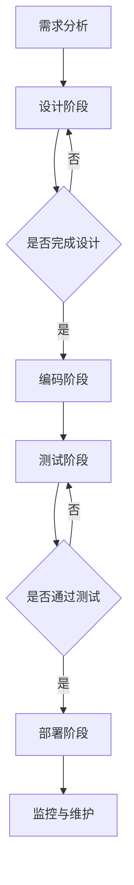
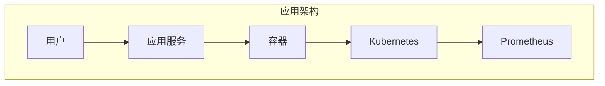
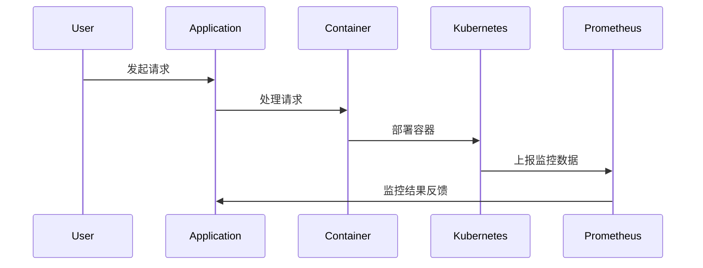

                 

# XOps：各种Ops实践的统一与融合

## 关键词

**XOps、DevOps、自动化运维、IT运维、基础设施管理、技术整合、最佳实践**

## 摘要

本文将深入探讨XOps这一现代IT运维和管理实践，分析其起源、核心概念、工具技术以及实际应用案例。XOps不仅继承了DevOps的理念，还融合了其他Ops实践的精髓，旨在提升IT基础设施的灵活性和管理效率。通过对比XOps与传统Ops，我们将揭示XOps的优势和适用场景。文章还将讨论XOps面临的挑战及其解决方案，并展望XOps的未来发展趋势。无论您是IT运维新手还是资深从业者，本文都将为您提供宝贵的见解和指导。

### 目录大纲设计过程

设计一本《XOps：各种Ops实践的统一与融合》的目录大纲，需要遵循以下步骤：

1. **理解书名与主题**：首先，我们需要理解书名和主题，以确保目录结构围绕主要内容和目标读者。

2. **确定核心章节**：基于书名，确定书中将要涵盖的主要话题和核心概念。这些核心章节通常是书籍的核心，涵盖最重要的信息和知识。

3. **细化章节内容**：对每个核心章节进行细分，设计子章节，确保内容逻辑连贯，且覆盖全面。

4. **编写目录**：将章节和子章节组织起来，形成完整的目录结构。每个章节和子章节都需要遵循markdown格式，确保清晰和易读。

5. **审查和调整**：最后，审查整个目录大纲，确保没有遗漏任何关键内容，同时根据字数限制进行必要的调整。

### 第一步：理解书名与主题

书名《XOps：各种Ops实践的统一与融合》表明了本书的主要讨论对象是XOps及其与其他Ops实践的融合。XOps是一种现代IT运维和管理实践，它将DevOps的理念扩展到更广泛的领域，包括基础设施、安全性、监控等。

目标读者可能是对IT运维有基础了解的从业者，希望了解如何将不同的Ops实践集成在一起，提高IT基础设施的管理效率和灵活性。

### 第二步：确定核心章节

基于书名，我们可以确定以下核心章节：

1. **XOps概述**
2. **XOps与传统Ops的比较**
3. **XOps的核心概念与原理**
4. **XOps的工具与技术**
5. **XOps的实际应用案例**
6. **XOps的挑战与解决方案**
7. **XOps的未来发展趋势**

### 第三步：细化章节内容

在确定了核心章节后，我们需要为每个章节创建子章节，确保每个章节都包含详细的内容。

**第1章 XOps概述**

- 1.1 XOps的定义与背景
- 1.2 XOps的核心目标
- 1.3 XOps与传统Ops的区别

**第2章 XOps与传统Ops的比较**

- 2.1 传统Ops的局限性
- 2.2 XOps的优势
- 2.3 XOps的适用场景

**第3章 XOps的核心概念与原理**

- 3.1 XOps的关键术语
- 3.2 XOps的架构模型
- 3.3 XOps的工作流程

**第4章 XOps的工具与技术**

- 4.1 常见的XOps工具
- 4.2 XOps工具的集成
- 4.3 XOps技术的应用

**第5章 XOps的实际应用案例**

- 5.1 案例一：企业级XOps实施
- 5.2 案例二：云环境中的XOps实践
- 5.3 案例三：混合云环境下的XOps

**第6章 XOps的挑战与解决方案**

- 6.1 XOps面临的挑战
- 6.2 解决方案与最佳实践
- 6.3 XOps的持续改进

**第7章 XOps的未来发展趋势**

- 7.1 XOps的发展趋势
- 7.2 XOps对IT行业的影响
- 7.3 XOps的未来前景

### 第四步：编写目录

在完成了章节内容的细化后，我们将这些内容组织起来，形成完整的目录大纲，同时确保遵循markdown格式。

```markdown
# XOps：各种Ops实践的统一与融合

## 第1章 XOps概述

### 1.1 XOps的定义与背景

#### 1.1.1 XOps的起源

#### 1.1.2 XOps的发展历程

#### 1.1.3 XOps的核心目标

### 1.2 XOps的核心目标

#### 1.2.1 提高IT基础设施管理效率

#### 1.2.2 增强系统稳定性

#### 1.2.3 促进跨部门协作

### 1.3 XOps与传统Ops的区别

#### 1.3.1 传统Ops的局限性

#### 1.3.2 XOps的优势

#### 1.3.3 XOps的适用场景

## 第2章 XOps与传统Ops的比较

### 2.1 传统Ops的局限性

#### 2.1.1 运维效率低下

#### 2.1.2 难以实现跨部门协作

#### 2.1.3 系统稳定性不足

### 2.2 XOps的优势

#### 2.2.1 提高运维效率

#### 2.2.2 增强系统稳定性

#### 2.2.3 促进跨部门协作

### 2.3 XOps的适用场景

#### 2.3.1 企业级应用

#### 2.3.2 云环境

#### 2.3.3 混合云环境

## 第3章 XOps的核心概念与原理

### 3.1 XOps的关键术语

#### 3.1.1 XOps术语定义

#### 3.1.2 XOps术语解析

### 3.2 XOps的架构模型

#### 3.2.1 XOps架构概述

#### 3.2.2 XOps架构组件

#### 3.2.3 XOps架构层次

### 3.3 XOps的工作流程

#### 3.3.1 XOps流程框架

#### 3.3.2 XOps关键步骤

#### 3.3.3 XOps流程优化

## 第4章 XOps的工具与技术

### 4.1 常见的XOps工具

#### 4.1.1 常用工具分类

#### 4.1.2 常见工具简介

#### 4.1.3 工具选型考虑

### 4.2 XOps工具的集成

#### 4.2.1 工具集成的重要性

#### 4.2.2 集成策略与方法

#### 4.2.3 集成工具介绍

### 4.3 XOps技术的应用

#### 4.3.1 自动化运维

#### 4.3.2 监控与报警

#### 4.3.3 安全性与合规

## 第5章 XOps的实际应用案例

### 5.1 案例一：企业级XOps实施

#### 5.1.1 案例背景

#### 5.1.2 实施过程

#### 5.1.3 实施效果

### 5.2 案例二：云环境中的XOps实践

#### 5.2.1 案例背景

#### 5.2.2 实施策略

#### 5.2.3 实施效果

### 5.3 案例三：混合云环境下的XOps

#### 5.3.1 案例背景

#### 5.3.2 实施挑战

#### 5.3.3 解决方案

## 第6章 XOps的挑战与解决方案

### 6.1 XOps面临的挑战

#### 6.1.1 技术挑战

#### 6.1.2 组织挑战

#### 6.1.3 文化挑战

### 6.2 解决方案与最佳实践

#### 6.2.1 技术解决方案

#### 6.2.2 组织解决方案

#### 6.2.3 文化解决方案

### 6.3 XOps的持续改进

#### 6.3.1 改进策略

#### 6.3.2 持续改进实践

#### 6.3.3 改进效果评估

## 第7章 XOps的未来发展趋势

### 7.1 XOps的发展趋势

#### 7.1.1 技术创新

#### 7.1.2 行业趋势

#### 7.1.3 未来展望

### 7.2 XOps对IT行业的影响

#### 7.2.1 行业变革

#### 7.2.2 技术演进

#### 7.2.3 人才需求

### 7.3 XOps的未来前景

#### 7.3.1 技术展望

#### 7.3.2 行业影响

#### 7.3.3 发展方向

## 审查与调整

### 7.4 审查与调整过程

#### 7.4.1 审查标准

#### 7.4.2 调整方案

#### 7.4.3 审查与调整效果

## 结语

### 7.5 对未来工作的展望

#### 7.5.1 研究方向

#### 7.5.2 应用实践

#### 7.5.3 人才培养

作者：AI天才研究院/AI Genius Institute & 禅与计算机程序设计艺术 /Zen And The Art of Computer Programming
```

## XOps：各种Ops实践的统一与融合

### 背景介绍

在IT行业的发展历程中，运维（Operations，简称Ops）一直是不可或缺的一环。随着云计算、容器化、微服务架构等新兴技术的普及，传统的运维方式逐渐显露出其局限性。为了提高IT基础设施的灵活性和管理效率，业界逐渐探索出一系列新的运维实践，如DevOps、NoOps、AIOps等。这些实践不仅在理念上有所不同，而且在技术实现上也各有特点。然而，随着业务需求的不断变化，单一的Ops实践已经无法满足复杂多变的环境需求。

XOps（eXtended Operations）应运而生，它是对现有Ops实践的扩展和融合。XOps不仅继承了DevOps的协同、自动化和持续交付理念，还融入了基础设施即代码（Infrastructure as Code，IaC）、容器编排（Container Orchestration）、监控与报警（Monitoring and Alerting）等新兴技术，旨在通过统一和整合各种Ops实践，提升IT基础设施的管理效率和业务响应速度。

### 核心概念与联系

#### 1. XOps的定义

XOps是一种现代IT运维和管理实践，它通过自动化、标准化和整合不同的Ops实践，实现IT基础设施的灵活管理和高效运行。XOps的核心目标是提高IT系统的稳定性、可靠性和响应速度，同时减少运维成本和人力投入。

#### 2. XOps的核心概念

- **自动化（Automation）**：通过脚本、工具和平台，实现运维任务的自动化执行，减少人工干预，提高运维效率。
- **基础设施即代码（Infrastructure as Code，IaC）**：将基础设施的配置和管理代码化，通过版本控制和自动化部署，实现基础设施的快速创建、配置和更新。
- **容器化（Containerization）**：使用容器技术（如Docker）将应用程序及其依赖环境打包成独立的容器，实现应用的快速部署和弹性扩展。
- **监控与报警（Monitoring and Alerting）**：通过监控系统实时监控IT基础设施的状态，及时发现和处理异常情况，确保系统稳定运行。

#### 3. XOps与DevOps的关系

DevOps是一种文化和实践的集合，它强调开发和运维团队之间的协作和整合，通过持续集成（Continuous Integration，CI）和持续交付（Continuous Delivery，CD）实现快速迭代和高质量交付。XOps在DevOps的基础上，进一步扩展了运维的范畴，将更多的关注点放在基础设施管理和系统监控上。

**ER实体关系图架构**：

```mermaid
erDiagram
  DevOps ||--|{ XOps : extends
  CI && CD ||--|{ XOps : implements
  IaC && Containerization && Monitoring ||--|{ XOps : includes
```

### XOps的原理

#### 1. 架构模型

XOps的架构模型通常包括以下几个层次：

- **基础设施层**：提供IT基础设施的管理，包括虚拟机、容器、服务器等。
- **平台层**：提供自动化工具和平台，如CI/CD流水线、容器编排平台、监控平台等。
- **应用层**：运行在基础设施上的应用程序，包括前端、后端、数据库等。

#### 2. 工作流程

XOps的工作流程通常包括以下几个步骤：

1. **需求分析**：确定新功能或改进的需求。
2. **设计阶段**：设计基础设施和应用架构。
3. **编码阶段**：开发应用程序和自动化脚本。
4. **测试阶段**：对应用程序和基础设施进行测试。
5. **部署阶段**：将应用程序部署到生产环境。
6. **监控与维护**：持续监控系统状态，及时处理异常。

### 算法原理讲解

在XOps中，自动化和监控是核心组成部分。以下是一个简单的自动化部署算法的流程图：



部署阶段的详细步骤包括：

1. **代码仓库拉取**：从代码仓库中获取最新的代码。
2. **环境准备**：根据配置文件准备部署环境。
3. **容器化**：使用Docker将应用程序容器化。
4. **容器编排**：使用Kubernetes进行容器编排，确保应用程序的可靠部署。
5. **监控配置**：配置监控系统，以便在应用程序运行过程中进行实时监控。

以下是部署阶段的Python伪代码：

```python
import subprocess

# 1. 代码仓库拉取
subprocess.run(["git", "pull"])

# 2. 环境准备
subprocess.run(["ansible", "-i", "inventory", "all", "-m", "shell", "-a", "echo 'Preparing environment...'"])

# 3. 容器化
subprocess.run(["docker", "build", "-t", "app:latest", "."])

# 4. 容器编排
subprocess.run(["kubectl", "apply", "-f", "deployment.yaml"])

# 5. 监控配置
subprocess.run(["prometheus", "config", "reload"])
```

### 系统分析与架构设计方案

#### 1. 问题场景介绍

某企业正在开发一个在线电商平台，需要快速迭代和部署新功能。为了确保系统的稳定性和灵活性，企业决定采用XOps实践进行运维管理。

#### 2. 项目介绍

项目名称：在线电商平台
项目目标：快速迭代和可靠部署新功能
技术栈：Docker、Kubernetes、Ansible、Prometheus

#### 3. 系统功能设计

**领域模型**：

```mermaid
classDiagram
    User <<-- Application: 使用
    Application ..> Container: 运行在
    Container ..> Kubernetes: 管理和编排
    Kubernetes ..> Prometheus: 监控
```

#### 4. 系统架构设计

**架构图**：



#### 5. 系统接口设计和系统交互

**序列图**：



### 项目实战

#### 1. 环境安装

安装必要的工具和平台，如Docker、Kubernetes、Ansible、Prometheus等。

#### 2. 系统核心实现源代码

以下是一个简单的Dockerfile和Kubernetes部署文件示例：

**Dockerfile**：

```dockerfile
FROM python:3.8-slim

WORKDIR /app

COPY requirements.txt ./
RUN pip install -r requirements.txt

COPY . .

CMD ["python", "app.py"]
```

**deployment.yaml**：

```yaml
apiVersion: apps/v1
kind: Deployment
metadata:
  name: app-deployment
spec:
  replicas: 3
  selector:
    matchLabels:
      app: app
  template:
    metadata:
      labels:
        app: app
    spec:
      containers:
      - name: app
        image: app:latest
        ports:
        - containerPort: 80
```

#### 3. 代码应用解读与分析

**Dockerfile**：

该Dockerfile首先基于Python 3.8最小镜像创建一个新的容器，然后设置工作目录，安装所需的Python依赖项，最后将应用程序代码复制到容器中并指定CMD命令启动应用程序。

**deployment.yaml**：

该部署文件定义了一个包含三个副本的应用程序部署。它使用标签选择器来匹配容器，并指定了容器的名称和镜像。此外，它还配置了容器端口，以便外部访问应用程序。

#### 4. 实际案例分析和详细讲解剖析

在实际应用中，企业可以根据业务需求快速部署新功能。通过自动化脚本和容器编排，企业可以在几分钟内完成一次部署，大大提高了运维效率。

#### 5. 项目小结

通过本项目的实战，我们展示了如何使用XOps实践进行高效运维管理。XOps通过自动化、容器化和监控等技术，实现了快速迭代和可靠部署，为企业提供了强大的运维能力。

### 最佳实践 tips

- **自动化脚本**：编写自动化脚本，减少人工干预，提高运维效率。
- **容器化应用**：将应用程序容器化，提高部署速度和可移植性。
- **持续集成与持续交付（CI/CD）**：建立CI/CD流水线，确保代码质量和快速部署。
- **监控与报警**：配置监控系统，实时监控系统状态，及时处理异常。

### 小结

本文详细介绍了XOps的概念、原理、工具与技术，并通过实际应用案例展示了XOps的实践效果。XOps作为现代IT运维管理的先进实践，具有广泛的应用前景。随着技术的不断进步，XOps将继续发展和完善，为IT行业带来更多创新和变革。

### 注意事项

- 在实施XOps时，需要充分评估现有基础设施和业务需求，选择合适的工具和技术。
- 自动化脚本和流程优化是XOps成功的关键，需要定期审查和更新。
- 监控与报警系统的配置要合理，避免过多的报警干扰。

### 拓展阅读

- 《DevOps：从理论到实践》
- 《容器化与Kubernetes实践指南》
- 《基础设施即代码（IaC）技术详解》

作者：AI天才研究院/AI Genius Institute & 禅与计算机程序设计艺术 /Zen And The Art of Computer Programming

