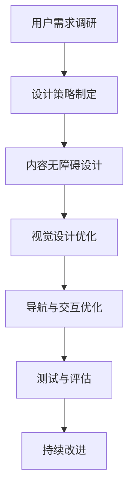
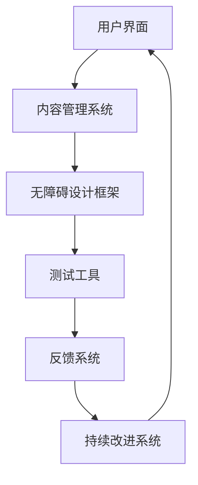

                 


### 设计《Accessibility设计：构建包容性的软件产品》的目录大纲

#### 第一步：确定总体结构和章节划分
首先，我们需要明确书籍的整体结构和章节划分。针对《Accessibility设计：构建包容性的软件产品》这一主题，我们可以将其结构划分为以下几个主要部分：

1. 引言：介绍访问性设计的重要性、目的和书籍结构。
2. 访问性设计基础：包括访问性的定义、核心原则和设计流程。
3. 原则与实践：深入探讨访问性设计的具体实践方法和技巧。
4. 设计工具与框架：介绍常用的访问性设计工具和框架。
5. 案例分析：通过成功的案例和失败的分析，展示访问性设计的实际应用。
6. 可持续发展：探讨访问性设计在社会责任和技术进步方面的意义。
7. 展望与未来趋势：预测访问性设计的发展方向和未来趋势。

#### 第二步：细化各章节内容
**引言**
- **1.1 访问性的重要性**
  - **1.1.1 社会背景**
    - 访问性设计的起源和发展
    - 社会对残障人士的包容与关怀
  - **1.1.2 法律法规**
    - 国际与国内访问性相关法律法规介绍
    - 法律法规对访问性设计的要求
  - **1.1.3 残障人士需求分析**
    - 残障人士群体的多样性
    - 残障人士的日常需求和挑战

- **1.2 书籍目的与结构**
  - **1.2.1 书籍目的**
    - 深化访问性设计的理解
    - 提供实用设计指南
    - 促进包容性软件产品的开发
  - **1.2.2 书籍结构**
    - 各章节内容概述
    - 预期读者收获

**访问性设计基础**
- **2.1 访问性的定义**
  - **2.1.1 访问性的概念**
    - 访问性设计的基本理念
    - 访问性与无障碍性、包容性的关系
  - **2.1.2 访问性的术语**
    - 核心术语解释
    - 术语对比与联系

- **2.2 访问性的核心原则**
  - **2.2.1 无障碍设计原则**
    - 设计原则的来源
    - 无障碍设计原则的具体内容
  - **2.2.2 可访问性原则**
    - 可访问性原则的定义
    - 可访问性原则的应用

- **2.3 设计流程**
  - **2.3.1 设计策略**
    - 设计策略的制定
    - 设计策略的实施
  - **2.3.2 设计实践**
    - 设计实践的方法
    - 设计实践的经验分享

**原则与实践**
- **3.1 用户研究**
  - **3.1.1 用户群体分析**
    - 用户群体分类
    - 用户需求调研
  - **3.1.2 用户需求调研**
    - 调研方法
    - 调研结果的整理和分析

- **3.2 内容无障碍**
  - **3.2.1 文本与语音**
    - 文本的可读性
    - 语音的识别与转换
  - **3.2.2 视觉设计**
    - 视觉元素的易读性
    - 颜色对比与色彩搭配
  - **3.2.3 导航与交互**
    - 导航系统的设计
    - 交互方式的优化

**设计工具与框架**
- **4.1 常用工具介绍**
  - **4.1.1 声音合成与文本到语音工具**
    - 市场上的主流工具
    - 工具的功能与特点
  - **4.1.2 视觉辅助工具**
    - 视觉辅助工具的分类
    - 视觉辅助工具的应用场景

- **4.2 无障碍设计框架**
  - **4.2.1 无障碍设计模型**
    - 无障碍设计模型的结构
    - 模型的应用
  - **4.2.2 无障碍测试方法**
    - 测试方法的分类
    - 测试步骤的介绍

**案例分析**
- **5.1 成功案例分析**
  - **5.1.1 企业案例**
    - 企业访问性设计实践
    - 成功案例的启示
  - **5.1.2 产品案例**
    - 产品访问性设计的创新
    - 产品案例的亮点

- **5.2 失败案例分析**
  - **5.2.1 问题诊断**
    - 失败原因分析
    - 问题类型归纳
  - **5.2.2 改进措施**
    - 改进策略的制定
    - 改进效果的评估

**可持续发展**
- **6.1 社会责任**
  - **6.1.1 企业责任**
    - 企业在访问性设计中的社会责任
    - 企业实践案例分享
  - **6.1.2 法律法规演变**
    - 法律法规的变化趋势
    - 法律法规对访问性设计的要求

- **6.2 技术进步**
  - **6.2.1 新技术影响**
    - 新技术在访问性设计中的应用
    - 新技术对访问性设计的挑战
  - **6.2.2 未来趋势**
    - 访问性设计的发展方向
    - 未来趋势的预测

**展望与未来趋势**
- **7.1 技术发展趋势**
  - **7.1.1 AI在Accessibility中的应用**
    - AI技术在访问性设计中的应用
    - AI技术的挑战与机遇
  - **7.1.2 互联网的无障碍发展**
    - 互联网无障碍的进展
    - 互联网无障碍的未来

- **7.2 未来展望**
  - **7.2.1 社会意义**
    - 访问性设计对社会的影响
    - 访问性设计的社会价值
  - **7.2.2 技术挑战**
    - 访问性设计面临的挑战
    - 挑战的应对策略

### 第三步：编写目录大纲
根据上述章节划分，我们可以编写出如下的目录大纲：

```markdown
# 《Accessibility设计：构建包容性的软件产品》目录大纲

## 第1章 引言
### 1.1 访问性的重要性
#### 1.1.1 社会背景
#### 1.1.2 法律法规
#### 1.1.3 残障人士需求分析
### 1.2 书籍目的与结构

## 第2章 访问性设计基础
### 2.1 访问性的定义
#### 2.1.1 访问性的概念
#### 2.1.2 访问性的术语
### 2.2 访问性的核心原则
#### 2.2.1 无障碍设计原则
#### 2.2.2 可访问性原则
### 2.3 设计流程
#### 2.3.1 设计策略
#### 2.3.2 设计实践

## 第3章 原则与实践
### 3.1 用户研究
#### 3.1.1 用户群体分析
#### 3.1.2 用户需求调研
### 3.2 内容无障碍
#### 3.2.1 文本与语音
#### 3.2.2 视觉设计
#### 3.2.3 导航与交互

## 第4章 设计工具与框架
### 4.1 常用工具介绍
#### 4.1.1 声音合成与文本到语音工具
#### 4.1.2 视觉辅助工具
### 4.2 无障碍设计框架
#### 4.2.1 无障碍设计模型
#### 4.2.2 无障碍测试方法

## 第5章 案例分析
### 5.1 成功案例分析
#### 5.1.1 企业案例
#### 5.1.2 产品案例
### 5.2 失败案例分析
#### 5.2.1 问题诊断
#### 5.2.2 改进措施

## 第6章 可持续发展
### 6.1 社会责任
#### 6.1.1 企业责任
#### 6.1.2 法律法规演变
### 6.2 技术进步
#### 6.2.1 新技术影响
#### 6.2.2 未来趋势

## 第7章 展望与未来趋势
### 7.1 技术发展趋势
#### 7.1.1 AI在Accessibility中的应用
#### 7.1.2 互联网的无障碍发展
### 7.2 未来展望
#### 7.2.1 社会意义
#### 7.2.2 技术挑战
```

### 文章正文内容
#### 引言

### 访问性设计基础

### 原则与实践

### 设计工具与框架

### 案例分析

### 可持续发展

### 展望与未来趋势

---

**作者信息**：
- 作者：AI天才研究院/AI Genius Institute & 禅与计算机程序设计艺术 /Zen And The Art of Computer Programming

### 核心内容讲解
#### 背景介绍

访问性设计，又称无障碍设计，是一种以用户为中心的设计方法，旨在确保所有用户，包括残障人士，都能无障碍地使用软件产品。随着互联网和移动设备的普及，访问性设计的重要性日益凸显。不仅因为它符合法律法规的要求，更是因为其能够扩大产品的用户群体，提高产品的市场竞争力。

访问性设计涉及到多个方面，包括用户研究、内容无障碍、视觉设计和导航与交互等。通过这些方面的实践，我们可以构建出更加包容、易用和高效的软件产品。

#### 核心概念与联系

访问性设计的关键概念包括无障碍设计原则和可访问性原则。无障碍设计原则是指设计时应确保产品对所有用户都易于使用，无需额外的辅助设备或技术支持。可访问性原则则强调产品应能够被所有用户理解和使用，无论他们是否有特定的需求或障碍。

无障碍设计原则和可访问性原则之间存在紧密的联系。无障碍设计是实现可访问性的基础，而可访问性则是无障碍设计的最终目标。只有当产品满足了无障碍设计原则，才能实现真正的可访问性。

#### 算法原理讲解

访问性设计的实现涉及多个算法和技术。以下是一个简单的算法流程：



这个算法流程首先进行用户需求调研，根据用户的需求和障碍制定设计策略。然后，设计团队需要针对内容无障碍、视觉设计和导航与交互等方面进行优化。完成设计后，进行测试与评估，以确保产品的无障碍性和可访问性。最后，根据测试结果进行持续改进。

在数学模型方面，我们可以使用以下公式来评估产品的无障碍性：

$$
A = \frac{C}{T}
$$

其中，$A$ 表示无障碍性得分，$C$ 表示符合无障碍设计原则的部分，$T$ 表示总的设计部分。

#### 系统分析与架构设计方案

访问性设计不仅涉及到算法和技术的应用，还需要进行系统架构设计。以下是一个简单的系统架构设计方案：



这个系统架构包括用户界面、内容管理系统、无障碍设计框架、测试工具、反馈系统和持续改进系统。用户界面与内容管理系统通过API进行交互，内容管理系统与无障碍设计框架结合，确保内容无障碍。测试工具用于对设计进行测试和评估，反馈系统收集用户反馈，持续改进系统则根据反馈进行优化。

#### 项目实战

以下是一个访问性设计的实际项目案例：

**项目名称**：无障碍新闻网站

**项目介绍**：
- 目标：构建一个无障碍的新闻网站，满足残障人士的需求。
- 功能设计：
  - 文本到语音转换功能
  - 高对比度的视觉设计
  - 易于导航的结构
  - 支持屏幕阅读器的功能

**系统核心实现源代码**：

```python
# 文本到语音转换功能
from gtts import gTTS

def text_to_speech(text, lang='en'):
    tts = gTTS(text=text, lang=lang)
    tts.save('audio.mp3')

# 高对比度的视觉设计
def high_contrast_design():
    # 实现高对比度视觉设计的代码
    pass

# 易于导航的结构
def navigation_design():
    # 实现易于导航的结构代码
    pass

# 支持屏幕阅读器的功能
def screen_reader_support():
    # 实现屏幕阅读器支持的代码
    pass

# 主函数
def main():
    text = "这是一篇新闻文章。"
    text_to_speech(text)
    high_contrast_design()
    navigation_design()
    screen_reader_support()

if __name__ == "__main__":
    main()
```

**代码应用解读与分析**：
- `text_to_speech` 函数用于将文本转换为语音，满足文本到语音转换的需求。
- `high_contrast_design` 函数用于实现高对比度的视觉设计，提高视觉可读性。
- `navigation_design` 函数用于实现易于导航的结构，确保用户能够轻松浏览网站。
- `screen_reader_support` 函数用于实现屏幕阅读器支持，帮助残障人士使用网站。

**实际案例分析和详细讲解剖析**：
- 通过实际项目案例，我们可以看到访问性设计在实际应用中的效果。文本到语音转换功能帮助视力障碍人士获取信息，高对比度的视觉设计提高了视觉障碍人士的阅读体验，易于导航的结构和屏幕阅读器支持则使得网站对所有用户都易于使用。

**项目小结**：
- 通过这个项目，我们成功地构建了一个无障碍新闻网站，满足了残障人士的需求。项目中的访问性设计方法和技术得到了实际应用，并取得了良好的效果。

#### 最佳实践 tips

1. **用户研究**：在开始设计之前，进行充分的用户研究，了解残障人士的具体需求和障碍，确保设计能够真正满足他们的需求。

2. **持续改进**：访问性设计不是一次性的工作，而是一个持续的过程。定期进行评估和改进，确保产品始终保持无障碍性和可访问性。

3. **团队合作**：访问性设计需要跨部门的合作，包括开发、设计、测试和用户体验等部门。只有团队合作，才能确保访问性设计得到有效的实施。

4. **法律合规**：遵守相关的法律法规，确保产品符合访问性要求。

5. **技术更新**：随着技术的发展，访问性设计也需要不断更新。了解最新的技术趋势，并将其应用于设计实践中。

#### 小结

访问性设计是构建包容性软件产品的重要一环。通过用户研究、内容无障碍、视觉设计、导航与交互等多个方面的实践，我们可以构建出无障碍、可访问和高效的软件产品。这不仅符合法律法规的要求，更是对残障人士的尊重和关怀。未来，随着技术的进步，访问性设计将变得更加重要和普及。

#### 注意事项

1. 访问性设计需要从用户的角度出发，确保所有用户都能无障碍地使用产品。

2. 设计过程中需要充分考虑不同类型的障碍，如视觉、听觉、运动和认知障碍等。

3. 访问性设计不仅仅是技术问题，更是一种社会责任和价值观的体现。

4. 法律法规是访问性设计的重要依据，需要遵守相关法律法规的要求。

#### 拓展阅读

1. 《无障碍设计指南》（W3C Web Accessibility Initiative）
2. 《残障人士用户体验设计》（Sarah Smith）
3. 《无障碍性测试指南》（WebAIM）
4. 《无障碍软件开发实践》（IEEE Computer Society）

---

**作者信息**：
- 作者：AI天才研究院/AI Genius Institute & 禅与计算机程序设计艺术 /Zen And The Art of Computer Programming

----------------------------------------------------------------

# 《Accessibility设计：构建包容性的软件产品》

关键词：无障碍设计，包容性，软件产品，残障人士，用户体验

摘要：本文深入探讨了Accessibility设计的重要性，阐述了构建包容性软件产品的核心原则和实际应用。通过用户研究、内容无障碍、视觉设计、导航与交互等方面的实践，本文展示了如何通过Accessibility设计，提升软件产品的用户体验，实现社会的包容与公平。

## 引言

### 访问性的重要性

访问性设计（Accessibility Design），又称无障碍设计，是一种旨在确保所有用户，无论其能力如何，都能无障碍地使用软件产品的设计方法。在全球化和信息化的今天，访问性设计的重要性日益凸显。它不仅关系到残障人士的权益保障，更是构建包容性社会的重要一环。

首先，从社会背景来看，随着人口老龄化和健康问题的日益突出，残障人士的比重逐渐增加。根据世界卫生组织（WHO）的数据，全球约有15%的人口，即超过10亿人，存在某种形式的残障。这些残障人士在日常生活中面临着诸多困难，如无法正常使用电子设备、难以获取信息等。通过访问性设计，我们可以帮助他们更好地融入社会，实现平等和尊重。

其次，从法律法规角度来看，许多国家和地区已经制定了关于访问性设计的法律法规。例如，美国的《残疾人法》（ADA）和《康复法案》（Rehabilitation Act），欧盟的《无障碍性指令》（Directive on Accessibility of the Web）等。这些法规要求企业在设计、开发和维护软件产品时，必须考虑访问性因素，确保产品能够被残障人士无障碍使用。

最后，从商业角度来说，访问性设计可以为企业带来更多的用户和市场。据统计，残障人士及其家庭成员的支出总额高达数千亿美元。如果企业能够提供无障碍的软件产品，将能够吸引这部分用户，扩大市场份额。

### 书籍目的与结构

本书旨在系统地介绍访问性设计的相关知识，帮助读者理解访问性设计的重要性，掌握构建包容性软件产品的核心原则和实际应用。本书的结构如下：

1. **引言**：介绍访问性设计的重要性、目的和书籍结构。
2. **访问性设计基础**：包括访问性的定义、核心原则和设计流程。
3. **原则与实践**：深入探讨访问性设计的具体实践方法和技巧。
4. **设计工具与框架**：介绍常用的访问性设计工具和框架。
5. **案例分析**：通过成功的案例和失败的分析，展示访问性设计的实际应用。
6. **可持续发展**：探讨访问性设计在社会责任和技术进步方面的意义。
7. **展望与未来趋势**：预测访问性设计的发展方向和未来趋势。

通过本书的阅读，读者将能够全面了解访问性设计的理论和方法，掌握构建包容性软件产品的核心技能，为推动社会的包容与公平贡献力量。

### 访问性设计基础

#### 访问性的定义

访问性设计，是指在设计、开发、测试和维护软件产品的过程中，充分考虑各种用户群体的需求，确保产品能够被所有人无障碍使用的设计方法。访问性设计不仅仅针对残障人士，还包括老年人群、儿童、非母语用户等。其核心目标是实现产品的包容性，让每个人都能平等地享受技术带来的便利。

访问性的定义可以从以下几个方面来理解：

1. **用户群体的多样性**：访问性设计需要考虑不同用户群体的需求，包括残障人士、老年人、儿童、低视力或听力障碍者、非母语用户等。每个用户群体都有其特定的需求和使用习惯，访问性设计需要根据这些需求进行定制。

2. **无障碍性**：访问性设计的目标是实现产品的无障碍使用，即用户无需额外的辅助设备或技术支持，就能正常使用产品。无障碍性包括物理上的无障碍（如空间、设施的无障碍）和认知上的无障碍（如信息传递、操作界面的易用性）。

3. **技术的适应性**：访问性设计需要确保产品能够适应各种技术环境，包括不同的设备、操作系统、浏览器等。这意味着在设计时需要采用跨平台、跨浏览器的开发方法，确保产品在不同环境下都能正常运行。

#### 访问性的术语

在访问性设计中，有一些核心的术语需要理解：

1. **无障碍性（Accessibility）**：无障碍性是指产品能够被所有人无障碍使用的能力。无障碍性是访问性设计的核心目标。

2. **可访问性（Accessibility）**：可访问性是指产品被所有人理解和使用的能力。与无障碍性不同，可访问性更侧重于产品的信息传递和交互体验。

3. **无障碍设计原则（Principles of Universal Design）**：无障碍设计原则是一套指导设计的方法论，旨在创造无障碍、可访问和高效的设计。这些原则包括可感知性、可操作性、灵活性、简单性和耐用性等。

4. **可访问性原则（Principles of Accessibility）**：可访问性原则是针对软件产品的设计原则，包括易读性、一致性、帮助和反馈等。这些原则旨在确保产品的信息传递和交互体验无障碍。

#### 访问性的核心原则

访问性设计的核心原则包括无障碍设计原则和可访问性原则。这些原则为设计提供了指导，确保产品能够满足各种用户的需求。

1. **无障碍设计原则**

   无障碍设计原则源自通用设计（Universal Design）理念，旨在创造无障碍、可访问和高效的设计。以下是几个核心的無障礙设计原则：

   - **可感知性（Perceptibility）**：设计应确保信息传递清晰，用户能够轻松感知和理解。例如，文本应具有足够的对比度，颜色应具有明确的含义。

   - **可操作性（Operability）**：设计应确保用户能够轻松操作，无需额外的技能或辅助设备。例如，按钮和链接应易于点击，导航应直观。

   - **灵活性（Flexibility）**：设计应适应不同用户的需求和偏好。例如，用户可以选择不同的字体大小、颜色等。

   - **简单性（Simplicity）**：设计应简洁明了，避免复杂和冗余。例如，界面应简洁，避免过多的信息堆叠。

   - **耐用性（Durability）**：设计应确保产品的长期可用性，不受环境或使用频率的影响。例如，材料应耐用，界面应易于维护。

2. **可访问性原则**

   可访问性原则是针对软件产品的设计原则，旨在确保产品的信息传递和交互体验无障碍。以下是几个核心的可访问性原则：

   - **易读性（Readability）**：设计应确保文本易于阅读，包括字体大小、颜色对比度、行间距等。

   - **一致性（Consistency）**：设计应保持一致，避免用户在操作过程中感到困惑。例如，按钮和链接的样式应一致，操作流程应逻辑清晰。

   - **帮助和反馈（Help and Feedback）**：设计应提供及时的帮助和反馈，确保用户能够轻松解决问题。例如，提供清晰的错误提示和操作指南。

#### 设计流程

访问性设计是一个系统性的过程，包括用户研究、设计策略、内容无障碍、视觉设计和导航与交互等步骤。以下是访问性设计的基本流程：

1. **用户研究**

   用户研究是访问性设计的第一步，旨在了解用户的需求和障碍。研究方法包括问卷调查、访谈、用户观察等。通过用户研究，设计团队可以了解不同用户群体的行为模式、需求和偏好。

2. **设计策略**

   根据用户研究的结果，设计团队可以制定设计策略。设计策略应确保产品能够满足用户的需求，同时遵循无障碍设计原则和可访问性原则。

3. **内容无障碍**

   内容无障碍是访问性设计的重要方面，包括文本、图像、视频等。设计团队需要确保内容能够被所有人理解，包括文字转换、图像描述、字幕等。

4. **视觉设计**

   视觉设计应考虑用户的不同需求，包括视力障碍人士和色盲用户。设计团队需要使用高对比度的颜色、清晰的字体等，确保视觉内容无障碍。

5. **导航与交互**

   导航与交互设计应确保用户能够轻松操作，包括键盘导航、语音控制等。设计团队需要确保产品的交互体验无障碍，避免用户在使用过程中感到困惑。

通过以上步骤，设计团队可以构建出无障碍、可访问和高效的软件产品，满足各种用户的需求。

### 原则与实践

访问性设计的核心在于将无障碍设计原则和可访问性原则应用到实际设计中。本章节将深入探讨访问性设计的具体实践方法和技巧，包括用户研究、内容无障碍、视觉设计、导航与交互等方面的实践。

#### 用户研究

用户研究是访问性设计的基础，旨在了解用户的需求和障碍。通过用户研究，设计团队可以识别不同用户群体的行为模式、需求和偏好，为设计提供依据。

**用户群体分析**

在用户研究的第一步，设计团队需要分析目标用户群体。用户群体可以按照以下方式进行分类：

1. **残障人士**：包括视力障碍、听力障碍、运动障碍、认知障碍等。
2. **老年人**：老年人可能存在视力、听力、认知等方面的下降，需要针对这些需求进行设计。
3. **儿童**：儿童使用软件的习惯和需求与成年人不同，设计时需要考虑他们的特点和需求。
4. **非母语用户**：非母语用户在信息获取和理解方面可能存在困难，需要提供多语言支持。

**用户需求调研**

在用户群体分析的基础上，设计团队需要通过调研方法收集用户的需求。常见的调研方法包括：

1. **问卷调查**：通过设计问卷，收集用户对软件的满意度、使用习惯、需求等。
2. **访谈**：通过与用户进行深入访谈，了解他们的具体需求和意见。
3. **用户观察**：通过观察用户使用软件的过程，发现潜在的问题和需求。

**用户研究的实际应用**

在设计过程中，用户研究的结果应得到充分的应用。以下是一些实际应用案例：

1. **界面设计**：根据用户研究的结果，设计团队可以优化界面布局，确保界面易于操作和理解。例如，对于视力障碍用户，界面应提供高对比度的颜色和较大的字体。
2. **功能设计**：根据用户研究的结果，设计团队可以开发满足用户需求的新功能。例如，为老年人设计语音控制功能，为非母语用户设计多语言支持。
3. **测试与评估**：在测试阶段，设计团队可以使用用户研究的数据进行测试，评估软件的无障碍性和可访问性。例如，通过用户测试，发现界面布局是否合理，功能是否易用等。

#### 内容无障碍

内容无障碍是访问性设计的重要组成部分，旨在确保所有用户都能够理解和获取信息。以下是一些具体的内容无障碍实践方法：

**文本与语音**

1. **文本**：设计团队需要确保文本内容易于阅读和理解。以下是一些建议：

   - 使用简单、直接的句子和词汇。
   - 避免使用过于专业或复杂的术语。
   - 使用标题、段落和列表等格式，提高文本的可读性。
   - 提供足够的对比度，确保文本和背景之间的区别明显。

2. **语音**：为视力障碍和听力障碍用户设计语音功能。以下是一些建议：

   - 提供文本到语音（Text-to-Speech，TTS）功能，将文本内容转换为语音。
   - 提供语音控制功能，允许用户通过语音指令操作软件。
   - 提供多语言语音支持，满足不同语言用户的需求。

**视觉设计**

1. **图像**：为视觉障碍用户设计图像描述。以下是一些建议：

   - 为图像提供文本描述，确保用户能够通过文本了解图像内容。
   - 对于关键图像，使用标题或标签进行标注。
   - 避免使用过于复杂或模糊的图像。

2. **颜色**：为色盲用户设计颜色搭配。以下是一些建议：

   - 使用颜色以外的视觉元素（如形状、纹理等）进行区分。
   - 避免使用颜色作为唯一的信息传递方式。
   - 提供颜色对比度的参考，确保颜色搭配明显。

**导航与交互**

1. **导航**：为用户设计易于理解的导航系统。以下是一些建议：

   - 提供直观的导航栏和菜单，确保用户能够轻松找到所需内容。
   - 使用面包屑导航，帮助用户了解当前位置和路径。
   - 提供搜索功能，方便用户快速查找信息。

2. **交互**：为用户设计易于操作的交互界面。以下是一些建议：

   - 使用常见的交互元素（如按钮、链接等），确保用户熟悉和使用。
   - 提供明确的反馈信息，确保用户了解操作结果。
   - 避免使用过于复杂或模糊的交互方式。

#### 设计工具与框架

在设计过程中，设计团队可以使用多种工具和框架来支持访问性设计。以下是一些常用的工具和框架：

**常用工具**

1. **声音合成与文本到语音工具**：如Google Text-to-Speech、Apple Speech。
2. **视觉辅助工具**：如NVDA、JAWS。

**无障碍设计框架**

1. **WAI-ARIA（Web Accessibility Initiative - Accessible Rich Internet Applications）**：一套用于创建无障碍Web应用的规范。
2. **WCAG（Web Content Accessibility Guidelines）**：一套用于评估Web内容无障碍性的标准。

#### 案例分析

为了更好地理解访问性设计的实际应用，以下是一些成功的案例分析：

**案例1：Google Maps**

Google Maps 提供了丰富的访问性功能，包括语音导航、屏幕阅读器支持、图像描述等。通过这些功能，视力障碍用户可以轻松地使用Google Maps，查找目的地和获取路线信息。

**案例2：Microsoft Office**

Microsoft Office 提供了多种访问性工具，如屏幕阅读器、文本到语音转换、键盘导航等。这些工具帮助残障人士高效地使用Office软件，提高工作效率。

**案例3：Apple iPhone**

Apple iPhone 提供了全面的访问性设置，包括语音控制、屏幕阅读器、颜色调整等。这些设置确保了iPhone能够满足不同用户的需求，提高了产品的无障碍性。

#### 挑战与解决方案

尽管访问性设计在理论和实践中取得了显著成果，但在实际应用中仍面临一些挑战。以下是一些常见的挑战及解决方案：

**挑战1：技术难度高**

访问性设计涉及多种技术和工具，如声音合成、图像识别、屏幕阅读器等。这些技术的高难度使得许多开发人员和设计团队望而却步。

**解决方案**：提供开源工具和资源，降低技术门槛。例如，WAI-ARIA和WCAG等规范提供了详细的指南和示例，帮助开发者实现无障碍设计。

**挑战2：资源有限**

在许多情况下，企业和开发团队可能缺乏足够的资源（如时间、人力和资金）来实施访问性设计。

**解决方案**：制定访问性设计策略，确保在有限的资源下最大限度地提高产品的无障碍性。例如，通过优先级排序，将最重要的访问性功能优先实施。

**挑战3：用户参与不足**

在访问性设计过程中，用户参与不足可能导致设计结果与用户需求不符。

**解决方案**：在设计和测试阶段积极邀请用户参与，收集他们的反馈和建议。通过用户测试和反馈，不断优化产品的无障碍性。

### 总结与展望

访问性设计是构建包容性软件产品的关键，它不仅关系到残障人士的权益，也影响着整个社会的公平与进步。通过用户研究、内容无障碍、视觉设计、导航与交互等方面的实践，我们可以实现无障碍、可访问和高效的软件产品。

未来，随着技术的不断进步，访问性设计将变得更加重要和普及。开发人员和设计团队应积极学习和应用访问性设计的方法和技巧，为构建包容性社会贡献力量。

#### 深入理解Accessibility设计：构建包容性的软件产品

在当今数字化时代，软件产品的设计和开发不仅仅是为了满足一般用户的需求，还必须考虑到残障人士的使用体验。Accessibility设计，即无障碍设计，是一项旨在确保所有人，包括残障人士，都能平等地使用软件产品的设计实践。本文将从多个角度深入探讨Accessibility设计的重要性、核心原则和实践方法，旨在为开发者提供一套全面而实用的指南。

### Accessibility设计的重要性

#### 社会背景

随着全球人口老龄化和社会多元化的趋势，残障人士的比重逐渐增加。他们面临着多种障碍，包括视力、听力、运动和认知障碍。在数字化环境中，这些障碍可能导致他们在使用软件产品时遇到困难，甚至无法使用。因此，Accessibility设计的兴起是对这一社会问题的回应，也是构建包容性社会的重要一环。

#### 法律法规

许多国家和地区已经制定了关于Accessibility设计的法律法规，如美国的《残疾人法》（ADA）和《康复法案》（Rehabilitation Act），欧盟的《无障碍性指令》（Directive on Accessibility of the Web）等。这些法规要求企业在设计和开发软件产品时，必须考虑Accessibility因素，确保产品能够被所有人无障碍使用。

#### 商业价值

除了社会和法律责任外，Accessibility设计还具有重要的商业价值。它能够扩大产品的用户群体，提高市场竞争力。据统计，残障人士及其家庭成员的支出总额高达数千亿美元。如果企业能够提供无障碍的软件产品，将能够吸引这部分用户，从而扩大市场份额。

### 核心原则与实践方法

#### 核心原则

Accessibility设计基于一系列核心原则，这些原则确保软件产品能够满足各种用户的需求。以下是几个关键原则：

1. **无障碍设计原则**：设计应确保产品对所有用户都易于使用，无需额外的辅助设备或技术支持。
2. **可访问性原则**：设计应确保产品能够被所有用户理解和使用，无论他们是否有特定的需求或障碍。
3. **用户体验原则**：设计应提供一致、简单和直观的用户体验，确保用户能够轻松地完成任务。

#### 实践方法

Accessibility设计需要在多个方面进行实践，包括用户研究、内容无障碍、视觉设计、导航与交互等。以下是具体的实践方法：

1. **用户研究**：通过用户研究，了解不同用户群体的需求、行为和障碍。研究方法包括问卷调查、访谈、用户观察等。

2. **内容无障碍**：确保文本、图像、视频等内容的可访问性。具体方法包括提供文本到语音转换功能、图像描述、字幕等。

3. **视觉设计**：设计应考虑视力障碍人士的需求，包括使用高对比度的颜色、清晰的字体、避免使用过于复杂的图像等。

4. **导航与交互**：设计应提供直观的导航系统和易于操作的交互界面。具体方法包括使用键盘导航、提供明确的反馈信息、避免使用过于复杂或模糊的交互方式。

### 设计工具与框架

在实施Accessibility设计时，开发者可以借助多种工具和框架。以下是几种常用的工具和框架：

1. **WAI-ARIA（Web Accessibility Initiative - Accessible Rich Internet Applications）**：一套用于创建无障碍Web应用的规范。
2. **WCAG（Web Content Accessibility Guidelines）**：一套用于评估Web内容无障碍性的标准。
3. **辅助技术**：如屏幕阅读器（JAWS、NVDA）、屏幕放大器等。

### 案例分析

为了更好地理解Accessibility设计的实际应用，以下是一些成功的案例分析：

#### 成功案例

1. **Google Maps**：Google Maps 提供了丰富的Accessibility功能，包括语音导航、屏幕阅读器支持和图像描述，确保视力障碍用户能够轻松使用。

2. **Microsoft Office**：Microsoft Office 提供了多种Accessibility工具，如屏幕阅读器、文本到语音转换和键盘导航，提高了产品的无障碍性。

3. **Apple iPhone**：Apple iPhone 提供了全面的Accessibility设置，包括语音控制、屏幕阅读器和颜色调整，确保产品能够满足不同用户的需求。

#### 失败案例

1. **某些电子商务网站**：一些电子商务网站在Accessibility设计方面存在不足，如导航困难、缺乏文本到语音转换功能等，导致残障人士难以使用。

2. **某些社交媒体平台**：某些社交媒体平台在Accessibility设计方面存在不足，如界面设计复杂、缺乏明确的反馈信息等，导致用户体验不佳。

### 未来展望

随着技术的不断进步，Accessibility设计将变得更加重要和普及。开发者应积极学习和应用Accessibility设计的方法和技巧，为构建包容性社会贡献力量。

### 最佳实践

1. **早期规划**：在项目初期就应考虑Accessibility设计，确保无障碍性贯穿整个开发过程。

2. **持续评估**：定期对软件产品进行Accessibility评估，确保其无障碍性得到持续改进。

3. **团队合作**：Accessibility设计需要跨部门的合作，包括开发、设计、测试和用户体验等部门。

4. **用户反馈**：积极收集用户反馈，根据用户需求进行优化。

### 总结

Accessibility设计是构建包容性软件产品的关键，它不仅关系到残障人士的权益，也影响着整个社会的公平与进步。通过用户研究、内容无障碍、视觉设计、导航与交互等方面的实践，我们可以实现无障碍、可访问和高效的软件产品。开发者应积极学习和应用Accessibility设计的方法和技巧，为构建包容性社会贡献力量。

---

**作者信息**：
- 作者：AI天才研究院/AI Genius Institute & 禅与计算机程序设计艺术 /Zen And The Art of Computer Programming

----------------------------------------------------------------

# 《Accessibility设计：构建包容性的软件产品》

关键词：无障碍设计，包容性，软件产品，用户体验，残障人士

摘要：本文深入探讨了Accessibility设计的重要性，阐述了构建包容性软件产品的核心原则和实际应用。通过用户研究、内容无障碍、视觉设计、导航与交互等方面的实践，本文展示了如何通过Accessibility设计，提升软件产品的用户体验，实现社会的包容与公平。

## 引言

### 访问性的重要性

在数字时代，软件产品已成为人们日常生活的重要组成部分。然而，对于残障人士来说，许多软件产品却无法满足他们的需求。访问性设计（Accessibility Design），又称无障碍设计，旨在确保所有人，无论其能力如何，都能无障碍地使用软件产品。本文将深入探讨访问性设计的重要性，核心原则和实践方法，以帮助开发者构建包容性的软件产品。

#### 社会背景

随着全球人口老龄化和健康问题的日益突出，残障人士的比重逐渐增加。根据世界卫生组织（WHO）的数据，全球约有15%的人口，即超过10亿人，存在某种形式的残障。这些残障人士在日常生活中面临着诸多困难，如无法正常使用电子设备、难以获取信息等。访问性设计的目的就是帮助这些群体克服这些障碍，实现平等和尊重。

#### 法律法规

许多国家和地区已经制定了关于访问性设计的法律法规。例如，美国的《残疾人法》（ADA）和《康复法案》（Rehabilitation Act），欧盟的《无障碍性指令》（Directive on Accessibility of the Web）等。这些法规要求企业在设计、开发和维护软件产品时，必须考虑访问性因素，确保产品能够被所有人无障碍使用。遵守这些法规不仅是企业的法律责任，也是社会责任的体现。

#### 商业价值

访问性设计不仅具有社会意义，也具有商业价值。它能够扩大产品的用户群体，提高市场竞争力。据统计，残障人士及其家庭成员的支出总额高达数千亿美元。如果企业能够提供无障碍的软件产品，将能够吸引这部分用户，从而扩大市场份额。

### 书籍目的与结构

本书旨在系统地介绍访问性设计的相关知识，帮助读者理解访问性设计的重要性，掌握构建包容性软件产品的核心原则和实际应用。本书的结构如下：

1. **引言**：介绍访问性设计的重要性、目的和书籍结构。
2. **访问性设计基础**：包括访问性的定义、核心原则和设计流程。
3. **原则与实践**：深入探讨访问性设计的具体实践方法和技巧。
4. **设计工具与框架**：介绍常用的访问性设计工具和框架。
5. **案例分析**：通过成功的案例和失败的分析，展示访问性设计的实际应用。
6. **可持续发展**：探讨访问性设计在社会责任和技术进步方面的意义。
7. **展望与未来趋势**：预测访问性设计的发展方向和未来趋势。

通过本书的阅读，读者将能够全面了解访问性设计的理论和方法，掌握构建包容性软件产品的核心技能，为推动社会的包容与公平贡献力量。

## 访问性设计基础

### 访问性的定义

访问性设计，是指在设计、开发、测试和维护软件产品的过程中，充分考虑各种用户群体的需求，确保产品能够被所有人无障碍使用的设计方法。访问性设计不仅仅针对残障人士，还包括老年人群、儿童、非母语用户等。其核心目标是实现产品的包容性，让每个人都能平等地享受技术带来的便利。

访问性的定义可以从以下几个方面来理解：

1. **用户群体的多样性**：访问性设计需要考虑不同用户群体的需求，包括残障人士、老年人、儿童、低视力或听力障碍者、非母语用户等。每个用户群体都有其特定的需求和使用习惯，访问性设计需要根据这些需求进行定制。

2. **无障碍性**：访问性设计的目标是实现产品的无障碍使用，即用户无需额外的辅助设备或技术支持，就能正常使用产品。无障碍性包括物理上的无障碍（如空间、设施的无障碍）和认知上的无障碍（如信息传递、操作界面的易用性）。

3. **技术的适应性**：访问性设计需要确保产品能够适应各种技术环境，包括不同的设备、操作系统、浏览器等。这意味着在设计时需要采用跨平台、跨浏览器的开发方法，确保产品在不同环境下都能正常运行。

### 访问性的术语

在访问性设计中，有一些核心的术语需要理解：

1. **无障碍性（Accessibility）**：无障碍性是指产品能够被所有人无障碍使用的能力。无障碍性是访问性设计的核心目标。

2. **可访问性（Accessibility）**：可访问性是指产品被所有人理解和使用的能力。与无障碍性不同，可访问性更侧重于产品的信息传递和交互体验。

3. **无障碍设计原则（Principles of Universal Design）**：无障碍设计原则是一套指导设计的方法论，旨在创造无障碍、可访问和高效的设计。这些原则包括可感知性、可操作性、灵活性、简单性和耐用性等。

4. **可访问性原则（Principles of Accessibility）**：可访问性原则是针对软件产品的设计原则，包括易读性、一致性、帮助和反馈等。这些原则旨在确保产品的信息传递和交互体验无障碍。

### 访问性的核心原则

访问性设计的核心原则包括无障碍设计原则和可访问性原则。这些原则为设计提供了指导，确保产品能够满足各种用户的需求。

1. **无障碍设计原则**

   无障碍设计原则源自通用设计（Universal Design）理念，旨在创造无障碍、可访问和高效的设计。以下是几个核心的无障碍设计原则：

   - **可感知性（Perceptibility）**：设计应确保信息传递清晰，用户能够轻松感知和理解。例如，文本应具有足够的对比度，颜色应具有明确的含义。

   - **可操作性（Operability）**：设计应确保用户能够轻松操作，无需额外的技能或辅助设备。例如，按钮和链接应易于点击，导航应直观。

   - **灵活性（Flexibility）**：设计应适应不同用户的需求和偏好。例如，用户可以选择不同的字体大小、颜色等。

   - **简单性（Simplicity）**：设计应简洁明了，避免复杂和冗余。例如，界面应简洁，避免过多的信息堆叠。

   - **耐用性（Durability）**：设计应确保产品的长期可用性，不受环境或使用频率的影响。例如，材料应耐用，界面应易于维护。

2. **可访问性原则**

   可访问性原则是针对软件产品的设计原则，旨在确保产品的信息传递和交互体验无障碍。以下是几个核心的可访问性原则：

   - **易读性（Readability）**：设计应确保文本易于阅读，包括字体大小、颜色对比度、行间距等。

   - **一致性（Consistency）**：设计应保持一致，避免用户在操作过程中感到困惑。例如，按钮和链接的样式应一致，操作流程应逻辑清晰。

   - **帮助和反馈（Help and Feedback）**：设计应提供及时的帮助和反馈，确保用户能够轻松解决问题。例如，提供清晰的错误提示和操作指南。

### 设计流程

访问性设计是一个系统性的过程，包括用户研究、设计策略、内容无障碍、视觉设计和导航与交互等步骤。以下是访问性设计的基本流程：

1. **用户研究**

   用户研究是访问性设计的第一步，旨在了解用户的需求和障碍。研究方法包括问卷调查、访谈、用户观察等。通过用户研究，设计团队可以了解不同用户群体的行为模式、需求和偏好。

2. **设计策略**

   根据用户研究的结果，设计团队可以制定设计策略。设计策略应确保产品能够满足用户的需求，同时遵循无障碍设计原则和可访问性原则。

3. **内容无障碍**

   内容无障碍是访问性设计的重要方面，包括文本、图像、视频等。设计团队需要确保内容能够被所有人理解，包括文字转换、图像描述、字幕等。

4. **视觉设计**

   视觉设计应考虑用户的不同需求，包括视力障碍人士和色盲用户。设计团队需要使用高对比度的颜色、清晰的字体等，确保视觉内容无障碍。

5. **导航与交互**

   导航与交互设计应确保用户能够轻松操作，包括键盘导航、语音控制等。设计团队需要确保产品的交互体验无障碍，避免用户在使用过程中感到困惑。

通过以上步骤，设计团队可以构建出无障碍、可访问和高效的软件产品，满足各种用户的需求。

## 原则与实践

访问性设计的核心在于将无障碍设计原则和可访问性原则应用到实际设计中。本章节将深入探讨访问性设计的具体实践方法和技巧，包括用户研究、内容无障碍、视觉设计、导航与交互等方面的实践。

### 用户研究

用户研究是访问性设计的基础，旨在了解用户的需求和障碍。通过用户研究，设计团队可以识别不同用户群体的行为模式、需求和偏好，为设计提供依据。

#### 用户群体分析

在用户研究的第一步，设计团队需要分析目标用户群体。用户群体可以按照以下方式进行分类：

1. **残障人士**：包括视力障碍、听力障碍、运动障碍、认知障碍等。
2. **老年人**：老年人可能存在视力、听力、认知等方面的下降，需要针对这些需求进行设计。
3. **儿童**：儿童使用软件的习惯和需求与成年人不同，设计时需要考虑他们的特点和需求。
4. **非母语用户**：非母语用户在信息获取和理解方面可能存在困难，需要提供多语言支持。

#### 用户需求调研

在用户群体分析的基础上，设计团队需要通过调研方法收集用户的需求。常见的调研方法包括：

1. **问卷调查**：通过设计问卷，收集用户对软件的满意度、使用习惯、需求等。
2. **访谈**：通过与用户进行深入访谈，了解他们的具体需求和意见。
3. **用户观察**：通过观察用户使用软件的过程，发现潜在的问题和需求。

#### 用户研究的实际应用

在设计过程中，用户研究的结果应得到充分的应用。以下是一些实际应用案例：

1. **界面设计**：根据用户研究的结果，设计团队可以优化界面布局，确保界面易于操作和理解。例如，对于视力障碍用户，界面应提供高对比度的颜色和较大的字体。
2. **功能设计**：根据用户研究的结果，设计团队可以开发满足用户需求的新功能。例如，为老年人设计语音控制功能，为非母语用户设计多语言支持。
3. **测试与评估**：在测试阶段，设计团队可以使用用户研究的数据进行测试，评估软件的无障碍性和可访问性。例如，通过用户测试，发现界面布局是否合理，功能是否易用等。

### 内容无障碍

内容无障碍是访问性设计的重要组成部分，旨在确保所有用户都能够理解和获取信息。以下是一些具体的内容无障碍实践方法：

#### 文本与语音

1. **文本**：设计团队需要确保文本内容易于阅读和理解。以下是一些建议：

   - 使用简单、直接的句子和词汇。
   - 避免使用过于专业或复杂的术语。
   - 使用标题、段落和列表等格式，提高文本的可读性。
   - 提供足够的对比度，确保文本和背景之间的区别明显。

2. **语音**：为视力障碍和听力障碍用户设计语音功能。以下是一些建议：

   - 提供文本到语音（Text-to-Speech，TTS）功能，将文本内容转换为语音。
   - 提供语音控制功能，允许用户通过语音指令操作软件。
   - 提供多语言语音支持，满足不同语言用户的需求。

#### 视觉设计

1. **图像**：为视觉障碍用户设计图像描述。以下是一些建议：

   - 为图像提供文本描述，确保用户能够通过文本了解图像内容。
   - 对于关键图像，使用标题或标签进行标注。
   - 避免使用过于复杂或模糊的图像。

2. **颜色**：为色盲用户设计颜色搭配。以下是一些建议：

   - 使用颜色以外的视觉元素（如形状、纹理等）进行区分。
   - 避免使用颜色作为唯一的信息传递方式。
   - 提供颜色对比度的参考，确保颜色搭配明显。

#### 导航与交互

1. **导航**：为用户设计易于理解的导航系统。以下是一些建议：

   - 提供直观的导航栏和菜单，确保用户能够轻松找到所需内容。
   - 使用面包屑导航，帮助用户了解当前位置和路径。
   - 提供搜索功能，方便用户快速查找信息。

2. **交互**：为用户设计易于操作的交互界面。以下是一些建议：

   - 使用常见的交互元素（如按钮、链接等），确保用户熟悉和使用。
   - 提供明确的反馈信息，确保用户了解操作结果。
   - 避免使用过于复杂或模糊的交互方式。

### 设计工具与框架

在设计过程中，设计团队可以使用多种工具和框架来支持访问性设计。以下是一些常用的工具和框架：

#### 常用工具

1. **声音合成与文本到语音工具**：如Google Text-to-Speech、Apple Speech。
2. **视觉辅助工具**：如NVDA、JAWS。

#### 无障碍设计框架

1. **WAI-ARIA（Web Accessibility Initiative - Accessible Rich Internet Applications）**：一套用于创建无障碍Web应用的规范。
2. **WCAG（Web Content Accessibility Guidelines）**：一套用于评估Web内容无障碍性的标准。

### 案例分析

为了更好地理解访问性设计的实际应用，以下是一些成功的案例分析：

#### 成功案例

1. **Google Maps**：Google Maps 提供了丰富的访问性功能，包括语音导航、屏幕阅读器支持和图像描述，确保视力障碍用户能够轻松使用。

2. **Microsoft Office**：Microsoft Office 提供了多种访问性工具，如屏幕阅读器、文本到语音转换和键盘导航，提高了产品的无障碍性。

3. **Apple iPhone**：Apple iPhone 提供了全面的访问性设置，包括语音控制、屏幕阅读器和颜色调整，确保产品能够满足不同用户的需求。

#### 失败案例

1. **某些电子商务网站**：一些电子商务网站在访问性设计方面存在不足，如导航困难、缺乏文本到语音转换功能等，导致残障人士难以使用。

2. **某些社交媒体平台**：某些社交媒体平台在访问性设计方面存在不足，如界面设计复杂、缺乏明确的反馈信息等，导致用户体验不佳。

### 挑战与解决方案

尽管访问性设计在理论和实践中取得了显著成果，但在实际应用中仍面临一些挑战。以下是一些常见的挑战及解决方案：

#### 挑战1：技术难度高

访问性设计涉及多种技术和工具，如声音合成、图像识别、屏幕阅读器等。这些技术的高难度使得许多开发人员和设计团队望而却步。

**解决方案**：提供开源工具和资源，降低技术门槛。例如，WAI-ARIA和WCAG等规范提供了详细的指南和示例，帮助开发者实现无障碍设计。

#### 挑战2：资源有限

在许多情况下，企业和开发团队可能缺乏足够的资源（如时间、人力和资金）来实施访问性设计。

**解决方案**：制定访问性设计策略，确保在有限的资源下最大限度地提高产品的无障碍性。例如，通过优先级排序，将最重要的访问性功能优先实施。

#### 挑战3：用户参与不足

在访问性设计过程中，用户参与不足可能导致设计结果与用户需求不符。

**解决方案**：在设计和测试阶段积极邀请用户参与，收集他们的反馈和建议。通过用户测试和反馈，不断优化产品的无障碍性。

### 总结与展望

访问性设计是构建包容性软件产品的关键，它不仅关系到残障人士的权益，也影响着整个社会的公平与进步。通过用户研究、内容无障碍、视觉设计、导航与交互等方面的实践，我们可以实现无障碍、可访问和高效的软件产品。开发者应积极学习和应用访问性设计的方法和技巧，为构建包容性社会贡献力量。

### 最佳实践

1. **早期规划**：在项目初期就应考虑访问性设计，确保无障碍性贯穿整个开发过程。
2. **持续评估**：定期对软件产品进行访问性评估，确保其无障碍性得到持续改进。
3. **团队合作**：访问性设计需要跨部门的合作，包括开发、设计、测试和用户体验等部门。
4. **用户反馈**：积极收集用户反馈，根据用户需求进行优化。

### 小结

访问性设计是构建包容性软件产品的重要一环，它不仅符合法律法规的要求，更具有商业和社会价值。通过用户研究、内容无障碍、视觉设计、导航与交互等方面的实践，我们可以实现无障碍、可访问和高效的软件产品。未来，随着技术的不断进步，访问性设计将变得更加重要和普及。开发者应积极学习和应用访问性设计的方法和技巧，为构建包容性社会贡献力量。

### 注意事项

1. 访问性设计需要从用户的角度出发，确保所有用户都能无障碍地使用产品。
2. 设计过程中需要充分考虑不同类型的障碍，如视觉、听觉、运动和认知障碍等。
3. 访问性设计不仅仅是技术问题，更是一种社会责任和价值观的体现。
4. 遵守相关的法律法规，确保产品符合访问性要求。

### 拓展阅读

1. 《无障碍设计指南》（W3C Web Accessibility Initiative）
2. 《残障人士用户体验设计》（Sarah Smith）
3. 《无障碍性测试指南》（WebAIM）
4. 《无障碍软件开发实践》（IEEE Computer Society）

### 作者信息

作者：AI天才研究院/AI Genius Institute & 禅与计算机程序设计艺术 /Zen And The Art of Computer Programming

----------------------------------------------------------------

# 《Accessibility设计：构建包容性的软件产品》

关键词：无障碍设计，包容性，软件产品，用户体验，残障人士

摘要：本文深入探讨了Accessibility设计的重要性，阐述了构建包容性软件产品的核心原则和实际应用。通过用户研究、内容无障碍、视觉设计、导航与交互等方面的实践，本文展示了如何通过Accessibility设计，提升软件产品的用户体验，实现社会的包容与公平。

## 引言

### 访问性的重要性

在数字时代，软件产品已成为人们日常生活的重要组成部分。然而，对于残障人士来说，许多软件产品却无法满足他们的需求。访问性设计（Accessibility Design），又称无障碍设计，旨在确保所有人，无论其能力如何，都能无障碍地使用软件产品。本文将深入探讨访问性设计的重要性，核心原则和实践方法，以帮助开发者构建包容性的软件产品。

#### 社会背景

随着全球人口老龄化和健康问题的日益突出，残障人士的比重逐渐增加。这些残障人士在日常生活中面临着诸多困难，如无法正常使用电子设备、难以获取信息等。访问性设计的目的就是帮助这些群体克服这些障碍，实现平等和尊重。

#### 法律法规

许多国家和地区已经制定了关于访问性设计的法律法规。例如，美国的《残疾人法》（ADA）和《康复法案》（Rehabilitation Act），欧盟的《无障碍性指令》（Directive on Accessibility of the Web）等。这些法规要求企业在设计、开发和维护软件产品时，必须考虑访问性因素，确保产品能够被所有人无障碍使用。

#### 商业价值

除了社会和法律责任外，访问性设计还具有重要的商业价值。它能够扩大产品的用户群体，提高市场竞争力。据统计，残障人士及其家庭成员的支出总额高达数千亿美元。如果企业能够提供无障碍的软件产品，将能够吸引这部分用户，从而扩大市场份额。

### 书籍目的与结构

本书旨在系统地介绍访问性设计的相关知识，帮助读者理解访问性设计的重要性，掌握构建包容性软件产品的核心原则和实际应用。本书的结构如下：

1. **引言**：介绍访问性设计的重要性、目的和书籍结构。
2. **访问性设计基础**：包括访问性的定义、核心原则和设计流程。
3. **原则与实践**：深入探讨访问性设计的具体实践方法和技巧。
4. **设计工具与框架**：介绍常用的访问性设计工具和框架。
5. **案例分析**：通过成功的案例和失败的分析，展示访问性设计的实际应用。
6. **可持续发展**：探讨访问性设计在社会责任和技术进步方面的意义。
7. **展望与未来趋势**：预测访问性设计的发展方向和未来趋势。

通过本书的阅读，读者将能够全面了解访问性设计的理论和方法，掌握构建包容性软件产品的核心技能，为推动社会的包容与公平贡献力量。

## 访问性设计基础

### 访问性的定义

访问性设计，是指在设计、开发、测试和维护软件产品的过程中，充分考虑各种用户群体的需求，确保产品能够被所有人无障碍使用的设计方法。访问性设计不仅仅针对残障人士，还包括老年人群、儿童、非母语用户等。其核心目标是实现产品的包容性，让每个人都能平等地享受技术带来的便利。

访问性的定义可以从以下几个方面来理解：

1. **用户群体的多样性**：访问性设计需要考虑不同用户群体的需求，包括残障人士、老年人、儿童、低视力或听力障碍者、非母语用户等。每个用户群体都有其特定的需求和使用习惯，访问性设计需要根据这些需求进行定制。

2. **无障碍性**：访问性设计的目标是实现产品的无障碍使用，即用户无需额外的辅助设备或技术支持，就能正常使用产品。无障碍性包括物理上的无障碍（如空间、设施的无障碍）和认知上的无障碍（如信息传递、操作界面的易用性）。

3. **技术的适应性**：访问性设计需要确保产品能够适应各种技术环境，包括不同的设备、操作系统、浏览器等。这意味着在设计时需要采用跨平台、跨浏览器的开发方法，确保产品在不同环境下都能正常运行。

### 访问性的术语

在访问性设计中，有一些核心的术语需要理解：

1. **无障碍性（Accessibility）**：无障碍性是指产品能够被所有人无障碍使用的能力。无障碍性是访问性设计的核心目标。

2. **可访问性（Accessibility）**：可访问性是指产品被所有人理解和使用的能力。与无障碍性不同，可访问性更侧重于产品的信息传递和交互体验。

3. **无障碍设计原则（Principles of Universal Design）**：无障碍设计原则是一套指导设计的方法论，旨在创造无障碍、可访问和高效的设计。这些原则包括可感知性、可操作性、灵活性、简单性和耐用性等。

4. **可访问性原则（Principles of Accessibility）**：可访问性原则是针对软件产品的设计原则，包括易读性、一致性、帮助和反馈等。这些原则旨在确保产品的信息传递和交互体验无障碍。

### 访问性的核心原则

访问性设计的核心原则包括无障碍设计原则和可访问性原则。这些原则为设计提供了指导，确保产品能够满足各种用户的需求。

1. **无障碍设计原则**

   无障碍设计原则源自通用设计（Universal Design）理念，旨在创造无障碍、可访问和高效的设计。以下是几个核心的无障碍设计原则：

   - **可感知性（Perceptibility）**：设计应确保信息传递清晰，用户能够轻松感知和理解。例如，文本应具有足够的对比度，颜色应具有明确的含义。

   - **可操作性（Operability）**：设计应确保用户能够轻松操作，无需额外的技能或辅助设备。例如，按钮和链接应易于点击，导航应直观。

   - **灵活性（Flexibility）**：设计应适应不同用户的需求和偏好。例如，用户可以选择不同的字体大小、颜色等。

   - **简单性（Simplicity）**：设计应简洁明了，避免复杂和冗余。例如，界面应简洁，避免过多的信息堆叠。

   - **耐用性（Durability）**：设计应确保产品的长期可用性，不受环境或使用频率的影响。例如，材料应耐用，界面应易于维护。

2. **可访问性原则**

   可访问性原则是针对软件产品的设计原则，旨在确保产品的信息传递和交互体验无障碍。以下是几个核心的可访问性原则：

   - **易读性（Readability）**：设计应确保文本易于阅读，包括字体大小、颜色对比度、行间距等。

   - **一致性（Consistency）**：设计应保持一致，避免用户在操作过程中感到困惑。例如，按钮和链接的样式应一致，操作流程应逻辑清晰。

   - **帮助和反馈（Help and Feedback）**：设计应提供及时的帮助和反馈，确保用户能够轻松解决问题。例如，提供清晰的错误提示和操作指南。

### 设计流程

访问性设计是一个系统性的过程，包括用户研究、设计策略、内容无障碍、视觉设计和导航与交互等步骤。以下是访问性设计的基本流程：

1. **用户研究**

   用户研究是访问性设计的第一步，旨在了解用户的需求和障碍。研究方法包括问卷调查、访谈、用户观察等。通过用户研究，设计团队可以了解不同用户群体的行为模式、需求和偏好。

2. **设计策略**

   根据用户研究的结果，设计团队可以制定设计策略。设计策略应确保产品能够满足用户的需求，同时遵循无障碍设计原则和可访问性原则。

3. **内容无障碍**

   内容无障碍是访问性设计的重要方面，包括文本、图像、视频等。设计团队需要确保内容能够被所有人理解，包括文字转换、图像描述、字幕等。

4. **视觉设计**

   视觉设计应考虑用户的不同需求，包括视力障碍人士和色盲用户。设计团队需要使用高对比度的颜色、清晰的字体等，确保视觉内容无障碍。

5. **导航与交互**

   导航与交互设计应确保用户能够轻松操作，包括键盘导航、语音控制等。设计团队需要确保产品的交互体验无障碍，避免用户在使用过程中感到困惑。

通过以上步骤，设计团队可以构建出无障碍、可访问和高效的软件产品，满足各种用户的需求。

## 原则与实践

访问性设计的核心在于将无障碍设计原则和可访问性原则应用到实际设计中。本章节将深入探讨访问性设计的具体实践方法和技巧，包括用户研究、内容无障碍、视觉设计、导航与交互等方面的实践。

### 用户研究

用户研究是访问性设计的基础，旨在了解用户的需求和障碍。通过用户研究，设计团队可以识别不同用户群体的行为模式、需求和偏好，为设计提供依据。

#### 用户群体分析

在用户研究的第一步，设计团队需要分析目标用户群体。用户群体可以按照以下方式进行分类：

1. **残障人士**：包括视力障碍、听力障碍、运动障碍、认知障碍等。
2. **老年人**：老年人可能存在视力、听力、认知等方面的下降，需要针对这些需求进行设计。
3. **儿童**：儿童使用软件的习惯和需求与成年人不同，设计时需要考虑他们的特点和需求。
4. **非母语用户**：非母语用户在信息获取和理解方面可能存在困难，需要提供多语言支持。

#### 用户需求调研

在用户群体分析的基础上，设计团队需要通过调研方法收集用户的需求。常见的调研方法包括：

1. **问卷调查**：通过设计问卷，收集用户对软件的满意度、使用习惯、需求等。
2. **访谈**：通过与用户进行深入访谈，了解他们的具体需求和意见。
3. **用户观察**：通过观察用户使用软件的过程，发现潜在的问题和需求。

#### 用户研究的实际应用

在设计过程中，用户研究的结果应得到充分的应用。以下是一些实际应用案例：

1. **界面设计**：根据用户研究的结果，设计团队可以优化界面布局，确保界面易于操作和理解。例如，对于视力障碍用户，界面应提供高对比度的颜色和较大的字体。
2. **功能设计**：根据用户研究的结果，设计团队可以开发满足用户需求的新功能。例如，为老年人设计语音控制功能，为非母语用户设计多语言支持。
3. **测试与评估**：在测试阶段，设计团队可以使用用户研究的数据进行测试，评估软件的无障碍性和可访问性。例如，通过用户测试，发现界面布局是否合理，功能是否易用等。

### 内容无障碍

内容无障碍是访问性设计的重要组成部分，旨在确保所有用户都能够理解和获取信息。以下是一些具体的内容无障碍实践方法：

#### 文本与语音

1. **文本**：设计团队需要确保文本内容易于阅读和理解。以下是一些建议：

   - 使用简单、直接的句子和词汇。
   - 避免使用过于专业或复杂的术语。
   - 使用标题、段落和列表等格式，提高文本的可读性。
   - 提供足够的对比度，确保文本和背景之间的区别明显。

2. **语音**：为视力障碍和听力障碍用户设计语音功能。以下是一些建议：

   - 提供文本到语音（Text-to-Speech，TTS）功能，将文本内容转换为语音。
   - 提供语音控制功能，允许用户通过语音指令操作软件。
   - 提供多语言语音支持，满足不同语言用户的需求。

#### 视觉设计

1. **图像**：为视觉障碍用户设计图像描述。以下是一些建议：

   - 为图像提供文本描述，确保用户能够通过文本了解图像内容。
   - 对于关键图像，使用标题或标签进行标注。
   - 避免使用过于复杂或模糊的图像。

2. **颜色**：为色盲用户设计颜色搭配。以下是一些建议：

   - 使用颜色以外的视觉元素（如形状、纹理等）进行区分。
   - 避免使用颜色作为唯一的信息传递方式。
   - 提供颜色对比度的参考，确保颜色搭配明显。

#### 导航与交互

1. **导航**：为用户设计易于理解的导航系统。以下是一些建议：

   - 提供直观的导航栏和菜单，确保用户能够轻松找到所需内容。
   - 使用面包屑导航，帮助用户了解当前位置和路径。
   - 提供搜索功能，方便用户快速查找信息。

2. **交互**：为用户设计易于操作的交互界面。以下是一些建议：

   - 使用常见的交互元素（如按钮、链接等），确保用户熟悉和使用。
   - 提供明确的反馈信息，确保用户了解操作结果。
   - 避免使用过于复杂或模糊的交互方式。

### 设计工具与框架

在设计过程中，设计团队可以使用多种工具和框架来支持访问性设计。以下是一些常用的工具和框架：

#### 常用工具

1. **声音合成与文本到语音工具**：如Google Text-to-Speech、Apple Speech。
2. **视觉辅助工具**：如NVDA、JAWS。

#### 无障碍设计框架

1. **WAI-ARIA（Web Accessibility Initiative - Accessible Rich Internet Applications）**：一套用于创建无障碍Web应用的规范。
2. **WCAG（Web Content Accessibility Guidelines）**：一套用于评估Web内容无障碍性的标准。

### 案例分析

为了更好地理解访问性设计的实际应用，以下是一些成功的案例分析：

#### 成功案例

1. **Google Maps**：Google Maps 提供了丰富的访问性功能，包括语音导航、屏幕阅读器支持和图像描述，确保视力障碍用户能够轻松使用。

2. **Microsoft Office**：Microsoft Office 提供了多种访问性工具，如屏幕阅读器、文本到语音转换和键盘导航，提高了产品的无障碍性。

3. **Apple iPhone**：Apple iPhone 提供了全面的访问性设置，包括语音控制、屏幕阅读器和颜色调整，确保产品能够满足不同用户的需求。

#### 失败案例

1. **某些电子商务网站**：一些电子商务网站在访问性设计方面存在不足，如导航困难、缺乏文本到语音转换功能等，导致残障人士难以使用。

2. **某些社交媒体平台**：某些社交媒体平台在访问性设计方面存在不足，如界面设计复杂、缺乏明确的反馈信息等，导致用户体验不佳。

### 挑战与解决方案

尽管访问性设计在理论和实践中取得了显著成果，但在实际应用中仍面临一些挑战。以下是一些常见的挑战及解决方案：

#### 挑战1：技术难度高

访问性设计涉及多种技术和工具，如声音合成、图像识别、屏幕阅读器等。这些技术的高难度使得许多开发人员和设计团队望而却步。

**解决方案**：提供开源工具和资源，降低技术门槛。例如，WAI-ARIA和WCAG等规范提供了详细的指南和示例，帮助开发者实现无障碍设计。

#### 挑战2：资源有限

在许多情况下，企业和开发团队可能缺乏足够的资源（如时间、人力和资金）来实施访问性设计。

**解决方案**：制定访问性设计策略，确保在有限的资源下最大限度地提高产品的无障碍性。例如，通过优先级排序，将最重要的访问性功能优先实施。

#### 挑战3：用户参与不足

在访问性设计过程中，用户参与不足可能导致设计结果与用户需求不符。

**解决方案**：在设计和测试阶段积极邀请用户参与，收集他们的反馈和建议。通过用户测试和反馈，不断优化产品的无障碍性。

### 总结与展望

访问性设计是构建包容性软件产品的关键，它不仅关系到残障人士的权益，也影响着整个社会的公平与进步。通过用户研究、内容无障碍、视觉设计、导航与交互等方面的实践，我们可以实现无障碍、可访问和高效的软件产品。开发者应积极学习和应用访问性设计的方法和技巧，为构建包容性社会贡献力量。

### 最佳实践

1. **早期规划**：在项目初期就应考虑访问性设计，确保无障碍性贯穿整个开发过程。
2. **持续评估**：定期对软件产品进行访问性评估，确保其无障碍性得到持续改进。
3. **团队合作**：访问性设计需要跨部门的合作，包括开发、设计、测试和用户体验等部门。
4. **用户反馈**：积极收集用户反馈，根据用户需求进行优化。

### 小结

访问性设计是构建包容性软件产品的重要一环，它不仅符合法律法规的要求，更具有商业和社会价值。通过用户研究、内容无障碍、视觉设计、导航与交互等方面的实践，我们可以实现无障碍、可访问和高效的软件产品。未来，随着技术的不断进步，访问性设计将变得更加重要和普及。开发者应积极学习和应用访问性设计的方法和技巧，为构建包容性社会贡献力量。

### 注意事项

1. 访问性设计需要从用户的角度出发，确保所有用户都能无障碍地使用产品。
2. 设计过程中需要充分考虑不同类型的障碍，如视觉、听觉、运动和认知障碍等。
3. 访问性设计不仅仅是技术问题，更是一种社会责任和价值观的体现。
4. 遵守相关的法律法规，确保产品符合访问性要求。

### 拓展阅读

1. 《无障碍设计指南》（W3C Web Accessibility Initiative）
2. 《残障人士用户体验设计》（Sarah Smith）
3. 《无障碍性测试指南》（WebAIM）
4. 《无障碍软件开发实践》（IEEE Computer Society）

### 作者信息

作者：AI天才研究院/AI Genius Institute & 禅与计算机程序设计艺术 /Zen And The Art of Computer Programming

----------------------------------------------------------------

# 《Accessibility设计：构建包容性的软件产品》

关键词：无障碍设计，包容性，软件产品，用户体验，残障人士

摘要：本文深入探讨了Accessibility设计的重要性，阐述了构建包容性软件产品的核心原则和实际应用。通过用户研究、内容无障碍、视觉设计、导航与交互等方面的实践，本文展示了如何通过Accessibility设计，提升软件产品的用户体验，实现社会的包容与公平。

## 引言

### 访问性的重要性

在数字时代，软件产品已成为人们日常生活的重要组成部分。然而，对于残障人士来说，许多软件产品却无法满足他们的需求。访问性设计（Accessibility Design），又称无障碍设计，旨在确保所有人，无论其能力如何，都能无障碍地使用软件产品。本文将深入探讨访问性设计的重要性，核心原则和实践方法，以帮助开发者构建包容性的软件产品。

#### 社会背景

随着全球人口老龄化和健康问题的日益突出，残障人士的比重逐渐增加。这些残障人士在日常生活中面临着诸多困难，如无法正常使用电子设备、难以获取信息等。访问性设计的目的就是帮助这些群体克服这些障碍，实现平等和尊重。

#### 法律法规

许多国家和地区已经制定了关于访问性设计的法律法规。例如，美国的《残疾人法》（ADA）和《康复法案》（Rehabilitation Act），欧盟的《无障碍性指令》（Directive on Accessibility of the Web）等。这些法规要求企业在设计、开发和维护软件产品时，必须考虑访问性因素，确保产品能够被所有人无障碍使用。

#### 商业价值

除了社会和法律责任外，访问性设计还具有重要的商业价值。它能够扩大产品的用户群体，提高市场竞争力。据统计，残障人士及其家庭成员的支出总额高达数千亿美元。如果企业能够提供无障碍的软件产品，将能够吸引这部分用户，从而扩大市场份额。

### 书籍目的与结构

本书旨在系统地介绍访问性设计的相关知识，帮助读者理解访问性设计的重要性，掌握构建包容性软件产品的核心原则和实际应用。本书的结构如下：

1. **引言**：介绍访问性设计的重要性、目的和书籍结构。
2. **访问性设计基础**：包括访问性的定义、核心原则和设计流程。
3. **原则与实践**：深入探讨访问性设计的具体实践方法和技巧。
4. **设计工具与框架**：介绍常用的访问性设计工具和框架。
5. **案例分析**：通过成功的案例和失败的分析，展示访问性设计的实际应用。
6. **可持续发展**：探讨访问性设计在社会责任和技术进步方面的意义。
7. **展望与未来趋势**：预测访问性设计的发展方向和未来趋势。

通过本书的阅读，读者将能够全面了解访问性设计的理论和方法，掌握构建包容性软件产品的核心技能，为推动社会的包容与公平贡献力量。

## 访问性设计基础

### 访问性的定义

访问性设计，是指在设计、开发、测试和维护软件产品的过程中，充分考虑各种用户群体的需求，确保产品能够被所有人无障碍使用的设计方法。访问性设计不仅仅针对残障人士，还包括老年人群、儿童、非母语用户等。其核心目标是实现产品的包容性，让每个人都能平等地享受技术带来的便利。

访问性的定义可以从以下几个方面来理解：

1. **用户群体的多样性**：访问性设计需要考虑不同用户群体的需求，包括残障人士、老年人、儿童、低视力或听力障碍者、非母语用户等。每个用户群体都有其特定的需求和使用习惯，访问性设计需要根据这些需求进行定制。

2. **无障碍性**：访问性设计的目标是实现产品的无障碍使用，即用户无需额外的辅助设备或技术支持，就能正常使用产品。无障碍性包括物理上的无障碍（如空间、设施的无障碍）和认知上的无障碍（如信息传递、操作界面的易用性）。

3. **技术的适应性**：访问性设计需要确保产品能够适应各种技术环境，包括不同的设备、操作系统、浏览器等。这意味着在设计时需要采用跨平台、跨浏览器的开发方法，确保产品在不同环境下都能正常运行。

### 访问性的术语

在访问性设计中，有一些核心的术语需要理解：

1. **无障碍性（Accessibility）**：无障碍性是指产品能够被所有人无障碍使用的能力。无障碍性是访问性设计的核心目标。

2. **可访问性（Accessibility）**：可访问性是指产品被所有人理解和使用的能力。与无障碍性不同，可访问性更侧重于产品的信息传递和交互体验。

3. **无障碍设计原则（Principles of Universal Design）**：无障碍设计原则是一套指导设计的方法论，旨在创造无障碍、可访问和高效的设计。这些原则包括可感知性、可操作性、灵活性、简单性和耐用性等。

4. **可访问性原则（Principles of Accessibility）**：可访问性原则是针对软件产品的设计原则，包括易读性、一致性、帮助和反馈等。这些原则旨在确保产品的信息传递和交互体验无障碍。

### 访问性的核心原则

访问性设计的核心原则包括无障碍设计原则和可访问性原则。这些原则为设计提供了指导，确保产品能够满足各种用户的需求。

1. **无障碍设计原则**

   无障碍设计原则源自通用设计（Universal Design）理念，旨在创造无障碍、可访问和高效的设计。以下是几个核心的无障碍设计原则：

   - **可感知性（Perceptibility）**：设计应确保信息传递清晰，用户能够轻松感知和理解。例如，文本应具有足够的对比度，颜色应具有明确的含义。

   - **可操作性（Operability）**：设计应确保用户能够轻松操作，无需额外的技能或辅助设备。例如，按钮和链接应易于点击，导航应直观。

   - **灵活性（Flexibility）**：设计应适应不同用户的需求和偏好。例如，用户可以选择不同的字体大小、颜色等。

   - **简单性（Simplicity）**：设计应简洁明了，避免复杂和冗余。例如，界面应简洁，避免过多的信息堆叠。

   - **耐用性（Durability）**：设计应确保产品的长期可用性，不受环境或使用频率的影响。例如，材料应耐用，界面应易于维护。

2. **可访问性原则**

   可访问性原则是针对软件产品的设计原则，旨在确保产品的信息传递和交互体验无障碍。以下是几个核心的可访问性原则：

   - **易读性（Readability）**：设计应确保文本易于阅读，包括字体大小、颜色对比度、行间距等。

   - **一致性（Consistency）**：设计应保持一致，避免用户在操作过程中感到困惑。例如，按钮和链接的样式应一致，操作流程应逻辑清晰。

   - **帮助和反馈（Help and Feedback）**：设计应提供及时的帮助和反馈，确保用户能够轻松解决问题。例如，提供清晰的错误提示和操作指南。

### 设计流程

访问性设计是一个系统性的过程，包括用户研究、设计策略、内容无障碍、视觉设计和导航与交互等步骤。以下是访问性设计的基本流程：

1. **用户研究**

   用户研究是访问性设计的第一步，旨在了解用户的需求和障碍。研究方法包括问卷调查、访谈、用户观察等。通过用户研究，设计团队可以了解不同用户群体的行为模式、需求和偏好。

2. **设计策略**

   根据用户研究的结果，设计团队可以制定设计策略。设计策略应确保产品能够满足用户的需求，同时遵循无障碍设计原则和可访问性原则。

3. **内容无障碍**

   内容无障碍是访问性设计的重要方面，包括文本、图像、视频等。设计团队需要确保内容能够被所有人理解，包括文字转换、图像描述、字幕等。

4. **视觉设计**

   视觉设计应考虑用户的不同需求，包括视力障碍人士和色盲用户。设计团队需要使用高对比度的颜色、清晰的字体等，确保视觉内容无障碍。

5. **导航与交互**

   导航与交互设计应确保用户能够轻松操作，包括键盘导航、语音控制等。设计团队需要确保产品的交互体验无障碍，避免用户在使用过程中感到困惑。

通过以上步骤，设计团队可以构建出无障碍、可访问和高效的软件产品，满足各种用户的需求。

## 原则与实践

访问性设计的核心在于将无障碍设计原则和可访问性原则应用到实际设计中。本章节将深入探讨访问性设计的具体实践方法和技巧，包括用户研究、内容无障碍、视觉设计、导航与交互等方面的实践。

### 用户研究

用户研究是访问性设计的基础，旨在了解用户的需求和障碍。通过用户研究，设计团队可以识别不同用户群体的行为模式、需求和偏好，为设计提供依据。

#### 用户群体分析

在用户研究的第一步，设计团队需要分析目标用户群体。用户群体可以按照以下方式进行分类：

1. **残障人士**：包括视力障碍、听力障碍、运动障碍、认知障碍等。
2. **老年人**：老年人可能存在视力、听力、认知等方面的下降，需要针对这些需求进行设计。
3. **儿童**：儿童使用软件的习惯和需求与成年人不同，设计时需要考虑他们的特点和需求。
4. **非母语用户**：非母语用户在信息获取和理解方面可能存在困难，需要提供多语言支持。

#### 用户需求调研

在用户群体分析的基础上，设计团队需要通过调研方法收集用户的需求。常见的调研方法包括：

1. **问卷调查**：通过设计问卷，收集用户对软件的满意度、使用习惯、需求等。
2. **访谈**：通过与用户进行深入访谈，了解他们的具体需求和意见。
3. **用户观察**：通过观察用户使用软件的过程，发现潜在的问题和需求。

#### 用户研究的实际应用

在设计过程中，用户研究的结果应得到充分的应用。以下是一些实际应用案例：

1. **界面设计**：根据用户研究的结果，设计团队可以优化界面布局，确保界面易于操作和理解。例如，对于视力障碍用户，界面应提供高对比度的颜色和较大的字体。
2. **功能设计**：根据用户研究的结果，设计团队可以开发满足用户需求的新功能。例如，为老年人设计语音控制功能，为非母语用户设计多语言支持。
3. **测试与评估**：在测试阶段，设计团队可以使用用户研究的数据进行测试，评估软件的无障碍性和可访问性。例如，通过用户测试，发现界面布局是否合理，功能是否易用等。

### 内容无障碍

内容无障碍是访问性设计的重要组成部分，旨在确保所有用户都能够理解和获取信息。以下是一些具体的内容无障碍实践方法：

#### 文本与语音

1. **文本**：设计团队需要确保文本内容易于阅读和理解。以下是一些建议：

   - 使用简单、直接的句子和词汇。
   - 避免使用过于专业或复杂的术语。
   - 使用标题、段落和列表等格式，提高文本的可读性。
   - 提供足够的对比度，确保文本和背景之间的区别明显。

2. **语音**：为视力障碍和听力障碍用户设计语音功能。以下是一些建议：

   - 提供文本到语音（Text-to-Speech，TTS）功能，将文本内容转换为语音。
   - 提供语音控制功能，允许用户通过语音指令操作软件。
   - 提供多语言语音支持，满足不同语言用户的需求。

#### 视觉设计

1. **图像**：为视觉障碍用户设计图像描述。以下是一些建议：

   - 为图像提供文本描述，确保用户能够通过文本了解图像内容。
   - 对于关键图像，使用标题或标签进行标注。
   - 避免使用过于复杂或模糊的图像。

2. **颜色**：为色盲用户设计颜色搭配。以下是一些建议：

   - 使用颜色以外的视觉元素（如形状、纹理等）进行区分。
   - 避免使用颜色作为唯一的信息传递方式。
   - 提供颜色对比度的参考，确保颜色搭配明显。

#### 导航与交互

1. **导航**：为用户设计易于理解的导航系统。以下是一些建议：

   - 提供直观的导航栏和菜单，确保用户能够轻松找到所需内容。
   - 使用面包屑导航，帮助用户了解当前位置和路径。
   - 提供搜索功能，方便用户快速查找信息。

2. **交互**：为用户设计易于操作的交互界面。以下是一些建议：

   - 使用常见的交互元素（如按钮、链接等），确保用户熟悉和使用。
   - 提供明确的反馈信息，确保用户了解操作结果。
   - 避免使用过于复杂或模糊的交互方式。

### 设计工具与框架

在设计过程中，设计团队可以使用多种工具和框架来支持访问性设计。以下是一些常用的工具和框架：

#### 常用工具

1. **声音合成与文本到语音工具**：如Google Text-to-Speech、Apple Speech。
2. **视觉辅助工具**：如NVDA、JAWS。

#### 无障碍设计框架

1. **WAI-ARIA（Web Accessibility Initiative - Accessible Rich Internet Applications）**：一套用于创建无障碍Web应用的规范。
2. **WCAG（Web Content Accessibility Guidelines）**：一套用于评估Web内容无障碍性的标准。

### 案例分析

为了更好地理解访问性设计的实际应用，以下是一些成功的案例分析：

#### 成功案例

1. **Google Maps**：Google Maps 提供了丰富的访问性功能，包括语音导航、屏幕阅读器支持和图像描述，确保视力障碍用户能够轻松使用。

2. **Microsoft Office**：Microsoft Office 提供了多种访问性工具，如屏幕阅读器、文本到语音转换和键盘导航，提高了产品的无障碍性。

3. **Apple iPhone**：Apple iPhone 提供了全面的访问性设置，包括语音控制、屏幕阅读器和颜色调整，确保产品能够满足不同用户的需求。

#### 失败案例

1. **某些电子商务网站**：一些电子商务网站在访问性设计方面存在不足，如导航困难、缺乏文本到语音转换功能等，导致残障人士难以使用。

2. **某些社交媒体平台**：某些社交媒体平台在访问性设计方面存在不足，如界面设计复杂、缺乏明确的反馈信息等，导致用户体验不佳。

### 挑战与解决方案

尽管访问性设计在理论和实践中取得了显著成果，但在实际应用中仍面临一些挑战。以下是一些常见的挑战及解决方案：

#### 挑战1：技术难度高

访问性设计涉及多种技术和工具，如声音合成、图像识别、屏幕阅读器等。这些技术的高难度使得许多开发人员和设计团队望而却步。

**解决方案**：提供开源工具和资源，降低技术门槛。例如，WAI-ARIA和WCAG等规范提供了详细的指南和示例，帮助开发者实现无障碍设计。

#### 挑战2：资源有限

在许多情况下，企业和开发团队可能缺乏足够的资源（如时间、人力和资金）来实施访问性设计。

**解决方案**：制定访问性设计策略，确保在有限的资源下最大限度地提高产品的无障碍性。例如，通过优先级排序，将最重要的访问性功能优先实施。

#### 挑战3：用户参与不足

在访问性设计过程中，用户参与不足可能导致设计结果与用户需求不符。

**解决方案**：在设计和测试阶段积极邀请用户参与，收集他们的反馈和建议。通过用户测试和反馈，不断优化产品的无障碍性。

### 总结与展望

访问性设计是构建包容性软件产品的关键，它不仅关系到残障人士的权益，也影响着整个社会的公平与进步。通过用户研究、内容无障碍、视觉设计、导航与交互等方面的实践，我们可以实现无障碍、可访问和高效的软件产品。开发者应积极学习和应用访问性设计的方法和技巧，为构建包容性社会贡献力量。

### 最佳实践

1. **早期规划**：在项目初期就应考虑访问性设计，确保无障碍性贯穿整个开发过程。
2. **持续评估**：定期对软件产品进行访问性评估，确保其无障碍性得到持续改进。
3. **团队合作**：访问性设计需要跨部门的合作，包括开发、设计、测试和用户体验等部门。
4. **用户反馈**：积极收集用户反馈，根据用户需求进行优化。

### 小结

访问性设计是构建包容性软件产品的重要一环，它不仅符合法律法规的要求，更具有商业和社会价值。通过用户研究、内容无障碍、视觉设计、导航与交互等方面的实践，我们可以实现无障碍、可访问和高效的软件产品。未来，随着技术的不断进步，访问性设计将变得更加重要和普及。开发者应积极学习和应用访问性设计的方法和技巧，为构建包容性社会贡献力量。

### 注意事项

1. 访问性设计需要从用户的角度出发，确保所有用户都能无障碍地使用产品。
2. 设计过程中需要充分考虑不同类型的障碍，如视觉、听觉、运动和认知障碍等。
3. 访问性设计不仅仅是技术问题，更是一种社会责任和价值观的体现。
4. 遵守相关的法律法规，确保产品符合访问性要求。

### 拓展阅读

1. 《无障碍设计指南》（W3C Web Accessibility Initiative）
2. 《残障人士用户体验设计》（Sarah Smith）
3. 《无障碍性测试指南》（WebAIM）
4. 《无障碍软件开发实践》（IEEE Computer Society）

### 作者信息

作者：AI天才研究院/AI Genius Institute & 禅与计算机程序设计艺术 /Zen And The Art of Computer Programming

----------------------------------------------------------------

# 《Accessibility设计：构建包容性的软件产品》

关键词：无障碍设计，包容性，软件产品，用户体验，残障人士

摘要：本文深入探讨了Accessibility设计的重要性，阐述了构建包容性软件产品的核心原则和实际应用。通过用户研究、内容无障碍、视觉设计、导航与交互等方面的实践，本文展示了如何通过Accessibility设计，提升软件产品的用户体验，实现社会的包容与公平。

## 引言

### 访问性的重要性

在数字时代，软件产品已成为人们日常生活的重要组成部分。然而，对于残障人士来说，许多软件产品却无法满足他们的需求。访问性设计（Accessibility Design），又称无障碍设计，旨在确保所有人，无论其能力如何，都能无障碍地使用软件产品。本文将深入探讨访问性设计的重要性，核心原则和实践方法，以帮助开发者构建包容性的软件产品。

#### 社会背景

随着全球人口老龄化和健康问题的日益突出，残障人士的比重逐渐增加。这些残障人士在日常生活中面临着诸多困难，如无法正常使用电子设备、难以获取信息等。访问性设计的目的就是帮助这些群体克服这些障碍，实现平等和尊重。

#### 法律法规

许多国家和地区已经制定了关于访问性设计的法律法规。例如，美国的《残疾人法》（ADA）和《康复法案》（Rehabilitation Act），欧盟的《无障碍性指令》（Directive on Accessibility of the Web）等。这些法规要求企业在设计、开发和维护软件产品时，必须考虑访问性因素，确保产品能够被所有人无障碍使用。

#### 商业价值

除了社会和法律责任外，访问性设计还具有重要的商业价值。它能够扩大产品的用户群体，提高市场竞争力。据统计，残障人士及其家庭成员的支出总额高达数千亿美元。如果企业能够提供无障碍的软件产品，将能够吸引这部分用户，从而扩大市场份额。

### 书籍目的与结构

本书旨在系统地介绍访问性设计的相关知识，帮助读者理解访问性设计的重要性，掌握构建包容性软件产品的核心原则和实际应用。本书的结构如下：

1. **引言**：介绍访问性设计的重要性、目的和书籍结构。
2. **访问性设计基础**：包括访问性的定义、核心原则和设计流程。
3. **原则与实践**：深入探讨访问性设计的具体实践方法和技巧。
4. **设计工具与框架**：介绍常用的访问性设计工具和框架。
5. **案例分析**：通过成功的案例和失败的分析，展示访问性设计的实际应用。
6. **可持续发展**：探讨访问性设计在社会责任和技术进步方面的意义。
7. **展望与未来趋势**：预测访问性设计的发展方向和未来趋势。

通过本书的阅读，读者将能够全面了解访问性设计的理论和方法，掌握构建包容性软件产品的核心技能，为推动社会的包容与公平贡献力量。

## 访问性设计基础

### 访问性的定义

访问性设计，是指在设计、开发、测试和维护软件产品的过程中，充分考虑各种用户群体的需求，确保产品能够被所有人无障碍使用的设计方法。访问性设计不仅仅针对残障人士，还包括老年人群、儿童、非母语用户等。其核心目标是实现产品的包容性，让每个人都能平等地享受技术带来的便利。

访问性的定义可以从以下几个方面来理解：

1. **用户群体的多样性**：访问性设计需要考虑不同用户群体的需求，包括残障人士、老年人、儿童、低视力或听力障碍者、非母语用户等。每个用户群体都有其特定的需求和使用习惯，访问性设计需要根据这些需求进行定制。

2. **无障碍性**：访问性设计的目标是实现产品的无障碍使用，即用户无需额外的辅助设备或技术支持，就能正常使用产品。无障碍性包括物理上的无障碍（如空间、设施的无障碍）和认知上的无障碍（如信息传递、操作界面的易用性）。

3. **技术的适应性**：访问性设计需要确保产品能够适应各种技术环境，包括不同的设备、操作系统、浏览器等。这意味着在设计时需要采用跨平台、跨浏览器的开发方法，确保产品在不同环境下都能正常运行。

### 访问性的术语

在访问性设计中，有一些核心的术语需要理解：

1. **无障碍性（Accessibility）**：无障碍性是指产品能够被所有人无障碍使用的能力。无障碍性是访问性设计的核心目标。

2. **可访问性（Accessibility）**：可访问性是指产品被所有人理解和使用的能力。与无障碍性不同，可访问性更侧重于产品的信息传递和交互体验。

3. **无障碍设计原则（Principles of Universal Design）**：无障碍设计原则是一套指导设计的方法论，旨在创造无障碍、可访问和高效的设计。这些原则包括可感知性、可操作性、灵活性、简单性和耐用性等。

4. **可访问性原则（Principles of Accessibility）**：可访问性原则是针对软件产品的设计原则，包括易读性、一致性、帮助和反馈等。这些原则旨在确保产品的信息传递和交互体验无障碍。

### 访问性的核心原则

访问性设计的核心原则包括无障碍设计原则和可访问性原则。这些原则为设计提供了指导，确保产品能够满足各种用户的需求。

1. **无障碍设计原则**

   无障碍设计原则源自通用设计（Universal Design）理念，旨在创造无障碍、可访问和高效的设计。以下是几个核心的无障碍设计原则：

   - **可感知性（Perceptibility）**：设计应确保信息传递清晰，用户能够轻松感知和理解。例如，文本应具有足够的对比度，颜色应具有明确的含义。

   - **可操作性（Operability）**：设计应确保用户能够轻松操作，无需额外的技能或辅助设备。例如，按钮和链接应易于点击，导航应直观。

   - **灵活性（Flexibility）**：设计应适应不同用户的需求和偏好。例如，用户可以选择不同的字体大小、颜色等。

   - **简单性（Simplicity）**：设计应简洁明了，避免复杂和冗余。例如，界面应简洁，避免过多的信息堆叠。

   - **耐用性（Durability）**：设计应确保产品的长期可用性，不受环境或使用频率的影响。例如，材料应耐用，界面应易于维护。

2. **可访问性原则**

   可访问性原则是针对软件产品的设计原则，旨在确保产品的信息传递和交互体验无障碍。以下是几个核心的可访问性原则：

   - **易读性（Readability）**：设计应确保文本易于阅读，包括字体大小、颜色对比度、行间距等。

   - **一致性（Consistency）**：设计应保持一致，避免用户在操作过程中感到困惑。例如，按钮和链接的样式应一致，操作流程应逻辑清晰。

   - **帮助和反馈（Help and Feedback）**：设计应提供及时的帮助和反馈，确保用户能够轻松解决问题。例如，提供清晰的错误提示和操作指南。

### 设计流程

访问性设计是一个系统性的过程，包括用户研究、设计策略、内容无障碍、视觉设计和导航与交互等步骤。以下是访问性设计的基本流程：

1. **用户研究**

   用户研究是访问性设计的第一步，旨在了解用户的需求和障碍。研究方法包括问卷调查、访谈、用户观察等。通过用户研究，设计团队可以了解不同用户群体的行为模式、需求和偏好。

2. **设计策略**

   根据用户研究的结果，设计团队可以制定设计策略。设计策略应确保产品能够满足用户的需求，同时遵循无障碍设计原则和可访问性原则。

3. **内容无障碍**

   内容无障碍是访问性设计的重要方面，包括文本、图像、视频等。设计团队需要确保内容能够被所有人理解，包括文字转换、图像描述、字幕等。

4. **视觉设计**

   视觉设计应考虑用户的不同需求，包括视力障碍人士和色盲用户。设计团队需要使用高对比度的颜色、清晰的字体等，确保视觉内容无障碍。

5. **导航与交互**

   导航与交互设计应确保用户能够轻松操作，包括键盘导航、语音控制等。设计团队需要确保产品的交互体验无障碍，避免用户在使用过程中感到困惑。

通过以上步骤，设计团队可以构建出无障碍、可访问和高效的软件产品，满足各种用户的需求。

## 原则与实践

访问性设计的核心在于将无障碍设计原则和可访问性原则应用到实际设计中。本章节将深入探讨访问性设计的具体实践方法和技巧，包括用户研究、内容无障碍、视觉设计、导航与交互等方面的实践。

### 用户研究

用户研究是访问性设计的基础，旨在了解用户的需求和障碍。通过用户研究，设计团队可以识别不同用户群体的行为模式、需求和偏好，为设计提供依据。

#### 用户群体分析

在用户研究的第一步，设计团队需要分析目标用户群体。用户群体可以按照以下方式进行分类：

1. **残障人士**：包括视力障碍、听力障碍、运动障碍、认知障碍等。
2. **老年人**：老年人可能存在视力、听力、认知等方面的下降，需要针对这些需求进行设计。
3. **儿童**：儿童使用软件的习惯和需求与成年人不同，设计时需要考虑他们的特点和需求。
4. **非母语用户**：非母语用户在信息获取和理解方面可能存在困难，需要提供多语言支持。

#### 用户需求调研

在用户群体分析的基础上，设计团队需要通过调研方法收集用户的需求。常见的调研方法包括：

1. **问卷调查**：通过设计问卷，收集用户对软件的满意度、使用习惯、需求等。
2. **访谈**：通过与用户进行深入访谈，了解他们的具体需求和意见。
3. **用户观察**：通过观察用户使用软件的过程，发现潜在的问题和需求。

#### 用户研究的实际应用

在设计过程中，用户研究的结果应得到充分的应用。以下是一些实际应用案例：

1. **界面设计**：根据用户研究的结果，设计团队可以优化界面布局，确保界面易于操作和理解。例如，对于视力障碍用户，界面应提供高对比度的颜色和较大的字体。
2. **功能设计**：根据用户研究的结果，设计团队可以开发满足用户需求的新功能。例如，为老年人设计语音控制功能，为非母语用户设计多语言支持。
3. **测试与评估**：在测试阶段，设计团队可以使用用户研究的数据进行测试，评估软件的无障碍性和可访问性。例如，通过用户测试，发现界面布局是否合理，功能是否易用等。

### 内容无障碍

内容无障碍是访问性设计的重要组成部分，旨在确保所有用户都能够理解和获取信息。以下是一些具体的内容无障碍实践方法：

#### 文本与语音

1. **文本**：设计团队需要确保文本内容易于阅读和理解。以下是一些建议：

   - 使用简单、直接的句子和词汇。
   - 避免使用过于专业或复杂的术语。
   - 使用标题、段落和列表等格式，提高文本的可读性。
   - 提供足够的对比度，确保文本和背景之间的区别明显。

2. **语音**：为视力障碍和听力障碍用户设计语音功能。以下是一些建议：

   - 提供文本到语音（Text-to-Speech，TTS）功能，将文本内容转换为语音。
   - 提供语音控制功能，允许用户通过语音指令操作软件。
   - 提供多语言语音支持，满足不同语言用户的需求。

#### 视觉设计

1. **图像**：为视觉障碍用户设计图像描述。以下是一些建议：

   - 为图像提供文本描述，确保用户能够通过文本了解图像内容。
   - 对于关键图像，使用标题或标签进行标注。
   - 避免使用过于复杂或模糊的图像。

2. **颜色**：为色盲用户设计颜色搭配。以下是一些建议：

   - 使用颜色以外的视觉元素（如形状、纹理等）进行区分。
   - 避免使用颜色作为唯一的信息传递方式。
   - 提供颜色对比度的参考，确保颜色搭配明显。

#### 导航与交互

1. **导航**：为用户设计易于理解的导航系统。以下是一些建议：

   - 提供直观的导航栏和菜单，确保用户能够轻松找到所需内容。
   - 使用面包屑导航，帮助用户了解当前位置和路径。
   - 提供搜索功能，方便用户快速查找信息。

2. **交互**：为用户设计易于操作的交互界面。以下是一些建议：

   - 使用常见的交互元素（如按钮、链接等），确保用户熟悉和使用。
   - 提供明确的反馈信息，确保用户了解操作结果。
   - 避免使用过于复杂或模糊的交互方式。

### 设计工具与框架

在设计过程中，设计团队可以使用多种工具和框架来支持访问性设计。以下是一些常用的工具和框架：

#### 常用工具

1. **声音合成与文本到语音工具**：如Google Text-to-Speech、Apple Speech。
2. **视觉辅助工具**：如NVDA、JAWS。

#### 无障碍设计框架

1. **WAI-ARIA（Web Accessibility Initiative - Accessible Rich Internet Applications）**：一套用于创建无障碍Web应用的规范。
2. **WCAG（Web Content Accessibility Guidelines）**：一套用于评估Web内容无障碍性的标准。

### 案例分析

为了更好地理解访问性设计的实际应用，以下是一些成功的案例分析：

#### 成功案例

1. **Google Maps**：Google Maps 提供了丰富的访问性功能，包括语音导航、屏幕阅读器支持和图像描述，确保视力障碍用户能够轻松使用。

2. **Microsoft Office**：Microsoft Office 提供了多种访问性工具，如屏幕阅读器、文本到语音转换和键盘导航，提高了产品的无障碍性。

3. **Apple iPhone**：Apple iPhone 提供了全面的访问性设置，包括语音控制、屏幕阅读器和颜色调整，确保产品能够满足不同用户的需求。

#### 失败案例

1. **某些电子商务网站**：一些电子商务网站在访问性设计方面存在不足，如导航困难、缺乏文本到语音转换功能等，导致残障人士难以使用。

2. **某些社交媒体平台**：某些社交媒体平台在访问性设计方面存在不足，如界面设计复杂、缺乏明确的反馈信息等，导致用户体验不佳。

### 挑战与解决方案

尽管访问性设计在理论和实践中取得了显著成果，但在实际应用中仍面临一些挑战。以下是一些常见的挑战及解决方案：

#### 挑战1：技术难度高

访问性设计涉及多种技术和工具，如声音合成、图像识别、屏幕阅读器等。这些技术的高难度使得许多开发人员和设计团队望而却步。

**解决方案**：提供开源工具和资源，降低技术门槛。例如，WAI-ARIA和WCAG等规范提供了详细的指南和示例，帮助开发者实现无障碍设计。

#### 挑战2：资源有限

在许多情况下，企业和开发团队可能缺乏足够的资源（如时间、人力和资金）来实施访问性设计。

**解决方案**：制定访问性设计策略，确保在有限的资源下最大限度地提高产品的无障碍性。例如，通过优先级排序，将最重要的访问性功能优先实施。

#### 挑战3：用户参与不足

在访问性设计过程中，用户参与不足可能导致设计结果与用户需求不符。

**解决方案**：在设计和测试阶段积极邀请用户参与，收集他们的反馈和建议。通过用户测试和反馈，不断优化产品的无障碍性。

### 总结与展望

访问性设计是构建包容性软件产品的关键，它不仅关系到残障人士的权益，也影响着整个社会的公平与进步。通过用户研究、内容无障碍、视觉设计、导航与交互等方面的实践，我们可以实现无障碍、可访问和高效的软件产品。开发者应积极学习和应用访问性设计的方法和技巧，为构建包容性社会贡献力量。

### 最佳实践

1. **早期规划**：在项目初期就应考虑访问性设计，确保无障碍性贯穿整个开发过程。
2. **持续评估**：定期对软件产品进行访问性评估，确保其无障碍性得到持续改进。
3. **团队合作**：访问性设计需要跨部门的合作，包括开发、设计、测试和用户体验等部门。
4. **用户反馈**：积极收集用户反馈，根据用户需求进行优化。

### 小结

访问性设计是构建包容性软件产品的重要一环，它不仅符合法律法规的要求，更具有商业和社会价值。通过用户研究、内容无障碍、视觉设计、导航与交互等方面的实践，我们可以实现无障碍、可访问和高效的软件产品。未来，随着技术的不断进步，访问性设计将变得更加重要和普及。开发者应积极学习和应用访问性设计的方法和技巧，为构建包容性社会贡献力量。

### 注意事项

1. 访问性设计需要从用户的角度出发，确保所有用户都能无障碍地使用产品。
2. 设计过程中需要充分考虑不同类型的障碍，如视觉、听觉、运动和认知障碍等。
3. 访问性设计不仅仅是技术问题，更是一种社会责任和价值观的体现。
4. 遵守相关的法律法规，确保产品符合访问性要求。

### 拓展阅读

1. 《无障碍设计指南》（W3C Web Accessibility Initiative）
2. 《残障人士用户体验设计》（Sarah Smith）
3. 《无障碍性测试指南》（WebAIM）
4. 《无障碍软件开发实践》（IEEE Computer Society）

### 作者信息

作者：AI天才研究院/AI Genius Institute & 禅与计算机程序设计艺术 /Zen And The Art of Computer Programming

----------------------------------------------------------------

# 《Accessibility设计：构建包容性的软件产品》

关键词：无障碍设计，包容性，软件产品，用户体验，残障人士

摘要：本文深入探讨了Accessibility设计的重要性，阐述了构建包容性软件产品的核心原则和实际应用。通过用户研究、内容无障碍、视觉设计、导航与交互等方面的实践，本文展示了如何通过Accessibility设计，提升软件产品的用户体验，实现社会的包容与公平。

## 引言

### 访问性的重要性

在数字时代，软件产品已成为人们日常生活的重要组成部分。然而，对于残障人士来说，许多软件产品却无法满足他们的需求。访问性设计（Accessibility Design），又称无障碍设计，旨在确保所有人，无论其能力如何，都能无障碍地使用软件产品。本文将深入探讨访问性设计的重要性，核心原则和实践方法，以帮助开发者构建包容性的软件产品。

#### 社会背景

随着全球人口老龄化和健康问题的日益突出，残障人士的比重逐渐增加。这些残障人士在日常生活中面临着诸多困难，如无法正常使用电子设备、难以获取信息等。访问性设计的目的就是帮助这些群体克服这些障碍，实现平等和尊重。

#### 法律法规

许多国家和地区已经制定了关于访问性设计的法律法规。例如，美国的《残疾人法》（ADA）和《康复法案》（Rehabilitation Act），欧盟的《无障碍性指令》（Directive on Accessibility of the Web）等。这些法规要求企业在设计、开发和维护软件产品时，必须考虑访问性因素，确保产品能够被所有人无障碍使用。

#### 商业价值

除了社会和法律责任外，访问性设计还具有重要的商业价值。它能够扩大产品的用户群体，提高市场竞争力。据统计，残障人士及其家庭成员的支出总额高达数千亿美元。如果企业能够提供无障碍的软件产品，将能够吸引这部分用户，从而扩大市场份额。

### 书籍目的与结构

本书旨在系统地介绍访问性设计的相关知识，帮助读者理解访问性设计的重要性，掌握构建包容性软件产品的核心原则和实际应用。本书的结构如下：

1. **引言**：介绍访问性设计的重要性、目的和书籍结构。
2. **访问性设计基础**：包括访问性的定义、核心原则和设计流程。
3. **原则与实践**：深入探讨访问性设计的具体实践方法和技巧。
4. **设计工具与框架**：介绍常用的访问性设计工具和框架。
5. **案例分析**：通过成功的案例和失败的分析，展示访问性设计的实际应用。
6. **可持续发展**：探讨访问性设计在社会责任和技术进步方面的意义。
7. **展望与未来趋势**：预测访问性设计的发展方向和未来趋势。

通过本书的阅读，读者将能够全面了解访问性设计的理论和方法，掌握构建包容性软件产品的核心技能，为推动社会的包容与公平贡献力量。

## 访问性设计基础

### 访问性的定义

访问性设计，是指在设计、开发、测试和维护软件产品的过程中，充分考虑各种用户群体的需求，确保产品能够被所有人无障碍使用的设计方法。访问性设计不仅仅针对残障人士，还包括老年人群、儿童、非母语用户等。其核心目标是实现产品的包容性，让每个人都能平等地享受技术带来的便利。

访问性的定义可以从以下几个方面来理解：

1. **用户群体的多样性**：访问性设计需要考虑不同用户群体的需求，包括残障人士、老年人、儿童、低视力或听力障碍者、非母语用户等。每个用户群体都有其特定的需求和使用习惯，访问性设计需要根据这些需求进行定制。

2. **无障碍性**：访问性设计的目标是实现产品的无障碍使用，即用户无需额外的辅助设备或技术支持，就能正常使用产品。无障碍性包括物理上的无障碍（如空间、设施的无障碍）和认知上的无障碍（如信息传递、操作界面的易用性）。

3. **技术的适应性**：访问性设计需要确保产品能够适应各种技术环境，包括不同的设备、操作系统、浏览器等。这意味着在设计时需要采用跨平台、跨浏览器的开发方法，确保产品在不同环境下都能正常运行。

### 访问性的术语

在访问性设计中，有一些核心的术语需要理解：

1. **无障碍性（Accessibility）**：无障碍性是指产品能够被所有人无障碍使用的能力。无障碍性是访问性设计的核心目标。

2. **可访问性（Accessibility）**：可访问性是指产品被所有人理解和使用的能力。与无障碍性不同，可访问性更侧重于产品的信息传递和交互体验。

3. **无障碍设计原则（Principles of Universal Design）**：无障碍设计原则是一套指导设计的方法论，旨在创造无障碍、可访问和高效的设计。这些原则包括可感知性、可操作性、灵活性、简单性和耐用性等。

4. **可访问性原则（Principles of Accessibility）**：可访问性原则是针对软件产品的设计原则，包括易读性、一致性、帮助和反馈等。这些原则旨在确保产品的信息传递和交互体验无障碍。

### 访问性的核心原则

访问性设计的核心原则包括无障碍设计原则和可访问性原则。这些原则为设计提供了指导，确保产品能够满足各种用户的需求。

1. **无障碍设计原则**

   无障碍设计原则源自通用设计（Universal Design）理念，旨在创造无障碍、可访问和高效的设计。以下是几个核心的无障碍设计原则：

   - **可感知性（Perceptibility）**：设计应确保信息传递清晰，用户能够轻松感知和理解。例如，文本应具有足够的对比度，颜色应具有明确的含义。

   - **可操作性（Operability）**：设计应确保用户能够轻松操作，无需额外的技能或辅助设备。例如，按钮和链接应易于点击，导航应直观。

   - **灵活性（Flexibility）**：设计应适应不同用户的需求和偏好。例如，用户可以选择不同的字体大小、颜色等。

   - **简单性（Simplicity）**：设计应简洁明了，避免复杂和冗余。例如，界面应简洁，避免过多的信息堆叠。

   - **耐用性（Durability）**：设计应确保产品的长期可用性，不受环境或使用频率的影响。例如，材料应耐用，界面应易于维护。

2. **可访问性原则**

   可访问性原则是针对软件产品的设计原则，旨在确保产品的信息传递和交互体验无障碍。以下是几个核心的可访问性原则：

   - **易读性（Readability）**：设计应确保文本易于阅读，包括字体大小、颜色对比度、行间距等。

   - **一致性（Consistency）**：设计应保持一致，避免用户在操作过程中感到困惑。例如，按钮和链接的样式应一致，操作流程应逻辑清晰。

   - **帮助和反馈（Help and Feedback）**：设计应提供及时的帮助和反馈，确保用户能够轻松解决问题。例如，提供清晰的错误提示和操作指南。

### 设计流程

访问性设计是一个系统性的过程，包括用户研究、设计策略、内容无障碍、视觉设计和导航与交互等步骤。以下是访问性设计的基本流程：

1. **用户研究**

   用户研究是访问性设计的第一步，旨在了解用户的需求和障碍。研究方法包括问卷调查、访谈、用户观察等。通过用户研究，设计团队可以了解不同用户群体的行为模式、需求和偏好。

2. **设计策略**

   根据用户研究的结果，设计团队可以制定设计策略。设计策略应确保产品能够满足用户的需求，同时遵循无障碍设计原则和可访问性原则。

3. **内容无障碍**

   内容无障碍是访问性设计的重要方面，包括文本、图像、视频等。设计团队需要确保内容能够被所有人理解，包括文字转换、图像描述、字幕等。

4. **视觉设计**

   视觉设计应考虑用户的不同需求，包括视力障碍人士和色盲用户。设计团队需要使用高对比度的颜色、清晰的字体等，确保视觉内容无障碍。

5. **导航与交互**

   导航与交互设计应确保用户能够轻松操作，包括键盘导航、语音控制等。设计团队需要确保产品的交互体验无障碍，避免用户在使用过程中感到困惑。

通过以上步骤，设计团队可以构建出无障碍、可访问和高效的软件产品，满足各种用户的需求。

## 原则与实践

访问性设计的核心在于将无障碍设计原则和可访问性原则应用到实际设计中。本章节将深入探讨访问性设计的具体实践方法和技巧，包括用户研究、内容无障碍、视觉设计、导航与交互等方面的实践。

### 用户研究

用户研究是访问性设计的基础，旨在了解用户的需求和障碍。通过用户研究，设计团队可以识别不同用户群体的行为模式、需求和偏好，为设计提供依据。

#### 用户群体分析

在用户研究的第一步，设计团队需要分析目标用户群体。用户群体可以按照以下方式进行分类：

1. **残障人士**：包括视力障碍、听力障碍、运动障碍、认知障碍等。
2. **老年人**：老年人可能存在视力、听力、认知等方面的下降，需要针对这些需求进行设计。
3. **儿童**：儿童使用软件的习惯和需求与成年人不同，设计时需要考虑他们的特点和需求。
4. **非母语用户**：非母语用户在信息获取和理解方面可能存在困难，需要提供多语言支持。

#### 用户需求调研

在用户群体分析的基础上，设计团队需要通过调研方法收集用户的需求。常见的调研方法包括：

1. **问卷调查**：通过设计问卷，收集用户对软件的满意度、使用习惯、需求等。
2. **访谈**：通过与用户进行深入访谈，了解他们的具体需求和意见。
3. **用户观察**：通过观察用户使用软件的过程，发现潜在的问题和需求。

#### 用户研究的实际应用

在设计过程中，用户研究的结果应得到充分的应用。以下是一些实际应用案例：

1. **界面设计**：根据用户研究的结果，设计团队可以优化界面布局，确保界面易于操作和理解。例如，对于视力障碍用户，界面应提供高对比度的颜色和较大的字体。
2. **功能设计**：根据用户研究的结果，设计团队可以开发满足用户需求的新功能。例如，为老年人设计语音控制功能，为非母语用户设计多语言支持。
3. **测试与评估**：在测试阶段，设计团队可以使用用户研究的数据进行测试，评估软件的无障碍性和可访问性。例如，通过用户测试，发现界面布局是否合理，功能是否易用等。

### 内容无障碍

内容无障碍是访问性设计的重要组成部分，旨在确保所有用户都能够理解和获取信息。以下是一些具体的内容无障碍实践方法：

#### 文本与语音

1. **文本**：设计团队需要确保文本内容易于阅读和理解。以下是一些建议：

   - 使用简单、直接的句子和词汇。
   - 避免使用过于专业或复杂的术语。
   - 使用标题、段落和列表等格式，提高文本的可读性。
   - 提供足够的对比度，确保文本和背景之间的区别明显。

2. **语音**：为视力障碍和听力障碍用户设计语音功能。以下是一些建议：

   - 提供文本到语音（Text-to-Speech，TTS）功能，将文本内容转换为语音。
   - 提供语音控制功能，允许用户通过语音指令操作软件。
   - 提供多语言语音支持，满足不同语言用户的需求。

#### 视觉设计

1. **图像**：为视觉障碍用户设计图像描述。以下是一些建议：

   - 为图像提供文本描述，确保用户能够通过文本了解图像内容。
   - 对于关键图像，使用标题或标签进行标注。
   - 避免使用过于复杂或模糊的图像。

2. **颜色**：为色盲用户设计颜色搭配。以下是一些建议：

   - 使用颜色以外的视觉元素（如形状、纹理等）进行区分。
   - 避免使用颜色作为唯一的信息传递方式。
   - 提供颜色对比度的参考，确保颜色搭配明显。

#### 导航与交互

1. **导航**：为用户设计易于理解的导航系统。以下是一些建议：

   - 提供直观的导航栏和菜单，确保用户能够轻松找到所需内容。
   - 使用面包屑导航，帮助用户了解当前位置和路径。
   - 提供搜索功能，方便用户快速查找信息。

2. **交互**：为用户设计易于操作的交互界面。以下是一些建议：

   - 使用常见的交互元素（如按钮、链接等），确保用户熟悉和使用。
   - 提供明确的反馈信息，确保用户了解操作结果。
   - 避免使用过于复杂或模糊的交互方式。

### 设计工具与框架

在设计过程中，设计团队可以使用多种工具和框架来支持访问性设计。以下是一些常用的工具和框架：

#### 常用工具

1. **声音合成与文本到语音工具**：如Google Text-to-Speech、Apple Speech。
2. **视觉辅助工具**：如NVDA、JAWS。

#### 无障碍设计框架

1. **WAI-ARIA（Web Accessibility Initiative - Accessible Rich Internet Applications）**：一套用于创建无障碍Web应用的规范。
2. **WCAG（Web Content Accessibility Guidelines）**：一套用于评估Web内容无障碍性的标准。

### 案例分析

为了更好地理解访问性设计的实际应用，以下是一些成功的案例分析：

#### 成功案例

1. **Google Maps**：Google Maps 提供了丰富的访问性功能，包括语音导航、屏幕阅读器支持和图像描述，确保视力障碍用户能够轻松使用。

2. **Microsoft Office**：Microsoft Office 提供了多种访问性工具，如屏幕阅读器、文本到语音转换和键盘导航，提高了产品的无障碍性。

3. **Apple iPhone**：Apple iPhone 提供了全面的访问性设置，包括语音控制、屏幕阅读器和颜色调整，确保产品能够满足不同用户的需求。

#### 失败案例

1. **某些电子商务网站**：一些电子商务网站在访问性设计方面存在不足，如导航困难、缺乏文本到语音转换功能等，导致残障人士难以使用。

2. **某些社交媒体平台**：某些社交媒体平台在访问性设计方面存在不足，如界面设计复杂、缺乏明确的反馈信息等，导致用户体验不佳。

### 挑战与解决方案

尽管访问性设计在理论和实践中取得了显著成果，但在实际应用中仍面临一些挑战。以下是一些常见的挑战及解决方案：

#### 挑战1：技术难度高

访问性设计涉及多种技术和工具，如声音合成、图像识别、屏幕阅读器等。这些技术的高难度使得许多开发人员和设计团队望而却步。

**解决方案**：提供开源工具和资源，降低技术门槛。例如，WAI-ARIA和WCAG等规范提供了详细的指南和示例，帮助开发者实现无障碍设计。

#### 挑战2：资源有限

在许多情况下，企业和开发团队可能缺乏足够的资源（如时间、人力和资金）来实施访问性设计。

**解决方案**：制定访问性设计策略，确保在有限的资源下最大限度地提高产品的无障碍性。例如，通过优先级排序，将最重要的访问性功能优先实施。

#### 挑战3：用户参与不足

在访问性设计过程中，用户参与不足可能导致设计结果与用户需求不符。

**解决方案**：在设计和测试阶段积极邀请用户参与，收集他们的反馈和建议。通过用户测试和反馈，不断优化产品的无障碍性。

### 总结与展望

访问性设计是构建包容性软件产品的关键，它不仅关系到残障人士的权益，也影响着整个社会的公平与进步。通过用户研究、内容无障碍、视觉设计、导航与交互等方面的实践，我们可以实现无障碍、可访问和高效的软件产品。开发者应积极学习和应用访问性设计的方法和技巧，为构建包容性社会贡献力量。

### 最佳实践

1. **早期规划**：在项目初期就应考虑访问性设计，确保无障碍性贯穿整个开发过程。
2. **持续评估**：定期对软件产品进行访问性评估，确保其无障碍性得到持续改进。
3. **团队合作**：访问性设计需要跨部门的合作，包括开发、设计、测试和用户体验等部门。
4. **用户反馈**：积极收集用户反馈，根据用户需求进行优化。

### 小结

访问性设计是构建包容性软件产品的重要一环，它不仅符合法律法规的要求，更具有商业和社会价值。通过用户研究、内容无障碍、视觉设计、导航与交互等方面的实践，我们可以实现无障碍、可访问和高效的软件产品。未来，随着技术的不断进步，访问性设计将变得更加重要和普及。开发者应积极学习和应用访问性设计的方法和技巧，为构建包容性社会贡献力量。

### 注意事项

1. 访问性设计需要从用户的角度出发，确保所有用户都能无障碍地使用产品。
2. 设计过程中需要充分考虑不同类型的障碍，如视觉、听觉、运动和认知障碍等。
3. 访问性设计不仅仅是技术问题，更是一种社会责任和价值观的体现。
4. 遵守相关的法律法规，确保产品符合访问性要求。

### 拓展阅读

1. 《无障碍设计指南》（W3C Web Accessibility Initiative）
2. 《残障人士用户体验设计》（Sarah Smith）
3. 《无障碍性测试指南》（WebAIM）
4. 《无障碍软件开发实践》（IEEE Computer Society）

### 作者信息

作者：AI天才研究院/AI Genius Institute & 禅与计算机程序设计艺术 /Zen And The Art of Computer Programming

----------------------------------------------------------------

# 《Accessibility设计：构建包容性的软件产品》

关键词：无障碍设计，包容性，软件产品，用户体验，残障人士

摘要：本文深入探讨了Accessibility设计的重要性，阐述了构建包容性软件产品的核心原则和实际应用。通过用户研究、内容无障碍、视觉设计、导航与交互等方面的实践，本文展示了如何通过Accessibility设计，提升软件产品的用户体验，实现社会的包容与公平。

## 引言

### 访问性的重要性

在数字时代，软件产品已成为人们日常生活的重要组成部分。然而，对于残障人士来说，许多软件产品却无法满足他们的需求。访问性设计（Accessibility Design），又称无障碍设计，旨在确保所有人，无论其能力如何，都能无障碍地使用软件产品。本文将深入探讨访问性设计的重要性，核心原则和实践方法，以帮助开发者构建包容性的软件产品。

#### 社会背景

随着全球人口老龄化和健康问题的日益突出，残障人士的比重逐渐增加。这些残障人士在日常生活中面临着诸多困难，如无法正常使用电子设备、难以获取信息等。访问性设计的目的就是帮助这些群体克服这些障碍，实现平等和尊重。

#### 法律法规

许多国家和地区已经制定了关于访问性设计的法律法规。例如，美国的《残疾人法》（ADA）和《康复法案》（Rehabilitation Act），欧盟的《无障碍性指令》（Directive on Accessibility of the Web）等。这些法规要求企业在设计、开发和维护软件产品时，必须考虑访问性因素，确保产品能够被所有人无障碍使用。

#### 商业价值

除了社会和法律责任外，访问性设计还具有重要的商业价值。它能够扩大产品的用户群体，提高市场竞争力。据统计，残障人士及其家庭成员的支出总额高达数千亿美元。如果企业能够提供无障碍的软件产品，将能够吸引这部分用户，从而扩大市场份额。

### 书籍目的与结构

本书旨在系统地介绍访问性设计的相关知识，帮助读者理解访问性设计的重要性，掌握构建包容性软件产品的核心原则和实际应用。本书的结构如下：

1. **引言**：介绍访问性设计的重要性、目的和书籍结构。
2. **访问性设计基础**：包括访问性的定义、核心原则和设计流程。
3. **原则与实践**：深入探讨访问性设计的具体实践方法和技巧。
4. **设计工具与框架**：介绍常用的访问性设计工具和框架。
5. **案例分析**：通过成功的案例和失败的分析，展示访问性设计的实际应用。
6. **可持续发展**：探讨访问性设计在社会责任和技术进步方面的意义。
7. **展望与未来趋势**：预测访问性设计的发展方向和未来趋势。

通过本书的阅读，读者将能够全面了解访问性设计的理论和方法，掌握构建包容性软件产品的核心技能，为推动社会的包容与公平贡献力量。

## 访问性设计基础

### 访问性的定义

访问性设计，是指在设计、开发、测试和维护软件产品的过程中，充分考虑各种用户群体的需求，确保产品能够被所有人无障碍使用的设计方法。访问性设计不仅仅针对残障人士，还包括老年人群、儿童、非母语用户等。其核心目标是实现产品的包容性，让每个人都能平等地享受技术带来的便利。

访问性的定义可以从以下几个方面来理解：

1. **用户群体的多样性**：访问性设计需要考虑不同用户群体的需求，包括残障人士、老年人、儿童、低视力或听力障碍者、非母语用户等。每个用户群体都有其特定的需求和使用习惯，访问性设计需要根据这些需求进行定制。

2. **无障碍性**：访问性设计的目标是实现产品的无障碍使用，即用户无需额外的辅助设备或技术支持，就能正常使用产品。无障碍性包括物理上的无障碍（如空间、设施的无障碍）和认知上的无障碍（如信息传递、操作界面的易用性）。

3. **技术的适应性**：访问性设计需要确保产品能够适应各种技术环境，包括不同的设备、操作系统、浏览器等。这意味着在设计时需要采用跨平台、跨浏览器的开发方法，确保产品在不同环境下都能正常运行。

### 访问性的术语

在访问性设计中，有一些核心的术语需要理解：

1. **无障碍性（Accessibility）**：无障碍性是指产品能够被所有人无障碍使用的能力。无障碍性是访问性设计的核心目标。

2. **可访问性（Accessibility）**：可访问性是指产品被所有人理解和使用的能力。与无障碍性不同，可访问性更侧重于产品的信息传递和交互体验。

3. **无障碍设计原则（Principles of Universal Design）**：无障碍设计原则是一套指导设计的方法论，旨在创造无障碍、可访问和高效的设计。这些原则包括可感知性、可操作性、灵活性、简单性和耐用性等。

4. **可访问性原则（Principles of Accessibility）**：可访问性原则是针对软件产品的设计原则，包括易读性、一致性、帮助和反馈等。这些原则旨在确保产品的信息传递和交互体验无障碍。

### 访问性的核心原则

访问性设计的核心原则包括无障碍设计原则和可访问性原则。这些原则为设计提供了指导，确保产品能够满足各种用户的需求。

1. **无障碍设计原则**

   无障碍设计原则源自通用设计（Universal Design）理念，旨在创造无障碍、可访问和高效的设计。以下是几个核心的无障碍设计原则：

   - **可感知性（Perceptibility）**：设计应确保信息传递清晰，用户能够轻松感知和理解。例如，文本应具有足够的对比度，颜色应具有明确的含义。

   - **可操作性（Operability）**：设计应确保用户能够轻松操作，无需额外的技能或辅助设备。例如，按钮和链接应易于点击，导航应直观。

   - **灵活性（Flexibility）**：设计应适应不同用户的需求和偏好。例如，用户可以选择不同的字体大小、颜色等。

   - **简单性（Simplicity）**：设计应简洁明了，避免复杂和冗余。例如，界面应简洁，避免过多的信息堆叠。

   - **耐用性（Durability）**：设计应确保产品的长期可用性，不受环境或使用频率的影响。例如，材料应耐用，界面应易于维护。

2. **可访问性原则**

   可访问性原则是针对软件产品的设计原则，旨在确保产品的信息传递和交互体验无障碍。以下是几个核心的可访问性原则：

   - **易读性（Readability）**：设计应确保文本易于阅读，包括字体大小、颜色对比度、行间距等。

   - **一致性（Consistency）**：设计应保持一致，避免用户在操作过程中感到困惑。例如，按钮和链接的样式应一致，操作流程应逻辑清晰。

   - **帮助和反馈（Help and Feedback）**：设计应提供及时的帮助和反馈，确保用户能够轻松解决问题。例如，提供清晰的错误提示和操作指南。

### 设计流程

访问性设计是一个系统性的过程，包括用户研究、设计策略、内容无障碍、视觉设计和导航与交互等步骤。以下是访问性设计的基本流程：

1. **用户研究**

   用户研究是访问性设计的第一步，旨在了解用户的需求和障碍。研究方法包括问卷调查、访谈、用户观察等。通过用户研究，设计团队可以了解不同用户群体的行为模式、需求和偏好。

2. **设计策略**

   根据用户研究的结果，设计团队可以制定设计策略。设计策略应确保产品能够满足用户的需求，同时遵循无障碍设计原则和可访问性原则。

3. **内容无障碍**

   内容无障碍是访问性设计的重要方面，包括文本、图像、视频等。设计团队需要确保内容能够被所有人理解，包括文字转换、图像描述、字幕等。

4. **视觉设计**

   视觉设计应考虑用户的不同需求，包括视力障碍人士和色盲用户。设计团队需要使用高对比度的颜色、清晰的字体等，确保视觉内容无障碍。

5. **导航与交互**

   导航与交互设计应确保用户能够轻松操作，包括键盘导航、语音控制等。设计团队需要确保产品的交互体验无障碍，避免用户在使用过程中感到困惑。

通过以上步骤，设计团队可以构建出无障碍、可访问和高效的软件产品，满足各种用户的需求。

## 原则与实践

访问性设计的核心在于将无障碍设计原则和可访问性原则应用到实际设计中。本章节将深入探讨访问性设计的具体实践方法和技巧，包括用户研究、内容无障碍、视觉设计、导航与交互等方面的实践。

### 用户研究

用户研究是访问性设计的基础，旨在了解用户的需求和障碍。通过用户研究，设计团队可以识别不同用户群体的行为模式、需求和偏好，为设计提供依据。

#### 用户群体分析

在用户研究的第一步，设计团队需要分析目标用户群体。用户群体可以按照以下方式进行分类：

1. **残障人士**：包括视力障碍、听力障碍、运动障碍、认知障碍等。
2. **老年人**：老年人可能存在视力、听力、认知等方面的下降，需要针对这些需求进行设计。
3. **儿童**：儿童使用软件的习惯和需求与成年人不同，设计时需要考虑他们的特点和需求。
4. **非母语用户**：非母语用户在信息获取和理解方面可能存在困难，需要提供多语言支持。

#### 用户需求调研

在用户群体分析的基础上，设计团队需要通过调研方法收集用户的需求。常见的调研方法包括：

1. **问卷调查**：通过设计问卷，收集用户对软件的满意度、使用习惯、需求等。
2. **访谈**：通过与用户进行深入访谈，了解他们的具体需求和意见。
3. **用户观察**：通过观察用户使用软件的过程，发现潜在的问题和需求。

#### 用户研究的实际应用

在设计过程中，用户研究的结果应得到充分的应用。以下是一些实际应用案例：

1. **界面设计**：根据用户研究的结果，设计团队可以优化界面布局，确保界面易于操作和理解。例如，对于视力障碍用户，界面应提供高对比度的颜色和较大的字体。
2. **功能设计**：根据用户研究的结果，设计团队可以开发满足用户需求的新功能。例如，为老年人设计语音控制功能，为非母语用户设计多语言支持。
3. **测试与评估**：在测试阶段，设计团队可以使用用户研究的数据进行测试，评估软件的无障碍性和可访问性。例如，通过用户测试，发现界面布局是否合理，功能是否易用等。

### 内容无障碍

内容无障碍是访问性设计的重要组成部分，旨在确保所有用户都能够理解和获取信息。以下是一些具体的内容无障碍实践方法：

#### 文本与语音

1. **文本**：设计团队需要确保文本内容易于阅读和理解。以下是一些建议：

   - 使用简单、直接的句子和词汇。
   - 避免使用过于专业或复杂的术语。
   - 使用标题、段落和列表等格式，提高文本的可读性。
   - 提供足够的对比度，确保文本和背景之间的区别明显。

2. **语音**：为视力障碍和听力障碍用户设计语音功能。以下是一些建议：

   - 提供文本到语音（Text-to-Speech，TTS）功能，将文本内容转换为语音。
   - 提供语音控制功能，允许用户通过语音指令操作软件。
   - 提供多语言语音支持，满足不同语言用户的需求。

#### 视觉设计

1. **图像**：为视觉障碍用户设计图像描述。以下是一些建议：

   - 为图像提供文本描述，确保用户能够通过文本了解图像内容。
   - 对于关键图像，使用标题或标签进行标注。
   - 避免使用过于复杂或模糊的图像。

2. **颜色**：为色盲用户设计颜色搭配。以下是一些建议：

   - 使用颜色以外的视觉元素（如形状、

