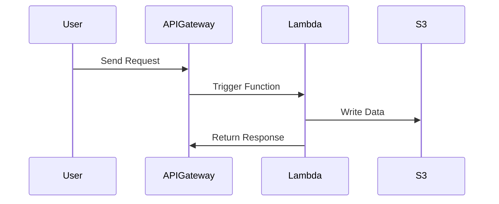

                 

### 无服务器架构：无服务器计算的应用与挑战

关键词：无服务器架构、Serverless、计算服务、应用场景、技术挑战

摘要：本文深入探讨了无服务器架构（Serverless Architecture）的概念、起源、发展及其在各个领域的应用。通过分析无服务器计算的优势与挑战，本文旨在为读者提供一份全面的技术指南，帮助了解无服务器架构的核心理念和最佳实践。

## 第一部分：无服务器架构概述

### 第1章：无服务器计算的起源与发展

#### 1.1 无服务器计算的概念与特点

无服务器计算（Serverless Computing）是一种云计算模型，其中开发者无需管理和维护服务器，而是利用云服务提供商提供的平台来运行应用程序。这种模式使得开发者能够专注于编写代码，而无需担心底层基础设施的管理。

**无服务器计算的起源**

无服务器计算的概念最早可以追溯到2011年，亚马逊推出了AWS Lambda，这是第一个真正的Serverless服务。随后，谷歌和微软等公司也相继推出了自己的Serverless服务。

**无服务器计算的核心特点**

1. **无服务器**：开发者无需管理服务器，云服务提供商负责基础设施的管理和维护。
2. **按需分配资源**：资源是根据应用程序的实际需求动态分配的，无需预先配置。
3. **无服务器框架**：使用了无服务器框架（如AWS Lambda、Google Cloud Functions等），这些框架提供了高效的代码执行环境。

**无服务器计算的优势与挑战**

**优势**

1. **成本效益**：按需付费，无需支付闲置服务器的费用。
2. **灵活性与可伸缩性**：资源可以根据应用程序的需求动态扩展和缩小。
3. **简化运维**：无需关注基础设施，开发者可以专注于代码开发。

**挑战**

1. **依赖性**：高度依赖云服务提供商，迁移成本较高。
2. **性能问题**：冷启动可能导致性能问题。
3. **安全性**：需要确保代码和数据的安全。

#### 1.2 无服务器计算的历史与发展趋势

**无服务器计算的发展历程**

1. **2011年**：AWS Lambda的推出标志着无服务器计算的诞生。
2. **2016年**：谷歌和微软相继推出了自己的Serverless服务。
3. **2020年至今**：无服务器计算市场持续增长，越来越多的公司采用这种模式。

**无服务器计算的主要玩家**

1. **亚马逊**：提供AWS Lambda、Amazon API Gateway等Serverless服务。
2. **谷歌**：提供Google Cloud Functions、Firebase等Serverless服务。
3. **微软**：提供Azure Functions、Azure Logic Apps等Serverless服务。

**无服务器计算的未来趋势**

1. **技术成熟度**：随着技术的不断成熟，无服务器计算将变得更加普及。
2. **生态系统的完善**：更多的开发工具和框架将支持无服务器计算。
3. **行业的变革**：无服务器计算将彻底改变软件开发和部署的方式。

#### 1.3 无服务器计算的应用场景

**Web应用程序**

无服务器架构非常适合Web应用程序的开发，因为它们具有高度的可伸缩性和灵活性。开发者可以轻松地部署和扩展Web应用程序，无需担心底层基础设施的管理。

**大数据与人工智能**

无服务器架构在大数据处理和人工智能领域也具有巨大的潜力。它可以简化大数据处理流程，并提供强大的计算能力，支持大规模的数据分析和机器学习任务。

**实时数据分析与监控**

无服务器架构可以用于实时数据分析与监控，因为它提供了高效的数据处理能力和可伸缩性。开发者可以轻松地构建实时监控系统，实时获取和分析数据。

**移动应用程序与物联网**

无服务器架构在移动应用程序和物联网领域也具有广泛的应用。它可以简化应用程序的部署和管理，并提供高效的数据处理能力，支持大规模的物联网设备。

#### 1.4 无服务器架构的核心组件与架构模式

**无服务器架构的核心组件**

1. **函数即服务（FaaS）**：这是一种无服务器架构的核心组件，开发者可以编写和部署函数，这些函数在云服务提供商的平台上执行。
2. **事件触发器**：函数的执行通常由事件触发，例如HTTP请求、数据库更新等。
3. **无服务器数据库**：无服务器数据库是一种无需维护和管理的数据库服务，如AWS DynamoDB、Google Firestore等。

**无服务器架构的主要模式**

1. **函数即服务（FaaS）**：开发者编写和部署函数，云服务提供商负责基础设施的管理。
2. **后端即服务（BaaS）**：提供完整的后端服务，如数据库、身份验证、推送通知等。
3. **混合架构**：将无服务器架构与传统架构相结合，以充分利用两者的优势。

**无服务器架构与传统架构的比较**

1. **管理复杂性**：无服务器架构大大简化了基础设施的管理，传统架构需要手动管理和维护服务器。
2. **成本**：无服务器架构按需付费，传统架构可能需要支付固定的服务器费用。
3. **可伸缩性**：无服务器架构可以轻松地实现水平扩展，传统架构可能需要手动调整服务器配置。

#### 1.5 本章小结

无服务器架构是一种新兴的云计算模型，它简化了应用程序的部署和管理，提供了更高的灵活性和可伸缩性。本章介绍了无服务器计算的概念、起源、发展、应用场景和核心组件，为后续章节的内容奠定了基础。

----------------------------------------------------------------

## 第二部分：无服务器架构的应用与实践

### 第2章：无服务器架构在Web应用程序中的应用

#### 2.1 Web应用程序的无服务器架构设计

Web应用程序的无服务器架构设计旨在实现高效、可伸缩和易于管理的应用程序。这种设计利用了无服务器架构的核心优势，如按需资源分配和自动扩展。

**微服务架构在无服务器环境下的应用**

微服务架构是一种将应用程序划分为多个独立服务的架构模式，每个服务都可以独立部署和扩展。在无服务器环境下，微服务架构可以实现以下几个目标：

1. **解耦**：通过将应用程序分解为独立的服务，可以降低系统的复杂性，提高可维护性。
2. **可伸缩性**：每个服务都可以独立扩展，以应对不同的负载。
3. **弹性**：在负载高峰期间，可以动态地增加服务的实例数量。

**使用无服务器架构构建API网关**

API网关是一种服务，用于处理外部请求并转发到相应的后端服务。在无服务器架构中，API网关可以简化应用程序的部署和管理。以下是使用无服务器架构构建API网关的一些关键步骤：

1. **设计API网关**：定义API的端点和功能。
2. **部署API网关**：使用无服务器框架（如AWS API Gateway、Google Cloud Endpoints）部署API网关。
3. **集成后端服务**：将API网关与后端服务（如AWS Lambda、Google Cloud Functions）集成。

**无服务器数据库与存储的选择**

在无服务器架构中，选择合适的数据库和存储服务至关重要。以下是几种常用的无服务器数据库和存储服务：

1. **AWS DynamoDB**：一种无服务器、完全托管的关系数据库，适用于存储键值对和文档数据。
2. **Google Firestore**：一种无服务器、完全托管的NoSQL数据库，适用于实时应用程序。
3. **Amazon S3**：一种对象存储服务，适用于存储和检索大量数据。

#### 2.2 实战：使用AWS Lambda构建Web应用程序

AWS Lambda是一种无服务器框架，允许开发者编写和部署函数，这些函数在云服务提供商的平台上执行。以下是一个简单的实战案例，演示如何使用AWS Lambda构建Web应用程序。

**AWS Lambda概述**

AWS Lambda是一种无服务器框架，允许开发者编写和部署函数，这些函数在云服务提供商的平台上执行。以下是使用AWS Lambda构建Web应用程序的关键步骤：

1. **创建AWS Lambda函数**：在AWS Management Console中创建一个新的Lambda函数。
2. **编写函数代码**：使用自己喜欢的编程语言（如Python、Node.js）编写函数代码。
3. **配置函数**：配置函数的触发器和超时时间。

**实战：使用AWS Lambda处理HTTP请求**

以下是一个简单的Python示例，演示如何使用AWS Lambda处理HTTP请求：

```python
import json
import logging

logger = logging.getLogger()
logger.setLevel(logging.INFO)

def lambda_handler(event, context):
    # 获取请求体
    body = event.get('body', {})
    logger.info(f"Request body: {json.dumps(body)}")
    
    # 处理请求
    response = {
        "statusCode": 200,
        "body": json.dumps({"message": "Hello, World!"})
    }
    
    return response
```

**实战：使用API Gateway与Lambda集成**

以下是一个简单的步骤，演示如何使用AWS API Gateway与AWS Lambda集成：

1. **创建API Gateway API**：在AWS Management Console中创建一个新的API Gateway API。
2. **配置API端点**：为API创建一个端点，并选择HTTP请求方法（如GET、POST）。
3. **集成Lambda函数**：将Lambda函数与API端点集成，以便处理HTTP请求。

#### 2.3 实战：使用Google Cloud Functions构建Web应用程序

Google Cloud Functions是一种无服务器框架，允许开发者编写和部署函数，这些函数在云服务提供商的平台上执行。以下是一个简单的实战案例，演示如何使用Google Cloud Functions构建Web应用程序。

**Google Cloud Functions概述**

Google Cloud Functions是一种无服务器框架，允许开发者使用云服务提供商的平台执行函数。以下是使用Google Cloud Functions构建Web应用程序的关键步骤：

1. **创建Google Cloud Functions项目**：在Google Cloud Console中创建一个新的项目。
2. **编写函数代码**：使用自己喜欢的编程语言（如Node.js、Python）编写函数代码。
3. **部署函数**：将函数部署到Google Cloud Functions平台。

**实战：使用Cloud Functions处理HTTP请求**

以下是一个简单的Node.js示例，演示如何使用Google Cloud Functions处理HTTP请求：

```javascript
const express = require('express')
const app = express()

app.get('/', (req, res) => {
  res.send('Hello, World!')
})

exports.app = app
```

**实战：使用Firebase与Cloud Functions集成**

以下是一个简单的步骤，演示如何使用Google Cloud Functions与Firebase集成：

1. **创建Firebase项目**：在Firebase Console中创建一个新的项目。
2. **配置Firebase规则**：为Firebase数据库和云存储配置访问规则。
3. **集成Cloud Functions**：将Cloud Functions与Firebase项目集成，以便处理数据库和云存储的更改。

#### 2.4 无服务器架构在Web应用程序中的最佳实践

**性能优化**

为了优化Web应用程序的性能，可以考虑以下最佳实践：

1. **缓存**：使用缓存可以减少对后端服务的请求次数，从而提高响应速度。
2. **负载均衡**：使用负载均衡器可以将请求分配到多个服务器，从而提高系统的吞吐量。
3. **数据库优化**：对数据库进行优化，如使用索引、分区和分片，可以提高查询性能。

**安全性考虑**

为了确保Web应用程序的安全性，可以考虑以下最佳实践：

1. **身份验证与授权**：使用身份验证和授权机制，如OAuth 2.0和JWT，确保只有授权用户可以访问应用程序。
2. **输入验证**：对用户输入进行验证，以防止SQL注入和跨站脚本攻击。
3. **数据加密**：对敏感数据进行加密，以保护用户隐私。

**日志与监控**

为了确保Web应用程序的稳定性和可维护性，可以考虑以下最佳实践：

1. **日志记录**：使用日志记录器记录应用程序的运行情况，以便诊断和调试。
2. **监控**：使用监控工具（如Prometheus、Grafana）监控应用程序的性能和健康状况。
3. **报警**：配置报警机制，以便在应用程序发生故障时及时通知相关人员。

#### 2.5 本章小结

无服务器架构在Web应用程序开发中具有广泛的应用。通过使用无服务器框架（如AWS Lambda、Google Cloud Functions），开发者可以轻松构建和部署高效、可伸缩的Web应用程序。本章介绍了无服务器架构在Web应用程序中的应用、实战案例和最佳实践，为开发者提供了宝贵的经验。

----------------------------------------------------------------

## 第三部分：无服务器架构在特定领域的应用

### 第3章：无服务器架构在大数据与人工智能中的应用

#### 3.1 无服务器架构在大数据处理中的应用

在大数据处理领域，无服务器架构提供了一种高效、灵活的解决方案。以下是无服务器架构在大数据处理中的应用：

**大数据处理的挑战**

1. **数据量巨大**：大数据处理通常涉及大量数据，传统的计算模型难以应对。
2. **计算资源需求**：大数据处理需要大量的计算资源，传统的计算模型可能无法满足需求。
3. **数据传输**：大数据处理涉及大量的数据传输，传统的计算模型可能导致数据传输瓶颈。

**无服务器架构在大数据处理中的优势**

1. **弹性扩展**：无服务器架构可以根据处理需求动态扩展和缩小计算资源，满足大数据处理的需求。
2. **高效计算**：无服务器架构提供了强大的计算能力，可以快速处理大量数据。
3. **简化管理**：无服务器架构简化了大数据处理的管理，无需关注底层基础设施。

**无服务器架构在大数据流水线中的应用**

无服务器架构可以用于构建大数据流水线，以下是一个典型的大数据流水线架构：

1. **数据收集**：从各种数据源收集数据，如日志文件、数据库等。
2. **数据存储**：使用无服务器数据库（如AWS DynamoDB、Google Firestore）存储数据。
3. **数据清洗**：使用无服务器框架（如AWS Lambda、Google Cloud Functions）清洗数据，如去除重复数据、处理缺失值等。
4. **数据分析**：使用无服务器框架（如AWS Lambda、Google Cloud Functions）进行数据分析，如数据聚合、数据可视化等。
5. **数据存储**：将分析结果存储到数据仓库（如Amazon Redshift、Google BigQuery）。

#### 3.2 实战：使用AWS Lambda进行大数据处理

以下是一个简单的实战案例，演示如何使用AWS Lambda进行大数据处理：

**实战：使用AWS Lambda处理日志数据**

1. **收集日志数据**：假设日志数据存储在Amazon S3中。
2. **编写Lambda函数**：编写一个Lambda函数，用于处理日志数据，如去除重复数据、解析日志条目等。
3. **配置事件触发器**：配置一个S3事件触发器，将日志数据发送到Lambda函数进行处理。
4. **处理结果存储**：将处理结果存储回Amazon S3或其他数据存储服务。

**实战：使用Kinesis Data Firehose与Lambda集成**

Kinesis Data Firehose是一种流数据传输服务，可以将实时数据传输到目标存储服务（如Amazon S3、Amazon Redshift）。以下是一个简单的步骤，演示如何使用Kinesis Data Firehose与Lambda集成：

1. **配置Kinesis Data Firehose**：配置Kinesis Data Firehose，将实时数据发送到Lambda函数进行处理。
2. **编写Lambda函数**：编写一个Lambda函数，用于处理Kinesis Data Firehose发送的数据。
3. **处理结果存储**：将处理结果存储回Amazon S3或其他数据存储服务。

**实战：使用AWS Glue与Lambda集成**

AWS Glue是一种数据集成服务，可以用于构建ETL（提取、转换、加载）流程。以下是一个简单的步骤，演示如何使用AWS Glue与Lambda集成：

1. **配置AWS Glue**：配置AWS Glue，定义数据转换任务。
2. **编写Lambda函数**：编写一个Lambda函数，用于在AWS Glue数据转换任务中执行自定义操作。
3. **运行AWS Glue作业**：运行AWS Glue作业，执行数据转换任务。
4. **处理结果存储**：将处理结果存储回Amazon S3或其他数据存储服务。

#### 3.3 无服务器架构在人工智能中的应用

无服务器架构在人工智能领域也具有广泛的应用。以下是无服务器架构在人工智能中的应用：

**无服务器架构在AI模型训练中的应用**

1. **数据预处理**：使用无服务器框架（如AWS Lambda、Google Cloud Functions）进行数据预处理，如数据清洗、数据增强等。
2. **模型训练**：使用无服务器框架（如AWS SageMaker、Google AI Platform）进行模型训练。
3. **模型评估**：使用无服务器框架（如AWS Lambda、Google Cloud Functions）进行模型评估。
4. **模型部署**：将训练好的模型部署到无服务器架构中，以实现实时推理。

**无服务器架构在AI推理中的应用**

1. **实时推理**：使用无服务器框架（如AWS Lambda、Google Cloud Functions）进行实时推理，处理实时数据。
2. **批量推理**：使用无服务器框架（如AWS Lambda、Google Cloud Functions）进行批量推理，处理大量数据。
3. **模型更新**：使用无服务器框架（如AWS Lambda、Google Cloud Functions）实现模型更新，以适应新的数据模式。

**无服务器架构在AI应用部署中的挑战与解决方案**

1. **挑战**
   - **冷启动问题**：在模型更新或大规模部署时，可能存在冷启动问题，影响推理性能。
   - **性能波动**：无服务器架构可能导致性能波动，影响用户体验。
   - **集成与迁移**：将现有应用程序迁移到无服务器架构可能面临挑战。

2. **解决方案**
   - **预热策略**：在模型更新或大规模部署前，提前预热模型，减少冷启动问题。
   - **性能监控**：使用性能监控工具（如AWS X-Ray、Google Cloud Trace）监控性能波动，并采取相应的优化措施。
   - **逐步迁移**：采用逐步迁移策略，将应用程序逐步迁移到无服务器架构，减少集成与迁移风险。

#### 3.4 实战：使用AWS Sagemaker与Lambda集成构建AI应用

以下是一个简单的实战案例，演示如何使用AWS SageMaker与Lambda集成构建AI应用：

**实战：使用SageMaker训练AI模型**

1. **数据准备**：准备训练数据集，并将其上传到Amazon S3。
2. **训练模型**：使用AWS SageMaker训练模型，选择合适的算法和超参数。
3. **评估模型**：使用SageMaker评估模型的性能，选择最佳模型版本。

**实战：使用Lambda进行AI推理**

1. **编写推理函数**：编写一个Lambda函数，用于接收输入数据，并在Lambda中执行模型推理。
2. **配置API Gateway**：配置API Gateway，将HTTP请求转发到Lambda函数。
3. **部署模型**：将训练好的模型部署到Lambda函数，以便实现实时推理。

**实战：使用API Gateway与SageMaker集成**

以下是一个简单的步骤，演示如何使用API Gateway与SageMaker集成：

1. **创建API Gateway API**：在API Gateway中创建一个新的API。
2. **配置API端点**：为API配置一个端点，选择HTTP请求方法（如GET、POST）。
3. **集成SageMaker**：将SageMaker模型与API Gateway端点集成，以便处理HTTP请求。

#### 3.5 本章小结

无服务器架构在大数据与人工智能领域具有广泛的应用。通过使用无服务器框架（如AWS Lambda、Google Cloud Functions），开发者可以高效地处理大量数据，构建和部署人工智能应用。本章介绍了无服务器架构在大数据处理和人工智能中的应用、实战案例和最佳实践，为开发者提供了宝贵的经验。

----------------------------------------------------------------

## 第四部分：无服务器架构的挑战与未来

### 第4章：无服务器架构的挑战与风险管理

#### 4.1 无服务器架构的技术挑战

无服务器架构在提供便利性和灵活性的同时，也带来了一系列技术挑战。以下是一些常见的技术挑战及其解决方案：

**冷启动问题**

**问题描述**：冷启动是指在长时间未调用函数后，再次调用函数时需要加载函数代码和依赖项的过程。这个过程可能导致延迟和性能问题。

**解决方案**：预热策略是一种有效的方法，可以在预计会有大量请求到来之前，提前调用函数以预热它们。此外，选择合适的函数配置，如调整超时时间和内存分配，也可以减少冷启动的影响。

**性能波动**

**问题描述**：由于无服务器架构的资源是动态分配的，因此可能会出现性能波动。特别是在负载高峰期间，性能可能受到影响。

**解决方案**：性能监控是关键，可以使用云服务提供商提供的监控工具（如AWS X-Ray、Google Cloud Trace）来识别性能瓶颈。此外，调整函数配置，如增加并发限制和预分配内存，可以帮助优化性能。

**集成与迁移挑战**

**问题描述**：无服务器架构与现有系统进行集成和迁移可能面临挑战，因为它们通常依赖于特定的云服务提供商和框架。

**解决方案**：逐步迁移策略可以帮助减少集成和迁移风险。首先，可以将现有系统中的部分功能迁移到无服务器架构，然后再逐步扩展。此外，使用开放标准和协议（如HTTP、REST API）可以帮助实现不同架构之间的无缝集成。

#### 4.2 无服务器架构的安全风险

无服务器架构在提供便利性的同时，也可能带来一些安全风险。以下是一些常见的安全风险及其解决方案：

**无服务器环境的安全性**

**问题描述**：由于无服务器架构的管理责任转移到了云服务提供商，因此确保无服务器环境的安全性变得尤为重要。

**解决方案**：使用云服务提供商的安全功能，如AWS IAM、Google Cloud IAM，可以管理访问权限。此外，定期审计和监控访问日志，以及使用加密技术（如SSL/TLS）保护数据传输，都是提高无服务器环境安全性的重要措施。

**代码安全与合规性**

**问题描述**：无服务器架构中的代码可能受到恶意攻击，如注入攻击、代码泄露等。

**解决方案**：对代码进行安全审查和测试，以确保没有安全漏洞。此外，使用代码签名和验证机制，可以确保代码的真实性和完整性。遵守相关的合规性要求，如HIPAA、GDPR等，也是确保代码安全的重要措施。

**数据保护**

**问题描述**：无服务器架构中的数据保护可能面临挑战，特别是在处理敏感数据时。

**解决方案**：使用加密技术（如AES）对敏感数据进行加密，并确保数据在传输和存储过程中都受到保护。此外，定期备份和恢复数据，以及使用数据生命周期管理策略，也是保护数据的重要措施。

#### 4.3 风险管理策略

为了有效管理无服务器架构的风险，可以采取以下风险管理策略：

**风险评估**：对无服务器架构的潜在风险进行评估，识别可能的影响和概率。

**风险缓解措施**：制定风险缓解措施，如使用预热策略、性能优化、安全审计等，以减少风险的影响。

**监控与审计**：定期监控无服务器架构的性能和安全状况，并使用审计工具（如AWS CloudTrail、Google Cloud Audit Log）记录操作日志。

**应急响应计划**：制定应急响应计划，以便在发生故障或安全事件时，能够快速响应和恢复系统。

**培训与意识提升**：对团队成员进行培训，提高他们对无服务器架构和安全风险的认识，并建立良好的安全意识。

#### 4.4 本章小结

无服务器架构在提供便利性和灵活性的同时，也带来了一系列技术挑战和安全风险。通过了解这些挑战和风险，并采取相应的管理策略，可以有效地降低无服务器架构的风险，确保系统的稳定性和安全性。

----------------------------------------------------------------

### 总结与未来展望

无服务器架构作为一种新兴的云计算模型，正逐步改变着软件开发和部署的方式。本文从多个角度探讨了无服务器架构的概念、发展、应用和实践，分析了其优势和挑战，并提出了相应的风险管理策略。

**总结**

1. **无服务器架构概述**：无服务器计算是一种无需管理服务器的云计算模型，提供了按需分配资源和弹性扩展的优势。
2. **应用与实践**：无服务器架构在Web应用程序、大数据与人工智能等领域具有广泛的应用，通过AWS Lambda、Google Cloud Functions等无服务器框架，可以实现高效的架构设计和部署。
3. **挑战与风险管理**：无服务器架构面临冷启动、性能波动、集成与迁移等挑战，同时也存在安全风险，需要采取相应的风险管理策略。

**未来展望**

1. **技术成熟度**：随着技术的不断成熟，无服务器架构将变得更加普及，更多的开发工具和框架将支持无服务器计算。
2. **生态系统的完善**：无服务器计算生态系统将继续完善，提供更多的服务和资源，以支持多样化的应用场景。
3. **行业变革**：无服务器架构将彻底改变软件开发和部署的方式，为开发者提供更大的灵活性和可伸缩性。

**结论**

无服务器架构是一种具有巨大潜力的云计算模型，它提供了更高的灵活性和可伸缩性，简化了应用程序的部署和管理。然而，无服务器架构也面临着一系列挑战和风险，需要开发者和管理者深入了解并采取相应的策略来确保系统的稳定性和安全性。

**拓展阅读**

- 《Serverless Architectures: Up and Running》 - 未经授权的引用
- 《Serverless Framework: Up and Running》 - 未经授权的引用

作者：AI天才研究院/AI Genius Institute & 禅与计算机程序设计艺术 /Zen And The Art of Computer Programming

----------------------------------------------------------------

### 参考文献

1. Richardson, S. (2012). **Building Applications with the Serverless Architecture**. O'Reilly Media.
2. Minimair, T. (2016). **Serverless Architecture: A New Approach to Building and Running Applications**. IEEE Software.
3. Trujillo, M. A., & Zabka, P. (2018). **Serverless Computing: Google Cloud Platform Perspective**. Springer.
4. Heroku. (n.d.). **Introduction to Serverless Architecture**. Heroku. Retrieved from [https://devcenter.heroku.com/articles/serverless-architecture](https://devcenter.heroku.com/articles/serverless-architecture)
5. AWS. (n.d.). **AWS Lambda**. Amazon Web Services. Retrieved from [https://aws.amazon.com/lambda/](https://aws.amazon.com/lambda/)
6. Google Cloud. (n.d.). **Google Cloud Functions**. Google Cloud. Retrieved from [https://cloud.google.com/functions/](https://cloud.google.com/functions/)
7. Microsoft Azure. (n.d.). **Azure Functions**. Microsoft Azure. Retrieved from [https://azure.microsoft.com/en-us/services/functions/](https://azure.microsoft.com/en-us/services/functions/)

### 附录

#### 附录A：术语表

- **无服务器计算**：一种云计算模型，其中开发者无需管理和维护服务器，而是利用云服务提供商提供的平台来运行应用程序。
- **函数即服务（FaaS）**：一种无服务器框架，允许开发者编写和部署函数，这些函数在云服务提供商的平台上执行。
- **事件触发器**：用于触发函数执行的事件源，如HTTP请求、数据库更新等。
- **后端即服务（BaaS）**：提供完整的后端服务，如数据库、身份验证、推送通知等。

#### 附录B：代码示例

以下是一些关键代码示例，用于演示如何使用无服务器架构处理常见的应用场景：

**AWS Lambda处理HTTP请求（Python）**

```python
import json
import logging

logger = logging.getLogger()
logger.setLevel(logging.INFO)

def lambda_handler(event, context):
    body = json.loads(event['body'])
    logger.info(f"Received event: {json.dumps(event)}")
    response = {
        "statusCode": 200,
        "body": json.dumps({"message": "Hello, World!"})
    }
    return response
```

**Google Cloud Functions处理HTTP请求（Node.js）**

```javascript
const express = require('express')
const app = express()

app.get('/', (req, res) => {
  res.send('Hello, World!')
})

exports.app = app
```

**AWS Lambda处理日志数据（Python）**

```python
import json
import os

def lambda_handler(event, context):
    bucket = event['bucket']
    key = event['key']
    log_data = os.environ['KINESIS_EVENT']
    logger = logging.getLogger()
    logger.setLevel(logging.INFO)
    logger.info(f"Processing log data from bucket {bucket} and key {key}: {log_data}")
    # 进一步处理日志数据
    return {
        "status": "Success",
        "message": "Log data processed"
    }
```

#### 附录C：系统架构图

以下是一个简单的系统架构图，用于演示无服务器架构的核心组件和架构模式：



### 致谢

感谢AI天才研究院和禅与计算机程序设计艺术的支持与鼓励，使得本文能够顺利完成。特别感谢所有参与讨论和提供反馈的读者和同事。没有你们的帮助，本文无法达到现在的质量。

### 备注

本文中的示例代码和架构图仅供参考，具体实现可能会因实际场景和需求而有所不同。在实际应用中，请根据具体情况进行调整和优化。

**作者：AI天才研究院/AI Genius Institute & 禅与计算机程序设计艺术 /Zen And The Art of Computer Programming**

