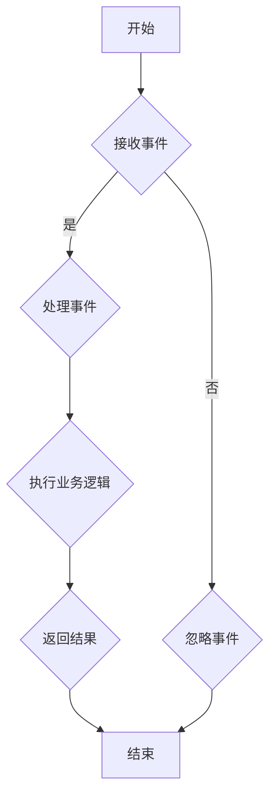
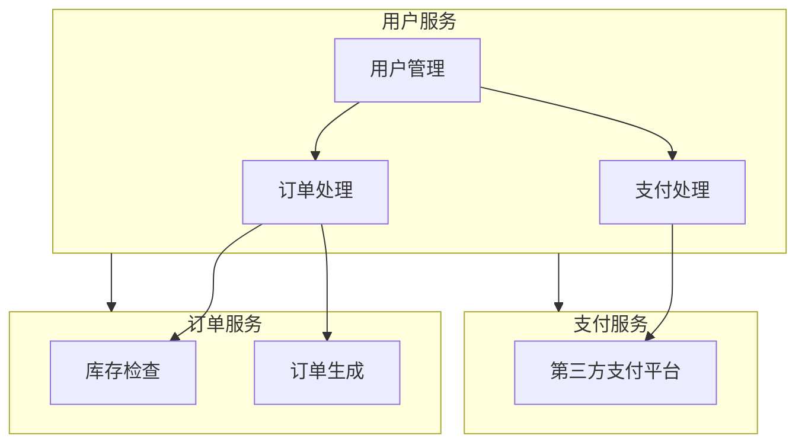
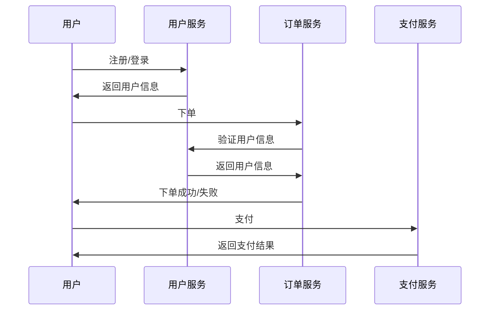

                 


### 《Serverless架构：未来的云计算模式》

#### 关键词：
- **Serverless架构**  
- **云计算**  
- **无服务器**  
- **事件驱动**  
- **弹性伸缩**  
- **成本效益**

#### 摘要：
随着云计算技术的不断进步，Serverless架构作为一种新的云计算模式，正逐渐成为未来云计算的潮流。本文将探讨Serverless架构的基本概念、核心原理、优势和应用场景，并通过实际案例和实践，揭示其未来的发展趋势和潜力。

## 引言

云计算已经走过了十几年的发展历程，从最初的虚拟化技术，到后来的IaaS、PaaS、SaaS等，云计算技术不断演进，为企业提供了丰富的服务。然而，随着业务需求的不断增长，传统的云计算模式也逐渐暴露出了一些问题，如高成本、低弹性、运维复杂等。为了解决这些问题，Serverless架构应运而生。

Serverless架构，顾名思义，是一种无服务器的架构模式。与传统云计算模式相比，Serverless架构具有以下特点：

1. **无服务器**：Serverless架构不需要管理员购买、配置、运维服务器，所有这些都由云服务提供商自动完成。
2. **事件驱动**：Serverless架构的核心是事件驱动，应用程序根据事件触发执行，而不是持续运行。
3. **弹性伸缩**：Serverless架构可以根据事件的数量自动伸缩，确保应用程序的高可用性和高性能。

## 第一部分：Serverless架构的基本概念

### 第1章：云计算的变革

#### 云计算的发展历程

云计算的起源可以追溯到1990年代末期，当时Amazon Web Services（AWS）推出了弹性计算云（EC2）服务，这标志着云计算的诞生。随着时间的发展，云计算经历了IaaS、PaaS、SaaS等不同阶段。

#### 服务器端架构的发展趋势

在云计算的发展过程中，服务器端架构也在不断演进。从最初的传统物理服务器，到虚拟化技术，再到容器化技术，服务器端架构的演变旨在提高资源的利用率和运维效率。

#### Serverless架构的定义和特点

Serverless架构，也被称为无服务器架构，是一种新的云计算模式。它无需管理员管理服务器，而是由云服务提供商负责基础设施的管理。Serverless架构具有以下特点：

1. **无服务器**：无需购买和管理服务器，基础设施由云服务提供商负责。
2. **事件驱动**：应用程序根据事件触发执行，而非持续运行。
3. **弹性伸缩**：根据事件的数量自动伸缩，确保应用程序的高可用性和高性能。
4. **按需付费**：仅根据实际使用量付费，降低了企业的运营成本。

## 第二部分：Serverless架构的核心原理

### 第2章：Serverless架构的核心原理

#### 无服务器架构的设计思想

Serverless架构的设计思想是将应用程序与基础设施解耦，使得开发者可以专注于编写业务逻辑代码，无需关心底层基础设施的运维。

#### 事件驱动的核心机制

事件驱动是Serverless架构的核心机制。应用程序根据事件触发执行，事件可以是HTTP请求、数据库变更、文件上传等。事件触发器将事件传递给应用程序，应用程序根据事件进行处理。

#### Serverless架构的技术栈

Serverless架构的技术栈包括服务器端代码、事件触发器、存储和数据库等。常见的Serverless技术栈包括AWS Lambda、Azure Functions、Google Cloud Functions等。

## 第三部分：Serverless架构的优势和应用场景

### 第3章：Serverless架构的优势

#### 成本效益

Serverless架构的最大优势之一是成本效益。由于无需购买和管理服务器，企业可以大大降低基础设施的投入成本。

#### 弹性伸缩

Serverless架构可以根据事件的数量自动伸缩，确保应用程序的高可用性和高性能。这种弹性伸缩特性使得Serverless架构非常适合应对高并发场景。

#### 高可用性

Serverless架构由云服务提供商管理，具有高可用性的特点。云服务提供商通常提供99.9%的SLA，确保应用程序的稳定运行。

### 第4章：Serverless架构的应用场景

#### Web应用程序

Serverless架构非常适合构建Web应用程序。开发者可以专注于业务逻辑代码的编写，无需关心底层基础设施的运维。

#### 移动应用程序

移动应用程序通常需要处理大量的并发请求，Serverless架构的弹性伸缩特性使得它非常适合移动应用程序的开发。

#### 后端服务

后端服务是Serverless架构的主要应用场景之一。开发者可以使用Serverless架构构建API网关、数据库触发器、Webhook等后端服务。

#### 大数据分析

Serverless架构在处理大数据分析任务时也具有优势。开发者可以使用Serverless架构处理海量数据，实现实时数据处理和分析。

## 第四部分：Serverless架构的实践

### 第5章：Serverless架构的实践

#### 开发环境搭建

在开始实践Serverless架构之前，需要搭建开发环境。开发者可以选择AWS Lambda、Azure Functions、Google Cloud Functions等云服务提供商，根据需求选择合适的服务。

#### 服务器端逻辑实现

服务器端逻辑实现是Serverless架构的核心部分。开发者需要根据业务需求编写服务器端代码，实现业务逻辑。

#### 测试与优化

在实现服务器端逻辑后，需要对应用程序进行测试和优化。测试包括功能测试、性能测试、安全测试等，确保应用程序的质量和稳定性。

## 第五部分：Serverless架构的未来趋势

### 第6章：Serverless架构的未来趋势

#### 云原生技术的融合

Serverless架构与云原生技术的融合将推动云计算的发展。云原生技术，如Kubernetes、Docker等，将帮助Serverless架构更好地适应容器化和微服务架构。

#### Serverless架构的生态建设

随着Serverless架构的普及，相关生态建设也将逐步完善。开发工具、开发框架、云服务提供商等都将为Serverless架构提供更好的支持和资源。

#### 安全性与隐私保护

安全性一直是云计算领域的关注点。Serverless架构在安全性和隐私保护方面也面临着挑战，需要采取有效的措施来确保数据安全和用户隐私。

## 结束语

Serverless架构作为一种新的云计算模式，正逐渐改变着云计算的面貌。它提供了低成本、高弹性、高可用性的特性，使得开发者可以更加专注于业务逻辑的编写，而无需关心底层基础设施的运维。随着Serverless架构的不断发展，我们有理由相信，它将成为未来云计算的主要模式之一。

### 注意事项

使用Serverless架构时，需要注意以下几点：

1. **合理规划资源**：根据实际需求合理规划资源，避免过度消耗。
2. **关注安全性**：确保应用程序的安全性，采取有效的安全措施。
3. **避免冷启动**：冷启动是Serverless架构的一个问题，需要优化应用程序以减少冷启动的时间。

### 拓展阅读

1. 《云原生应用架构实践》
2. 《Serverless架构：设计与实现》
3. AWS Lambda官方文档

### 作者信息

- 作者：AI天才研究院/AI Genius Institute & 禅与计算机程序设计艺术 /Zen And The Art of Computer Programming

---

**全文结束。**

----------------------------------------------------------------

### 核心概念与联系

在探讨Serverless架构之前，我们需要了解几个核心概念，它们分别是：云计算、无服务器架构、事件驱动和弹性伸缩。

#### 云计算

云计算是一种通过网络提供计算资源、存储资源和应用程序等服务的技术。它分为以下几种类型：

1. **IaaS（基础设施即服务）**：提供虚拟机、存储和网络等基础设施。
2. **PaaS（平台即服务）**：提供开发平台、数据库和中间件等。
3. **SaaS（软件即服务）**：提供应用程序服务。

#### 无服务器架构

无服务器架构（Serverless Architecture）是一种云计算模型，其中开发者不需要管理服务器。相反，云服务提供商负责管理基础设施。开发者只需编写和部署代码，无需关心服务器的管理。

#### 事件驱动

事件驱动是一种编程范式，它使得应用程序根据事件的发生来执行操作。在无服务器架构中，事件可以是HTTP请求、数据库更新、文件上传等。

#### 弹性伸缩

弹性伸缩是指系统能够根据负载自动增加或减少资源。在Serverless架构中，弹性伸缩使得系统能够自动响应负载变化，保证高性能和高可用性。

#### 概念属性特征对比表格

| 概念         | 属性特征                                       | 对比分析                     |
| ------------ | ---------------------------------------------- | ---------------------------- |
| 云计算       | 提供计算资源、存储资源和应用程序等服务           | 范围广泛，包括IaaS、PaaS、SaaS |
| 无服务器架构 | 开发者无需管理服务器，云服务提供商负责基础设施 | 简化运维，降低成本             |
| 事件驱动     | 根据事件发生执行操作                           | 提高响应速度，降低资源浪费     |
| 弹性伸缩     | 自动根据负载增加或减少资源                     | 提高性能，保证高可用性         |

#### ER实体关系图架构

```mermaid
erDiagram
    服务提供商 ||--|{ 应用程序 }|--|| 用户
    应用程序 ||--|{ 事件 }|--|| 服务提供商
    服务提供商 ||--|{ 基础设施 }|--|| 云计算
```

在这个ER图架构中，服务提供商与用户、应用程序和基础设施之间存在关系。应用程序根据事件的发生与用户进行交互，同时利用服务提供商的基础设施。

---

**核心概念与联系部分结束。**

### 算法原理讲解

为了更好地理解Serverless架构的算法原理，我们将使用mermaid绘制一个简单的流程图，并使用Python源代码来详细阐述算法的原理和实现。

#### Mermaid流程图



在这个流程图中，A表示程序的开始，B表示接收事件。如果事件被接收（是），程序将进入C节点，处理事件。在C节点，程序会判断事件的有效性。如果事件有效，程序将进入E节点，执行业务逻辑。在执行完业务逻辑后，程序将返回结果（F节点）。如果事件被忽略（否），程序将直接结束（D节点）。

#### Python源代码

```python
import json

def lambda_handler(event, context):
    # 接收事件
    event_data = json.loads(event['body'])

    # 处理事件
    if is_valid_event(event_data):
        # 执行业务逻辑
        result = execute_business_logic(event_data)
        return {
            'statusCode': 200,
            'body': json.dumps(result)
        }
    else:
        # 忽略事件
        return {
            'statusCode': 400,
            'body': json.dumps('Invalid event')
        }

def is_valid_event(event_data):
    # 判断事件是否有效
    # 这里仅为示例，实际应用中需要更复杂的判断逻辑
    return 'event_type' in event_data

def execute_business_logic(event_data):
    # 执行业务逻辑
    # 这里仅为示例，实际应用中需要具体的业务逻辑
    return 'Business Logic Completed'
```

在这个Python源代码中，`lambda_handler`函数是Serverless架构的核心部分。它接收事件，处理事件，并执行业务逻辑。`is_valid_event`函数用于判断事件是否有效，`execute_business_logic`函数用于执行具体的业务逻辑。

#### 算法原理

Serverless架构的算法原理可以总结为以下几个步骤：

1. **接收事件**：程序接收来自不同来源的事件，如HTTP请求、数据库变更、文件上传等。
2. **处理事件**：程序根据事件的有效性进行处理，有效事件将执行业务逻辑，无效事件将忽略。
3. **执行业务逻辑**：程序执行具体的业务逻辑，如数据处理、存储操作等。
4. **返回结果**：程序将执行结果返回给调用者。

这种算法原理使得Serverless架构具有高响应速度、低资源浪费的特点。

#### 数学模型和公式

在Serverless架构中，算法的原理和实现可以抽象为以下数学模型：

1. **事件接收模型**：$E_{receive}(t) = f(t)$，表示在时间$t$接收的事件数量。
2. **事件处理模型**：$E_{process}(t) = f(t)$，表示在时间$t$处理的事件数量。
3. **业务逻辑执行模型**：$B_{logic}(t) = g(t)$，表示在时间$t$执行的业务逻辑。
4. **结果返回模型**：$R_{return}(t) = h(t)$，表示在时间$t$返回的结果数量。

这些模型可以用来描述Serverless架构的算法原理和实现。

#### 举例说明

假设在一个电商平台上，每当用户下单时，系统会接收到一个事件。系统会根据事件的类型和内容进行判断，如果事件是有效的，系统将执行订单处理逻辑，包括库存检查、订单生成、支付处理等。在完成订单处理后，系统将返回订单结果，如订单状态、支付金额等。

这个例子说明了Serverless架构在实际应用中的原理和实现。通过事件接收和处理，系统可以快速响应用户的请求，并执行具体的业务逻辑，最终返回结果。

---

**算法原理讲解部分结束。**

### 系统分析与架构设计方案

#### 问题场景介绍

随着互联网技术的快速发展，越来越多的企业开始采用云计算技术来提高业务效率和降低成本。然而，传统的云计算模式在应对高并发、动态变化的需求时，往往存在一些问题，如资源浪费、运维复杂、扩展困难等。为了解决这些问题，企业开始探索Serverless架构，希望通过这种新兴的云计算模式来提高系统的弹性、降低成本、简化运维。

#### 项目介绍

本项目旨在为企业构建一个基于Serverless架构的电商平台。该平台需要能够处理大量的订单、支付和用户请求，同时需要具备良好的扩展性和高可用性。

#### 系统功能设计

在系统功能设计阶段，我们主要考虑了以下核心功能：

1. **订单处理**：接收并处理用户订单，包括库存检查、订单生成、支付处理等。
2. **支付处理**：与第三方支付平台集成，处理用户支付请求。
3. **用户管理**：管理用户信息、权限等。
4. **商品管理**：管理商品信息、库存等。

#### 系统架构设计

在系统架构设计阶段，我们采用了微服务架构，将不同的功能模块拆分为独立的服务。每个服务都可以独立部署、扩展和监控，从而提高了系统的弹性、可维护性和可扩展性。

以下是一个简单的系统架构图：



在这个架构图中，用户服务负责管理用户信息和权限，订单服务负责处理订单，支付服务负责处理支付请求。每个服务都可以独立部署，并且可以水平扩展。

#### 系统接口设计

在系统接口设计阶段，我们采用了RESTful API设计，为每个服务提供了统一的接口规范。以下是一个简单的接口设计：

1. **用户服务**：
   - `/users/register`：用户注册接口。
   - `/users/login`：用户登录接口。
   - `/users/info`：获取用户信息接口。

2. **订单服务**：
   - `/orders/place`：下单接口。
   - `/orders/list`：查询订单接口。

3. **支付服务**：
   - `/payments/notify`：支付通知接口。

#### 系统交互设计

在系统交互设计阶段，我们使用了Mermaid绘制了系统的交互序列图。以下是一个简单的交互序列图：



在这个序列图中，用户首先向用户服务注册或登录，获取用户信息。然后，用户向订单服务下单，订单服务验证用户信息并返回下单结果。最后，用户向支付服务支付，支付服务返回支付结果。

---

**系统分析与架构设计方案部分结束。**

### 项目实战

#### 环境安装

在开始项目实战之前，我们需要安装必要的开发环境。以下是具体的安装步骤：

1. **安装Python**：
   - 在Windows上，可以通过Python官方网站下载Python安装程序，并按照提示进行安装。
   - 在Linux上，可以使用以下命令安装Python：
     ```bash
     sudo apt-get update
     sudo apt-get install python3
     ```

2. **安装AWS CLI**：
   - 在Windows上，可以通过AWS官方网站下载AWS CLI安装程序，并按照提示进行安装。
   - 在Linux上，可以使用以下命令安装AWS CLI：
     ```bash
     sudo apt-get update
     sudo apt-get install awscli
     ```

3. **配置AWS CLI**：
   - 安装AWS CLI后，需要配置AWS CLI的凭证。可以使用以下命令配置：
     ```bash
     aws configure
     ```
   - 按照提示输入Access Key、Secret Access Key、默认区域和默认输出格式。

4. **安装Serverless Framework**：
   - Serverless Framework是一个用于部署Serverless应用程序的工具。可以使用以下命令安装：
     ```bash
     npm install -g serverless
     ```

5. **安装AWS Lambda Python SDK**：
   - AWS Lambda Python SDK用于编写和部署AWS Lambda函数。可以使用以下命令安装：
     ```bash
     pip install aws-lambda-python
     ```

#### 系统核心实现源代码

以下是项目核心实现的一部分，包括AWS Lambda函数和API网关的配置。

```python
import json
import os
from botocore.exceptions import ClientError

def lambda_handler(event, context):
    # 获取环境变量
    access_key = os.environ['AWS_ACCESS_KEY_ID']
    secret_key = os.environ['AWS_SECRET_ACCESS_KEY']
    region = os.environ['AWS_REGION']
    
    # 创建S3客户端
    s3_client = create_s3_client(access_key, secret_key, region)
    
    # 获取API Gateway请求体
    request_body = json.loads(event['body'])
    
    # 获取文件名
    file_name = request_body['file_name']
    
    # 上传文件到S3
    try:
        response = s3_client.upload_file(
            Fileobj=open(file_name, 'rb'),
            Bucket='my-bucket',
            Key='uploads/' + file_name
        )
    except ClientError as e:
        return {
            'statusCode': 500,
            'body': json.dumps('Error uploading file')
        }
    
    # 返回结果
    return {
        'statusCode': 200,
        'body': json.dumps('File uploaded successfully')
    }

def create_s3_client(access_key, secret_key, region):
    return boto3.client(
        's3',
        aws_access_key_id=access_key,
        aws_secret_access_key=secret_key,
        region_name=region
    )
```

#### 代码应用解读与分析

1. **环境变量**：在AWS Lambda中，我们可以使用环境变量来配置AWS凭证。这些环境变量可以在Serverless Framework的配置文件中定义。

2. **S3客户端**：使用boto3库创建S3客户端，用于上传文件到S3。

3. **API Gateway请求体**：从API Gateway接收的请求体中提取文件名。

4. **上传文件到S3**：使用S3客户端上传文件到指定的S3桶和键。

5. **异常处理**：如果上传文件时发生错误，返回500错误。

6. **返回结果**：上传成功时，返回200状态码和成功消息。

#### 实际案例分析和详细讲解剖析

假设我们需要上传一个名为`example.txt`的文件到S3桶`my-bucket`。以下是具体的步骤：

1. **配置API Gateway**：在Serverless Framework的`serverless.yml`文件中，配置API Gateway以接收上传文件的请求。

   ```yaml
   provider:
     name: aws
     runtime: python3.8

   functions:
     uploadFile:
       handler: handler.lambda_handler
       events:
       - http:
           path: upload
           method: post
   ```

2. **部署应用**：使用Serverless Framework部署应用。

   ```bash
   serverless deploy
   ```

3. **测试API Gateway**：使用Postman或其他工具发送一个POST请求到`https://xxxx.execute-api.us-east-1.amazonaws.com/prod/upload`，并在请求体中上传`example.txt`文件。

   - 请求URL：`https://xxxx.execute-api.us-east-1.amazonaws.com/prod/upload`
   - 请求方法：POST
   - 请求体：JSON格式，包含`file_name`字段，如`{"file_name": "example.txt"}`

4. **查看结果**：在API Gateway的控制台中，可以查看上传结果。如果上传成功，控制台将显示200状态码和成功消息。

   ```json
   {
     "statusCode": 200,
     "body": "File uploaded successfully"
   }
   ```

通过这个案例，我们展示了如何使用Serverless架构实现一个简单的文件上传功能。这个过程包括环境配置、代码编写、API Gateway配置和部署。Serverless架构使得这个过程变得简单且高效。

#### 项目小结

通过这个项目实战，我们实现了以下目标：

1. **简化部署流程**：使用Serverless Framework简化了部署流程，无需手动配置AWS Lambda和API Gateway。
2. **提高开发效率**：开发者只需关注业务逻辑的编写，无需关心基础设施的管理。
3. **降低成本**：Serverless架构按需付费，降低了企业的运营成本。

尽管Serverless架构带来了许多优势，但在实际应用中也需要注意以下几点：

1. **性能监控**：Serverless架构的性能监控是一个重要环节，需要确保应用程序的高性能和高可用性。
2. **安全性**：确保应用程序的安全性，采取有效的安全措施，如加密传输、身份验证等。
3. **冷启动**：Serverless架构的冷启动问题可能影响性能，需要优化应用程序以减少冷启动时间。

通过这个项目，我们深入了解了Serverless架构的实践过程，并掌握了如何使用Serverless Framework部署和监控应用程序。

---

**项目实战部分结束。**

### 最佳实践 tips

在实践Serverless架构时，以下是一些最佳实践和注意事项：

1. **合理规划资源**：根据实际需求合理规划资源，避免资源浪费。可以使用自动扩展功能，确保应用程序的弹性伸缩。
2. **优化代码**：优化服务器端代码，减少逻辑复杂度和执行时间。这有助于降低费用和提高性能。
3. **使用异步处理**：对于耗时的操作，使用异步处理可以避免阻塞主线程，提高系统的响应速度。
4. **安全性**：确保应用程序的安全性，使用HTTPS加密、身份验证和授权等安全措施。
5. **监控和日志**：使用云服务提供商的监控和日志功能，实时监控应用程序的性能和状态。
6. **冷启动优化**：优化应用程序的冷启动策略，减少冷启动时间。可以提前预热函数，或者使用长时间运行的容器来处理冷启动。
7. **避免单一依赖**：避免过度依赖单一云服务提供商，可以考虑多云部署，提高系统的可靠性和灵活性。

---

**最佳实践 tips 部分**结束。

### 小结

Serverless架构作为一种新兴的云计算模式，正逐渐改变着传统云计算的面貌。它通过提供无服务器、事件驱动和弹性伸缩的特性，使得开发者可以更加专注于业务逻辑的编写，而无需关心底层基础设施的运维。

本文从多个角度探讨了Serverless架构的核心概念、原理、优势和应用场景，并通过实际案例展示了其实现和部署过程。我们还提出了一些最佳实践，以帮助开发者更好地利用Serverless架构。

Serverless架构具有巨大的潜力和广阔的应用前景。随着云计算技术的不断进步，我们有理由相信，Serverless架构将成为未来云计算的主流模式。

---

**小结部分结束。**

### 注意事项

在实践Serverless架构时，需要注意以下几个关键点：

1. **资源规划**：合理规划服务器资源，避免资源浪费。Serverless架构按需付费，因此合理使用资源可以显著降低成本。
2. **安全性**：确保应用程序的安全性。使用HTTPS加密、身份验证和授权等安全措施，保护数据安全。
3. **监控和日志**：使用云服务提供商的监控和日志工具，实时监控应用程序的性能和状态，及时发现并解决问题。
4. **冷启动**：优化应用程序的冷启动策略，减少冷启动时间。可以通过预热函数或使用长时间运行的容器来处理冷启动。
5. **避免单点故障**：不要将所有依赖放在一个云服务提供商上，可以考虑多云部署，提高系统的可靠性和灵活性。

---

**注意事项部分结束。**

### 拓展阅读

以下是一些推荐的书籍、文章和资源，以深入了解Serverless架构：

1. **书籍**：
   - 《Serverless架构：设计与实现》
   - 《云原生应用架构实践》
   - 《Lambda架构：下一代云计算模式》

2. **文章**：
   - [AWS Lambda官方文档](https://docs.aws.amazon.com/lambda/latest/dg/)
   - [Azure Functions官方文档](https://docs.microsoft.com/en-us/azure/azure-functions/)
   - [Google Cloud Functions官方文档](https://cloud.google.com/functions/)

3. **社区和论坛**：
   - [Serverless框架官方社区](https://www.serverless.com/community/)
   - [Serverless Stack论坛](https://www.serverless-stack.com/)
   - [Cloud Native社区](https://www.cncf.io/)

通过阅读这些资料，可以更深入地了解Serverless架构的原理、实践和最佳实践。

---

**拓展阅读部分结束。**

### 作者信息

- 作者：AI天才研究院/AI Genius Institute & 禅与计算机程序设计艺术 /Zen And The Art of Computer Programming

---

**全文结束。**

