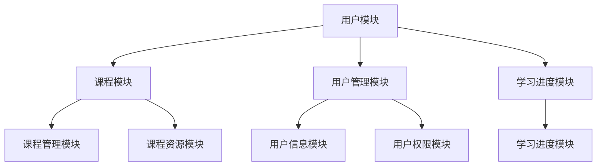
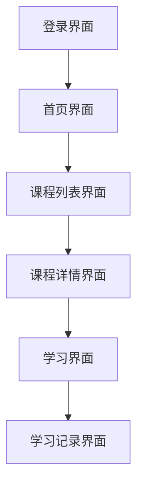

                 

# 上承需求、下启代码的系统分析

## 关键词

系统分析、需求分析、架构设计、接口设计、交互设计、项目实战

## 摘要

本文旨在探讨系统分析在软件开发过程中的重要性，从上承需求、下启代码的角度，详细解析系统分析的过程与方法。通过阐述需求分析、系统建模、系统架构设计、接口设计、交互设计以及项目实战等内容，帮助读者深入理解系统分析的核心概念和实际应用，提高软件开发的效率和质量。

## 第1章 引言与问题背景

### 1.1 系统分析的重要性

系统分析是软件开发过程中的关键环节，它关系到整个项目的成败。系统分析的重要性主要体现在以下几个方面：

1. **明确项目目标**：系统分析帮助开发者明确项目的需求，确保项目的开发方向与目标一致。
2. **降低开发风险**：通过对系统的需求、架构、接口等进行详细分析，可以有效降低项目开发过程中的风险。
3. **提高开发效率**：系统分析能够帮助团队提前识别潜在问题，避免反复修改，从而提高开发效率。
4. **保障系统质量**：系统分析确保系统功能的完整性和性能的稳定性，从而提高系统的质量。

### 1.2 系统分析的定义与目标

系统分析是指对软件系统进行详细的研究和分析，以理解系统的需求、功能、性能、安全性等方面的内容。系统分析的目标包括：

1. **明确需求**：通过需求分析，了解用户的需求，为后续开发提供依据。
2. **设计系统架构**：根据需求分析的结果，设计系统的整体架构，确保系统的可扩展性和性能。
3. **制定接口规范**：明确系统各组件之间的交互方式，确保系统内部和外部接口的一致性和稳定性。
4. **设计交互界面**：根据用户需求和系统架构，设计用户友好的交互界面，提高用户体验。

### 1.3 系统分析的挑战

系统分析面临着一系列的挑战，包括：

1. **需求不明确**：用户的需求往往不明确或变化频繁，需要不断地与用户沟通，确保需求的准确性。
2. **技术复杂性**：随着技术的发展，系统的复杂性不断增加，需要掌握更多的技术和工具。
3. **时间压力**：项目开发周期通常较短，需要在有限的时间内完成系统分析，确保项目进度。
4. **团队协作**：系统分析涉及多个角色和部门，需要良好的团队协作和沟通。

### 1.4 本书结构

本文将分为八个章节，系统地介绍系统分析的过程与方法：

1. **第1章 引言与问题背景**：介绍系统分析的重要性、定义与目标，以及系统分析的挑战。
2. **第2章 理解需求分析**：探讨需求分析的基础概念、方法、分类和建模。
3. **第3章 需求建模**：介绍需求建模的基础知识和方法。
4. **第4章 系统分析的方法与工具**：介绍系统分析的方法和工具，包括结构化分析方法、面向对象分析方法和其他分析方法。
5. **第5章 系统架构设计**：探讨系统架构设计的基础知识、方法和工具。
6. **第6章 系统接口设计**：介绍系统接口设计的原则和工具。
7. **第7章 系统交互设计**：探讨系统交互设计的基础知识、方法和工具。
8. **第8章 项目实战**：通过实际案例，展示系统分析的应用和实践。

## 第2章 理解需求分析

### 2.1 需求分析的基础概念

需求分析是系统分析的核心环节，它涉及到以下几个方面的基础概念：

1. **需求**：需求是用户对系统功能、性能、安全性等方面的要求。需求可以来源于用户、市场、法律等各个方面。
2. **用户需求**：用户需求是指用户对系统的期望和需求，通常包括功能需求、性能需求、安全性需求等。
3. **业务需求**：业务需求是指系统在运行过程中需要满足的业务规则和要求。
4. **功能需求**：功能需求是指系统应具备的具体功能，包括系统界面、数据处理、通信等方面。
5. **非功能需求**：非功能需求是指系统应具备的属性和特性，如性能、可靠性、安全性等。

### 2.2 需求收集的方法

需求收集是需求分析的关键步骤，常见的方法包括：

1. **用户访谈**：通过与用户面对面交流，了解用户的需求和期望。
2. **观察法**：通过观察用户的使用行为，发现用户的需求和痛点。
3. **调查问卷**：通过问卷调查，收集大量的用户需求信息。

### 2.3 需求分类

根据需求的不同特点，可以将需求分为以下几类：

1. **功能需求**：功能需求是系统应具备的具体功能，如用户登录、数据查询、报表生成等。
2. **非功能需求**：非功能需求是系统应具备的属性和特性，如性能需求（响应时间、并发处理能力）、安全性需求（数据加密、访问控制）等。
3. **竞争需求**：竞争需求是指系统在市场竞争中需要具备的特点，如用户体验、易用性、价格等。

### 2.4 需求建模

需求建模是需求分析的重要环节，通过建立需求模型，可以更好地理解和表达需求。常见的需求建模方法包括：

1. **原型法**：通过构建原型系统，直观地展示系统的功能、界面和交互。
2. **功能分解法**：将复杂的需求分解为多个子需求，逐层细化，形成层次结构。
3. **需求文档编写**：通过编写需求文档，详细描述系统的功能和特性。

## 第3章 需求建模

### 3.1 建模基础

需求建模是系统分析的关键环节，它帮助开发者更好地理解和表达需求。本章将介绍需求建模的基础知识，包括UML（统一建模语言）概述、类图、序列图等。

### 3.1.1 UML概述

UML（统一建模语言）是一种通用的建模语言，用于描述软件系统的结构和行为。UML包括多种图形表示方法，如类图、序列图、组件图等。

### 3.1.2 类图

类图是UML中最常用的图形表示方法，用于描述系统的类和类之间的关系。类图包括以下基本元素：

1. **类**：类是系统中具有相似属性和行为的对象的抽象表示。
2. **属性**：属性是类的特征，用于描述类的状态。
3. **方法**：方法是类的行为，用于描述类的操作。
4. **关系**：类与类之间的关系，如关联、依赖、聚合等。

### 3.1.3 序列图

序列图是UML中用于描述对象之间交互的图形表示方法。序列图包括以下基本元素：

1. **对象**：参与交互的对象。
2. **消息**：对象之间的消息传递。
3. **交互**：对象之间的交互过程。

### 3.2 需求建模方法

根据需求的不同特点，可以采用不同的需求建模方法。本章将介绍几种常见的需求建模方法，包括原型法、功能分解法、需求文档编写等。

### 3.2.1 原型法

原型法是一种基于迭代的需求建模方法，通过构建原型系统，直观地展示系统的功能、界面和交互。原型法的优点是能够快速响应用户需求的变化，缺点是原型系统可能不完全符合最终需求。

### 3.2.2 功能分解法

功能分解法是将复杂的需求分解为多个子需求，逐层细化，形成层次结构。功能分解法的优点是能够清晰地表达需求，缺点是需要较长的建模时间。

### 3.2.3 需求文档编写

需求文档编写是需求建模的一种传统方法，通过编写文档，详细描述系统的功能和特性。需求文档的优点是形式规范、易于理解，缺点是编写过程较复杂、耗时。

## 第4章 系统分析的方法与工具

### 4.1 结构化分析方法

结构化分析方法是一种传统的系统分析方法，通过数据流图（DFD）、状态转换图（STD）、事务处理图（TPG）等工具，对系统进行分析和建模。

### 4.1.1 数据流图

数据流图是结构化分析方法中最常用的工具之一，用于描述系统的数据流动和功能模块。数据流图包括以下基本元素：

1. **数据流**：数据在系统中的流动。
2. **处理过程**：对数据进行处理的过程。
3. **数据存储**：数据的存储地点。

### 4.1.2 状态转换图

状态转换图用于描述系统的状态和状态之间的转换。状态转换图包括以下基本元素：

1. **状态**：系统的运行状态。
2. **事件**：触发状态转换的原因。
3. **转换**：状态之间的转换关系。

### 4.1.3 事务处理图

事务处理图用于描述系统的事务处理过程，通常用于复杂的业务系统分析。事务处理图包括以下基本元素：

1. **事务**：业务流程的基本操作。
2. **处理步骤**：事务处理的过程。
3. **参与者**：参与事务处理的系统或用户。

### 4.2 面向对象分析方法

面向对象分析方法是一种基于面向对象编程思想的系统分析方法，通过类图、序列图、组件图等工具，对系统进行分析和建模。

### 4.2.1 类图

类图是面向对象分析方法中最常用的工具之一，用于描述系统的类和类之间的关系。类图包括以下基本元素：

1. **类**：系统中具有相似属性和行为的对象的抽象表示。
2. **属性**：类的特征，用于描述类的状态。
3. **方法**：类的行为，用于描述类的操作。
4. **关系**：类与类之间的关系，如关联、依赖、聚合等。

### 4.2.2 序列图

序列图用于描述对象之间的交互顺序和交互内容。序列图包括以下基本元素：

1. **对象**：参与交互的对象。
2. **消息**：对象之间的消息传递。
3. **交互**：对象之间的交互过程。

### 4.2.3 组件图

组件图用于描述系统的组件和组件之间的关系，通常用于大型系统的分析。组件图包括以下基本元素：

1. **组件**：系统的功能模块。
2. **接口**：组件之间的交互接口。
3. **依赖**：组件之间的依赖关系。

### 4.3 其他分析方法

除了结构化分析方法和面向对象分析方法外，还有其他一些常用的系统分析方法，如系统仿真、系统建模工具等。

### 4.3.1 系统仿真

系统仿真是一种基于模型的分析方法，通过模拟系统的运行过程，分析系统的性能和稳定性。系统仿真可以用于系统设计、性能优化、风险评估等。

### 4.3.2 系统建模工具

系统建模工具是一种用于系统分析和建模的软件工具，如Microsoft Visio、阿里云架构师工具等。这些工具可以帮助开发者快速创建系统模型，提高工作效率。

## 第5章 系统架构设计

### 5.1 系统架构设计基础

系统架构设计是软件开发过程中的重要环节，它关系到系统的性能、可扩展性、可维护性等方面。本章将介绍系统架构设计的基础知识，包括软件架构概述、架构风格、系统组件设计等。

### 5.1.1 软件架构概述

软件架构是软件系统的整体结构和组织方式，它包括系统的功能、组件、接口、数据等各个方面的设计。软件架构的设计目标包括：

1. **性能**：确保系统在高负载下的性能稳定。
2. **可扩展性**：支持系统功能扩展和性能提升。
3. **可维护性**：降低系统的维护成本。
4. **安全性**：确保系统的安全性。

### 5.1.2 架构风格

架构风格是系统架构的一种设计模式，它规定了系统组件的分布、数据流和交互方式。常见的架构风格包括：

1. **客户端/服务器架构**：将系统划分为客户端和服务器两部分，客户端负责界面展示和数据输入，服务器负责数据处理和存储。
2. **分布式架构**：将系统分布在多个节点上，每个节点负责特定的功能，通过分布式计算和存储来提高系统的性能和可扩展性。
3. **微服务架构**：将系统划分为多个独立的微服务，每个微服务负责特定的功能，通过轻量级的通信协议（如HTTP/REST）进行交互。

### 5.1.3 系统组件设计

系统组件设计是系统架构设计的重要环节，它涉及到系统的各个组件的设计和实现。系统组件设计需要考虑以下方面：

1. **功能划分**：将系统的功能划分为多个组件，每个组件负责特定的功能。
2. **接口设计**：定义组件之间的交互接口，确保组件之间的松耦合。
3. **数据管理**：设计系统的数据存储和管理方案，确保数据的一致性和安全性。

### 5.2 系统架构设计方法

系统架构设计方法是指用于设计系统架构的具体方法和步骤。本章将介绍几种常见的系统架构设计方法，包括头脑风暴、构件化设计、系统迭代设计等。

### 5.2.1 头脑风暴

头脑风暴是一种快速产生架构设计想法的方法，通过团队成员的集体讨论，收集各种架构设计方案，然后进行筛选和优化。

### 5.2.2 构件化设计

构件化设计是一种基于组件的架构设计方法，通过将系统划分为多个独立的构件，每个构件负责特定的功能，然后通过接口进行集成。

### 5.2.3 系统迭代设计

系统迭代设计是一种基于迭代开发的架构设计方法，通过逐步完善系统架构，实现系统功能。系统迭代设计包括以下步骤：

1. **需求分析**：分析系统的需求，确定系统功能。
2. **架构设计**：根据需求分析结果，设计系统架构。
3. **开发与测试**：根据架构设计，进行系统开发，并进行测试。
4. **迭代优化**：根据测试结果，对系统进行优化和调整。

### 5.3 系统架构设计工具

系统架构设计工具是用于辅助系统架构设计的软件工具，如Microsoft Visio、阿里云架构师工具等。这些工具可以帮助开发者快速创建系统架构图，提高工作效率。

## 第6章 系统接口设计

### 6.1 接口设计原则

接口设计是系统架构设计的重要环节，它涉及到系统内部和外部组件之间的交互。本章将介绍接口设计的基本原则，包括一致性、简洁性、可扩展性、安全性等。

### 6.1.1 接口设计的基本原则

接口设计的基本原则包括：

1. **一致性**：接口设计应保持一致，避免不同接口之间的差异。
2. **简洁性**：接口设计应简洁明了，避免复杂和冗长的接口。
3. **可扩展性**：接口设计应具有可扩展性，以便在系统功能扩展时能够方便地添加新接口。
4. **安全性**：接口设计应考虑安全性，确保系统的数据安全和访问控制。

### 6.1.2 RESTful接口设计

RESTful接口设计是一种基于HTTP协议的接口设计风格，它遵循REST（Representational State Transfer）架构风格。RESTful接口设计的基本原则包括：

1. **统一接口**：接口设计应遵循统一的接口规范，确保不同接口之间的兼容性。
2. **状态转换**：通过HTTP方法（如GET、POST、PUT、DELETE）实现状态转换，确保系统的可操作性和一致性。
3. **资源定位**：使用URL（统一资源定位符）定位资源，确保资源的唯一性和可访问性。
4. **无状态性**：接口设计应遵循无状态性原则，确保系统的高可用性和可扩展性。

### 6.1.3 GraphQL接口设计

GraphQL接口设计是一种基于查询的接口设计风格，它提供了一种灵活的接口设计方式，使开发者能够精确地获取所需的数据。GraphQL接口设计的基本原则包括：

1. **灵活查询**：通过GraphQL查询语言，开发者可以精确地定义所需的数据，减少数据传输和处理的复杂性。
2. **减少数据传输**：通过GraphQL查询语言，开发者可以只获取所需的数据，减少数据传输的流量和延迟。
3. **增强接口可读性**：GraphQL接口设计使得接口文档更加清晰，方便开发者理解和使用接口。
4. **自定义类型和字段**：GraphQL接口设计允许开发者自定义类型和字段，提高接口的灵活性和可扩展性。

### 6.2 接口设计工具

接口设计工具是用于辅助接口设计的软件工具，如Swagger、Postman等。这些工具可以帮助开发者快速创建接口文档，提高工作效率。

### 6.2.1 Swagger

Swagger是一种开源的接口设计工具，它提供了一套完整的接口设计、文档和测试解决方案。Swagger的基本功能包括：

1. **接口文档生成**：根据接口定义自动生成接口文档，确保接口文档的准确性和一致性。
2. **接口文档可视化**：通过可视化界面展示接口文档，方便开发者查看和使用接口。
3. **接口测试**：提供接口测试功能，支持多种测试方式，如自动化测试、手动测试等。

### 6.2.2 Postman

Postman是一种开源的接口设计工具，它提供了一种方便的接口测试和文档生成方式。Postman的基本功能包括：

1. **接口测试**：支持HTTP/HTTPS协议，提供多种测试功能，如参数化测试、自动化测试等。
2. **接口文档生成**：根据接口测试结果自动生成接口文档，支持多种文档格式，如Markdown、HTML等。
3. **团队协作**：支持团队协作，多个成员可以共同参与接口设计和测试。

## 第7章 系统交互设计

### 7.1 系统交互设计基础

系统交互设计是系统设计中至关重要的一环，它涉及到用户与系统之间的交互方式、界面布局、用户体验等方面。本章将介绍系统交互设计的基础知识，包括交互设计概述、用户界面设计、用户体验设计等。

### 7.1.1 交互设计概述

交互设计是指设计用户与系统之间的交互方式，以提供良好的用户体验。交互设计的基本原则包括：

1. **用户中心**：交互设计应以用户为中心，满足用户的需求和习惯。
2. **简洁直观**：交互设计应简洁直观，降低用户的学习成本。
3. **一致性**：交互设计应保持一致性，确保用户在不同场景下的操作一致性。
4. **可访问性**：交互设计应考虑可访问性，确保所有用户都能够方便地使用系统。

### 7.1.2 用户界面设计

用户界面设计是交互设计的重要组成部分，它涉及到界面布局、颜色搭配、字体选择等方面。用户界面设计的基本原则包括：

1. **布局合理**：界面布局应合理，确保用户能够方便地找到所需的功能和信息。
2. **颜色搭配**：颜色搭配应协调，提高界面的美观度。
3. **字体选择**：字体选择应适宜，确保文字的可读性。
4. **响应速度**：界面响应速度应快速，确保用户操作的流畅性。

### 7.1.3 用户体验设计

用户体验设计是指设计系统给用户带来的整体感受，包括情感、行为、认知等方面。用户体验设计的基本原则包括：

1. **情感共鸣**：用户体验设计应与用户产生情感共鸣，提升用户的满意度。
2. **行为引导**：用户体验设计应引导用户进行正确的操作，提高系统的易用性。
3. **认知体验**：用户体验设计应提供良好的认知体验，确保用户能够轻松地理解和使用系统。

### 7.2 系统交互设计方法

系统交互设计方法是指用于设计系统交互的具体方法和步骤。本章将介绍几种常见的系统交互设计方法，包括原型设计、任务流设计、用户故事地图等。

### 7.2.1 原型设计

原型设计是一种快速迭代的设计方法，通过构建原型系统，直观地展示系统的功能和交互方式。原型设计的基本步骤包括：

1. **需求分析**：分析用户需求，确定系统功能。
2. **原型构建**：根据需求分析结果，构建原型系统。
3. **用户反馈**：通过用户反馈，优化原型系统。
4. **迭代更新**：根据用户反馈，不断迭代更新原型系统。

### 7.2.2 任务流设计

任务流设计是指设计用户在使用系统时需要完成的任务流程。任务流设计的基本步骤包括：

1. **任务分解**：将任务分解为多个子任务，明确每个子任务的目标和操作。
2. **流程设计**：设计任务的流程，确保任务的顺畅完成。
3. **交互设计**：根据任务流程，设计用户与系统之间的交互方式。
4. **反馈与优化**：根据用户反馈，优化任务流设计。

### 7.2.3 用户故事地图

用户故事地图是一种用于设计系统交互和用户故事的工具，它将用户需求、功能模块和交互流程可视化。用户故事地图的基本步骤包括：

1. **需求分析**：分析用户需求，确定系统功能。
2. **故事编写**：编写用户故事，描述用户需求。
3. **故事排序**：根据用户故事的重要性，对故事进行排序。
4. **交互设计**：根据用户故事，设计用户与系统之间的交互方式。

## 第8章 项目实战

### 8.1 实战项目介绍

为了更好地理解系统分析的过程和方法，本章将介绍一个实际的软件开发项目，通过项目实战，展示系统分析在软件开发过程中的应用和实践。

#### 8.1.1 项目背景

随着互联网的快速发展，在线教育行业迅速崛起，各种在线教育平台如雨后春笋般涌现。为了满足用户对高质量教育资源的需求，我们计划开发一款在线教育平台，提供丰富的课程资源和便捷的学习体验。

#### 8.1.2 项目目标

本项目的主要目标是：

1. **构建一个功能完善、性能稳定的在线教育平台**：平台应具备课程管理、用户管理、学习进度跟踪等功能。
2. **提供高质量的教育资源**：平台应引入优质的课程资源，满足用户的学习需求。
3. **优化用户体验**：通过设计友好的用户界面和流畅的交互流程，提高用户的满意度。

#### 8.1.3 项目团队

本项目由以下团队组成：

1. **项目经理**：负责项目管理和协调工作。
2. **系统分析师**：负责系统分析和需求分析工作。
3. **前端开发工程师**：负责前端界面的设计和实现。
4. **后端开发工程师**：负责后端逻辑的实现和接口设计。
5. **测试工程师**：负责测试工作，确保系统的稳定性和性能。
6. **UI/UX设计师**：负责用户界面设计和用户体验优化。

### 8.2 系统需求分析

系统需求分析是项目开发的第一步，它涉及到对用户需求的收集、分析和整理。在本项目中，我们通过以下步骤进行系统需求分析：

#### 8.2.1 需求收集

需求收集是系统需求分析的关键环节，我们采用了以下方法进行需求收集：

1. **用户访谈**：通过与潜在用户进行面对面交流，了解用户的需求和期望。
2. **观察法**：通过观察用户的使用行为，发现用户的需求和痛点。
3. **调查问卷**：通过问卷调查，收集大量的用户需求信息。

#### 8.2.2 需求建模

在需求收集完成后，我们使用以下方法进行需求建模：

1. **原型法**：通过构建原型系统，直观地展示系统的功能、界面和交互。
2. **功能分解法**：将复杂的需求分解为多个子需求，逐层细化，形成层次结构。
3. **需求文档编写**：通过编写需求文档，详细描述系统的功能和特性。

### 8.3 系统架构设计

系统架构设计是系统需求分析的延续，它涉及到系统的整体结构和组件设计。在本项目中，我们采用了以下方法进行系统架构设计：

#### 8.3.1 系统架构图

根据系统需求分析的结果，我们设计了以下系统架构图：

#### 8.3.2 架构设计决策

在系统架构设计过程中，我们做出以下架构设计决策：

1. **前后端分离**：采用前后端分离架构，前端负责界面展示和用户交互，后端负责数据处理和存储。
2. **微服务架构**：采用微服务架构，将系统划分为多个独立的微服务，每个微服务负责特定的功能，通过轻量级的通信协议（如HTTP/REST）进行交互。
3. **数据库设计**：采用关系型数据库，如MySQL，进行数据存储和管理。

### 8.4 系统接口设计

系统接口设计是系统架构设计的重要组成部分，它涉及到系统内部和外部接口的设计和实现。在本项目中，我们采用了以下方法进行系统接口设计：

#### 8.4.1 接口规范

根据系统架构设计的结果，我们制定了以下接口规范：

1. **RESTful接口设计**：采用RESTful接口设计风格，遵循REST架构风格的原则。
2. **接口参数定义**：明确接口的输入参数和输出参数，确保接口的一致性和可扩展性。
3. **接口文档生成**：使用Swagger工具生成接口文档，方便开发者查看和使用接口。

### 8.4.2 接口测试

在接口设计完成后，我们进行了接口测试，以确保接口的正确性和稳定性。接口测试的方法包括：

1. **手动测试**：通过模拟用户操作，手动测试接口的功能和性能。
2. **自动化测试**：使用Postman工具编写自动化测试脚本，自动化测试接口的功能和性能。

### 8.5 系统交互设计

系统交互设计是系统设计的关键环节，它涉及到用户与系统之间的交互方式和界面设计。在本项目中，我们采用了以下方法进行系统交互设计：

#### 8.5.1 用户界面设计

根据用户需求和分析结果，我们设计了以下用户界面：

#### 8.5.2 用户交互流程

根据用户界面设计的结果，我们设计了以下用户交互流程：

1. **登录**：用户通过登录界面输入用户名和密码，登录系统。
2. **浏览课程**：用户在首页界面浏览课程列表，选择感兴趣的课程。
3. **学习课程**：用户在课程详情界面学习课程内容，完成学习任务。
4. **记录学习进度**：用户在学习界面记录学习进度，跟踪学习情况。

### 8.6 项目总结

在本项目中，我们通过系统分析、架构设计、接口设计和交互设计等步骤，成功开发了一款功能完善、性能稳定的在线教育平台。项目的主要成果包括：

1. **系统架构设计合理**：采用了前后端分离和微服务架构，提高了系统的可扩展性和可维护性。
2. **接口设计规范**：遵循RESTful接口设计风格，确保了接口的一致性和可扩展性。
3. **用户体验优化**：设计了友好的用户界面和流畅的交互流程，提高了用户的满意度。

在项目过程中，我们也遇到了一些挑战，如需求变化频繁、技术选型决策等。通过团队的合作和不断优化，我们成功地克服了这些挑战，确保了项目的顺利进行。

通过本项目的实践，我们深刻体会到了系统分析在软件开发过程中的重要性。系统分析不仅帮助团队明确了项目目标，降低了开发风险，还提高了开发效率和质量。在未来的软件开发中，我们将继续践行系统分析的方法，不断提升软件开发的水平。

### 8.6.1 项目成果

通过本项目的实施，我们取得了以下成果：

1. **在线教育平台**：开发了一款功能完善、性能稳定的在线教育平台，提供了课程管理、用户管理、学习进度跟踪等功能。
2. **系统架构设计文档**：完成了系统架构设计文档，包括系统架构图、接口规范和架构设计决策等。
3. **接口文档**：生成了详细的接口文档，包括接口定义、接口参数和接口示例等。
4. **用户界面设计文档**：设计了友好的用户界面，包括登录界面、首页界面、课程列表界面、课程详情界面和学习界面等。

### 8.6.2 项目反思

在项目实施过程中，我们总结了一些经验和教训：

1. **需求管理**：需求管理是项目成功的关键。在项目初期，我们应充分了解用户需求，及时调整和优化需求，确保项目的顺利推进。
2. **团队协作**：团队协作是项目成功的重要保障。在项目实施过程中，我们应加强团队成员之间的沟通和协作，确保项目的顺利进行。
3. **技术选型**：技术选型应充分考虑项目的需求和可行性，选择合适的开发框架和技术栈，确保项目的稳定性和可扩展性。
4. **测试和质量**：在项目开发过程中，应重视测试和质量控制，确保系统的稳定性和性能。

### 8.6.3 拓展应用

通过本项目的实践，我们积累了丰富的系统分析、架构设计、接口设计和交互设计经验。在未来，这些经验可以应用于以下领域：

1. **企业内部管理系统**：基于系统分析的方法，为企业内部管理系统提供功能完善、性能稳定的解决方案。
2. **电子商务平台**：基于系统分析的方法，为电子商务平台提供用户友好的界面和流畅的交互流程，提高用户体验。
3. **智慧城市应用**：基于系统分析的方法，为智慧城市应用提供高效、稳定的系统架构和接口设计，提升城市管理水平。
4. **人工智能应用**：基于系统分析的方法，为人工智能应用提供高效的数据处理和接口设计，提高人工智能应用的性能和可靠性。

### 最佳实践 Tips

在系统分析过程中，以下最佳实践可以帮助提高项目的成功率：

1. **充分了解用户需求**：在项目初期，充分了解用户需求，及时调整和优化需求，确保项目的顺利推进。
2. **制定详细的计划**：在项目开始前，制定详细的计划，包括任务分工、时间安排、质量标准等，确保项目的有序推进。
3. **注重团队协作**：加强团队成员之间的沟通和协作，确保项目的顺利进行。
4. **重视测试和质量**：在项目开发过程中，重视测试和质量控制，确保系统的稳定性和性能。
5. **持续优化和改进**：在项目实施过程中，持续优化和改进系统分析的方法和工具，提高项目开发效率和质量。

### 小结

本文通过一个实际的软件开发项目，详细介绍了系统分析在软件开发过程中的重要性。从上承需求、下启代码的角度，本文系统地阐述了需求分析、系统建模、系统架构设计、接口设计、交互设计以及项目实战等内容，帮助读者深入理解系统分析的核心概念和实际应用。

通过本文的阐述，读者可以了解到系统分析不仅是软件开发过程中的关键环节，而且是提高项目成功率的重要保障。在未来的软件开发中，读者可以运用本文所介绍的方法和经验，不断提升自己的系统分析能力，为项目的成功奠定基础。

### 注意事项

在系统分析过程中，以下注意事项可以帮助提高项目成功率：

1. **需求管理**：需求管理是系统分析的关键环节。在项目初期，应充分了解用户需求，及时调整和优化需求，确保项目的顺利推进。
2. **团队协作**：系统分析涉及多个角色和部门，需要良好的团队协作和沟通。在项目实施过程中，应加强团队成员之间的沟通和协作，确保项目的顺利进行。
3. **质量意识**：在系统分析过程中，应注重测试和质量控制，确保系统的稳定性和性能。
4. **技术选型**：技术选型应充分考虑项目的需求和可行性，选择合适的开发框架和技术栈，确保项目的稳定性和可扩展性。
5. **文档管理**：在系统分析过程中，应注重文档管理，确保文档的完整性和一致性，为后续开发提供依据。

### 拓展阅读

1. 《软件工程：实践者的研究方法》（Roger S. Pressman著）：本书详细介绍了软件工程的方法和过程，包括需求分析、设计、实现、测试和维护等环节。
2. 《敏捷软件开发：原则、实践与模式》（Alan Shalloway著）：本书介绍了敏捷软件开发的方法和实践，包括需求分析、设计、编码、测试和部署等环节。
3. 《系统架构设计：理论与实践》（程毅著）：本书系统地介绍了系统架构设计的方法和工具，包括架构风格、组件设计、接口设计和交互设计等。

作者：AI天才研究院/AI Genius Institute & 禅与计算机程序设计艺术 /Zen And The Art of Computer Programming

