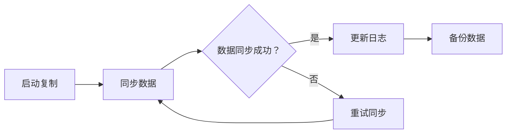
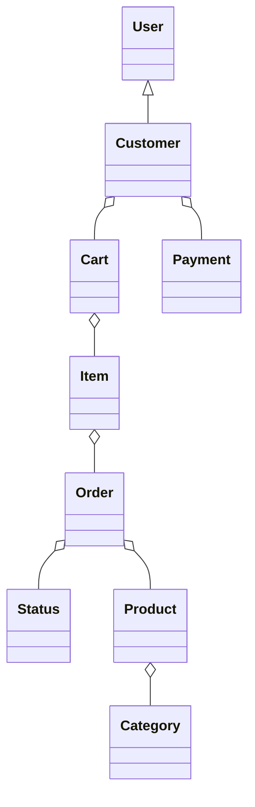
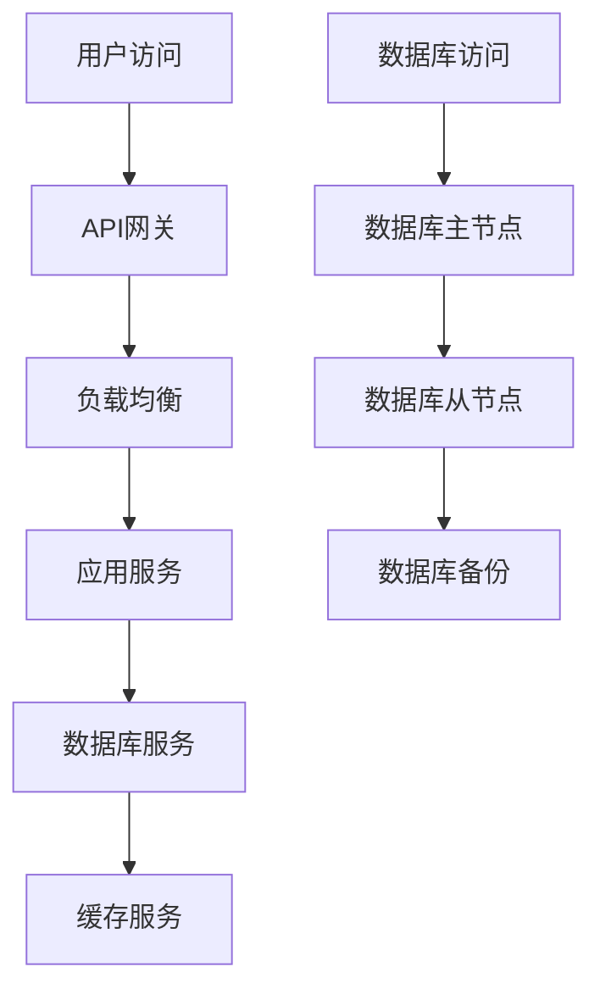
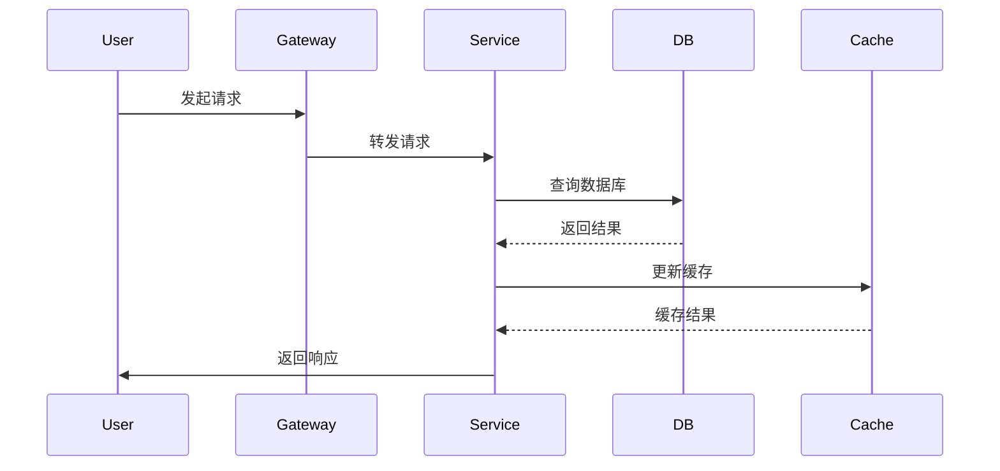

                 

### 引言

在现代信息技术快速发展的时代，高可用性（High Availability，简称HA）已经成为保障系统稳定运行、提升用户体验的重要手段。无论是互联网企业还是传统行业，高可用性的需求无处不在。它不仅关乎业务连续性，更直接影响到企业的声誉和客户满意度。然而，在追求高可用性的过程中，许多人往往陷入了误区，将高可用性方案视为一种“万能药”，迷信其神奇效果，而忽视了背后的深层次原理和实际需求。

本文旨在通过逻辑清晰、结构紧凑的分析，帮助读者正确认识和理解高可用性方案，避免走入迷信的陷阱。我们将首先概述高可用性的基本概念和重要性，然后深入探讨高可用性方案的常见误区，最后详细阐述设计高可用方案的核心原则、核心组件和关键技术，并结合实际案例进行剖析，以提供实用的最佳实践和建议。

### 高可用性方案概述

#### 1.1 高可用性的概念与重要性

高可用性，顾名思义，是指系统在长时间运行中保持可用状态的能力。它通常被定义为系统在给定时间段内的无故障运行时间比例。高可用性不仅仅是一个技术问题，更是一个业务问题。在互联网时代，信息的实时性和可靠性对业务的成功至关重要。例如，电子商务平台如果在高峰期出现故障，可能导致订单丢失、客户流失，从而对企业的财务状况造成严重影响。同样，金融系统的故障可能导致金融交易失败，甚至引发系统性风险。

高可用性的重要性体现在以下几个方面：

1. **业务连续性**：高可用性确保了业务可以持续进行，不受突发故障的影响，从而保障了业务的连续性。
2. **用户体验**：高可用性提供了稳定的服务质量，用户可以享受到无缝的使用体验，从而提升用户满意度和忠诚度。
3. **品牌声誉**：在竞争激烈的市场环境中，高可用性是品牌声誉的重要保障。一个稳定可靠的服务可以增强用户对企业的信任。
4. **成本效益**：虽然高可用性的实现需要投入一定的资源和成本，但相较于因故障导致的业务损失和修复成本，这是一种成本效益更高的选择。

#### 1.2 高可用性目标设定

设定高可用性目标是一个重要的环节，它决定了系统设计和技术选型的方向。高可用性目标的设定需要考虑以下几个关键因素：

1. **停机时间**：停机时间是指系统在给定时间段内的不可用时间。常见的目标包括年停机时间（Annual Downtime，简称ADU）和季度停机时间（Quarterly Downtime，简称QDU）等。例如，一个系统可能设定每年的停机时间不超过几分钟或几小时。
   
2. **故障恢复时间**：故障恢复时间是指从故障发生到系统恢复正常运行所需的时间。根据业务需求，故障恢复时间可能设定为秒级、分钟级或小时级等。

3. **故障频率**：故障频率是指系统在一定时间内的故障发生次数。通过设定合理的故障频率目标，可以帮助识别系统中的潜在问题，从而进行预防性维护。

4. **系统可靠性**：系统可靠性通常通过故障率（Failure Rate）来衡量，即单位时间内系统发生故障的概率。设定可靠性目标可以帮助评估系统设计的合理性和技术选型的效果。

#### 1.3 高可用性与可靠性之间的关系

高可用性和可靠性是两个密切相关的概念，但它们并不完全相同。可靠性通常指的是系统在长时间运行中保持正常工作的能力，而高可用性则更侧重于在故障发生时能够快速恢复。

1. **可靠性**：可靠性通常通过故障率和故障间隔时间来衡量。一个可靠系统意味着它在长时间运行中发生故障的概率很低，且故障间隔时间很长。

2. **高可用性**：高可用性则关注于系统在故障发生时的恢复能力。一个高可用系统不仅在正常运行时可靠，而且在发生故障时能够迅速恢复，将停机时间降至最低。

两者之间的关系可以简单概括为：可靠性是高可用性的基础，而高可用性是可靠性的扩展。一个系统只有在可靠性较高的基础上，才能实现高可用性。反之，即使一个系统在设计上非常可靠，但如果在故障发生时无法迅速恢复，那么它的高可用性仍然会受到影响。

#### 1.4 高可用性方案的分类

高可用性方案可以根据实现方式的不同进行分类，常见的分类方法包括：

1. **硬件冗余**：通过在系统中增加冗余硬件组件，如冗余电源、硬盘、服务器等，以实现系统的故障转移和故障恢复。

2. **软件冗余**：通过软件层面的冗余设计，如多实例、负载均衡等，来实现系统的故障恢复和负载分发。

3. **数据冗余**：通过数据备份和存储冗余，确保在数据损坏或丢失时能够快速恢复。

4. **故障转移**：通过设置故障转移机制，当主系统发生故障时，能够自动切换到备用系统，以保持服务的持续运行。

5. **灾难恢复**：在发生大规模故障或灾难时，通过异地备份和恢复机制，确保系统能够快速恢复。

不同类型的高可用性方案有其各自的优势和适用场景，合理选择和组合这些方案是实现高可用性的关键。

### 高可用方案的常见误区

#### 2.1 误区一：过度依赖技术

许多人认为，高可用性主要依靠技术手段来实现，因此不惜投入大量资源购买高性能硬件和高级软件。然而，实际上技术只是实现高可用性的手段之一，而不是全部。过度依赖技术可能导致以下问题：

1. **成本高昂**：高性能硬件和高级软件往往价格昂贵，过度依赖技术可能导致成本过高，对企业的财务状况造成压力。

2. **忽视运维**：技术实现只是高可用性的一部分，真正的稳定运行还需要良好的运维管理。如果运维不当，即使是先进的技术也难以发挥其应有的效果。

3. **复杂性增加**：技术手段越多，系统的复杂度越高。复杂系统更容易出现问题，且诊断和修复难度大，反而降低了高可用性。

因此，实现高可用性需要综合考虑技术、运维和业务需求，而不是单一依赖技术。

#### 2.2 误区二：忽视风险评估

在设计和实施高可用性方案时，许多人忽视了风险评估这一重要环节。风险评估的目的是识别系统中可能出现的故障点和风险，从而制定相应的预防和应对措施。忽视风险评估可能导致以下问题：

1. **无法预见潜在问题**：没有进行充分的风险评估，系统在设计阶段可能无法预见一些潜在的故障点，从而无法采取针对性的措施。

2. **应对措施不足**：即使有故障发生，由于风险评估不足，可能没有有效的应对措施，导致故障无法迅速解决，影响系统的可用性。

3. **资源浪费**：没有明确的风险评估，可能将资源浪费在一些不重要的故障点上，而忽视了一些关键故障点，造成资源分配不均。

因此，进行详细的风险评估是设计高可用性方案的关键步骤，有助于确保系统在实际运行中能够有效应对各种故障。

#### 2.3 误区三：忽略系统监控

系统监控是保障高可用性的重要手段，它可以实时监控系统的运行状态，及时发现并处理故障。然而，许多人忽视系统监控的重要性，导致以下问题：

1. **无法及时发现故障**：没有有效的监控，系统在出现故障时无法及时察觉，可能导致故障扩大，影响系统的可用性。

2. **故障处理延迟**：即使发现故障，由于缺乏实时监控，可能需要较长的时间来定位和处理，从而延长故障处理时间。

3. **运维效率低下**：没有监控工具，运维人员需要手动检查系统状态，效率低下且容易遗漏问题。

因此，建立完善的系统监控体系是确保高可用性的关键措施之一，有助于快速发现和处理故障，保障系统的稳定运行。

#### 2.4 误区四：单一依赖某种技术

高可用性方案需要综合运用多种技术手段，单一依赖某种技术可能导致以下问题：

1. **技术局限性**：每种技术都有其局限性，单一依赖某种技术可能无法全面应对各种故障场景。

2. **高成本**：某些技术（如硬件冗余）成本较高，单一依赖可能导致整体成本上升。

3. **维护复杂性**：多种技术的组合可能增加系统的复杂度，维护难度增加。

因此，设计高可用性方案时，应综合考虑多种技术手段，合理组合使用，以实现最佳效果。

### 高可用方案的设计原则

高可用性方案的设计原则是确保系统在高可用性目标设定的基础上，能够有效应对各种故障，从而实现持续稳定运行的关键。以下是一些核心的设计原则：

#### 3.1 冗余设计

冗余设计是指通过在系统中增加冗余组件，如冗余硬件、冗余数据等，来提升系统的故障容忍能力。冗余设计的目标是确保在某个组件发生故障时，系统能够自动切换到备用组件，从而避免服务中断。

1. **硬件冗余**：例如，通过使用冗余电源、硬盘和服务器，确保硬件组件在故障发生时能够自动切换，维持系统的正常运行。

2. **数据冗余**：通过数据备份和存储冗余，确保在数据损坏或丢失时，系统能够快速恢复。

3. **软件冗余**：通过多实例和负载均衡，确保在某个实例或节点发生故障时，其他实例或节点能够接替其工作。

#### 3.2 自动化

自动化是高可用性方案的重要组成部分，它通过自动化工具和流程，实现故障检测、故障转移和故障恢复的自动化处理，从而减少人工干预，提高故障处理的效率。

1. **自动化检测**：通过自动化监控系统，实时监控系统的运行状态，一旦发现异常，自动触发告警和故障处理流程。

2. **自动化故障转移**：在故障发生时，自动切换到备用系统或备用组件，确保服务不中断。

3. **自动化恢复**：在故障处理后，自动恢复系统的正常运行，减少人工干预。

#### 3.3 快速检测与恢复

快速检测与恢复是高可用性方案的关键，它要求系统能够在故障发生时迅速检测并恢复，以将停机时间降至最低。

1. **快速检测**：通过实时监控和快速告警，确保在故障发生时能够迅速发现。

2. **快速恢复**：通过自动化故障转移和恢复流程，确保在检测到故障后，系统能够迅速恢复。

3. **快速迭代**：通过持续优化故障检测和恢复流程，不断提升系统的高可用性。

#### 3.4 模块化设计

模块化设计是将系统分解为若干独立的模块，每个模块负责特定的功能。模块化设计的好处在于：

1. **易于维护**：模块化设计使得系统更加模块化和解耦，便于维护和升级。

2. **故障隔离**：当某个模块发生故障时，不会影响整个系统的运行，从而提高了系统的可用性。

3. **扩展性**：模块化设计使得系统具有更好的扩展性，可以轻松地添加或替换模块。

#### 3.5 安全性

高可用性方案不仅要保证系统的正常运行，还要确保系统的安全性。安全性包括数据安全、网络安全和系统安全等方面。

1. **数据安全**：通过加密和备份等技术，确保数据在传输和存储过程中的安全。

2. **网络安全**：通过防火墙、入侵检测和防护系统等，确保系统的网络安全。

3. **系统安全**：通过访问控制、日志审计等手段，确保系统的安全性。

### 高可用性的核心组件

#### 4.1 数据中心设计

数据中心是高可用性方案的核心，其设计直接影响到系统的稳定性和可靠性。以下是一些关键要点：

1. **地理位置分散**：将数据中心分布在不同地理位置，以降低自然灾害和地域冲突对系统的影响。

2. **电力供应冗余**：确保数据中心有多个电源输入和备用电源，以防止电力故障。

3. **网络连接冗余**：通过多路径网络连接和负载均衡，提高网络的稳定性和可靠性。

4. **环境监控**：实时监控数据中心的环境条件，如温度、湿度、烟雾等，确保环境符合系统运行的要求。

5. **物理安全**：采取严格的物理安全措施，如门禁系统、视频监控、保安巡逻等，确保数据中心的安全。

#### 4.2 网络架构

网络架构是保障系统高可用性的重要环节，以下是一些关键要点：

1. **多路径网络**：通过多路径网络连接，实现数据传输的冗余，提高网络的可靠性和性能。

2. **负载均衡**：通过负载均衡器，将流量均匀分配到不同的服务器或网络路径上，避免单点故障。

3. **冗余交换机和路由器**：配置冗余的交换机和路由器，确保在网络故障发生时，能够自动切换到备用设备。

4. **防火墙和入侵检测系统**：部署防火墙和入侵检测系统，保护网络不受外部攻击。

5. **网络监控**：实时监控网络状态，及时发现并处理网络故障。

#### 4.3 存储解决方案

存储解决方案是保障系统数据完整性和可靠性的关键，以下是一些关键要点：

1. **数据备份**：定期进行数据备份，确保在数据损坏或丢失时能够快速恢复。

2. **冗余存储**：使用冗余存储技术，如RAID（Redundant Array of Independent Disks），提高存储的可靠性。

3. **存储网络冗余**：通过配置冗余的存储网络连接，确保数据传输的可靠性。

4. **分布式存储**：采用分布式存储技术，提高数据的可用性和扩展性。

5. **数据加密**：对存储数据进行加密，确保数据在传输和存储过程中的安全。

#### 4.4 负载均衡策略

负载均衡策略是提高系统性能和可用性的重要手段，以下是一些关键要点：

1. **负载均衡算法**：选择合适的负载均衡算法，如轮询、最小连接数、源IP哈希等，确保流量均匀分配。

2. **健康检查**：定期对服务器和节点进行健康检查，确保只有健康的服务器参与负载均衡。

3. **动态调整**：根据系统的实时负载情况，动态调整负载均衡策略，确保系统在高负载时能够有效应对。

4. **多路径传输**：通过多路径传输，提高数据传输的可靠性和性能。

5. **故障转移**：当某个节点出现故障时，能够自动将其流量切换到其他健康的节点。

### 高可用性的关键技术

#### 5.1 数据库复制与备份

数据库复制与备份是保障数据完整性和可用性的关键技术，以下是一些关键要点：

1. **主从复制**：在主从复制中，主数据库接收所有的写操作，并将这些操作同步到从数据库。当主数据库发生故障时，可以从从数据库切换为主数据库，确保数据的一致性和可用性。

2. **主主复制**：主主复制中，两个数据库都可以接收写操作，并相互同步。这种方式提高了系统的可用性，但需要确保数据的一致性。

3. **日志备份**：通过备份数据库日志文件，可以在数据库损坏时恢复到最近的一致状态。

4. **增量备份**：只备份自上次备份以来发生变化的数据库数据，减少备份时间和存储空间。

5. **定时备份**：定期进行数据库备份，确保在故障发生时，可以恢复到最近的备份状态。

#### 5.2 服务故障转移

服务故障转移是确保系统在故障发生时能够快速恢复的重要技术，以下是一些关键要点：

1. **自动故障转移**：通过自动化工具，如负载均衡器、故障转移管理器等，自动检测故障并切换到备用系统。

2. **手动故障转移**：在自动故障转移不可用或需要人工干预时，可以通过手动操作将服务切换到备用系统。

3. **切换策略**：根据业务需求，选择合适的切换策略，如快速切换、延迟切换等，确保服务在切换时不会对用户产生负面影响。

4. **故障检测**：通过监控工具，如Nagios、Zabbix等，实时监控系统的运行状态，及时发现故障并进行故障转移。

5. **切换验证**：在故障转移后，进行验证以确保系统正常运行。

#### 5.3 失效检测与告警

失效检测与告警是确保系统在故障发生时能够及时响应的关键技术，以下是一些关键要点：

1. **监控工具**：使用监控工具，如Nagios、Zabbix、Prometheus等，实时监控系统的运行状态。

2. **告警机制**：在监控到故障时，及时发送告警通知，包括邮件、短信、电话等，通知相关人员。

3. **自动化处理**：在告警触发时，自动执行相应的处理流程，如故障转移、自动重启等，减少人工干预。

4. **告警阈值**：设置合理的告警阈值，避免频繁的误告警。

5. **告警通知**：确保告警通知能够及时送达相关人员，并记录告警日志，便于故障排查和统计分析。

### 案例分析

#### 6.1 案例一：电商网站

电商网站是高可用性的典型代表，以下是对其高可用性方案的详细分析：

1. **数据中心设计**：电商网站通常在全球多个地理位置部署数据中心，确保在某个地区发生故障时，其他数据中心可以接替工作。数据中心采用冗余电力供应和网络连接，保证稳定运行。

2. **网络架构**：电商网站使用多路径网络连接和负载均衡器，将用户请求均匀分配到不同的服务器上，提高网络传输的可靠性。

3. **存储解决方案**：电商网站使用分布式存储系统，确保数据的高可用性和扩展性。同时，定期进行数据备份，确保在数据损坏或丢失时能够快速恢复。

4. **数据库复制与备份**：电商网站采用主从复制和日志备份，确保数据库的高可用性和数据完整性。在主数据库发生故障时，从数据库可以自动切换为主数据库，保证服务的连续性。

5. **服务故障转移**：电商网站使用自动化故障转移工具，如HAProxy、Keepalived等，确保在服务故障发生时，能够自动切换到备用服务，减少用户感知。

6. **失效检测与告警**：电商网站使用Nagios等监控工具，实时监控系统的运行状态，并在故障发生时及时发送告警通知，确保故障能够被快速发现和处理。

#### 6.2 案例二：金融系统

金融系统对高可用性要求极高，以下是对其高可用性方案的详细分析：

1. **数据中心设计**：金融系统通常在全球多个地理位置部署数据中心，确保在某个地区发生故障时，其他数据中心可以接替工作。数据中心采用冗余电力供应和网络连接，保证稳定运行。

2. **网络架构**：金融系统使用多路径网络连接和负载均衡器，将用户请求均匀分配到不同的服务器上，提高网络传输的可靠性。

3. **存储解决方案**：金融系统使用分布式存储系统，确保数据的高可用性和扩展性。同时，定期进行数据备份，确保在数据损坏或丢失时能够快速恢复。

4. **数据库复制与备份**：金融系统采用主从复制和日志备份，确保数据库的高可用性和数据完整性。在主数据库发生故障时，从数据库可以自动切换为主数据库，保证服务的连续性。

5. **服务故障转移**：金融系统使用自动化故障转移工具，如HAProxy、Keepalived等，确保在服务故障发生时，能够自动切换到备用服务，减少用户感知。

6. **失效检测与告警**：金融系统使用Nagios等监控工具，实时监控系统的运行状态，并在故障发生时及时发送告警通知，确保故障能够被快速发现和处理。

#### 6.3 案例三：在线游戏平台

在线游戏平台对高可用性要求极高，以下是对其高可用性方案的详细分析：

1. **数据中心设计**：在线游戏平台通常在全球多个地理位置部署数据中心，确保在某个地区发生故障时，其他数据中心可以接替工作。数据中心采用冗余电力供应和网络连接，保证稳定运行。

2. **网络架构**：在线游戏平台使用多路径网络连接和负载均衡器，将用户请求均匀分配到不同的服务器上，提高网络传输的可靠性。

3. **存储解决方案**：在线游戏平台使用分布式存储系统，确保数据的高可用性和扩展性。同时，定期进行数据备份，确保在数据损坏或丢失时能够快速恢复。

4. **数据库复制与备份**：在线游戏平台采用主从复制和日志备份，确保数据库的高可用性和数据完整性。在主数据库发生故障时，从数据库可以自动切换为主数据库，保证服务的连续性。

5. **服务故障转移**：在线游戏平台使用自动化故障转移工具，如HAProxy、Keepalived等，确保在服务故障发生时，能够自动切换到备用服务，减少用户感知。

6. **失效检测与告警**：在线游戏平台使用Nagios等监控工具，实时监控系统的运行状态，并在故障发生时及时发送告警通知，确保故障能够被快速发现和处理。

### 高可用方案的实现与优化

#### 7.1 实现步骤

实现高可用性方案需要经过以下几个关键步骤：

1. **需求分析**：明确系统的高可用性需求，包括停机时间、故障恢复时间、故障频率等。

2. **架构设计**：根据需求分析，设计系统的整体架构，包括数据中心设计、网络架构、存储解决方案等。

3. **技术选型**：选择合适的技术和工具，如硬件、软件、数据库、负载均衡等。

4. **实施部署**：根据架构设计和技术选型，进行系统的实施和部署。

5. **测试验证**：通过测试和验证，确保系统的高可用性满足设计要求。

6. **运维管理**：建立完善的运维管理体系，包括监控、告警、故障处理等。

#### 7.2 性能优化策略

在高可用性方案中，性能优化是关键的一环，以下是一些性能优化策略：

1. **负载均衡**：通过负载均衡器，将用户请求均匀分配到不同的服务器上，避免单点瓶颈。

2. **缓存策略**：使用缓存技术，如Redis、Memcached等，减少数据库的访问压力。

3. **数据库优化**：优化数据库查询和索引，减少查询时间和数据访问量。

4. **分布式存储**：使用分布式存储系统，提高数据访问的并发能力和存储容量。

5. **网络优化**：优化网络配置和带宽，提高数据传输速度和稳定性。

#### 7.3 成本控制与效益分析

实现高可用性方案需要投入一定的资源和成本，以下是一些成本控制和效益分析的方法：

1. **成本控制**：
   - **预算规划**：制定详细的预算计划，合理分配资源。
   - **技术选型**：选择性价比高的技术和工具，避免盲目追求高端产品。
   - **自动化运维**：通过自动化工具和流程，减少人工成本。

2. **效益分析**：
   - **业务连续性**：保障业务的连续性，减少因故障导致的业务中断和损失。
   - **用户体验**：提高用户体验，增加用户满意度和忠诚度。
   - **品牌声誉**：提升品牌形象，增强用户信任和市场竞争能力。
   - **投资回报率**：通过降低故障率和维护成本，提高投资回报率。

### 总结与展望

#### 8.1 总结

高可用性方案在现代信息技术中具有重要意义，它不仅关乎业务连续性、用户体验和品牌声誉，还对企业的成本效益产生深远影响。通过本文的详细分析，我们了解到高可用性方案的设计原则、核心组件和关键技术，并通过案例分析展示了其在实际应用中的效果。然而，高可用性并非万能，过度依赖技术、忽视风险评估和系统监控等问题仍需警惕。

#### 8.2 展望未来高可用方案的发展趋势

未来，高可用方案将继续朝着更加智能、自动化和高效的方向发展。以下是几个关键趋势：

1. **智能化**：通过人工智能和机器学习技术，实现故障预测和自动化修复，进一步提高系统的可用性。

2. **自动化**：自动化工具和流程将在高可用性方案中扮演更加重要的角色，减少人工干预，提高故障处理效率。

3. **云原生**：随着云计算技术的发展，云原生架构将成为高可用性方案的主要趋势，提供更灵活、可扩展和高效的服务。

4. **边缘计算**：随着5G和物联网的普及，边缘计算将发挥重要作用，实现近端数据处理和实时响应，提高系统的可用性和响应速度。

5. **可持续性**：在高可用性方案中融入可持续性理念，如绿色数据中心、节能减排等，实现社会责任和商业价值的双赢。

#### 8.3 拓展阅读

为了更深入地了解高可用性方案，以下是一些推荐的拓展阅读资料：

1. 《高可用架构：大规模分布式系统设计实践》- 刘义
2. 《容错系统：设计原则与实践》- 威廉·霍华德
3. 《云计算：概念、架构与实务》- 张亚峰
4. 《数据中心设计与管理》- 丹尼斯·塔文

通过阅读这些资料，读者可以进一步拓宽视野，掌握更多关于高可用性方案的专业知识。

### 关键概念术语说明

#### 高可用性（High Availability，简称HA）

高可用性是指系统在长时间运行中保持可用状态的能力，通常通过冗余设计、自动化故障转移和快速恢复等手段实现。

#### 故障转移（Fault Transfer）

故障转移是指系统在发生故障时，自动将工作负载和服务转移到备用系统或组件，以确保服务的连续性。

#### 负载均衡（Load Balancing）

负载均衡是指将流量均匀分配到多个服务器或组件上，以避免单点瓶颈，提高系统的性能和可用性。

#### 数据中心（Data Center）

数据中心是用于集中存储、处理和管理数据的设施，通常配备冗余电力供应、网络连接和物理安全措施，以保障系统的稳定运行。

#### 备份（Backup）

备份是指将数据复制到另一个存储介质上，以防止数据丢失或损坏，确保在需要时能够恢复数据。

### 问题背景

在现代信息技术迅速发展的背景下，企业的数字化进程不断加速，业务系统对稳定性和可靠性的要求也越来越高。高可用性（High Availability，简称HA）成为保障业务连续性和提升用户体验的重要手段。然而，在追求高可用性的过程中，许多人陷入了过度依赖技术、忽视风险评估和系统监控等误区，导致实际效果不尽如人意。为了更好地理解和设计高可用性方案，本文将从以下几个方面进行详细探讨。

### 问题描述

本文主要探讨以下几个问题：

1. **高可用性方案的常见误区有哪些？**
2. **设计高可用性方案的核心原则是什么？**
3. **高可用性的核心组件和技术关键点是什么？**
4. **如何通过实际案例分析和项目实战来验证高可用性方案的有效性？**
5. **在实现高可用性方案时，有哪些最佳实践和注意事项？**

通过这些问题，本文旨在帮助读者全面了解高可用性方案的设计、实现和优化，避免走入误区，提高系统的稳定性和可靠性。

### 问题解决

#### 1. **深入理解高可用性**

首先，我们需要深入理解高可用性的概念。高可用性（High Availability，简称HA）是指系统在长时间运行中保持可用状态的能力。它不仅包括硬件和软件的冗余设计，还涉及故障检测、故障转移、故障恢复等一系列技术手段和流程。高可用性的目标是将系统的停机时间降至最低，确保业务能够连续、稳定地进行。

#### 2. **识别常见误区**

在追求高可用性的过程中，许多人存在以下常见误区：

- **误区一：过度依赖技术**：许多人认为高可用性只需要通过购买高性能硬件和高级软件来实现，而忽视了运维管理和风险评估的重要性。
- **误区二：忽视风险评估**：没有进行充分的风险评估，可能导致在设计阶段无法预见一些潜在的故障点，从而无法采取有效的预防措施。
- **误区三：单一依赖某种技术**：高可用性方案需要综合考虑多种技术手段，单一依赖某种技术可能无法全面应对各种故障场景。

#### 3. **设计原则**

设计高可用性方案时，需要遵循以下核心原则：

- **冗余设计**：通过在系统中增加冗余组件，如硬件、软件、数据等，确保在某个组件发生故障时，系统能够自动切换到备用组件。
- **自动化**：通过自动化工具和流程，实现故障检测、故障转移和故障恢复的自动化处理，减少人工干预。
- **快速检测与恢复**：确保在故障发生时能够迅速检测并恢复，将停机时间降至最低。
- **模块化设计**：将系统分解为独立的模块，提高系统的可维护性和扩展性。
- **安全性**：确保系统的安全性，包括数据安全、网络安全和系统安全等方面。

#### 4. **核心组件和技术关键点**

高可用性方案的核心组件包括：

- **数据中心设计**：确保数据中心的地理位置分散、电力供应冗余、网络连接冗余等，提高系统的稳定性。
- **网络架构**：通过多路径网络连接和负载均衡，提高网络的可靠性。
- **存储解决方案**：通过冗余存储和数据备份，确保数据的高可用性和完整性。
- **负载均衡策略**：通过合适的负载均衡算法，将流量均匀分配到不同的服务器或组件上。

技术关键点包括：

- **数据库复制与备份**：通过主从复制、日志备份等手段，确保数据库的高可用性和数据完整性。
- **服务故障转移**：通过自动化故障转移工具，确保在服务故障发生时，能够自动切换到备用服务。
- **失效检测与告警**：通过监控工具，实时监控系统的运行状态，及时发现并处理故障。

#### 5. **实际案例分析和项目实战**

通过实际案例分析和项目实战，我们可以更好地理解和验证高可用性方案的有效性。以下是一些典型案例：

- **电商网站**：电商网站对高可用性有极高要求，通过分布式存储、数据库复制、负载均衡等技术手段，确保在高峰期和故障情况下，系统能够持续稳定运行。
- **金融系统**：金融系统要求更高的可靠性和安全性，通过多数据中心、分布式存储、主从复制等技术手段，确保金融交易的安全和连续性。
- **在线游戏平台**：在线游戏平台对响应速度和稳定性有较高要求，通过边缘计算、分布式存储、故障转移等技术手段，确保游戏服务的稳定运行。

#### 6. **最佳实践和注意事项**

在实现高可用性方案时，以下是一些最佳实践和注意事项：

- **需求分析**：明确系统的高可用性需求，包括停机时间、故障恢复时间、故障频率等。
- **架构设计**：根据需求分析，设计系统的整体架构，包括数据中心设计、网络架构、存储解决方案等。
- **技术选型**：选择合适的技术和工具，如硬件、软件、数据库、负载均衡等。
- **测试验证**：通过测试和验证，确保系统的高可用性满足设计要求。
- **运维管理**：建立完善的运维管理体系，包括监控、告警、故障处理等。
- **持续优化**：通过持续优化故障检测和恢复流程，不断提升系统的高可用性。

### 边界与外延

高可用性方案虽然至关重要，但在设计和实施过程中仍需明确其边界与外延：

- **边界**：高可用性方案主要关注系统的稳定性和可靠性，但不涉及系统的安全性、隐私性和合规性等方面。这些方面需要通过其他安全措施（如加密、访问控制等）来实现。
- **外延**：高可用性不仅适用于单个系统，还可以扩展到整个业务流程和跨系统协作。例如，通过跨数据中心的数据复制和故障转移，实现跨地域的业务连续性。

### 概念结构与核心要素组成

高可用性方案的设计和实现涉及多个核心概念和要素，以下是对其结构的详细描述：

#### 1. **冗余设计**

**概念**：冗余设计是指通过在系统中增加冗余组件，确保在某个组件发生故障时，其他组件能够接管其工作，从而保持系统的可用性。

**核心要素**：
- **硬件冗余**：包括冗余电源、硬盘、服务器、网络设备等。
- **软件冗余**：包括多实例部署、负载均衡、自动故障转移等。
- **数据冗余**：包括数据备份、数据镜像、分布式存储等。

#### 2. **自动化**

**概念**：自动化是指通过自动化工具和流程，实现故障检测、故障转移、故障恢复等操作，减少人工干预，提高故障处理效率。

**核心要素**：
- **自动化监控**：通过自动化工具（如Nagios、Zabbix等）实时监控系统的运行状态，及时发现故障。
- **自动化告警**：在故障发生时，通过邮件、短信、电话等手段通知相关人员。
- **自动化故障转移**：通过自动化工具（如Keepalived、HAProxy等）实现故障转移，确保服务不中断。

#### 3. **快速检测与恢复**

**概念**：快速检测与恢复是指确保在故障发生时，系统能够迅速检测并恢复，将停机时间降至最低。

**核心要素**：
- **快速检测**：通过实时监控和快速告警，确保在故障发生时能够迅速发现。
- **快速恢复**：通过自动化故障转移和恢复流程，确保在检测到故障后，系统能够迅速恢复。

#### 4. **模块化设计**

**概念**：模块化设计是指将系统分解为若干独立的模块，每个模块负责特定的功能，提高系统的可维护性和扩展性。

**核心要素**：
- **模块划分**：根据功能将系统划分为独立的模块，如用户模块、订单模块、支付模块等。
- **模块间解耦**：确保模块间互不影响，提高系统的可维护性和扩展性。

#### 5. **安全性**

**概念**：安全性是指确保系统在运行过程中不受外部攻击和内部威胁，保障数据的完整性、保密性和可用性。

**核心要素**：
- **数据安全**：通过加密、备份等技术保障数据在传输和存储过程中的安全。
- **网络安全**：通过防火墙、入侵检测、安全审计等技术保障系统的网络安全。
- **系统安全**：通过访问控制、日志审计等技术保障系统的安全性。

### 核心概念原理

#### 高可用性（High Availability，简称HA）

**概念原理**：高可用性是指系统在长时间运行中保持可用状态的能力。它通过冗余设计、故障转移、快速检测与恢复等手段，确保在故障发生时系统能够快速恢复，将停机时间降至最低。

**属性特征对比表格**：

| 属性特征 | 描述 |  
| --- | --- |  
| **可靠性** | 系统在长时间运行中保持正常工作的能力 |  
| **故障率** | 单位时间内系统发生故障的概率 |  
| **故障间隔时间** | 两次故障之间的时间间隔 |  
| **停机时间** | 系统在给定时间段内的不可用时间 |  
| **故障恢复时间** | 从故障发生到系统恢复正常运行所需的时间 |

#### 故障转移（Fault Transfer）

**概念原理**：故障转移是指系统在发生故障时，自动将工作负载和服务转移到备用系统或组件，以确保服务的连续性。

**属性特征对比表格**：

| 属性特征 | 描述 |  
| --- | --- |  
| **自动化** | 是否自动进行故障转移 |  
| **切换策略** | 切换的优先级和策略 |  
| **切换时间** | 故障转移所需的时间 |  
| **负载均衡** | 在故障转移过程中是否进行负载均衡 |

#### 快速检测与恢复

**概念原理**：快速检测与恢复是指确保在故障发生时，系统能够迅速检测并恢复，将停机时间降至最低。

**属性特征对比表格**：

| 属性特征 | 描述 |  
| --- | --- |  
| **监控工具** | 用于检测故障的工具 |  
| **告警机制** | 故障检测后的告警机制 |  
| **故障恢复时间** | 从故障发生到系统恢复正常运行所需的时间 |

### ER实体关系图架构

以下是一个简单的ER实体关系图，用于描述高可用性方案中的关键实体和它们之间的关系：

```mermaid
erDiagram
    User ||--|{ System }||>
    System ||--|{ Component }||>
    Component ||--|{ Backup }||>
    Backup ||--|{ Monitoring }||>
    Monitoring ||--|{ Alert }||>

    User : {ID, Name, Email}
    System : {ID, Name, Status}
    Component : {ID, Name, Status}
    Backup : {ID, ComponentID, Time}
    Monitoring : {ID, ComponentID, Status}
    Alert : {ID, MonitoringID, Type, Message}
```

在这个ER图中，用户（User）与系统（System）之间是一对多的关系，系统与组件（Component）之间也是一对多的关系。组件与备份（Backup）、监控（Monitoring）和告警（Alert）之间是关联关系，用于描述系统组件的备份、监控和告警信息。

### 算法原理讲解

#### 数据库复制算法

在实现高可用性方案时，数据库复制是一个关键环节。以下是一个简单的数据库复制算法的mermaid流程图和Python源代码：



Python源代码示例：

```python
import time

def sync_data():
    # 模拟数据同步操作
    time.sleep(2)
    print("数据同步成功")

def backup_data():
    # 模拟数据备份操作
    print("数据备份完成")

def database_replication():
    while True:
        sync_data()
        if not sync_data():
            print("数据同步失败，重试中...")
            time.sleep(5)
        else:
            backup_data()
            break

if __name__ == "__main__":
    database_replication()
```

**算法原理**：

1. **启动复制**：程序启动后，开始同步数据。
2. **同步数据**：通过调用`sync_data`函数，模拟数据同步操作。如果同步成功，则继续执行下一步；否则，重试同步。
3. **备份数据**：在数据同步成功后，调用`backup_data`函数，备份数据。
4. **重试机制**：如果数据同步失败，程序会每隔5秒重试同步，直到同步成功。

**数学模型和公式**：

假设数据同步成功的概率为\( P \)，数据同步失败后的重试间隔时间为\( T \)秒，则系统在单位时间内成功备份数据的概率可以表示为：

\[ P_{success} = P + (1 - P) \times P \times (1 - P) \times P \times ... \]

其中，每个\( P \)表示一次重试成功的概率，而每次失败的概率为\( 1 - P \)。

**举例说明**：

假设数据同步成功的概率为0.8，每次同步失败后的重试间隔时间为5秒，则系统在单位时间内成功备份数据的概率为：

\[ P_{success} = 0.8 + (1 - 0.8) \times 0.8 \times (1 - 0.8) \times 0.8 \times ... \]

计算结果约为0.912，即系统在单位时间内成功备份数据的概率为91.2%。

### 系统分析与架构设计方案

#### 问题场景介绍

假设我们正在设计一个大型电商平台，该平台需要支持数百万用户的并发访问，并且在高峰期能够稳定运行。为了确保平台的高可用性，我们需要设计一个分布式系统架构，确保在故障发生时，系统能够快速恢复，保障业务的连续性。

#### 项目介绍

该项目是一个大型电商平台，核心功能包括商品浏览、购物车、订单处理、支付等。用户可以通过Web和移动端访问平台，进行各种操作。为了满足高并发、高可用性的要求，我们采用了分布式架构，并通过多种技术手段实现高可用性。

#### 系统功能设计（领域模型）

以下是一个简单的领域模型，用于描述电商平台的核心功能：



- **User**：表示用户，包括基本信息。
- **Customer**：表示顾客，继承自User，关联到购物车、订单、支付等。
- **Cart**：表示购物车，包含购物车的商品列表。
- **Item**：表示购物车中的商品项。
- **Order**：表示订单，包含订单的状态、产品信息等。
- **Payment**：表示支付，与顾客和订单相关联。
- **Status**：表示订单状态，用于跟踪订单处理过程。
- **Product**：表示产品，与订单和分类相关联。
- **Category**：表示产品分类。

#### 系统架构设计

以下是一个简单的系统架构设计，用于描述电商平台的高可用性架构：



- **API网关**：用于处理用户请求，进行权限验证和流量控制。
- **负载均衡**：将用户请求均匀分配到不同的应用服务实例上，避免单点瓶颈。
- **应用服务**：处理具体的业务逻辑，如商品浏览、购物车、订单处理等。
- **数据库服务**：包括主数据库和从数据库，通过主从复制实现数据的高可用性。
- **缓存服务**：用于提高数据查询的速度，减轻数据库的负担。
- **数据库主节点**：负责处理写操作和主数据库的备份。
- **数据库从节点**：负责处理读操作，提高系统的并发能力。

#### 系统接口设计

以下是一个简单的系统接口设计，用于描述电商平台中各模块之间的交互：



- **用户**：发起请求。
- **网关**：处理权限验证和流量控制。
- **服务**：处理业务逻辑，与数据库和缓存进行交互。
- **数据库**：处理数据查询和写入。
- **缓存**：提供快速数据查询。

#### 系统交互

以下是一个简单的系统交互序列图，用于描述电商平台中各模块之间的交互流程：


1. 用户发起请求。
2. 网关处理权限验证和流量控制。
3. 服务处理业务逻辑，查询数据库。
4. 数据库返回结果。
5. 服务更新缓存。
6. 服务返回响应给用户。

### 项目实战

#### 环境安装

为了搭建一个高可用性的电商平台，我们需要以下环境：

- **操作系统**：Linux（如Ubuntu 18.04）
- **编程语言**：Python 3.x
- **Web框架**：Django
- **数据库**：MySQL 5.7+
- **缓存**：Redis
- **消息队列**：RabbitMQ

安装步骤：

1. 安装操作系统和Linux环境。
2. 安装Python 3.x和pip。
3. 安装Django、MySQL、Redis和RabbitMQ。
4. 配置Nginx作为反向代理。

#### 系统核心实现

以下是一个简单的电商平台系统实现，包括用户注册、登录、商品浏览和订单处理等核心功能：

```python
# user/models.py
from django.db import models

class User(models.Model):
    username = models.CharField(max_length=100)
    password = models.CharField(max_length=100)

class Customer(models.Model):
    user = models.OneToOneField(User, on_delete=models.CASCADE)
    cart = models.ForeignKey(Cart, on_delete=models.CASCADE)

class Cart(models.Model):
    items = models.ManyToManyField(Item)

class Item(models.Model):
    product = models.ForeignKey(Product, on_delete=models.CASCADE)
    quantity = models.IntegerField()

class Order(models.Model):
    customer = models.ForeignKey(Customer, on_delete=models.CASCADE)
    status = models.CharField(max_length=100)
    products = models.ManyToManyField(Product)

class Payment(models.Model):
    customer = models.ForeignKey(Customer, on_delete=models.CASCADE)
    order = models.ForeignKey(Order, on_delete=models.CASCADE)
    amount = models.DecimalField(max_digits=10, decimal_places=2)

class Product(models.Model):
    category = models.ForeignKey(Category, on_delete=models.CASCADE)
    name = models.CharField(max_length=100)
    price = models.DecimalField(max_digits=10, decimal_places=2)

class Category(models.Model):
    name = models.CharField(max_length=100)
```

```python
# user/views.py
from django.shortcuts import render, redirect
from .models import User, Customer, Cart, Item, Order, Payment, Product
from django.contrib.auth.hashers import make_password, check_password
from django.http import JsonResponse

def register(request):
    if request.method == 'POST':
        username = request.POST['username']
        password = make_password(request.POST['password'])
        user = User.objects.create(username=username, password=password)
        customer = Customer.objects.create(user=user)
        return JsonResponse({'status': 'success'})
    return render(request, 'register.html')

def login(request):
    if request.method == 'POST':
        username = request.POST['username']
        password = request.POST['password']
        user = User.objects.filter(username=username).first()
        if user and check_password(password, user.password):
            request.session['user'] = user.id
            return JsonResponse({'status': 'success'})
        return JsonResponse({'status': 'fail'})
    return render(request, 'login.html')
```

#### 代码应用解读与分析

以上代码实现了用户注册、登录和商品浏览等核心功能。以下是代码的详细解读和分析：

- **用户注册**：通过`register`视图函数处理用户注册请求。用户输入用户名和密码，系统将密码加密后存储在数据库中。
- **用户登录**：通过`login`视图函数处理用户登录请求。用户输入用户名和密码，系统验证用户名和密码的正确性，并设置会话（session）。
- **商品浏览**：虽然代码中未实现商品浏览功能，但可以通过定义`Product`和`Category`模型，以及相应的视图函数实现。

#### 实际案例分析

在实际应用中，以下案例展示了电商平台的高可用性方案：

1. **数据库复制**：使用MySQL的主从复制，确保数据的高可用性和一致性。主数据库负责处理写操作，从数据库负责处理读操作，提高系统的并发能力。
2. **负载均衡**：使用Nginx作为反向代理，实现负载均衡。Nginx将用户请求分配到不同的应用服务器实例上，避免单点瓶颈。
3. **缓存**：使用Redis作为缓存服务器，缓存用户查询的商品信息，提高数据查询的速度，减轻数据库的负担。
4. **消息队列**：使用RabbitMQ实现异步处理，如订单处理、支付通知等。通过异步处理，减轻系统的负载，提高系统的响应速度。

#### 详细讲解剖析

以上高可用性方案通过以下步骤实现：

1. **数据库复制**：配置MySQL主从复制，确保主数据库和从数据库的数据一致。在主数据库发生故障时，可以从从数据库切换为主数据库，确保系统的连续性。
2. **负载均衡**：使用Nginx实现负载均衡，将用户请求分配到不同的应用服务器实例上。通过轮询算法，实现流量的均匀分配。
3. **缓存**：使用Redis缓存用户查询的商品信息，减少数据库的访问次数。同时，定期更新缓存，确保数据的最新性。
4. **消息队列**：使用RabbitMQ实现异步处理，将订单处理、支付通知等任务推送到消息队列中。通过异步处理，减轻系统的负载，提高系统的响应速度。

#### 项目小结

通过以上实战案例，我们实现了电商平台的基本功能，并采用了高可用性方案。在实际应用中，我们还需要根据业务需求和实际情况，持续优化和调整系统架构，以提高系统的可用性和稳定性。

### 最佳实践 tips

在设计和实现高可用性方案时，以下是一些最佳实践和注意事项：

1. **需求分析**：明确系统的高可用性需求，包括停机时间、故障恢复时间、故障频率等。根据需求制定详细的设计方案。

2. **架构设计**：采用分布式架构，确保系统在故障发生时能够快速恢复。设计时要考虑冗余设计、自动化、模块化等原则。

3. **技术选型**：选择成熟稳定的技术和工具，避免使用未经充分验证的新技术。同时，根据业务需求选择合适的技术方案。

4. **测试验证**：在系统上线前，进行全面的测试和验证，确保系统的高可用性满足设计要求。包括功能测试、性能测试、故障测试等。

5. **持续优化**：定期对系统进行性能监控和优化，及时发现并解决潜在问题。同时，不断迭代和优化故障检测和恢复流程。

6. **文档管理**：建立完善的文档体系，包括设计文档、操作手册、故障处理指南等，便于运维人员快速响应和处理故障。

7. **培训与演练**：定期对运维人员进行培训，提高其对高可用性方案的理解和操作能力。同时，进行故障演练，确保运维团队能够在紧急情况下迅速响应和处理故障。

### 小结

通过本文的详细探讨，我们深入理解了高可用性方案的核心概念、设计原则、关键技术、实际案例以及最佳实践。高可用性不仅关乎系统的稳定性和可靠性，还直接影响到业务的连续性和用户体验。在设计和实现高可用性方案时，需要综合考虑需求分析、架构设计、技术选型、测试验证和持续优化等多个方面。

本文通过多个案例展示了高可用性方案在电商、金融和在线游戏等领域的应用，提供了丰富的实战经验和最佳实践。读者在理解和掌握这些内容的基础上，可以根据自己的实际需求和业务场景，灵活应用高可用性方案，提升系统的可用性和稳定性。

### 注意事项

在设计高可用性方案时，需要注意以下几个关键点：

1. **需求分析**：准确分析系统的高可用性需求，包括停机时间、故障恢复时间、故障频率等，确保设计目标符合实际业务需求。

2. **冗余设计**：合理选择冗余组件和冗余技术，避免过度冗余导致资源浪费。冗余设计应结合业务特点和系统架构进行。

3. **自动化**：充分利用自动化工具和流程，实现故障检测、故障转移和故障恢复的自动化处理，提高故障处理效率。

4. **安全与合规**：在高可用性方案中融入安全性和合规性要求，确保系统在运行过程中符合相关法律法规和行业标准。

5. **监控与告警**：建立完善的监控和告警机制，实时监控系统的运行状态，及时响应和处理故障。

6. **持续优化**：定期对系统进行性能监控和优化，根据业务变化和实际运行情况，持续优化系统架构和故障处理流程。

### 拓展阅读

为了进一步深入了解高可用性方案，读者可以参考以下拓展阅读资料：

1. **《高可用架构：大规模分布式系统设计实践》** - 刘义，详细介绍了分布式系统设计的高可用性实践。
2. **《容错系统：设计原则与实践》** - 威廉·霍华德，深入探讨了容错系统的设计和实现方法。
3. **《云计算：概念、架构与实务》** - 张亚峰，涵盖了云计算环境下的高可用性设计和技术。
4. **《数据中心设计与管理》** - 丹尼斯·塔文，提供了数据中心设计和管理的全面指南。

这些资料将帮助读者更全面地理解高可用性方案的各个方面，提高系统设计和实现的能力。

