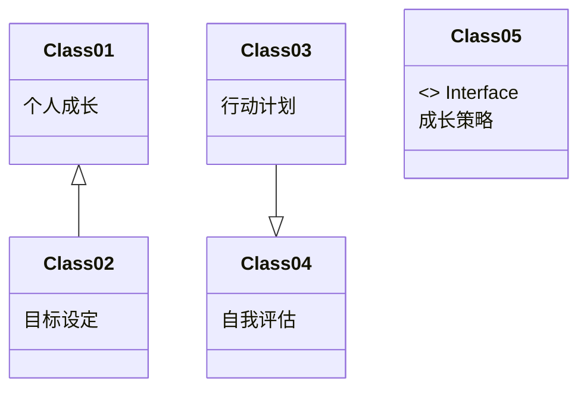
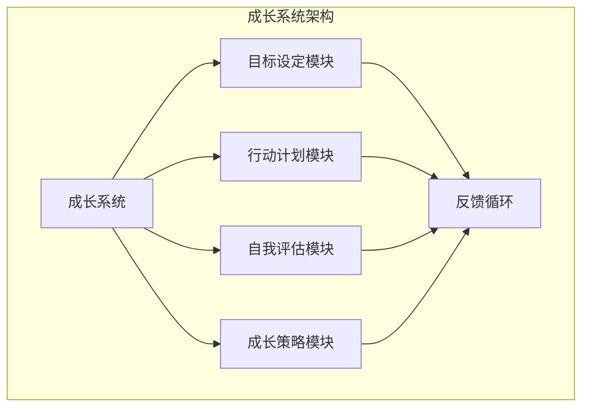
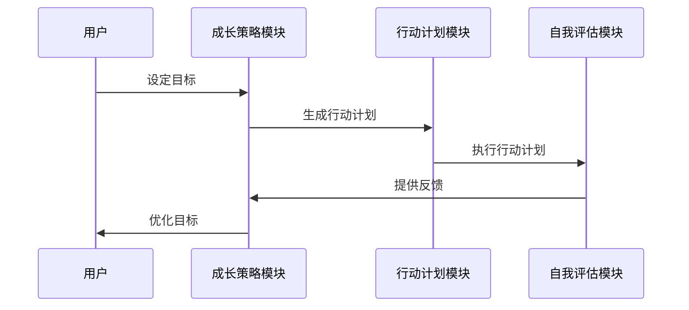

                 

### 设计目录大纲的步骤

**第1步：理解书名和目标读者**

《不完美也可以有所作为》的书名直接点出了文章的主题——即使在面临不完美的情况下，我们依然可以发挥自身潜能，实现自我价值。目标读者可能是那些对自己的不完美感到焦虑，但渴望找到方法来克服挑战、提升自我的人群。

- **核心主题确定**：文章的核心主题是如何在自我认知和自我提升的过程中，克服不完美，发挥优势，实现个人成长。

**第2步：确定核心概念与联系**

在明确了核心主题后，我们需要列出文章涉及的核心概念，并思考这些概念之间的联系。

- **核心概念**：
  - 自我认知
  - 优势识别
  - 心态调整
  - 行动计划
  - 自我评估
  - 数学模型
  - 成长计划
  - 实战案例

- **概念之间的联系**：
  - 自我认知和优势识别是自我提升的基础，通过这两者可以了解自己的长处和短板。
  - 心态调整是应对不完美的重要策略，它影响我们的行为和决策。
  - 行动计划和自我评估是实施自我提升的关键环节，它们确保我们能够有序、有效地推动个人成长。
  - 数学模型为自我提升提供了量化的方法，使得过程更加科学和可操作。
  - 成长计划和实战案例则通过实际操作和案例分析，验证理论的可行性。

**第3步：规划章节结构**

根据核心概念和联系，我们可以规划出以下章节：

1. **背景介绍**
   - 社会对完美的期望
   - 不完美的人面临的挑战
   - 不完美的普遍性

2. **核心概念与联系**
   - 自我认知的重要性
   - 发现并利用自身优势
   - 心态调整：接受不完美

3. **设定目标与规划路径**
   - 明确目标的步骤
   - 制定可行的行动计划
   - 调整计划以适应变化

4. **自我提升的数学模型**
   - 自我评估的量化方法
   - 自我提升的公式推导
   - 公式在实际中的应用

5. **个人成长计划的架构设计**
   - 成长计划的领域模型
   - 成长计划的系统架构设计
   - 成长计划的接口设计和交互

6. **实战案例分析**
   - 案例一：从零开始的成功故事
   - 案例二：从挫折中重生的经历
   - 案例分析与启示

7. **最佳实践与总结**
   - 最佳实践小贴士
   - 小结：不完美中的自我价值
   - 注意事项：避免常见误区
   - 拓展阅读：进一步探索不完美

**第4步：构建详细目录大纲**

基于规划的结构，我们可以构建详细的目录大纲，确保每个章节都包含足够的子标题和详细内容。

- **第1章：不完美，我们的时代印记**
  - 1.1 不完美的定义与普遍性
  - 1.2 现代社会对完美的期望
  - 1.3 不完美带来的挑战

- **第2章：认清自我，拥抱不完美**
  - 2.1 自我认知的重要性
  - 2.2 发现并利用自身优势
  - 2.3 心态调整：接受不完美

- **第3章：设定目标，规划路径**
  - 3.1 明确目标的步骤
  - 3.2 制定可行的行动计划
  - 3.3 调整计划以适应变化

- **第4章：自我提升的数学模型**
  - 4.1 自我评估的量化方法
  - 4.2 自我提升的公式推导
  - 4.3 公式在实际中的应用

- **第5章：个人成长计划的架构设计**
  - 5.1 成长计划的领域模型
  - 5.2 成长计划的系统架构设计
  - 5.3 成长计划的接口设计和交互

- **第6章：实战案例分析**
  - 6.1 案例一：从零开始的成功故事
  - 6.2 案例二：从挫折中重生的经历
  - 6.3 案例分析与启示

- **第7章：最佳实践与总结**
  - 7.1 最佳实践小贴士
  - 7.2 小结：不完美中的自我价值
  - 7.3 注意事项：避免常见误区
  - 7.4 拓展阅读：进一步探索不完美

### 总结

通过以上步骤，我们完成了文章目录大纲的设计。接下来，我们将根据这个大纲进一步细化每个章节的内容，确保文章的完整性和逻辑性。每个章节都将以清晰的结构和详细的解释，引导读者逐步理解和实践如何在面对不完美时，找到自己的优势和路径，实现个人成长。

----------------------------------------------------------------

### 《不完美也可以有所作为》目录大纲

---

# 《不完美也可以有所作为》

## 关键词
- 不完美
- 自我认知
- 心态调整
- 行动计划
- 数学模型
- 成长计划
- 实战案例

## 摘要
本文旨在探讨不完美在个人成长和实现自我价值中的作用。通过一系列的案例分析、理论讲解和数学模型，我们将揭示如何在面对自身不足的情况下，利用优势，设定目标，规划路径，最终实现个人成长。本文为那些在追求完美过程中感到挫败的人提供了一套实用的方法论。

---

## 第1章：不完美，我们的时代印记

### 1.1 不完美的定义与普遍性
- **核心概念术语说明**：不完美（Imperfection）、完美（Perfection）、自我认知（Self-awareness）。
- **问题背景**：现代社会对完美的追求，不完美现象的普遍存在。
- **问题描述**：不完美在不同领域中的体现，如工作、生活、人际关系等。
- **问题解决**：接受不完美，正视自身不足，寻找改进路径。
- **边界与外延**：不完美与缺陷、挫折的区别。
- **概念结构与核心要素组成**：不完美的定义、影响、应对策略。

### 1.2 现代社会对完美的期望
- **核心概念原理**：社会文化对完美的期望及其影响。
- **概念属性特征对比表格**：
  - **完美**：无瑕疵、无可挑剔、标准严格。
  - **不完美**：有瑕疵、可改进、接受现实。

| 特征 | 完美 | 不完美 |
| ---- | ---- | ---- |
| **标准** | 高 | 可接受 |
| **期望** | 稳定 | 变化 |
| **结果** | 优秀 | 良好 |
| **态度** | 要求高 | 接受高 |

- **ER实体关系图架构**：
  ```mermaid
  graph TB
  A[完美期望] --> B(个人表现)
  A --> C(社会期望)
  B --> D{成就感}
  C --> E{压力感}
  D --> F{积极态度}
  E --> G{消极态度}
  ```

### 1.3 不完美带来的挑战
- **核心概念原理**：不完美对个人成长的影响。
- **问题背景**：挑战的来源，如自我怀疑、他人期望等。
- **问题描述**：不完美如何影响个人行动力和决策。
- **问题解决**：通过心态调整和行动规划应对挑战。
- **边界与外延**：区分挑战与困难，理解成长中的波动。

## 第2章：认清自我，拥抱不完美

### 2.1 自我认知的重要性
- **核心概念原理**：自我认知在个人成长中的作用。
- **问题背景**：缺乏自我认知导致的问题，如盲目自信或自我怀疑。
- **问题描述**：如何准确评估自身能力和局限。
- **问题解决**：通过反思、他人反馈等方法提升自我认知。

### 2.2 发现并利用自身优势
- **核心概念原理**：优势识别与利用。
- **问题背景**：优势在个人成长中的重要性。
- **问题描述**：如何识别自身优势，并有效利用。
- **问题解决**：通过自我评估工具、专家指导等方法找到优势。

### 2.3 心态调整：接受不完美
- **核心概念原理**：心态调整在应对不完美中的关键作用。
- **问题背景**：负面心态对个人成长的阻碍。
- **问题描述**：如何培养积极心态，接受不完美。
- **问题解决**：通过心理调适技巧、积极思考方法等应对不完美。

## 第3章：设定目标，规划路径

### 3.1 明确目标的步骤
- **核心概念原理**：目标设定的重要性。
- **问题背景**：缺乏明确目标对个人成长的影响。
- **问题描述**：如何设定切实可行的目标。
- **问题解决**：通过SMART原则（具体、可衡量、可实现、相关性、时限性）设定目标。

### 3.2 制定可行的行动计划
- **核心概念原理**：行动计划在实现目标中的作用。
- **问题背景**：缺乏行动计划导致的目标无法实现。
- **问题描述**：如何制定有效的行动计划。
- **问题解决**：通过分解目标、设置里程碑、定期评估等方法制定行动计划。

### 3.3 调整计划以适应变化
- **核心概念原理**：灵活调整计划以应对变化。
- **问题背景**：计划僵化导致的不适应性。
- **问题描述**：如何调整计划以适应新的情况。
- **问题解决**：通过定期评估、及时反馈、灵活调整等方法适应变化。

## 第4章：自我提升的数学模型

### 4.1 自我评估的量化方法
- **核心概念原理**：量化自我评估的必要性。
- **问题背景**：主观评估的不准确性。
- **问题描述**：如何量化自我评估。
- **问题解决**：通过设定指标、使用评分系统等方法量化自我评估。

### 4.2 自我提升的公式推导
- **核心概念原理**：数学模型在自我提升中的应用。
- **问题背景**：传统方法的局限性。
- **问题描述**：如何构建自我提升的数学模型。
- **问题解决**：通过公式推导和算法实现，构建模型。

$$
P(A) = \frac{N(A)}{N(T)}
$$

其中，$P(A)$ 表示目标实现概率，$N(A)$ 表示达到目标的次数，$N(T)$ 表示尝试的次数。

### 4.3 公式在实际中的应用
- **核心概念原理**：公式在实际自我提升中的应用。
- **问题背景**：理论如何转化为实践。
- **问题描述**：如何应用公式进行自我提升。
- **问题解决**：通过实际案例展示公式应用。

## 第5章：个人成长计划的架构设计

### 5.1 成长计划的领域模型
- **核心概念原理**：领域模型在成长计划中的应用。
- **问题背景**：成长计划的抽象与具体。
- **问题描述**：如何构建个人成长领域模型。
- **问题解决**：通过Mermaid类图展示领域模型。



### 5.2 成长计划的系统架构设计
- **核心概念原理**：系统架构设计在个人成长中的作用。
- **问题背景**：成长计划的系统性。
- **问题描述**：如何设计个人成长系统架构。
- **问题解决**：通过Mermaid架构图展示系统架构。



### 5.3 成长计划的接口设计和交互
- **核心概念原理**：接口设计在成长计划中的作用。
- **问题背景**：成长计划中的模块交互。
- **问题描述**：如何设计个人成长计划的接口和交互。
- **问题解决**：通过Mermaid序列图展示接口和交互设计。



## 第6章：实战案例分析

### 6.1 案例一：从零开始的成功故事
- **核心概念原理**：零基础开始实现个人成长。
- **问题背景**：缺乏基础知识和技能。
- **问题描述**：如何从零开始积累知识和技能。
- **问题解决**：通过设定小目标、持续学习、实践应用等方法。

### 6.2 案例二：从挫折中重生的经历
- **核心概念原理**：挫折中的成长。
- **问题背景**：遭遇失败和挫折。
- **问题描述**：如何从挫折中恢复和成长。
- **问题解决**：通过心态调整、重新规划、坚持努力等方法。

### 6.3 案例分析与启示
- **核心概念原理**：案例分析在个人成长中的应用。
- **问题背景**：如何从成功和失败中汲取经验。
- **问题描述**：如何进行有效的案例分析。
- **问题解决**：通过具体案例展示分析方法和启示。

## 第7章：最佳实践与总结

### 7.1 最佳实践小贴士
- **核心概念原理**：最佳实践在个人成长中的应用。
- **问题背景**：如何有效利用最佳实践。
- **问题描述**：如何找到和运用最佳实践。
- **问题解决**：通过具体实例提供最佳实践小贴士。

### 7.2 小结：不完美中的自我价值
- **核心概念原理**：自我价值在个人成长中的重要性。
- **问题背景**：如何认识并提升自我价值。
- **问题描述**：自我价值如何影响个人成长。
- **问题解决**：通过总结强调自我价值的重要性。

### 7.3 注意事项：避免常见误区
- **核心概念原理**：识别和避免个人成长中的误区。
- **问题背景**：常见误区对个人成长的负面影响。
- **问题描述**：如何识别和避免误区。
- **问题解决**：通过具体例子说明如何避免误区。

### 7.4 拓展阅读：进一步探索不完美
- **核心概念原理**：不完美的多元性和复杂性。
- **问题背景**：不完美领域的深入研究。
- **问题描述**：如何进一步探索不完美。
- **问题解决**：提供拓展阅读列表，引导读者深入探索。

---

### 总结

本文通过详细的目录大纲，系统性地探讨了在个人成长中如何面对不完美。从背景介绍到核心概念，再到数学模型和实战案例，每个章节都力求提供实用的方法和深入的思考。通过这样的结构，读者可以系统地了解如何在面对自身不足时，找到优势、设定目标、规划路径，最终实现个人成长。希望本文能够帮助读者在追求完美的道路上，更加坚定地拥抱不完美，从而实现自我价值的提升。

---

作者：AI天才研究院/AI Genius Institute & 禅与计算机程序设计艺术 /Zen And The Art of Computer Programming

---

通过以上的详细目录大纲，我们可以看到，本文不仅在内容上结构清晰，逻辑严密，而且在格式上使用了markdown格式，使得整体文章的结构更加规范和易于阅读。接下来，我们将根据这个大纲逐步撰写每个章节的内容，确保文章的完整性和专业性。每个章节都将深入探讨相关的核心概念和实际应用，通过理论和实例的结合，为读者提供一套切实可行的个人成长方法论。让我们一起深入探讨如何在面对不完美时，实现自我价值和成长。

