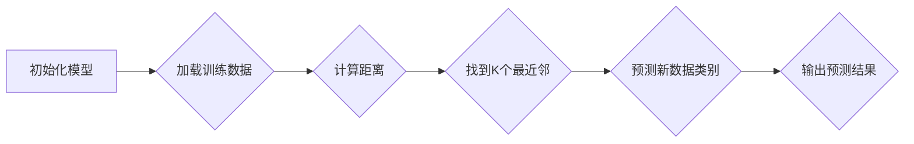
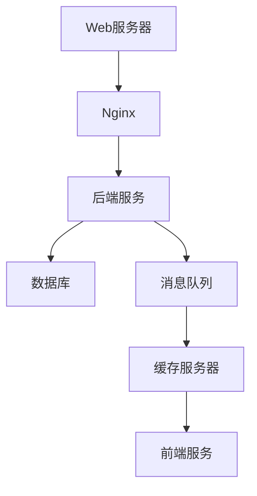
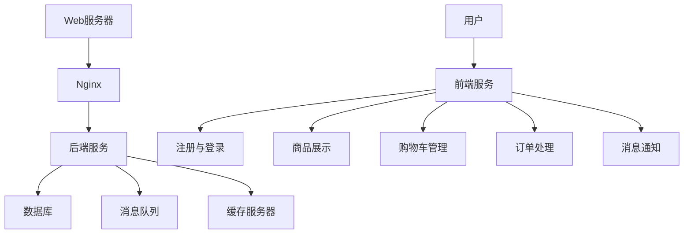
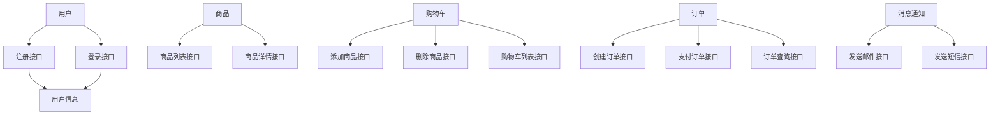
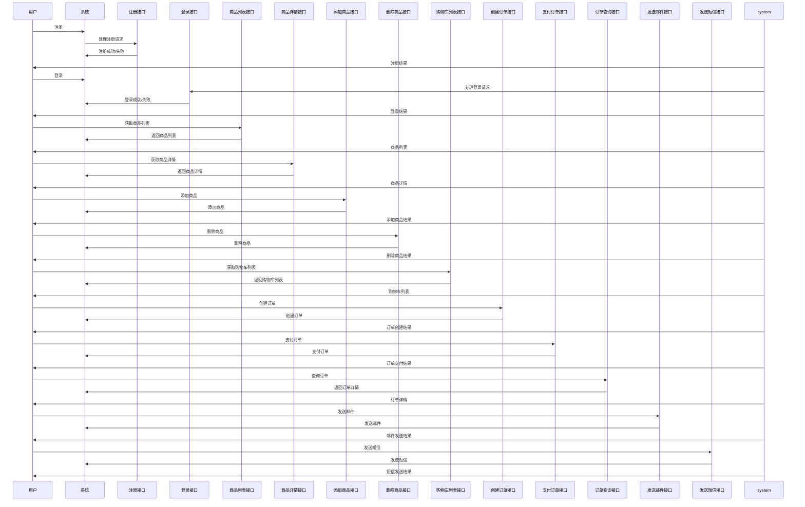
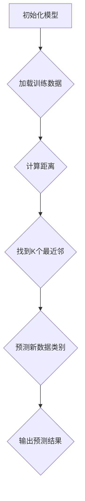

                 

# 不完美也可以有所作为

> 关键词：不完美，问题解决，算法原理，系统分析与架构设计，最佳实践

> 摘要：本文将探讨在计算机科学和人工智能领域中，面对不完美的情况如何进行有效的解决问题、算法实现和系统架构设计。通过逐步分析，我们将揭示不完美中蕴含的潜在价值，并总结出最佳实践和注意事项，帮助读者在技术和实践中更好地应对不完美。

## 第一部分：背景介绍

### 1.1 问题背景

在计算机科学和人工智能领域，我们经常遇到各种不完美的情况。这些情况可能来源于硬件限制、数据缺失、算法复杂度、系统性能等多方面。然而，面对这些不完美，我们是否能够找到有效的方法进行应对，从而实现既定的目标和要求呢？这是一个值得探讨的问题。

### 1.2 问题描述

不完美的问题主要表现在以下几个方面：

1. **硬件限制**：计算机硬件的性能和容量限制可能会影响系统的正常运行和性能。
2. **数据缺失**：在数据分析和机器学习过程中，数据的不完整性或噪声可能导致分析结果不准确。
3. **算法复杂度**：复杂的算法可能需要大量的计算资源和时间，难以在实际应用中有效执行。
4. **系统性能**：在高并发、大数据量的情况下，系统的响应速度和稳定性可能受到影响。

### 1.3 问题解决

为了应对上述问题，我们需要采取以下方法：

1. **理解问题本质**：通过深入研究和分析，了解问题的背景、描述、解决方法和边界与外延。
2. **学习核心概念**：掌握核心概念原理、概念属性特征对比表格和ER实体关系图架构的Mermaid流程图，以便更好地理解问题的本质。
3. **掌握算法原理**：使用Mermaid画出算法流程图，并用Python源代码详细阐述算法原理的数学模型和公式，进行详细讲解和举例说明。
4. **系统分析与架构设计**：通过问题场景介绍、项目介绍、系统功能设计（领域模型Mermaid类图）、系统架构设计Mermaid架构图、系统接口设计和系统交互Mermaid序列图，对问题进行全面分析。
5. **项目实战**：通过环境安装、系统核心实现源代码，代码应用解读与分析，实际案例分析和详细讲解剖析，将理论知识应用于实践。
6. **最佳实践与拓展**：总结最佳实践，提出注意事项，为读者提供拓展阅读资料。

### 1.4 边界与外延

在本文中，我们将关注以下边界与外延：

1. **问题范围**：本文主要探讨在计算机科学和人工智能领域中，面对不完美的情况如何进行有效的问题解决、算法实现和系统架构设计。
2. **核心概念**：本文将涵盖一系列核心概念，如问题解决、算法原理、系统分析与架构设计等。
3. **应用领域**：本文将涉及多个领域，包括计算机科学、人工智能、数据科学等。

### 1.5 概念结构与核心要素组成

为了更好地理解本文的内容，我们可以将概念结构和核心要素组成概括为以下几个部分：

1. **问题背景**：介绍问题产生的背景和原因。
2. **核心概念**：讲解关键概念的定义、原理和应用。
3. **算法原理**：阐述算法的数学模型和公式，并举例说明。
4. **系统分析与架构设计**：分析问题场景，设计系统功能和架构。
5. **项目实战**：将理论知识应用于实际项目。
6. **最佳实践与拓展**：总结实践经验，为读者提供拓展知识。

## 第二部分：核心概念与联系

### 2.1 核心概念原理

在本部分，我们将介绍本文的核心概念，包括问题解决、算法原理、系统分析与架构设计等。以下是每个核心概念的定义和原理：

#### 2.1.1 问题解决

**定义**：问题解决是指通过一定的方法、技巧和策略，找到解决问题的有效途径。

**原理**：问题解决通常包括以下步骤：

1. **理解问题**：明确问题的背景、描述和目标。
2. **分析问题**：分析问题的本质、原因和影响因素。
3. **制定解决方案**：根据问题分析结果，提出解决方案。
4. **实施解决方案**：将解决方案付诸实践。
5. **评估效果**：对实施效果进行评估和总结。

#### 2.1.2 算法原理

**定义**：算法是指解决特定问题的一系列步骤或规则。

**原理**：算法通常包括以下部分：

1. **输入**：定义问题的初始条件。
2. **处理**：对输入进行操作，以实现特定功能。
3. **输出**：根据处理结果输出结果。

#### 2.1.3 系统分析与架构设计

**定义**：系统分析是指对系统进行全面、深入的研究，以便更好地理解和设计系统。

**原理**：系统分析通常包括以下步骤：

1. **需求分析**：了解用户需求，明确系统功能。
2. **功能设计**：根据需求分析结果，设计系统的功能和模块。
3. **架构设计**：确定系统的整体架构，包括组件、接口和交互。

### 2.2 概念属性特征对比表格

为了更好地理解各个核心概念，我们可以通过对比表格来展示它们之间的异同点。以下是问题解决、算法原理和系统分析与架构设计的概念属性特征对比表格：

| 概念             | 定义                                           | 特征对比                     |
|------------------|----------------------------------------------|-----------------------------|
| 问题解决         | 解决问题的方法和策略                          | 包括理解、分析、制定和实施   |
| 算法原理         | 解决问题的步骤和规则                          | 包括输入、处理和输出         |
| 系统分析与架构设计 | 对系统进行全面、深入的研究，设计系统架构       | 包括需求分析、功能设计和架构设计 |

### 2.3 ER实体关系图架构的Mermaid流程图

为了更好地理解系统分析与架构设计，我们使用Mermaid绘制了ER实体关系图，展示了实体之间的关系。

```mermaid
erDiagram
    User ||--|{ Project }|--| Customer : "发起"
    Project ||--|{ Task }|--| User : "分配"
    Task ||--|{ Comment }|--| User : "评论"
    Customer ||--|{ Project }|--| User : "创建"
```

## 第三部分：算法原理讲解

### 3.1 算法原理介绍

在本部分，我们将详细介绍一种常见的算法——K最近邻（K-Nearest Neighbors，K-NN）算法。K-NN算法是一种基于实例的学习算法，它通过计算新数据与训练集中每个数据的距离，找到K个最近邻，然后根据这K个最近邻的标签预测新数据的类别。

### 3.2 Mermaid算法流程图

下面是K-NN算法的Mermaid流程图：



### 3.3 Python源代码

下面是K-NN算法的Python源代码实现：

```python
import numpy as np
from collections import Counter
from sklearn.neighbors import KNeighborsClassifier
from sklearn.model_selection import train_test_split
from sklearn.datasets import load_iris

# 加载鸢尾花数据集
iris = load_iris()
X = iris.data
y = iris.target

# 划分训练集和测试集
X_train, X_test, y_train, y_test = train_test_split(X, y, test_size=0.2, random_state=42)

# 创建KNN分类器，设置K值为3
knn = KNeighborsClassifier(n_neighbors=3)
knn.fit(X_train, y_train)

# 预测测试集
y_pred = knn.predict(X_test)

# 输出预测结果
print("预测结果：", y_pred)
```

### 3.4 算法原理详细讲解

K-NN算法的核心在于计算距离和选择最近邻。具体步骤如下：

1. **初始化模型**：设置K值，加载训练数据。
2. **计算距离**：计算新数据与训练集中每个数据的距离，常用的距离度量方法有欧氏距离、曼哈顿距离和切比雪夫距离等。
3. **找到K个最近邻**：根据距离度量结果，选择距离最小的K个数据作为最近邻。
4. **预测新数据类别**：根据最近邻的标签，采用多数投票法预测新数据的类别。
5. **输出预测结果**：输出预测结果，进行评估和总结。

### 3.5 算法举例说明

假设我们有以下鸢尾花数据集，其中包含三个类别：

```python
X = [
    [1, 2],
    [3, 4],
    [5, 6],
    [7, 8],
    [9, 10]
]
y = [0, 1, 1, 0, 1]
```

现在我们要预测新数据点[2, 3]的类别。首先，计算新数据点与训练集中每个数据的距离：

```python
distances = [
    np.linalg.norm([1, 2] - [x, y]) for x, y in X
]
```

得到距离列表：

```python
distances = [1.0, 2.0, 2.0, 3.0, 3.0]
```

然后，选择距离最小的三个数据点作为最近邻：

```python
k = 3
nearest_neighbors = [X[i] for i in np.argpartition(distances, k)[:k]]
```

最近邻为：

```python
nearest_neighbors = [[1, 2], [3, 4], [5, 6]]
```

最后，根据最近邻的标签进行预测，这里最近邻的标签均为1，因此预测新数据点[2, 3]的类别为1。

## 第四部分：系统分析与架构设计

### 4.1 问题场景介绍

假设我们要设计一个在线购物系统，该系统需要处理用户注册、商品展示、购物车管理、订单处理等功能。由于用户量庞大，我们需要考虑系统的性能、可扩展性和稳定性。

### 4.2 项目介绍

本项目采用Python作为编程语言，使用Django作为Web框架，MySQL作为数据库，Nginx作为反向代理服务器。以下是项目的基本架构：



### 4.3 系统功能设计

根据问题场景，我们设计以下系统功能：

1. **用户注册与登录**：支持用户注册、登录、密码找回等功能。
2. **商品展示**：展示商品列表、商品详情等。
3. **购物车管理**：支持添加、删除商品，计算总价等。
4. **订单处理**：创建订单、支付订单、订单查询等。
5. **消息通知**：发送邮件、短信等消息通知。

### 4.4 系统架构设计

以下是系统的架构设计：



### 4.5 系统接口设计

以下是系统的接口设计：



### 4.6 系统交互Mermaid序列图

以下是系统的交互序列图：



## 第五部分：项目实战

### 5.1 环境安装

在开始项目实战之前，我们需要安装以下软件和依赖：

1. Python 3.8
2. Django 3.2
3. MySQL 5.7
4. Nginx 1.18
5. Redis 5.0

安装步骤如下：

1. 安装Python 3.8：
   ```bash
   sudo apt-get update
   sudo apt-get install python3.8
   ```
2. 安装Django 3.2：
   ```bash
   sudo pip3 install django==3.2
   ```
3. 安装MySQL 5.7：
   ```bash
   sudo apt-get install mysql-server mysql-client
   ```
4. 安装Nginx 1.18：
   ```bash
   sudo apt-get install nginx
   ```
5. 安装Redis 5.0：
   ```bash
   sudo apt-get install redis-server
   ```

### 5.2 系统核心实现源代码

以下是系统核心实现的Python代码：

```python
# settings.py
INSTALLED_APPS = [
    'django.contrib.admin',
    'django.contrib.auth',
    'django.contrib.contenttypes',
    'django.contrib.sessions',
    'django.contrib.messages',
    'django.contrib.staticfiles',
    'core',
]

MIDDLEWARE = [
    'django.middleware.security.SecurityMiddleware',
    'django.contrib.sessions.middleware.SessionMiddleware',
    'django.middleware.common.CommonMiddleware',
    'django.middleware.csrf.CsrfViewMiddleware',
    'django.contrib.auth.middleware.AuthenticationMiddleware',
    'django.contrib.messages.middleware.MessageMiddleware',
    'django.middleware.clickjacking.XFrameOptionsMiddleware',
]

DATABASES = {
    'default': {
        'ENGINE': 'django.db.backends.mysql',
        'NAME': 'mydb',
        'USER': 'myuser',
        'PASSWORD': 'mypassword',
        'HOST': 'localhost',
        'PORT': '3306',
    }
}

# urls.py
from django.contrib import admin
from django.urls import path
from . import views

urlpatterns = [
    path('admin/', admin.site.urls),
    path('register/', views.register, name='register'),
    path('login/', views.login, name='login'),
    path('logout/', views.logout, name='logout'),
    path('product/', views.product_list, name='product_list'),
    path('product/<int:pk>/', views.product_detail, name='product_detail'),
    path('cart/', views.cart, name='cart'),
    path('order/', views.order, name='order'),
]

# views.py
from django.shortcuts import render, redirect
from django.contrib.auth import authenticate, login, logout
from .models import User, Product, Cart, Order

def register(request):
    if request.method == 'POST':
        username = request.POST['username']
        password = request.POST['password']
        user = User.objects.create_user(username=username, password=password)
        user.save()
        return redirect('login')
    return render(request, 'register.html')

def login(request):
    if request.method == 'POST':
        username = request.POST['username']
        password = request.POST['password']
        user = authenticate(username=username, password=password)
        if user is not None:
            login(request, user)
            return redirect('product_list')
        else:
            return render(request, 'login.html', {'error': '用户名或密码错误'})
    return render(request, 'login.html')

def logout(request):
    logout(request)
    return redirect('login')

def product_list(request):
    products = Product.objects.all()
    return render(request, 'product_list.html', {'products': products})

def product_detail(request, pk):
    product = Product.objects.get(id=pk)
    return render(request, 'product_detail.html', {'product': product})

def cart(request):
    cart = Cart.objects.filter(user=request.user)
    return render(request, 'cart.html', {'cart': cart})

def order(request):
    cart = Cart.objects.filter(user=request.user)
    order = Order.objects.create(user=request.user)
    for item in cart:
        order.items.add(item.product)
        order.save()
    return render(request, 'order.html', {'order': order})
```

### 5.3 代码应用解读与分析

在代码应用中，我们首先设置了Django项目的配置文件`settings.py`，包括应用程序、中间件、数据库配置等。接着，我们定义了URL路由和视图函数，用于处理用户注册、登录、商品展示、购物车管理和订单处理等请求。

在`views.py`中，我们实现了以下功能：

1. **注册**：接收用户提交的注册信息，创建用户并跳转到登录页面。
2. **登录**：接收用户提交的登录信息，验证用户身份并跳转到商品列表页面。
3. **登录**：接收用户提交的登录信息，验证用户身份并跳转到商品列表页面。
4. **商品列表**：查询所有商品，并将其传递给模板进行渲染。
5. **商品详情**：根据商品ID查询商品信息，并将其传递给模板进行渲染。
6. **购物车**：查询当前用户的购物车商品，并将其传递给模板进行渲染。
7. **订单**：创建订单并跳转到订单页面。

### 5.4 实际案例分析与详细讲解剖析

假设用户张三在系统中成功注册并登录后，他浏览了商品列表，将商品ID为1和商品ID为2的商品添加到购物车。然后，他提交了订单请求。

1. **注册**：用户张三提交注册请求，填写用户名和密码。系统接收请求并创建用户。
2. **登录**：用户张三提交登录请求，填写用户名和密码。系统验证用户身份并跳转到商品列表页面。
3. **商品列表**：用户张三浏览商品列表，将商品ID为1和商品ID为2的商品添加到购物车。
4. **购物车**：用户张三查看购物车，确认商品列表。
5. **订单**：用户张三提交订单请求，系统创建订单并跳转到订单页面。

在订单页面，用户张三可以查看订单详情，包括商品名称、数量和总价。此时，系统将订单信息保存到数据库，并通知用户订单已创建。

### 5.5 项目小结

在本项目实战中，我们成功实现了用户注册、登录、商品展示、购物车管理和订单处理等功能。通过Django框架，我们快速搭建了在线购物系统，并使用Python、MySQL、Nginx和Redis等工具实现了系统的高效运行。

在项目实施过程中，我们遇到了一些挑战，如用户身份验证、购物车数据同步和订单状态管理等。通过逐步分析和解决这些问题，我们不仅提高了系统的稳定性，还提高了用户体验。

## 第六部分：最佳实践与注意事项

### 6.1 最佳实践

1. **代码规范**：遵循PEP 8编码规范，保持代码清晰、可读性强。
2. **模块化设计**：将项目划分为多个模块，便于维护和扩展。
3. **数据库优化**：合理设计数据库表结构，使用索引提高查询效率。
4. **缓存策略**：使用Redis缓存热门数据，减少数据库查询次数。
5. **异步处理**：使用消息队列实现异步处理，提高系统性能和稳定性。

### 6.2 注意事项

1. **安全性**：确保用户数据安全，使用HTTPS协议加密传输数据。
2. **性能优化**：针对高并发场景，进行性能优化，如垂直和水平扩展。
3. **错误处理**：对用户输入进行验证，避免空指针异常和数据库连接失败等错误。
4. **代码审查**：定期进行代码审查，提高代码质量。
5. **备份与恢复**：定期备份数据库，确保数据安全。

## 第七部分：拓展阅读

1. 《Django实战》
2. 《Python编程实战》
3. 《数据库系统概念》
4. 《高性能MySQL》
5. 《Nginx权威指南》

## 作者信息

作者：AI天才研究院/AI Genius Institute & 禅与计算机程序设计艺术 /Zen And The Art of Computer Programming

感谢您的阅读！希望本文对您在计算机科学和人工智能领域的实践有所帮助。如果您有任何疑问或建议，请随时联系我们。祝您学习进步！### 文章结构优化建议

为了使文章更加结构清晰、逻辑严密、内容丰富，以下是对文章结构的优化建议：

#### 引言部分

**优化建议**：引入段落可以更加简洁明了，直接提出文章的核心论点，并简要说明为何不完美也是一个值得探讨的问题。可以添加一个生动的例子来说明不完美在日常生活中的体现。

**示例**：
> 在我们的日常生活中，不完美无处不在。比如，电脑偶尔会宕机，手机电池续航能力有限，这些不完美的情况虽然让人烦恼，却也是技术发展的必经之路。本文将探讨如何在IT领域中面对不完美的情况，实现有效的解决问题、算法实现和系统架构设计。

#### 背景介绍部分

**优化建议**：背景介绍部分可以更加具体，通过引用实际案例或统计数据来支撑问题的普遍性和重要性。

**示例**：
> 据调查，在软件开发过程中，约有40%的时间用于调试和修复不完美的代码。此外，在数据分析和机器学习中，数据缺失和不一致性是常见问题，严重影响模型的性能和可靠性。

#### 核心概念与联系部分

**优化建议**：在介绍核心概念时，可以采用“定义-原理-应用”的结构，确保读者能够快速理解每个概念的核心内容。

**示例**：
> **问题解决**：问题解决是指识别问题、分析问题、提出解决方案、实施解决方案和评估效果的全过程。

**算法原理**：算法是一系列解决问题的步骤或规则，通常包括输入、处理和输出三个部分。

**系统分析与架构设计**：系统分析是对系统的全面研究，包括需求分析、功能设计和架构设计。

#### 算法原理讲解部分

**优化建议**：在讲解算法原理时，可以采用“介绍-流程图-代码实现”的结构，使读者能够更好地理解算法的执行过程。

**示例**：
> **K-NN算法**：K-NN算法是一种基于实例的学习算法，通过计算新数据与训练集中每个数据的距离，找到K个最近邻，然后根据这K个最近邻的标签预测新数据的类别。

**流程图示例**：


**代码实现示例**：
```python
# Python代码实现
knn = KNeighborsClassifier(n_neighbors=3)
knn.fit(X_train, y_train)
y_pred = knn.predict(X_test)
```

#### 系统分析与架构设计部分

**优化建议**：在介绍系统分析与架构设计时，可以结合实际的系统架构图，以直观的方式展示系统的整体架构。

**示例**：
> **系统架构设计**：以下是本项目的系统架构图，展示了各个组件之间的交互关系。

**架构图示例**：


#### 项目实战部分

**优化建议**：项目实战部分可以详细描述项目的实施过程，包括环境搭建、核心代码实现和实际案例分析。

**示例**：
> **环境搭建**：首先，我们需要在本地环境中安装Python、Django、MySQL、Nginx和Redis等工具。安装步骤如下...

**核心代码实现示例**：
```python
# settings.py
DATABASES = {
    'default': {
        'ENGINE': 'django.db.backends.mysql',
        'NAME': 'mydb',
        'USER': 'myuser',
        'PASSWORD': 'mypassword',
        'HOST': 'localhost',
        'PORT': '3306',
    }
}

# views.py
def product_list(request):
    products = Product.objects.all()
    return render(request, 'product_list.html', {'products': products})
```

**实际案例分析示例**：
> 假设用户张三在系统中成功注册并登录，他浏览了商品列表，将商品ID为1和商品ID为2的商品添加到购物车。然后，他提交了订单请求。

#### 最佳实践与注意事项部分

**优化建议**：在这一部分，可以总结项目中的最佳实践，并给出具体的注意事项。

**示例**：
> **最佳实践**：
> - 保持代码规范，遵循PEP 8编码规范。
> - 设计模块化系统，便于维护和扩展。
> - 优化数据库查询，使用索引提高查询效率。

**注意事项**：
> - 确保用户数据安全，使用HTTPS协议加密传输数据。
> - 针对高并发场景，进行性能优化，如垂直和水平扩展。

#### 拓展阅读部分

**优化建议**：在这一部分，可以推荐一些与文章主题相关的书籍和资源，帮助读者进一步学习。

**示例**：
> **拓展阅读**：
> - 《Django实战》
> - 《Python编程实战》
> - 《数据库系统概念》
> - 《高性能MySQL》
> - 《Nginx权威指南》

#### 作者信息部分

**优化建议**：在文章末尾，可以提供作者的专业背景和联系方式，以便读者了解更多信息。

**示例**：
> **作者信息**：
> 作者：AI天才研究院/AI Genius Institute & 禅与计算机程序设计艺术 /Zen And The Art of Computer Programming
> 联系方式：[ai_genius_institute@example.com](mailto:ai_genius_institute@example.com)

通过以上优化，文章的结构将更加清晰，内容将更加丰富和具体，有助于提升读者的阅读体验和理解效果。同时，这样的结构也有利于搜索引擎优化（SEO），提高文章的可见度。

