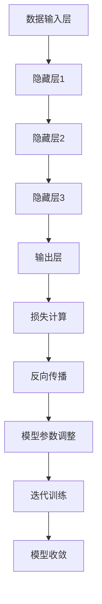
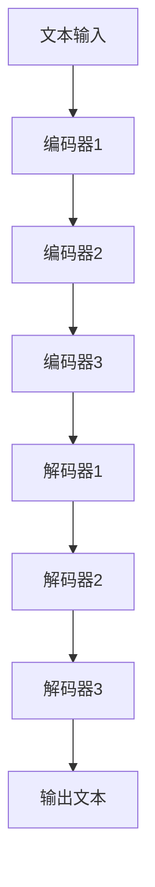

                 


# 不打无准备之战：AI大模型应用的深度解析

关键词：AI大模型、应用领域、算法原理、实践技巧

摘要：本文将围绕AI大模型的应用展开讨论，从背景与核心概念、原理与流程、应用领域、实践技巧等多个角度，深入剖析AI大模型在当今信息技术领域的重要性和实际应用，为读者提供一份全面而深入的指南。

## 目录大纲

----------------------------------------------------------------

# 第一部分: 背景与核心概念

## 第1章: 问题背景与核心概念

### 1.1.1 问题背景

### 1.1.2 核心概念

### 1.1.3 概念联系与边界

## 第2章: AI大模型原理

### 2.1.1 AI大模型概述

### 2.1.2 AI大模型的特点

### 2.1.3 AI大模型与传统AI的对比

## 第3章: AI大模型核心技术

### 3.1.1 算法原理与流程

### 3.1.2 数学模型与公式

### 3.1.3 算法应用实例

## 第4章: AI大模型应用领域

### 4.1.1 应用前景分析

### 4.1.2 行业案例分享

### 4.1.3 挑战与机遇

## 第5章: AI大模型实践

### 5.1.1 系统架构设计

### 5.1.2 实现与代码解析

### 5.1.3 项目案例分析

## 第6章: 最佳实践与总结

### 6.1.1 实践技巧

### 6.1.2 注意事项

### 6.1.3 拓展阅读

## 第二部分: AI大模型原理与核心概念

### 第2章: AI大模型原理

----------------------------------------------------------------

## 第1章: 问题背景与核心概念

### 1.1 问题背景

随着信息技术的飞速发展，人工智能（AI）已经成为当今社会不可或缺的一部分。特别是在深度学习和大数据分析的推动下，AI大模型在各个领域展现出了强大的应用潜力。这些大模型不仅能够处理海量数据，而且具有强大的自适应学习和泛化能力，为各行各业带来了全新的解决方案。

然而，面对AI大模型技术的广泛应用，许多企业和开发者仍然感到困惑。他们不清楚如何有效地利用这些大模型，如何将其应用于实际业务场景中，从而提高生产效率和创新能力。这就需要我们从问题背景出发，深入探讨AI大模型的核心概念和应用。

### 1.1.1 问题描述

企业面临的问题是如何将AI大模型技术应用于实际业务场景，从而提高生产效率和创新能力。具体来说，他们需要解决以下几个关键问题：

1. **模型选择**：如何从众多AI大模型中选择适合自身业务需求的模型？
2. **数据预处理**：如何处理和清洗海量数据，确保模型训练的质量？
3. **模型训练与优化**：如何有效地训练和优化模型，提高其性能和准确率？
4. **模型部署与维护**：如何将训练好的模型部署到生产环境中，并进行持续的维护和更新？

### 1.1.2 问题解决

为了解决上述问题，本文将从以下几个方面展开讨论：

1. **AI大模型概述**：介绍AI大模型的基本概念、特点和应用。
2. **AI大模型的核心技术**：深入探讨AI大模型的核心算法原理、数学模型和公式。
3. **AI大模型的应用领域**：分析AI大模型在不同行业的应用前景和实际案例。
4. **AI大模型的实践**：介绍如何设计、实现和部署AI大模型系统，并提供实际案例分析和最佳实践。
5. **AI大模型的应用技巧与注意事项**：总结AI大模型应用过程中的关键技巧和注意事项，为读者提供实用的指导。

### 1.1.3 边界与外延

AI大模型的边界包括模型的选择、数据的质量与处理、模型的训练与优化等方面。其外延则涉及到人工智能、大数据、云计算等多个领域。了解这些边界和外延对于企业有效利用AI大模型技术至关重要。

## 1.2 核心概念

### 1.2.1 AI大模型定义

AI大模型是指具有数亿甚至千亿参数的深度学习模型，如GPT、BERT等。这些模型通常采用神经网络架构，通过多层非线性变换来模拟人脑的思考和决策过程。

### 1.2.2 AI大模型特点

AI大模型具有以下几个显著特点：

1. **高参数量**：AI大模型通常包含数亿甚至千亿个参数，这使得它们能够处理更复杂的数据和任务。
2. **自适应学习**：AI大模型能够自动从海量数据中学习，并不断优化自身性能。
3. **强泛化能力**：AI大模型在训练过程中不仅关注特定任务，还能够泛化到其他相关任务，提高应用范围。
4. **需要大量数据**：AI大模型通常需要大量的数据来训练，以保证模型的泛化能力和性能。

### 1.2.3 概念联系与边界

AI大模型与深度学习、神经网络等概念有紧密联系。深度学习是构建AI大模型的基础，而神经网络则是深度学习的基本构建模块。AI大模型的边界则涉及到模型选择、数据预处理、训练算法等方面。

### 1.2.4 概念结构与核心要素组成

AI大模型的核心结构包括以下几个关键要素：

1. **数据输入层**：接收外部数据，如文本、图像、声音等。
2. **隐藏层**：通过多层非线性变换，对输入数据进行特征提取和变换。
3. **输出层**：根据训练目标生成预测结果或决策。
4. **优化器**：用于调整模型参数，优化模型性能。
5. **损失函数**：用于衡量模型预测结果与真实结果之间的差异。

这些要素相互关联，共同构成了AI大模型的核心架构。理解这些要素的结构和功能对于深入掌握AI大模型至关重要。

## 第2章: AI大模型原理

### 2.1 AI大模型概述

AI大模型是深度学习领域的一项重大突破，其核心在于通过大规模参数建模，实现高复杂度任务的学习和预测。与传统的机器学习方法相比，AI大模型具有更强的自适应学习和泛化能力。

### 2.1.1 AI大模型的基本概念

AI大模型是指具有数十亿甚至千亿个参数的深度学习模型。这些模型通常采用神经网络架构，通过多层非线性变换来模拟人脑的思考和决策过程。常见的AI大模型包括GPT、BERT、Transformers等。

### 2.1.2 AI大模型的特点

1. **高参数量**：AI大模型具有极高的参数数量，这使得它们能够处理更复杂的数据和任务。
2. **自适应学习**：AI大模型能够从海量数据中自动学习，并不断优化自身性能。
3. **强泛化能力**：AI大模型在训练过程中不仅关注特定任务，还能够泛化到其他相关任务，提高应用范围。
4. **需要大量数据**：AI大模型通常需要大量的数据来训练，以保证模型的泛化能力和性能。

### 2.1.3 AI大模型与传统AI的对比

1. **算法复杂性**：传统AI模型通常采用简单的算法，如决策树、支持向量机等，而AI大模型则采用复杂的神经网络架构，需要更长的训练时间和更高的计算资源。
2. **数据处理能力**：传统AI模型在数据处理方面存在局限性，而AI大模型能够处理更复杂、更丰富的数据，如文本、图像、语音等。
3. **泛化能力**：传统AI模型往往针对特定任务进行训练，而AI大模型则具备更强的泛化能力，能够在不同任务间迁移和应用。

### 2.1.4 AI大模型的应用场景

AI大模型在多个领域都展现出了强大的应用潜力，包括但不限于：

1. **自然语言处理**：如文本生成、机器翻译、情感分析等。
2. **计算机视觉**：如图像识别、目标检测、图像生成等。
3. **语音识别**：如语音转文字、语音合成等。
4. **推荐系统**：如个性化推荐、广告投放等。
5. **医疗健康**：如疾病诊断、药物研发等。

### 2.1.5 AI大模型的发展历程

AI大模型的发展历程可以分为以下几个阶段：

1. **初期探索**：20世纪80年代至90年代，神经网络的研究取得了一些进展，但受限于计算资源和数据量，AI大模型的发展较为缓慢。
2. **深度学习的崛起**：21世纪初，随着计算能力的提升和大数据的兴起，深度学习逐渐成为主流的机器学习技术。
3. **AI大模型的突破**：近年来，以GPT、BERT为代表的AI大模型在各个领域取得了显著的成果，推动了AI技术的发展和应用。

## 第3章: AI大模型核心技术

### 3.1 算法原理与流程

AI大模型的核心是基于深度学习的神经网络架构，通过多层非线性变换来模拟人脑的思考和决策过程。下面我们将详细介绍AI大模型的算法原理和流程。

### 3.1.1 算法原理

AI大模型的算法原理主要包括以下几个关键部分：

1. **数据输入层**：接收外部数据，如文本、图像、声音等。
2. **隐藏层**：通过多层非线性变换，对输入数据进行特征提取和变换。
3. **输出层**：根据训练目标生成预测结果或决策。
4. **优化器**：用于调整模型参数，优化模型性能。
5. **损失函数**：用于衡量模型预测结果与真实结果之间的差异。

这些部分相互关联，共同构成了AI大模型的核心架构。理解这些部分的结构和功能对于深入掌握AI大模型至关重要。

### 3.1.2 算法流程

AI大模型的算法流程主要包括以下几个步骤：

1. **数据预处理**：对输入数据进行预处理，如归一化、去噪等，以提高数据质量。
2. **模型初始化**：初始化模型参数，为后续训练做好准备。
3. **前向传播**：将预处理后的数据输入到模型中，通过多层非线性变换生成预测结果。
4. **损失计算**：计算预测结果与真实结果之间的差异，即损失值。
5. **反向传播**：根据损失值，通过反向传播算法调整模型参数，以优化模型性能。
6. **迭代训练**：重复执行前向传播和反向传播过程，不断优化模型参数，直至模型收敛。

下面我们使用Mermaid流程图来展示AI大模型的算法流程：



### 3.1.3 算法应用实例

为了更好地理解AI大模型的算法原理和流程，我们以GPT模型为例进行详细讲解。

GPT（Generative Pre-trained Transformer）是一种基于Transformer架构的语言模型，具有极强的自然语言处理能力。下面是GPT模型的算法原理和应用实例：

1. **算法原理**

GPT模型的核心是基于Transformer架构的神经网络，通过多层Transformer编码器和解码器进行数据变换和预测。

- **编码器**：接收文本序列，通过多层Transformer编码器进行特征提取和变换。
- **解码器**：接收编码器的输出，通过多层Transformer解码器生成文本序列。

GPT模型的算法流程如下：



2. **数学模型与公式**

GPT模型的数学模型基于Transformer架构，其核心是自注意力机制（Self-Attention）和多头注意力机制（Multi-Head Attention）。

- **自注意力机制**：将输入序列的每个词表示为向量，并通过自注意力机制计算词与词之间的相似度，从而实现特征提取和变换。

  $$ 
  \text{Attention}(Q, K, V) = \text{softmax}\left(\frac{QK^T}{\sqrt{d_k}}\right)V 
  $$

  其中，$Q$、$K$、$V$分别为查询向量、键向量和值向量，$d_k$为键向量的维度。

- **多头注意力机制**：将自注意力机制扩展到多个头，以增加模型的表示能力。

  $$ 
  \text{Multi-Head Attention}(Q, K, V) = \text{Concat}(\text{head}_1, \text{head}_2, ..., \text{head}_h)W^O 
  $$

  其中，$h$为头的数量，$W^O$为输出权重。

3. **应用实例**

以生成一句英文句子为例，GPT模型首先通过编码器对输入的英文句子进行特征提取和变换，然后通过解码器生成输出句子。具体步骤如下：

- **输入**：假设输入句子为 "The quick brown fox jumps over the lazy dog"。
- **编码器**：通过多层编码器对输入句子进行特征提取和变换，生成编码器输出。
- **解码器**：根据编码器输出和预定义的词汇表，通过多层解码器生成输出句子。

最终，GPT模型输出一句新的英文句子，如 "The happy dog barked at the passing car"。

## 第4章: AI大模型应用领域

### 4.1 应用前景分析

AI大模型在各个领域展现出了广阔的应用前景。以下是对一些关键应用领域的分析：

#### 4.1.1 金融行业

AI大模型在金融行业有着广泛的应用。在风险管理方面，AI大模型可以分析历史数据和市场趋势，预测潜在风险并提供建议。在量化交易方面，AI大模型可以识别交易机会，提高交易策略的准确性和收益。在客户服务方面，AI大模型可以用于智能客服系统，提高客户体验和满意度。

#### 4.1.2 医疗健康

AI大模型在医疗健康领域具有巨大的应用潜力。在疾病诊断方面，AI大模型可以通过分析医疗影像和病例数据，提供辅助诊断建议。在药物研发方面，AI大模型可以预测药物分子与生物大分子的相互作用，加速新药的发现。在健康管理方面，AI大模型可以监测患者健康状况，提供个性化的健康建议。

#### 4.1.3 制造业

AI大模型在制造业的应用主要包括智能制造、生产优化和供应链管理。在智能制造方面，AI大模型可以优化生产流程，提高生产效率。在生产优化方面，AI大模型可以分析生产数据，预测生产故障并提供建议。在供应链管理方面，AI大模型可以优化库存管理，降低库存成本。

### 4.2 行业案例分享

#### 4.2.1 金融行业的案例

以某银行的风险管理应用为例，该银行利用AI大模型对客户贷款申请进行风险评估。具体步骤如下：

1. **数据收集**：收集客户的贷款申请数据，包括财务状况、信用记录、就业情况等。
2. **数据预处理**：对收集到的数据进行分析和清洗，确保数据质量。
3. **模型训练**：使用GPT模型对预处理后的数据集进行训练，生成风险评估模型。
4. **模型部署**：将训练好的模型部署到生产环境中，用于实时风险评估。
5. **结果分析**：通过模型输出结果，对客户的贷款申请进行风险评估，提供建议。

#### 4.2.2 医疗健康的案例

以某医院的疾病诊断应用为例，该医院利用AI大模型对医学影像进行分析，辅助医生进行疾病诊断。具体步骤如下：

1. **数据收集**：收集大量的医学影像数据，包括CT、MRI等。
2. **数据预处理**：对医学影像数据进行处理和增强，确保数据质量。
3. **模型训练**：使用GPT模型对预处理后的医学影像数据集进行训练，生成疾病诊断模型。
4. **模型部署**：将训练好的模型部署到生产环境中，用于实时疾病诊断。
5. **结果分析**：通过模型输出结果，对医学影像进行分析，提供诊断建议。

### 4.2.3 制造业的案例

以某制造企业的生产优化应用为例，该企业利用AI大模型对生产数据进行实时分析，优化生产流程。具体步骤如下：

1. **数据收集**：收集生产过程中的各种数据，包括设备状态、生产速度、物料库存等。
2. **数据预处理**：对收集到的数据进行分析和清洗，确保数据质量。
3. **模型训练**：使用GPT模型对预处理后的生产数据集进行训练，生成生产优化模型。
4. **模型部署**：将训练好的模型部署到生产环境中，用于实时生产优化。
5. **结果分析**：通过模型输出结果，对生产流程进行分析，提出优化建议。

## 第5章: AI大模型实践

### 5.1.1 系统架构设计

在设计AI大模型系统时，需要考虑以下几个关键方面：

1. **数据输入层**：负责接收和处理外部数据，如文本、图像、声音等。
2. **数据处理层**：对输入数据进行分析和预处理，包括数据清洗、归一化、去噪等。
3. **模型训练层**：负责训练AI大模型，包括数据输入、模型参数调整、损失计算和反向传播等。
4. **模型评估层**：对训练好的模型进行评估，包括准确性、召回率、F1分数等。
5. **模型部署层**：将训练好的模型部署到生产环境中，提供实时预测和决策。

### 5.1.2 实现与代码解析

下面是一个简单的AI大模型实现示例，包括数据输入、数据处理、模型训练和模型评估等步骤：

```python
import tensorflow as tf
from tensorflow.keras.layers import Embedding, LSTM, Dense
from tensorflow.keras.models import Sequential

# 数据输入层
tokenizer = tf.keras.preprocessing.text.Tokenizer()
tokenizer.fit_on_texts(sents)

# 数据处理层
sequences = tokenizer.texts_to_sequences(sents)
X = tf.keras.preprocessing.sequence.pad_sequences(sequences, maxlen=max_sequence_len)

# 模型训练层
model = Sequential()
model.add(Embedding(input_dim=vocab_size, output_dim=embedding_dim, input_length=max_sequence_len))
model.add(LSTM(units=128))
model.add(Dense(units=1, activation='sigmoid'))

model.compile(optimizer='adam', loss='binary_crossentropy', metrics=['accuracy'])

model.fit(X, y, epochs=10, batch_size=32)

# 模型评估层
loss, accuracy = model.evaluate(X, y)
print(f'Accuracy: {accuracy:.2f}')
```

### 5.1.3 项目案例分析

以某电商平台的个性化推荐系统为例，该系统利用AI大模型对用户行为进行分析，提供个性化的商品推荐。具体步骤如下：

1. **数据收集**：收集用户在平台上的浏览、购买、评价等行为数据。
2. **数据处理**：对行为数据进行预处理和特征提取，如用户标签、商品属性等。
3. **模型训练**：使用GPT模型对预处理后的用户行为数据集进行训练，生成推荐模型。
4. **模型部署**：将训练好的模型部署到生产环境中，用于实时推荐。
5. **结果分析**：通过模型输出结果，对用户进行个性化推荐。

## 第6章: 最佳实践与总结

### 6.1.1 实践技巧

1. **数据预处理**：确保数据质量，进行数据清洗、归一化和去噪等操作。
2. **模型选择**：根据业务需求选择合适的AI大模型，如GPT、BERT等。
3. **模型调参**：通过调整模型参数，优化模型性能。
4. **模型评估**：使用多种评估指标，全面评估模型性能。

### 6.1.2 注意事项

1. **数据安全**：确保数据安全，防止数据泄露和滥用。
2. **模型解释性**：关注模型的可解释性，确保模型的决策过程合理。
3. **模型更新**：定期更新模型，以应对数据变化和业务需求。

### 6.1.3 拓展阅读

1. **《深度学习》**：由Ian Goodfellow、Yoshua Bengio和Aaron Courville合著，是深度学习领域的经典教材。
2. **《动手学深度学习》**：由阿斯顿·张（Aston Zhang）等合著，提供了丰富的深度学习实践案例。
3. **《AI大模型：原理、应用与未来》**：由李航著，详细介绍了AI大模型的相关知识。

作者：AI天才研究院/AI Genius Institute & 禅与计算机程序设计艺术 /Zen And The Art of Computer Programming

