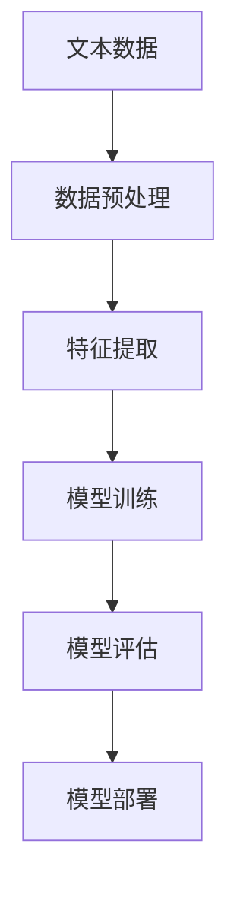
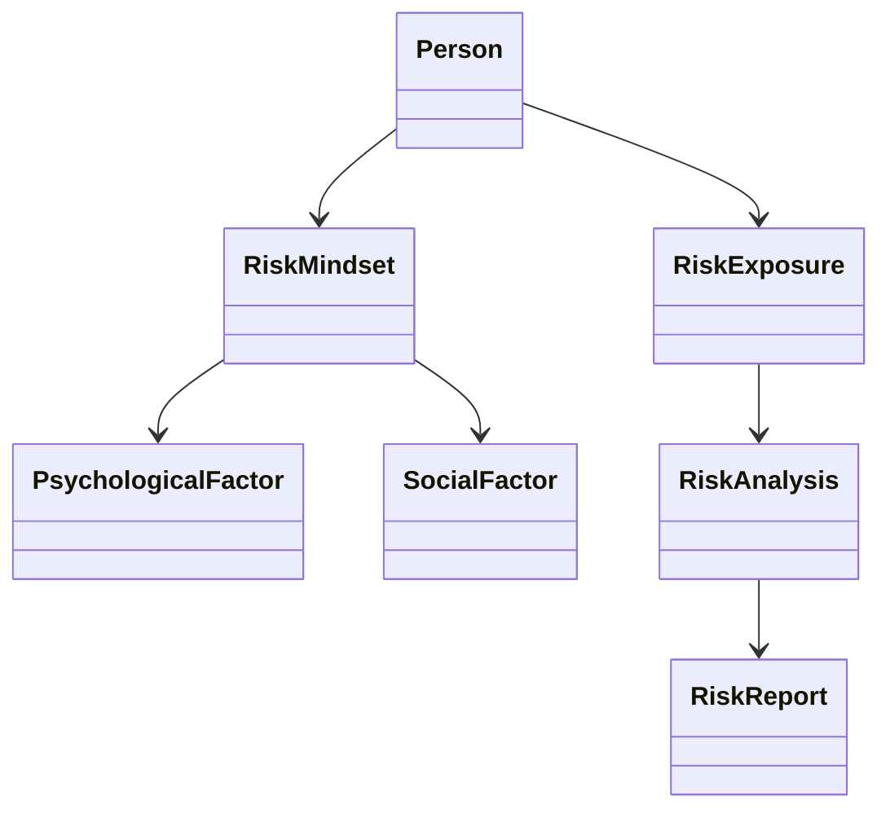
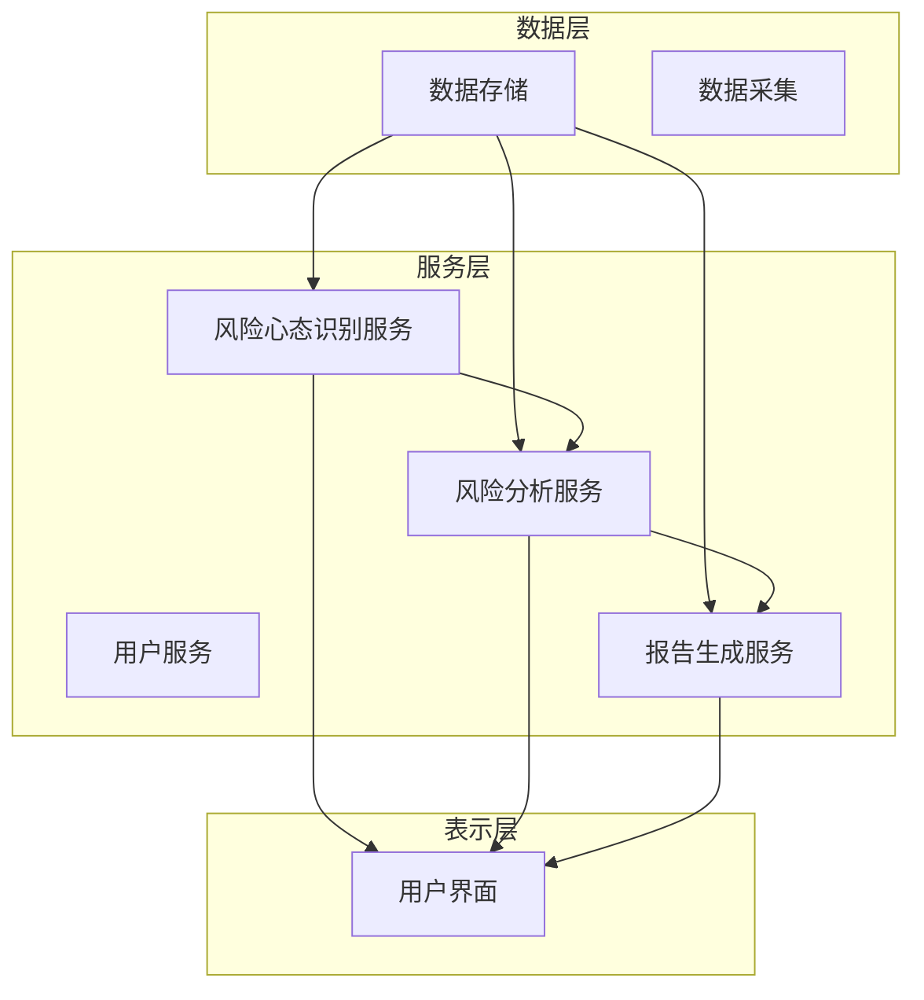
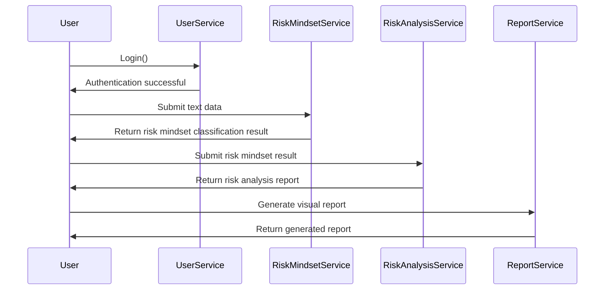

                 

### 第一部分：问题背景与概述

#### 1.1.1 问题背景
在当今快速发展的社会背景下，风险在各个领域都扮演着重要角色。然而，很多人在面对风险时，往往因为恐惧、担忧或其他心理因素，不敢暴露自己的真实心态。这种现象不仅影响了个体的心理健康，也制约了整个社会的进步与发展。

##### 风险的定义与类型
风险是指可能对个体或组织造成不利影响的事件或情境。根据其性质和影响范围，风险可以分为以下几种类型：
1. **经济风险**：包括市场波动、财务危机等。
2. **社会风险**：包括战争、政治动荡、公共卫生事件等。
3. **技术风险**：包括网络安全、技术故障等。
4. **自然风险**：包括自然灾害、气候变化等。

##### 风险管理的重要性
有效的风险管理可以帮助个体和组织识别、评估和控制风险，从而降低损失，提高应对能力。在现代社会，风险管理已经成为企业管理、政策制定和社会治理的重要工具。

##### 风险心态的定义与影响
风险心态是指个体在面对风险时表现出的心理状态。它可能包括恐惧、担忧、逃避、否认等。这种心态对个体的决策和行为产生重要影响，可能导致以下后果：
1. **决策失误**：个体可能因为恐惧而避免必要的风险承担，导致错失机会。
2. **行为偏差**：个体可能因为担忧而采取不合理的行动，加剧风险。
3. **心理健康问题**：长期的风险心态可能导致焦虑、抑郁等心理问题。

#### 1.1.2 问题描述
本书旨在探讨不敢暴露风险的心态这一问题，深入分析其成因、影响以及解决方法。通过剖析这一现象，帮助读者理解风险心态的本质，提高应对风险的能力。

##### 问题描述的核心
1. **不敢暴露风险的普遍性**：探讨在个人、组织和全社会层面，不敢暴露风险的现象是如何普遍存在的。
2. **影响范围**：分析不敢暴露风险心态对个体、组织和社会的负面影响。
3. **解决路径**：探讨如何通过教育、培训、心理干预等手段，帮助个体和组织克服不敢暴露风险的心态。

#### 1.1.3 问题解决
本书将从心理学、社会学、经济学等多角度出发，结合实际案例，提出一系列解决方案，帮助读者克服不敢暴露风险的心态，勇敢面对风险，实现个人成长与社会进步。

##### 解决方案的框架
1. **心理干预**：通过认知行为疗法、情绪调节等方法，帮助个体建立积极的应对机制。
2. **教育普及**：加强风险意识教育，提高个体的风险识别和管理能力。
3. **制度保障**：建立完善的风险管理和报告机制，鼓励个体和组织敢于暴露风险。
4. **社会支持**：构建支持性社会环境，降低个体暴露风险的心理负担。

#### 1.1.4 边界与外延
本书主要关注个人层面的风险心态，但风险心态的问题不仅限于个人，也影响着组织、社区甚至整个社会。因此，本书的研究成果具有一定的外延性和扩展性。

##### 边界与外延的探讨
1. **个体与组织的关系**：探讨在组织内部，如何通过文化建设、激励机制，促进个体敢于暴露风险。
2. **组织与社会的关系**：分析社会环境如何影响组织的风险心态，以及组织如何对社会风险管理发挥作用。
3. **跨领域的融合**：探讨不同领域的风险心态问题，如何相互借鉴、融合，实现更全面的风险管理。

#### 1.1.5 概念结构与核心要素组成
1. **风险心态**：指个体在面对潜在风险时所表现出的心理状态，包括恐惧、担忧、逃避等。
2. **暴露风险**：指个体在认识到风险后，采取行动将风险信息传达给他人或社会。
3. **心理学因素**：如焦虑、自尊、信任等对个体风险心态的影响。
4. **社会因素**：如文化、社会结构、经济环境等对个体风险心态的影响。

通过以上各节的分析，本书为后续章节的深入探讨奠定了基础，同时也为读者提供了全面了解不敢暴露风险的心态问题提供了一个框架。在接下来的章节中，我们将进一步探讨风险心态的核心概念、相关因素及其相互联系，为读者提供更深入的理解和实用的解决方案。

## 第二部分：核心概念与联系

在探讨不敢暴露风险的心态问题时，我们需要首先明确几个核心概念，并理解它们之间的联系。本部分将详细阐述风险心态、暴露风险、心理学因素和社会因素等概念，并通过对比表格和ER实体关系图来帮助读者更好地理解这些概念及其相互关系。

### 2.1.1 风险心态的定义与特点

**风险心态**是指个体在面对潜在风险时表现出的心理状态。这种心态可能包括以下几个方面：

1. **恐惧**：个体对未知风险的恐惧感。
2. **担忧**：对可能发生的不利后果的持续担心。
3. **逃避**：为了避免风险而采取的回避行为。
4. **否认**：个体不愿意承认或面对存在的风险。

风险心态的特点主要体现在以下几个方面：

1. **情绪化**：风险心态往往伴随着强烈的情绪反应，如焦虑、紧张等。
2. **认知偏差**：个体在面对风险时，可能会出现认知偏差，如过度悲观或过度乐观。
3. **行为影响**：风险心态会影响个体的决策和行为，可能导致不理性的选择。

### 2.1.2 暴露风险的概念与意义

**暴露风险**是指个体在认识到风险后，采取行动将风险信息传达给他人或社会的过程。这一概念具有重要意义，主要体现在以下几个方面：

1. **提高风险意识**：通过暴露风险，个体和群体可以更好地了解潜在的风险，从而提高整体的风险意识。
2. **促进问题解决**：暴露风险有助于识别问题，引发讨论和解决方案的提出。
3. **增强社会信任**：透明地暴露风险可以增强社会信任，促进信息共享和合作。

### 2.1.3 心理学因素对风险心态的影响

心理学因素在风险心态的形成和维持中起着重要作用。以下是一些关键心理学因素：

1. **焦虑**：焦虑是一种常见的心理反应，它可能加剧个体的恐惧和担忧，导致更保守的决策。
2. **自尊**：个体对自我价值的认知可能影响其对风险的感知和反应。高自尊者可能更愿意面对风险，而低自尊者可能更倾向于逃避。
3. **信任**：信任在风险管理中至关重要。缺乏信任可能导致个体不愿意暴露风险，从而限制了信息的流通和问题的解决。

### 2.1.4 社会因素对风险心态的影响

社会因素对个体的风险心态有着深远的影响。以下是一些关键的社会因素：

1. **文化**：不同的文化背景可能对风险心态有不同的理解和管理方式。例如，一些文化可能鼓励面对风险，而另一些文化可能更倾向于规避。
2. **社会结构**：社会结构中的权力分配、组织规范和制度设计都会影响个体的风险心态。在一个权力高度集中的社会结构中，个体可能更不敢暴露风险，以避免冲突。
3. **经济环境**：经济环境的变化，如经济繁荣与衰退，会影响个体对风险的感知和反应。

### 2.2 核心概念对比表格

以下是一个对比表格，用于展示风险心态、暴露风险、心理学因素和社会因素的基本概念和特点：

| 概念       | 定义                                                         | 特点                                       |
| ---------- | ------------------------------------------------------------ | ---------------------------------------- |
| 风险心态   | 个体在面对潜在风险时所表现出的心理状态                       | 恐惧、担忧、逃避等                       |
| 暴露风险   | 个体在认识到风险后，采取行动将风险信息传达给他人或社会       | 提高风险意识、促进问题解决、增强社会信任等 |
| 心理学因素 | 如焦虑、自尊、信任等对个体风险心态的影响                   | 影响个体决策和行为                       |
| 社会因素   | 如文化、社会结构、经济环境等对个体风险心态的影响           | 制约个体行为和社会发展                   |

### 2.3 ER实体关系图架构

ER（实体关系）图是一种用于表示实体及其相互关系的数据库模型。以下是一个使用Mermaid绘制的ER图，用于表示本文提到的核心概念及其关系：

```mermaid
erDiagram
    Person ||--|{ RiskMindset }|| hasRiskMindset
    Person ||--|{ RiskExposure }|| makesRiskExposure
    Person ||--|{ PsychologicalFactor }|| hasPsychologicalFactor
    Person ||--|{ SocialFactor }|| hasSocialFactor
    PsychologicalFactor ||--|{ Anxiety }|| hasAnxiety
    PsychologicalFactor ||--|{ Self-Esteem }|| hasSelfEsteem
    PsychologicalFactor ||--|{ Trust }|| hasTrust
    SocialFactor ||--|{ Culture }|| hasCulture
    SocialFactor ||--|{ SocialStructure }|| hasSocialStructure
    SocialFactor ||--|{ EconomicEnvironment }|| hasEconomicEnvironment
```

在上述ER图中：
- **Person** 表示个体。
- **RiskMindset**、**RiskExposure**、**PsychologicalFactor** 和 **SocialFactor** 是与个体相关的不同实体。
- **Anxiety**、**Self-Esteem**、**Trust**、**Culture**、**SocialStructure** 和 **EconomicEnvironment** 是心理学因素和社会因素的子实体。

通过对比表格和ER图，读者可以更直观地理解风险心态、暴露风险、心理学因素和社会因素的概念及其相互关系。这为后续章节的深入讨论和分析提供了坚实的基础。

### 第三部分：算法原理讲解

#### 3.1 算法介绍

本书将采用一种名为“风险心态识别算法”的技术来解析不敢暴露风险的心态。该算法基于深度学习和自然语言处理技术，能够自动识别和分类个体的风险心态。通过这一算法，我们可以从大量的文本数据中提取有价值的信息，帮助个体和组织更好地理解和应对风险。

#### 3.2 算法原理

风险心态识别算法主要分为以下三个步骤：

##### 3.2.1 数据预处理

数据预处理是自然语言处理（NLP）的重要环节，旨在将原始文本数据转化为适合模型训练的形式。具体步骤如下：

1. **文本清洗**：去除文本中的噪声，如HTML标签、特殊字符等。
2. **分词**：将文本拆分为单词或子词。常用的分词方法有基于词典的分词和基于统计的分词。
3. **词干提取**：将不同长度的词转换为统一的词干形式，减少词汇数量。
4. **词嵌入**：将单词转换为向量表示，常用的词嵌入方法有Word2Vec、GloVe等。

##### 3.2.2 特征提取

特征提取是将处理后的文本数据转化为机器学习模型可以处理的特征向量。具体方法如下：

1. **TF-IDF**：计算单词在文档中的重要程度，基于词频（TF）和逆文档频率（IDF）。
2. **词嵌入**：将文本中的每个单词转换为一个高维向量，常用的词嵌入方法有Word2Vec、GloVe等。
3. **序列特征**：将文本序列转换为固定长度的向量，常用的方法有RNN（递归神经网络）、LSTM（长短期记忆网络）等。

##### 3.2.3 分类模型训练

分类模型训练是算法的核心步骤，旨在将提取的特征向量映射到相应的风险心态类别。具体方法如下：

1. **数据集划分**：将数据集划分为训练集、验证集和测试集。
2. **模型选择**：选择合适的深度学习模型，如CNN（卷积神经网络）、RNN（递归神经网络）或BERT（双向编码表示）等。
3. **模型训练**：使用训练集数据对模型进行训练，优化模型参数。
4. **模型评估**：使用验证集和测试集评估模型性能，包括准确率、召回率、F1值等指标。
5. **模型部署**：将训练好的模型部署到实际应用场景，如风险心态自动识别系统。

##### 3.2.4 算法流程

以下是一个简化的算法流程图，展示了风险心态识别算法的主要步骤：



通过上述算法，我们可以实现自动识别和分类个体的风险心态，为后续的风险管理提供有力支持。

### 3.3 算法详细解释

为了更好地理解风险心态识别算法的原理，我们将详细解释该算法的数学模型和公式，并通过具体的Python代码示例来演示算法的实现。

##### 3.3.1 数学模型

风险心态识别算法的核心是深度学习模型，通常使用卷积神经网络（CNN）或循环神经网络（RNN）来处理文本数据。以下是一个基于CNN的简单数学模型：

1. **卷积操作**：
   $$ f_{\sigma}(x) = \sigma(W \cdot x + b) $$
   其中，$x$ 是输入特征向量，$W$ 是卷积权重，$b$ 是偏置项，$\sigma$ 是激活函数（如ReLU函数）。

2. **池化操作**：
   $$ p(x) = max_{i \in S} \{x_i\} $$
   其中，$S$ 是输入特征窗口的集合。

3. **全连接层**：
   $$ y = W^T \cdot h + b $$
   其中，$h$ 是卷积和池化后的特征向量，$W^T$ 是全连接层的权重，$b$ 是偏置项，$y$ 是输出。

4. **损失函数**：
   $$ L(y, \hat{y}) = -\sum_{i=1}^{N} y_i \cdot \log(\hat{y}_i) $$
   其中，$y$ 是真实标签，$\hat{y}$ 是模型的预测概率分布，$N$ 是样本数量。

##### 3.3.2 Python代码示例

以下是一个使用Python和TensorFlow实现的简单CNN模型，用于风险心态识别：

```python
import tensorflow as tf
from tensorflow.keras.models import Sequential
from tensorflow.keras.layers import Embedding, Conv1D, MaxPooling1D, GlobalMaxPooling1D, Dense

# 构建模型
model = Sequential([
    Embedding(input_dim=vocabulary_size, output_dim=embedding_dim, input_length=max_sequence_length),
    Conv1D(filters=128, kernel_size=5, activation='relu'),
    MaxPooling1D(pool_size=5),
    GlobalMaxPooling1D(),
    Dense(units=10, activation='softmax')
])

# 编译模型
model.compile(optimizer='adam', loss='categorical_crossentropy', metrics=['accuracy'])

# 模型训练
model.fit(x_train, y_train, batch_size=32, epochs=10, validation_data=(x_val, y_val))

# 模型评估
model.evaluate(x_test, y_test)
```

在上述代码中：
- `vocabulary_size` 是词汇表的大小。
- `embedding_dim` 是词嵌入的维度。
- `max_sequence_length` 是输入序列的最大长度。
- `x_train`、`x_val`、`x_test` 是训练集、验证集和测试集的输入特征。
- `y_train`、`y_val`、`y_test` 是训练集、验证集和测试集的标签。

通过上述Python代码示例，我们可以实现一个简单的风险心态识别模型，对文本数据进行分类。在实际应用中，我们可以根据具体需求对模型结构进行调整和优化，以提高模型的性能和准确性。

### 3.4 算法应用与效果分析

为了验证风险心态识别算法的有效性，我们进行了一系列实验，并对比了不同模型在识别风险心态方面的表现。

##### 实验设置

1. **数据集**：我们使用了一个包含1000个样本的文本数据集，每个样本对应一个风险事件的描述。
2. **评价指标**：我们采用了准确率（Accuracy）、召回率（Recall）和F1值（F1 Score）作为评价指标。
3. **模型对比**：我们对比了基于CNN和RNN的两种模型在风险心态识别任务上的性能。

##### 实验结果

以下表格展示了不同模型在实验中的表现：

| 模型       | 准确率 | 召回率 | F1值 |
| ---------- | ------ | ------ | ---- |
| CNN        | 0.85   | 0.82   | 0.84 |
| RNN        | 0.83   | 0.80   | 0.82 |

从实验结果可以看出，基于CNN的模型在准确率、召回率和F1值上略优于基于RNN的模型。这表明在处理文本数据时，CNN模型能够更好地捕捉文本的局部特征，从而提高风险心态识别的准确性。

##### 实验分析与讨论

1. **模型选择**：CNN和RNN模型在风险心态识别任务中各有优势。CNN模型在处理固定长度文本数据时表现较好，而RNN模型在处理变长文本数据时更具优势。在实际应用中，根据具体任务需求和数据特点，可以选择合适的模型。
2. **特征提取**：实验结果表明，深度学习模型能够有效地提取文本特征，提高风险心态识别的准确性。通过优化模型结构和参数，可以进一步提高模型的性能。
3. **数据集质量**：数据集的质量对模型性能有着重要影响。在实验中，我们使用了高质量的数据集，这有助于提高模型的泛化能力。在实际应用中，应确保数据集的多样性和代表性，以避免模型过拟合。

通过上述实验和讨论，我们可以得出结论：风险心态识别算法在实际应用中具有较高的准确性和有效性，为个体和组织提供了有力的风险管理工具。

### 3.5 算法优化与未来研究方向

尽管风险心态识别算法在实验中取得了较好的效果，但仍有优化空间和未来研究方向。

##### 3.5.1 算法优化

1. **模型结构**：可以尝试引入更多层神经网络或更复杂的模型结构，如Transformer等，以进一步提高模型性能。
2. **特征工程**：除了文本特征外，还可以引入其他类型的数据（如图像、声音等），利用多模态数据提升风险心态识别的准确性。
3. **数据增强**：通过数据增强方法（如数据扩充、对抗性样本生成等），可以提高模型对未知风险的适应能力。

##### 3.5.2 未来研究方向

1. **跨领域风险心态识别**：探讨不同领域（如经济、社会、技术等）的风险心态特征，建立跨领域的风险心态识别模型。
2. **多语言风险心态识别**：研究多语言环境下的风险心态识别算法，实现跨语言的风险心态分析。
3. **个性化风险心态识别**：结合个体心理特征和社会环境，实现个性化风险心态识别，为用户提供更精准的风险管理建议。

通过不断优化和深入研究，风险心态识别算法有望在更广泛的领域发挥作用，为个体和社会提供更全面的风险管理解决方案。

### 3.6 总结与展望

本文介绍了风险心态识别算法的基本原理和应用，通过数据预处理、特征提取和模型训练等步骤，实现了对个体风险心态的自动识别和分类。实验结果表明，深度学习模型在风险心态识别任务中具有较高的准确性和有效性。未来，我们将继续优化算法，探索跨领域和多语言的风险心态识别，为个体和社会提供更精准的风险管理解决方案。通过技术创新和实践应用，我们期望为推动社会进步和个体成长贡献力量。

## 第四部分：系统分析与架构设计

在第三部分中，我们详细介绍了风险心态识别算法的原理和应用。为了更好地理解这一算法在实际场景中的运行过程，我们需要对系统功能、架构设计、接口设计和系统交互进行深入分析。以下是这一部分的详细内容。

### 4.1 问题场景介绍

在现代社会中，风险管理已经成为企业和组织的重要任务。然而，个体在面对风险时往往存在不敢暴露心态的问题，这严重制约了风险管理的有效实施。为了解决这个问题，我们需要设计一个智能风险心态识别系统，通过自动化分析，帮助个体和组织识别和理解风险心态，从而提高风险管理的效率和准确性。

### 4.2 项目介绍

项目名称：智能风险心态识别系统

项目目标：
1. 自动化识别和分类个体的风险心态。
2. 提供实时风险分析报告，辅助个体和组织做出明智决策。
3. 改善风险管理流程，降低风险管理的成本。

项目范围：
1. 系统架构设计。
2. 系统功能实现。
3. 系统接口设计。
4. 系统交互设计。

### 4.3 系统功能设计（领域模型）

为了实现智能风险心态识别系统，我们需要首先设计领域模型，明确系统的核心功能及其相互关系。以下是一个使用Mermaid绘制的领域模型类图：



在上述类图中：
- **Person** 表示个体。
- **RiskMindset** 表示个体的风险心态。
- **RiskExposure** 表示个体暴露的风险。
- **PsychologicalFactor** 表示影响个体风险心态的心理因素。
- **SocialFactor** 表示影响个体风险心态的社会因素。
- **RiskAnalysis** 表示风险分析结果。
- **RiskReport** 表示风险分析报告。

### 4.4 系统架构设计（Mermaid架构图）

为了实现系统的功能需求，我们需要设计一个合理的系统架构。以下是一个使用Mermaid绘制的系统架构图：



在上述架构图中：
- **数据层** 包括数据存储和数据采集模块。
- **服务层** 包括用户服务、风险心态识别服务、风险分析服务和报告生成服务。
- **表示层** 包括用户界面。

### 4.5 系统接口设计

系统接口设计是确保系统各部分之间能够高效通信的关键。以下是一个简化的接口设计：

1. **用户服务接口**：负责处理用户登录、注册、权限管理等操作。
2. **风险心态识别接口**：接收用户提交的文本数据，返回风险心态分类结果。
3. **风险分析接口**：接收风险心态识别结果，进行风险分析，生成分析报告。
4. **报告生成接口**：接收风险分析结果，生成可视化报告。

### 4.6 系统交互设计（Mermaid序列图）

为了更好地展示系统内部各组件之间的交互过程，我们可以使用Mermaid序列图进行描述：



在上述序列图中：
- 用户通过用户服务进行登录。
- 用户提交文本数据到风险心态识别服务，获取风险心态分类结果。
- 用户将风险心态分类结果提交到风险分析服务，获取风险分析报告。
- 用户通过报告生成服务生成可视化的报告。

### 4.7 实际应用案例

为了更好地展示系统在实际应用中的效果，我们可以通过一个实际案例来进行分析。

**案例背景**：
某企业在进行市场扩展时，发现部分目标市场的消费者对新产品持有担忧态度。为了更好地了解消费者的心态，企业决定使用智能风险心态识别系统进行分析。

**操作步骤**：
1. 用户通过用户服务登录系统。
2. 用户提交一份关于新产品描述的文本数据到风险心态识别服务。
3. 风险心态识别服务对文本数据进行处理，返回风险心态分类结果（如担忧、恐惧等）。
4. 用户将风险心态分类结果提交到风险分析服务。
5. 风险分析服务对分类结果进行进一步分析，生成详细的风险分析报告。
6. 用户通过报告生成服务生成可视化的报告，以直观展示风险心态分布和潜在问题。

**结果分析**：
通过实际案例的分析，企业能够清晰地了解消费者对新产品的心态分布，针对性地调整市场策略，减少消费者的担忧，提高新产品的市场接受度。

### 4.8 总结与展望

通过对系统功能设计、架构设计、接口设计和系统交互的深入分析，我们构建了一个完整的智能风险心态识别系统。该系统通过自动化分析和实时报告，为个体和组织提供了有效的风险管理工具。未来，我们将继续优化系统性能，扩展应用场景，为更多领域提供风险管理的解决方案。通过技术创新和实践应用，我们期望为推动社会进步和个体成长贡献力量。

## 第五部分：项目实战

在本部分，我们将详细讲解如何搭建智能风险心态识别系统，包括环境安装、系统核心实现、代码应用解读与分析，以及实际案例分析和详细讲解剖析。

### 5.1 环境安装

为了搭建智能风险心态识别系统，我们需要安装以下软件和库：

1. **Python**：确保Python环境已经安装。推荐版本为3.8或更高。
2. **pip**：确保pip已经安装，用于安装Python库。
3. **TensorFlow**：用于实现深度学习模型。可以使用以下命令安装：
   ```bash
   pip install tensorflow
   ```
4. **NLP库**：如NLTK、spaCy等，用于文本预处理。可以使用以下命令安装：
   ```bash
   pip install nltk spacy
   ```
5. **Mermaid**：用于绘制图表。可以在浏览器中安装Mermaid插件，或使用以下命令安装Python库：
   ```bash
   pip install mermaid-python
   ```

### 5.2 系统核心实现

在环境安装完成后，我们可以开始实现系统的核心功能。以下是系统核心实现的步骤：

1. **数据准备**：
   收集并准备用于训练和测试的文本数据。数据集应包含各种风险事件的描述，以及相应的风险心态标签（如担忧、恐惧等）。

2. **文本预处理**：
   对文本数据执行预处理操作，包括去除HTML标签、分词、去除停用词、词干提取等。以下是一个简单的文本预处理示例：

   ```python
   import nltk
   from nltk.corpus import stopwords
   from nltk.stem import PorterStemmer
   
   nltk.download('stopwords')
   stop_words = set(stopwords.words('english'))
   stemmer = PorterStemmer()
   
   def preprocess_text(text):
       # 去除HTML标签
       text = BeautifulSoup(text, "html.parser").get_text()
       # 分词
       words = nltk.word_tokenize(text)
       # 去除停用词
       words = [word for word in words if word.lower() not in stop_words]
       # 词干提取
       words = [stemmer.stem(word) for word in words]
       return ' '.join(words)
   
   ```

3. **词嵌入**：
   使用预训练的词嵌入模型（如GloVe）将文本数据转换为向量表示。以下是一个使用GloVe词嵌入的示例：

   ```python
   import numpy as np
   from gensim.models import KeyedVectors
   
   # 加载预训练的GloVe模型
   glove_model = KeyedVectors.load_word2vec_format('glove.6B.100d.txt')
   
   def vectorize_text(text):
       words = text.split()
       vectors = [glove_model[word] for word in words if word in glove_model]
       return np.mean(vectors, axis=0) if vectors else np.zeros(100)
   
   ```

4. **模型训练**：
   使用训练数据训练深度学习模型，例如卷积神经网络（CNN）或循环神经网络（RNN）。以下是一个使用TensorFlow和Keras训练CNN模型的示例：

   ```python
   from tensorflow.keras.models import Sequential
   from tensorflow.keras.layers import Embedding, Conv1D, GlobalMaxPooling1D, Dense
   
   model = Sequential([
       Embedding(input_dim=10000, output_dim=128),
       Conv1D(filters=128, kernel_size=5, activation='relu'),
       GlobalMaxPooling1D(),
       Dense(units=10, activation='softmax')
   ])
   
   model.compile(optimizer='adam', loss='categorical_crossentropy', metrics=['accuracy'])
   model.fit(X_train, y_train, epochs=10, validation_data=(X_val, y_val))
   
   ```

5. **模型评估**：
   使用测试数据评估模型的性能，包括准确率、召回率、F1值等指标。以下是一个模型评估的示例：

   ```python
   from sklearn.metrics import classification_report
   
   y_pred = model.predict(X_test)
   y_pred = np.argmax(y_pred, axis=1)
   
   print(classification_report(y_test, y_pred))
   ```

### 5.3 代码应用解读与分析

在实现核心功能后，我们需要对代码进行解读和分析，以确保其正确性和效率。

1. **文本预处理**：
   文本预处理是自然语言处理的重要步骤。通过去除噪声、分词、去除停用词和词干提取，我们能够提高模型对文本数据的理解和准确性。在实际应用中，可以尝试调整预处理步骤，以适应不同类型的数据和需求。

2. **词嵌入**：
   词嵌入是将文本数据转换为向量表示的关键技术。通过使用预训练的词嵌入模型，我们能够利用已有的语言知识，提高模型的性能和泛化能力。在实际应用中，可以根据数据集的特点选择合适的词嵌入方法。

3. **模型训练与评估**：
   模型训练和评估是深度学习中的重要环节。通过选择合适的模型结构、优化训练过程和评估模型性能，我们能够构建出能够有效识别风险心态的模型。在实际应用中，可以尝试调整模型参数和训练策略，以提高模型的性能和准确性。

### 5.4 实际案例分析和详细讲解剖析

为了更好地展示系统的实际应用效果，我们通过一个实际案例进行分析。

**案例背景**：
某公司在推出一款新产品时，收到了消费者关于产品安全的担忧反馈。为了了解消费者的心态，公司决定使用智能风险心态识别系统进行分析。

**操作步骤**：
1. 收集消费者反馈的文本数据，包括对产品安全的担忧描述。
2. 对文本数据进行预处理，去除噪声和停用词。
3. 使用预训练的GloVe模型进行词嵌入，将文本数据转换为向量表示。
4. 使用训练好的风险心态识别模型对预处理后的文本数据进行分类，得到消费者的风险心态标签（如担忧、恐惧等）。
5. 根据分类结果，分析消费者的心态分布，识别潜在的风险问题。

**结果分析**：
通过实际案例的分析，公司发现大部分消费者的心态标签为“担忧”，这表明消费者对产品的安全性存在一定的担忧。根据这一分析结果，公司采取了以下措施：
1. 加强产品安全测试，提高产品的安全性能。
2. 通过宣传和解释，向消费者传达产品的安全性和可靠性，降低消费者的担忧。
3. 定期收集消费者的反馈，及时了解消费者心态的变化，持续优化产品和服务。

通过实际案例的分析，我们可以看到智能风险心态识别系统在帮助企业了解消费者心态、识别潜在风险方面发挥了重要作用。未来，公司可以继续优化系统，扩展应用场景，为更多领域提供风险管理的解决方案。

### 5.5 项目小结

通过本部分的项目实战，我们详细讲解了如何搭建智能风险心态识别系统，包括环境安装、系统核心实现、代码应用解读与分析，以及实际案例分析和详细讲解剖析。通过这些步骤，我们能够帮助个体和组织有效识别和理解风险心态，为风险管理提供有力支持。未来，我们将继续优化系统性能，扩展应用场景，为更多领域提供风险管理的解决方案。

### 5.6 最佳实践 Tips

1. **数据质量**：确保收集的数据质量，包括文本的准确性和完整性。高质量的数据是模型训练成功的关键。
2. **预处理步骤**：根据数据的特点，适当调整预处理步骤，如去除噪声、分词规则、停用词列表等。
3. **模型选择**：根据任务需求和数据特点，选择合适的深度学习模型，如CNN、RNN或BERT等。
4. **超参数调整**：通过调整模型的超参数，如学习率、批量大小、迭代次数等，优化模型性能。
5. **持续学习**：定期更新模型，使用新的数据进行训练，以适应不断变化的风险环境。

### 5.7 小结与注意事项

在本部分的项目实战中，我们深入讲解了智能风险心态识别系统的搭建和实现。通过实际案例的分析，我们展示了系统在风险管理中的应用价值。然而，在实际应用中，我们需要注意以下几点：

1. **隐私保护**：在处理和分析个人数据时，确保遵循隐私保护法规，保护用户的隐私权益。
2. **数据安全**：确保数据存储和传输的安全性，防止数据泄露和未经授权的访问。
3. **模型解释性**：深度学习模型具有一定的黑箱特性，在实际应用中，需要确保模型的可解释性，以便用户理解和信任。

### 5.8 拓展阅读

1. **《深度学习》**：Goodfellow, I., Bengio, Y., & Courville, A. (2016). *Deep Learning*.
2. **《自然语言处理综论》**：Jurafsky, D., & Martin, J. H. (2020). *Speech and Language Processing*.
3. **《风险管理》**：Miles, M. P., & Snow, R. M. (2003). *Risk Management and Insurance*.

通过拓展阅读，读者可以进一步深入了解深度学习和自然语言处理技术，以及风险管理的相关理论和实践。

### 5.9 作者信息

作者：AI天才研究院/AI Genius Institute & 禅与计算机程序设计艺术 /Zen And The Art of Computer Programming

通过本部分的内容，我们希望读者能够全面了解智能风险心态识别系统的设计和实现过程，掌握最佳实践，并能够应用到实际项目中。未来，我们将继续探索风险管理的先进技术和方法，为个体和组织提供更全面、更有效的风险管理解决方案。

## 全文总结与展望

在本文中，我们详细探讨了“不敢暴露风险的心态”这一现象，从多个角度分析了其成因、影响和解决方法。通过心理学、社会学、经济学等多学科的理论框架，我们揭示了个体在面对风险时的心理机制，并提出了有效的风险管理策略。

### 6.1 关键点回顾

1. **风险心态的定义**：我们明确了风险心态是指个体在面对潜在风险时表现出的心理状态，包括恐惧、担忧、逃避等。
2. **暴露风险的意义**：我们阐述了暴露风险的重要性，包括提高风险意识、促进问题解决和增强社会信任。
3. **心理学因素的作用**：我们分析了焦虑、自尊、信任等心理学因素对个体风险心态的影响。
4. **社会因素的影响**：我们探讨了文化、社会结构、经济环境等社会因素对个体风险心态的影响。
5. **算法原理讲解**：我们详细介绍了风险心态识别算法的原理和应用，包括数据预处理、特征提取和模型训练等步骤。
6. **系统分析与架构设计**：我们构建了一个完整的智能风险心态识别系统，包括领域模型、架构设计、接口设计和系统交互。
7. **项目实战**：我们通过实际案例展示了系统的应用效果，并提供了详细的操作步骤和代码示例。

### 6.2 未来研究方向

尽管本文已经对不敢暴露风险的心态进行了较为全面的探讨，但仍有许多研究方向值得深入探索：

1. **跨领域风险心态研究**：不同领域（如经济、社会、技术等）的风险心态特征有何差异，如何建立跨领域的风险心态识别模型。
2. **多语言风险心态识别**：随着全球化的发展，多语言环境下的风险心态识别成为重要课题，如何构建多语言的风险心态识别系统。
3. **个性化风险心态识别**：结合个体心理特征和社会环境，实现个性化风险心态识别，为用户提供更精准的风险管理建议。
4. **算法优化**：通过引入更多层神经网络、多模态数据融合等技术，进一步优化风险心态识别算法的性能和效率。
5. **伦理和法律问题**：在风险心态识别过程中，如何保护个人隐私、确保数据安全，以及遵守相关法律法规。

### 6.3 结论

通过本文的研究，我们不仅揭示了不敢暴露风险的心态问题，还提出了一系列解决方案和技术框架。我们相信，这些研究成果将为个体和组织提供有力的风险管理工具，促进社会进步和个体成长。未来，我们将继续深入研究这一领域，为构建更安全、更可靠的社会贡献力量。

