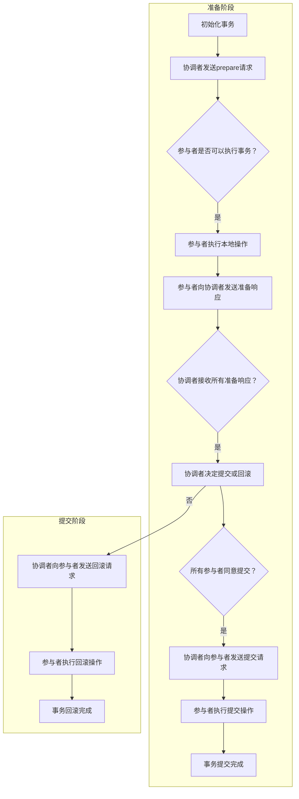

                 

### 第一部分：两阶段提交原理概述

#### 第1章：两阶段提交背景与基本概念

##### 1.1.1 问题背景

在分布式系统中，数据一致性是一个至关重要的挑战。随着云计算和大数据技术的发展，分布式系统在各个领域得到了广泛应用，如金融、电商、社交媒体等。这些系统通常由多个节点组成，这些节点分布在不同的地理位置，通过网络进行通信。每个节点可以独立处理事务，但同时也可能导致数据不一致的问题。

数据一致性的问题可以简单理解为，当一个事务在多个节点上执行时，所有节点上的数据最终应该保持一致。例如，在一个银行系统中，如果A账户向B账户转账1000元，那么A账户的余额应该减少1000元，而B账户的余额应该增加1000元。如果这两个操作不能同时成功，或者有一个节点上的数据更新失败，那么数据就会不一致。

##### 1.1.2 问题描述

分布式系统中的数据不一致问题可以分为以下几种情况：

1. **最终一致性**：系统中的所有数据最终会达到一致状态，但中间可能有一段时间是不同步的。
2. **部分一致性**：系统中的某些数据可能是一致的，而其他数据则不一致。
3. **不一致性**：系统中的所有数据始终不一致。

这些不一致性可能导致严重的后果，如金融交易失败、数据丢失、账户余额错误等。因此，解决分布式系统中的数据一致性问题至关重要。

##### 1.1.3 问题解决

为了解决分布式系统中的数据不一致问题，研究者们提出了多种方法，其中一种有效的方法是使用两阶段提交（Two-Phase Commit，简称2PC）协议。

两阶段提交是一种分布式事务管理协议，它通过协调者和参与者的协作，确保多个节点上的事务能够一致地执行或回滚。其核心思想是，通过两个阶段的通信和协调，确保事务在所有参与者上要么全部提交，要么全部回滚。

##### 1.1.4 边界与外延

两阶段提交协议主要应用于以下场景：

1. **分布式数据库**：在分布式数据库中，两阶段提交用于确保事务在多个数据库节点上的一致性。
2. **分布式文件系统**：在分布式文件系统中，两阶段提交用于确保文件操作的一致性。
3. **分布式缓存**：在分布式缓存系统中，两阶段提交用于确保数据的一致性。

然而，两阶段提交协议也存在一定的局限性。例如，它对网络延迟和节点故障比较敏感，可能导致死锁问题。因此，在实际应用中，需要根据具体场景和需求，对两阶段提交进行适当的优化和改进。

##### 1.1.5 两阶段提交的核心概念与联系

两阶段提交的核心概念包括：

1. **协调者（Coordinator）**：负责发起事务并协调参与者的状态。
2. **参与者（Participant）**：负责执行事务并响应协调者的请求。
3. **提交（Commit）**：事务在所有参与者上成功执行。
4. **回滚（Rollback）**：事务在任何一个参与者上执行失败，导致整个事务回滚。

两阶段提交与传统并发控制方法（如锁机制）相比，优点在于能够确保全局一致性，但缺点是对网络延迟和节点故障敏感。

##### 1.1.6 两阶段提交与传统并发控制方法比较

| 对比项 | 两阶段提交 | 传统并发控制方法 |
| --- | --- | --- |
| 一致性保证 | 强一致性 | 最终一致性 |
| 性能 | 对网络延迟和节点故障敏感 | 对网络延迟和节点故障不敏感 |
| 应用场景 | 分布式数据库、分布式文件系统、分布式缓存 | 单机数据库、并发Web应用 |

通过以上对比，可以看出两阶段提交在保证一致性方面具有优势，但在性能方面存在一定的局限性。

### 第2章：两阶段提交原理与流程

#### 2.1.1 两阶段提交原理

两阶段提交是一种分布式事务管理协议，其核心思想是通过协调者和参与者的协作，确保多个节点上的事务能够一致地执行或回滚。两阶段提交分为两个阶段：准备阶段（Phase 1）和提交阶段（Phase 2）。

1. **准备阶段（Phase 1）**：协调者向参与者发送准备请求，询问参与者是否可以执行事务。参与者根据本地状态返回响应。
2. **提交阶段（Phase 2）**：根据参与者的响应，协调者决定是提交事务还是回滚事务，并将决定通知给参与者。

#### 2.1.2 两阶段提交流程

两阶段提交流程如下：

1. **初始化**：事务开始，协调者初始化事务状态。
2. **准备阶段**：
    - 协调者向参与者发送prepare请求。
    - 各参与者收到请求后，执行本地操作，并将本地状态写入日志。
    - 各参与者向协调者发送准备响应，包括本地状态信息。
3. **提交阶段**：
    - 协调者根据参与者的准备响应决定是否提交事务。
    - 如果所有参与者都同意提交，协调者向参与者发送提交请求。
    - 各参与者收到提交请求后，执行提交操作。
    - 如果有任何参与者拒绝提交，协调者向参与者发送回滚请求。
    - 各参与者收到回滚请求后，执行回滚操作。

#### 2.1.3 协调者与参与者

在两阶段提交过程中，协调者和参与者分别扮演不同的角色：

1. **协调者（Coordinator）**：
    - 负责发起事务并协调参与者的状态。
    - 收集参与者的准备响应，并决定是否提交事务。
    - 向参与者发送提交或回滚请求。
2. **参与者（Participant）**：
    - 负责执行事务并响应协调者的请求。
    - 在准备阶段，执行本地操作并将本地状态写入日志。
    - 在提交阶段，根据协调者的请求执行提交或回滚操作。

#### 2.1.4 两阶段提交与数据一致性

两阶段提交通过以下机制确保分布式系统中的数据一致性：

1. **全局一致性**：通过协调者和参与者的协作，确保事务在所有参与者上要么全部提交，要么全部回滚。
2. **故障恢复**：在参与者或协调者发生故障时，通过日志和状态信息进行恢复。
3. **分布式事务**：支持分布式事务，允许多个节点上的操作作为一个整体进行提交或回滚。

通过以上机制，两阶段提交能够有效解决分布式系统中的数据一致性问题。

### 第3章：两阶段提交算法

#### 3.1.1 两阶段提交算法概述

两阶段提交算法是一种分布式事务管理协议，通过协调者和参与者的协作，确保多个节点上的事务能够一致地执行或回滚。算法主要分为两个阶段：准备阶段和提交阶段。

#### 3.1.2 两阶段提交算法mermaid流程图

下面是两阶段提交算法的mermaid流程图：



#### 3.1.3 Python实现两阶段提交算法

下面是使用Python实现两阶段提交算法的示例代码：

```python
import threading
import time

class Coordinator:
    def __init__(self, participants):
        self.participants = participants
        self.decision = "未知"

    def prepare(self):
        for participant in self.participants:
            participant.prepare()

    def wait_for_responses(self):
        while True:
            completed = True
            for participant in self.participants:
                if participant.status != "已准备":
                    completed = False
                    break
            if completed:
                break
            time.sleep(1)

    def decide(self):
        self.decision = "提交" if self.all_ready() else "回滚"

    def commit(self):
        if self.decision == "提交":
            for participant in self.participants:
                participant.commit()
        else:
            for participant in self.participants:
                participant.rollback()

class Participant:
    def __init__(self, name):
        self.name = name
        self.status = "未准备"

    def prepare(self):
        self.status = "已准备"

    def commit(self):
        print(f"{self.name} 提交事务")

    def rollback(self):
        print(f"{self.name} 回滚事务")

def main():
    participants = [Participant(f"参与者{i}") for i in range(1, 4)]
    coordinator = Coordinator(participants)

    coordinator.prepare()
    coordinator.wait_for_responses()
    coordinator.decide()
    coordinator.commit()

if __name__ == "__main__":
    main()
```

#### 3.1.4 两阶段提交算法原理

两阶段提交算法的原理可以总结为以下步骤：

1. **初始化**：事务开始，协调者初始化事务状态。
2. **准备阶段**：
    - 协调者向参与者发送prepare请求。
    - 各参与者收到请求后，执行本地操作，并将本地状态写入日志。
    - 各参与者向协调者发送准备响应，包括本地状态信息。
3. **提交阶段**：
    - 协调者根据参与者的准备响应决定是否提交事务。
    - 如果所有参与者都同意提交，协调者向参与者发送提交请求。
    - 各参与者收到提交请求后，执行提交操作。
    - 如果有任何参与者拒绝提交，协调者向参与者发送回滚请求。
    - 各参与者收到回滚请求后，执行回滚操作。

通过以上步骤，两阶段提交算法能够确保分布式系统中的事务在多个节点上要么全部提交，要么全部回滚，从而保证数据一致性。

#### 3.1.5 两阶段提交算法数学模型与公式

两阶段提交算法中的数学模型和公式如下：

1. **参与者状态**：
   - \( S_i = \{ \text{准备}, \text{提交}, \text{回滚} \} \)
   - 其中，\( i \) 表示参与者的编号。
2. **协调者状态**：
   - \( C = \{ \text{准备}, \text{提交}, \text{回滚} \} \)
3. **决策函数**：
   - \( f(C, S) = \text{提交} \) 如果所有参与者都处于“准备”状态。
   - \( f(C, S) = \text{回滚} \) 如果有任何参与者处于“回滚”状态。

通过以上数学模型和公式，可以描述两阶段提交算法的执行过程和决策逻辑。

#### 3.1.6 举例说明

假设有一个包含三个参与者的两阶段提交事务，参与者的编号分别为1、2、3。协调者首先向参与者发送prepare请求，参与者收到请求后执行本地操作，并将状态设置为“准备”。参与者1、2、3分别向协调者发送准备响应。协调者收到所有参与者的响应后，根据决策函数决定是否提交事务。如果所有参与者都处于“准备”状态，协调者将决策函数设置为“提交”，并向参与者发送提交请求。参与者收到提交请求后，执行提交操作。如果任何参与者处于“回滚”状态，协调者将决策函数设置为“回滚”，并向参与者发送回滚请求。参与者收到回滚请求后，执行回滚操作。

通过这个例子，可以更直观地理解两阶段提交算法的执行过程和决策逻辑。

### 第4章：两阶段提交实践与应用

#### 4.1.1 两阶段提交在数据库系统中的应用

两阶段提交在数据库系统中的应用非常广泛，主要用于确保分布式数据库中的事务一致性。分布式数据库通常由多个节点组成，这些节点可能位于不同的地理位置。当事务涉及多个节点时，两阶段提交协议能够确保事务在所有节点上要么全部提交，要么全部回滚，从而保证数据一致性。

以下是一个分布式数据库中使用两阶段提交的例子：

1. **事务开始**：事务在协调者节点（如主数据库）开始。
2. **准备阶段**：协调者向参与者节点（如从数据库）发送prepare请求，询问是否可以执行事务。参与者节点执行本地操作，并将本地状态写入日志，然后向协调者发送准备响应。
3. **提交阶段**：协调者根据参与者的准备响应决定是否提交事务。如果所有参与者都同意提交，协调者向参与者发送提交请求。参与者收到提交请求后，执行提交操作。如果任何参与者拒绝提交，协调者向参与者发送回滚请求。参与者收到回滚请求后，执行回滚操作。

通过以上步骤，分布式数据库中的事务能够一致地执行或回滚，从而确保数据一致性。

#### 4.1.2 两阶段提交在分布式系统中的应用

两阶段提交不仅应用于分布式数据库，还广泛应用于其他分布式系统，如分布式文件系统、分布式缓存系统等。在这些系统中，两阶段提交协议主要用于确保数据操作的一致性。

以下是一个分布式文件系统中使用两阶段提交的例子：

1. **文件操作开始**：用户在协调者节点（如主服务器）发起文件操作。
2. **准备阶段**：协调者向参与者节点（如从服务器）发送prepare请求，询问是否可以执行文件操作。参与者节点执行本地操作，并将本地状态写入日志，然后向协调者发送准备响应。
3. **提交阶段**：协调者根据参与者的准备响应决定是否提交文件操作。如果所有参与者都同意提交，协调者向参与者发送提交请求。参与者收到提交请求后，执行提交操作。如果任何参与者拒绝提交，协调者向参与者发送回滚请求。参与者收到回滚请求后，执行回滚操作。

通过以上步骤，分布式文件系统中的文件操作能够一致地执行或回滚，从而确保数据一致性。

#### 4.1.3 两阶段提交在分布式数据库中的实现

在实际的分布式数据库系统中，两阶段提交的实现通常涉及以下组件：

1. **协调者**：负责发起事务和协调参与者状态。在分布式数据库中，协调者通常是一个主数据库。
2. **参与者**：负责执行事务并响应协调者的请求。在分布式数据库中，参与者通常是多个从数据库。
3. **日志**：用于记录事务状态和操作。通过日志，可以在发生故障时进行故障恢复。

以下是一个分布式数据库中两阶段提交的实现示例：

1. **初始化**：事务开始时，协调者初始化事务状态。
2. **准备阶段**：
    - 协调者向参与者发送prepare请求。
    - 各参与者执行本地操作，并将本地状态写入日志，然后向协调者发送准备响应。
3. **提交阶段**：
    - 协调者收集参与者的准备响应。
    - 如果所有参与者都同意提交，协调者向参与者发送提交请求。
    - 各参与者执行提交操作，并将提交结果写入日志。
    - 如果任何参与者拒绝提交，协调者向参与者发送回滚请求。
    - 各参与者执行回滚操作，并将回滚结果写入日志。

通过以上步骤，分布式数据库中的事务能够一致地执行或回滚，从而确保数据一致性。

#### 4.1.4 两阶段提交算法的实际案例

一个著名的实际案例是Google Spanner数据库。Google Spanner是一种全球分布式数据库，它使用两阶段提交协议确保数据的一致性。Spanner通过在分布式系统中部署多个节点，实现数据的水平扩展和高可用性。在Spanner中，两阶段提交协议用于确保跨多个节点的事务一致性。

以下是一个使用Google Spanner数据库的例子：

1. **事务开始**：用户在协调者节点（如主数据库）发起事务。
2. **准备阶段**：协调者向参与者节点（如从数据库）发送prepare请求，询问是否可以执行事务。参与者节点执行本地操作，并将本地状态写入日志，然后向协调者发送准备响应。
3. **提交阶段**：协调者根据参与者的准备响应决定是否提交事务。如果所有参与者都同意提交，协调者向参与者发送提交请求。参与者收到提交请求后，执行提交操作，并将提交结果写入日志。如果任何参与者拒绝提交，协调者向参与者发送回滚请求。参与者收到回滚请求后，执行回滚操作，并将回滚结果写入日志。

通过两阶段提交协议，Google Spanner数据库能够确保跨多个节点的事务一致性，从而实现高可用性和高性能。

### 第5章：两阶段提交的优化与改进

#### 5.1.1 两阶段提交的优化策略

两阶段提交虽然能够确保分布式系统中的数据一致性，但其在性能方面存在一定的局限性。为了优化两阶段提交的性能，研究者们提出了一些优化策略，主要包括：

1. **超时机制**：在两阶段提交过程中，设置超时机制，确保在参与者未响应时，协调者能够及时作出决策。这可以避免因网络延迟或参与者故障导致的事务长时间挂起。
2. **预提交阶段**：在正式进入两阶段提交之前，增加一个预提交阶段，允许协调者预先了解参与者的状态。这样可以减少在正式提交阶段所需的通信次数，提高性能。
3. **负载均衡**：通过负载均衡策略，合理分配事务到不同的协调者和参与者，避免单个节点或网络瓶颈影响整体性能。
4. **并行处理**：在分布式系统中，可以并行处理多个事务，减少单个事务的等待时间，提高整体性能。

#### 5.1.2 两阶段提交算法的改进方案

为了进一步提高两阶段提交的性能和可靠性，研究者们提出了一些改进方案，主要包括：

1. **三阶段提交**：在两阶段提交的基础上，增加一个预提交阶段，形成一个三阶段提交协议。通过预提交阶段，协调者可以提前了解参与者的状态，减少在正式提交阶段所需的通信次数。
2. **乐观锁机制**：在两阶段提交过程中，引入乐观锁机制，允许事务在提交阶段之前进行预提交，从而减少参与者的等待时间。乐观锁机制通过检查版本号或时间戳，确保事务在提交时仍然处于一致状态。
3. **快照隔离**：通过引入快照隔离机制，事务在提交阶段可以基于一个一致性快照进行操作，从而避免在提交阶段出现数据冲突。快照隔离可以通过锁机制或多版本并发控制（MVCC）实现。
4. **异步提交**：在两阶段提交的基础上，采用异步提交机制，允许协调者将提交请求异步发送给参与者，从而减少同步通信的开销。异步提交需要确保在参与者收到提交请求后，能够及时执行提交操作。

#### 5.1.3 负载均衡与性能优化

在实际应用中，负载均衡和性能优化是确保两阶段提交算法有效运行的关键。以下是一些负载均衡与性能优化的策略：

1. **分布式协调者**：通过分布式协调者架构，将协调者部署在多个节点上，实现负载均衡和故障转移。这样可以提高系统的可用性和性能。
2. **延迟容忍机制**：在两阶段提交过程中，设置延迟容忍机制，允许事务在参与者延迟响应时继续执行。通过延迟容忍机制，可以减少参与者的等待时间，提高整体性能。
3. **网络优化**：通过优化网络拓扑结构，减少网络延迟和带宽消耗。例如，采用多路径传输、负载均衡和流量控制等技术，提高网络的传输效率。
4. **缓存与预取**：在两阶段提交过程中，利用缓存和预取技术，减少参与者的响应时间。通过提前获取参与者状态信息，可以减少在正式提交阶段的通信次数，提高性能。

#### 5.1.4 两阶段提交在分布式系统中的性能分析

两阶段提交在分布式系统中的性能分析主要涉及以下几个方面：

1. **通信开销**：两阶段提交需要多次通信，包括prepare请求、响应和commit请求。通信开销与网络延迟和带宽有关。通过优化通信机制，可以减少通信开销，提高性能。
2. **参与者等待时间**：在两阶段提交过程中，参与者需要等待协调者的决策。参与者等待时间与网络延迟、协调者处理能力和参与者数量有关。通过负载均衡和延迟容忍机制，可以减少参与者等待时间，提高性能。
3. **故障恢复时间**：在分布式系统中，两阶段提交需要处理协调者和参与者故障。故障恢复时间与系统的故障检测、恢复机制和日志管理能力有关。通过优化故障恢复机制，可以减少故障恢复时间，提高性能。
4. **系统吞吐量**：两阶段提交对系统吞吐量的影响取决于通信开销、参与者等待时间和故障恢复时间。通过优化这些方面，可以提高系统吞吐量，满足大规模分布式系统的性能需求。

### 第6章：两阶段提交的局限性与解决方案

#### 6.1.1 两阶段提交的局限性

两阶段提交作为一种分布式事务管理协议，虽然在保证数据一致性方面具有显著优势，但仍存在一些局限性：

1. **网络敏感性**：两阶段提交对网络延迟和节点故障敏感，可能导致事务长时间挂起或失败。在分布式系统中，网络延迟和节点故障是常见问题，这可能导致两阶段提交协议的性能下降。
2. **单点故障**：两阶段提交协议中的协调者是一个单点故障点。如果协调者发生故障，整个事务管理过程将受到影响，可能导致数据不一致或事务无法完成。
3. **死锁问题**：在分布式系统中，两阶段提交协议可能导致死锁问题。当多个事务同时进行时，协调者可能会陷入等待状态，导致事务无法完成。
4. **性能瓶颈**：两阶段提交协议需要进行多次通信，包括prepare请求、响应和commit请求。这可能导致通信开销增加，影响系统性能。

#### 6.1.2 解决方案与优化建议

针对两阶段提交的局限性，研究者们提出了一些解决方案和优化建议，主要包括：

1. **分布式协调器**：通过分布式协调器架构，将协调器部署在多个节点上，实现负载均衡和故障转移。这样可以提高系统的可用性和性能。例如，可以使用Zookeeper、Consul等分布式协调器实现分布式协调器架构。
2. **超时机制**：设置超时机制，确保在参与者未响应时，协调者能够及时作出决策。这样可以避免因网络延迟或参与者故障导致的事务长时间挂起。
3. **预提交阶段**：在正式进入两阶段提交之前，增加一个预提交阶段，允许协调者预先了解参与者的状态。这样可以减少在正式提交阶段所需的通信次数，提高性能。
4. **负载均衡**：通过负载均衡策略，合理分配事务到不同的协调者和参与者，避免单个节点或网络瓶颈影响整体性能。例如，可以使用DNS轮询、反向代理等技术实现负载均衡。
5. **异步提交**：在两阶段提交的基础上，采用异步提交机制，允许协调者将提交请求异步发送给参与者，从而减少同步通信的开销。异步提交需要确保在参与者收到提交请求后，能够及时执行提交操作。
6. **多版本并发控制**：引入多版本并发控制（MVCC）机制，允许事务在提交阶段之前进行预提交，从而减少参与者的等待时间。通过检查版本号或时间戳，可以确保事务在提交时仍然处于一致状态。

#### 6.1.3 未来研究方向

两阶段提交作为一种分布式事务管理协议，在保证数据一致性方面具有重要作用。未来研究方向包括：

1. **优化性能**：进一步优化两阶段提交的性能，降低通信开销和参与者等待时间，提高系统吞吐量。
2. **改进协议**：研究新型分布式事务管理协议，如三阶段提交、乐观锁机制、快照隔离等，以解决两阶段提交的局限性。
3. **故障恢复**：研究分布式系统中的故障恢复机制，提高系统的可用性和可靠性。
4. **跨协议集成**：研究如何将两阶段提交与其他分布式事务管理协议（如分布式锁、最终一致性协议等）进行集成，实现更灵活和高效的事务管理。

### 第7章：小结与拓展阅读

#### 7.1.1 小结

本文介绍了两阶段提交原理及其在分布式系统中的应用。首先，我们分析了分布式系统中的数据不一致问题，并介绍了两阶段提交作为一种解决方案。接着，我们详细讲解了两阶段提交的原理、流程和算法，并通过Python示例代码进行了说明。此外，我们还讨论了两阶段提交在数据库系统和分布式系统中的应用，以及优化和改进策略。

#### 7.1.2 注意事项

在实际应用中，两阶段提交需要考虑以下注意事项：

1. **网络延迟和故障**：两阶段提交对网络延迟和节点故障敏感，可能导致事务长时间挂起或失败。因此，在设计分布式系统时，需要考虑网络延迟和故障的影响，并采取相应的措施，如超时机制、负载均衡等。
2. **单点故障**：两阶段提交中的协调者是单点故障点。为了提高系统的可用性，可以采用分布式协调器架构，将协调器部署在多个节点上，实现负载均衡和故障转移。
3. **死锁问题**：在分布式系统中，两阶段提交可能导致死锁问题。为了避免死锁，可以采用死锁检测和预防机制，如时间戳排序、资源分配策略等。
4. **性能优化**：为了提高两阶段提交的性能，可以采用异步提交、预提交阶段等优化策略。此外，还可以通过负载均衡、延迟容忍机制等技术，进一步优化系统性能。

#### 7.1.3 拓展阅读

对于希望深入了解两阶段提交的读者，以下书籍和文章推荐：

1. 《分布式系统原理与范型》（ Distributed Systems: Principles and Paradigms ） - George Coulouris, Jean Dollimore, Tim Kindberg, and Gordon Blair
2. 《分布式算法导论》（ Introduction to Distributed Algorithms ） - Ivan Damgard
3. 《两阶段提交协议：原理与实现》（ Two-Phase Commit Protocol: Principles and Implementations ） - Anirban Chatterjee and M. Anwarul Habib
4. 《分布式数据库系统原理与实现》（ Principles and Implementation of Distributed Database Systems ） - Michael K. Reiter
5. 《分布式系统设计与实践》（ Designing Data-Intensive Applications ） - Martin Kleppmann

这些书籍和文章提供了关于分布式系统和两阶段提交的深入分析和实践指导，有助于读者更好地理解和应用两阶段提交协议。

