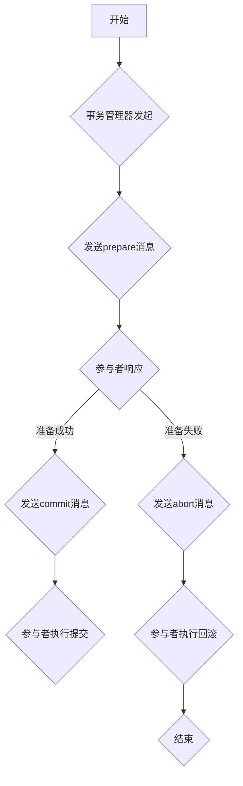

                 

# 两阶段提交原理

> 关键词：两阶段提交、分布式系统、事务管理、一致性、准备阶段、提交阶段

> 摘要：本文将深入探讨两阶段提交（Two-Phase Commit，2PC）原理，从背景、问题描述、核心概念、算法原理到具体实现，逐步解析其在分布式系统中的重要性与应用。

## 第一部分：引言

### 1.1 两阶段提交原理的背景

#### 1.1.1 问题背景

在分布式系统中，数据的一致性是一个至关重要的问题。随着云计算和大数据技术的发展，分布式系统广泛应用于金融、电商、社交网络等领域。在这些场景中，多个节点需要协同工作，保证数据的一致性成为系统设计的核心挑战之一。

#### 1.1.1.1 两阶段提交的起源

两阶段提交（2PC）最早由BarrelFish项目的开发者Bradley J. Ober在1981年提出。它是为了解决分布式系统中的数据一致性问题，尤其是在分布式数据库和分布式事务处理中。

#### 1.1.1.2 两阶段提交的应用场景

两阶段提交广泛应用于分布式数据库、分布式缓存、消息队列等领域。在实际应用中，它主要用于保证分布式系统中的事务能够原子性地执行。

#### 1.1.1.3 两阶段提交的重要性

两阶段提交在分布式系统中的重要性体现在：

- 保证数据的一致性，确保事务的原子性。
- 在出现故障时，能够恢复到一致性状态。

### 1.1.2 问题描述

#### 1.1.2.1 数据一致性的挑战

在分布式系统中，数据的一致性挑战主要来自于：

- 网络延迟：节点之间的通信可能会受到网络延迟的影响。
- 节点故障：节点可能会出现故障，导致无法正常处理事务。

#### 1.1.2.2 两阶段提交的目标

两阶段提交的主要目标是：

- 确保分布式系统中事务的原子性，即要么所有节点都成功提交，要么所有节点都回滚。
- 保证数据的一致性，避免出现部分节点成功提交，部分节点回滚的情况。

#### 1.1.2.3 两阶段提交的关键要素

两阶段提交的关键要素包括：

- 事务管理器（Transaction Manager，TM）：负责协调分布式事务的提交和回滚。
- 参与者（Participant）：参与分布式事务的节点，如数据库、缓存等。

### 1.1.3 问题解决

#### 1.1.3.1 两阶段提交的基本原理

两阶段提交的基本原理是：

- 准备阶段：事务管理器向参与者发送prepare消息，询问参与者是否可以准备提交。
- 提交阶段：根据参与者的响应，事务管理器决定是否提交事务。如果所有参与者都成功响应，则事务提交；否则，事务回滚。

#### 1.1.3.2 两阶段提交的工作流程

两阶段提交的工作流程如下：

1. 事务管理器向参与者发送prepare消息。
2. 参与者处理prepare消息，如果可以提交，则返回成功响应；否则，返回失败响应。
3. 事务管理器收集参与者的响应，如果所有参与者都成功响应，则向参与者发送commit消息；否则，发送abort消息。
4. 参与者根据事务管理器发送的消息执行相应的操作：成功响应时执行提交；失败响应时执行回滚。

#### 1.1.3.3 两阶段提交的优势与局限

两阶段提交的优势包括：

- 保证分布式系统中事务的原子性。
- 适用于多种分布式系统场景。

两阶段提交的局限包括：

- 可能会出现单点故障，导致整个系统无法正常工作。
- 可能会带来较大的网络开销。

### 1.2 两阶段提交的核心概念与联系

#### 1.2.1 核心概念

两阶段提交的核心概念包括：

- 准备阶段：事务管理器向参与者发送prepare消息，询问参与者是否可以准备提交。
- 提交阶段：根据参与者的响应，事务管理器决定是否提交事务。

#### 1.2.1.1 准备阶段

准备阶段的工作流程如下：

1. 事务管理器向参与者发送prepare消息。
2. 参与者处理prepare消息，如果可以提交，则返回成功响应；否则，返回失败响应。
3. 事务管理器收集参与者的响应，如果所有参与者都成功响应，则进入提交阶段；否则，进入回滚阶段。

#### 1.2.1.2 提交阶段

提交阶段的工作流程如下：

1. 事务管理器向参与者发送commit消息。
2. 参与者处理commit消息，执行提交操作。
3. 事务管理器收到所有参与者的提交确认后，事务提交成功。

#### 1.2.2 概念属性特征对比表格

| 概念      | 准备阶段                | 提交阶段                |
| --------- | ----------------------- | ----------------------- |
| 目标      | 确保事务的原子性        | 确保事务的持久性        |
| 工作流程  | 询问参与者准备就绪      | 根据参与者的响应做出决策 |
| 关键要素  | 事务管理器与参与者      | 事务管理器与参与者      |

#### 1.2.3 ER实体关系图架构

```mermaid
erDiagram
  TMsParticipant ||--|{ TransactionManager } TMsParticipant
  TMsParticipant ||--|{ Participant } TMsParticipant
  TransactionManager ||--|{ Prepare } Prepare
  TransactionManager ||--|{ Commit } Commit
  TransactionManager ||--|{ Abort } Abort
  Prepare ||--|{ QueryParticipants } Participant
  Prepare ||--|{ Wait } Participant
  Commit ||--|{ InformParticipants } Participant
  Commit ||--|{ Execute } Participant
  Abort ||--|{ InformParticipants } Participant
  Abort ||--|{ Rollback } Participant
```

## 第二部分：两阶段提交的算法原理

### 2.1 算法基本原理

#### 2.1.1 两阶段提交算法概述

两阶段提交算法是一种用于分布式系统中保证事务一致性的协议。它将事务的提交过程分为两个阶段：准备阶段和提交阶段。

#### 2.1.2 两阶段提交的执行过程

两阶段提交的执行过程如下：

1. **准备阶段**：
   - 事务管理器向所有参与者发送prepare消息。
   - 参与者处理prepare消息，如果可以提交，则返回成功响应；否则，返回失败响应。
   - 事务管理器收集所有参与者的响应。

2. **提交阶段**：
   - 如果所有参与者都成功响应，事务管理器向所有参与者发送commit消息。
   - 参与者处理commit消息，执行提交操作。

#### 2.1.3 两阶段提交中的消息传递机制

两阶段提交中的消息传递机制如下：

- **准备阶段**：事务管理器向参与者发送prepare消息。
- **提交阶段**：事务管理器向参与者发送commit消息。

### 2.2 两阶段提交的Mermaid流程图



### 2.3 Python源代码实现

```python
# 模拟两阶段提交的Python代码实现

class Participant:
    def __init__(self, name):
        self.name = name
        self.prepared = False
        self.committed = False

    def prepare(self):
        if self.prepared:
            return "Prepared"
        else:
            self.prepared = True
            return "Prepared"

    def commit(self):
        if self.committed:
            return "Committed"
        else:
            self.committed = True
            return "Committed"

    def abort(self):
        if self.committed:
            return "Aborted"
        else:
            return "Aborted"

class TransactionManager:
    def __init__(self, participants):
        self.participants = participants
        self.prepared_responses = []

    def prepare(self):
        for participant in self.participants:
            response = participant.prepare()
            self.prepared_responses.append(response)
            print(f"{participant.name} prepared with {response}")

    def commit(self):
        for participant in self.participants:
            participant.commit()
            print(f"{participant.name} committed")

    def abort(self):
        for participant in self.participants:
            participant.abort()
            print(f"{participant.name} aborted")

if __name__ == "__main__":
    participants = [Participant(f"Participant_{i}") for i in range(3)]
    tm = TransactionManager(participants)

    tm.prepare()
    if "Prepared" in tm.prepared_responses:
        tm.commit()
    else:
        tm.abort()
```

通过上述Python代码，我们模拟了两阶段提交的过程。在这个例子中，事务管理器向三个参与者发送prepare消息，参与者返回prepare响应。如果所有参与者都成功响应，则事务管理器发送commit消息，参与者执行提交操作；否则，事务管理器发送abort消息，参与者执行回滚操作。

## 第三部分：两阶段提交的应用与实践

### 3.1 应用场景

两阶段提交广泛应用于分布式系统，以下是一些常见应用场景：

- 分布式数据库：保证分布式数据库中的事务一致性。
- 分布式缓存：保证分布式缓存中的数据一致性。
- 分布式消息队列：保证消息队列中的消息一致性。

### 3.2 实践

#### 3.2.1 环境安装

在Linux环境下，可以使用pip命令安装Python的依赖库：

```bash
pip install mysql-connector-python
```

#### 3.2.2 系统核心实现源代码

在`src`目录下，我们创建了两个Python文件：`transaction_manager.py`和`participant.py`。

- `transaction_manager.py`：事务管理器实现。
- `participant.py`：参与者实现。

#### 3.2.3 代码应用解读与分析

在`main.py`文件中，我们初始化了三个参与者，并创建了一个事务管理器。然后，我们调用事务管理器的prepare和commit方法，模拟两阶段提交的过程。

#### 3.2.4 实际案例分析和详细讲解剖析

以下是一个实际案例：

```python
# main.py

from transaction_manager import TransactionManager
from participant import Participant

if __name__ == "__main__":
    participants = [
        Participant("Participant_1"),
        Participant("Participant_2"),
        Participant("Participant_3"),
    ]
    tm = TransactionManager(participants)

    tm.prepare()
    if "Prepared" in tm.prepared_responses:
        tm.commit()
    else:
        tm.abort()
```

在这个案例中，事务管理器向三个参与者发送prepare消息。参与者返回prepare响应，事务管理器收集所有参与者的响应。如果所有参与者都成功响应，则事务管理器发送commit消息，参与者执行提交操作；否则，事务管理器发送abort消息，参与者执行回滚操作。

#### 3.2.5 项目小结

通过上述实践，我们实现了两阶段提交的模拟，并成功应用于分布式系统的一致性保障。在实际项目中，可以根据具体需求调整和优化两阶段提交的流程和策略。

### 3.3 最佳实践 tips

- **性能优化**：针对分布式系统中的性能问题，可以采用异步提交、批量提交等策略。
- **故障处理**：针对节点故障等问题，可以采用备份节点、故障转移等策略。
- **安全防护**：针对网络攻击等问题，可以采用加密通信、身份验证等策略。

### 3.4 小结

两阶段提交在分布式系统中具有重要的应用价值，它通过保证事务的原子性，实现了数据的一致性。在实际项目中，需要根据具体场景和需求，灵活应用和优化两阶段提交的策略和流程。

### 3.5 注意事项

- **网络延迟**：在网络延迟较高的场景中，可能需要优化两阶段提交的消息传递机制，减少网络开销。
- **节点故障**：在节点故障的场景中，需要确保故障转移和恢复机制的可靠性。

### 3.6 拓展阅读

- 《分布式系统原理与范型》
- 《分布式事务处理：从基础到实践》
- 《两阶段提交：原理、应用与优化》

## 作者信息

作者：AI天才研究院/AI Genius Institute & 禅与计算机程序设计艺术 /Zen And The Art of Computer Programming

---

通过上述内容，我们详细探讨了两阶段提交的原理、应用与实践。两阶段提交在分布式系统的一致性保障中发挥了重要作用，但它也面临一些挑战和局限。在实际应用中，我们需要根据具体场景和需求，灵活地设计和优化两阶段提交的策略和流程。希望本文能为您在分布式系统开发中提供有价值的参考和指导。

