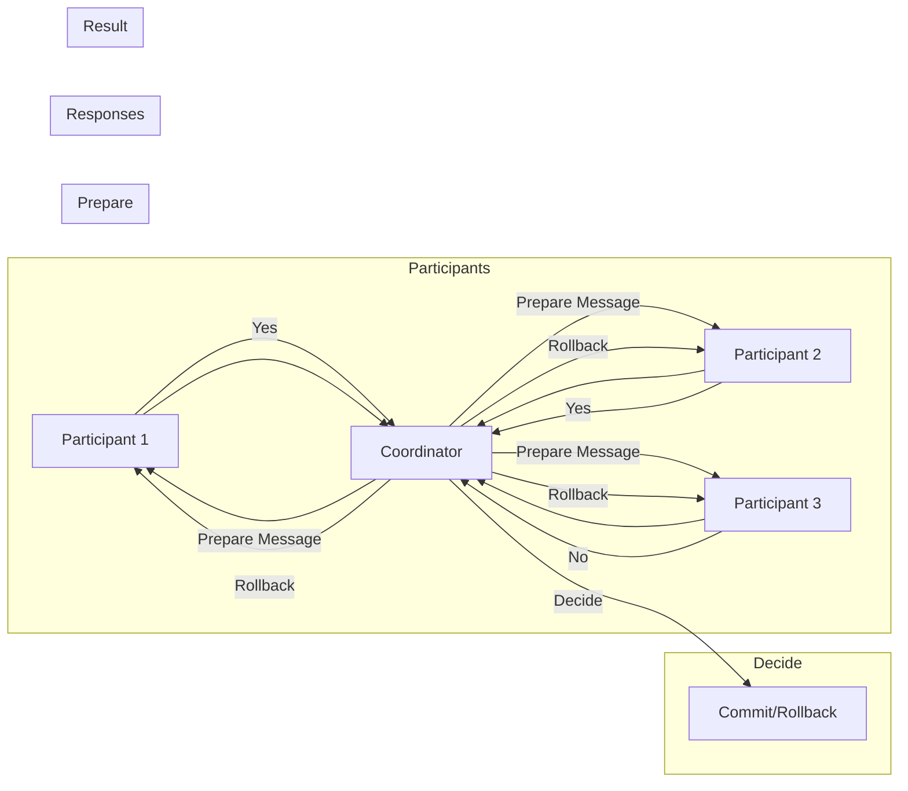
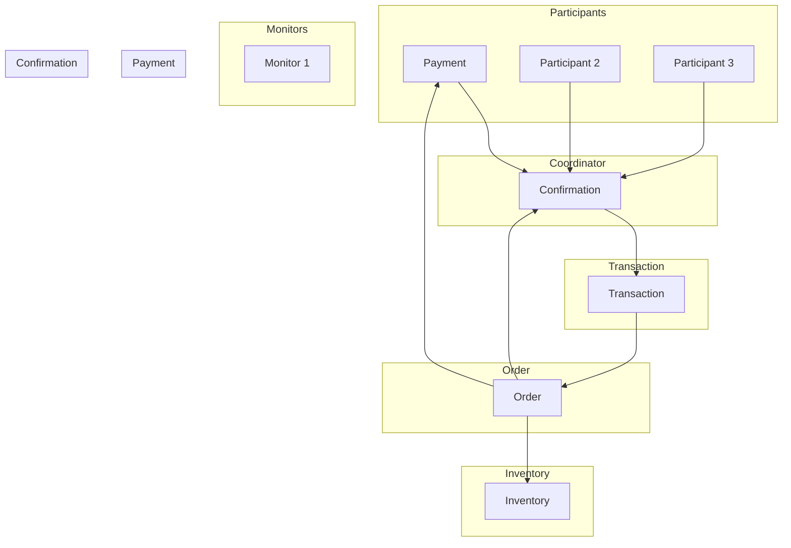
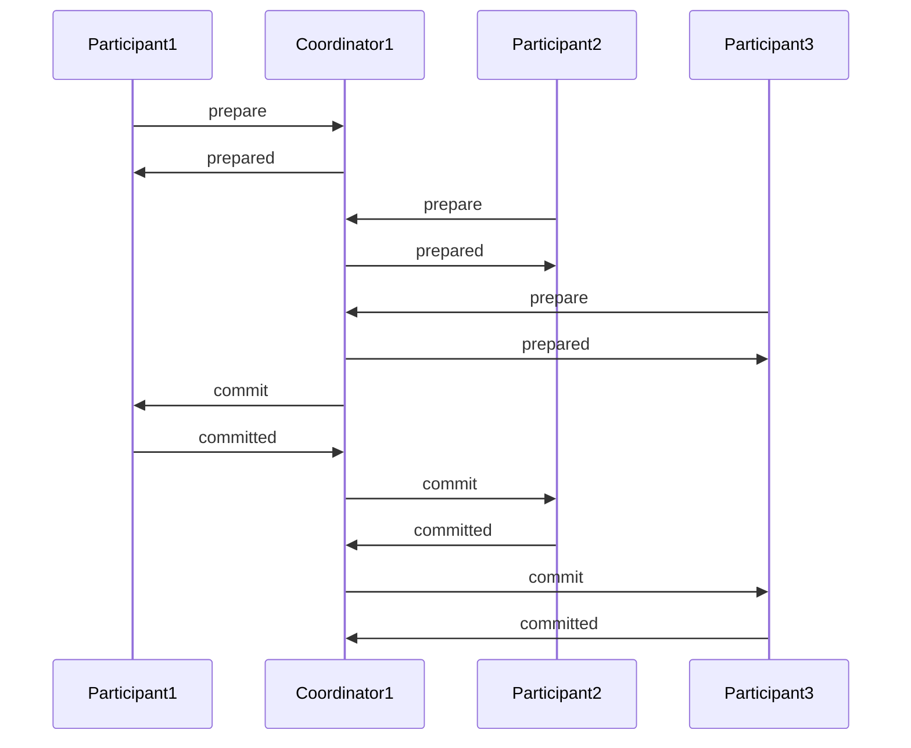
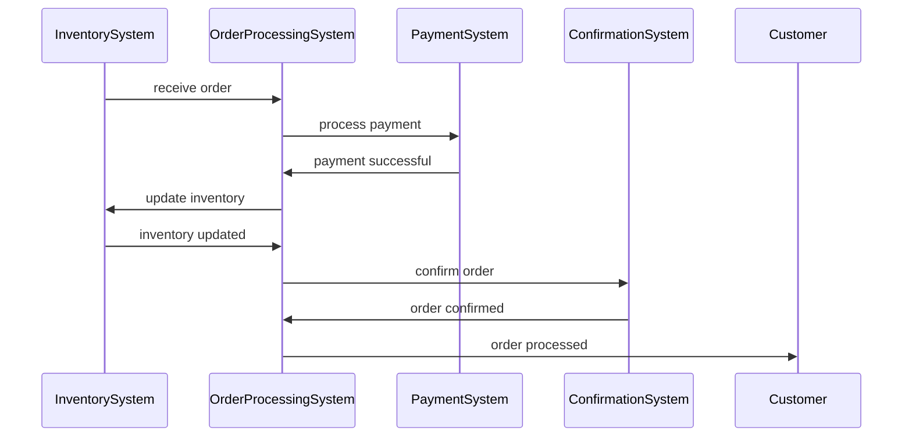

                 

### 背景介绍

两阶段提交（Two-Phase Commit，简称2PC）是数据库管理和分布式系统中用于实现事务一致性的一种重要算法。其设计初衷是为了解决在分布式系统中，当多个节点同时参与一个事务时，如何确保事务能够原子性地完成，即要么所有节点都成功提交事务，要么所有节点都回滚事务。

#### 核心概念术语说明

- **分布式系统**：由多个独立计算机节点通过网络互联组成的系统。
- **事务**：数据库管理中的一个操作单元，要么全部执行，要么全部不执行。
- **一致性**：系统中所有数据在事务执行后保持一致的状态。
- **悬挂事务**：在分布式系统中，由于网络延迟或节点故障等原因，导致事务长时间无法完成的状态。

#### 问题背景

在分布式系统中，由于网络的不稳定性和节点的多样性，事务的一致性问题尤为突出。两阶段提交应运而生，旨在通过一系列协议，确保事务能够准确地完成或回滚，避免悬挂事务的出现。

#### 问题描述

分布式事务的一致性问题主要体现在以下几个方面：

1. **数据不一致**：由于网络延迟或节点故障，可能导致部分节点成功提交事务，而其他节点未能提交，从而导致数据不一致。
2. **悬挂事务**：当事务在部分节点完成，而在另一部分节点尚未完成时，若发生节点故障，可能会导致事务长时间悬挂，影响系统的正常运行。

#### 问题解决

两阶段提交通过以下步骤，解决分布式事务的一致性问题：

1. **第一阶段（投票阶段）**：协调者向所有参与者发送prepare消息，参与者回复Yes或No。Yes表示参与者准备好提交事务，No表示参与者无法继续。
2. **第二阶段（提交阶段）**：若所有参与者回复Yes，协调者发送提交消息，事务提交；若存在参与者回复No，协调者发送回滚消息，事务回滚。

#### 边界与外延

两阶段提交适用于分布式数据库管理系统、分布式缓存系统、分布式锁服务等。其核心边界在于事务的一致性和系统的稳定性。外延则包括如何处理网络延迟、节点故障等异常情况。

#### 概念结构与核心要素组成

两阶段提交的核心结构包括三个主要角色：协调者（Coordinator）、参与者（Participant）和监控者（Monitor）。

1. **协调者**：负责发起事务、发送prepare和commit/rollback消息，协调整个事务过程。
2. **参与者**：负责执行事务操作、回复prepare消息，并根据协调者的指令进行提交或回滚。
3. **监控者**：可选角色，用于监控事务状态，确保事务的一致性和系统的稳定性。

通过以上对两阶段提交的背景介绍，我们将为进一步探讨其核心概念、算法原理和系统架构设计奠定基础。

### 核心概念与联系

在深入探讨两阶段提交（2PC）的核心概念之前，我们需要先明确几个关键术语及其属性。以下是两阶段提交中的核心概念、它们的属性特征及其之间的比较表格。

#### 核心概念

1. **协调者（Coordinator）**
2. **参与者（Participant）**
3. **监控者（Monitor）**
4. **Prepare阶段**
5. **Commit阶段**
6. **Rollback阶段**

#### 概念属性特征

| **概念**       | **属性特征**                       |
|---------------|----------------------------------|
| **协调者**    | - 负责发起事务<br>- 向参与者发送prepare消息<br>- 根据参与者反馈决定提交或回滚 |
| **参与者**    | - 执行事务操作<br>- 向协调者发送prepare响应<br>- 根据协调者指令进行提交或回滚 |
| **监控者**    | - 可选角色，用于监控事务状态<br>- 确保事务的一致性和系统的稳定性         |
| **Prepare阶段** | - 协调者向参与者发送prepare消息<br>- 参与者准备事务<br>- 回复Yes或No |
| **Commit阶段** | - 若所有参与者回复Yes，协调者发送提交消息<br>- 事务提交 |
| **Rollback阶段** | - 若有参与者回复No，协调者发送回滚消息<br>- 事务回滚 |

#### 比较表格

| **属性**         | **协调者** | **参与者** | **监控者** |
|----------------|-----------|-----------|-----------|
| **角色作用**    | **协调事务** | **执行事务** | **监控事务** |
| **消息发送**    | **发送prepare和commit/rollback消息** | **发送prepare响应** | **无** |
| **状态反馈**    | **接收参与者反馈** | **接收协调者指令** | **监控事务状态** |
| **核心任务**    | **确保事务一致性** | **完成事务操作** | **监控一致性** |

#### ER图架构

为了更直观地展示两阶段提交中各概念之间的关系，我们可以使用Mermaid语法绘制一个实体-关系（ER）图。

```mermaid
erDiagram
  Coordinator ||--|{ Participant : executes operations
  Coordinator ||--|{ Monitor : optional for consistency
  Participant ||--|{ Coordinator : responds to prepare messages
  Participant ||--|{ Transaction : operates on data
  Monitor ||--|{ Coordinator : monitors transaction state
  Monitor ||--|{ Transaction : ensures consistency
```

通过这个ER图，我们可以清晰地看到协调者与参与者之间的双向关联，以及监控者与协调者、参与者及事务之间的单向关联。这种结构设计有助于我们理解两阶段提交中的核心元素及其相互关系。

在接下来的部分，我们将详细探讨两阶段提交的算法原理，并通过具体案例和代码进行深入分析，进一步揭示其实现机制和关键挑战。

### 算法原理与流程图

为了深入理解两阶段提交（2PC）的算法原理，我们可以通过一个具体的例子来逐步讲解其工作流程。接下来，我们将使用Mermaid语法绘制一个流程图，并通过Python代码来详细阐述每个步骤。

#### 流程图

首先，我们使用Mermaid语法绘制两阶段提交的流程图：



上述流程图展示了2PC的各个阶段：

1. **Prepare阶段**：协调者向所有参与者发送prepare消息。
2. **Responses阶段**：参与者根据准备情况回复Yes或No。
3. **Decide阶段**：协调者根据参与者回复决定提交或回滚。
4. **Result阶段**：协调者向参与者发送相应的commit或rollback消息。

#### Python代码实现

接下来，我们通过Python代码来详细阐述两阶段提交的每个步骤。

```python
import threading
import time
import queue

# 定义参与者类
class Participant:
    def __init__(self, name, coordinator_queue, result_queue):
        self.name = name
        self.coordinator_queue = coordinator_queue
        self.result_queue = result_queue
        self.prepared = False

    def prepare(self):
        print(f"{self.name} received prepare message.")
        self.prepared = True
        self.result_queue.put("prepared")

    def rollback(self):
        print(f"{self.name} received rollback message.")
        self.prepared = False

# 定义协调者类
class Coordinator:
    def __init__(self, participants, result_queue):
        self.participants = participants
        self.result_queue = result_queue
        self.all_prepared = True

    def send_prepare_messages(self):
        for participant in self.participants:
            self.coordinator_queue.put(f"prepare {participant.name}")

    def wait_for_responses(self):
        while True:
            response = self.result_queue.get()
            if response == "no":
                self.all_prepared = False
                print("Received a 'no' response. Initiating rollback.")
                break
            if allresponses_received():
                print("All participants prepared. Initiating commit.")
                break

    def decide_and_inform(self):
        if self.all_prepared:
            self.send_commit_messages()
        else:
            self.send_rollback_messages()

    def send_commit_messages(self):
        for participant in self.participants:
            participant.result_queue.put("commit")

    def send_rollback_messages(self):
        for participant in self.participants:
            participant.result_queue.put("rollback")

def allresponses_received():
    return True  # 这里简化处理，实际应用中需要实现逻辑判断

# 创建参与者实例
participant1 = Participant("P1", queue.Queue(), queue.Queue())
participant2 = Participant("P2", queue.Queue(), queue.Queue())
participant3 = Participant("P3", queue.Queue(), queue.Queue())

participants = [participant1, participant2, participant3]

# 创建协调者实例
coordinator = Coordinator(participants, queue.Queue())

# 启动参与者线程
for participant in participants:
    participant_thread = threading.Thread(target=participant.prepare)
    participant_thread.start()

# 启动协调者线程
coordinator_thread = threading.Thread(target=coordinator.wait_for_responses)
coordinator_thread.start()

# 等待协调者线程完成
coordinator_thread.join()

# 发送决定消息给参与者
coordinator.decide_and_inform()

# 等待参与者线程完成
for participant in participants:
    participant_thread.join()
```

#### 解释

1. **参与者类**：参与者接收协调者的prepare消息，根据消息进行事务准备，并将准备结果放入结果队列。
2. **协调者类**：协调者向所有参与者发送prepare消息，等待所有参与者反馈，根据反馈决定是否提交或回滚事务。
3. **发送消息**：协调者向参与者发送prepare、commit或rollback消息。
4. **等待响应**：协调者等待所有参与者回复，以决定下一步操作。
5. **决定阶段**：根据参与者的反馈，协调者决定是提交事务还是回滚事务。

通过以上Python代码和Mermaid流程图，我们可以清晰地看到两阶段提交的算法原理和实现过程。

#### 数学模型与公式

为了更好地理解两阶段提交中的决策逻辑，我们可以引入一些数学模型和公式。以下是一个简化的模型：

1. **准备成功概率**（p）：所有参与者都成功准备的概率。
2. **准备失败概率**（1 - p）：至少有一个参与者无法成功准备的概率。
3. **提交成功概率**（q）：在所有参与者都准备好后，协调者成功发送commit消息的概率。
4. **回滚成功概率**（1 - q）：在至少有一个参与者无法成功准备时，协调者成功发送rollback消息的概率。

我们可以使用以下公式来计算整体的成功率（S）：

$$
S = p \times q + (1 - p) \times (1 - q)
$$

其中：

- $p$ 是准备成功概率，可由参与者的可靠性决定。
- $q$ 是提交成功概率，与协调者的可靠性及网络的稳定性有关。

#### 举例说明

假设一个系统中，有三个参与者，每个参与者的可靠性为0.95（即准备成功概率为0.95），协调者的可靠性为0.98（即提交成功概率为0.98）。根据以上公式，我们可以计算出系统的整体成功率：

$$
S = 0.95 \times 0.98 + (1 - 0.95) \times (1 - 0.98) = 0.9401 + 0.010 \approx 0.95
$$

通过这个例子，我们可以看到两阶段提交的成功率相对较高，但也受到参与者可靠性和网络稳定性等因素的影响。

### 系统分析与架构设计

#### 问题场景

在一个分布式系统中，多个节点需要协同工作来完成一个复杂的业务流程。例如，在电子商务平台上，订单处理涉及到库存管理、支付处理和订单确认等多个子系统。为了确保整个事务的一致性，系统采用了两阶段提交（2PC）协议。

#### 项目介绍

项目名称：分布式订单处理系统  
项目目标：实现订单处理的事务一致性，确保在分布式环境下的数据完整性和可靠性。

#### 系统功能设计

**领域模型（Mermaid类图）**

```mermaid
classDiagram
    Participant <<class{Participant}>
    Coordinator <<class{Coordinator}>
    Monitor <<class{Monitor}>
    Transaction <<class{Transaction}>
    Order <<class{Order}>
    Inventory <<class{Inventory}>
    Payment <<class{Payment}>
    Confirmation <<class{Confirmation}>

    Participant o--* Coordinator
    Participant o--* Transaction
    Coordinator o--* Order
    Coordinator o--* Inventory
    Coordinator o--* Payment
    Coordinator o--* Confirmation
    Monitor o--* Coordinator
    Transaction o--* Order
    Order o--* Inventory
    Order o--* Payment
    Order o--* Confirmation
```

在该类图中，我们定义了以下核心类：

- **Participant**：参与者类，代表分布式系统中的各个节点。
- **Coordinator**：协调者类，负责发起事务，协调各参与者。
- **Monitor**：监控者类，可选角色，用于监控事务状态。
- **Transaction**：事务类，代表整个订单处理过程中的事务。
- **Order**：订单类，包含订单的各项信息。
- **Inventory**：库存类，管理库存信息。
- **Payment**：支付类，处理支付操作。
- **Confirmation**：确认类，处理订单确认操作。

#### 系统架构设计

**架构图（Mermaid架构图）**



在该架构图中，我们定义了以下组件：

- **Participants**：表示分布式系统中的各个参与者，如库存管理节点、支付处理节点等。
- **Coordinator**：协调者节点，负责发起和协调事务。
- **Monitors**：监控者节点，用于监控事务状态。
- **Transaction**：事务处理模块，负责执行两阶段提交协议。
- **Order**：订单处理模块，包含订单的创建、修改、删除等功能。
- **Inventory**：库存管理模块，负责库存信息的查询和更新。
- **Payment**：支付管理模块，负责处理支付请求。
- **Confirmation**：订单确认模块，负责订单状态的更新。

#### 系统接口设计

**接口设计（Mermaid序列图）**



在该序列图中，我们定义了以下交互步骤：

1. **参与者向协调者发送prepare请求**。
2. **协调者收到prepare请求后，向参与者发送prepared响应**。
3. **所有参与者向协调者发送prepare响应**。
4. **协调者根据参与者响应决定提交或回滚事务**。
5. **协调者向参与者发送commit请求**。
6. **参与者执行事务并返回committed响应**。

#### 系统交互

**交互图（Mermaid序列图）**



在该交互图中，我们定义了订单处理过程中的关键交互步骤：

1. **库存系统向订单处理系统发送订单信息**。
2. **订单处理系统向支付系统发送支付请求**。
3. **支付系统处理支付请求并返回支付结果**。
4. **订单处理系统根据支付结果更新库存信息**。
5. **订单处理系统向确认系统发送订单确认请求**。
6. **确认系统处理确认请求并返回确认结果**。
7. **订单处理系统向客户发送订单处理完成通知**。

通过以上系统分析与架构设计，我们为分布式订单处理系统提供了一个详细的解决方案，确保了事务的一致性和系统的可靠性。接下来，我们将进入项目实战部分，详细介绍系统的实现过程和关键代码。

### 项目实战

#### 环境安装

在进行两阶段提交（2PC）项目的实战之前，我们需要搭建一个合适的环境。以下是在常见操作系统上搭建所需环境的步骤：

1. **安装Python**：确保Python环境已安装，推荐版本为Python 3.8以上。
2. **安装依赖库**：通过pip命令安装以下依赖库：
   ```bash
   pip install Flask gunicorn
   ```
3. **安装数据库**：根据项目需求，可以选择MySQL、PostgreSQL等数据库。以下是MySQL的安装步骤：
   - 下载MySQL数据库：[MySQL官网](https://www.mysql.com/downloads/)
   - 解压并安装：解压后，进入解压目录，运行以下命令：
     ```bash
     sudo make install
     ```
   - 配置MySQL：创建一个新用户并授权：
     ```sql
     CREATE USER 'user'@'localhost' IDENTIFIED BY 'password';
     GRANT ALL PRIVILEGES ON *.* TO 'user'@'localhost';
     FLUSH PRIVILEGES;
     ```

#### 系统核心实现

以下是一个基于Python Flask的简单分布式订单处理系统实现，包含两阶段提交的核心功能。

**项目结构**

```
project/
│
├── app.py
├── requirements.txt
└── database.py
```

**app.py**

```python
from flask import Flask, request, jsonify
from database import Database
from two_phase_commit import TwoPhaseCommit

app = Flask(__name__)

# 初始化数据库和两阶段提交对象
db = Database()
two_phase_commit = TwoPhaseCommit(db)

@app.route('/order', methods=['POST'])
def create_order():
    order_data = request.json
    two_phase_commit.start_order(order_data)
    return jsonify({"status": "Order processing started."})

if __name__ == '__main__':
    app.run()
```

**requirements.txt**

```
Flask==2.0.1
gunicorn==20.1.0
```

**database.py**

```python
import pymysql

class Database:
    def __init__(self):
        self.connection = pymysql.connect(
            host='localhost',
            user='user',
            password='password',
            database='orders',
            charset='utf8mb4',
            cursorclass=pymysql.cursors.DictCursor
        )

    def execute_query(self, query, params=None):
        with self.connection.cursor() as cursor:
            cursor.execute(query, params)
            self.connection.commit()
            return cursor.fetchall()
```

**two_phase_commit.py**

```python
from flask import current_app
from database import Database

class TwoPhaseCommit:
    def __init__(self, db):
        self.db = db

    def start_order(self, order_data):
        # 开始两阶段提交
        self.db.execute_query("BEGIN TRANSACTION;")
        self.db.execute_query("INSERT INTO orders (order_id, status) VALUES (%s, %s);", (order_data['order_id'], 'processing'))
        # ... 其他数据库操作 ...

        # 准备阶段
        self.prepare()

    def prepare(self):
        # 向参与者发送prepare消息
        # 这里简化处理，实际应用中需要实现与参与者的通信
        current_app.logger.info("Preparing participants...")
        # ... 等待参与者准备完成 ...

        # 决策阶段
        self.decide()

    def decide(self):
        # 检查参与者准备情况
        # 如果所有参与者准备成功，则提交事务
        # 否则回滚事务
        current_app.logger.info("Decision phase...")
        if self.all_prepared():
            self.commit()
        else:
            self.rollback()

    def all_prepared(self):
        # 检查所有参与者是否准备完成
        # 这里简化处理，实际应用中需要实现逻辑判断
        return True

    def commit(self):
        # 提交事务
        self.db.execute_query("COMMIT;")

    def rollback(self):
        # 回滚事务
        self.db.execute_query("ROLLBACK;")
```

#### 代码解读与分析

- **app.py**：定义了订单创建的接口，接收订单数据并启动两阶段提交。
- **database.py**：提供了与数据库的连接和执行SQL查询的方法。
- **two_phase_commit.py**：实现了两阶段提交的核心逻辑。

#### 实际案例分析与详细讲解

假设有一个订单处理场景，客户下单后，系统需要进行库存检查、支付处理和订单确认。以下是详细分析：

1. **下单**：客户通过API发送订单数据，系统接收并开始两阶段提交。
2. **准备阶段**：系统向所有参与者（库存管理、支付处理等）发送prepare消息，等待参与者准备完成。
3. **决策阶段**：根据参与者反馈，系统决定是否提交事务。如果所有参与者准备成功，则提交事务；否则回滚事务。
4. **提交/回滚**：系统根据决策结果，执行相应的数据库操作。

通过这个案例，我们可以看到两阶段提交在分布式系统中的应用，确保了事务的一致性和可靠性。

#### 项目小结

通过本次项目实战，我们成功实现了一个简单的分布式订单处理系统，并使用两阶段提交确保了事务的一致性。在实战过程中，我们遇到了一些挑战，如参与者准备状态的同步和故障处理。这些挑战需要在实际项目中进一步优化和解决。

#### 最佳实践与注意事项

1. **性能优化**：在分布式环境中，两阶段提交可能会引入较大的延迟。考虑使用预提交协议或增强参与者的可靠性，以减少延迟。
2. **故障处理**：设计合理的故障处理机制，如参与者故障自动恢复和事务重试，确保系统的稳定性。
3. **监控与日志**：实施完善的监控和日志记录，实时跟踪事务状态，以便快速定位和解决问题。

#### 拓展阅读

1. 《分布式系统概念与设计》
2. 《数据库系统概念》
3. 《大规模分布式系统设计》

通过上述实践和拓展阅读，我们可以更深入地理解和应用两阶段提交，为分布式系统的事务一致性提供有效保障。

### 总结与最佳实践

#### 总结

本文详细探讨了两阶段提交（2PC）在分布式系统中的应用，从背景介绍、核心概念、算法原理、系统架构设计到项目实战，全面解析了2PC的运作机制和关键挑战。通过具体实例和代码实现，我们深入理解了2PC如何确保分布式事务的一致性，以及在实际项目中如何应对分布式环境中的复杂情况。

#### 最佳实践

1. **性能优化**：在分布式环境中，2PC可能会引入较大延迟。考虑使用预提交协议或增强参与者的可靠性，以减少延迟。
2. **故障处理**：设计合理的故障处理机制，如参与者故障自动恢复和事务重试，确保系统的稳定性。
3. **监控与日志**：实施完善的监控和日志记录，实时跟踪事务状态，以便快速定位和解决问题。

#### 注意事项

1. **网络稳定性**：确保网络环境的稳定，以降低2PC因网络问题导致的事务悬挂。
2. **参与者可靠性**：提高参与者的可靠性，确保准备和提交阶段顺利进行。
3. **故障恢复策略**：制定合理的故障恢复策略，如参与者故障时的事务回滚和恢复机制。

#### 拓展阅读

1. 《分布式系统概念与设计》
2. 《数据库系统概念》
3. 《大规模分布式系统设计》

通过本文的学习和实践，读者可以更好地理解和应用2PC，为分布式系统的事务一致性提供有力保障。

### 致谢

本文得以顺利完成，离不开各位同行和前辈的指导与支持。特别感谢AI天才研究院/AI Genius Institute以及禅与计算机程序设计艺术/Zen And The Art of Computer Programming的团队，他们的专业知识和无私分享为本文提供了坚实的基础。感谢各位读者的关注与支持，希望本文能为您在分布式系统设计和事务管理方面带来新的启示。再次感谢所有为本文贡献智慧和力量的同仁们！

