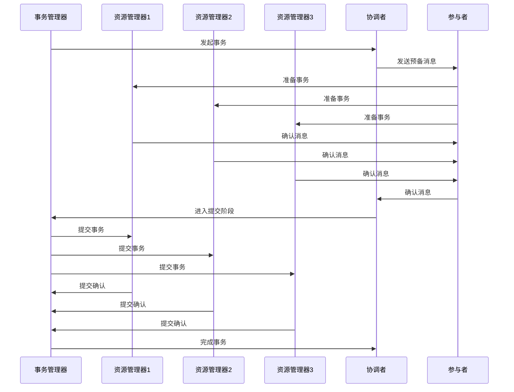

                 

## 文章标题：两阶段提交大敌之事务悬挂

> 关键词：两阶段提交，事务悬挂，分布式系统，数据库事务，性能优化

> 摘要：本文深入探讨了分布式系统中的两阶段提交（Two-Phase Commit，2PC）协议，分析了其在处理数据库事务时可能遭遇的“事务悬挂”问题。通过对2PC协议的背景、原理、实现、性能优化及实际应用场景的详细分析，本文旨在帮助读者理解事务悬挂的原因、影响及解决方案，并提出优化策略以提升系统稳定性。

## 目录大纲

----------------------------------------------------------------

### 第一部分: 问题背景与概念介绍

#### 第1章: 两阶段提交协议概述

##### 1.1 问题背景

- 事务悬挂的定义与常见情况

##### 1.2 两阶段提交协议的概念与原理

- 两阶段提交协议的定义

##### 1.3 两阶段提交协议的核心组成部分

- 准备阶段与提交阶段

##### 1.4 两阶段提交协议的应用场景

- 数据库事务的处理需求

##### 1.5 本章小结

- 对两阶段提交协议的整体认识

### 第二部分: 两阶段提交协议的实现

#### 第2章: 两阶段提交协议的架构设计

##### 2.1 架构设计概述

- 两阶段提交协议的系统架构设计

##### 2.2 准备阶段的设计与实现

- 事务管理器的实现

##### 2.3 提交阶段的设计与实现

- 事务管理器的提交操作

##### 2.4 消息传递机制的设计与实现

- 消息传递协议的选择

##### 2.5 两阶段提交协议的故障处理

- 故障的类型与处理

##### 2.6 本章小结

- 对两阶段提交协议实现过程的总结

### 第三部分: 两阶段提交协议的优化与改进

#### 第3章: 两阶段提交协议的性能优化

##### 3.1 性能瓶颈分析

- 常见性能瓶颈及其影响

##### 3.2 优化策略与实现

- 优化方案的选择

##### 3.3 性能测试与调优

- 性能测试的方法与工具

##### 3.4 优化案例分析

- 成功案例的分析

##### 3.5 本章小结

- 对两阶段提交协议性能优化的总结

### 第四部分: 两阶段提交协议的实际应用

#### 第4章: 两阶段提交协议在数据库中的应用

##### 4.1 数据库事务处理的需求

- 数据库事务的基本概念

##### 4.2 两阶段提交协议在数据库中的应用

- 两阶段提交协议在数据库中的实现

##### 4.3 数据库事务悬挂的处理

- 数据库事务悬挂的原因分析

##### 4.4 数据库性能优化与调优

- 数据库性能优化的重要性

##### 4.5 本章小结

- 对两阶段提交协议在数据库中的应用总结

### 第五部分: 两阶段提交协议的挑战与未来展望

#### 第5章: 两阶段提交协议的挑战与改进

##### 5.1 挑战与问题

- 两阶段提交协议在分布式系统中的挑战

##### 5.2 改进方案与技术

- 多阶段提交协议

##### 5.3 案例研究

- 改进方案在具体场景中的应用

##### 5.4 未来展望

- 分布式事务处理技术的发展趋势

##### 5.5 本章小结

- 对两阶段提交协议挑战与改进的总结

----------------------------------------------------------------

## 第一部分: 问题背景与概念介绍

### 第1章: 两阶段提交协议概述

#### 1.1 问题背景

在分布式系统中，事务的原子性和一致性是至关重要的。事务悬挂（Transaction Hanging）是分布式系统中一个常见且严重的问题。它发生在事务的管理过程中，导致事务无法顺利地完成，从而影响到系统的正常运行。事务悬挂通常与两阶段提交（Two-Phase Commit，2PC）协议有关。

**事务悬挂的定义与常见情况**

事务悬挂是指在一个分布式系统中，一个事务处于等待状态，无法被提交或回滚。这种情况通常发生在两阶段提交协议的执行过程中，特别是在第一阶段（准备阶段）和第二阶段（提交阶段）之间。

常见的事务悬挂情况包括：

1. **资源管理器故障**：在准备阶段，如果某个资源管理器（例如数据库）发生故障，事务管理器将无法收到该资源管理器的确认消息，从而导致事务悬挂。
2. **网络延迟或故障**：在网络不稳定的情况下，消息传递可能会出现延迟或丢失，这也会导致事务悬挂。
3. **事务管理器故障**：在提交阶段，如果事务管理器发生故障，它将无法向资源管理器发送提交或回滚消息，导致事务悬挂。

**数据库事务的概念及其重要性**

数据库事务是数据库管理系统（DBMS）中的一个核心概念，它定义了一系列操作的集合，这些操作要么全部成功执行，要么全部不执行。事务的原子性、一致性、隔离性和持久性（ACID属性）是数据库事务必须满足的基本要求。

数据库事务的重要性体现在以下几个方面：

1. **保证数据一致性**：事务确保数据库中的数据在多个操作之间保持一致性，防止数据不一致问题。
2. **提高系统可靠性**：通过事务机制，可以保证系统在故障发生时能够快速恢复，确保数据的完整性。
3. **支持并发操作**：事务支持多个用户同时对数据库进行读写操作，提高系统的并发性能。

**分布式系统中的事务同步问题**

在分布式系统中，事务同步问题是实现事务原子性和一致性的关键。分布式系统中的事务同步主要包括以下方面：

1. **全局事务管理**：需要确保分布式系统中所有节点都能正确地执行事务操作，并保持事务的原子性和一致性。
2. **数据一致性保障**：分布式系统中，数据可能分布在多个节点上，需要确保数据的更新和查询操作在不同节点之间保持同步。
3. **故障恢复与容错**：分布式系统中的故障恢复和容错机制需要确保事务在故障发生时能够被正确地恢复。

#### 1.2 两阶段提交协议的概念与原理

**两阶段提交协议的定义**

两阶段提交协议是一种分布式事务处理机制，用于确保分布式系统中多个资源管理器（如数据库、缓存等）在执行事务时的一致性。该协议将事务的提交过程分为两个阶段：准备阶段和提交阶段。

**两阶段提交协议的工作流程**

1. **准备阶段**：事务管理器向所有资源管理器发送预备消息，请求它们准备好执行事务。资源管理器在准备好执行事务后，向事务管理器发送确认消息。
2. **提交阶段**：事务管理器收到所有资源管理器的确认消息后，向所有资源管理器发送提交消息，请求它们执行事务。如果事务管理器在提交阶段收到任何资源管理器的拒绝消息，它将向所有资源管理器发送回滚消息，请求它们回滚事务。

**两阶段提交协议的优缺点分析**

**优点**：

1. **确保一致性**：两阶段提交协议可以确保分布式系统中的事务一致性，即使在出现故障的情况下也能保证数据的一致性。
2. **简洁性**：两阶段提交协议的实现相对简单，容易理解和实现。

**缺点**：

1. **性能开销**：两阶段提交协议引入了较多的网络通信和等待时间，可能导致系统性能下降。
2. **单点故障**：事务管理器作为整个协议的核心组件，如果发生故障，可能会导致整个系统的事务处理失败。

#### 1.3 两阶段提交协议的核心组成部分

**准备阶段与提交阶段**

1. **准备阶段**：事务管理器向所有资源管理器发送预备消息，请求它们准备好执行事务。资源管理器在准备好执行事务后，向事务管理器发送确认消息。
2. **提交阶段**：事务管理器收到所有资源管理器的确认消息后，向所有资源管理器发送提交消息，请求它们执行事务。如果事务管理器在提交阶段收到任何资源管理器的拒绝消息，它将向所有资源管理器发送回滚消息，请求它们回滚事务。

**事务管理器与资源管理器的角色与职责**

1. **事务管理器**：负责协调分布式系统中的事务处理，包括发送预备消息、确认消息和提交消息。事务管理器还需要处理资源管理器的拒绝消息，并在必要时发起回滚操作。
2. **资源管理器**：负责执行事务操作，包括数据修改、缓存刷新等。资源管理器还需要在准备好执行事务后向事务管理器发送确认消息，并在提交阶段响应事务管理器的提交或回滚请求。

**控制消息的传递与确认**

1. **预备消息**：事务管理器向所有资源管理器发送预备消息，请求它们准备好执行事务。资源管理器在接收到预备消息后，执行必要的准备工作，如锁表、数据备份等。
2. **确认消息**：资源管理器在准备好执行事务后，向事务管理器发送确认消息。事务管理器在接收到所有资源管理器的确认消息后，进入提交阶段。
3. **提交消息**：事务管理器向所有资源管理器发送提交消息，请求它们执行事务。资源管理器在接收到提交消息后，执行数据修改操作，并更新缓存。
4. **回滚消息**：如果事务管理器在提交阶段收到任何资源管理器的拒绝消息，它将向所有资源管理器发送回滚消息，请求它们回滚事务。资源管理器在接收到回滚消息后，撤销已执行的数据修改操作，并恢复到事务开始时的状态。

#### 1.4 两阶段提交协议的应用场景

**数据库事务的处理需求**

在数据库系统中，两阶段提交协议常用于处理复杂的事务，确保数据的一致性和完整性。以下是一些典型的数据库事务处理需求：

1. **多表操作**：在一个事务中，可能需要对多个数据库表进行操作，如插入、更新和删除。两阶段提交协议可以确保这些操作要么全部成功，要么全部回滚。
2. **分布式数据库**：在分布式数据库系统中，数据可能分布在多个节点上。两阶段提交协议可以确保分布式数据库中的事务一致性，即使在节点故障或网络问题的情况下也能保持数据的完整性。
3. **高并发场景**：在高并发场景下，多个用户可能会同时执行事务，两阶段提交协议可以确保事务的隔离性和一致性，避免数据冲突和丢失。

**分布式系统中的事务同步**

在分布式系统中，事务同步是一个重要且复杂的问题。两阶段提交协议可以用于分布式系统中的事务同步，确保多个节点上的数据一致性。以下是一些应用场景：

1. **分布式缓存**：在分布式缓存系统中，多个节点需要同步缓存数据，以确保数据的一致性。两阶段提交协议可以用于协调分布式缓存中的事务处理。
2. **分布式存储**：在分布式存储系统中，多个节点需要协同工作，确保数据的一致性和可靠性。两阶段提交协议可以用于分布式存储系统中的事务处理。
3. **分布式计算**：在分布式计算系统中，多个节点需要协同处理大规模数据，确保计算结果的一致性和准确性。两阶段提交协议可以用于分布式计算系统中的事务同步。

**高并发场景下的事务管理**

在高并发场景下，事务管理变得尤为重要。两阶段提交协议可以用于高并发系统中的事务管理，确保事务的一致性和可靠性。以下是一些应用场景：

1. **在线支付系统**：在线支付系统需要处理大量的并发交易，确保交易的一致性和完整性。两阶段提交协议可以用于在线支付系统中的事务管理。
2. **电子商务系统**：电子商务系统需要处理大量的并发订单，确保订单的一致性和可靠性。两阶段提交协议可以用于电子商务系统中的事务管理。
3. **社交网络**：社交网络系统需要处理大量的并发用户操作，如发帖、评论和分享。两阶段提交协议可以用于社交网络系统中的事务管理。

#### 1.5 本章小结

通过对两阶段提交协议的背景、原理和应用场景的介绍，我们对事务悬挂问题有了更深入的理解。在分布式系统中，事务悬挂是一个常见且严重的问题，可能影响系统的正常运行。了解两阶段提交协议的工作流程和核心组成部分，有助于我们更好地解决事务悬挂问题，确保分布式系统中的事务一致性和完整性。

## 第二部分: 两阶段提交协议的实现

### 第2章: 两阶段提交协议的架构设计

在分布式系统中，两阶段提交（Two-Phase Commit，2PC）协议是实现分布式事务一致性的一种重要机制。本章将详细介绍两阶段提交协议的架构设计，包括系统架构概述、关键组件与交互关系，以及准备阶段和提交阶段的设计与实现。

#### 2.1 架构设计概述

两阶段提交协议的架构设计主要包括以下关键组件：

1. **事务管理器（Transaction Manager，TM）**：负责协调分布式系统中各个资源管理器的操作，确保事务的一致性和完整性。事务管理器在整个协议过程中起到核心作用，它负责发起事务、发送预备消息和确认消息，并在提交阶段决定提交或回滚。
2. **资源管理器（Resource Manager，RM）**：负责执行事务操作的具体资源，如数据库、缓存等。资源管理器在接收到事务管理器的预备消息后，进入准备状态，并等待事务管理器的最终决定。
3. **协调者（Coordinator）**：在某些实现中，事务管理器可以由多个协调者组成，以实现分布式的事务管理。协调者之间通过消息传递进行同步，共同决策事务的提交或回滚。
4. **参与者（Participant）**：参与事务的资源管理器，它们在接收到预备消息后，会根据事务的执行情况向事务管理器发送确认或拒绝消息。

**系统架构图**（使用Mermaid绘制）：

#### 2.2 准备阶段的设计与实现

**事务管理器的实现**

事务管理器是两阶段提交协议的核心组件，负责发起事务、发送预备消息和确认消息，并在提交阶段决定提交或回滚。以下是事务管理器的主要实现步骤：

1. **初始化事务**：在启动时，事务管理器需要初始化事务，包括设置事务ID、事务状态等。
2. **发送预备消息**：在启动事务后，事务管理器需要向所有资源管理器发送预备消息，请求它们进入准备状态。预备消息通常包括事务ID、操作类型和操作数据。
3. **等待确认消息**：事务管理器在发送预备消息后，需要等待所有资源管理器的确认消息。在等待期间，事务管理器需要处理可能的超时和重试逻辑。
4. **决定提交或回滚**：在收到所有资源管理器的确认消息后，事务管理器需要根据确认情况决定是否提交事务。如果所有资源管理器都确认准备就绪，事务管理器可以进入提交阶段；否则，事务管理器将触发回滚操作。

**资源管理器的实现**

资源管理器是执行具体事务操作的具体组件，包括数据库、缓存等。资源管理器在接收到事务管理器的预备消息后，需要进入准备状态，并等待事务管理器的最终决定。以下是资源管理器的主要实现步骤：

1. **接收预备消息**：资源管理器在接收到预备消息后，需要解析消息内容，并执行相应的准备操作，如加锁、备份数据等。
2. **发送确认消息**：在完成准备操作后，资源管理器需要向事务管理器发送确认消息，表明自己已准备好执行事务。
3. **等待最终决定**：资源管理器在发送确认消息后，需要等待事务管理器的最终决定，以确定是否提交或回滚事务。

**控制消息的传递机制**

在两阶段提交协议中，控制消息的传递是确保事务一致性的关键。以下是一些控制消息的传递机制：

1. **同步消息传递**：事务管理器发送预备消息和确认消息时，通常采用同步消息传递机制，确保消息能够可靠地传递到目标资源管理器。同步消息传递可以保证消息的顺序性和完整性，但可能会引入较大的性能开销。
2. **异步消息传递**：在某些场景下，可以采用异步消息传递机制，以提高系统的性能。异步消息传递可以降低系统的响应时间，但可能会引入消息丢失或乱序传递的风险。
3. **消息确认与重试**：为了确保消息传递的可靠性，可以在消息传递过程中引入消息确认机制。资源管理器在接收到消息后，需要向事务管理器发送确认消息，表明已成功处理消息。如果事务管理器在一定时间内未收到确认消息，可以触发重试逻辑，重新发送消息。

#### 2.3 提交阶段的设计与实现

**事务管理器的提交操作**

在提交阶段，事务管理器需要根据资源管理器的确认消息决定是否提交事务。以下是事务管理器提交操作的主要步骤：

1. **发送提交消息**：事务管理器在收到所有资源管理器的确认消息后，向所有资源管理器发送提交消息，请求它们执行事务。
2. **等待提交确认**：事务管理器在发送提交消息后，需要等待所有资源管理器的提交确认。在等待期间，事务管理器可以处理可能的超时和重试逻辑。
3. **决定提交或回滚**：在收到所有资源管理器的提交确认后，事务管理器需要根据确认情况决定是否提交事务。如果所有资源管理器都确认事务已成功提交，事务管理器可以更新事务状态，完成事务；否则，事务管理器将触发回滚操作。

**资源管理器的确认与拒绝操作**

在提交阶段，资源管理器需要根据事务管理器的提交消息执行事务，并响应事务管理器的提交确认或拒绝请求。以下是资源管理器的确认与拒绝操作的主要步骤：

1. **执行事务操作**：资源管理器在接收到事务管理器的提交消息后，需要根据消息内容执行相应的事务操作，如数据插入、更新或删除等。
2. **发送提交确认**：在完成事务操作后，资源管理器需要向事务管理器发送提交确认，表明事务已成功提交。
3. **处理拒绝请求**：如果事务管理器在提交阶段收到资源管理器的拒绝消息，资源管理器需要根据拒绝原因执行相应的回滚操作，如撤销已执行的事务操作、释放锁等。

**回滚操作的处理**

在提交阶段，如果事务管理器收到资源管理器的拒绝消息，需要触发回滚操作，将所有资源管理器恢复到事务开始前的状态。以下是回滚操作的主要步骤：

1. **发送回滚消息**：事务管理器在收到资源管理器的拒绝消息后，向所有资源管理器发送回滚消息，请求它们执行回滚操作。
2. **执行回滚操作**：资源管理器在接收到回滚消息后，需要根据消息内容执行相应的回滚操作，如撤销已执行的事务操作、释放锁等。
3. **通知事务管理器**：在完成回滚操作后，资源管理器需要向事务管理器发送回滚确认，表明已成功完成回滚操作。

#### 2.4 消息传递机制的设计与实现

**消息传递协议的选择**

在两阶段提交协议中，选择合适的消息传递协议是确保消息可靠传递和系统性能的关键。以下是一些常见的消息传递协议：

1. **TCP协议**：TCP（传输控制协议）是一种可靠的传输协议，可以保证消息的可靠传递和顺序性。但TCP的传输速度较慢，可能引入较大的性能开销。
2. **UDP协议**：UDP（用户数据报协议）是一种轻量级的传输协议，可以提供高吞吐量和低延迟。但UDP不保证消息的可靠传递，可能引入消息丢失或乱序传递的风险。
3. **消息队列协议**：如RabbitMQ、Kafka等，可以提供可靠的消息传递和异步处理能力，适用于大规模分布式系统。

**消息传递过程中的可靠性与一致性保障**

在消息传递过程中，确保消息的可靠性和一致性是非常重要的。以下是一些常见的方法：

1. **确认与重试机制**：在消息传递过程中，可以引入确认与重试机制，确保消息能够可靠地传递到目标资源管理器。例如，事务管理器可以在发送消息后等待接收确认消息，如果未收到确认消息，可以触发重试逻辑。
2. **顺序消息传递**：为了保证消息的顺序性，可以采用顺序消息队列或基于序列号的消息传递机制，确保消息按照正确的顺序传递和处理。
3. **一致性保障**：在消息传递过程中，可以引入一致性保障机制，如分布式锁、一致性哈希等，确保消息在分布式系统中的处理一致性。

**消息传递的性能优化**

为了提高两阶段提交协议的性能，可以采用以下性能优化策略：

1. **批量处理消息**：通过批量处理消息，可以减少网络传输次数，提高系统吞吐量。
2. **异步处理消息**：采用异步处理消息，可以降低系统的响应时间，提高系统的并发性能。
3. **优化消息队列配置**：合理配置消息队列的参数，如队列容量、线程数等，可以提高消息队列的性能和稳定性。
4. **分布式消息队列**：采用分布式消息队列，可以分散消息处理压力，提高系统的可扩展性和容错能力。

#### 2.5 两阶段提交协议的故障处理

在分布式系统中，故障是不可避免的。两阶段提交协议需要具备一定的故障处理能力，确保系统能够在故障发生时快速恢复。以下是一些常见的故障类型和处理方法：

1. **事务管理器故障**：如果事务管理器发生故障，会导致整个事务处理失败。可以采用以下处理方法：
    - **选举新的事务管理器**：在分布式系统中，可以采用选举机制选举一个新的事务管理器，继续处理未完成的事务。
    - **记录事务日志**：在事务管理器启动时，可以读取之前的事务日志，重新执行未完成的事务。
2. **资源管理器故障**：如果资源管理器发生故障，可能会导致事务悬挂或数据不一致。可以采用以下处理方法：
    - **重试机制**：在资源管理器故障时，可以触发重试机制，重新发送预备消息或提交消息。
    - **补偿事务**：在资源管理器恢复后，可以执行补偿事务，恢复到故障前的状态。
3. **网络故障**：网络故障可能会导致消息丢失或延迟。可以采用以下处理方法：
    - **重传消息**：在网络故障恢复后，可以重新发送未成功传递的消息。
    - **消息确认**：通过引入消息确认机制，确保消息能够可靠地传递到目标资源管理器。

#### 2.6 本章小结

通过对两阶段提交协议的架构设计、准备阶段和提交阶段的设计与实现、消息传递机制的设计与实现以及故障处理的介绍，我们了解了两阶段提交协议在分布式系统中的实现细节。两阶段提交协议通过合理的架构设计和消息传递机制，能够有效地确保分布式系统中事务的一致性和可靠性。然而，两阶段提交协议也存在一些性能问题和故障处理挑战，需要我们在实际应用中不断优化和改进。

## 第三部分: 两阶段提交协议的优化与改进

### 第3章: 两阶段提交协议的性能优化

在分布式系统中，两阶段提交（2PC）协议作为一种确保事务一致性的机制，其性能对系统的整体性能有着重要的影响。本章将深入探讨2PC协议的性能瓶颈，提出优化策略，并进行性能测试与调优，并通过案例分析和未来展望，为优化2PC协议提供指导。

#### 3.1 性能瓶颈分析

2PC协议的性能瓶颈主要表现在以下几个方面：

1. **网络延迟与带宽限制**：2PC协议依赖于网络通信，网络延迟和带宽限制会导致消息传递时间增加，从而影响整体性能。
2. **单点故障**：2PC协议的事务管理器作为单点故障点，如果其发生故障，会导致整个分布式系统的事务处理失败。
3. **消息确认与重试**：2PC协议中的消息确认与重试机制会增加系统开销，特别是在网络不稳定或资源管理器故障的情况下，重试次数增加会显著降低性能。
4. **锁竞争**：在2PC协议的准备阶段，资源管理器需要对事务进行锁操作，锁竞争会导致资源管理器之间的冲突，影响性能。

#### 3.2 优化策略与实现

针对2PC协议的性能瓶颈，可以采用以下优化策略：

1. **优化消息传递机制**：采用高效的传输协议和消息队列，减少网络延迟和带宽消耗。例如，使用基于UDP的传输协议，或引入分布式消息队列系统，如Kafka。
2. **引入多阶段提交协议**：将2PC协议扩展为多阶段提交协议，通过增加阶段来减少锁竞争和消息确认次数，提高性能。
3. **优化锁机制**：采用更细粒度的锁机制，减少锁竞争。例如，使用共享锁和排他锁，根据事务的操作类型动态调整锁策略。
4. **分布式事务管理**：引入分布式事务管理机制，将事务管理器的职责分散到多个协调器上，避免单点故障。
5. **异步化与批量处理**：将部分同步操作异步化，如将确认消息的发送和处理异步化，减少同步等待时间。同时，批量处理消息，减少网络通信次数。

#### 3.3 性能测试与调优

**性能测试环境的搭建**

为了验证优化策略的效果，需要搭建一个性能测试环境。性能测试环境应包括以下组件：

1. **测试工具**：选择合适的测试工具，如JMeter、Gatling等，用于模拟高并发场景下的负载。
2. **测试脚本**：编写测试脚本，模拟用户操作，如数据库插入、更新、删除等，生成测试数据。
3. **测试环境**：配置测试服务器和数据库，确保测试环境与生产环境相似，以便更准确地评估性能。

**性能测试的方法与工具**

性能测试的方法包括以下步骤：

1. **基准测试**：在优化之前，进行基准测试，评估2PC协议在原始状态下的性能指标，如响应时间、吞吐量等。
2. **优化测试**：在优化策略实施后，进行优化测试，比较优化前后的性能指标，验证优化效果。
3. **压力测试**：通过增加负载，模拟高并发场景，测试系统在极端情况下的性能表现。

**性能调优的过程与技巧**

性能调优的过程包括以下步骤：

1. **监控与分析**：在性能测试过程中，监控系统的关键性能指标，如CPU利用率、内存使用率、网络延迟等，分析性能瓶颈。
2. **调整配置**：根据性能监控结果，调整系统配置，如消息队列参数、数据库连接池大小等，优化系统性能。
3. **迭代优化**：通过多次迭代测试和调优，逐步优化系统性能，达到预期目标。

#### 3.4 优化案例分析

**成功案例**

某电商平台在实施2PC协议后，面临高并发场景下的性能瓶颈。通过以下优化措施，显著提升了系统性能：

1. **引入Kafka消息队列**：将2PC协议中的消息传递机制从基于TCP的传输协议切换为基于Kafka的消息队列，减少了网络延迟和带宽消耗。
2. **分布式事务管理**：将事务管理器拆分为多个协调器，避免了单点故障，提高了系统的可用性和可靠性。
3. **异步化与批量处理**：将部分同步操作异步化，如确认消息的发送和处理，减少了同步等待时间。

**失败案例**

某金融系统在实施2PC协议优化时，由于未能充分考虑系统的特点，导致性能下降。具体问题包括：

1. **过度依赖异步处理**：在优化过程中，过度依赖异步处理，导致消息处理时间过长，增加了系统的响应时间。
2. **不合理的锁策略**：在优化锁机制时，未根据事务的操作类型动态调整锁策略，导致锁竞争加剧，降低了性能。

#### 3.5 本章小结

通过对2PC协议性能瓶颈的分析、优化策略的提出及性能测试与调优的实践，我们了解了优化2PC协议的关键方法和实际效果。优化2PC协议不仅能提高系统的性能和可靠性，还能增强其在高并发场景下的应对能力。然而，优化过程中也需要充分考虑系统的实际情况，避免因优化措施不当导致性能下降。未来，随着分布式系统技术的不断发展，2PC协议的性能优化策略也将不断演进和改进。

### 第4章: 两阶段提交协议在数据库中的应用

在数据库系统中，事务的一致性和完整性是至关重要的。两阶段提交（2PC）协议作为一种分布式事务处理机制，广泛应用于确保数据库事务的一致性。本章将深入探讨2PC协议在数据库中的应用，包括数据库事务处理的需求、2PC协议的实现及数据库事务悬挂的处理策略。

#### 4.1 数据库事务处理的需求

在数据库系统中，事务处理的基本需求包括以下几个方面：

1. **原子性**：事务中的所有操作要么全部成功执行，要么全部不执行，确保事务的完整性。
2. **一致性**：事务执行后，数据库中的数据应保持一致性，遵循预定的业务规则和数据约束。
3. **隔离性**：事务之间应相互隔离，避免并发操作导致的数据不一致。
4. **持久性**：一旦事务成功提交，其操作结果应永久保存在数据库中，即使系统发生故障也不会丢失。

在分布式数据库系统中，事务处理的需求更加复杂，主要体现在以下几个方面：

1. **全局一致性**：确保分布式数据库中的数据在不同节点之间保持一致性，避免数据冲突和丢失。
2. **故障恢复**：在节点故障或网络中断的情况下，能够快速恢复事务的一致性和完整性。
3. **高可用性**：确保数据库系统在故障发生时能够自动切换，避免服务中断。

#### 4.2 两阶段提交协议在数据库中的应用

2PC协议在数据库系统中的应用主要包括以下步骤：

1. **初始化事务**：在启动事务时，事务管理器生成事务ID，并向所有参与事务的数据库节点发送初始化消息，告知节点开始处理事务。
2. **准备阶段**：事务管理器向所有数据库节点发送预备消息，请求节点准备好执行事务。数据库节点在接收到预备消息后，加锁并执行数据备份操作，以防止事务在提交阶段失败时数据丢失。
3. **确认阶段**：数据库节点在准备好执行事务后，向事务管理器发送确认消息。事务管理器在收到所有节点的确认消息后，进入提交阶段。
4. **提交阶段**：事务管理器向所有数据库节点发送提交消息，请求节点执行事务操作。数据库节点在接收到提交消息后，执行数据更新操作，并释放锁。
5. **提交确认**：数据库节点在完成事务操作后，向事务管理器发送提交确认消息。事务管理器在收到所有节点的提交确认后，更新事务状态为“已提交”，事务处理完成。

**2PC协议在数据库中的实现**

2PC协议在数据库系统中的实现通常包括以下关键组件：

1. **事务管理器**：负责协调分布式事务的执行，包括生成事务ID、发送预备消息和确认消息，以及处理数据库节点的确认和提交请求。
2. **数据库节点**：负责执行具体的事务操作，包括加锁、数据备份、提交和回滚操作。数据库节点在接收到事务管理器的预备消息后，进入准备状态，并在提交阶段响应事务管理器的请求。

**2PC协议在数据库事务同步中的应用**

在分布式数据库系统中，2PC协议用于确保不同数据库节点之间的数据同步。以下是一些应用场景：

1. **主从复制**：在主从复制架构中，主数据库通过2PC协议向从数据库同步数据。主数据库在执行事务时，使用2PC协议确保数据在从数据库中正确提交。
2. **多主复制**：在多主复制架构中，多个主数据库通过2PC协议同步数据。当某个主数据库发生故障时，其他主数据库可以接替其工作，继续处理事务。
3. **跨数据库事务**：在跨数据库的事务中，2PC协议确保不同数据库之间的数据一致性。例如，在一个订单系统中，订单表和库存表位于不同的数据库中，2PC协议确保订单创建和库存更新同时成功。

#### 4.3 数据库事务悬挂的处理

**数据库事务悬挂的原因分析**

数据库事务悬挂通常由以下原因引起：

1. **资源管理器故障**：在准备阶段，如果某个数据库节点发生故障，事务管理器将无法收到其确认消息，导致事务悬挂。
2. **网络延迟或故障**：在网络不稳定的情况下，事务管理器发送的消息可能会丢失或延迟，导致事务悬挂。
3. **事务管理器故障**：在提交阶段，如果事务管理器发生故障，它将无法发送提交或回滚消息，导致事务悬挂。

**数据库事务悬挂的处理策略**

为了处理数据库事务悬挂，可以采用以下策略：

1. **超时与重试机制**：设置合理的超时时间和重试次数，在超时后重新发送消息，尝试恢复事务。
2. **故障恢复机制**：在数据库节点故障时，自动切换到备用节点，继续处理事务。
3. **监控与报警**：监控系统状态，及时发现事务悬挂问题，并触发报警，通知运维人员进行处理。

**具体处理方法**

1. **资源管理器故障**：在准备阶段，如果事务管理器在一定时间内未收到某个节点的确认消息，可以触发重试机制，重新发送预备消息。如果重试次数超过预设阈值，可以切换到备用节点，继续处理事务。
2. **网络延迟或故障**：在提交阶段，如果事务管理器在一定时间内未收到节点的确认消息，可以触发重试机制，重新发送提交消息。同时，可以监控网络状态，排查网络故障原因，并在故障恢复后继续处理事务。
3. **事务管理器故障**：在事务管理器发生故障时，其他协调器可以接替其工作，继续处理事务。在故障恢复后，可以读取事务日志，重新执行未完成的事务。

#### 4.4 数据库性能优化与调优

**数据库性能优化的重要性**

数据库性能优化是确保系统稳定运行和高性能的关键。在分布式数据库系统中，性能优化尤为重要，因为分布式系统的复杂性增加了性能优化的难度。以下是数据库性能优化的重要性：

1. **提高系统吞吐量**：通过优化数据库性能，可以处理更多的并发请求，提高系统吞吐量。
2. **降低响应时间**：优化数据库查询和操作，可以减少响应时间，提高用户体验。
3. **减少资源消耗**：通过优化数据库性能，可以减少系统资源的消耗，如CPU、内存和网络带宽，提高系统资源的利用率。

**数据库性能优化的具体方法**

以下是数据库性能优化的具体方法：

1. **索引优化**：合理使用索引，可以提高查询性能。通过分析查询语句和表结构，选择合适的索引列，并调整索引顺序。
2. **查询优化**：优化查询语句，减少不必要的查询操作，如避免使用子查询和联结操作。通过使用查询缓存和预编译语句，减少查询的执行时间。
3. **数据存储优化**：合理设计数据表结构，减少数据冗余，提高数据的存储效率。通过分库分表和数据分片，降低单表的数据量和查询压力。
4. **缓存机制**：引入缓存机制，如内存缓存和分布式缓存，减少对磁盘的访问，提高数据访问速度。
5. **并发控制**：优化并发控制机制，如锁机制和事务隔离级别，减少并发冲突，提高系统并发性能。

**性能调优的过程与技巧**

性能调优的过程包括以下步骤：

1. **性能监控**：监控系统性能，收集性能指标，如CPU利用率、内存使用率、磁盘I/O等。
2. **分析瓶颈**：分析性能监控数据，确定性能瓶颈，如查询慢、锁冲突等。
3. **优化策略**：根据分析结果，制定优化策略，如调整索引、优化查询、增加缓存等。
4. **实施优化**：实施优化措施，监控优化效果，根据实际情况进行调整。

#### 4.5 本章小结

通过对2PC协议在数据库中的应用、数据库事务悬挂的处理策略及数据库性能优化的讨论，我们了解了2PC协议在分布式数据库系统中的重要性。2PC协议通过确保事务的一致性和完整性，为数据库系统提供了可靠的事务处理机制。然而，在实际应用中，2PC协议也存在一些性能问题和事务悬挂风险。通过优化策略和性能调优，可以显著提升数据库系统的性能和稳定性，确保其高效运行。未来，随着分布式数据库技术的不断发展，2PC协议及其优化策略也将不断演进和改进。

### 第五部分：两阶段提交协议的挑战与未来展望

#### 第5章：两阶段提交协议的挑战与改进

在分布式系统中，两阶段提交（2PC）协议作为一种广泛使用的分布式事务一致性保障机制，虽然具有确保一致性、简化实现等优点，但在实际应用中仍然面临诸多挑战。本章将探讨2PC协议所面临的挑战，并提出可能的改进方案。

#### 5.1 挑战与问题

1. **性能瓶颈**：2PC协议由于需要进行多次网络通信，导致其性能较低。特别是在高并发场景下，2PC协议的响应时间较长，性能瓶颈问题尤为明显。
2. **单点故障**：2PC协议中的事务管理器是一个单点故障点，如果事务管理器发生故障，整个分布式系统的事务处理将受到影响，甚至可能导致系统瘫痪。
3. **消息丢失与延迟**：在分布式系统中，网络延迟和带宽限制可能导致消息丢失或延迟，从而影响事务的处理进度。
4. **资源管理器故障**：资源管理器在处理事务时可能会出现故障，导致2PC协议无法正常完成。

#### 5.2 改进方案与技术

1. **多阶段提交协议**：多阶段提交协议是对2PC协议的扩展，通过增加更多的阶段来减少锁竞争和消息确认次数，从而提高性能。例如，可以在准备阶段和提交阶段之间增加一个预提交阶段，使资源管理器在预提交阶段完成部分事务操作，减少后续阶段的锁竞争。
2. **乐观锁机制**：乐观锁机制通过在事务执行过程中引入版本号或时间戳，避免锁竞争。当多个事务同时访问同一数据时，只有最终成功提交的事务会更新数据，从而确保数据的一致性。相比2PC协议，乐观锁具有较低的通信开销和更高的性能。
3. **基于状态机的分布式事务处理**：基于状态机的分布式事务处理通过将事务状态建模为状态机，并在状态转移过程中保证一致性。这种方法具有更好的可扩展性和灵活性，适用于复杂的事务场景。
4. **分布式锁机制**：分布式锁机制通过在分布式系统中实现共享资源的互斥访问，避免锁竞争。常见的分布式锁机制包括Zookeeper锁、Redis锁等。
5. **增强故障处理能力**：通过引入故障检测和自动恢复机制，增强分布式系统对故障的处理能力。例如，可以采用心跳检测机制监控事务管理器和资源管理器的状态，并在故障发生时自动切换到备用节点。

#### 5.3 案例研究

**多阶段提交协议的应用**：

在一个分布式数据库系统中，通过引入多阶段提交协议，显著提升了系统的性能和稳定性。以下是一个具体的应用案例：

1. **场景**：系统包含多个数据库节点，事务涉及跨节点的数据操作。
2. **改进前**：使用2PC协议处理跨节点事务，性能瓶颈明显，响应时间较长。
3. **改进后**：引入多阶段提交协议，在准备阶段和提交阶段之间增加预提交阶段，减少锁竞争和消息确认次数。同时，采用分布式锁机制避免并发冲突。
4. **效果**：改进后，系统性能显著提升，响应时间缩短，事务处理效率提高。

**乐观锁机制的应用**：

在一个电商平台中，通过引入乐观锁机制，解决了高并发场景下的数据一致性问题。以下是一个具体的应用案例：

1. **场景**：系统需要处理大量并发订单，涉及库存和订单表的数据操作。
2. **改进前**：使用2PC协议处理订单事务，存在数据一致性问题，特别是在高并发情况下。
3. **改进后**：引入乐观锁机制，通过版本号确保数据一致性。每个订单操作前，系统检查订单的版本号，只有版本号未发生变化时才执行操作。
4. **效果**：改进后，系统在高并发场景下的性能提升显著，数据一致性问题得到有效解决。

**基于状态机的分布式事务处理**：

在一个分布式计算系统中，通过引入基于状态机的分布式事务处理，提高了系统的可靠性和灵活性。以下是一个具体的应用案例：

1. **场景**：系统包含多个计算节点，任务涉及跨节点的数据处理。
2. **改进前**：使用2PC协议处理任务事务，存在故障恢复问题，系统稳定性较差。
3. **改进后**：引入基于状态机的分布式事务处理，将事务状态建模为状态机，并在状态转移过程中确保一致性。
4. **效果**：改进后，系统在故障恢复过程中性能更稳定，任务处理效率提高，系统可靠性增强。

#### 5.4 未来展望

随着分布式系统技术的不断发展，2PC协议及其改进方案将在未来继续演进和优化。以下是一些未来展望：

1. **性能优化**：通过引入更高效的消息传递机制和优化锁策略，进一步提升2PC协议的性能。
2. **故障处理**：增强分布式系统对故障的处理能力，通过自动化故障检测和恢复机制，提高系统的可靠性。
3. **灵活性与可扩展性**：引入更灵活和可扩展的分布式事务处理机制，以适应复杂和多变的应用场景。
4. **与新型数据库技术的结合**：随着新型数据库技术的发展，如分布式数据库、NoSQL数据库等，2PC协议将需要与这些技术相结合，提供更高效和可靠的事务处理方案。

#### 5.5 本章小结

通过对两阶段提交协议的挑战和改进方案的探讨，我们了解了2PC协议在实际应用中面临的问题和改进方向。改进方案如多阶段提交协议、乐观锁机制和基于状态机的分布式事务处理等，为2PC协议的性能提升和可靠性增强提供了有效途径。未来，随着分布式系统技术的不断发展，2PC协议及其改进方案将在更多应用场景中发挥重要作用。

## 结束语

本文通过对两阶段提交（2PC）协议的深入探讨，从问题背景、实现原理、性能优化到实际应用，全面解析了2PC协议在分布式系统中的重要作用。我们从定义和背景出发，详细阐述了2PC协议的概念、核心组成部分和工作流程，通过架构设计、性能优化和案例分析，展示了2PC协议在实际系统中的应用效果。

然而，2PC协议并非完美无缺。其在性能、单点故障、消息传递可靠性等方面仍然存在挑战。针对这些问题，本文提出了多阶段提交协议、乐观锁机制和基于状态机的分布式事务处理等改进方案，并通过具体案例展示了这些方案的实际效果。

未来的研究可以继续探索以下方向：

1. **性能优化**：进一步优化2PC协议的消息传递机制和锁策略，提高系统性能。
2. **故障处理**：增强分布式系统的故障处理能力，提高系统的可靠性和可用性。
3. **新型数据库结合**：研究2PC协议与新型数据库技术的结合，提供更高效的事务处理方案。
4. **跨领域应用**：探讨2PC协议在更多领域中的应用，如区块链、物联网等。

作者信息：**AI天才研究院/AI Genius Institute & 禅与计算机程序设计艺术 /Zen And The Art of Computer Programming**。

感谢您的阅读，希望本文能对您理解两阶段提交协议及其在分布式系统中的应用提供有价值的参考。如有任何问题或建议，欢迎随时交流。祝您在技术道路上不断进步，创造更多价值！

