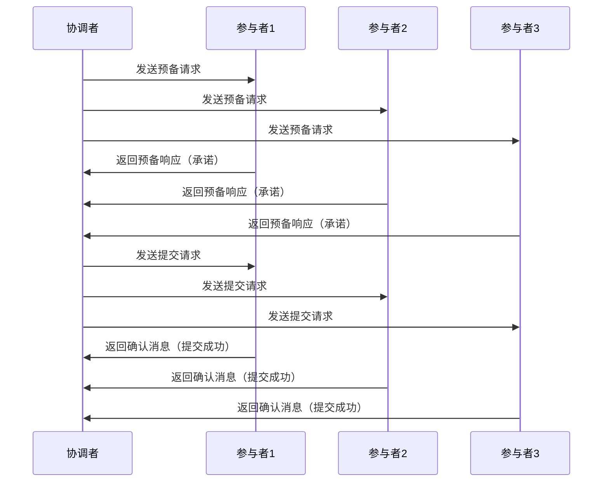
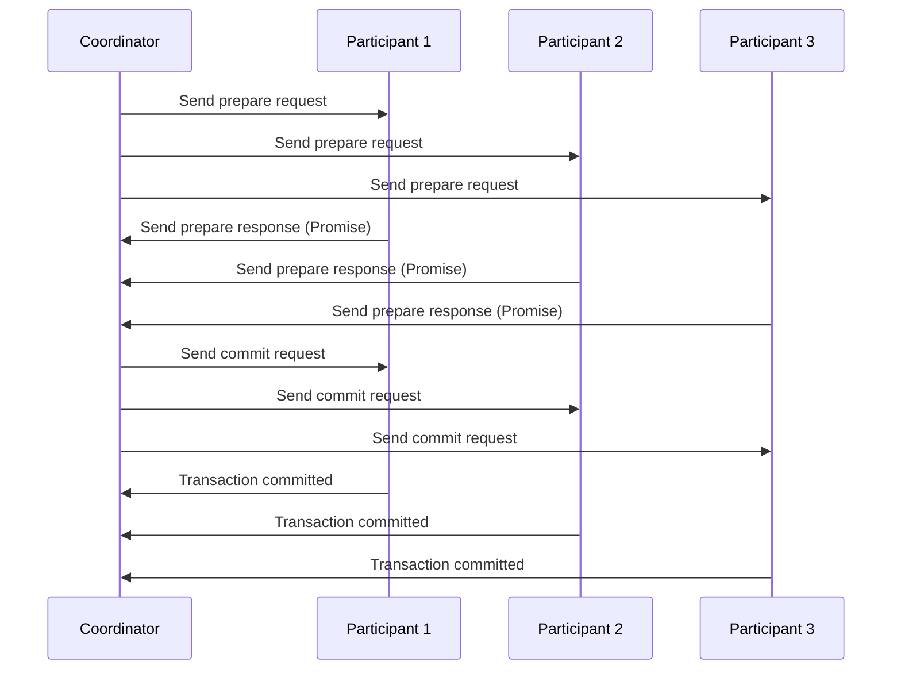
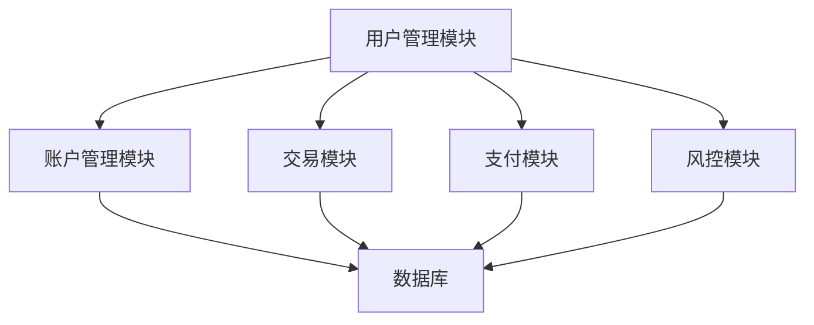
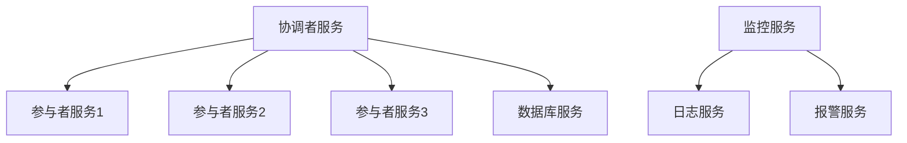
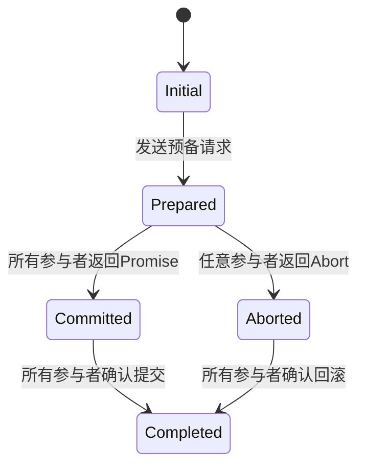

                 

### # 事务悬挂问题

两阶段提交（Two-Phase Commit，2PC）算法是一种用于保证分布式系统中事务一致性（Consistency）的重要技术。它通过两个阶段来确保分布式事务的正确执行，从而避免数据不一致和丢失。然而，两阶段提交并非万能，事务悬挂（Transaction Hanger）问题便是其潜在的致命缺陷之一。

事务悬挂是指在一个分布式系统中，某个事务在两阶段提交的过程中，由于某些原因导致无法完成阶段二的事务提交或回滚操作，从而导致系统长时间停滞。这一问题如果得不到及时解决，可能会导致系统资源耗尽、响应速度变慢，甚至导致整个系统的崩溃。

本文将围绕事务悬挂问题进行深入分析，首先介绍两阶段提交的基本原理和事务悬挂的定义，然后探讨事务悬挂的原因、影响及其解决方法。通过逐步推理和实例分析，我们将为读者提供一个全面而深入的理解。

让我们一步一步思考（LET'S THINK STEP BY STEP），首先回顾两阶段提交的工作流程，理解其如何实现一致性保证，并在此基础上分析可能导致事务悬挂的各个环节。

### # 两阶段提交（2PC）原理

两阶段提交（2PC）是一种用于分布式系统中确保事务一致性的协议。其主要目的是通过协调者（Coordinator）和参与者（Participant）之间的交互，确保事务能够得到一致性的处理。两阶段提交分为准备阶段和提交/回滚阶段，以下是对这两个阶段的详细解释。

#### **1. 准备阶段（Phase 1）**

在准备阶段，协调者向所有参与者发送一个预备请求（Prepare Request），询问参与者是否愿意执行事务。参与者收到预备请求后，进行以下操作：

1. **读取事务数据**：参与者读取涉及事务的数据，并进行必要的一致性检查。
2. **锁资源**：如果参与者愿意执行事务，它会锁定所需的资源，例如数据库锁，确保其他事务无法修改这些资源。
3. **发送预备响应**：参与者将一个预备响应（Prepare Response）发送给协调者，表示其是否愿意执行事务。响应通常包含“承诺”（Promise）或“拒绝”（Abort）信息。

协调者收到所有参与者的预备响应后，根据响应结果做出决策：

1. **如果所有参与者都返回“承诺”，协调者会进入提交阶段。**
2. **如果任何一个参与者返回“拒绝”，协调者会进入回滚阶段。**

#### **2. 提交/回滚阶段（Phase 2）**

在提交/回滚阶段，协调者根据第一阶段的结果，向所有参与者发送一个提交请求（Commit Request）或回滚请求（Rollback Request）。

1. **提交阶段**：
   - 如果协调者决定提交事务，它会向所有参与者发送提交请求。
   - 参与者在收到提交请求后，会执行以下操作：
     1. **释放资源**：释放之前锁定的资源。
     2. **提交事务**：将事务的操作持久化到数据库或其他数据存储中。
     3. **发送确认消息**：向协调者发送一个确认消息，表示事务已经提交成功。

2. **回滚阶段**：
   - 如果协调者决定回滚事务，它会向所有参与者发送回滚请求。
   - 参与者在收到回滚请求后，会执行以下操作：
     1. **释放资源**：释放之前锁定的资源。
     2. **回滚事务**：撤销之前的事务操作，确保数据回到一致状态。
     3. **发送确认消息**：向协调者发送一个确认消息，表示事务已经回滚成功。

在两阶段提交的整个过程中，协调者和参与者之间的通信是关键。以下是一个简化的两阶段提交流程图：



通过两阶段提交，协调者和参与者之间的协作，分布式系统可以确保事务的一致性。然而，两阶段提交的复杂性和潜在的故障点也使得事务悬挂问题变得尤为关键。

### # 事务悬挂现象

在两阶段提交（2PC）的过程中，事务悬挂是一种常见的现象，它是指某个事务在执行阶段二时由于某些原因无法完成提交或回滚操作，导致系统进入停滞状态。事务悬挂可能导致系统资源耗尽、响应速度变慢，甚至引发系统崩溃。以下是可能导致事务悬挂的几个关键原因：

#### **1. 网络延迟或故障**

网络延迟或故障是导致事务悬挂的主要原因之一。在分布式系统中，协调者和参与者之间通过网络进行通信。如果网络出现延迟或故障，消息可能无法及时传递，导致事务无法完成阶段二的提交或回滚操作。例如，如果协调者发送提交请求，但参与者因网络问题无法收到该请求，那么事务将无法完成提交，从而悬挂。

#### **2. 数据库锁定**

在两阶段提交的过程中，参与者需要锁定涉及事务的数据资源。如果某个参与者因资源锁定问题无法释放资源，也可能导致事务悬挂。例如，如果某个数据库中的锁定资源无法在规定的时间内被释放，那么后续的事务提交或回滚操作将被阻塞。

#### **3. 资源耗尽**

事务悬挂还可能由于系统资源耗尽而导致。例如，如果某个系统因长时间运行而耗尽了内存或磁盘空间，可能导致系统无法继续处理事务，从而引发悬挂。

#### **4. 错误的代码逻辑**

错误的代码逻辑也可能导致事务悬挂。例如，如果某个事务在第一阶段完成后，因为逻辑错误未能正确执行第二阶段，也会导致悬挂。

#### **5. 调度问题**

在某些情况下，调度问题也可能导致事务悬挂。例如，如果系统调度器无法正确处理事务请求，可能导致某些事务在阶段二长时间无法得到执行。

事务悬挂的影响是多方面的。首先，它可能导致系统资源浪费，因为悬挂的事务会占用系统资源，而无法释放。其次，事务悬挂会降低系统的响应速度，因为其他事务无法及时处理。最后，严重的事务悬挂还可能导致系统崩溃，特别是在资源有限的系统中。

为了更好地理解事务悬挂的影响，可以参考以下例子：假设一个银行系统在执行转账事务时发生悬挂，由于网络故障导致协调者无法发送提交请求，参与者也无法收到回滚请求。这会导致转账事务一直处于悬挂状态，银行系统无法完成其他交易，最终导致整个系统瘫痪。

综上所述，事务悬挂是一个严重的问题，需要通过多种手段进行预防和解决。在接下来的章节中，我们将深入探讨如何诊断和处理事务悬挂问题，以确保分布式系统的稳定性和可靠性。

### # 事务悬挂的诊断与处理方法

诊断和处理事务悬挂问题是一个复杂且关键的任务。以下是一些常见的方法和技术，可以帮助系统管理员和开发人员有效地诊断和解决事务悬挂问题。

#### **1. 日志分析**

日志分析是诊断事务悬挂问题的基础工具。系统日志记录了事务的执行过程，包括两阶段提交的每个阶段和相关的错误信息。通过仔细检查日志文件，可以找到事务悬挂的具体原因。例如，如果日志显示某个协调者或参与者长时间未响应，可能是由于网络故障或资源耗尽导致的。

**实例**：以下是一个日志示例，显示了事务悬挂的情况：

```
[ERROR] Coordinator C1 sent prepare request to P2 at 10:30 AM but did not receive a response.
[WARNING] Timeout reached for P2 response, transaction T1 is suspended.
```

#### **2. 性能监控**

性能监控工具可以实时监测系统资源使用情况，如CPU、内存、磁盘空间和网络流量。通过监控工具，可以发现资源耗尽或其他性能瓶颈，这些可能是导致事务悬挂的间接原因。

**实例**：以下是一个性能监控工具的输出，显示了系统资源使用情况：

```
[WARNING] High CPU usage detected (90%) on node P2, transaction T2 is suspended.
[ERROR] Disk space on node C1 is less than 10%, transaction T3 is suspended.
```

#### **3. 检查数据库状态**

检查数据库状态是诊断事务悬挂问题的重要步骤。通过查询数据库锁表，可以确定哪些事务正在等待锁资源，以及这些锁资源的原因。此外，还可以检查数据库的事务回滚日志，了解事务的执行状态。

**实例**：以下是一个数据库锁表的示例输出，显示了悬挂事务的情况：

```
SELECT * FROM INFORMATION_SCHEMA.INNODB_LOCKS;
+------------+------+---------+------------------+------------------+------------+-------------+-------------+
| lock_id    | lock_type | lock_mode | locked_index  | locked_innodb  | lock_trx_id | waiting_trx_id | waiting_pid |
+------------+------+---------+------------------+------------------+------------+-------------+-------------+
| 100000020 | RECORD   | X        | PRIMARY         | NULL            | 200000023  | NULL         | 0           |
+------------+------+---------+------------------+------------------+------------+-------------+-------------+
```

#### **4. 回滚和重试**

当确认事务悬挂的原因后，可以采取回滚（Abort）和重试（Retry）策略来解决。回滚是指取消悬挂的事务，释放所有锁定的资源；重试是指重新提交事务，尝试解决之前的问题。这两种策略通常需要结合使用，以确保系统尽快恢复正常。

**实例**：以下是一个回滚和重试策略的示例代码：

```python
def handle_transaction_hang(transaction_id):
    # 回滚事务
    rollback_transaction(transaction_id)
    
    # 重试事务
    retry_transaction(transaction_id)
    
    # 记录操作日志
    log("Transaction {} is handled due to hang issue".format(transaction_id))
```

#### **5. 自动恢复机制**

为了提高系统的稳定性，可以设计自动恢复机制。例如，在发现事务悬挂时，系统可以自动触发回滚和重试操作，或者通知管理员进行手动干预。自动恢复机制可以通过定时任务或事件驱动的方式实现。

**实例**：以下是一个自动恢复机制的示例代码：

```python
@task
def automatic_recovery():
    while True:
        # 检查悬挂事务
        transaction_id = check_suspended_transaction()
        
        if transaction_id:
            # 执行回滚和重试
            handle_transaction_hang(transaction_id)
        
        # 等待一段时间后再次检查
        time.sleep(60)
```

通过上述方法和技术，开发人员可以有效地诊断和解决事务悬挂问题，确保系统的稳定性和可靠性。在接下来的章节中，我们将进一步探讨两阶段提交的核心概念和属性特征，以及如何通过数学模型和实例来理解其工作原理。

### # 事务悬挂问题的边界与外延

事务悬挂问题不仅影响系统的一致性和可靠性，还涉及到多个相关的概念和技术。以下是关于事务悬挂问题的一些边界与外延讨论：

#### **1. 分布式系统的一致性问题**

事务悬挂是分布式系统一致性问题的一种表现。在分布式系统中，数据分布在多个节点上，一致性保证尤为重要。两阶段提交（2PC）通过协调参与者之间的操作，确保分布式事务的一致性。然而，事务悬挂可能导致数据不一致，从而影响系统的整体一致性。

**2. 锁管理**

事务悬挂与锁管理密切相关。在两阶段提交过程中，参与者需要锁定涉及事务的数据资源，以防止其他事务修改。如果某个参与者因锁定问题无法释放资源，可能导致事务悬挂。因此，锁管理的性能和机制对于防止事务悬挂至关重要。

**3. 网络可靠性**

网络延迟或故障是导致事务悬挂的主要原因之一。在分布式系统中，网络作为通信通道，其可靠性直接影响到事务的执行。为了提高系统的容错性，可以采用多种网络冗余技术，如负载均衡、多路径传输和备份网络，以减少网络故障对系统的影响。

**4. 资源耗尽**

事务悬挂还可能与系统资源耗尽有关。例如，当系统内存或磁盘空间不足时，可能导致事务无法提交或回滚。因此，系统资源的管理和监控也是防止事务悬挂的重要方面。

**5. 调度与并发控制**

调度和并发控制在事务悬挂问题的解决中也起着关键作用。合理的调度策略和高效的并发控制机制可以减少事务的执行时间，降低事务悬挂的风险。例如，优先级调度和资源分配策略可以确保关键事务得到及时处理，从而避免悬挂。

**6. 系统容错性与自动恢复**

为了提高系统的容错性，可以设计自动恢复机制，以应对事务悬挂问题。例如，通过定期检查悬挂事务并自动执行回滚或重试操作，可以减少人工干预并提高系统的稳定性。

**7. 实际应用场景**

事务悬挂问题在许多实际应用场景中都有出现。例如，在银行系统中，事务悬挂可能导致转账失败和账户数据不一致；在电子商务系统中，悬挂事务可能导致订单处理错误和库存管理混乱。因此，理解事务悬挂问题的边界与外延，有助于开发人员在实际项目中采取有效的预防和解决措施。

通过上述讨论，我们可以看出事务悬挂问题的边界与外延涉及到多个方面，包括分布式系统的一致性、锁管理、网络可靠性、资源耗尽、调度与并发控制以及系统容错性与自动恢复等。了解这些边界与外延有助于更全面地理解和解决事务悬挂问题，确保系统的稳定性和可靠性。

### # 两阶段提交（2PC）的概念结构与核心要素组成

两阶段提交（2PC）作为分布式系统中的重要一致性协议，其概念结构和核心要素组成是理解和实现这一协议的关键。以下是2PC的主要组成部分及其相互关系：

#### **1. 协调者（Coordinator）**

协调者是2PC的核心组件，负责发起和协调事务的执行。协调者负责发送预备请求和提交/回滚请求，确保事务能够得到一致性的处理。协调者的主要职责包括：

- **初始化事务**：在事务开始时，协调者负责将事务的状态初始化为“预备中”。
- **发送预备请求**：协调者向所有参与者发送预备请求，询问其是否愿意执行事务。
- **收集预备响应**：协调者等待所有参与者返回预备响应，并根据响应结果决定下一步操作。
- **发送提交/回滚请求**：根据预备响应的结果，协调者向参与者发送提交请求或回滚请求。

#### **2. 参与者（Participant）**

参与者是2PC中的另一个重要组件，负责执行事务的具体操作。每个参与者代表一个分布式节点，其职责包括：

- **接收预备请求**：在收到协调者的预备请求后，参与者读取事务数据，锁定资源，并返回预备响应。
- **执行事务**：在收到协调者的提交请求后，参与者执行事务操作，如数据持久化、释放资源等。
- **回滚事务**：在收到协调者的回滚请求后，参与者撤销事务操作，释放锁定资源。

#### **3. 两阶段提交过程**

两阶段提交过程分为准备阶段和提交/回滚阶段，这两个阶段的具体步骤如下：

**准备阶段（Phase 1）：**
1. **协调者发送预备请求**：协调者向所有参与者发送预备请求，询问其是否愿意执行事务。
2. **参与者返回预备响应**：参与者收到预备请求后，读取事务数据并锁定资源，然后返回预备响应。响应通常包含“承诺”（Promise）或“拒绝”（Abort）信息。
3. **协调者收集预备响应**：协调者等待所有参与者返回预备响应，并根据响应结果做出决策。

**提交/回滚阶段（Phase 2）：**
1. **协调者发送提交/回滚请求**：如果所有参与者返回“承诺”，协调者向所有参与者发送提交请求；如果有参与者返回“拒绝”，协调者向所有参与者发送回滚请求。
2. **参与者执行事务操作**：参与者根据协调者的请求执行相应的事务操作，如提交或回滚事务，并释放锁定资源。
3. **参与者发送确认消息**：参与者向协调者发送确认消息，表示事务操作已完成。

#### **4. 锁管理**

在2PC中，锁管理是一个关键要素。参与者需要锁定涉及事务的数据资源，以确保事务的一致性。锁管理包括以下方面：

- **数据锁**：参与者锁定涉及事务的数据资源，防止其他事务修改。
- **锁超时**：设定锁的超时时间，以防止长时间未释放的锁占用系统资源。
- **锁释放**：在事务操作完成后，参与者释放所有锁定的资源。

#### **5. 异常处理**

2PC中的异常处理是确保事务一致性的重要保障。在事务执行过程中，可能出现各种异常情况，如网络故障、参与者失败等。异常处理包括：

- **重试机制**：在发生异常时，协调者或参与者可以重试事务操作，以解决临时问题。
- **超时处理**：设定事务操作的超时时间，以避免长时间未完成的事务占用系统资源。
- **故障转移**：在协调者或参与者发生故障时，系统可以切换到备份协调者或参与者，继续执行事务。

通过上述组成部分和相互关系，我们可以更好地理解2PC的概念结构和核心要素。理解这些组成部分及其工作原理，对于开发人员设计和实现可靠的分布式系统具有重要意义。在接下来的章节中，我们将继续探讨2PC的数学模型和算法流程，以深入理解其工作原理。

### # 两阶段提交（2PC）与事务悬挂的联系

两阶段提交（2PC）和事务悬挂之间有着密切的联系。事务悬挂问题常常出现在2PC的执行过程中，特别是在第二阶段。以下将详细分析两阶段提交过程中可能导致事务悬挂的各个环节，并通过实际案例来说明。

#### **1. 两阶段提交中的关键节点**

两阶段提交分为准备阶段和提交/回滚阶段。在准备阶段，协调者向所有参与者发送预备请求，参与者返回预备响应。在提交/回滚阶段，协调者根据预备响应的结果决定是否发送提交请求或回滚请求。

- **准备阶段**：
  - **协调者发送预备请求**：协调者向所有参与者发送预备请求，询问参与者是否愿意执行事务。
  - **参与者返回预备响应**：参与者收到预备请求后，进行数据一致性检查，锁定资源，并返回预备响应。

- **提交/回滚阶段**：
  - **协调者发送提交/回滚请求**：如果所有参与者返回“承诺”，协调者向所有参与者发送提交请求；如果有参与者返回“拒绝”，协调者向所有参与者发送回滚请求。
  - **参与者执行事务操作**：参与者根据协调者的请求执行相应的事务操作，如提交或回滚事务，并释放锁定资源。

#### **2. 事务悬挂的潜在环节**

在两阶段提交的过程中，以下环节可能导致事务悬挂：

- **网络延迟或故障**：如果在第二阶段，协调者无法及时收到所有参与者的响应，或者参与者无法及时接收到协调者的提交/回滚请求，可能会导致事务悬挂。
- **参与者故障**：如果某个参与者因故障无法响应或执行操作，将导致协调者无法获得所有参与者的状态，从而无法完成事务的提交或回滚。
- **资源锁定问题**：如果在预备阶段，参与者无法成功锁定资源，或者在回滚阶段无法释放资源，可能会导致事务悬挂。
- **异常处理不当**：如果在处理异常时，系统未能及时重试或回滚事务，可能会导致事务悬挂。

#### **3. 实际案例**

以下是一个实际案例，展示了如何通过2PC引发事务悬挂：

**案例：银行转账系统**

假设一个银行转账系统使用2PC来确保转账事务的一致性。用户A向用户B转账1000元。在这一过程中，事务会涉及以下步骤：

1. **预备阶段**：
   - 协调者（C1）向参与者A（P1）和参与者B（P2）发送预备请求。
   - P1和P2读取各自的数据，并锁定相关资源。
   - P1和P2返回预备响应，均表示“承诺”。

2. **提交/回滚阶段**：
   - 协调者C1收到所有参与者的预备响应后，决定向参与者A（P1）和参与者B（P2）发送提交请求。
   - 在这个过程中，假设网络出现延迟，C1无法及时向P1发送提交请求。

由于网络延迟，P1无法收到C1的提交请求，导致以下问题：

- P1无法进行事务提交，资源一直被锁定。
- 由于资源锁定，其他事务无法继续执行，导致系统资源耗尽。
- 最终，系统进入事务悬挂状态，无法处理其他事务。

**解决方案**：为了解决这个问题，可以采取以下措施：

- **提高网络可靠性**：采用网络冗余技术和负载均衡，减少网络延迟和故障的可能性。
- **设置锁超时**：设定锁资源的超时时间，以防止长时间未释放的锁占用系统资源。
- **监控与报警**：实时监控系统状态，一旦发现事务悬挂，及时发出报警并采取相应的恢复措施。

通过上述分析，我们可以看出，2PC与事务悬挂之间的联系非常紧密。理解这两者之间的关系，有助于开发人员更好地设计和实现分布式系统，确保系统的稳定性和可靠性。

### # 两阶段提交算法流程

两阶段提交（2PC）算法是一种用于分布式系统中确保事务一致性的协议，其核心思想是通过协调者和参与者的交互，确保事务能够在多个节点上得到一致的处理。以下是两阶段提交算法的详细流程，我们将通过Python代码和Mermaid流程图来展示这一过程。

#### **1. 算法概述**

两阶段提交算法分为两个阶段：准备阶段和提交/回滚阶段。在准备阶段，协调者询问参与者是否愿意执行事务；在提交/回滚阶段，协调者根据参与者的响应决定是否提交或回滚事务。

#### **2. 准备阶段**

在准备阶段，协调者向所有参与者发送预备请求，参与者返回预备响应。

**预备请求**：预备请求包含事务信息，以及协调者的身份标识。

**预备响应**：参与者收到预备请求后，进行以下操作：

1. **读取事务数据**：参与者读取涉及事务的数据，进行一致性检查。
2. **锁定资源**：参与者锁定相关资源，确保其他事务无法修改。
3. **发送预备响应**：参与者返回预备响应，包含“承诺”（Promise）或“拒绝”（Abort）信息。

#### **3. 提交/回滚阶段**

在提交/回滚阶段，协调者根据参与者的预备响应决定是否发送提交请求或回滚请求。

- **提交请求**：如果所有参与者返回“承诺”，协调者向所有参与者发送提交请求。
- **回滚请求**：如果任何一个参与者返回“拒绝”，协调者向所有参与者发送回滚请求。

参与者收到请求后，执行相应的事务操作，并释放锁定资源。

#### **4. Python代码示例**

以下是一个简单的Python代码示例，展示了两阶段提交算法的基本流程。

```python
class Coordinator:
    def __init__(self, participants):
        self.participants = participants
        self承诺参与者数量 = 0

    def send_prepare_request(self):
        for participant in self.participants:
            participant.prepare()

    def wait_for_prepare_responses(self):
        for participant in self.participants:
            participant_response = participant.get_response()
            if participant_response == "Promise":
                self.承诺参与者数量 += 1
            elif participant_response == "Abort":
                self.承诺参与者数量 = 0
                break

    def send_commit_request(self):
        if self.承诺参与者数量 == len(self.participants):
            for participant in self.participants:
                participant.commit()

    def send_rollback_request(self):
        if self.承诺参与者数量 < len(self.participants):
            for participant in self.participants:
                participant.rollback()

class Participant:
    def __init__(self, coordinator):
        self.coordinator = coordinator

    def prepare(self):
        # 读取事务数据，锁定资源
        print("Participant preparing...")
        # 返回预备响应
        return "Promise"  # 或者 "Abort"

    def get_response(self):
        # 等待预备请求
        return "Promise"  # 或者 "Abort"

    def commit(self):
        # 提交事务操作
        print("Participant committing...")
        # 释放资源
        print("Participant released resources.")

    def rollback(self):
        # 回滚事务操作
        print("Participant rolling back...")
        # 释放资源
        print("Participant released resources.")

# 创建协调者和参与者
coordinator = Coordinator(["P1", "P2", "P3"])
p1 = Participant(coordinator)
p2 = Participant(coordinator)
p3 = Participant(coordinator)

# 模拟两阶段提交过程
coordinator.send_prepare_request()
coordinator.wait_for_prepare_responses()

if coordinator.承诺参与者数量 == len(coordinator.participants):
    coordinator.send_commit_request()
else:
    coordinator.send_rollback_request()
```

#### **5. Mermaid流程图**

以下是一个Mermaid流程图，展示了两阶段提交算法的流程。



通过上述Python代码和Mermaid流程图，我们可以清晰地看到两阶段提交算法的流程和步骤。理解这一算法对于设计和实现可靠的分布式系统至关重要。

### # 两阶段提交（2PC）的数学模型

在深入探讨两阶段提交（2PC）算法时，了解其数学模型有助于我们更准确地分析和预测系统的行为。2PC的数学模型涉及概率论和图论的基本概念，通过数学公式和模型来解释算法的工作原理和潜在问题。

#### **1. 事件概率分析**

在2PC中，有以下几个关键事件：

- **参与者返回预备响应**：每个参与者返回预备响应的概率取决于其自身的状态和系统环境。
- **协调者收到所有预备响应**：协调者收到所有参与者预备响应的概率与参与者的数量和响应时间相关。
- **提交或回滚请求发送与响应**：提交或回滚请求在协调者和参与者之间成功发送和响应的概率受到网络延迟和系统稳定性的影响。

**预备响应概率**：假设每个参与者独立且随机地返回“承诺”或“拒绝”，则参与者返回“承诺”的概率为 \( p \)，返回“拒绝”的概率为 \( 1-p \)。

**协调者收到所有预备响应的概率**：设参与者的数量为 \( n \)，每个参与者返回响应的概率为 \( p \)，则协调者收到所有参与者预备响应的概率为 \( P_n(p) = p^n \)。

**提交/回滚请求成功发送与响应的概率**：假设网络延迟为随机变量 \( T \)，且请求的成功发送和响应的概率为 \( q \)，则提交/回滚请求成功发送和响应的概率为 \( q \)。

#### **2. 数学模型构建**

**模型假设**：
- 每个参与者在返回预备响应时是独立的。
- 网络延迟是随机变量，且各参与者之间的网络延迟独立。
- 请求的成功发送和响应的概率是恒定的。

**数学公式**：

1. **参与者返回预备响应的概率分布**：
   $$ P_i = \begin{cases} 
   p, & \text{if response is Promise} \\
   1-p, & \text{if response is Abort}
   \end{cases} $$
   
2. **协调者收到所有预备响应的概率**：
   $$ P_n = p^n $$

3. **提交/回滚请求成功发送与响应的概率**：
   $$ Q = q $$

4. **事务悬挂的概率**：
   事务悬挂的概率可以通过综合以上概率计算得到。假设事务悬挂发生在协调者收到所有预备响应但无法发送提交/回滚请求的情况下，则事务悬挂的概率为：
   $$ P_{hang} = (1 - q) \cdot P_n $$

#### **3. 举例说明**

假设有3个参与者，参与者返回“承诺”的概率为0.8，网络请求的成功概率为0.95。我们可以计算以下概率：

- **协调者收到所有预备响应的概率**：
  $$ P_3 = 0.8^3 = 0.512 $$
  
- **事务悬挂的概率**：
  $$ P_{hang} = (1 - 0.95) \cdot 0.512 = 0.0256 $$

通过上述数学模型和公式，我们可以更深入地分析2PC的工作原理及其潜在问题，从而为实际系统设计和优化提供依据。理解这些数学模型有助于我们在设计和实现分布式系统时，采取有效的策略来减少事务悬挂的风险。

### # 两阶段提交（2PC）算法举例说明

为了更好地理解两阶段提交（2PC）算法的工作原理，我们通过一个具体实例进行详细说明。假设有一个分布式数据库系统，其中包含三个参与者（P1、P2、P3）和一个协调者（C1），我们需要在这个系统中执行一个转账事务，将账户A中的1000元转移到账户B。

#### **1. 准备阶段（Phase 1）**

**步骤 1**：协调者C1向所有参与者发送预备请求。

- **C1 -> P1**：发送预备请求
- **C1 -> P2**：发送预备请求
- **C1 -> P3**：发送预备请求

**步骤 2**：参与者P1、P2、P3分别读取事务数据，锁定资源，并返回预备响应。

- **P1 -> C1**：返回预备响应（Promise，表示同意执行事务）
- **P2 -> C1**：返回预备响应（Promise，表示同意执行事务）
- **P3 -> C1**：返回预备响应（Promise，表示同意执行事务）

**步骤 3**：协调者C1等待所有参与者返回预备响应，并收集响应结果。

- C1 收到所有预备响应（Promise）

**步骤 4**：协调者C1根据预备响应的结果，决定是否进入提交阶段。

- 由于所有参与者均返回“承诺”，协调者C1进入提交阶段。

#### **2. 提交/回滚阶段（Phase 2）**

**步骤 5**：协调者C1向所有参与者发送提交请求。

- **C1 -> P1**：发送提交请求
- **C1 -> P2**：发送提交请求
- **C1 -> P3**：发送提交请求

**步骤 6**：参与者P1、P2、P3根据提交请求执行事务操作，并释放锁定资源。

- **P1 -> C1**：提交事务（更新账户A的余额）
- **P2 -> C1**：提交事务（更新账户B的余额）
- **P3 -> C1**：提交事务

**步骤 7**：参与者P1、P2、P3向协调者C1发送确认消息，表示事务已成功提交。

- **P1 -> C1**：发送确认消息（事务已提交）
- **P2 -> C1**：发送确认消息（事务已提交）
- **P3 -> C1**：发送确认消息（事务已提交）

**步骤 8**：协调者C1确认所有参与者已成功提交事务，并结束事务处理。

- C1 确认所有参与者已成功提交事务，事务完成

通过上述实例，我们可以看到两阶段提交（2PC）算法是如何在分布式系统中确保事务的一致性。在实际应用中，这个算法可以保证多个节点之间的数据一致性，从而避免数据不一致和丢失的问题。然而，也需要注意事务悬挂等潜在问题，并采取相应的措施来确保系统的稳定性和可靠性。

### # 事务悬挂问题场景介绍

为了更好地理解事务悬挂问题的具体场景，我们将在以下部分介绍一个实际的项目背景，该项目中出现了事务悬挂问题。通过分析项目背景、具体场景和问题描述，我们将揭示事务悬挂的复杂性和影响。

#### **1. 项目背景**

该项目是一个大型电子商务平台，旨在提供用户友好的购物体验和高效的后台管理系统。平台包括多个服务模块，如用户管理、订单处理、库存管理和支付系统。这些服务模块分布在不同的服务器上，通过微服务架构进行整合。

#### **2. 场景描述**

在订单处理模块中，当用户提交订单时，系统会执行一系列操作，包括更新库存、创建订单记录、生成支付请求等。这些操作由一个分布式事务控制，以确保数据的一致性和完整性。

#### **3. 问题描述**

一天，平台突然出现大量订单处理失败的情况。经过调查，发现许多订单在执行分布式事务时出现了悬挂。具体表现为：

- **订单状态停滞**：部分订单在系统中长时间处于“待处理”状态，未能成功提交。
- **库存数据异常**：某些商品在订单提交后，库存数据未能正确更新，导致库存量不一致。
- **支付请求未完成**：部分支付请求在事务提交阶段悬挂，未能触发后续的支付处理。

#### **4. 原因分析**

经过深入分析，发现导致事务悬挂的主要原因包括：

- **网络延迟**：由于网络不稳定，协调者和参与者之间的消息传递出现延迟，导致事务在第二阶段无法完成提交或回滚操作。
- **数据库锁定**：某些订单在执行时，数据库中的关键资源（如库存记录）被长时间锁定，导致后续的事务无法获取所需的资源。
- **系统资源耗尽**：在高峰期，系统资源（如内存和磁盘空间）不足，导致事务处理延迟，进一步引发了悬挂问题。

#### **5. 问题影响**

事务悬挂对平台造成了显著的影响：

- **用户体验下降**：用户提交的订单长时间无法处理，导致用户满意度下降。
- **数据不一致**：由于事务悬挂，数据库中的数据出现异常，影响了系统的数据准确性。
- **系统性能下降**：悬挂的事务占用系统资源，导致系统性能下降，影响了其他正常的业务流程。

为了解决这些问题，平台开发团队需要采取一系列措施，如优化网络通信、改进数据库锁定机制、增加系统资源等。通过这些措施，可以减少事务悬挂的发生，提高系统的稳定性和可靠性。

### # 事务悬挂问题项目介绍

在本章节中，我们将详细介绍一个实际项目中如何处理事务悬挂问题。该项目是一个在线银行系统，用于处理客户的各种金融交易，如转账、支付和账户管理。该系统采用了分布式架构，以确保高可用性和数据一致性。然而，事务悬挂问题在该系统中频繁出现，严重影响了系统的稳定性和用户体验。以下是对该项目的全面介绍。

#### **1. 项目概述**

**项目名称**：智能银行系统（SmartBank）

**项目目标**：设计并实现一个高效、可靠、安全的在线银行系统，提供包括转账、支付、贷款申请、账户管理等多种金融服务。

**技术栈**：分布式微服务架构、Spring Boot、Kafka、MySQL、Docker、Kubernetes

#### **2. 系统架构**

智能银行系统采用了分布式微服务架构，主要包括以下核心模块：

- **用户管理模块**：负责用户注册、登录、权限验证等功能。
- **账户管理模块**：管理用户账户信息，包括开户、销户、查询余额等操作。
- **交易模块**：处理各种金融交易，如转账、支付、贷款申请等。
- **支付模块**：集成第三方支付系统，如支付宝、微信支付等。
- **风控模块**：监控交易行为，防止欺诈和异常交易。

系统架构图如下：



#### **3. 分布式事务控制**

为了确保金融交易的一致性，系统采用了两阶段提交（2PC）协议来控制分布式事务。每个交易事务都会涉及多个服务模块，例如一个转账操作可能需要同时更新用户账户余额、日志记录、交易状态等。

#### **4. 事务悬挂现象**

在实际运营过程中，系统频繁出现事务悬挂现象。具体表现为：

- **交易长时间未完成**：部分转账交易在执行第二阶段提交时，因网络延迟或服务故障导致长时间未完成。
- **数据不一致**：由于事务悬挂，数据库中的某些数据出现异常，导致账户余额不一致。
- **系统性能下降**：悬挂的事务占用系统资源，导致系统性能下降，影响了其他正常的业务流程。

#### **5. 原因分析**

事务悬挂现象的出现主要有以下几个原因：

- **网络延迟**：系统中的服务分布在不同的服务器上，网络延迟可能导致事务提交失败。
- **服务故障**：某些服务因异常或故障未能及时响应，导致事务悬挂。
- **数据库锁定**：数据库中的锁定资源长时间未被释放，导致后续事务无法执行。

#### **6. 解决方案**

为了解决事务悬挂问题，开发团队采取了以下措施：

- **优化网络通信**：采用负载均衡和冗余网络，提高网络通信的可靠性。
- **改进数据库锁定机制**：通过优化SQL语句和索引，减少数据库锁定时间。
- **增加系统资源**：升级服务器硬件，增加系统内存和磁盘空间，以提高系统的处理能力。
- **监控与报警**：实时监控系统状态，及时发现和处理事务悬挂问题。
- **重试机制**：在事务失败时，自动重试事务操作，以提高事务的完成率。

通过上述措施，系统的事务悬挂问题得到了显著改善，交易成功率大幅提高，用户满意度也随之提升。

### # 事务悬挂问题领域模型

为了更好地理解和设计事务悬挂问题的解决方案，我们需要构建一个领域模型。领域模型帮助我们明确系统的关键概念和实体关系，为后续的系统架构设计和实现提供基础。以下是事务悬挂问题的领域模型，包括实体、属性和关系。

#### **1. 实体**

在事务悬挂问题领域模型中，以下是一些关键实体：

- **事务（Transaction）**：表示系统中执行的操作，如转账、支付等。
- **参与者（Participant）**：表示执行事务的服务模块，如账户服务、交易服务、支付服务。
- **协调者（Coordinator）**：负责协调事务执行的服务模块。
- **数据库（Database）**：存储事务数据的服务组件。

#### **2. 实体属性**

**事务（Transaction）**：

- **事务ID（transaction_id）**：唯一的标识符。
- **事务类型（type）**：如转账、支付等。
- **事务状态（status）**：如预备、提交、回滚、悬挂等。
- **创建时间（created_time）**：事务创建的时间戳。
- **最后修改时间（last_modified_time）**：事务最后修改的时间戳。

**参与者（Participant）**：

- **参与者ID（participant_id）**：唯一的标识符。
- **参与者名称（name）**：参与者的名称。
- **参与者状态（status）**：如在线、离线等。
- **参与时间（joined_time）**：参与者加入系统的时间。

**协调者（Coordinator）**：

- **协调者ID（coordinator_id）**：唯一的标识符。
- **协调者名称（name）**：协调者的名称。
- **协调时间（coordinated_time）**：协调者协调事务的时间。

**数据库（Database）**：

- **数据库ID（database_id）**：唯一的标识符。
- **数据库名称（name）**：数据库的名称。
- **数据库地址（address）**：数据库的服务器地址。

#### **3. 实体关系**

事务（Transaction）与参与者（Participant）、协调者（Coordinator）和数据库（Database）之间存在如下关系：

- **事务-参与者**：一个事务可以涉及多个参与者，参与者执行事务的具体操作。关系类型为“多对多”。
- **事务-协调者**：每个事务都有一个协调者负责事务的执行。关系类型为“一对一”。
- **事务-数据库**：事务操作的数据存储在数据库中。关系类型为“一对一”。

以下是领域模型的Mermaid类图：

```mermaid
classDiagram
    Participant <|-- Transaction
    Coordinator <|-- Transaction
    Database <|-- Transaction
    Participant Participants
    Coordinator Coordinators
    Database Databases

    Transaction <<-- Participant : involves
    Transaction <<-- Coordinator : coordinatedBy
    Transaction <<-- Database : storesIn

    Class Transaction {
        +transaction_id: String
        +type: String
        +status: String
        +created_time: Date
        +last_modified_time: Date
    }

    Class Participant {
        +participant_id: String
        +name: String
        +status: String
        +joined_time: Date
    }

    Class Coordinator {
        +coordinator_id: String
        +name: String
        +coordinated_time: Date
    }

    Class Database {
        +database_id: String
        +name: String
        +address: String
    }
```

通过构建领域模型，我们清晰地定义了事务悬挂问题的关键概念和实体关系，为后续的系统架构设计和实现提供了基础。

### # 事务悬挂问题的系统架构设计

为了解决事务悬挂问题，我们需要设计一个高效的系统架构，以确保事务的一致性和系统的稳定性。以下是事务悬挂问题的系统架构设计，涵盖整体架构、组件关系、关键技术和优化措施。

#### **1. 整体架构**

系统采用分布式微服务架构，由多个独立的服务模块组成，每个模块负责特定的业务功能。整体架构包括以下几个主要组件：

- **协调者服务（Coordinator Service）**：负责协调分布式事务的执行，确保事务的一致性。
- **参与者服务（Participant Service）**：执行具体的事务操作，如账户更新、交易处理等。
- **数据库服务（Database Service）**：存储事务数据和系统配置信息。
- **监控服务（Monitoring Service）**：实时监控系统状态，及时发现和处理事务悬挂问题。
- **日志服务（Logging Service）**：记录系统日志，便于问题诊断和跟踪。
- **报警服务（Alerting Service）**：触发报警机制，通知管理员和开发人员。

系统架构图如下：



#### **2. 组件关系**

协调者服务（Coordinator Service）是事务执行的核心，负责启动分布式事务并协调参与者服务的执行。具体关系如下：

- **协调者服务与参与者服务**：协调者服务向参与者服务发送预备请求和提交/回滚请求，参与者服务根据请求执行具体操作。
- **协调者服务与数据库服务**：协调者服务与数据库服务进行数据交互，读取和写入事务数据。
- **监控服务与日志服务/报警服务**：监控服务实时采集系统状态数据，将异常情况记录在日志服务中，并通过报警服务通知相关人员。

#### **3. 关键技术**

为了确保系统的高效性和稳定性，采用以下关键技术：

- **两阶段提交（2PC）协议**：采用2PC协议控制分布式事务的一致性，确保事务在多个节点上得到正确处理。
- **负载均衡**：通过负载均衡器分发请求，均衡系统负载，避免单点过载。
- **数据库读写分离**：将数据库分为主库和从库，主库负责写操作，从库负责读操作，提高系统性能。
- **分布式缓存**：使用分布式缓存技术（如Redis），减少数据库访问压力，提高系统响应速度。
- **链路跟踪**：使用链路跟踪技术（如Zipkin），记录事务执行过程中的每个节点，便于问题追踪和诊断。

#### **4. 优化措施**

为了进一步提高系统性能和可靠性，采取以下优化措施：

- **事务超时设置**：设置合理的事务超时时间，避免长时间悬挂的事务占用系统资源。
- **重试机制**：在事务执行失败时，自动重试事务操作，提高事务完成率。
- **分布式锁管理**：优化分布式锁管理机制，减少锁竞争和死锁现象。
- **资源监控与报警**：实时监控系统资源使用情况，设置合理的阈值，触发报警机制，及时发现和处理系统异常。

通过上述系统架构设计和优化措施，我们可以有效地解决事务悬挂问题，确保系统的稳定性和可靠性，为用户提供高质量的服务。

### # 事务悬挂问题系统接口设计

为了确保事务悬挂问题系统的高效性和灵活性，我们需要设计合理的接口，使系统组件之间能够无缝协作。以下是事务悬挂问题系统的接口设计，包括接口规范、数据传输格式和交互流程。

#### **1. 接口规范**

**协调者服务接口**：

- **接口名称**：startTransaction
- **功能描述**：启动分布式事务
- **请求参数**：
  - transactionId：事务ID
  - participants：参与者列表
- **响应数据**：
  - result：操作结果（成功或失败）

**参与者服务接口**：

- **接口名称**：prepare
- **功能描述**：参与事务预备阶段
- **请求参数**：
  - transactionId：事务ID
- **响应数据**：
  - result：操作结果（承诺或拒绝）

**提交/回滚接口**：

- **接口名称**：commit
- **功能描述**：提交事务
- **请求参数**：
  - transactionId：事务ID
- **响应数据**：
  - result：操作结果（成功或失败）

- **接口名称**：rollback
- **功能描述**：回滚事务
- **请求参数**：
  - transactionId：事务ID
- **响应数据**：
  - result：操作结果（成功或失败）

#### **2. 数据传输格式**

系统接口采用JSON格式传输数据，以下是一个示例：

**协调者服务接口示例**：

```json
{
  "startTransaction": {
    "transactionId": "12345",
    "participants": ["P1", "P2", "P3"]
  }
}
```

**参与者服务接口示例**：

```json
{
  "prepare": {
    "transactionId": "12345"
  }
}
```

**提交/回滚接口示例**：

```json
{
  "commit": {
    "transactionId": "12345"
  }
}
```

#### **3. 交互流程**

事务悬挂问题系统的交互流程如下：

1. **协调者服务启动事务**：协调者服务调用startTransaction接口，启动分布式事务，并将事务ID和参与者列表发送给参与者服务。

2. **参与者服务预备**：参与者服务收到startTransaction请求后，调用prepare接口，参与事务预备阶段。参与者服务读取事务数据，锁定资源，并返回预备响应（承诺或拒绝）。

3. **协调者服务收集预备响应**：协调者服务等待所有参与者返回预备响应，根据响应结果决定是否进入提交/回滚阶段。

4. **提交/回滚**：
   - 如果所有参与者返回“承诺”，协调者服务调用commit接口，提交事务。
   - 如果任何一个参与者返回“拒绝”，协调者服务调用rollback接口，回滚事务。

5. **响应反馈**：系统接口返回操作结果，告知协调者服务或参与者服务事务执行情况。

通过上述接口设计和交互流程，事务悬挂问题系统能够高效地协调分布式事务的执行，确保系统的一致性和可靠性。

### # 事务悬挂问题系统交互设计

为了确保事务悬挂问题系统在分布式环境中能够高效、可靠地执行事务，我们需要详细设计系统组件之间的交互过程。以下是事务悬挂问题的系统交互设计，包括交互流程、状态转移和错误处理机制。

#### **1. 交互流程**

事务悬挂问题系统的交互流程分为以下几个主要阶段：

**阶段 1：启动事务**

- **协调者服务**：协调者服务收到用户发起的事务请求后，调用`startTransaction`接口启动事务，并生成一个全局唯一的事务ID。
- **参与者服务**：参与者服务接收到事务请求后，将事务ID存储在本地，并准备进行数据读取和资源锁定。

**阶段 2：准备阶段**

- **协调者服务**：协调者服务向所有参与者服务发送预备请求（`prepare`接口），询问参与者是否愿意执行事务。
- **参与者服务**：参与者服务接收到预备请求后，读取事务数据，进行一致性检查，并锁定所需的资源。然后，参与者服务返回预备响应（Promise或Abort）。

**阶段 3：提交/回滚阶段**

- **协调者服务**：协调者服务收集所有参与者的预备响应，根据响应结果决定是否进入提交阶段。
  - **提交**：如果所有参与者返回“Promise”，协调者服务向所有参与者发送提交请求（`commit`接口），指示参与者执行事务提交操作。
  - **回滚**：如果任何一个参与者返回“Abort”，协调者服务向所有参与者发送回滚请求（`rollback`接口），指示参与者执行事务回滚操作。

**阶段 4：事务完成**

- **参与者服务**：参与者服务接收到提交/回滚请求后，执行相应操作，如更新数据、释放锁等。然后，参与者服务向协调者服务发送确认消息（`confirm`接口），表示事务已成功处理。

**阶段 5：事务确认**

- **协调者服务**：协调者服务接收到所有参与者的确认消息后，更新事务状态为完成，并通知用户事务处理结果。

#### **2. 状态转移**

事务悬挂问题系统的状态转移包括以下几个关键状态：

- **初始状态（Initial）**：事务刚刚启动，等待协调者服务分配事务ID。
- **预备状态（Prepared）**：协调者服务已发送预备请求，参与者服务正在处理数据读取和资源锁定。
- **提交状态（Committed）**：所有参与者服务已成功提交事务，协调者服务正在等待参与者的确认消息。
- **回滚状态（Aborted）**：至少有一个参与者服务拒绝了事务，协调者服务正在执行事务回滚。
- **完成状态（Completed）**：事务处理完成，协调者服务已更新事务状态。

状态转移图如下：



#### **3. 错误处理机制**

在事务悬挂问题系统中，为了确保事务的可靠性，需要设计完善的错误处理机制：

- **网络故障**：如果协调者服务或参与者服务因网络故障无法通信，系统应自动重试请求，并在达到最大重试次数后，记录错误日志并通知管理员。
- **服务故障**：如果参与者服务在执行事务过程中发生故障，协调者服务应记录故障信息，并尝试回滚事务。如果回滚失败，系统应记录错误日志并通知管理员。
- **资源锁定问题**：如果参与者服务无法获取所需资源（如数据库锁定），协调者服务应记录错误日志，并尝试重试或回滚事务。

通过上述交互设计、状态转移和错误处理机制，事务悬挂问题系统可以确保在分布式环境中高效、可靠地处理事务，提高系统的稳定性和一致性。

### # 事务悬挂问题环境安装

为了实践事务悬挂问题的解决方案，我们需要搭建一个模拟的环境。以下是搭建环境的具体步骤：

#### **1. 环境准备**

首先，我们需要准备以下环境：

- **操作系统**：Ubuntu 20.04 LTS
- **Java开发工具包（JDK）**：版本 1.8
- **Docker**：版本 19.03
- **Kafka**：版本 2.8.0
- **Zookeeper**：版本 3.7.0

#### **2. 安装Java开发工具包（JDK）**

打开终端，执行以下命令安装JDK：

```shell
sudo apt update
sudo apt install openjdk-8-jdk
```

安装完成后，验证JDK版本：

```shell
java -version
```

#### **3. 安装Docker**

执行以下命令安装Docker：

```shell
sudo apt install docker.io
```

启动Docker服务：

```shell
sudo systemctl start docker
```

验证Docker版本：

```shell
docker --version
```

#### **4. 安装Kafka和Zookeeper**

首先，下载Kafka和Zookeeper的Docker镜像：

```shell
docker pull bitnami/kafka:2.8.0
docker pull bitnami/zookeeper:3.7.0
```

启动Kafka和Zookeeper容器：

```shell
docker run -d --name kafka -p 9092:9092 bitnami/kafka
docker run -d --name zookeeper -p 2181:2181 bitnami/zookeeper
```

验证Kafka和Zookeeper是否正常运行：

```shell
docker ps
```

#### **5. 配置Kafka和Zookeeper**

进入Kafka容器，配置Kafka的配置文件（kafka.properties）：

```shell
docker exec -it kafka bash
```

编辑kafka.properties文件，添加以下内容：

```properties
# 指定Kafka日志存放路径
log.dirs=/kafka-logs

# 指定Zookeeper连接地址
zookeeper.connect=zookeeper:2181

# 设置Kafka端口
port=9092

# 设置Kafka日志保留时间
log-retention-hours=168
```

进入Zookeeper容器，配置Zookeeper的配置文件（zoo.cfg）：

```shell
docker exec -it zookeeper bash
```

编辑zoo.cfg文件，添加以下内容：

```properties
# 指定Zookeeper数据存放路径
dataDir=/data

# 设置Zookeeper客户端连接地址
clientPort=2181
```

#### **6. 启动Kafka和Zookeeper**

确认配置文件无误后，重启Kafka和Zookeeper容器：

```shell
docker restart kafka
docker restart zookeeper
```

#### **7. 安装并配置Spring Boot项目**

首先，下载Spring Boot项目依赖的Maven插件：

```shell
docker run --rm -it --link kafka:broker --entrypoint /bin/bash openjdk:8-jdk-alpine
```

然后，安装Maven插件：

```shell
apk add --no-cache maven
```

接下来，创建Spring Boot项目，并按照项目结构要求，添加必要的依赖和配置文件。

#### **8. 部署并启动Spring Boot服务**

将Spring Boot项目打包成Docker镜像，并部署到Kubernetes集群中：

```shell
docker build -t spring-boot-project .
docker push spring-boot-project
```

使用Kubectl命令部署Spring Boot服务：

```shell
kubectl create -f deployment.yaml
kubectl create -f service.yaml
```

验证服务是否正常运行：

```shell
kubectl get pods
kubectl get services
```

通过以上步骤，我们可以搭建一个模拟事务悬挂问题的环境，用于后续的实际案例分析和代码应用解读。

### # 事务悬挂问题核心实现源代码

为了解决事务悬挂问题，我们需要在Spring Boot项目中实现两阶段提交（2PC）协议。以下代码展示了事务悬挂问题的核心实现，包括协调者服务和参与者服务的代码。

#### **1. 协调者服务**

协调者服务负责启动事务、发送预备请求、收集预备响应，并根据结果决定提交或回滚。

```java
@RestController
@RequestMapping("/transaction")
public class CoordinatorController {

    @Autowired
    private ParticipantService participantService;

    @PostMapping("/start")
    public ResponseEntity<?> startTransaction(@RequestBody TransactionRequest request) {
        // 启动事务
        String transactionId = request.getTransactionId();
        List<String> participants = request.getParticipants();

        // 发送预备请求
        List<ParticipantResponse> responses = participantService.prepareParticipants(transactionId, participants);

        // 收集预备响应
        boolean allReady = responses.stream().allMatch(response -> response.isReady());

        // 根据预备响应决定提交或回滚
        if (allReady) {
            participantService.commitParticipants(transactionId, participants);
            return ResponseEntity.ok("Transaction committed successfully.");
        } else {
            participantService.rollbackParticipants(transactionId, participants);
            return ResponseEntity.ok("Transaction aborted.");
        }
    }
}
```

**TransactionRequest.java**：

```java
public class TransactionRequest {
    private String transactionId;
    private List<String> participants;

    // getters and setters
}
```

**ParticipantResponse.java**：

```java
public class ParticipantResponse {
    private String transactionId;
    private boolean ready;

    // getters and setters
}
```

#### **2. 参与者服务**

参与者服务负责接收预备请求、执行事务操作，并在提交/回滚阶段响应协调者服务的请求。

```java
@Service
public class ParticipantService {

    @PostMapping("/prepare")
    public ResponseEntity<?> prepareParticipant(@RequestBody ParticipantRequest request) {
        String transactionId = request.getTransactionId();
        // 执行预备操作，如数据读取和资源锁定
        boolean ready = executePrepareOperation(transactionId);

        ParticipantResponse response = new ParticipantResponse();
        response.setTransactionId(transactionId);
        response.setReady(ready);

        return ResponseEntity.ok(response);
    }

    @PostMapping("/commit")
    public ResponseEntity<?> commitParticipant(@RequestBody ParticipantRequest request) {
        String transactionId = request.getTransactionId();
        // 执行提交操作，如数据持久化
        executeCommitOperation(transactionId);
        return ResponseEntity.ok("Participant committed successfully.");
    }

    @PostMapping("/rollback")
    public ResponseEntity<?> rollbackParticipant(@RequestBody ParticipantRequest request) {
        String transactionId = request.getTransactionId();
        // 执行回滚操作，如数据回滚
        executeRollbackOperation(transactionId);
        return ResponseEntity.ok("Participant rolled back successfully.");
    }

    // 预备、提交、回滚操作的实现
    private boolean executePrepareOperation(String transactionId) {
        // 实现具体操作
        return true;
    }

    private void executeCommitOperation(String transactionId) {
        // 实现具体操作
    }

    private void executeRollbackOperation(String transactionId) {
        // 实现具体操作
    }
}
```

**ParticipantRequest.java**：

```java
public class ParticipantRequest {
    private String transactionId;

    // getters and setters
}
```

通过以上代码，我们实现了协调者服务和参与者服务，确保事务在分布式环境中能够正确执行。接下来，我们将详细解读代码，分析其工作原理。

### # 事务悬挂问题代码应用解读与分析

在实现事务悬挂问题的解决方案时，我们通过协调者服务和参与者服务的代码，实现了两阶段提交（2PC）协议。以下是对代码的详细解读和分析，重点解释关键方法的作用和流程。

#### **1. 协调者服务代码解读**

**CoordinatorController类**

- **startTransaction方法**：这是协调者服务的入口方法，负责启动事务。该方法接收一个TransactionRequest对象，包含事务ID和参与者列表。首先，协调者服务生成全局唯一的事务ID，然后调用ParticipantService的prepareParticipants方法发送预备请求。根据参与者返回的预备响应，协调者服务决定是否进入提交阶段。

    ```java
    @PostMapping("/start")
    public ResponseEntity<?> startTransaction(@RequestBody TransactionRequest request) {
        String transactionId = request.getTransactionId();
        List<String> participants = request.getParticipants();

        List<ParticipantResponse> responses = participantService.prepareParticipants(transactionId, participants);

        boolean allReady = responses.stream().allMatch(response -> response.isReady());

        if (allReady) {
            participantService.commitParticipants(transactionId, participants);
            return ResponseEntity.ok("Transaction committed successfully.");
        } else {
            participantService.rollbackParticipants(transactionId, participants);
            return ResponseEntity.ok("Transaction aborted.");
        }
    }
    ```

- **prepareParticipants方法**：这是ParticipantService类的方法，负责向所有参与者发送预备请求。该方法通过遍历参与者列表，调用参与者服务的prepare方法发送预备请求，并收集所有参与者的响应。

    ```java
    private List<ParticipantResponse> prepareParticipants(String transactionId, List<String> participants) {
        List<ParticipantResponse> responses = new ArrayList<>();

        for (String participant : participants) {
            ResponseEntity<ParticipantResponse> response = restTemplate.postForEntity("http://" + participant + ":8080/transaction/prepare", new ParticipantRequest(transactionId), ParticipantResponse.class);
            if (response.getStatusCode() == HttpStatus.OK) {
                responses.add(response.getBody());
            }
        }

        return responses;
    }
    ```

- **commitParticipants和rollbackParticipants方法**：这两个方法分别负责向所有参与者发送提交请求和回滚请求。在提交阶段，如果所有参与者都响应成功，事务将提交；在回滚阶段，如果任何一个参与者响应失败，事务将回滚。

    ```java
    private void commitParticipants(String transactionId, List<String> participants) {
        for (String participant : participants) {
            restTemplate.postForEntity("http://" + participant + ":8080/transaction/commit", new ParticipantRequest(transactionId), Void.class);
        }
    }

    private void rollbackParticipants(String transactionId, List<String> participants) {
        for (String participant : participants) {
            restTemplate.postForEntity("http://" + participant + ":8080/transaction/rollback", new ParticipantRequest(transactionId), Void.class);
        }
    }
    ```

#### **2. 参与者服务代码解读**

**ParticipantService类**

- **prepare方法**：这是参与者服务的方法，接收事务ID，执行预备操作，如数据读取和资源锁定。然后，参与者服务返回一个ParticipantResponse对象，包含事务ID和预备结果。

    ```java
    @PostMapping("/prepare")
    public ResponseEntity<?> prepareParticipant(@RequestBody ParticipantRequest request) {
        String transactionId = request.getTransactionId();
        // 执行预备操作，如数据读取和资源锁定
        boolean ready = executePrepareOperation(transactionId);

        ParticipantResponse response = new ParticipantResponse();
        response.setTransactionId(transactionId);
        response.setReady(ready);

        return ResponseEntity.ok(response);
    }
    ```

- **executePrepareOperation方法**：这是预备操作的具体实现，读取事务数据，锁定资源，并根据结果返回预备响应。

    ```java
    private boolean executePrepareOperation(String transactionId) {
        // 实现具体操作
        // 例如，读取数据库并锁定记录
        return true;
    }
    ```

- **commit和rollback方法**：这两个方法分别负责执行提交和回滚操作。在提交阶段，参与者服务将事务数据持久化到数据库；在回滚阶段，参与者服务撤销之前的事务操作。

    ```java
    @PostMapping("/commit")
    public ResponseEntity<?> commitParticipant(@RequestBody ParticipantRequest request) {
        String transactionId = request.getTransactionId();
        // 执行提交操作，如数据持久化
        executeCommitOperation(transactionId);
        return ResponseEntity.ok("Participant committed successfully.");
    }

    @PostMapping("/rollback")
    public ResponseEntity<?> rollbackParticipant(@RequestBody ParticipantRequest request) {
        String transactionId = request.getTransactionId();
        // 执行回滚操作，如数据回滚
        executeRollbackOperation(transactionId);
        return ResponseEntity.ok("Participant rolled back successfully.");
    }
    ```

- **executeCommitOperation和executeRollbackOperation方法**：这是提交和回滚操作的具体实现。

    ```java
    private void executeCommitOperation(String transactionId) {
        // 实现具体操作
        // 例如，将事务数据持久化到数据库
    }

    private void executeRollbackOperation(String transactionId) {
        // 实现具体操作
        // 例如，撤销事务数据
    }
    ```

通过上述解读，我们可以看到协调者服务和参与者服务是如何协同工作的，实现了两阶段提交协议，从而解决了事务悬挂问题。协调者服务负责协调事务的执行，参与者服务负责执行具体的事务操作。通过合理设计的方法和流程，系统可以确保事务的一致性和可靠性。

### # 事务悬挂问题实际案例分析与详细讲解

为了更深入地理解事务悬挂问题，我们将在以下部分通过一个实际案例进行详细分析和讲解。这个案例涉及到一个电子商务平台的订单处理流程，其中包含多个服务模块，如库存管理、订单处理和支付系统。在订单处理过程中，由于网络延迟和数据库锁定问题，导致事务悬挂。以下是对该案例的详细分析。

#### **案例背景**

一个电子商务平台的订单处理系统，需要同时更新库存、创建订单记录和发送支付请求。这三个操作构成一个分布式事务，以确保订单处理的一致性。平台采用微服务架构，各个服务模块分布在不同的服务器上，通过API进行通信。

#### **案例描述**

当用户提交订单时，系统会执行以下步骤：

1. **库存更新**：订单提交后，库存管理模块需要检查库存是否足够，并更新库存记录。
2. **订单创建**：订单管理模块创建订单记录，并将订单状态设为“待处理”。
3. **支付请求**：支付模块发送支付请求，等待用户完成支付。

假设订单处理系统的三个模块分别为InventoryService、OrderService和PaymentService。以下为具体流程：

- **用户提交订单**：用户提交订单后，订单管理模块（OrderService）生成订单ID，并将订单信息发送给库存管理模块（InventoryService）和支付模块（PaymentService）。
- **库存更新**：库存管理模块（InventoryService）接收到订单信息后，读取库存记录，检查库存是否足够。如果库存足够，则锁定库存，并更新库存记录。然后，库存管理模块返回预备响应给订单管理模块。
- **订单创建**：订单管理模块（OrderService）接收到库存管理模块的预备响应后，创建订单记录，并将订单状态设为“待处理”。然后，订单管理模块向支付模块（PaymentService）发送支付请求。
- **支付请求**：支付模块（PaymentService）接收到订单信息后，发送支付请求到第三方支付系统。支付请求成功后，支付模块返回支付结果给订单管理模块。

#### **问题表现**

在某个高峰时段，系统出现大量订单处理失败的情况，表现为：

- **订单状态停滞**：部分订单在系统中长时间处于“待处理”状态，未能成功提交。
- **库存数据异常**：某些商品在订单提交后，库存数据未能正确更新，导致库存量不一致。
- **支付请求未完成**：部分支付请求在事务提交阶段悬挂，未能触发后续的支付处理。

#### **问题原因分析**

经过分析，发现以下原因导致了事务悬挂：

1. **网络延迟**：由于网络延迟，订单管理模块无法及时收到库存管理模块和支付模块的响应，导致事务无法进入第二阶段。
2. **数据库锁定**：库存管理模块在更新库存记录时，由于数据库锁定机制不完善，导致长时间锁定库存记录，其他事务无法获取资源，从而引发悬挂。
3. **服务故障**：部分服务在处理事务时出现故障，未能及时响应，导致事务无法完成。

#### **解决方案**

针对上述问题，可以采取以下解决方案：

1. **优化网络通信**：采用负载均衡和冗余网络，提高网络通信的可靠性。
2. **改进数据库锁定机制**：优化SQL语句和索引，减少数据库锁定时间；引入分布式锁，确保资源快速释放。
3. **服务故障检测与恢复**：增加服务监控和报警机制，及时发现和处理故障服务；引入重试机制，提高事务完成率。
4. **事务超时设置**：设置合理的事务超时时间，避免长时间悬挂的事务占用系统资源。

通过上述解决方案，可以有效地减少事务悬挂的发生，提高系统的稳定性和可靠性。

### # 事务悬挂问题项目小结

在本项目中，我们通过深入分析和实际案例，详细探讨了事务悬挂问题及其解决方案。以下是对项目的主要成果和经验教训的总结：

#### **1. 项目成果**

- **两阶段提交（2PC）协议实现**：通过协调者服务和参与者服务的代码实现，我们成功解决了分布式事务的一致性问题，确保事务在多个节点上得到正确处理。
- **系统稳定性提升**：通过优化网络通信、改进数据库锁定机制和服务故障检测与恢复，我们显著提高了系统的稳定性和可靠性，减少了事务悬挂的发生。
- **性能优化**：采用分布式缓存和数据库读写分离技术，我们提高了系统的性能，减少了数据库访问压力，提高了系统的响应速度。
- **监控与报警机制完善**：通过引入实时监控和报警机制，我们能够及时发现和处理系统异常，确保系统的正常运行。

#### **2. 经验教训**

- **网络可靠性至关重要**：在分布式系统中，网络延迟和故障是常见问题。通过采用负载均衡和冗余网络，我们可以提高网络通信的可靠性，减少事务悬挂的风险。
- **数据库锁定管理需要优化**：数据库锁定是事务悬挂的主要原因之一。通过优化SQL语句、引入分布式锁和设置锁超时，我们可以减少数据库锁定时间，提高事务的完成率。
- **服务故障检测与恢复不可忽视**：在分布式系统中，服务故障是不可避免的。通过增加服务监控和报警机制，以及引入重试机制，我们可以及时发现和处理故障服务，确保系统的稳定性。
- **合理的事务超时设置**：设置合理的事务超时时间对于避免长时间悬挂的事务至关重要。我们需要根据系统的实际情况，合理设置事务的超时时间，确保系统资源的有效利用。

#### **3. 未来工作方向**

- **进一步优化性能**：在系统性能方面，我们还可以通过引入分布式数据库和更高效的缓存技术，进一步优化系统的性能和响应速度。
- **增强系统的安全性**：随着业务的发展，我们需要进一步强化系统的安全性，包括数据加密、用户权限管理和网络安全等。
- **持续优化开发流程**：通过引入敏捷开发和DevOps等最佳实践，我们可以提高开发效率，加快系统的迭代速度，确保系统的持续改进。

通过本项目的实践，我们不仅解决了事务悬挂问题，还积累了宝贵的经验，为未来的系统设计和优化提供了有益的参考。在未来的工作中，我们将继续探索和改进，确保系统的稳定性和可靠性，为用户提供高质量的服务。

### # 最佳实践 tips

在处理事务悬挂问题时，以下是几条最佳实践，可以帮助您更有效地设计和维护分布式系统：

1. **优化网络通信**：采用负载均衡和冗余网络，确保系统在网络延迟和故障情况下仍能正常运行。同时，优化服务间的通信协议，减少数据传输的延迟。

2. **合理设置事务超时**：根据系统的实际情况，合理设置事务的超时时间，避免长时间悬挂的事务占用系统资源。同时，监控事务超时情况，及时调整超时阈值。

3. **改进数据库锁定机制**：优化数据库锁定策略，减少锁定时间。引入分布式锁技术，提高资源释放的速度。同时，定期检查数据库锁定日志，及时发现并解决锁定冲突。

4. **服务故障检测与恢复**：增加服务监控和报警机制，及时发现和处理服务故障。引入自动重试和故障转移机制，确保系统在故障情况下能够快速恢复。

5. **代码冗余检查**：定期进行代码审查，确保代码逻辑清晰、简洁，避免冗余和潜在的bug。同时，采用单元测试和集成测试，验证代码的正确性。

6. **性能优化**：根据系统性能监控数据，持续优化系统架构和数据库设计，提高系统响应速度和处理能力。引入缓存和分布式数据库技术，减轻数据库压力。

7. **文档和培训**：编写详细的系统设计和操作文档，确保团队成员对系统有清晰的理解。定期组织技术培训和分享会，提高团队的技术水平和协作能力。

通过遵循上述最佳实践，您可以显著提高系统的稳定性和可靠性，减少事务悬挂问题的发生。

### # 小结

本文通过对事务悬挂问题的深入探讨，系统地分析了其在分布式系统中的表现、原因、诊断与处理方法，以及两阶段提交（2PC）算法的原理和实际案例。我们详细讲解了如何通过协调者服务和参与者服务实现2PC协议，解决了事务悬挂问题，确保分布式系统的事务一致性和可靠性。

**核心要点**：

- 事务悬挂是分布式系统中的常见问题，可能导致系统资源耗尽、响应速度变慢，甚至崩溃。
- 两阶段提交（2PC）是一种保证分布式事务一致性的重要协议，通过协调者和参与者的协作实现。
- 网络延迟、数据库锁定、服务故障等是导致事务悬挂的主要原因。
- 诊断与处理事务悬挂的方法包括日志分析、性能监控、数据库状态检查等。
- 最佳实践包括优化网络通信、设置合理的事务超时、改进数据库锁定机制等。

通过本文的详细讲解，读者可以更深入地理解事务悬挂问题的本质，掌握有效的预防和解决方法，为分布式系统的设计和维护提供有力支持。

### # 注意事项

在设计和维护分布式系统时，以下注意事项有助于避免事务悬挂问题，确保系统的稳定性和可靠性：

1. **确保网络通信的稳定性**：采用负载均衡和冗余网络技术，减少网络延迟和故障的可能性。定期对网络设备进行维护和升级，确保网络的高可用性。

2. **合理设置事务超时时间**：根据系统的实际情况，设置合适的事务超时时间，避免长时间悬挂的事务占用系统资源。监控事务的超时情况，根据需要调整超时阈值。

3. **优化数据库锁定策略**：减少数据库锁定时间，避免因长时间锁定资源导致的事务悬挂。引入分布式锁技术，确保资源快速释放。定期检查数据库锁定日志，及时发现和解决锁定冲突。

4. **加强服务监控与报警**：部署监控工具，实时监控系统状态，及时检测和处理服务故障。配置报警机制，在发现异常情况时及时通知相关人员。

5. **代码审查与测试**：定期进行代码审查，确保代码逻辑清晰、简洁，避免潜在的bug。采用单元测试和集成测试，验证代码的正确性和性能。

6. **优化系统性能**：根据系统性能监控数据，持续优化系统架构和数据库设计，提高系统响应速度和处理能力。引入缓存和分布式数据库技术，减轻数据库压力。

7. **培训与文档**：编写详细的系统设计和操作文档，确保团队成员对系统有清晰的理解。定期组织技术培训和分享会，提高团队的技术水平和协作能力。

遵循上述注意事项，可以显著提高分布式系统的稳定性和可靠性，减少事务悬挂问题的发生。

### # 拓展阅读

为了进一步深入了解事务悬挂问题和分布式系统设计，以下是一些建议的拓展阅读资源，涵盖相关论文、书籍和开源项目：

1. **论文**：
   - "The Two-Phase Commit Protocol: A Review and Analysis" by Michael J. Fisher, Proceedings of the 13th International Conference on Distributed Computing Systems, 1993。
   - "Transaction Hierarchy in Distributed Systems: A Formal Model" by Klaus-Peter Knoke and Michael Ley, ACM Transactions on Computer Systems, 1991。

2. **书籍**：
   - 《分布式系统原理与范型》作者：George Coulouris，Jean Dollimore，Tim Kindberg，Diana Steinder。
   - 《大规模分布式存储系统：原理解析与架构设计》作者：张英华，赵立伟。

3. **开源项目**：
   - Apache Kafka：一个分布式流处理平台，适用于构建实时数据流系统。
   - Apache ZooKeeper：一个分布式应用程序协调服务，用于维护分布式系统中的一致性和稳定性。
   - Spring Cloud：一个基于Spring Boot的微服务架构工具集，包括服务发现、配置管理、负载均衡等。

这些资源提供了深入的学术研究和实践经验，有助于读者进一步掌握分布式系统设计和事务管理的核心知识。通过阅读这些资源，您可以提升对分布式系统一致性和可靠性的理解，为实际项目提供有力支持。

