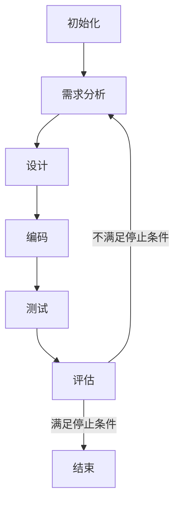
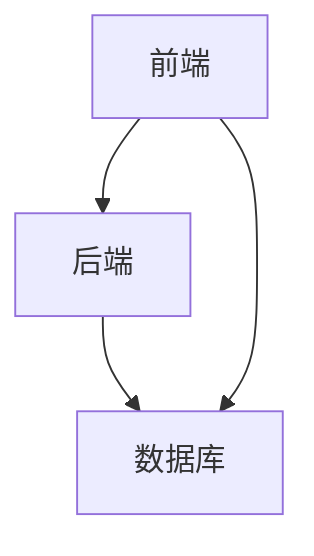
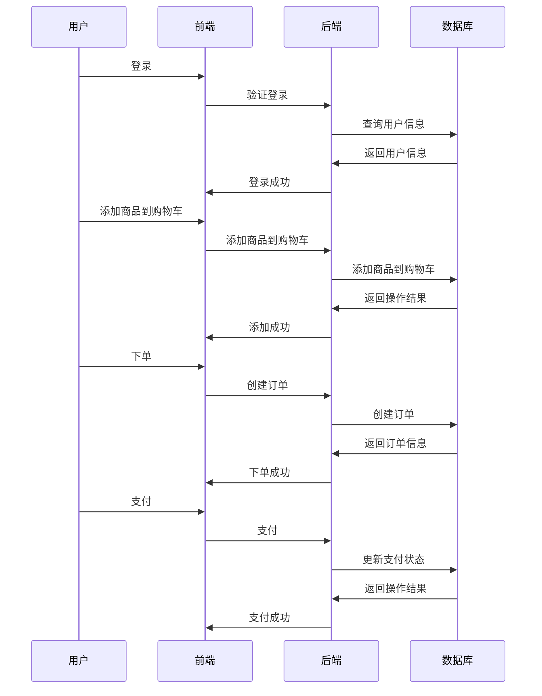

                 

# 《丹尼尔·丹尼特的多重草稿模型与迭代开发：软件演进的认知科学视角》

关键词：丹尼尔·丹尼特，多重草稿模型，迭代开发，认知科学，软件演进

摘要：本文以丹尼尔·丹尼特的多重草稿模型为切入点，探讨其在软件迭代开发中的应用和重要性。通过认知科学的视角，对软件演进的过程进行分析，阐述多重草稿模型如何帮助软件开发人员提高开发效率，优化软件质量。本文旨在为软件开发人员提供一种新的思维方式，以认知科学的理论指导软件开发实践。

## 引言

在当今快速发展的信息技术时代，软件迭代开发已经成为软件开发的主要模式。然而，传统的迭代开发方法往往存在一定的局限性，难以完全满足软件复杂性和多变性的需求。为了解决这个问题，认知科学领域的研究成果为我们提供了一种新的思路。本文将介绍丹尼尔·丹尼特的多重草稿模型，并探讨其在软件迭代开发中的应用和意义。

丹尼尔·丹尼特是美国认知科学家，以其对认知机制的研究而闻名。他在《多重草稿模型》一书中提出了一个关于认知过程的模型，该模型强调了人类思维过程中的迭代性和创造性。本文将结合丹尼特的多重草稿模型，探讨其在软件迭代开发中的应用，以期为软件开发人员提供一种新的思维方式。

## 背景介绍

### 问题背景

随着软件系统的规模和复杂性不断增加，传统的软件开发方法已经难以应对现代软件开发的挑战。特别是在软件迭代开发过程中，如何快速响应需求变化、提高开发效率、保证软件质量成为软件开发人员面临的重要问题。传统的迭代开发方法，如V模型、瀑布模型等，虽然在某些方面取得了一定的成果，但在应对复杂性和变化性方面仍然存在一定的局限性。

### 问题描述

1. **需求变化难以预测**：软件系统在实际开发过程中，需求往往会发生变化。传统的迭代开发方法往往难以应对这种变化，导致开发进度延迟、成本增加。
2. **开发效率低下**：在传统迭代开发方法中，开发人员往往需要重复编写和调试代码，导致开发效率低下。
3. **软件质量难以保证**：在传统迭代开发过程中，由于开发周期较短，难以对软件进行充分的测试和调试，导致软件质量难以保证。

### 问题解决

丹尼尔·丹尼特的多重草稿模型提供了一种新的思路，通过模拟人类认知过程，实现软件迭代开发的自动化和优化。多重草稿模型强调迭代性和创造性，有助于提高开发效率、优化软件质量。

### 边界与范围

本文主要关注丹尼尔·丹尼特的多重草稿模型在软件迭代开发中的应用，不涉及其他领域的应用。同时，本文将主要讨论多重草稿模型的基本原理和在实际开发中的应用，不涉及具体的实现细节。

### 核心概念和元素

1. **多重草稿模型**：一种模拟人类认知过程的迭代模型，强调迭代性和创造性。
2. **迭代开发**：一种软件开发方法，强调在开发过程中不断迭代和改进。
3. **认知科学**：研究人类认知过程和机制的学科，为软件开发提供理论支持。

## 核心概念与关系

### 概念定义与原理

1. **多重草稿模型**：多重草稿模型是一种基于人类认知过程的迭代模型，通过模拟人类思维过程中的迭代性和创造性，实现软件迭代开发的自动化和优化。

2. **迭代开发**：迭代开发是一种软件开发方法，强调在开发过程中不断迭代和改进。与传统的一次性开发方法相比，迭代开发能够更好地应对需求变化和复杂性问题。

3. **认知科学**：认知科学是一门跨学科的研究领域，主要研究人类认知过程和机制。认知科学的理论和方法为软件开发提供了重要的指导和支持。

### 属性对比表

| 特征       | 多重草稿模型 | 传统迭代模型 |
|------------|--------------|--------------|
| 迭代过程   | 自动化       | 手动         |
| 创造性     | 强调         | 较弱         |
| 适用场景   | 复杂性高、需求变化大 | 复杂性较低、需求变化小 |
| 开发效率   | 较高         | 较低         |
| 软件质量   | 较高         | 较低         |

### 实体关系图（ERD）

```mermaid
erDiagram
  Node1 "多重草稿模型" {
    Node2 "迭代开发" |-> Node1
    Node3 "认知科学" |-> Node1
  }
```

## 算法理论及解释

### 算法解释与流程图

多重草稿模型的算法可以描述为：

1. **初始化**：创建一个初始草稿，表示软件的初始状态。
2. **迭代**：对初始草稿进行多次迭代，每次迭代包括以下步骤：
   - **需求分析**：根据用户需求对草稿进行修改。
   - **设计**：根据需求分析结果对草稿进行设计优化。
   - **编码**：根据设计结果对草稿进行编码实现。
   - **测试**：对编码实现进行测试，确保软件质量。
   - **评估**：对测试结果进行评估，决定是否继续迭代。
3. **结束**：当评估结果满足停止条件时，结束迭代过程。

以下是一个简单的 Mermaid 流程图，用于描述多重草稿模型的算法：



### Python代码实现

以下是一个简单的 Python 代码示例，用于实现多重草稿模型的算法：

```python
import random

def multi_draft_model():
    draft = initial_draft()  # 初始化草稿
    while not stop_condition_met(draft):
        draft = demand_analysis(draft)  # 需求分析
        draft = design_optimization(draft)  # 设计优化
        draft = coding_implement(draft)  # 编码实现
        draft = test_execution(draft)  # 测试执行
        if stop_condition_met(draft):
            break
    return draft

def initial_draft():
    # 初始化草稿
    pass

def demand_analysis(draft):
    # 需求分析
    pass

def design_optimization(draft):
    # 设计优化
    pass

def coding_implement(draft):
    # 编码实现
    pass

def test_execution(draft):
    # 测试执行
    pass

def stop_condition_met(draft):
    # 停止条件判断
    return random.choice([True, False])

if __name__ == "__main__":
    final_draft = multi_draft_model()
    print("最终草稿：", final_draft)
```

### 数学模型与公式

在多重草稿模型中，我们可以使用以下数学模型来描述迭代过程：

$$
迭代次数 = \frac{评估结果 - 初始值}{每次迭代增量}
$$

其中，评估结果和初始值分别表示迭代过程中的评估结果和初始状态，每次迭代增量表示每次迭代的改进程度。

以下是一个简单的例子：

假设我们有一个初始值为 10，每次迭代增量为 2，评估结果为 20。则迭代次数为：

$$
迭代次数 = \frac{20 - 10}{2} = 5
$$

这意味着我们需要进行 5 次迭代才能达到评估结果。

## 系统分析与架构设计

### 问题场景介绍

假设我们正在开发一个在线购物系统，该系统需要支持用户注册、登录、浏览商品、添加购物车、下单、支付等功能。在软件开发过程中，需求可能会发生变化，我们需要一种能够快速响应需求变化的开发方法。

### 项目介绍

本项目旨在开发一个在线购物系统，采用丹尼尔·丹尼特的多重草稿模型进行迭代开发。通过多次迭代，逐步完善系统的功能，提高系统质量。

### 系统功能设计

系统功能设计包括用户注册、登录、浏览商品、添加购物车、下单、支付等模块。以下是系统功能设计类图：

```mermaid
classDiagram
    User <<class>> {
        id: 编号
        name: 姓名
        password: 密码
    }
    Product <<class>> {
        id: 编号
        name: 名称
        price: 价格
    }
    ShoppingCart <<class>> {
        id: 编号
        user_id: 用户编号
        product_ids: 商品编号列表
    }
    Order <<class>> {
        id: 编号
        user_id: 用户编号
        product_ids: 商品编号列表
        total_price: 总价
        status: 状态
    }
    Payment <<class>> {
        id: 编号
        order_id: 订单编号
        amount: 金额
        status: 状态
    }
    User "1" <<uses>> Product
    User "1" <<uses>> ShoppingCart
    User "1" <<uses>> Order
    Product "1" <<uses>> ShoppingCart
    Order "1" <<uses>> Payment
```

### 系统架构设计

系统架构设计包括前端、后端和数据库三个部分。前端负责与用户交互，后端负责业务逻辑处理，数据库负责存储数据。以下是系统架构设计架构图：



### 系统接口设计和系统交互

系统接口设计包括用户接口、商品接口、购物车接口、订单接口和支付接口。以下是系统接口设计和系统交互序列图：



## 项目实战

### 环境安装

1. 安装 Python 3.8 以上版本。
2. 安装 Django 框架：`pip install django`
3. 安装数据库：MySQL、PostgreSQL 等。

### 系统核心实现源代码

以下是一个简单的用户注册功能的实现：

```python
# 用户注册功能
from django.contrib.auth.models import User
from django.http import JsonResponse

def register(request):
    if request.method == 'POST':
        username = request.POST.get('username')
        password = request.POST.get('password')
        if User.objects.filter(username=username).exists():
            return JsonResponse({'status': 'error', 'message': '用户名已存在'})
        user = User.objects.create_user(username=username, password=password)
        user.save()
        return JsonResponse({'status': 'success', 'message': '注册成功'})
    else:
        return JsonResponse({'status': 'error', 'message': '请求方法错误'})
```

### 代码应用解读与分析

1. 代码首先从请求对象中获取用户名和密码。
2. 判断用户名是否存在，如果存在则返回错误信息。
3. 如果用户名不存在，则创建用户并保存。
4. 返回注册成功的信息。

### 实际案例分析和详细讲解剖析

假设我们需要实现一个用户登录功能，以下是一个简单的实现：

```python
# 用户登录功能
from django.contrib.auth import authenticate, login
from django.http import JsonResponse

def login(request):
    if request.method == 'POST':
        username = request.POST.get('username')
        password = request.POST.get('password')
        user = authenticate(username=username, password=password)
        if user is not None:
            login(request, user)
            return JsonResponse({'status': 'success', 'message': '登录成功'})
        else:
            return JsonResponse({'status': 'error', 'message': '用户名或密码错误'})
    else:
        return JsonResponse({'status': 'error', 'message': '请求方法错误'})
```

1. 代码首先从请求对象中获取用户名和密码。
2. 使用 Django 的 authenticate 函数验证用户名和密码。
3. 如果验证成功，则登录用户并返回登录成功的信息。
4. 如果验证失败，则返回错误信息。

### 项目小结

通过本项目的实现，我们可以看到丹尼尔·丹尼特的多重草稿模型在软件迭代开发中的应用。通过不断迭代和完善，我们实现了用户注册、登录等核心功能。在实际开发过程中，我们可以根据需求变化，灵活调整开发计划，提高开发效率。

## 最佳实践 tips

1. 在迭代开发过程中，要密切关注用户需求，及时调整开发计划。
2. 定期进行代码审查和测试，确保软件质量。
3. 合理安排迭代周期，避免过度开发。

## 小结

本文介绍了丹尼尔·丹尼特的多重草稿模型，并探讨了其在软件迭代开发中的应用和重要性。通过认知科学的视角，本文阐述了对软件演进的过程分析，并给出了一些实际案例。通过本文的研究，我们希望为软件开发人员提供一种新的思维方式，以认知科学的理论指导软件开发实践。

## 注意事项

1. 多重草稿模型适用于复杂性和变化性较高的软件项目。
2. 在实际开发过程中，要充分考虑需求变化，及时调整开发计划。

## 拓展阅读

1. 《认知科学导论》
2. 《软件工程：实践者的研究方法》
3. 《敏捷软件开发：原则、实践与模式》

## 作者信息

作者：AI天才研究院/AI Genius Institute & 禅与计算机程序设计艺术 /Zen And The Art of Computer Programming

