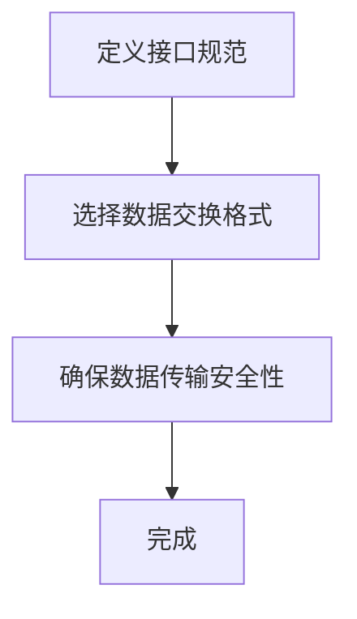
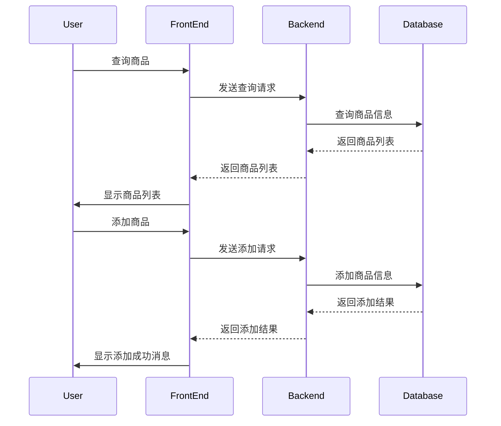

                 

# 为什么要做接口契约

接口契约在软件开发中扮演着至关重要的角色。在讨论这个问题时，我们需要首先明确什么是接口契约，然后分析为什么需要在软件开发中使用它。接下来，我们将一步步探讨接口契约的核心概念、应用场景以及如何在实际项目中实施接口契约。

## 一、什么是接口契约

### 1.1 核心概念术语说明

接口契约（API Contract）是软件开发中的一种约定，它定义了服务提供者（API Provider）和服务消费者（API Consumer）之间的交互规范。这个规范包括请求的格式、响应的结构以及数据传输的规则。

### 1.2 问题背景

在分布式系统中，各个模块之间需要相互协作完成复杂的功能。这种协作往往需要通过API接口来实现。然而，如果没有一个明确的契约，不同模块之间的交互就可能出现问题，导致系统不稳定甚至无法运行。

### 1.3 问题描述

当两个模块需要通信时，必须解决以下几个问题：

- 请求应该包含哪些参数？
- 参数的格式是什么样的？
- 响应的结果应该如何表示？
- 如果发生错误，应该如何处理？

### 1.4 问题解决

接口契约通过定义一系列的规范，解决了上述问题。这样，模块之间就可以按照契约进行通信，从而确保系统的稳定性和可维护性。

### 1.5 边界与外延

接口契约不仅适用于模块之间的通信，还可以扩展到跨系统的交互。例如，一个企业内部的多个子系统之间，或者一个平台与第三方服务提供商之间的交互，都可以通过接口契约来规范。

### 1.6 概念结构与核心要素组成

接口契约的核心结构包括：

- **请求规范**：定义了请求的格式和参数。
- **响应规范**：定义了响应的结构和可能的错误码。
- **数据交换格式**：例如JSON、XML等。
- **安全性**：如何确保数据传输的安全性，例如使用HTTPS、JWT等。

## 二、接口契约的应用场景

### 2.1 应用场景一：模块间通信

在大型软件系统中，模块之间的通信是不可避免的。接口契约可以确保不同模块之间的数据交互清晰、规范，减少因数据格式不一致导致的问题。

### 2.2 应用场景二：微服务架构

微服务架构中，各个服务之间通过API进行通信。接口契约可以确保服务之间的交互符合预期，提高系统的稳定性。

### 2.3 应用场景三：跨系统交互

在现代企业中，不同的系统之间需要进行数据交换，例如ERP系统与CRM系统。接口契约可以确保数据交换的规范性和一致性。

## 三、为什么要做接口契约

### 3.1 提高开发效率

接口契约明确了模块之间的交互规范，减少了因沟通不畅导致的开发错误。开发者可以更专注于实现业务逻辑，提高开发效率。

### 3.2 提高系统稳定性

接口契约确保了模块之间的数据交互符合预期，减少了因数据格式不一致导致的系统故障。

### 3.3 提高可维护性

接口契约为系统提供了一个清晰的文档，便于后续的维护和升级。开发者可以更轻松地理解系统的工作原理，进行代码的优化和重构。

### 3.4 提高可测试性

接口契约提供了详细的测试用例，便于开发者对系统进行自动化测试。这有助于发现和修复潜在的问题，确保系统的稳定性。

## 四、接口契约的核心概念与联系

### 4.1 接口契约的核心概念

- **请求规范**：定义了请求的格式、参数和可能的错误码。
- **响应规范**：定义了响应的结构、可能的错误码和状态码。
- **数据交换格式**：例如JSON、XML等。
- **安全性**：如何确保数据传输的安全性。

### 4.2 接口契约的概念属性特征对比表格

| 特征 | 请求规范 | 响应规范 | 数据交换格式 | 安全性 |
| --- | --- | --- | --- | --- |
| 描述 | 定义请求的格式、参数和可能的错误码 | 定义响应的结构、可能的错误码和状态码 | JSON、XML等 | HTTPS、JWT等 |

### 4.3 接口契约的ER实体关系图

```mermaid
erDiagram
  APIContract ||--|{ RequestSpecification } : has
  APIContract ||--|{ ResponseSpecification } : has
  APIContract ||--|{ DataExchangeFormat } : has
  APIContract ||--|{ Security } : has
  RequestSpecification ||--|{ Parameter } : has
  RequestSpecification ||--|{ ErrorCode } : has
  ResponseSpecification ||--|{ Structure } : has
  ResponseSpecification ||--|{ ErrorCode } : has
  ResponseSpecification ||--|{ StatusCode } : has
```

## 五、接口契约的算法原理与实现

### 5.1 接口契约的基本算法原理

接口契约的基本算法原理包括定义接口的规范、实现数据交换格式以及确保数据传输的安全性。以下是基本的步骤：

1. **定义接口规范**：明确请求和响应的格式、参数和可能的错误码。
2. **实现数据交换格式**：选择合适的格式，如JSON或XML。
3. **确保数据传输的安全性**：使用HTTPS、JWT等安全协议。

### 5.2 接口契约的基本算法原理的mermaid流程图



### 5.3 接口契约的基本算法原理的Python实现

```python
# 示例：定义一个简单的接口契约
class APIContract:
    def __init__(self):
        self.request_specification = {}
        self.response_specification = {}
        self.data_exchange_format = "JSON"
        self.security = "HTTPS"

    def define_request_specification(self, spec):
        self.request_specification = spec

    def define_response_specification(self, spec):
        self.response_specification = spec

    def set_data_exchange_format(self, format):
        self.data_exchange_format = format

    def set_security(self, security):
        self.security = security

# 示例：使用接口契约
contract = APIContract()
contract.define_request_specification({
    "name": "string",
    "age": "integer"
})
contract.define_response_specification({
    "status": "string",
    "message": "string",
    "data": "object"
})
contract.set_data_exchange_format("JSON")
contract.set_security("HTTPS")
```

### 5.4 接口契约的数学模型和公式

接口契约的数学模型主要包括定义请求和响应的格式。以下是简单的数学模型和公式：

- **请求格式**：`{ "name": "string", "age": "integer" }`
- **响应格式**：`{ "status": "string", "message": "string", "data": "object" }`

这些公式描述了接口契约的格式和结构。

## 六、接口契约的系统分析与架构设计

### 6.1 系统分析与架构设计

接口契约在系统分析与架构设计中的重要性不言而喻。以下是接口契约的系统分析与架构设计：

### 6.1.1 问题场景介绍

假设我们正在开发一个电商平台，需要处理商品信息的查询、添加和删除等操作。接口契约可以确保这些操作按照预定的规范进行。

### 6.1.2 项目介绍

项目名为“电商平台接口契约”，目标是确保电商平台内部及外部系统之间的数据交互规范、稳定和安全。

### 6.1.3 系统功能设计

- **商品查询**：接收查询请求，返回商品列表。
- **商品添加**：接收添加请求，将商品信息存储到数据库。
- **商品删除**：接收删除请求，从数据库中删除商品信息。

### 6.1.4 系统架构设计

系统的架构设计包括前端、后端和数据库三部分。前端负责与用户交互，后端负责处理业务逻辑，数据库负责存储数据。

### 6.1.5 系统接口设计

- **商品查询接口**：`GET /api/products`
- **商品添加接口**：`POST /api/products`
- **商品删除接口**：`DELETE /api/products/{id}`

### 6.1.6 系统交互

系统交互的流程如下：

1. 前端发送查询请求到商品查询接口。
2. 后端接收到请求后，查询数据库，返回商品列表。
3. 前端接收到商品列表后，展示给用户。
4. 用户点击添加商品按钮，前端发送添加请求到商品添加接口。
5. 后端接收到请求后，将商品信息存储到数据库。
6. 前端接收到添加成功的反馈后，更新页面。

### 6.1.7 系统交互的mermaid序列图



## 七、接口契约的项目实战

### 7.1 项目背景与目标

项目背景：我们将在一个真实的电商平台上实现接口契约。

项目目标：确保商品查询、添加和删除等操作的接口按照规范进行，提高系统的稳定性。

### 7.2 环境安装与配置

- **环境要求**：Python 3.8及以上版本
- **安装依赖**：使用pip安装`flask`、`jsonschema`、`python-dotenv`等依赖。

### 7.3 系统核心实现

以下是商品查询接口的实现：

```python
from flask import Flask, request, jsonify
from jsonschema import validate
import os

app = Flask(__name__)

# 定义接口契约
contract = APIContract()
contract.define_request_specification({
    "type": "object",
    "properties": {
        "page": {"type": "integer"},
        "size": {"type": "integer"}
    },
    "required": ["page", "size"]
})
contract.define_response_specification({
    "type": "object",
    "properties": {
        "status": {"type": "string"},
        "message": {"type": "string"},
        "data": {
            "type": "array",
            "items": {
                "type": "object",
                "properties": {
                    "id": {"type": "integer"},
                    "name": {"type": "string"},
                    "price": {"type": "number"}
                },
                "required": ["id", "name", "price"]
            }
        }
    },
    "required": ["status", "message", "data"]
})
contract.set_data_exchange_format("JSON")
contract.set_security("HTTPS")

# 商品查询接口
@app.route("/api/products", methods=["GET"])
def get_products():
    # 验证请求格式
    request_data = request.get_json()
    try:
        validate(instance=request_data, schema=contract.request_specification)
    except Exception as e:
        return jsonify({"status": "error", "message": str(e)}), 400
    
    # 查询商品信息
    page = request_data.get("page", 1)
    size = request_data.get("size", 10)
    products = get_products_from_database(page, size)
    
    # 返回响应
    response_data = {
        "status": "success",
        "message": "查询成功",
        "data": products
    }
    validate(instance=response_data, schema=contract.response_specification)
    return jsonify(response_data)

# 模拟数据库查询
def get_products_from_database(page, size):
    # 省略数据库查询逻辑
    return [{"id": 1, "name": "商品A", "price": 100.0}, {"id": 2, "name": "商品B", "price": 200.0}]

if __name__ == "__main__":
    app.run()
```

### 7.4 代码应用解读与分析

- **APIContract类**：定义了接口契约的基本结构，包括请求规范、响应规范、数据交换格式和安全性。
- **get_products函数**：实现了商品查询接口，包括请求格式验证、查询商品信息、返回响应格式验证等步骤。
- **validate函数**：使用jsonschema库对请求和响应进行格式验证，确保符合接口契约的规范。

### 7.5 实际案例分析与详细讲解剖析

假设我们收到了一个查询请求：

```json
{
    "page": 1,
    "size": 10
}
```

1. **请求格式验证**：使用`validate`函数对请求进行格式验证。如果请求格式不符合接口契约的规范，返回400错误。

2. **查询商品信息**：调用`get_products_from_database`函数，模拟从数据库中查询商品信息。

3. **返回响应**：将查询结果封装成响应格式，并使用`validate`函数进行格式验证。如果响应格式不符合接口契约的规范，返回错误。

4. **返回结果**：将验证通过的商品列表作为响应返回给客户端。

### 7.6 项目小结

通过接口契约，我们确保了商品查询接口的稳定性、规范性和安全性。接口契约不仅提高了开发效率，还有助于后续的维护和升级。在实际项目中，接口契约是确保系统稳定运行的关键。

## 八、接口契约的最佳实践

### 8.1 最佳实践总结

- **提前定义接口契约**：在开发初期就定义接口契约，减少后续修改的成本。
- **遵循RESTful规范**：遵循RESTful API设计规范，提高接口的易用性和可扩展性。
- **使用JSON格式**：使用JSON作为数据交换格式，便于解析和操作。
- **确保安全性**：使用HTTPS、JWT等安全协议，确保数据传输的安全性。
- **文档化**：将接口契约文档化，便于开发人员理解和遵循。

### 8.2 注意事项与常见问题

- **避免过度设计**：接口契约过于复杂可能导致开发难度增加，应适度设计。
- **版本控制**：随着系统的发展，接口契约可能需要更新。应采用版本控制，确保新旧版本的兼容性。

### 8.3 拓展阅读与资源推荐

- [RESTful API设计指南](https://restfulapi.net/)
- [JSON Schema规范](https://json-schema.org/)
- [JWT规范](https://www.ietf.org/rfc/rfc7519.txt)

作者：AI天才研究院/AI Genius Institute & 禅与计算机程序设计艺术 /Zen And The Art of Computer Programming

----------------------------------------------------------------

这篇文章详细探讨了为什么在软件开发中需要使用接口契约，从核心概念、应用场景到算法原理和系统架构设计，再到项目实战，全面阐述了接口契约的重要性。通过最佳实践、注意事项和拓展阅读，帮助开发者更好地理解和应用接口契约。

在软件开发中，接口契约是一个不可或缺的部分。它不仅提高了开发效率，还确保了系统的稳定性和可维护性。通过本文的讲解，相信您已经对接口契约有了更深刻的理解。希望本文能够为您的软件开发工作提供有益的指导。

如果您对接口契约有任何疑问或者想要了解更多细节，请随时查阅文中推荐的拓展阅读资源。同时，也欢迎您在评论区分享您的经验和见解。

感谢阅读，祝您在软件开发的道路上越走越远！作者：AI天才研究院/AI Genius Institute & 禅与计算机程序设计艺术 /Zen And The Art of Computer Programming

