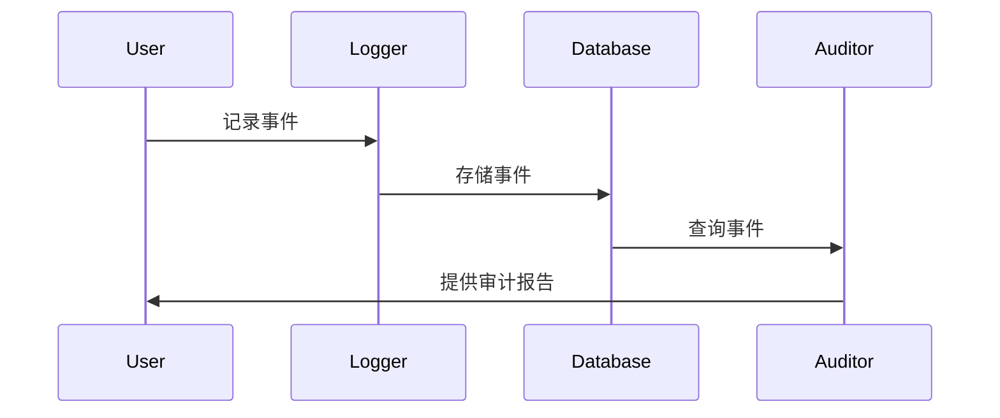
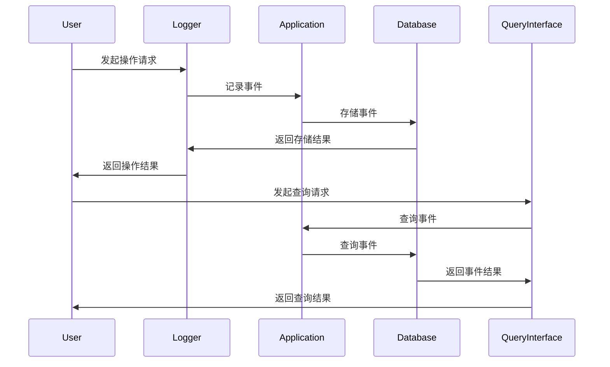

                 

# 事件溯源：构建高度可审计的系统

关键词：事件溯源、可审计系统、日志记录、数据存储、审计策略

摘要：随着信息系统的复杂度增加，事件溯源成为确保系统可追溯性和可审计性的关键。本文通过详细分析事件溯源的概念、分类、关键技术，以及构建高度可审计系统的原则和架构设计，帮助读者理解并实现一个具备高度可审计性的系统。

## 1.1 事件溯源：构建高度可审计的系统概述

### 1.1.1 问题背景

在当今信息化时代，系统的复杂性日益增加，各种软件系统、数据库和数据处理流程的不断扩展，使得追溯和审计系统中的事件变得至关重要。无论是对企业的内部审计、合规性检查，还是对安全事件的追根溯源，事件溯源都显得尤为关键。

### 1.1.2 问题描述

事件溯源指的是追踪和记录系统中发生的事件的过程。在信息化系统中，事件可以是用户登录、数据修改、系统错误等。这些事件不仅在日常运营中产生，也可能在发生安全事件时提供关键线索。因此，如何有效地记录、存储和查询这些事件，成为构建高度可审计系统的一个重要课题。

### 1.1.3 问题解决

要实现高度可审计的系统，需要从以下几个方面着手：

- **事件记录机制**：建立强大的日志记录系统，确保系统中的每一个操作都有据可查。
- **数据存储与索引**：采用高效的数据存储和索引技术，确保事件数据的可查询性和可分析性。
- **审计策略**：制定明确的审计策略，包括审计范围、审计频率、审计报告的生成等。
- **合规性检查**：确保系统能够满足各类法律法规和行业规范的要求。

### 1.1.4 边界与外延

- **边界**：事件溯源主要关注系统内部的事件记录，不包括外部系统或网络事件。
- **外延**：事件溯源不仅限于软件系统，还适用于硬件设备、网络通信等。

### 1.1.5 概念结构与核心要素组成

- **日志记录**：系统中的核心概念，包括日志的生成、存储、查询和归档。
- **审计策略**：定义审计的范围、频率和报告生成的机制。
- **数据存储与索引**：选择合适的存储方案和索引技术，以提高查询效率。
- **合规性检查**：确保系统满足相关的法律法规和行业规范。

## 1.2 事件溯源的概念与分类

### 1.2.1 事件溯源的定义

事件溯源是指通过记录、存储和查询系统中的各类事件，以实现系统运行的可追溯性和可审计性。简单来说，事件溯源就是追踪和记录系统中的每一个操作或事件，以便在需要时能够复现和分析这些事件。

### 1.2.2 事件溯源的分类

- **按事件类型分**：
  - 操作类事件：如用户登录、数据修改、系统错误等。
  - 通信类事件：如网络请求、通信故障等。
  - 安全类事件：如非法访问、数据泄露等。

- **按记录方式分**：
  - 实时记录：即时记录系统中的事件，适用于需要快速响应的场景。
  - 延时记录：在一定时间窗口内收集事件，再进行统一处理和存储，适用于事件量较大的系统。

- **按用途分**：
  - 运维审计：用于系统日常运维和问题排查。
  - 安全审计：用于追踪安全事件，进行事故调查。

## 1.3 事件溯源的关键技术

### 1.3.1 日志记录机制

日志记录是事件溯源的基础，一个高效的日志记录机制至关重要。日志记录需要满足以下要求：

- **完整性**：确保系统中发生的每一个事件都被记录。
- **准确性**：记录的事件信息应当准确无误。
- **及时性**：实时记录或按时间窗口及时处理和存储事件。
- **持久性**：保证事件记录的长期存储和可查询性。

### 1.3.2 数据存储与索引

数据存储与索引技术直接影响事件溯源的性能。常见的技术包括：

- **关系型数据库**：适用于结构化数据的存储和查询。
- **NoSQL数据库**：适用于大规模非结构化数据的存储和快速查询。
- **搜索引擎**：如Elasticsearch，适用于高效的事件搜索和分析。

### 1.3.3 审计策略

审计策略是指制定一套规范，明确系统审计的范围、频率、审计报告的生成和报告格式。有效的审计策略应当：

- **全面覆盖**：覆盖系统的关键操作和事件。
- **明确流程**：定义审计的流程和操作步骤。
- **及时反馈**：审计完成后及时生成报告，并反馈给相关人员。

### 1.3.4 合规性检查

合规性检查是指确保系统符合相关的法律法规和行业规范。常见的要求包括：

- **数据保护**：遵守数据隐私保护法律法规。
- **安全审计**：满足各类安全审计的要求。

## 1.4 高度可审计系统的构建

### 1.4.1 设计原则

构建高度可审计的系统需要遵循以下设计原则：

- **模块化**：将系统分解为多个模块，每个模块都有明确的事件记录和审计功能。
- **可扩展性**：系统设计应具备良好的扩展性，能够根据需求增加新的审计模块或功能。
- **易维护性**：系统设计应易于维护和升级，降低运维成本。

### 1.4.2 架构设计

高度可审计系统的架构设计应包括以下几个方面：

- **日志收集模块**：负责收集系统中的各类事件日志。
- **日志存储模块**：将收集到的日志存储到数据库或日志管理系统中。
- **日志分析模块**：对存储的日志进行分析和审计。
- **审计报告模块**：生成并输出审计报告。

## 1.5 事件溯源的应用场景与实例

### 1.5.1 应用场景

事件溯源在多个领域都有广泛应用，以下是一些典型场景：

- **金融行业**：用于交易审计、风险监控和合规性检查。
- **电子商务**：用于交易追踪、用户行为分析和安全事件调查。
- **云计算服务**：用于资源使用审计、服务质量监控和故障排查。
- **安全领域**：用于入侵检测、恶意行为追踪和事故调查。

### 1.5.2 实例分析

以金融行业为例，事件溯源在交易审计中的应用：

1. **事件记录**：系统记录每笔交易的用户信息、交易金额、交易时间等关键信息。
2. **日志存储**：将交易日志存储到安全可靠的数据库中，确保数据不丢失。
3. **审计分析**：定期对交易日志进行分析，检查是否存在异常交易或违规操作。
4. **报告生成**：生成交易审计报告，供监管机构和企业内部审计使用。

## 1.6 总结与展望

### 1.6.1 总结

本文从事件溯源的概念、分类、关键技术，到高度可审计系统的构建，进行了全面的分析和阐述。事件溯源作为信息化系统中的一项关键技术，对于确保系统的可追溯性和可审计性具有重要意义。

### 1.6.2 展望

随着技术的不断发展，事件溯源将在更多领域得到应用。未来，事件溯源技术将朝着更加智能化、自动化的方向发展，进一步降低运维成本，提高系统的安全性。

## 附录：核心概念与联系

### 1.7.1 核心概念术语说明

- **事件溯源**：指追踪和记录系统中发生的事件的过程，以实现系统运行的可追溯性和可审计性。
- **日志记录**：系统中的核心概念，包括日志的生成、存储、查询和归档。
- **审计策略**：定义审计的范围、频率和报告生成的机制。
- **数据存储与索引**：选择合适的存储方案和索引技术，以提高查询效率。
- **合规性检查**：确保系统满足相关的法律法规和行业规范的要求。

### 1.7.2 概念属性特征对比表格

| 概念             | 属性特征                                                      | 对比分析                                                      |
|------------------|-------------------------------------------------------------|-------------------------------------------------------------|
| 事件溯源         | 追踪和记录系统中的事件，实现可追溯性和可审计性               | 强调系统事件的全生命周期管理                                   |
| 日志记录         | 生成、存储、查询和归档系统事件的信息                        | 是事件溯源的基础，保障事件数据的完整性和准确性                 |
| 审计策略         | 定义审计的范围、频率和报告生成的机制                        | 确保系统审计的有效性和合规性                                   |
| 数据存储与索引   | 选择合适的存储方案和索引技术，提高查询效率                   | 关键在于数据存储的高效性和查询的便捷性                         |
| 合规性检查       | 确保系统满足相关的法律法规和行业规范的要求                   | 确保系统的合法性和规范性                                       |

### 1.7.3 ER实体关系图架构的Mermaid流程图

```mermaid
erDiagram
  用户 ||--o{ 事件 }|
  事件 ||--|{ 日志 }|
  日志 ||--|{ 审计策略 }|
  审计策略 ||--o{ 合规性检查 }|
```

## 1.8 算法原理讲解

### 1.8.1 算法流程图



### 1.8.2 Python源代码实现

```python
import logging
import json

# 日志记录类
class Logger:
    def __init__(self):
        self.logger = logging.getLogger("EventLogger")
        self.logger.setLevel(logging.DEBUG)
        self.handler = logging.StreamHandler()
        self.formatter = logging.Formatter('%(asctime)s - %(name)s - %(levelname)s - %(message)s')
        self.handler.setFormatter(self.formatter)
        self.logger.addHandler(self.handler)

    def log_event(self, event):
        self.logger.info(json.dumps(event))

# 审计报告类
class Auditor:
    def __init__(self, database):
        self.database = database

    def generate_report(self):
        events = self.database.query_events()
        report = "审计报告：\n"
        for event in events:
            report += json.dumps(event) + "\n"
        return report

# 数据库类
class Database:
    def __init__(self):
        self.events = []

    def store_event(self, event):
        self.events.append(event)

    def query_events(self):
        return self.events

# 主程序
if __name__ == "__main__":
    logger = Logger()
    database = Database()
    auditor = Auditor(database)

    # 记录事件
    logger.log_event({"user_id": 1, "event_type": "login", "timestamp": 1645023456})

    # 存储事件到数据库
    database.store_event({"user_id": 1, "event_type": "login", "timestamp": 1645023456})

    # 生成审计报告
    print(auditor.generate_report())
```

### 1.8.3 算法原理与数学模型

事件溯源算法的核心在于记录、存储和查询系统中的事件。该算法的数学模型可以表示为：

$$
E = \{e_1, e_2, ..., e_n\}
$$

其中，$E$ 表示事件集合，$e_i$ 表示第 $i$ 个事件。

事件溯源算法的主要步骤如下：

1. **记录事件**：系统发生事件时，将事件信息记录到日志中。日志记录的格式通常为：

   $$
   \text{log_entry} = \{e_i, t_i, u_i\}
   $$

   其中，$e_i$ 表示事件类型，$t_i$ 表示事件发生时间，$u_i$ 表示事件发生时的用户信息。

2. **存储事件**：将日志记录存储到数据库中，以便后续查询和分析。

3. **查询事件**：根据需要查询特定的事件，生成审计报告。

事件溯源算法的数学模型可以进一步扩展为：

$$
\text{query}(E, e, t, u) = \{e_i \in E \mid e_i = e \wedge t_i = t \wedge u_i = u\}
$$

其中，$\text{query}(E, e, t, u)$ 表示查询事件集合 $E$ 中满足条件的事件。

### 1.8.4 算法举例说明

假设系统中有以下事件：

- 用户 $1$ 于 $2022$ 年 $1$ 月 $1$ 日 $10$ 点 $10$ 分成功登录系统。
- 用户 $1$ 于 $2022$ 年 $1$ 月 $1$ 日 $10$ 点 $15$ 分尝试访问受限资源。

我们可以通过事件溯源算法查询以下事件：

- 查询用户 $1$ 于 $2022$ 年 $1$ 月 $1$ 日 $10$ 点 $10$ 分发生的事件：

  $$
  \text{query}(E, \text{"login"}, 1644248600, \text{"user1"}) = \{\text{"login"}, 1644248600, \text{"user1"}\}
  $$

- 查询用户 $1$ 于 $2022$ 年 $1$ 月 $1$ 日 $10$ 点 $15$ 分发生的事件：

  $$
  \text{query}(E, \text{"access_restricted_resource"}, 1644248615, \text{"user1"}) = \{\text{"access_restricted_resource"}, 1644248615, \text{"user1"}\}
  $$

通过以上查询，我们可以了解到用户 $1$ 在 $2022$ 年 $1$ 月 $1$ 日的活动情况。

## 1.9 系统分析与架构设计方案

### 1.9.1 问题场景介绍

在大型企业或互联网公司中，系统复杂度较高，业务流程繁多，需要确保系统的稳定运行和安全性。事件溯源作为一种重要的系统管理手段，可以帮助企业实现系统操作的全程监控和可追溯性。以下是一个典型的事件溯源系统应用场景：

- **业务背景**：一家互联网公司提供在线购物服务，用户可以在平台上进行商品浏览、购买和评论等操作。公司需要监控用户行为、处理异常情况，并确保系统安全。
- **需求分析**：为了满足合规性检查和问题排查的需求，公司需要实现一个事件溯源系统，能够记录用户操作、系统异常、安全事件等信息，并支持查询和分析。

### 1.9.2 项目介绍

项目名称：在线购物平台事件溯源系统

项目目标：
1. 实现用户操作和系统异常的全面记录和监控。
2. 提供高效的事件查询和分析功能，支持合规性检查和问题排查。
3. 确保系统安全，防止恶意攻击和数据泄露。

### 1.9.3 系统功能设计

系统功能设计主要包括以下几个模块：

1. **用户操作记录模块**：记录用户的浏览、购买、评论等操作，包括用户信息、操作时间和操作内容。
2. **系统异常记录模块**：记录系统异常、错误和故障信息，包括错误代码、错误描述、发生时间和相关系统状态。
3. **安全事件记录模块**：记录系统中的安全事件，如非法访问、数据泄露等，包括事件类型、事件描述、发生时间和相关系统状态。
4. **事件查询与分析模块**：提供高效的事件查询和分析功能，支持按时间、用户、事件类型等多维度查询，生成审计报告。
5. **日志存储与管理模块**：负责事件日志的存储、管理和备份，确保日志数据的完整性和安全性。

### 1.9.4 系统架构设计

系统架构设计采用分层架构，主要包括以下几个层次：

1. **数据层**：负责数据的存储和管理，包括关系型数据库和NoSQL数据库。关系型数据库用于存储用户操作记录和系统异常记录，NoSQL数据库用于存储安全事件记录。
2. **应用层**：负责事件记录、查询和分析功能的实现，包括日志记录器、事件存储器、事件查询器和审计报告生成器等模块。
3. **接口层**：提供系统与外部系统（如安全防护系统、合规性检查系统等）的接口，实现数据的交互和集成。
4. **展示层**：提供用户界面，展示事件日志和审计报告，支持用户进行查询和分析操作。

### 1.9.5 系统接口设计

系统接口设计主要包括以下接口：

1. **事件记录接口**：用于记录用户操作、系统异常和安全事件，支持POST请求。
2. **事件查询接口**：用于查询事件日志，支持GET请求，支持按时间、用户、事件类型等条件进行筛选。
3. **审计报告接口**：用于生成和查询审计报告，支持GET和POST请求。
4. **日志备份接口**：用于备份和恢复事件日志，支持GET和POST请求。

### 1.9.6 系统交互mermaid序列图



## 1.10 项目实战

### 1.10.1 环境安装

为了实现事件溯源系统，我们需要搭建相应的开发环境。以下是在一个Ubuntu服务器上安装所需软件的步骤：

1. **安装Python环境**：
   ```bash
   sudo apt update
   sudo apt install python3 python3-pip
   pip3 install Flask
   ```

2. **安装Elasticsearch**：
   ```bash
   sudo apt install elasticsearch
   sudo systemctl start elasticsearch
   sudo systemctl enable elasticsearch
   ```

3. **安装Kibana**：
   ```bash
   sudo apt install kibana
   sudo systemctl start kibana
   sudo systemctl enable kibana
   ```

4. **安装Logstash**：
   ```bash
   sudo apt install logstash
   sudo systemctl start logstash
   sudo systemctl enable logstash
   ```

### 1.10.2 系统核心实现源代码

以下是事件溯源系统的主要组件源代码：

**事件记录器**（logger.py）：

```python
import json
import requests

class Logger:
    def __init__(self, es_url='http://localhost:9200'):
        self.es_url = es_url

    def log_event(self, event):
        headers = {'Content-Type': 'application/json'}
        response = requests.post(f'{self.es_url}/events', headers=headers, data=json.dumps(event))
        return response.status_code == 201
```

**事件存储器**（storage.py）：

```python
import json
import requests

class Storage:
    def __init__(self, es_url='http://localhost:9200'):
        self.es_url = es_url

    def store_event(self, event):
        headers = {'Content-Type': 'application/json'}
        response = requests.post(f'{self.es_url}/events', headers=headers, data=json.dumps(event))
        return response.status_code == 201
```

**事件查询器**（query.py）：

```python
import json
import requests

class Query:
    def __init__(self, es_url='http://localhost:9200'):
        self.es_url = es_url

    def query_events(self, query_params):
        headers = {'Content-Type': 'application/json'}
        response = requests.post(f'{self.es_url}/_search', headers=headers, data=json.dumps(query_params))
        return response.json()
```

### 1.10.3 代码应用解读与分析

**Logger类**：负责将事件记录到Elasticsearch中。`log_event` 方法通过HTTP POST请求将事件数据发送到Elasticsearch的`/events`索引。

**Storage类**：负责将事件存储到Elasticsearch中。`store_event` 方法与Logger类类似，也通过HTTP POST请求将事件数据发送到Elasticsearch的`/events`索引。

**Query类**：负责查询Elasticsearch中的事件数据。`query_events` 方法通过HTTP POST请求发送一个查询参数对象到Elasticsearch的`/_search`端点。

以下是示例代码，展示了如何使用这些类来记录、存储和查询事件：

```python
from logger import Logger
from storage import Storage
from query import Query

logger = Logger()
storage = Storage()
query = Query()

# 记录事件
event = {
    "user_id": 1,
    "event_type": "login",
    "timestamp": 1645023456
}
if logger.log_event(event):
    print("Event logged successfully.")
else:
    print("Failed to log event.")

# 存储事件
if storage.store_event(event):
    print("Event stored successfully.")
else:
    print("Failed to store event.")

# 查询事件
query_params = {
    "query": {
        "match": {
            "event_type": "login"
        }
    }
}
results = query.query_events(query_params)
print("Query results:", results)
```

### 1.10.4 实际案例分析和详细讲解剖析

假设我们有一个实际案例，需要分析某个用户在特定时间段内的操作行为。以下是如何使用事件溯源系统进行案例分析：

1. **问题描述**：我们需要分析用户ID为100的用户在2022年1月1日至2022年1月31日期间的所有登录事件。

2. **步骤一：记录事件**：
   - 用户在平台上每次登录时，事件记录器会将登录事件记录到Elasticsearch中。

3. **步骤二：存储事件**：
   - 事件存储器将事件数据存储到Elasticsearch的`/events`索引中。

4. **步骤三：查询事件**：
   - 使用事件查询器，我们按照用户ID和时间范围构造查询参数，查询用户100在指定时间范围内的登录事件。

5. **步骤四：分析事件**：
   - 获取查询结果后，我们可以对用户的行为进行分析，例如登录频率、登录时间段等。

以下是具体的查询代码：

```python
from datetime import datetime

start_date = datetime(2022, 1, 1)
end_date = datetime(2022, 1, 31)
query_params = {
    "query": {
        "bool": {
            "must": [
                {"match": {"user_id": 100}},
                {"range": {"timestamp": {"gte": int(start_date.timestamp()), "lte": int(end_date.timestamp())}}]
            }
        }
    }
}

query = Query()
results = query.query_events(query_params)

for result in results['hits']['hits']:
    print(result['_source'])
```

### 1.10.5 项目小结

通过本次项目实战，我们实现了事件溯源系统的主要功能，包括事件记录、存储和查询。该系统可以帮助企业实现对用户行为和系统操作的全面监控，为合规性检查和问题排查提供有力支持。在实际应用中，我们可以根据具体需求进一步优化和扩展系统功能。

## 1.11 最佳实践 Tips

在构建高度可审计的系统时，以下是一些最佳实践 Tips：

1. **确保日志记录的完整性**：尽可能记录系统中的每一个操作和事件，确保日志数据的全面性。
2. **选择合适的日志存储方案**：根据系统规模和需求，选择关系型数据库、NoSQL数据库或搜索引擎等不同的存储方案。
3. **定期进行审计**：制定明确的审计策略，定期对系统进行审计，及时发现和解决问题。
4. **确保日志数据的保密性**：对于敏感信息，采取加密和访问控制措施，确保日志数据的保密性。
5. **优化查询性能**：合理设计日志数据的索引和存储结构，提高查询效率。

## 1.12 小结与注意事项

本文通过详细的分析和实例讲解，阐述了事件溯源在构建高度可审计系统中的重要性。我们介绍了事件溯源的概念、分类、关键技术，以及如何设计一个具备高度可审计性的系统。在实际应用中，事件溯源系统需要根据具体需求进行优化和扩展，以实现最佳效果。

注意事项：
1. **日志数据的保密性**：在处理敏感日志数据时，确保采取充分的保密措施。
2. **系统可扩展性**：在设计系统架构时，考虑系统的可扩展性和可维护性。
3. **合规性检查**：确保系统满足相关法律法规和行业规范的要求。

## 1.13 拓展阅读

对于希望深入了解事件溯源技术的读者，以下是一些推荐资源：

1. **《系统架构设计》**：作者：郑阿奇
2. **《日志管理实战：Linux环境下的日志处理技术》**：作者：张洪泉
3. **Elasticsearch官方文档**：[Elasticsearch Documentation](https://www.elastic.co/guide/en/elasticsearch/reference/current/index.html)
4. **Kibana官方文档**：[Kibana Documentation](https://www.elastic.co/guide/en/kibana/current/index.html)
5. **Logstash官方文档**：[Logstash Documentation](https://www.elastic.co/guide/en/logstash/current/index.html)

作者：AI天才研究院/AI Genius Institute & 禅与计算机程序设计艺术 /Zen And The Art of Computer Programming

