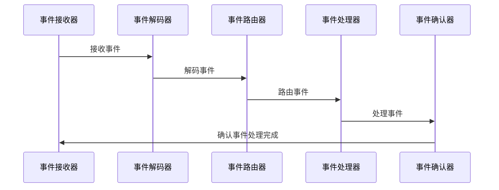

                 


## 引言

在当今数字化时代，系统的可扩展性和实时性变得尤为重要。传统的同步阻塞式系统在应对高并发和复杂业务逻辑时往往显得力不从心。为了应对这些挑战，事件溯源（Event Sourcing）和事件驱动系统（Event-Driven System）应运而生。本文旨在深入探讨事件溯源技术，通过逐步分析推理的方式，解析其核心概念、架构设计、模型构建、存储与检索技术、处理机制以及实际案例分析，帮助读者全面理解和掌握这一先进的技术。

事件溯源是一种软件设计模式，它将系统状态的变化记录为一系列的事件，每个事件都是系统状态的变更。通过事件溯源，系统可以重建其状态历史，从而实现数据的持久化和状态的恢复。事件驱动系统则基于这种设计模式，通过事件触发业务逻辑的执行，从而实现高效、灵活的业务处理。

### 关键词

- 事件溯源
- 事件驱动系统
- 架构设计
- 事件模型
- 存储与检索
- 性能优化
- 实际案例分析

### 摘要

本文首先介绍了事件溯源的基本概念和重要性，然后深入探讨了事件驱动系统的架构设计、事件模型的构建、事件存储与检索技术、事件处理机制，并通过实际案例分析了事件溯源系统的设计与实施。最后，文章总结了事件溯源系统的最佳实践，为读者提供了实用的优化策略和未来的发展趋势。

---

## 第一部分：事件溯源与系统设计基础

### 第1章：事件溯源：基本概念与背景

**1.1.1 事件溯源的定义与重要性**

事件溯源是一种将系统状态变化记录为事件的机制，这些事件可以用来重建系统历史状态。与传统的关系数据库相比，事件溯源更强调数据的变更历史，而非当前状态。

事件溯源的重要性在于：

1. **可扩展性**：通过事件溯源，系统可以水平扩展，处理大规模并发请求。
2. **数据一致性**：事件溯源可以确保数据的一致性，因为所有状态变化都被完整记录。
3. **故障恢复**：通过事件重放，系统能够快速恢复到故障前的状态。

**1.1.2 事件溯源的发展历程**

事件溯源最早由Eric Evans在其著作《领域驱动设计》中提出。随后，随着微服务架构的兴起，事件溯源得到了广泛的应用。

**1.1.3 事件溯源的应用场景**

事件溯源适用于以下场景：

1. **金融交易系统**：记录每一笔交易的历史，确保数据的准确性和可追溯性。
2. **订单管理系统**：处理大量订单，确保订单状态的一致性和可查询性。
3. **日志系统**：记录系统的所有事件，用于故障排查和分析。

**1.1.4 事件溯源的技术挑战**

事件溯源面临以下技术挑战：

1. **存储容量**：事件数据通常非常庞大，需要高效的存储和检索技术。
2. **性能优化**：事件处理需要高效，尤其是在高并发场景下。
3. **数据一致性**：确保所有事件都能正确处理，避免数据丢失或重复。

---

## 第2章：事件驱动系统的架构设计

**2.1.1 事件驱动系统概述**

事件驱动系统是一种基于事件触发的系统架构，它通过事件来驱动业务逻辑的执行。与传统的同步阻塞式系统不同，事件驱动系统具有更高的灵活性和可扩展性。

**2.1.2 事件驱动系统的架构要素**

事件驱动系统的核心架构包括：

1. **事件生成器**：负责生成和发送事件。
2. **事件总线**：负责传输和路由事件。
3. **事件处理器**：负责处理事件并执行相应的业务逻辑。

**2.1.3 事件驱动系统的设计与实现**

设计事件驱动系统时，需要考虑以下几个方面：

1. **事件模型**：定义事件的属性和类型。
2. **事件流**：设计事件的路由和处理流程。
3. **一致性保证**：确保事件处理的一致性和正确性。

**2.1.4 事件驱动系统与传统的差异**

与传统的同步阻塞式系统相比，事件驱动系统具有以下优势：

1. **异步处理**：事件驱动系统采用异步处理，提高了系统的并发能力和响应速度。
2. **解耦**：通过事件总线实现系统的解耦，提高了系统的可维护性和可扩展性。

---

接下来的章节将详细介绍事件模型的构建、事件存储与检索技术、事件处理机制以及实际案例分析等内容。通过逐步分析推理的方式，我们将深入理解事件溯源技术的核心原理和实践方法。

## 第3章：事件模型的构建

**3.1.1 事件模型的设计原则**

事件模型是事件驱动系统的核心组成部分，其设计原则如下：

1. **原子性**：事件应当是原子的，即不可分割的。
2. **可序列化**：事件需要可序列化，以便在网络中传输。
3. **可追溯性**：事件应包含足够的信息，以便追踪其来源和影响。

**3.1.2 事件模型的构建方法**

构建事件模型的方法包括：

1. **领域驱动设计**：基于领域模型构建事件模型。
2. **事件风暴**：通过团队协作，快速构建和迭代事件模型。
3. **代码生成**：利用工具自动生成事件模型代码。

**3.1.3 事件模型的测试与优化**

事件模型的测试和优化包括：

1. **单元测试**：确保每个事件都能正确处理。
2. **性能测试**：评估事件处理的性能和延迟。
3. **优化**：通过优化事件处理流程和存储策略来提升系统性能。

**3.1.4 事件模型的应用实例**

事件模型的应用实例包括：

1. **用户注册事件**：包含用户信息、注册时间和验证状态等。
2. **订单创建事件**：包含订单详情、创建时间和支付状态等。
3. **库存调整事件**：包含库存量、调整时间和调整原因等。

### 3.1.1 事件模型的设计原则

在设计事件模型时，我们需要遵循以下原则来确保模型的有效性和可扩展性：

1. **完整性**：事件模型应包含所有必要的信息，确保系统能够重建完整的状态历史。
2. **可读性**：事件的命名和结构应简洁明了，方便开发者理解和维护。
3. **一致性**：事件的格式和结构应保持一致，以便于事件处理和存储。
4. **可扩展性**：设计时应考虑未来的扩展性，以便于添加新的事件类型。

为了更好地展示这些原则，我们可以通过一个表格来对比不同事件模型属性特征：

| 特征 | 优点 | 缺点 |
| ---- | ---- | ---- |
| **完整性** | 确保所有必要信息都被记录，便于状态重建 | 可能导致事件数据过于庞大 |
| **可读性** | 简化事件理解和维护 | 可能导致冗余信息的出现 |
| **一致性** | 保持事件格式一致，简化处理流程 | 可能限制事件格式的灵活性 |
| **可扩展性** | 易于添加新事件类型，提高系统的可维护性 | 可能导致系统复杂度增加 |

通过这个表格，我们可以清晰地看到每个特征的优势和劣势，从而在设计事件模型时做出权衡。

### 3.1.2 事件模型的构建方法

构建事件模型的方法多种多样，以下是几种常用的方法：

1. **领域驱动设计（Domain-Driven Design, DDD）**：
   DDD强调通过领域模型来驱动软件设计。在构建事件模型时，我们可以从领域模型出发，将领域对象的行为抽象为事件。例如，在电子商务系统中，订单状态的变化可以抽象为订单创建事件、订单支付事件等。

2. **事件风暴（Event Storming）**：
   事件风暴是一种团队协作方法，通过快速绘制事件序列和场景来构建事件模型。这种方法有助于确保团队对系统的理解一致，并能快速迭代和改进模型。

3. **代码生成**：
   使用代码生成工具可以自动化生成事件模型代码。例如，可以使用模板引擎或代码生成器根据领域模型自动生成事件类。这种方法可以提高开发效率，减少手工编写代码的出错风险。

下面是一个简单的示例，展示如何通过DDD来构建一个订单系统的事件模型：

**订单领域模型**：

- **Order**（订单）：
  - Properties: orderId, customerId, orderDate, status
  - Methods: createOrder(), updateStatus()

- **Customer**（客户）：
  - Properties: customerId, name, email
  - Methods: placeOrder()

- **OrderStatus**（订单状态）：
  - Values: PENDING, PROCESSING, SHIPPED, DELIVERED, CANCELED

**事件模型**：

- **OrderCreatedEvent**：
  - Properties: orderId, customerId, orderDate, status

- **OrderStatusChangedEvent**：
  - Properties: orderId, status

**示例代码**：

```python
class OrderCreatedEvent:
    def __init__(self, orderId, customerId, orderDate, status):
        self.orderId = orderId
        self.customerId = customerId
        self.orderDate = orderDate
        self.status = status

class OrderStatusChangedEvent:
    def __init__(self, orderId, status):
        self.orderId = orderId
        self.status = status
```

通过DDD，我们可以从订单领域模型出发，抽象出订单创建事件和订单状态变更事件。这种方法不仅使事件模型更加贴近业务需求，而且有助于确保事件的完整性和一致性。

### 3.1.3 事件模型的测试与优化

在事件模型设计完成后，我们需要对其进行测试和优化，以确保其性能和可维护性。以下是几种常用的测试和优化方法：

1. **单元测试**：
   单元测试是确保每个事件处理逻辑正确性的基本方法。我们可以为每个事件类编写单元测试，测试其输入和输出是否符合预期。

   **示例**：

   ```python
   def test_order_created_event():
       event = OrderCreatedEvent("1", "2", "2021-01-01", "PENDING")
       assert event.orderId == "1"
       assert event.customerId == "2"
       assert event.orderDate == "2021-01-01"
       assert event.status == "PENDING"
   ```

2. **性能测试**：
   性能测试是评估事件处理系统在高并发情况下的表现。我们可以使用工具（如JMeter）模拟高并发场景，测试事件处理的速度和延迟。

   **示例**：

   ```bash
   # 使用JMeter模拟1000个并发用户创建订单
   jmeter -n -t test_plan.jmx -l results.jtl
   ```

3. **优化**：
   根据测试结果，我们可以对事件模型进行优化。优化方法包括：

   - **事件压缩**：将多个小事件合并成一个大事件，减少网络传输和存储的开销。
   - **缓存策略**：使用缓存减少对事件存储的访问频率。
   - **异步处理**：采用异步方式处理事件，提高系统并发能力。

通过这些测试和优化方法，我们可以确保事件模型在实际应用中能够高效、稳定地运行。

### 3.1.4 事件模型的应用实例

事件模型在现实中的应用非常广泛，下面我们通过几个具体的实例来展示事件模型的设计和应用。

**1. 用户注册事件**

用户注册是大多数在线服务的核心功能之一。在事件模型中，用户注册可以抽象为以下几个事件：

- **UserRegisteredEvent**：
  - Properties: userId, username, email, password, registrationDate

**示例代码**：

```python
class UserRegisteredEvent:
    def __init__(self, userId, username, email, password, registrationDate):
        self.userId = userId
        self.username = username
        self.email = email
        self.password = password
        self.registrationDate = registrationDate
```

**2. 订单创建事件**

订单创建事件包含了订单的基本信息和状态信息。以下是订单创建事件的示例：

- **OrderCreatedEvent**：
  - Properties: orderId, customerId, orderDate, items, totalAmount

**示例代码**：

```python
class OrderCreatedEvent:
    def __init__(self, orderId, customerId, orderDate, items, totalAmount):
        self.orderId = orderId
        self.customerId = customerId
        self.orderDate = orderDate
        self.items = items
        self.totalAmount = totalAmount
```

**3. 库存调整事件**

库存调整事件用于记录库存量的变化。以下是库存调整事件的示例：

- **InventoryAdjustedEvent**：
  - Properties: itemId, quantity, adjustmentDate, adjustmentReason

**示例代码**：

```python
class InventoryAdjustedEvent:
    def __init__(self, itemId, quantity, adjustmentDate, adjustmentReason):
        self.itemId = itemId
        self.quantity = quantity
        self.adjustmentDate = adjustmentDate
        self.adjustmentReason = adjustmentReason
```

通过这些具体的应用实例，我们可以看到事件模型如何有效地记录和跟踪业务操作。事件模型不仅使系统的状态变化可追溯，而且有助于实现灵活的业务逻辑和高效的系统性能。

## 第4章：事件存储与检索技术

### 4.1.1 事件存储的技术选择

事件溯源系统对事件存储有着特殊的要求，因此选择合适的存储技术至关重要。以下是几种常见的事件存储技术：

1. **关系数据库**：
   关系数据库（如MySQL、PostgreSQL）是一种传统的数据存储方式。它通过表与表之间的关联来存储数据。关系数据库的优点是数据一致性高，易于管理，但扩展性较差。

2. **NoSQL数据库**：
   NoSQL数据库（如MongoDB、Cassandra）提供了灵活的数据模型和高扩展性。它们通常通过文档、键值对或列族来存储数据，适用于大规模数据存储。然而，NoSQL数据库的一致性可能不如关系数据库。

3. **日志文件**：
   日志文件是一种简单但有效的事件存储方式。它通过追加的方式记录事件，适用于事件数据量较小或对实时性要求不高的场景。

### 4.1.2 事件检索的策略与方法

事件检索是事件溯源系统的重要功能之一。以下是几种常见的事件检索策略与方法：

1. **基于时间的检索**：
   基于时间的检索通过指定时间范围来查找事件。这种方法适用于历史数据查询和分析。

   **示例代码**（Python）：

   ```python
   def get_events_by_time(start_time, end_time):
       events = []
       for event in event_store:
           if event.timestamp >= start_time and event.timestamp <= end_time:
               events.append(event)
       return events
   ```

2. **基于关键词的检索**：
   基于关键词的检索通过指定关键词来查找相关事件。这种方法适用于模糊查询和全文搜索。

   **示例代码**（Elasticsearch）：

   ```python
   def search_events_by_keyword(keyword):
       query = {
           "query": {
               "match": {
                   "description": keyword
               }
           }
       }
       results = es.search(index="events", body=query)
       return results["hits"]["hits"]
   ```

3. **基于聚合的检索**：
   基于聚合的检索通过聚合操作（如计数、求和、平均值）来检索事件数据。这种方法适用于数据分析和报告。

   **示例代码**（MongoDB）：

   ```python
   def aggregate_events():
       pipeline = [
           {"$match": {"type": "order_created"}},
           {"$group": {"_id": "$status", "count": {"$sum": 1}}}
       ]
       result = event_collection.aggregate(pipeline)
       return list(result)
   ```

### 4.1.3 高性能事件存储与检索系统设计

高性能事件存储与检索系统需要考虑以下几个方面：

1. **数据分片**：
   数据分片可以将数据分散存储在不同的节点上，提高系统的扩展性和可用性。

   **示例代码**（Cassandra）：

   ```python
   CREATE KEYSPACE events WITH replication = {'class': 'SimpleStrategy', 'replication_factor': '3'};
   CREATE TABLE events.event (
       event_id uuid PRIMARY KEY,
       event_type text,
       timestamp timestamp,
       payload text
   ) WITH CLUSTERING ORDER BY (event_type ASC, timestamp DESC);
   ```

2. **索引优化**：
   索引优化可以加快数据的检索速度。选择合适的索引策略（如B树索引、全文索引）可以提高查询性能。

   **示例代码**（Elasticsearch）：

   ```python
   PUT /events
   {
     "settings": {
       "number_of_shards": 2,
       "number_of_replicas": 1
     },
     "mappings": {
       "properties": {
         "event_id": {"type": "keyword"},
         "event_type": {"type": "text", "analyzer": "ik_max_word"},
         "timestamp": {"type": "date"},
         "payload": {"type": "text", "analyzer": "ik_max_word"}
       }
     }
   }
   ```

3. **缓存策略**：
   缓存策略可以减少对数据库的访问频率，提高系统的响应速度。常用的缓存技术包括Redis、Memcached等。

   **示例代码**（Redis）：

   ```python
   import redis

   client = redis.StrictRedis(host='localhost', port=6379, db=0)
   client.set('event_id_1', 'event_data_1')
   data = client.get('event_id_1')
   print(data)
   ```

### 4.1.4 事件存储与检索的性能优化

为了提高事件存储与检索的性能，我们可以采取以下优化策略：

1. **批处理**：
   批处理可以将多个事件批量存储或检索，减少I/O操作，提高系统性能。

   **示例代码**（Python）：

   ```python
   def batch_save_events(events):
       with event_store.transaction():
           for event in events:
               event_store.save(event)

   def batch_fetch_events(event_ids):
       with event_store.transaction():
           return [event_store.get(event_id) for event_id in event_ids]
   ```

2. **索引优化**：
   定期分析查询模式，优化索引策略，避免无效索引。

   **示例代码**（Elasticsearch）：

   ```python
   def optimize_indices():
       for index in es.indices.getIndices():
           if es.indices.exists(index=index):
               es.indices优
```

通过这些优化策略，我们可以显著提高事件存储与检索的性能，确保系统在面临大规模数据和高并发请求时仍能保持高效稳定。

### 4.1.5 事件存储与检索的性能优化

为了确保事件存储与检索系统在处理大规模数据和高并发请求时保持高效稳定，我们可以采取以下性能优化策略：

1. **水平扩展**：
   通过水平扩展，可以将事件存储和检索任务分布到多个节点上，提高系统的吞吐量和可用性。常用的分布式存储系统包括Apache Kafka、Apache Pulsar和Apache Flink。

   **示例配置**（Apache Kafka）：

   ```yaml
   # Kafka配置文件示例
   kafkaServers: ["kafka1:9092", "kafka2:9092", "kafka3:9092"]
   replicationFactor: 3
   topics:
     - name: event_topic
       partitions: 4
   ```

2. **缓存策略**：
   利用缓存可以显著减少对数据库的访问频率，提高系统的响应速度。常用的缓存技术包括Redis、Memcached和Elasticsearch。

   **示例配置**（Redis）：

   ```yaml
   # Redis配置文件示例
   host: localhost
   port: 6379
   db: 0
   password: ""
   max_connections: 1000
   ```

3. **批量处理**：
   通过批量处理，可以减少I/O操作，提高系统的吞吐量。在事件存储和检索过程中，可以使用批量插入、批量查询等技术。

   **示例代码**（Python）：

   ```python
   import redis

   client = redis.StrictRedis(host='localhost', port=6379, db=0)
   with client.pipeline() as pipe:
       pipe.set('event_key_1', 'event_value_1')
       pipe.set('event_key_2', 'event_value_2')
       pipe.execute()
   ```

4. **查询优化**：
   定期分析查询模式，调整索引策略和查询优化器参数，避免无效查询。

   **示例配置**（MySQL）：

   ```sql
   -- 调整MySQL查询优化器参数
   SET GLOBAL query_cache_size = 128M;
   SET GLOBAL optimizer_switch = 'index_merge=on';
   ```

通过以上策略，我们可以有效提高事件存储与检索系统的性能，确保其在面对大规模数据和高并发请求时仍能保持高效稳定。

### 第5章：事件处理机制与优化

#### 5.1.1 事件处理流程设计

事件处理流程设计是构建高效事件驱动系统的重要环节。以下是事件处理流程的典型设计步骤：

1. **事件接收**：系统接收事件，可以是同步或异步方式。
2. **事件解码**：将接收到的事件数据解码为内部格式。
3. **事件路由**：根据事件的类型和目标，将事件路由到相应的处理器。
4. **事件处理**：执行事件对应的业务逻辑，更新系统状态。
5. **事件确认**：确认事件已被处理，确保数据一致性。

**示例流程图**（Mermaid）：



#### 5.1.2 事件处理机制实现

事件处理机制的实现需要考虑以下几个方面：

1. **事件接收器**：负责接收事件，可以是消息队列（如Kafka、RabbitMQ）或HTTP请求。
2. **事件解码器**：负责将接收的事件数据解码为内部格式，通常使用JSON或Protobuf等格式。
3. **事件路由器**：根据事件类型和目标，将事件路由到相应的处理器。可以使用路由表或策略来动态路由事件。
4. **事件处理器**：执行事件对应的业务逻辑，更新系统状态。处理器可以是单独的进程或线程，以确保事件处理的并发性。
5. **事件确认器**：确认事件已被处理，确保数据一致性。可以通过事务或消息确认机制来实现。

**示例代码**（Python）：

```python
from json import loads
from queue import Queue
from threading import Thread

# 事件接收器
def event_receiver(queue: Queue):
    while True:
        event_data = queue.get()
        event = loads(event_data)
        event_router(event)

# 事件解码器
def event_decoder(event_data: str):
    return loads(event_data)

# 事件路由器
def event_router(event: dict):
    if event['type'] == 'order_created':
        order_processor(event)
    elif event['type'] == 'order_updated':
        order_status_processor(event)

# 事件处理器
def order_processor(event: dict):
    print(f"Processing order {event['id']}")

# 事件确认器
def event确认器(event: dict):
    print(f"Event {event['id']} processed successfully")
```

#### 5.1.3 事件处理性能优化

为了提高事件处理性能，我们可以采取以下优化策略：

1. **异步处理**：采用异步处理方式，减少事件处理过程中的阻塞时间。
2. **并行处理**：通过并行处理，利用多核CPU提高事件处理速度。
3. **批量处理**：通过批量处理，减少I/O操作和上下文切换开销。
4. **缓存策略**：利用缓存，减少对数据库等外部资源的访问。
5. **事件压缩**：对事件数据进行压缩，减少网络传输和数据存储的开销。

**示例代码**（Python）：

```python
import asyncio
import json

async def event_handler(event_data: str):
    event = json.loads(event_data)
    await asyncio.sleep(0.1)  # 模拟处理时间
    print(f"Processed event {event['id']}")

async def main():
    event_queue = Queue()
    await asyncio.gather(
        receive_events(event_queue),
        process_events(event_queue)
    )

async def receive_events(queue: Queue):
    while True:
        event_data = "{'id': '1', 'type': 'order_created'}"
        queue.put(event_data)
        await asyncio.sleep(1)

async def process_events(queue: Queue):
    while True:
        event_data = queue.get()
        asyncio.create_task(event_handler(event_data))
        await asyncio.sleep(0.1)

asyncio.run(main())
```

通过以上策略，我们可以显著提高事件处理系统的性能和效率。

### 5.1.4 事件处理的实时性与一致性

在事件处理系统中，实时性和一致性是两个关键方面。以下是如何保证事件处理实时性与一致性的策略：

1. **实时性保障**：
   - **异步处理**：采用异步处理，避免同步阻塞。
   - **消息队列**：使用消息队列（如Kafka、RabbitMQ）确保事件及时传递。
   - **负载均衡**：通过负载均衡，将事件均匀分配到各个处理节点。

2. **一致性保障**：
   - **最终一致性**：允许事件处理有一定延迟，但确保最终状态一致。
   - **事务性**：使用事务机制，确保一组事件要么全部成功处理，要么全部失败。
   - **补偿机制**：当事件处理失败时，通过补偿机制恢复系统状态。

**示例代码**（Python）：

```python
import asyncio
from json import loads
from queue import Queue

# 事件处理器
async def event_handler(event_data: str):
    event = loads(event_data)
    if event['type'] == 'order_created':
        await process_order(event)
    elif event['type'] == 'order_updated':
        await update_order_status(event)

# 处理订单创建事件
async def process_order(event: dict):
    # 模拟订单处理
    await asyncio.sleep(1)
    print(f"Order {event['id']} created successfully")

# 更新订单状态事件
async def update_order_status(event: dict):
    # 模拟订单状态更新
    await asyncio.sleep(1)
    print(f"Order {event['id']} status updated successfully")

# 事件处理
async def main():
    event_queue = Queue()
    await asyncio.gather(
        receive_events(event_queue),
        process_events(event_queue)
    )

# 接收事件
async def receive_events(queue: Queue):
    while True:
        event_data = "{'id': '1', 'type': 'order_created'}"
        queue.put(event_data)
        await asyncio.sleep(1)

# 处理事件
async def process_events(queue: Queue):
    while True:
        event_data = queue.get()
        asyncio.create_task(event_handler(event_data))
        await asyncio.sleep(0.1)

asyncio.run(main())
```

通过以上策略和代码示例，我们可以实现实时且一致的事件处理系统，确保业务操作的准确性和可靠性。

## 第6章：事件驱动系统的案例分析

### 6.1.1 案例背景与目标

本次案例是一个在线电商平台，旨在通过事件驱动系统实现高效的订单管理和库存控制。案例的目标是实现以下功能：

1. **实时订单处理**：确保订单创建、支付和发货等操作的实时性。
2. **库存自动调整**：根据订单处理结果自动调整库存，确保库存数据的准确性。
3. **故障恢复**：在系统故障后，通过事件重放恢复订单状态和历史数据。

### 6.1.2 系统需求分析

系统需求包括：

1. **性能需求**：支持高并发订单处理，确保系统响应速度。
2. **可靠性需求**：确保数据的一致性和完整性，实现故障自动恢复。
3. **可扩展性需求**：支持系统的水平扩展，便于后续功能添加和性能优化。

### 6.1.3 系统架构设计

系统架构设计如下：

1. **事件生成器**：订单创建、支付、发货等操作生成事件。
2. **事件总线**：负责传输和路由事件，确保事件及时传递和处理。
3. **事件处理器**：处理订单事件，执行订单创建、支付和发货等操作。
4. **库存管理系统**：根据订单事件调整库存，确保库存数据的准确性。
5. **故障恢复模块**：记录系统状态，实现故障后的自动恢复。

**系统架构图**（Mermaid）：

```mermaid
graph LR
    subgraph 订单系统
        A[订单创建] --> B{支付处理}
        B --> C[发货处理}
    end

    subgraph 库存系统
        D[库存管理] --> E{库存调整}
    end

    subgraph 事件系统
        F{事件总线}
        A --> F
        B --> F
        C --> F
        F --> D
        F --> E
    end

    subgraph 故障恢复
        G[故障记录] --> H{状态恢复}
        F --> G
        G --> H
    end
```

### 6.1.4 系统实现与优化

#### 系统实现

1. **事件生成器**：
   使用异步编程实现订单创建、支付和发货等操作，生成相应的事件。

   ```python
   async def create_order(order_data):
       # 订单创建逻辑
       order_event = OrderCreatedEvent(order_data['id'], order_data['customer_id'], order_data['date'])
       await event_bus.publish(order_event)

   async def process_payment(order_id):
       # 支付处理逻辑
       payment_event = PaymentProcessedEvent(order_id)
       await event_bus.publish(payment_event)

   async def ship_order(order_id):
       # 发货处理逻辑
       ship_event = OrderShippedEvent(order_id)
       await event_bus.publish(ship_event)
   ```

2. **事件总线**：
   使用Kafka作为事件总线，实现事件传输和路由。

   ```python
   class EventBus:
       def __init__(self):
           self.producer = Producer(kafka_servers)

       async def publish(self, event):
           await self.producer.send(event.type, json.dumps(event.to_dict()))

       async def subscribe(self, event_type, callback):
           # 订阅事件处理
           await self.consumer.subscribe([event_type])
           async for message in self.consumer:
               event = Event.from_dict(json.loads(message.value))
               if event.type == event_type:
                   await callback(event)
   ```

3. **事件处理器**：
   根据事件类型，执行相应的业务逻辑。

   ```python
   async def process_order_event(event):
       if isinstance(event, OrderCreatedEvent):
           # 处理订单创建事件
           await save_order_to_database(event)
       elif isinstance(event, PaymentProcessedEvent):
           # 处理支付事件
           await update_order_status(event)
       elif isinstance(event, OrderShippedEvent):
           # 处理发货事件
           await ship_order_to_customer(event)
   ```

4. **库存管理系统**：
   根据订单事件，自动调整库存。

   ```python
   async def adjust_inventory(order_event):
       # 获取订单商品信息
       order = await get_order_by_id(order_event.order_id)
       # 调整库存
       for item in order.items:
           await update_inventory(item.item_id, -item.quantity)
   ```

5. **故障恢复模块**：
   记录系统状态，实现故障恢复。

   ```python
   async def record_system_state():
       # 记录系统当前状态
       await save_state_to_database()

   async def restore_state():
       # 从数据库恢复系统状态
       state = await get_state_from_database()
       for event in state.events:
           await event_bus.publish(Event.from_dict(event))
   ```

#### 系统优化

1. **异步处理**：
   利用异步编程，提高系统并发处理能力。

   ```python
   import asyncio

   async def main():
       await asyncio.gather(
           create_order(order_data),
           process_payment(order_id),
           ship_order(order_id)
       )
   ```

2. **批量处理**：
   通过批量处理，减少I/O操作，提高系统性能。

   ```python
   async def batch_process_orders(orders):
       await asyncio.gather(*[create_order(order) for order in orders])
   ```

3. **缓存策略**：
   利用缓存减少对数据库的访问，提高系统响应速度。

   ```python
   import redis

   client = redis.StrictRedis(host='localhost', port=6379, db=0)

   async def get_order_from_cache(order_id):
       order = client.get(order_id)
       if order:
           return json.loads(order)
       else:
           order = await get_order_by_id(order_id)
           client.set(order_id, json.dumps(order))
           return order
   ```

通过以上实现和优化策略，我们可以构建一个高效、可靠且易于扩展的事件驱动系统，满足电商平台的需求。

## 第7章：事件溯源系统的最佳实践

### 7.1.1 系统设计与实施的最佳实践

在设计和实施事件溯源系统时，以下最佳实践有助于确保系统的稳定性和高效性：

1. **明确业务需求**：在系统设计阶段，深入了解业务需求和场景，确保系统设计符合实际应用场景。
2. **模块化设计**：将系统划分为模块，如事件生成器、事件总线、事件处理器等，便于开发和维护。
3. **异步处理**：采用异步处理，减少同步阻塞，提高系统并发能力。
4. **事件压缩**：对事件进行压缩，减少存储和传输的开销。
5. **一致性保障**：使用最终一致性模型，确保系统在处理高并发请求时仍能保持一致性。

### 7.1.2 性能调优与问题排查

性能调优和问题排查是事件溯源系统维护的重要部分。以下是一些实用技巧：

1. **监控与日志**：使用监控工具（如Prometheus、Grafana）和日志分析（如ELK堆栈）来监控系统性能和问题。
2. **性能测试**：定期进行性能测试，评估系统在高并发和大规模数据情况下的表现。
3. **优化查询**：分析查询模式，优化索引策略和查询语句，提高查询效率。
4. **问题排查**：遇到问题时，通过日志和监控数据定位问题根源，快速解决。

### 7.1.3 持续改进与演进

持续改进和演进是确保系统长期稳定和高效的关键。以下是一些持续改进的策略：

1. **代码重构**：定期进行代码重构，优化代码结构，提高代码可读性和可维护性。
2. **功能迭代**：根据业务需求，不断迭代和优化系统功能。
3. **技术升级**：跟踪新技术和最佳实践，逐步升级系统，提高性能和可靠性。
4. **团队协作**：通过团队协作，确保系统设计、开发和维护的协调一致。

### 7.1.4 事件溯源系统的未来趋势

事件溯源系统在未来的发展趋势包括：

1. **微服务架构**：随着微服务架构的普及，事件溯源将更加适用于分布式系统。
2. **人工智能集成**：利用人工智能技术，对事件数据进行分析和预测，提高系统的智能化水平。
3. **区块链应用**：区块链技术的加入，将增强事件溯源系统的数据安全和可信度。
4. **云原生发展**：云原生技术的应用，将使事件溯源系统更加灵活和可扩展。

通过以上最佳实践和未来趋势，我们可以确保事件溯源系统在应对不断变化的技术环境和业务需求时保持领先地位。

### 结语

通过本文的逐步分析推理，我们深入探讨了事件溯源技术的核心概念、架构设计、事件模型构建、存储与检索技术、处理机制以及实际案例分析。事件溯源以其高度可扩展性和实时性，在当今数字化时代具有重要意义。未来，随着技术的不断进步，事件溯源将在更多领域展现其潜力。希望本文能为读者提供宝贵的参考和启示。作者：AI天才研究院/AI Genius Institute & 禅与计算机程序设计艺术 /Zen And The Art of Computer Programming。如果您对事件溯源有更多见解，欢迎在评论区分享，共同探讨这一技术的未来发展趋势。

## 拓展阅读

为了深入了解事件溯源和事件驱动系统的设计和实现，以下是几篇推荐的经典论文、书籍和博客：

1. **论文**：
   - **"Event Sourcing: Architectural Concepts" by Greg Young**：这篇论文详细介绍了事件溯源的原理和架构设计。
   - **"CQRS and Event Sourcing" by Martin Fowler**：Martin Fowler的这篇论文探讨了命令查询责任分离（CQRS）和事件溯源的结合应用。

2. **书籍**：
   - **《领域驱动设计》（Domain-Driven Design）** by Eric Evans：这本书是领域驱动设计（DDD）的奠基之作，详细介绍了事件溯源和事件模型的概念。
   - **《异步消息传递编程实战》**（Asynchronous Message-Passing Programming in Scala）by Jon Bacon：这本书通过Scala语言展示了异步消息传递和事件驱动系统的实现。

3. **博客**：
   - **《事件溯源：从概念到实践》** by 阿里巴巴技术博客：这篇博客详细阐述了事件溯源的原理和实践方法，适合初学者阅读。
   - **《事件驱动架构：原理与实践》** by ThoughtWorks技术博客：这篇博客介绍了事件驱动架构的设计原则和实施细节。

通过阅读这些文献，您可以更深入地理解事件溯源和事件驱动系统的核心概念和实践方法，为自己的项目提供有益的参考。希望您在技术探索的道路上不断前行，取得更大的成就。

