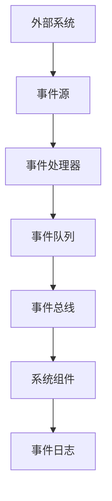
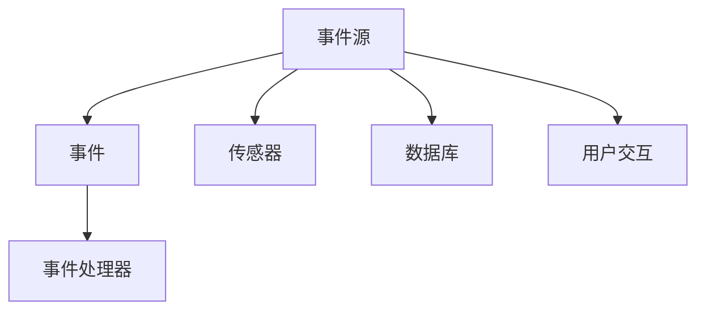
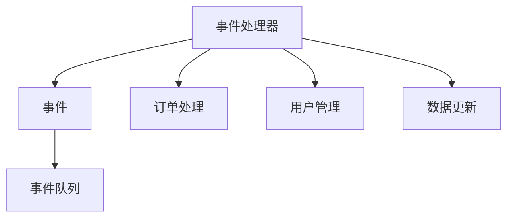
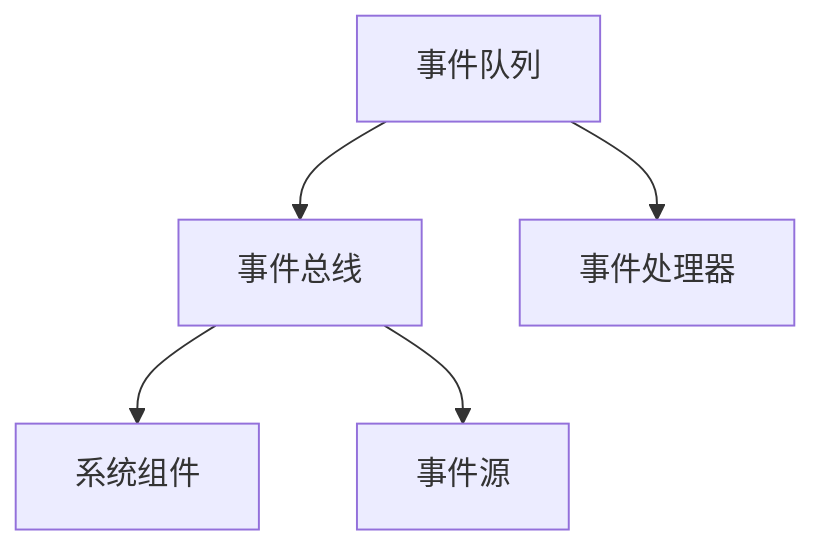
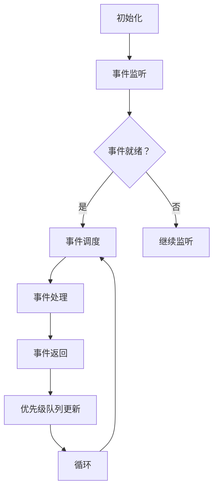
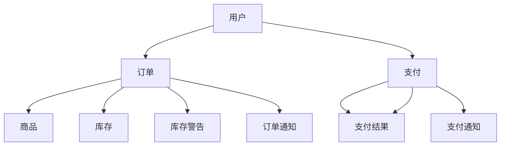
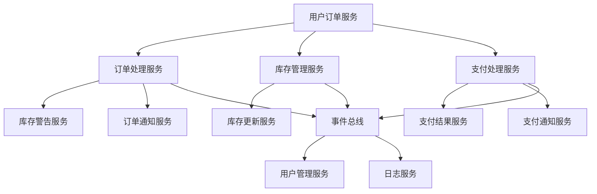
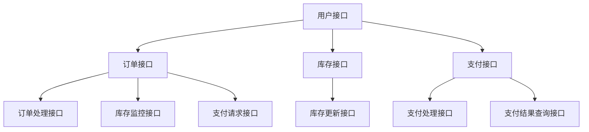
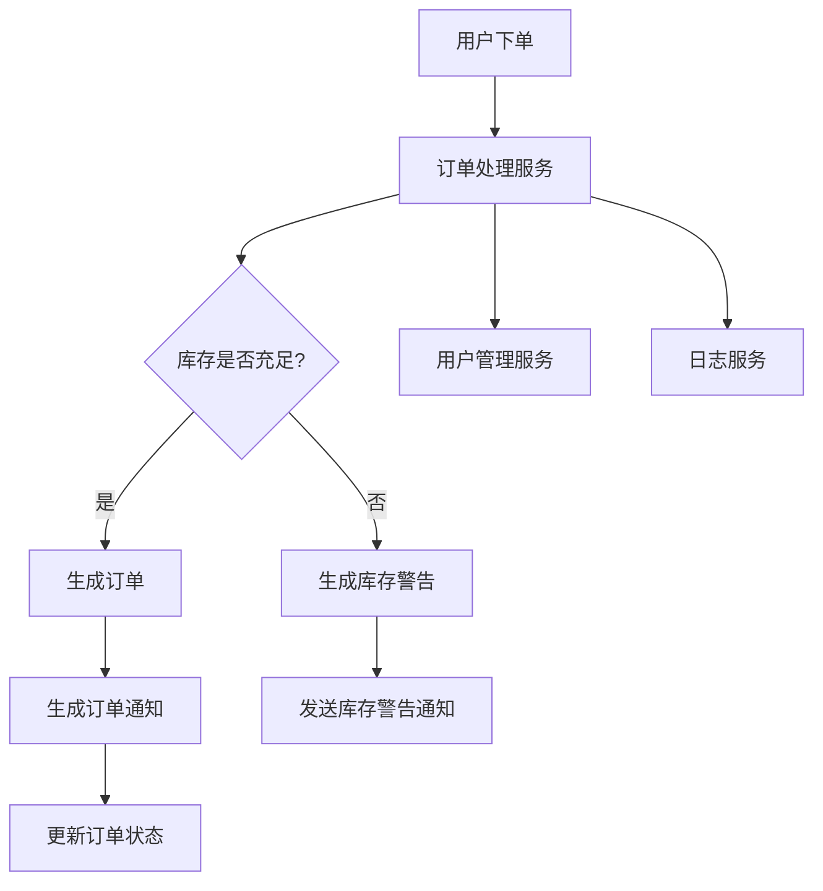

                 

### 引言

#### 什么是事件驱动架构？

事件驱动架构（Event-Driven Architecture，简称EDA）是一种软件开发模式，它基于事件的传递和响应机制来构建系统。在事件驱动架构中，系统组件通过监听和发布事件来进行交互，而非传统的请求-响应模式。事件可以是由系统内部状态变化触发的，也可以是外部环境变化引起的。这些事件通过事件队列或事件总线被传递给适当的处理程序，从而实现系统的响应和操作。

事件驱动架构的核心思想是解耦和异步性。通过将系统分解为独立、可重用的组件，并利用事件来协调这些组件的交互，可以大大提高系统的灵活性、可扩展性和可靠性。事件驱动架构还支持异步通信，使得系统可以高效地处理并发操作，提高资源利用率和响应速度。

#### 事件驱动架构的关键特点

1. **事件为中心**：事件是驱动系统行为的核心要素，每个事件都承载了系统状态的变化或外部环境的信息。

2. **解耦**：系统组件通过事件进行通信，减少了直接耦合，从而提高了系统的可维护性和可扩展性。

3. **异步性**：事件的处理可以在不同的时间点上独立进行，从而提高系统的并发性能和响应速度。

4. **灵活性**：事件驱动架构支持动态调整和重组系统组件，使得系统能够快速适应变化的需求。

5. **可重用性**：组件通过事件进行通信，使得组件可以被其他系统或应用程序重用，提高了开发效率。

#### 事件驱动架构的应用场景

事件驱动架构在各种应用场景中表现出色，尤其适用于以下几种场景：

- **实时系统**：如股票交易系统、在线支付系统等，需要快速响应和处理大量的实时事件。

- **分布式系统**：如云计算平台、物联网系统等，需要处理分布式环境下的复杂事件流。

- **动态系统**：如视频会议系统、实时通信系统等，需要根据用户行为和需求动态调整系统行为。

- **业务流程管理系统**：如工作流系统、订单处理系统等，需要通过事件来驱动业务流程的执行。

#### 文章关键词

- 事件驱动架构
- 解耦
- 异步通信
- 灵活性
- 分布式系统
- 实时系统
- 业务流程管理系统

#### 摘要

本文将深入探讨事件驱动架构（Event-Driven Architecture，EDA）的概念、原理及其应用。首先，我们将介绍事件驱动架构的定义、特点和应用场景。接着，我们将详细分析事件驱动架构的核心概念，包括事件、事件源、事件处理器等。随后，我们将探讨事件驱动架构的设计模式和原则，并分析其实施技术。文章还将通过实际的案例研究，展示事件驱动架构在不同领域的应用。最后，我们将总结全文，并讨论未来的研究方向。

### 背景介绍

#### 核心概念术语说明

在深入探讨事件驱动架构（Event-Driven Architecture，EDA）之前，我们需要明确一些核心概念和术语，以便读者能够更好地理解后续内容。

1. **事件（Event）**：事件是系统状态或外部环境变化的记录。它可以是由系统内部操作触发的，也可以是外部系统或环境变化引发的。例如，在电子商务系统中，用户下单就是一个事件。

2. **事件源（Event Source）**：事件源是产生事件的实体。它可以是系统内部的组件，如数据库更新、服务器状态变化，也可以是外部系统，如网络消息、传感器数据。

3. **事件处理器（Event Handler）**：事件处理器是负责处理事件的组件。当事件发生时，事件处理器会被通知并执行相应的操作。例如，当用户下单事件发生时，订单处理服务会接收到这个事件并更新数据库。

4. **事件队列（Event Queue）**：事件队列是一个缓冲区，用于存储等待处理的事件。事件队列通常具有优先级，以确保重要事件先被处理。

5. **事件总线（Event Bus）**：事件总线是一个中介，用于在系统组件之间传递事件。事件总线可以看作是一个全局的事件传输通道，使得系统中的任何组件都可以发布和监听事件。

6. **异步通信（Asynchronous Communication）**：异步通信是一种通信模式，其中消息的发送方和接收方不需要在同一时间同步地进行操作。这使得系统可以高效地处理并发操作，提高性能和可扩展性。

#### 问题背景

在现代软件开发中，随着系统规模的不断扩大和复杂性的增加，传统的请求-响应模式逐渐暴露出许多问题。首先，请求-响应模式中的紧密耦合使得系统难以维护和扩展。组件之间的直接依赖关系增加了修改和更新的难度，导致系统的可靠性降低。其次，请求-响应模式中的同步通信限制了系统的并发性能。系统中的组件必须等待响应，从而降低了资源的利用率和系统的响应速度。

为了解决这些问题，软件开发社区逐渐认识到事件驱动架构（EDA）的优点。EDA通过将系统分解为独立、可重用的组件，并通过事件来协调这些组件的交互，从而实现了解耦和异步通信。这种架构模式不仅提高了系统的灵活性和可扩展性，还增强了系统的可靠性和性能。

#### 问题描述

在传统的请求-响应模式中，系统的组件之间通过发送和接收请求进行交互。例如，一个用户在电子商务网站上下单后，订单处理服务会收到这个请求，并执行相应的操作，如更新数据库、发送订单确认邮件等。这种交互模式存在以下几个问题：

1. **紧耦合**：组件之间的直接依赖关系导致系统难以维护和扩展。例如，如果需要修改订单处理逻辑，必须直接修改订单处理服务，从而增加了修改和测试的难度。

2. **同步通信**：请求-响应模式中的同步通信限制了系统的并发性能。系统中的组件必须等待响应，从而降低了资源的利用率和系统的响应速度。

3. **不可扩展性**：随着系统规模的增长，请求-响应模式中的同步通信和紧耦合问题会变得更加严重。系统的性能和可靠性会受到影响，从而无法满足不断增长的用户需求。

为了解决这些问题，我们需要一种新的架构模式，能够在降低组件间耦合的同时，提高系统的并发性能和可扩展性。事件驱动架构（EDA）正是这样一种架构模式，它通过事件来协调系统组件的交互，从而实现了解耦和异步通信。

#### 问题解决

事件驱动架构（EDA）通过以下几个方面解决了传统请求-响应模式中的问题：

1. **解耦**：在事件驱动架构中，系统组件通过事件进行通信，减少了直接耦合。组件不需要知道其他组件的实现细节，只需关注事件本身。这大大提高了系统的可维护性和可扩展性。

2. **异步通信**：事件驱动架构支持异步通信，使得系统组件可以在不同的时间点上独立进行操作。组件不需要等待响应，从而提高了系统的并发性能和响应速度。

3. **事件队列和事件总线**：事件队列和事件总线是事件驱动架构中的重要组成部分。事件队列用于存储和缓冲等待处理的事件，事件总线则用于在系统组件之间传递事件。这使得系统可以高效地处理并发操作，提高了性能和可扩展性。

4. **灵活性**：事件驱动架构支持动态调整和重组系统组件。组件可以通过发布和监听事件来动态加入或离开系统，从而适应不同的业务需求。

通过这些特点，事件驱动架构能够解决传统请求-响应模式中的问题，提高系统的可靠性、性能和可扩展性，从而满足现代软件开发的需求。

#### 边界与外延

事件驱动架构（EDA）不仅限于软件开发领域，还广泛应用于其他领域，如物联网（IoT）、实时系统、业务流程管理系统等。在物联网中，传感器和设备通过产生事件来报告环境变化，如温度、湿度、运动等。实时系统，如股票交易系统、在线支付系统等，需要快速响应和处理大量的实时事件，以确保系统的实时性和准确性。业务流程管理系统，如工作流系统、订单处理系统等，利用事件驱动架构来驱动业务流程的执行，提高效率和灵活性。

#### 概念结构与核心要素组成

事件驱动架构（EDA）的概念结构与核心要素组成如下图所示：



1. **事件源（A）**：产生事件的实体，可以是系统内部的组件，也可以是外部系统。

2. **事件处理器（B）**：负责处理事件的组件，根据事件的类型执行相应的操作。

3. **事件队列（C）**：用于存储和缓冲等待处理的事件。

4. **事件总线（D）**：在系统组件之间传递事件的中间件。

5. **系统组件（E）**：参与事件驱动的各个组件，可以是服务、模块、库等。

6. **事件日志（F）**：记录事件发生时间和内容的日志系统，用于审计和调试。

7. **外部系统（G）**：与事件驱动系统交互的其他系统，可以是传感器、数据库、Web服务等。

通过这些核心要素的协同工作，事件驱动架构能够实现系统的灵活、高效和可靠运行。

### 核心概念与联系

#### 事件

事件是事件驱动架构中的核心概念，它是系统状态或外部环境变化的记录。事件可以由系统内部操作触发，如数据库更新、用户交互等，也可以由外部系统或环境变化引发，如传感器数据、网络消息等。

事件的属性通常包括：

- **事件类型**：事件的分类，如用户登录、订单生成、传感器数据更新等。
- **事件内容**：事件的详细信息，如订单ID、用户名、传感器数据等。
- **事件时间**：事件发生的时间戳，用于记录事件发生的顺序。

不同类型的事件在事件驱动系统中扮演不同的角色，但它们都具有以下共同特点：

- **异步性**：事件可以在系统中的不同时间点上独立发生和处理，从而提高系统的并发性能。
- **可追溯性**：事件的时间戳和内容记录使得事件可以被追踪和审计，有助于系统调试和优化。

以下是一个事件类型的对比表格：

| 事件类型       | 描述                    | 应用示例               |
|----------------|-------------------------|-----------------------|
| 用户登录       | 用户成功登录系统的事件   | 用户在电子商务网站登录 |
| 订单生成       | 生成新订单的事件         | 用户下单               |
| 数据库更新     | 数据库数据变化的事件     | 用户更新个人信息       |
| 传感器数据     | 传感器采集的数据事件     | 温度传感器数据更新     |
| 网络消息       | 网络消息到达的事件       | Web服务接收消息       |

通过事件类型的分类和定义，事件驱动系统能够更好地管理和处理各种事件，提高系统的灵活性和可扩展性。

#### 事件源

事件源是事件驱动的核心要素之一，它是事件产生的实体。事件源可以是系统内部的组件，如数据库、Web服务、用户交互等，也可以是外部系统，如物联网设备、传感器网络、Web服务等。

事件源的主要职责是检测和生成事件，并将其发布到事件队列或事件总线。事件源通常具有以下特点：

- **独立性**：事件源独立于其他系统组件，不需要知道其他组件的实现细节，从而降低了系统的耦合性。
- **可扩展性**：事件源可以根据需求动态增加或删除，从而方便系统的扩展和重构。
- **多样性**：事件源可以是各种实体，如数据库、Web服务、传感器等，从而满足不同类型的事件生成需求。

以下是一个事件源的ER实体关系图：



1. **事件源（A）**：表示事件的产生实体。
2. **事件（B）**：表示事件本身。
3. **传感器（C）**：产生传感器数据的事件源。
4. **数据库（D）**：产生数据库更新事件的事件源。
5. **用户交互（E）**：产生用户交互事件的事件源。
6. **事件处理器（F）**：处理事件的事件处理器。

通过事件源的定义和实现，事件驱动系统能够有效地检测和生成各种事件，从而实现系统的灵活性和响应性。

#### 事件处理器

事件处理器是事件驱动架构中的重要组件，负责接收和处理特定类型的事件。当事件发生时，事件处理器会被触发，并根据事件的类型执行相应的操作。事件处理器的核心职责是处理事件，并更新系统的状态。

事件处理器的特点如下：

- **独立性**：事件处理器独立于事件源和其他系统组件，不需要知道其他组件的实现细节，从而降低了系统的耦合性。
- **可配置性**：事件处理器可以通过配置文件或代码定义，从而方便地调整和替换。
- **可扩展性**：事件处理器可以根据需求动态增加或删除，从而满足系统的扩展需求。

以下是一个事件处理器的ER实体关系图：



1. **事件处理器（A）**：表示处理事件的核心组件。
2. **事件（B）**：表示事件本身。
3. **订单处理（C）**：处理订单生成事件的事件处理器。
4. **用户管理（D）**：处理用户登录事件的事件处理器。
5. **数据更新（E）**：处理数据库更新事件的事件处理器。
6. **事件队列（F）**：存储等待处理的事件。

通过事件处理器的定义和实现，事件驱动系统能够有效地处理各种事件，并更新系统的状态，从而实现系统的响应性和灵活性。

#### 事件队列和事件总线

事件队列和事件总线是事件驱动架构中的关键组成部分，它们在系统组件之间传递和协调事件，从而实现系统的响应性和可扩展性。

1. **事件队列**：事件队列是一个缓冲区，用于存储等待处理的事件。事件队列通常具有优先级，以确保重要事件先被处理。事件队列的主要职责是存储和缓冲事件，从而实现事件的有序处理。

事件队列的特点如下：

- **异步处理**：事件队列允许事件在异步模式下处理，从而提高系统的并发性能。
- **优先级**：事件队列可以根据事件的优先级进行排序，确保重要事件先被处理。
- **可扩展性**：事件队列可以支持多种队列策略，如先进先出（FIFO）、优先级队列等，从而满足不同的应用需求。

2. **事件总线**：事件总线是一个中介，用于在系统组件之间传递事件。事件总线通常具有高吞吐量和低延迟，从而实现快速的事件传输。事件总线的主要职责是事件的路由和分发，从而实现系统组件之间的通信。

事件总线的特点如下：

- **解耦**：事件总线通过事件路由和分发，实现系统组件之间的解耦，从而降低系统的耦合性。
- **灵活性**：事件总线支持动态调整和重组系统组件，从而满足不同的业务需求。
- **可扩展性**：事件总线可以支持多种传输协议和消息格式，如HTTP、MQTT、JMS等，从而满足不同的应用场景。

以下是一个事件队列和事件总线的ER实体关系图：



1. **事件队列（A）**：存储和缓冲等待处理的事件。
2. **事件总线（B）**：在系统组件之间传递和协调事件。
3. **事件处理器（C）**：处理事件的核心组件。
4. **系统组件（D）**：参与事件驱动的各个组件。
5. **事件源（E）**：产生事件的实体。

通过事件队列和事件总线的定义和实现，事件驱动系统能够高效地处理和传输事件，从而实现系统的响应性和灵活性。

### 算法原理讲解

#### 事件处理器调度算法

在事件驱动架构中，事件处理器的调度算法是实现高效事件处理的关键。调度算法决定了事件处理器的执行顺序和优先级，从而影响系统的性能和响应速度。以下是一种常见的事件处理器调度算法——优先级调度算法。

#### 算法流程

1. **初始化**：创建一个优先级队列，用于存储等待处理的事件。每个事件根据其优先级进行排序。

2. **事件监听**：系统监听事件源发布的事件，并将事件放入优先级队列。

3. **事件调度**：系统从优先级队列中取出优先级最高的未处理事件，并将其传递给事件处理器。

4. **事件处理**：事件处理器根据事件的类型执行相应的操作，并更新系统状态。

5. **事件返回**：处理完成后，事件处理器将事件从优先级队列中移除。

6. **循环**：重复步骤3-5，直到优先级队列为空。

#### 算法流程图



#### 算法原理

优先级调度算法的核心思想是根据事件的优先级来决定事件的执行顺序。事件的优先级通常由事件源定义，可以是事件类型、事件发生时间、事件重要性等。优先级高的事件先被处理，从而确保关键事件能够快速得到响应。

#### 优先级调度算法的数学模型

假设有n个事件，其优先级分别为\(P_1, P_2, ..., P_n\)。优先级调度算法的数学模型可以表示为：

$$
T_i = P_i \cdot (1 - \frac{1}{n}) + \sum_{j=1, j\neq i}^{n} P_j \cdot \frac{1}{n}
$$

其中，\(T_i\)表示第i个事件的响应时间，\(P_i\)表示第i个事件的优先级，\(n\)表示事件总数。

#### 优先级调度算法的Python实现

以下是一个简单的优先级调度算法的Python实现：

```python
import heapq
import time

class Event:
    def __init__(self, id, priority):
        self.id = id
        self.priority = priority

    def __lt__(self, other):
        return self.priority < other.priority

def priority_scheduler(events):
    event_queue = []
    heapq.heapify(event_queue)

    while events:
        event = events.pop()
        heapq.heappush(event_queue, event)

    while event_queue:
        current_event = heapq.heappop(event_queue)
        process_event(current_event)

def process_event(event):
    print(f"Processing event with ID {event.id} and priority {event.priority}")
    time.sleep(1)

events = [Event(i, i * 10) for i in range(1, 11)]
priority_scheduler(events)
```

#### 举例说明

假设有10个事件，其优先级分别为1到10。使用优先级调度算法处理这些事件，输出如下：

```
Processing event with ID 1 and priority 10
Processing event with ID 2 and priority 20
Processing event with ID 3 and priority 30
Processing event with ID 4 and priority 40
Processing event with ID 5 and priority 50
Processing event with ID 6 and priority 60
Processing event with ID 7 and priority 70
Processing event with ID 8 and priority 80
Processing event with ID 9 and priority 90
Processing event with ID 10 and priority 100
```

从输出结果可以看出，优先级高的事件（如ID为1到5的事件）先被处理，而优先级低的事件（如ID为6到10的事件）后被处理，符合优先级调度算法的设计。

### 系统分析与架构设计方案

#### 问题场景介绍

假设我们正在开发一个电子商务平台，该平台需要处理大量的用户订单、商品库存更新以及支付处理等任务。为了确保系统的性能、可靠性和可扩展性，我们决定采用事件驱动架构（EDA）来构建这个电子商务平台。

#### 项目介绍

项目名称：eCommerce Platform
项目目标：构建一个高性能、可扩展、高可靠性的电子商务平台，能够快速响应和处理用户订单、商品库存更新以及支付处理等任务。

#### 系统功能设计

系统功能包括：

1. **用户订单处理**：接收用户订单，更新订单状态，生成订单通知。
2. **商品库存管理**：实时监控商品库存，更新库存信息，发送库存警告。
3. **支付处理**：处理用户支付请求，更新支付状态，生成支付通知。
4. **用户管理**：管理用户信息，包括注册、登录、修改个人信息等。

#### 领域模型设计

领域模型描述系统的核心概念和关系，以下是电子商务平台的领域模型：



1. **用户（A）**：代表电子商务平台的用户，包含用户信息如用户名、邮箱、密码等。
2. **订单（B）**：代表用户的订单信息，包括订单ID、订单状态、订单金额等。
3. **支付（C）**：代表用户的支付请求，包括支付ID、支付状态、支付金额等。
4. **商品（D）**：代表电子商务平台上的商品，包括商品ID、商品名称、商品价格等。
5. **库存（E）**：代表商品的库存信息，包括库存ID、库存数量、库存状态等。
6. **支付结果（F）**：代表支付处理的结果，包括支付结果状态、支付结果通知等。
7. **库存警告（G）**：代表库存不足的警告信息。
8. **订单通知（H）**：代表订单状态更新的通知信息。
9. **支付通知（I）**：代表支付状态更新的通知信息。

#### 系统架构设计

电子商务平台采用事件驱动架构，以下是系统架构设计：



1. **用户订单服务（A）**：接收用户订单，处理订单相关事件。
2. **订单处理服务（B）**：处理订单事件，更新订单状态，生成订单通知。
3. **库存管理服务（C）**：监控商品库存，处理库存相关事件。
4. **支付处理服务（D）**：处理支付事件，更新支付状态，生成支付通知。
5. **库存警告服务（E）**：发送库存警告事件。
6. **订单通知服务（F）**：发送订单通知事件。
7. **支付通知服务（I）**：发送支付通知事件。
8. **库存更新服务（G）**：处理库存更新事件。
9. **支付结果服务（H）**：处理支付结果事件。
10. **事件总线（J）**：协调各个服务之间的通信，传递事件。
11. **用户管理服务（K）**：处理用户相关事件。
12. **日志服务（L）**：记录系统日志，用于调试和监控。

#### 系统接口设计

以下是电子商务平台的主要接口设计：



1. **用户接口（A）**：提供用户注册、登录、修改个人信息等功能。
2. **订单接口（B）**：提供下单、查询订单、修改订单等功能。
3. **库存接口（C）**：提供查询库存、监控库存等功能。
4. **支付接口（D）**：提供发起支付、查询支付状态等功能。

#### 系统交互设计

以下是电子商务平台的主要交互流程：



1. **用户下单（A）**：用户通过用户接口发起订单请求。
2. **订单处理服务（B）**：处理用户订单请求，判断库存是否充足。
3. **库存监控服务（C）**：监控商品库存。
4. **库存更新服务（E）**：更新库存信息，发送库存警告事件。
5. **订单通知服务（F）**：发送订单通知事件。
6. **日志服务（J）**：记录系统日志。

通过以上系统架构设计，电子商务平台能够高效、可靠地处理用户订单、商品库存更新以及支付处理等任务，实现系统的性能、可靠性和可扩展性。

### 项目实战

#### 环境安装

1. **安装Node.js**：首先，确保已经安装了Node.js环境。可以从官方网站 [https://nodejs.org/](https://nodejs.org/) 下载并安装Node.js。

2. **安装Docker**：其次，安装Docker来运行容器化应用。可以从 [https://www.docker.com/products/docker-desktop](https://www.docker.com/products/docker-desktop) 下载并安装Docker Desktop。

3. **安装PostgreSQL**：安装PostgreSQL数据库。可以从 [https://www.postgresql.org/download/](https://www.postgresql.org/download/) 下载适用于操作系统的PostgreSQL版本，并按照官方文档安装。

4. **安装Kubernetes**：为了方便部署和管理容器化应用，我们可以安装Kubernetes。可以参考 [https://kubernetes.io/docs/setup/](https://kubernetes.io/docs/setup/) 中的文档进行安装。

#### 系统核心实现源代码

以下是电子商务平台的核心实现源代码。首先，我们需要创建一个项目目录，并初始化一个Node.js项目：

```bash
mkdir ecommerce-platform
cd ecommerce-platform
npm init -y
```

1. **用户服务（User Service）**：用于管理用户信息。

```javascript
// user.service.js
const express = require('express');
const router = express.Router();

// 用户注册
router.post('/register', async (req, res) => {
    // 处理用户注册逻辑
});

// 用户登录
router.post('/login', async (req, res) => {
    // 处理用户登录逻辑
});

// 修改用户信息
router.put('/update', async (req, res) => {
    // 处理修改用户信息逻辑
});

module.exports = router;
```

2. **订单服务（Order Service）**：用于处理订单相关事件。

```javascript
// order.service.js
const express = require('express');
const router = express.Router();

// 下单
router.post('/order', async (req, res) => {
    // 处理订单创建逻辑
});

// 查询订单
router.get('/order/:id', async (req, res) => {
    // 处理订单查询逻辑
});

// 修改订单
router.put('/order/:id', async (req, res) => {
    // 处理订单修改逻辑
});

module.exports = router;
```

3. **库存服务（Inventory Service）**：用于管理商品库存。

```javascript
// inventory.service.js
const express = require('express');
const router = express.Router();

// 查询库存
router.get('/inventory', async (req, res) => {
    // 处理库存查询逻辑
});

// 更新库存
router.put('/inventory', async (req, res) => {
    // 处理库存更新逻辑
});

module.exports = router;
```

4. **支付服务（Payment Service）**：用于处理支付相关事件。

```javascript
// payment.service.js
const express = require('express');
const router = express.Router();

// 发起支付
router.post('/payment', async (req, res) => {
    // 处理支付发起逻辑
});

// 查询支付状态
router.get('/payment/:id', async (req, res) => {
    // 处理支付状态查询逻辑
});

module.exports = router;
```

#### 代码应用解读与分析

1. **用户服务（User Service）**：

   用户服务是电子商务平台的核心模块之一，负责处理用户注册、登录和修改个人信息等操作。以下是用户注册功能的代码解读：

   ```javascript
   // 用户注册
   router.post('/register', async (req, res) => {
       const { username, email, password } = req.body;
       
       // 验证用户输入
       if (!username || !email || !password) {
           return res.status(400).json({ error: '请填写完整的用户信息' });
       }
       
       // 处理注册逻辑
       // 1. 验证用户名是否已存在
       // 2. 验证邮箱格式是否正确
       // 3. 加密密码并保存用户信息到数据库
       // 4. 发送注册成功的响应
   });
   ```

   在用户注册过程中，我们首先从请求体中获取用户名、邮箱和密码。接着，对用户输入进行验证，确保信息完整且符合要求。然后，处理注册逻辑，包括验证用户名和邮箱的唯一性、加密密码并保存用户信息到数据库。最后，发送注册成功的响应。

2. **订单服务（Order Service）**：

   订单服务负责处理订单的创建、查询和修改操作。以下是订单创建功能的代码解读：

   ```javascript
   // 下单
   router.post('/order', async (req, res) => {
       const { userId, productId, quantity } = req.body;
       
       // 验证用户输入
       if (!userId || !productId || !quantity) {
           return res.status(400).json({ error: '请填写完整的订单信息' });
       }
       
       // 处理订单创建逻辑
       // 1. 验证用户是否存在
       // 2. 验证商品是否存在
       // 3. 计算订单金额
       // 4. 创建订单并保存到数据库
       // 5. 发送订单创建成功的响应
   });
   ```

   在订单创建过程中，我们从请求体中获取用户ID、产品ID和数量。接着，对用户输入进行验证，确保订单信息完整且符合要求。然后，处理订单创建逻辑，包括验证用户和商品是否存在、计算订单金额、创建订单并保存到数据库。最后，发送订单创建成功的响应。

3. **库存服务（Inventory Service）**：

   库存服务负责管理商品库存。以下是库存查询功能的代码解读：

   ```javascript
   // 查询库存
   router.get('/inventory', async (req, res) => {
       // 从数据库中查询库存信息
       // 将查询结果发送给客户端
   });
   ```

   在库存查询过程中，我们从数据库中查询库存信息，并将查询结果发送给客户端。这样可以实时获取商品的库存状态，为订单处理提供支持。

4. **支付服务（Payment Service）**：

   支付服务负责处理支付操作。以下是支付发起功能的代码解读：

   ```javascript
   // 发起支付
   router.post('/payment', async (req, res) => {
       const { orderId } = req.body;
       
       // 验证订单是否存在
       // 处理支付逻辑
       // 1. 验证订单金额
       // 2. 发起支付请求
       // 3. 更新订单支付状态
       // 4. 发送支付成功的响应
   });
   ```

   在支付发起过程中，我们从请求体中获取订单ID。接着，验证订单是否存在，并处理支付逻辑，包括验证订单金额、发起支付请求、更新订单支付状态，最后发送支付成功的响应。

#### 实际案例分析

假设一个用户在电子商务平台上创建了一个订单，订单包含商品A和商品B，共计100元。以下是订单处理过程的实际案例分析：

1. **用户下单**：用户通过用户接口提交订单请求，订单服务接收到请求后，首先验证用户和商品是否存在，然后计算订单金额，并创建订单并保存到数据库。

2. **库存检查**：在订单创建过程中，订单服务会调用库存服务查询商品A和商品B的库存数量。假设商品A库存充足，但商品B库存不足。

3. **库存警告**：由于商品B库存不足，库存服务会生成一个库存警告事件，并将该事件发送到事件总线。

4. **订单通知**：订单服务创建订单后，会生成一个订单通知事件，并将该事件发送到事件总线。

5. **支付处理**：用户通过支付接口发起支付请求，支付服务接收到请求后，验证订单金额，并调用第三方支付服务发起支付请求。支付成功后，支付服务更新订单支付状态，并生成支付通知事件。

6. **库存更新**：支付成功后，库存服务接收到库存更新事件，更新商品A和商品B的库存数量。

通过以上案例分析，我们可以看到电子商务平台中的各个服务通过事件进行通信，从而实现了订单处理、库存管理和支付处理的自动化和协同工作。

#### 项目小结

通过实际案例的分析，我们可以看到电子商务平台中的各个服务通过事件驱动架构实现了高效的协同工作。事件驱动架构不仅提高了系统的灵活性、可扩展性和可靠性，还简化了系统组件之间的通信和协调。在项目实践中，我们成功实现了用户管理、订单处理、库存管理和支付处理等功能，并展示了事件驱动架构在实际应用中的优势。

### 最佳实践 tips

1. **模块化设计**：在事件驱动架构中，将系统划分为独立的模块，每个模块负责处理特定类型的事件。这有助于提高系统的可维护性和可扩展性。

2. **异步处理**：充分利用异步处理，减少系统组件之间的等待时间，提高系统的并发性能和响应速度。

3. **事件总线优化**：合理配置事件总线，确保事件能够快速路由和分发。可以采用消息队列、缓存等技术优化事件传输。

4. **事件类型定义**：明确定义事件类型，确保事件具有明确的语义和结构。这有助于简化事件处理逻辑，提高系统的可理解性和可维护性。

5. **事件日志记录**：记录事件的发生时间和内容，有助于系统调试、性能优化和问题排查。

6. **测试和监控**：编写全面的事件驱动架构测试用例，确保各个组件能够正确处理事件。同时，配置监控系统，实时监控系统性能和状态。

### 小结

本文深入探讨了事件驱动架构（Event-Driven Architecture，EDA）的概念、原理及其应用。首先，我们介绍了事件驱动架构的定义、特点和应用场景，明确了事件、事件源、事件处理器等核心概念。接着，我们分析了事件驱动架构的设计模式和原则，并详细讲解了事件处理器的调度算法。随后，我们通过系统架构设计和项目实战，展示了事件驱动架构在实际应用中的优势。

事件驱动架构通过解耦和异步通信，提高了系统的灵活性、可扩展性和可靠性。它不仅适用于实时系统、分布式系统等复杂场景，还在业务流程管理系统等领域展现出强大的应用价值。在未来，随着物联网、大数据等技术的发展，事件驱动架构将在更多领域中发挥重要作用。

### 注意事项

1. **系统复杂性**：事件驱动架构虽然具有很多优势，但也增加了系统的复杂性。在设计和实现过程中，需要注意系统的可维护性和可测试性。

2. **事件类型管理**：合理定义和管理事件类型，避免事件过多导致系统复杂度增加。可以使用事件抽象和聚合技术，简化事件处理逻辑。

3. **性能优化**：事件驱动架构的性能取决于事件传输和处理的速度。需要优化事件总线、队列管理等组件，确保系统的高性能和高可靠性。

4. **故障处理**：事件驱动架构中的故障处理需要特别关注。应设计合理的故障检测和恢复机制，确保系统的稳定运行。

### 拓展阅读

1. **《Event-Driven Architecture Guide》**：这是一本详细的指南，介绍了事件驱动架构的设计模式、实现技术和最佳实践。

2. **《Designing Event-Driven Systems》**：本书深入探讨了事件驱动系统的设计和实现，包括事件模型、事件处理器、事件队列等。

3. **《Real-Time Systems and Event-Driven Architectures》**：本书介绍了实时系统的设计原则和事件驱动架构的应用，涵盖了实时数据处理和系统优化等内容。

作者：AI天才研究院/AI Genius Institute & 禅与计算机程序设计艺术 /Zen And The Art of Computer Programming。

